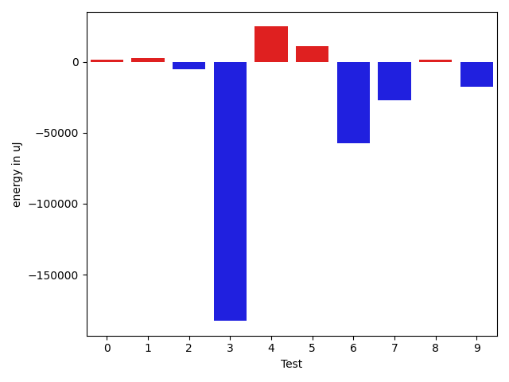
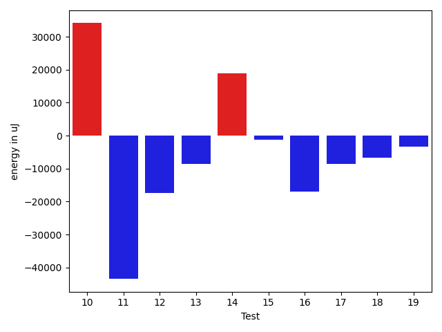
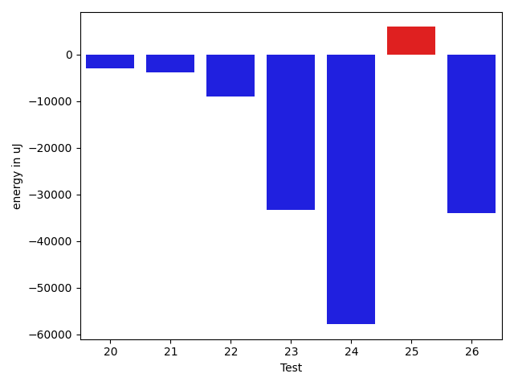

# gson 55acc2

https://github.com/google/gson/commit/55acc2

## Delta Energy per test method

| ID | EnergyV1 | EnergyV2 | DeltaEnergy | σV1 | %σV1 | σV2 | %σV2 |
| --- | --- | --- | --- | --- | --- | --- | --- |
| 0 | 168152 | 183349 | 15197 | 95274.93 | 56.66 | 577485.36 | 314.97 |
| 1 | 193054 | 173767 | -19287 | 46920.21 | 24.30 | 47101.45 | 27.11 |
| 2 | 222412 | 268004 | 45592 | 103467.00 | 46.52 | 80816.96 | 30.16 |
| 3 | 209350 | 187194 | -22156 | 766578.94 | 366.17 | 108240.18 | 57.82 |
| 4 | 286437 | 257812 | -28625 | 55244.69 | 19.29 | 773603.73 | 300.07 |
| 5 | 265197 | 212341 | -52856 | 95147.07 | 35.88 | 66977.65 | 31.54 |
| 6 | 595946 | 665770 | 69824 | 124272.67 | 20.85 | 143111.00 | 21.50 |
| 7 | 207642 | 230896 | 23254 | 52935.84 | 25.49 | 75899.83 | 32.87 |
| 8 | 353087 | 331237 | -21850 | 750890.04 | 212.66 | 68998.46 | 20.83 |
| 9 | 188415 | 176330 | -12085 | 95324.65 | 50.59 | 98123.09 | 55.65 |
| 10 | 181152 | 192016 | 10864 | 590163.55 | 325.78 | 45477.03 | 23.68 |
| 11 | 404662 | 363341 | -41321 | 114940.60 | 28.40 | 47306.87 | 13.02 |
| 12 | 744016 | 723448 | -20568 | 95799.80 | 12.88 | 637221.94 | 88.08 |
| 13 | 421752 | 353515 | -68237 | 703743.32 | 166.86 | 86561.71 | 24.49 |
| 14 | 324890 | 386962 | 62072 | 542225.92 | 166.90 | 95914.96 | 24.79 |
| 15 | 85510 | 85143 | -367 | 24045.26 | 28.12 | 30923.83 | 36.32 |
| 16 | 85815 | 115906 | 30091 | 43220.74 | 50.37 | 35948.13 | 31.01 |
| 17 | 89539 | 117187 | 27648 | 33847.09 | 37.80 | 380720.77 | 324.88 |
| 18 | 91004 | 96314 | 5310 | 29824.19 | 32.77 | 30354.09 | 31.52 |
| 19 | 223144 | 209838 | -13306 | 79297.53 | 35.54 | 130054.75 | 61.98 |
| 20 | 234009 | 167236 | -66773 | 43935.15 | 18.77 | 651669.86 | 389.67 |
| 21 | 168151 | 166198 | -1953 | 53984.21 | 32.10 | 55274.76 | 33.26 |
| 22 | 205199 | 200134 | -5065 | 572133.99 | 278.82 | 635210.10 | 317.39 |
| 23 | 238220 | 275512 | 37292 | 32731.49 | 13.74 | 207673.60 | 75.38 |
| 24 | 379210 | 420165 | 40955 | 595813.79 | 157.12 | 158641.66 | 37.76 |
| 25 | 347472 | 461730 | 114258 | 151140.82 | 43.50 | 873681.30 | 189.22 |
| 26 | 722777 | 606261 | -116516 | 96353.23 | 13.33 | 78463.63 | 12.94 |

## Misc.

| ID | Test Class | Test Method |
| --- | --- | --- |
| 0 | com.google.gson.functional.InheritanceTest | testBaseSerializedAsBaseWhenSpecifiedWithExplicitType |
| 1 | com.google.gson.functional.InheritanceTest | testBaseSerializedAsSubWhenSpecifiedWithExplicitType |
| 2 | com.google.gson.functional.InheritanceTest | testClassWithBaseArrayFieldSerialization |
| 3 | com.google.gson.functional.InheritanceTest | testBaseSerializedAsSub |
| 4 | com.google.gson.functional.InheritanceTest | testClassWithBaseCollectionFieldSerialization |
| 5 | com.google.gson.functional.InheritanceTest | testClassWithBaseFieldSerialization |
| 6 | com.google.gson.functional.MapTest | testInterfaceTypeMapWithSerializer |
| 7 | com.google.gson.functional.JsonTreeTest | testJsonTreeNull |
| 8 | com.google.gson.functional.JsonTreeTest | testJsonTreeToString |
| 9 | com.google.gson.functional.JsonTreeTest | testToJsonTreeObjectType |
| 10 | com.google.gson.functional.JsonTreeTest | testToJsonTree |
| 11 | com.google.gson.functional.MapAsArrayTypeAdapterTest | testMultipleEnableComplexKeyRegistrationHasNoEffect |
| 12 | com.google.gson.functional.MapAsArrayTypeAdapterTest | testSerializeComplexMapWithTypeAdapter |
| 13 | com.google.gson.functional.MapAsArrayTypeAdapterTest | testMapWithTypeVariableSerialization |
| 14 | com.google.gson.functional.ExclusionStrategyFunctionalTest | testExclusionStrategyWithMode |
| 15 | com.google.gson.internal.bind.JsonTreeWriterTest | testSerializeNullsFalse |
| 16 | com.google.gson.internal.bind.JsonTreeWriterTest | testSerializeNullsTrue |
| 17 | com.google.gson.internal.bind.JsonTreeWriterTest | testNestedObject |
| 18 | com.google.gson.internal.bind.JsonTreeWriterTest | testObject |
| 19 | com.google.gson.functional.CustomSerializerTest | testSubClassSerializerInvokedForBaseClassFieldsHoldingSubClassInstances |
| 20 | com.google.gson.functional.CustomSerializerTest | testBaseClassSerializerInvokedForBaseClassFieldsHoldingSubClassInstances |
| 21 | com.google.gson.functional.CustomSerializerTest | testBaseClassSerializerInvokedForBaseClassFields |
| 22 | com.google.gson.functional.CustomSerializerTest | testSubClassSerializerInvokedForBaseClassFieldsHoldingArrayOfSubClassInstances |
| 23 | com.google.gson.DefaultMapJsonSerializerTest | testNonEmptyMapSerialization |
| 24 | com.google.gson.functional.MoreSpecificTypeSerializationTest | testMapOfParameterizedSubclassFields |
| 25 | com.google.gson.functional.MoreSpecificTypeSerializationTest | testMapOfSubclassFields |
| 26 | com.google.gson.functional.TypeHierarchyAdapterTest | testTypeHierarchy |

## Classifications

### Tests
| ID | Class | Delta | Share |
| --- | --- | --- | --- |
| G | NEUTRAL | -8608.0 | - |
| N | NEGATIVE | -490965.0 | 6.67 |
| P | POSITIVE | 482357.0 | 8.33 |
| 5 | NEGATIVE | -52856.0 | 10.77 |
| 6 | POSITIVE | 69824.0 | 14.48 |
| 13 | NEGATIVE | -68237.0 | 13.90 |
| 14 | POSITIVE | 62072.0 | 12.87 |
| 20 | NEGATIVE | -66773.0 | 13.60 |
| 25 | POSITIVE | 114258.0 | 23.69 |
| 26 | NEGATIVE | -116516.0 | 23.73 |

### Lines
| Class | Java Class | Line |
| --- | --- | --- |
| negative | com.google.gson.internal.bind.JsonTreeWriter | 133 |
| positive | com.google.gson.internal.bind.JsonTreeWriter | 133 |
| unknown | com.google.gson.internal.bind.JsonTreeWriter | 133 |

## Localization of Green Regression
### Selected Tests
| Test class | test method |
| --- | --- |

### Suspected lines
| Class | line |
| --- | --- |
| com.google.gson.internal.bind.JsonTreeWriter | [133](https://github.com/google/gson/tree/55acc2/gson/src/main/java/com/google/gson/internal/bind/JsonTreeWriter.java#L133) |

| Time Label | Time (s) |
| --- | --- |
| Selection | 35.95120859146118 |
| Injection | 29.256654977798462 |
| Total | 243.87537264823914 |

