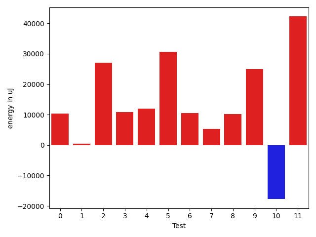

# gson 3ee3c1

https://github.com/google/gson/commit/3ee3c1

## Delta Energy per test method

| ID | EnergyV1 | EnergyV2 | DeltaEnergy | σV1 | %σV1 | σV2 | %σV2 |
| --- | --- | --- | --- | --- | --- | --- | --- |
| 0 | 356506 | 366882 | 10376 | 25361.69 | 7.11 | 34388.68 | 9.37 |
| 1 | 182556 | 183044 | 488 | 21572.79 | 11.82 | 33132.31 | 18.10 |
| 2 | 119079 | 146179 | 27100 | 15998.57 | 13.44 | 23153.26 | 15.84 |
| 3 | 116210 | 127075 | 10865 | 19907.84 | 17.13 | 22337.61 | 17.58 |
| 4 | 566954 | 578917 | 11963 | 32341.79 | 5.70 | 57080.32 | 9.86 |
| 5 | 326476 | 357177 | 30701 | 39023.26 | 11.95 | 49030.29 | 13.73 |
| 6 | 1207455 | 1217953 | 10498 | 81172.86 | 6.72 | 168347.88 | 13.82 |
| 7 | 112914 | 118285 | 5371 | 16742.55 | 14.83 | 18724.65 | 15.83 |
| 8 | 119995 | 130188 | 10193 | 17220.82 | 14.35 | 19875.67 | 15.27 |
| 9 | 473753 | 498656 | 24903 | 17808.94 | 3.76 | 27809.36 | 5.58 |
| 10 | 350951 | 333190 | -17761 | 29881.82 | 8.51 | 40665.86 | 12.21 |
| 11 | 119201 | 161438 | 42237 | 26787.27 | 22.47 | 28685.95 | 17.77 |

## Misc.

| ID | Test Class | Test Method |
| --- | --- | --- |
| 0 | com.google.gson.functional.ReadersWritersTest | testReadWriteTwoObjects |
| 1 | com.google.gson.JsonObjectTest | testAddingBooleanProperties |
| 2 | com.google.gson.JsonObjectTest | testReadPropertyWithEmptyStringName |
| 3 | com.google.gson.JsonObjectTest | testWritePropertyWithEmptyStringName |
| 4 | com.google.gson.JsonParserTest | testReadWriteTwoObjects |
| 5 | com.google.gson.stream.JsonReaderPathTest | path |
| 6 | com.google.gson.internal.bind.JsonElementReaderTest | testBooleans |
| 7 | com.google.gson.functional.JsonArrayTest | testBooleanPrimitiveAddition |
| 8 | com.google.gson.functional.JsonArrayTest | testSameAddition |
| 9 | com.google.gson.functional.JsonTreeTest | testJsonTreeToString |
| 10 | com.google.gson.functional.DefaultTypeAdaptersTest | testJsonPrimitiveSerialization |
| 11 | com.google.gson.JsonPrimitiveTest | testBoolean |

## Classifications

### Tests
| ID | Class | Delta | Share |
| --- | --- | --- | --- |
| G | NEUTRAL | 166934.0 | - |
| N | NEGATIVE | -17761.0 | 100.00 |
| P | POSITIVE | 184695.0 | 9.09 |
| 2 | POSITIVE | 27100.0 | 14.67 |
| 5 | POSITIVE | 30701.0 | 16.62 |
| 11 | POSITIVE | 42237.0 | 22.87 |

### Lines
| Class | Java Class | Line |
| --- | --- | --- |
| positive | com.google.gson.JsonPrimitive | 112 |
| positive | com.google.gson.JsonPrimitive | 102 |
| unknown | com.google.gson.JsonPrimitive | 112 |
| unknown | com.google.gson.JsonPrimitive | 102 |

## Localization of Green Regression
### Selected Tests
| Test class | test method |
| --- | --- |

### Suspected lines
| Class | line |
| --- | --- |
| com.google.gson.JsonPrimitive | [102](https://github.com/google/gson/tree/3ee3c1/gson/src/main/java/com/google/gson/JsonPrimitive.java#L102) |
| com.google.gson.JsonPrimitive | [112](https://github.com/google/gson/tree/3ee3c1/gson/src/main/java/com/google/gson/JsonPrimitive.java#L102#L112) |

| Time Label | Time (s) |
| --- | --- |
| Selection | 35.881675243377686 |
| Injection | 16.282846689224243 |
| Total | 218.8979616165161 |

