# gson 8bf294

https://github.com/google/gson/commit/8bf294

## Delta Energy per test method

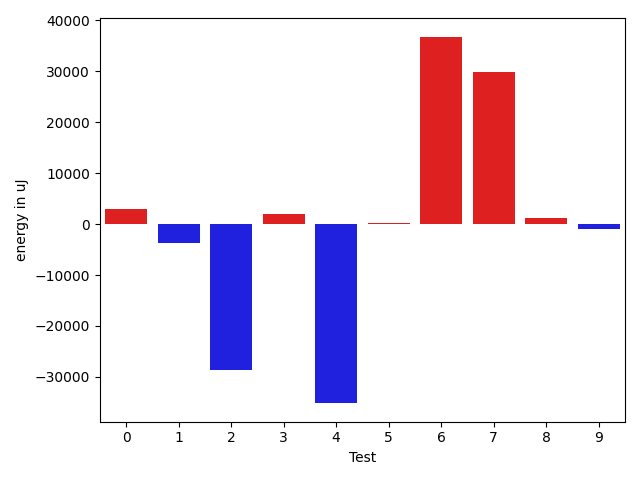

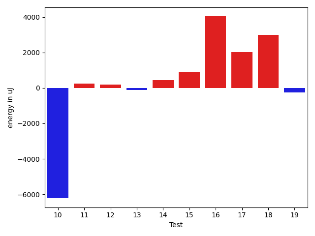

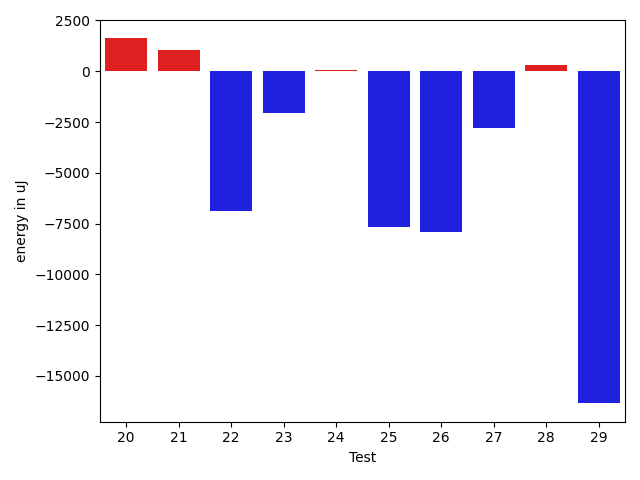

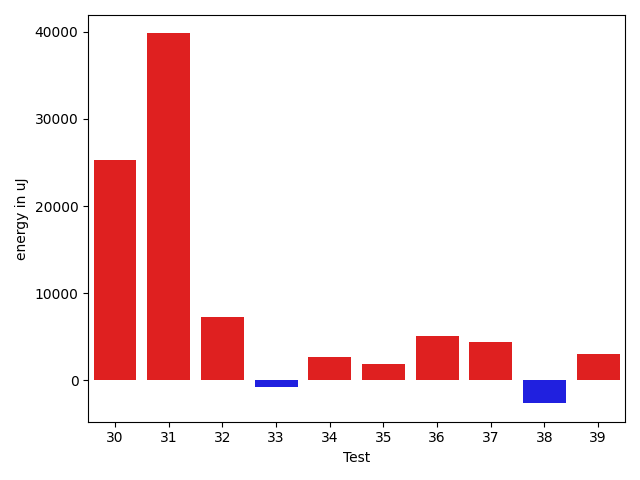

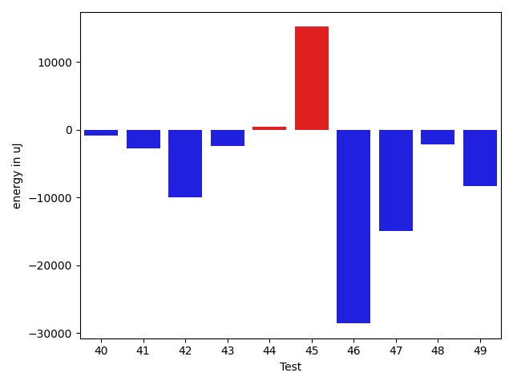

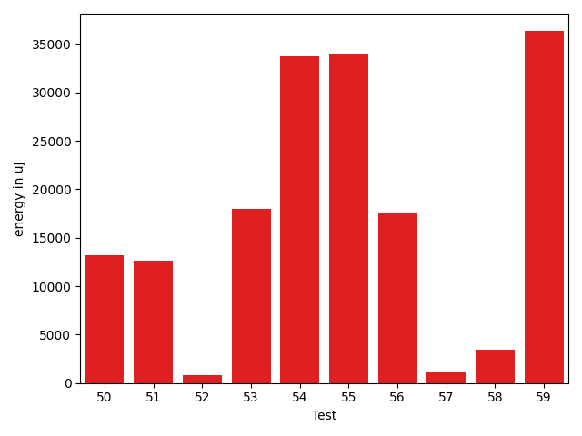

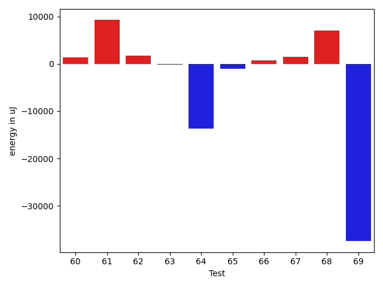

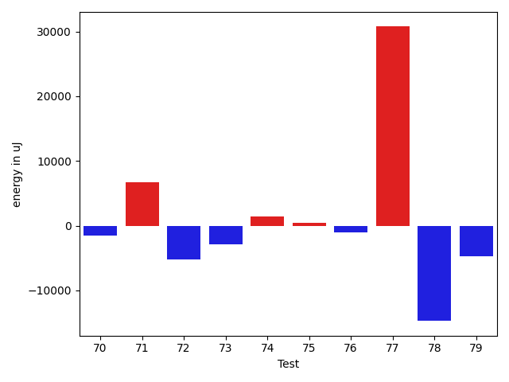

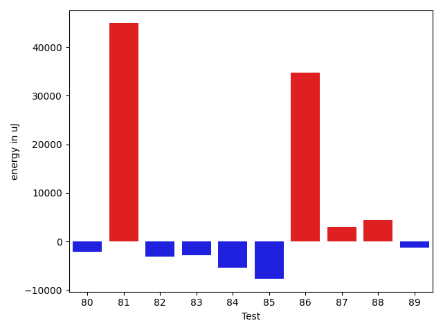

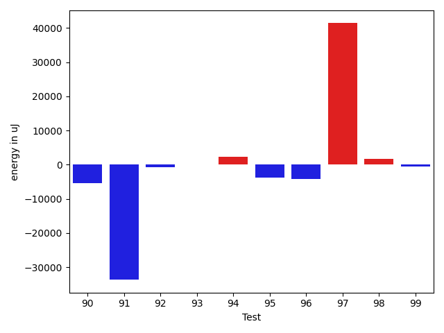

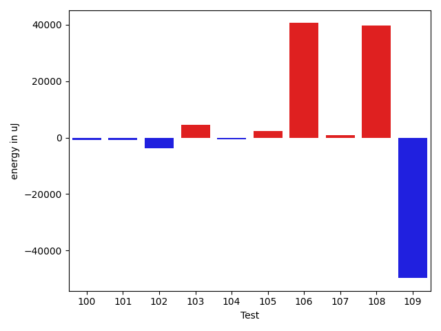

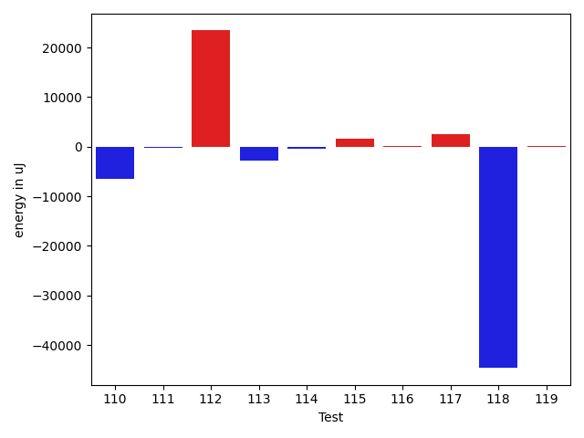

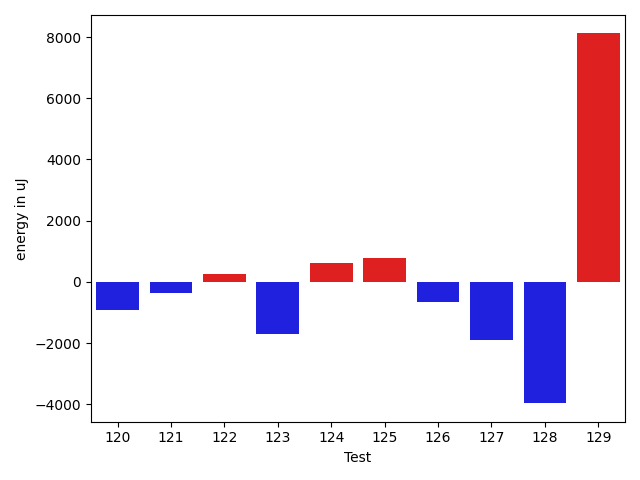

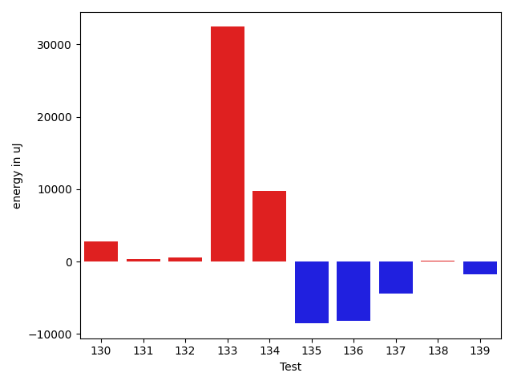

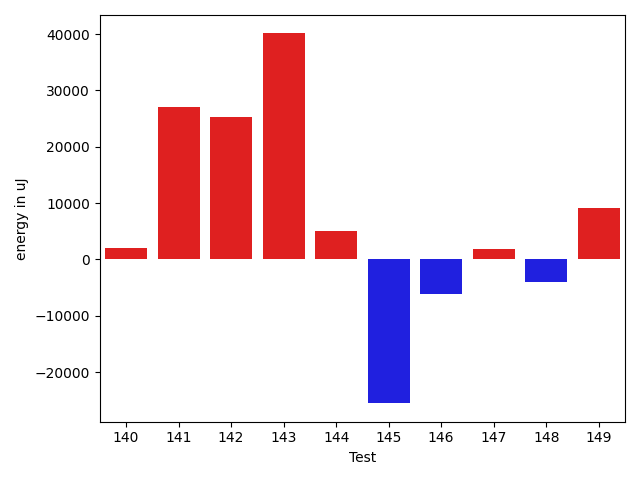

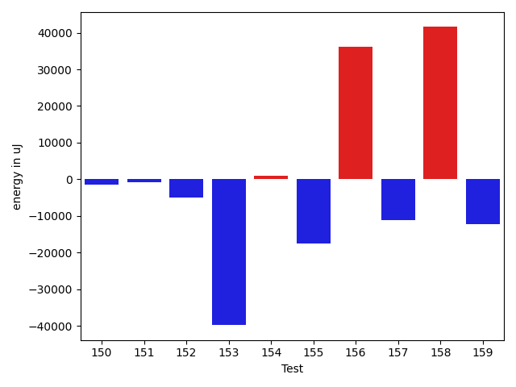

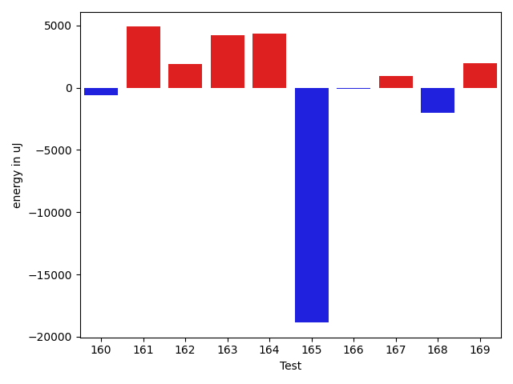

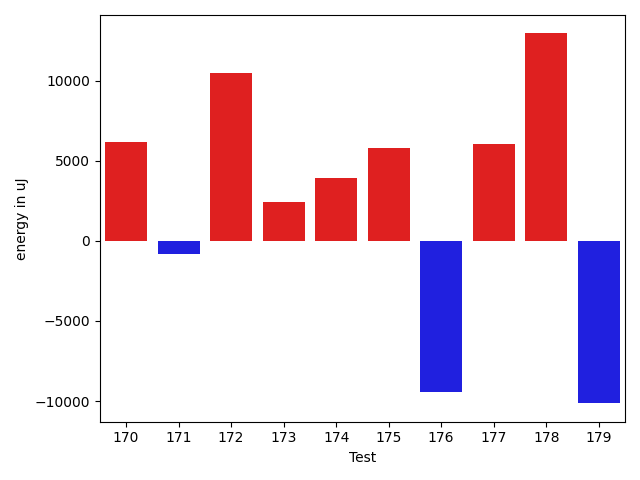

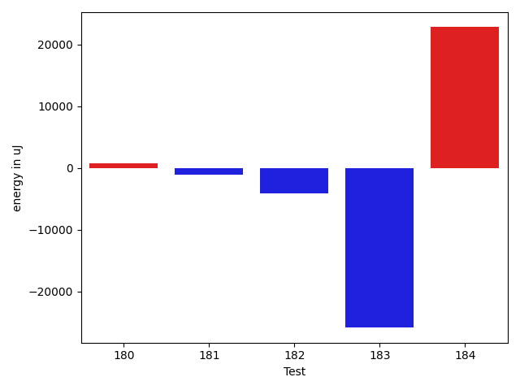

| ID | EnergyV1 | EnergyV2 | DeltaEnergy | σV1 | %σV1 | σV2 | %σV2 |
| --- | --- | --- | --- | --- | --- | --- | --- |
| 0 | 89660 | 92712 | 3052 | 20592.16 | 22.97 | 23533.02 | 25.38 |
| 1 | 87341 | 83557 | -3784 | 22098.14 | 25.30 | 28392.63 | 33.98 |
| 2 | 72632 | 43945 | -28687 | 18690.27 | 25.73 | 19804.44 | 45.07 |
| 3 | 79711 | 81726 | 2015 | 14589.27 | 18.30 | 13853.51 | 16.95 |
| 4 | 85083 | 49865 | -35218 | 54376.50 | 63.91 | 29746.73 | 59.65 |
| 5 | 39246 | 39489 | 243 | 1592.84 | 4.06 | 15931.29 | 40.34 |
| 6 | 95214 | 132019 | 36805 | 21579.16 | 22.66 | 31171.83 | 23.61 |
| 7 | 115051 | 144897 | 29846 | 19665.18 | 17.09 | 21675.64 | 14.96 |
| 8 | 47912 | 49194 | 1282 | 22728.17 | 47.44 | 17788.94 | 36.16 |
| 9 | 44190 | 43213 | -977 | 18125.67 | 41.02 | 17171.89 | 39.74 |
| 10 | 86425 | 80200 | -6225 | 25755.01 | 29.80 | 29921.39 | 37.31 |
| 11 | 39307 | 39551 | 244 | 1893.22 | 4.82 | 118328.90 | 299.18 |
| 12 | 44372 | 44556 | 184 | 18025.23 | 40.62 | 19837.25 | 44.52 |
| 13 | 39490 | 39368 | -122 | 1506.78 | 3.82 | 1522.00 | 3.87 |
| 14 | 39002 | 39428 | 426 | 1214.16 | 3.11 | 2216.49 | 5.62 |
| 15 | 141723 | 142638 | 915 | 15167.45 | 10.70 | 21288.63 | 14.92 |
| 16 | 92285 | 96314 | 4029 | 12125.21 | 13.14 | 34058.62 | 35.36 |
| 17 | 41259 | 43274 | 2015 | 17804.49 | 43.15 | 16808.64 | 38.84 |
| 18 | 83435 | 86426 | 2991 | 31270.20 | 37.48 | 28623.01 | 33.12 |
| 19 | 41870 | 41626 | -244 | 2133.78 | 5.10 | 1569.70 | 3.77 |
| 20 | 37414 | 39062 | 1648 | 16245.76 | 43.42 | 984.31 | 2.52 |
| 21 | 39307 | 40344 | 1037 | 1659.50 | 4.22 | 2361.39 | 5.85 |
| 22 | 169005 | 162109 | -6896 | 22022.34 | 13.03 | 24527.78 | 15.13 |
| 23 | 43701 | 41626 | -2075 | 20983.73 | 48.02 | 12627.08 | 30.33 |
| 24 | 38818 | 38880 | 62 | 1474.59 | 3.80 | 3181.14 | 8.18 |
| 25 | 86547 | 78857 | -7690 | 21556.41 | 24.91 | 21265.14 | 26.97 |
| 26 | 87768 | 79834 | -7934 | 31153.05 | 35.49 | 22035.72 | 27.60 |
| 27 | 42541 | 39734 | -2807 | 16911.30 | 39.75 | 1043.25 | 2.63 |
| 28 | 39734 | 40039 | 305 | 1131.51 | 2.85 | 1442.04 | 3.60 |
| 29 | 181641 | 165283 | -16358 | 48261.79 | 26.57 | 20869.13 | 12.63 |
| 30 | 132751 | 158081 | 25330 | 23937.28 | 18.03 | 25732.41 | 16.28 |
| 31 | 187072 | 226868 | 39796 | 21533.60 | 11.51 | 15551.17 | 6.85 |
| 32 | 166992 | 174255 | 7263 | 23335.75 | 13.97 | 24529.61 | 14.08 |
| 33 | 114075 | 113281 | -794 | 19545.97 | 17.13 | 23523.46 | 20.77 |
| 34 | 135802 | 138488 | 2686 | 26914.23 | 19.82 | 24811.22 | 17.92 |
| 35 | 164978 | 166809 | 1831 | 21370.64 | 12.95 | 13688.73 | 8.21 |
| 36 | 222533 | 227661 | 5128 | 19678.54 | 8.84 | 16797.13 | 7.38 |
| 37 | 152710 | 157104 | 4394 | 7187.67 | 4.71 | 22921.23 | 14.59 |
| 38 | 85633 | 83008 | -2625 | 16714.22 | 19.52 | 14522.75 | 17.50 |
| 39 | 73974 | 77026 | 3052 | 13805.17 | 18.66 | 17922.52 | 23.27 |
| 40 | 311034 | 310241 | -793 | 24200.26 | 7.78 | 44522.06 | 14.35 |
| 41 | 180175 | 177429 | -2746 | 22523.68 | 12.50 | 7572.06 | 4.27 |
| 42 | 159851 | 149902 | -9949 | 112550.86 | 70.41 | 28720.41 | 19.16 |
| 43 | 179321 | 176941 | -2380 | 18773.12 | 10.47 | 21932.53 | 12.40 |
| 44 | 76538 | 77027 | 489 | 24611.16 | 32.16 | 13710.32 | 17.80 |
| 45 | 163146 | 178344 | 15198 | 21432.31 | 13.14 | 11982.67 | 6.72 |
| 46 | 165649 | 137084 | -28565 | 17061.24 | 10.30 | 17089.72 | 12.47 |
| 47 | 177307 | 162414 | -14893 | 17256.65 | 9.73 | 24745.54 | 15.24 |
| 48 | 81665 | 79468 | -2197 | 22146.88 | 27.12 | 21521.40 | 27.08 |
| 49 | 234069 | 225829 | -8240 | 17263.37 | 7.38 | 24390.43 | 10.80 |
| 50 | 215453 | 228637 | 13184 | 27035.60 | 12.55 | 22704.62 | 9.93 |
| 51 | 293029 | 305663 | 12634 | 33977.32 | 11.60 | 37087.61 | 12.13 |
| 52 | 113831 | 114685 | 854 | 22575.18 | 19.83 | 16460.52 | 14.35 |
| 53 | 204712 | 222656 | 17944 | 22383.88 | 10.93 | 26221.09 | 11.78 |
| 54 | 126220 | 159973 | 33753 | 36306.80 | 28.76 | 18103.36 | 11.32 |
| 55 | 121521 | 155518 | 33997 | 24030.84 | 19.78 | 26435.86 | 17.00 |
| 56 | 155639 | 173156 | 17517 | 26025.43 | 16.72 | 34377.25 | 19.85 |
| 57 | 117981 | 119140 | 1159 | 30458.82 | 25.82 | 18386.82 | 15.43 |
| 58 | 115173 | 118591 | 3418 | 17223.80 | 14.95 | 19562.06 | 16.50 |
| 59 | 81726 | 118042 | 36316 | 18709.62 | 22.89 | 17202.76 | 14.57 |
| 60 | 120239 | 121642 | 1403 | 38381.88 | 31.92 | 22724.47 | 18.68 |
| 61 | 121032 | 130310 | 9278 | 20313.28 | 16.78 | 16684.36 | 12.80 |
| 62 | 39368 | 41137 | 1769 | 1685.54 | 4.28 | 4071.02 | 9.90 |
| 63 | 89843 | 89722 | -121 | 30886.70 | 34.38 | 14585.44 | 16.26 |
| 64 | 396850 | 383239 | -13611 | 25384.31 | 6.40 | 40543.42 | 10.58 |
| 65 | 39795 | 38818 | -977 | 1575.33 | 3.96 | 13493.59 | 34.76 |
| 66 | 91796 | 92590 | 794 | 99891.88 | 108.82 | 29146.48 | 31.48 |
| 67 | 45898 | 47363 | 1465 | 17805.43 | 38.79 | 21217.54 | 44.80 |
| 68 | 157043 | 164123 | 7080 | 19156.92 | 12.20 | 20423.37 | 12.44 |
| 69 | 1082090 | 1044614 | -37476 | 64712.93 | 5.98 | 108029.53 | 10.34 |
| 70 | 90759 | 89233 | -1526 | 24325.45 | 26.80 | 3865.93 | 4.33 |
| 71 | 134949 | 141723 | 6774 | 26932.47 | 19.96 | 22729.31 | 16.04 |
| 72 | 85693 | 80505 | -5188 | 6412.19 | 7.48 | 18600.24 | 23.10 |
| 73 | 87158 | 84289 | -2869 | 23027.45 | 26.42 | 18485.81 | 21.93 |
| 74 | 90454 | 91919 | 1465 | 22692.88 | 25.09 | 20346.04 | 22.13 |
| 75 | 39611 | 40100 | 489 | 1503.26 | 3.80 | 13315.65 | 33.21 |
| 76 | 38941 | 37902 | -1039 | 15948.23 | 40.95 | 3134.32 | 8.27 |
| 77 | 45715 | 76477 | 30762 | 23508.83 | 51.42 | 21809.13 | 28.52 |
| 78 | 149963 | 135254 | -14709 | 17809.65 | 11.88 | 25700.29 | 19.00 |
| 79 | 136475 | 131714 | -4761 | 16872.85 | 12.36 | 14056.86 | 10.67 |
| 80 | 114136 | 112060 | -2076 | 19242.14 | 16.86 | 20271.91 | 18.09 |
| 81 | 46630 | 91553 | 44923 | 21572.68 | 46.26 | 23760.69 | 25.95 |
| 82 | 46630 | 43518 | -3112 | 21135.40 | 45.33 | 21297.62 | 48.94 |
| 83 | 127991 | 125122 | -2869 | 20336.05 | 15.89 | 13157.34 | 10.52 |
| 84 | 46753 | 41443 | -5310 | 18169.77 | 38.86 | 21761.94 | 52.51 |
| 85 | 127136 | 119446 | -7690 | 35300.77 | 27.77 | 19218.02 | 16.09 |
| 86 | 98388 | 133179 | 34791 | 21306.01 | 21.66 | 23906.04 | 17.95 |
| 87 | 41748 | 44799 | 3051 | 3319.43 | 7.95 | 2372.01 | 5.29 |
| 88 | 38147 | 42603 | 4456 | 4120.72 | 10.80 | 967.23 | 2.27 |
| 89 | 47790 | 46509 | -1281 | 18674.75 | 39.08 | 21872.57 | 47.03 |
| 90 | 125915 | 120544 | -5371 | 16089.58 | 12.78 | 20535.35 | 17.04 |
| 91 | 76538 | 42846 | -33692 | 18906.06 | 24.70 | 20135.89 | 47.00 |
| 92 | 47790 | 47058 | -732 | 22327.04 | 46.72 | 21422.88 | 45.52 |
| 93 | 45105 | 45226 | 121 | 20689.37 | 45.87 | 12244.20 | 27.07 |
| 94 | 165588 | 167846 | 2258 | 25801.57 | 15.58 | 21899.52 | 13.05 |
| 95 | 138671 | 134888 | -3783 | 4064.30 | 2.93 | 21454.53 | 15.91 |
| 96 | 131897 | 127685 | -4212 | 23653.80 | 17.93 | 56182.41 | 44.00 |
| 97 | 134399 | 175781 | 41382 | 18686.48 | 13.90 | 118383.07 | 67.35 |
| 98 | 92346 | 94116 | 1770 | 29518.34 | 31.96 | 22418.80 | 23.82 |
| 99 | 93872 | 93384 | -488 | 22914.02 | 24.41 | 22785.86 | 24.40 |
| 100 | 139526 | 138793 | -733 | 3065.90 | 2.20 | 3621.58 | 2.61 |
| 101 | 137817 | 136902 | -915 | 22152.31 | 16.07 | 5258.80 | 3.84 |
| 102 | 133606 | 129760 | -3846 | 23895.22 | 17.88 | 23196.36 | 17.88 |
| 103 | 126831 | 131470 | 4639 | 23841.97 | 18.80 | 20841.42 | 15.85 |
| 104 | 184448 | 183898 | -550 | 40011.68 | 21.69 | 22721.45 | 12.36 |
| 105 | 135315 | 137756 | 2441 | 24722.59 | 18.27 | 24855.01 | 18.04 |
| 106 | 128296 | 168883 | 40587 | 13928.06 | 10.86 | 77714.84 | 46.02 |
| 107 | 136474 | 137451 | 977 | 12708.25 | 9.31 | 28469.38 | 20.71 |
| 108 | 43213 | 82824 | 39611 | 15303.11 | 35.41 | 21576.69 | 26.05 |
| 109 | 617247 | 567443 | -49804 | 69252.52 | 11.22 | 54636.80 | 9.63 |
| 110 | 214111 | 207580 | -6531 | 19221.45 | 8.98 | 31163.77 | 15.01 |
| 111 | 330688 | 330383 | -305 | 22928.25 | 6.93 | 31893.61 | 9.65 |
| 112 | 701658 | 725095 | 23437 | 30835.72 | 4.39 | 39754.55 | 5.48 |
| 113 | 155273 | 152527 | -2746 | 18883.82 | 12.16 | 21356.87 | 14.00 |
| 114 | 40161 | 39733 | -428 | 2219.84 | 5.53 | 1552.78 | 3.91 |
| 115 | 38940 | 40588 | 1648 | 1121.60 | 2.88 | 2917.63 | 7.19 |
| 116 | 95093 | 95214 | 121 | 32271.91 | 33.94 | 23617.54 | 24.80 |
| 117 | 93139 | 95764 | 2625 | 13998.85 | 15.03 | 37523.74 | 39.18 |
| 118 | 91736 | 47119 | -44617 | 23887.51 | 26.04 | 21190.89 | 44.97 |
| 119 | 89294 | 89477 | 183 | 22668.43 | 25.39 | 22919.50 | 25.61 |
| 120 | 40954 | 40039 | -915 | 1483.24 | 3.62 | 2454.09 | 6.13 |
| 121 | 90026 | 89661 | -365 | 30587.04 | 33.98 | 33590.73 | 37.46 |
| 122 | 41992 | 42237 | 245 | 11338.30 | 27.00 | 16858.69 | 39.91 |
| 123 | 90759 | 89050 | -1709 | 20668.64 | 22.77 | 48651.53 | 54.63 |
| 124 | 41260 | 41870 | 610 | 17295.78 | 41.92 | 12192.74 | 29.12 |
| 125 | 38452 | 39245 | 793 | 1210.51 | 3.15 | 3046.76 | 7.76 |
| 126 | 39795 | 39123 | -672 | 2361.96 | 5.94 | 1317.02 | 3.37 |
| 127 | 89721 | 87829 | -1892 | 73246.84 | 81.64 | 21128.25 | 24.06 |
| 128 | 40893 | 36926 | -3967 | 2194.56 | 5.37 | 0.00 | 0.00 |
| 129 | 82886 | 91003 | 8117 | 21691.01 | 26.17 | 44752.41 | 49.18 |
| 130 | 41321 | 44067 | 2746 | 2453.52 | 5.94 | 19092.09 | 43.33 |
| 131 | 38513 | 38880 | 367 | 1022.96 | 2.66 | 2352.96 | 6.05 |
| 132 | 37231 | 37781 | 550 | 1213.95 | 3.26 | 1543.51 | 4.09 |
| 133 | 130920 | 163329 | 32409 | 26082.61 | 19.92 | 31046.50 | 19.01 |
| 134 | 171020 | 180785 | 9765 | 20783.25 | 12.15 | 18910.64 | 10.46 |
| 135 | 92773 | 84228 | -8545 | 20107.98 | 21.67 | 13249.71 | 15.73 |
| 136 | 87402 | 79223 | -8179 | 16365.59 | 18.72 | 21543.16 | 27.19 |
| 137 | 91552 | 87097 | -4455 | 60422.81 | 66.00 | 30258.27 | 34.74 |
| 138 | 94543 | 94665 | 122 | 24500.28 | 25.91 | 23928.64 | 25.28 |
| 139 | 93506 | 91797 | -1709 | 21710.45 | 23.22 | 24539.03 | 26.73 |
| 140 | 127868 | 129883 | 2015 | 19312.49 | 15.10 | 24652.55 | 18.98 |
| 141 | 139831 | 166931 | 27100 | 105677.07 | 75.57 | 38811.39 | 23.25 |
| 142 | 92590 | 117797 | 25207 | 21667.49 | 23.40 | 68075.65 | 57.79 |
| 143 | 92590 | 132690 | 40100 | 137650.12 | 148.67 | 160726.52 | 121.13 |
| 144 | 77148 | 82154 | 5006 | 14069.87 | 18.24 | 17003.22 | 20.70 |
| 145 | 307799 | 282287 | -25512 | 53357.64 | 17.34 | 31583.32 | 11.19 |
| 146 | 130554 | 124512 | -6042 | 7706.06 | 5.90 | 12072.44 | 9.70 |
| 147 | 39307 | 41076 | 1769 | 1766.09 | 4.49 | 15613.84 | 38.01 |
| 148 | 47363 | 43335 | -4028 | 20486.94 | 43.26 | 28967.31 | 66.85 |
| 149 | 381347 | 390563 | 9216 | 22300.55 | 5.85 | 30736.24 | 7.87 |
| 150 | 41687 | 40161 | -1526 | 18780.92 | 45.05 | 17059.17 | 42.48 |
| 151 | 41137 | 40345 | -792 | 10808.50 | 26.27 | 15379.40 | 38.12 |
| 152 | 89782 | 84716 | -5066 | 13589.06 | 15.14 | 20246.63 | 23.90 |
| 153 | 82214 | 42420 | -39794 | 24086.40 | 29.30 | 15821.83 | 37.30 |
| 154 | 43579 | 44617 | 1038 | 11313.69 | 25.96 | 17988.12 | 40.32 |
| 155 | 312743 | 295166 | -17577 | 26940.64 | 8.61 | 24832.95 | 8.41 |
| 156 | 46997 | 83251 | 36254 | 22046.15 | 46.91 | 19243.88 | 23.12 |
| 157 | 218200 | 207030 | -11170 | 17244.44 | 7.90 | 33891.41 | 16.37 |
| 158 | 501952 | 543517 | 41565 | 20418.72 | 4.07 | 30557.73 | 5.62 |
| 159 | 213806 | 201477 | -12329 | 19318.58 | 9.04 | 17744.99 | 8.81 |
| 160 | 231323 | 230713 | -610 | 17371.62 | 7.51 | 11352.85 | 4.92 |
| 161 | 296569 | 301452 | 4883 | 4741.39 | 1.60 | 24185.96 | 8.02 |
| 162 | 186034 | 187927 | 1893 | 25362.75 | 13.63 | 17092.62 | 9.10 |
| 163 | 147034 | 151245 | 4211 | 17197.01 | 11.70 | 12731.75 | 8.42 |
| 164 | 270141 | 274475 | 4334 | 17772.69 | 6.58 | 30418.94 | 11.08 |
| 165 | 311401 | 292541 | -18860 | 23498.07 | 7.55 | 21685.90 | 7.41 |
| 166 | 224060 | 223938 | -122 | 20898.43 | 9.33 | 28375.26 | 12.67 |
| 167 | 44616 | 45533 | 917 | 16073.30 | 36.03 | 3153.12 | 6.92 |
| 168 | 44311 | 42297 | -2014 | 11142.03 | 25.15 | 3835.66 | 9.07 |
| 169 | 39856 | 41809 | 1953 | 12976.46 | 32.56 | 15767.09 | 37.71 |
| 170 | 164978 | 171142 | 6164 | 26591.61 | 16.12 | 21389.43 | 12.50 |
| 171 | 138855 | 138061 | -794 | 22938.68 | 16.52 | 20998.88 | 15.21 |
| 172 | 172241 | 182739 | 10498 | 31081.96 | 18.05 | 23500.19 | 12.86 |
| 173 | 75745 | 78186 | 2441 | 13014.54 | 17.18 | 17520.70 | 22.41 |
| 174 | 87524 | 91431 | 3907 | 17018.35 | 19.44 | 20702.09 | 22.64 |
| 175 | 73242 | 79040 | 5798 | 23233.08 | 31.72 | 17109.31 | 21.65 |
| 176 | 218383 | 208923 | -9460 | 16883.14 | 7.73 | 29897.46 | 14.31 |
| 177 | 121643 | 127685 | 6042 | 19976.20 | 16.42 | 27233.07 | 21.33 |
| 178 | 266235 | 279174 | 12939 | 122454.36 | 45.99 | 89255.63 | 31.97 |
| 179 | 285156 | 275024 | -10132 | 12820.76 | 4.50 | 18174.91 | 6.61 |
| 180 | 145508 | 146301 | 793 | 18814.31 | 12.93 | 28737.49 | 19.64 |
| 181 | 228576 | 227539 | -1037 | 19364.61 | 8.47 | 20555.59 | 9.03 |
| 182 | 172180 | 168030 | -4150 | 26185.38 | 15.21 | 27070.75 | 16.11 |
| 183 | 1447872 | 1422054 | -25818 | 57066.35 | 3.94 | 68084.88 | 4.79 |
| 184 | 135925 | 158691 | 22766 | 28805.27 | 21.19 | 18154.61 | 11.44 |

## Misc.

| ID | Test Class | Test Method |
| --- | --- | --- |
| 0 | com.google.gson.functional.TypeAdapterPrecedenceTest | testStreamingFollowedByNonstreaming |
| 1 | com.google.gson.functional.TypeAdapterPrecedenceTest | testStreamingHierarchicalFollowedByNonstreaming |
| 2 | com.google.gson.functional.TypeAdapterPrecedenceTest | testNonstreamingHierarchicalFollowedByNonstreaming |
| 3 | com.google.gson.functional.TypeAdapterPrecedenceTest | testNonstreamingFollowedByNonstreaming |
| 4 | com.google.gson.JsonPrimitiveTest | testByteEqualsInteger |
| 5 | com.google.gson.JsonPrimitiveTest | testParsingStringAsNumber |
| 6 | com.google.gson.JsonPrimitiveTest | testDoubleEqualsBigDecimal |
| 7 | com.google.gson.JsonPrimitiveTest | testFloatEqualsDouble |
| 8 | com.google.gson.JsonPrimitiveTest | testShortEqualsInteger |
| 9 | com.google.gson.JsonPrimitiveTest | testByteEqualsBigInteger |
| 10 | com.google.gson.JsonPrimitiveTest | testNulls |
| 11 | com.google.gson.JsonPrimitiveTest | testEquals |
| 12 | com.google.gson.JsonPrimitiveTest | testFloatEqualsBigDecimal |
| 13 | com.google.gson.JsonPrimitiveTest | testByteEqualsShort |
| 14 | com.google.gson.JsonPrimitiveTest | testShortEqualsBigInteger |
| 15 | com.google.gson.JsonPrimitiveTest | testParsingStringAsBoolean |
| 16 | com.google.gson.JsonPrimitiveTest | testEqualsDoesNotEquateStringAndNonStringTypes |
| 17 | com.google.gson.JsonPrimitiveTest | testIntegerEqualsBigInteger |
| 18 | com.google.gson.JsonPrimitiveTest | testShortEqualsLong |
| 19 | com.google.gson.JsonPrimitiveTest | testDeepCopy |
| 20 | com.google.gson.JsonPrimitiveTest | testEqualsIntegerAndBigInteger |
| 21 | com.google.gson.JsonPrimitiveTest | testValidJsonOnToString |
| 22 | com.google.gson.JsonPrimitiveTest | testLongEqualsBigInteger |
| 23 | com.google.gson.JsonPrimitiveTest | testEqualsAcrossTypes |
| 24 | com.google.gson.JsonPrimitiveTest | testByteEqualsLong |
| 25 | com.google.gson.JsonPrimitiveTest | testBoolean |
| 26 | com.google.gson.JsonPrimitiveTest | testExponential |
| 27 | com.google.gson.JsonPrimitiveTest | testIntegerEqualsLong |
| 28 | com.google.gson.JsonPrimitiveTest | testStringsAndChar |
| 29 | com.google.gson.functional.CustomTypeAdaptersTest | testCustomAdapterInvokedForCollectionElementDeserialization |
| 30 | com.google.gson.functional.CustomTypeAdaptersTest | testCustomTypeAdapterAppliesToSubClassesSerializedAsBaseClass |
| 31 | com.google.gson.functional.CustomTypeAdaptersTest | testCustomAdapterInvokedForMapElementDeserialization |
| 32 | com.google.gson.functional.CustomTypeAdaptersTest | testCustomAdapterInvokedForMapElementSerializationWithType |
| 33 | com.google.gson.functional.CustomTypeAdaptersTest | testCustomNestedSerializers |
| 34 | com.google.gson.functional.CustomTypeAdaptersTest | testCustomAdapterInvokedForMapElementSerialization |
| 35 | com.google.gson.functional.CustomTypeAdaptersTest | testCustomSerializers |
| 36 | com.google.gson.functional.CustomTypeAdaptersTest | testCustomNestedDeserializers |
| 37 | com.google.gson.functional.CustomTypeAdaptersTest | testCustomTypeAdapterDoesNotAppliesToSubClasses |
| 38 | com.google.gson.functional.CustomTypeAdaptersTest | testCustomAdapterInvokedForCollectionElementSerialization |
| 39 | com.google.gson.functional.CustomTypeAdaptersTest | testRegisterHierarchyAdapterForDate |
| 40 | com.google.gson.functional.CustomTypeAdaptersTest | testCustomAdapterInvokedForCollectionElementSerializationWithType |
| 41 | com.google.gson.functional.CustomTypeAdaptersTest | testCustomDeserializers |
| 42 | com.google.gson.functional.CustomTypeAdaptersTest | testCustomByteArrayDeserializerAndInstanceCreator |
| 43 | com.google.gson.functional.CustomTypeAdaptersTest | testCustomByteArraySerializer |
| 44 | com.google.gson.functional.CustomTypeAdaptersTest | testEnsureCustomSerializerNotInvokedForNullValues |
| 45 | com.google.gson.functional.CustomTypeAdaptersTest | testCustomDeserializerInvokedForPrimitives |
| 46 | com.google.gson.functional.CustomTypeAdaptersTest | testCustomSerializerInvokedForPrimitives |
| 47 | com.google.gson.functional.CustomDeserializerTest | testDefaultConstructorNotCalledOnField |
| 48 | com.google.gson.functional.CustomDeserializerTest | testDefaultConstructorNotCalledOnObject |
| 49 | com.google.gson.functional.CustomDeserializerTest | testCustomDeserializerReturnsNullForArrayElementsForArrayField |
| 50 | com.google.gson.functional.CustomDeserializerTest | testCustomDeserializerReturnsNull |
| 51 | com.google.gson.functional.CustomDeserializerTest | testJsonTypeFieldBasedDeserialization |
| 52 | com.google.gson.functional.CustomDeserializerTest | testCustomDeserializerReturnsNullForArrayElements |
| 53 | com.google.gson.functional.CustomDeserializerTest | testCustomDeserializerReturnsNullForTopLevelObject |
| 54 | com.google.gson.stream.JsonReaderPathTest | objectPath |
| 55 | com.google.gson.stream.JsonReaderPathTest | path |
| 56 | com.google.gson.stream.JsonReaderPathTest | skipNestedStructures |
| 57 | com.google.gson.stream.JsonReaderPathTest | arrayPath |
| 58 | com.google.gson.stream.JsonReaderPathTest | skipArrayElements |
| 59 | com.google.gson.stream.JsonReaderPathTest | skipObjectValues |
| 60 | com.google.gson.stream.JsonReaderPathTest | skipObjectNames |
| 61 | com.google.gson.functional.StreamingTypeAdaptersTest | testFromJsonTree |
| 62 | com.google.gson.JsonParserTest | testParseUnquotedSingleWordStringFails |
| 63 | com.google.gson.JsonParserTest | testParseUnquotedStringArrayFails |
| 64 | com.google.gson.JsonParserTest | testReadWriteTwoObjects |
| 65 | com.google.gson.JsonParserTest | testParseUnquotedMultiWordStringFails |
| 66 | com.google.gson.JsonParserTest | testParseString |
| 67 | com.google.gson.JsonParserTest | testParseEmptyString |
| 68 | com.google.gson.JsonParserTest | testParseReader |
| 69 | com.google.gson.JsonParserTest | testParseMixedArray |
| 70 | com.google.gson.functional.JsonParserTest | testBadTypeForDeserializingCustomTree |
| 71 | com.google.gson.functional.JsonParserTest | testBadFieldTypeForCustomDeserializerCustomTree |
| 72 | com.google.gson.functional.JsonParserTest | testChangingCustomTreeAndDeserializing |
| 73 | com.google.gson.functional.JsonParserTest | testBadFieldTypeForDeserializingCustomTree |
| 74 | com.google.gson.functional.JsonParserTest | testDeserializingCustomTree |
| 75 | com.google.gson.JsonArrayTest | testRemove |
| 76 | com.google.gson.JsonArrayTest | testSet |
| 77 | com.google.gson.JsonArrayTest | testDeepCopy |
| 78 | com.google.gson.functional.JsonAdapterSerializerDeserializerTest | testJsonSerializerDeserializerBasedJsonAdapterOnFields |
| 79 | com.google.gson.functional.JsonAdapterSerializerDeserializerTest | testDifferentJsonAdaptersForGenericFieldsOfSameRawType |
| 80 | com.google.gson.functional.JsonAdapterSerializerDeserializerTest | testJsonSerializerDeserializerBasedJsonAdapterOnClass |
| 81 | com.google.gson.functional.InheritanceTest | testBaseSerializedAsBaseWhenSpecifiedWithExplicitType |
| 82 | com.google.gson.functional.InheritanceTest | testBaseSerializedAsSubWhenSpecifiedWithExplicitType |
| 83 | com.google.gson.functional.InheritanceTest | testClassWithBaseArrayFieldSerialization |
| 84 | com.google.gson.functional.InheritanceTest | testBaseSerializedAsSub |
| 85 | com.google.gson.functional.InheritanceTest | testClassWithBaseCollectionFieldSerialization |
| 86 | com.google.gson.functional.InheritanceTest | testClassWithBaseFieldSerialization |
| 87 | com.google.gson.functional.JsonArrayTest | testStringPrimitiveAddition |
| 88 | com.google.gson.functional.JsonArrayTest | testBooleanPrimitiveAddition |
| 89 | com.google.gson.functional.JsonArrayTest | testCharPrimitiveAddition |
| 90 | com.google.gson.functional.JsonArrayTest | testDoublePrimitiveAddition |
| 91 | com.google.gson.functional.JsonArrayTest | testMixedPrimitiveAddition |
| 92 | com.google.gson.functional.JsonArrayTest | testSameAddition |
| 93 | com.google.gson.functional.JsonArrayTest | testIntegerPrimitiveAddition |
| 94 | com.google.gson.internal.bind.JsonElementReaderTest | testLenientNansAndInfinities |
| 95 | com.google.gson.internal.bind.JsonElementReaderTest | testStrictNansAndInfinities |
| 96 | com.google.gson.internal.bind.JsonElementReaderTest | testArray |
| 97 | com.google.gson.internal.bind.JsonElementReaderTest | testObject |
| 98 | com.google.gson.internal.bind.JsonElementReaderTest | testNestedObjects |
| 99 | com.google.gson.internal.bind.JsonElementReaderTest | testStrings |
| 100 | com.google.gson.internal.bind.JsonElementReaderTest | testSkipValue |
| 101 | com.google.gson.internal.bind.JsonElementReaderTest | testNumbersFromStrings |
| 102 | com.google.gson.internal.bind.JsonElementReaderTest | testBooleans |
| 103 | com.google.gson.internal.bind.JsonElementReaderTest | testEarlyClose |
| 104 | com.google.gson.internal.bind.JsonElementReaderTest | testWrongType |
| 105 | com.google.gson.internal.bind.JsonElementReaderTest | testNumbers |
| 106 | com.google.gson.internal.bind.JsonElementReaderTest | testStringsFromNumbers |
| 107 | com.google.gson.functional.ReadersWritersTest | testReadWriteTwoObjects |
| 108 | com.google.gson.functional.ReadersWritersTest | testReadWriteTwoStrings |
| 109 | com.google.gson.functional.MapTest | testInterfaceTypeMapWithSerializer |
| 110 | com.google.gson.functional.MapTest | testCustomSerializerForSpecificMapType |
| 111 | com.google.gson.functional.MapTest | testGeneralMapField |
| 112 | com.google.gson.functional.MapTest | testInterfaceTypeMap |
| 113 | com.google.gson.functional.MapTest | testMapNamePromotionWithJsonElementReader |
| 114 | com.google.gson.LongSerializationPolicyTest | testStringLongSerialization |
| 115 | com.google.gson.LongSerializationPolicyTest | testDefaultLongSerialization |
| 116 | com.google.gson.JsonObjectTest | testEqualsNonEmptyObject |
| 117 | com.google.gson.JsonObjectTest | testAddingCharacterProperties |
| 118 | com.google.gson.JsonObjectTest | testAddingBooleanProperties |
| 119 | com.google.gson.JsonObjectTest | testAddingNullOrEmptyPropertyName |
| 120 | com.google.gson.JsonObjectTest | testAddingAndRemovingObjectProperties |
| 121 | com.google.gson.JsonObjectTest | testDeepCopy |
| 122 | com.google.gson.JsonObjectTest | testReadPropertyWithEmptyStringName |
| 123 | com.google.gson.JsonObjectTest | testSize |
| 124 | com.google.gson.JsonObjectTest | testPropertyWithQuotes |
| 125 | com.google.gson.JsonObjectTest | testWritePropertyWithEmptyStringName |
| 126 | com.google.gson.JsonObjectTest | testKeySet |
| 127 | com.google.gson.JsonObjectTest | testAddingStringProperties |
| 128 | com.google.gson.JsonObjectTest | testAddingNullPropertyValue |
| 129 | com.google.gson.JsonStreamParserTest | testCallingNextBeyondAvailableInput |
| 130 | com.google.gson.JsonStreamParserTest | testNoSideEffectForHasNext |
| 131 | com.google.gson.JsonStreamParserTest | testParseTwoStrings |
| 132 | com.google.gson.JsonStreamParserTest | testIterator |
| 133 | com.google.gson.functional.JsonTreeTest | testJsonTreeNull |
| 134 | com.google.gson.functional.JsonTreeTest | testJsonTreeToString |
| 135 | com.google.gson.functional.JsonTreeTest | testToJsonTreeObjectType |
| 136 | com.google.gson.functional.JsonTreeTest | testToJsonTree |
| 137 | com.google.gson.internal.bind.JsonTreeWriterTest | testLenientNansAndInfinities |
| 138 | com.google.gson.internal.bind.JsonTreeWriterTest | testArray |
| 139 | com.google.gson.internal.bind.JsonTreeWriterTest | testPrematureClose |
| 140 | com.google.gson.internal.bind.JsonTreeWriterTest | testWriteAfterClose |
| 141 | com.google.gson.internal.bind.JsonTreeWriterTest | testSerializeNullsTrue |
| 142 | com.google.gson.internal.bind.JsonTreeWriterTest | testNestedObject |
| 143 | com.google.gson.internal.bind.JsonTreeWriterTest | testObject |
| 144 | com.google.gson.functional.TypeHierarchyAdapterTest | testRegisterSuperTypeFirst |
| 145 | com.google.gson.functional.TypeHierarchyAdapterTest | testTypeHierarchy |
| 146 | com.google.gson.functional.NullObjectAndFieldTest | testCustomTypeAdapterPassesNullDesrialization |
| 147 | com.google.gson.functional.NullObjectAndFieldTest | testCustomSerializationOfNulls |
| 148 | com.google.gson.functional.DefaultTypeAdaptersTest | testJsonArraySerialization |
| 149 | com.google.gson.functional.DefaultTypeAdaptersTest | testJsonArrayDeserialization |
| 150 | com.google.gson.functional.DefaultTypeAdaptersTest | testJsonObjectDeserialization |
| 151 | com.google.gson.functional.DefaultTypeAdaptersTest | testJsonObjectSerialization |
| 152 | com.google.gson.functional.DefaultTypeAdaptersTest | testJsonPrimitiveDeserialization |
| 153 | com.google.gson.functional.DefaultTypeAdaptersTest | testJsonElementTypeMismatch |
| 154 | com.google.gson.functional.DefaultTypeAdaptersTest | testJsonPrimitiveSerialization |
| 155 | com.google.gson.functional.EnumTest | testEnumSubclassWithRegisteredTypeAdapter |
| 156 | com.google.gson.functional.PrimitiveTest | testPrimitiveClassLiteral |
| 157 | com.google.gson.functional.MapAsArrayTypeAdapterTest | testMultipleEnableComplexKeyRegistrationHasNoEffect |
| 158 | com.google.gson.functional.MapAsArrayTypeAdapterTest | testSerializeComplexMapWithTypeAdapter |
| 159 | com.google.gson.functional.MapAsArrayTypeAdapterTest | testMapWithTypeVariableSerialization |
| 160 | com.google.gson.functional.RuntimeTypeAdapterFactoryFunctionalTest | testSubclassesAutomaticallySerialized |
| 161 | com.google.gson.functional.ExclusionStrategyFunctionalTest | testExclusionStrategyWithMode |
| 162 | com.google.gson.functional.ExclusionStrategyFunctionalTest | testExclusionStrategyDeserialization |
| 163 | com.google.gson.functional.JsonAdapterAnnotationOnClassesTest | testRegisteredDeserializerOverridesJsonAdapter |
| 164 | com.google.gson.functional.JsonAdapterAnnotationOnClassesTest | testRegisteredSerializerOverridesJsonAdapter |
| 165 | com.google.gson.functional.ParameterizedTypesTest | testParameterizedTypeWithCustomSerializer |
| 166 | com.google.gson.functional.ParameterizedTypesTest | testParameterizedTypesWithCustomDeserializer |
| 167 | com.google.gson.functional.PrintFormattingTest | testJsonObjectWithNullValues |
| 168 | com.google.gson.functional.PrintFormattingTest | testJsonObjectWithNullValuesSerialized |
| 169 | com.google.gson.GsonTypeAdapterTest | testTypeAdapterProperlyConvertsTypes |
| 170 | com.google.gson.GsonTypeAdapterTest | testTypeAdapterThrowsException |
| 171 | com.google.gson.internal.bind.JsonTreeReaderTest | testSkipValue_filledJsonObject |
| 172 | com.google.gson.functional.CustomSerializerTest | testSubClassSerializerInvokedForBaseClassFieldsHoldingSubClassInstances |
| 173 | com.google.gson.functional.CustomSerializerTest | testBaseClassSerializerInvokedForBaseClassFieldsHoldingSubClassInstances |
| 174 | com.google.gson.functional.CustomSerializerTest | testBaseClassSerializerInvokedForBaseClassFields |
| 175 | com.google.gson.functional.CustomSerializerTest | testSubClassSerializerInvokedForBaseClassFieldsHoldingArrayOfSubClassInstances |
| 176 | com.google.gson.functional.CollectionTest | testUserCollectionTypeAdapter |
| 177 | com.google.gson.functional.UncategorizedTest | testReturningDerivedClassesDuringDeserialization |
| 178 | com.google.gson.DefaultMapJsonSerializerTest | testNonEmptyMapSerialization |
| 179 | com.google.gson.functional.MoreSpecificTypeSerializationTest | testMapOfParameterizedSubclassFields |
| 180 | com.google.gson.functional.MoreSpecificTypeSerializationTest | testMapOfSubclassFields |
| 181 | com.google.gson.functional.TreeTypeAdaptersTest | testDeserializeId |
| 182 | com.google.gson.functional.TreeTypeAdaptersTest | testSerializeId |
| 183 | com.google.gson.functional.CircularReferenceTest | testSelfReferenceCustomHandlerSerialization |
| 184 | com.google.gson.MixedStreamTest | testWriteNulls |

## Classifications

### Tests
| ID | Class | Delta | Share |
| --- | --- | --- | --- |
| G | NEUTRAL | 323067.0 | - |
| N | NEGATIVE | -684808.0 | 1.18 |
| P | POSITIVE | 1007875.0 | 1.00 |
| 2 | NEGATIVE | -28687.0 | 4.19 |
| 4 | NEGATIVE | -35218.0 | 5.14 |
| 6 | POSITIVE | 36805.0 | 3.65 |
| 7 | POSITIVE | 29846.0 | 2.96 |
| 29 | NEGATIVE | -16358.0 | 2.39 |
| 30 | POSITIVE | 25330.0 | 2.51 |
| 31 | POSITIVE | 39796.0 | 3.95 |
| 45 | POSITIVE | 15198.0 | 1.51 |
| 46 | NEGATIVE | -28565.0 | 4.17 |
| 47 | NEGATIVE | -14893.0 | 2.17 |
| 53 | POSITIVE | 17944.0 | 1.78 |
| 54 | POSITIVE | 33753.0 | 3.35 |
| 55 | POSITIVE | 33997.0 | 3.37 |
| 56 | POSITIVE | 17517.0 | 1.74 |
| 59 | POSITIVE | 36316.0 | 3.60 |
| 64 | NEGATIVE | -13611.0 | 1.99 |
| 69 | NEGATIVE | -37476.0 | 5.47 |
| 77 | POSITIVE | 30762.0 | 3.05 |
| 78 | NEGATIVE | -14709.0 | 2.15 |
| 81 | POSITIVE | 44923.0 | 4.46 |
| 86 | POSITIVE | 34791.0 | 3.45 |
| 91 | NEGATIVE | -33692.0 | 4.92 |
| 97 | POSITIVE | 41382.0 | 4.11 |
| 106 | POSITIVE | 40587.0 | 4.03 |
| 108 | POSITIVE | 39611.0 | 3.93 |
| 109 | NEGATIVE | -49804.0 | 7.27 |
| 112 | POSITIVE | 23437.0 | 2.33 |
| 118 | NEGATIVE | -44617.0 | 6.52 |
| 133 | POSITIVE | 32409.0 | 3.22 |
| 141 | POSITIVE | 27100.0 | 2.69 |
| 142 | POSITIVE | 25207.0 | 2.50 |
| 143 | POSITIVE | 40100.0 | 3.98 |
| 145 | NEGATIVE | -25512.0 | 3.73 |
| 153 | NEGATIVE | -39794.0 | 5.81 |
| 155 | NEGATIVE | -17577.0 | 2.57 |
| 156 | POSITIVE | 36254.0 | 3.60 |
| 158 | POSITIVE | 41565.0 | 4.12 |
| 159 | NEGATIVE | -12329.0 | 1.80 |
| 165 | NEGATIVE | -18860.0 | 2.75 |
| 183 | NEGATIVE | -25818.0 | 3.77 |
| 184 | POSITIVE | 22766.0 | 2.26 |

### Lines
| Class | Java Class | Line |
| --- | --- | --- |
| negative | com.google.gson.JsonObject | 80 |
| negative | com.google.gson.JsonObject | 83 |
| negative | com.google.gson.JsonObject | 102 |
| negative | com.google.gson.JsonObject | 105 |
| negative | com.google.gson.JsonObject | 58 |
| negative | com.google.gson.JsonObject | 61 |
| negative | com.google.gson.JsonObject | 126 |
| negative | com.google.gson.JsonPrimitive | 65 |
| negative | com.google.gson.JsonPrimitive | 98 |
| negative | com.google.gson.JsonPrimitive | 101 |
| negative | com.google.gson.JsonPrimitive | 102 |
| negative | com.google.gson.JsonPrimitive | 104 |
| negative | com.google.gson.JsonPrimitive | 73 |
| negative | com.google.gson.JsonPrimitive | 106 |
| negative | com.google.gson.JsonPrimitive | 43 |
| negative | com.google.gson.JsonPrimitive | 75 |
| negative | com.google.gson.JsonPrimitive | 47 |
| negative | com.google.gson.JsonPrimitive | 52 |
| negative | com.google.gson.JsonPrimitive | 85 |
| negative | com.google.gson.JsonPrimitive | 278 |
| negative | com.google.gson.JsonPrimitive | 279 |
| negative | com.google.gson.JsonPrimitive | 56 |
| negative | com.google.gson.JsonPrimitive | 282 |
| negative | com.google.gson.JsonPrimitive | 283 |
| negative | com.google.gson.JsonPrimitive | 284 |
| negative | com.google.gson.JsonPrimitive | 61 |
| positive | com.google.gson.JsonObject | 58 |
| positive | com.google.gson.JsonObject | 91 |
| positive | com.google.gson.JsonObject | 61 |
| positive | com.google.gson.JsonObject | 94 |
| positive | com.google.gson.JsonObject | 126 |
| positive | com.google.gson.JsonPrimitive | 288 |
| positive | com.google.gson.JsonPrimitive | 65 |
| positive | com.google.gson.JsonPrimitive | 98 |
| positive | com.google.gson.JsonPrimitive | 101 |
| positive | com.google.gson.JsonPrimitive | 104 |
| positive | com.google.gson.JsonPrimitive | 106 |
| positive | com.google.gson.JsonPrimitive | 43 |
| positive | com.google.gson.JsonPrimitive | 47 |
| positive | com.google.gson.JsonPrimitive | 52 |
| positive | com.google.gson.JsonPrimitive | 85 |
| positive | com.google.gson.JsonPrimitive | 278 |
| positive | com.google.gson.JsonPrimitive | 279 |
| positive | com.google.gson.JsonPrimitive | 56 |
| positive | com.google.gson.JsonPrimitive | 282 |
| positive | com.google.gson.JsonPrimitive | 283 |
| positive | com.google.gson.JsonPrimitive | 284 |
| positive | com.google.gson.JsonPrimitive | 61 |
| unknown | com.google.gson.JsonObject | 80 |
| unknown | com.google.gson.JsonObject | 113 |
| unknown | com.google.gson.JsonObject | 83 |
| unknown | com.google.gson.JsonObject | 116 |
| unknown | com.google.gson.JsonObject | 102 |
| unknown | com.google.gson.JsonObject | 105 |
| unknown | com.google.gson.JsonObject | 58 |
| unknown | com.google.gson.JsonObject | 91 |
| unknown | com.google.gson.JsonObject | 59 |
| unknown | com.google.gson.JsonObject | 61 |
| unknown | com.google.gson.JsonObject | 126 |
| unknown | com.google.gson.JsonObject | 94 |
| unknown | com.google.gson.JsonPrimitive | 288 |
| unknown | com.google.gson.JsonPrimitive | 65 |
| unknown | com.google.gson.JsonPrimitive | 98 |
| unknown | com.google.gson.JsonPrimitive | 101 |
| unknown | com.google.gson.JsonPrimitive | 102 |
| unknown | com.google.gson.JsonPrimitive | 104 |
| unknown | com.google.gson.JsonPrimitive | 73 |
| unknown | com.google.gson.JsonPrimitive | 106 |
| unknown | com.google.gson.JsonPrimitive | 43 |
| unknown | com.google.gson.JsonPrimitive | 75 |
| unknown | com.google.gson.JsonPrimitive | 47 |
| unknown | com.google.gson.JsonPrimitive | 52 |
| unknown | com.google.gson.JsonPrimitive | 85 |
| unknown | com.google.gson.JsonPrimitive | 278 |
| unknown | com.google.gson.JsonPrimitive | 279 |
| unknown | com.google.gson.JsonPrimitive | 56 |
| unknown | com.google.gson.JsonPrimitive | 282 |
| unknown | com.google.gson.JsonPrimitive | 283 |
| unknown | com.google.gson.JsonPrimitive | 284 |
| unknown | com.google.gson.JsonPrimitive | 61 |

## Localization of Green Regression
### Selected Tests
| Test class | test method |
| --- | --- |

### Suspected lines
| Class | line |
| --- | --- |
| com.google.gson.JsonPrimitive | [98](https://github.com/google/gson/tree/8bf294/gson/src/main/java/com/google/gson/JsonPrimitive.java#L98) |
| com.google.gson.JsonPrimitive | [104](https://github.com/google/gson/tree/8bf294/gson/src/main/java/com/google/gson/JsonPrimitive.java#L98#L104) |
| com.google.gson.JsonPrimitive | [106](https://github.com/google/gson/tree/8bf294/gson/src/main/java/com/google/gson/JsonPrimitive.java#L98#L104#L106) |
| com.google.gson.JsonPrimitive | [278](https://github.com/google/gson/tree/8bf294/gson/src/main/java/com/google/gson/JsonPrimitive.java#L98#L104#L106#L278) |
| com.google.gson.JsonPrimitive | [61](https://github.com/google/gson/tree/8bf294/gson/src/main/java/com/google/gson/JsonPrimitive.java#L98#L104#L106#L278#L61) |
| com.google.gson.JsonPrimitive | [279](https://github.com/google/gson/tree/8bf294/gson/src/main/java/com/google/gson/JsonPrimitive.java#L98#L104#L106#L278#L61#L279) |
| com.google.gson.JsonPrimitive | [65](https://github.com/google/gson/tree/8bf294/gson/src/main/java/com/google/gson/JsonPrimitive.java#L98#L104#L106#L278#L61#L279#L65) |
| com.google.gson.JsonPrimitive | [52](https://github.com/google/gson/tree/8bf294/gson/src/main/java/com/google/gson/JsonPrimitive.java#L98#L104#L106#L278#L61#L279#L65#L52) |
| com.google.gson.JsonPrimitive | [56](https://github.com/google/gson/tree/8bf294/gson/src/main/java/com/google/gson/JsonPrimitive.java#L98#L104#L106#L278#L61#L279#L65#L52#L56) |
| com.google.gson.JsonPrimitive | [282](https://github.com/google/gson/tree/8bf294/gson/src/main/java/com/google/gson/JsonPrimitive.java#L98#L104#L106#L278#L61#L279#L65#L52#L56#L282) |
| com.google.gson.JsonPrimitive | [284](https://github.com/google/gson/tree/8bf294/gson/src/main/java/com/google/gson/JsonPrimitive.java#L98#L104#L106#L278#L61#L279#L65#L52#L56#L282#L284) |
| com.google.gson.JsonPrimitive | [101](https://github.com/google/gson/tree/8bf294/gson/src/main/java/com/google/gson/JsonPrimitive.java#L98#L104#L106#L278#L61#L279#L65#L52#L56#L282#L284#L101) |
| com.google.gson.JsonPrimitive | [43](https://github.com/google/gson/tree/8bf294/gson/src/main/java/com/google/gson/JsonPrimitive.java#L98#L104#L106#L278#L61#L279#L65#L52#L56#L282#L284#L101#L43) |
| com.google.gson.JsonPrimitive | [85](https://github.com/google/gson/tree/8bf294/gson/src/main/java/com/google/gson/JsonPrimitive.java#L98#L104#L106#L278#L61#L279#L65#L52#L56#L282#L284#L101#L43#L85) |
| com.google.gson.JsonPrimitive | [283](https://github.com/google/gson/tree/8bf294/gson/src/main/java/com/google/gson/JsonPrimitive.java#L98#L104#L106#L278#L61#L279#L65#L52#L56#L282#L284#L101#L43#L85#L283) |
| com.google.gson.JsonPrimitive | [47](https://github.com/google/gson/tree/8bf294/gson/src/main/java/com/google/gson/JsonPrimitive.java#L98#L104#L106#L278#L61#L279#L65#L52#L56#L282#L284#L101#L43#L85#L283#L47) |
| com.google.gson.JsonPrimitive | [73](https://github.com/google/gson/tree/8bf294/gson/src/main/java/com/google/gson/JsonPrimitive.java#L98#L104#L106#L278#L61#L279#L65#L52#L56#L282#L284#L101#L43#L85#L283#L47#L73) |
| com.google.gson.JsonPrimitive | [75](https://github.com/google/gson/tree/8bf294/gson/src/main/java/com/google/gson/JsonPrimitive.java#L98#L104#L106#L278#L61#L279#L65#L52#L56#L282#L284#L101#L43#L85#L283#L47#L73#L75) |
| com.google.gson.JsonPrimitive | [102](https://github.com/google/gson/tree/8bf294/gson/src/main/java/com/google/gson/JsonPrimitive.java#L98#L104#L106#L278#L61#L279#L65#L52#L56#L282#L284#L101#L43#L85#L283#L47#L73#L75#L102) |
| com.google.gson.JsonPrimitive | [288](https://github.com/google/gson/tree/8bf294/gson/src/main/java/com/google/gson/JsonPrimitive.java#L98#L104#L106#L278#L61#L279#L65#L52#L56#L282#L284#L101#L43#L85#L283#L47#L73#L75#L102#L288) |
| com.google.gson.JsonObject | [58](https://github.com/google/gson/tree/8bf294/gson/src/main/java/com/google/gson/JsonObject.java#L58) |
| com.google.gson.JsonObject | [61](https://github.com/google/gson/tree/8bf294/gson/src/main/java/com/google/gson/JsonObject.java#L58#L61) |
| com.google.gson.JsonObject | [126](https://github.com/google/gson/tree/8bf294/gson/src/main/java/com/google/gson/JsonObject.java#L58#L61#L126) |
| com.google.gson.JsonObject | [80](https://github.com/google/gson/tree/8bf294/gson/src/main/java/com/google/gson/JsonObject.java#L58#L61#L126#L80) |
| com.google.gson.JsonObject | [83](https://github.com/google/gson/tree/8bf294/gson/src/main/java/com/google/gson/JsonObject.java#L58#L61#L126#L80#L83) |
| com.google.gson.JsonObject | [91](https://github.com/google/gson/tree/8bf294/gson/src/main/java/com/google/gson/JsonObject.java#L58#L61#L126#L80#L83#L91) |
| com.google.gson.JsonObject | [94](https://github.com/google/gson/tree/8bf294/gson/src/main/java/com/google/gson/JsonObject.java#L58#L61#L126#L80#L83#L91#L94) |
| com.google.gson.JsonObject | [102](https://github.com/google/gson/tree/8bf294/gson/src/main/java/com/google/gson/JsonObject.java#L58#L61#L126#L80#L83#L91#L94#L102) |
| com.google.gson.JsonObject | [105](https://github.com/google/gson/tree/8bf294/gson/src/main/java/com/google/gson/JsonObject.java#L58#L61#L126#L80#L83#L91#L94#L102#L105) |
| com.google.gson.JsonObject | [113](https://github.com/google/gson/tree/8bf294/gson/src/main/java/com/google/gson/JsonObject.java#L58#L61#L126#L80#L83#L91#L94#L102#L105#L113) |
| com.google.gson.JsonObject | [59](https://github.com/google/gson/tree/8bf294/gson/src/main/java/com/google/gson/JsonObject.java#L58#L61#L126#L80#L83#L91#L94#L102#L105#L113#L59) |
| com.google.gson.JsonObject | [116](https://github.com/google/gson/tree/8bf294/gson/src/main/java/com/google/gson/JsonObject.java#L58#L61#L126#L80#L83#L91#L94#L102#L105#L113#L59#L116) |

| Time Label | Time (s) |
| --- | --- |
| Selection | 36.909515619277954 |
| Injection | 66.36896419525146 |
| Total | 343.71540212631226 |

