# gson 049bf8

https://github.com/google/gson/commit/049bf8

## Delta Energy per test method

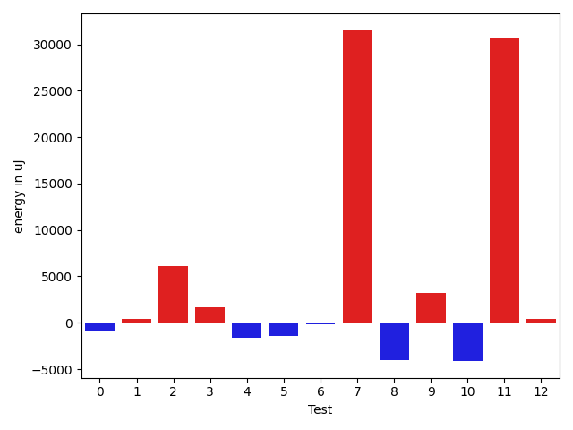

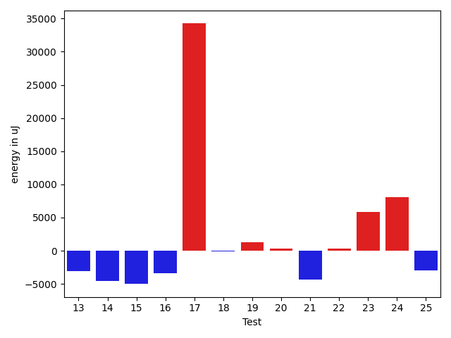

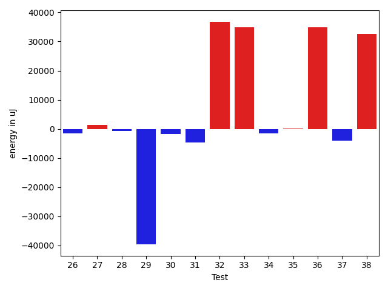

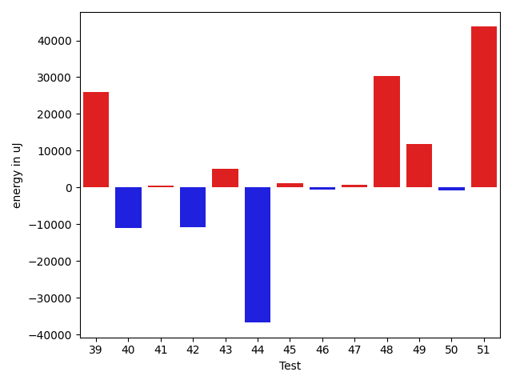

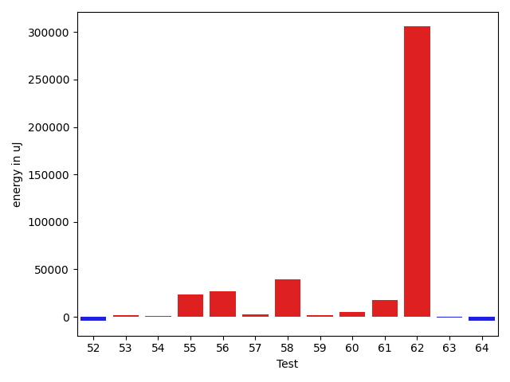

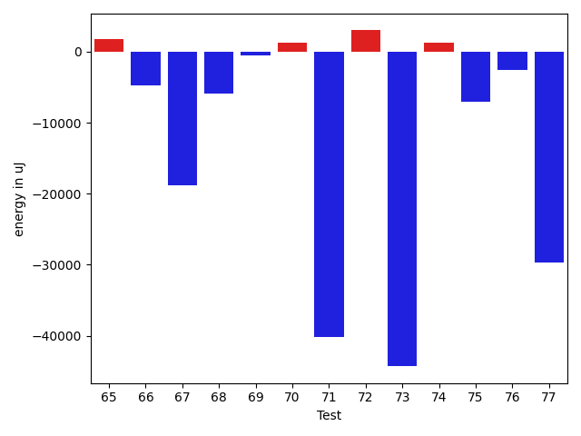

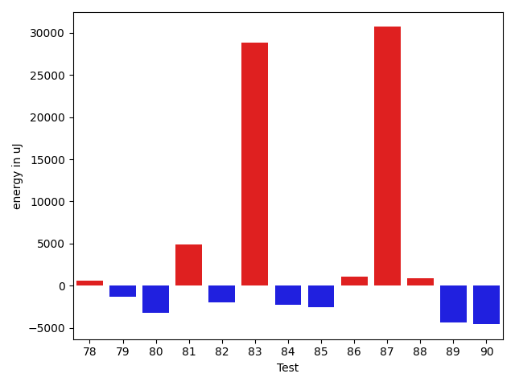

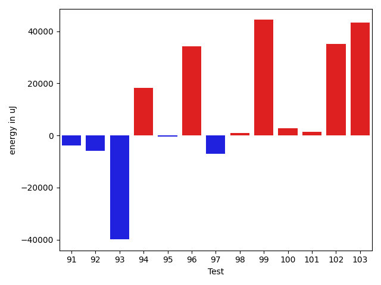

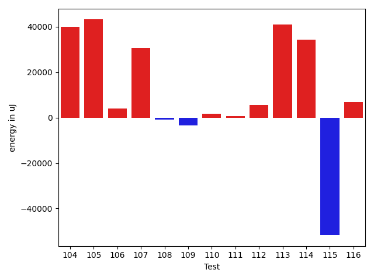

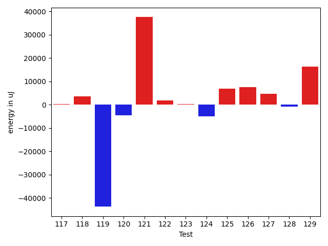

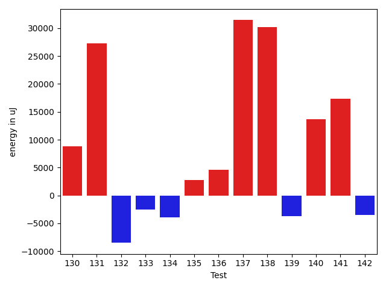

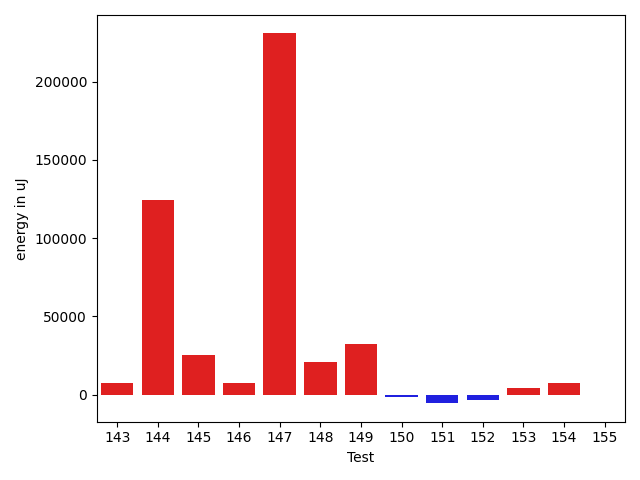

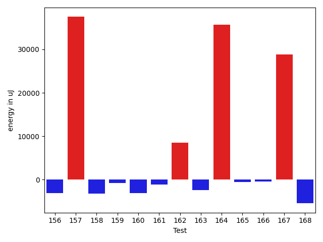

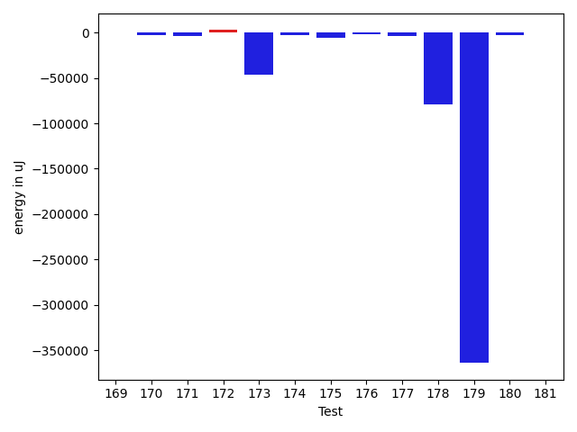

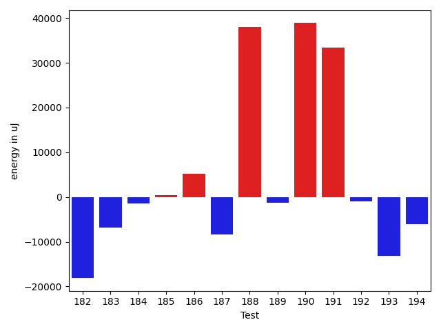

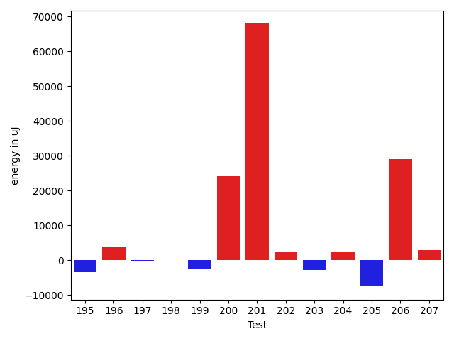

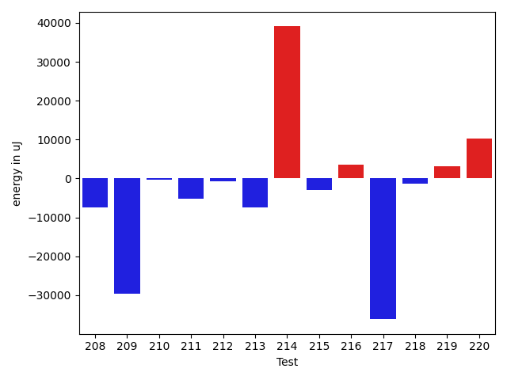

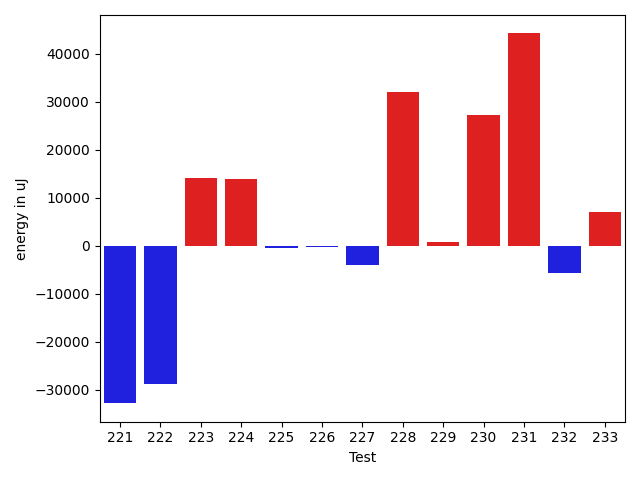

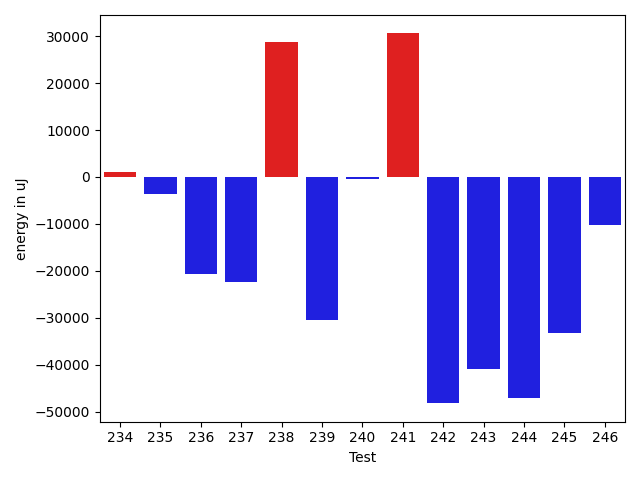

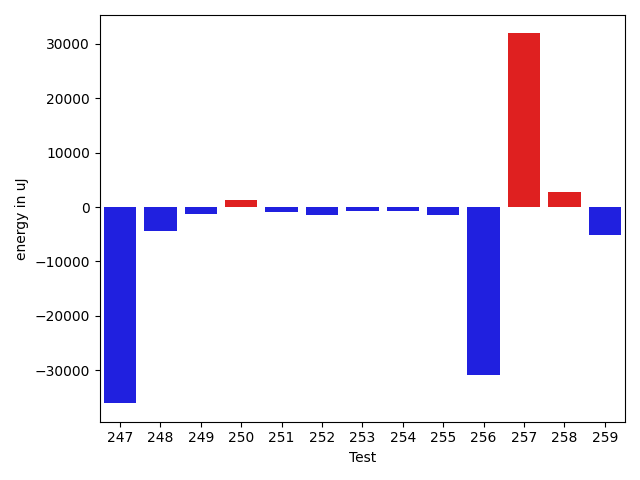

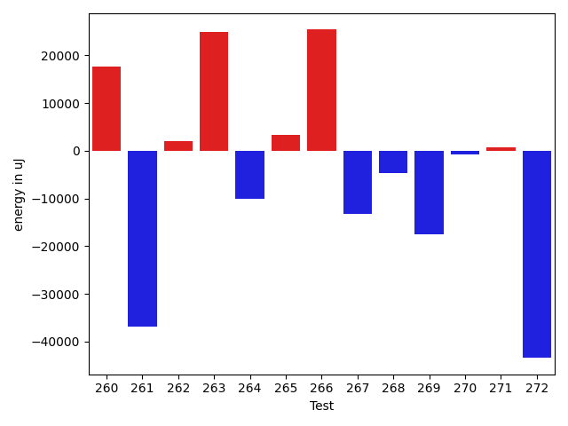

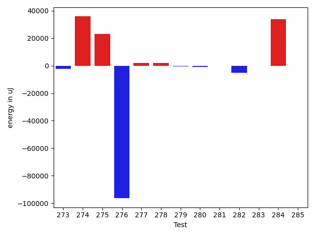

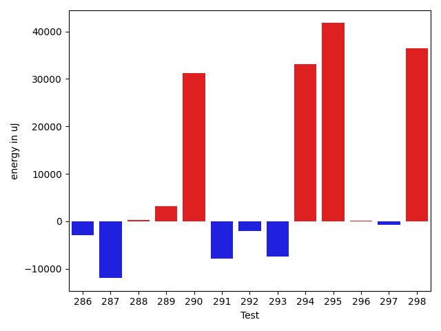

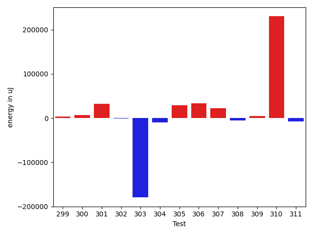

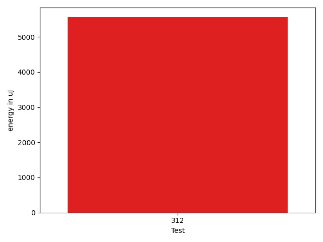

| ID | EnergyV1 | EnergyV2 | DeltaEnergy | σV1 | %σV1 | σV2 | %σV2 |
| --- | --- | --- | --- | --- | --- | --- | --- |
| 0 | 86852 | 85999 | -853 | 23012.07 | 26.50 | 14317.97 | 16.65 |
| 1 | 74096 | 74524 | 428 | 17900.63 | 24.16 | 19134.57 | 25.68 |
| 2 | 122803 | 128906 | 6103 | 25799.64 | 21.01 | 26887.37 | 20.86 |
| 3 | 78430 | 80078 | 1648 | 17367.76 | 22.14 | 12026.95 | 15.02 |
| 4 | 77026 | 75439 | -1587 | 13902.87 | 18.05 | 16482.37 | 21.85 |
| 5 | 118652 | 117187 | -1465 | 18628.16 | 15.70 | 22052.29 | 18.82 |
| 6 | 152038 | 151855 | -183 | 17095.00 | 11.24 | 19004.66 | 12.52 |
| 7 | 89722 | 121276 | 31554 | 24546.81 | 27.36 | 21811.00 | 17.98 |
| 8 | 42969 | 38941 | -4028 | 1748.97 | 4.07 | 12522.90 | 32.16 |
| 9 | 86731 | 89965 | 3234 | 21383.14 | 24.65 | 11574.21 | 12.87 |
| 10 | 44250 | 40100 | -4150 | 20328.98 | 45.94 | 21033.20 | 52.45 |
| 11 | 46570 | 77270 | 30700 | 21369.41 | 45.89 | 18672.67 | 24.17 |
| 12 | 116821 | 117248 | 427 | 14751.96 | 12.63 | 20252.50 | 17.27 |
| 13 | 78491 | 75378 | -3113 | 5080.68 | 6.47 | 1535.71 | 2.04 |
| 14 | 252624 | 248047 | -4577 | 22249.46 | 8.81 | 19878.18 | 8.01 |
| 15 | 78980 | 73975 | -5005 | 13194.59 | 16.71 | 20546.28 | 27.77 |
| 16 | 87769 | 84350 | -3419 | 15136.32 | 17.25 | 22296.76 | 26.43 |
| 17 | 45043 | 79284 | 34241 | 21059.44 | 46.75 | 19701.34 | 24.85 |
| 18 | 89050 | 88928 | -122 | 15537.98 | 17.45 | 19106.81 | 21.49 |
| 19 | 80811 | 82092 | 1281 | 22281.87 | 27.57 | 22586.55 | 27.51 |
| 20 | 78857 | 79223 | 366 | 19206.03 | 24.36 | 3977.57 | 5.02 |
| 21 | 81420 | 77087 | -4333 | 21859.63 | 26.85 | 12675.05 | 16.44 |
| 22 | 42114 | 42481 | 367 | 1586.36 | 3.77 | 14462.07 | 34.04 |
| 23 | 83130 | 88989 | 5859 | 19418.11 | 23.36 | 30148.18 | 33.88 |
| 24 | 81482 | 89539 | 8057 | 20295.51 | 24.91 | 4590.34 | 5.13 |
| 25 | 81115 | 78186 | -2929 | 12476.57 | 15.38 | 4098.84 | 5.24 |
| 26 | 84838 | 83251 | -1587 | 2918.10 | 3.44 | 14957.41 | 17.97 |
| 27 | 41198 | 42663 | 1465 | 17566.70 | 42.64 | 17669.47 | 41.42 |
| 28 | 75073 | 74280 | -793 | 16757.96 | 22.32 | 17379.27 | 23.40 |
| 29 | 82214 | 42480 | -39734 | 22150.44 | 26.94 | 26437.49 | 62.24 |
| 30 | 84228 | 82458 | -1770 | 11956.04 | 14.19 | 16772.80 | 20.34 |
| 31 | 46082 | 41504 | -4578 | 20667.46 | 44.85 | 22761.76 | 54.84 |
| 32 | 41626 | 78430 | 36804 | 18970.99 | 45.57 | 16783.23 | 21.40 |
| 33 | 44006 | 78979 | 34973 | 18483.27 | 42.00 | 16059.16 | 20.33 |
| 34 | 42724 | 41076 | -1648 | 18545.70 | 43.41 | 13823.13 | 33.65 |
| 35 | 81787 | 81909 | 122 | 3148.06 | 3.85 | 19381.54 | 23.66 |
| 36 | 40893 | 75867 | 34974 | 14940.29 | 36.54 | 14350.07 | 18.91 |
| 37 | 127136 | 123169 | -3967 | 21725.90 | 17.09 | 17399.39 | 14.13 |
| 38 | 206176 | 238830 | 32654 | 21452.54 | 10.40 | 85863.18 | 35.95 |
| 39 | 82458 | 108459 | 26001 | 15326.63 | 18.59 | 18663.62 | 17.21 |
| 40 | 200561 | 189574 | -10987 | 25506.99 | 12.72 | 18251.55 | 9.63 |
| 41 | 39490 | 40039 | 549 | 23169.63 | 58.67 | 18068.29 | 45.13 |
| 42 | 122497 | 111633 | -10864 | 21458.35 | 17.52 | 18579.86 | 16.64 |
| 43 | 155395 | 160583 | 5188 | 18788.60 | 12.09 | 31684.91 | 19.73 |
| 44 | 202025 | 165283 | -36742 | 21224.78 | 10.51 | 23448.86 | 14.19 |
| 45 | 89416 | 90515 | 1099 | 16074.16 | 17.98 | 23696.43 | 26.18 |
| 46 | 75134 | 74524 | -610 | 19996.43 | 26.61 | 19292.17 | 25.89 |
| 47 | 79895 | 80566 | 671 | 4131.48 | 5.17 | 4041.39 | 5.02 |
| 48 | 41932 | 72265 | 30333 | 23911.37 | 57.02 | 17517.70 | 24.24 |
| 49 | 121460 | 133178 | 11718 | 21151.59 | 17.41 | 16218.48 | 12.18 |
| 50 | 74584 | 73853 | -731 | 19175.64 | 25.71 | 15408.38 | 20.86 |
| 51 | 182311 | 226013 | 43702 | 22677.35 | 12.44 | 47843.85 | 21.17 |
| 52 | 213928 | 209595 | -4333 | 18960.49 | 8.86 | 24948.45 | 11.90 |
| 53 | 229552 | 231078 | 1526 | 25825.71 | 11.25 | 13977.32 | 6.05 |
| 54 | 118896 | 119690 | 794 | 4312.47 | 3.63 | 17894.74 | 14.95 |
| 55 | 280028 | 303466 | 23438 | 37112.60 | 13.25 | 27747.39 | 9.14 |
| 56 | 83496 | 110778 | 27282 | 18007.99 | 21.57 | 10015.37 | 9.04 |
| 57 | 110413 | 112915 | 2502 | 17436.32 | 15.79 | 4003.53 | 3.55 |
| 58 | 117553 | 156982 | 39429 | 338809.10 | 288.22 | 39248.50 | 25.00 |
| 59 | 176941 | 178283 | 1342 | 29182.82 | 16.49 | 25872.24 | 14.51 |
| 60 | 111633 | 116332 | 4699 | 17510.50 | 15.69 | 13399.88 | 11.52 |
| 61 | 160095 | 177551 | 17456 | 22435.11 | 14.01 | 22579.72 | 12.72 |
| 62 | 135742 | 441406 | 305664 | 22390.22 | 16.49 | 168540.45 | 38.18 |
| 63 | 134949 | 134216 | -733 | 16304.48 | 12.08 | 56348.11 | 41.98 |
| 64 | 43212 | 39063 | -4149 | 2252.93 | 5.21 | 1320.96 | 3.38 |
| 65 | 138489 | 140258 | 1769 | 65552.89 | 47.33 | 28756.55 | 20.50 |
| 66 | 177063 | 172363 | -4700 | 34431.17 | 19.45 | 12764.31 | 7.41 |
| 67 | 150574 | 131713 | -18861 | 26789.70 | 17.79 | 21588.68 | 16.39 |
| 68 | 84960 | 79041 | -5919 | 30506.38 | 35.91 | 16857.33 | 21.33 |
| 69 | 114074 | 113526 | -548 | 18991.38 | 16.65 | 19572.34 | 17.24 |
| 70 | 42236 | 43457 | 1221 | 19482.12 | 46.13 | 18946.08 | 43.60 |
| 71 | 85815 | 45655 | -40160 | 22875.61 | 26.66 | 22040.81 | 48.28 |
| 72 | 80933 | 83923 | 2990 | 19668.88 | 24.30 | 18314.85 | 21.82 |
| 73 | 1765987 | 1721676 | -44311 | 107378.33 | 6.08 | 76320.25 | 4.43 |
| 74 | 127929 | 129151 | 1222 | 21633.97 | 16.91 | 15390.15 | 11.92 |
| 75 | 175781 | 168700 | -7081 | 21482.77 | 12.22 | 24155.62 | 14.32 |
| 76 | 91064 | 88501 | -2563 | 3611.14 | 3.97 | 15832.75 | 17.89 |
| 77 | 162841 | 133179 | -29662 | 21133.10 | 12.98 | 31246.09 | 23.46 |
| 78 | 75683 | 76233 | 550 | 1884.98 | 2.49 | 1847.87 | 2.42 |
| 79 | 41260 | 39978 | -1282 | 16723.92 | 40.53 | 19021.09 | 47.58 |
| 80 | 84167 | 80932 | -3235 | 26255.35 | 31.19 | 20479.81 | 25.30 |
| 81 | 127929 | 132812 | 4883 | 20718.31 | 16.20 | 20408.16 | 15.37 |
| 82 | 79223 | 77210 | -2013 | 17092.40 | 21.58 | 12284.74 | 15.91 |
| 83 | 78125 | 106994 | 28869 | 3327.20 | 4.26 | 23152.25 | 21.64 |
| 84 | 91614 | 89355 | -2259 | 14226.33 | 15.53 | 4558.03 | 5.10 |
| 85 | 116944 | 114380 | -2564 | 22676.35 | 19.39 | 18470.30 | 16.15 |
| 86 | 76538 | 77576 | 1038 | 12288.55 | 16.06 | 11157.91 | 14.38 |
| 87 | 153137 | 183838 | 30701 | 40483.07 | 26.44 | 18033.21 | 9.81 |
| 88 | 191894 | 192810 | 916 | 35329.30 | 18.41 | 21510.90 | 11.16 |
| 89 | 124450 | 120117 | -4333 | 21180.13 | 17.02 | 36299.09 | 30.22 |
| 90 | 140259 | 135681 | -4578 | 21161.68 | 15.09 | 22095.58 | 16.28 |
| 91 | 86670 | 82824 | -3846 | 20266.50 | 23.38 | 26027.00 | 31.42 |
| 92 | 121399 | 115418 | -5981 | 4011.78 | 3.30 | 22232.88 | 19.26 |
| 93 | 200500 | 160583 | -39917 | 20933.26 | 10.44 | 21792.26 | 13.57 |
| 94 | 203613 | 221984 | 18371 | 24737.11 | 12.15 | 19787.00 | 8.91 |
| 95 | 116394 | 115966 | -428 | 18010.43 | 15.47 | 20016.10 | 17.26 |
| 96 | 42663 | 76843 | 34180 | 21302.69 | 49.93 | 11324.03 | 14.74 |
| 97 | 233154 | 226073 | -7081 | 17774.29 | 7.62 | 28208.92 | 12.48 |
| 98 | 39246 | 40283 | 1037 | 16459.85 | 41.94 | 15930.59 | 39.55 |
| 99 | 132873 | 177246 | 44373 | 22443.16 | 16.89 | 25715.28 | 14.51 |
| 100 | 114197 | 116882 | 2685 | 21854.68 | 19.14 | 14571.11 | 12.47 |
| 101 | 110718 | 112121 | 1403 | 15814.69 | 14.28 | 12169.24 | 10.85 |
| 102 | 78247 | 113464 | 35217 | 17198.36 | 21.98 | 19952.29 | 17.58 |
| 103 | 76904 | 120361 | 43457 | 19771.67 | 25.71 | 15308.44 | 12.72 |
| 104 | 177184 | 217162 | 39978 | 20289.48 | 11.45 | 18178.40 | 8.37 |
| 105 | 134765 | 177917 | 43152 | 22543.92 | 16.73 | 27622.95 | 15.53 |
| 106 | 151550 | 155639 | 4089 | 18318.28 | 12.09 | 16008.32 | 10.29 |
| 107 | 214965 | 245666 | 30701 | 25263.38 | 11.75 | 16584.76 | 6.75 |
| 108 | 74951 | 73974 | -977 | 17703.10 | 23.62 | 18832.32 | 25.46 |
| 109 | 85205 | 81848 | -3357 | 12906.81 | 15.15 | 12110.78 | 14.80 |
| 110 | 39551 | 41137 | 1586 | 19829.46 | 50.14 | 17184.89 | 41.77 |
| 111 | 134765 | 135436 | 671 | 17259.39 | 12.81 | 27327.35 | 20.18 |
| 112 | 117187 | 122741 | 5554 | 19629.04 | 16.75 | 12566.01 | 10.24 |
| 113 | 44007 | 85022 | 41015 | 21326.99 | 48.46 | 14852.31 | 17.47 |
| 114 | 352538 | 386717 | 34179 | 26565.65 | 7.54 | 35388.49 | 9.15 |
| 115 | 354125 | 302368 | -51757 | 20784.28 | 5.87 | 46503.98 | 15.38 |
| 116 | 174255 | 181091 | 6836 | 19121.52 | 10.97 | 21197.78 | 11.71 |
| 117 | 147888 | 148132 | 244 | 17584.31 | 11.89 | 14281.37 | 9.64 |
| 118 | 208861 | 212524 | 3663 | 21557.45 | 10.32 | 38840.04 | 18.28 |
| 119 | 83496 | 39734 | -43762 | 18508.03 | 22.17 | 16830.15 | 42.36 |
| 120 | 298033 | 293518 | -4515 | 16835.62 | 5.65 | 28084.92 | 9.57 |
| 121 | 312926 | 350463 | 37537 | 36708.53 | 11.73 | 24417.20 | 6.97 |
| 122 | 165954 | 167725 | 1771 | 23013.41 | 13.87 | 20044.31 | 11.95 |
| 123 | 41382 | 41748 | 366 | 2170.39 | 5.24 | 11144.77 | 26.70 |
| 124 | 87341 | 82397 | -4944 | 19882.78 | 22.76 | 12326.14 | 14.96 |
| 125 | 150939 | 157714 | 6775 | 17583.36 | 11.65 | 21348.28 | 13.54 |
| 126 | 182861 | 190490 | 7629 | 20084.24 | 10.98 | 21810.75 | 11.45 |
| 127 | 150939 | 155517 | 4578 | 16059.89 | 10.64 | 16772.94 | 10.79 |
| 128 | 40406 | 39490 | -916 | 1876.66 | 4.64 | 12875.63 | 32.60 |
| 129 | 517516 | 533751 | 16235 | 57953.42 | 11.20 | 29785.69 | 5.58 |
| 130 | 192443 | 201293 | 8850 | 149725.55 | 77.80 | 31184.84 | 15.49 |
| 131 | 313110 | 340392 | 27282 | 14021.10 | 4.48 | 33970.39 | 9.98 |
| 132 | 184569 | 176086 | -8483 | 20366.21 | 11.03 | 20184.89 | 11.46 |
| 133 | 150268 | 147765 | -2503 | 6519.09 | 4.34 | 16911.98 | 11.45 |
| 134 | 124756 | 120788 | -3968 | 14863.30 | 11.91 | 15381.39 | 12.73 |
| 135 | 80017 | 82824 | 2807 | 15551.82 | 19.44 | 14749.96 | 17.81 |
| 136 | 251220 | 255859 | 4639 | 15994.46 | 6.37 | 18822.75 | 7.36 |
| 137 | 248595 | 280029 | 31434 | 23754.88 | 9.56 | 16687.83 | 5.96 |
| 138 | 232361 | 262512 | 30151 | 11952.06 | 5.14 | 22775.73 | 8.68 |
| 139 | 222168 | 218506 | -3662 | 19574.56 | 8.81 | 30899.85 | 14.14 |
| 140 | 266661 | 280334 | 13673 | 20448.88 | 7.67 | 21155.81 | 7.55 |
| 141 | 230468 | 247863 | 17395 | 37284.04 | 16.18 | 27271.36 | 11.00 |
| 142 | 226257 | 222778 | -3479 | 18183.41 | 8.04 | 12410.02 | 5.57 |
| 143 | 350036 | 357787 | 7751 | 26726.54 | 7.64 | 33975.83 | 9.50 |
| 144 | 591978 | 716490 | 124512 | 24286.19 | 4.10 | 49680.63 | 6.93 |
| 145 | 332457 | 358092 | 25635 | 41039.40 | 12.34 | 47399.33 | 13.24 |
| 146 | 247864 | 255248 | 7384 | 37198.23 | 15.01 | 42610.86 | 16.69 |
| 147 | 1035459 | 1266171 | 230712 | 84663.29 | 8.18 | 109085.36 | 8.62 |
| 148 | 358520 | 379454 | 20934 | 20352.70 | 5.68 | 25281.46 | 6.66 |
| 149 | 44556 | 76843 | 32287 | 22811.30 | 51.20 | 21535.08 | 28.02 |
| 150 | 41321 | 40161 | -1160 | 20294.72 | 49.11 | 18840.40 | 46.91 |
| 151 | 293700 | 288268 | -5432 | 37389.01 | 12.73 | 21205.05 | 7.36 |
| 152 | 81177 | 78125 | -3052 | 20577.72 | 25.35 | 18594.47 | 23.80 |
| 153 | 84778 | 88989 | 4211 | 22949.28 | 27.07 | 14837.76 | 16.67 |
| 154 | 127624 | 135375 | 7751 | 22147.17 | 17.35 | 21593.25 | 15.95 |
| 155 | 39245 | 38940 | -305 | 15208.35 | 38.75 | 18768.42 | 48.20 |
| 156 | 85144 | 82092 | -3052 | 117100.34 | 137.53 | 2555.17 | 3.11 |
| 157 | 42297 | 79773 | 37476 | 17259.25 | 40.80 | 21297.99 | 26.70 |
| 158 | 166809 | 163635 | -3174 | 182411.18 | 109.35 | 25594.97 | 15.64 |
| 159 | 111755 | 111023 | -732 | 17389.13 | 15.56 | 14629.86 | 13.18 |
| 160 | 89478 | 86364 | -3114 | 17023.87 | 19.03 | 13328.00 | 15.43 |
| 161 | 84595 | 83495 | -1100 | 152999.67 | 180.86 | 12971.86 | 15.54 |
| 162 | 82580 | 91064 | 8484 | 20151.25 | 24.40 | 15282.68 | 16.78 |
| 163 | 76294 | 73853 | -2441 | 12758.52 | 16.72 | 15058.77 | 20.39 |
| 164 | 46570 | 82275 | 35705 | 18561.79 | 39.86 | 27623.90 | 33.58 |
| 165 | 43396 | 42847 | -549 | 19312.55 | 44.50 | 17607.51 | 41.09 |
| 166 | 84656 | 84228 | -428 | 4769.97 | 5.63 | 13495.78 | 16.02 |
| 167 | 46142 | 74951 | 28809 | 19429.08 | 42.11 | 16849.35 | 22.48 |
| 168 | 93078 | 87646 | -5432 | 27085.11 | 29.10 | 19488.66 | 22.24 |
| 169 | 88501 | 89172 | 671 | 26972.44 | 30.48 | 22900.54 | 25.68 |
| 170 | 44434 | 42175 | -2259 | 19761.82 | 44.47 | 14350.78 | 34.03 |
| 171 | 89355 | 85754 | -3601 | 27310.02 | 30.56 | 24568.65 | 28.65 |
| 172 | 90698 | 93445 | 2747 | 12712.14 | 14.02 | 25696.70 | 27.50 |
| 173 | 164977 | 118836 | -46141 | 24573.83 | 14.90 | 19038.84 | 16.02 |
| 174 | 82580 | 79956 | -2624 | 22972.58 | 27.82 | 2900.24 | 3.63 |
| 175 | 78613 | 73120 | -5493 | 18459.37 | 23.48 | 23928.60 | 32.73 |
| 176 | 75501 | 73974 | -1527 | 20151.78 | 26.69 | 17766.36 | 24.02 |
| 177 | 89600 | 85754 | -3846 | 18353.26 | 20.48 | 24363.74 | 28.41 |
| 178 | 1700557 | 1621822 | -78735 | 192213.17 | 11.30 | 109812.74 | 6.77 |
| 179 | 2001338 | 1637325 | -364013 | 260655.16 | 13.02 | 264566.37 | 16.16 |
| 180 | 43884 | 41565 | -2319 | 89819.91 | 204.68 | 937.59 | 2.26 |
| 181 | 76355 | 76538 | 183 | 14112.78 | 18.48 | 12029.16 | 15.72 |
| 182 | 161193 | 143066 | -18127 | 15214.07 | 9.44 | 23973.27 | 16.76 |
| 183 | 90515 | 83740 | -6775 | 12854.78 | 14.20 | 4832.26 | 5.77 |
| 184 | 41382 | 39978 | -1404 | 14021.26 | 33.88 | 2632.49 | 6.58 |
| 185 | 77149 | 77514 | 365 | 10896.39 | 14.12 | 16133.44 | 20.81 |
| 186 | 318541 | 323791 | 5250 | 57557.14 | 18.07 | 32961.01 | 10.18 |
| 187 | 133789 | 125366 | -8423 | 19089.32 | 14.27 | 23686.80 | 18.89 |
| 188 | 39673 | 77697 | 38024 | 12064.45 | 30.41 | 19394.59 | 24.96 |
| 189 | 41503 | 40161 | -1342 | 13958.74 | 33.63 | 12214.87 | 30.41 |
| 190 | 133423 | 172302 | 38879 | 21919.50 | 16.43 | 25684.18 | 14.91 |
| 191 | 43213 | 76660 | 33447 | 16424.72 | 38.01 | 206958.35 | 269.97 |
| 192 | 77209 | 76294 | -915 | 20411.73 | 26.44 | 18874.99 | 24.74 |
| 193 | 138427 | 125305 | -13122 | 27077.23 | 19.56 | 10323.14 | 8.24 |
| 194 | 94360 | 88257 | -6103 | 23023.64 | 24.40 | 19736.43 | 22.36 |
| 195 | 178161 | 174804 | -3357 | 18041.24 | 10.13 | 24314.10 | 13.91 |
| 196 | 201782 | 205749 | 3967 | 23418.15 | 11.61 | 36401.26 | 17.69 |
| 197 | 82702 | 82398 | -304 | 11179.83 | 13.52 | 11088.43 | 13.46 |
| 198 | 82397 | 82397 | 0 | 250380.72 | 303.87 | 11758.14 | 14.27 |
| 199 | 78735 | 76233 | -2502 | 15875.40 | 20.16 | 13700.56 | 17.97 |
| 200 | 151611 | 175842 | 24231 | 29850.51 | 19.69 | 25208.16 | 14.34 |
| 201 | 1626521 | 1694453 | 67932 | 56010.37 | 3.44 | 95740.92 | 5.65 |
| 202 | 131774 | 134155 | 2381 | 20399.58 | 15.48 | 14057.11 | 10.48 |
| 203 | 87890 | 85083 | -2807 | 16248.89 | 18.49 | 17615.72 | 20.70 |
| 204 | 176818 | 179138 | 2320 | 7926.71 | 4.48 | 30800.59 | 17.19 |
| 205 | 177856 | 170288 | -7568 | 18033.98 | 10.14 | 33097.26 | 19.44 |
| 206 | 179382 | 208313 | 28931 | 20968.38 | 11.69 | 21094.48 | 10.13 |
| 207 | 117919 | 120849 | 2930 | 18604.30 | 15.78 | 16463.23 | 13.62 |
| 208 | 227539 | 220153 | -7386 | 229174.19 | 100.72 | 26225.30 | 11.91 |
| 209 | 122986 | 93383 | -29603 | 21714.48 | 17.66 | 25025.19 | 26.80 |
| 210 | 78552 | 78247 | -305 | 16760.67 | 21.34 | 18201.01 | 23.26 |
| 211 | 150207 | 144897 | -5310 | 17360.19 | 11.56 | 16139.16 | 11.14 |
| 212 | 91797 | 91003 | -794 | 20387.03 | 22.21 | 23332.64 | 25.64 |
| 213 | 82519 | 75134 | -7385 | 21107.50 | 25.58 | 17432.95 | 23.20 |
| 214 | 93994 | 133056 | 39062 | 24398.98 | 25.96 | 19670.80 | 14.78 |
| 215 | 84472 | 81482 | -2990 | 21018.69 | 24.88 | 18091.93 | 22.20 |
| 216 | 123901 | 127441 | 3540 | 28173.97 | 22.74 | 21880.89 | 17.17 |
| 217 | 78308 | 42114 | -36194 | 21704.32 | 27.72 | 19489.37 | 46.28 |
| 218 | 82581 | 81238 | -1343 | 23554.68 | 28.52 | 12546.64 | 15.44 |
| 219 | 76355 | 79590 | 3235 | 18924.57 | 24.78 | 13791.24 | 17.33 |
| 220 | 78674 | 88928 | 10254 | 23363.47 | 29.70 | 7873.26 | 8.85 |
| 221 | 78613 | 45838 | -32775 | 25436.15 | 32.36 | 21420.67 | 46.73 |
| 222 | 494140 | 465392 | -28748 | 107803.40 | 21.82 | 36218.52 | 7.78 |
| 223 | 119812 | 133850 | 14038 | 22046.97 | 18.40 | 18869.73 | 14.10 |
| 224 | 161804 | 175659 | 13855 | 22215.66 | 13.73 | 27342.86 | 15.57 |
| 225 | 90881 | 90332 | -549 | 19508.39 | 21.47 | 18670.23 | 20.67 |
| 226 | 139831 | 139526 | -305 | 28847.49 | 20.63 | 32027.48 | 22.95 |
| 227 | 121948 | 117859 | -4089 | 26698.18 | 21.89 | 38076.83 | 32.31 |
| 228 | 42968 | 75012 | 32044 | 17328.92 | 40.33 | 18584.24 | 24.78 |
| 229 | 92041 | 92773 | 732 | 19728.97 | 21.43 | 18673.71 | 20.13 |
| 230 | 45471 | 72754 | 27283 | 18567.52 | 40.83 | 19673.07 | 27.04 |
| 231 | 86060 | 130249 | 44189 | 21438.36 | 24.91 | 5450.86 | 4.18 |
| 232 | 332519 | 326781 | -5738 | 24593.76 | 7.40 | 33665.37 | 10.30 |
| 233 | 81604 | 88684 | 7080 | 12487.18 | 15.30 | 16446.27 | 18.54 |
| 234 | 75317 | 76415 | 1098 | 19327.18 | 25.66 | 19435.18 | 25.43 |
| 235 | 131286 | 127624 | -3662 | 21068.23 | 16.05 | 23075.48 | 18.08 |
| 236 | 152221 | 131470 | -20751 | 47265.23 | 31.05 | 24036.17 | 18.28 |
| 237 | 113587 | 91308 | -22279 | 26753.89 | 23.55 | 24394.99 | 26.72 |
| 238 | 80200 | 108947 | 28747 | 21996.38 | 27.43 | 16991.68 | 15.60 |
| 239 | 238159 | 207703 | -30456 | 22737.37 | 9.55 | 46794.81 | 22.53 |
| 240 | 130493 | 130004 | -489 | 12302.17 | 9.43 | 19895.92 | 15.30 |
| 241 | 81115 | 111694 | 30579 | 23513.90 | 28.99 | 18575.84 | 16.63 |
| 242 | 141724 | 93506 | -48218 | 26057.77 | 18.39 | 31256.25 | 33.43 |
| 243 | 126464 | 85632 | -40832 | 14461.77 | 11.44 | 20990.23 | 24.51 |
| 244 | 227111 | 179992 | -47119 | 15118.12 | 6.66 | 15847.51 | 8.80 |
| 245 | 74157 | 40955 | -33202 | 20266.59 | 27.33 | 20596.41 | 50.29 |
| 246 | 115661 | 105346 | -10315 | 30519.99 | 26.39 | 27044.20 | 25.67 |
| 247 | 126464 | 90393 | -36071 | 24655.16 | 19.50 | 23519.51 | 26.02 |
| 248 | 122924 | 118591 | -4333 | 13483.75 | 10.97 | 17661.13 | 14.89 |
| 249 | 85144 | 83801 | -1343 | 18788.73 | 22.07 | 12888.90 | 15.38 |
| 250 | 172791 | 174011 | 1220 | 14956.00 | 8.66 | 20438.99 | 11.75 |
| 251 | 163757 | 162902 | -855 | 21681.97 | 13.24 | 9924.07 | 6.09 |
| 252 | 74829 | 73364 | -1465 | 15481.31 | 20.69 | 15816.10 | 21.56 |
| 253 | 83618 | 82885 | -733 | 20117.65 | 24.06 | 17431.75 | 21.03 |
| 254 | 79711 | 78979 | -732 | 13887.34 | 17.42 | 3276.62 | 4.15 |
| 255 | 75927 | 74462 | -1465 | 17636.67 | 23.23 | 15811.36 | 21.23 |
| 256 | 186461 | 155639 | -30822 | 21204.92 | 11.37 | 21888.56 | 14.06 |
| 257 | 185974 | 217895 | 31921 | 14069.69 | 7.57 | 11483.93 | 5.27 |
| 258 | 43213 | 45898 | 2685 | 1540.06 | 3.56 | 20253.88 | 44.13 |
| 259 | 92957 | 87769 | -5188 | 14738.45 | 15.86 | 4349.53 | 4.96 |
| 260 | 171142 | 188842 | 17700 | 21723.69 | 12.69 | 21327.16 | 11.29 |
| 261 | 82214 | 45349 | -36865 | 17501.21 | 21.29 | 20608.60 | 45.44 |
| 262 | 195373 | 197326 | 1953 | 14419.24 | 7.38 | 25045.66 | 12.69 |
| 263 | 164489 | 189452 | 24963 | 19260.18 | 11.71 | 13167.94 | 6.95 |
| 264 | 446166 | 436156 | -10010 | 26899.25 | 6.03 | 37234.40 | 8.54 |
| 265 | 182250 | 185546 | 3296 | 19039.17 | 10.45 | 16706.76 | 9.00 |
| 266 | 167114 | 192504 | 25390 | 20887.97 | 12.50 | 22346.95 | 11.61 |
| 267 | 88928 | 75806 | -13122 | 19316.12 | 21.72 | 11128.86 | 14.68 |
| 268 | 42969 | 38269 | -4700 | 2104.09 | 4.90 | 2448.32 | 6.40 |
| 269 | 249450 | 231994 | -17456 | 30310.21 | 12.15 | 23750.89 | 10.24 |
| 270 | 75317 | 74585 | -732 | 19388.12 | 25.74 | 18082.82 | 24.24 |
| 271 | 80566 | 81360 | 794 | 22399.79 | 27.80 | 11115.15 | 13.66 |
| 272 | 123779 | 80383 | -43396 | 18107.85 | 14.63 | 21885.28 | 27.23 |
| 273 | 46814 | 44678 | -2136 | 16115.48 | 34.42 | 21276.78 | 47.62 |
| 274 | 82947 | 118775 | 35828 | 16428.15 | 19.81 | 21477.85 | 18.08 |
| 275 | 3680715 | 3703909 | 23194 | 633189.71 | 17.20 | 548764.03 | 14.82 |
| 276 | 4347523 | 4251088 | -96435 | 586475.92 | 13.49 | 705861.83 | 16.60 |
| 277 | 124390 | 126464 | 2074 | 78163.19 | 62.84 | 24694.64 | 19.53 |
| 278 | 88867 | 90759 | 1892 | 25731.36 | 28.95 | 19612.36 | 21.61 |
| 279 | 75989 | 75622 | -367 | 2134.70 | 2.81 | 12764.37 | 16.88 |
| 280 | 87097 | 86425 | -672 | 14364.06 | 16.49 | 20329.15 | 23.52 |
| 281 | 85510 | 85205 | -305 | 23345.26 | 27.30 | 17870.76 | 20.97 |
| 282 | 90271 | 85082 | -5189 | 11895.84 | 13.18 | 13760.52 | 16.17 |
| 283 | 77454 | 77149 | -305 | 1906.41 | 2.46 | 19055.46 | 24.70 |
| 284 | 44433 | 78308 | 33875 | 20372.36 | 45.85 | 25909.93 | 33.09 |
| 285 | 77026 | 76965 | -61 | 14904.05 | 19.35 | 15514.75 | 20.16 |
| 286 | 81909 | 79041 | -2868 | 13551.52 | 16.54 | 16166.25 | 20.45 |
| 287 | 328002 | 316039 | -11963 | 39217.91 | 11.96 | 18237.06 | 5.77 |
| 288 | 183227 | 183532 | 305 | 20327.48 | 11.09 | 12538.16 | 6.83 |
| 289 | 77453 | 80689 | 3236 | 18225.95 | 23.53 | 12020.55 | 14.90 |
| 290 | 195556 | 226807 | 31251 | 14456.58 | 7.39 | 371172.61 | 163.65 |
| 291 | 351317 | 343505 | -7812 | 37531.23 | 10.68 | 63964.81 | 18.62 |
| 292 | 206603 | 204529 | -2074 | 22387.24 | 10.84 | 23859.75 | 11.67 |
| 293 | 120483 | 113037 | -7446 | 20014.76 | 16.61 | 10968.83 | 9.70 |
| 294 | 45655 | 78797 | 33142 | 22041.89 | 48.28 | 20191.32 | 25.62 |
| 295 | 47546 | 89294 | 41748 | 20669.53 | 43.47 | 22336.04 | 25.01 |
| 296 | 77575 | 77636 | 61 | 18502.37 | 23.85 | 16792.54 | 21.63 |
| 297 | 91125 | 90332 | -793 | 2621.21 | 2.88 | 29113.61 | 32.23 |
| 298 | 85144 | 121582 | 36438 | 21478.41 | 25.23 | 18649.71 | 15.34 |
| 299 | 39917 | 43029 | 3112 | 1895.96 | 4.75 | 19293.05 | 44.84 |
| 300 | 89600 | 96008 | 6408 | 3701.62 | 4.13 | 23719.76 | 24.71 |
| 301 | 43884 | 76659 | 32775 | 23614.09 | 53.81 | 12815.29 | 16.72 |
| 302 | 266357 | 265014 | -1343 | 15826.59 | 5.94 | 19879.07 | 7.50 |
| 303 | 443480 | 263915 | -179565 | 45873.72 | 10.34 | 29713.93 | 11.26 |
| 304 | 184082 | 173827 | -10255 | 23466.87 | 12.75 | 23594.81 | 13.57 |
| 305 | 149536 | 178711 | 29175 | 21750.68 | 14.55 | 27061.10 | 15.14 |
| 306 | 114746 | 148376 | 33630 | 15605.04 | 13.60 | 17915.25 | 12.07 |
| 307 | 244201 | 266113 | 21912 | 54828.15 | 22.45 | 25185.52 | 9.46 |
| 308 | 85754 | 80749 | -5005 | 13775.16 | 16.06 | 21037.36 | 26.05 |
| 309 | 163634 | 167846 | 4212 | 48511.09 | 29.65 | 16179.24 | 9.64 |
| 310 | 762633 | 992612 | 229979 | 53792.75 | 7.05 | 50492.15 | 5.09 |
| 311 | 135010 | 126952 | -8058 | 26663.17 | 19.75 | 19097.86 | 15.04 |
| 312 | 311095 | 316650 | 5555 | 28151.88 | 9.05 | 152272.15 | 48.09 |

## Misc.

| ID | Test Class | Test Method |
| --- | --- | --- |
| 0 | com.google.gson.functional.PrimitiveTest | testDeserializePrimitiveWrapperAsObjectField |
| 1 | com.google.gson.functional.ObjectTest | testStringFieldWithEmptyValueDeserialization |
| 2 | com.google.gson.functional.ObjectTest | testNullObjectFieldsDeserialization |
| 3 | com.google.gson.functional.ObjectTest | testEmptyCollectionInAnObjectDeserialization |
| 4 | com.google.gson.functional.ObjectTest | testNestedSerialization |
| 5 | com.google.gson.functional.ObjectTest | testArrayOfArraysDeserialization |
| 6 | com.google.gson.functional.ObjectTest | testSingletonLists |
| 7 | com.google.gson.functional.ObjectTest | testNullFieldsSerialization |
| 8 | com.google.gson.functional.ObjectTest | testClassWithNoFieldsDeserialization |
| 9 | com.google.gson.functional.ObjectTest | testClassWithTransientFieldsDeserialization |
| 10 | com.google.gson.functional.ObjectTest | testStringFieldWithNumberValueDeserialization |
| 11 | com.google.gson.functional.ObjectTest | testPrivateNoArgConstructorDeserialization |
| 12 | com.google.gson.functional.ObjectTest | testArrayOfObjectsAsFields |
| 13 | com.google.gson.functional.ObjectTest | testClassWithTransientFieldsDeserializationTransientFieldsPassedInJsonAreIgnored |
| 14 | com.google.gson.functional.ObjectTest | testDateAsMapObjectField |
| 15 | com.google.gson.functional.ObjectTest | testPrimitiveArrayFieldSerialization |
| 16 | com.google.gson.functional.ObjectTest | testPrimitiveArrayInAnObjectDeserialization |
| 17 | com.google.gson.functional.ObjectTest | testClassWithNoFieldsSerialization |
| 18 | com.google.gson.functional.ObjectTest | testStringFieldWithEmptyValueSerialization |
| 19 | com.google.gson.functional.ObjectTest | testNullArraysDeserialization |
| 20 | com.google.gson.functional.ObjectTest | testInnerClassSerialization |
| 21 | com.google.gson.functional.ObjectTest | testEmptyCollectionInAnObjectSerialization |
| 22 | com.google.gson.functional.ObjectTest | testClassWithObjectFieldSerialization |
| 23 | com.google.gson.functional.ObjectTest | testBagOfPrimitiveWrappersSerialization |
| 24 | com.google.gson.functional.ObjectTest | testObjectFieldNamesWithoutQuotesDeserialization |
| 25 | com.google.gson.functional.ObjectTest | testArrayOfObjectsDeserialization |
| 26 | com.google.gson.functional.ObjectTest | testArrayOfArraysSerialization |
| 27 | com.google.gson.functional.ObjectTest | testJsonInSingleQuotesDeserialization |
| 28 | com.google.gson.functional.ObjectTest | testBagOfPrimitivesSerialization |
| 29 | com.google.gson.functional.ObjectTest | testNestedDeserialization |
| 30 | com.google.gson.functional.ObjectTest | testBagOfPrimitiveWrappersDeserialization |
| 31 | com.google.gson.functional.ObjectTest | testJsonInMixedQuotesDeserialization |
| 32 | com.google.gson.functional.ObjectTest | testNullFieldsDeserialization |
| 33 | com.google.gson.functional.ObjectTest | testArrayOfObjectsSerialization |
| 34 | com.google.gson.functional.ObjectTest | testClassWithTransientFieldsSerialization |
| 35 | com.google.gson.functional.ObjectTest | testNullPrimitiveFieldsDeserialization |
| 36 | com.google.gson.functional.ObjectTest | testBagOfPrimitivesDeserialization |
| 37 | com.google.gson.functional.ObjectTest | testInnerClassDeserialization |
| 38 | com.google.gson.functional.StreamingTypeAdaptersTest | testNullSafe |
| 39 | com.google.gson.functional.StreamingTypeAdaptersTest | testSerializeWithCustomTypeAdapter |
| 40 | com.google.gson.functional.StreamingTypeAdaptersTest | testDeserializeWithCustomTypeAdapter |
| 41 | com.google.gson.functional.StreamingTypeAdaptersTest | testSerializeRecursive |
| 42 | com.google.gson.functional.JsonAdapterAnnotationOnClassesTest | testJsonAdapterInvoked |
| 43 | com.google.gson.functional.JsonAdapterAnnotationOnClassesTest | testRegisteredDeserializerOverridesJsonAdapter |
| 44 | com.google.gson.functional.JsonAdapterAnnotationOnClassesTest | testRegisteredSerializerOverridesJsonAdapter |
| 45 | com.google.gson.functional.JsonAdapterAnnotationOnClassesTest | testSuperclassTypeAdapterNotInvoked |
| 46 | com.google.gson.functional.JsonAdapterAnnotationOnClassesTest | testNullSafeObjectFromJson |
| 47 | com.google.gson.functional.JsonAdapterAnnotationOnClassesTest | testIncorrectTypeAdapterFails |
| 48 | com.google.gson.functional.JsonAdapterAnnotationOnClassesTest | testJsonAdapterFactoryInvoked |
| 49 | com.google.gson.functional.CustomDeserializerTest | testDefaultConstructorNotCalledOnField |
| 50 | com.google.gson.functional.CustomDeserializerTest | testDefaultConstructorNotCalledOnObject |
| 51 | com.google.gson.functional.CustomDeserializerTest | testCustomDeserializerReturnsNullForArrayElementsForArrayField |
| 52 | com.google.gson.functional.CustomDeserializerTest | testCustomDeserializerReturnsNull |
| 53 | com.google.gson.functional.CustomDeserializerTest | testJsonTypeFieldBasedDeserialization |
| 54 | com.google.gson.functional.ExclusionStrategyFunctionalTest | testExclusionStrategySerializationDoesNotImpactSerialization |
| 55 | com.google.gson.functional.ExclusionStrategyFunctionalTest | testExclusionStrategyWithMode |
| 56 | com.google.gson.functional.ExclusionStrategyFunctionalTest | testExclusionStrategySerializationDoesNotImpactDeserialization |
| 57 | com.google.gson.functional.ExclusionStrategyFunctionalTest | testExcludeTopLevelClassDeserializationDoesNotImpactSerialization |
| 58 | com.google.gson.functional.ExclusionStrategyFunctionalTest | testExcludeTopLevelClassSerializationDoesNotImpactDeserialization |
| 59 | com.google.gson.functional.ExclusionStrategyFunctionalTest | testExclusionStrategyDeserialization |
| 60 | com.google.gson.functional.ExclusionStrategyFunctionalTest | testExclusionStrategySerialization |
| 61 | com.google.gson.MixedStreamTest | testReaderDoesNotMutateState |
| 62 | com.google.gson.MixedStreamTest | testWriteClosed |
| 63 | com.google.gson.MixedStreamTest | testWriteInvalidState |
| 64 | com.google.gson.MixedStreamTest | testWriteDoesNotMutateState |
| 65 | com.google.gson.MixedStreamTest | testWriteMixedStreamed |
| 66 | com.google.gson.MixedStreamTest | testReadMixedStreamed |
| 67 | com.google.gson.functional.DefaultTypeAdaptersTest | testTreeSetDeserialization |
| 68 | com.google.gson.functional.DefaultTypeAdaptersTest | testBadValueForBigDecimalDeserialization |
| 69 | com.google.gson.functional.DefaultTypeAdaptersTest | testBigIntegerFieldDeserialization |
| 70 | com.google.gson.functional.DefaultTypeAdaptersTest | testUrlNullDeserialization |
| 71 | com.google.gson.functional.DefaultTypeAdaptersTest | testPropertiesDeserialization |
| 72 | com.google.gson.functional.DefaultTypeAdaptersTest | testUrlNullSerialization |
| 73 | com.google.gson.functional.DefaultTypeAdaptersTest | testNullSerialization |
| 74 | com.google.gson.functional.DefaultTypeAdaptersTest | testTreeSetSerialization |
| 75 | com.google.gson.functional.DefaultTypeAdaptersTest | testBigIntegerFieldSerialization |
| 76 | com.google.gson.functional.DefaultTypeAdaptersTest | testSetSerialization |
| 77 | com.google.gson.functional.DefaultTypeAdaptersTest | testBigDecimalFieldDeserialization |
| 78 | com.google.gson.functional.DefaultTypeAdaptersTest | testBigDecimalFieldSerialization |
| 79 | com.google.gson.functional.DefaultTypeAdaptersTest | testPropertiesSerialization |
| 80 | com.google.gson.functional.JsonParserTest | testBadTypeForDeserializingCustomTree |
| 81 | com.google.gson.functional.JsonParserTest | testBadFieldTypeForCustomDeserializerCustomTree |
| 82 | com.google.gson.functional.JsonParserTest | testChangingCustomTreeAndDeserializing |
| 83 | com.google.gson.functional.JsonParserTest | testBadFieldTypeForDeserializingCustomTree |
| 84 | com.google.gson.functional.JsonParserTest | testDeserializingCustomTree |
| 85 | com.google.gson.functional.CollectionTest | testCollectionOfObjectSerialization |
| 86 | com.google.gson.functional.CollectionTest | testRawCollectionSerialization |
| 87 | com.google.gson.functional.CollectionTest | testStack |
| 88 | com.google.gson.functional.CollectionTest | testPriorityQueue |
| 89 | com.google.gson.functional.CollectionTest | testFieldIsArrayList |
| 90 | com.google.gson.functional.CollectionTest | testIssue1107 |
| 91 | com.google.gson.functional.CollectionTest | testCollectionOfBagOfPrimitivesSerialization |
| 92 | com.google.gson.functional.CollectionTest | testLinkedListDeserialization |
| 93 | com.google.gson.functional.CollectionTest | testSetDeserialization |
| 94 | com.google.gson.functional.CollectionTest | testWildcardCollectionField |
| 95 | com.google.gson.functional.CollectionTest | testVector |
| 96 | com.google.gson.functional.CollectionTest | testSetSerialization |
| 97 | com.google.gson.functional.CollectionTest | testCollectionOfObjectWithNullSerialization |
| 98 | com.google.gson.functional.CollectionTest | testCollectionOfStringsSerialization |
| 99 | com.google.gson.functional.CollectionTest | testLinkedListSerialization |
| 100 | com.google.gson.functional.JsonAdapterSerializerDeserializerTest | testJsonSerializerDeserializerBasedJsonAdapterOnFields |
| 101 | com.google.gson.functional.JsonAdapterSerializerDeserializerTest | testDifferentJsonAdaptersForGenericFieldsOfSameRawType |
| 102 | com.google.gson.functional.JsonAdapterSerializerDeserializerTest | testJsonSerializerDeserializerBasedJsonAdapterOnClass |
| 103 | com.google.gson.functional.ThrowableFunctionalTest | testExceptionWithoutCause |
| 104 | com.google.gson.functional.ThrowableFunctionalTest | testErrornWithCause |
| 105 | com.google.gson.functional.ThrowableFunctionalTest | testSerializedNameOnExceptionFields |
| 106 | com.google.gson.functional.ThrowableFunctionalTest | testErrorWithoutCause |
| 107 | com.google.gson.functional.ThrowableFunctionalTest | testExceptionWithCause |
| 108 | com.google.gson.functional.InterfaceTest | testSerializingObjectImplementingInterface |
| 109 | com.google.gson.functional.InterfaceTest | testSerializingInterfaceObjectField |
| 110 | com.google.gson.functional.MapTest | testWriteMapsWithEmptyStringKey |
| 111 | com.google.gson.functional.MapTest | testSerializeMaps |
| 112 | com.google.gson.functional.MapTest | testHashMapDeserialization |
| 113 | com.google.gson.functional.MapTest | testMapSerializationWithNullValues |
| 114 | com.google.gson.functional.MapTest | testInterfaceTypeMapWithSerializer |
| 115 | com.google.gson.functional.MapTest | testConcurrentSkipListMap |
| 116 | com.google.gson.functional.MapTest | testComplexKeysSerialization |
| 117 | com.google.gson.functional.MapTest | testMapStandardSubclassDeserialization |
| 118 | com.google.gson.functional.MapTest | testMapSerializationWithNullValuesSerialized |
| 119 | com.google.gson.functional.MapTest | testMapWithQuotes |
| 120 | com.google.gson.functional.MapTest | testGeneralMapField |
| 121 | com.google.gson.functional.MapTest | testInterfaceTypeMap |
| 122 | com.google.gson.functional.MapTest | testConcurrentHashMap |
| 123 | com.google.gson.functional.MapTest | testMapOfMapSerialization |
| 124 | com.google.gson.functional.MapTest | testMapSubclassSerialization |
| 125 | com.google.gson.functional.MapTest | testComplexKeysDeserialization |
| 126 | com.google.gson.functional.MapTest | testConcurrentMap |
| 127 | com.google.gson.functional.MapTest | testConcurrentNavigableMap |
| 128 | com.google.gson.functional.MapTest | testRawMapSerialization |
| 129 | com.google.gson.functional.ParameterizedTypesTest | testParameterizedTypeGenericArraysSerialization |
| 130 | com.google.gson.functional.ParameterizedTypesTest | testParameterizedTypesWithWriterSerialization |
| 131 | com.google.gson.functional.ParameterizedTypesTest | testVariableTypeArrayDeserialization |
| 132 | com.google.gson.functional.ParameterizedTypesTest | testParameterizedTypeWithReaderDeserialization |
| 133 | com.google.gson.functional.ParameterizedTypesTest | testDeepParameterizedTypeDeserialization |
| 134 | com.google.gson.functional.ParameterizedTypesTest | testParameterizedTypesSerialization |
| 135 | com.google.gson.functional.ParameterizedTypesTest | testDeepParameterizedTypeSerialization |
| 136 | com.google.gson.functional.ParameterizedTypesTest | testVariableTypeDeserialization |
| 137 | com.google.gson.functional.ParameterizedTypesTest | testVariableTypeFieldsAndGenericArraysSerialization |
| 138 | com.google.gson.functional.ParameterizedTypesTest | testParameterizedTypeGenericArraysDeserialization |
| 139 | com.google.gson.functional.ParameterizedTypesTest | testParameterizedTypeDeserialization |
| 140 | com.google.gson.functional.ParameterizedTypesTest | testVariableTypeFieldsAndGenericArraysDeserialization |
| 141 | com.google.gson.functional.ParameterizedTypesTest | testTypesWithMultipleParametersDeserialization |
| 142 | com.google.gson.functional.ParameterizedTypesTest | testTypesWithMultipleParametersSerialization |
| 143 | com.google.gson.functional.ParameterizedTypesTest | testParameterizedTypeWithVariableTypeDeserialization |
| 144 | com.google.gson.internal.bind.RecursiveTypesResolveTest | testIssue440WeakReference |
| 145 | com.google.gson.internal.bind.RecursiveTypesResolveTest | testRecursiveResolveSimple |
| 146 | com.google.gson.internal.bind.RecursiveTypesResolveTest | testRecursiveTypeVariablesResolve1 |
| 147 | com.google.gson.internal.bind.RecursiveTypesResolveTest | testIssue603PrintStream |
| 148 | com.google.gson.internal.bind.RecursiveTypesResolveTest | testRecursiveTypeVariablesResolve12 |
| 149 | com.google.gson.functional.InheritanceTest | testBaseSerializedAsBaseWhenSpecifiedWithExplicitType |
| 150 | com.google.gson.functional.InheritanceTest | testBaseSerializedAsSubWhenSpecifiedWithExplicitType |
| 151 | com.google.gson.functional.InheritanceTest | testSubInterfacesOfCollectionSerialization |
| 152 | com.google.gson.functional.InheritanceTest | testBaseSerializedAsBaseWhenSpecifiedWithExplicitTypeForToJsonMethod |
| 153 | com.google.gson.functional.InheritanceTest | testBaseSerializedAsSubForToJsonMethod |
| 154 | com.google.gson.functional.InheritanceTest | testClassWithBaseArrayFieldSerialization |
| 155 | com.google.gson.functional.InheritanceTest | testBaseSerializedAsSub |
| 156 | com.google.gson.functional.InheritanceTest | testSubClassDeserialization |
| 157 | com.google.gson.functional.InheritanceTest | testBaseSerializedAsSubWhenSpecifiedWithExplicitTypeForToJsonMethod |
| 158 | com.google.gson.functional.InheritanceTest | testSubInterfacesOfCollectionDeserialization |
| 159 | com.google.gson.functional.InheritanceTest | testClassWithBaseCollectionFieldSerialization |
| 160 | com.google.gson.functional.InheritanceTest | testClassWithBaseFieldSerialization |
| 161 | com.google.gson.functional.InheritanceTest | testSubClassSerialization |
| 162 | com.google.gson.functional.NamingPolicyTest | testAtSignInSerializedName |
| 163 | com.google.gson.functional.NamingPolicyTest | testGsonWithLowerCaseDotPolicyDeserialiation |
| 164 | com.google.gson.functional.NamingPolicyTest | testGsonWithNonDefaultFieldNamingPolicySerialization |
| 165 | com.google.gson.functional.NamingPolicyTest | testGsonWithLowerCaseDashPolicyDeserialiation |
| 166 | com.google.gson.functional.NamingPolicyTest | testGsonDuplicateNameUsingSerializedNameFieldNamingPolicySerialization |
| 167 | com.google.gson.functional.NamingPolicyTest | testGsonWithSerializedNameFieldNamingPolicyDeserialization |
| 168 | com.google.gson.functional.NamingPolicyTest | testGsonWithUpperCamelCaseSpacesPolicyDeserialiation |
| 169 | com.google.gson.functional.NamingPolicyTest | testGsonWithSerializedNameFieldNamingPolicySerialization |
| 170 | com.google.gson.functional.NamingPolicyTest | testGsonWithLowerCaseDotPolicySerialization |
| 171 | com.google.gson.functional.NamingPolicyTest | testGsonWithNonDefaultFieldNamingPolicyDeserialiation |
| 172 | com.google.gson.functional.NamingPolicyTest | testGsonWithLowerCaseUnderscorePolicySerialization |
| 173 | com.google.gson.functional.NamingPolicyTest | testComplexFieldNameStrategy |
| 174 | com.google.gson.functional.NamingPolicyTest | testDeprecatedNamingStrategy |
| 175 | com.google.gson.functional.NamingPolicyTest | testGsonWithUpperCamelCaseSpacesPolicySerialiation |
| 176 | com.google.gson.functional.NamingPolicyTest | testGsonWithLowerCaseDashPolicySerialization |
| 177 | com.google.gson.functional.NamingPolicyTest | testGsonWithLowerCaseUnderscorePolicyDeserialiation |
| 178 | com.google.gson.functional.CircularReferenceTest | testCircularSerialization |
| 179 | com.google.gson.functional.CircularReferenceTest | testSelfReferenceArrayFieldSerialization |
| 180 | com.google.gson.functional.CircularReferenceTest | testSelfReferenceIgnoredInSerialization |
| 181 | com.google.gson.functional.CircularReferenceTest | testDirectedAcyclicGraphSerialization |
| 182 | com.google.gson.functional.CircularReferenceTest | testDirectedAcyclicGraphDeserialization |
| 183 | com.google.gson.functional.PrettyPrintingTest | testEmptyMapField |
| 184 | com.google.gson.functional.PrettyPrintingTest | testMap |
| 185 | com.google.gson.functional.PrettyPrintingTest | testPrettyPrintArrayOfObjects |
| 186 | com.google.gson.functional.PrettyPrintingTest | testPrettyPrintList |
| 187 | com.google.gson.functional.ReadersWritersTest | testReadWriteTwoObjects |
| 188 | com.google.gson.functional.ReadersWritersTest | testReaderForDeserialization |
| 189 | com.google.gson.functional.ReadersWritersTest | testWriterForSerialization |
| 190 | com.google.gson.functional.ExposeFieldsTest | testNullExposeFieldSerialization |
| 191 | com.google.gson.functional.ExposeFieldsTest | testNoExposedFieldDeserialization |
| 192 | com.google.gson.functional.ExposeFieldsTest | testNoExposedFieldSerialization |
| 193 | com.google.gson.functional.ExposeFieldsTest | testExposeAnnotationSerialization |
| 194 | com.google.gson.functional.ExposeFieldsTest | testExposedInterfaceFieldDeserialization |
| 195 | com.google.gson.functional.ExposeFieldsTest | testArrayWithOneNullExposeFieldObjectSerialization |
| 196 | com.google.gson.functional.ExposeFieldsTest | testExposeAnnotationDeserialization |
| 197 | com.google.gson.functional.ExposeFieldsTest | testExposedInterfaceFieldSerialization |
| 198 | com.google.gson.functional.FieldExclusionTest | testDefaultNestedStaticClassIncluded |
| 199 | com.google.gson.functional.FieldExclusionTest | testDefaultInnerClassExclusion |
| 200 | com.google.gson.GsonBuilderTest | testExcludeFieldsWithModifiers |
| 201 | com.google.gson.GsonBuilderTest | testTransientFieldExclusion |
| 202 | com.google.gson.functional.MoreSpecificTypeSerializationTest | testSubclassFields |
| 203 | com.google.gson.functional.MoreSpecificTypeSerializationTest | testParameterizedSubclassFields |
| 204 | com.google.gson.functional.MoreSpecificTypeSerializationTest | testListOfParameterizedSubclassFields |
| 205 | com.google.gson.functional.MoreSpecificTypeSerializationTest | testMapOfParameterizedSubclassFields |
| 206 | com.google.gson.functional.MoreSpecificTypeSerializationTest | testListOfSubclassFields |
| 207 | com.google.gson.functional.MoreSpecificTypeSerializationTest | testMapOfSubclassFields |
| 208 | com.google.gson.functional.EnumTest | testEnumSubclassAsParameterizedType |
| 209 | com.google.gson.functional.EnumTest | testClassWithEnumFieldSerialization |
| 210 | com.google.gson.functional.EnumTest | testClassWithEnumFieldDeserialization |
| 211 | com.google.gson.functional.EnumTest | testCollectionOfEnumsSerialization |
| 212 | com.google.gson.functional.NullObjectAndFieldTest | testExplicitDeserializationOfNulls |
| 213 | com.google.gson.functional.NullObjectAndFieldTest | testExplicitSerializationOfNullStringMembers |
| 214 | com.google.gson.functional.NullObjectAndFieldTest | testExplicitSerializationOfNullCollectionMembers |
| 215 | com.google.gson.functional.NullObjectAndFieldTest | testAbsentJsonElementsAreSetToNull |
| 216 | com.google.gson.functional.NullObjectAndFieldTest | testPrintPrintingObjectWithNulls |
| 217 | com.google.gson.functional.NullObjectAndFieldTest | testNullWrappedPrimitiveMemberSerialization |
| 218 | com.google.gson.functional.NullObjectAndFieldTest | testExplicitNullSetsFieldToNullDuringDeserialization |
| 219 | com.google.gson.functional.NullObjectAndFieldTest | testExplicitSerializationOfNullArrayMembers |
| 220 | com.google.gson.functional.NullObjectAndFieldTest | testExplicitSerializationOfNulls |
| 221 | com.google.gson.functional.NullObjectAndFieldTest | testNullWrappedPrimitiveMemberDeserialization |
| 222 | com.google.gson.JsonParserTest | testReadWriteTwoObjects |
| 223 | com.google.gson.functional.JsonTreeTest | testJsonTreeNull |
| 224 | com.google.gson.functional.JsonTreeTest | testJsonTreeToString |
| 225 | com.google.gson.functional.JsonTreeTest | testToJsonTreeObjectType |
| 226 | com.google.gson.functional.JsonTreeTest | testToJsonTree |
| 227 | com.google.gson.functional.VersioningTest | testVersionedGsonMixingSinceAndUntilDeserialization |
| 228 | com.google.gson.functional.VersioningTest | testVersionedUntilSerialization |
| 229 | com.google.gson.functional.VersioningTest | testVersionedClassesDeserialization |
| 230 | com.google.gson.functional.VersioningTest | testVersionedGsonWithUnversionedClassesSerialization |
| 231 | com.google.gson.functional.VersioningTest | testVersionedClassesSerialization |
| 232 | com.google.gson.functional.VersioningTest | testVersionedGsonMixingSinceAndUntilSerialization |
| 233 | com.google.gson.functional.VersioningTest | testVersionedUntilDeserialization |
| 234 | com.google.gson.functional.VersioningTest | testVersionedGsonWithUnversionedClassesDeserialization |
| 235 | com.google.gson.functional.JsonAdapterAnnotationOnFieldsTest | testPrimitiveFieldAnnotationTakesPrecedenceOverDefault |
| 236 | com.google.gson.functional.JsonAdapterAnnotationOnFieldsTest | testClassAnnotationAdapterFactoryTakesPrecedenceOverDefault |
| 237 | com.google.gson.functional.JsonAdapterAnnotationOnFieldsTest | testJsonAdapterWrappedInNullSafeAsRequested |
| 238 | com.google.gson.functional.JsonAdapterAnnotationOnFieldsTest | testClassAnnotationAdapterTakesPrecedenceOverDefault |
| 239 | com.google.gson.functional.JsonAdapterAnnotationOnFieldsTest | testFieldAnnotationWorksForParameterizedType |
| 240 | com.google.gson.functional.JsonAdapterAnnotationOnFieldsTest | testRegisteredTypeAdapterTakesPrecedenceOverClassAnnotationAdapter |
| 241 | com.google.gson.functional.JsonAdapterAnnotationOnFieldsTest | testFieldAnnotationTakesPrecedenceOverClassAnnotation |
| 242 | com.google.gson.functional.JsonAdapterAnnotationOnFieldsTest | testNonPrimitiveFieldAnnotationTakesPrecedenceOverDefault |
| 243 | com.google.gson.functional.JsonAdapterAnnotationOnFieldsTest | testJsonAdapterInvokedOnlyForAnnotatedFields |
| 244 | com.google.gson.functional.JsonAdapterAnnotationOnFieldsTest | testFieldAnnotationTakesPrecedenceOverRegisteredTypeAdapter |
| 245 | com.google.gson.functional.SerializedNameTest | testFirstNameIsChosenForSerialization |
| 246 | com.google.gson.functional.SerializedNameTest | testMultipleNamesDeserializedCorrectly |
| 247 | com.google.gson.functional.SerializedNameTest | testMultipleNamesInTheSameString |
| 248 | com.google.gson.functional.CustomTypeAdaptersTest | testCustomNestedSerializers |
| 249 | com.google.gson.functional.CustomTypeAdaptersTest | testCustomAdapterInvokedForMapElementSerialization |
| 250 | com.google.gson.functional.CustomTypeAdaptersTest | testCustomNestedDeserializers |
| 251 | com.google.gson.functional.CustomTypeAdaptersTest | testCustomTypeAdapterDoesNotAppliesToSubClasses |
| 252 | com.google.gson.functional.CustomTypeAdaptersTest | testCustomAdapterInvokedForCollectionElementSerialization |
| 253 | com.google.gson.functional.CustomTypeAdaptersTest | testEnsureCustomSerializerNotInvokedForNullValues |
| 254 | com.google.gson.functional.CustomTypeAdaptersTest | testEnsureCustomDeserializerNotInvokedForNullValues |
| 255 | com.google.gson.functional.TypeVariableTest | testBasicTypeVariables |
| 256 | com.google.gson.functional.TypeVariableTest | testAdvancedTypeVariables |
| 257 | com.google.gson.functional.TypeVariableTest | testTypeVariablesViaTypeParameter |
| 258 | com.google.gson.functional.ArrayTest | testSingleNullInArraySerialization |
| 259 | com.google.gson.functional.ArrayTest | testObjectArrayWithNonPrimitivesSerialization |
| 260 | com.google.gson.functional.ArrayTest | testArrayOfCollectionSerialization |
| 261 | com.google.gson.functional.ArrayTest | testSingleNullInArrayDeserialization |
| 262 | com.google.gson.functional.MapAsArrayTypeAdapterTest | testMultipleEnableComplexKeyRegistrationHasNoEffect |
| 263 | com.google.gson.functional.MapAsArrayTypeAdapterTest | testMapWithTypeVariableDeserialization |
| 264 | com.google.gson.functional.MapAsArrayTypeAdapterTest | testSerializeComplexMapWithTypeAdapter |
| 265 | com.google.gson.functional.MapAsArrayTypeAdapterTest | testMapWithTypeVariableSerialization |
| 266 | com.google.gson.functional.RuntimeTypeAdapterFactoryFunctionalTest | testSubclassesAutomaticallySerialized |
| 267 | com.google.gson.functional.JavaUtilConcurrentAtomicTest | testAtomicLongWithStringSerializationPolicy |
| 268 | com.google.gson.ObjectTypeAdapterTest | testSerializeNullValue |
| 269 | com.google.gson.ObjectTypeAdapterTest | testSerialize |
| 270 | com.google.gson.functional.UncategorizedTest | testGsonInstanceReusableForSerializationAndDeserialization |
| 271 | com.google.gson.functional.UncategorizedTest | testStaticFieldsAreNotSerialized |
| 272 | com.google.gson.functional.UncategorizedTest | testInvalidJsonDeserializationFails |
| 273 | com.google.gson.functional.UncategorizedTest | testObjectEqualButNotSameSerialization |
| 274 | com.google.gson.functional.ConcurrencyTest | testSingleThreadSerialization |
| 275 | com.google.gson.functional.ConcurrencyTest | testMultiThreadSerialization |
| 276 | com.google.gson.functional.ConcurrencyTest | testMultiThreadDeserialization |
| 277 | com.google.gson.functional.ConcurrencyTest | testSingleThreadDeserialization |
| 278 | com.google.gson.functional.EscapingTest | testGsonDoubleDeserialization |
| 279 | com.google.gson.functional.EscapingTest | testGsonAcceptsEscapedAndNonEscapedJsonDeserialization |
| 280 | com.google.gson.functional.EscapingTest | testEscapingObjectFields |
| 281 | com.google.gson.functional.EscapingTest | testEscapeAllHtmlCharacters |
| 282 | com.google.gson.functional.FieldNamingTest | testIdentity |
| 283 | com.google.gson.functional.FieldNamingTest | testLowerCaseWithDashes |
| 284 | com.google.gson.functional.FieldNamingTest | testLowerCaseWithUnderscores |
| 285 | com.google.gson.functional.FieldNamingTest | testUpperCamelCase |
| 286 | com.google.gson.functional.FieldNamingTest | testUpperCamelCaseWithSpaces |
| 287 | com.google.gson.functional.RawSerializationTest | testThreeLevelParameterizedObject |
| 288 | com.google.gson.functional.RawSerializationTest | testParameterizedObject |
| 289 | com.google.gson.functional.RawSerializationTest | testCollectionOfObjects |
| 290 | com.google.gson.functional.RawSerializationTest | testTwoLevelParameterizedObject |
| 291 | com.google.gson.functional.InstanceCreatorTest | testInstanceCreatorReturnsBaseType |
| 292 | com.google.gson.functional.InstanceCreatorTest | testInstanceCreatorReturnsSubTypeForField |
| 293 | com.google.gson.functional.InstanceCreatorTest | testInstanceCreatorReturnsSubTypeForTopLevelObject |
| 294 | com.google.gson.functional.SecurityTest | testNonExecutableJsonSerialization |
| 295 | com.google.gson.functional.SecurityTest | testNonExecutableJsonDeserialization |
| 296 | com.google.gson.functional.SecurityTest | testJsonWithNonExectuableTokenWithConfiguredGsonDeserialization |
| 297 | com.google.gson.functional.SecurityTest | testJsonWithNonExectuableTokenWithRegularGsonDeserialization |
| 298 | com.google.gson.functional.CustomSerializerTest | testSubClassSerializerInvokedForBaseClassFieldsHoldingSubClassInstances |
| 299 | com.google.gson.functional.CustomSerializerTest | testBaseClassSerializerInvokedForBaseClassFieldsHoldingSubClassInstances |
| 300 | com.google.gson.functional.CustomSerializerTest | testBaseClassSerializerInvokedForBaseClassFields |
| 301 | com.google.gson.functional.CustomSerializerTest | testSubClassSerializerInvokedForBaseClassFieldsHoldingArrayOfSubClassInstances |
| 302 | com.google.gson.functional.TypeHierarchyAdapterTest | testTypeHierarchy |
| 303 | com.google.gson.regression.JsonAdapterNullSafeTest | testNullSafeBugDeserialize |
| 304 | com.google.gson.regression.JsonAdapterNullSafeTest | testNullSafeBugSerialize |
| 305 | com.google.gson.functional.TreeTypeAdaptersTest | testDeserializeId |
| 306 | com.google.gson.functional.TreeTypeAdaptersTest | testSerializeId |
| 307 | com.google.gson.DefaultMapJsonSerializerTest | testEmptyMapNoTypeSerialization |
| 308 | com.google.gson.functional.JavaUtilTest | testProperties |
| 309 | com.google.gson.functional.JavaUtilTest | testCurrency |
| 310 | com.google.gson.GsonTypeAdapterTest | testDeserializerForAbstractClass |
| 311 | com.google.gson.functional.PrintFormattingTest | testCompactFormattingLeavesNoWhiteSpace |
| 312 | com.google.gson.functional.DelegateTypeAdapterTest | testDelegateInvoked |

## Classifications

### Tests
| ID | Class | Delta | Share |
| --- | --- | --- | --- |
| G | NEUTRAL | 1177001.0 | - |
| N | NEGATIVE | -2108690.0 | 0.63 |
| P | POSITIVE | 3285691.0 | 0.65 |
| 17 | POSITIVE | 34241.0 | 1.04 |
| 29 | NEGATIVE | -39734.0 | 1.88 |
| 32 | POSITIVE | 36804.0 | 1.12 |
| 33 | POSITIVE | 34973.0 | 1.06 |
| 36 | POSITIVE | 34974.0 | 1.06 |
| 38 | POSITIVE | 32654.0 | 0.99 |
| 44 | NEGATIVE | -36742.0 | 1.74 |
| 51 | POSITIVE | 43702.0 | 1.33 |
| 58 | POSITIVE | 39429.0 | 1.20 |
| 62 | POSITIVE | 305664.0 | 9.30 |
| 71 | NEGATIVE | -40160.0 | 1.90 |
| 73 | NEGATIVE | -44311.0 | 2.10 |
| 77 | NEGATIVE | -29662.0 | 1.41 |
| 93 | NEGATIVE | -39917.0 | 1.89 |
| 96 | POSITIVE | 34180.0 | 1.04 |
| 99 | POSITIVE | 44373.0 | 1.35 |
| 102 | POSITIVE | 35217.0 | 1.07 |
| 103 | POSITIVE | 43457.0 | 1.32 |
| 104 | POSITIVE | 39978.0 | 1.22 |
| 105 | POSITIVE | 43152.0 | 1.31 |
| 113 | POSITIVE | 41015.0 | 1.25 |
| 114 | POSITIVE | 34179.0 | 1.04 |
| 115 | NEGATIVE | -51757.0 | 2.45 |
| 119 | NEGATIVE | -43762.0 | 2.08 |
| 121 | POSITIVE | 37537.0 | 1.14 |
| 144 | POSITIVE | 124512.0 | 3.79 |
| 147 | POSITIVE | 230712.0 | 7.02 |
| 149 | POSITIVE | 32287.0 | 0.98 |
| 157 | POSITIVE | 37476.0 | 1.14 |
| 164 | POSITIVE | 35705.0 | 1.09 |
| 173 | NEGATIVE | -46141.0 | 2.19 |
| 178 | NEGATIVE | -78735.0 | 3.73 |
| 179 | NEGATIVE | -364013.0 | 17.26 |
| 188 | POSITIVE | 38024.0 | 1.16 |
| 190 | POSITIVE | 38879.0 | 1.18 |
| 191 | POSITIVE | 33447.0 | 1.02 |
| 201 | POSITIVE | 67932.0 | 2.07 |
| 209 | NEGATIVE | -29603.0 | 1.40 |
| 214 | POSITIVE | 39062.0 | 1.19 |
| 217 | NEGATIVE | -36194.0 | 1.72 |
| 221 | NEGATIVE | -32775.0 | 1.55 |
| 222 | NEGATIVE | -28748.0 | 1.36 |
| 228 | POSITIVE | 32044.0 | 0.98 |
| 231 | POSITIVE | 44189.0 | 1.34 |
| 236 | NEGATIVE | -20751.0 | 0.98 |
| 237 | NEGATIVE | -22279.0 | 1.06 |
| 239 | NEGATIVE | -30456.0 | 1.44 |
| 242 | NEGATIVE | -48218.0 | 2.29 |
| 243 | NEGATIVE | -40832.0 | 1.94 |
| 244 | NEGATIVE | -47119.0 | 2.23 |
| 245 | NEGATIVE | -33202.0 | 1.57 |
| 247 | NEGATIVE | -36071.0 | 1.71 |
| 256 | NEGATIVE | -30822.0 | 1.46 |
| 261 | NEGATIVE | -36865.0 | 1.75 |
| 272 | NEGATIVE | -43396.0 | 2.06 |
| 274 | POSITIVE | 35828.0 | 1.09 |
| 276 | NEGATIVE | -96435.0 | 4.57 |
| 284 | POSITIVE | 33875.0 | 1.03 |
| 294 | POSITIVE | 33142.0 | 1.01 |
| 295 | POSITIVE | 41748.0 | 1.27 |
| 298 | POSITIVE | 36438.0 | 1.11 |
| 301 | POSITIVE | 32775.0 | 1.00 |
| 303 | NEGATIVE | -179565.0 | 8.52 |
| 306 | POSITIVE | 33630.0 | 1.02 |
| 310 | POSITIVE | 229979.0 | 7.00 |

### Lines
| Class | Java Class | Line |
| --- | --- | --- |
| negative | com.google.gson.internal.reflect.UnsafeReflectionAccessor | 40 |
| negative | com.google.gson.internal.reflect.UnsafeReflectionAccessor | 56 |
| negative | com.google.gson.internal.reflect.UnsafeReflectionAccessor | 41 |
| negative | com.google.gson.internal.reflect.UnsafeReflectionAccessor | 57 |
| negative | com.google.gson.internal.reflect.UnsafeReflectionAccessor | 58 |
| negative | com.google.gson.internal.reflect.UnsafeReflectionAccessor | 59 |
| negative | com.google.gson.internal.reflect.UnsafeReflectionAccessor | 60 |
| negative | com.google.gson.internal.reflect.UnsafeReflectionAccessor | 61 |
| positive | com.google.gson.internal.reflect.UnsafeReflectionAccessor | 40 |
| positive | com.google.gson.internal.reflect.UnsafeReflectionAccessor | 56 |
| positive | com.google.gson.internal.reflect.UnsafeReflectionAccessor | 41 |
| positive | com.google.gson.internal.reflect.UnsafeReflectionAccessor | 57 |
| positive | com.google.gson.internal.reflect.UnsafeReflectionAccessor | 58 |
| positive | com.google.gson.internal.reflect.UnsafeReflectionAccessor | 59 |
| positive | com.google.gson.internal.reflect.UnsafeReflectionAccessor | 60 |
| positive | com.google.gson.internal.reflect.UnsafeReflectionAccessor | 61 |
| unknown | com.google.gson.internal.reflect.UnsafeReflectionAccessor | 70 |
| unknown | com.google.gson.internal.reflect.UnsafeReflectionAccessor | 40 |
| unknown | com.google.gson.internal.reflect.UnsafeReflectionAccessor | 56 |
| unknown | com.google.gson.internal.reflect.UnsafeReflectionAccessor | 41 |
| unknown | com.google.gson.internal.reflect.UnsafeReflectionAccessor | 57 |
| unknown | com.google.gson.internal.reflect.UnsafeReflectionAccessor | 58 |
| unknown | com.google.gson.internal.reflect.UnsafeReflectionAccessor | 59 |
| unknown | com.google.gson.internal.reflect.UnsafeReflectionAccessor | 60 |
| unknown | com.google.gson.internal.reflect.UnsafeReflectionAccessor | 61 |
| unknown | com.google.gson.internal.reflect.UnsafeReflectionAccessor | 46 |

## Localization of Green Regression
### Selected Tests
| Test class | test method |
| --- | --- |

### Suspected lines
| Class | line |
| --- | --- |
| com.google.gson.internal.reflect.UnsafeReflectionAccessor | [40](https://github.com/google/gson/tree/049bf8/gson/src/main/java/com/google/gson/internal/reflect/UnsafeReflectionAccessor.java#L40) |
| com.google.gson.internal.reflect.UnsafeReflectionAccessor | [60](https://github.com/google/gson/tree/049bf8/gson/src/main/java/com/google/gson/internal/reflect/UnsafeReflectionAccessor.java#L40#L60) |
| com.google.gson.internal.reflect.UnsafeReflectionAccessor | [41](https://github.com/google/gson/tree/049bf8/gson/src/main/java/com/google/gson/internal/reflect/UnsafeReflectionAccessor.java#L40#L60#L41) |
| com.google.gson.internal.reflect.UnsafeReflectionAccessor | [57](https://github.com/google/gson/tree/049bf8/gson/src/main/java/com/google/gson/internal/reflect/UnsafeReflectionAccessor.java#L40#L60#L41#L57) |
| com.google.gson.internal.reflect.UnsafeReflectionAccessor | [58](https://github.com/google/gson/tree/049bf8/gson/src/main/java/com/google/gson/internal/reflect/UnsafeReflectionAccessor.java#L40#L60#L41#L57#L58) |
| com.google.gson.internal.reflect.UnsafeReflectionAccessor | [56](https://github.com/google/gson/tree/049bf8/gson/src/main/java/com/google/gson/internal/reflect/UnsafeReflectionAccessor.java#L40#L60#L41#L57#L58#L56) |
| com.google.gson.internal.reflect.UnsafeReflectionAccessor | [59](https://github.com/google/gson/tree/049bf8/gson/src/main/java/com/google/gson/internal/reflect/UnsafeReflectionAccessor.java#L40#L60#L41#L57#L58#L56#L59) |
| com.google.gson.internal.reflect.UnsafeReflectionAccessor | [61](https://github.com/google/gson/tree/049bf8/gson/src/main/java/com/google/gson/internal/reflect/UnsafeReflectionAccessor.java#L40#L60#L41#L57#L58#L56#L59#L61) |
| com.google.gson.internal.reflect.UnsafeReflectionAccessor | [70](https://github.com/google/gson/tree/049bf8/gson/src/main/java/com/google/gson/internal/reflect/UnsafeReflectionAccessor.java#L40#L60#L41#L57#L58#L56#L59#L61#L70) |
| com.google.gson.internal.reflect.UnsafeReflectionAccessor | [46](https://github.com/google/gson/tree/049bf8/gson/src/main/java/com/google/gson/internal/reflect/UnsafeReflectionAccessor.java#L40#L60#L41#L57#L58#L56#L59#L61#L70#L46) |

| Time Label | Time (s) |
| --- | --- |
| Selection | 35.02147173881531 |
| Injection | 125.33271217346191 |
| Total | 460.51317167282104 |

