# gson 844568

https://github.com/google/gson/commit/844568

## Delta Energy per test method

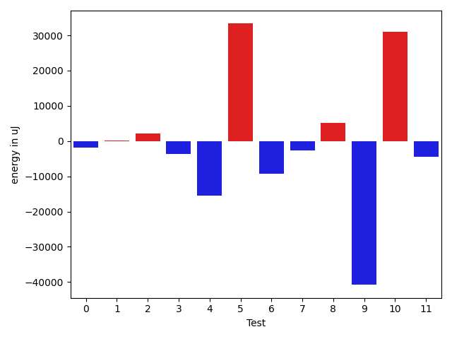

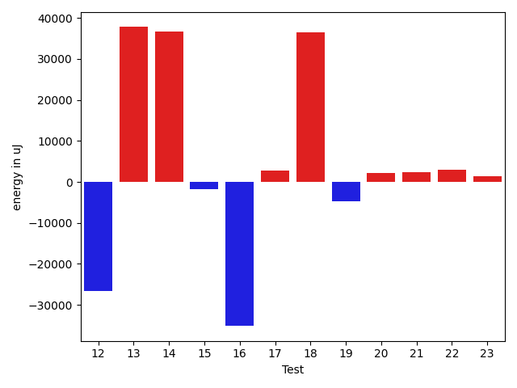

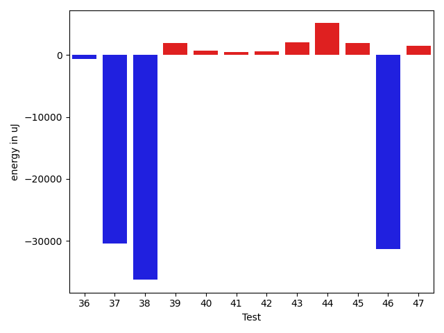

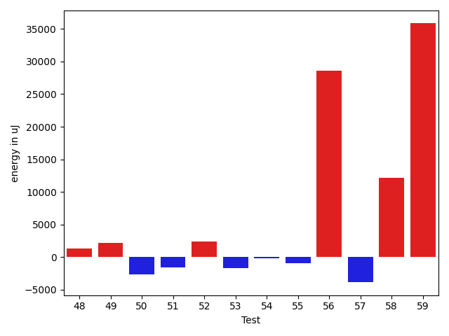

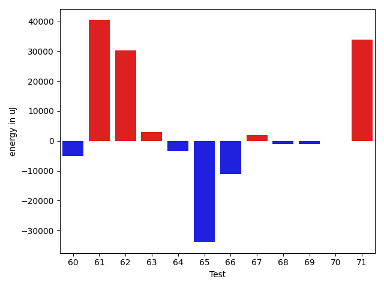

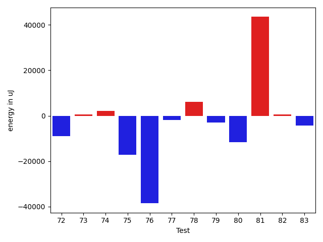

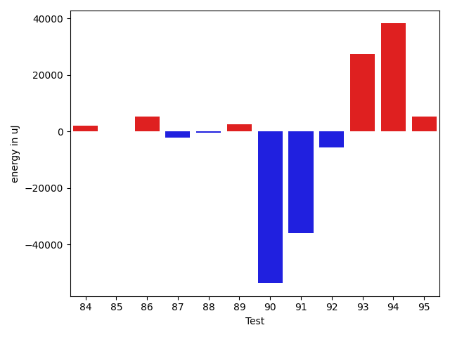

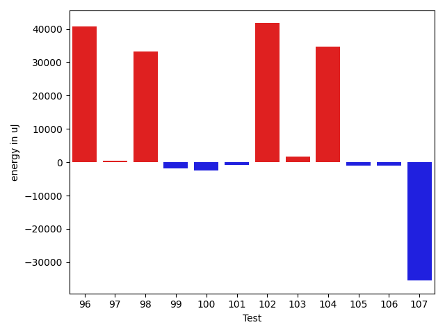

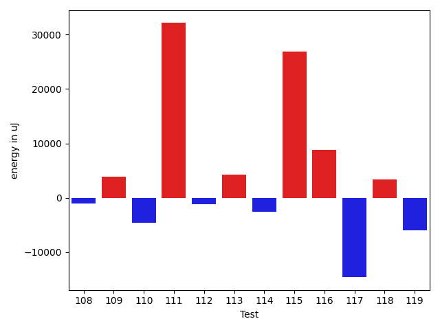

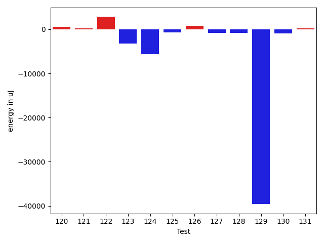

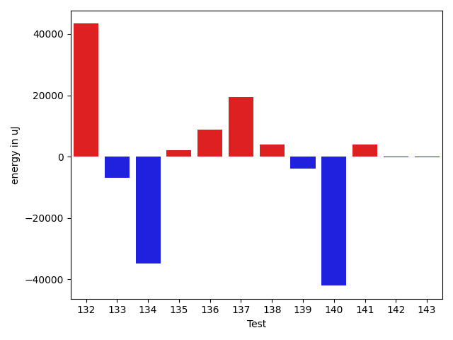

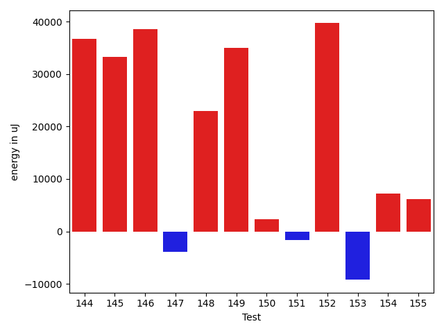

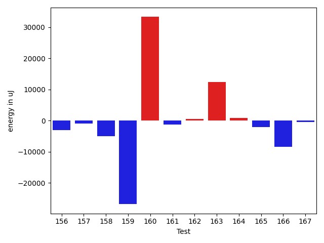

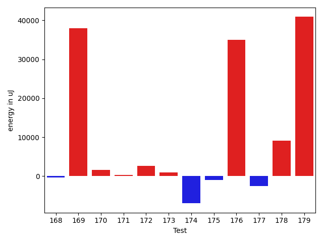

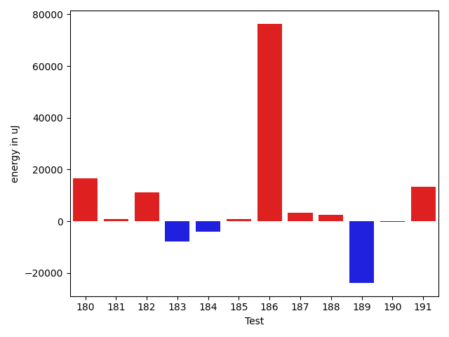

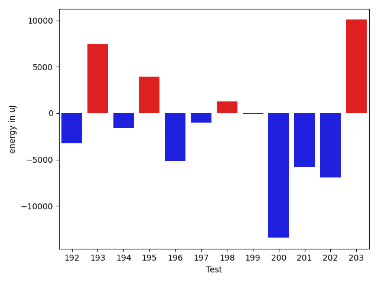

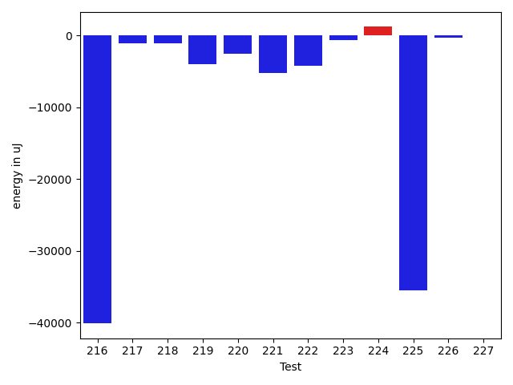

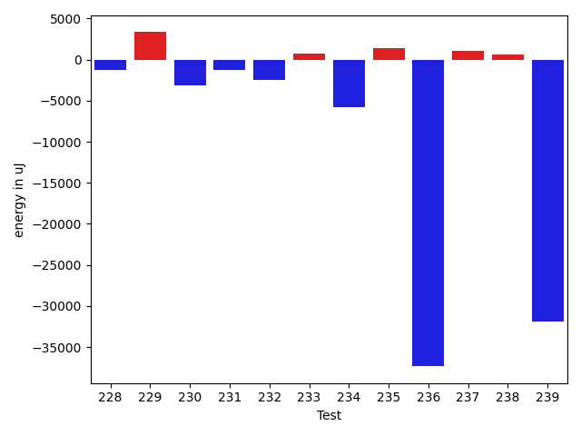

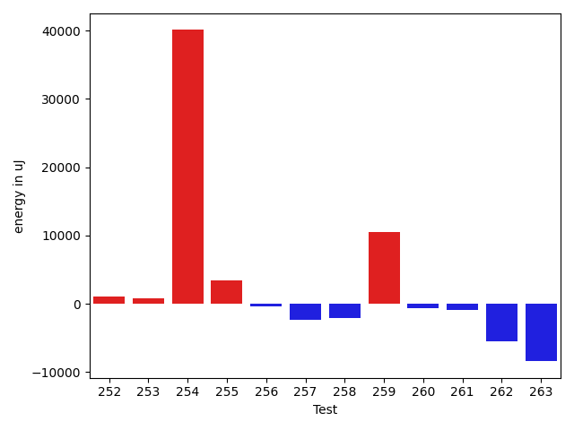

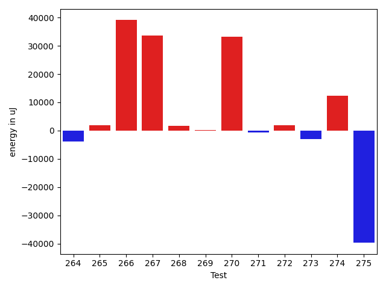

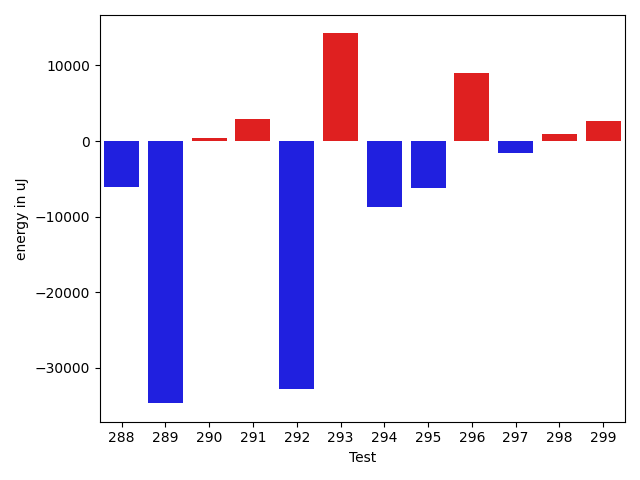

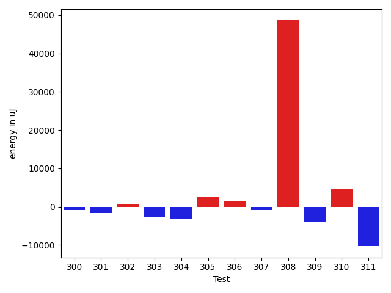

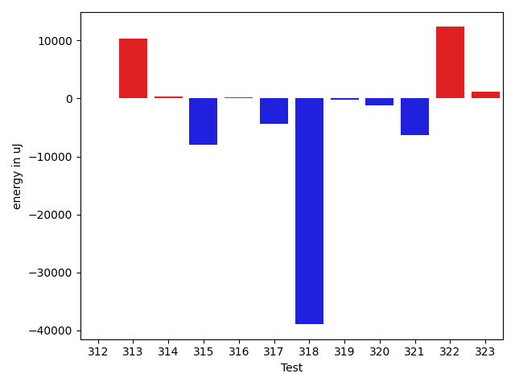

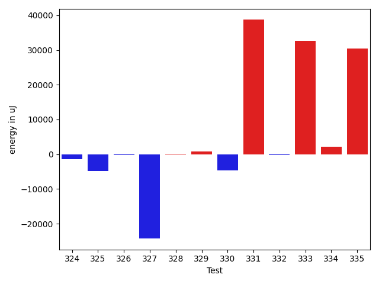

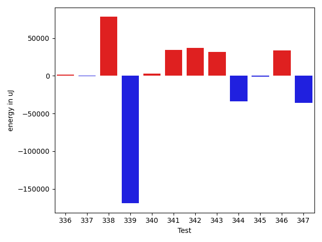

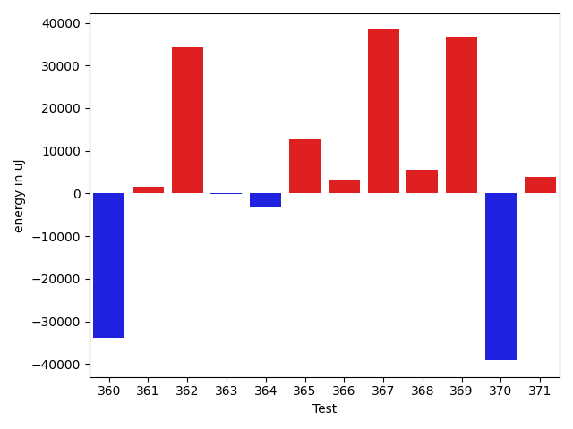

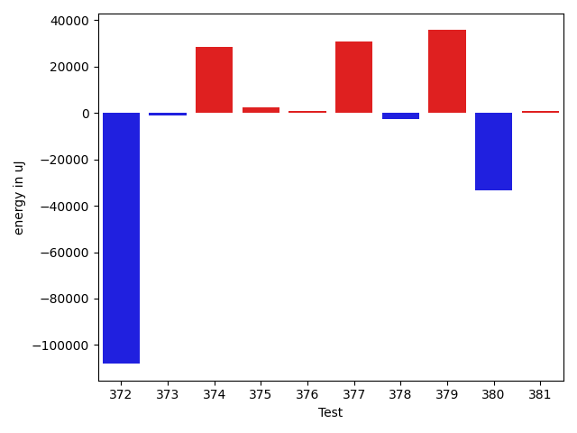

| ID | EnergyV1 | EnergyV2 | DeltaEnergy | σV1 | %σV1 | σV2 | %σV2 |
| --- | --- | --- | --- | --- | --- | --- | --- |
| 0 | 47424 | 45532 | -1892 | 17031.87 | 35.91 | 19638.38 | 43.13 |
| 1 | 41687 | 41809 | 122 | 2088.00 | 5.01 | 2824.15 | 6.75 |
| 2 | 162231 | 164306 | 2075 | 34852.87 | 21.48 | 26045.45 | 15.85 |
| 3 | 170288 | 166626 | -3662 | 17902.12 | 10.51 | 7475.71 | 4.49 |
| 4 | 166382 | 150817 | -15565 | 41258.40 | 24.80 | 16966.03 | 11.25 |
| 5 | 112060 | 145385 | 33325 | 16059.75 | 14.33 | 28601.92 | 19.67 |
| 6 | 124084 | 114806 | -9278 | 6192.95 | 4.99 | 18749.78 | 16.33 |
| 7 | 86670 | 84106 | -2564 | 21583.06 | 24.90 | 4018.92 | 4.78 |
| 8 | 175842 | 180969 | 5127 | 29281.44 | 16.65 | 20565.84 | 11.36 |
| 9 | 163024 | 122253 | -40771 | 15498.47 | 9.51 | 26596.72 | 21.76 |
| 10 | 43762 | 74707 | 30945 | 18284.74 | 41.78 | 18367.53 | 24.59 |
| 11 | 210082 | 205626 | -4456 | 33769.97 | 16.07 | 28778.71 | 14.00 |
| 12 | 71167 | 44495 | -26672 | 18305.62 | 25.72 | 18576.57 | 41.75 |
| 13 | 44373 | 82153 | 37780 | 21502.38 | 48.46 | 35592.67 | 43.32 |
| 14 | 44922 | 81665 | 36743 | 19548.11 | 43.52 | 20714.95 | 25.37 |
| 15 | 85205 | 83374 | -1831 | 22763.26 | 26.72 | 19485.42 | 23.37 |
| 16 | 81970 | 46813 | -35157 | 19843.00 | 24.21 | 22019.73 | 47.04 |
| 17 | 43274 | 46082 | 2808 | 22560.92 | 52.14 | 20936.37 | 45.43 |
| 18 | 86242 | 122803 | 36561 | 18616.29 | 21.59 | 22621.44 | 18.42 |
| 19 | 147827 | 143188 | -4639 | 16502.62 | 11.16 | 19232.31 | 13.43 |
| 20 | 88501 | 90637 | 2136 | 27264.46 | 30.81 | 3006.50 | 3.32 |
| 21 | 38696 | 41077 | 2381 | 1510.14 | 3.90 | 1182.42 | 2.88 |
| 22 | 87097 | 90087 | 2990 | 30195.79 | 34.67 | 29067.47 | 32.27 |
| 23 | 41687 | 43152 | 1465 | 11014.73 | 26.42 | 12730.78 | 29.50 |
| 24 | 42724 | 43212 | 488 | 2758.33 | 6.46 | 17887.64 | 41.40 |
| 25 | 121887 | 124329 | 2442 | 28988.69 | 23.78 | 19356.48 | 15.57 |
| 26 | 76843 | 74585 | -2258 | 16206.78 | 21.09 | 18460.98 | 24.75 |
| 27 | 243347 | 230102 | -13245 | 17771.78 | 7.30 | 51742.19 | 22.49 |
| 28 | 82641 | 81909 | -732 | 13892.27 | 16.81 | 25781.03 | 31.48 |
| 29 | 81360 | 92895 | 11535 | 21351.59 | 26.24 | 27487.02 | 29.59 |
| 30 | 87158 | 88256 | 1098 | 24227.74 | 27.80 | 21905.00 | 24.82 |
| 31 | 82947 | 88928 | 5981 | 19470.73 | 23.47 | 22199.16 | 24.96 |
| 32 | 45044 | 43152 | -1892 | 15907.34 | 35.32 | 10830.70 | 25.10 |
| 33 | 44190 | 44311 | 121 | 20230.79 | 45.78 | 18395.20 | 41.51 |
| 34 | 79101 | 108886 | 29785 | 14630.07 | 18.50 | 18706.41 | 17.18 |
| 35 | 43579 | 39856 | -3723 | 2832.34 | 6.50 | 3408.88 | 8.55 |
| 36 | 79834 | 79162 | -672 | 11202.60 | 14.03 | 29777.04 | 37.62 |
| 37 | 76294 | 45898 | -30396 | 21184.07 | 27.77 | 24206.20 | 52.74 |
| 38 | 79895 | 43640 | -36255 | 21106.73 | 26.42 | 18214.19 | 41.74 |
| 39 | 150513 | 152465 | 1952 | 19387.75 | 12.88 | 20623.20 | 13.53 |
| 40 | 82886 | 83557 | 671 | 18116.23 | 21.86 | 17249.14 | 20.64 |
| 41 | 39795 | 40222 | 427 | 12033.68 | 30.24 | 17755.92 | 44.14 |
| 42 | 37842 | 38391 | 549 | 26766.75 | 70.73 | 20013.32 | 52.13 |
| 43 | 42908 | 44983 | 2075 | 1454.47 | 3.39 | 13258.51 | 29.47 |
| 44 | 38819 | 43945 | 5126 | 1727.42 | 4.45 | 19513.60 | 44.40 |
| 45 | 40832 | 42785 | 1953 | 15385.34 | 37.68 | 12454.88 | 29.11 |
| 46 | 73303 | 41993 | -31310 | 19488.38 | 26.59 | 16897.36 | 40.24 |
| 47 | 43396 | 44922 | 1526 | 14707.11 | 33.89 | 13111.29 | 29.19 |
| 48 | 43274 | 44617 | 1343 | 453.73 | 1.05 | 16167.55 | 36.24 |
| 49 | 86487 | 88623 | 2136 | 21736.25 | 25.13 | 18633.04 | 21.03 |
| 50 | 40955 | 38329 | -2626 | 14994.41 | 36.61 | 18623.41 | 48.59 |
| 51 | 125915 | 124389 | -1526 | 18090.29 | 14.37 | 18237.68 | 14.66 |
| 52 | 201843 | 204223 | 2380 | 14486.57 | 7.18 | 17045.51 | 8.35 |
| 53 | 79773 | 78064 | -1709 | 10576.39 | 13.26 | 2884.43 | 3.69 |
| 54 | 109680 | 109497 | -183 | 80158.40 | 73.08 | 23935.87 | 21.86 |
| 55 | 42236 | 41260 | -976 | 11987.60 | 28.38 | 19812.61 | 48.02 |
| 56 | 83862 | 112427 | 28565 | 20911.12 | 24.94 | 24391.52 | 21.70 |
| 57 | 130798 | 126953 | -3845 | 19192.99 | 14.67 | 24825.16 | 19.55 |
| 58 | 170105 | 182311 | 12206 | 3099.24 | 1.82 | 20430.85 | 11.21 |
| 59 | 91918 | 127746 | 35828 | 28866.11 | 31.40 | 66658.70 | 52.18 |
| 60 | 82397 | 77393 | -5004 | 18827.91 | 22.85 | 20073.12 | 25.94 |
| 61 | 44189 | 84594 | 40405 | 21508.32 | 48.67 | 20379.47 | 24.09 |
| 62 | 40710 | 71044 | 30334 | 17675.60 | 43.42 | 21815.58 | 30.71 |
| 63 | 74157 | 77026 | 2869 | 18761.93 | 25.30 | 17033.39 | 22.11 |
| 64 | 135497 | 132018 | -3479 | 20855.90 | 15.39 | 25827.56 | 19.56 |
| 65 | 76599 | 42786 | -33813 | 19002.23 | 24.81 | 17998.73 | 42.07 |
| 66 | 176697 | 165649 | -11048 | 18903.93 | 10.70 | 19649.03 | 11.86 |
| 67 | 170471 | 172424 | 1953 | 17991.18 | 10.55 | 23958.56 | 13.90 |
| 68 | 225158 | 224121 | -1037 | 19060.34 | 8.47 | 10754.82 | 4.80 |
| 69 | 118164 | 117126 | -1038 | 18278.70 | 15.47 | 18959.01 | 16.19 |
| 70 | 218933 | 218871 | -62 | 42447.84 | 19.39 | 25057.06 | 11.45 |
| 71 | 82459 | 116393 | 33934 | 21141.70 | 25.64 | 21139.89 | 18.16 |
| 72 | 112549 | 103699 | -8850 | 19148.81 | 17.01 | 17706.08 | 17.07 |
| 73 | 114074 | 114685 | 611 | 3194.42 | 2.80 | 14645.78 | 12.77 |
| 74 | 180542 | 182678 | 2136 | 28374.77 | 15.72 | 44375.74 | 24.29 |
| 75 | 108338 | 91125 | -17213 | 19491.31 | 17.99 | 19827.09 | 21.76 |
| 76 | 162353 | 123840 | -38513 | 21066.58 | 12.98 | 21656.55 | 17.49 |
| 77 | 125793 | 123840 | -1953 | 29076.78 | 23.11 | 25154.53 | 20.31 |
| 78 | 117737 | 123779 | 6042 | 32557.16 | 27.65 | 28872.05 | 23.33 |
| 79 | 44556 | 41504 | -3052 | 16109.25 | 36.16 | 2606.54 | 6.28 |
| 80 | 123901 | 112304 | -11597 | 14788.33 | 11.94 | 14987.73 | 13.35 |
| 81 | 1816524 | 1860042 | 43518 | 82157.06 | 4.52 | 89749.51 | 4.83 |
| 82 | 130798 | 131409 | 611 | 26961.07 | 20.61 | 27860.80 | 21.20 |
| 83 | 172912 | 168518 | -4394 | 23667.28 | 13.69 | 20968.55 | 12.44 |
| 84 | 114746 | 116760 | 2014 | 15616.84 | 13.61 | 10767.44 | 9.22 |
| 85 | 80444 | 80566 | 122 | 24735.49 | 30.75 | 21526.19 | 26.72 |
| 86 | 85449 | 90759 | 5310 | 2719.35 | 3.18 | 19232.22 | 21.19 |
| 87 | 43884 | 41626 | -2258 | 18796.28 | 42.83 | 19486.12 | 46.81 |
| 88 | 41931 | 41381 | -550 | 11029.87 | 26.30 | 18393.30 | 44.45 |
| 89 | 88440 | 91064 | 2624 | 22095.25 | 24.98 | 2090.70 | 2.30 |
| 90 | 1943293 | 1889644 | -53649 | 218138.47 | 11.23 | 190151.20 | 10.06 |
| 91 | 117127 | 81116 | -36011 | 18286.49 | 15.61 | 18689.46 | 23.04 |
| 92 | 297790 | 292113 | -5677 | 10535.09 | 3.54 | 18242.57 | 6.25 |
| 93 | 178710 | 206176 | 27466 | 198603.05 | 111.13 | 21667.71 | 10.51 |
| 94 | 43456 | 81604 | 38148 | 22660.36 | 52.15 | 23002.60 | 28.19 |
| 95 | 116028 | 121337 | 5309 | 11862.27 | 10.22 | 18046.47 | 14.87 |
| 96 | 41748 | 82397 | 40649 | 20211.04 | 48.41 | 14512.69 | 17.61 |
| 97 | 43457 | 43884 | 427 | 17147.53 | 39.46 | 15955.27 | 36.36 |
| 98 | 40588 | 73792 | 33204 | 18289.34 | 45.06 | 18042.37 | 24.45 |
| 99 | 126648 | 124816 | -1832 | 3141.37 | 2.48 | 6913.34 | 5.54 |
| 100 | 125732 | 123169 | -2563 | 16991.13 | 13.51 | 16589.61 | 13.47 |
| 101 | 91369 | 90514 | -855 | 19375.96 | 21.21 | 22553.50 | 24.92 |
| 102 | 43823 | 85510 | 41687 | 24259.21 | 55.36 | 22017.92 | 25.75 |
| 103 | 78003 | 79711 | 1708 | 20857.93 | 26.74 | 14201.63 | 17.82 |
| 104 | 42358 | 76965 | 34607 | 19633.33 | 46.35 | 22597.39 | 29.36 |
| 105 | 117736 | 116699 | -1037 | 11578.68 | 9.83 | 13726.38 | 11.76 |
| 106 | 129456 | 128356 | -1100 | 20866.02 | 16.12 | 15931.99 | 12.41 |
| 107 | 77515 | 41992 | -35523 | 18811.72 | 24.27 | 22254.76 | 53.00 |
| 108 | 155456 | 154358 | -1098 | 6904.30 | 4.44 | 9043.72 | 5.86 |
| 109 | 79773 | 83618 | 3845 | 19423.67 | 24.35 | 14082.94 | 16.84 |
| 110 | 156555 | 151916 | -4639 | 14498.12 | 9.26 | 16852.58 | 11.09 |
| 111 | 88561 | 120666 | 32105 | 21911.44 | 24.74 | 20524.34 | 17.01 |
| 112 | 114075 | 112853 | -1222 | 12426.33 | 10.89 | 4675.53 | 4.14 |
| 113 | 131957 | 136231 | 4274 | 23111.27 | 17.51 | 23239.52 | 17.06 |
| 114 | 125549 | 122925 | -2624 | 17564.21 | 13.99 | 13240.15 | 10.77 |
| 115 | 130859 | 157715 | 26856 | 89036.61 | 68.04 | 128933.42 | 81.75 |
| 116 | 153869 | 162659 | 8790 | 33024.23 | 21.46 | 16556.19 | 10.18 |
| 117 | 175415 | 160827 | -14588 | 29029.67 | 16.55 | 20200.92 | 12.56 |
| 118 | 75317 | 78735 | 3418 | 17766.08 | 23.59 | 12615.41 | 16.02 |
| 119 | 185180 | 179199 | -5981 | 29870.82 | 16.13 | 16509.55 | 9.21 |
| 120 | 38880 | 39490 | 610 | 15124.64 | 38.90 | 15955.98 | 40.41 |
| 121 | 160766 | 160949 | 183 | 34615.95 | 21.53 | 35205.29 | 21.87 |
| 122 | 173523 | 176330 | 2807 | 17520.66 | 10.10 | 13823.18 | 7.84 |
| 123 | 127502 | 124328 | -3174 | 18571.78 | 14.57 | 24354.49 | 19.59 |
| 124 | 159790 | 154174 | -5616 | 24952.68 | 15.62 | 24234.61 | 15.72 |
| 125 | 127197 | 126465 | -732 | 6007.99 | 4.72 | 78447.32 | 62.03 |
| 126 | 42419 | 43273 | 854 | 13328.49 | 31.42 | 15200.16 | 35.13 |
| 127 | 182494 | 181701 | -793 | 43402.00 | 23.78 | 21440.43 | 11.80 |
| 128 | 123108 | 122314 | -794 | 20735.54 | 16.84 | 14654.75 | 11.98 |
| 129 | 209411 | 169799 | -39612 | 25188.82 | 12.03 | 15036.43 | 8.86 |
| 130 | 39184 | 38208 | -976 | 1381.59 | 3.53 | 2231.04 | 5.84 |
| 131 | 114136 | 114379 | 243 | 9581.60 | 8.39 | 14682.57 | 12.84 |
| 132 | 41687 | 85021 | 43334 | 18318.37 | 43.94 | 17952.95 | 21.12 |
| 133 | 119629 | 112792 | -6837 | 14070.56 | 11.76 | 17342.21 | 15.38 |
| 134 | 114013 | 79162 | -34851 | 18137.89 | 15.91 | 20792.32 | 26.27 |
| 135 | 74890 | 77026 | 2136 | 16281.56 | 21.74 | 13124.78 | 17.04 |
| 136 | 80200 | 89111 | 8911 | 4288.17 | 5.35 | 16094.48 | 18.06 |
| 137 | 135315 | 154846 | 19531 | 16707.13 | 12.35 | 30290.50 | 19.56 |
| 138 | 114441 | 118408 | 3967 | 9813.78 | 8.58 | 24360.84 | 20.57 |
| 139 | 128173 | 124328 | -3845 | 21258.55 | 16.59 | 18224.76 | 14.66 |
| 140 | 191833 | 149780 | -42053 | 17157.72 | 8.94 | 21088.79 | 14.08 |
| 141 | 39856 | 43701 | 3845 | 21691.40 | 54.42 | 17171.19 | 39.29 |
| 142 | 84839 | 84655 | -184 | 181169.47 | 213.55 | 84762.66 | 100.13 |
| 143 | 40100 | 39917 | -183 | 11395.54 | 28.42 | 3335.20 | 8.36 |
| 144 | 83801 | 120483 | 36682 | 11674.98 | 13.93 | 14692.39 | 12.19 |
| 145 | 79651 | 112854 | 33203 | 22998.17 | 28.87 | 19074.55 | 16.90 |
| 146 | 42542 | 81055 | 38513 | 20799.27 | 48.89 | 22316.63 | 27.53 |
| 147 | 323302 | 319396 | -3906 | 31531.83 | 9.75 | 42063.78 | 13.17 |
| 148 | 274475 | 297363 | 22888 | 15984.93 | 5.82 | 17384.45 | 5.85 |
| 149 | 145324 | 180359 | 35035 | 28036.73 | 19.29 | 22021.92 | 12.21 |
| 150 | 114074 | 116333 | 2259 | 20314.94 | 17.81 | 15713.49 | 13.51 |
| 151 | 118774 | 117065 | -1709 | 16008.08 | 13.48 | 12382.46 | 10.58 |
| 152 | 87585 | 127258 | 39673 | 20133.65 | 22.99 | 13188.88 | 10.36 |
| 153 | 124451 | 115234 | -9217 | 12765.62 | 10.26 | 23236.59 | 20.16 |
| 154 | 174316 | 181518 | 7202 | 27655.99 | 15.87 | 18959.95 | 10.45 |
| 155 | 114197 | 120361 | 6164 | 6768.60 | 5.93 | 13196.47 | 10.96 |
| 156 | 166137 | 163146 | -2991 | 17191.86 | 10.35 | 18860.53 | 11.56 |
| 157 | 112670 | 111694 | -976 | 11169.71 | 9.91 | 17393.92 | 15.57 |
| 158 | 122314 | 117309 | -5005 | 19438.83 | 15.89 | 18041.11 | 15.38 |
| 159 | 146789 | 119995 | -26794 | 23082.74 | 15.73 | 20296.92 | 16.91 |
| 160 | 39612 | 72876 | 33264 | 17017.34 | 42.96 | 20242.16 | 27.78 |
| 161 | 112060 | 110779 | -1281 | 5975.49 | 5.33 | 4266.19 | 3.85 |
| 162 | 147888 | 148376 | 488 | 19627.80 | 13.27 | 17710.86 | 11.94 |
| 163 | 194519 | 206908 | 12389 | 24229.63 | 12.46 | 30254.50 | 14.62 |
| 164 | 122864 | 123779 | 915 | 12160.13 | 9.90 | 15555.02 | 12.57 |
| 165 | 122681 | 120666 | -2015 | 18022.35 | 14.69 | 18532.47 | 15.36 |
| 166 | 216430 | 208068 | -8362 | 20826.74 | 9.62 | 24029.16 | 11.55 |
| 167 | 178345 | 177856 | -489 | 21907.66 | 12.28 | 23528.64 | 13.23 |
| 168 | 163635 | 163330 | -305 | 23011.13 | 14.06 | 24239.66 | 14.84 |
| 169 | 87768 | 125732 | 37964 | 18398.10 | 20.96 | 19224.56 | 15.29 |
| 170 | 114319 | 115966 | 1647 | 14899.69 | 13.03 | 11534.04 | 9.95 |
| 171 | 199462 | 199767 | 305 | 20818.89 | 10.44 | 29358.21 | 14.70 |
| 172 | 122070 | 124756 | 2686 | 6847.62 | 5.61 | 15264.02 | 12.24 |
| 173 | 125427 | 126343 | 916 | 21312.76 | 16.99 | 15625.95 | 12.37 |
| 174 | 171874 | 164917 | -6957 | 35762.81 | 20.81 | 20042.12 | 12.15 |
| 175 | 147949 | 147033 | -916 | 17160.90 | 11.60 | 22912.07 | 15.58 |
| 176 | 38452 | 73425 | 34973 | 13770.74 | 35.81 | 20507.28 | 27.93 |
| 177 | 123046 | 120544 | -2502 | 20593.99 | 16.74 | 16552.25 | 13.73 |
| 178 | 114135 | 123291 | 9156 | 17719.74 | 15.53 | 14667.41 | 11.90 |
| 179 | 177612 | 218505 | 40893 | 30605.82 | 17.23 | 24493.91 | 11.21 |
| 180 | 128967 | 145630 | 16663 | 19311.72 | 14.97 | 20376.88 | 13.99 |
| 181 | 210327 | 211120 | 793 | 99913.79 | 47.50 | 23699.08 | 11.23 |
| 182 | 111572 | 122863 | 11291 | 18845.14 | 16.89 | 22639.29 | 18.43 |
| 183 | 160583 | 152832 | -7751 | 6050.45 | 3.77 | 19244.43 | 12.59 |
| 184 | 116760 | 112792 | -3968 | 10262.72 | 8.79 | 9999.87 | 8.87 |
| 185 | 42236 | 42968 | 732 | 2431.86 | 5.76 | 2341.09 | 5.45 |
| 186 | 136108 | 212524 | 76416 | 22838.98 | 16.78 | 23359.90 | 10.99 |
| 187 | 122802 | 125976 | 3174 | 15226.37 | 12.40 | 18966.32 | 15.06 |
| 188 | 39246 | 41687 | 2441 | 1670.93 | 4.26 | 1372.21 | 3.29 |
| 189 | 385619 | 361694 | -23925 | 47400.06 | 12.29 | 27369.54 | 7.57 |
| 190 | 215149 | 214843 | -306 | 28022.50 | 13.02 | 8285.13 | 3.86 |
| 191 | 250061 | 263305 | 13244 | 36395.12 | 14.55 | 17521.03 | 6.65 |
| 192 | 164794 | 161560 | -3234 | 4202.05 | 2.55 | 21977.49 | 13.60 |
| 193 | 120910 | 128357 | 7447 | 20111.76 | 16.63 | 18857.06 | 14.69 |
| 194 | 122497 | 120910 | -1587 | 11364.79 | 9.28 | 18551.21 | 15.34 |
| 195 | 73303 | 77271 | 3968 | 19408.69 | 26.48 | 17109.78 | 22.14 |
| 196 | 220276 | 215148 | -5128 | 17571.02 | 7.98 | 13500.17 | 6.27 |
| 197 | 206725 | 205688 | -1037 | 22060.45 | 10.67 | 31406.80 | 15.27 |
| 198 | 241088 | 242370 | 1282 | 20937.13 | 8.68 | 33183.68 | 13.69 |
| 199 | 176574 | 176514 | -60 | 8856.27 | 5.02 | 26074.99 | 14.77 |
| 200 | 284972 | 271544 | -13428 | 17380.01 | 6.10 | 24000.12 | 8.84 |
| 201 | 197937 | 192138 | -5799 | 7423.90 | 3.75 | 23079.07 | 12.01 |
| 202 | 188598 | 181640 | -6958 | 11596.42 | 6.15 | 14183.11 | 7.81 |
| 203 | 289673 | 299743 | 10070 | 32210.72 | 11.12 | 19650.58 | 6.56 |
| 204 | 694273 | 599303 | -94970 | 54934.71 | 7.91 | 29259.56 | 4.88 |
| 205 | 330443 | 328795 | -1648 | 36361.42 | 11.00 | 48717.02 | 14.82 |
| 206 | 244324 | 206725 | -37599 | 23620.11 | 9.67 | 21478.75 | 10.39 |
| 207 | 1009764 | 981626 | -28138 | 67902.88 | 6.72 | 73129.48 | 7.45 |
| 208 | 320128 | 327941 | 7813 | 20424.44 | 6.38 | 19867.27 | 6.06 |
| 209 | 42480 | 39123 | -3357 | 12821.58 | 30.18 | 21430.76 | 54.78 |
| 210 | 45410 | 46813 | 1403 | 1209.44 | 2.66 | 3934.69 | 8.41 |
| 211 | 248717 | 252013 | 3296 | 24228.16 | 9.74 | 18742.11 | 7.44 |
| 212 | 40894 | 38269 | -2625 | 16009.22 | 39.15 | 18451.52 | 48.22 |
| 213 | 90149 | 88562 | -1587 | 22875.34 | 25.38 | 18078.07 | 20.41 |
| 214 | 81604 | 83496 | 1892 | 33814.96 | 41.44 | 32275.36 | 38.65 |
| 215 | 39489 | 39978 | 489 | 1976.51 | 5.01 | 4378.76 | 10.95 |
| 216 | 86242 | 46142 | -40100 | 18616.53 | 21.59 | 22094.12 | 47.88 |
| 217 | 42786 | 41687 | -1099 | 207244.96 | 484.38 | 12904.83 | 30.96 |
| 218 | 169677 | 168640 | -1037 | 24609.00 | 14.50 | 21470.58 | 12.73 |
| 219 | 80811 | 76843 | -3968 | 19191.78 | 23.75 | 12796.74 | 16.65 |
| 220 | 77271 | 74768 | -2503 | 16735.07 | 21.66 | 18624.63 | 24.91 |
| 221 | 88378 | 83130 | -5248 | 21199.67 | 23.99 | 24475.69 | 29.44 |
| 222 | 88928 | 84716 | -4212 | 21255.19 | 23.90 | 21574.98 | 25.47 |
| 223 | 40405 | 39795 | -610 | 14705.71 | 36.40 | 15565.30 | 39.11 |
| 224 | 41992 | 43213 | 1221 | 2429.10 | 5.78 | 18783.02 | 43.47 |
| 225 | 83313 | 47790 | -35523 | 21541.45 | 25.86 | 21069.45 | 44.09 |
| 226 | 40100 | 39795 | -305 | 2049.41 | 5.11 | 2377.65 | 5.97 |
| 227 | 78246 | 78307 | 61 | 19080.29 | 24.38 | 17799.99 | 22.73 |
| 228 | 91308 | 90088 | -1220 | 20869.71 | 22.86 | 18353.63 | 20.37 |
| 229 | 86121 | 89478 | 3357 | 14760.46 | 17.14 | 15525.26 | 17.35 |
| 230 | 92285 | 89172 | -3113 | 29394.34 | 31.85 | 21056.93 | 23.61 |
| 231 | 149414 | 148132 | -1282 | 17190.41 | 11.51 | 16719.36 | 11.29 |
| 232 | 84595 | 82153 | -2442 | 13521.86 | 15.98 | 17341.97 | 21.11 |
| 233 | 84350 | 85144 | 794 | 22425.90 | 26.59 | 21793.82 | 25.60 |
| 234 | 72876 | 67077 | -5799 | 35984.24 | 49.38 | 18380.15 | 27.40 |
| 235 | 88379 | 89782 | 1403 | 20123.41 | 22.77 | 15024.82 | 16.73 |
| 236 | 1654109 | 1616756 | -37353 | 110885.98 | 6.70 | 148086.35 | 9.16 |
| 237 | 1943354 | 1944392 | 1038 | 158974.12 | 8.18 | 172364.86 | 8.86 |
| 238 | 43091 | 43701 | 610 | 1270.80 | 2.95 | 3698.89 | 8.46 |
| 239 | 79284 | 47363 | -31921 | 18559.92 | 23.41 | 22557.93 | 47.63 |
| 240 | 118042 | 118591 | 549 | 17405.62 | 14.75 | 26927.83 | 22.71 |
| 241 | 133728 | 131775 | -1953 | 16497.04 | 12.34 | 24908.76 | 18.90 |
| 242 | 71349 | 76904 | 5555 | 16160.74 | 22.65 | 17169.60 | 22.33 |
| 243 | 88379 | 90149 | 1770 | 24820.60 | 28.08 | 21307.69 | 23.64 |
| 244 | 41687 | 78918 | 37231 | 16492.67 | 39.56 | 11661.97 | 14.78 |
| 245 | 268738 | 269897 | 1159 | 30841.63 | 11.48 | 20677.98 | 7.66 |
| 246 | 44006 | 44190 | 184 | 2353.68 | 5.35 | 2685.43 | 6.08 |
| 247 | 112793 | 114257 | 1464 | 22282.32 | 19.76 | 8612.08 | 7.54 |
| 248 | 146850 | 166930 | 20080 | 22136.91 | 15.07 | 21183.35 | 12.69 |
| 249 | 40466 | 41443 | 977 | 18800.71 | 46.46 | 12870.91 | 31.06 |
| 250 | 174255 | 180419 | 6164 | 25123.36 | 14.42 | 19956.34 | 11.06 |
| 251 | 42603 | 42664 | 61 | 2799.63 | 6.57 | 2395.59 | 5.62 |
| 252 | 135742 | 136780 | 1038 | 14909.66 | 10.98 | 20706.75 | 15.14 |
| 253 | 43640 | 44495 | 855 | 20886.69 | 47.86 | 19020.65 | 42.75 |
| 254 | 44067 | 84168 | 40101 | 28469.35 | 64.60 | 20825.33 | 24.74 |
| 255 | 113708 | 117126 | 3418 | 15851.36 | 13.94 | 14145.16 | 12.08 |
| 256 | 83679 | 83313 | -366 | 3369.39 | 4.03 | 3943.84 | 4.73 |
| 257 | 141601 | 139221 | -2380 | 21655.01 | 15.29 | 21822.36 | 15.67 |
| 258 | 197632 | 195495 | -2137 | 18145.13 | 9.18 | 5120.42 | 2.62 |
| 259 | 72632 | 83191 | 10559 | 19537.32 | 26.90 | 14662.71 | 17.63 |
| 260 | 85327 | 84716 | -611 | 17238.25 | 20.20 | 4521.98 | 5.34 |
| 261 | 88684 | 87768 | -916 | 10154.21 | 11.45 | 18530.66 | 21.11 |
| 262 | 159668 | 154113 | -5555 | 20430.60 | 12.80 | 20018.04 | 12.99 |
| 263 | 275940 | 267516 | -8424 | 41795.25 | 15.15 | 21681.58 | 8.10 |
| 264 | 83435 | 79590 | -3845 | 14455.95 | 17.33 | 17780.78 | 22.34 |
| 265 | 81115 | 82947 | 1832 | 20251.35 | 24.97 | 19829.91 | 23.91 |
| 266 | 119141 | 158202 | 39061 | 27133.00 | 22.77 | 20208.45 | 12.77 |
| 267 | 190552 | 224121 | 33569 | 33900.02 | 17.79 | 33146.78 | 14.79 |
| 268 | 176636 | 178283 | 1647 | 28499.64 | 16.13 | 19775.34 | 11.09 |
| 269 | 125610 | 125854 | 244 | 22325.16 | 17.77 | 12739.24 | 10.12 |
| 270 | 150573 | 183838 | 33265 | 21502.89 | 14.28 | 24719.64 | 13.45 |
| 271 | 288330 | 287780 | -550 | 32293.79 | 11.20 | 21460.02 | 7.46 |
| 272 | 219787 | 221740 | 1953 | 18292.95 | 8.32 | 10738.23 | 4.84 |
| 273 | 91430 | 88379 | -3051 | 32903.39 | 35.99 | 13948.42 | 15.78 |
| 274 | 205321 | 217712 | 12391 | 29336.62 | 14.29 | 35359.11 | 16.24 |
| 275 | 80383 | 40710 | -39673 | 11837.56 | 14.73 | 21378.11 | 52.51 |
| 276 | 154296 | 149291 | -5005 | 14469.82 | 9.38 | 9949.12 | 6.66 |
| 277 | 122436 | 131103 | 8667 | 14576.36 | 11.91 | 17387.58 | 13.26 |
| 278 | 75256 | 44495 | -30761 | 20393.44 | 27.10 | 19938.16 | 44.81 |
| 279 | 43518 | 43396 | -122 | 19793.49 | 45.48 | 22063.53 | 50.84 |
| 280 | 92407 | 92284 | -123 | 26518.16 | 28.70 | 2816.05 | 3.05 |
| 281 | 42602 | 80993 | 38391 | 16794.87 | 39.42 | 18799.51 | 23.21 |
| 282 | 124573 | 120361 | -4212 | 18780.98 | 15.08 | 12356.86 | 10.27 |
| 283 | 44617 | 41748 | -2869 | 2024.22 | 4.54 | 2212.35 | 5.30 |
| 284 | 90514 | 87097 | -3417 | 22420.19 | 24.77 | 14391.26 | 16.52 |
| 285 | 44250 | 50415 | 6165 | 22495.18 | 50.84 | 20410.88 | 40.49 |
| 286 | 40954 | 40954 | 0 | 17613.04 | 43.01 | 18683.39 | 45.62 |
| 287 | 39977 | 40161 | 184 | 19734.48 | 49.36 | 15100.35 | 37.60 |
| 288 | 402953 | 396850 | -6103 | 29044.75 | 7.21 | 21390.90 | 5.39 |
| 289 | 122741 | 88074 | -34667 | 48473.07 | 39.49 | 18365.88 | 20.85 |
| 290 | 115661 | 116027 | 366 | 22277.09 | 19.26 | 17950.55 | 15.47 |
| 291 | 75134 | 78002 | 2868 | 11958.64 | 15.92 | 10319.50 | 13.23 |
| 292 | 101318 | 68542 | -32776 | 14411.27 | 14.22 | 28075.53 | 40.96 |
| 293 | 249450 | 263671 | 14221 | 118898.01 | 47.66 | 72604.47 | 27.54 |
| 294 | 213561 | 204833 | -8728 | 18430.30 | 8.63 | 22078.28 | 10.78 |
| 295 | 217650 | 211486 | -6164 | 21898.78 | 10.06 | 21311.47 | 10.08 |
| 296 | 80566 | 89599 | 9033 | 18978.64 | 23.56 | 17199.55 | 19.20 |
| 297 | 44006 | 42480 | -1526 | 18174.03 | 41.30 | 14551.04 | 34.25 |
| 298 | 76110 | 77087 | 977 | 3734.15 | 4.91 | 11378.13 | 14.76 |
| 299 | 42358 | 44983 | 2625 | 2836.34 | 6.70 | 16852.42 | 37.46 |
| 300 | 93445 | 92651 | -794 | 21412.17 | 22.91 | 21162.82 | 22.84 |
| 301 | 235717 | 234008 | -1709 | 34448.31 | 14.61 | 44324.38 | 18.94 |
| 302 | 91431 | 92041 | 610 | 23177.10 | 25.35 | 16899.71 | 18.36 |
| 303 | 44677 | 42114 | -2563 | 17317.78 | 38.76 | 10992.99 | 26.10 |
| 304 | 131104 | 127930 | -3174 | 16138.86 | 12.31 | 13160.45 | 10.29 |
| 305 | 119445 | 122131 | 2686 | 8998.23 | 7.53 | 18466.05 | 15.12 |
| 306 | 76965 | 78430 | 1465 | 5514.16 | 7.16 | 15206.51 | 19.39 |
| 307 | 76416 | 75561 | -855 | 3834.34 | 5.02 | 10532.53 | 13.94 |
| 308 | 163147 | 211791 | 48644 | 30104.17 | 18.45 | 30847.12 | 14.56 |
| 309 | 117980 | 114074 | -3906 | 24519.57 | 20.78 | 22361.33 | 19.60 |
| 310 | 79345 | 83862 | 4517 | 19545.42 | 24.63 | 19681.66 | 23.47 |
| 311 | 88562 | 78246 | -10316 | 13337.82 | 15.06 | 17465.65 | 22.32 |
| 312 | 87524 | 87585 | 61 | 11797.63 | 13.48 | 16613.73 | 18.97 |
| 313 | 177795 | 188110 | 10315 | 16934.33 | 9.52 | 28761.82 | 15.29 |
| 314 | 43762 | 44128 | 366 | 21341.03 | 48.77 | 21539.86 | 48.81 |
| 315 | 112853 | 104920 | -7933 | 34694.98 | 30.74 | 14261.63 | 13.59 |
| 316 | 92163 | 92346 | 183 | 17497.37 | 18.99 | 13221.47 | 14.32 |
| 317 | 78735 | 74341 | -4394 | 18869.89 | 23.97 | 10792.73 | 14.52 |
| 318 | 206542 | 167602 | -38940 | 24388.86 | 11.81 | 24144.01 | 14.41 |
| 319 | 185852 | 185607 | -245 | 10877.21 | 5.85 | 13865.21 | 7.47 |
| 320 | 42968 | 41809 | -1159 | 1797.05 | 4.18 | 2622.32 | 6.27 |
| 321 | 84228 | 77942 | -6286 | 19871.10 | 23.59 | 20770.51 | 26.65 |
| 322 | 116333 | 128662 | 12329 | 18575.65 | 15.97 | 18806.91 | 14.62 |
| 323 | 43030 | 44128 | 1098 | 12664.63 | 29.43 | 133260.29 | 301.99 |
| 324 | 245910 | 244506 | -1404 | 35727.81 | 14.53 | 28815.61 | 11.79 |
| 325 | 199036 | 194152 | -4884 | 11055.79 | 5.55 | 20657.50 | 10.64 |
| 326 | 164306 | 164001 | -305 | 18002.62 | 10.96 | 16488.57 | 10.05 |
| 327 | 369995 | 345703 | -24292 | 21961.72 | 5.94 | 21601.41 | 6.25 |
| 328 | 126952 | 127014 | 62 | 22679.26 | 17.86 | 9295.87 | 7.32 |
| 329 | 152283 | 153076 | 793 | 15354.81 | 10.08 | 20192.33 | 13.19 |
| 330 | 165833 | 161194 | -4639 | 11551.23 | 6.97 | 23799.29 | 14.76 |
| 331 | 84289 | 122986 | 38697 | 27188.78 | 32.26 | 20718.71 | 16.85 |
| 332 | 42053 | 41809 | -244 | 10788.98 | 25.66 | 18256.61 | 43.67 |
| 333 | 139038 | 171630 | 32592 | 22678.65 | 16.31 | 22740.46 | 13.25 |
| 334 | 72997 | 75134 | 2137 | 20507.27 | 28.09 | 15513.71 | 20.65 |
| 335 | 82031 | 112548 | 30517 | 20108.93 | 24.51 | 19604.95 | 17.42 |
| 336 | 38452 | 39855 | 1403 | 11388.34 | 29.62 | 17782.29 | 44.62 |
| 337 | 80628 | 79833 | -795 | 2566.29 | 3.18 | 12135.44 | 15.20 |
| 338 | 4008656 | 4086781 | 78125 | 468764.71 | 11.69 | 372872.79 | 9.12 |
| 339 | 3864248 | 3695059 | -169189 | 258081.81 | 6.68 | 251086.34 | 6.80 |
| 340 | 132935 | 136108 | 3173 | 33754.32 | 25.39 | 68893.18 | 50.62 |
| 341 | 46692 | 80933 | 34241 | 22731.83 | 48.68 | 22858.40 | 28.24 |
| 342 | 43945 | 80688 | 36743 | 20207.13 | 45.98 | 18800.75 | 23.30 |
| 343 | 42602 | 74279 | 31677 | 16381.40 | 38.45 | 17417.00 | 23.45 |
| 344 | 77148 | 43090 | -34058 | 22705.23 | 29.43 | 22750.99 | 52.80 |
| 345 | 78186 | 77026 | -1160 | 20170.67 | 25.80 | 17671.49 | 22.94 |
| 346 | 44372 | 78002 | 33630 | 18941.97 | 42.69 | 15872.49 | 20.35 |
| 347 | 80811 | 44616 | -36195 | 20144.51 | 24.93 | 21978.38 | 49.26 |
| 348 | 83679 | 75561 | -8118 | 14656.78 | 17.52 | 21520.01 | 28.48 |
| 349 | 66406 | 43457 | -22949 | 17740.39 | 26.72 | 18630.65 | 42.87 |
| 350 | 270751 | 280761 | 10010 | 18491.93 | 6.83 | 23407.62 | 8.34 |
| 351 | 156616 | 157715 | 1099 | 17746.55 | 11.33 | 17252.49 | 10.94 |
| 352 | 47424 | 76782 | 29358 | 19781.82 | 41.71 | 21183.98 | 27.59 |
| 353 | 165283 | 167358 | 2075 | 19610.59 | 11.86 | 22573.95 | 13.49 |
| 354 | 39673 | 41748 | 2075 | 1713.36 | 4.32 | 12472.67 | 29.88 |
| 355 | 268920 | 272643 | 3723 | 43703.05 | 16.25 | 39087.55 | 14.34 |
| 356 | 171631 | 178100 | 6469 | 17007.26 | 9.91 | 30212.83 | 16.96 |
| 357 | 120361 | 118713 | -1648 | 12792.49 | 10.63 | 37010.23 | 31.18 |
| 358 | 477721 | 489928 | 12207 | 52024.50 | 10.89 | 67495.03 | 13.78 |
| 359 | 954344 | 900083 | -54261 | 48025.63 | 5.03 | 433910.73 | 48.21 |
| 360 | 583007 | 549254 | -33753 | 37917.03 | 6.50 | 59708.30 | 10.87 |
| 361 | 39734 | 41260 | 1526 | 12308.30 | 30.98 | 15597.97 | 37.80 |
| 362 | 52429 | 86731 | 34302 | 22992.40 | 43.85 | 26644.34 | 30.72 |
| 363 | 81482 | 81420 | -62 | 16390.89 | 20.12 | 25263.77 | 31.03 |
| 364 | 47119 | 43823 | -3296 | 17338.11 | 36.80 | 21070.76 | 48.08 |
| 365 | 303405 | 316039 | 12634 | 42542.88 | 14.02 | 54740.35 | 17.32 |
| 366 | 88989 | 92285 | 3296 | 14237.46 | 16.00 | 23298.01 | 25.25 |
| 367 | 39124 | 77453 | 38329 | 20194.31 | 51.62 | 20377.36 | 26.31 |
| 368 | 80444 | 85938 | 5494 | 21372.14 | 26.57 | 27557.52 | 32.07 |
| 369 | 44922 | 81726 | 36804 | 18561.58 | 41.32 | 15712.00 | 19.23 |
| 370 | 260376 | 221252 | -39124 | 15134.21 | 5.81 | 20637.29 | 9.33 |
| 371 | 396422 | 400389 | 3967 | 32343.64 | 8.16 | 21323.79 | 5.33 |
| 372 | 436767 | 328673 | -108094 | 189402.05 | 43.36 | 190507.23 | 57.96 |
| 373 | 111694 | 110657 | -1037 | 19189.08 | 17.18 | 16169.97 | 14.61 |
| 374 | 82397 | 110779 | 28382 | 16774.67 | 20.36 | 21320.93 | 19.25 |
| 375 | 40283 | 42786 | 2503 | 12137.60 | 30.13 | 20416.55 | 47.72 |
| 376 | 169677 | 170715 | 1038 | 29854.60 | 17.59 | 27231.62 | 15.95 |
| 377 | 729551 | 760313 | 30762 | 43734.99 | 5.99 | 51729.28 | 6.80 |
| 378 | 115478 | 112732 | -2746 | 14472.87 | 12.53 | 18751.70 | 16.63 |
| 379 | 265136 | 300841 | 35705 | 26187.37 | 9.88 | 69783.81 | 23.20 |
| 380 | 254333 | 221069 | -33264 | 23110.37 | 9.09 | 17665.71 | 7.99 |
| 381 | 42542 | 43579 | 1037 | 1994.06 | 4.69 | 2806.55 | 6.44 |

## Misc.

| ID | Test Class | Test Method |
| --- | --- | --- |
| 0 | com.google.gson.functional.PrimitiveTest | testDeserializePrimitiveWrapperAsObjectField |
| 1 | com.google.gson.functional.PrimitiveTest | testMoreSpecificSerialization |
| 2 | com.google.gson.functional.PrimitiveTest | testStringsAsBooleans |
| 3 | com.google.gson.functional.CustomTypeAdaptersTest | testCustomAdapterInvokedForCollectionElementDeserialization |
| 4 | com.google.gson.functional.CustomTypeAdaptersTest | testCustomAdapterInvokedForMapElementDeserialization |
| 5 | com.google.gson.functional.CustomTypeAdaptersTest | testCustomAdapterInvokedForMapElementSerializationWithType |
| 6 | com.google.gson.functional.CustomTypeAdaptersTest | testCustomNestedSerializers |
| 7 | com.google.gson.functional.CustomTypeAdaptersTest | testCustomAdapterInvokedForMapElementSerialization |
| 8 | com.google.gson.functional.CustomTypeAdaptersTest | testCustomNestedDeserializers |
| 9 | com.google.gson.functional.CustomTypeAdaptersTest | testCustomTypeAdapterDoesNotAppliesToSubClasses |
| 10 | com.google.gson.functional.CustomTypeAdaptersTest | testCustomAdapterInvokedForCollectionElementSerialization |
| 11 | com.google.gson.functional.CustomTypeAdaptersTest | testCustomAdapterInvokedForCollectionElementSerializationWithType |
| 12 | com.google.gson.functional.CustomTypeAdaptersTest | testEnsureCustomSerializerNotInvokedForNullValues |
| 13 | com.google.gson.functional.CustomTypeAdaptersTest | testEnsureCustomDeserializerNotInvokedForNullValues |
| 14 | com.google.gson.functional.ObjectTest | testStringFieldWithEmptyValueDeserialization |
| 15 | com.google.gson.functional.ObjectTest | testNullObjectFieldsDeserialization |
| 16 | com.google.gson.functional.ObjectTest | testEmptyCollectionInAnObjectDeserialization |
| 17 | com.google.gson.functional.ObjectTest | testNestedSerialization |
| 18 | com.google.gson.functional.ObjectTest | testArrayOfArraysDeserialization |
| 19 | com.google.gson.functional.ObjectTest | testSingletonLists |
| 20 | com.google.gson.functional.ObjectTest | testNullFieldsSerialization |
| 21 | com.google.gson.functional.ObjectTest | testClassWithNoFieldsDeserialization |
| 22 | com.google.gson.functional.ObjectTest | testClassWithTransientFieldsDeserialization |
| 23 | com.google.gson.functional.ObjectTest | testStringFieldWithNumberValueDeserialization |
| 24 | com.google.gson.functional.ObjectTest | testPrivateNoArgConstructorDeserialization |
| 25 | com.google.gson.functional.ObjectTest | testArrayOfObjectsAsFields |
| 26 | com.google.gson.functional.ObjectTest | testClassWithTransientFieldsDeserializationTransientFieldsPassedInJsonAreIgnored |
| 27 | com.google.gson.functional.ObjectTest | testDateAsMapObjectField |
| 28 | com.google.gson.functional.ObjectTest | testPrimitiveArrayFieldSerialization |
| 29 | com.google.gson.functional.ObjectTest | testPrimitiveArrayInAnObjectDeserialization |
| 30 | com.google.gson.functional.ObjectTest | testClassWithNoFieldsSerialization |
| 31 | com.google.gson.functional.ObjectTest | testStringFieldWithEmptyValueSerialization |
| 32 | com.google.gson.functional.ObjectTest | testNullArraysDeserialization |
| 33 | com.google.gson.functional.ObjectTest | testInnerClassSerialization |
| 34 | com.google.gson.functional.ObjectTest | testEmptyCollectionInAnObjectSerialization |
| 35 | com.google.gson.functional.ObjectTest | testClassWithObjectFieldSerialization |
| 36 | com.google.gson.functional.ObjectTest | testBagOfPrimitiveWrappersSerialization |
| 37 | com.google.gson.functional.ObjectTest | testObjectFieldNamesWithoutQuotesDeserialization |
| 38 | com.google.gson.functional.ObjectTest | testArrayOfObjectsDeserialization |
| 39 | com.google.gson.functional.ObjectTest | testTruncatedDeserialization |
| 40 | com.google.gson.functional.ObjectTest | testArrayOfArraysSerialization |
| 41 | com.google.gson.functional.ObjectTest | testJsonInSingleQuotesDeserialization |
| 42 | com.google.gson.functional.ObjectTest | testBagOfPrimitivesSerialization |
| 43 | com.google.gson.functional.ObjectTest | testNestedDeserialization |
| 44 | com.google.gson.functional.ObjectTest | testBagOfPrimitiveWrappersDeserialization |
| 45 | com.google.gson.functional.ObjectTest | testJsonInMixedQuotesDeserialization |
| 46 | com.google.gson.functional.ObjectTest | testNullFieldsDeserialization |
| 47 | com.google.gson.functional.ObjectTest | testArrayOfObjectsSerialization |
| 48 | com.google.gson.functional.ObjectTest | testClassWithTransientFieldsSerialization |
| 49 | com.google.gson.functional.ObjectTest | testNullPrimitiveFieldsDeserialization |
| 50 | com.google.gson.functional.ObjectTest | testBagOfPrimitivesDeserialization |
| 51 | com.google.gson.functional.ObjectTest | testInnerClassDeserialization |
| 52 | com.google.gson.functional.StreamingTypeAdaptersTest | testNullSafe |
| 53 | com.google.gson.functional.StreamingTypeAdaptersTest | testSerializeWithCustomTypeAdapter |
| 54 | com.google.gson.functional.StreamingTypeAdaptersTest | testDeserializeWithCustomTypeAdapter |
| 55 | com.google.gson.functional.StreamingTypeAdaptersTest | testSerializeRecursive |
| 56 | com.google.gson.functional.JsonAdapterAnnotationOnClassesTest | testJsonAdapterInvoked |
| 57 | com.google.gson.functional.JsonAdapterAnnotationOnClassesTest | testRegisteredDeserializerOverridesJsonAdapter |
| 58 | com.google.gson.functional.JsonAdapterAnnotationOnClassesTest | testRegisteredSerializerOverridesJsonAdapter |
| 59 | com.google.gson.functional.JsonAdapterAnnotationOnClassesTest | testSuperclassTypeAdapterNotInvoked |
| 60 | com.google.gson.functional.JsonAdapterAnnotationOnClassesTest | testNullSafeObjectFromJson |
| 61 | com.google.gson.functional.JsonAdapterAnnotationOnClassesTest | testIncorrectTypeAdapterFails |
| 62 | com.google.gson.functional.JsonAdapterAnnotationOnClassesTest | testJsonAdapterFactoryInvoked |
| 63 | com.google.gson.functional.JsonAdapterAnnotationOnClassesTest | testIncorrectJsonAdapterType |
| 64 | com.google.gson.functional.CustomDeserializerTest | testDefaultConstructorNotCalledOnField |
| 65 | com.google.gson.functional.CustomDeserializerTest | testDefaultConstructorNotCalledOnObject |
| 66 | com.google.gson.functional.CustomDeserializerTest | testCustomDeserializerReturnsNullForArrayElementsForArrayField |
| 67 | com.google.gson.functional.CustomDeserializerTest | testCustomDeserializerReturnsNull |
| 68 | com.google.gson.functional.CustomDeserializerTest | testJsonTypeFieldBasedDeserialization |
| 69 | com.google.gson.functional.ExclusionStrategyFunctionalTest | testExclusionStrategySerializationDoesNotImpactSerialization |
| 70 | com.google.gson.functional.ExclusionStrategyFunctionalTest | testExclusionStrategyWithMode |
| 71 | com.google.gson.functional.ExclusionStrategyFunctionalTest | testExclusionStrategySerializationDoesNotImpactDeserialization |
| 72 | com.google.gson.functional.ExclusionStrategyFunctionalTest | testExcludeTopLevelClassDeserializationDoesNotImpactSerialization |
| 73 | com.google.gson.functional.ExclusionStrategyFunctionalTest | testExcludeTopLevelClassSerializationDoesNotImpactDeserialization |
| 74 | com.google.gson.functional.ExclusionStrategyFunctionalTest | testExclusionStrategyDeserialization |
| 75 | com.google.gson.functional.ExclusionStrategyFunctionalTest | testExclusionStrategySerialization |
| 76 | com.google.gson.MixedStreamTest | testReaderDoesNotMutateState |
| 77 | com.google.gson.MixedStreamTest | testWriteClosed |
| 78 | com.google.gson.MixedStreamTest | testWriteInvalidState |
| 79 | com.google.gson.MixedStreamTest | testWriteDoesNotMutateState |
| 80 | com.google.gson.MixedStreamTest | testWriteHtmlSafe |
| 81 | com.google.gson.MixedStreamTest | testWriteLenient |
| 82 | com.google.gson.MixedStreamTest | testWriteMixedStreamed |
| 83 | com.google.gson.MixedStreamTest | testReadMixedStreamed |
| 84 | com.google.gson.functional.DefaultTypeAdaptersTest | testTreeSetDeserialization |
| 85 | com.google.gson.functional.DefaultTypeAdaptersTest | testBadValueForBigDecimalDeserialization |
| 86 | com.google.gson.functional.DefaultTypeAdaptersTest | testBigIntegerFieldDeserialization |
| 87 | com.google.gson.functional.DefaultTypeAdaptersTest | testUrlNullDeserialization |
| 88 | com.google.gson.functional.DefaultTypeAdaptersTest | testPropertiesDeserialization |
| 89 | com.google.gson.functional.DefaultTypeAdaptersTest | testUrlNullSerialization |
| 90 | com.google.gson.functional.DefaultTypeAdaptersTest | testNullSerialization |
| 91 | com.google.gson.functional.DefaultTypeAdaptersTest | testTreeSetSerialization |
| 92 | com.google.gson.functional.DefaultTypeAdaptersTest | testDateSerializationInCollection |
| 93 | com.google.gson.functional.DefaultTypeAdaptersTest | testBigIntegerFieldSerialization |
| 94 | com.google.gson.functional.DefaultTypeAdaptersTest | testSetSerialization |
| 95 | com.google.gson.functional.DefaultTypeAdaptersTest | testBigDecimalFieldDeserialization |
| 96 | com.google.gson.functional.DefaultTypeAdaptersTest | testBigDecimalFieldSerialization |
| 97 | com.google.gson.functional.DefaultTypeAdaptersTest | testPropertiesSerialization |
| 98 | com.google.gson.functional.JsonParserTest | testBadTypeForDeserializingCustomTree |
| 99 | com.google.gson.functional.JsonParserTest | testExtraCommasInArrays |
| 100 | com.google.gson.functional.JsonParserTest | testExtraCommasInMaps |
| 101 | com.google.gson.functional.JsonParserTest | testBadFieldTypeForCustomDeserializerCustomTree |
| 102 | com.google.gson.functional.JsonParserTest | testChangingCustomTreeAndDeserializing |
| 103 | com.google.gson.functional.JsonParserTest | testBadFieldTypeForDeserializingCustomTree |
| 104 | com.google.gson.functional.JsonParserTest | testDeserializingCustomTree |
| 105 | com.google.gson.functional.CollectionTest | testCollectionOfObjectSerialization |
| 106 | com.google.gson.functional.CollectionTest | testNullsInListDeserialization |
| 107 | com.google.gson.functional.CollectionTest | testRawCollectionSerialization |
| 108 | com.google.gson.functional.CollectionTest | testStack |
| 109 | com.google.gson.functional.CollectionTest | testRawCollectionOfBagOfPrimitivesNotAllowed |
| 110 | com.google.gson.functional.CollectionTest | testPriorityQueue |
| 111 | com.google.gson.functional.CollectionTest | testFieldIsArrayList |
| 112 | com.google.gson.functional.CollectionTest | testCollectionOfStringsDeserialization |
| 113 | com.google.gson.functional.CollectionTest | testNullsInListSerialization |
| 114 | com.google.gson.functional.CollectionTest | testIssue1107 |
| 115 | com.google.gson.functional.CollectionTest | testWildcardPrimitiveCollectionSerilaization |
| 116 | com.google.gson.functional.CollectionTest | testWildcardPrimitiveCollectionDeserilaization |
| 117 | com.google.gson.functional.CollectionTest | testQueueDeserialization |
| 118 | com.google.gson.functional.CollectionTest | testCollectionOfBagOfPrimitivesSerialization |
| 119 | com.google.gson.functional.CollectionTest | testTopLevelCollectionOfIntegersDeserialization |
| 120 | com.google.gson.functional.CollectionTest | testRawCollectionOfIntegersSerialization |
| 121 | com.google.gson.functional.CollectionTest | testQueueSerialization |
| 122 | com.google.gson.functional.CollectionTest | testLinkedListDeserialization |
| 123 | com.google.gson.functional.CollectionTest | testSetDeserialization |
| 124 | com.google.gson.functional.CollectionTest | testWildcardCollectionField |
| 125 | com.google.gson.functional.CollectionTest | testVector |
| 126 | com.google.gson.functional.CollectionTest | testSetSerialization |
| 127 | com.google.gson.functional.CollectionTest | testTopLevelListOfIntegerCollectionsDeserialization |
| 128 | com.google.gson.functional.CollectionTest | testTopLevelCollectionOfIntegersSerialization |
| 129 | com.google.gson.functional.CollectionTest | testCollectionOfObjectWithNullSerialization |
| 130 | com.google.gson.functional.CollectionTest | testCollectionOfStringsSerialization |
| 131 | com.google.gson.functional.CollectionTest | testLinkedListSerialization |
| 132 | com.google.gson.functional.CollectionTest | testRawCollectionDeserializationNotAlllowed |
| 133 | com.google.gson.functional.JsonAdapterSerializerDeserializerTest | testJsonSerializerDeserializerBasedJsonAdapterOnFields |
| 134 | com.google.gson.functional.JsonAdapterSerializerDeserializerTest | testDifferentJsonAdaptersForGenericFieldsOfSameRawType |
| 135 | com.google.gson.functional.JsonAdapterSerializerDeserializerTest | testJsonSerializerDeserializerBasedJsonAdapterOnClass |
| 136 | com.google.gson.functional.ThrowableFunctionalTest | testExceptionWithoutCause |
| 137 | com.google.gson.functional.ThrowableFunctionalTest | testErrornWithCause |
| 138 | com.google.gson.functional.ThrowableFunctionalTest | testSerializedNameOnExceptionFields |
| 139 | com.google.gson.functional.ThrowableFunctionalTest | testErrorWithoutCause |
| 140 | com.google.gson.functional.ThrowableFunctionalTest | testExceptionWithCause |
| 141 | com.google.gson.functional.InterfaceTest | testSerializingObjectImplementingInterface |
| 142 | com.google.gson.functional.InterfaceTest | testSerializingInterfaceObjectField |
| 143 | com.google.gson.functional.MapTest | testWriteMapsWithEmptyStringKey |
| 144 | com.google.gson.functional.MapTest | testSerializeMaps |
| 145 | com.google.gson.functional.MapTest | testHashMapDeserialization |
| 146 | com.google.gson.functional.MapTest | testMapSerializationWithNullValues |
| 147 | com.google.gson.functional.MapTest | testInterfaceTypeMapWithSerializer |
| 148 | com.google.gson.functional.MapTest | testConcurrentSkipListMap |
| 149 | com.google.gson.functional.MapTest | testComplexKeysSerialization |
| 150 | com.google.gson.functional.MapTest | testMapDeserializationWithDuplicateKeys |
| 151 | com.google.gson.functional.MapTest | testMapDeserializationWithIntegerKeys |
| 152 | com.google.gson.functional.MapTest | testMapSerializationEmpty |
| 153 | com.google.gson.functional.MapTest | testMapOfMapDeserialization |
| 154 | com.google.gson.functional.MapTest | testMapDeserializationWithNullKey |
| 155 | com.google.gson.functional.MapTest | testMapDeserializationWithUnquotedLongKeys |
| 156 | com.google.gson.functional.MapTest | testMapStandardSubclassDeserialization |
| 157 | com.google.gson.functional.MapTest | testMapDeserializationWithUnquotedIntegerKeys |
| 158 | com.google.gson.functional.MapTest | testReadMapsWithEmptyStringKey |
| 159 | com.google.gson.functional.MapTest | testMapSerializationWithNullValuesSerialized |
| 160 | com.google.gson.functional.MapTest | testMapWithQuotes |
| 161 | com.google.gson.functional.MapTest | testStringKeyDeserialization |
| 162 | com.google.gson.functional.MapTest | testMapSerializationWithIntegerKeys |
| 163 | com.google.gson.functional.MapTest | testGeneralMapField |
| 164 | com.google.gson.functional.MapTest | testMapSerializationWithNullValueButSerializeNulls |
| 165 | com.google.gson.functional.MapTest | testSortedMap |
| 166 | com.google.gson.functional.MapTest | testInterfaceTypeMap |
| 167 | com.google.gson.functional.MapTest | testMapSerializationWithWildcardValues |
| 168 | com.google.gson.functional.MapTest | testDeerializeMapOfMaps |
| 169 | com.google.gson.functional.MapTest | testMapDeserialization |
| 170 | com.google.gson.functional.MapTest | testSerializeMapOfMaps |
| 171 | com.google.gson.functional.MapTest | testParameterizedMapSubclassSerialization |
| 172 | com.google.gson.functional.MapTest | testMapSerialization |
| 173 | com.google.gson.functional.MapTest | testMapDeserializationWithNullValue |
| 174 | com.google.gson.functional.MapTest | testConcurrentHashMap |
| 175 | com.google.gson.functional.MapTest | testMapDeserializationWithLongKeys |
| 176 | com.google.gson.functional.MapTest | testMapSubclassSerialization |
| 177 | com.google.gson.functional.MapTest | testBooleanKeyDeserialization |
| 178 | com.google.gson.functional.MapTest | testMapNamePromotionWithJsonElementReader |
| 179 | com.google.gson.functional.MapTest | testNumberKeyDeserialization |
| 180 | com.google.gson.functional.MapTest | testComplexKeysDeserialization |
| 181 | com.google.gson.functional.MapTest | testConcurrentMap |
| 182 | com.google.gson.functional.MapTest | testMapDeserializationWithWildcardValues |
| 183 | com.google.gson.functional.MapTest | testConcurrentNavigableMap |
| 184 | com.google.gson.functional.MapTest | testMapSerializationWithNullKey |
| 185 | com.google.gson.functional.MapTest | testRawMapSerialization |
| 186 | com.google.gson.functional.MapTest | testMapDeserializationEmpty |
| 187 | com.google.gson.functional.MapTest | testMapSerializationWithNullValue |
| 188 | com.google.gson.functional.MapTest | testMapOfMapSerialization |
| 189 | com.google.gson.functional.ParameterizedTypesTest | testParameterizedTypeGenericArraysSerialization |
| 190 | com.google.gson.functional.ParameterizedTypesTest | testParameterizedTypesWithWriterSerialization |
| 191 | com.google.gson.functional.ParameterizedTypesTest | testVariableTypeArrayDeserialization |
| 192 | com.google.gson.functional.ParameterizedTypesTest | testParameterizedTypeWithReaderDeserialization |
| 193 | com.google.gson.functional.ParameterizedTypesTest | testDeepParameterizedTypeDeserialization |
| 194 | com.google.gson.functional.ParameterizedTypesTest | testParameterizedTypesSerialization |
| 195 | com.google.gson.functional.ParameterizedTypesTest | testDeepParameterizedTypeSerialization |
| 196 | com.google.gson.functional.ParameterizedTypesTest | testVariableTypeDeserialization |
| 197 | com.google.gson.functional.ParameterizedTypesTest | testVariableTypeFieldsAndGenericArraysSerialization |
| 198 | com.google.gson.functional.ParameterizedTypesTest | testParameterizedTypeGenericArraysDeserialization |
| 199 | com.google.gson.functional.ParameterizedTypesTest | testParameterizedTypeDeserialization |
| 200 | com.google.gson.functional.ParameterizedTypesTest | testVariableTypeFieldsAndGenericArraysDeserialization |
| 201 | com.google.gson.functional.ParameterizedTypesTest | testTypesWithMultipleParametersDeserialization |
| 202 | com.google.gson.functional.ParameterizedTypesTest | testTypesWithMultipleParametersSerialization |
| 203 | com.google.gson.functional.ParameterizedTypesTest | testParameterizedTypeWithVariableTypeDeserialization |
| 204 | com.google.gson.internal.bind.RecursiveTypesResolveTest | testIssue440WeakReference |
| 205 | com.google.gson.internal.bind.RecursiveTypesResolveTest | testRecursiveResolveSimple |
| 206 | com.google.gson.internal.bind.RecursiveTypesResolveTest | testRecursiveTypeVariablesResolve1 |
| 207 | com.google.gson.internal.bind.RecursiveTypesResolveTest | testIssue603PrintStream |
| 208 | com.google.gson.internal.bind.RecursiveTypesResolveTest | testRecursiveTypeVariablesResolve12 |
| 209 | com.google.gson.functional.InheritanceTest | testBaseSerializedAsBaseWhenSpecifiedWithExplicitType |
| 210 | com.google.gson.functional.InheritanceTest | testBaseSerializedAsSubWhenSpecifiedWithExplicitType |
| 211 | com.google.gson.functional.InheritanceTest | testSubInterfacesOfCollectionSerialization |
| 212 | com.google.gson.functional.InheritanceTest | testBaseSerializedAsBaseWhenSpecifiedWithExplicitTypeForToJsonMethod |
| 213 | com.google.gson.functional.InheritanceTest | testBaseSerializedAsSubForToJsonMethod |
| 214 | com.google.gson.functional.InheritanceTest | testClassWithBaseArrayFieldSerialization |
| 215 | com.google.gson.functional.InheritanceTest | testBaseSerializedAsSub |
| 216 | com.google.gson.functional.InheritanceTest | testSubClassDeserialization |
| 217 | com.google.gson.functional.InheritanceTest | testBaseSerializedAsSubWhenSpecifiedWithExplicitTypeForToJsonMethod |
| 218 | com.google.gson.functional.InheritanceTest | testSubInterfacesOfCollectionDeserialization |
| 219 | com.google.gson.functional.InheritanceTest | testClassWithBaseCollectionFieldSerialization |
| 220 | com.google.gson.functional.InheritanceTest | testClassWithBaseFieldSerialization |
| 221 | com.google.gson.functional.InheritanceTest | testSubClassSerialization |
| 222 | com.google.gson.functional.NamingPolicyTest | testAtSignInSerializedName |
| 223 | com.google.gson.functional.NamingPolicyTest | testGsonWithNonDefaultFieldNamingPolicySerialization |
| 224 | com.google.gson.functional.NamingPolicyTest | testGsonWithLowerCaseDashPolicyDeserialiation |
| 225 | com.google.gson.functional.NamingPolicyTest | testGsonDuplicateNameUsingSerializedNameFieldNamingPolicySerialization |
| 226 | com.google.gson.functional.NamingPolicyTest | testGsonWithSerializedNameFieldNamingPolicyDeserialization |
| 227 | com.google.gson.functional.NamingPolicyTest | testGsonWithUpperCamelCaseSpacesPolicyDeserialiation |
| 228 | com.google.gson.functional.NamingPolicyTest | testGsonWithSerializedNameFieldNamingPolicySerialization |
| 229 | com.google.gson.functional.NamingPolicyTest | testGsonWithNonDefaultFieldNamingPolicyDeserialiation |
| 230 | com.google.gson.functional.NamingPolicyTest | testGsonWithLowerCaseUnderscorePolicySerialization |
| 231 | com.google.gson.functional.NamingPolicyTest | testComplexFieldNameStrategy |
| 232 | com.google.gson.functional.NamingPolicyTest | testDeprecatedNamingStrategy |
| 233 | com.google.gson.functional.NamingPolicyTest | testGsonWithUpperCamelCaseSpacesPolicySerialiation |
| 234 | com.google.gson.functional.NamingPolicyTest | testGsonWithLowerCaseDashPolicySerialization |
| 235 | com.google.gson.functional.NamingPolicyTest | testGsonWithLowerCaseUnderscorePolicyDeserialiation |
| 236 | com.google.gson.functional.CircularReferenceTest | testCircularSerialization |
| 237 | com.google.gson.functional.CircularReferenceTest | testSelfReferenceArrayFieldSerialization |
| 238 | com.google.gson.functional.CircularReferenceTest | testSelfReferenceIgnoredInSerialization |
| 239 | com.google.gson.functional.CircularReferenceTest | testDirectedAcyclicGraphSerialization |
| 240 | com.google.gson.functional.CircularReferenceTest | testDirectedAcyclicGraphDeserialization |
| 241 | com.google.gson.functional.LeniencyTest | testLenientFromJson |
| 242 | com.google.gson.functional.PrettyPrintingTest | testEmptyMapField |
| 243 | com.google.gson.functional.PrettyPrintingTest | testPrettyPrintListOfPrimitiveArrays |
| 244 | com.google.gson.functional.PrettyPrintingTest | testPrettyPrintArrayOfObjects |
| 245 | com.google.gson.functional.PrettyPrintingTest | testPrettyPrintList |
| 246 | com.google.gson.functional.PrettyPrintingTest | testMap |
| 247 | com.google.gson.functional.ReadersWritersTest | testReadWriteTwoObjects |
| 248 | com.google.gson.functional.ReadersWritersTest | testTypeMismatchThrowsJsonSyntaxExceptionForStrings |
| 249 | com.google.gson.functional.ReadersWritersTest | testReaderForDeserialization |
| 250 | com.google.gson.functional.ReadersWritersTest | testTypeMismatchThrowsJsonSyntaxExceptionForReaders |
| 251 | com.google.gson.functional.ReadersWritersTest | testWriterForSerialization |
| 252 | com.google.gson.functional.ExposeFieldsTest | testNullExposeFieldSerialization |
| 253 | com.google.gson.functional.ExposeFieldsTest | testNoExposedFieldDeserialization |
| 254 | com.google.gson.functional.ExposeFieldsTest | testNoExposedFieldSerialization |
| 255 | com.google.gson.functional.ExposeFieldsTest | testExposeAnnotationSerialization |
| 256 | com.google.gson.functional.ExposeFieldsTest | testExposedInterfaceFieldDeserialization |
| 257 | com.google.gson.functional.ExposeFieldsTest | testArrayWithOneNullExposeFieldObjectSerialization |
| 258 | com.google.gson.functional.ExposeFieldsTest | testExposeAnnotationDeserialization |
| 259 | com.google.gson.functional.ExposeFieldsTest | testExposedInterfaceFieldSerialization |
| 260 | com.google.gson.functional.FieldExclusionTest | testDefaultNestedStaticClassIncluded |
| 261 | com.google.gson.functional.FieldExclusionTest | testDefaultInnerClassExclusion |
| 262 | com.google.gson.GsonBuilderTest | testExcludeFieldsWithModifiers |
| 263 | com.google.gson.GsonBuilderTest | testTransientFieldExclusion |
| 264 | com.google.gson.functional.MoreSpecificTypeSerializationTest | testSubclassFields |
| 265 | com.google.gson.functional.MoreSpecificTypeSerializationTest | testParameterizedSubclassFields |
| 266 | com.google.gson.functional.MoreSpecificTypeSerializationTest | testListOfParameterizedSubclassFields |
| 267 | com.google.gson.functional.MoreSpecificTypeSerializationTest | testMapOfParameterizedSubclassFields |
| 268 | com.google.gson.functional.MoreSpecificTypeSerializationTest | testListOfSubclassFields |
| 269 | com.google.gson.functional.MoreSpecificTypeSerializationTest | testMapOfSubclassFields |
| 270 | com.google.gson.functional.EnumTest | testEnumSubclassAsParameterizedType |
| 271 | com.google.gson.functional.EnumTest | testEnumSubclass |
| 272 | com.google.gson.functional.EnumTest | testEnumSubclassWithRegisteredTypeAdapter |
| 273 | com.google.gson.functional.EnumTest | testClassWithEnumFieldSerialization |
| 274 | com.google.gson.functional.EnumTest | testCollectionOfEnumsDeserialization |
| 275 | com.google.gson.functional.EnumTest | testClassWithEnumFieldDeserialization |
| 276 | com.google.gson.functional.EnumTest | testEnumSet |
| 277 | com.google.gson.functional.EnumTest | testCollectionOfEnumsSerialization |
| 278 | com.google.gson.functional.NullObjectAndFieldTest | testExplicitDeserializationOfNulls |
| 279 | com.google.gson.functional.NullObjectAndFieldTest | testExplicitSerializationOfNullStringMembers |
| 280 | com.google.gson.functional.NullObjectAndFieldTest | testExplicitSerializationOfNullCollectionMembers |
| 281 | com.google.gson.functional.NullObjectAndFieldTest | testAbsentJsonElementsAreSetToNull |
| 282 | com.google.gson.functional.NullObjectAndFieldTest | testPrintPrintingObjectWithNulls |
| 283 | com.google.gson.functional.NullObjectAndFieldTest | testNullWrappedPrimitiveMemberSerialization |
| 284 | com.google.gson.functional.NullObjectAndFieldTest | testExplicitNullSetsFieldToNullDuringDeserialization |
| 285 | com.google.gson.functional.NullObjectAndFieldTest | testExplicitSerializationOfNullArrayMembers |
| 286 | com.google.gson.functional.NullObjectAndFieldTest | testExplicitSerializationOfNulls |
| 287 | com.google.gson.functional.NullObjectAndFieldTest | testNullWrappedPrimitiveMemberDeserialization |
| 288 | com.google.gson.JsonParserTest | testReadWriteTwoObjects |
| 289 | com.google.gson.functional.JsonTreeTest | testJsonTreeNull |
| 290 | com.google.gson.functional.JsonTreeTest | testJsonTreeToString |
| 291 | com.google.gson.functional.JsonTreeTest | testToJsonTreeObjectType |
| 292 | com.google.gson.functional.JsonTreeTest | testToJsonTree |
| 293 | com.google.gson.DefaultMapJsonSerializerTest | testEmptyMapSerialization |
| 294 | com.google.gson.DefaultMapJsonSerializerTest | testNonEmptyMapSerialization |
| 295 | com.google.gson.DefaultMapJsonSerializerTest | testEmptyMapNoTypeSerialization |
| 296 | com.google.gson.functional.VersioningTest | testVersionedGsonMixingSinceAndUntilDeserialization |
| 297 | com.google.gson.functional.VersioningTest | testVersionedUntilSerialization |
| 298 | com.google.gson.functional.VersioningTest | testVersionedClassesDeserialization |
| 299 | com.google.gson.functional.VersioningTest | testVersionedGsonWithUnversionedClassesSerialization |
| 300 | com.google.gson.functional.VersioningTest | testVersionedClassesSerialization |
| 301 | com.google.gson.functional.VersioningTest | testVersionedGsonMixingSinceAndUntilSerialization |
| 302 | com.google.gson.functional.VersioningTest | testVersionedUntilDeserialization |
| 303 | com.google.gson.functional.VersioningTest | testVersionedGsonWithUnversionedClassesDeserialization |
| 304 | com.google.gson.functional.JsonAdapterAnnotationOnFieldsTest | testPrimitiveFieldAnnotationTakesPrecedenceOverDefault |
| 305 | com.google.gson.functional.JsonAdapterAnnotationOnFieldsTest | testClassAnnotationAdapterFactoryTakesPrecedenceOverDefault |
| 306 | com.google.gson.functional.JsonAdapterAnnotationOnFieldsTest | testJsonAdapterWrappedInNullSafeAsRequested |
| 307 | com.google.gson.functional.JsonAdapterAnnotationOnFieldsTest | testClassAnnotationAdapterTakesPrecedenceOverDefault |
| 308 | com.google.gson.functional.JsonAdapterAnnotationOnFieldsTest | testFieldAnnotationWorksForParameterizedType |
| 309 | com.google.gson.functional.JsonAdapterAnnotationOnFieldsTest | testRegisteredTypeAdapterTakesPrecedenceOverClassAnnotationAdapter |
| 310 | com.google.gson.functional.JsonAdapterAnnotationOnFieldsTest | testFieldAnnotationTakesPrecedenceOverClassAnnotation |
| 311 | com.google.gson.functional.JsonAdapterAnnotationOnFieldsTest | testNonPrimitiveFieldAnnotationTakesPrecedenceOverDefault |
| 312 | com.google.gson.functional.JsonAdapterAnnotationOnFieldsTest | testJsonAdapterInvokedOnlyForAnnotatedFields |
| 313 | com.google.gson.functional.JsonAdapterAnnotationOnFieldsTest | testFieldAnnotationTakesPrecedenceOverRegisteredTypeAdapter |
| 314 | com.google.gson.functional.SerializedNameTest | testFirstNameIsChosenForSerialization |
| 315 | com.google.gson.functional.SerializedNameTest | testMultipleNamesDeserializedCorrectly |
| 316 | com.google.gson.functional.SerializedNameTest | testMultipleNamesInTheSameString |
| 317 | com.google.gson.functional.TypeVariableTest | testBasicTypeVariables |
| 318 | com.google.gson.functional.TypeVariableTest | testAdvancedTypeVariables |
| 319 | com.google.gson.functional.TypeVariableTest | testTypeVariablesViaTypeParameter |
| 320 | com.google.gson.functional.ArrayTest | testSingleNullInArraySerialization |
| 321 | com.google.gson.functional.ArrayTest | testObjectArrayWithNonPrimitivesSerialization |
| 322 | com.google.gson.functional.ArrayTest | testArrayOfCollectionSerialization |
| 323 | com.google.gson.functional.ArrayTest | testSingleNullInArrayDeserialization |
| 324 | com.google.gson.functional.ArrayTest | testArrayOfCollectionDeserialization |
| 325 | com.google.gson.functional.MapAsArrayTypeAdapterTest | testMultipleEnableComplexKeyRegistrationHasNoEffect |
| 326 | com.google.gson.functional.MapAsArrayTypeAdapterTest | testMapWithTypeVariableDeserialization |
| 327 | com.google.gson.functional.MapAsArrayTypeAdapterTest | testSerializeComplexMapWithTypeAdapter |
| 328 | com.google.gson.functional.MapAsArrayTypeAdapterTest | testTwoTypesCollapseToOneDeserialize |
| 329 | com.google.gson.functional.MapAsArrayTypeAdapterTest | testMapWithTypeVariableSerialization |
| 330 | com.google.gson.functional.RuntimeTypeAdapterFactoryFunctionalTest | testSubclassesAutomaticallySerialized |
| 331 | com.google.gson.functional.JavaUtilConcurrentAtomicTest | testAtomicLongWithStringSerializationPolicy |
| 332 | com.google.gson.functional.UncategorizedTest | testGsonInstanceReusableForSerializationAndDeserialization |
| 333 | com.google.gson.functional.UncategorizedTest | testTrailingWhitespace |
| 334 | com.google.gson.functional.UncategorizedTest | testStaticFieldsAreNotSerialized |
| 335 | com.google.gson.functional.UncategorizedTest | testInvalidJsonDeserializationFails |
| 336 | com.google.gson.functional.UncategorizedTest | testObjectEqualButNotSameSerialization |
| 337 | com.google.gson.functional.ConcurrencyTest | testSingleThreadSerialization |
| 338 | com.google.gson.functional.ConcurrencyTest | testMultiThreadSerialization |
| 339 | com.google.gson.functional.ConcurrencyTest | testMultiThreadDeserialization |
| 340 | com.google.gson.functional.ConcurrencyTest | testSingleThreadDeserialization |
| 341 | com.google.gson.functional.EscapingTest | testGsonDoubleDeserialization |
| 342 | com.google.gson.functional.EscapingTest | testGsonAcceptsEscapedAndNonEscapedJsonDeserialization |
| 343 | com.google.gson.functional.EscapingTest | testEscapingObjectFields |
| 344 | com.google.gson.functional.EscapingTest | testEscapeAllHtmlCharacters |
| 345 | com.google.gson.functional.FieldNamingTest | testIdentity |
| 346 | com.google.gson.functional.FieldNamingTest | testLowerCaseWithDashes |
| 347 | com.google.gson.functional.FieldNamingTest | testLowerCaseWithUnderscores |
| 348 | com.google.gson.functional.FieldNamingTest | testUpperCamelCase |
| 349 | com.google.gson.functional.FieldNamingTest | testUpperCamelCaseWithSpaces |
| 350 | com.google.gson.functional.RawSerializationTest | testThreeLevelParameterizedObject |
| 351 | com.google.gson.functional.RawSerializationTest | testParameterizedObject |
| 352 | com.google.gson.functional.RawSerializationTest | testCollectionOfObjects |
| 353 | com.google.gson.functional.RawSerializationTest | testTwoLevelParameterizedObject |
| 354 | com.google.gson.functional.RawSerializationTest | testCollectionOfPrimitives |
| 355 | com.google.gson.functional.InstanceCreatorTest | testInstanceCreatorReturnsBaseType |
| 356 | com.google.gson.functional.InstanceCreatorTest | testInstanceCreatorReturnsSubTypeForField |
| 357 | com.google.gson.functional.InstanceCreatorTest | testInstanceCreatorReturnsSubTypeForTopLevelObject |
| 358 | com.google.gson.JavaSerializationTest | testMapIsSerializable |
| 359 | com.google.gson.JavaSerializationTest | testNumberIsSerializable |
| 360 | com.google.gson.JavaSerializationTest | testListIsSerializable |
| 361 | com.google.gson.functional.SecurityTest | testNonExecutableJsonSerialization |
| 362 | com.google.gson.functional.SecurityTest | testNonExecutableJsonDeserialization |
| 363 | com.google.gson.functional.SecurityTest | testJsonWithNonExectuableTokenWithConfiguredGsonDeserialization |
| 364 | com.google.gson.functional.SecurityTest | testJsonWithNonExectuableTokenWithRegularGsonDeserialization |
| 365 | com.google.gson.CommentsTest | testParseComments |
| 366 | com.google.gson.functional.CustomSerializerTest | testSubClassSerializerInvokedForBaseClassFieldsHoldingSubClassInstances |
| 367 | com.google.gson.functional.CustomSerializerTest | testBaseClassSerializerInvokedForBaseClassFieldsHoldingSubClassInstances |
| 368 | com.google.gson.functional.CustomSerializerTest | testBaseClassSerializerInvokedForBaseClassFields |
| 369 | com.google.gson.functional.CustomSerializerTest | testSubClassSerializerInvokedForBaseClassFieldsHoldingArrayOfSubClassInstances |
| 370 | com.google.gson.functional.TypeHierarchyAdapterTest | testTypeHierarchy |
| 371 | com.google.gson.regression.JsonAdapterNullSafeTest | testNullSafeBugDeserialize |
| 372 | com.google.gson.regression.JsonAdapterNullSafeTest | testNullSafeBugSerialize |
| 373 | com.google.gson.functional.TreeTypeAdaptersTest | testDeserializeId |
| 374 | com.google.gson.functional.TreeTypeAdaptersTest | testSerializeId |
| 375 | com.google.gson.functional.JavaUtilTest | testProperties |
| 376 | com.google.gson.functional.JavaUtilTest | testCurrency |
| 377 | com.google.gson.GsonTypeAdapterTest | testDeserializerForAbstractClass |
| 378 | com.google.gson.functional.PrintFormattingTest | testCompactFormattingLeavesNoWhiteSpace |
| 379 | com.google.gson.functional.DelegateTypeAdapterTest | testDelegateInvoked |
| 380 | com.google.gson.ObjectTypeAdapterTest | testSerialize |
| 381 | com.google.gson.ObjectTypeAdapterTest | testSerializeNullValue |

## Classifications

### Tests
| ID | Class | Delta | Share |
| --- | --- | --- | --- |
| G | NEUTRAL | 421903.0 | - |
| N | NEGATIVE | -2097735.0 | 0.55 |
| P | POSITIVE | 2519638.0 | 0.50 |
| 5 | POSITIVE | 33325.0 | 1.32 |
| 9 | NEGATIVE | -40771.0 | 1.94 |
| 10 | POSITIVE | 30945.0 | 1.23 |
| 12 | NEGATIVE | -26672.0 | 1.27 |
| 13 | POSITIVE | 37780.0 | 1.50 |
| 14 | POSITIVE | 36743.0 | 1.46 |
| 16 | NEGATIVE | -35157.0 | 1.68 |
| 18 | POSITIVE | 36561.0 | 1.45 |
| 34 | POSITIVE | 29785.0 | 1.18 |
| 37 | NEGATIVE | -30396.0 | 1.45 |
| 38 | NEGATIVE | -36255.0 | 1.73 |
| 46 | NEGATIVE | -31310.0 | 1.49 |
| 56 | POSITIVE | 28565.0 | 1.13 |
| 59 | POSITIVE | 35828.0 | 1.42 |
| 61 | POSITIVE | 40405.0 | 1.60 |
| 62 | POSITIVE | 30334.0 | 1.20 |
| 65 | NEGATIVE | -33813.0 | 1.61 |
| 71 | POSITIVE | 33934.0 | 1.35 |
| 76 | NEGATIVE | -38513.0 | 1.84 |
| 81 | POSITIVE | 43518.0 | 1.73 |
| 90 | NEGATIVE | -53649.0 | 2.56 |
| 91 | NEGATIVE | -36011.0 | 1.72 |
| 93 | POSITIVE | 27466.0 | 1.09 |
| 94 | POSITIVE | 38148.0 | 1.51 |
| 96 | POSITIVE | 40649.0 | 1.61 |
| 98 | POSITIVE | 33204.0 | 1.32 |
| 102 | POSITIVE | 41687.0 | 1.65 |
| 104 | POSITIVE | 34607.0 | 1.37 |
| 107 | NEGATIVE | -35523.0 | 1.69 |
| 111 | POSITIVE | 32105.0 | 1.27 |
| 115 | POSITIVE | 26856.0 | 1.07 |
| 129 | NEGATIVE | -39612.0 | 1.89 |
| 132 | POSITIVE | 43334.0 | 1.72 |
| 134 | NEGATIVE | -34851.0 | 1.66 |
| 137 | POSITIVE | 19531.0 | 0.78 |
| 140 | NEGATIVE | -42053.0 | 2.00 |
| 144 | POSITIVE | 36682.0 | 1.46 |
| 145 | POSITIVE | 33203.0 | 1.32 |
| 146 | POSITIVE | 38513.0 | 1.53 |
| 148 | POSITIVE | 22888.0 | 0.91 |
| 149 | POSITIVE | 35035.0 | 1.39 |
| 152 | POSITIVE | 39673.0 | 1.57 |
| 159 | NEGATIVE | -26794.0 | 1.28 |
| 160 | POSITIVE | 33264.0 | 1.32 |
| 169 | POSITIVE | 37964.0 | 1.51 |
| 176 | POSITIVE | 34973.0 | 1.39 |
| 179 | POSITIVE | 40893.0 | 1.62 |
| 186 | POSITIVE | 76416.0 | 3.03 |
| 189 | NEGATIVE | -23925.0 | 1.14 |
| 204 | NEGATIVE | -94970.0 | 4.53 |
| 206 | NEGATIVE | -37599.0 | 1.79 |
| 207 | NEGATIVE | -28138.0 | 1.34 |
| 216 | NEGATIVE | -40100.0 | 1.91 |
| 225 | NEGATIVE | -35523.0 | 1.69 |
| 236 | NEGATIVE | -37353.0 | 1.78 |
| 239 | NEGATIVE | -31921.0 | 1.52 |
| 244 | POSITIVE | 37231.0 | 1.48 |
| 248 | POSITIVE | 20080.0 | 0.80 |
| 254 | POSITIVE | 40101.0 | 1.59 |
| 266 | POSITIVE | 39061.0 | 1.55 |
| 267 | POSITIVE | 33569.0 | 1.33 |
| 270 | POSITIVE | 33265.0 | 1.32 |
| 275 | NEGATIVE | -39673.0 | 1.89 |
| 278 | NEGATIVE | -30761.0 | 1.47 |
| 281 | POSITIVE | 38391.0 | 1.52 |
| 289 | NEGATIVE | -34667.0 | 1.65 |
| 292 | NEGATIVE | -32776.0 | 1.56 |
| 308 | POSITIVE | 48644.0 | 1.93 |
| 318 | NEGATIVE | -38940.0 | 1.86 |
| 327 | NEGATIVE | -24292.0 | 1.16 |
| 331 | POSITIVE | 38697.0 | 1.54 |
| 333 | POSITIVE | 32592.0 | 1.29 |
| 335 | POSITIVE | 30517.0 | 1.21 |
| 338 | POSITIVE | 78125.0 | 3.10 |
| 339 | NEGATIVE | -169189.0 | 8.07 |
| 341 | POSITIVE | 34241.0 | 1.36 |
| 342 | POSITIVE | 36743.0 | 1.46 |
| 343 | POSITIVE | 31677.0 | 1.26 |
| 344 | NEGATIVE | -34058.0 | 1.62 |
| 346 | POSITIVE | 33630.0 | 1.33 |
| 347 | NEGATIVE | -36195.0 | 1.73 |
| 349 | NEGATIVE | -22949.0 | 1.09 |
| 352 | POSITIVE | 29358.0 | 1.17 |
| 359 | NEGATIVE | -54261.0 | 2.59 |
| 360 | NEGATIVE | -33753.0 | 1.61 |
| 362 | POSITIVE | 34302.0 | 1.36 |
| 367 | POSITIVE | 38329.0 | 1.52 |
| 369 | POSITIVE | 36804.0 | 1.46 |
| 370 | NEGATIVE | -39124.0 | 1.87 |
| 372 | NEGATIVE | -108094.0 | 5.15 |
| 374 | POSITIVE | 28382.0 | 1.13 |
| 377 | POSITIVE | 30762.0 | 1.22 |
| 379 | POSITIVE | 35705.0 | 1.42 |
| 380 | NEGATIVE | -33264.0 | 1.59 |

### Lines
| Class | Java Class | Line |
| --- | --- | --- |
| negative | com.google.gson.internal.bind.ReflectiveTypeAdapterFactory | 157 |
| negative | com.google.gson.internal.bind.ReflectiveTypeAdapterFactory | 159 |
| negative | com.google.gson.internal.ConstructorConstructor | 101 |
| negative | com.google.gson.internal.ConstructorConstructor | 103 |
| positive | com.google.gson.internal.bind.ReflectiveTypeAdapterFactory | 157 |
| positive | com.google.gson.internal.bind.ReflectiveTypeAdapterFactory | 159 |
| positive | com.google.gson.internal.ConstructorConstructor | 101 |
| positive | com.google.gson.internal.ConstructorConstructor | 103 |
| unknown | com.google.gson.internal.bind.ReflectiveTypeAdapterFactory | 157 |
| unknown | com.google.gson.internal.bind.ReflectiveTypeAdapterFactory | 159 |
| unknown | com.google.gson.internal.ConstructorConstructor | 101 |
| unknown | com.google.gson.internal.ConstructorConstructor | 103 |

## Localization of Green Regression
### Selected Tests
| Test class | test method |
| --- | --- |

### Suspected lines
| Class | line |
| --- | --- |
| com.google.gson.internal.ConstructorConstructor | [101](https://github.com/google/gson/tree/844568/gson/src/main/java/com/google/gson/internal/ConstructorConstructor.java#L101) |
| com.google.gson.internal.ConstructorConstructor | [103](https://github.com/google/gson/tree/844568/gson/src/main/java/com/google/gson/internal/ConstructorConstructor.java#L101#L103) |
| com.google.gson.internal.bind.ReflectiveTypeAdapterFactory | [159](https://github.com/google/gson/tree/844568/gson/src/main/java/com/google/gson/internal/bind/ReflectiveTypeAdapterFactory.java#L159) |
| com.google.gson.internal.bind.ReflectiveTypeAdapterFactory | [157](https://github.com/google/gson/tree/844568/gson/src/main/java/com/google/gson/internal/bind/ReflectiveTypeAdapterFactory.java#L159#L157) |

| Time Label | Time (s) |
| --- | --- |
| Selection | 35.3783962726593 |
| Injection | 146.27869582176208 |
| Total | 509.6417033672333 |

