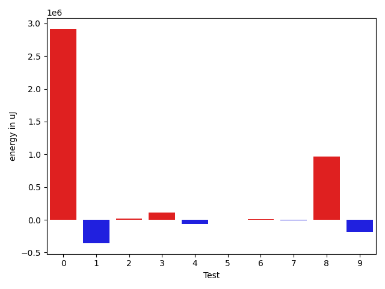

# gson 0aaf5f

https://github.com/google/gson/commit/0aaf5f

## Delta Energy per test method

| ID | EnergyV1 | EnergyV2 | DeltaEnergy | σV1 | %σV1 | σV2 | %σV2 |
| --- | --- | --- | --- | --- | --- | --- | --- |
| 0 | 507201 | 3422781 | 2915580 | 70810.48 | 13.96 | 269108.09 | 7.86 |
| 1 | 934995 | 577940 | -357055 | 70513.73 | 7.54 | 39851.84 | 6.90 |
| 2 | 147277 | 163940 | 16663 | 44529.23 | 30.24 | 18990.99 | 11.58 |
| 3 | 435790 | 547667 | 111877 | 61316.23 | 14.07 | 27088.34 | 4.95 |
| 4 | 281371 | 213317 | -68054 | 27448.60 | 9.76 | 13401.10 | 6.28 |
| 5 | 165283 | 168701 | 3418 | 30346.15 | 18.36 | 23701.00 | 14.05 |
| 6 | 179626 | 186157 | 6531 | 7649.12 | 4.26 | 38412.85 | 20.63 |
| 7 | 127929 | 123169 | -4760 | 20049.00 | 15.67 | 22578.90 | 18.33 |
| 8 | 2986321 | 3955679 | 969358 | 144327.09 | 4.83 | 207086.57 | 5.24 |
| 9 | 603880 | 424377 | -179503 | 68214.46 | 11.30 | 30896.78 | 7.28 |
| 10 | 1048764 | 538756 | -510008 | 47882.39 | 4.57 | 24218.12 | 4.50 |
| 11 | 274292 | 182677 | -91615 | 78269.08 | 28.53 | 23110.43 | 12.65 |
| 12 | 278197 | 223388 | -54809 | 24743.33 | 8.89 | 33104.36 | 14.82 |
| 13 | 297912 | 231872 | -66040 | 41625.47 | 13.97 | 20422.46 | 8.81 |
| 14 | 594054 | 361388 | -232666 | 37645.64 | 6.34 | 31317.85 | 8.67 |
| 15 | 1175534 | 1040586 | -134948 | 52495.53 | 4.47 | 31356.00 | 3.01 |
| 16 | 340148 | 268310 | -71838 | 41393.17 | 12.17 | 19642.49 | 7.32 |
| 17 | 645018 | 442259 | -202759 | 90087.72 | 13.97 | 49030.47 | 11.09 |
| 18 | 736448 | 400695 | -335753 | 73079.53 | 9.92 | 35195.43 | 8.78 |

## Misc.

| ID | Test Class | Test Method |
| --- | --- | --- |
| 0 | com.google.gson.DefaultDateTypeAdapterTest | testParsingDatesFormattedWithUsLocale |
| 1 | com.google.gson.DefaultDateTypeAdapterTest | testDateDeserializationISO8601 |
| 2 | com.google.gson.DefaultDateTypeAdapterTest | testUnexpectedToken |
| 3 | com.google.gson.DefaultDateTypeAdapterTest | testFormattingInEnUs |
| 4 | com.google.gson.DefaultDateTypeAdapterTest | testDatePattern |
| 5 | com.google.gson.DefaultDateTypeAdapterTest | testInvalidDatePattern |
| 6 | com.google.gson.DefaultDateTypeAdapterTest | testDateSerialization |
| 7 | com.google.gson.DefaultDateTypeAdapterTest | testNullValue |
| 8 | com.google.gson.DefaultDateTypeAdapterTest | testFormattingInFr |
| 9 | com.google.gson.functional.DefaultTypeAdaptersTest | testDateSerializationWithPatternNotOverridenByTypeAdapter |
| 10 | com.google.gson.functional.DefaultTypeAdaptersTest | testDefaultJavaSqlTimestampDeserialization |
| 11 | com.google.gson.functional.DefaultTypeAdaptersTest | testDateSerializationWithPattern |
| 12 | com.google.gson.functional.DefaultTypeAdaptersTest | testSqlDateSerialization |
| 13 | com.google.gson.functional.DefaultTypeAdaptersTest | testTimestampSerialization |
| 14 | com.google.gson.functional.DefaultTypeAdaptersTest | testDefaultDateDeserializationUsingBuilder |
| 15 | com.google.gson.functional.DefaultTypeAdaptersTest | testNullSerialization |
| 16 | com.google.gson.functional.DefaultTypeAdaptersTest | testDateDeserializationWithPattern |
| 17 | com.google.gson.functional.DefaultTypeAdaptersTest | testDateSerializationInCollection |
| 18 | com.google.gson.functional.DefaultTypeAdaptersTest | testDefaultDateDeserialization |

## Classifications

### Tests
| ID | Class | Delta | Share |
| --- | --- | --- | --- |
| G | NEUTRAL | 1713619.0 | - |
| N | NEGATIVE | -2309808.0 | 7.69 |
| P | POSITIVE | 4023427.0 | 16.67 |
| 0 | POSITIVE | 2915580.0 | 72.47 |
| 1 | NEGATIVE | -357055.0 | 15.46 |
| 10 | NEGATIVE | -510008.0 | 22.08 |
| 18 | NEGATIVE | -335753.0 | 14.54 |

### Lines
| Class | Java Class | Line |
| --- | --- | --- |
| negative | com.google.gson.DefaultDateTypeAdapter | 105 |
| negative | com.google.gson.DefaultDateTypeAdapter | 75 |
| negative | com.google.gson.DefaultDateTypeAdapter | 78 |
| negative | com.google.gson.DefaultDateTypeAdapter | 79 |
| negative | com.google.gson.DefaultDateTypeAdapter | 143 |
| negative | com.google.gson.DefaultDateTypeAdapter | 144 |
| negative | com.google.gson.DefaultDateTypeAdapter | 80 |
| negative | com.google.gson.DefaultDateTypeAdapter | 145 |
| negative | com.google.gson.DefaultDateTypeAdapter | 49 |
| negative | com.google.gson.DefaultDateTypeAdapter | 117 |
| negative | com.google.gson.DefaultDateTypeAdapter | 118 |
| negative | com.google.gson.DefaultDateTypeAdapter | 119 |
| negative | com.google.gson.DefaultDateTypeAdapter | 57 |
| negative | com.google.gson.DefaultDateTypeAdapter | 58 |
| negative | com.google.gson.DefaultDateTypeAdapter | 122 |
| negative | com.google.gson.DefaultDateTypeAdapter | 59 |
| negative | com.google.gson.DefaultDateTypeAdapter | 62 |
| negative | com.google.gson.DefaultDateTypeAdapter | 63 |
| negative | com.google.gson.internal.bind.DateTypeAdapter | 80 |
| negative | com.google.gson.internal.bind.DateTypeAdapter | 64 |
| negative | com.google.gson.internal.bind.DateTypeAdapter | 65 |
| negative | com.google.gson.internal.bind.DateTypeAdapter | 81 |
| negative | com.google.gson.internal.bind.DateTypeAdapter | 66 |
| negative | com.google.gson.internal.bind.DateTypeAdapter | 68 |
| negative | com.google.gson.internal.bind.DateTypeAdapter | 61 |
| negative | com.google.gson.internal.bind.DateTypeAdapter | 62 |
| negative | com.google.gson.internal.bind.DateTypeAdapter | 63 |
| negative | com.google.gson.internal.bind.DateTypeAdapter | 79 |
| positive | com.google.gson.DefaultDateTypeAdapter | 75 |
| positive | com.google.gson.DefaultDateTypeAdapter | 76 |
| positive | com.google.gson.DefaultDateTypeAdapter | 77 |
| positive | com.google.gson.DefaultDateTypeAdapter | 78 |
| positive | com.google.gson.DefaultDateTypeAdapter | 79 |
| positive | com.google.gson.DefaultDateTypeAdapter | 143 |
| positive | com.google.gson.DefaultDateTypeAdapter | 144 |
| positive | com.google.gson.DefaultDateTypeAdapter | 80 |
| positive | com.google.gson.DefaultDateTypeAdapter | 81 |
| positive | com.google.gson.DefaultDateTypeAdapter | 145 |
| positive | com.google.gson.DefaultDateTypeAdapter | 82 |
| positive | com.google.gson.DefaultDateTypeAdapter | 87 |
| positive | com.google.gson.DefaultDateTypeAdapter | 91 |
| positive | com.google.gson.DefaultDateTypeAdapter | 92 |
| positive | com.google.gson.DefaultDateTypeAdapter | 93 |
| positive | com.google.gson.DefaultDateTypeAdapter | 96 |
| positive | com.google.gson.DefaultDateTypeAdapter | 97 |
| positive | com.google.gson.DefaultDateTypeAdapter | 105 |
| positive | com.google.gson.DefaultDateTypeAdapter | 49 |
| positive | com.google.gson.DefaultDateTypeAdapter | 117 |
| positive | com.google.gson.DefaultDateTypeAdapter | 118 |
| positive | com.google.gson.DefaultDateTypeAdapter | 119 |
| positive | com.google.gson.DefaultDateTypeAdapter | 57 |
| positive | com.google.gson.DefaultDateTypeAdapter | 58 |
| positive | com.google.gson.DefaultDateTypeAdapter | 122 |
| positive | com.google.gson.DefaultDateTypeAdapter | 59 |
| positive | com.google.gson.DefaultDateTypeAdapter | 62 |
| positive | com.google.gson.DefaultDateTypeAdapter | 63 |
| unknown | com.google.gson.DefaultDateTypeAdapter | 68 |
| unknown | com.google.gson.DefaultDateTypeAdapter | 69 |
| unknown | com.google.gson.DefaultDateTypeAdapter | 70 |
| unknown | com.google.gson.DefaultDateTypeAdapter | 134 |
| unknown | com.google.gson.DefaultDateTypeAdapter | 75 |
| unknown | com.google.gson.DefaultDateTypeAdapter | 76 |
| unknown | com.google.gson.DefaultDateTypeAdapter | 77 |
| unknown | com.google.gson.DefaultDateTypeAdapter | 78 |
| unknown | com.google.gson.DefaultDateTypeAdapter | 79 |
| unknown | com.google.gson.DefaultDateTypeAdapter | 143 |
| unknown | com.google.gson.DefaultDateTypeAdapter | 144 |
| unknown | com.google.gson.DefaultDateTypeAdapter | 80 |
| unknown | com.google.gson.DefaultDateTypeAdapter | 81 |
| unknown | com.google.gson.DefaultDateTypeAdapter | 145 |
| unknown | com.google.gson.DefaultDateTypeAdapter | 82 |
| unknown | com.google.gson.DefaultDateTypeAdapter | 87 |
| unknown | com.google.gson.DefaultDateTypeAdapter | 91 |
| unknown | com.google.gson.DefaultDateTypeAdapter | 92 |
| unknown | com.google.gson.DefaultDateTypeAdapter | 93 |
| unknown | com.google.gson.DefaultDateTypeAdapter | 94 |
| unknown | com.google.gson.DefaultDateTypeAdapter | 96 |
| unknown | com.google.gson.DefaultDateTypeAdapter | 97 |
| unknown | com.google.gson.DefaultDateTypeAdapter | 105 |
| unknown | com.google.gson.DefaultDateTypeAdapter | 49 |
| unknown | com.google.gson.DefaultDateTypeAdapter | 117 |
| unknown | com.google.gson.DefaultDateTypeAdapter | 118 |
| unknown | com.google.gson.DefaultDateTypeAdapter | 55 |
| unknown | com.google.gson.DefaultDateTypeAdapter | 119 |
| unknown | com.google.gson.DefaultDateTypeAdapter | 57 |
| unknown | com.google.gson.DefaultDateTypeAdapter | 58 |
| unknown | com.google.gson.DefaultDateTypeAdapter | 59 |
| unknown | com.google.gson.DefaultDateTypeAdapter | 60 |
| unknown | com.google.gson.DefaultDateTypeAdapter | 62 |
| unknown | com.google.gson.DefaultDateTypeAdapter | 63 |
| unknown | com.google.gson.internal.bind.DateTypeAdapter | 80 |
| unknown | com.google.gson.internal.bind.DateTypeAdapter | 96 |
| unknown | com.google.gson.internal.bind.DateTypeAdapter | 64 |
| unknown | com.google.gson.internal.bind.DateTypeAdapter | 81 |
| unknown | com.google.gson.internal.bind.DateTypeAdapter | 65 |
| unknown | com.google.gson.internal.bind.DateTypeAdapter | 66 |
| unknown | com.google.gson.internal.bind.DateTypeAdapter | 61 |
| unknown | com.google.gson.internal.bind.DateTypeAdapter | 62 |
| unknown | com.google.gson.internal.bind.DateTypeAdapter | 79 |
| unknown | com.google.gson.internal.bind.DateTypeAdapter | 63 |

## Localization of Green Regression
### Selected Tests
| Test class | test method |
| --- | --- |
| com.google.gson.DefaultDateTypeAdapterTest | testParsingDatesFormattedWithUsLocale |

### Suspected lines
| Class | line |
| --- | --- |
| com.google.gson.DefaultDateTypeAdapter | [78](https://github.com/google/gson/tree/0aaf5f/gson/src/main/java/com/google/gson/DefaultDateTypeAdapter.java#L78) |
| com.google.gson.DefaultDateTypeAdapter | [79](https://github.com/google/gson/tree/0aaf5f/gson/src/main/java/com/google/gson/DefaultDateTypeAdapter.java#L78#L79) |
| com.google.gson.DefaultDateTypeAdapter | [59](https://github.com/google/gson/tree/0aaf5f/gson/src/main/java/com/google/gson/DefaultDateTypeAdapter.java#L78#L79#L59) |
| com.google.gson.DefaultDateTypeAdapter | [63](https://github.com/google/gson/tree/0aaf5f/gson/src/main/java/com/google/gson/DefaultDateTypeAdapter.java#L78#L79#L59#L63) |
| com.google.gson.DefaultDateTypeAdapter | [75](https://github.com/google/gson/tree/0aaf5f/gson/src/main/java/com/google/gson/DefaultDateTypeAdapter.java#L78#L79#L59#L63#L75) |
| com.google.gson.DefaultDateTypeAdapter | [117](https://github.com/google/gson/tree/0aaf5f/gson/src/main/java/com/google/gson/DefaultDateTypeAdapter.java#L78#L79#L59#L63#L75#L117) |
| com.google.gson.DefaultDateTypeAdapter | [57](https://github.com/google/gson/tree/0aaf5f/gson/src/main/java/com/google/gson/DefaultDateTypeAdapter.java#L78#L79#L59#L63#L75#L117#L57) |
| com.google.gson.DefaultDateTypeAdapter | [58](https://github.com/google/gson/tree/0aaf5f/gson/src/main/java/com/google/gson/DefaultDateTypeAdapter.java#L78#L79#L59#L63#L75#L117#L57#L58) |
| com.google.gson.DefaultDateTypeAdapter | [62](https://github.com/google/gson/tree/0aaf5f/gson/src/main/java/com/google/gson/DefaultDateTypeAdapter.java#L78#L79#L59#L63#L75#L117#L57#L58#L62) |
| com.google.gson.DefaultDateTypeAdapter | [76](https://github.com/google/gson/tree/0aaf5f/gson/src/main/java/com/google/gson/DefaultDateTypeAdapter.java#L78#L79#L59#L63#L75#L117#L57#L58#L62#L76) |
| com.google.gson.DefaultDateTypeAdapter | [77](https://github.com/google/gson/tree/0aaf5f/gson/src/main/java/com/google/gson/DefaultDateTypeAdapter.java#L78#L79#L59#L63#L75#L117#L57#L58#L62#L76#L77) |
| com.google.gson.DefaultDateTypeAdapter | [81](https://github.com/google/gson/tree/0aaf5f/gson/src/main/java/com/google/gson/DefaultDateTypeAdapter.java#L78#L79#L59#L63#L75#L117#L57#L58#L62#L76#L77#L81) |
| com.google.gson.DefaultDateTypeAdapter | [82](https://github.com/google/gson/tree/0aaf5f/gson/src/main/java/com/google/gson/DefaultDateTypeAdapter.java#L78#L79#L59#L63#L75#L117#L57#L58#L62#L76#L77#L81#L82) |
| com.google.gson.DefaultDateTypeAdapter | [87](https://github.com/google/gson/tree/0aaf5f/gson/src/main/java/com/google/gson/DefaultDateTypeAdapter.java#L78#L79#L59#L63#L75#L117#L57#L58#L62#L76#L77#L81#L82#L87) |
| com.google.gson.DefaultDateTypeAdapter | [91](https://github.com/google/gson/tree/0aaf5f/gson/src/main/java/com/google/gson/DefaultDateTypeAdapter.java#L78#L79#L59#L63#L75#L117#L57#L58#L62#L76#L77#L81#L82#L87#L91) |
| com.google.gson.DefaultDateTypeAdapter | [92](https://github.com/google/gson/tree/0aaf5f/gson/src/main/java/com/google/gson/DefaultDateTypeAdapter.java#L78#L79#L59#L63#L75#L117#L57#L58#L62#L76#L77#L81#L82#L87#L91#L92) |
| com.google.gson.DefaultDateTypeAdapter | [93](https://github.com/google/gson/tree/0aaf5f/gson/src/main/java/com/google/gson/DefaultDateTypeAdapter.java#L78#L79#L59#L63#L75#L117#L57#L58#L62#L76#L77#L81#L82#L87#L91#L92#L93) |
| com.google.gson.DefaultDateTypeAdapter | [96](https://github.com/google/gson/tree/0aaf5f/gson/src/main/java/com/google/gson/DefaultDateTypeAdapter.java#L78#L79#L59#L63#L75#L117#L57#L58#L62#L76#L77#L81#L82#L87#L91#L92#L93#L96) |
| com.google.gson.DefaultDateTypeAdapter | [97](https://github.com/google/gson/tree/0aaf5f/gson/src/main/java/com/google/gson/DefaultDateTypeAdapter.java#L78#L79#L59#L63#L75#L117#L57#L58#L62#L76#L77#L81#L82#L87#L91#L92#L93#L96#L97) |
| com.google.gson.DefaultDateTypeAdapter | [105](https://github.com/google/gson/tree/0aaf5f/gson/src/main/java/com/google/gson/DefaultDateTypeAdapter.java#L78#L79#L59#L63#L75#L117#L57#L58#L62#L76#L77#L81#L82#L87#L91#L92#L93#L96#L97#L105) |
| com.google.gson.DefaultDateTypeAdapter | [143](https://github.com/google/gson/tree/0aaf5f/gson/src/main/java/com/google/gson/DefaultDateTypeAdapter.java#L78#L79#L59#L63#L75#L117#L57#L58#L62#L76#L77#L81#L82#L87#L91#L92#L93#L96#L97#L105#L143) |
| com.google.gson.DefaultDateTypeAdapter | [144](https://github.com/google/gson/tree/0aaf5f/gson/src/main/java/com/google/gson/DefaultDateTypeAdapter.java#L78#L79#L59#L63#L75#L117#L57#L58#L62#L76#L77#L81#L82#L87#L91#L92#L93#L96#L97#L105#L143#L144) |
| com.google.gson.DefaultDateTypeAdapter | [145](https://github.com/google/gson/tree/0aaf5f/gson/src/main/java/com/google/gson/DefaultDateTypeAdapter.java#L78#L79#L59#L63#L75#L117#L57#L58#L62#L76#L77#L81#L82#L87#L91#L92#L93#L96#L97#L105#L143#L144#L145) |
| com.google.gson.DefaultDateTypeAdapter | [49](https://github.com/google/gson/tree/0aaf5f/gson/src/main/java/com/google/gson/DefaultDateTypeAdapter.java#L78#L79#L59#L63#L75#L117#L57#L58#L62#L76#L77#L81#L82#L87#L91#L92#L93#L96#L97#L105#L143#L144#L145#L49) |
| com.google.gson.DefaultDateTypeAdapter | [80](https://github.com/google/gson/tree/0aaf5f/gson/src/main/java/com/google/gson/DefaultDateTypeAdapter.java#L78#L79#L59#L63#L75#L117#L57#L58#L62#L76#L77#L81#L82#L87#L91#L92#L93#L96#L97#L105#L143#L144#L145#L49#L80) |
| com.google.gson.DefaultDateTypeAdapter | [118](https://github.com/google/gson/tree/0aaf5f/gson/src/main/java/com/google/gson/DefaultDateTypeAdapter.java#L78#L79#L59#L63#L75#L117#L57#L58#L62#L76#L77#L81#L82#L87#L91#L92#L93#L96#L97#L105#L143#L144#L145#L49#L80#L118) |
| com.google.gson.DefaultDateTypeAdapter | [119](https://github.com/google/gson/tree/0aaf5f/gson/src/main/java/com/google/gson/DefaultDateTypeAdapter.java#L78#L79#L59#L63#L75#L117#L57#L58#L62#L76#L77#L81#L82#L87#L91#L92#L93#L96#L97#L105#L143#L144#L145#L49#L80#L118#L119) |
| com.google.gson.DefaultDateTypeAdapter | [122](https://github.com/google/gson/tree/0aaf5f/gson/src/main/java/com/google/gson/DefaultDateTypeAdapter.java#L78#L79#L59#L63#L75#L117#L57#L58#L62#L76#L77#L81#L82#L87#L91#L92#L93#L96#L97#L105#L143#L144#L145#L49#L80#L118#L119#L122) |

| Time Label | Time (s) |
| --- | --- |
| Selection | 36.2790367603302 |
| Injection | 17.493544578552246 |
| Total | 218.91796875 |

