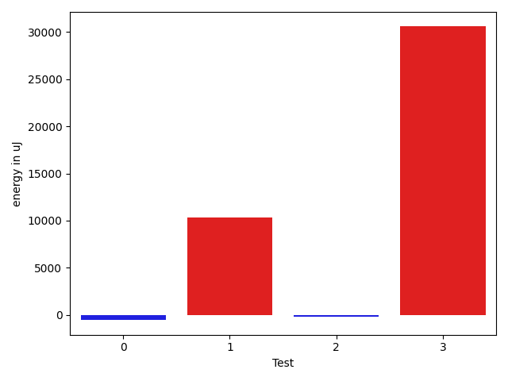

# gson 5e74da

https://github.com/google/gson/commit/5e74da

## Delta Energy per test method

| ID | EnergyV1 | EnergyV2 | DeltaEnergy | σV1 | σV2 |
| --- | --- | --- | --- | --- | --- |
| 0 | 34058 | 33508 | -550 | 65260.58706064081 | 40159.5671304107 |
| 1 | 62866 | 73181 | 10315 | 90782.92346643478 | 92997.42232584812 |
| 2 | 98083 | 97900 | -183 | 53757.168154910454 | 48750.01659338041 |
| 3 | 78003 | 108581 | 30578 | 30621.024236528756 | 32086.28831160302 |

## Delta Duration per test method

| ID | DurationV1 | DurationsV2 | DeltaDuration |
| --- | --- | --- | --- |
| 0 | 1719619.9838709678 | 1444823.0563380283 | -274796.9275329395 |
| 1 | 3731983.9793814435 | 3763243.3085106383 | 31259.32912919484 |
| 2 | 2752345.1447368423 | 2799155.153846154 | 46810.00910931174 |
| 3 | 3178374.742857143 | 3615321.479452055 | 436946.73659491213 |

## Misc.

| ID | Test Class | Test Method |
| --- | --- | --- |
| 0 | com.google.gson.reflect.TypeTokenTest | testIsAssignableFromWithNestedWildcards |
| 1 | com.google.gson.reflect.TypeTokenTest | testIsAssignableFromWithBasicWildcards |
| 2 | com.google.gson.reflect.TypeTokenTest | testIsAssignableFromWithTypeParameters |
| 3 | com.google.gson.reflect.TypeTokenTest | testIsAssignableFromRawTypes |

| Test | IterationV1 | IterationV2 | DeltaIteration |
| --- | --- | --- | --- |
| 0 | 62 | 71 | 9 |
| 1 | 97 | 94 | -3 |
| 2 | 76 | 78 | 2 |
| 3 | 70 | 73 | 3 |

| Time Label | Time (s) |
| --- | --- |
| Selection | 26.517320156097412 |
| Injection | 9.652345657348633 |
| Total | 1068.1023290157318 |

