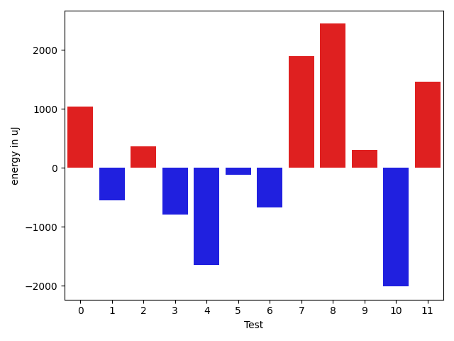
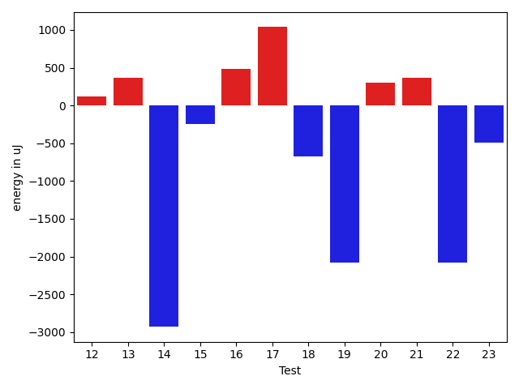
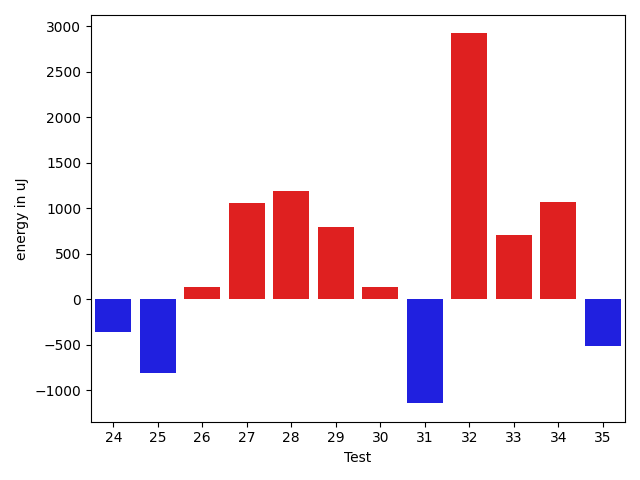
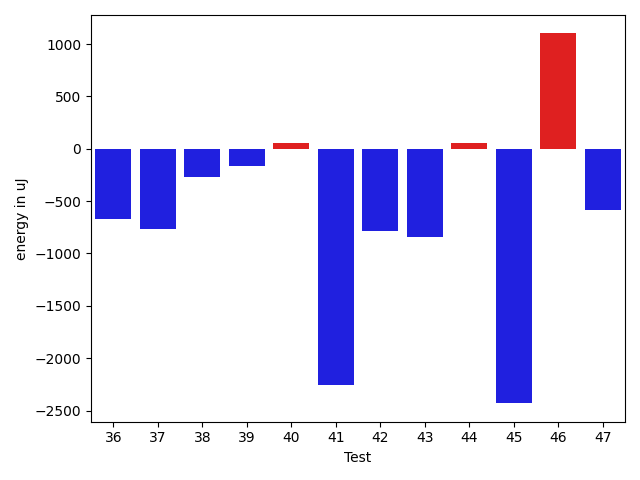
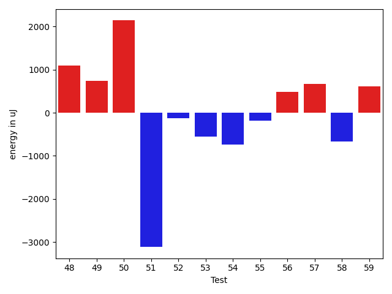
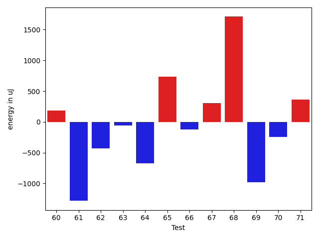
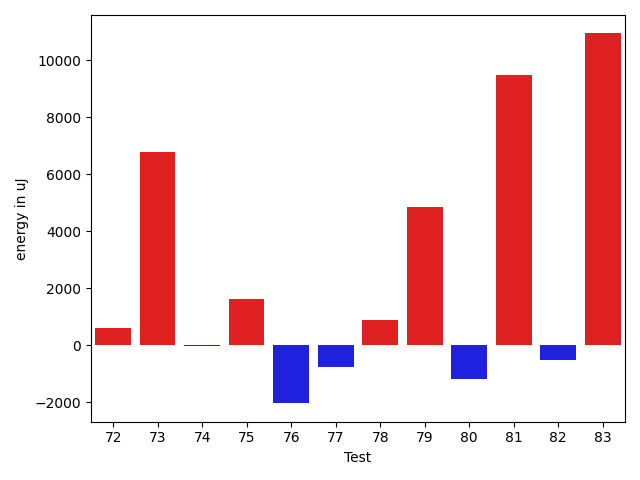
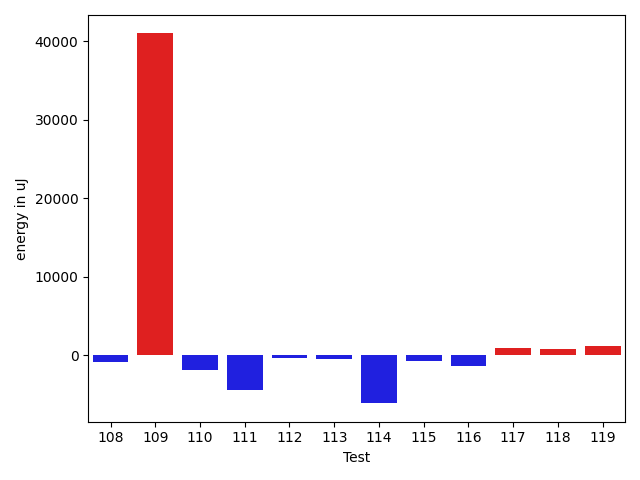

# gson 454f58

https://github.com/google/gson/commit/454f58

## Delta Energy per test method

| ID | EnergyV1 | EnergyV2 | DeltaEnergy | σV1 | σV2 |
| --- | --- | --- | --- | --- | --- |
| 0 | 39550 | 40589 | 1039 | 5454.935466928066 | 5338.115099108164 |
| 1 | 37964 | 37414 | -550 | 4415.111579815648 | 4752.420677496726 |
| 2 | 38330 | 38697 | 367 | 4755.403846279613 | 6268.542082773782 |
| 3 | 37171 | 36377 | -794 | 4337.406101871919 | 3908.4266606220644 |
| 4 | 38452 | 36804 | -1648 | 4172.959809866367 | 4176.60586373943 |
| 5 | 37232 | 37109 | -123 | 4001.19778399752 | 3629.911641102404 |
| 6 | 37963 | 37293 | -670 | 6607.585944618676 | 4398.939300837074 |
| 7 | 36072 | 37964 | 1892 | 4144.108849149179 | 4421.43128321079 |
| 8 | 36804 | 39246 | 2442 | 7112.279110246269 | 4540.214397277141 |
| 9 | 37598 | 37903 | 305 | 2857.723417143922 | 3866.757194128836 |
| 10 | 41931 | 39917 | -2014 | 22126.68424011014 | 16576.656376154988 |
| 11 | 36315 | 37780 | 1465 | 4650.912475436048 | 4093.8202572766786 |
| 12 | 40527 | 40650 | 123 | 45119.415690724505 | 42732.554949848694 |
| 13 | 38330 | 38696 | 366 | 50248.16841858135 | 12630.158205094436 |
| 14 | 40222 | 37292 | -2930 | 3899.832351223198 | 95169.44883958678 |
| 15 | 38208 | 37964 | -244 | 13590.33728241217 | 23388.530858194896 |
| 16 | 37658 | 38147 | 489 | 7788.6904404784245 | 4055.6500497963234 |
| 17 | 36804 | 37841 | 1037 | 4105.788136548477 | 3523.936544604528 |
| 18 | 37842 | 37170 | -672 | 3226.862583399847 | 4369.16539674924 |
| 19 | 40283 | 38207 | -2076 | 36484.37390392538 | 31815.07264624452 |
| 20 | 37598 | 37903 | 305 | 3944.0708570842808 | 4674.402841882565 |
| 21 | 36072 | 36438 | 366 | 3802.5543546184545 | 5836.343826856022 |
| 22 | 39246 | 37170 | -2076 | 19391.227049034627 | 16915.469849738463 |
| 23 | 37841 | 37353 | -488 | 3779.4143467187896 | 4797.014268327888 |
| 24 | 38147 | 38024 | -123 | 4254.580934522223 | 4072.5914081506317 |
| 25 | 37109 | 37170 | 61 | 3781.0265476104137 | 3958.589707076406 |
| 26 | 36377 | 37292 | 915 | 6101.291814034139 | 3909.884656129218 |
| 27 | 36377 | 37537 | 1160 | 5957.0874955336485 | 6990.055865464198 |
| 28 | 40100 | 40100 | 0 | 9434.121978145178 | 11502.663875248474 |
| 29 | 40527 | 40405 | -122 | 42478.436980250626 | 44418.105936878055 |
| 30 | 35888 | 36560 | 672 | 14213.457911779155 | 12943.609997391224 |
| 31 | 37598 | 37476 | -122 | 12354.461407848095 | 11510.791794193543 |
| 32 | 66040 | 67810 | 1770 | 20734.795650113705 | 21913.738164545335 |
| 33 | 36071 | 36499 | 428 | 3279.677196622842 | 3626.3274100524845 |
| 34 | 36011 | 36682 | 671 | 4018.571406564759 | 3417.0042282434088 |
| 35 | 37354 | 36438 | -916 | 7229.876342783953 | 3460.086577633073 |
| 36 | 38757 | 36743 | -2014 | 3650.5769984859926 | 4100.561919488055 |
| 37 | 36438 | 38268 | 1830 | 4123.376066179577 | 3564.769639155792 |
| 38 | 36499 | 36377 | -122 | 3841.4937791721572 | 3822.292070456547 |
| 39 | 36621 | 36194 | -427 | 3407.9277473721163 | 3521.2291543438346 |
| 40 | 36987 | 38208 | 1221 | 4181.97289329771 | 3604.9609275630437 |
| 41 | 37292 | 35950 | -1342 | 11478.842121523947 | 9486.113529969813 |
| 42 | 37048 | 36194 | -854 | 3076.19217886816 | 3533.0102057459903 |
| 43 | 37415 | 36682 | -733 | 6171.8339179950535 | 5486.245915267655 |
| 44 | 36621 | 36621 | 0 | 3186.942947685219 | 3193.2435557025187 |
| 45 | 38514 | 37658 | -856 | 4214.94651063332 | 3611.5153726929134 |
| 46 | 36438 | 39185 | 2747 | 3094.2100618197633 | 4153.796524787407 |
| 47 | 36437 | 36560 | 123 | 4837.835249250318 | 3168.9443096727305 |
| 48 | 35706 | 36804 | 1098 | 3342.1369005066795 | 3204.5194438143917 |
| 49 | 38391 | 39124 | 733 | 108833.59948523507 | 102957.29126576809 |
| 50 | 35949 | 38086 | 2137 | 3119.28491494811 | 2852.878426012834 |
| 51 | 38696 | 35584 | -3112 | 4854.692769773273 | 4043.595251696974 |
| 52 | 38147 | 38025 | -122 | 4245.783191927161 | 3891.091787578032 |
| 53 | 37475 | 36926 | -549 | 4058.5128832608966 | 4350.762892841004 |
| 54 | 39368 | 38635 | -733 | 8008.673323660793 | 12220.10817651222 |
| 55 | 38025 | 37841 | -184 | 3468.461299300961 | 4683.535508095434 |
| 56 | 38635 | 39123 | 488 | 3847.2426697571336 | 4670.481206707444 |
| 57 | 37720 | 38391 | 671 | 3663.6289965098363 | 3989.646982425725 |
| 58 | 37903 | 37231 | -672 | 3854.096784640321 | 4091.5629729481134 |
| 59 | 36865 | 37476 | 611 | 3357.9246116437216 | 3536.4813287301017 |
| 60 | 36987 | 37170 | 183 | 5640.159553095551 | 10505.743887748462 |
| 61 | 38085 | 36804 | -1281 | 3657.5406626983604 | 3928.1695771495274 |
| 62 | 38207 | 37781 | -426 | 3907.4548112602424 | 4531.826452502346 |
| 63 | 37598 | 37537 | -61 | 3988.725655945769 | 4317.342656472814 |
| 64 | 39673 | 39002 | -671 | 19247.907797834192 | 31689.5787392417 |
| 65 | 36499 | 37231 | 732 | 4023.459036252265 | 4306.3247097928925 |
| 66 | 37231 | 37109 | -122 | 3964.623305382271 | 4050.0481342793123 |
| 67 | 37841 | 38147 | 306 | 6907.416999598005 | 7508.155211317631 |
| 68 | 36193 | 37903 | 1710 | 4408.925770154989 | 8341.900272219877 |
| 69 | 38330 | 37354 | -976 | 17038.12906955128 | 22705.37630010194 |
| 70 | 36682 | 36438 | -244 | 4483.805362690143 | 4495.158322877331 |
| 71 | 38025 | 38391 | 366 | 11065.83050645093 | 20616.01820384008 |
| 72 | 39063 | 37903 | -1160 | 53646.08174011614 | 54954.25990220883 |
| 73 | 44678 | 70495 | 25817 | 22704.39285673951 | 23700.83816161154 |
| 74 | 37475 | 36804 | -671 | 5294.609240638626 | 6804.469457172523 |
| 75 | 37903 | 37720 | -183 | 12828.54746651357 | 14790.956773626436 |
| 76 | 39978 | 38147 | -1831 | 3986.737514227164 | 3430.5200400452927 |
| 77 | 38696 | 37171 | -1525 | 4303.179135842978 | 4420.662121902189 |
| 78 | 37109 | 38940 | 1831 | 4587.192374177481 | 4149.880720593346 |
| 79 | 39246 | 39917 | 671 | 27062.85030868672 | 38698.43690438867 |
| 80 | 38818 | 37171 | -1647 | 3457.649683001033 | 4093.09890132464 |
| 81 | 68970 | 73548 | 4578 | 24184.24163468243 | 22979.273026759274 |
| 82 | 38330 | 38879 | 549 | 19857.370104133184 | 18348.94260486287 |
| 83 | 39306 | 40771 | 1465 | 20593.190122822412 | 53218.928689358785 |
| 84 | 39428 | 38147 | -1281 | 13540.66358934218 | 20428.375069985366 |
| 85 | 120178 | 118103 | -2075 | 27105.808507728885 | 22578.358710083874 |
| 86 | 235168 | 236450 | 1282 | 214423.64734720133 | 477756.99007656134 |
| 87 | 76171 | 75683 | -488 | 25175.49713770107 | 19420.425101620196 |
| 88 | 85449 | 85632 | 183 | 557092.2525983714 | 360611.431358212 |
| 89 | 40161 | 40711 | 550 | 18830.013134618934 | 23368.35612798806 |
| 90 | 37780 | 36316 | -1464 | 4011.1144153603514 | 6920.432260804877 |
| 91 | 40345 | 39367 | -978 | 6695.846288215832 | 10581.148031811628 |
| 92 | 38514 | 36377 | -2137 | 3622.7304097252686 | 3844.9428427049243 |
| 93 | 39367 | 38575 | -792 | 12552.028364677373 | 14268.58658445122 |
| 94 | 40466 | 38940 | -1526 | 28317.267980780784 | 54889.83405561627 |
| 95 | 38086 | 38696 | 610 | 7217.9134848591 | 9025.741644613345 |
| 96 | 37842 | 38330 | 488 | 3384.9480194698813 | 6401.502354021746 |
| 97 | 45043 | 45288 | 245 | 356803.46513010113 | 661685.8766572651 |
| 98 | 39916 | 39550 | -366 | 597859.649795366 | 40830.7184611125 |
| 99 | 362548 | 331725 | -30823 | 109794.30822772914 | 119622.80016578149 |
| 100 | 40832 | 39306 | -1526 | 59010.691487485274 | 41515.334823808524 |
| 101 | 40771 | 43152 | 2381 | 43214.13951773867 | 50316.45622978863 |
| 102 | 38147 | 37781 | -366 | 4297.491868633307 | 4524.031038477453 |
| 103 | 39063 | 36255 | -2808 | 4240.744005831016 | 5232.759917437712 |
| 104 | 38269 | 39856 | 1587 | 8037.518357521804 | 4810.381686400584 |
| 105 | 38696 | 40100 | 1404 | 4565.816976802603 | 3739.422128728445 |
| 106 | 38696 | 39917 | 1221 | 3877.6977308233077 | 3991.5386468416878 |
| 107 | 37842 | 39611 | 1769 | 12186.227500756633 | 16320.72116970291 |
| 108 | 37781 | 37659 | -122 | 19957.933400503156 | 12326.602905236747 |
| 109 | 86120 | 84961 | -1159 | 236287.84672264586 | 397976.60925694404 |
| 110 | 40588 | 38880 | -1708 | 4488.163832543895 | 3735.4990410750447 |
| 111 | 38940 | 39428 | 488 | 14459.871790019906 | 5499.434715736978 |
| 112 | 36682 | 37231 | 549 | 4295.23166435217 | 4056.7585166265717 |
| 113 | 38818 | 37415 | -1403 | 3858.967581214818 | 4274.759487654939 |
| 114 | 40589 | 38940 | -1649 | 41438.20454646456 | 36356.74777144015 |
| 115 | 38024 | 38757 | 733 | 7689.919474171332 | 4339.322081678706 |
| 116 | 37658 | 36316 | -1342 | 5443.8416081691785 | 3994.709698309815 |
| 117 | 36377 | 37232 | 855 | 4345.219547167431 | 4102.433598184716 |
| 118 | 39062 | 38269 | -793 | 3988.556752746104 | 6829.589609514198 |
| 119 | 37536 | 38574 | 1038 | 3614.1660036840067 | 4132.831438082187 |
| 120 | 39856 | 37963 | -1893 | 3819.32784566975 | 4002.0638162753994 |
| 121 | 39063 | 38147 | -916 | 3679.6067187179624 | 4498.906462037932 |
| 122 | 40344 | 39856 | -488 | 23114.84706118771 | 26159.562711558894 |
| 123 | 41076 | 39429 | -1647 | 35114.87280911039 | 37549.981980235796 |
| 124 | 39612 | 37354 | -2258 | 4750.888699203784 | 3803.06161362803 |
| 125 | 39673 | 40466 | 793 | 417049.94104832574 | 425586.92036722467 |
| 126 | 37903 | 38452 | 549 | 3866.446261031746 | 4072.8074350375605 |
| 127 | 39733 | 40344 | 611 | 40444.44791095938 | 38931.875172404296 |
| 128 | 38269 | 37842 | -427 | 3565.5789932482808 | 3669.104850782499 |
| 129 | 38697 | 37780 | -917 | 458474.6201778577 | 519034.0446117704 |
| 130 | 40344 | 38758 | -1586 | 15253.835931482581 | 10839.111245825232 |
| 131 | 38635 | 39612 | 977 | 4576.520465841166 | 5916.808245126759 |

## Delta Duration per test method

| ID | DurationV1 | DurationsV2 | DeltaDuration |
| --- | --- | --- | --- |
| 0 | 1023566.6825396825 | 1007422.0175438597 | -16144.664995822823 |
| 1 | 951341.1333333333 | 928299.0625 | -23042.070833333302 |
| 2 | 950576.453125 | 960728.09375 | 10151.640625 |
| 3 | 1007034.5081967213 | 1012533.1343283582 | 5498.6261316369055 |
| 4 | 929582.6666666666 | 892092.551724138 | -37490.11494252866 |
| 5 | 679743.911111111 | 661236.1818181818 | -18507.72929292929 |
| 6 | 1049209.445945946 | 1018447.6285714286 | -30761.817374517443 |
| 7 | 783569.023255814 | 703524.3913043478 | -80044.6319514662 |
| 8 | 948402.2954545454 | 791538.5238095238 | -156863.77164502162 |
| 9 | 520325.79411764705 | 563112.0454545454 | 42786.251336898364 |
| 10 | 1238152.4423076923 | 935179.1363636364 | -302973.3059440559 |
| 11 | 633182.8055555555 | 581970.3333333334 | -51212.47222222213 |
| 12 | 1380000.6727272726 | 1454604.7407407407 | 74604.06801346806 |
| 13 | 851758.6551724138 | 786893.9523809524 | -64864.70279146137 |
| 14 | 528136.1470588235 | 1680050.0 | 1151913.8529411764 |
| 15 | 983865.0833333334 | 1145411.564516129 | 161546.4811827956 |
| 16 | 797983.4 | 867416.7843137255 | 69433.38431372552 |
| 17 | 804069.9411764706 | 768084.625 | -35985.3161764706 |
| 18 | 781093.0 | 748306.8867924528 | -32786.11320754723 |
| 19 | 1529183.4189189188 | 1205062.7746478873 | -324120.6442710315 |
| 20 | 810842.6071428572 | 826678.4516129033 | 15835.844470046111 |
| 21 | 1022616.7391304348 | 916621.1449275363 | -105995.59420289856 |
| 22 | 1532723.2577319588 | 1413899.6923076923 | -118823.5654242665 |
| 23 | 782222.6851851852 | 781622.6341463415 | -600.051038843696 |
| 24 | 811075.8 | 763362.7142857143 | -47713.08571428573 |
| 25 | 850631.8085106383 | 809816.7142857143 | -40815.09422492399 |
| 26 | 902066.72 | 832121.3928571428 | -69945.32714285713 |
| 27 | 1050782.421875 | 1014071.7101449275 | -36710.71173007251 |
| 28 | 1116757.737704918 | 1129234.6610169492 | 12476.923312031198 |
| 29 | 1285704.7727272727 | 1389999.5945945946 | 104294.82186732185 |
| 30 | 1220580.7159090908 | 1254181.3908045976 | 33600.67489550682 |
| 31 | 1232701.1794871795 | 1148135.0470588235 | -84566.13242835598 |
| 32 | 1877720.505050505 | 1880818.4343434344 | 3097.929292929359 |
| 33 | 555860.6774193548 | 548103.4571428571 | -7757.220276497654 |
| 34 | 727638.5714285715 | 721533.0833333334 | -6105.488095238106 |
| 35 | 884197.1521739131 | 796131.4920634921 | -88065.66011042101 |
| 36 | 612790.21875 | 641187.3888888889 | 28397.170138888876 |
| 37 | 671014.3548387097 | 644876.9444444445 | -26137.4103942652 |
| 38 | 654872.3703703703 | 591009.0 | -63863.370370370336 |
| 39 | 797103.6721311476 | 767568.7058823529 | -29534.96624879469 |
| 40 | 624457.8235294118 | 620710.303030303 | -3747.520499108825 |
| 41 | 1014591.7272727273 | 977752.5576923077 | -36839.16958041955 |
| 42 | 484491.8947368421 | 512189.42307692306 | 27697.528340080986 |
| 43 | 919100.5081967213 | 961784.0943396227 | 42683.58614290133 |
| 44 | 511356.5263157895 | 486208.81481481483 | -25147.711500974663 |
| 45 | 479903.15 | 440294.35294117645 | -39608.79705882358 |
| 46 | 605511.7 | 577796.3125 | -27715.387499999953 |
| 47 | 744554.9666666667 | 594179.5217391305 | -150375.44492753618 |
| 48 | 505853.18518518517 | 549026.9565217391 | 43173.77133655397 |
| 49 | 2243248.153846154 | 2158274.0606060605 | -84974.09324009344 |
| 50 | 478522.70588235295 | 438741.1538461539 | -39781.55203619908 |
| 51 | 530904.3888888889 | 531825.9565217391 | 921.5676328502595 |
| 52 | 915678.0322580645 | 976113.9393939395 | 60435.907135874964 |
| 53 | 874200.2692307692 | 940707.1666666666 | 66506.89743589738 |
| 54 | 1109188.8170731708 | 1192262.1923076923 | 83073.37523452146 |
| 55 | 697014.3023255814 | 829691.7234042553 | 132677.4210786739 |
| 56 | 850291.1666666666 | 893161.9591836735 | 42870.79251700686 |
| 57 | 762110.6470588235 | 816477.0769230769 | 54366.42986425338 |
| 58 | 796529.0 | 822497.52 | 25968.52000000002 |
| 59 | 744264.4166666666 | 792396.0714285715 | 48131.65476190485 |
| 60 | 1120254.5125 | 1145723.987654321 | 25469.475154320942 |
| 61 | 795354.224489796 | 801927.8913043478 | 6573.666814551805 |
| 62 | 779302.619047619 | 779969.72 | 667.1009523809189 |
| 63 | 786803.08 | 827535.2978723404 | 40732.217872340465 |
| 64 | 1007868.0 | 1204474.3214285714 | 196606.32142857136 |
| 65 | 748275.72 | 856387.9074074074 | 108112.18740740744 |
| 66 | 780681.1333333333 | 825278.1590909091 | 44597.02575757576 |
| 67 | 1066528.4512195121 | 1147180.183908046 | 80651.73268853384 |
| 68 | 985701.1971830986 | 1050599.855263158 | 64898.65808005934 |
| 69 | 988866.671641791 | 1062024.1384615384 | 73157.46681974735 |
| 70 | 1005282.48 | 1068296.7466666666 | 63014.266666666605 |
| 71 | 1154510.65 | 1277990.0833333333 | 123479.43333333335 |
| 72 | 1465780.475609756 | 1634375.738095238 | 168595.26248548203 |
| 73 | 1745109.3434343433 | 1965397.4848484849 | 220288.14141414152 |
| 74 | 1038553.4556962026 | 1133077.7 | 94524.24430379737 |
| 75 | 1195599.4615384615 | 1308965.5180722892 | 113366.05653382768 |
| 76 | 626115.8484848485 | 629177.7368421053 | 3061.888357256772 |
| 77 | 634703.0833333334 | 603218.8529411765 | -31484.230392156867 |
| 78 | 699444.4871794871 | 747252.7368421053 | 47808.24966261815 |
| 79 | 982969.6129032258 | 1221625.1081081082 | 238655.49520488235 |
| 80 | 661319.3571428572 | 648275.8387096775 | -13043.518433179706 |
| 81 | 2009204.3695652173 | 2171041.494845361 | 161837.1252801437 |
| 82 | 1251450.5925925926 | 1330349.0886075948 | 78898.49601500225 |
| 83 | 1124639.8727272728 | 1623547.5833333333 | 498907.71060606046 |
| 84 | 857405.972972973 | 1024688.0 | 167282.02702702698 |
| 85 | 3494452.7474747472 | 3548209.1919191917 | 53756.444444444496 |
| 86 | 7347956.313131313 | 9643435.414141415 | 2295479.101010102 |
| 87 | 2229376.767676768 | 2314929.383838384 | 85552.61616161605 |
| 88 | 7517845.01010101 | 4521272.05050505 | -2996572.9595959596 |
| 89 | 1573419.9670329671 | 1590334.2121212122 | 16914.24508824502 |
| 90 | 998349.6349206349 | 1032147.9333333333 | 33798.29841269844 |
| 91 | 858330.9534883721 | 898300.6 | 39969.64651162783 |
| 92 | 742057.1702127659 | 785965.7647058824 | 43908.594493116485 |
| 93 | 1229253.125 | 1228825.9425287356 | -427.18247126438655 |
| 94 | 1241032.5438596492 | 1612869.7931034483 | 371837.24924379913 |
| 95 | 1088404.8103448276 | 1079540.0606060605 | -8864.749738767045 |
| 96 | 822668.1525423729 | 849416.5185185185 | 26748.365976145607 |
| 97 | 3561842.7922077924 | 7726369.621212121 | 4164526.8290043287 |
| 98 | 6945969.935064935 | 1360591.7341772153 | -5585378.20088772 |
| 99 | 10564696.141414141 | 10010049.565656565 | -554646.5757575762 |
| 100 | 2063036.2608695652 | 1726851.2272727273 | -336185.0335968379 |
| 101 | 1210969.2972972973 | 1492187.107142857 | 281217.80984555976 |
| 102 | 685306.6071428572 | 736386.027027027 | 51079.41988416982 |
| 103 | 632884.3421052631 | 754165.0540540541 | 121280.71194879094 |
| 104 | 710523.025 | 605529.0882352941 | -104993.93676470593 |
| 105 | 1030936.4761904762 | 943741.0535714285 | -87195.42261904769 |
| 106 | 719969.3863636364 | 675075.2307692308 | -44894.1555944056 |
| 107 | 1125621.6025641025 | 1259818.2325581396 | 134196.6299940371 |
| 108 | 971228.0327868853 | 960410.1568627451 | -10817.875924140215 |
| 109 | 3523111.3636363638 | 4834951.090909091 | 1311839.727272727 |
| 110 | 659865.6 | 687380.2894736842 | 27514.68947368418 |
| 111 | 852726.4074074074 | 756845.4 | -95881.0074074074 |
| 112 | 833939.5952380953 | 821051.9555555555 | -12887.639682539739 |
| 113 | 651016.0 | 516589.35714285716 | -134426.64285714284 |
| 114 | 1575715.7222222222 | 1179345.462962963 | -396370.2592592593 |
| 115 | 857678.9787234042 | 790651.2608695652 | -67027.71785383904 |
| 116 | 970667.546875 | 842205.6393442623 | -128461.90753073769 |
| 117 | 747261.09375 | 673892.5 | -73368.59375 |
| 118 | 847677.7111111111 | 904543.731707317 | 56866.020596205955 |
| 119 | 658082.3225806452 | 622865.1724137932 | -35217.15016685205 |
| 120 | 519273.0416666667 | 576864.75 | 57591.708333333314 |
| 121 | 894883.5079365079 | 991236.6833333333 | 96353.17539682542 |
| 122 | 1047618.0652173914 | 1194622.0 | 147003.93478260865 |
| 123 | 1139676.98 | 1282160.5454545454 | 142483.56545454543 |
| 124 | 668993.5333333333 | 767564.5652173914 | 98571.03188405803 |
| 125 | 3041354.027027027 | 4176211.013157895 | 1134856.9861308676 |
| 126 | 775791.3823529412 | 768765.2340425532 | -7026.148310387973 |
| 127 | 1229736.108695652 | 1520312.690909091 | 290576.5822134388 |
| 128 | 635896.7352941176 | 641357.2962962963 | 5460.5610021787 |
| 129 | 3916732.672413793 | 4363260.528301887 | 446527.8558880943 |
| 130 | 880571.4871794871 | 752419.8 | -128151.68717948708 |
| 131 | 877982.0 | 789167.04 | -88814.95999999996 |

## Misc.

| ID | Test Class | Test Method |
| --- | --- | --- |
| 0 | com.google.gson.functional.PrimitiveTest | testDeserializePrimitiveWrapperAsObjectField |
| 1 | com.google.gson.functional.CustomTypeAdaptersTest | testCustomAdapterInvokedForCollectionElementDeserialization |
| 2 | com.google.gson.functional.CustomTypeAdaptersTest | testCustomNestedDeserializers |
| 3 | com.google.gson.functional.CustomTypeAdaptersTest | testCustomDeserializerForLong |
| 4 | com.google.gson.functional.CustomTypeAdaptersTest | testCustomAdapterInvokedForMapElementDeserialization |
| 5 | com.google.gson.functional.CustomTypeAdaptersTest | testEnsureCustomDeserializerNotInvokedForNullValues |
| 6 | com.google.gson.functional.DefaultTypeAdaptersTest | testTreeSetDeserialization |
| 7 | com.google.gson.functional.DefaultTypeAdaptersTest | testBigIntegerFieldDeserialization |
| 8 | com.google.gson.functional.DefaultTypeAdaptersTest | testUrlNullDeserialization |
| 9 | com.google.gson.functional.DefaultTypeAdaptersTest | testPropertiesDeserialization |
| 10 | com.google.gson.functional.DefaultTypeAdaptersTest | testBigDecimalFieldDeserialization |
| 11 | com.google.gson.functional.DefaultTypeAdaptersTest | testBadValueForBigDecimalDeserialization |
| 12 | com.google.gson.functional.JsonParserTest | testBadTypeForDeserializingCustomTree |
| 13 | com.google.gson.functional.JsonParserTest | testDeserializingCustomTree |
| 14 | com.google.gson.functional.JsonParserTest | testBadFieldTypeForCustomDeserializerCustomTree |
| 15 | com.google.gson.functional.JsonParserTest | testChangingCustomTreeAndDeserializing |
| 16 | com.google.gson.functional.JsonParserTest | testBadFieldTypeForDeserializingCustomTree |
| 17 | com.google.gson.functional.CollectionTest | testNullsInListDeserialization |
| 18 | com.google.gson.functional.CollectionTest | testRawCollectionOfBagOfPrimitivesNotAllowed |
| 19 | com.google.gson.functional.CollectionTest | testTopLevelCollectionOfIntegersDeserialization |
| 20 | com.google.gson.functional.CollectionTest | testLinkedListDeserialization |
| 21 | com.google.gson.functional.CollectionTest | testSetDeserialization |
| 22 | com.google.gson.functional.CollectionTest | testWildcardCollectionField |
| 23 | com.google.gson.functional.CollectionTest | testRawCollectionDeserializationNotAlllowed |
| 24 | com.google.gson.functional.CollectionTest | testCollectionOfStringsDeserialization |
| 25 | com.google.gson.functional.CollectionTest | testQueueDeserialization |
| 26 | com.google.gson.functional.CollectionTest | testWildcardPrimitiveCollectionDeserilaization |
| 27 | com.google.gson.functional.CollectionTest | testTopLevelListOfIntegerCollectionsDeserialization |
| 28 | com.google.gson.functional.ReadersWritersTest | testReadWriteTwoObjects |
| 29 | com.google.gson.functional.ReadersWritersTest | testReaderForDeserialization |
| 30 | com.google.gson.functional.ObjectTest | testEmptyCollectionInAnObjectDeserialization |
| 31 | com.google.gson.functional.ObjectTest | testArrayOfArraysDeserialization |
| 32 | com.google.gson.functional.ObjectTest | testSingletonLists |
| 33 | com.google.gson.functional.ObjectTest | testPrivateNoArgConstructorDeserialization |
| 34 | com.google.gson.functional.ObjectTest | testPrimitiveArrayInAnObjectDeserialization |
| 35 | com.google.gson.functional.ObjectTest | testNestedDeserialization |
| 36 | com.google.gson.functional.ObjectTest | testBagOfPrimitiveWrappersDeserialization |
| 37 | com.google.gson.functional.ObjectTest | testNullFieldsDeserialization |
| 38 | com.google.gson.functional.ObjectTest | testNullPrimitiveFieldsDeserialization |
| 39 | com.google.gson.functional.ObjectTest | testInnerClassDeserialization |
| 40 | com.google.gson.functional.ObjectTest | testClassWithTransientFieldsDeserialization |
| 41 | com.google.gson.functional.ObjectTest | testStringFieldWithNumberValueDeserialization |
| 42 | com.google.gson.functional.ObjectTest | testObjectFieldNamesWithoutQuotesDeserialization |
| 43 | com.google.gson.functional.ObjectTest | testArrayOfObjectsDeserialization |
| 44 | com.google.gson.functional.ObjectTest | testStringFieldWithEmptyValueDeserialization |
| 45 | com.google.gson.functional.ObjectTest | testClassWithNoFieldsDeserialization |
| 46 | com.google.gson.functional.ObjectTest | testJsonInMixedQuotesDeserialization |
| 47 | com.google.gson.functional.ObjectTest | testBagOfPrimitivesDeserialization |
| 48 | com.google.gson.functional.ObjectTest | testNullArraysDeserialization |
| 49 | com.google.gson.functional.ObjectTest | testJsonInSingleQuotesDeserialization |
| 50 | com.google.gson.functional.ObjectTest | testNullObjectFieldsDeserialization |
| 51 | com.google.gson.functional.ObjectTest | testClassWithTransientFieldsDeserializationTransientFieldsPassedInJsonAreIgnored |
| 52 | com.google.gson.functional.CustomDeserializerTest | testCustomDeserializerReturnsNullForArrayElementsForArrayField |
| 53 | com.google.gson.functional.CustomDeserializerTest | testCustomDeserializerReturnsNull |
| 54 | com.google.gson.functional.CustomDeserializerTest | testJsonTypeFieldBasedDeserialization |
| 55 | com.google.gson.functional.CustomDeserializerTest | testDefaultConstructorNotCalledOnField |
| 56 | com.google.gson.functional.CustomDeserializerTest | testCustomDeserializerReturnsNullForPrimitiveFields |
| 57 | com.google.gson.functional.MapTest | testMapDeserializationWithIntegerKeys |
| 58 | com.google.gson.functional.MapTest | testMapStandardSubclassDeserialization |
| 59 | com.google.gson.functional.MapTest | testReadMapsWithEmptyStringKey |
| 60 | com.google.gson.functional.MapTest | testParameterizedMapSubclassDeserialization |
| 61 | com.google.gson.functional.MapTest | testMapDeserializationWithNullValue |
| 62 | com.google.gson.functional.MapTest | testMapDeserializationEmpty |
| 63 | com.google.gson.functional.MapTest | testMapDeserializationWithNullKey |
| 64 | com.google.gson.functional.MapTest | testMapDeserialization |
| 65 | com.google.gson.functional.MapTest | testMapOfMapDeserialization |
| 66 | com.google.gson.functional.MapTest | testMapDeserializationWithWildcardValues |
| 67 | com.google.gson.functional.ParameterizedTypesTest | testVariableTypeArrayDeserialization |
| 68 | com.google.gson.functional.ParameterizedTypesTest | testParameterizedTypeWithReaderDeserialization |
| 69 | com.google.gson.functional.ParameterizedTypesTest | testDeepParameterizedTypeDeserialization |
| 70 | com.google.gson.functional.ParameterizedTypesTest | testVariableTypeDeserialization |
| 71 | com.google.gson.functional.ParameterizedTypesTest | testParameterizedTypeGenericArraysDeserialization |
| 72 | com.google.gson.functional.ParameterizedTypesTest | testParameterizedTypeDeserialization |
| 73 | com.google.gson.functional.ParameterizedTypesTest | testVariableTypeFieldsAndGenericArraysDeserialization |
| 74 | com.google.gson.functional.ParameterizedTypesTest | testParameterizedTypeWithVariableTypeDeserialization |
| 75 | com.google.gson.functional.ParameterizedTypesTest | testTypesWithMultipleParametersDeserialization |
| 76 | com.google.gson.functional.NamingPolicyTest | testGsonWithLowerCaseDashPolicyDeserialiation |
| 77 | com.google.gson.functional.NamingPolicyTest | testGsonWithUpperCamelCaseSpacesPolicyDeserialiation |
| 78 | com.google.gson.functional.NamingPolicyTest | testGsonWithSerializedNameFieldNamingPolicyDeserialization |
| 79 | com.google.gson.functional.NamingPolicyTest | testGsonWithNonDefaultFieldNamingPolicyDeserialiation |
| 80 | com.google.gson.functional.NamingPolicyTest | testGsonWithLowerCaseUnderscorePolicyDeserialiation |
| 81 | com.google.gson.functional.EnumTest | testEnumSubclass |
| 82 | com.google.gson.functional.EnumTest | testEnumSubclassWithRegisteredTypeAdapter |
| 83 | com.google.gson.functional.EnumTest | testCollectionOfEnumsDeserialization |
| 84 | com.google.gson.functional.EnumTest | testClassWithEnumFieldDeserialization |
| 85 | com.google.gson.functional.MapAsArrayTypeAdapterTest | testMultipleEnableComplexKeyRegistrationHasNoEffect |
| 86 | com.google.gson.functional.MapAsArrayTypeAdapterTest | testSerializeComplexMapWithTypeAdapter |
| 87 | com.google.gson.functional.MapAsArrayTypeAdapterTest | testTwoTypesCollapseToOneDeserialize |
| 88 | com.google.gson.functional.TypeVariableTest | testAdvancedTypeVariables |
| 89 | com.google.gson.functional.TypeVariableTest | testTypeVariablesViaTypeParameter |
| 90 | com.google.gson.functional.TypeVariableTest | testBasicTypeVariables |
| 91 | com.google.gson.functional.UncategorizedTest | testGsonInstanceReusableForSerializationAndDeserialization |
| 92 | com.google.gson.functional.EscapingTest | testGsonDoubleDeserialization |
| 93 | com.google.gson.functional.EscapingTest | testGsonAcceptsEscapedAndNonEscapedJsonDeserialization |
| 94 | com.google.gson.functional.EscapingTest | testEscapingObjectFields |
| 95 | com.google.gson.functional.InstanceCreatorTest | testInstanceCreatorReturnsSubTypeForField |
| 96 | com.google.gson.functional.InstanceCreatorTest | testInstanceCreatorReturnsBaseType |
| 97 | com.google.gson.functional.InstanceCreatorTest | testInstanceCreatorReturnsSubTypeForTopLevelObject |
| 98 | com.google.gson.CommentsTest | testParseComments |
| 99 | com.google.gson.functional.ConcurrencyTest | testMultiThreadDeserialization |
| 100 | com.google.gson.functional.ConcurrencyTest | testSingleThreadDeserialization |
| 101 | com.google.gson.functional.SecurityTest | testNonExecutableJsonDeserialization |
| 102 | com.google.gson.functional.SecurityTest | testJsonWithNonExectuableTokenWithConfiguredGsonDeserialization |
| 103 | com.google.gson.functional.SecurityTest | testJsonWithNonExectuableTokenWithRegularGsonDeserialization |
| 104 | com.google.gson.MappedObjectConstructorTest | testNoInstanceCreatorInvokesDefaultConstructor |
| 105 | com.google.gson.MappedObjectConstructorTest | testInstanceCreatorTakesTopPrecedence |
| 106 | com.google.gson.MappedObjectConstructorTest | testNoDefaultConstructor |
| 107 | com.google.gson.functional.InheritanceTest | testSubInterfacesOfCollectionDeserialization |
| 108 | com.google.gson.functional.InheritanceTest | testSubClassDeserialization |
| 109 | com.google.gson.functional.TypeHierarchyAdapterTest | testTypeHierarchy |
| 110 | com.google.gson.functional.NullObjectAndFieldTest | testExplicitNullSetsFieldToNullDuringDeserialization |
| 111 | com.google.gson.functional.NullObjectAndFieldTest | testExplicitDeserializationOfNulls |
| 112 | com.google.gson.functional.NullObjectAndFieldTest | testNullWrappedPrimitiveMemberDeserialization |
| 113 | com.google.gson.functional.VersioningTest | testIgnoreLaterVersionClassDeserialization |
| 114 | com.google.gson.functional.VersioningTest | testVersionedUntilDeserialization |
| 115 | com.google.gson.functional.VersioningTest | testVersionedClassesDeserialization |
| 116 | com.google.gson.functional.VersioningTest | testVersionedGsonMixingSinceAndUntilDeserialization |
| 117 | com.google.gson.functional.VersioningTest | testVersionedGsonWithUnversionedClassesDeserialization |
| 118 | com.google.gson.functional.ArrayTest | testArrayOfPrimitivesAsObjectsDeserialization |
| 119 | com.google.gson.functional.ArrayTest | testArrayOfObjectsWithoutTypeInfoDeserialization |
| 120 | com.google.gson.functional.ArrayTest | testArrayWithoutTypeInfoDeserialization |
| 121 | com.google.gson.functional.ArrayTest | testArrayOfCollectionDeserialization |
| 122 | com.google.gson.functional.CircularReferenceTest | testDirectedAcyclicGraphDeserialization |
| 123 | com.google.gson.MixedStreamTest | testReadMixedStreamed |
| 124 | com.google.gson.MixedStreamTest | testReaderDoesNotMutateState |
| 125 | com.google.gson.JsonParserTest | testReadWriteTwoObjects |
| 126 | com.google.gson.functional.ExposeFieldsTest | testNoExposedFieldDeserialization |
| 127 | com.google.gson.functional.ExposeFieldsTest | testExposeAnnotationDeserialization |
| 128 | com.google.gson.functional.ExposeFieldsTest | testExposedInterfaceFieldDeserialization |
| 129 | com.google.gson.FunctionWithInternalDependenciesTest | testAnonymousLocalClassesSerialization |
| 130 | com.google.gson.functional.ExclusionStrategyFunctionalTest | testExclusionStrategyDeserialization |
| 131 | com.google.gson.functional.ExclusionStrategyFunctionalTest | testExclusionStrategyWithMode |

| Test | IterationV1 | IterationV2 | DeltaIteration |
| --- | --- | --- | --- |
| 0 | 63 | 57 | -6 |
| 1 | 60 | 64 | 4 |
| 2 | 64 | 64 | 0 |
| 3 | 61 | 67 | 6 |
| 4 | 54 | 58 | 4 |
| 5 | 45 | 44 | -1 |
| 6 | 74 | 70 | -4 |
| 7 | 43 | 46 | 3 |
| 8 | 44 | 42 | -2 |
| 9 | 34 | 22 | -12 |
| 10 | 52 | 44 | -8 |
| 11 | 36 | 30 | -6 |
| 12 | 55 | 54 | -1 |
| 13 | 29 | 21 | -8 |
| 14 | 34 | 27 | -7 |
| 15 | 60 | 62 | 2 |
| 16 | 50 | 51 | 1 |
| 17 | 51 | 48 | -3 |
| 18 | 59 | 53 | -6 |
| 19 | 74 | 71 | -3 |
| 20 | 56 | 62 | 6 |
| 21 | 69 | 69 | 0 |
| 22 | 97 | 91 | -6 |
| 23 | 54 | 41 | -13 |
| 24 | 50 | 56 | 6 |
| 25 | 47 | 49 | 2 |
| 26 | 50 | 56 | 6 |
| 27 | 64 | 69 | 5 |
| 28 | 61 | 59 | -2 |
| 29 | 44 | 37 | -7 |
| 30 | 88 | 87 | -1 |
| 31 | 78 | 85 | 7 |
| 32 | 99 | 99 | 0 |
| 33 | 31 | 35 | 4 |
| 34 | 42 | 48 | 6 |
| 35 | 46 | 63 | 17 |
| 36 | 32 | 36 | 4 |
| 37 | 31 | 36 | 5 |
| 38 | 27 | 32 | 5 |
| 39 | 61 | 51 | -10 |
| 40 | 34 | 33 | -1 |
| 41 | 66 | 52 | -14 |
| 42 | 19 | 26 | 7 |
| 43 | 61 | 53 | -8 |
| 44 | 19 | 27 | 8 |
| 45 | 20 | 17 | -3 |
| 46 | 30 | 32 | 2 |
| 47 | 30 | 23 | -7 |
| 48 | 27 | 23 | -4 |
| 49 | 39 | 33 | -6 |
| 50 | 17 | 13 | -4 |
| 51 | 18 | 23 | 5 |
| 52 | 62 | 66 | 4 |
| 53 | 52 | 60 | 8 |
| 54 | 82 | 78 | -4 |
| 55 | 43 | 47 | 4 |
| 56 | 60 | 49 | -11 |
| 57 | 51 | 52 | 1 |
| 58 | 51 | 50 | -1 |
| 59 | 48 | 56 | 8 |
| 60 | 80 | 81 | 1 |
| 61 | 49 | 46 | -3 |
| 62 | 42 | 50 | 8 |
| 63 | 50 | 47 | -3 |
| 64 | 61 | 56 | -5 |
| 65 | 50 | 54 | 4 |
| 66 | 45 | 44 | -1 |
| 67 | 82 | 87 | 5 |
| 68 | 71 | 76 | 5 |
| 69 | 67 | 65 | -2 |
| 70 | 75 | 75 | 0 |
| 71 | 80 | 84 | 4 |
| 72 | 82 | 84 | 2 |
| 73 | 99 | 99 | 0 |
| 74 | 79 | 80 | 1 |
| 75 | 78 | 83 | 5 |
| 76 | 33 | 38 | 5 |
| 77 | 36 | 34 | -2 |
| 78 | 39 | 38 | -1 |
| 79 | 31 | 37 | 6 |
| 80 | 28 | 31 | 3 |
| 81 | 92 | 97 | 5 |
| 82 | 81 | 79 | -2 |
| 83 | 55 | 60 | 5 |
| 84 | 37 | 45 | 8 |
| 85 | 99 | 99 | 0 |
| 86 | 99 | 99 | 0 |
| 87 | 99 | 99 | 0 |
| 88 | 99 | 99 | 0 |
| 89 | 91 | 99 | 8 |
| 90 | 63 | 60 | -3 |
| 91 | 43 | 45 | 2 |
| 92 | 47 | 34 | -13 |
| 93 | 88 | 87 | -1 |
| 94 | 57 | 58 | 1 |
| 95 | 58 | 66 | 8 |
| 96 | 59 | 54 | -5 |
| 97 | 77 | 66 | -11 |
| 98 | 77 | 79 | 2 |
| 99 | 99 | 99 | 0 |
| 100 | 92 | 88 | -4 |
| 101 | 37 | 28 | -9 |
| 102 | 28 | 37 | 9 |
| 103 | 38 | 37 | -1 |
| 104 | 40 | 34 | -6 |
| 105 | 63 | 56 | -7 |
| 106 | 44 | 39 | -5 |
| 107 | 78 | 86 | 8 |
| 108 | 61 | 51 | -10 |
| 109 | 99 | 99 | 0 |
| 110 | 35 | 38 | 3 |
| 111 | 27 | 35 | 8 |
| 112 | 42 | 45 | 3 |
| 113 | 27 | 28 | 1 |
| 114 | 54 | 54 | 0 |
| 115 | 47 | 46 | -1 |
| 116 | 64 | 61 | -3 |
| 117 | 32 | 26 | -6 |
| 118 | 45 | 41 | -4 |
| 119 | 31 | 29 | -2 |
| 120 | 24 | 28 | 4 |
| 121 | 63 | 60 | -3 |
| 122 | 46 | 48 | 2 |
| 123 | 50 | 55 | 5 |
| 124 | 30 | 46 | 16 |
| 125 | 74 | 76 | 2 |
| 126 | 34 | 47 | 13 |
| 127 | 46 | 55 | 9 |
| 128 | 34 | 27 | -7 |
| 129 | 58 | 53 | -5 |
| 130 | 39 | 40 | 1 |
| 131 | 42 | 50 | 8 |

| Time Label | Time (s) |
| --- | --- |
| Selection | 27.491291522979736 |
| Injection | 14.229206323623657 |
| Total | 1174.3905653953552 |

