# gson 4d9bec

https://github.com/google/gson/commit/4d9bec

## Delta Energy per test method

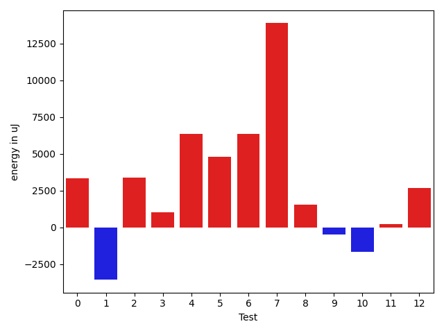

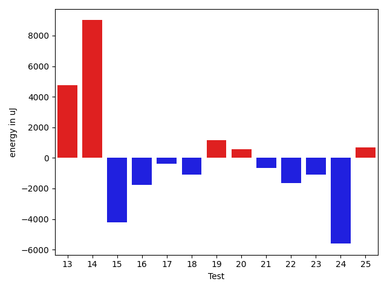

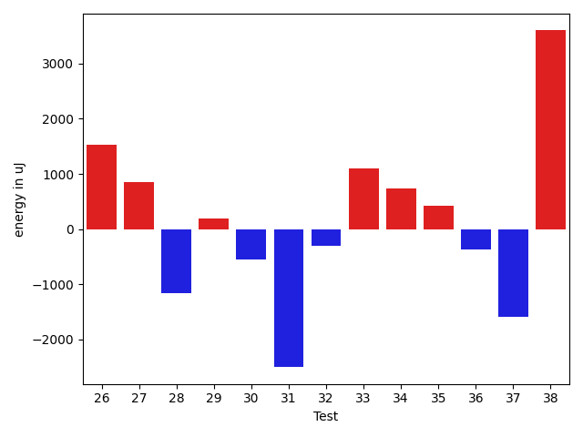

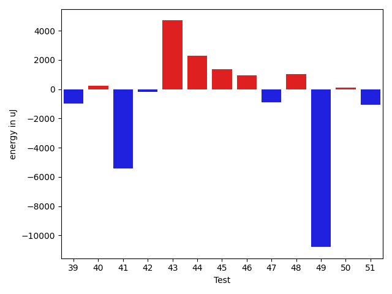

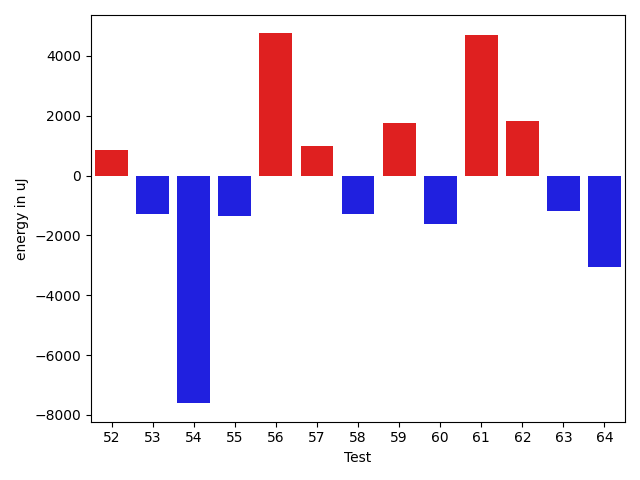

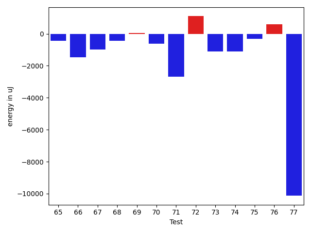

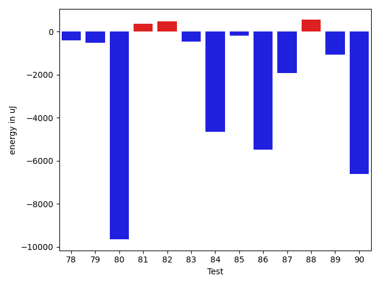

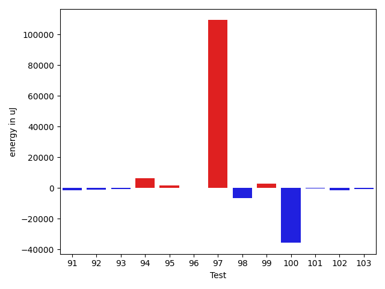

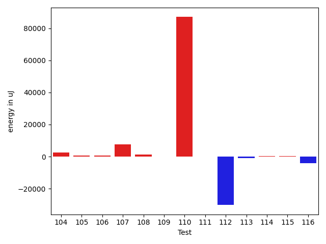

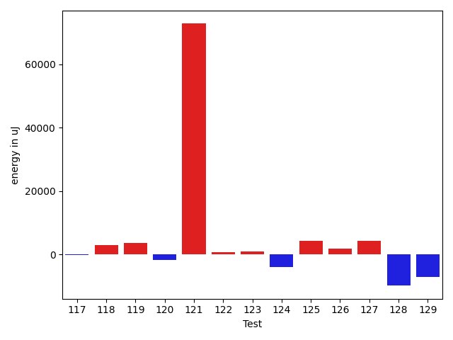

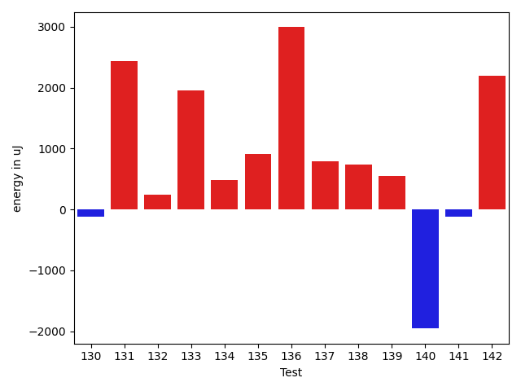

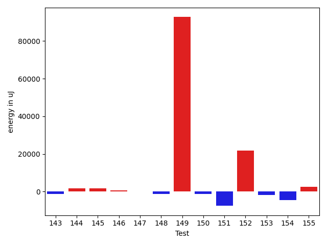

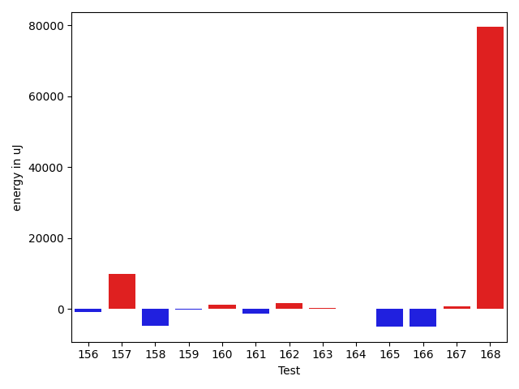

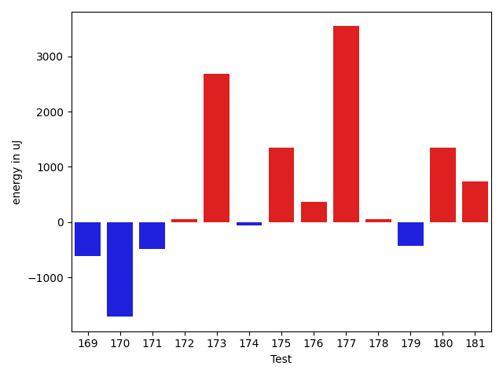

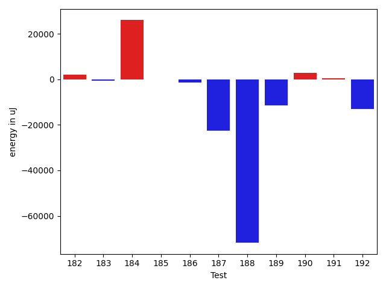

| ID | EnergyV1 | EnergyV2 | DeltaEnergy | σV1 | σV2 |
| --- | --- | --- | --- | --- | --- |
| 0 | 38758 | 40100 | 1342 | 3859.995532071606 | 9695.866853726093 |
| 1 | 38086 | 36926 | -1160 | 10438.121149202692 | 5010.689485046499 |
| 2 | 36621 | 37415 | 794 | 9826.908145751491 | 13472.59106227922 |
| 3 | 35705 | 36499 | 794 | 3792.406286809788 | 4793.814881031598 |
| 4 | 36560 | 37659 | 1099 | 11090.214058823822 | 28616.881470293672 |
| 5 | 44738 | 62439 | 17701 | 25494.982387446966 | 42207.336539308846 |
| 6 | 36682 | 37720 | 1038 | 4395.198254787705 | 33313.2410633529 |
| 7 | 36499 | 36193 | -306 | 6481.998254375129 | 69704.58396277872 |
| 8 | 36927 | 37597 | 670 | 6412.488663707868 | 8953.008293191488 |
| 9 | 36499 | 37354 | 855 | 3587.3847594947893 | 3534.7960226687765 |
| 10 | 38574 | 35889 | -2685 | 4161.356586272953 | 4182.3856066889275 |
| 11 | 38330 | 37658 | -672 | 4373.6248364485955 | 3723.2609619563873 |
| 12 | 36804 | 35644 | -1160 | 3772.1249285722497 | 24549.626580587348 |
| 13 | 39917 | 42297 | 2380 | 19379.506065077836 | 19636.91934481676 |
| 14 | 39490 | 41870 | 2380 | 85687.37069991865 | 83865.74133710888 |
| 15 | 36682 | 37414 | 732 | 36284.06779045347 | 4289.635225729862 |
| 16 | 36560 | 38085 | 1525 | 59311.0383410828 | 43431.70408444681 |
| 17 | 37049 | 37476 | 427 | 8466.028102149727 | 4101.899681709797 |
| 18 | 37232 | 35828 | -1404 | 3645.604604216008 | 3360.845921994261 |
| 19 | 37842 | 38025 | 183 | 2925.0511774148276 | 2718.6773231911448 |
| 20 | 35156 | 36804 | 1648 | 4384.873230680101 | 2891.5791842856534 |
| 21 | 36498 | 35889 | -609 | 3560.233502365853 | 4152.649832908557 |
| 22 | 39551 | 36621 | -2930 | 4466.77679624805 | 3367.11335816448 |
| 23 | 36865 | 35462 | -1403 | 3410.0228372255806 | 4112.491186572585 |
| 24 | 38147 | 36255 | -1892 | 15601.39985041461 | 8338.020183672701 |
| 25 | 36499 | 37048 | 549 | 3026.7682389344286 | 3588.934049249385 |
| 26 | 35217 | 36743 | 1526 | 4162.521742691879 | 3211.4834915869105 |
| 27 | 35706 | 36559 | 853 | 5897.510182928934 | 3837.4062664527605 |
| 28 | 39002 | 37842 | -1160 | 4022.3462680380962 | 4865.92383251132 |
| 29 | 37414 | 37598 | 184 | 5052.7937010727055 | 4671.530202362885 |
| 30 | 36987 | 36438 | -549 | 8244.546525414375 | 10305.606381573434 |
| 31 | 38819 | 36316 | -2503 | 4191.997569130001 | 4453.04048350732 |
| 32 | 37963 | 37659 | -304 | 7062.8974828842465 | 7973.350573907265 |
| 33 | 37659 | 38757 | 1098 | 4208.509707913242 | 3514.120529472953 |
| 34 | 38391 | 39123 | 732 | 46885.37171678213 | 3463.7670504713215 |
| 35 | 35401 | 35827 | 426 | 4908.0719646030275 | 20007.40841606788 |
| 36 | 37536 | 37171 | -365 | 4258.32650363617 | 4646.095290061961 |
| 37 | 38391 | 36804 | -1587 | 3843.9960011801327 | 3866.3024252136947 |
| 38 | 40161 | 43762 | 3601 | 69111.76408935984 | 63969.30403428255 |
| 39 | 38391 | 37110 | -1281 | 4038.2525602251885 | 4048.435973260764 |
| 40 | 36560 | 37476 | 916 | 3807.3227819390195 | 5058.185151367061 |
| 41 | 39856 | 38330 | -1526 | 38986.69187956627 | 16489.184991966617 |
| 42 | 38330 | 37719 | -611 | 4443.556742546976 | 4234.221972296707 |
| 43 | 40466 | 39733 | -733 | 3949.3752912544587 | 35015.47164561999 |
| 44 | 38330 | 40710 | 2380 | 5126.485294703703 | 4183.102385862943 |
| 45 | 36621 | 38269 | 1648 | 3122.1336047187806 | 4185.0026717102855 |
| 46 | 36926 | 36865 | -61 | 8055.82588127296 | 9916.950944271817 |
| 47 | 36316 | 37353 | 1037 | 15646.44356963601 | 6364.832915788005 |
| 48 | 36682 | 36499 | -183 | 4067.1001459118006 | 4145.79474653353 |
| 49 | 72204 | 75073 | 2869 | 70808.4004839492 | 33270.304301797434 |
| 50 | 36987 | 36011 | -976 | 4211.372954798953 | 4540.347443007617 |
| 51 | 37597 | 37109 | -488 | 7798.1395637513815 | 7748.973178493192 |
| 52 | 72326 | 74707 | 2381 | 34204.974312610655 | 31705.499118020904 |
| 53 | 36926 | 37231 | 305 | 11917.537133123395 | 10224.410779330225 |
| 54 | 37720 | 37597 | -123 | 42553.882363770776 | 17998.146216963723 |
| 55 | 46142 | 45227 | -915 | 24103.748565428945 | 23940.766252764617 |
| 56 | 38391 | 38757 | 366 | 14784.043751667235 | 66877.5872642617 |
| 57 | 72143 | 74279 | 2136 | 27995.820474737433 | 27061.379088442023 |
| 58 | 37353 | 37170 | -183 | 8697.213658348735 | 5946.14022771762 |
| 59 | 37232 | 37841 | 609 | 11694.700905534814 | 11637.801702402252 |
| 60 | 38880 | 37658 | -1222 | 4216.894180587585 | 3614.508209460023 |
| 61 | 38452 | 37964 | -488 | 4698.331334023074 | 29971.45849688505 |
| 62 | 39917 | 38452 | -1465 | 4984.707250978291 | 21925.03926430784 |
| 63 | 37659 | 36621 | -1038 | 7812.878036150075 | 6738.950267862739 |
| 64 | 41137 | 39001 | -2136 | 23969.914389686273 | 20250.334429296625 |
| 65 | 40832 | 40405 | -427 | 13280.79591675947 | 13292.094039889944 |
| 66 | 37781 | 36316 | -1465 | 4100.426651886362 | 4093.7450308102907 |
| 67 | 43335 | 42358 | -977 | 63009.180109545436 | 29328.208912615828 |
| 68 | 37109 | 36682 | -427 | 4066.5789032989624 | 4314.483391308577 |
| 69 | 38575 | 38635 | 60 | 8199.608163953122 | 12417.98243377667 |
| 70 | 37720 | 37109 | -611 | 4223.656295406872 | 4229.161211493448 |
| 71 | 38330 | 35644 | -2686 | 35867.63276616209 | 18854.475895648757 |
| 72 | 41199 | 42297 | 1098 | 20240.93396878603 | 19892.033493535248 |
| 73 | 37536 | 36438 | -1098 | 4698.24983141595 | 4131.188395900831 |
| 74 | 39307 | 38208 | -1099 | 8504.022273327788 | 10438.326023523998 |
| 75 | 40161 | 39855 | -306 | 54781.190207948945 | 54692.31892509617 |
| 76 | 39917 | 40527 | 610 | 91123.98537433147 | 109721.40622986789 |
| 77 | 135376 | 125244 | -10132 | 97798.82014728189 | 67555.11654345265 |
| 78 | 37171 | 37964 | 793 | 3648.504639057554 | 3163.492292229143 |
| 79 | 38940 | 38269 | -671 | 7338.237337667465 | 5860.025702815161 |
| 80 | 39734 | 38635 | -1099 | 32585.683392424162 | 8747.320639906986 |
| 81 | 37292 | 39001 | 1709 | 4815.927132617735 | 3515.1690764974073 |
| 82 | 37598 | 37902 | 304 | 3381.0666486003083 | 3973.62221951061 |
| 83 | 37537 | 37659 | 122 | 3346.7084554570424 | 4705.859967733509 |
| 84 | 37780 | 38330 | 550 | 30540.470905996193 | 4282.853970707462 |
| 85 | 57800 | 59876 | 2076 | 43835.16732503792 | 42816.092184702764 |
| 86 | 41260 | 40649 | -611 | 91496.04589229726 | 80405.02280666622 |
| 87 | 37903 | 35217 | -2686 | 4083.537406465135 | 3670.007847102802 |
| 88 | 39612 | 39490 | -122 | 17896.634681859894 | 20295.964024858506 |
| 89 | 37353 | 36133 | -1220 | 4316.238371255693 | 4233.774772913068 |
| 90 | 38513 | 37231 | -1282 | 46192.79685407 | 38967.211142624015 |
| 91 | 38513 | 35400 | -3113 | 4236.43783099019 | 3510.8744097580234 |
| 92 | 37537 | 35706 | -1831 | 13037.240893345152 | 10966.374741768277 |
| 93 | 36987 | 36865 | -122 | 4413.583665306591 | 3898.7649269581093 |
| 94 | 35645 | 36438 | 793 | 4516.683071936566 | 34689.564693126944 |
| 95 | 35156 | 37536 | 2380 | 3965.3351581045167 | 4293.561033175142 |
| 96 | 39184 | 38513 | -671 | 4612.861946649062 | 3095.2235841714373 |
| 97 | 40467 | 41626 | 1159 | 338580.58873364615 | 581300.7023293389 |
| 98 | 85754 | 79101 | -6653 | 27658.889877243917 | 29671.719932244876 |
| 99 | 36560 | 39306 | 2746 | 4145.1867868570025 | 4137.599644311784 |
| 100 | 85632 | 80322 | -5310 | 239045.31596584973 | 155199.98354767385 |
| 101 | 37598 | 36011 | -1587 | 4425.340933610066 | 3745.0629406410353 |
| 102 | 36621 | 35034 | -1587 | 4089.368064718105 | 4158.087210551006 |
| 103 | 37293 | 37048 | -245 | 8215.313375033236 | 4218.8854564860485 |
| 104 | 36926 | 37597 | 671 | 5248.303122234004 | 22380.760047716638 |
| 105 | 36010 | 35827 | -183 | 4006.566616186551 | 3917.3991115513973 |
| 106 | 37231 | 36499 | -732 | 4511.830937948558 | 4184.54512648096 |
| 107 | 38208 | 36621 | -1587 | 29030.943152298438 | 51934.68994337734 |
| 108 | 35950 | 38085 | 2135 | 4254.4023080582 | 4522.883363567865 |
| 109 | 36438 | 37476 | 1038 | 4457.634136948533 | 3543.353640865486 |
| 110 | 39124 | 39917 | 793 | 236256.02345961897 | 484975.3407243338 |
| 111 | 39306 | 38757 | -549 | 5493.682825541927 | 4589.287888405385 |
| 112 | 157593 | 169556 | 11963 | 300425.00803378434 | 153105.6555024464 |
| 113 | 37842 | 36316 | -1526 | 3821.7702360650947 | 4295.556938782326 |
| 114 | 37842 | 37964 | 122 | 7393.030725163427 | 4490.329266455207 |
| 115 | 37719 | 38452 | 733 | 8543.812345679964 | 21675.409632570565 |
| 116 | 39856 | 39673 | -183 | 35875.669488879255 | 26825.47711123679 |
| 117 | 36560 | 37720 | 1160 | 4390.486724930199 | 4981.102426038316 |
| 118 | 36621 | 37720 | 1099 | 4189.760982464465 | 24595.497932813974 |
| 119 | 38818 | 37231 | -1587 | 25877.614667410904 | 35260.18694405434 |
| 120 | 122925 | 121154 | -1771 | 28621.936723012743 | 26209.53207467682 |
| 121 | 237853 | 248779 | 10926 | 69802.27542114064 | 391093.86031688465 |
| 122 | 37659 | 37231 | -428 | 7159.722071033491 | 7790.366373001977 |
| 123 | 39734 | 40039 | 305 | 19781.95185471399 | 20868.97349475092 |
| 124 | 80139 | 86486 | 6347 | 514369.653293725 | 441411.3809530084 |
| 125 | 38147 | 39734 | 1587 | 19425.773986890512 | 24482.024284647585 |
| 126 | 39856 | 39367 | -489 | 9695.797657392963 | 13644.397420080793 |
| 127 | 39246 | 37902 | -1344 | 4222.460898765079 | 33171.90692567844 |
| 128 | 86730 | 84350 | -2380 | 301220.9387551026 | 331268.7697571134 |
| 129 | 43396 | 40405 | -2991 | 26313.11492534961 | 20553.796362247154 |
| 130 | 37781 | 37659 | -122 | 4241.347168086654 | 4011.9045827777527 |
| 131 | 36133 | 38574 | 2441 | 3496.2156716083746 | 4751.71014834423 |
| 132 | 37049 | 37293 | 244 | 4254.361729608151 | 4965.242086376708 |
| 133 | 36499 | 38452 | 1953 | 4307.719527800731 | 6816.484695325003 |
| 134 | 37842 | 38330 | 488 | 3945.106349925464 | 4358.406348941587 |
| 135 | 39063 | 39978 | 915 | 21490.24283786482 | 25471.553624260105 |
| 136 | 36011 | 39001 | 2990 | 4624.522365992357 | 4237.9063608808865 |
| 137 | 40650 | 41443 | 793 | 27864.239079022635 | 13921.47515164715 |
| 138 | 40894 | 41625 | 731 | 72635.62942778406 | 65950.05914295965 |
| 139 | 37171 | 37719 | 548 | 5008.070614122935 | 4305.228852677045 |
| 140 | 38025 | 36072 | -1953 | 7164.375350752393 | 12392.450561707925 |
| 141 | 39978 | 39856 | -122 | 87752.15344631817 | 126871.58217287078 |
| 142 | 36804 | 39001 | 2197 | 26838.02529993591 | 4037.640296769857 |
| 143 | 38025 | 36254 | -1771 | 4525.623522646101 | 4559.073443923868 |
| 144 | 39062 | 39368 | 306 | 4952.802202020968 | 8895.390189430827 |
| 145 | 38635 | 40161 | 1526 | 20215.160975932013 | 27450.291529978942 |
| 146 | 36682 | 38635 | 1953 | 5243.167907663291 | 3890.490116990403 |
| 147 | 40222 | 42846 | 2624 | 90710.92864224523 | 93370.76985275719 |
| 148 | 39307 | 36987 | -2320 | 4321.42988235366 | 5439.384827918637 |
| 149 | 42419 | 40832 | -1587 | 216056.28260090042 | 529039.4423722874 |
| 150 | 39856 | 37536 | -2320 | 4738.580964125922 | 4715.908142499858 |
| 151 | 251953 | 252624 | 671 | 87740.79858909037 | 75364.39188535095 |
| 152 | 340331 | 363646 | 23315 | 111055.46146479445 | 128564.0951796032 |
| 153 | 39734 | 40039 | 305 | 49708.163305686976 | 53847.15419208037 |
| 154 | 40039 | 40771 | 732 | 72667.98126372889 | 70418.79478143627 |
| 155 | 39734 | 40405 | 671 | 13549.048977540897 | 15491.146637486754 |
| 156 | 37293 | 37719 | 426 | 4722.34300400765 | 5033.264058721003 |
| 157 | 39795 | 40588 | 793 | 45042.21440151499 | 58556.000393283204 |
| 158 | 87524 | 83008 | -4516 | 30782.367219264856 | 25892.99470517389 |
| 159 | 37109 | 38697 | 1588 | 9124.404059149176 | 6205.2051920589665 |
| 160 | 37293 | 38146 | 853 | 5871.676531276772 | 8202.917453454345 |
| 161 | 39123 | 39185 | 62 | 23451.129528799436 | 19951.58371905055 |
| 162 | 36133 | 37292 | 1159 | 3308.2222348826413 | 5935.980123152447 |
| 163 | 38147 | 39185 | 1038 | 3764.058597626983 | 3830.882650822784 |
| 164 | 37536 | 38330 | 794 | 4162.782656919943 | 4776.99755299307 |
| 165 | 41443 | 39429 | -2014 | 25096.189948960102 | 20437.92270454999 |
| 166 | 40222 | 40161 | -61 | 54048.12286684639 | 44656.389032919 |
| 167 | 38147 | 39124 | 977 | 4045.611930639583 | 3761.795501125792 |
| 168 | 38330 | 39001 | 671 | 4235.109225029384 | 387847.7487852902 |
| 169 | 38757 | 38147 | -610 | 4550.848665644038 | 3787.1542749243217 |
| 170 | 39001 | 37292 | -1709 | 291130.620668938 | 327668.0920298991 |
| 171 | 38330 | 37842 | -488 | 3665.5512080298186 | 3444.4010646576676 |
| 172 | 38696 | 38757 | 61 | 511872.31796858675 | 350781.7821348471 |
| 173 | 36804 | 39490 | 2686 | 5081.842968850885 | 4682.631333351114 |
| 174 | 38757 | 38696 | -61 | 7405.094846624181 | 6036.7200037335115 |
| 175 | 42663 | 44007 | 1344 | 92204.64278598348 | 70599.56093074458 |
| 176 | 39123 | 39490 | 367 | 22174.550239247812 | 3694.208244334608 |
| 177 | 80932 | 84473 | 3541 | 544094.1691213341 | 380036.994229996 |
| 178 | 38757 | 38819 | 62 | 55943.65105032239 | 49944.722541258874 |
| 179 | 38330 | 37903 | -427 | 3431.238809768153 | 22350.547925684117 |
| 180 | 39307 | 40649 | 1342 | 16425.41473322838 | 18782.760965838697 |
| 181 | 37719 | 38452 | 733 | 18758.274970256505 | 23496.195222941304 |
| 182 | 36133 | 38574 | 2441 | 4191.452777509807 | 3670.2231437257988 |
| 183 | 38391 | 37658 | -733 | 4578.303520563049 | 4233.649646541414 |
| 184 | 40894 | 40832 | -62 | 426845.2870646443 | 481309.017215675 |
| 185 | 37293 | 38574 | 1281 | 4126.187545083501 | 4507.801020590045 |
| 186 | 38635 | 36377 | -2258 | 4168.238648098259 | 4660.17926879037 |
| 187 | 39001 | 39612 | 611 | 525677.1857426019 | 478943.749754168 |
| 188 | 39795 | 40710 | 915 | 396625.75342416385 | 260705.6017338376 |
| 189 | 41138 | 38879 | -2259 | 59197.98863354089 | 39665.202709455836 |
| 190 | 35278 | 40100 | 4822 | 3953.857187147947 | 4330.090016306789 |
| 191 | 38208 | 39734 | 1526 | 4761.087217892984 | 4076.243798379401 |
| 192 | 41259 | 39428 | -1831 | 70335.73172029726 | 60013.57501822821 |

## Delta Duration per test method

| ID | DurationV1 | DurationsV2 | DeltaDuration |
| --- | --- | --- | --- |
| 0 | 990070.1355932204 | 1018741.3275862068 | 28671.19199298648 |
| 1 | 693124.3823529412 | 645479.0 | -47645.382352941204 |
| 2 | 1140500.5180722892 | 1180326.1666666667 | 39825.64859437756 |
| 3 | 719621.5652173914 | 692534.3 | -27087.26521739131 |
| 4 | 1098904.5063291139 | 1215780.7272727273 | 116876.22094361344 |
| 5 | 1811049.4747474748 | 2012673.0303030303 | 201623.5555555555 |
| 6 | 640538.6333333333 | 778010.0277777778 | 137471.39444444445 |
| 7 | 929194.75 | 1412836.9803921569 | 483642.23039215687 |
| 8 | 958836.4761904762 | 947256.4933333333 | -11579.982857142924 |
| 9 | 689624.3720930233 | 622655.0 | -66969.37209302327 |
| 10 | 904141.5555555555 | 734645.8378378379 | -169495.71771771763 |
| 11 | 465340.25 | 454637.92307692306 | -10702.326923076937 |
| 12 | 757622.5909090909 | 860682.490909091 | 103059.90000000002 |
| 13 | 1591903.8958333333 | 1728271.5913978494 | 136367.69556451612 |
| 14 | 1752033.3055555555 | 2166867.263157895 | 414833.95760233933 |
| 15 | 980729.5333333333 | 720130.6346153846 | -260598.8987179487 |
| 16 | 1047129.2962962963 | 823735.1034482758 | -223394.19284802047 |
| 17 | 692092.0416666666 | 654501.7931034482 | -37590.248563218396 |
| 18 | 568658.6774193548 | 556935.7037037037 | -11722.973715651082 |
| 19 | 670943.9090909091 | 450201.1034482759 | -220742.80564263318 |
| 20 | 576103.4411764706 | 624985.0769230769 | 48881.63574660628 |
| 21 | 511806.3939393939 | 515650.32258064515 | 3843.92864125123 |
| 22 | 500497.85 | 540540.7826086957 | 40042.9326086957 |
| 23 | 418970.64 | 429031.8095238095 | 10061.169523809513 |
| 24 | 707123.6666666666 | 466933.3333333333 | -240190.3333333333 |
| 25 | 569213.375 | 592003.0 | 22789.625 |
| 26 | 580453.8461538461 | 605341.1851851852 | 24887.33903133904 |
| 27 | 796820.0869565217 | 798974.9591836735 | 2154.8722271517618 |
| 28 | 439658.4583333333 | 437929.13636363635 | -1729.3219696969609 |
| 29 | 727995.52 | 634952.8484848485 | -93042.67151515151 |
| 30 | 1009604.0 | 844879.25 | -164724.75 |
| 31 | 720014.4 | 721091.4285714285 | 1077.0285714284983 |
| 32 | 842871.5208333334 | 886954.1428571428 | 44082.62202380947 |
| 33 | 633853.0 | 615945.2142857143 | -17907.78571428568 |
| 34 | 837098.3333333334 | 396391.1176470588 | -440707.2156862746 |
| 35 | 547413.75 | 664607.3125 | 117193.5625 |
| 36 | 614545.5454545454 | 609768.8125 | -4776.732954545412 |
| 37 | 737130.195652174 | 749688.1842105263 | 12557.988558352343 |
| 38 | 1996968.9444444445 | 1881372.191011236 | -115596.75343320845 |
| 39 | 868590.2545454545 | 911628.8857142857 | 43038.63116883114 |
| 40 | 837124.033898305 | 850949.6428571428 | 13825.608958837809 |
| 41 | 1368314.7160493827 | 1322457.558139535 | -45857.157909847796 |
| 42 | 804421.3392857143 | 944138.0877192982 | 139716.74843358388 |
| 43 | 734571.2264150943 | 935332.0652173914 | 200760.83880229702 |
| 44 | 616923.6551724138 | 608610.2285714286 | -8313.426600985229 |
| 45 | 956111.5285714286 | 893424.75 | -62686.778571428615 |
| 46 | 1125961.9146341463 | 1113489.05 | -12472.864634146215 |
| 47 | 1081656.1038961038 | 988033.1875 | -93622.9163961038 |
| 48 | 860252.619047619 | 816819.6451612903 | -43432.97388632875 |
| 49 | 2532452.8969072164 | 2123637.361702128 | -408815.53520508856 |
| 50 | 568700.0645161291 | 501906.0 | -66794.06451612909 |
| 51 | 1093558.884057971 | 1040617.6268656716 | -52941.25719229935 |
| 52 | 2493445.3434343436 | 2372749.6666666665 | -120695.67676767707 |
| 53 | 1270645.6125 | 1174200.6543209876 | -96444.9581790124 |
| 54 | 1437915.530120482 | 1252006.78313253 | -185908.74698795192 |
| 55 | 1824084.2424242424 | 1805347.0202020202 | -18737.222222222248 |
| 56 | 1325998.6941176471 | 1475567.1860465116 | 149568.4919288645 |
| 57 | 2322850.102040816 | 2285433.0 | -37417.1020408161 |
| 58 | 1123242.2307692308 | 1130069.2098765431 | 6826.979107312392 |
| 59 | 920489.7931034482 | 916184.7843137255 | -4305.008789722691 |
| 60 | 612099.375 | 834601.4516129033 | 222502.07661290327 |
| 61 | 731423.5952380953 | 954719.6279069767 | 223296.03266888147 |
| 62 | 1080692.1866666668 | 1112710.1948051949 | 32018.008138528094 |
| 63 | 1008292.3859649122 | 976965.0363636364 | -31327.34960127587 |
| 64 | 1022568.0222222222 | 1004466.0256410256 | -18101.996581196552 |
| 65 | 1007728.5135135135 | 925559.5 | -82169.01351351349 |
| 66 | 725818.775 | 668105.4222222222 | -57713.35277777782 |
| 67 | 2167663.0404040404 | 1795092.0404040404 | -372571.0 |
| 68 | 687790.4772727273 | 688650.8857142857 | 860.4084415583638 |
| 69 | 767957.3243243244 | 750954.84375 | -17002.480574324378 |
| 70 | 761039.5294117647 | 692574.7272727273 | -68464.8021390374 |
| 71 | 1135279.5208333333 | 797813.4 | -337466.12083333323 |
| 72 | 1349287.7118644067 | 1471910.7540983607 | 122623.04223395395 |
| 73 | 585816.4 | 603236.5862068966 | 17420.186206896557 |
| 74 | 1018901.0357142857 | 1008858.985915493 | -10042.049798792694 |
| 75 | 1415726.5882352942 | 1386558.2368421052 | -29168.35139318905 |
| 76 | 1940239.3333333333 | 2299601.8484848486 | 359362.51515151537 |
| 77 | 4993021.595959596 | 4099093.6767676766 | -893927.9191919197 |
| 78 | 565555.6 | 562569.8095238095 | -2985.7904761905083 |
| 79 | 940186.2592592592 | 887530.1851851852 | -52656.074074074044 |
| 80 | 1184196.1724137932 | 846514.2857142857 | -337681.8866995075 |
| 81 | 487441.85714285716 | 528534.7272727273 | 41092.870129870134 |
| 82 | 721117.2424242424 | 684308.9090909091 | -36808.33333333337 |
| 83 | 701928.0714285715 | 814122.9347826086 | 112194.86335403717 |
| 84 | 786418.5 | 569309.6216216217 | -217108.87837837834 |
| 85 | 2146395.237113402 | 2217563.0412371135 | 71167.8041237113 |
| 86 | 2145856.534883721 | 1970746.7872340425 | -175109.74764967826 |
| 87 | 614047.90625 | 672586.8787878788 | 58538.972537878784 |
| 88 | 1408367.2840909092 | 1457677.2790697673 | 49309.99497885816 |
| 89 | 735675.025 | 760274.3142857143 | 24599.289285714272 |
| 90 | 1281672.0508474577 | 1164231.5762711863 | -117440.47457627137 |
| 91 | 483926.6842105263 | 541345.625 | 57418.94078947371 |
| 92 | 1178246.4722222222 | 1256627.5584415584 | 78381.08621933614 |
| 93 | 413438.0909090909 | 467284.6842105263 | 53846.59330143541 |
| 94 | 505148.0588235294 | 851465.619047619 | 346317.56022408966 |
| 95 | 449121.28571428574 | 536038.04 | 86916.7542857143 |
| 96 | 457296.86363636365 | 530051.5789473684 | 72754.71531100478 |
| 97 | 3158011.3466666667 | 6253372.481481481 | 3095361.1348148147 |
| 98 | 2693720.909090909 | 2531683.797979798 | -162037.111111111 |
| 99 | 553108.2727272727 | 606615.0588235294 | 53506.78609625669 |
| 100 | 4315411.484848484 | 3247959.6363636362 | -1067451.8484848482 |
| 101 | 726849.0952380953 | 636805.8421052631 | -90043.25313283212 |
| 102 | 573782.0810810811 | 548817.3783783783 | -24964.70270270272 |
| 103 | 986211.0833333334 | 901093.9090909091 | -85117.17424242431 |
| 104 | 1026690.8064516129 | 1078281.2714285713 | 51590.464976958465 |
| 105 | 548410.7586206896 | 482624.6857142857 | -65786.07290640392 |
| 106 | 595916.4411764706 | 525812.1 | -70104.34117647063 |
| 107 | 906681.0227272727 | 1145128.857142857 | 238447.83441558434 |
| 108 | 580660.0 | 541357.9629629629 | -39302.03703703708 |
| 109 | 644488.5666666667 | 600775.2142857143 | -43713.35238095233 |
| 110 | 1844863.644736842 | 4463927.88 | 2619064.2352631576 |
| 111 | 611726.4814814815 | 668954.0588235294 | 57227.57734204794 |
| 112 | 6769958.747474748 | 5611953.101010101 | -1158005.6464646468 |
| 113 | 909609.2264150943 | 748381.6 | -161227.62641509436 |
| 114 | 841720.9655172414 | 831428.1960784313 | -10292.769438810064 |
| 115 | 1017424.34375 | 1047586.126984127 | 30161.783234126982 |
| 116 | 1156241.448979592 | 968882.7611940298 | -187358.68778556213 |
| 117 | 721711.0769230769 | 703956.5238095238 | -17754.55311355309 |
| 118 | 911980.4385964912 | 959146.5084745763 | 47166.06987808505 |
| 119 | 918414.3541666666 | 1067207.5151515151 | 148793.1609848485 |
| 120 | 3521179.9696969697 | 3526184.9595959596 | 5004.989898989908 |
| 121 | 6973549.818181818 | 9245363.97979798 | 2271814.1616161615 |
| 122 | 816424.5762711865 | 885789.0 | 69364.42372881353 |
| 123 | 942364.1333333333 | 1101560.7567567567 | 159196.62342342339 |
| 124 | 6670603.333333333 | 6337345.666666667 | -333257.66666666605 |
| 125 | 1219609.9454545456 | 1356980.3333333333 | 137370.3878787877 |
| 126 | 1191233.582278481 | 1279161.8723404256 | 87928.29006194463 |
| 127 | 547488.28 | 703476.447368421 | 155988.16736842098 |
| 128 | 4422623.777777778 | 4193635.3333333335 | -228988.4444444445 |
| 129 | 1716784.7142857143 | 1557728.5252525252 | -159056.1890331891 |
| 130 | 993637.6307692308 | 913453.7727272727 | -80183.85804195807 |
| 131 | 580946.72 | 551062.8 | -29883.919999999925 |
| 132 | 636721.1818181818 | 734897.6571428571 | 98176.47532467532 |
| 133 | 769872.7551020408 | 774355.06 | 4482.304897959228 |
| 134 | 588983.2 | 663183.4285714285 | 74200.22857142857 |
| 135 | 1442217.7303370787 | 1466203.1954022988 | 23985.465065220138 |
| 136 | 791762.4716981133 | 806152.1346153846 | 14389.662917271373 |
| 137 | 1027720.8611111111 | 889088.4615384615 | -138632.39957264962 |
| 138 | 2329215.3703703703 | 1601845.0 | -727370.3703703703 |
| 139 | 516726.6666666667 | 579026.2857142857 | 62299.619047618995 |
| 140 | 954357.7586206896 | 851061.1 | -103296.65862068965 |
| 141 | 1684173.5777777778 | 2067801.775 | 383628.1972222221 |
| 142 | 797422.551724138 | 587185.7619047619 | -210236.78981937608 |
| 143 | 763675.5862068966 | 632357.2857142857 | -131318.3004926109 |
| 144 | 649509.21875 | 678360.9666666667 | 28851.747916666674 |
| 145 | 1171713.232142857 | 1228876.75 | 57163.51785714296 |
| 146 | 954636.0697674418 | 835467.82 | -119168.24976744188 |
| 147 | 1962612.9736842106 | 1801014.3448275863 | -161598.62885662424 |
| 148 | 829061.9636363636 | 821129.3387096775 | -7932.6249266861705 |
| 149 | 2362910.964285714 | 5200679.692307692 | 2837768.728021978 |
| 150 | 806780.6440677966 | 790526.4693877551 | -16254.174680041499 |
| 151 | 7625549.424242424 | 7184769.151515151 | -440780.2727272725 |
| 152 | 10208476.212121213 | 10585299.434343435 | 376823.222222222 |
| 153 | 1941952.1123595505 | 1747088.3626373627 | -194863.74972218787 |
| 154 | 2091143.097826087 | 1853428.0470588235 | -237715.0507672634 |
| 155 | 1241615.329113924 | 1349556.1369863013 | 107940.80787237734 |
| 156 | 742552.125 | 841039.7435897436 | 98487.61858974362 |
| 157 | 1492385.1296296297 | 1814531.6 | 322146.4703703704 |
| 158 | 2804917.222222222 | 2764350.888888889 | -40566.33333333302 |
| 159 | 1042968.2089552239 | 1075977.7333333334 | 33009.52437810949 |
| 160 | 962749.125 | 949207.393442623 | -13541.731557377032 |
| 161 | 1291674.3454545455 | 1159196.0322580645 | -132478.31319648097 |
| 162 | 968843.6515151515 | 1039763.328125 | 70919.67660984851 |
| 163 | 695711.8918918918 | 737309.525 | 41597.63310810819 |
| 164 | 668190.6842105263 | 697135.5641025641 | 28944.879892037832 |
| 165 | 1209734.0285714285 | 1110948.8923076922 | -98785.13626373629 |
| 166 | 1366309.049180328 | 1271232.2 | -95076.84918032796 |
| 167 | 515766.56666666665 | 506300.6666666667 | -9465.899999999965 |
| 168 | 590574.4230769231 | 3021850.48 | 2431276.056923077 |
| 169 | 659728.4848484849 | 690861.2894736842 | 31132.804625199293 |
| 170 | 2110141.276595745 | 2419835.477272727 | 309694.2006769823 |
| 171 | 602707.9032258064 | 598540.9696969697 | -4166.9335288367 |
| 172 | 4232232.888888889 | 2358883.7 | -1873349.1888888888 |
| 173 | 557700.0384615385 | 527224.7619047619 | -30475.276556776604 |
| 174 | 896264.5961538461 | 907877.4423076923 | 11612.846153846127 |
| 175 | 2450669.775510204 | 2303368.4646464647 | -147301.31086373935 |
| 176 | 966012.6349206349 | 904168.5660377359 | -61844.06888289901 |
| 177 | 6587014.424242424 | 4778097.101010101 | -1808917.323232323 |
| 178 | 1256571.076923077 | 1164504.1333333333 | -92066.94358974369 |
| 179 | 982285.776119403 | 1087311.1940298507 | 105025.4179104477 |
| 180 | 1403761.8723404256 | 1563049.1578947369 | 159287.28555431124 |
| 181 | 901588.1081081082 | 959762.3023255814 | 58174.19421747327 |
| 182 | 668397.0384615385 | 744987.5882352941 | 76590.5497737556 |
| 183 | 553179.52 | 570677.8787878788 | 17498.358787878766 |
| 184 | 3636298.448979592 | 4574721.413793104 | 938422.9648135118 |
| 185 | 645388.6578947369 | 663938.2083333334 | 18549.550438596518 |
| 186 | 438907.8 | 461839.30303030304 | 22931.50303030305 |
| 187 | 5239065.018518519 | 4648258.70212766 | -590806.316390859 |
| 188 | 4999890.081081081 | 2585097.4375 | -2414792.643581081 |
| 189 | 1413541.3125 | 1068122.8666666667 | -345418.4458333333 |
| 190 | 792273.1034482758 | 578206.4047619047 | -214066.6986863711 |
| 191 | 605831.8205128205 | 604837.3214285715 | -994.4990842490224 |
| 192 | 1720116.1666666667 | 1381208.078125 | -338908.08854166674 |

## Misc.

| ID | Test Class | Test Method |
| --- | --- | --- |
| 0 | com.google.gson.functional.PrimitiveTest | testDeserializePrimitiveWrapperAsObjectField |
| 1 | com.google.gson.functional.ObjectTest | testStringFieldWithEmptyValueDeserialization |
| 2 | com.google.gson.functional.ObjectTest | testEmptyCollectionInAnObjectDeserialization |
| 3 | com.google.gson.functional.ObjectTest | testNestedSerialization |
| 4 | com.google.gson.functional.ObjectTest | testArrayOfArraysDeserialization |
| 5 | com.google.gson.functional.ObjectTest | testSingletonLists |
| 6 | com.google.gson.functional.ObjectTest | testClassWithTransientFieldsDeserialization |
| 7 | com.google.gson.functional.ObjectTest | testStringFieldWithNumberValueDeserialization |
| 8 | com.google.gson.functional.ObjectTest | testArrayOfObjectsAsFields |
| 9 | com.google.gson.functional.ObjectTest | testPrimitiveArrayInAnObjectDeserialization |
| 10 | com.google.gson.functional.ObjectTest | testStringFieldWithEmptyValueSerialization |
| 11 | com.google.gson.functional.ObjectTest | testNullArraysDeserialization |
| 12 | com.google.gson.functional.ObjectTest | testInnerClassSerialization |
| 13 | com.google.gson.functional.ObjectTest | testArrayOfArraysSerialization |
| 14 | com.google.gson.functional.ObjectTest | testJsonInSingleQuotesDeserialization |
| 15 | com.google.gson.functional.ObjectTest | testNestedDeserialization |
| 16 | com.google.gson.functional.ObjectTest | testJsonInMixedQuotesDeserialization |
| 17 | com.google.gson.functional.ObjectTest | testClassWithTransientFieldsSerialization |
| 18 | com.google.gson.functional.ObjectTest | testNullPrimitiveFieldsDeserialization |
| 19 | com.google.gson.functional.ObjectTest | testNullObjectFieldsDeserialization |
| 20 | com.google.gson.functional.ObjectTest | testNullFieldsSerialization |
| 21 | com.google.gson.functional.ObjectTest | testPrivateNoArgConstructorDeserialization |
| 22 | com.google.gson.functional.ObjectTest | testClassWithTransientFieldsDeserializationTransientFieldsPassedInJsonAreIgnored |
| 23 | com.google.gson.functional.ObjectTest | testPrimitiveArrayFieldSerialization |
| 24 | com.google.gson.functional.ObjectTest | testEmptyCollectionInAnObjectSerialization |
| 25 | com.google.gson.functional.ObjectTest | testClassWithObjectFieldSerialization |
| 26 | com.google.gson.functional.ObjectTest | testNullFieldsDeserialization |
| 27 | com.google.gson.functional.ObjectTest | testArrayOfObjectsSerialization |
| 28 | com.google.gson.functional.ObjectTest | testClassWithNoFieldsDeserialization |
| 29 | com.google.gson.functional.ObjectTest | testBagOfPrimitivesSerialization |
| 30 | com.google.gson.functional.ObjectTest | testInnerClassDeserialization |
| 31 | com.google.gson.functional.ObjectTest | testBagOfPrimitiveWrappersSerialization |
| 32 | com.google.gson.functional.ObjectTest | testArrayOfObjectsDeserialization |
| 33 | com.google.gson.functional.ObjectTest | testBagOfPrimitivesDeserialization |
| 34 | com.google.gson.functional.ObjectTest | testClassWithNoFieldsSerialization |
| 35 | com.google.gson.functional.ObjectTest | testObjectFieldNamesWithoutQuotesDeserialization |
| 36 | com.google.gson.functional.ObjectTest | testBagOfPrimitiveWrappersDeserialization |
| 37 | com.google.gson.functional.CustomDeserializerTest | testDefaultConstructorNotCalledOnField |
| 38 | com.google.gson.functional.CustomDeserializerTest | testDefaultConstructorNotCalledOnObject |
| 39 | com.google.gson.functional.CustomDeserializerTest | testCustomDeserializerReturnsNullForArrayElementsForArrayField |
| 40 | com.google.gson.functional.CustomDeserializerTest | testCustomDeserializerReturnsNull |
| 41 | com.google.gson.functional.CustomDeserializerTest | testJsonTypeFieldBasedDeserialization |
| 42 | com.google.gson.functional.CustomDeserializerTest | testCustomDeserializerReturnsNullForPrimitiveFields |
| 43 | com.google.gson.functional.InterfaceTest | testSerializingObjectImplementingInterface |
| 44 | com.google.gson.functional.InterfaceTest | testSerializingInterfaceObjectField |
| 45 | com.google.gson.functional.ParameterizedTypesTest | testParameterizedTypeGenericArraysSerialization |
| 46 | com.google.gson.functional.ParameterizedTypesTest | testVariableTypeArrayDeserialization |
| 47 | com.google.gson.functional.ParameterizedTypesTest | testParameterizedTypeWithReaderDeserialization |
| 48 | com.google.gson.functional.ParameterizedTypesTest | testDeepParameterizedTypeDeserialization |
| 49 | com.google.gson.functional.ParameterizedTypesTest | testParameterizedTypesSerialization |
| 50 | com.google.gson.functional.ParameterizedTypesTest | testDeepParameterizedTypeSerialization |
| 51 | com.google.gson.functional.ParameterizedTypesTest | testVariableTypeDeserialization |
| 52 | com.google.gson.functional.ParameterizedTypesTest | testVariableTypeFieldsAndGenericArraysSerialization |
| 53 | com.google.gson.functional.ParameterizedTypesTest | testParameterizedTypeGenericArraysDeserialization |
| 54 | com.google.gson.functional.ParameterizedTypesTest | testParameterizedTypeDeserialization |
| 55 | com.google.gson.functional.ParameterizedTypesTest | testVariableTypeFieldsAndGenericArraysDeserialization |
| 56 | com.google.gson.functional.ParameterizedTypesTest | testTypesWithMultipleParametersDeserialization |
| 57 | com.google.gson.functional.ParameterizedTypesTest | testTypesWithMultipleParametersSerialization |
| 58 | com.google.gson.functional.ParameterizedTypesTest | testParameterizedTypeWithVariableTypeDeserialization |
| 59 | com.google.gson.functional.ParameterizedTypesTest | testParameterizedTypesWithWriterSerialization |
| 60 | com.google.gson.functional.DefaultTypeAdaptersTest | testBadValueForBigDecimalDeserialization |
| 61 | com.google.gson.functional.DefaultTypeAdaptersTest | testUrlNullDeserialization |
| 62 | com.google.gson.functional.DefaultTypeAdaptersTest | testUrlNullSerialization |
| 63 | com.google.gson.functional.DefaultTypeAdaptersTest | testBigIntegerFieldSerialization |
| 64 | com.google.gson.functional.DefaultTypeAdaptersTest | testBigDecimalFieldDeserialization |
| 65 | com.google.gson.functional.DefaultTypeAdaptersTest | testBigDecimalFieldSerialization |
| 66 | com.google.gson.functional.DefaultTypeAdaptersTest | testBigIntegerFieldDeserialization |
| 67 | com.google.gson.functional.CircularReferenceTest | testCircularSerialization |
| 68 | com.google.gson.functional.CircularReferenceTest | testSelfReferenceArrayFieldSerialization |
| 69 | com.google.gson.functional.CircularReferenceTest | testSelfReferenceSerialization |
| 70 | com.google.gson.functional.CircularReferenceTest | testDirectedAcyclicGraphSerialization |
| 71 | com.google.gson.functional.CircularReferenceTest | testDirectedAcyclicGraphDeserialization |
| 72 | com.google.gson.functional.MapTest | testMapSerializationWithNullValues |
| 73 | com.google.gson.functional.MapTest | testMapSerializationWithNullValuesSerialized |
| 74 | com.google.gson.functional.ReadersWritersTest | testReadWriteTwoObjects |
| 75 | com.google.gson.functional.ReadersWritersTest | testReaderForDeserialization |
| 76 | com.google.gson.functional.ReadersWritersTest | testWriterForSerialization |
| 77 | com.google.gson.functional.ExposeFieldsTest | testNullExposeFieldSerialization |
| 78 | com.google.gson.functional.ExposeFieldsTest | testExposeAnnotationSerialization |
| 79 | com.google.gson.functional.ExposeFieldsTest | testArrayWithOneNullExposeFieldObjectSerialization |
| 80 | com.google.gson.functional.ExposeFieldsTest | testExposeAnnotationDeserialization |
| 81 | com.google.gson.functional.ExposeFieldsTest | testNoExposedFieldSerialization |
| 82 | com.google.gson.functional.ExposeFieldsTest | testNoExposedFieldDeserialization |
| 83 | com.google.gson.functional.ExposeFieldsTest | testExposedInterfaceFieldSerialization |
| 84 | com.google.gson.functional.ExposeFieldsTest | testExposedInterfaceFieldDeserialization |
| 85 | com.google.gson.functional.InheritanceTest | testSubInterfacesOfCollectionSerialization |
| 86 | com.google.gson.functional.InheritanceTest | testBaseSerializedAsBaseWhenSpecifiedWithExplicitTypeForToJsonMethod |
| 87 | com.google.gson.functional.InheritanceTest | testClassWithBaseFieldSerialization |
| 88 | com.google.gson.functional.InheritanceTest | testSubClassSerialization |
| 89 | com.google.gson.functional.InheritanceTest | testClassWithBaseArrayFieldSerialization |
| 90 | com.google.gson.functional.InheritanceTest | testSubClassDeserialization |
| 91 | com.google.gson.functional.InheritanceTest | testBaseSerializedAsSubWhenSpecifiedWithExplicitType |
| 92 | com.google.gson.functional.InheritanceTest | testSubInterfacesOfCollectionDeserialization |
| 93 | com.google.gson.functional.InheritanceTest | testBaseSerializedAsBaseWhenSpecifiedWithExplicitType |
| 94 | com.google.gson.functional.InheritanceTest | testBaseSerializedAsSubForToJsonMethod |
| 95 | com.google.gson.functional.InheritanceTest | testBaseSerializedAsSubWhenSpecifiedWithExplicitTypeForToJsonMethod |
| 96 | com.google.gson.functional.InheritanceTest | testBaseSerializedAsSub |
| 97 | com.google.gson.JsonParserTest | testReadWriteTwoObjects |
| 98 | com.google.gson.functional.NamingPolicyTest | testGsonWithNonDefaultFieldNamingPolicySerialization |
| 99 | com.google.gson.functional.NamingPolicyTest | testGsonWithLowerCaseDashPolicyDeserialiation |
| 100 | com.google.gson.functional.NamingPolicyTest | testGsonDuplicateNameUsingSerializedNameFieldNamingPolicySerialization |
| 101 | com.google.gson.functional.NamingPolicyTest | testGsonWithSerializedNameFieldNamingPolicyDeserialization |
| 102 | com.google.gson.functional.NamingPolicyTest | testGsonWithUpperCamelCaseSpacesPolicyDeserialiation |
| 103 | com.google.gson.functional.NamingPolicyTest | testGsonWithSerializedNameFieldNamingPolicySerialization |
| 104 | com.google.gson.functional.NamingPolicyTest | testDeprecatedNamingStrategy |
| 105 | com.google.gson.functional.NamingPolicyTest | testGsonWithUpperCamelCaseSpacesPolicySerialiation |
| 106 | com.google.gson.functional.NamingPolicyTest | testGsonWithLowerCaseUnderscorePolicyDeserialiation |
| 107 | com.google.gson.functional.NamingPolicyTest | testGsonWithNonDefaultFieldNamingPolicyDeserialiation |
| 108 | com.google.gson.functional.NamingPolicyTest | testGsonWithLowerCaseUnderscorePolicySerialization |
| 109 | com.google.gson.functional.NamingPolicyTest | testGsonWithLowerCaseDashPolicySerialization |
| 110 | com.google.gson.functional.FieldExclusionTest | testDefaultInnerClassExclusion |
| 111 | com.google.gson.functional.FieldExclusionTest | testDefaultNestedStaticClassIncluded |
| 112 | com.google.gson.functional.VersioningTest | testVersionedUntilSerialization |
| 113 | com.google.gson.functional.VersioningTest | testVersionedClassesDeserialization |
| 114 | com.google.gson.functional.VersioningTest | testVersionedClassesSerialization |
| 115 | com.google.gson.functional.VersioningTest | testVersionedGsonMixingSinceAndUntilSerialization |
| 116 | com.google.gson.functional.VersioningTest | testVersionedUntilDeserialization |
| 117 | com.google.gson.functional.VersioningTest | testVersionedGsonWithUnversionedClassesDeserialization |
| 118 | com.google.gson.functional.VersioningTest | testVersionedGsonMixingSinceAndUntilDeserialization |
| 119 | com.google.gson.functional.VersioningTest | testVersionedGsonWithUnversionedClassesSerialization |
| 120 | com.google.gson.functional.MapAsArrayTypeAdapterTest | testMultipleEnableComplexKeyRegistrationHasNoEffect |
| 121 | com.google.gson.functional.MapAsArrayTypeAdapterTest | testSerializeComplexMapWithTypeAdapter |
| 122 | com.google.gson.functional.ExclusionStrategyFunctionalTest | testExclusionStrategyWithMode |
| 123 | com.google.gson.functional.ExclusionStrategyFunctionalTest | testExclusionStrategyDeserialization |
| 124 | com.google.gson.functional.ExclusionStrategyFunctionalTest | testExclusionStrategySerialization |
| 125 | com.google.gson.functional.ArrayTest | testObjectArrayWithNonPrimitivesSerialization |
| 126 | com.google.gson.functional.EnumTest | testClassWithEnumFieldSerialization |
| 127 | com.google.gson.functional.EnumTest | testClassWithEnumFieldDeserialization |
| 128 | com.google.gson.functional.TypeVariableTest | testAdvancedTypeVariables |
| 129 | com.google.gson.functional.TypeVariableTest | testTypeVariablesViaTypeParameter |
| 130 | com.google.gson.functional.TypeVariableTest | testBasicTypeVariables |
| 131 | com.google.gson.functional.NullObjectAndFieldTest | testExplicitSerializationOfNullCollectionMembers |
| 132 | com.google.gson.functional.NullObjectAndFieldTest | testPrintPrintingObjectWithNulls |
| 133 | com.google.gson.functional.NullObjectAndFieldTest | testNullWrappedPrimitiveMemberSerialization |
| 134 | com.google.gson.functional.NullObjectAndFieldTest | testExplicitNullSetsFieldToNullDuringDeserialization |
| 135 | com.google.gson.functional.NullObjectAndFieldTest | testExplicitSerializationOfNullArrayMembers |
| 136 | com.google.gson.functional.NullObjectAndFieldTest | testNullWrappedPrimitiveMemberDeserialization |
| 137 | com.google.gson.functional.NullObjectAndFieldTest | testExplicitDeserializationOfNulls |
| 138 | com.google.gson.functional.NullObjectAndFieldTest | testExplicitSerializationOfNulls |
| 139 | com.google.gson.functional.NullObjectAndFieldTest | testExplicitSerializationOfNullStringMembers |
| 140 | com.google.gson.functional.UncategorizedTest | testGsonInstanceReusableForSerializationAndDeserialization |
| 141 | com.google.gson.functional.UncategorizedTest | testInvalidJsonDeserializationFails |
| 142 | com.google.gson.functional.UncategorizedTest | testObjectEqualButNotSameSerialization |
| 143 | com.google.gson.functional.UncategorizedTest | testStaticFieldsAreNotSerialized |
| 144 | com.google.gson.functional.JsonParserTest | testBadFieldTypeForCustomDeserializerCustomTree |
| 145 | com.google.gson.functional.JsonParserTest | testChangingCustomTreeAndDeserializing |
| 146 | com.google.gson.functional.JsonParserTest | testBadFieldTypeForDeserializingCustomTree |
| 147 | com.google.gson.functional.JsonParserTest | testDeserializingCustomTree |
| 148 | com.google.gson.functional.InstanceCreatorTest | testInstanceCreatorReturnsBaseType |
| 149 | com.google.gson.functional.InstanceCreatorTest | testInstanceCreatorReturnsSubTypeForField |
| 150 | com.google.gson.functional.InstanceCreatorTest | testInstanceCreatorReturnsSubTypeForTopLevelObject |
| 151 | com.google.gson.functional.ConcurrencyTest | testMultiThreadSerialization |
| 152 | com.google.gson.functional.ConcurrencyTest | testMultiThreadDeserialization |
| 153 | com.google.gson.functional.ConcurrencyTest | testSingleThreadDeserialization |
| 154 | com.google.gson.functional.ConcurrencyTest | testSingleThreadSerialization |
| 155 | com.google.gson.functional.EscapingTest | testGsonAcceptsEscapedAndNonEscapedJsonDeserialization |
| 156 | com.google.gson.functional.EscapingTest | testGsonDoubleDeserialization |
| 157 | com.google.gson.functional.EscapingTest | testEscapingObjectFields |
| 158 | com.google.gson.functional.CustomTypeAdaptersTest | testCustomTypeAdapterDoesNotAppliesToSubClasses |
| 159 | com.google.gson.functional.CustomTypeAdaptersTest | testCustomSerializerForLong |
| 160 | com.google.gson.functional.CustomTypeAdaptersTest | testCustomNestedDeserializers |
| 161 | com.google.gson.functional.CustomTypeAdaptersTest | testCustomNestedSerializers |
| 162 | com.google.gson.functional.CustomTypeAdaptersTest | testCustomDeserializerForLong |
| 163 | com.google.gson.functional.CustomTypeAdaptersTest | testEnsureCustomSerializerNotInvokedForNullValues |
| 164 | com.google.gson.functional.CustomTypeAdaptersTest | testEnsureCustomDeserializerNotInvokedForNullValues |
| 165 | com.google.gson.functional.JsonTreeTest | testJsonTreeToString |
| 166 | com.google.gson.functional.JsonTreeTest | testToJsonTreeObjectType |
| 167 | com.google.gson.functional.JsonTreeTest | testToJsonTree |
| 168 | com.google.gson.MixedStreamTest | testWriteInvalidState |
| 169 | com.google.gson.MixedStreamTest | testWriteMixedStreamed |
| 170 | com.google.gson.MixedStreamTest | testReadMixedStreamed |
| 171 | com.google.gson.MixedStreamTest | testWriteDoesNotMutateState |
| 172 | com.google.gson.MixedStreamTest | testReaderDoesNotMutateState |
| 173 | com.google.gson.MixedStreamTest | testWriteClosed |
| 174 | com.google.gson.functional.PrettyPrintingTest | testPrettyPrintArrayOfObjects |
| 175 | com.google.gson.functional.PrettyPrintingTest | testPrettyPrintList |
| 176 | com.google.gson.functional.PrettyPrintingTest | testEmptyMapField |
| 177 | com.google.gson.functional.TypeHierarchyAdapterTest | testTypeHierarchy |
| 178 | com.google.gson.functional.CollectionTest | testSetSerialization |
| 179 | com.google.gson.functional.CollectionTest | testSetDeserialization |
| 180 | com.google.gson.functional.CollectionTest | testWildcardCollectionField |
| 181 | com.google.gson.functional.CollectionTest | testCollectionOfBagOfPrimitivesSerialization |
| 182 | com.google.gson.functional.CollectionTest | testRawCollectionSerialization |
| 183 | com.google.gson.functional.CustomSerializerTest | testBaseClassSerializerInvokedForBaseClassFields |
| 184 | com.google.gson.functional.CustomSerializerTest | testSubClassSerializerInvokedForBaseClassFieldsHoldingSubClassInstances |
| 185 | com.google.gson.functional.CustomSerializerTest | testSubClassSerializerInvokedForBaseClassFieldsHoldingArrayOfSubClassInstances |
| 186 | com.google.gson.functional.CustomSerializerTest | testBaseClassSerializerInvokedForBaseClassFieldsHoldingSubClassInstances |
| 187 | com.google.gson.FunctionWithInternalDependenciesTest | testAnonymousLocalClassesSerialization |
| 188 | com.google.gson.functional.SecurityTest | testNonExecutableJsonSerialization |
| 189 | com.google.gson.functional.SecurityTest | testNonExecutableJsonDeserialization |
| 190 | com.google.gson.functional.SecurityTest | testJsonWithNonExectuableTokenWithConfiguredGsonDeserialization |
| 191 | com.google.gson.functional.SecurityTest | testJsonWithNonExectuableTokenWithRegularGsonDeserialization |
| 192 | com.google.gson.functional.PrintFormattingTest | testCompactFormattingLeavesNoWhiteSpace |

| Test | IterationV1 | IterationV2 | DeltaIteration |
| --- | --- | --- | --- |
| 0 | 59 | 58 | -1 |
| 1 | 34 | 30 | -4 |
| 2 | 83 | 84 | 1 |
| 3 | 46 | 50 | 4 |
| 4 | 79 | 77 | -2 |
| 5 | 99 | 99 | 0 |
| 6 | 30 | 36 | 6 |
| 7 | 60 | 51 | -9 |
| 8 | 63 | 75 | 12 |
| 9 | 43 | 32 | -11 |
| 10 | 36 | 37 | 1 |
| 11 | 20 | 26 | 6 |
| 12 | 44 | 55 | 11 |
| 13 | 96 | 93 | -3 |
| 14 | 36 | 38 | 2 |
| 15 | 45 | 52 | 7 |
| 16 | 27 | 29 | 2 |
| 17 | 24 | 29 | 5 |
| 18 | 31 | 27 | -4 |
| 19 | 22 | 29 | 7 |
| 20 | 34 | 26 | -8 |
| 21 | 33 | 31 | -2 |
| 22 | 20 | 23 | 3 |
| 23 | 25 | 21 | -4 |
| 24 | 21 | 24 | 3 |
| 25 | 24 | 34 | 10 |
| 26 | 39 | 27 | -12 |
| 27 | 46 | 49 | 3 |
| 28 | 24 | 22 | -2 |
| 29 | 25 | 33 | 8 |
| 30 | 48 | 48 | 0 |
| 31 | 35 | 35 | 0 |
| 32 | 48 | 49 | 1 |
| 33 | 25 | 28 | 3 |
| 34 | 12 | 17 | 5 |
| 35 | 24 | 16 | -8 |
| 36 | 22 | 32 | 10 |
| 37 | 46 | 38 | -8 |
| 38 | 90 | 89 | -1 |
| 39 | 55 | 70 | 15 |
| 40 | 59 | 56 | -3 |
| 41 | 81 | 86 | 5 |
| 42 | 56 | 57 | 1 |
| 43 | 53 | 46 | -7 |
| 44 | 29 | 35 | 6 |
| 45 | 70 | 60 | -10 |
| 46 | 82 | 80 | -2 |
| 47 | 77 | 64 | -13 |
| 48 | 63 | 62 | -1 |
| 49 | 97 | 94 | -3 |
| 50 | 31 | 31 | 0 |
| 51 | 69 | 67 | -2 |
| 52 | 99 | 99 | 0 |
| 53 | 80 | 81 | 1 |
| 54 | 83 | 83 | 0 |
| 55 | 99 | 99 | 0 |
| 56 | 85 | 86 | 1 |
| 57 | 98 | 98 | 0 |
| 58 | 78 | 81 | 3 |
| 59 | 58 | 51 | -7 |
| 60 | 32 | 31 | -1 |
| 61 | 42 | 43 | 1 |
| 62 | 75 | 77 | 2 |
| 63 | 57 | 55 | -2 |
| 64 | 45 | 39 | -6 |
| 65 | 37 | 36 | -1 |
| 66 | 40 | 45 | 5 |
| 67 | 99 | 99 | 0 |
| 68 | 44 | 35 | -9 |
| 69 | 37 | 32 | -5 |
| 70 | 34 | 33 | -1 |
| 71 | 48 | 50 | 2 |
| 72 | 59 | 61 | 2 |
| 73 | 25 | 29 | 4 |
| 74 | 56 | 71 | 15 |
| 75 | 34 | 38 | 4 |
| 76 | 33 | 33 | 0 |
| 77 | 99 | 99 | 0 |
| 78 | 35 | 21 | -14 |
| 79 | 54 | 54 | 0 |
| 80 | 58 | 49 | -9 |
| 81 | 28 | 33 | 5 |
| 82 | 33 | 44 | 11 |
| 83 | 42 | 46 | 4 |
| 84 | 30 | 37 | 7 |
| 85 | 97 | 97 | 0 |
| 86 | 43 | 47 | 4 |
| 87 | 32 | 33 | 1 |
| 88 | 88 | 86 | -2 |
| 89 | 40 | 35 | -5 |
| 90 | 59 | 59 | 0 |
| 91 | 19 | 16 | -3 |
| 92 | 72 | 77 | 5 |
| 93 | 22 | 19 | -3 |
| 94 | 17 | 21 | 4 |
| 95 | 21 | 25 | 4 |
| 96 | 22 | 19 | -3 |
| 97 | 75 | 81 | 6 |
| 98 | 99 | 99 | 0 |
| 99 | 22 | 34 | 12 |
| 100 | 99 | 99 | 0 |
| 101 | 42 | 38 | -4 |
| 102 | 37 | 37 | 0 |
| 103 | 60 | 66 | 6 |
| 104 | 62 | 70 | 8 |
| 105 | 29 | 35 | 6 |
| 106 | 34 | 30 | -4 |
| 107 | 44 | 21 | -23 |
| 108 | 29 | 27 | -2 |
| 109 | 30 | 28 | -2 |
| 110 | 76 | 75 | -1 |
| 111 | 27 | 34 | 7 |
| 112 | 99 | 99 | 0 |
| 113 | 53 | 45 | -8 |
| 114 | 58 | 51 | -7 |
| 115 | 64 | 63 | -1 |
| 116 | 49 | 67 | 18 |
| 117 | 39 | 42 | 3 |
| 118 | 57 | 59 | 2 |
| 119 | 48 | 33 | -15 |
| 120 | 99 | 99 | 0 |
| 121 | 99 | 99 | 0 |
| 122 | 59 | 50 | -9 |
| 123 | 45 | 37 | -8 |
| 124 | 99 | 99 | 0 |
| 125 | 55 | 54 | -1 |
| 126 | 79 | 94 | 15 |
| 127 | 25 | 38 | 13 |
| 128 | 99 | 99 | 0 |
| 129 | 98 | 99 | 1 |
| 130 | 65 | 66 | 1 |
| 131 | 25 | 35 | 10 |
| 132 | 33 | 35 | 2 |
| 133 | 49 | 50 | 1 |
| 134 | 30 | 42 | 12 |
| 135 | 89 | 87 | -2 |
| 136 | 53 | 52 | -1 |
| 137 | 36 | 26 | -10 |
| 138 | 27 | 36 | 9 |
| 139 | 24 | 21 | -3 |
| 140 | 29 | 40 | 11 |
| 141 | 45 | 40 | -5 |
| 142 | 29 | 42 | 13 |
| 143 | 29 | 28 | -1 |
| 144 | 32 | 30 | -2 |
| 145 | 56 | 60 | 4 |
| 146 | 43 | 50 | 7 |
| 147 | 38 | 29 | -9 |
| 148 | 55 | 62 | 7 |
| 149 | 84 | 78 | -6 |
| 150 | 59 | 49 | -10 |
| 151 | 99 | 99 | 0 |
| 152 | 99 | 99 | 0 |
| 153 | 89 | 91 | 2 |
| 154 | 92 | 85 | -7 |
| 155 | 79 | 73 | -6 |
| 156 | 40 | 39 | -1 |
| 157 | 54 | 55 | 1 |
| 158 | 99 | 99 | 0 |
| 159 | 67 | 75 | 8 |
| 160 | 56 | 61 | 5 |
| 161 | 55 | 62 | 7 |
| 162 | 66 | 64 | -2 |
| 163 | 37 | 40 | 3 |
| 164 | 38 | 39 | 1 |
| 165 | 70 | 65 | -5 |
| 166 | 61 | 65 | 4 |
| 167 | 30 | 21 | -9 |
| 168 | 26 | 25 | -1 |
| 169 | 33 | 38 | 5 |
| 170 | 47 | 44 | -3 |
| 171 | 31 | 33 | 2 |
| 172 | 36 | 40 | 4 |
| 173 | 26 | 21 | -5 |
| 174 | 52 | 52 | 0 |
| 175 | 98 | 99 | 1 |
| 176 | 63 | 53 | -10 |
| 177 | 99 | 99 | 0 |
| 178 | 52 | 60 | 8 |
| 179 | 67 | 67 | 0 |
| 180 | 94 | 95 | 1 |
| 181 | 37 | 43 | 6 |
| 182 | 26 | 34 | 8 |
| 183 | 25 | 33 | 8 |
| 184 | 49 | 58 | 9 |
| 185 | 38 | 48 | 10 |
| 186 | 20 | 33 | 13 |
| 187 | 54 | 47 | -7 |
| 188 | 37 | 32 | -5 |
| 189 | 32 | 30 | -2 |
| 190 | 29 | 42 | 13 |
| 191 | 39 | 28 | -11 |
| 192 | 54 | 64 | 10 |

| Time Label | Time (s) |
| --- | --- |
| Selection | 26.797444581985474 |
| Injection | 15.08653998374939 |
| Total | 1189.818850517273 |

