# gson 0adf7f

https://github.com/google/gson/commit/0adf7f

## Delta Energy per test method

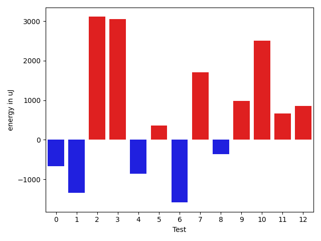

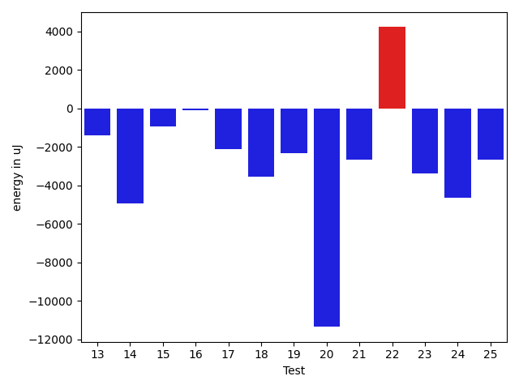

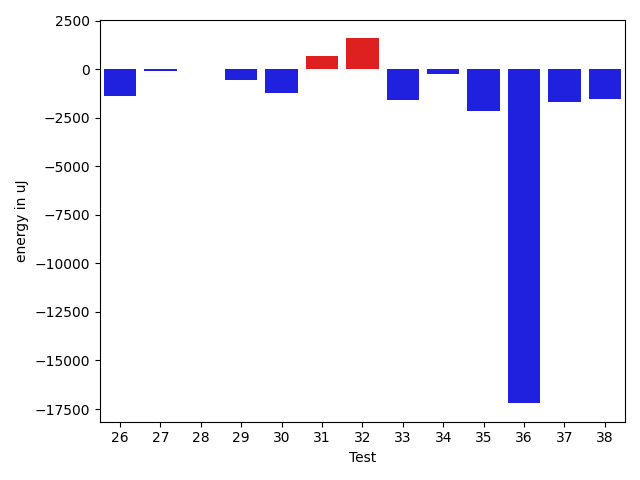

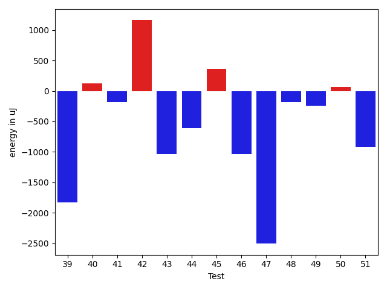

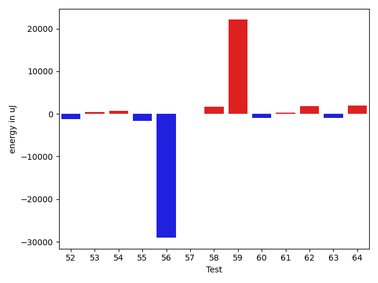

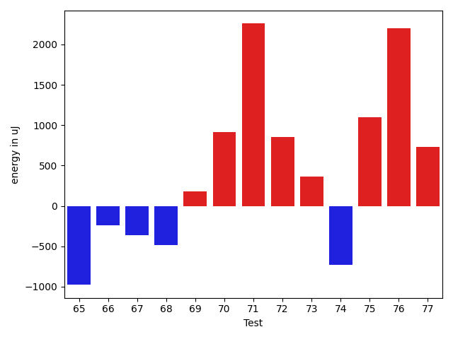

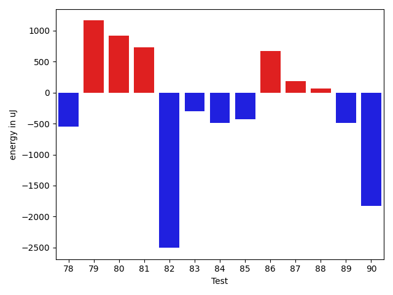

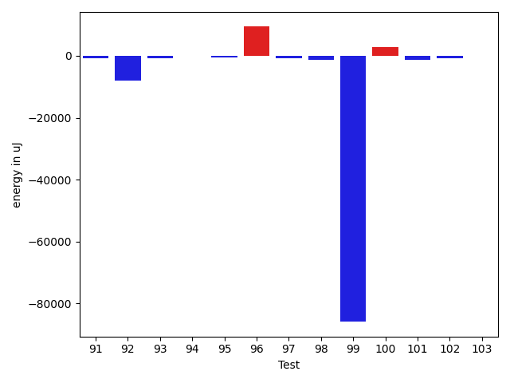

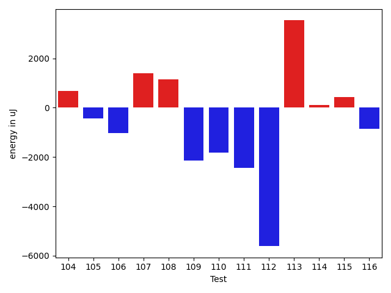

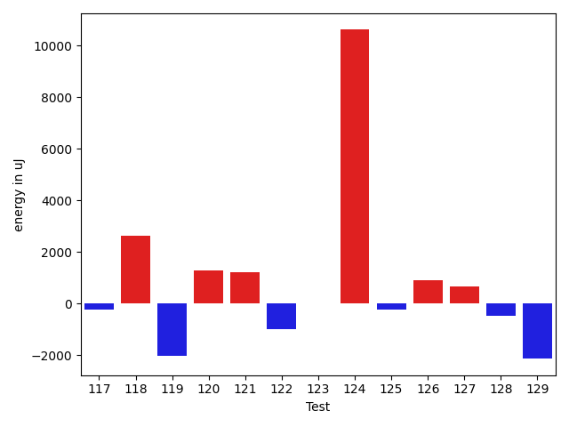

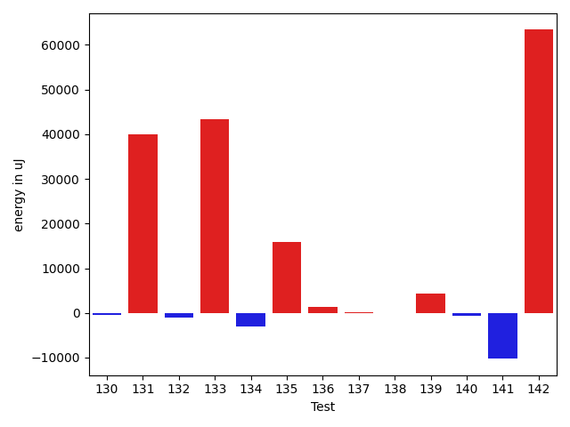

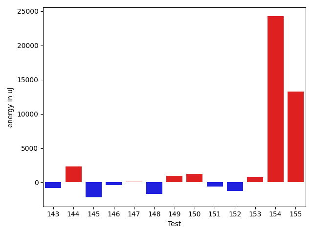

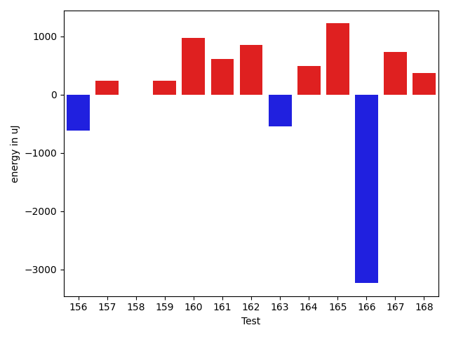

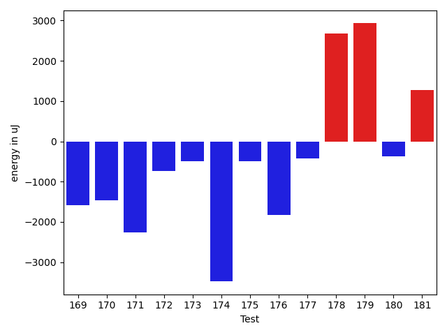

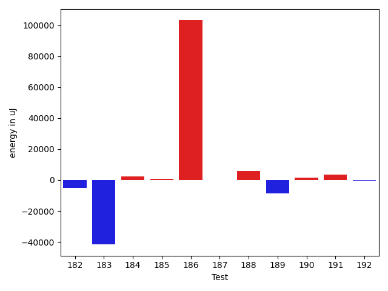

| ID | EnergyV1 | EnergyV2 | DeltaEnergy | σV1 | σV2 |
| --- | --- | --- | --- | --- | --- |
| 0 | 40588 | 39917 | -671 | 6606.125687803368 | 10194.654047703965 |
| 1 | 38452 | 37109 | -1343 | 4269.21819621738 | 4462.45233222473 |
| 2 | 42359 | 45471 | 3112 | 53686.3711934107 | 107618.57036490175 |
| 3 | 35522 | 38574 | 3052 | 4767.551548751203 | 7380.290950564702 |
| 4 | 38391 | 37536 | -855 | 4674.992521396767 | 19854.48546000066 |
| 5 | 38696 | 39062 | 366 | 25635.715201766714 | 14509.688267107998 |
| 6 | 38879 | 37292 | -1587 | 23827.46074011546 | 4256.28432005569 |
| 7 | 37415 | 39124 | 1709 | 291220.1406114083 | 325371.1508003327 |
| 8 | 39123 | 38757 | -366 | 4630.2434854308685 | 3808.7227023417354 |
| 9 | 37109 | 38086 | 977 | 295571.1269064292 | 256177.68890811567 |
| 10 | 37597 | 40100 | 2503 | 4761.572947712817 | 3811.518610011513 |
| 11 | 37964 | 38635 | 671 | 4219.594889097261 | 3805.546877904745 |
| 12 | 37292 | 38147 | 855 | 436870.7130316447 | 3432.00186873341 |
| 13 | 37537 | 36254 | -1283 | 5837.6371513670165 | 3871.2149101988625 |
| 14 | 37659 | 36621 | -1038 | 12961.007493729827 | 5185.792805699924 |
| 15 | 38147 | 37536 | -611 | 6923.814609574341 | 6697.241092937091 |
| 16 | 71227 | 71167 | -60 | 50733.06806816739 | 45014.753351635656 |
| 17 | 37964 | 37293 | -671 | 10014.796541091056 | 7788.093418462715 |
| 18 | 74646 | 73852 | -794 | 29107.530192560575 | 26956.45742781961 |
| 19 | 38208 | 37170 | -1038 | 42900.47567282952 | 42891.715908924685 |
| 20 | 71350 | 61645 | -9705 | 26447.451149266308 | 22249.51617682611 |
| 21 | 38696 | 37598 | -1098 | 26551.767409906708 | 13789.18300997167 |
| 22 | 73791 | 72753 | -1038 | 27901.464207720615 | 32138.340843107315 |
| 23 | 37780 | 37171 | -609 | 13478.131692011244 | 7929.15203185382 |
| 24 | 38574 | 37293 | -1281 | 14170.985046662745 | 8744.37083556715 |
| 25 | 38147 | 36499 | -1648 | 8311.652092625445 | 3850.368961706689 |
| 26 | 37048 | 35644 | -1404 | 3764.9619699122068 | 3754.531304489136 |
| 27 | 36987 | 36865 | -122 | 3231.549031234748 | 3072.3982774878327 |
| 28 | 36072 | 36071 | -1 | 3889.5516402856742 | 4154.11727069383 |
| 29 | 36377 | 35827 | -550 | 3376.870205900724 | 31037.755759168373 |
| 30 | 39001 | 37780 | -1221 | 7635.201272108025 | 22927.037632079 |
| 31 | 37720 | 38391 | 671 | 8822.968136137239 | 6546.926127617915 |
| 32 | 36255 | 37841 | 1586 | 6278.222175440245 | 5180.924469694867 |
| 33 | 38818 | 37231 | -1587 | 22353.401234465884 | 15131.644796527042 |
| 34 | 40344 | 40100 | -244 | 12296.5661339687 | 13767.39122148243 |
| 35 | 37537 | 35401 | -2136 | 4123.062093500353 | 3823.4022365427363 |
| 36 | 59998 | 42786 | -17212 | 62716.23959615047 | 43592.11813917487 |
| 37 | 41626 | 39917 | -1709 | 20077.483864028243 | 27699.144474079796 |
| 38 | 39001 | 37475 | -1526 | 15442.475882393497 | 9185.030559367378 |
| 39 | 37659 | 35828 | -1831 | 4117.19715562836 | 4566.971308674498 |
| 40 | 37170 | 37292 | 122 | 3777.9424983329295 | 3810.360332042102 |
| 41 | 40588 | 40405 | -183 | 47310.13882281042 | 29660.682882933386 |
| 42 | 37293 | 38452 | 1159 | 3722.519515811837 | 3552.4315508492755 |
| 43 | 42542 | 41504 | -1038 | 78834.36363810321 | 80118.12417980086 |
| 44 | 38636 | 38024 | -612 | 4318.783814258075 | 7761.444009690178 |
| 45 | 37354 | 37719 | 365 | 4219.159890525386 | 3872.064224796219 |
| 46 | 39001 | 37964 | -1037 | 4335.747948290563 | 4819.58726383183 |
| 47 | 43518 | 41015 | -2503 | 73347.98884135073 | 56535.27403388364 |
| 48 | 37414 | 37231 | -183 | 4417.685741856207 | 3990.285878090552 |
| 49 | 38636 | 38391 | -245 | 43394.4303510689 | 17077.31288514763 |
| 50 | 38086 | 38147 | 61 | 10949.595748673784 | 7168.447042029047 |
| 51 | 37537 | 36621 | -916 | 7847.016671847787 | 5582.829151962291 |
| 52 | 36011 | 34790 | -1221 | 3382.442550876116 | 3082.355933704091 |
| 53 | 36072 | 36499 | 427 | 11275.03681845148 | 9646.51611100317 |
| 54 | 35522 | 36194 | 672 | 3298.445696207355 | 7647.955255302802 |
| 55 | 38330 | 36743 | -1587 | 14074.392281842529 | 9414.637815858185 |
| 56 | 74158 | 45104 | -29054 | 37225.566898057405 | 22754.82105999744 |
| 57 | 36927 | 36988 | 61 | 3022.5094321015545 | 6153.037088819546 |
| 58 | 36621 | 38330 | 1709 | 3588.980379120545 | 4635.558629760709 |
| 59 | 40527 | 62622 | 22095 | 28703.734876938608 | 35886.72811666481 |
| 60 | 39306 | 38391 | -915 | 105137.03933514582 | 78548.18182607296 |
| 61 | 36010 | 36255 | 245 | 3163.741371718014 | 4044.902293447032 |
| 62 | 36682 | 38574 | 1892 | 3822.808874348274 | 4182.974229430733 |
| 63 | 36621 | 35705 | -916 | 7674.260211318117 | 6202.256204300272 |
| 64 | 34119 | 36133 | 2014 | 3005.3069336750723 | 3100.7602823967045 |
| 65 | 38147 | 37170 | -977 | 6818.2967777123 | 3902.768380825975 |
| 66 | 36072 | 35828 | -244 | 12205.959547696362 | 8230.545694083716 |
| 67 | 36499 | 36133 | -366 | 4792.83544930563 | 3674.425788473622 |
| 68 | 36743 | 36255 | -488 | 11447.546077732732 | 58489.55436307756 |
| 69 | 36987 | 37171 | 184 | 4399.626677055786 | 4134.415446140536 |
| 70 | 36377 | 37292 | 915 | 3354.3153407859695 | 3808.918523370842 |
| 71 | 36865 | 39123 | 2258 | 3725.0956293459226 | 4723.676780564709 |
| 72 | 35827 | 36682 | 855 | 4922.691577746148 | 35581.81794542036 |
| 73 | 37780 | 38147 | 367 | 5203.072694556914 | 3698.039650684521 |
| 74 | 36438 | 35705 | -733 | 28102.625047445697 | 4011.5436562397226 |
| 75 | 35339 | 36438 | 1099 | 3499.715845049959 | 3702.2754080806726 |
| 76 | 36926 | 39123 | 2197 | 3163.3416822088634 | 4302.536677809283 |
| 77 | 35888 | 36621 | 733 | 10084.713860048447 | 3934.6798532409216 |
| 78 | 36377 | 35828 | -549 | 4286.072352303875 | 3429.030817567274 |
| 79 | 36865 | 38025 | 1160 | 3625.9627666742003 | 26423.219468027644 |
| 80 | 36865 | 37781 | 916 | 5483.818340804515 | 4338.000087235243 |
| 81 | 38208 | 38940 | 732 | 4496.109484799884 | 7489.301215877783 |
| 82 | 37354 | 34851 | -2503 | 2876.914104506056 | 4536.9728284706525 |
| 83 | 37048 | 36743 | -305 | 8082.520137291475 | 3852.3654972185245 |
| 84 | 35767 | 35278 | -489 | 3497.0758481234498 | 2625.6698878571924 |
| 85 | 36255 | 35827 | -428 | 3930.208780123942 | 36368.99536882675 |
| 86 | 36865 | 37536 | 671 | 16616.198961154343 | 3198.507604444862 |
| 87 | 36804 | 36987 | 183 | 4518.005265628506 | 3863.16621952375 |
| 88 | 38940 | 39001 | 61 | 20436.365317254018 | 4084.5819826400952 |
| 89 | 39490 | 39002 | -488 | 10198.626300551494 | 11845.9244268374 |
| 90 | 44860 | 43030 | -1830 | 82318.5224125246 | 89700.41170864177 |
| 91 | 127258 | 122253 | -5005 | 62088.230492347335 | 66820.21471891977 |
| 92 | 39917 | 38696 | -1221 | 32602.732404389797 | 4498.913312123273 |
| 93 | 38330 | 38574 | 244 | 4117.060859038649 | 4100.503393337051 |
| 94 | 38208 | 39185 | 977 | 4176.581376179748 | 3357.3606866476102 |
| 95 | 38879 | 38269 | -610 | 3121.34455010233 | 3490.905497819584 |
| 96 | 38879 | 39307 | 428 | 3998.9604807028936 | 31053.87767586522 |
| 97 | 38696 | 37537 | -1159 | 3953.9298152045444 | 3939.1156919833725 |
| 98 | 39246 | 37414 | -1832 | 4591.099645032471 | 4230.6294916881725 |
| 99 | 41870 | 41138 | -732 | 619845.5628501289 | 464641.0226687443 |
| 100 | 78124 | 83008 | 4884 | 37313.76957426907 | 36918.93563191731 |
| 101 | 82153 | 83801 | 1648 | 331959.90085734613 | 307582.5463725163 |
| 102 | 37781 | 35827 | -1954 | 3656.4592371014987 | 3629.4617923460237 |
| 103 | 38879 | 38635 | -244 | 54465.92832033526 | 54317.26206611654 |
| 104 | 36682 | 37353 | 671 | 4512.099042083511 | 4434.551456711516 |
| 105 | 35705 | 35278 | -427 | 4040.6077371853944 | 4580.123761925676 |
| 106 | 36865 | 35828 | -1037 | 2905.8084522988634 | 4719.863936002287 |
| 107 | 35584 | 36988 | 1404 | 4686.321884347141 | 3979.1208153322264 |
| 108 | 37720 | 38879 | 1159 | 4183.793270959058 | 4218.100727863193 |
| 109 | 37780 | 35645 | -2135 | 5822.932371031416 | 4394.563930717295 |
| 110 | 36560 | 34729 | -1831 | 3679.182857646518 | 4494.473483701023 |
| 111 | 38757 | 36316 | -2441 | 3671.5888464800046 | 3686.405125977674 |
| 112 | 41504 | 35889 | -5615 | 4796.278368025958 | 3174.993635585958 |
| 113 | 36621 | 40161 | 3540 | 4791.69025428977 | 3850.082729935001 |
| 114 | 39551 | 39673 | 122 | 14547.805534467134 | 35280.25713827814 |
| 115 | 36987 | 37414 | 427 | 4180.781069816097 | 45068.49964249931 |
| 116 | 41321 | 40466 | -855 | 47975.11710237045 | 53607.996330077134 |
| 117 | 37232 | 36987 | -245 | 4055.2657716070034 | 4506.328851844283 |
| 118 | 38330 | 40955 | 2625 | 7399.642317972203 | 15505.72409632905 |
| 119 | 39306 | 37292 | -2014 | 4580.636379846692 | 3982.005278801121 |
| 120 | 37231 | 38514 | 1283 | 4713.924020770805 | 4738.147119007211 |
| 121 | 39367 | 40588 | 1221 | 518482.8803708517 | 316080.69495770783 |
| 122 | 37659 | 36683 | -976 | 4700.983789299598 | 4415.933780457857 |
| 123 | 38696 | 38697 | 1 | 16640.811363980127 | 11685.250336185953 |
| 124 | 77637 | 88256 | 10619 | 23591.87838847821 | 34918.88258540593 |
| 125 | 38208 | 37964 | -244 | 4422.813738342545 | 28250.259077751707 |
| 126 | 36743 | 37659 | 916 | 4857.380905915625 | 5704.155451859059 |
| 127 | 37597 | 38269 | 672 | 6042.520721744121 | 6066.882576783874 |
| 128 | 38330 | 37841 | -489 | 3809.273990234342 | 3952.3277575638735 |
| 129 | 39307 | 37170 | -2137 | 3798.942040097932 | 3400.354695801047 |
| 130 | 37293 | 36621 | -672 | 5713.851352866388 | 3894.88839760688 |
| 131 | 85205 | 83496 | -1709 | 308307.24684298434 | 429773.7762932141 |
| 132 | 41138 | 42114 | 976 | 23647.46519958926 | 21581.957806497856 |
| 133 | 165771 | 172179 | 6408 | 276132.085390457 | 351667.15329785354 |
| 134 | 36377 | 35156 | -1221 | 10234.82103084288 | 4397.734442195611 |
| 135 | 39795 | 40100 | 305 | 40248.117157276836 | 66854.99693999687 |
| 136 | 35828 | 36743 | 915 | 3775.327484521656 | 3532.9311334986874 |
| 137 | 37232 | 37353 | 121 | 3965.8338435580913 | 6292.140644191052 |
| 138 | 36011 | 36377 | 366 | 3957.142611863306 | 5840.732225405381 |
| 139 | 38818 | 38757 | -61 | 26746.3145453244 | 36446.442326343735 |
| 140 | 36072 | 35828 | -244 | 3834.946237804253 | 4484.309509711488 |
| 141 | 120300 | 117370 | -2930 | 42007.05780196021 | 27163.72408292839 |
| 142 | 242187 | 232666 | -9521 | 74763.89250467069 | 404300.72151211026 |
| 143 | 38818 | 38025 | -793 | 3700.4700829720305 | 7146.232024892559 |
| 144 | 81299 | 83618 | 2319 | 313696.4103233975 | 232385.00561223214 |
| 145 | 40161 | 37964 | -2197 | 15522.718773497565 | 15901.715499472923 |
| 146 | 40100 | 39733 | -367 | 10219.236811726038 | 15364.93255756913 |
| 147 | 39490 | 39611 | 121 | 9209.606851456798 | 34676.301760692586 |
| 148 | 39185 | 37537 | -1648 | 4878.207418132953 | 6102.30315686464 |
| 149 | 38940 | 39916 | 976 | 4716.407872918254 | 4677.326100768696 |
| 150 | 38207 | 39429 | 1222 | 5012.713463008057 | 4940.893217783685 |
| 151 | 40283 | 39672 | -611 | 85105.49879218961 | 62327.54854481803 |
| 152 | 40344 | 39062 | -1282 | 577193.3889294785 | 407364.8611390475 |
| 153 | 39185 | 39917 | 732 | 18584.45806447318 | 73762.42619018319 |
| 154 | 233581 | 257812 | 24231 | 65334.56063803072 | 115659.87835084047 |
| 155 | 339171 | 352417 | 13246 | 132578.54104333426 | 136152.52765065394 |
| 156 | 39551 | 38940 | -611 | 33899.68365880598 | 50405.82614802273 |
| 157 | 38696 | 38940 | 244 | 4016.4384661962667 | 4405.975309634807 |
| 158 | 39917 | 39917 | 0 | 14457.320248702581 | 11414.492965106128 |
| 159 | 39978 | 40222 | 244 | 29877.362933401044 | 45723.23602588681 |
| 160 | 38086 | 39062 | 976 | 4842.204543272504 | 4876.342396992554 |
| 161 | 41503 | 42114 | 611 | 353415.2077712549 | 496090.57071330555 |
| 162 | 38025 | 38880 | 855 | 4575.934284357671 | 6648.277402500552 |
| 163 | 40466 | 39917 | -549 | 25584.03167058687 | 33502.06781613319 |
| 164 | 39368 | 39856 | 488 | 73823.87783152843 | 84749.76253004013 |
| 165 | 37903 | 39124 | 1221 | 4168.562032584034 | 4376.019854492147 |
| 166 | 83496 | 80261 | -3235 | 45447.88296635002 | 385447.79528248514 |
| 167 | 37293 | 38024 | 731 | 4296.58478799064 | 3549.309355426634 |
| 168 | 39612 | 39978 | 366 | 204659.0451599275 | 9137.87911811837 |
| 169 | 39734 | 38147 | -1587 | 4841.589645909183 | 4267.497881882896 |
| 170 | 39612 | 38147 | -1465 | 26821.323730161366 | 4607.624461898407 |
| 171 | 41565 | 39306 | -2259 | 22787.466428223343 | 17195.94987827184 |
| 172 | 39002 | 38269 | -733 | 73071.66450911346 | 54247.73910507828 |
| 173 | 38391 | 37903 | -488 | 5281.200193619313 | 3510.248967868964 |
| 174 | 41992 | 38513 | -3479 | 38505.64462068441 | 26576.08532824381 |
| 175 | 38941 | 38452 | -489 | 4459.115695841161 | 3488.8540038241786 |
| 176 | 40832 | 39001 | -1831 | 96737.63181505007 | 113211.23260185296 |
| 177 | 38391 | 37964 | -427 | 11096.538175296224 | 8775.546173401939 |
| 178 | 38208 | 40894 | 2686 | 45324.411860898224 | 55753.99845256741 |
| 179 | 38208 | 41138 | 2930 | 28356.126103147348 | 109609.67367086446 |
| 180 | 39673 | 39307 | -366 | 17445.75845565452 | 18351.435730536687 |
| 181 | 37231 | 38513 | 1282 | 4429.9898921301165 | 6567.330129537457 |
| 182 | 38940 | 40588 | 1648 | 38260.60117124411 | 29433.259784668342 |
| 183 | 42297 | 41504 | -793 | 110526.55828204457 | 83945.87842203377 |
| 184 | 38269 | 38452 | 183 | 3602.5067996792923 | 11672.149895267796 |
| 185 | 38147 | 38025 | -122 | 4034.9969611129172 | 6933.11620915248 |
| 186 | 40527 | 39734 | -793 | 282241.1908339842 | 533845.7446635548 |
| 187 | 38696 | 37109 | -1587 | 3776.4829830246 | 5071.97762010923 |
| 188 | 39002 | 38513 | -489 | 4347.077253327804 | 30721.342434409045 |
| 189 | 39245 | 40528 | 1283 | 72585.97314895602 | 55310.31282918435 |
| 190 | 37659 | 39978 | 2319 | 3849.9543756272506 | 4484.841412252562 |
| 191 | 39063 | 41320 | 2257 | 21591.61069295958 | 18025.581284630327 |
| 192 | 38453 | 37049 | -1404 | 4114.409187755359 | 3494.4097775964706 |

## Delta Duration per test method

| ID | DurationV1 | DurationsV2 | DeltaDuration |
| --- | --- | --- | --- |
| 0 | 985495.2 | 964631.9807692308 | -20863.219230769202 |
| 1 | 691638.4666666667 | 804109.0588235294 | 112470.59215686272 |
| 2 | 1787771.912087912 | 2581618.53125 | 793846.619162088 |
| 3 | 954488.12 | 914219.5714285715 | -40268.54857142852 |
| 4 | 847664.320754717 | 986317.75 | 138653.429245283 |
| 5 | 1301648.0875 | 1248035.4096385543 | -53612.67786144558 |
| 6 | 987048.0634920635 | 980155.873015873 | -6892.190476190532 |
| 7 | 2115914.744680851 | 2226993.222222222 | 111078.47754137078 |
| 8 | 591352.71875 | 561655.1333333333 | -29697.585416666698 |
| 9 | 2288558.7560975607 | 2077056.375 | -211502.38109756075 |
| 10 | 761063.6538461539 | 754659.6774193548 | -6403.976426799083 |
| 11 | 504865.51612903224 | 502422.75 | -2442.766129032243 |
| 12 | 2983735.92 | 642177.3529411765 | -2341558.5670588235 |
| 13 | 1001304.1142857143 | 895659.2786885246 | -105644.83559718973 |
| 14 | 1313366.7052631578 | 1075348.7011494252 | -238018.0041137326 |
| 15 | 1039509.7714285714 | 1000159.7763157894 | -39349.995112781995 |
| 16 | 2127152.052631579 | 2261218.3645833335 | 134066.31195175461 |
| 17 | 1244852.8131868131 | 1037069.0 | -207783.81318681315 |
| 18 | 2395092.5353535353 | 2322071.9191919193 | -73020.61616161605 |
| 19 | 1416759.987654321 | 1372477.1176470588 | -44282.8700072621 |
| 20 | 2075339.4747474748 | 1790598.01010101 | -284741.4646464647 |
| 21 | 1350243.857142857 | 1276152.0235294118 | -74091.83361344528 |
| 22 | 2165254.6224489794 | 2351215.4444444445 | 185960.82199546508 |
| 23 | 1310563.180851064 | 1104901.486111111 | -205661.69473995292 |
| 24 | 1389523.1397849463 | 1173591.7272727273 | -215931.41251221905 |
| 25 | 878412.4032258064 | 810539.0 | -67873.40322580643 |
| 26 | 832619.5357142857 | 817993.4666666667 | -14626.069047619007 |
| 27 | 547530.2105263158 | 544974.3714285714 | -2555.839097744436 |
| 28 | 653243.4285714285 | 1042851.304347826 | 389607.87577639753 |
| 29 | 696165.9 | 815594.0 | 119428.09999999998 |
| 30 | 829477.94 | 802646.119047619 | -26831.82095238089 |
| 31 | 1136121.8860759493 | 1077610.9305555555 | -58510.95552039379 |
| 32 | 980944.5915492958 | 929192.612244898 | -51751.97930439783 |
| 33 | 1226117.8679245282 | 1018715.9791666666 | -207401.88875786157 |
| 34 | 1096651.6041666667 | 927452.9523809524 | -169198.65178571432 |
| 35 | 441949.3181818182 | 426109.12 | -15840.198181818181 |
| 36 | 2489427.010989011 | 2021469.3829787234 | -467957.6280102874 |
| 37 | 1509455.97752809 | 1354789.8068181819 | -154666.170709908 |
| 38 | 1360362.0886075948 | 1068294.690140845 | -292067.3984667498 |
| 39 | 503655.8387096774 | 511291.9411764706 | 7636.102466793207 |
| 40 | 493388.42307692306 | 504502.25 | 11113.826923076937 |
| 41 | 1399636.421875 | 1087492.0638297873 | -312144.3580452127 |
| 42 | 706136.68 | 437214.14285714284 | -268922.5371428572 |
| 43 | 1959888.0227272727 | 1713795.5151515151 | -246092.50757575757 |
| 44 | 878895.4772727273 | 717239.1666666666 | -161656.31060606067 |
| 45 | 597351.0 | 465161.3846153846 | -132189.61538461538 |
| 46 | 638109.8620689656 | 633461.2962962963 | -4648.565772669273 |
| 47 | 2259635.6868686867 | 2097818.336734694 | -161817.35013399273 |
| 48 | 814127.8478260869 | 705004.4444444445 | -109123.40338164242 |
| 49 | 1453938.566037736 | 863745.2407407408 | -590193.3252969951 |
| 50 | 812430.475 | 775148.65 | -37281.82499999995 |
| 51 | 895860.7234042553 | 643564.35 | -252296.37340425537 |
| 52 | 470880.8095238095 | 435792.28571428574 | -35088.52380952379 |
| 53 | 1111893.441860465 | 1149474.35 | 37580.90813953499 |
| 54 | 801787.1224489796 | 743528.7435897436 | -58258.37885923602 |
| 55 | 1203934.1392405063 | 1166339.4615384615 | -37594.677702044835 |
| 56 | 2425340.131313131 | 1807725.2727272727 | -617614.8585858585 |
| 57 | 998676.4857142858 | 1065987.1333333333 | 67310.64761904755 |
| 58 | 467547.0344827586 | 505710.0714285714 | 38163.03694581281 |
| 59 | 1729038.4042553192 | 1786023.425531915 | 56985.02127659577 |
| 60 | 2056273.1 | 1674998.4090909092 | -381274.6909090909 |
| 61 | 747142.7619047619 | 790704.5681818182 | 43561.80627705634 |
| 62 | 577521.5714285715 | 585309.6285714286 | 7788.057142857113 |
| 63 | 699337.6285714286 | 675959.3448275862 | -23378.28374384239 |
| 64 | 710956.1739130435 | 491853.3333333333 | -219102.84057971014 |
| 65 | 796368.2352941176 | 746045.375 | -50322.86029411759 |
| 66 | 645598.84 | 491139.12 | -154459.71999999997 |
| 67 | 624491.1290322581 | 614243.0 | -10248.12903225806 |
| 68 | 1028756.3968253968 | 1303839.0545454544 | 275082.65772005764 |
| 69 | 510896.4375 | 500733.652173913 | -10162.785326086974 |
| 70 | 739117.6888888889 | 833413.9807692308 | 94296.29188034183 |
| 71 | 723437.3783783783 | 740775.1081081082 | 17337.72972972982 |
| 72 | 631296.7567567568 | 963875.5882352941 | 332578.8314785373 |
| 73 | 623949.3125 | 624226.5151515151 | 277.2026515151374 |
| 74 | 983952.0576923077 | 815990.3269230769 | -167961.73076923087 |
| 75 | 408548.8125 | 412131.7619047619 | 3582.9494047618937 |
| 76 | 647304.88 | 685511.3913043478 | 38206.511304347776 |
| 77 | 704415.8461538461 | 479095.75 | -225320.09615384613 |
| 78 | 581150.2142857143 | 628549.4782608695 | 47399.26397515519 |
| 79 | 663660.5151515151 | 745687.4444444445 | 82026.92929292936 |
| 80 | 871878.0847457628 | 764944.0566037736 | -106934.02814198914 |
| 81 | 655969.3157894737 | 621822.125 | -34147.19078947371 |
| 82 | 574555.9411764706 | 804415.5 | 229859.5588235294 |
| 83 | 964928.0166666667 | 808689.8644067796 | -156238.15225988708 |
| 84 | 674500.0476190476 | 595343.95 | -79156.09761904762 |
| 85 | 515119.0882352941 | 724946.0606060605 | 209826.97237076645 |
| 86 | 747612.1666666666 | 644890.7857142857 | -102721.38095238095 |
| 87 | 477538.05555555556 | 416534.7272727273 | -61003.32828282827 |
| 88 | 933465.9253731343 | 973893.9629629629 | 40428.0375898286 |
| 89 | 1082076.6274509805 | 1048545.75 | -33530.87745098048 |
| 90 | 2604171.84375 | 2706747.547368421 | 102575.70361842122 |
| 91 | 4047223.797979798 | 4003898.090909091 | -43325.70707070734 |
| 92 | 738008.1538461539 | 784523.15 | 46514.99615384615 |
| 93 | 825185.4285714285 | 852649.2978723404 | 27463.8693009119 |
| 94 | 701575.4255319149 | 700238.6888888889 | -1336.7366430260008 |
| 95 | 752496.5714285715 | 520713.2173913043 | -231783.35403726716 |
| 96 | 816975.027027027 | 1178709.82 | 361734.7929729731 |
| 97 | 642007.717948718 | 662506.2558139535 | 20498.53786523547 |
| 98 | 541959.6666666666 | 551887.3870967742 | 9927.720430107554 |
| 99 | 6972421.236111111 | 4440995.388888889 | -2531425.847222222 |
| 100 | 2694624.3434343436 | 2707215.606060606 | 12591.262626262382 |
| 101 | 5437411.585858586 | 5269029.181818182 | -168382.4040404046 |
| 102 | 962277.6666666666 | 918732.0 | -43545.66666666663 |
| 103 | 1475211.21875 | 1620921.6 | 145710.3812500001 |
| 104 | 570469.4117647059 | 616757.8333333334 | 46288.42156862747 |
| 105 | 568473.9722222222 | 629537.0384615385 | 61063.06623931625 |
| 106 | 680884.5365853659 | 684579.475 | 3694.938414634089 |
| 107 | 517818.125 | 524750.6071428572 | 6932.4821428571595 |
| 108 | 588185.7692307692 | 584095.44 | -4090.3292307693046 |
| 109 | 998487.231884058 | 996459.4459459459 | -2027.7859381120652 |
| 110 | 538348.35 | 592647.5714285715 | 54299.2214285715 |
| 111 | 514944.6666666667 | 519456.04761904763 | 4511.380952380947 |
| 112 | 546496.75 | 569807.0434782609 | 23310.293478260865 |
| 113 | 564481.4166666666 | 587605.6875 | 23124.270833333372 |
| 114 | 1273997.9545454546 | 1389620.802197802 | 115622.84765234753 |
| 115 | 763187.9791666666 | 930083.0697674418 | 166895.0906007752 |
| 116 | 1374666.294117647 | 1319973.1724137932 | -54693.12170385383 |
| 117 | 695600.1428571428 | 619646.4054054054 | -75953.7374517374 |
| 118 | 720221.5128205129 | 813636.9615384615 | 93415.44871794863 |
| 119 | 772672.875 | 713922.64 | -58750.234999999986 |
| 120 | 640813.64 | 601375.7804878049 | -39437.85951219511 |
| 121 | 5741078.94117647 | 2781399.9125 | -2959679.0286764703 |
| 122 | 643260.6052631579 | 693992.3448275862 | 50731.73956442834 |
| 123 | 1002099.4727272728 | 1105904.544117647 | 103805.07139037421 |
| 124 | 2598715.0505050505 | 2855760.3333333335 | 257045.28282828303 |
| 125 | 957228.6666666666 | 1110347.347826087 | 153118.6811594203 |
| 126 | 999116.2542372881 | 963260.9180327869 | -35855.33620450122 |
| 127 | 931850.7307692308 | 927682.737704918 | -4167.99306431273 |
| 128 | 690590.282051282 | 687547.0444444445 | -3043.2376068375306 |
| 129 | 828946.6875 | 671317.1666666666 | -157629.52083333337 |
| 130 | 941358.7285714286 | 967017.5 | 25658.771428571432 |
| 131 | 4303521.252525252 | 5621792.232323232 | 1318270.9797979798 |
| 132 | 1695796.857142857 | 1647562.6020408163 | -48234.25510204071 |
| 133 | 6465826.292929293 | 7911684.292929293 | 1445858.0 |
| 134 | 961936.380952381 | 973737.7966101695 | 11801.415657788515 |
| 135 | 1190746.568627451 | 1674016.8085106383 | 483270.2398831872 |
| 136 | 788818.8653846154 | 819836.4736842106 | 31017.608299595187 |
| 137 | 775788.3636363636 | 831520.6545454545 | 55732.290909090894 |
| 138 | 849580.4516129033 | 870072.9 | 20492.448387096752 |
| 139 | 1047651.275862069 | 1217316.975 | 169665.6991379311 |
| 140 | 695965.5862068966 | 702140.1 | 6174.513793103397 |
| 141 | 3642209.090909091 | 3533272.4444444445 | -108936.64646464633 |
| 142 | 7102582.838383839 | 9195339.454545455 | 2092756.6161616165 |
| 143 | 752099.6825396825 | 782907.0 | 30807.317460317514 |
| 144 | 4383618.98989899 | 3579107.373737374 | -804511.616161616 |
| 145 | 840136.34375 | 789811.7368421053 | -50324.60690789472 |
| 146 | 1192170.1724137932 | 1319556.7674418604 | 127386.59502806724 |
| 147 | 615803.72 | 781718.4444444445 | 165914.72444444452 |
| 148 | 831768.5714285715 | 753714.4651162791 | -78054.1063122924 |
| 149 | 607132.6451612903 | 642468.3333333334 | 35335.68817204307 |
| 150 | 699603.6 | 640777.5714285715 | -58826.0285714285 |
| 151 | 1495822.6279069767 | 1170100.0263157894 | -325722.6015911873 |
| 152 | 6544134.411764706 | 4049354.6153846155 | -2494779.79638009 |
| 153 | 1342512.453488372 | 2020510.3 | 677997.846511628 |
| 154 | 6857233.262626262 | 7886638.090909091 | 1029404.8282828284 |
| 155 | 10364165.494949495 | 10655667.191919193 | 291501.69696969725 |
| 156 | 1406744.988372093 | 1820195.211111111 | 413450.22273901803 |
| 157 | 754580.4130434783 | 793772.5869565217 | 39192.17391304346 |
| 158 | 1217165.4605263157 | 1255956.9277108433 | 38791.467184527544 |
| 159 | 1108100.2666666666 | 1464588.0172413792 | 356487.75057471264 |
| 160 | 863676.2666666667 | 818975.1730769231 | -44701.0935897436 |
| 161 | 3543200.72 | 4946583.036144578 | 1403382.3161445777 |
| 162 | 812797.8148148148 | 833282.1785714285 | 20484.36375661369 |
| 163 | 1190694.8387096773 | 1401622.5625 | 210927.72379032266 |
| 164 | 1654088.2318840579 | 1757812.578125 | 103724.34624094213 |
| 165 | 542926.380952381 | 557383.4193548387 | 14457.038402457722 |
| 166 | 2853155.0808080807 | 4767067.94949495 | 1913912.8686868688 |
| 167 | 598949.1590909091 | 614600.0 | 15650.84090909094 |
| 168 | 1856653.7857142857 | 780257.15625 | -1076396.6294642857 |
| 169 | 646324.95 | 641504.1875 | -4820.762499999953 |
| 170 | 807435.8333333334 | 689032.8648648649 | -118402.96846846852 |
| 171 | 1563700.5319148935 | 1458393.9375 | -105306.59441489354 |
| 172 | 1568764.1886792453 | 1349718.1016949152 | -219046.0869843301 |
| 173 | 964076.6721311476 | 968509.4202898551 | 4432.748158707516 |
| 174 | 1359573.0227272727 | 1070714.358974359 | -288858.6637529137 |
| 175 | 718249.0810810811 | 662056.025 | -56193.05608108104 |
| 176 | 2127403.2741935486 | 2220368.7540983604 | 92965.47990481183 |
| 177 | 939948.0967741936 | 964781.3962264151 | 24833.299452221487 |
| 178 | 893614.6470588235 | 1402462.2 | 508847.55294117646 |
| 179 | 916100.8181818182 | 2015560.375 | 1099459.5568181816 |
| 180 | 1144064.6274509805 | 1196147.716981132 | 52083.08953015157 |
| 181 | 855050.7 | 824094.7872340425 | -30955.912765957415 |
| 182 | 1547599.4285714286 | 1264941.5961538462 | -282657.8324175824 |
| 183 | 3039947.724137931 | 1501822.75 | -1538124.9741379311 |
| 184 | 615360.2272727273 | 622595.04 | 7234.812727272743 |
| 185 | 634845.4761904762 | 761553.4594594594 | 126707.9832689832 |
| 186 | 2549476.3518518517 | 5642007.101694915 | 3092530.7498430638 |
| 187 | 603163.8181818182 | 566570.1666666666 | -36593.65151515161 |
| 188 | 535461.48 | 704795.5416666666 | 169334.06166666665 |
| 189 | 1562759.8048780488 | 1213113.2702702703 | -349646.53460777854 |
| 190 | 581605.2068965518 | 574550.0833333334 | -7055.123563218396 |
| 191 | 1480861.1964285714 | 1466862.596491228 | -13998.599937343271 |
| 192 | 609945.4642857143 | 566137.9565217391 | -43807.50776397518 |

## Misc.

| ID | Test Class | Test Method |
| --- | --- | --- |
| 0 | com.google.gson.functional.PrimitiveTest | testDeserializePrimitiveWrapperAsObjectField |
| 1 | com.google.gson.functional.CustomDeserializerTest | testDefaultConstructorNotCalledOnField |
| 2 | com.google.gson.functional.CustomDeserializerTest | testDefaultConstructorNotCalledOnObject |
| 3 | com.google.gson.functional.CustomDeserializerTest | testCustomDeserializerReturnsNull |
| 4 | com.google.gson.functional.CustomDeserializerTest | testCustomDeserializerReturnsNullForPrimitiveFields |
| 5 | com.google.gson.functional.CustomDeserializerTest | testJsonTypeFieldBasedDeserialization |
| 6 | com.google.gson.functional.CustomDeserializerTest | testCustomDeserializerReturnsNullForArrayElementsForArrayField |
| 7 | com.google.gson.MixedStreamTest | testReaderDoesNotMutateState |
| 8 | com.google.gson.MixedStreamTest | testWriteInvalidState |
| 9 | com.google.gson.MixedStreamTest | testReadMixedStreamed |
| 10 | com.google.gson.MixedStreamTest | testWriteMixedStreamed |
| 11 | com.google.gson.MixedStreamTest | testWriteClosed |
| 12 | com.google.gson.MixedStreamTest | testWriteDoesNotMutateState |
| 13 | com.google.gson.functional.ParameterizedTypesTest | testParameterizedTypeGenericArraysSerialization |
| 14 | com.google.gson.functional.ParameterizedTypesTest | testVariableTypeArrayDeserialization |
| 15 | com.google.gson.functional.ParameterizedTypesTest | testParameterizedTypeWithReaderDeserialization |
| 16 | com.google.gson.functional.ParameterizedTypesTest | testParameterizedTypesSerialization |
| 17 | com.google.gson.functional.ParameterizedTypesTest | testVariableTypeDeserialization |
| 18 | com.google.gson.functional.ParameterizedTypesTest | testVariableTypeFieldsAndGenericArraysSerialization |
| 19 | com.google.gson.functional.ParameterizedTypesTest | testParameterizedTypeDeserialization |
| 20 | com.google.gson.functional.ParameterizedTypesTest | testVariableTypeFieldsAndGenericArraysDeserialization |
| 21 | com.google.gson.functional.ParameterizedTypesTest | testTypesWithMultipleParametersDeserialization |
| 22 | com.google.gson.functional.ParameterizedTypesTest | testTypesWithMultipleParametersSerialization |
| 23 | com.google.gson.functional.ParameterizedTypesTest | testParameterizedTypeWithVariableTypeDeserialization |
| 24 | com.google.gson.functional.ParameterizedTypesTest | testParameterizedTypeGenericArraysDeserialization |
| 25 | com.google.gson.functional.ParameterizedTypesTest | testParameterizedTypesWithWriterSerialization |
| 26 | com.google.gson.functional.ParameterizedTypesTest | testDeepParameterizedTypeDeserialization |
| 27 | com.google.gson.functional.ParameterizedTypesTest | testDeepParameterizedTypeSerialization |
| 28 | com.google.gson.functional.DefaultTypeAdaptersTest | testBadValueForBigDecimalDeserialization |
| 29 | com.google.gson.functional.DefaultTypeAdaptersTest | testBigIntegerFieldDeserialization |
| 30 | com.google.gson.functional.DefaultTypeAdaptersTest | testUrlNullDeserialization |
| 31 | com.google.gson.functional.DefaultTypeAdaptersTest | testUrlNullSerialization |
| 32 | com.google.gson.functional.DefaultTypeAdaptersTest | testBigIntegerFieldSerialization |
| 33 | com.google.gson.functional.DefaultTypeAdaptersTest | testBigDecimalFieldDeserialization |
| 34 | com.google.gson.functional.DefaultTypeAdaptersTest | testBigDecimalFieldSerialization |
| 35 | com.google.gson.functional.InheritanceTest | testBaseSerializedAsBaseWhenSpecifiedWithExplicitType |
| 36 | com.google.gson.functional.InheritanceTest | testSubInterfacesOfCollectionSerialization |
| 37 | com.google.gson.functional.InheritanceTest | testSubClassSerialization |
| 38 | com.google.gson.functional.InheritanceTest | testSubInterfacesOfCollectionDeserialization |
| 39 | com.google.gson.functional.InheritanceTest | testBaseSerializedAsSub |
| 40 | com.google.gson.functional.InheritanceTest | testBaseSerializedAsSubWhenSpecifiedWithExplicitTypeForToJsonMethod |
| 41 | com.google.gson.functional.InheritanceTest | testSubClassDeserialization |
| 42 | com.google.gson.functional.InheritanceTest | testBaseSerializedAsSubWhenSpecifiedWithExplicitType |
| 43 | com.google.gson.functional.InheritanceTest | testBaseSerializedAsBaseWhenSpecifiedWithExplicitTypeForToJsonMethod |
| 44 | com.google.gson.functional.InheritanceTest | testClassWithBaseArrayFieldSerialization |
| 45 | com.google.gson.functional.InheritanceTest | testBaseSerializedAsSubForToJsonMethod |
| 46 | com.google.gson.functional.InheritanceTest | testClassWithBaseFieldSerialization |
| 47 | com.google.gson.functional.CircularReferenceTest | testCircularSerialization |
| 48 | com.google.gson.functional.CircularReferenceTest | testSelfReferenceArrayFieldSerialization |
| 49 | com.google.gson.functional.CircularReferenceTest | testDirectedAcyclicGraphDeserialization |
| 50 | com.google.gson.functional.CircularReferenceTest | testSelfReferenceSerialization |
| 51 | com.google.gson.functional.CircularReferenceTest | testDirectedAcyclicGraphSerialization |
| 52 | com.google.gson.functional.ObjectTest | testNullObjectFieldsDeserialization |
| 53 | com.google.gson.functional.ObjectTest | testEmptyCollectionInAnObjectDeserialization |
| 54 | com.google.gson.functional.ObjectTest | testNestedSerialization |
| 55 | com.google.gson.functional.ObjectTest | testArrayOfArraysDeserialization |
| 56 | com.google.gson.functional.ObjectTest | testSingletonLists |
| 57 | com.google.gson.functional.ObjectTest | testArrayOfObjectsAsFields |
| 58 | com.google.gson.functional.ObjectTest | testNullArraysDeserialization |
| 59 | com.google.gson.functional.ObjectTest | testArrayOfArraysSerialization |
| 60 | com.google.gson.functional.ObjectTest | testJsonInSingleQuotesDeserialization |
| 61 | com.google.gson.functional.ObjectTest | testNestedDeserialization |
| 62 | com.google.gson.functional.ObjectTest | testJsonInMixedQuotesDeserialization |
| 63 | com.google.gson.functional.ObjectTest | testStringFieldWithEmptyValueDeserialization |
| 64 | com.google.gson.functional.ObjectTest | testClassWithNoFieldsDeserialization |
| 65 | com.google.gson.functional.ObjectTest | testStringFieldWithEmptyValueSerialization |
| 66 | com.google.gson.functional.ObjectTest | testEmptyCollectionInAnObjectSerialization |
| 67 | com.google.gson.functional.ObjectTest | testClassWithTransientFieldsDeserialization |
| 68 | com.google.gson.functional.ObjectTest | testStringFieldWithNumberValueDeserialization |
| 69 | com.google.gson.functional.ObjectTest | testClassWithTransientFieldsDeserializationTransientFieldsPassedInJsonAreIgnored |
| 70 | com.google.gson.functional.ObjectTest | testInnerClassSerialization |
| 71 | com.google.gson.functional.ObjectTest | testBagOfPrimitiveWrappersSerialization |
| 72 | com.google.gson.functional.ObjectTest | testBagOfPrimitiveWrappersDeserialization |
| 73 | com.google.gson.functional.ObjectTest | testBagOfPrimitivesDeserialization |
| 74 | com.google.gson.functional.ObjectTest | testInnerClassDeserialization |
| 75 | com.google.gson.functional.ObjectTest | testClassWithNoFieldsSerialization |
| 76 | com.google.gson.functional.ObjectTest | testBagOfPrimitivesSerialization |
| 77 | com.google.gson.functional.ObjectTest | testClassWithObjectFieldSerialization |
| 78 | com.google.gson.functional.ObjectTest | testNullFieldsSerialization |
| 79 | com.google.gson.functional.ObjectTest | testNullFieldsDeserialization |
| 80 | com.google.gson.functional.ObjectTest | testArrayOfObjectsSerialization |
| 81 | com.google.gson.functional.ObjectTest | testClassWithTransientFieldsSerialization |
| 82 | com.google.gson.functional.ObjectTest | testObjectFieldNamesWithoutQuotesDeserialization |
| 83 | com.google.gson.functional.ObjectTest | testArrayOfObjectsDeserialization |
| 84 | com.google.gson.functional.ObjectTest | testNullPrimitiveFieldsDeserialization |
| 85 | com.google.gson.functional.ObjectTest | testPrivateNoArgConstructorDeserialization |
| 86 | com.google.gson.functional.ObjectTest | testPrimitiveArrayInAnObjectDeserialization |
| 87 | com.google.gson.functional.ObjectTest | testPrimitiveArrayFieldSerialization |
| 88 | com.google.gson.functional.PrettyPrintingTest | testEmptyMapField |
| 89 | com.google.gson.functional.PrettyPrintingTest | testPrettyPrintArrayOfObjects |
| 90 | com.google.gson.functional.PrettyPrintingTest | testPrettyPrintList |
| 91 | com.google.gson.functional.ExposeFieldsTest | testNullExposeFieldSerialization |
| 92 | com.google.gson.functional.ExposeFieldsTest | testExposeAnnotationSerialization |
| 93 | com.google.gson.functional.ExposeFieldsTest | testArrayWithOneNullExposeFieldObjectSerialization |
| 94 | com.google.gson.functional.ExposeFieldsTest | testNoExposedFieldDeserialization |
| 95 | com.google.gson.functional.ExposeFieldsTest | testNoExposedFieldSerialization |
| 96 | com.google.gson.functional.ExposeFieldsTest | testExposeAnnotationDeserialization |
| 97 | com.google.gson.functional.ExposeFieldsTest | testExposedInterfaceFieldSerialization |
| 98 | com.google.gson.functional.ExposeFieldsTest | testExposedInterfaceFieldDeserialization |
| 99 | com.google.gson.JsonParserTest | testReadWriteTwoObjects |
| 100 | com.google.gson.functional.NamingPolicyTest | testGsonWithNonDefaultFieldNamingPolicySerialization |
| 101 | com.google.gson.functional.NamingPolicyTest | testGsonDuplicateNameUsingSerializedNameFieldNamingPolicySerialization |
| 102 | com.google.gson.functional.NamingPolicyTest | testGsonWithSerializedNameFieldNamingPolicySerialization |
| 103 | com.google.gson.functional.NamingPolicyTest | testGsonWithNonDefaultFieldNamingPolicyDeserialiation |
| 104 | com.google.gson.functional.NamingPolicyTest | testGsonWithLowerCaseDashPolicySerialization |
| 105 | com.google.gson.functional.NamingPolicyTest | testGsonWithLowerCaseUnderscorePolicyDeserialiation |
| 106 | com.google.gson.functional.NamingPolicyTest | testGsonWithSerializedNameFieldNamingPolicyDeserialization |
| 107 | com.google.gson.functional.NamingPolicyTest | testGsonWithLowerCaseUnderscorePolicySerialization |
| 108 | com.google.gson.functional.NamingPolicyTest | testGsonWithLowerCaseDashPolicyDeserialiation |
| 109 | com.google.gson.functional.NamingPolicyTest | testDeprecatedNamingStrategy |
| 110 | com.google.gson.functional.NamingPolicyTest | testGsonWithUpperCamelCaseSpacesPolicyDeserialiation |
| 111 | com.google.gson.functional.NamingPolicyTest | testGsonWithUpperCamelCaseSpacesPolicySerialiation |
| 112 | com.google.gson.functional.NullObjectAndFieldTest | testExplicitSerializationOfNullStringMembers |
| 113 | com.google.gson.functional.NullObjectAndFieldTest | testExplicitSerializationOfNullCollectionMembers |
| 114 | com.google.gson.functional.NullObjectAndFieldTest | testExplicitSerializationOfNullArrayMembers |
| 115 | com.google.gson.functional.NullObjectAndFieldTest | testNullWrappedPrimitiveMemberDeserialization |
| 116 | com.google.gson.functional.NullObjectAndFieldTest | testExplicitSerializationOfNulls |
| 117 | com.google.gson.functional.NullObjectAndFieldTest | testPrintPrintingObjectWithNulls |
| 118 | com.google.gson.functional.NullObjectAndFieldTest | testExplicitDeserializationOfNulls |
| 119 | com.google.gson.functional.NullObjectAndFieldTest | testNullWrappedPrimitiveMemberSerialization |
| 120 | com.google.gson.functional.NullObjectAndFieldTest | testExplicitNullSetsFieldToNullDuringDeserialization |
| 121 | com.google.gson.functional.FieldExclusionTest | testDefaultInnerClassExclusion |
| 122 | com.google.gson.functional.FieldExclusionTest | testDefaultNestedStaticClassIncluded |
| 123 | com.google.gson.functional.CustomTypeAdaptersTest | testCustomNestedSerializers |
| 124 | com.google.gson.functional.CustomTypeAdaptersTest | testCustomTypeAdapterDoesNotAppliesToSubClasses |
| 125 | com.google.gson.functional.CustomTypeAdaptersTest | testCustomSerializerForLong |
| 126 | com.google.gson.functional.CustomTypeAdaptersTest | testCustomDeserializerForLong |
| 127 | com.google.gson.functional.CustomTypeAdaptersTest | testCustomNestedDeserializers |
| 128 | com.google.gson.functional.CustomTypeAdaptersTest | testEnsureCustomSerializerNotInvokedForNullValues |
| 129 | com.google.gson.functional.CustomTypeAdaptersTest | testEnsureCustomDeserializerNotInvokedForNullValues |
| 130 | com.google.gson.functional.TypeVariableTest | testBasicTypeVariables |
| 131 | com.google.gson.functional.TypeVariableTest | testAdvancedTypeVariables |
| 132 | com.google.gson.functional.TypeVariableTest | testTypeVariablesViaTypeParameter |
| 133 | com.google.gson.functional.VersioningTest | testVersionedUntilSerialization |
| 134 | com.google.gson.functional.VersioningTest | testVersionedGsonMixingSinceAndUntilSerialization |
| 135 | com.google.gson.functional.VersioningTest | testVersionedUntilDeserialization |
| 136 | com.google.gson.functional.VersioningTest | testVersionedClassesDeserialization |
| 137 | com.google.gson.functional.VersioningTest | testVersionedClassesSerialization |
| 138 | com.google.gson.functional.VersioningTest | testVersionedGsonMixingSinceAndUntilDeserialization |
| 139 | com.google.gson.functional.VersioningTest | testVersionedGsonWithUnversionedClassesSerialization |
| 140 | com.google.gson.functional.VersioningTest | testVersionedGsonWithUnversionedClassesDeserialization |
| 141 | com.google.gson.functional.MapAsArrayTypeAdapterTest | testMultipleEnableComplexKeyRegistrationHasNoEffect |
| 142 | com.google.gson.functional.MapAsArrayTypeAdapterTest | testSerializeComplexMapWithTypeAdapter |
| 143 | com.google.gson.functional.ExclusionStrategyFunctionalTest | testExclusionStrategyWithMode |
| 144 | com.google.gson.functional.ExclusionStrategyFunctionalTest | testExclusionStrategySerialization |
| 145 | com.google.gson.functional.ExclusionStrategyFunctionalTest | testExclusionStrategyDeserialization |
| 146 | com.google.gson.functional.EnumTest | testClassWithEnumFieldSerialization |
| 147 | com.google.gson.functional.EnumTest | testClassWithEnumFieldDeserialization |
| 148 | com.google.gson.functional.UncategorizedTest | testGsonInstanceReusableForSerializationAndDeserialization |
| 149 | com.google.gson.functional.UncategorizedTest | testObjectEqualButNotSameSerialization |
| 150 | com.google.gson.functional.UncategorizedTest | testStaticFieldsAreNotSerialized |
| 151 | com.google.gson.functional.UncategorizedTest | testInvalidJsonDeserializationFails |
| 152 | com.google.gson.FunctionWithInternalDependenciesTest | testAnonymousLocalClassesSerialization |
| 153 | com.google.gson.functional.ConcurrencyTest | testSingleThreadSerialization |
| 154 | com.google.gson.functional.ConcurrencyTest | testMultiThreadSerialization |
| 155 | com.google.gson.functional.ConcurrencyTest | testMultiThreadDeserialization |
| 156 | com.google.gson.functional.ConcurrencyTest | testSingleThreadDeserialization |
| 157 | com.google.gson.functional.EscapingTest | testGsonDoubleDeserialization |
| 158 | com.google.gson.functional.EscapingTest | testGsonAcceptsEscapedAndNonEscapedJsonDeserialization |
| 159 | com.google.gson.functional.EscapingTest | testEscapingObjectFields |
| 160 | com.google.gson.functional.InstanceCreatorTest | testInstanceCreatorReturnsBaseType |
| 161 | com.google.gson.functional.InstanceCreatorTest | testInstanceCreatorReturnsSubTypeForField |
| 162 | com.google.gson.functional.InstanceCreatorTest | testInstanceCreatorReturnsSubTypeForTopLevelObject |
| 163 | com.google.gson.functional.JsonTreeTest | testJsonTreeToString |
| 164 | com.google.gson.functional.JsonTreeTest | testToJsonTreeObjectType |
| 165 | com.google.gson.functional.JsonTreeTest | testToJsonTree |
| 166 | com.google.gson.functional.TypeHierarchyAdapterTest | testTypeHierarchy |
| 167 | com.google.gson.functional.SecurityTest | testJsonWithNonExectuableTokenWithRegularGsonDeserialization |
| 168 | com.google.gson.functional.SecurityTest | testNonExecutableJsonSerialization |
| 169 | com.google.gson.functional.SecurityTest | testJsonWithNonExectuableTokenWithConfiguredGsonDeserialization |
| 170 | com.google.gson.functional.SecurityTest | testNonExecutableJsonDeserialization |
| 171 | com.google.gson.functional.CollectionTest | testWildcardCollectionField |
| 172 | com.google.gson.functional.CollectionTest | testSetSerialization |
| 173 | com.google.gson.functional.CollectionTest | testSetDeserialization |
| 174 | com.google.gson.functional.CollectionTest | testCollectionOfBagOfPrimitivesSerialization |
| 175 | com.google.gson.functional.CollectionTest | testRawCollectionSerialization |
| 176 | com.google.gson.functional.PrintFormattingTest | testCompactFormattingLeavesNoWhiteSpace |
| 177 | com.google.gson.functional.ReadersWritersTest | testReadWriteTwoObjects |
| 178 | com.google.gson.functional.ReadersWritersTest | testReaderForDeserialization |
| 179 | com.google.gson.functional.ReadersWritersTest | testWriterForSerialization |
| 180 | com.google.gson.functional.ArrayTest | testObjectArrayWithNonPrimitivesSerialization |
| 181 | com.google.gson.functional.JsonParserTest | testBadFieldTypeForDeserializingCustomTree |
| 182 | com.google.gson.functional.JsonParserTest | testChangingCustomTreeAndDeserializing |
| 183 | com.google.gson.functional.JsonParserTest | testDeserializingCustomTree |
| 184 | com.google.gson.functional.JsonParserTest | testBadFieldTypeForCustomDeserializerCustomTree |
| 185 | com.google.gson.functional.CustomSerializerTest | testSubClassSerializerInvokedForBaseClassFieldsHoldingArrayOfSubClassInstances |
| 186 | com.google.gson.functional.CustomSerializerTest | testSubClassSerializerInvokedForBaseClassFieldsHoldingSubClassInstances |
| 187 | com.google.gson.functional.CustomSerializerTest | testBaseClassSerializerInvokedForBaseClassFields |
| 188 | com.google.gson.functional.CustomSerializerTest | testBaseClassSerializerInvokedForBaseClassFieldsHoldingSubClassInstances |
| 189 | com.google.gson.functional.InterfaceTest | testSerializingObjectImplementingInterface |
| 190 | com.google.gson.functional.InterfaceTest | testSerializingInterfaceObjectField |
| 191 | com.google.gson.functional.MapTest | testMapSerializationWithNullValues |
| 192 | com.google.gson.functional.MapTest | testMapSerializationWithNullValuesSerialized |

| Test | IterationV1 | IterationV2 | DeltaIteration |
| --- | --- | --- | --- |
| 0 | 60 | 52 | -8 |
| 1 | 45 | 51 | 6 |
| 2 | 91 | 96 | 5 |
| 3 | 50 | 56 | 6 |
| 4 | 53 | 56 | 3 |
| 5 | 80 | 83 | 3 |
| 6 | 63 | 63 | 0 |
| 7 | 47 | 45 | -2 |
| 8 | 32 | 30 | -2 |
| 9 | 41 | 56 | 15 |
| 10 | 26 | 31 | 5 |
| 11 | 31 | 24 | -7 |
| 12 | 25 | 34 | 9 |
| 13 | 70 | 61 | -9 |
| 14 | 95 | 87 | -8 |
| 15 | 70 | 76 | 6 |
| 16 | 95 | 96 | 1 |
| 17 | 91 | 76 | -15 |
| 18 | 99 | 99 | 0 |
| 19 | 81 | 85 | 4 |
| 20 | 99 | 99 | 0 |
| 21 | 91 | 85 | -6 |
| 22 | 98 | 99 | 1 |
| 23 | 94 | 72 | -22 |
| 24 | 93 | 88 | -5 |
| 25 | 62 | 57 | -5 |
| 26 | 56 | 60 | 4 |
| 27 | 19 | 35 | 16 |
| 28 | 35 | 23 | -12 |
| 29 | 40 | 38 | -2 |
| 30 | 50 | 42 | -8 |
| 31 | 79 | 72 | -7 |
| 32 | 71 | 49 | -22 |
| 33 | 53 | 48 | -5 |
| 34 | 48 | 42 | -6 |
| 35 | 22 | 25 | 3 |
| 36 | 91 | 94 | 3 |
| 37 | 89 | 88 | -1 |
| 38 | 79 | 71 | -8 |
| 39 | 31 | 17 | -14 |
| 40 | 26 | 20 | -6 |
| 41 | 64 | 47 | -17 |
| 42 | 25 | 14 | -11 |
| 43 | 44 | 33 | -11 |
| 44 | 44 | 30 | -14 |
| 45 | 22 | 26 | 4 |
| 46 | 29 | 27 | -2 |
| 47 | 99 | 98 | -1 |
| 48 | 46 | 36 | -10 |
| 49 | 53 | 54 | 1 |
| 50 | 40 | 40 | 0 |
| 51 | 47 | 40 | -7 |
| 52 | 21 | 14 | -7 |
| 53 | 86 | 80 | -6 |
| 54 | 49 | 39 | -10 |
| 55 | 79 | 65 | -14 |
| 56 | 99 | 99 | 0 |
| 57 | 70 | 60 | -10 |
| 58 | 29 | 28 | -1 |
| 59 | 94 | 94 | 0 |
| 60 | 40 | 44 | 4 |
| 61 | 42 | 44 | 2 |
| 62 | 35 | 35 | 0 |
| 63 | 35 | 29 | -6 |
| 64 | 23 | 15 | -8 |
| 65 | 34 | 40 | 6 |
| 66 | 25 | 25 | 0 |
| 67 | 31 | 32 | 1 |
| 68 | 63 | 55 | -8 |
| 69 | 32 | 23 | -9 |
| 70 | 45 | 52 | 7 |
| 71 | 37 | 37 | 0 |
| 72 | 37 | 34 | -3 |
| 73 | 32 | 33 | 1 |
| 74 | 52 | 52 | 0 |
| 75 | 16 | 21 | 5 |
| 76 | 25 | 23 | -2 |
| 77 | 26 | 20 | -6 |
| 78 | 28 | 23 | -5 |
| 79 | 33 | 36 | 3 |
| 80 | 59 | 53 | -6 |
| 81 | 38 | 32 | -6 |
| 82 | 34 | 22 | -12 |
| 83 | 60 | 59 | -1 |
| 84 | 21 | 20 | -1 |
| 85 | 34 | 33 | -1 |
| 86 | 30 | 42 | 12 |
| 87 | 18 | 11 | -7 |
| 88 | 67 | 54 | -13 |
| 89 | 51 | 44 | -7 |
| 90 | 96 | 95 | -1 |
| 91 | 99 | 99 | 0 |
| 92 | 26 | 20 | -6 |
| 93 | 56 | 47 | -9 |
| 94 | 47 | 45 | -2 |
| 95 | 21 | 23 | 2 |
| 96 | 37 | 50 | 13 |
| 97 | 39 | 43 | 4 |
| 98 | 27 | 31 | 4 |
| 99 | 72 | 72 | 0 |
| 100 | 99 | 99 | 0 |
| 101 | 99 | 99 | 0 |
| 102 | 72 | 64 | -8 |
| 103 | 32 | 35 | 3 |
| 104 | 34 | 30 | -4 |
| 105 | 36 | 26 | -10 |
| 106 | 41 | 40 | -1 |
| 107 | 32 | 28 | -4 |
| 108 | 39 | 25 | -14 |
| 109 | 69 | 74 | 5 |
| 110 | 20 | 21 | 1 |
| 111 | 21 | 21 | 0 |
| 112 | 16 | 23 | 7 |
| 113 | 24 | 16 | -8 |
| 114 | 88 | 91 | 3 |
| 115 | 48 | 43 | -5 |
| 116 | 34 | 29 | -5 |
| 117 | 35 | 37 | 2 |
| 118 | 39 | 26 | -13 |
| 119 | 40 | 50 | 10 |
| 120 | 25 | 41 | 16 |
| 121 | 68 | 80 | 12 |
| 122 | 38 | 29 | -9 |
| 123 | 55 | 68 | 13 |
| 124 | 99 | 99 | 0 |
| 125 | 63 | 69 | 6 |
| 126 | 59 | 61 | 2 |
| 127 | 52 | 61 | 9 |
| 128 | 39 | 45 | 6 |
| 129 | 32 | 42 | 10 |
| 130 | 70 | 62 | -8 |
| 131 | 99 | 99 | 0 |
| 132 | 98 | 98 | 0 |
| 133 | 99 | 99 | 0 |
| 134 | 63 | 59 | -4 |
| 135 | 51 | 47 | -4 |
| 136 | 52 | 38 | -14 |
| 137 | 55 | 55 | 0 |
| 138 | 62 | 60 | -2 |
| 139 | 29 | 40 | 11 |
| 140 | 29 | 30 | 1 |
| 141 | 99 | 99 | 0 |
| 142 | 99 | 99 | 0 |
| 143 | 63 | 50 | -13 |
| 144 | 99 | 99 | 0 |
| 145 | 32 | 38 | 6 |
| 146 | 87 | 86 | -1 |
| 147 | 25 | 36 | 11 |
| 148 | 49 | 43 | -6 |
| 149 | 31 | 36 | 5 |
| 150 | 30 | 28 | -2 |
| 151 | 43 | 38 | -5 |
| 152 | 51 | 52 | 1 |
| 153 | 86 | 90 | 4 |
| 154 | 99 | 99 | 0 |
| 155 | 99 | 99 | 0 |
| 156 | 86 | 90 | 4 |
| 157 | 46 | 46 | 0 |
| 158 | 76 | 83 | 7 |
| 159 | 60 | 58 | -2 |
| 160 | 60 | 52 | -8 |
| 161 | 75 | 83 | 8 |
| 162 | 54 | 56 | 2 |
| 163 | 62 | 64 | 2 |
| 164 | 69 | 64 | -5 |
| 165 | 21 | 31 | 10 |
| 166 | 99 | 99 | 0 |
| 167 | 44 | 34 | -10 |
| 168 | 42 | 32 | -10 |
| 169 | 40 | 32 | -8 |
| 170 | 36 | 37 | 1 |
| 171 | 94 | 96 | 2 |
| 172 | 53 | 59 | 6 |
| 173 | 61 | 69 | 8 |
| 174 | 44 | 39 | -5 |
| 175 | 37 | 40 | 3 |
| 176 | 62 | 61 | -1 |
| 177 | 62 | 53 | -9 |
| 178 | 34 | 30 | -4 |
| 179 | 33 | 32 | -1 |
| 180 | 51 | 53 | 2 |
| 181 | 40 | 47 | 7 |
| 182 | 49 | 52 | 3 |
| 183 | 29 | 32 | 3 |
| 184 | 22 | 25 | 3 |
| 185 | 42 | 37 | -5 |
| 186 | 54 | 59 | 5 |
| 187 | 22 | 30 | 8 |
| 188 | 25 | 24 | -1 |
| 189 | 41 | 37 | -4 |
| 190 | 29 | 24 | -5 |
| 191 | 56 | 57 | 1 |
| 192 | 28 | 23 | -5 |

| Time Label | Time (s) |
| --- | --- |
| Selection | 26.595993757247925 |
| Injection | 15.210132598876953 |
| Total | 1188.5000450611115 |

