# gson 6d3e0e

https://github.com/google/gson/commit/6d3e0e

## Delta Energy per test method

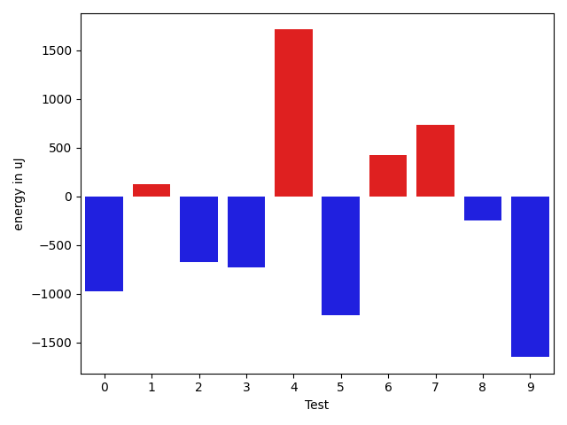

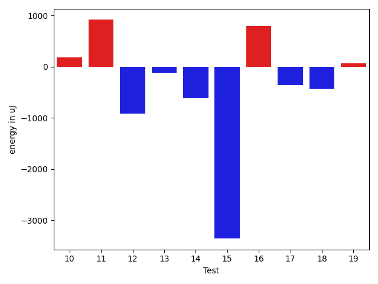

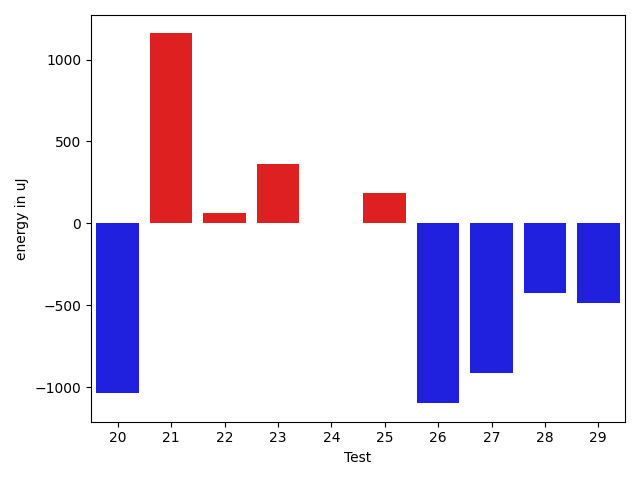

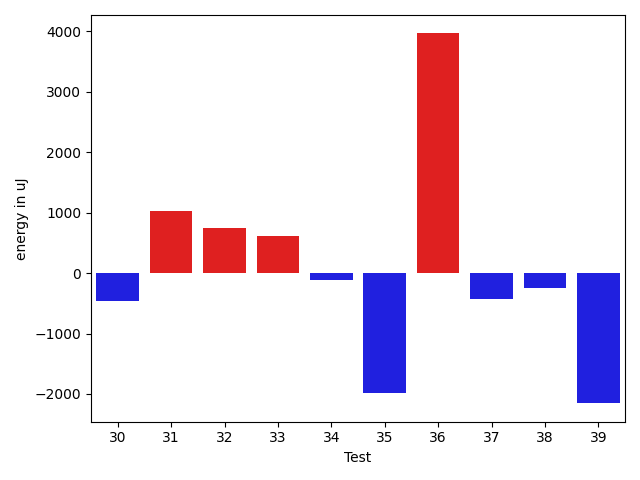

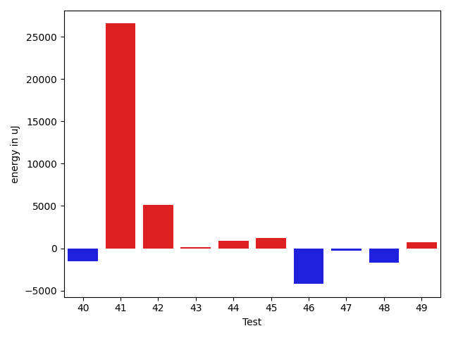

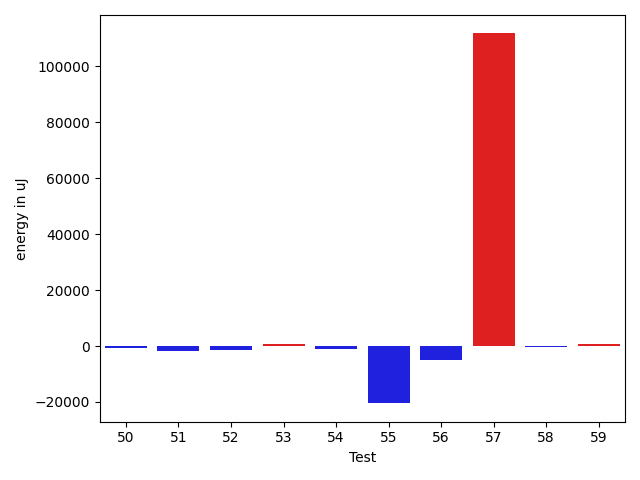

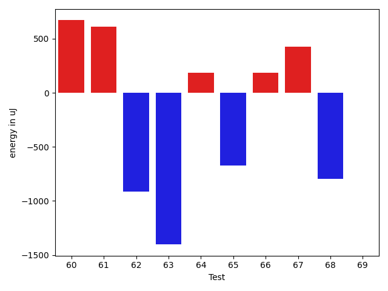

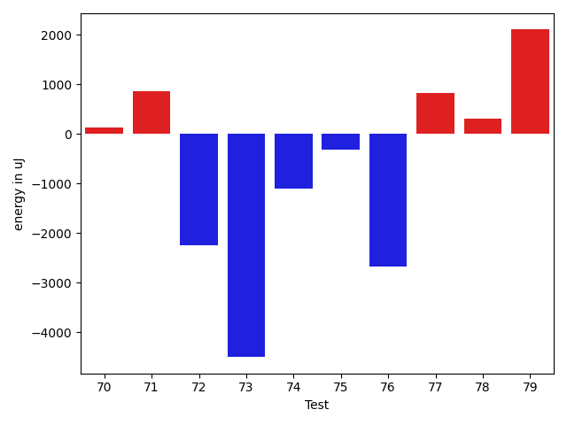

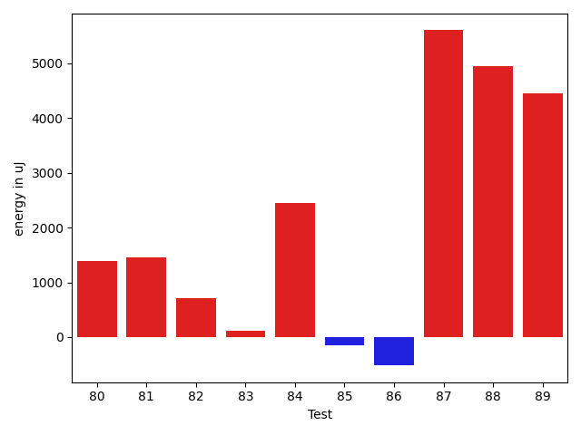

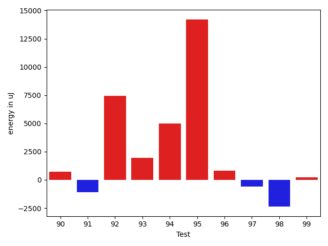

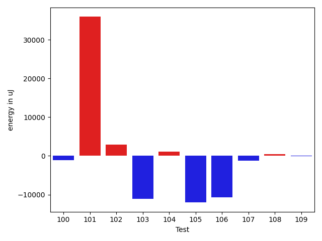

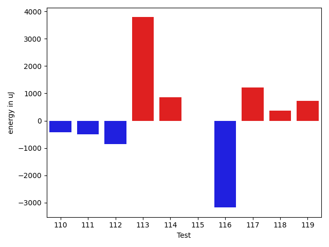

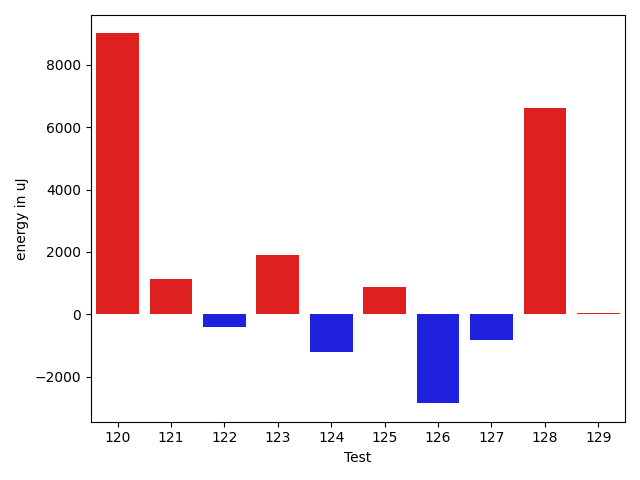

| ID | EnergyV1 | EnergyV2 | DeltaEnergy | σV1 | σV2 |
| --- | --- | --- | --- | --- | --- |
| 0 | 40528 | 39551 | -977 | 13568.655159254702 | 12951.96026711676 |
| 1 | 38085 | 38208 | 123 | 5381.5932730258355 | 6150.774329778922 |
| 2 | 38269 | 37598 | -671 | 3687.6459072705106 | 4379.804071462559 |
| 3 | 39490 | 38757 | -733 | 3735.198277451279 | 4772.372663862725 |
| 4 | 37597 | 39307 | 1710 | 4620.359275008081 | 6853.534703447627 |
| 5 | 38269 | 37048 | -1221 | 3874.0842110756607 | 4018.2774535455906 |
| 6 | 37109 | 37537 | 428 | 5569.169278946631 | 5995.968782283417 |
| 7 | 38147 | 38880 | 733 | 4087.5013198774623 | 3025.3800018056318 |
| 8 | 37536 | 37292 | -244 | 4324.182651523018 | 3541.452973352764 |
| 9 | 38574 | 36926 | -1648 | 7992.621577089473 | 3837.7717044065676 |
| 10 | 39734 | 39917 | 183 | 17464.61278588382 | 22344.80876629892 |
| 11 | 38513 | 39428 | 915 | 4058.6870741109806 | 3753.8157841075645 |
| 12 | 41565 | 40650 | -915 | 31685.16981821677 | 20020.597118450038 |
| 13 | 38574 | 38452 | -122 | 29506.35135436648 | 22161.14189183534 |
| 14 | 41504 | 40893 | -611 | 100441.47283902558 | 88848.36467492155 |
| 15 | 39368 | 36011 | -3357 | 5698.120033400086 | 4001.93310645013 |
| 16 | 37841 | 38635 | 794 | 3138.4182491609795 | 3894.5019027026524 |
| 17 | 37658 | 37292 | -366 | 3740.1377979500057 | 3610.2019384714768 |
| 18 | 37048 | 36621 | -427 | 3829.939798042909 | 3527.9658518188635 |
| 19 | 36743 | 36804 | 61 | 3655.2084828670368 | 3746.2153838765516 |
| 20 | 37415 | 36376 | -1039 | 3711.1406023269087 | 5706.104732304155 |
| 21 | 38208 | 39367 | 1159 | 18106.45120146715 | 20260.552834426842 |
| 22 | 37597 | 37659 | 62 | 4102.990103779923 | 6016.737828125776 |
| 23 | 37049 | 37414 | 365 | 4074.9809128276042 | 3398.4274641488128 |
| 24 | 37597 | 37597 | 0 | 3720.9862832923495 | 3863.442375296942 |
| 25 | 39124 | 39306 | 182 | 32881.205418054 | 41036.0670556507 |
| 26 | 37964 | 36865 | -1099 | 4063.497825273898 | 4485.956216747041 |
| 27 | 37597 | 36682 | -915 | 4006.4472069680664 | 2755.5812106341555 |
| 28 | 39917 | 39490 | -427 | 14102.36220352118 | 9274.283719963421 |
| 29 | 40772 | 40283 | -489 | 31706.02501532573 | 28004.65519486596 |
| 30 | 39001 | 38269 | -732 | 3631.447647372703 | 4231.972936036048 |
| 31 | 37171 | 37659 | 488 | 4238.828862778327 | 4689.018583341401 |
| 32 | 37780 | 38391 | 611 | 9394.239830063867 | 10951.761437285979 |
| 33 | 36926 | 38452 | 1526 | 5314.938579556946 | 4631.29440699871 |
| 34 | 37476 | 38025 | 549 | 4805.714811100582 | 4463.1537957418 |
| 35 | 37903 | 37231 | -672 | 14385.725247607781 | 11005.508679511457 |
| 36 | 73120 | 73974 | 854 | 31993.57370289259 | 34322.57756599878 |
| 37 | 36377 | 36072 | -305 | 3656.078125695109 | 3739.6775273394433 |
| 38 | 36865 | 37780 | 915 | 3634.1681339970132 | 4135.436325226155 |
| 39 | 37110 | 35889 | -1221 | 3573.2201638846495 | 2998.9245547852847 |
| 40 | 36499 | 35462 | -1037 | 3533.010702497407 | 3182.0067361864276 |
| 41 | 37781 | 37719 | -62 | 4256.140704789016 | 106878.92209783859 |
| 42 | 36927 | 35339 | -1588 | 14597.275661591648 | 39765.42873647354 |
| 43 | 36865 | 37780 | 915 | 2740.8075338695826 | 4256.547191451724 |
| 44 | 36865 | 36377 | -488 | 12540.798593118023 | 14392.718297806012 |
| 45 | 36987 | 37353 | 366 | 6274.96592142946 | 11252.108290607765 |
| 46 | 38940 | 38147 | -793 | 45820.05643820182 | 42528.44491125175 |
| 47 | 37598 | 38391 | 793 | 3134.9731333577647 | 3770.9286715474263 |
| 48 | 36438 | 35888 | -550 | 6654.185759538801 | 3191.3012260762157 |
| 49 | 36926 | 36682 | -244 | 3797.647649944659 | 3304.9812154867955 |
| 50 | 36560 | 35827 | -733 | 9941.137397846634 | 8635.987043968615 |
| 51 | 37170 | 35888 | -1282 | 3285.822918235248 | 3422.4174464133966 |
| 52 | 36743 | 36438 | -305 | 7812.338043022814 | 4685.777751699497 |
| 53 | 36438 | 37170 | 732 | 4262.527681847991 | 4354.535906731073 |
| 54 | 36499 | 35766 | -733 | 3864.6196508644616 | 4515.744618147324 |
| 55 | 39063 | 35889 | -3174 | 78895.18311551743 | 2928.093432167082 |
| 56 | 36133 | 36743 | 610 | 54105.296963229855 | 10822.876150801274 |
| 57 | 40711 | 40832 | 121 | 409822.04490909644 | 613309.8222173464 |
| 58 | 38330 | 37842 | -488 | 4282.044866285827 | 4107.415151019412 |
| 59 | 37781 | 38635 | 854 | 3304.4308670422697 | 4646.419288987978 |
| 60 | 36988 | 37659 | 671 | 9687.827331996115 | 7390.823736274993 |
| 61 | 36987 | 37597 | 610 | 3966.9381754336255 | 3258.34687603124 |
| 62 | 38879 | 37964 | -915 | 24365.7839578701 | 18398.26160493431 |
| 63 | 37963 | 36560 | -1403 | 4170.186838065294 | 4060.5257185094993 |
| 64 | 37903 | 38086 | 183 | 4809.813604283957 | 3881.8380976430117 |
| 65 | 38818 | 38147 | -671 | 3405.9679140322105 | 4163.268344692347 |
| 66 | 37354 | 37537 | 183 | 5982.953197209553 | 3634.269675663019 |
| 67 | 36865 | 37292 | 427 | 4236.441864315173 | 3810.695129928907 |
| 68 | 38147 | 37353 | -794 | 16490.02580378878 | 13914.768350628781 |
| 69 | 37292 | 37293 | 1 | 6694.585731043823 | 5390.444937008894 |
| 70 | 36072 | 36621 | 549 | 3229.532981261401 | 4133.598376661769 |
| 71 | 37476 | 37659 | 183 | 13109.482405889139 | 12865.384936577517 |
| 72 | 37536 | 38147 | 611 | 15899.253634899995 | 13298.48263413899 |
| 73 | 38635 | 37720 | -915 | 64548.177228383145 | 57404.70910146536 |
| 74 | 74158 | 74158 | 0 | 42976.0551087146 | 38860.017305909816 |
| 75 | 38147 | 38330 | 183 | 14573.349433418256 | 15011.81665624497 |
| 76 | 37597 | 37293 | -304 | 15067.292422848263 | 13172.056327330187 |
| 77 | 38085 | 37537 | -548 | 3472.360792702457 | 7325.126637111623 |
| 78 | 38940 | 38879 | -61 | 4136.121754123125 | 3951.7494968100837 |
| 79 | 40161 | 39612 | -549 | 25940.16072100989 | 32854.08518157301 |
| 80 | 36255 | 38085 | 1830 | 4427.156976480338 | 4699.658772601357 |
| 81 | 37780 | 39794 | 2014 | 3835.9748338745167 | 4408.611936875476 |
| 82 | 36804 | 37110 | 306 | 3128.600856637526 | 3906.908998023188 |
| 83 | 37841 | 38940 | 1099 | 3537.3843008891286 | 4030.131426585931 |
| 84 | 37598 | 37902 | 304 | 33863.19525408562 | 33818.3770597469 |
| 85 | 36560 | 37354 | 794 | 4199.060811645469 | 4284.985984807886 |
| 86 | 38025 | 37048 | -977 | 2924.7525533391517 | 4497.983136698908 |
| 87 | 71228 | 73059 | 1831 | 24969.259561561037 | 21710.6785663814 |
| 88 | 37353 | 37903 | 550 | 11678.188035222378 | 32134.41542980239 |
| 89 | 38697 | 39856 | 1159 | 4219.76679222468 | 14529.622971066095 |
| 90 | 36926 | 37659 | 733 | 12645.010288427779 | 20700.48025582961 |
| 91 | 37963 | 36865 | -1098 | 6666.983753733346 | 3951.887232046484 |
| 92 | 84106 | 91553 | 7447 | 323265.3229515605 | 488090.75537795376 |
| 93 | 40894 | 42846 | 1952 | 22845.73636922433 | 27731.99126647883 |
| 94 | 117553 | 122558 | 5005 | 27307.380969023914 | 30112.658106418596 |
| 95 | 239806 | 254028 | 14222 | 414790.9738206595 | 319071.4946005086 |
| 96 | 75622 | 76416 | 794 | 16034.910883797304 | 20710.39262140143 |
| 97 | 38269 | 37658 | -611 | 3625.1206874066806 | 3348.142007895801 |
| 98 | 40466 | 38086 | -2380 | 17070.786617604994 | 9157.444272345207 |
| 99 | 39550 | 39795 | 245 | 50569.91705025806 | 24360.102521455545 |
| 100 | 39184 | 39184 | 0 | 13644.550647119138 | 13336.080599611214 |
| 101 | 39612 | 38940 | -672 | 417914.3274928919 | 502251.0100413253 |
| 102 | 38574 | 40527 | 1953 | 15149.304237116397 | 17049.88299136903 |
| 103 | 41870 | 39734 | -2136 | 54771.33012664704 | 47475.41474318735 |
| 104 | 37232 | 38879 | 1647 | 4236.40668628497 | 4457.1305503715685 |
| 105 | 341186 | 324157 | -17029 | 95652.24782138014 | 99511.64455983818 |
| 106 | 40466 | 39490 | -976 | 45565.5565225804 | 20147.45728812913 |
| 107 | 40466 | 39062 | -1404 | 3493.781400801557 | 3984.9850696759413 |
| 108 | 39550 | 38025 | -1525 | 4126.259600882808 | 6989.060518736349 |
| 109 | 38879 | 39551 | 672 | 3625.0173033741767 | 3541.0340139852065 |
| 110 | 38207 | 37781 | -426 | 4725.454919296386 | 262364.5928821084 |
| 111 | 40100 | 39611 | -489 | 47484.62735817272 | 51077.008912111276 |
| 112 | 38574 | 37719 | -855 | 3411.3055436624586 | 4274.573534618062 |
| 113 | 79041 | 82825 | 3784 | 351787.6856612155 | 367278.74165998574 |
| 114 | 39001 | 39856 | 855 | 3880.865432915742 | 4019.189034685654 |
| 115 | 38330 | 38330 | 0 | 4829.802416069444 | 4004.8442957738907 |
| 116 | 41382 | 38207 | -3175 | 7875.5795004237325 | 5417.6308327533725 |
| 117 | 45838 | 47058 | 1220 | 635091.0897963888 | 433799.1051365537 |
| 118 | 39612 | 39978 | 366 | 7947.63195315757 | 10446.985719877337 |
| 119 | 38086 | 38818 | 732 | 4220.498911674195 | 5802.573255757071 |
| 120 | 39001 | 38696 | -305 | 28147.804235342464 | 42331.486393063184 |
| 121 | 38269 | 40466 | 2197 | 4782.611225847236 | 4185.820223589982 |
| 122 | 38330 | 38879 | 549 | 4175.684851062647 | 3322.369736533344 |
| 123 | 39307 | 38696 | -611 | 28775.131777875198 | 39580.881274443316 |
| 124 | 40222 | 38330 | -1892 | 7842.759983005642 | 7029.4161156660575 |
| 125 | 39062 | 37902 | -1160 | 4585.178574009475 | 4257.165536675634 |
| 126 | 39672 | 39185 | -487 | 11650.545553478294 | 6537.498214577195 |
| 127 | 39245 | 38269 | -976 | 3517.949026829681 | 3781.4921480527364 |
| 128 | 40405 | 38940 | -1465 | 25088.437073236393 | 40644.31900733889 |
| 129 | 38514 | 38757 | 243 | 4532.650237316963 | 4936.7977515488255 |

## Delta Duration per test method

| ID | DurationV1 | DurationsV2 | DeltaDuration |
| --- | --- | --- | --- |
| 0 | 1111689.2307692308 | 1062090.223880597 | -49599.00688863383 |
| 1 | 933739.3728813559 | 925692.9107142857 | -8046.462167070247 |
| 2 | 854794.3225806452 | 851398.48 | -3395.8425806452287 |
| 3 | 968775.6875 | 956202.8524590164 | -12572.835040983628 |
| 4 | 1023199.4262295082 | 1001502.0461538462 | -21697.380075662048 |
| 5 | 633894.8064516129 | 638535.25 | 4640.443548387149 |
| 6 | 1018043.4925373135 | 994967.0 | -23076.49253731349 |
| 7 | 577617.84 | 502254.07692307694 | -75363.76307692303 |
| 8 | 703249.4375 | 712328.0222222222 | 9078.584722222178 |
| 9 | 789987.3269230769 | 812780.612244898 | 22793.28532182111 |
| 10 | 1041125.487804878 | 1157270.0555555555 | 116144.56775067747 |
| 11 | 660655.4333333333 | 629015.3333333334 | -31640.099999999977 |
| 12 | 1366639.9574468085 | 1184383.9038461538 | -182256.0536006547 |
| 13 | 1288707.9137931035 | 1207843.6379310344 | -80864.2758620691 |
| 14 | 1988667.6315789474 | 2057085.8275862068 | 68418.19600725942 |
| 15 | 903638.224489796 | 909357.2553191489 | 5719.030829352909 |
| 16 | 587122.9666666667 | 602409.8620689656 | 15286.895402298891 |
| 17 | 801769.1111111111 | 771649.0666666667 | -30120.044444444473 |
| 18 | 764502.2926829269 | 790993.78 | 26491.48731707316 |
| 19 | 844580.8727272727 | 831125.9032258064 | -13454.969501466257 |
| 20 | 940067.0161290322 | 972277.9696969697 | 32210.953567937482 |
| 21 | 1492054.9090909092 | 1589298.3469387756 | 97243.43784786644 |
| 22 | 946550.0615384616 | 1035566.9166666666 | 89016.85512820503 |
| 23 | 773336.8095238095 | 769212.4074074074 | -4124.402116402052 |
| 24 | 757726.2857142857 | 810801.4347826086 | 53075.149068322964 |
| 25 | 1387234.0597014925 | 1776453.524590164 | 389219.4648886714 |
| 26 | 794587.1886792453 | 844747.0178571428 | 50159.82917789754 |
| 27 | 749697.8958333334 | 815711.82 | 66013.92416666658 |
| 28 | 1096795.2419354839 | 1059864.3188405796 | -36930.92309490428 |
| 29 | 994676.125 | 1024148.8888888889 | 29472.763888888876 |
| 30 | 940502.7096774194 | 963540.1016949152 | 23037.39201749582 |
| 31 | 913655.1803278689 | 906443.033898305 | -7212.1464295638725 |
| 32 | 1152319.5308641975 | 1206518.2051282052 | 54198.674264007714 |
| 33 | 892587.5818181818 | 890616.7727272727 | -1970.8090909090824 |
| 34 | 820276.1914893617 | 836084.6222222223 | 15808.43073286058 |
| 35 | 1232933.5476190476 | 1282230.2054794522 | 49296.65786040458 |
| 36 | 2424827.0606060605 | 2510813.8585858587 | 85986.79797979817 |
| 37 | 636904.1612903225 | 704882.75 | 67978.58870967745 |
| 38 | 600748.9655172414 | 610891.56 | 10142.594482758665 |
| 39 | 613846.6571428571 | 604694.4117647059 | -9152.245378151187 |
| 40 | 683350.7368421053 | 734922.9777777778 | 51572.24093567254 |
| 41 | 668800.5588235294 | 1472494.3235294118 | 803693.7647058824 |
| 42 | 942802.9636363636 | 1088848.8166666667 | 146045.85303030303 |
| 43 | 491387.1176470588 | 487302.125 | -4084.992647058796 |
| 44 | 1086355.6206896552 | 1016388.3050847457 | -69967.31560490944 |
| 45 | 685352.448275862 | 710166.0588235294 | 24813.61054766737 |
| 46 | 1110976.564102564 | 966836.75 | -144139.814102564 |
| 47 | 757092.34375 | 668511.5 | -88580.84375 |
| 48 | 864397.7959183673 | 797211.0 | -67186.79591836734 |
| 49 | 472840.0 | 483978.1034482759 | 11138.103448275884 |
| 50 | 1119212.4782608696 | 1148197.825 | 28985.346739130327 |
| 51 | 574948.4615384615 | 526642.0 | -48306.4615384615 |
| 52 | 957011.8769230769 | 937372.4603174604 | -19639.41660561657 |
| 53 | 651283.5357142857 | 591674.6071428572 | -59608.92857142852 |
| 54 | 616126.3529411765 | 649191.1142857143 | 33064.76134453784 |
| 55 | 1245494.6315789474 | 679227.45 | -566267.1815789475 |
| 56 | 979836.9230769231 | 735748.1851851852 | -244088.73789173795 |
| 57 | 3887564.5135135134 | 7504856.269230769 | 3617291.7557172556 |
| 58 | 768863.4186046511 | 773744.4897959183 | 4881.071191267227 |
| 59 | 811552.2222222222 | 803734.8367346938 | -7817.385487528401 |
| 60 | 1121025.913580247 | 1140471.5308641975 | 19445.61728395056 |
| 61 | 814839.0869565217 | 811136.9056603773 | -3702.1812961443793 |
| 62 | 1058626.38 | 987748.5 | -70877.87999999989 |
| 63 | 745101.9787234042 | 777595.9375 | 32493.95877659577 |
| 64 | 800301.3469387755 | 779122.0701754387 | -21179.27676333685 |
| 65 | 792360.5319148937 | 744268.0909090909 | -48092.44100580271 |
| 66 | 806938.8 | 764869.8846153846 | -42068.91538461542 |
| 67 | 771576.1166666667 | 784319.1875 | 12743.070833333302 |
| 68 | 1400473.819148936 | 1380193.4065934066 | -20280.412555529503 |
| 69 | 1083283.8169014084 | 1030506.323943662 | -52777.49295774638 |
| 70 | 864463.8870967742 | 817795.625 | -46668.26209677418 |
| 71 | 1352791.244680851 | 1276229.2210526315 | -76562.0236282195 |
| 72 | 1469906.93814433 | 1407319.8865979381 | -62587.0515463918 |
| 73 | 1830666.1395348837 | 1644064.1797752809 | -186601.9597596028 |
| 74 | 2466995.373737374 | 2393721.868686869 | -73273.50505050505 |
| 75 | 1351505.4352941175 | 1322754.5930232557 | -28750.842270861845 |
| 76 | 1396280.3333333333 | 1340601.8804347827 | -55678.452898550546 |
| 77 | 898723.0735294118 | 897329.8333333334 | -1393.2401960784337 |
| 78 | 813263.0416666666 | 849183.2173913043 | 35920.175724637695 |
| 79 | 1045378.5892857143 | 1136625.8125 | 91247.22321428568 |
| 80 | 722572.4848484849 | 709160.1333333333 | -13412.35151515156 |
| 81 | 603953.8387096775 | 571041.84375 | -32911.99495967745 |
| 82 | 654615.0357142857 | 603099.1935483871 | -51515.84216589853 |
| 83 | 650183.6666666666 | 587443.2333333333 | -62740.43333333335 |
| 84 | 1079627.261904762 | 1169967.0476190476 | 90339.78571428568 |
| 85 | 751068.4545454546 | 727410.9 | -23657.554545454565 |
| 86 | 600959.125 | 529917.8108108108 | -71041.31418918923 |
| 87 | 1982269.9032258065 | 2092826.3608247424 | 110556.45759893581 |
| 88 | 1123002.1184210526 | 1295434.6282051282 | 172432.50978407566 |
| 89 | 971017.5 | 1099635.3620689656 | 128617.86206896557 |
| 90 | 756210.9166666666 | 1039381.0196078431 | 283170.1029411765 |
| 91 | 957503.3846153846 | 1008508.6811594203 | 51005.296544035664 |
| 92 | 4418214.161616161 | 6432488.232323232 | 2014274.0707070706 |
| 93 | 1631552.4536082475 | 1720469.9895833333 | 88917.5359750858 |
| 94 | 3489800.6868686867 | 3679527.727272727 | 189727.04040404037 |
| 95 | 8949575.04040404 | 8539414.777777778 | -410160.2626262624 |
| 96 | 2230901.8585858587 | 2318535.898989899 | 87634.04040404037 |
| 97 | 888681.3125 | 927251.274509804 | 38569.962009803974 |
| 98 | 912417.7272727273 | 794679.2894736842 | -117738.43779904314 |
| 99 | 1685160.2033898304 | 1059597.8823529412 | -625562.3210368892 |
| 100 | 1317589.7647058824 | 1252033.8313253012 | -65555.9333805812 |
| 101 | 3923757.25 | 4861294.591549296 | 937537.3415492959 |
| 102 | 1361070.1976744186 | 1383080.8 | 22010.60232558148 |
| 103 | 1970476.0172413792 | 1600626.0909090908 | -369849.9263322884 |
| 104 | 839570.02 | 848927.6666666666 | 9357.64666666661 |
| 105 | 9887271.212121213 | 9666965.848484848 | -220305.36363636516 |
| 106 | 1770206.6555555556 | 1431179.8372093022 | -339026.81834625336 |
| 107 | 599336.4838709678 | 641661.2894736842 | 42324.8056027164 |
| 108 | 728618.9142857143 | 724640.3953488372 | -3978.5189368770225 |
| 109 | 954650.0172413794 | 1041290.9242424242 | 86640.90700104483 |
| 110 | 639917.2702702703 | 2276964.3055555555 | 1637047.0352852852 |
| 111 | 1276419.75 | 1226333.7368421052 | -50086.013157894835 |
| 112 | 667605.7333333333 | 705369.6285714286 | 37763.89523809531 |
| 113 | 4287918.262626262 | 4665746.676767677 | 377828.4141414147 |
| 114 | 690670.4054054054 | 696923.8421052631 | 6253.4366998577025 |
| 115 | 849304.6666666666 | 827701.320754717 | -21603.34591194964 |
| 116 | 866067.8648648649 | 771122.5 | -94945.36486486485 |
| 117 | 7255492.470588235 | 4308757.8375 | -2946734.633088235 |
| 118 | 1043702.5 | 1131341.3880597015 | 87638.88805970154 |
| 119 | 828380.5 | 901866.6666666666 | 73486.16666666663 |
| 120 | 1050141.574468085 | 1530503.8958333333 | 480362.3213652482 |
| 121 | 589403.44 | 629173.9545454546 | 39770.514545454644 |
| 122 | 697525.6274509804 | 730367.1666666666 | 32841.539215686265 |
| 123 | 1293519.6153846155 | 1296662.2698412698 | 3142.6544566543307 |
| 124 | 934215.475409836 | 926751.5238095238 | -7463.951600312255 |
| 125 | 721874.8333333334 | 630696.9655172414 | -91177.86781609198 |
| 126 | 967526.5833333334 | 831642.94 | -135883.64333333343 |
| 127 | 591564.5 | 577996.9565217391 | -13567.543478260865 |
| 128 | 1029462.3392857143 | 1307447.8245614036 | 277985.4852756893 |
| 129 | 688846.8108108108 | 683677.6521739131 | -5169.158636897686 |

## Misc.

| ID | Test Class | Test Method |
| --- | --- | --- |
| 0 | com.google.gson.functional.PrimitiveTest | testDeserializePrimitiveWrapperAsObjectField |
| 1 | com.google.gson.functional.CustomTypeAdaptersTest | testCustomAdapterInvokedForCollectionElementDeserialization |
| 2 | com.google.gson.functional.CustomTypeAdaptersTest | testCustomAdapterInvokedForMapElementDeserialization |
| 3 | com.google.gson.functional.CustomTypeAdaptersTest | testCustomNestedDeserializers |
| 4 | com.google.gson.functional.CustomTypeAdaptersTest | testCustomDeserializerForLong |
| 5 | com.google.gson.functional.CustomTypeAdaptersTest | testEnsureCustomDeserializerNotInvokedForNullValues |
| 6 | com.google.gson.functional.DefaultTypeAdaptersTest | testTreeSetDeserialization |
| 7 | com.google.gson.functional.DefaultTypeAdaptersTest | testPropertiesDeserialization |
| 8 | com.google.gson.functional.DefaultTypeAdaptersTest | testBigIntegerFieldDeserialization |
| 9 | com.google.gson.functional.DefaultTypeAdaptersTest | testUrlNullDeserialization |
| 10 | com.google.gson.functional.DefaultTypeAdaptersTest | testBigDecimalFieldDeserialization |
| 11 | com.google.gson.functional.DefaultTypeAdaptersTest | testBadValueForBigDecimalDeserialization |
| 12 | com.google.gson.functional.JsonParserTest | testBadTypeForDeserializingCustomTree |
| 13 | com.google.gson.functional.JsonParserTest | testChangingCustomTreeAndDeserializing |
| 14 | com.google.gson.functional.JsonParserTest | testDeserializingCustomTree |
| 15 | com.google.gson.functional.JsonParserTest | testBadFieldTypeForDeserializingCustomTree |
| 16 | com.google.gson.functional.JsonParserTest | testBadFieldTypeForCustomDeserializerCustomTree |
| 17 | com.google.gson.functional.CollectionTest | testNullsInListDeserialization |
| 18 | com.google.gson.functional.CollectionTest | testRawCollectionOfBagOfPrimitivesNotAllowed |
| 19 | com.google.gson.functional.CollectionTest | testWildcardPrimitiveCollectionDeserilaization |
| 20 | com.google.gson.functional.CollectionTest | testSetDeserialization |
| 21 | com.google.gson.functional.CollectionTest | testWildcardCollectionField |
| 22 | com.google.gson.functional.CollectionTest | testTopLevelListOfIntegerCollectionsDeserialization |
| 23 | com.google.gson.functional.CollectionTest | testCollectionOfStringsDeserialization |
| 24 | com.google.gson.functional.CollectionTest | testQueueDeserialization |
| 25 | com.google.gson.functional.CollectionTest | testTopLevelCollectionOfIntegersDeserialization |
| 26 | com.google.gson.functional.CollectionTest | testLinkedListDeserialization |
| 27 | com.google.gson.functional.CollectionTest | testRawCollectionDeserializationNotAlllowed |
| 28 | com.google.gson.functional.ReadersWritersTest | testReadWriteTwoObjects |
| 29 | com.google.gson.functional.ReadersWritersTest | testReaderForDeserialization |
| 30 | com.google.gson.functional.CustomDeserializerTest | testCustomDeserializerReturnsNullForArrayElementsForArrayField |
| 31 | com.google.gson.functional.CustomDeserializerTest | testCustomDeserializerReturnsNull |
| 32 | com.google.gson.functional.CustomDeserializerTest | testJsonTypeFieldBasedDeserialization |
| 33 | com.google.gson.functional.CustomDeserializerTest | testCustomDeserializerReturnsNullForPrimitiveFields |
| 34 | com.google.gson.functional.CustomDeserializerTest | testDefaultConstructorNotCalledOnField |
| 35 | com.google.gson.functional.ObjectTest | testArrayOfArraysDeserialization |
| 36 | com.google.gson.functional.ObjectTest | testSingletonLists |
| 37 | com.google.gson.functional.ObjectTest | testClassWithTransientFieldsDeserialization |
| 38 | com.google.gson.functional.ObjectTest | testPrivateNoArgConstructorDeserialization |
| 39 | com.google.gson.functional.ObjectTest | testClassWithTransientFieldsDeserializationTransientFieldsPassedInJsonAreIgnored |
| 40 | com.google.gson.functional.ObjectTest | testPrimitiveArrayInAnObjectDeserialization |
| 41 | com.google.gson.functional.ObjectTest | testBagOfPrimitiveWrappersDeserialization |
| 42 | com.google.gson.functional.ObjectTest | testInnerClassDeserialization |
| 43 | com.google.gson.functional.ObjectTest | testClassWithNoFieldsDeserialization |
| 44 | com.google.gson.functional.ObjectTest | testStringFieldWithNumberValueDeserialization |
| 45 | com.google.gson.functional.ObjectTest | testObjectFieldNamesWithoutQuotesDeserialization |
| 46 | com.google.gson.functional.ObjectTest | testJsonInSingleQuotesDeserialization |
| 47 | com.google.gson.functional.ObjectTest | testNullFieldsDeserialization |
| 48 | com.google.gson.functional.ObjectTest | testNestedDeserialization |
| 49 | com.google.gson.functional.ObjectTest | testNullObjectFieldsDeserialization |
| 50 | com.google.gson.functional.ObjectTest | testEmptyCollectionInAnObjectDeserialization |
| 51 | com.google.gson.functional.ObjectTest | testNullArraysDeserialization |
| 52 | com.google.gson.functional.ObjectTest | testArrayOfObjectsDeserialization |
| 53 | com.google.gson.functional.ObjectTest | testJsonInMixedQuotesDeserialization |
| 54 | com.google.gson.functional.ObjectTest | testBagOfPrimitivesDeserialization |
| 55 | com.google.gson.functional.ObjectTest | testNullPrimitiveFieldsDeserialization |
| 56 | com.google.gson.functional.ObjectTest | testStringFieldWithEmptyValueDeserialization |
| 57 | com.google.gson.JsonParserTest | testReadWriteTwoObjects |
| 58 | com.google.gson.functional.MapTest | testMapDeserializationWithIntegerKeys |
| 59 | com.google.gson.functional.MapTest | testMapDeserializationWithNullKey |
| 60 | com.google.gson.functional.MapTest | testParameterizedMapSubclassDeserialization |
| 61 | com.google.gson.functional.MapTest | testMapOfMapDeserialization |
| 62 | com.google.gson.functional.MapTest | testMapDeserialization |
| 63 | com.google.gson.functional.MapTest | testMapDeserializationWithNullValue |
| 64 | com.google.gson.functional.MapTest | testMapStandardSubclassDeserialization |
| 65 | com.google.gson.functional.MapTest | testMapDeserializationEmpty |
| 66 | com.google.gson.functional.MapTest | testReadMapsWithEmptyStringKey |
| 67 | com.google.gson.functional.MapTest | testMapDeserializationWithWildcardValues |
| 68 | com.google.gson.functional.ParameterizedTypesTest | testVariableTypeArrayDeserialization |
| 69 | com.google.gson.functional.ParameterizedTypesTest | testParameterizedTypeWithReaderDeserialization |
| 70 | com.google.gson.functional.ParameterizedTypesTest | testDeepParameterizedTypeDeserialization |
| 71 | com.google.gson.functional.ParameterizedTypesTest | testVariableTypeDeserialization |
| 72 | com.google.gson.functional.ParameterizedTypesTest | testParameterizedTypeGenericArraysDeserialization |
| 73 | com.google.gson.functional.ParameterizedTypesTest | testParameterizedTypeDeserialization |
| 74 | com.google.gson.functional.ParameterizedTypesTest | testVariableTypeFieldsAndGenericArraysDeserialization |
| 75 | com.google.gson.functional.ParameterizedTypesTest | testTypesWithMultipleParametersDeserialization |
| 76 | com.google.gson.functional.ParameterizedTypesTest | testParameterizedTypeWithVariableTypeDeserialization |
| 77 | com.google.gson.functional.VersioningTest | testVersionedGsonMixingSinceAndUntilDeserialization |
| 78 | com.google.gson.functional.VersioningTest | testVersionedClassesDeserialization |
| 79 | com.google.gson.functional.VersioningTest | testVersionedUntilDeserialization |
| 80 | com.google.gson.functional.VersioningTest | testVersionedGsonWithUnversionedClassesDeserialization |
| 81 | com.google.gson.functional.VersioningTest | testIgnoreLaterVersionClassDeserialization |
| 82 | com.google.gson.functional.NamingPolicyTest | testGsonWithLowerCaseDashPolicyDeserialiation |
| 83 | com.google.gson.functional.NamingPolicyTest | testGsonWithLowerCaseUnderscorePolicyDeserialiation |
| 84 | com.google.gson.functional.NamingPolicyTest | testGsonWithNonDefaultFieldNamingPolicyDeserialiation |
| 85 | com.google.gson.functional.NamingPolicyTest | testGsonWithSerializedNameFieldNamingPolicyDeserialization |
| 86 | com.google.gson.functional.NamingPolicyTest | testGsonWithUpperCamelCaseSpacesPolicyDeserialiation |
| 87 | com.google.gson.functional.EnumTest | testEnumSubclass |
| 88 | com.google.gson.functional.EnumTest | testEnumSubclassWithRegisteredTypeAdapter |
| 89 | com.google.gson.functional.EnumTest | testCollectionOfEnumsDeserialization |
| 90 | com.google.gson.functional.EnumTest | testClassWithEnumFieldDeserialization |
| 91 | com.google.gson.functional.TypeVariableTest | testBasicTypeVariables |
| 92 | com.google.gson.functional.TypeVariableTest | testAdvancedTypeVariables |
| 93 | com.google.gson.functional.TypeVariableTest | testTypeVariablesViaTypeParameter |
| 94 | com.google.gson.functional.MapAsArrayTypeAdapterTest | testMultipleEnableComplexKeyRegistrationHasNoEffect |
| 95 | com.google.gson.functional.MapAsArrayTypeAdapterTest | testSerializeComplexMapWithTypeAdapter |
| 96 | com.google.gson.functional.MapAsArrayTypeAdapterTest | testTwoTypesCollapseToOneDeserialize |
| 97 | com.google.gson.functional.ExclusionStrategyFunctionalTest | testExclusionStrategyWithMode |
| 98 | com.google.gson.functional.ExclusionStrategyFunctionalTest | testExclusionStrategyDeserialization |
| 99 | com.google.gson.functional.InheritanceTest | testSubClassDeserialization |
| 100 | com.google.gson.functional.InheritanceTest | testSubInterfacesOfCollectionDeserialization |
| 101 | com.google.gson.CommentsTest | testParseComments |
| 102 | com.google.gson.functional.EscapingTest | testGsonAcceptsEscapedAndNonEscapedJsonDeserialization |
| 103 | com.google.gson.functional.EscapingTest | testEscapingObjectFields |
| 104 | com.google.gson.functional.EscapingTest | testGsonDoubleDeserialization |
| 105 | com.google.gson.functional.ConcurrencyTest | testMultiThreadDeserialization |
| 106 | com.google.gson.functional.ConcurrencyTest | testSingleThreadDeserialization |
| 107 | com.google.gson.MappedObjectConstructorTest | testNoInstanceCreatorInvokesDefaultConstructor |
| 108 | com.google.gson.MappedObjectConstructorTest | testNoDefaultConstructor |
| 109 | com.google.gson.MappedObjectConstructorTest | testInstanceCreatorTakesTopPrecedence |
| 110 | com.google.gson.functional.SecurityTest | testJsonWithNonExectuableTokenWithConfiguredGsonDeserialization |
| 111 | com.google.gson.functional.SecurityTest | testNonExecutableJsonDeserialization |
| 112 | com.google.gson.functional.SecurityTest | testJsonWithNonExectuableTokenWithRegularGsonDeserialization |
| 113 | com.google.gson.functional.TypeHierarchyAdapterTest | testTypeHierarchy |
| 114 | com.google.gson.functional.NullObjectAndFieldTest | testExplicitNullSetsFieldToNullDuringDeserialization |
| 115 | com.google.gson.functional.NullObjectAndFieldTest | testNullWrappedPrimitiveMemberDeserialization |
| 116 | com.google.gson.functional.NullObjectAndFieldTest | testExplicitDeserializationOfNulls |
| 117 | com.google.gson.functional.InstanceCreatorTest | testInstanceCreatorReturnsSubTypeForTopLevelObject |
| 118 | com.google.gson.functional.InstanceCreatorTest | testInstanceCreatorReturnsSubTypeForField |
| 119 | com.google.gson.functional.InstanceCreatorTest | testInstanceCreatorReturnsBaseType |
| 120 | com.google.gson.functional.ExposeFieldsTest | testExposeAnnotationDeserialization |
| 121 | com.google.gson.functional.ExposeFieldsTest | testExposedInterfaceFieldDeserialization |
| 122 | com.google.gson.functional.ExposeFieldsTest | testNoExposedFieldDeserialization |
| 123 | com.google.gson.functional.CircularReferenceTest | testDirectedAcyclicGraphDeserialization |
| 124 | com.google.gson.functional.ArrayTest | testArrayOfCollectionDeserialization |
| 125 | com.google.gson.functional.ArrayTest | testArrayOfObjectsWithoutTypeInfoDeserialization |
| 126 | com.google.gson.functional.ArrayTest | testArrayOfPrimitivesAsObjectsDeserialization |
| 127 | com.google.gson.functional.ArrayTest | testArrayWithoutTypeInfoDeserialization |
| 128 | com.google.gson.MixedStreamTest | testReadMixedStreamed |
| 129 | com.google.gson.MixedStreamTest | testReaderDoesNotMutateState |

| Test | IterationV1 | IterationV2 | DeltaIteration |
| --- | --- | --- | --- |
| 0 | 65 | 67 | 2 |
| 1 | 59 | 56 | -3 |
| 2 | 62 | 50 | -12 |
| 3 | 64 | 61 | -3 |
| 4 | 61 | 65 | 4 |
| 5 | 31 | 36 | 5 |
| 6 | 67 | 72 | 5 |
| 7 | 25 | 26 | 1 |
| 8 | 48 | 45 | -3 |
| 9 | 52 | 49 | -3 |
| 10 | 41 | 36 | -5 |
| 11 | 30 | 27 | -3 |
| 12 | 47 | 52 | 5 |
| 13 | 58 | 58 | 0 |
| 14 | 38 | 29 | -9 |
| 15 | 49 | 47 | -2 |
| 16 | 30 | 29 | -1 |
| 17 | 45 | 45 | 0 |
| 18 | 41 | 50 | 9 |
| 19 | 55 | 62 | 7 |
| 20 | 62 | 66 | 4 |
| 21 | 99 | 98 | -1 |
| 22 | 65 | 72 | 7 |
| 23 | 42 | 54 | 12 |
| 24 | 49 | 46 | -3 |
| 25 | 67 | 61 | -6 |
| 26 | 53 | 56 | 3 |
| 27 | 48 | 50 | 2 |
| 28 | 62 | 69 | 7 |
| 29 | 32 | 36 | 4 |
| 30 | 62 | 59 | -3 |
| 31 | 61 | 59 | -2 |
| 32 | 81 | 78 | -3 |
| 33 | 55 | 66 | 11 |
| 34 | 47 | 45 | -2 |
| 35 | 84 | 73 | -11 |
| 36 | 99 | 99 | 0 |
| 37 | 31 | 36 | 5 |
| 38 | 29 | 25 | -4 |
| 39 | 35 | 34 | -1 |
| 40 | 38 | 45 | 7 |
| 41 | 34 | 34 | 0 |
| 42 | 55 | 60 | 5 |
| 43 | 17 | 24 | 7 |
| 44 | 58 | 59 | 1 |
| 45 | 29 | 34 | 5 |
| 46 | 39 | 40 | 1 |
| 47 | 32 | 32 | 0 |
| 48 | 49 | 60 | 11 |
| 49 | 19 | 29 | 10 |
| 50 | 69 | 80 | 11 |
| 51 | 26 | 26 | 0 |
| 52 | 65 | 63 | -2 |
| 53 | 28 | 28 | 0 |
| 54 | 34 | 35 | 1 |
| 55 | 19 | 20 | 1 |
| 56 | 39 | 27 | -12 |
| 57 | 74 | 78 | 4 |
| 58 | 43 | 49 | 6 |
| 59 | 45 | 49 | 4 |
| 60 | 81 | 81 | 0 |
| 61 | 46 | 53 | 7 |
| 62 | 50 | 50 | 0 |
| 63 | 47 | 48 | 1 |
| 64 | 49 | 57 | 8 |
| 65 | 47 | 44 | -3 |
| 66 | 45 | 52 | 7 |
| 67 | 60 | 48 | -12 |
| 68 | 94 | 91 | -3 |
| 69 | 71 | 71 | 0 |
| 70 | 62 | 56 | -6 |
| 71 | 94 | 95 | 1 |
| 72 | 97 | 97 | 0 |
| 73 | 86 | 89 | 3 |
| 74 | 99 | 99 | 0 |
| 75 | 85 | 86 | 1 |
| 76 | 96 | 92 | -4 |
| 77 | 68 | 60 | -8 |
| 78 | 48 | 46 | -2 |
| 79 | 56 | 48 | -8 |
| 80 | 33 | 30 | -3 |
| 81 | 31 | 32 | 1 |
| 82 | 28 | 31 | 3 |
| 83 | 42 | 30 | -12 |
| 84 | 42 | 42 | 0 |
| 85 | 44 | 40 | -4 |
| 86 | 24 | 37 | 13 |
| 87 | 93 | 97 | 4 |
| 88 | 76 | 78 | 2 |
| 89 | 66 | 58 | -8 |
| 90 | 36 | 51 | 15 |
| 91 | 65 | 69 | 4 |
| 92 | 99 | 99 | 0 |
| 93 | 97 | 96 | -1 |
| 94 | 99 | 99 | 0 |
| 95 | 99 | 99 | 0 |
| 96 | 99 | 99 | 0 |
| 97 | 48 | 51 | 3 |
| 98 | 44 | 38 | -6 |
| 99 | 59 | 51 | -8 |
| 100 | 85 | 83 | -2 |
| 101 | 80 | 71 | -9 |
| 102 | 86 | 80 | -6 |
| 103 | 58 | 66 | 8 |
| 104 | 50 | 48 | -2 |
| 105 | 99 | 99 | 0 |
| 106 | 90 | 86 | -4 |
| 107 | 31 | 38 | 7 |
| 108 | 35 | 43 | 8 |
| 109 | 58 | 66 | 8 |
| 110 | 37 | 36 | -1 |
| 111 | 44 | 38 | -6 |
| 112 | 30 | 35 | 5 |
| 113 | 99 | 99 | 0 |
| 114 | 37 | 38 | 1 |
| 115 | 57 | 53 | -4 |
| 116 | 37 | 40 | 3 |
| 117 | 68 | 80 | 12 |
| 118 | 62 | 67 | 5 |
| 119 | 54 | 57 | 3 |
| 120 | 47 | 48 | 1 |
| 121 | 25 | 22 | -3 |
| 122 | 51 | 48 | -3 |
| 123 | 65 | 63 | -2 |
| 124 | 61 | 63 | 2 |
| 125 | 24 | 29 | 5 |
| 126 | 36 | 50 | 14 |
| 127 | 22 | 23 | 1 |
| 128 | 56 | 57 | 1 |
| 129 | 37 | 46 | 9 |

| Time Label | Time (s) |
| --- | --- |
| Selection | 26.627996921539307 |
| Injection | 14.702672243118286 |
| Total | 1173.3099601268768 |

