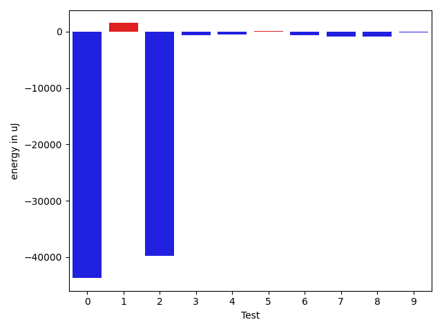
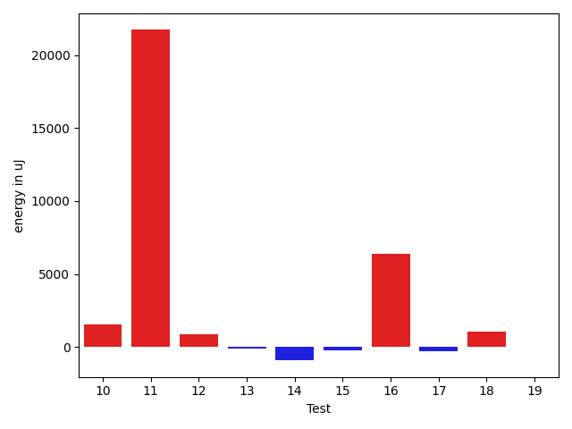
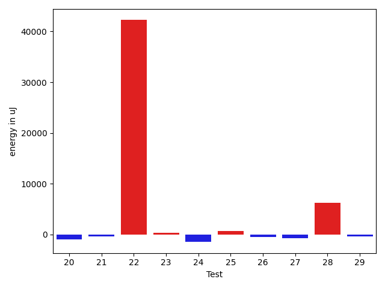
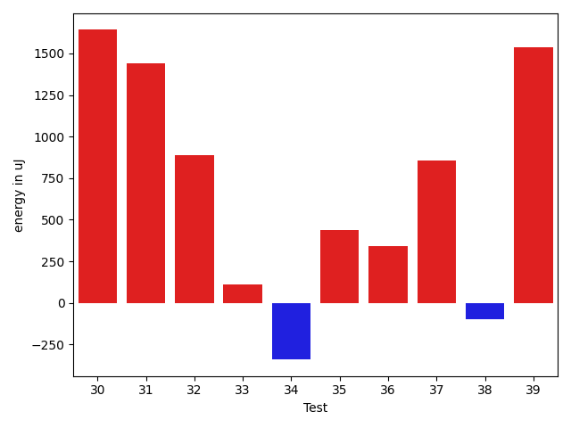
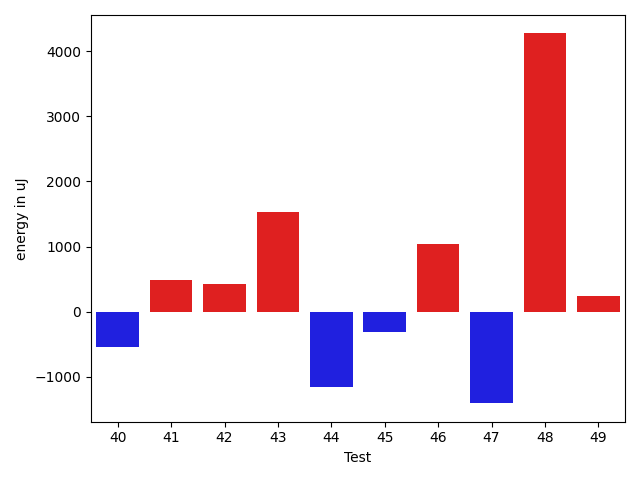
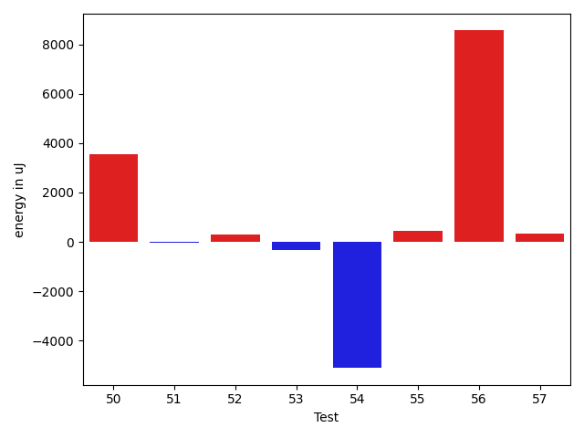

# gson e57ef0

https://github.com/google/gson/commit/e57ef0

## Delta Energy per test method

| ID | EnergyV1 | EnergyV2 | DeltaEnergy | σV1 | σV2 |
| --- | --- | --- | --- | --- | --- |
| 0 | 37231 | 37475 | 244 | 245784.51508509964 | 6829.967966292642 |
| 1 | 36071 | 36316 | 245 | 4759.0668959757195 | 6896.358907483601 |
| 2 | 36316 | 36621 | 305 | 231977.43985769522 | 4182.4480917763985 |
| 3 | 35583 | 35339 | -244 | 4666.209349941625 | 2958.4098459491706 |
| 4 | 36377 | 36804 | 427 | 3967.970912747732 | 4265.951341889335 |
| 5 | 34729 | 34607 | -122 | 4009.4427887099882 | 3882.6064089575048 |
| 6 | 36377 | 35401 | -976 | 3245.1504162342662 | 4079.070364500808 |
| 7 | 36133 | 34790 | -1343 | 2401.3234819248632 | 3108.3142955044277 |
| 8 | 36682 | 36560 | -122 | 4075.7049540085827 | 4924.629150980951 |
| 9 | 37415 | 37720 | 305 | 4072.2884637636103 | 4254.4227311193035 |
| 10 | 36132 | 35523 | -609 | 13252.652735108868 | 15307.607361303857 |
| 11 | 41687 | 42236 | 549 | 51555.854557810344 | 69181.99232626754 |
| 12 | 41442 | 41931 | 489 | 18563.524809357128 | 19003.44722306885 |
| 13 | 35827 | 35400 | -427 | 3446.5311953703767 | 3135.3407834937257 |
| 14 | 38330 | 37598 | -732 | 4286.605987128849 | 4204.812176216182 |
| 15 | 38025 | 38574 | 549 | 4551.86395877245 | 3844.57125660851 |
| 16 | 39795 | 43396 | 3601 | 25787.76684646211 | 28968.005113421394 |
| 17 | 39185 | 38757 | -428 | 4696.630892335799 | 4367.42179147347 |
| 18 | 36316 | 38514 | 2198 | 4315.2816972632845 | 5902.887605933875 |
| 19 | 34912 | 35034 | 122 | 3463.938816801361 | 3376.0136247318374 |
| 20 | 35095 | 33447 | -1648 | 3074.1387240229724 | 3573.698856198281 |
| 21 | 36377 | 35950 | -427 | 5977.558202328289 | 4607.178661738834 |
| 22 | 41809 | 43518 | 1709 | 92648.49735891545 | 135921.2003169828 |
| 23 | 38269 | 38025 | -244 | 4627.644396094825 | 4281.568914616725 |
| 24 | 39490 | 38024 | -1466 | 4392.442690883938 | 4577.8152946716955 |
| 25 | 34484 | 35950 | 1466 | 2845.0008596802977 | 2955.1936742567086 |
| 26 | 35583 | 35340 | -243 | 2570.5811264186937 | 2992.3089991266706 |
| 27 | 35705 | 35156 | -549 | 3318.292755318614 | 3893.6617982878247 |
| 28 | 38635 | 39856 | 1221 | 12721.575140741159 | 25846.858920352606 |
| 29 | 38391 | 38635 | 244 | 3942.503291575244 | 5627.453469510773 |
| 30 | 36133 | 36865 | 732 | 3503.033800230245 | 3670.9204767761457 |
| 31 | 37231 | 38269 | 1038 | 3367.775830601601 | 3726.2543896477864 |
| 32 | 38452 | 37964 | -488 | 4985.652781548598 | 3873.962261435258 |
| 33 | 38574 | 39123 | 549 | 3387.179719720553 | 3999.0006218855065 |
| 34 | 39734 | 38696 | -1038 | 3585.3596944921564 | 3828.5840348503984 |
| 35 | 40222 | 39184 | -1038 | 3414.9276270844825 | 3861.8412535570205 |
| 36 | 38086 | 39123 | 1037 | 2946.0026424226094 | 3929.9600109288644 |
| 37 | 38085 | 40223 | 2138 | 4470.28976940522 | 3515.737236454038 |
| 38 | 36987 | 38574 | 1587 | 4134.6542779613255 | 3047.571739748931 |
| 39 | 37048 | 38513 | 1465 | 3380.8975869335845 | 3279.198357997538 |
| 40 | 38330 | 37781 | -549 | 3612.71378528642 | 3155.2089744139334 |
| 41 | 38269 | 38757 | 488 | 3957.7069165088824 | 4999.4050474433825 |
| 42 | 37536 | 37964 | 428 | 4149.2198029526335 | 3381.6425545678103 |
| 43 | 36866 | 38391 | 1525 | 3840.6333468324074 | 4250.440633203679 |
| 44 | 38086 | 36926 | -1160 | 4030.835376373687 | 4030.283024408576 |
| 45 | 39490 | 39185 | -305 | 4266.171522571496 | 3412.2203342691687 |
| 46 | 38391 | 39429 | 1038 | 4644.564302180929 | 3400.458365808939 |
| 47 | 123108 | 121703 | -1405 | 764834.0909415254 | 513884.81262363866 |
| 48 | 70984 | 75256 | 4272 | 23081.23555603964 | 34895.83514225855 |
| 49 | 36805 | 37049 | 244 | 4427.307374502752 | 4404.233686956016 |
| 50 | 60242 | 59936 | -306 | 20435.2302992213 | 25772.728209139867 |
| 51 | 38391 | 37719 | -672 | 3415.008981546808 | 4225.840721822467 |
| 52 | 37354 | 36987 | -367 | 3998.918028598365 | 4249.649848127453 |
| 53 | 37842 | 37963 | 121 | 3688.087738236518 | 3475.170410748646 |
| 54 | 42785 | 41565 | -1220 | 40308.633514756155 | 33802.13170004724 |
| 55 | 38391 | 38696 | 305 | 4237.828345681968 | 4491.458431706788 |
| 56 | 41382 | 48706 | 7324 | 16045.187290898164 | 22635.635985960034 |
| 57 | 39550 | 39856 | 306 | 9707.630203933733 | 11153.63555219292 |

## Delta Duration per test method

| ID | DurationV1 | DurationsV2 | DeltaDuration |
| --- | --- | --- | --- |
| 0 | 2448900.698630137 | 1086247.880597015 | -1362652.818033122 |
| 1 | 1092997.5882352942 | 1148859.7538461538 | 55862.165610859636 |
| 2 | 1934621.6 | 707295.303030303 | -1227326.296969697 |
| 3 | 860672.5 | 841371.6078431372 | -19300.89215686277 |
| 4 | 861794.8870967742 | 896287.551724138 | 34492.66462736379 |
| 5 | 852218.6507936508 | 857672.5660377359 | 5453.915244085132 |
| 6 | 894020.2580645161 | 887175.3650793651 | -6844.892985151033 |
| 7 | 431533.1875 | 473884.61904761905 | 42351.43154761905 |
| 8 | 838756.4642857143 | 882516.9444444445 | 43760.48015873018 |
| 9 | 962571.052631579 | 980418.6610169491 | 17847.608385370113 |
| 10 | 1401494.948979592 | 1456244.1616161617 | 54749.21263656975 |
| 11 | 1679781.875 | 2435531.4324324327 | 755749.5574324327 |
| 12 | 1643197.393939394 | 1706597.9494949495 | 63400.555555555504 |
| 13 | 872586.7818181819 | 860252.0307692308 | -12334.75104895106 |
| 14 | 868324.3166666667 | 901647.34375 | 33323.02708333335 |
| 15 | 923216.8769230769 | 948877.9841269841 | 25661.107203907217 |
| 16 | 1695365.734375 | 1947629.1304347827 | 252263.3960597827 |
| 17 | 926077.7272727273 | 919544.3965517242 | -6533.33072100312 |
| 18 | 926171.4150943396 | 971660.5689655172 | 45489.15387117758 |
| 19 | 795022.9074074074 | 780895.075 | -14127.832407407463 |
| 20 | 697765.7209302326 | 745261.9487179487 | 47496.2277877162 |
| 21 | 1227554.3333333333 | 1240620.505376344 | 13066.172043010825 |
| 22 | 2369198.4342105263 | 3667068.861111111 | 1297870.4269005847 |
| 23 | 972192.6779661017 | 918793.5857142857 | -53399.09225181595 |
| 24 | 926854.5909090909 | 972851.6964285715 | 45997.10551948054 |
| 25 | 455416.46428571426 | 462579.1923076923 | 7162.728021978051 |
| 26 | 520027.15 | 548797.7586206896 | 28770.6086206896 |
| 27 | 483624.65 | 505341.4736842105 | 21716.82368421048 |
| 28 | 1190056.453125 | 1379585.5972222222 | 189529.14409722225 |
| 29 | 607984.8571428572 | 705800.7419354839 | 97815.88479262672 |
| 30 | 522645.9166666667 | 550506.5789473684 | 27860.66228070174 |
| 31 | 770855.9655172414 | 778768.7021276596 | 7912.736610418186 |
| 32 | 724271.6785714285 | 654197.0 | -70074.67857142852 |
| 33 | 593747.5217391305 | 610533.448275862 | 16785.92653673154 |
| 34 | 542715.125 | 574401.7894736842 | 31686.664473684155 |
| 35 | 551355.2692307692 | 575747.5217391305 | 24392.25250836124 |
| 36 | 501685.0 | 512768.5 | 11083.5 |
| 37 | 550581.0 | 563601.0 | 13020.0 |
| 38 | 522294.2916666667 | 478116.7037037037 | -44177.58796296298 |
| 39 | 676713.9333333333 | 712556.40625 | 35842.47291666665 |
| 40 | 623822.0 | 664810.5333333333 | 40988.533333333326 |
| 41 | 586688.0769230769 | 580911.1923076923 | -5776.884615384624 |
| 42 | 595974.1071428572 | 574176.5384615385 | -21797.568681318662 |
| 43 | 604069.3703703703 | 570285.4583333334 | -33783.912037036964 |
| 44 | 718064.9032258064 | 650024.46875 | -68040.43447580643 |
| 45 | 580526.7 | 584698.24 | 4171.540000000037 |
| 46 | 519856.82352941175 | 464526.72 | -55330.103529411776 |
| 47 | 13455107.666666666 | 7652341.898989899 | -5802765.767676767 |
| 48 | 2162837.2525252528 | 2212783.3636363638 | 49946.11111111101 |
| 49 | 854671.0681818182 | 846910.2954545454 | -7760.7727272728225 |
| 50 | 1799127.8412698412 | 1997059.985915493 | 197932.1446456518 |
| 51 | 646992.4782608695 | 618503.5384615385 | -28488.939799331012 |
| 52 | 790240.0 | 777828.4102564103 | -12411.58974358975 |
| 53 | 580867.5416666666 | 600634.5652173914 | 19767.023550724727 |
| 54 | 1789256.3846153845 | 1658874.7101449275 | -130381.67447045702 |
| 55 | 984667.7121212122 | 984412.796875 | -254.9152462121565 |
| 56 | 1332171.36 | 2076285.3333333333 | 744113.9733333332 |
| 57 | 864134.3428571429 | 1021760.7352941176 | 157626.39243697468 |

## Misc.

| ID | Test Class | Test Method |
| --- | --- | --- |
| 0 | com.google.gson.functional.CustomTypeAdaptersTest | testCustomAdapterInvokedForMapElementDeserialization |
| 1 | com.google.gson.functional.CustomTypeAdaptersTest | testCustomAdapterInvokedForMapElementSerializationWithType |
| 2 | com.google.gson.functional.CustomTypeAdaptersTest | testCustomAdapterInvokedForMapElementSerialization |
| 3 | com.google.gson.functional.MapTest | testSerializeMaps |
| 4 | com.google.gson.functional.MapTest | testMapDeserializationWithIntegerKeys |
| 5 | com.google.gson.functional.MapTest | testMapOfMapDeserialization |
| 6 | com.google.gson.functional.MapTest | testMapStandardSubclassDeserialization |
| 7 | com.google.gson.functional.MapTest | testMapWithQuotes |
| 8 | com.google.gson.functional.MapTest | testMapSerializationWithIntegerKeys |
| 9 | com.google.gson.functional.MapTest | testMapSerializationWithNullValueButSerializeNulls |
| 10 | com.google.gson.functional.MapTest | testMapSerializationWithWildcardValues |
| 11 | com.google.gson.functional.MapTest | testMapDeserialization |
| 12 | com.google.gson.functional.MapTest | testParameterizedMapSubclassSerialization |
| 13 | com.google.gson.functional.MapTest | testMapDeserializationWithWildcardValues |
| 14 | com.google.gson.functional.MapTest | testMapSerializationWithNullKey |
| 15 | com.google.gson.functional.MapTest | testMapDeserializationEmpty |
| 16 | com.google.gson.functional.MapTest | testMapSerializationWithNullValues |
| 17 | com.google.gson.functional.MapTest | testMapSerializationEmpty |
| 18 | com.google.gson.functional.MapTest | testMapDeserializationWithNullKey |
| 19 | com.google.gson.functional.MapTest | testReadMapsWithEmptyStringKey |
| 20 | com.google.gson.functional.MapTest | testMapSerializationWithNullValuesSerialized |
| 21 | com.google.gson.functional.MapTest | testParameterizedMapSubclassDeserialization |
| 22 | com.google.gson.functional.MapTest | testMapSerialization |
| 23 | com.google.gson.functional.MapTest | testMapDeserializationWithNullValue |
| 24 | com.google.gson.functional.MapTest | testMapSerializationWithNullValue |
| 25 | com.google.gson.functional.MapTest | testWriteMapsWithEmptyStringKey |
| 26 | com.google.gson.functional.MapTest | testMapSubclassSerialization |
| 27 | com.google.gson.functional.MapTest | testMapOfMapSerialization |
| 28 | com.google.gson.functional.PrettyPrintingTest | testEmptyMapField |
| 29 | com.google.gson.functional.PrettyPrintingTest | testMap |
| 30 | com.google.gson.functional.PrimitiveTest | testSmallValueForBigIntegerDeserialization |
| 31 | com.google.gson.functional.PrimitiveTest | testBigIntegerDeserialization |
| 32 | com.google.gson.functional.PrimitiveTest | testBigDecimalDeserialization |
| 33 | com.google.gson.functional.PrimitiveTest | testSmallValueForBigDecimalDeserialization |
| 34 | com.google.gson.functional.PrimitiveTest | testBigDecimalNegativeInfinityDeserializationNotSupported |
| 35 | com.google.gson.functional.PrimitiveTest | testDeserializeJsonArrayAsBigDecimal |
| 36 | com.google.gson.functional.PrimitiveTest | testDeserializeJsonObjectAsBigDecimal |
| 37 | com.google.gson.functional.PrimitiveTest | testBigDecimalNaNDeserializationNotSupported |
| 38 | com.google.gson.functional.PrimitiveTest | testDeserializeJsonArrayAsBigInteger |
| 39 | com.google.gson.functional.PrimitiveTest | testBigIntegerInASingleElementArrayDeserialization |
| 40 | com.google.gson.functional.PrimitiveTest | testBadValueForBigIntegerDeserialization |
| 41 | com.google.gson.functional.PrimitiveTest | testBigDecimalAsStringRepresentationDeserialization |
| 42 | com.google.gson.functional.PrimitiveTest | testBigDecimalPreservePrecisionDeserialization |
| 43 | com.google.gson.functional.PrimitiveTest | testBigDecimalNoFractAsStringRepresentationDeserialization |
| 44 | com.google.gson.functional.PrimitiveTest | testBigDecimalInASingleElementArrayDeserialization |
| 45 | com.google.gson.functional.PrimitiveTest | testBigDecimalInfinityDeserializationNotSupported |
| 46 | com.google.gson.functional.PrimitiveTest | testDeserializeJsonObjectAsBigInteger |
| 47 | com.google.gson.functional.TypeVariableTest | testAdvancedTypeVariables |
| 48 | com.google.gson.functional.TypeVariableTest | testTypeVariablesViaTypeParameter |
| 49 | com.google.gson.functional.DefaultTypeAdaptersTest | testBigIntegerFieldDeserialization |
| 50 | com.google.gson.functional.DefaultTypeAdaptersTest | testBigDecimalFieldDeserialization |
| 51 | com.google.gson.functional.DefaultTypeAdaptersTest | testPropertiesSerialization |
| 52 | com.google.gson.functional.DefaultTypeAdaptersTest | testBadValueForBigDecimalDeserialization |
| 53 | com.google.gson.functional.DefaultTypeAdaptersTest | testPropertiesDeserialization |
| 54 | com.google.gson.DefaultMapJsonSerializerTest | testEmptyMapSerialization |
| 55 | com.google.gson.DefaultMapJsonSerializerTest | testNonEmptyMapSerialization |
| 56 | com.google.gson.DefaultMapJsonSerializerTest | testEmptyMapNoTypeSerialization |
| 57 | com.google.gson.GsonTypeAdapterTest | testDefaultTypeAdapterThrowsParseException |

| Test | IterationV1 | IterationV2 | DeltaIteration |
| --- | --- | --- | --- |
| 0 | 73 | 67 | -6 |
| 1 | 68 | 65 | -3 |
| 2 | 35 | 33 | -2 |
| 3 | 48 | 51 | 3 |
| 4 | 62 | 58 | -4 |
| 5 | 63 | 53 | -10 |
| 6 | 62 | 63 | 1 |
| 7 | 16 | 21 | 5 |
| 8 | 56 | 54 | -2 |
| 9 | 57 | 59 | 2 |
| 10 | 98 | 99 | 1 |
| 11 | 80 | 74 | -6 |
| 12 | 99 | 99 | 0 |
| 13 | 55 | 65 | 10 |
| 14 | 60 | 64 | 4 |
| 15 | 65 | 63 | -2 |
| 16 | 64 | 69 | 5 |
| 17 | 55 | 58 | 3 |
| 18 | 53 | 58 | 5 |
| 19 | 54 | 40 | -14 |
| 20 | 43 | 39 | -4 |
| 21 | 90 | 93 | 3 |
| 22 | 76 | 72 | -4 |
| 23 | 59 | 70 | 11 |
| 24 | 66 | 56 | -10 |
| 25 | 28 | 26 | -2 |
| 26 | 20 | 29 | 9 |
| 27 | 20 | 19 | -1 |
| 28 | 64 | 72 | 8 |
| 29 | 21 | 31 | 10 |
| 30 | 24 | 19 | -5 |
| 31 | 29 | 47 | 18 |
| 32 | 28 | 23 | -5 |
| 33 | 23 | 29 | 6 |
| 34 | 24 | 19 | -5 |
| 35 | 26 | 23 | -3 |
| 36 | 21 | 20 | -1 |
| 37 | 28 | 19 | -9 |
| 38 | 24 | 27 | 3 |
| 39 | 30 | 32 | 2 |
| 40 | 33 | 30 | -3 |
| 41 | 26 | 26 | 0 |
| 42 | 28 | 26 | -2 |
| 43 | 27 | 24 | -3 |
| 44 | 31 | 32 | 1 |
| 45 | 20 | 25 | 5 |
| 46 | 17 | 25 | 8 |
| 47 | 99 | 99 | 0 |
| 48 | 99 | 99 | 0 |
| 49 | 44 | 44 | 0 |
| 50 | 63 | 71 | 8 |
| 51 | 23 | 26 | 3 |
| 52 | 33 | 39 | 6 |
| 53 | 24 | 23 | -1 |
| 54 | 52 | 69 | 17 |
| 55 | 66 | 64 | -2 |
| 56 | 25 | 30 | 5 |
| 57 | 35 | 34 | -1 |

| Time Label | Time (s) |
| --- | --- |
| Selection | 28.145917177200317 |
| Injection | 11.40543532371521 |
| Total | 1113.6726100444794 |

