# gson 0c35ed

https://github.com/google/gson/commit/0c35ed

## Delta Energy per test method

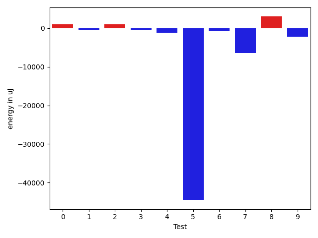

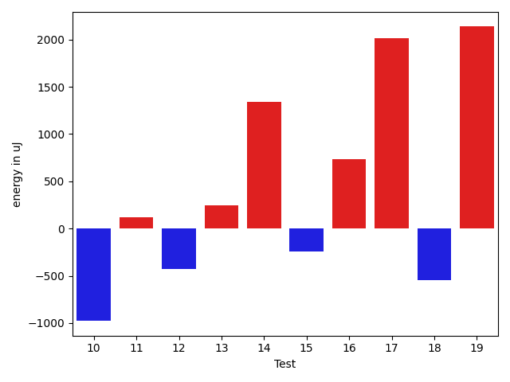

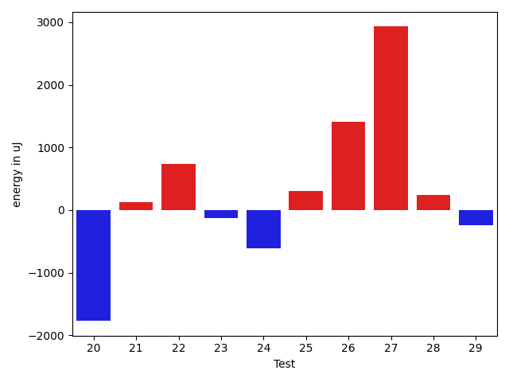

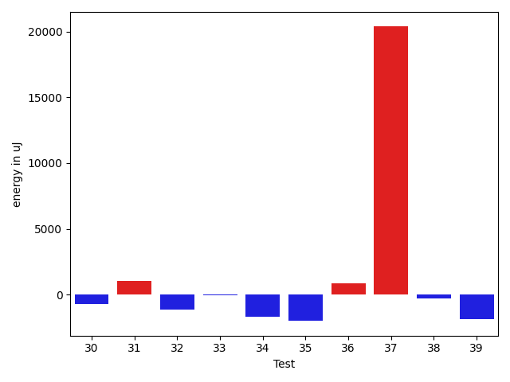

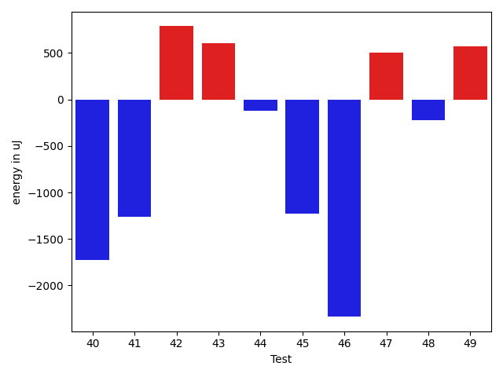

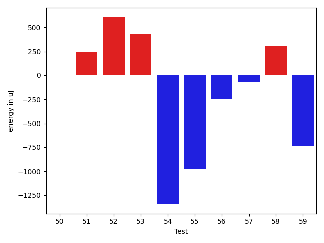

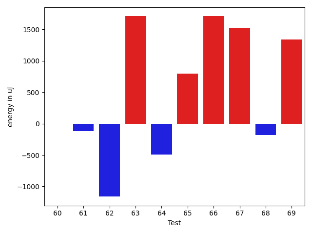

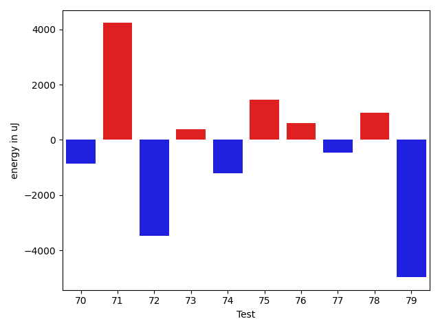

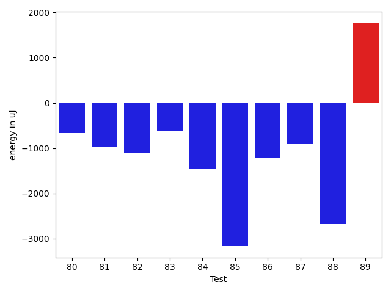

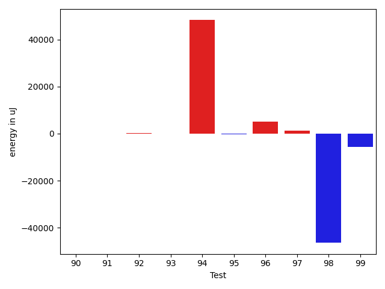

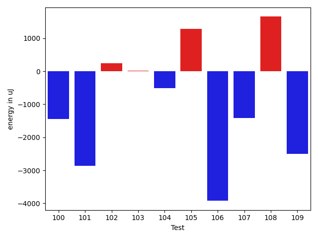

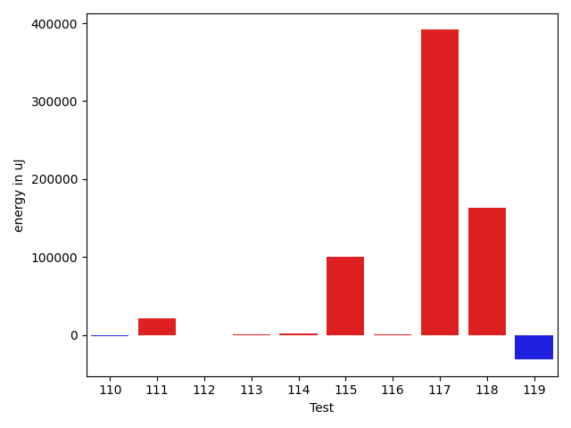

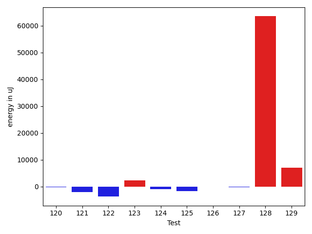

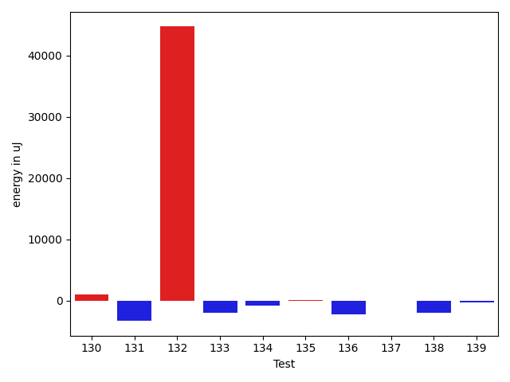

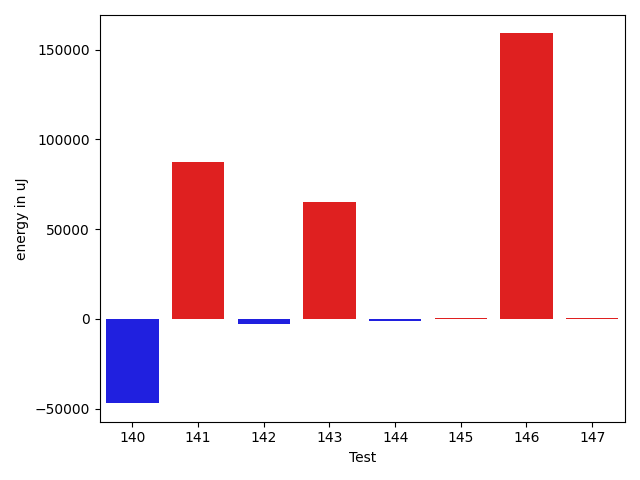

| ID | EnergyV1 | EnergyV2 | DeltaEnergy | σV1 | σV2 |
| --- | --- | --- | --- | --- | --- |
| 0 | 35034 | 35095 | 61 | 3679.9442939466853 | 7482.039892003532 |
| 1 | 36316 | 36377 | 61 | 4329.058493433117 | 3773.5577156488985 |
| 2 | 34912 | 35400 | 488 | 3505.177340378087 | 3570.113806858151 |
| 3 | 35523 | 35034 | -489 | 3766.9668479024554 | 3140.5025064558636 |
| 4 | 37781 | 37658 | -123 | 21302.07406870918 | 21214.343659544913 |
| 5 | 39551 | 39062 | -489 | 342418.629405881 | 252637.32310272288 |
| 6 | 35278 | 35095 | -183 | 7537.511299148349 | 4491.476465930814 |
| 7 | 82824 | 73365 | -9459 | 29689.08855892425 | 24556.25116707914 |
| 8 | 33875 | 35827 | 1952 | 3771.0834972266994 | 4353.825445044526 |
| 9 | 35950 | 35767 | -183 | 24421.377919659644 | 20178.762815960283 |
| 10 | 37903 | 36926 | -977 | 40334.808178766034 | 27463.858630833885 |
| 11 | 36315 | 36438 | 123 | 3652.436388220881 | 4005.7594153869063 |
| 12 | 36072 | 35645 | -427 | 3906.1162419965794 | 4430.387754063749 |
| 13 | 36560 | 36804 | 244 | 3952.214821077336 | 4433.300659581871 |
| 14 | 35827 | 37170 | 1343 | 5146.507337079413 | 8210.15990758648 |
| 15 | 35766 | 35522 | -244 | 3370.9932904407956 | 3476.7993065226133 |
| 16 | 34546 | 35278 | 732 | 3183.5135562801347 | 4106.734767648632 |
| 17 | 33813 | 35828 | 2015 | 3022.451102444284 | 2552.449997091877 |
| 18 | 38513 | 37964 | -549 | 18896.381644939982 | 19586.548601443654 |
| 19 | 100524 | 102661 | 2137 | 340343.0983932926 | 521366.02833431266 |
| 20 | 37720 | 35950 | -1770 | 5654.079706380153 | 3662.4667572848234 |
| 21 | 38574 | 38696 | 122 | 100356.86514854657 | 54942.3619010638 |
| 22 | 35462 | 36194 | 732 | 4168.168854159579 | 3747.5923908412387 |
| 23 | 36682 | 36560 | -122 | 7010.5157895902175 | 3992.7427239616313 |
| 24 | 37719 | 37110 | -609 | 3398.586436030135 | 4019.2490787490133 |
| 25 | 35706 | 36010 | 304 | 3904.9383747063757 | 3366.4246844760987 |
| 26 | 34362 | 35767 | 1405 | 3982.587450568647 | 3834.5930246663656 |
| 27 | 111206 | 114136 | 2930 | 24257.051001161115 | 28433.266334979344 |
| 28 | 35706 | 35949 | 243 | 4076.1592011928806 | 3521.71888567532 |
| 29 | 35888 | 35645 | -243 | 4322.383652167336 | 3538.900964694478 |
| 30 | 35522 | 35461 | -61 | 4072.042269816606 | 4040.3420816050825 |
| 31 | 36011 | 36194 | 183 | 4820.773358505716 | 4659.937119605552 |
| 32 | 36438 | 35340 | -1098 | 3574.9638361122747 | 3617.4632758977855 |
| 33 | 35095 | 34302 | -793 | 2092.0862888513943 | 30.5 |
| 34 | 36133 | 34851 | -1282 | 3042.3310119516213 | 3014.994942688606 |
| 35 | 35950 | 35034 | -916 | 6664.319426368057 | 4138.942099173673 |
| 36 | 78125 | 77210 | -915 | 59751.72604427765 | 54662.30347643485 |
| 37 | 90820 | 94848 | 4028 | 266817.85367971496 | 302343.275782296 |
| 38 | 35828 | 35522 | -306 | 4236.987241555982 | 4270.724002652939 |
| 39 | 37048 | 35339 | -1709 | 3953.449812864647 | 3472.3473630048006 |
| 40 | 35523 | 35400 | -123 | 6994.764368818215 | 3247.7571227093786 |
| 41 | 37293 | 36194 | -1099 | 3554.5617640434953 | 3407.467868428843 |
| 42 | 35523 | 36072 | 549 | 3256.498094221628 | 3820.395141144795 |
| 43 | 34790 | 36071 | 1281 | 4521.232051974892 | 3361.8615166725635 |
| 44 | 35584 | 35583 | -1 | 3778.6901452784978 | 3523.954161676021 |
| 45 | 36072 | 34973 | -1099 | 4049.8844479318177 | 3619.5406816464642 |
| 46 | 36377 | 35583 | -794 | 12810.929219019776 | 3722.0060496282626 |
| 47 | 35523 | 34790 | -733 | 3691.586793050461 | 4451.200966632654 |
| 48 | 36194 | 35644 | -550 | 2982.571940270492 | 4101.751124768642 |
| 49 | 35400 | 34790 | -610 | 3977.223634697018 | 3957.7074727675367 |
| 50 | 35522 | 35522 | 0 | 4017.6761844630696 | 4436.091853259529 |
| 51 | 37109 | 37353 | 244 | 18744.31710360304 | 23971.268443330697 |
| 52 | 35217 | 35827 | 610 | 4582.123968590664 | 4188.844016617896 |
| 53 | 35278 | 35706 | 428 | 3887.8812683345495 | 4286.323086138683 |
| 54 | 35950 | 34607 | -1343 | 3939.568099417622 | 4508.492264680718 |
| 55 | 36071 | 35095 | -976 | 3913.897046423169 | 4677.949372677448 |
| 56 | 35035 | 34789 | -246 | 3842.451877447911 | 3462.763852762703 |
| 57 | 36194 | 36133 | -61 | 3279.197709467634 | 4958.52669512083 |
| 58 | 39002 | 39306 | 304 | 385316.79026467155 | 458545.5484511681 |
| 59 | 40405 | 39673 | -732 | 51841.25803876244 | 44518.79696446477 |
| 60 | 37353 | 37353 | 0 | 10148.174318133999 | 11388.909959905292 |
| 61 | 39917 | 39795 | -122 | 36844.57230756655 | 37184.4767854943 |
| 62 | 36927 | 35766 | -1161 | 4118.302382543316 | 4679.704127188458 |
| 63 | 40894 | 42603 | 1709 | 547510.7822931509 | 583422.6965430726 |
| 64 | 37537 | 37048 | -489 | 3946.7938578687404 | 4453.74478582373 |
| 65 | 35461 | 36254 | 793 | 3732.589085134291 | 5197.012295540583 |
| 66 | 38574 | 40283 | 1709 | 4932.6653238117315 | 4151.266645925184 |
| 67 | 75866 | 77393 | 1527 | 27171.52223514243 | 32055.57756821604 |
| 68 | 38147 | 37964 | -183 | 18444.655620020254 | 6740.276031855077 |
| 69 | 36988 | 38330 | 1342 | 3566.822866517359 | 3127.7787490314213 |
| 70 | 36499 | 35278 | -1221 | 5524.012535267812 | 6077.807825086291 |
| 71 | 172546 | 176758 | 4212 | 288080.6426352036 | 317967.600202584 |
| 72 | 35217 | 35889 | 672 | 42729.63085624389 | 34113.20713696591 |
| 73 | 35888 | 36316 | 428 | 3941.9659018448697 | 3834.4807556450874 |
| 74 | 35583 | 35034 | -549 | 9551.734883617772 | 8192.444339077863 |
| 75 | 33936 | 35462 | 1526 | 4329.153876442465 | 4376.378154166283 |
| 76 | 35401 | 35949 | 548 | 3760.3569502137852 | 4257.502581733731 |
| 77 | 36621 | 35583 | -1038 | 4055.843148890253 | 4055.2142050065618 |
| 78 | 35095 | 37598 | 2503 | 4592.842644227058 | 3778.6772143131166 |
| 79 | 37903 | 37170 | -733 | 50394.20417326167 | 43748.889674183265 |
| 80 | 39124 | 38452 | -672 | 235456.10176961726 | 279644.8399290359 |
| 81 | 37292 | 36316 | -976 | 4137.776948152758 | 4681.540737620952 |
| 82 | 37658 | 36560 | -1098 | 4977.6378822051365 | 4692.616986000021 |
| 83 | 38452 | 37842 | -610 | 23757.99443348055 | 21970.82104997392 |
| 84 | 37659 | 36194 | -1465 | 3927.5739287741476 | 3519.452177186103 |
| 85 | 39368 | 36194 | -3174 | 3490.3534749308974 | 2862.3038576055983 |
| 86 | 37780 | 36560 | -1220 | 3844.482139702989 | 3040.3157336039953 |
| 87 | 36682 | 35766 | -916 | 3049.1332224558546 | 4098.094594049184 |
| 88 | 40527 | 37841 | -2686 | 11558.101599154978 | 6286.328751116773 |
| 89 | 35400 | 37170 | 1770 | 4157.616845050408 | 4259.903288514893 |
| 90 | 37537 | 37170 | -367 | 3926.402880852453 | 4949.374179553489 |
| 91 | 35705 | 35339 | -366 | 4424.639648350075 | 4239.290680627135 |
| 92 | 37475 | 37842 | 367 | 3183.3893822753876 | 4280.59226492131 |
| 93 | 37109 | 36255 | -854 | 5398.422927697364 | 7106.019988722582 |
| 94 | 82398 | 85204 | 2806 | 248662.9015465324 | 381529.70642114384 |
| 95 | 40100 | 39124 | -976 | 23545.87111129094 | 24818.937394121633 |
| 96 | 37475 | 37780 | 305 | 14073.231927771663 | 29582.712651044414 |
| 97 | 36255 | 38269 | 2014 | 4086.0447689339667 | 6316.231138908627 |
| 98 | 78552 | 77332 | -1220 | 424827.86245585186 | 259325.6219594682 |
| 99 | 37781 | 37231 | -550 | 22109.22608574989 | 11815.473782584377 |
| 100 | 37292 | 36621 | -671 | 7717.510672334702 | 7330.8062418348945 |
| 101 | 38025 | 37475 | -550 | 10572.775176917849 | 3893.9832274559963 |
| 102 | 35522 | 36194 | 672 | 6288.115877795174 | 5715.990633159518 |
| 103 | 35523 | 36621 | 1098 | 4372.4404810128635 | 4618.182634576997 |
| 104 | 36560 | 35096 | -1464 | 5924.384633079328 | 3747.393091269699 |
| 105 | 36804 | 37048 | 244 | 4303.6606663836255 | 6767.33475007702 |
| 106 | 39672 | 38940 | -732 | 37293.46221802076 | 27902.119966828788 |
| 107 | 36072 | 36560 | 488 | 10747.446276708577 | 7625.388707103275 |
| 108 | 36804 | 36865 | 61 | 7370.290966708517 | 11415.38029027012 |
| 109 | 37353 | 36316 | -1037 | 66174.77878598338 | 64718.324507313686 |
| 110 | 36316 | 36499 | 183 | 9375.000377007953 | 7156.633014075534 |
| 111 | 38330 | 37842 | -488 | 26781.125247527714 | 64650.23089712637 |
| 112 | 37231 | 35156 | -2075 | 4122.947256061569 | 4727.988466834577 |
| 113 | 36438 | 36621 | 183 | 4665.075019400987 | 4213.893767826075 |
| 114 | 38269 | 42419 | 4150 | 24512.99462705364 | 20632.52391329303 |
| 115 | 38574 | 38574 | 0 | 24889.730799294277 | 372664.95522297226 |
| 116 | 72021 | 72387 | 366 | 22732.386047242766 | 26214.16555910968 |
| 117 | 40345 | 35522 | -4823 | 4267.925464628723 | 716058.5880929976 |
| 118 | 39734 | 37415 | -2319 | 4311.409412825463 | 535273.0685443608 |
| 119 | 80261 | 76416 | -3845 | 350604.2801742175 | 220196.21176851148 |
| 120 | 36438 | 36621 | 183 | 4582.948815621156 | 3810.6954555135053 |
| 121 | 37536 | 35949 | -1587 | 29209.65455440469 | 33385.95473641543 |
| 122 | 37109 | 36133 | -976 | 16957.45689851082 | 15268.131876923651 |
| 123 | 37720 | 38207 | 487 | 365028.3118234177 | 372237.7839550486 |
| 124 | 34912 | 35339 | 427 | 4919.119685922376 | 3969.58666740002 |
| 125 | 37597 | 39307 | 1710 | 39291.96453266703 | 31157.001581461103 |
| 126 | 37109 | 36438 | -671 | 23287.820774077496 | 26479.259641555887 |
| 127 | 34790 | 36865 | 2075 | 4495.210862508309 | 3574.409146431582 |
| 128 | 37658 | 35278 | -2380 | 4686.183202345518 | 351639.8989114218 |
| 129 | 33203 | 35706 | 2503 | 5040.745607705273 | 24610.22326457348 |
| 130 | 37170 | 37964 | 794 | 4429.847839416776 | 4097.262829840128 |
| 131 | 38269 | 35462 | -2807 | 4466.564450031207 | 4080.5977884648823 |
| 132 | 39977 | 42358 | 2381 | 524410.7841316018 | 574375.9832293658 |
| 133 | 37597 | 35767 | -1830 | 8086.376625367874 | 4225.844401596947 |
| 134 | 38024 | 38086 | 62 | 14874.442210983232 | 10456.550106356048 |
| 135 | 37536 | 37903 | 367 | 4536.069004883708 | 5151.234596736536 |
| 136 | 37170 | 38086 | 916 | 13228.092137693688 | 8704.62496669217 |
| 137 | 39307 | 38574 | -733 | 8216.210510380348 | 10159.915090511338 |
| 138 | 38941 | 37963 | -978 | 5406.36750954678 | 3078.532999254677 |
| 139 | 37903 | 37659 | -244 | 16426.559014604412 | 17621.872355046617 |
| 140 | 39429 | 40344 | 915 | 407720.9344962541 | 226029.25754585845 |
| 141 | 37842 | 38818 | 976 | 261019.9330417621 | 485642.6289193035 |
| 142 | 38880 | 37842 | -1038 | 20423.75291263672 | 18072.915406538676 |
| 143 | 38513 | 38269 | -244 | 392920.35175012745 | 511093.35770094494 |
| 144 | 37842 | 36682 | -1160 | 3979.3439509895115 | 3301.2551778805996 |
| 145 | 39063 | 39490 | 427 | 3883.8315741392535 | 3918.4867540416667 |
| 146 | 39672 | 38269 | -1403 | 531919.0494473437 | 697551.5184332541 |
| 147 | 38574 | 40039 | 1465 | 9558.063751250453 | 8059.514882888424 |

## Delta Duration per test method

| ID | DurationV1 | DurationsV2 | DeltaDuration |
| --- | --- | --- | --- |
| 0 | 896726.5238095238 | 915120.0188679246 | 18393.49505840079 |
| 1 | 815184.8297872341 | 842763.25 | 27578.420212765923 |
| 2 | 874987.734375 | 806260.0 | -68727.734375 |
| 3 | 813302.7407407408 | 818379.9166666666 | 5077.17592592584 |
| 4 | 1153227.322580645 | 1164561.359375 | 11334.036794354906 |
| 5 | 3837514.5573770492 | 2468077.072463768 | -1369437.4849132812 |
| 6 | 943439.3770491803 | 930972.6949152543 | -12466.682133926079 |
| 7 | 2718488.5353535353 | 2667938.898989899 | -50549.63636363624 |
| 8 | 498583.125 | 496218.1538461539 | -2364.971153846127 |
| 9 | 1254624.9452054794 | 1206191.647887324 | -48433.29731815541 |
| 10 | 1255949.8909090909 | 1086435.7368421052 | -169514.1540669857 |
| 11 | 843828.56 | 809151.8367346938 | -34676.72326530621 |
| 12 | 769141.0769230769 | 752517.2 | -16623.876923076925 |
| 13 | 974293.015625 | 960678.8656716418 | -13614.149953358225 |
| 14 | 982082.8428571429 | 1008967.1111111111 | 26884.268253968214 |
| 15 | 676243.7906976744 | 679049.1702127659 | 2805.3795150915394 |
| 16 | 619175.052631579 | 613959.3333333334 | -5215.719298245618 |
| 17 | 457016.3703703704 | 468700.3333333333 | 11683.96296296292 |
| 18 | 1207041.3142857142 | 1226515.844155844 | 19474.52987012989 |
| 19 | 4651434.636363637 | 6422024.353535353 | 1770589.7171717165 |
| 20 | 952065.8793103448 | 941425.4655172414 | -10640.41379310342 |
| 21 | 2251156.589285714 | 1283545.8245614036 | -967610.7647243105 |
| 22 | 673098.3243243244 | 580936.0238095238 | -92162.30051480059 |
| 23 | 1155392.2625 | 1122280.7397260275 | -33111.52277397248 |
| 24 | 824224.4901960784 | 806487.25 | -17737.240196078434 |
| 25 | 909407.9841269841 | 893630.765625 | -15777.218501984142 |
| 26 | 593296.5172413794 | 617217.3684210526 | 23920.85117967322 |
| 27 | 3404396.9696969697 | 3444755.121212121 | 40358.151515151374 |
| 28 | 665957.9428571429 | 669062.1111111111 | 3104.168253968237 |
| 29 | 955518.671875 | 948180.2236842106 | -7338.448190789437 |
| 30 | 882699.5633802817 | 865714.1833333333 | -16985.380046948325 |
| 31 | 710398.1034482758 | 701980.8636363636 | -8417.239811912179 |
| 32 | 693745.1891891892 | 622713.8611111111 | -71031.3280780781 |
| 33 | 1092129.0 | 935333.0 | -156796.0 |
| 34 | 610834.6666666666 | 602748.9230769231 | -8085.743589743506 |
| 35 | 581076.0833333334 | 524674.5806451613 | -56401.50268817204 |
| 36 | 3033643.897959184 | 3035671.6565656564 | 2027.7586064725183 |
| 37 | 5002118.757575758 | 5597557.575757576 | 595438.8181818184 |
| 38 | 928508.5507246377 | 934991.484375 | 6482.933650362305 |
| 39 | 646112.2777777778 | 626099.1212121212 | -20013.156565656536 |
| 40 | 1053489.9066666667 | 999933.352112676 | -53556.55455399072 |
| 41 | 630113.56 | 584216.0 | -45897.560000000056 |
| 42 | 560157.1612903225 | 561774.3103448276 | 1617.1490545050474 |
| 43 | 740022.7551020408 | 772975.6222222223 | 32952.86712018144 |
| 44 | 617780.8378378379 | 609883.375 | -7897.462837837869 |
| 45 | 523331.44 | 539586.90625 | 16255.466249999998 |
| 46 | 647363.3870967742 | 531634.8857142857 | -115728.50138248852 |
| 47 | 578997.282051282 | 607801.8571428572 | 28804.575091575156 |
| 48 | 525590.8666666667 | 575655.1785714285 | 50064.311904761824 |
| 49 | 692020.25 | 765350.15 | 73329.90000000002 |
| 50 | 750428.6976744186 | 771068.2916666666 | 20639.59399224806 |
| 51 | 1282499.7419354839 | 1401334.6888888888 | 118834.94695340493 |
| 52 | 733059.0454545454 | 798053.1333333333 | 64994.08787878789 |
| 53 | 483369.43333333335 | 522289.1666666667 | 38919.73333333334 |
| 54 | 731137.2678571428 | 773513.4074074074 | 42376.139550264576 |
| 55 | 593802.0666666667 | 622726.25 | 28924.18333333335 |
| 56 | 626247.5813953489 | 713961.40625 | 87713.82485465112 |
| 57 | 607700.3555555556 | 634861.1515151515 | 27160.79595959594 |
| 58 | 4341593.161290322 | 7343154.428571428 | 3001561.2672811057 |
| 59 | 1377725.0 | 1600517.5925925926 | 222792.59259259258 |
| 60 | 756020.3243243244 | 844698.2380952381 | 88677.91377091373 |
| 61 | 1180543.95 | 1374879.1739130435 | 194335.2239130435 |
| 62 | 769270.1698113207 | 759657.3111111111 | -9612.858700209646 |
| 63 | 6153835.712121212 | 6745719.435483871 | 591883.7233626591 |
| 64 | 724272.1041666666 | 725039.9318181818 | 767.8276515151374 |
| 65 | 518348.037037037 | 455110.15 | -63237.887037037 |
| 66 | 593815.8571428572 | 570847.0882352941 | -22968.768907563062 |
| 67 | 2563846.737373737 | 2658788.8181818184 | 94942.0808080812 |
| 68 | 1085826.4590163934 | 1011393.2 | -74433.25901639345 |
| 69 | 489817.94444444444 | 478142.0909090909 | -11675.853535353555 |
| 70 | 970376.4761904762 | 965408.6551724138 | -4967.8210180624155 |
| 71 | 7093646.5050505055 | 7320822.515151516 | 227176.0101010101 |
| 72 | 1304505.8837209302 | 1169738.5853658537 | -134767.29835507646 |
| 73 | 895475.7910447761 | 862633.262295082 | -32842.52874969412 |
| 74 | 1070494.397260274 | 1022822.68 | -47671.71726027399 |
| 75 | 714512.0434782609 | 716797.8333333334 | 2285.7898550725076 |
| 76 | 602668.5757575758 | 611417.5428571429 | 8748.96709956706 |
| 77 | 855319.1 | 831587.962264151 | -23731.137735849014 |
| 78 | 565914.0322580645 | 577087.2222222222 | 11173.189964157762 |
| 79 | 1394640.4426229508 | 1256146.4603174604 | -138493.9823054904 |
| 80 | 2004781.2162162163 | 2022888.025 | 18106.808783783577 |
| 81 | 706178.7352941176 | 612725.9523809524 | -93452.78291316517 |
| 82 | 502255.9090909091 | 508420.03571428574 | 6164.126623376622 |
| 83 | 1282864.372881356 | 1171724.4126984128 | -111139.96018294315 |
| 84 | 502546.14285714284 | 484477.95 | -18068.19285714283 |
| 85 | 517930.5652173913 | 487526.6666666667 | -30403.89855072461 |
| 86 | 463842.60869565216 | 417840.75 | -46001.85869565216 |
| 87 | 451165.3846153846 | 497832.92307692306 | 46667.53846153844 |
| 88 | 821432.0277777778 | 701528.3720930233 | -119903.65568475449 |
| 89 | 448042.3333333333 | 477019.9 | 28977.56666666671 |
| 90 | 473150.1904761905 | 496279.3076923077 | 23129.117216117214 |
| 91 | 506423.3461538461 | 479707.1538461539 | -26716.192307692254 |
| 92 | 446402.85714285716 | 475593.2105263158 | 29190.353383458627 |
| 93 | 969563.75 | 1000940.6774193548 | 31376.92741935479 |
| 94 | 3623948.595959596 | 5152895.252525252 | 1528946.6565656564 |
| 95 | 1670457.163265306 | 1696810.2121212122 | 26353.04885590612 |
| 96 | 1194071.6296296297 | 1295880.17721519 | 101808.54758556024 |
| 97 | 873330.8958333334 | 849117.0 | -24213.895833333372 |
| 98 | 5649983.98989899 | 4186743.727272727 | -1463240.2626262628 |
| 99 | 977204.2631578947 | 834329.8571428572 | -142874.40601503756 |
| 100 | 845084.56 | 834187.4615384615 | -10897.098461538553 |
| 101 | 1119085.5256410257 | 1088636.5357142857 | -30448.98992674006 |
| 102 | 864200.6862745098 | 839477.7857142857 | -24722.90056022408 |
| 103 | 864831.9818181818 | 842884.779661017 | -21947.202157164807 |
| 104 | 927069.9152542372 | 873323.7636363637 | -53746.15161787358 |
| 105 | 833173.9464285715 | 842781.12 | 9607.173571428517 |
| 106 | 1647280.690909091 | 1438178.0 | -209102.69090909092 |
| 107 | 1117351.6493506494 | 1058073.4615384615 | -59278.18781218794 |
| 108 | 1223092.5164835164 | 1242232.8181818181 | 19140.301698301686 |
| 109 | 1808845.2045454546 | 1618321.1931818181 | -190524.01136363647 |
| 110 | 1156613.0759493671 | 1167043.487804878 | 10430.411855510902 |
| 111 | 772518.3617021276 | 1590035.0975609757 | 817516.7358588481 |
| 112 | 635897.9487179487 | 685519.8157894737 | 49621.86707152496 |
| 113 | 645812.2121212122 | 757441.0 | 111628.78787878784 |
| 114 | 1090813.6341463414 | 1390582.152173913 | 299768.5180275717 |
| 115 | 1020092.3095238095 | 4318350.340425532 | 3298258.0309017226 |
| 116 | 2014135.1818181819 | 2036228.5959595959 | 22093.41414141399 |
| 117 | 508452.23529411765 | 12849384.705882354 | 12340932.470588235 |
| 118 | 421522.9375 | 5466824.9130434785 | 5045301.9755434785 |
| 119 | 4186936.5555555555 | 3426495.383838384 | -760441.1717171716 |
| 120 | 622625.1891891892 | 652318.5 | 29693.31081081077 |
| 121 | 1599782.9444444445 | 1603181.391304348 | 3398.4468599034008 |
| 122 | 1248477.8923076922 | 1173942.8695652173 | -74535.02274247492 |
| 123 | 3099162.7592592593 | 3357541.2156862747 | 258378.45642701536 |
| 124 | 431872.8823529412 | 500721.4 | 68848.51764705882 |
| 125 | 1120304.1636363636 | 1089869.1698113207 | -30434.993825042853 |
| 126 | 1066874.3166666667 | 1075049.875 | 8175.558333333349 |
| 127 | 419762.90476190473 | 459696.4375 | 39933.532738095266 |
| 128 | 541415.2413793104 | 2652087.2258064514 | 2110671.984427141 |
| 129 | 515480.08 | 736633.1935483871 | 221153.11354838713 |
| 130 | 713625.6904761905 | 716978.448275862 | 3352.757799671497 |
| 131 | 547730.3333333334 | 547115.5714285715 | -614.7619047618937 |
| 132 | 5417070.23880597 | 7143941.090909091 | 1726870.8521031206 |
| 133 | 815407.5178571428 | 916615.9772727273 | 101208.45941558445 |
| 134 | 1073329.5081967213 | 1085359.0714285714 | 12029.563231850043 |
| 135 | 1078802.4933333334 | 1069023.463768116 | -9779.029565217439 |
| 136 | 1142290.6 | 1072273.6883116884 | -70016.91168831172 |
| 137 | 799854.3548387097 | 865727.28 | 65872.92516129033 |
| 138 | 548892.4838709678 | 481383.05 | -67509.43387096777 |
| 139 | 1126238.579710145 | 1223071.0476190476 | 96832.46790890256 |
| 140 | 3960933.975308642 | 2556003.802631579 | -1404930.172677063 |
| 141 | 2228583.591549296 | 4733986.153846154 | 2505402.562296858 |
| 142 | 1445381.7073170731 | 1403900.905882353 | -41480.80143472017 |
| 143 | 4254621.178571428 | 6188264.333333333 | 1933643.1547619049 |
| 144 | 673004.9705882353 | 770374.9318181818 | 97369.96122994646 |
| 145 | 592017.6363636364 | 665208.96 | 73191.32363636361 |
| 146 | 6052014.533333333 | 10663612.346153846 | 4611597.812820513 |
| 147 | 894926.1304347826 | 801462.65 | -93463.48043478257 |

## Misc.

| ID | Test Class | Test Method |
| --- | --- | --- |
| 0 | com.google.gson.functional.CustomTypeAdaptersTest | testCustomAdapterInvokedForCollectionElementDeserialization |
| 1 | com.google.gson.functional.CustomTypeAdaptersTest | testCustomTypeAdapterAppliesToSubClassesSerializedAsBaseClass |
| 2 | com.google.gson.functional.CustomTypeAdaptersTest | testCustomAdapterInvokedForMapElementDeserialization |
| 3 | com.google.gson.functional.CustomTypeAdaptersTest | testCustomAdapterInvokedForMapElementSerializationWithType |
| 4 | com.google.gson.functional.CustomTypeAdaptersTest | testCustomNestedSerializers |
| 5 | com.google.gson.functional.CustomTypeAdaptersTest | testCustomSerializers |
| 6 | com.google.gson.functional.CustomTypeAdaptersTest | testCustomNestedDeserializers |
| 7 | com.google.gson.functional.CustomTypeAdaptersTest | testCustomTypeAdapterDoesNotAppliesToSubClasses |
| 8 | com.google.gson.functional.CustomTypeAdaptersTest | testCustomAdapterInvokedForCollectionElementSerialization |
| 9 | com.google.gson.functional.CustomTypeAdaptersTest | testCustomAdapterInvokedForCollectionElementSerializationWithType |
| 10 | com.google.gson.functional.CustomTypeAdaptersTest | testCustomDeserializers |
| 11 | com.google.gson.functional.CustomTypeAdaptersTest | testCustomByteArrayDeserializerAndInstanceCreator |
| 12 | com.google.gson.functional.CustomTypeAdaptersTest | testCustomByteArraySerializer |
| 13 | com.google.gson.functional.CustomTypeAdaptersTest | testCustomDeserializerForLong |
| 14 | com.google.gson.functional.CustomTypeAdaptersTest | testCustomSerializerForLong |
| 15 | com.google.gson.functional.CustomTypeAdaptersTest | testEnsureCustomSerializerNotInvokedForNullValues |
| 16 | com.google.gson.functional.CustomTypeAdaptersTest | testEnsureCustomDeserializerNotInvokedForNullValues |
| 17 | com.google.gson.functional.CustomTypeAdaptersTest | testCustomAdapterInvokedForMapElementSerialization |
| 18 | com.google.gson.functional.MapAsArrayTypeAdapterTest | testTwoTypesCollapseToOneSerialize |
| 19 | com.google.gson.functional.MapAsArrayTypeAdapterTest | testSerializeComplexMapWithTypeAdapter |
| 20 | com.google.gson.functional.MapAsArrayTypeAdapterTest | testTwoTypesCollapseToOneDeserialize |
| 21 | com.google.gson.functional.MapTest | testSerializeMaps |
| 22 | com.google.gson.functional.MapTest | testMapSerializationWithNullValuesSerialized |
| 23 | com.google.gson.functional.MapTest | testParameterizedMapSubclassDeserialization |
| 24 | com.google.gson.functional.MapTest | testMapSerializationWithNullValueButSerializeNulls |
| 25 | com.google.gson.functional.DefaultTypeAdaptersTest | testDateSerializationWithPattern |
| 26 | com.google.gson.functional.DefaultTypeAdaptersTest | testDefaultGregorianCalendarDeserialization |
| 27 | com.google.gson.functional.DefaultTypeAdaptersTest | testDefaultDateDeserializationUsingBuilder |
| 28 | com.google.gson.functional.DefaultTypeAdaptersTest | testDefaultCalendarDeserialization |
| 29 | com.google.gson.functional.DefaultTypeAdaptersTest | testDateSerializationWithPatternNotOverridenByTypeAdapter |
| 30 | com.google.gson.functional.DefaultTypeAdaptersTest | testDateDeserializationWithPattern |
| 31 | com.google.gson.functional.DefaultTypeAdaptersTest | testSetSerialization |
| 32 | com.google.gson.functional.DefaultTypeAdaptersTest | testDefaultCalendarSerialization |
| 33 | com.google.gson.functional.DefaultTypeAdaptersTest | testDefaultDateSerializationUsingBuilder |
| 34 | com.google.gson.functional.DefaultTypeAdaptersTest | testDefaultGregorianCalendarSerialization |
| 35 | com.google.gson.functional.NamingPolicyTest | testGsonWithNonDefaultFieldNamingPolicySerialization |
| 36 | com.google.gson.functional.NamingPolicyTest | testGsonWithLowerCaseDashPolicyDeserialiation |
| 37 | com.google.gson.functional.NamingPolicyTest | testGsonDuplicateNameUsingSerializedNameFieldNamingPolicySerialization |
| 38 | com.google.gson.functional.NamingPolicyTest | testGsonWithSerializedNameFieldNamingPolicySerialization |
| 39 | com.google.gson.functional.NamingPolicyTest | testGsonWithLowerCaseUnderscorePolicySerialization |
| 40 | com.google.gson.functional.NamingPolicyTest | testDeprecatedNamingStrategy |
| 41 | com.google.gson.functional.NamingPolicyTest | testGsonWithLowerCaseUnderscorePolicyDeserialiation |
| 42 | com.google.gson.functional.NamingPolicyTest | testGsonWithUpperCamelCaseSpacesPolicyDeserialiation |
| 43 | com.google.gson.functional.NamingPolicyTest | testGsonWithSerializedNameFieldNamingPolicyDeserialization |
| 44 | com.google.gson.functional.NamingPolicyTest | testGsonWithUpperCamelCaseSpacesPolicySerialiation |
| 45 | com.google.gson.functional.NamingPolicyTest | testGsonWithNonDefaultFieldNamingPolicyDeserialiation |
| 46 | com.google.gson.functional.NamingPolicyTest | testGsonWithLowerCaseDashPolicySerialization |
| 47 | com.google.gson.functional.NullObjectAndFieldTest | testExplicitSerializationOfNullStringMembers |
| 48 | com.google.gson.functional.NullObjectAndFieldTest | testCustomSerializationOfNulls |
| 49 | com.google.gson.functional.NullObjectAndFieldTest | testPrintPrintingObjectWithNulls |
| 50 | com.google.gson.functional.NullObjectAndFieldTest | testNullWrappedPrimitiveMemberSerialization |
| 51 | com.google.gson.functional.NullObjectAndFieldTest | testExplicitSerializationOfNullArrayMembers |
| 52 | com.google.gson.functional.NullObjectAndFieldTest | testNullWrappedPrimitiveMemberDeserialization |
| 53 | com.google.gson.functional.NullObjectAndFieldTest | testCustomTypeAdapterPassesNullSerialization |
| 54 | com.google.gson.functional.NullObjectAndFieldTest | testCustomTypeAdapterPassesNullDesrialization |
| 55 | com.google.gson.functional.NullObjectAndFieldTest | testExplicitSerializationOfNullCollectionMembers |
| 56 | com.google.gson.functional.NullObjectAndFieldTest | testPrintPrintingArraysWithNulls |
| 57 | com.google.gson.functional.NullObjectAndFieldTest | testExplicitNullSetsFieldToNullDuringDeserialization |
| 58 | com.google.gson.functional.NullObjectAndFieldTest | testTopLevelNullObjectSerialization |
| 59 | com.google.gson.functional.NullObjectAndFieldTest | testExplicitSerializationOfNulls |
| 60 | com.google.gson.functional.NullObjectAndFieldTest | testExplicitDeserializationOfNulls |
| 61 | com.google.gson.functional.NullObjectAndFieldTest | testTopLevelNullObjectDeserialization |
| 62 | com.google.gson.functional.CustomSerializerTest | testSerializerReturnsNull |
| 63 | com.google.gson.functional.CustomSerializerTest | testSubClassSerializerInvokedForBaseClassFieldsHoldingSubClassInstances |
| 64 | com.google.gson.functional.CustomSerializerTest | testSubClassSerializerInvokedForBaseClassFieldsHoldingArrayOfSubClassInstances |
| 65 | com.google.gson.functional.CustomSerializerTest | testBaseClassSerializerInvokedForBaseClassFieldsHoldingSubClassInstances |
| 66 | com.google.gson.functional.CustomSerializerTest | testBaseClassSerializerInvokedForBaseClassFields |
| 67 | com.google.gson.functional.ObjectTest | testSingletonLists |
| 68 | com.google.gson.functional.ObjectTest | testInnerClassDeserialization |
| 69 | com.google.gson.functional.ObjectTest | testJsonObjectSerialization |
| 70 | com.google.gson.functional.VersioningTest | testVersionedGsonMixingSinceAndUntilDeserialization |
| 71 | com.google.gson.functional.VersioningTest | testVersionedUntilSerialization |
| 72 | com.google.gson.functional.VersioningTest | testVersionedGsonWithUnversionedClassesSerialization |
| 73 | com.google.gson.functional.VersioningTest | testVersionedClassesSerialization |
| 74 | com.google.gson.functional.VersioningTest | testVersionedGsonMixingSinceAndUntilSerialization |
| 75 | com.google.gson.functional.VersioningTest | testVersionedGsonWithUnversionedClassesDeserialization |
| 76 | com.google.gson.functional.VersioningTest | testIgnoreLaterVersionClassSerialization |
| 77 | com.google.gson.functional.VersioningTest | testVersionedClassesDeserialization |
| 78 | com.google.gson.functional.VersioningTest | testIgnoreLaterVersionClassDeserialization |
| 79 | com.google.gson.functional.VersioningTest | testVersionedUntilDeserialization |
| 80 | com.google.gson.functional.FieldExclusionTest | testDefaultInnerClassExclusion |
| 81 | com.google.gson.functional.FieldExclusionTest | testDefaultNestedStaticClassIncluded |
| 82 | com.google.gson.functional.FieldExclusionTest | testInnerClassExclusion |
| 83 | com.google.gson.functional.PrimitiveTest | testHtmlCharacterSerialization |
| 84 | com.google.gson.functional.PrimitiveTest | testDoubleNaNSerialization |
| 85 | com.google.gson.functional.PrimitiveTest | testLongAsStringDeserialization |
| 86 | com.google.gson.functional.PrimitiveTest | testNegativeInfinityFloatSerialization |
| 87 | com.google.gson.functional.PrimitiveTest | testFloatNaNSerialization |
| 88 | com.google.gson.functional.PrimitiveTest | testOverridingDefaultPrimitiveSerialization |
| 89 | com.google.gson.functional.PrimitiveTest | testDoubleInfinitySerialization |
| 90 | com.google.gson.functional.PrimitiveTest | testFloatInfinitySerialization |
| 91 | com.google.gson.functional.PrimitiveTest | testLongAsStringSerialization |
| 92 | com.google.gson.functional.PrimitiveTest | testNegativeInfinitySerialization |
| 93 | com.google.gson.functional.TypeVariableTest | testBasicTypeVariables |
| 94 | com.google.gson.functional.TypeVariableTest | testAdvancedTypeVariables |
| 95 | com.google.gson.functional.TypeVariableTest | testTypeVariablesViaTypeParameter |
| 96 | com.google.gson.functional.EnumTest | testEnumSubclassWithRegisteredTypeAdapter |
| 97 | com.google.gson.functional.ExclusionStrategyFunctionalTest | testExclusionStrategyWithMode |
| 98 | com.google.gson.functional.ExclusionStrategyFunctionalTest | testExclusionStrategySerialization |
| 99 | com.google.gson.functional.ExclusionStrategyFunctionalTest | testExclusionStrategyDeserialization |
| 100 | com.google.gson.functional.CustomDeserializerTest | testCustomDeserializerReturnsNullForTopLevelPrimitives |
| 101 | com.google.gson.functional.CustomDeserializerTest | testJsonTypeFieldBasedDeserialization |
| 102 | com.google.gson.functional.CustomDeserializerTest | testCustomDeserializerReturnsNullForArrayElements |
| 103 | com.google.gson.functional.CustomDeserializerTest | testCustomDeserializerReturnsNullForPrimitiveFields |
| 104 | com.google.gson.functional.CustomDeserializerTest | testCustomDeserializerReturnsNullForArrayElementsForArrayField |
| 105 | com.google.gson.functional.CustomDeserializerTest | testCustomDeserializerReturnsNull |
| 106 | com.google.gson.functional.CustomDeserializerTest | testCustomDeserializerReturnsNullForTopLevelObject |
| 107 | com.google.gson.functional.ParameterizedTypesTest | testParameterizedTypeWithReaderDeserialization |
| 108 | com.google.gson.functional.ParameterizedTypesTest | testParameterizedTypeWithCustomSerializer |
| 109 | com.google.gson.functional.ParameterizedTypesTest | testParameterizedTypeDeserialization |
| 110 | com.google.gson.functional.ParameterizedTypesTest | testParameterizedTypesWithCustomDeserializer |
| 111 | com.google.gson.functional.SecurityTest | testNonExecutableJsonDeserialization |
| 112 | com.google.gson.functional.SecurityTest | testJsonWithNonExectuableTokenWithConfiguredGsonDeserialization |
| 113 | com.google.gson.functional.SecurityTest | testJsonWithNonExectuableTokenWithRegularGsonDeserialization |
| 114 | com.google.gson.functional.SecurityTest | testJsonWithNonExectuableTokenSerialization |
| 115 | com.google.gson.functional.SecurityTest | testNonExecutableJsonSerialization |
| 116 | com.google.gson.functional.UncategorizedTest | testReturningDerivedClassesDuringDeserialization |
| 117 | com.google.gson.JsonObjectTest | testPropertyWithQuotes |
| 118 | com.google.gson.JsonObjectTest | testWritePropertyWithEmptyStringName |
| 119 | com.google.gson.functional.TypeHierarchyAdapterTest | testTypeHierarchy |
| 120 | com.google.gson.MixedStreamTest | testWriteDoesNotMutateState |
| 121 | com.google.gson.MixedStreamTest | testWriteHtmlSafe |
| 122 | com.google.gson.MixedStreamTest | testWriteLenient |
| 123 | com.google.gson.MixedStreamTest | testWriteMixedStreamed |
| 124 | com.google.gson.MixedStreamTest | testWriteNulls |
| 125 | com.google.gson.MixedStreamTest | testReadMixedStreamed |
| 126 | com.google.gson.MixedStreamTest | testReadClosed |
| 127 | com.google.gson.MixedStreamTest | testReadInvalidState |
| 128 | com.google.gson.MixedStreamTest | testWriteInvalidState |
| 129 | com.google.gson.MixedStreamTest | testReadNulls |
| 130 | com.google.gson.MixedStreamTest | testReaderDoesNotMutateState |
| 131 | com.google.gson.MixedStreamTest | testWriteClosed |
| 132 | com.google.gson.functional.InstanceCreatorTest | testInstanceCreatorReturnsSubTypeForTopLevelObject |
| 133 | com.google.gson.functional.InstanceCreatorTest | testInstanceCreatorReturnsBaseType |
| 134 | com.google.gson.functional.InstanceCreatorTest | testInstanceCreatorReturnsSubTypeForField |
| 135 | com.google.gson.functional.ReadersWritersTest | testReadWriteTwoStrings |
| 136 | com.google.gson.functional.ReadersWritersTest | testReadWriteTwoObjects |
| 137 | com.google.gson.functional.ReadersWritersTest | testTopLevelNullObjectSerializationWithWriterAndSerializeNulls |
| 138 | com.google.gson.functional.ReadersWritersTest | testTopLevelNullObjectDeserializationWithReaderAndSerializeNulls |
| 139 | com.google.gson.functional.CircularReferenceTest | testSelfReferenceCustomHandlerSerialization |
| 140 | com.google.gson.JsonParserTest | testReadWriteTwoObjects |
| 141 | com.google.gson.CommentsTest | testParseComments |
| 142 | com.google.gson.functional.EscapingTest | testGsonAcceptsEscapedAndNonEscapedJsonDeserialization |
| 143 | com.google.gson.DefaultMapJsonSerializerTest | testNonEmptyMapSerialization |
| 144 | com.google.gson.functional.ArrayTest | testArrayOfPrimitivesWithCustomTypeAdapter |
| 145 | com.google.gson.functional.ArrayTest | testNullsInArrayWithSerializeNullPropertySetSerialization |
| 146 | com.google.gson.GsonBuilderTest | testCreatingMoreThanOnce |
| 147 | com.google.gson.functional.PrintFormattingTest | testJsonObjectWithNullValuesSerialized |

| Test | IterationV1 | IterationV2 | DeltaIteration |
| --- | --- | --- | --- |
| 0 | 63 | 53 | -10 |
| 1 | 47 | 36 | -11 |
| 2 | 64 | 49 | -15 |
| 3 | 54 | 48 | -6 |
| 4 | 62 | 64 | 2 |
| 5 | 61 | 69 | 8 |
| 6 | 61 | 59 | -2 |
| 7 | 99 | 99 | 0 |
| 8 | 24 | 26 | 2 |
| 9 | 73 | 71 | -2 |
| 10 | 55 | 57 | 2 |
| 11 | 50 | 49 | -1 |
| 12 | 39 | 45 | 6 |
| 13 | 64 | 67 | 3 |
| 14 | 70 | 72 | 2 |
| 15 | 43 | 47 | 4 |
| 16 | 38 | 42 | 4 |
| 17 | 27 | 18 | -9 |
| 18 | 70 | 77 | 7 |
| 19 | 99 | 99 | 0 |
| 20 | 58 | 58 | 0 |
| 21 | 56 | 57 | 1 |
| 22 | 37 | 42 | 5 |
| 23 | 80 | 73 | -7 |
| 24 | 51 | 44 | -7 |
| 25 | 63 | 64 | 1 |
| 26 | 29 | 38 | 9 |
| 27 | 99 | 99 | 0 |
| 28 | 35 | 36 | 1 |
| 29 | 64 | 76 | 12 |
| 30 | 71 | 60 | -11 |
| 31 | 29 | 22 | -7 |
| 32 | 37 | 36 | -1 |
| 33 | 5 | 2 | -3 |
| 34 | 27 | 26 | -1 |
| 35 | 24 | 31 | 7 |
| 36 | 98 | 99 | 1 |
| 37 | 99 | 99 | 0 |
| 38 | 69 | 64 | -5 |
| 39 | 36 | 33 | -3 |
| 40 | 75 | 71 | -4 |
| 41 | 25 | 40 | 15 |
| 42 | 31 | 29 | -2 |
| 43 | 49 | 45 | -4 |
| 44 | 37 | 32 | -5 |
| 45 | 25 | 32 | 7 |
| 46 | 31 | 35 | 4 |
| 47 | 39 | 21 | -18 |
| 48 | 30 | 28 | -2 |
| 49 | 44 | 40 | -4 |
| 50 | 43 | 48 | 5 |
| 51 | 93 | 90 | -3 |
| 52 | 44 | 45 | 1 |
| 53 | 30 | 36 | 6 |
| 54 | 56 | 54 | -2 |
| 55 | 30 | 24 | -6 |
| 56 | 43 | 32 | -11 |
| 57 | 45 | 33 | -12 |
| 58 | 31 | 28 | -3 |
| 59 | 38 | 27 | -11 |
| 60 | 37 | 42 | 5 |
| 61 | 20 | 23 | 3 |
| 62 | 53 | 45 | -8 |
| 63 | 66 | 62 | -4 |
| 64 | 48 | 44 | -4 |
| 65 | 27 | 20 | -7 |
| 66 | 35 | 34 | -1 |
| 67 | 99 | 99 | 0 |
| 68 | 61 | 50 | -11 |
| 69 | 18 | 22 | 4 |
| 70 | 63 | 58 | -5 |
| 71 | 99 | 99 | 0 |
| 72 | 43 | 41 | -2 |
| 73 | 67 | 61 | -6 |
| 74 | 73 | 75 | 2 |
| 75 | 46 | 48 | 2 |
| 76 | 33 | 35 | 2 |
| 77 | 50 | 53 | 3 |
| 78 | 31 | 36 | 5 |
| 79 | 61 | 63 | 2 |
| 80 | 74 | 80 | 6 |
| 81 | 34 | 42 | 8 |
| 82 | 22 | 28 | 6 |
| 83 | 59 | 63 | 4 |
| 84 | 21 | 20 | -1 |
| 85 | 23 | 24 | 1 |
| 86 | 23 | 20 | -3 |
| 87 | 13 | 26 | 13 |
| 88 | 36 | 43 | 7 |
| 89 | 18 | 20 | 2 |
| 90 | 21 | 13 | -8 |
| 91 | 26 | 26 | 0 |
| 92 | 21 | 19 | -2 |
| 93 | 72 | 62 | -10 |
| 94 | 99 | 99 | 0 |
| 95 | 98 | 99 | 1 |
| 96 | 81 | 79 | -2 |
| 97 | 48 | 41 | -7 |
| 98 | 99 | 99 | 0 |
| 99 | 38 | 35 | -3 |
| 100 | 50 | 52 | 2 |
| 101 | 78 | 84 | 6 |
| 102 | 51 | 42 | -9 |
| 103 | 55 | 59 | 4 |
| 104 | 59 | 55 | -4 |
| 105 | 56 | 50 | -6 |
| 106 | 55 | 55 | 0 |
| 107 | 77 | 78 | 1 |
| 108 | 91 | 88 | -3 |
| 109 | 88 | 88 | 0 |
| 110 | 79 | 82 | 3 |
| 111 | 47 | 41 | -6 |
| 112 | 39 | 38 | -1 |
| 113 | 33 | 32 | -1 |
| 114 | 41 | 46 | 5 |
| 115 | 42 | 47 | 5 |
| 116 | 99 | 99 | 0 |
| 117 | 17 | 17 | 0 |
| 118 | 16 | 23 | 7 |
| 119 | 99 | 99 | 0 |
| 120 | 37 | 34 | -3 |
| 121 | 90 | 92 | 2 |
| 122 | 65 | 69 | 4 |
| 123 | 54 | 51 | -3 |
| 124 | 17 | 20 | 3 |
| 125 | 55 | 53 | -2 |
| 126 | 60 | 48 | -12 |
| 127 | 21 | 16 | -5 |
| 128 | 29 | 31 | 2 |
| 129 | 25 | 31 | 6 |
| 130 | 42 | 29 | -13 |
| 131 | 27 | 28 | 1 |
| 132 | 67 | 77 | 10 |
| 133 | 56 | 44 | -12 |
| 134 | 61 | 70 | 9 |
| 135 | 75 | 69 | -6 |
| 136 | 65 | 77 | 12 |
| 137 | 31 | 25 | -6 |
| 138 | 31 | 20 | -11 |
| 139 | 69 | 63 | -6 |
| 140 | 81 | 76 | -5 |
| 141 | 71 | 78 | 7 |
| 142 | 82 | 85 | 3 |
| 143 | 56 | 48 | -8 |
| 144 | 34 | 44 | 10 |
| 145 | 22 | 25 | 3 |
| 146 | 30 | 26 | -4 |
| 147 | 23 | 20 | -3 |

| Time Label | Time (s) |
| --- | --- |
| Selection | 26.907614946365356 |
| Injection | 14.156505823135376 |
| Total | 1163.5046164989471 |

