# gson e26a6d

https://github.com/google/gson/commit/e26a6d

## Delta Energy per test method

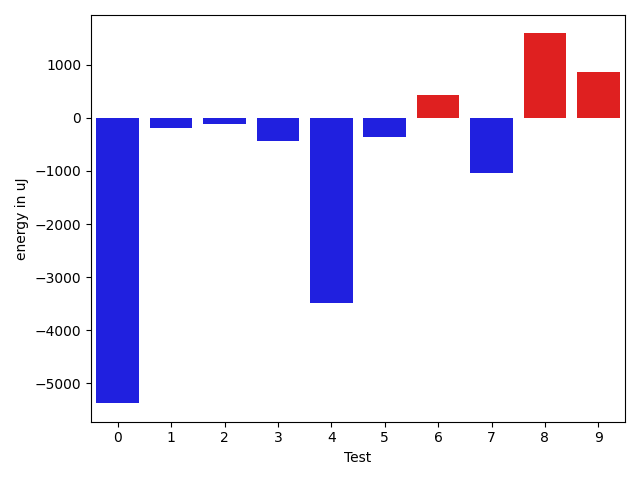

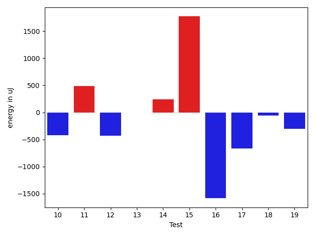

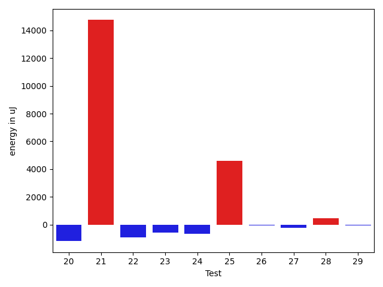

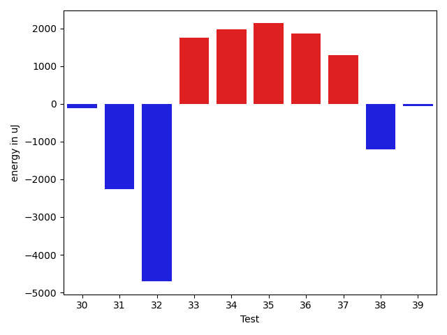

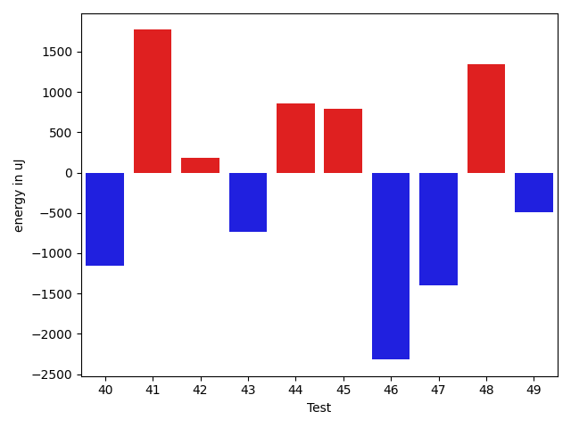

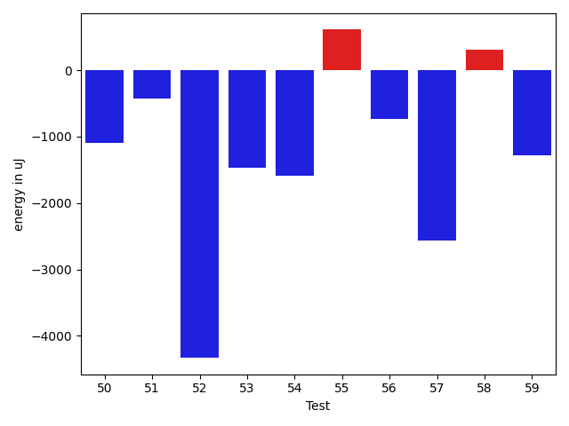

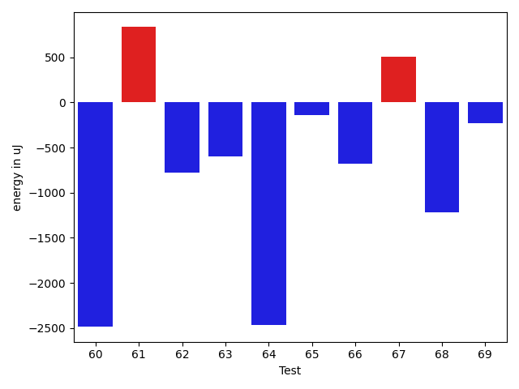

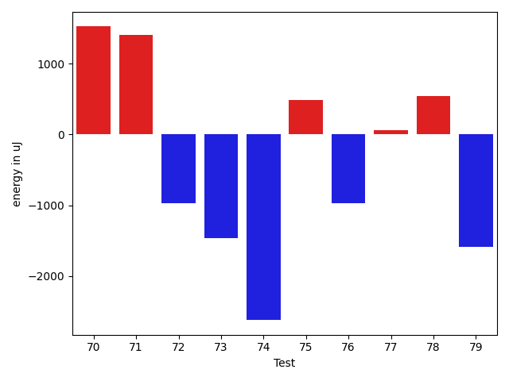

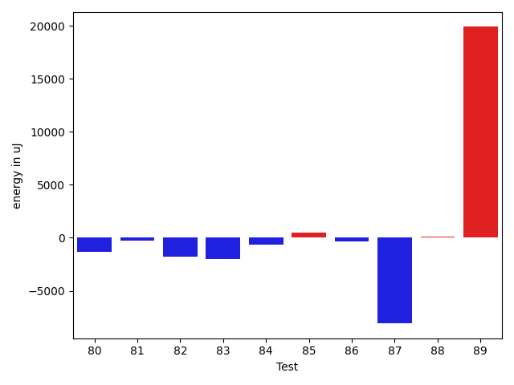

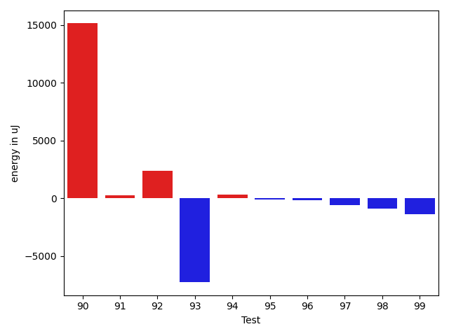

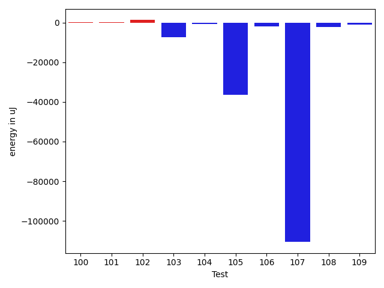

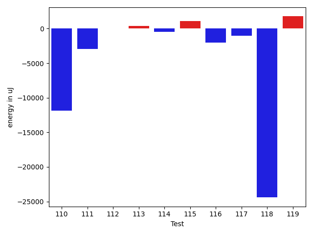

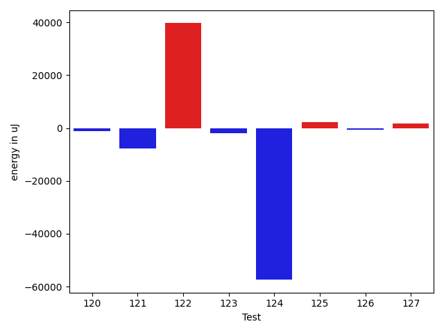

| ID | EnergyV1 | EnergyV2 | DeltaEnergy | σV1 | σV2 |
| --- | --- | --- | --- | --- | --- |
| 0 | 128540 | 123168 | -5372 | 104602.14370893476 | 115218.26185516607 |
| 1 | 38391 | 38208 | -183 | 38741.57826199939 | 49981.56214271834 |
| 2 | 39002 | 38880 | -122 | 9579.80846123648 | 6528.657557164756 |
| 3 | 37598 | 37170 | -428 | 4757.275648546541 | 3977.7176139059893 |
| 4 | 73730 | 70251 | -3479 | 58203.87624406953 | 43661.55644637951 |
| 5 | 39245 | 38879 | -366 | 41887.37443127814 | 38367.0823398139 |
| 6 | 38818 | 39245 | 427 | 14796.566154326332 | 10896.466665683125 |
| 7 | 40283 | 39246 | -1037 | 17653.76827769357 | 23734.975290957398 |
| 8 | 36865 | 38452 | 1587 | 3868.242197815169 | 3713.1673547321057 |
| 9 | 36987 | 37842 | 855 | 3688.4491851700536 | 3626.0786044369693 |
| 10 | 39367 | 38941 | -426 | 80752.20612539133 | 56928.865937305665 |
| 11 | 36804 | 37292 | 488 | 3811.341249909786 | 3342.733494819966 |
| 12 | 37171 | 36743 | -428 | 2476.4916930254662 | 4157.237747407058 |
| 13 | 37048 | 37048 | 0 | 3281.324983222624 | 11691.863109019843 |
| 14 | 36804 | 37048 | 244 | 3868.594197180535 | 4016.4059396274924 |
| 15 | 35705 | 37476 | 1771 | 2859.9858514872185 | 3752.6338370328313 |
| 16 | 38513 | 36927 | -1586 | 3219.169526069467 | 4466.488241674632 |
| 17 | 38696 | 38025 | -671 | 3809.928923221534 | 3192.4674227868877 |
| 18 | 39245 | 39185 | -60 | 114103.15842672807 | 125752.60410962456 |
| 19 | 36865 | 36560 | -305 | 4068.1900997249377 | 4146.881108415774 |
| 20 | 37232 | 35827 | -1405 | 3945.190389119389 | 4941.375170727625 |
| 21 | 40710 | 41687 | 977 | 414123.7187122183 | 490859.42107966874 |
| 22 | 38391 | 37354 | -1037 | 3430.697699984675 | 4131.844912653696 |
| 23 | 38696 | 37903 | -793 | 3860.868637399574 | 3716.3296987512977 |
| 24 | 37963 | 39002 | 1039 | 10595.9423624093 | 7824.050017777809 |
| 25 | 39184 | 38757 | -427 | 15898.23876664005 | 31015.90943642218 |
| 26 | 37475 | 37537 | 62 | 3570.262520794697 | 3859.615062885771 |
| 27 | 38330 | 39185 | 855 | 3908.7464246539316 | 3874.481108074213 |
| 28 | 38452 | 38024 | -428 | 12273.098648575511 | 13280.249035294704 |
| 29 | 38757 | 38329 | -428 | 11792.546112947963 | 11947.589486684908 |
| 30 | 36926 | 36865 | -61 | 4425.101194096564 | 3983.950931383146 |
| 31 | 38940 | 38146 | -794 | 13500.670900994824 | 12790.11120982221 |
| 32 | 38757 | 38757 | 0 | 76080.49435934734 | 64351.16391191584 |
| 33 | 74890 | 77148 | 2258 | 26474.431245345273 | 27439.29606277408 |
| 34 | 38025 | 39795 | 1770 | 15208.622896822953 | 17244.192490663063 |
| 35 | 78797 | 77698 | -1099 | 32329.8091713163 | 32777.61818942303 |
| 36 | 38940 | 38940 | 0 | 13735.9685453606 | 15790.085048601311 |
| 37 | 40527 | 40100 | -427 | 15444.227551723287 | 16688.983405836734 |
| 38 | 37842 | 36804 | -1038 | 3825.883695730234 | 3497.571210606567 |
| 39 | 36255 | 35767 | -488 | 2795.0358321370513 | 2877.532009147391 |
| 40 | 35828 | 34668 | -1160 | 3034.9627171045904 | 3641.4074600256636 |
| 41 | 35400 | 37170 | 1770 | 3503.993211104923 | 3017.3729492290527 |
| 42 | 35584 | 35767 | 183 | 2883.138231020427 | 3543.2094653795953 |
| 43 | 36010 | 35278 | -732 | 2714.0047824540907 | 2748.6716114334213 |
| 44 | 34607 | 35461 | 854 | 2958.45279884777 | 4131.733533276317 |
| 45 | 34729 | 35522 | 793 | 3679.165571400008 | 3834.4447103441703 |
| 46 | 38757 | 36437 | -2320 | 4465.736501213421 | 3010.6070961684786 |
| 47 | 39917 | 38513 | -1404 | 94425.31040022582 | 104920.64804030689 |
| 48 | 35522 | 36865 | 1343 | 2775.55948368973 | 2081.186205547371 |
| 49 | 37780 | 37292 | -488 | 12571.739182663752 | 11012.441877470741 |
| 50 | 36316 | 35217 | -1099 | 3583.434497796771 | 3307.2146830830325 |
| 51 | 36194 | 35766 | -428 | 4137.855726754148 | 3470.3132501867567 |
| 52 | 40344 | 36011 | -4333 | 4062.0788828480554 | 3873.7818607611225 |
| 53 | 36560 | 35095 | -1465 | 3622.9828668247633 | 3667.760237106538 |
| 54 | 35950 | 34363 | -1587 | 3391.607651490786 | 3162.0963301426996 |
| 55 | 35950 | 36559 | 609 | 3573.61275215992 | 4141.2396349001365 |
| 56 | 39856 | 39123 | -733 | 3183.2882426298274 | 3761.550156550742 |
| 57 | 39917 | 37354 | -2563 | 3647.9055443280745 | 3739.503801275253 |
| 58 | 34667 | 34973 | 306 | 3679.3165422551306 | 3476.375995199599 |
| 59 | 36987 | 35706 | -1281 | 13192.347967394586 | 14901.381045661252 |
| 60 | 39917 | 37048 | -2869 | 4566.476975724467 | 3547.6207176321477 |
| 61 | 34180 | 35462 | 1282 | 2747.5663758671813 | 3204.7355644120134 |
| 62 | 35156 | 35095 | -61 | 3561.098563003463 | 3425.9886083019705 |
| 63 | 36987 | 36255 | -732 | 3994.995352748326 | 2472.0795887942872 |
| 64 | 41870 | 36743 | -5127 | 6010.806027650603 | 3892.8702557757883 |
| 65 | 36499 | 35583 | -916 | 3375.973142559013 | 2080.170031511848 |
| 66 | 36499 | 36438 | -61 | 3705.968461791859 | 2814.8768349011766 |
| 67 | 35584 | 35705 | 121 | 3696.208808643449 | 2408.8919621284595 |
| 68 | 38635 | 37475 | -1160 | 3966.41958348108 | 4278.226425459504 |
| 69 | 36133 | 35888 | -245 | 4471.760472566431 | 3093.8893537638564 |
| 70 | 34973 | 36499 | 1526 | 2774.5919878356776 | 3403.7260705850354 |
| 71 | 32898 | 34302 | 1404 | 3267.7670372476405 | 3776.556936890778 |
| 72 | 35217 | 34240 | -977 | 3234.3443978020878 | 3025.9194028736097 |
| 73 | 37048 | 35584 | -1464 | 3228.4346764337665 | 3050.9699530347702 |
| 74 | 39978 | 37354 | -2624 | 4214.974362685872 | 3897.5018460547262 |
| 75 | 35156 | 35644 | 488 | 2848.265738226606 | 3457.4250150039406 |
| 76 | 36377 | 35401 | -976 | 3504.2475787207904 | 3734.842603406765 |
| 77 | 36987 | 37048 | 61 | 2759.828812202735 | 4320.869712961603 |
| 78 | 36377 | 36926 | 549 | 3465.994157774953 | 3422.1555604256314 |
| 79 | 38452 | 36865 | -1587 | 4726.415952710258 | 3706.1730585605414 |
| 80 | 37292 | 35584 | -1708 | 3858.084423438832 | 2848.4162686779864 |
| 81 | 36194 | 35828 | -366 | 3511.939621394563 | 2935.2496224377173 |
| 82 | 37476 | 36865 | -611 | 4065.385465875233 | 3007.552844275743 |
| 83 | 37354 | 35523 | -1831 | 4273.2972572580165 | 3604.320836747872 |
| 84 | 37964 | 38879 | 915 | 9377.510667672634 | 7654.320562181797 |
| 85 | 37048 | 37598 | 550 | 7310.145441907154 | 4484.221974701966 |
| 86 | 38147 | 39428 | 1281 | 7025.633858698737 | 3693.208794841269 |
| 87 | 40527 | 39490 | -1037 | 40637.5947481687 | 28829.181369860526 |
| 88 | 38330 | 38025 | -305 | 4918.386621886531 | 6055.385139989033 |
| 89 | 105957 | 96130 | -9827 | 477919.4286255553 | 490083.6815398806 |
| 90 | 45593 | 60730 | 15137 | 23946.16172969982 | 22482.959739011152 |
| 91 | 38818 | 39062 | 244 | 9960.29671294987 | 3319.945944879687 |
| 92 | 82031 | 84412 | 2381 | 403479.05251212744 | 353313.2520986518 |
| 93 | 88135 | 80871 | -7264 | 299026.77016008104 | 156259.42476964672 |
| 94 | 38269 | 38574 | 305 | 4284.508627310721 | 3666.9091238542997 |
| 95 | 39063 | 38940 | -123 | 3801.258374552602 | 4352.427326844129 |
| 96 | 38757 | 38574 | -183 | 28233.317208981625 | 41034.05295435833 |
| 97 | 40649 | 40039 | -610 | 21597.217581602414 | 20692.066678649415 |
| 98 | 38208 | 37293 | -915 | 7942.0137739725105 | 3669.9834607312355 |
| 99 | 38758 | 37414 | -1344 | 5523.454075166395 | 4989.435194661656 |
| 100 | 36560 | 36804 | 244 | 3785.3338548138654 | 3797.2105768485576 |
| 101 | 37415 | 37171 | -244 | 4203.774750963893 | 4593.326174991524 |
| 102 | 40527 | 42115 | 1588 | 18925.64009801515 | 17598.342780998544 |
| 103 | 39184 | 37963 | -1221 | 23235.2184580479 | 6641.192831701174 |
| 104 | 38696 | 38269 | -427 | 4393.262894096846 | 4387.740804467592 |
| 105 | 41565 | 39978 | -1587 | 119667.16387199977 | 42912.70897337014 |
| 106 | 40283 | 37232 | -3051 | 3488.9143375035546 | 3749.398446374754 |
| 107 | 119384 | 106323 | -13061 | 633883.8566583376 | 415254.37646403007 |
| 108 | 38330 | 37598 | -732 | 8389.092328130446 | 3644.4531802616384 |
| 109 | 39550 | 37476 | -2074 | 9627.163290940745 | 10462.25483117018 |
| 110 | 356627 | 344787 | -11840 | 109223.13667466407 | 98595.29763425322 |
| 111 | 42847 | 39917 | -2930 | 40993.06410162555 | 25812.54683874603 |
| 112 | 40161 | 40161 | 0 | 40800.26903673326 | 29765.78953427833 |
| 113 | 39185 | 39551 | 366 | 3985.735635647481 | 4113.55159118411 |
| 114 | 40527 | 40039 | -488 | 16793.523780926087 | 11725.29457237037 |
| 115 | 41809 | 42908 | 1099 | 23467.068890849594 | 33123.791547499175 |
| 116 | 40771 | 38758 | -2013 | 4146.031186973889 | 5632.957576592298 |
| 117 | 40161 | 39124 | -1037 | 44758.90649256248 | 35729.79062693169 |
| 118 | 110534 | 86120 | -24414 | 558074.2472339 | 492448.8563250646 |
| 119 | 37353 | 39124 | 1771 | 3883.1449852398737 | 8415.180294194632 |
| 120 | 40100 | 43030 | 2930 | 50761.65996813922 | 44637.49815109235 |
| 121 | 38635 | 35949 | -2686 | 20035.65810630622 | 11591.876883769346 |
| 122 | 40222 | 39856 | -366 | 38288.66870452328 | 304788.22477978846 |
| 123 | 39551 | 38818 | -733 | 16313.719902422905 | 12670.258298621939 |
| 124 | 38147 | 37231 | -916 | 338860.36459618376 | 4047.1708748210767 |
| 125 | 38208 | 40955 | 2747 | 10900.43695129308 | 10474.551722996443 |
| 126 | 40222 | 40893 | 671 | 43258.822381093596 | 37397.449516653105 |
| 127 | 38757 | 40100 | 1343 | 3699.0645202888145 | 5179.602984797663 |

## Delta Duration per test method

| ID | DurationV1 | DurationsV2 | DeltaDuration |
| --- | --- | --- | --- |
| 0 | 4756929.101010101 | 4911225.232323232 | 154296.1313131312 |
| 1 | 1353847.6956521738 | 1497388.2264150945 | 143540.53076292062 |
| 2 | 1050150.8148148148 | 1007548.6785714285 | -42602.13624338631 |
| 3 | 627424.5483870967 | 598657.6666666666 | -28766.8817204301 |
| 4 | 2551046.7083333335 | 2154132.35483871 | -396914.3534946237 |
| 5 | 1493132.671875 | 1297401.476923077 | -195731.1949519231 |
| 6 | 1365961.5421686748 | 1256341.2857142857 | -109620.25645438908 |
| 7 | 1440953.582278481 | 1412508.4761904762 | -28445.106088004773 |
| 8 | 785519.8979591837 | 832571.775510204 | 47051.877551020356 |
| 9 | 595976.1428571428 | 679680.6666666666 | 83704.52380952379 |
| 10 | 1802672.6025641025 | 1442300.0 | -360372.6025641025 |
| 11 | 804030.5416666666 | 821605.3695652174 | 17574.82789855078 |
| 12 | 615034.1111111111 | 586204.275862069 | -28829.83524904214 |
| 13 | 880119.6274509804 | 997918.2884615385 | 117798.66101055813 |
| 14 | 662191.6153846154 | 665702.8125 | 3511.1971153846243 |
| 15 | 649317.6363636364 | 723849.53125 | 74531.89488636365 |
| 16 | 602695.8275862068 | 631783.6153846154 | 29087.787798408535 |
| 17 | 594983.76 | 640639.1333333333 | 45655.37333333329 |
| 18 | 1753658.0303030303 | 1927280.1379310344 | 173622.10762800416 |
| 19 | 606287.3055555555 | 641404.0294117647 | 35116.723856209195 |
| 20 | 537425.92 | 554812.1724137932 | 17386.252413793118 |
| 21 | 4085384.0263157897 | 4284725.644736842 | 199341.61842105258 |
| 22 | 830672.0 | 783744.088888889 | -46927.911111111054 |
| 23 | 882724.5172413794 | 838321.6326530612 | -44402.88458831818 |
| 24 | 1189541.225 | 1153566.024691358 | -35975.20030864212 |
| 25 | 981444.8113207547 | 1195002.6101694915 | 213557.7988487368 |
| 26 | 822413.804347826 | 802213.0909090909 | -20200.71343873511 |
| 27 | 785720.4693877551 | 769170.8392857143 | -16549.63010204083 |
| 28 | 1367425.5567010308 | 1418625.9263157896 | 51200.36961475876 |
| 29 | 1105969.8421052631 | 1147244.0625 | 41274.220394736854 |
| 30 | 866800.8474576271 | 889951.7115384615 | 23150.864080834435 |
| 31 | 1331964.9139784947 | 1331244.5212765958 | -720.3927018989343 |
| 32 | 2095839.9772727273 | 1944932.120879121 | -150907.8563936064 |
| 33 | 2246438.1919191917 | 2352627.717171717 | 106189.52525252523 |
| 34 | 1377813.6506024096 | 1401552.551724138 | 23738.901121728355 |
| 35 | 2544782.6530612246 | 2531631.3061224488 | -13151.346938775852 |
| 36 | 1390678.9555555556 | 1378929.752688172 | -11749.202867383603 |
| 37 | 1472732.836734694 | 1474911.686868687 | 2178.8501339929644 |
| 38 | 542124.1153846154 | 555681.7916666666 | 13557.676282051252 |
| 39 | 656738.3695652174 | 609261.6176470588 | -47476.75191815861 |
| 40 | 483818.86363636365 | 466216.125 | -17602.738636363647 |
| 41 | 478109.75 | 474653.09523809527 | -3456.654761904734 |
| 42 | 413866.1153846154 | 456814.26666666666 | 42948.15128205129 |
| 43 | 430735.35714285716 | 413898.0 | -16837.35714285716 |
| 44 | 444672.85714285716 | 489612.25 | 44939.39285714284 |
| 45 | 498487.07692307694 | 447041.5 | -51445.57692307694 |
| 46 | 447908.17647058825 | 459114.5 | 11206.323529411748 |
| 47 | 1992937.576923077 | 1885358.6486486488 | -107578.92827442824 |
| 48 | 396601.85 | 402445.2631578947 | 5843.413157894742 |
| 49 | 836581.5769230769 | 849209.4705882353 | 12627.893665158423 |
| 50 | 541289.44 | 492940.8 | -48348.639999999956 |
| 51 | 400778.27777777775 | 464334.28571428574 | 63556.00793650799 |
| 52 | 585168.5925925926 | 507364.71428571426 | -77803.87830687832 |
| 53 | 467443.3181818182 | 451732.5652173913 | -15710.75296442688 |
| 54 | 583459.4324324324 | 527414.4848484849 | -56044.94758394756 |
| 55 | 683183.2 | 768673.5588235294 | 85490.35882352944 |
| 56 | 493838.14814814815 | 469507.1111111111 | -24331.037037037022 |
| 57 | 524545.5833333334 | 516476.04545454547 | -8069.537878787902 |
| 58 | 452096.71428571426 | 428508.6 | -23588.114285714284 |
| 59 | 954031.5 | 998147.5573770492 | 44116.057377049234 |
| 60 | 595785.3703703703 | 617008.9722222222 | 21223.601851851912 |
| 61 | 453871.3214285714 | 492705.8695652174 | 38834.548136645986 |
| 62 | 426727.3043478261 | 431857.36363636365 | 5130.059288537537 |
| 63 | 433020.4285714286 | 426418.5333333333 | -6601.895238095254 |
| 64 | 491430.5 | 517626.48387096776 | 26195.983870967757 |
| 65 | 373137.8947368421 | 361299.9 | -11837.994736842054 |
| 66 | 546005.3571428572 | 543124.9642857143 | -2880.3928571428405 |
| 67 | 425105.0 | 388190.6923076923 | -36914.30769230769 |
| 68 | 539518.4666666667 | 560199.5 | 20681.033333333326 |
| 69 | 442220.5652173913 | 393721.3888888889 | -48499.17632850242 |
| 70 | 439165.0 | 432710.77777777775 | -6454.222222222248 |
| 71 | 406717.4166666667 | 375285.9411764706 | -31431.475490196084 |
| 72 | 435601.1875 | 395883.7894736842 | -39717.39802631579 |
| 73 | 492027.1 | 508801.6296296296 | 16774.52962962963 |
| 74 | 540924.1363636364 | 567617.5 | 26693.363636363647 |
| 75 | 448936.4 | 418204.75 | -30731.650000000023 |
| 76 | 462004.04761904763 | 437084.7 | -24919.34761904762 |
| 77 | 491685.0 | 550002.3333333334 | 58317.33333333337 |
| 78 | 432169.23529411765 | 434180.7727272727 | 2011.5374331550556 |
| 79 | 509670.52173913043 | 497967.95 | -11702.57173913042 |
| 80 | 524274.81481481483 | 514762.1818181818 | -9512.632996633009 |
| 81 | 423449.44444444444 | 422461.23529411765 | -988.2091503267875 |
| 82 | 515426.5263157895 | 536599.3888888889 | 21172.86257309938 |
| 83 | 432102.5333333333 | 415541.36363636365 | -16561.16969696968 |
| 84 | 979271.0909090909 | 989425.676923077 | 10154.58601398603 |
| 85 | 862177.46875 | 779334.02 | -82843.44874999998 |
| 86 | 892011.5576923077 | 862935.5384615385 | -29076.01923076925 |
| 87 | 1423151.0 | 1098781.2142857143 | -324369.7857142857 |
| 88 | 979385.9253731343 | 1034944.0266666666 | 55558.101293532294 |
| 89 | 5717883.515151516 | 6391549.525252526 | 673666.0101010101 |
| 90 | 1778476.0404040404 | 1866345.6804123712 | 87869.64000833081 |
| 91 | 963971.0166666667 | 873615.5 | -90355.51666666672 |
| 92 | 5497478.826530612 | 5080726.717171717 | -416752.10935889464 |
| 93 | 4926535.878787879 | 3576182.3333333335 | -1350353.5454545454 |
| 94 | 840644.025 | 759390.8490566037 | -81253.17594339629 |
| 95 | 858506.2542372881 | 866294.4444444445 | 7788.190207156353 |
| 96 | 1320059.1014492754 | 1555062.03125 | 235002.9298007246 |
| 97 | 1535797.551020408 | 1565239.969387755 | 29442.41836734698 |
| 98 | 938771.1896551724 | 954841.8035714285 | 16070.613916256116 |
| 99 | 996337.7910447761 | 945419.7222222222 | -50918.06882255385 |
| 100 | 749946.1 | 779705.1041666666 | 29759.00416666665 |
| 101 | 731854.3488372093 | 706362.0606060605 | -25492.288231148734 |
| 102 | 1170583.4444444445 | 1312113.956521739 | 141530.51207729452 |
| 103 | 1289059.2962962964 | 1018007.0566037736 | -271052.2396925228 |
| 104 | 950873.6315789474 | 843233.1578947369 | -107640.47368421056 |
| 105 | 2515194.484848485 | 1197252.6216216215 | -1317941.8632268633 |
| 106 | 681661.3076923077 | 606097.6774193548 | -75563.63027295296 |
| 107 | 8951365.252525253 | 5915485.070707071 | -3035880.1818181826 |
| 108 | 1062135.1884057971 | 1010060.4920634921 | -52074.69634230505 |
| 109 | 1024155.6129032258 | 1115153.15625 | 90997.54334677418 |
| 110 | 9962428.070707072 | 9782438.363636363 | -179989.70707070827 |
| 111 | 1827392.75 | 1614287.097826087 | -213105.65217391308 |
| 112 | 1438393.865671642 | 1290834.350877193 | -147559.51479444886 |
| 113 | 835699.9074074074 | 724106.8444444444 | -111593.06296296301 |
| 114 | 1394959.7674418604 | 1329240.894117647 | -65718.87332421332 |
| 115 | 1363210.609375 | 1585980.046875 | 222769.4375 |
| 116 | 696413.4594594594 | 698535.4705882353 | 2122.011128775892 |
| 117 | 1284902.4186046512 | 1119966.075 | -164936.34360465128 |
| 118 | 6748337.131313131 | 6143094.626262627 | -605242.5050505046 |
| 119 | 978579.6338028169 | 982660.2727272727 | 4080.6389244558522 |
| 120 | 1736467.2 | 1717508.0588235294 | -18959.141176470555 |
| 121 | 1069291.8974358975 | 1073217.6896551724 | 3925.79221927491 |
| 122 | 1232491.1147540985 | 2588392.0625 | 1355900.9477459015 |
| 123 | 1249015.1184210526 | 1126673.5967741935 | -122341.52164685912 |
| 124 | 2500642.864864865 | 710333.3 | -1790309.5648648648 |
| 125 | 1135960.208955224 | 1140815.0 | 4854.791044776095 |
| 126 | 1247341.7659574468 | 1201382.2222222222 | -45959.54373522452 |
| 127 | 655980.0588235294 | 672058.4838709678 | 16078.425047438359 |

## Misc.

| ID | Test Class | Test Method |
| --- | --- | --- |
| 0 | com.google.gson.functional.ExposeFieldsTest | testNullExposeFieldSerialization |
| 1 | com.google.gson.functional.ExposeFieldsTest | testExposeAnnotationDeserialization |
| 2 | com.google.gson.functional.ExposeFieldsTest | testArrayWithOneNullExposeFieldObjectSerialization |
| 3 | com.google.gson.functional.ExposeFieldsTest | testExposeAnnotationSerialization |
| 4 | com.google.gson.functional.InheritanceTest | testSubInterfacesOfCollectionSerialization |
| 5 | com.google.gson.functional.InheritanceTest | testSubClassDeserialization |
| 6 | com.google.gson.functional.InheritanceTest | testSubInterfacesOfCollectionDeserialization |
| 7 | com.google.gson.functional.ObjectTest | testArrayOfArraysDeserialization |
| 8 | com.google.gson.functional.ObjectTest | testPrimitiveArrayInAnObjectDeserialization |
| 9 | com.google.gson.functional.ObjectTest | testObjectFieldNamesWithoutQuotesDeserialization |
| 10 | com.google.gson.functional.ObjectTest | testArrayOfObjectsDeserialization |
| 11 | com.google.gson.functional.ObjectTest | testNestedDeserialization |
| 12 | com.google.gson.functional.ObjectTest | testBagOfPrimitiveWrappersDeserialization |
| 13 | com.google.gson.functional.ObjectTest | testInnerClassDeserialization |
| 14 | com.google.gson.functional.ObjectTest | testJsonInMixedQuotesDeserialization |
| 15 | com.google.gson.functional.ObjectTest | testNullFieldsDeserialization |
| 16 | com.google.gson.functional.ObjectTest | testBagOfPrimitivesDeserialization |
| 17 | com.google.gson.functional.ObjectTest | testPrivateNoArgConstructorDeserialization |
| 18 | com.google.gson.functional.ObjectTest | testJsonInSingleQuotesDeserialization |
| 19 | com.google.gson.functional.ObjectTest | testClassWithTransientFieldsDeserialization |
| 20 | com.google.gson.functional.ObjectTest | testClassWithTransientFieldsDeserializationTransientFieldsPassedInJsonAreIgnored |
| 21 | com.google.gson.JsonParserTest | testReadWriteTwoObjects |
| 22 | com.google.gson.functional.MapTest | testMapDeserializationWithIntegerKeys |
| 23 | com.google.gson.functional.MapTest | testMapDeserializationWithNullKey |
| 24 | com.google.gson.functional.MapTest | testParameterizedMapSubclassDeserialization |
| 25 | com.google.gson.functional.MapTest | testMapDeserialization |
| 26 | com.google.gson.functional.MapTest | testMapDeserializationWithWildcardValues |
| 27 | com.google.gson.functional.MapTest | testReadMapsWithEmptyStringKey |
| 28 | com.google.gson.functional.ParameterizedTypesTest | testVariableTypeArrayDeserialization |
| 29 | com.google.gson.functional.ParameterizedTypesTest | testParameterizedTypeWithReaderDeserialization |
| 30 | com.google.gson.functional.ParameterizedTypesTest | testDeepParameterizedTypeDeserialization |
| 31 | com.google.gson.functional.ParameterizedTypesTest | testVariableTypeDeserialization |
| 32 | com.google.gson.functional.ParameterizedTypesTest | testParameterizedTypeDeserialization |
| 33 | com.google.gson.functional.ParameterizedTypesTest | testVariableTypeFieldsAndGenericArraysDeserialization |
| 34 | com.google.gson.functional.ParameterizedTypesTest | testTypesWithMultipleParametersDeserialization |
| 35 | com.google.gson.functional.ParameterizedTypesTest | testTypesWithMultipleParametersSerialization |
| 36 | com.google.gson.functional.ParameterizedTypesTest | testParameterizedTypeWithVariableTypeDeserialization |
| 37 | com.google.gson.functional.ParameterizedTypesTest | testParameterizedTypeGenericArraysDeserialization |
| 38 | com.google.gson.functional.PrimitiveTest | testDoubleAsStringRepresentationDeserialization |
| 39 | com.google.gson.functional.PrimitiveTest | testBigIntegerDeserialization |
| 40 | com.google.gson.functional.PrimitiveTest | testDoubleInfinityDeserialization |
| 41 | com.google.gson.functional.PrimitiveTest | testNegativeInfinityDeserialization |
| 42 | com.google.gson.functional.PrimitiveTest | testNegativeInfinitySerialization |
| 43 | com.google.gson.functional.PrimitiveTest | testFloatInfinitySerialization |
| 44 | com.google.gson.functional.PrimitiveTest | testNegativeInfinityFloatDeserialization |
| 45 | com.google.gson.functional.PrimitiveTest | testFloatInfinityDeserialization |
| 46 | com.google.gson.functional.PrimitiveTest | testBigDecimalDeserialization |
| 47 | com.google.gson.functional.PrimitiveTest | testPrimitiveIntegerAutoboxedInASingleElementArrayDeserialization |
| 48 | com.google.gson.functional.PrimitiveTest | testNegativeInfinityFloatSerialization |
| 49 | com.google.gson.functional.PrimitiveTest | testNumberDeserialization |
| 50 | com.google.gson.functional.PrimitiveTest | testBadValueForBigIntegerDeserialization |
| 51 | com.google.gson.functional.PrimitiveTest | testBigDecimalNegativeInfinityDeserializationNotSupported |
| 52 | com.google.gson.functional.PrimitiveTest | testPrimitiveBooleanAutoboxedInASingleElementArrayDeserialization |
| 53 | com.google.gson.functional.PrimitiveTest | testFloatNaNDeserialization |
| 54 | com.google.gson.functional.PrimitiveTest | testDoubleNaNDeserialization |
| 55 | com.google.gson.functional.PrimitiveTest | testPrimitiveDoubleAutoboxedDeserialization |
| 56 | com.google.gson.functional.PrimitiveTest | testPrimitiveLongAutoboxedInASingleElementArrayDeserialization |
| 57 | com.google.gson.functional.PrimitiveTest | testPrimitiveLongAutoboxedDeserialization |
| 58 | com.google.gson.functional.PrimitiveTest | testBigDecimalNaNDeserializationNotSupported |
| 59 | com.google.gson.functional.PrimitiveTest | testDeserializePrimitiveWrapperAsObjectField |
| 60 | com.google.gson.functional.PrimitiveTest | testPrimitiveBooleanAutoboxedDeserialization |
| 61 | com.google.gson.functional.PrimitiveTest | testLongAsStringDeserialization |
| 62 | com.google.gson.functional.PrimitiveTest | testPrimitiveClassLiteral |
| 63 | com.google.gson.functional.PrimitiveTest | testSmallValueForBigDecimalDeserialization |
| 64 | com.google.gson.functional.PrimitiveTest | testReallyLongValuesDeserialization |
| 65 | com.google.gson.functional.PrimitiveTest | testNegativeInfinitySerializationNotSupportedByDefault |
| 66 | com.google.gson.functional.PrimitiveTest | testBigIntegerInASingleElementArrayDeserialization |
| 67 | com.google.gson.functional.PrimitiveTest | testDoubleInfinitySerialization |
| 68 | com.google.gson.functional.PrimitiveTest | testPrimitiveDoubleAutoboxedInASingleElementArraySerialization |
| 69 | com.google.gson.functional.PrimitiveTest | testBigDecimalInfinityDeserializationNotSupported |
| 70 | com.google.gson.functional.PrimitiveTest | testDoubleNaNSerializationNotSupportedByDefault |
| 71 | com.google.gson.functional.PrimitiveTest | testDoubleInfinitySerializationNotSupportedByDefault |
| 72 | com.google.gson.functional.PrimitiveTest | testDoubleNaNSerialization |
| 73 | com.google.gson.functional.PrimitiveTest | testBigDecimalInASingleElementArrayDeserialization |
| 74 | com.google.gson.functional.PrimitiveTest | testPrimitiveIntegerAutoboxedDeserialization |
| 75 | com.google.gson.functional.PrimitiveTest | testFloatNaNSerialization |
| 76 | com.google.gson.functional.PrimitiveTest | testBigDecimalAsStringRepresentationDeserialization |
| 77 | com.google.gson.functional.PrimitiveTest | testPrimitiveDoubleAutoboxedSerialization |
| 78 | com.google.gson.functional.PrimitiveTest | testBigDecimalNoFractAsStringRepresentationDeserialization |
| 79 | com.google.gson.functional.PrimitiveTest | testLargeDoubleDeserialization |
| 80 | com.google.gson.functional.PrimitiveTest | testPrimitiveDoubleAutoboxedInASingleElementArrayDeserialization |
| 81 | com.google.gson.functional.PrimitiveTest | testBigDecimalPreservePrecisionDeserialization |
| 82 | com.google.gson.functional.PrimitiveTest | testDoubleNoFractAsStringRepresentationDeserialization |
| 83 | com.google.gson.functional.PrimitiveTest | testSmallValueForBigIntegerDeserialization |
| 84 | com.google.gson.functional.VersioningTest | testVersionedGsonMixingSinceAndUntilDeserialization |
| 85 | com.google.gson.functional.VersioningTest | testVersionedGsonWithUnversionedClassesDeserialization |
| 86 | com.google.gson.functional.VersioningTest | testVersionedClassesDeserialization |
| 87 | com.google.gson.functional.VersioningTest | testVersionedUntilDeserialization |
| 88 | com.google.gson.functional.TypeVariableTest | testBasicTypeVariables |
| 89 | com.google.gson.functional.TypeVariableTest | testAdvancedTypeVariables |
| 90 | com.google.gson.functional.TypeVariableTest | testTypeVariablesViaTypeParameter |
| 91 | com.google.gson.functional.ExclusionStrategyFunctionalTest | testExclusionStrategyWithMode |
| 92 | com.google.gson.functional.ExclusionStrategyFunctionalTest | testExclusionStrategyDeserialization |
| 93 | com.google.gson.functional.NamingPolicyTest | testGsonDuplicateNameUsingSerializedNameFieldNamingPolicySerialization |
| 94 | com.google.gson.functional.NamingPolicyTest | testGsonWithSerializedNameFieldNamingPolicyDeserialization |
| 95 | com.google.gson.functional.CollectionTest | testWildcardPrimitiveCollectionDeserilaization |
| 96 | com.google.gson.functional.CollectionTest | testTopLevelCollectionOfIntegersDeserialization |
| 97 | com.google.gson.functional.CollectionTest | testWildcardCollectionField |
| 98 | com.google.gson.functional.CollectionTest | testSetDeserialization |
| 99 | com.google.gson.functional.CollectionTest | testTopLevelListOfIntegerCollectionsDeserialization |
| 100 | com.google.gson.functional.DefaultTypeAdaptersTest | testBigIntegerFieldDeserialization |
| 101 | com.google.gson.functional.DefaultTypeAdaptersTest | testBadValueForBigDecimalDeserialization |
| 102 | com.google.gson.functional.DefaultTypeAdaptersTest | testBigDecimalFieldDeserialization |
| 103 | com.google.gson.functional.JsonParserTest | testChangingCustomTreeAndDeserializing |
| 104 | com.google.gson.functional.JsonParserTest | testBadFieldTypeForDeserializingCustomTree |
| 105 | com.google.gson.functional.JsonParserTest | testDeserializingCustomTree |
| 106 | com.google.gson.functional.JsonParserTest | testBadFieldTypeForCustomDeserializerCustomTree |
| 107 | com.google.gson.functional.MapAsArrayTypeAdapterTest | testSerializeComplexMapWithTypeAdapter |
| 108 | com.google.gson.functional.MapAsArrayTypeAdapterTest | testTwoTypesCollapseToOneDeserialize |
| 109 | com.google.gson.functional.CustomTypeAdaptersTest | testCustomNestedDeserializers |
| 110 | com.google.gson.functional.ConcurrencyTest | testMultiThreadDeserialization |
| 111 | com.google.gson.functional.ConcurrencyTest | testSingleThreadDeserialization |
| 112 | com.google.gson.functional.EscapingTest | testEscapingObjectFields |
| 113 | com.google.gson.functional.EscapingTest | testGsonDoubleDeserialization |
| 114 | com.google.gson.functional.EscapingTest | testGsonAcceptsEscapedAndNonEscapedJsonDeserialization |
| 115 | com.google.gson.functional.JsonTreeTest | testJsonTreeToString |
| 116 | com.google.gson.functional.SecurityTest | testJsonWithNonExectuableTokenWithConfiguredGsonDeserialization |
| 117 | com.google.gson.functional.SecurityTest | testNonExecutableJsonDeserialization |
| 118 | com.google.gson.functional.TypeHierarchyAdapterTest | testTypeHierarchy |
| 119 | com.google.gson.functional.ArrayTest | testArrayOfCollectionDeserialization |
| 120 | com.google.gson.functional.ArrayTest | testTopLevelArrayOfIntsDeserialization |
| 121 | com.google.gson.functional.ArrayTest | testArrayOfPrimitivesAsObjectsSerialization |
| 122 | com.google.gson.MixedStreamTest | testReadMixedStreamed |
| 123 | com.google.gson.MixedStreamTest | testWriteLenient |
| 124 | com.google.gson.MixedStreamTest | testReaderDoesNotMutateState |
| 125 | com.google.gson.functional.ReadersWritersTest | testReadWriteTwoObjects |
| 126 | com.google.gson.functional.ReadersWritersTest | testReaderForDeserialization |
| 127 | com.google.gson.GsonTypeAdapterTest | testDefaultTypeAdapterThrowsParseException |

| Test | IterationV1 | IterationV2 | DeltaIteration |
| --- | --- | --- | --- |
| 0 | 99 | 99 | 0 |
| 1 | 46 | 53 | 7 |
| 2 | 54 | 56 | 2 |
| 3 | 31 | 33 | 2 |
| 4 | 96 | 93 | -3 |
| 5 | 64 | 65 | 1 |
| 6 | 83 | 84 | 1 |
| 7 | 79 | 84 | 5 |
| 8 | 49 | 49 | 0 |
| 9 | 28 | 30 | 2 |
| 10 | 78 | 76 | -2 |
| 11 | 48 | 46 | -2 |
| 12 | 27 | 29 | 2 |
| 13 | 51 | 52 | 1 |
| 14 | 39 | 32 | -7 |
| 15 | 33 | 32 | -1 |
| 16 | 29 | 26 | -3 |
| 17 | 25 | 30 | 5 |
| 18 | 33 | 29 | -4 |
| 19 | 36 | 34 | -2 |
| 20 | 25 | 29 | 4 |
| 21 | 76 | 76 | 0 |
| 22 | 58 | 45 | -13 |
| 23 | 58 | 49 | -9 |
| 24 | 80 | 81 | 1 |
| 25 | 53 | 59 | 6 |
| 26 | 46 | 66 | 20 |
| 27 | 49 | 56 | 7 |
| 28 | 97 | 95 | -2 |
| 29 | 76 | 80 | 4 |
| 30 | 59 | 52 | -7 |
| 31 | 93 | 94 | 1 |
| 32 | 88 | 91 | 3 |
| 33 | 99 | 99 | 0 |
| 34 | 83 | 87 | 4 |
| 35 | 98 | 98 | 0 |
| 36 | 90 | 93 | 3 |
| 37 | 98 | 99 | 1 |
| 38 | 26 | 24 | -2 |
| 39 | 46 | 34 | -12 |
| 40 | 22 | 24 | 2 |
| 41 | 28 | 21 | -7 |
| 42 | 26 | 15 | -11 |
| 43 | 14 | 20 | 6 |
| 44 | 28 | 20 | -8 |
| 45 | 26 | 26 | 0 |
| 46 | 17 | 20 | 3 |
| 47 | 26 | 37 | 11 |
| 48 | 20 | 19 | -1 |
| 49 | 26 | 34 | 8 |
| 50 | 25 | 25 | 0 |
| 51 | 18 | 21 | 3 |
| 52 | 27 | 21 | -6 |
| 53 | 22 | 23 | 1 |
| 54 | 37 | 33 | -4 |
| 55 | 25 | 34 | 9 |
| 56 | 27 | 18 | -9 |
| 57 | 36 | 22 | -14 |
| 58 | 28 | 20 | -8 |
| 59 | 62 | 61 | -1 |
| 60 | 27 | 36 | 9 |
| 61 | 28 | 23 | -5 |
| 62 | 23 | 22 | -1 |
| 63 | 21 | 15 | -6 |
| 64 | 14 | 31 | 17 |
| 65 | 19 | 10 | -9 |
| 66 | 28 | 28 | 0 |
| 67 | 17 | 13 | -4 |
| 68 | 30 | 20 | -10 |
| 69 | 23 | 18 | -5 |
| 70 | 17 | 18 | 1 |
| 71 | 12 | 17 | 5 |
| 72 | 16 | 19 | 3 |
| 73 | 20 | 27 | 7 |
| 74 | 22 | 20 | -2 |
| 75 | 15 | 24 | 9 |
| 76 | 21 | 30 | 9 |
| 77 | 17 | 24 | 7 |
| 78 | 17 | 22 | 5 |
| 79 | 23 | 20 | -3 |
| 80 | 27 | 22 | -5 |
| 81 | 18 | 17 | -1 |
| 82 | 19 | 18 | -1 |
| 83 | 15 | 22 | 7 |
| 84 | 66 | 65 | -1 |
| 85 | 32 | 50 | 18 |
| 86 | 52 | 52 | 0 |
| 87 | 60 | 56 | -4 |
| 88 | 67 | 75 | 8 |
| 89 | 99 | 99 | 0 |
| 90 | 99 | 97 | -2 |
| 91 | 60 | 52 | -8 |
| 92 | 98 | 99 | 1 |
| 93 | 99 | 99 | 0 |
| 94 | 40 | 53 | 13 |
| 95 | 59 | 54 | -5 |
| 96 | 69 | 64 | -5 |
| 97 | 98 | 98 | 0 |
| 98 | 58 | 56 | -2 |
| 99 | 67 | 72 | 5 |
| 100 | 50 | 48 | -2 |
| 101 | 43 | 33 | -10 |
| 102 | 36 | 46 | 10 |
| 103 | 54 | 53 | -1 |
| 104 | 38 | 57 | 19 |
| 105 | 33 | 37 | 4 |
| 106 | 26 | 31 | 5 |
| 107 | 99 | 99 | 0 |
| 108 | 69 | 63 | -6 |
| 109 | 62 | 64 | 2 |
| 110 | 99 | 99 | 0 |
| 111 | 92 | 92 | 0 |
| 112 | 67 | 57 | -10 |
| 113 | 54 | 45 | -9 |
| 114 | 86 | 85 | -1 |
| 115 | 64 | 64 | 0 |
| 116 | 37 | 34 | -3 |
| 117 | 43 | 40 | -3 |
| 118 | 99 | 99 | 0 |
| 119 | 71 | 55 | -16 |
| 120 | 45 | 51 | 6 |
| 121 | 39 | 29 | -10 |
| 122 | 61 | 48 | -13 |
| 123 | 76 | 62 | -14 |
| 124 | 37 | 40 | 3 |
| 125 | 67 | 67 | 0 |
| 126 | 47 | 45 | -2 |
| 127 | 34 | 31 | -3 |

| Time Label | Time (s) |
| --- | --- |
| Selection | 27.553061723709106 |
| Injection | 13.505283832550049 |
| Total | 1158.1744585037231 |

