# gson 43137b

https://github.com/google/gson/commit/43137b

## Delta Energy per test method

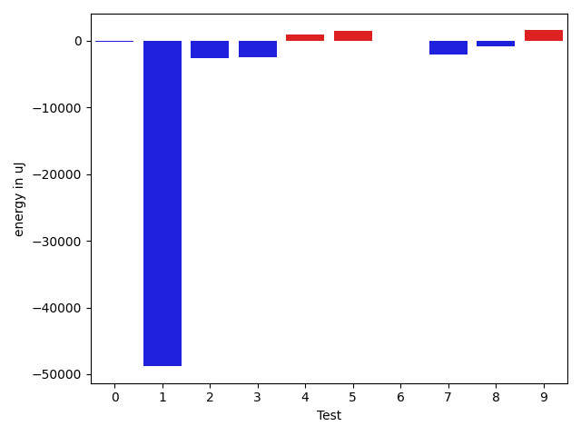

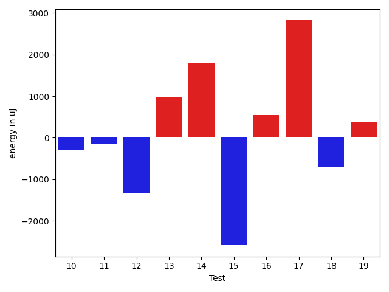

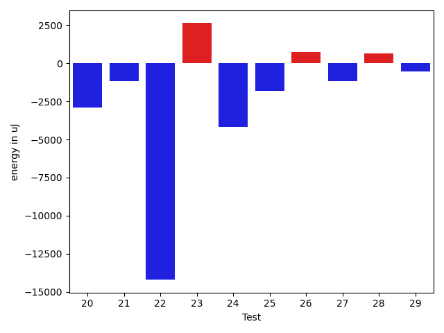

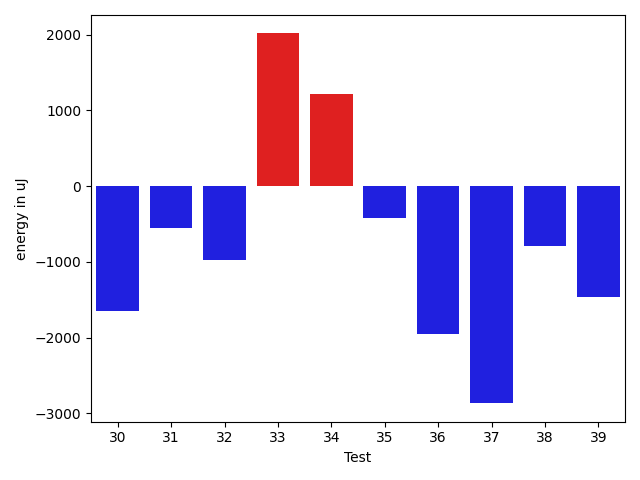

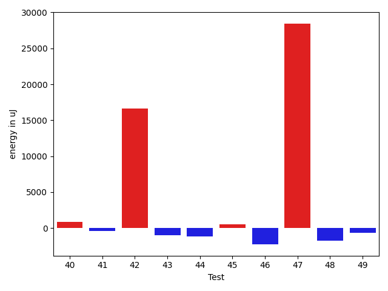

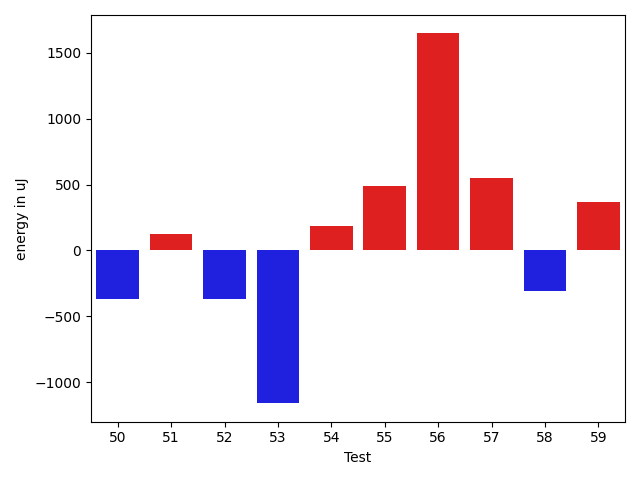

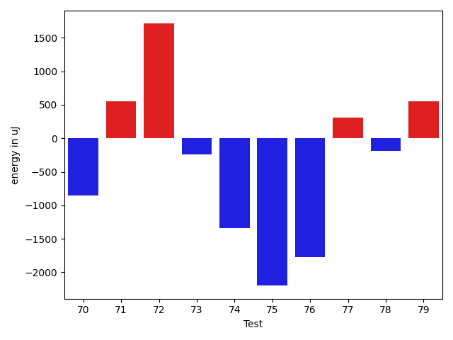

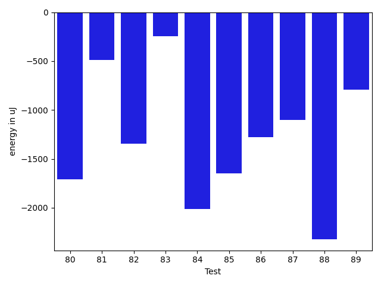

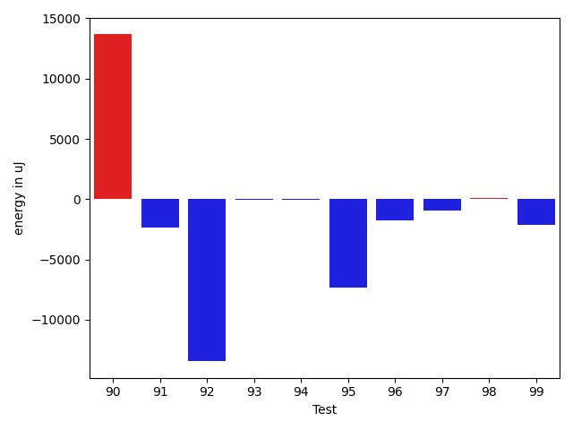

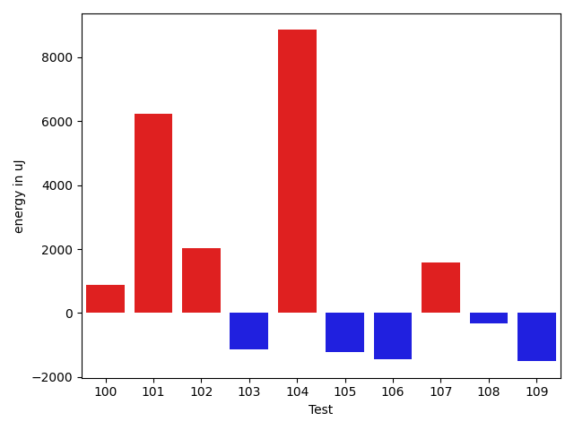

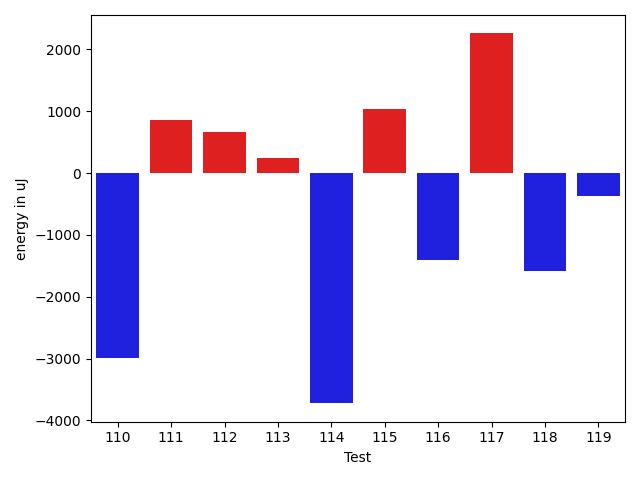

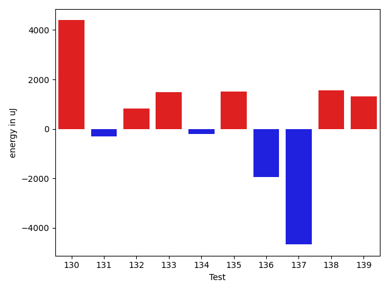

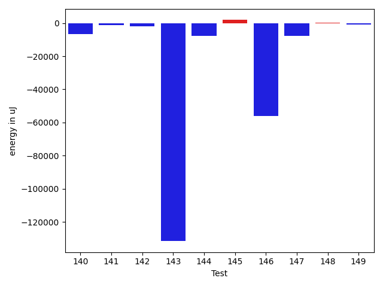

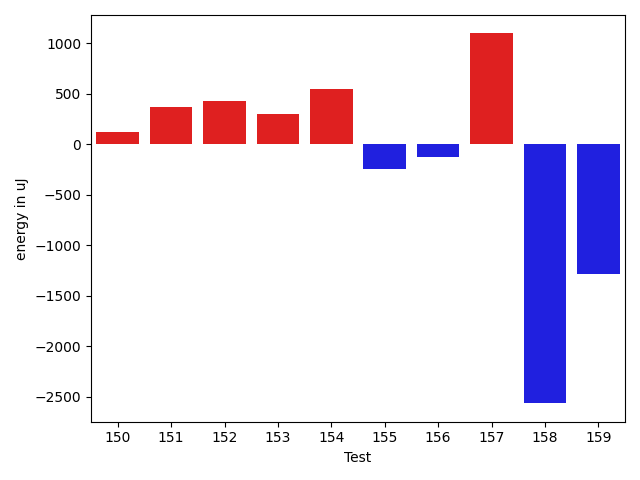

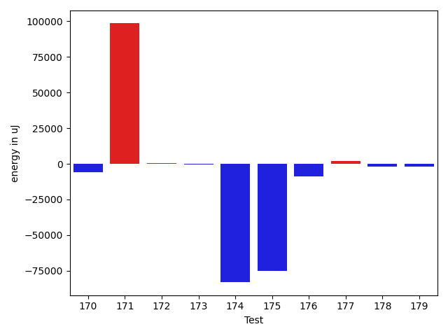

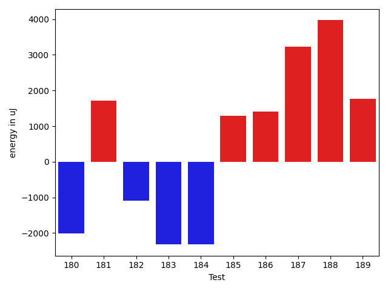

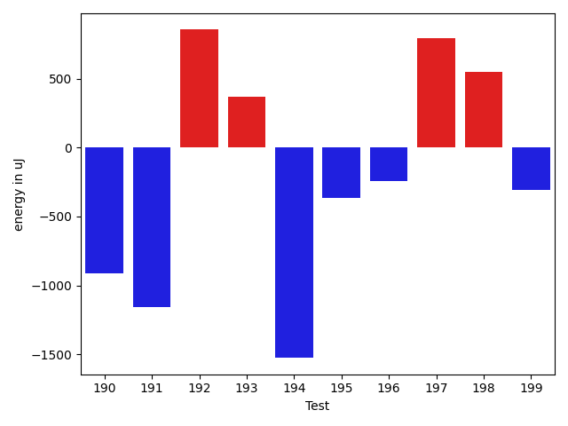

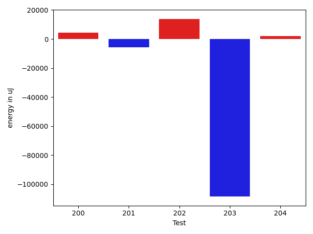

| ID | EnergyV1 | EnergyV2 | DeltaEnergy | σV1 | σV2 |
| --- | --- | --- | --- | --- | --- |
| 0 | 35828 | 35827 | -1 | 3991.705494375372 | 4567.347696757027 |
| 1 | 38513 | 39307 | 794 | 342838.21440395305 | 242718.94161597808 |
| 2 | 87586 | 77514 | -10072 | 23320.64736455418 | 23714.6408962927 |
| 3 | 36071 | 36804 | 733 | 30938.907307966372 | 27628.20371390658 |
| 4 | 35217 | 36682 | 1465 | 4057.8307902108822 | 3488.827660060038 |
| 5 | 35217 | 37231 | 2014 | 3890.1242863605044 | 3623.453889592083 |
| 6 | 36927 | 36193 | -734 | 3530.9821195934837 | 5549.717295101125 |
| 7 | 36255 | 37049 | 794 | 20913.71718498866 | 3861.302335333517 |
| 8 | 38147 | 38025 | -122 | 26902.07779442072 | 27825.901189465854 |
| 9 | 36011 | 36987 | 976 | 7717.628853813603 | 10439.61334462721 |
| 10 | 35034 | 35949 | 915 | 6685.073378926566 | 3676.0947794440262 |
| 11 | 36011 | 35828 | -183 | 3856.5077479353267 | 3606.9392863349 |
| 12 | 36682 | 35950 | -732 | 4097.855386105286 | 3840.5457531578463 |
| 13 | 35156 | 36438 | 1282 | 4064.576118223564 | 4357.41861302911 |
| 14 | 35950 | 37109 | 1159 | 3610.681094434462 | 5855.965874437849 |
| 15 | 38208 | 37963 | -245 | 47289.415273341525 | 50034.16072157953 |
| 16 | 34485 | 36133 | 1648 | 4538.957285696717 | 4610.779687825068 |
| 17 | 34851 | 38208 | 3357 | 4115.437447893435 | 3992.3056743382635 |
| 18 | 37902 | 37903 | 1 | 3696.322564152632 | 3747.075569753536 |
| 19 | 37415 | 36743 | -672 | 13262.527251715639 | 17789.715724301434 |
| 20 | 39429 | 37170 | -2259 | 14423.224395409141 | 13910.900615592793 |
| 21 | 74401 | 71899 | -2502 | 29913.696931447976 | 24965.678892107495 |
| 22 | 37414 | 35034 | -2380 | 68981.1402562097 | 3884.020742685035 |
| 23 | 37353 | 37292 | -61 | 14753.042058806708 | 14981.308633191471 |
| 24 | 36682 | 37658 | 976 | 27890.09819355417 | 3747.6774287807693 |
| 25 | 37537 | 34668 | -2869 | 3303.978031437591 | 4064.5937546691994 |
| 26 | 36682 | 36498 | -184 | 3155.7938155178335 | 5294.134508902007 |
| 27 | 38208 | 37414 | -794 | 7382.556198257121 | 5605.356807554716 |
| 28 | 37353 | 37658 | 305 | 3400.5423003397564 | 3122.0730058300433 |
| 29 | 37048 | 36743 | -305 | 4244.079886873926 | 3145.3459412032485 |
| 30 | 38025 | 36377 | -1648 | 3362.793705970725 | 3127.9572762782777 |
| 31 | 36804 | 36255 | -549 | 31514.647385238335 | 3894.5444853363647 |
| 32 | 37659 | 36682 | -977 | 3565.427021769843 | 3595.3576587336725 |
| 33 | 36193 | 38208 | 2015 | 14969.781289197246 | 6159.851118685454 |
| 34 | 37109 | 38330 | 1221 | 2855.9587743280113 | 62703.86700641676 |
| 35 | 37842 | 37414 | -428 | 4131.853382264261 | 38881.11576763846 |
| 36 | 38574 | 36621 | -1953 | 4079.6468687048555 | 3530.5048043940583 |
| 37 | 40588 | 37720 | -2868 | 94126.85759340716 | 86769.3347571601 |
| 38 | 37354 | 36560 | -794 | 3717.340061899432 | 3148.731232080961 |
| 39 | 37293 | 35827 | -1466 | 4908.917958250406 | 3452.4113133494407 |
| 40 | 37292 | 37719 | 427 | 4441.033220739103 | 4298.649760671594 |
| 41 | 37780 | 38330 | 550 | 11305.130020382407 | 9092.333666121902 |
| 42 | 38940 | 41260 | 2320 | 20285.98368552795 | 49690.3579353178 |
| 43 | 36987 | 38574 | 1587 | 24294.56093928963 | 8071.867645359177 |
| 44 | 39978 | 37903 | -2075 | 4789.360446519597 | 3111.156427714353 |
| 45 | 37964 | 37903 | -61 | 4455.544521646597 | 4540.110882731831 |
| 46 | 39428 | 37231 | -2197 | 4677.1503204408555 | 4467.961614229234 |
| 47 | 39673 | 39062 | -611 | 460958.2012263526 | 470103.8755104433 |
| 48 | 38452 | 35645 | -2807 | 4350.958409289277 | 3764.758261585408 |
| 49 | 36560 | 35522 | -1038 | 3333.7548102924316 | 4383.792243752991 |
| 50 | 114746 | 114379 | -367 | 22028.64983393609 | 24062.390042345003 |
| 51 | 36133 | 36255 | 122 | 4724.909193531566 | 3524.4682989577204 |
| 52 | 34973 | 34606 | -367 | 3904.870154848112 | 3160.500258841006 |
| 53 | 36621 | 35461 | -1160 | 3603.2571815496167 | 4124.80587167545 |
| 54 | 34668 | 34851 | 183 | 4309.516474037429 | 3068.0504936518273 |
| 55 | 36499 | 36987 | 488 | 4600.30677581274 | 3752.673738864448 |
| 56 | 36377 | 38025 | 1648 | 6072.941081715311 | 4650.973769394965 |
| 57 | 35400 | 35949 | 549 | 4055.49451978424 | 3533.605468337877 |
| 58 | 34607 | 34302 | -305 | 3515.594646797073 | 4279.827063048226 |
| 59 | 39002 | 39367 | 365 | 9178.978003154816 | 19224.994699609153 |
| 60 | 35339 | 35218 | -121 | 25912.271800990893 | 3499.5987663575056 |
| 61 | 36133 | 35279 | -854 | 2848.6774076142083 | 3743.8630797540036 |
| 62 | 39611 | 37231 | -2380 | 13968.50219249473 | 8926.293388749937 |
| 63 | 41076 | 42664 | 1588 | 22192.005559320187 | 34679.7026220038 |
| 64 | 39856 | 42236 | 2380 | 223317.9218750834 | 471889.09942618053 |
| 65 | 36499 | 36316 | -183 | 3893.9201956383235 | 4543.790708039063 |
| 66 | 38086 | 37475 | -611 | 18689.01349846488 | 19076.9668692229 |
| 67 | 36682 | 36987 | 305 | 3774.0713801175284 | 30715.304997619824 |
| 68 | 38025 | 36316 | -1709 | 3755.674859124647 | 4430.898403051379 |
| 69 | 35462 | 36560 | 1098 | 4103.634126841984 | 4819.786295109909 |
| 70 | 36865 | 36011 | -854 | 4286.5383767721205 | 3397.412598663217 |
| 71 | 36987 | 37537 | 550 | 4399.4725535426405 | 3780.38598679866 |
| 72 | 38452 | 40161 | 1709 | 35917.471152788974 | 42782.29260680563 |
| 73 | 36560 | 36316 | -244 | 3533.9188830846447 | 3666.5996595586416 |
| 74 | 37720 | 36377 | -1343 | 4041.6504642103914 | 4114.3142185185525 |
| 75 | 38025 | 35827 | -2198 | 4400.219224660204 | 4880.930094004803 |
| 76 | 38696 | 36927 | -1769 | 4120.910870650584 | 3976.956444632 |
| 77 | 38391 | 38696 | 305 | 24898.536491047627 | 13630.894562587919 |
| 78 | 37170 | 36987 | -183 | 20282.6112713304 | 6355.728627563072 |
| 79 | 37231 | 37781 | 550 | 3719.8310130374953 | 3924.5129020017152 |
| 80 | 38330 | 36621 | -1709 | 10599.585264452335 | 12223.965852808637 |
| 81 | 38269 | 37781 | -488 | 12075.090046355732 | 9988.108220488833 |
| 82 | 40894 | 39551 | -1343 | 17365.537099749854 | 24326.252644142784 |
| 83 | 39245 | 39001 | -244 | 62783.76044371473 | 62279.69965298167 |
| 84 | 74280 | 72265 | -2015 | 32410.19379140094 | 25864.165744019643 |
| 85 | 39306 | 37658 | -1648 | 21317.2455039912 | 12043.662305550677 |
| 86 | 38024 | 36743 | -1281 | 9731.636681265556 | 7022.62972128242 |
| 87 | 39978 | 38879 | -1099 | 14642.413580744003 | 15970.369212685126 |
| 88 | 80261 | 77941 | -2320 | 41668.550781599675 | 35614.07283175779 |
| 89 | 39123 | 38330 | -793 | 3967.2294105024425 | 3946.068152489957 |
| 90 | 81848 | 78063 | -3785 | 66484.18115872903 | 153499.20457880254 |
| 91 | 36743 | 34545 | -2198 | 3963.082610516437 | 3385.4882102696797 |
| 92 | 37842 | 37842 | 0 | 52414.2306421305 | 23174.177290946536 |
| 93 | 36865 | 35705 | -1160 | 4710.114483087113 | 3718.523524196129 |
| 94 | 36743 | 35889 | -854 | 3429.3833623797104 | 4160.851116720017 |
| 95 | 37049 | 36927 | -122 | 37254.94956189546 | 5064.341137771253 |
| 96 | 38146 | 36621 | -1525 | 4558.456699846452 | 4064.282682879533 |
| 97 | 38452 | 36499 | -1953 | 4849.023948631312 | 6746.9648713992 |
| 98 | 37231 | 36133 | -1098 | 4255.899190640967 | 7768.9227880687595 |
| 99 | 38085 | 36560 | -1525 | 3321.240117024144 | 4093.215508735308 |
| 100 | 36804 | 37598 | 794 | 3189.8259746510075 | 4015.9366360479125 |
| 101 | 46692 | 59143 | 12451 | 51294.50713601355 | 63432.89954837044 |
| 102 | 37170 | 37048 | -122 | 3745.023198272609 | 9765.321334767328 |
| 103 | 37536 | 35705 | -1831 | 3812.6120931178025 | 4285.507198734668 |
| 104 | 39489 | 39062 | -427 | 26603.91279706352 | 46955.305577751584 |
| 105 | 37964 | 36254 | -1710 | 3656.518935512091 | 4135.874433462315 |
| 106 | 37903 | 36621 | -1282 | 5804.308280593099 | 6054.340042390161 |
| 107 | 36132 | 37536 | 1404 | 6837.363904258917 | 9038.272088867428 |
| 108 | 38818 | 40466 | 1648 | 23052.225791866254 | 22472.837626054337 |
| 109 | 39307 | 37475 | -1832 | 3826.450318714187 | 4024.633835816209 |
| 110 | 41198 | 38208 | -2990 | 11535.339267369363 | 14875.970039777227 |
| 111 | 37293 | 38147 | 854 | 18603.148502038737 | 11602.97979637157 |
| 112 | 38574 | 39245 | 671 | 4378.1088999636395 | 3814.9654323466684 |
| 113 | 40222 | 40466 | 244 | 4657.108697846092 | 4530.2273454011565 |
| 114 | 40161 | 36438 | -3723 | 5096.922145138181 | 4356.606338367055 |
| 115 | 37719 | 38757 | 1038 | 3677.5542011428943 | 3538.18975042323 |
| 116 | 39063 | 37658 | -1405 | 38191.68536488014 | 3594.5049212386484 |
| 117 | 37232 | 39490 | 2258 | 4400.149667416243 | 3673.011019245654 |
| 118 | 40100 | 38513 | -1587 | 4417.593576824377 | 5126.099348757623 |
| 119 | 38025 | 37659 | -366 | 7854.924948377079 | 3962.2758027666473 |
| 120 | 85449 | 85266 | -183 | 211855.04367619276 | 338342.41097139707 |
| 121 | 41382 | 41442 | 60 | 23870.076543806943 | 19622.629783112585 |
| 122 | 38147 | 39550 | 1403 | 15683.237258510426 | 14044.095703235238 |
| 123 | 36621 | 37964 | 1343 | 4606.043403206511 | 4270.98145122016 |
| 124 | 156310 | 172973 | 16663 | 67628.15006309755 | 163793.73709454958 |
| 125 | 39673 | 39978 | 305 | 23720.9587950747 | 20691.21070618957 |
| 126 | 38147 | 37537 | -610 | 4423.8356388587945 | 4680.548476085068 |
| 127 | 36927 | 37658 | 731 | 4213.9949616011645 | 24423.588399271965 |
| 128 | 36560 | 37903 | 1343 | 3897.7277833712146 | 4753.47868808045 |
| 129 | 37293 | 36865 | -428 | 6582.322179994686 | 6341.756388903492 |
| 130 | 36377 | 38452 | 2075 | 3805.689263162051 | 20349.841547434266 |
| 131 | 36255 | 35461 | -794 | 4809.540766036325 | 3713.7121169888524 |
| 132 | 36193 | 38024 | 1831 | 28584.360969835892 | 23292.197427270145 |
| 133 | 35888 | 37964 | 2076 | 3615.0809566893604 | 4230.229357643698 |
| 134 | 36316 | 35462 | -854 | 4646.552608690525 | 4049.7503144484103 |
| 135 | 36987 | 38025 | 1038 | 5178.646291964114 | 3868.332099031191 |
| 136 | 36438 | 34301 | -2137 | 4236.195391209538 | 3608.196512165046 |
| 137 | 40344 | 38513 | -1831 | 8849.882618648258 | 8240.973214372198 |
| 138 | 36316 | 37781 | 1465 | 8661.535202255855 | 9395.877217509998 |
| 139 | 36621 | 38330 | 1709 | 3827.775522155802 | 5183.646229383807 |
| 140 | 35766 | 36377 | 611 | 34884.29418362446 | 4292.386049221989 |
| 141 | 37170 | 37659 | 489 | 4632.486055277619 | 3884.7893914514098 |
| 142 | 37719 | 38086 | 367 | 30872.70066129506 | 33411.53630774782 |
| 143 | 40222 | 39001 | -1221 | 546526.4038841942 | 286447.9900974815 |
| 144 | 39001 | 38452 | -549 | 37335.96905716419 | 27191.019855956445 |
| 145 | 37597 | 36804 | -793 | 14032.362632387745 | 21173.171794377315 |
| 146 | 40222 | 38941 | -1281 | 358924.5966884184 | 47492.91824909884 |
| 147 | 40039 | 38147 | -1892 | 33627.78916772811 | 4393.949673571325 |
| 148 | 36499 | 37353 | 854 | 4505.845167442825 | 3999.081312869091 |
| 149 | 38635 | 37841 | -794 | 3976.091794612352 | 3213.8745891835915 |
| 150 | 35950 | 36072 | 122 | 4463.1037612399 | 3778.7623622553724 |
| 151 | 36804 | 37170 | 366 | 3539.198217283753 | 25891.68049896778 |
| 152 | 38391 | 38818 | 427 | 6937.392035807757 | 9516.254494704659 |
| 153 | 40222 | 40527 | 305 | 40966.574224220276 | 42016.82431102259 |
| 154 | 38391 | 38940 | 549 | 8362.39917360834 | 4032.913446769693 |
| 155 | 39062 | 38818 | -244 | 295945.4488371868 | 285368.4377200432 |
| 156 | 39185 | 39062 | -123 | 333752.9247812911 | 355777.2926768336 |
| 157 | 38574 | 39673 | 1099 | 40557.5355211131 | 59644.18633988983 |
| 158 | 41931 | 39367 | -2564 | 14537.108404957982 | 18903.943804507584 |
| 159 | 38574 | 37292 | -1282 | 261468.63711201653 | 4169.948479245186 |
| 160 | 38880 | 37170 | -1710 | 4859.619583298162 | 28042.68693018668 |
| 161 | 42053 | 43701 | 1648 | 257952.94540225487 | 545702.8541472761 |
| 162 | 37476 | 37536 | 60 | 6178.28517246131 | 6440.75792850179 |
| 163 | 38391 | 39124 | 733 | 3963.9578284986464 | 21374.906854534915 |
| 164 | 106262 | 110840 | 4578 | 333679.1961996851 | 532715.5583490867 |
| 165 | 37597 | 36499 | -1098 | 4079.4442156252653 | 4739.5248649580435 |
| 166 | 38574 | 41138 | 2564 | 22675.636685816407 | 25123.049808654945 |
| 167 | 39184 | 39733 | 549 | 406664.7263598247 | 494093.2533442498 |
| 168 | 378539 | 388122 | 9583 | 137682.5615974874 | 144866.71586820256 |
| 169 | 40100 | 39856 | -244 | 38550.10558690124 | 26211.642703642534 |
| 170 | 75805 | 72570 | -3235 | 24363.008261770665 | 23779.03580119958 |
| 171 | 82519 | 82458 | -61 | 258365.8937474242 | 527842.2970834118 |
| 172 | 37537 | 38635 | 1098 | 3725.044390162413 | 4932.540383276457 |
| 173 | 41503 | 42358 | 855 | 31753.17499617611 | 31373.988354107234 |
| 174 | 40527 | 36987 | -3540 | 587748.6030035511 | 485672.2424404904 |
| 175 | 80932 | 83191 | 2259 | 440504.9689853876 | 203171.2057302387 |
| 176 | 38330 | 38635 | 305 | 34899.16216842889 | 10723.66304787471 |
| 177 | 36987 | 38513 | 1526 | 3489.2945238427355 | 6185.279386446102 |
| 178 | 38025 | 38879 | 854 | 25052.1416685446 | 18793.420720799306 |
| 179 | 39368 | 39673 | 305 | 16639.58380423412 | 10513.228148064596 |
| 180 | 39673 | 37658 | -2015 | 108687.90003872741 | 12117.818307810321 |
| 181 | 37536 | 39246 | 1710 | 4089.0121633742083 | 3632.5458077711223 |
| 182 | 37293 | 36194 | -1099 | 4614.307642163549 | 4252.946001273787 |
| 183 | 42053 | 39734 | -2319 | 27144.23614506486 | 13454.305091950979 |
| 184 | 40528 | 38208 | -2320 | 25523.23420569992 | 3738.3188945065654 |
| 185 | 39002 | 40283 | 1281 | 49967.54048388879 | 406462.57017465 |
| 186 | 36438 | 37842 | 1404 | 3795.3688918741595 | 4367.828120672279 |
| 187 | 40405 | 43640 | 3235 | 646725.8250132338 | 564058.8020605649 |
| 188 | 35888 | 39856 | 3968 | 4100.004144814979 | 4705.877424875209 |
| 189 | 37964 | 39734 | 1770 | 2546.901484837878 | 3341.143397441725 |
| 190 | 39062 | 38147 | -915 | 7729.856153683314 | 4039.942220843647 |
| 191 | 40894 | 39734 | -1160 | 17794.18765414694 | 18900.499707589242 |
| 192 | 38207 | 39063 | 856 | 41441.29414118278 | 45769.9554477032 |
| 193 | 39062 | 39429 | 367 | 490670.3530037998 | 469075.3653649556 |
| 194 | 40466 | 38940 | -1526 | 3891.7791947948517 | 3805.162940006643 |
| 195 | 40344 | 39978 | -366 | 62165.08359119706 | 37629.553279045576 |
| 196 | 39063 | 38818 | -245 | 3934.8759736495554 | 3866.641315268566 |
| 197 | 37414 | 38208 | 794 | 4199.6189112823085 | 4432.453063485275 |
| 198 | 36926 | 37475 | 549 | 6023.6331421086625 | 4656.538074321613 |
| 199 | 39001 | 38696 | -305 | 9878.834755102771 | 4515.716516611977 |
| 200 | 39368 | 38879 | -489 | 4225.63626975838 | 31128.01695618742 |
| 201 | 40222 | 38879 | -1343 | 33426.48955411641 | 12764.00565913921 |
| 202 | 39307 | 41931 | 2624 | 36207.41314028832 | 61560.677359913265 |
| 203 | 39428 | 38452 | -976 | 506040.68560656754 | 309175.30663935933 |
| 204 | 39001 | 39612 | 611 | 6308.589779023518 | 9773.12199813345 |

## Delta Duration per test method

| ID | DurationV1 | DurationsV2 | DeltaDuration |
| --- | --- | --- | --- |
| 0 | 860973.9464285715 | 893370.0350877193 | 32396.08865914785 |
| 1 | 3904035.0689655175 | 2319564.3235294116 | -1584470.7454361059 |
| 2 | 2712921.0404040404 | 2728596.8484848486 | 15675.80808080826 |
| 3 | 1343445.9206349207 | 1256364.3835616438 | -87081.53707327694 |
| 4 | 883546.3636363636 | 809923.66 | -73622.70363636361 |
| 5 | 713118.2765957447 | 754118.6 | 41000.32340425532 |
| 6 | 924625.2833333333 | 946399.0985915493 | 21773.815258215996 |
| 7 | 919576.701754386 | 803550.0192307692 | -116026.6825236167 |
| 8 | 1230982.2592592593 | 1236706.8461538462 | 5724.586894586915 |
| 9 | 968808.2941176471 | 1006640.3815789474 | 37832.08746130031 |
| 10 | 837721.9387755102 | 829398.7076923077 | -8323.231083202525 |
| 11 | 801913.6785714285 | 797972.9285714285 | -3940.75 |
| 12 | 459855.8888888889 | 460555.27777777775 | 699.388888888876 |
| 13 | 670878.1666666666 | 649220.6744186047 | -21657.492248061928 |
| 14 | 889311.4629629629 | 923289.1935483871 | 33977.73058542423 |
| 15 | 1447333.4545454546 | 1363978.5849056605 | -83354.86963979411 |
| 16 | 589848.2413793104 | 605085.6060606061 | 15237.364681295701 |
| 17 | 467810.47826086957 | 500722.9130434783 | 32912.4347826087 |
| 18 | 508250.0 | 494798.46153846156 | -13451.53846153844 |
| 19 | 1241063.95 | 1246632.1829268292 | 5568.232926829252 |
| 20 | 1218474.0563380283 | 1244427.1851851852 | 25953.128847156884 |
| 21 | 2278615.272727273 | 2290430.272727273 | 11815.0 |
| 22 | 1062068.46875 | 657873.9310344828 | -404194.5377155172 |
| 23 | 1003735.1228070175 | 1098893.7450980393 | 95158.62229102175 |
| 24 | 732341.46875 | 555062.1818181818 | -177279.28693181823 |
| 25 | 576910.9666666667 | 537481.1363636364 | -39429.83030303032 |
| 26 | 704477.6363636364 | 700960.6363636364 | -3517.0 |
| 27 | 945217.4590163934 | 923284.4 | -21933.05901639338 |
| 28 | 769121.88 | 785469.6458333334 | 16347.765833333367 |
| 29 | 408583.4761904762 | 375617.3125 | -32966.16369047621 |
| 30 | 538606.3333333334 | 746634.8333333334 | 208028.5 |
| 31 | 920484.3673469388 | 820832.7708333334 | -99651.59651360544 |
| 32 | 596625.0 | 683981.5757575758 | 87356.5757575758 |
| 33 | 598464.36 | 533149.7419354839 | -65314.61806451611 |
| 34 | 521148.0 | 904940.88 | 383792.88 |
| 35 | 736553.6451612903 | 867867.7931034482 | 131314.14794215793 |
| 36 | 514492.9 | 556124.5945945946 | 41631.69459459453 |
| 37 | 1704984.303030303 | 1754653.5238095238 | 49669.22077922081 |
| 38 | 521719.3333333333 | 610085.0 | 88365.66666666669 |
| 39 | 426270.0 | 485154.6666666667 | 58884.666666666686 |
| 40 | 607342.75 | 590697.1515151515 | -16645.59848484851 |
| 41 | 998749.6153846154 | 1078091.234375 | 79341.61899038462 |
| 42 | 853889.75 | 1627569.75 | 773680.0 |
| 43 | 1152776.7857142857 | 1111305.5714285714 | -41471.21428571432 |
| 44 | 503130.0 | 533865.0 | 30735.0 |
| 45 | 474254.25 | 543138.4 | 68884.15000000002 |
| 46 | 776524.24 | 693713.3333333334 | -82810.90666666662 |
| 47 | 3834465.3037974685 | 4985597.841463415 | 1151132.5376659464 |
| 48 | 605438.0 | 536243.5925925926 | -69194.40740740742 |
| 49 | 871955.2153846154 | 887365.9166666666 | 15410.701282051275 |
| 50 | 3388199.696969697 | 3413583.1515151514 | 25383.454545454588 |
| 51 | 681416.6052631579 | 694891.6486486486 | 13475.043385490775 |
| 52 | 760606.1351351351 | 621886.6060606061 | -138719.52907452907 |
| 53 | 826871.45 | 851228.4363636364 | 24356.986363636446 |
| 54 | 532325.8 | 578949.2083333334 | 46623.408333333326 |
| 55 | 648122.1515151515 | 729924.512195122 | 81802.36067997047 |
| 56 | 804011.2564102564 | 719846.34 | -84164.91641025641 |
| 57 | 501569.9 | 561375.5714285715 | 59805.671428571455 |
| 58 | 562122.8529411765 | 609067.84 | 46944.98705882346 |
| 59 | 841663.06 | 1170362.12 | 328699.06000000006 |
| 60 | 993683.421875 | 1001079.1549295775 | 7395.733054577489 |
| 61 | 586560.6206896552 | 586990.8518518518 | 430.23116219660733 |
| 62 | 748854.4117647059 | 735567.5428571429 | -13286.86890756304 |
| 63 | 848469.6785714285 | 1203077.0555555555 | 354607.376984127 |
| 64 | 2113539.3928571427 | 8152545.619047619 | 6039006.226190477 |
| 65 | 811472.725 | 788451.2941176471 | -23021.43088235287 |
| 66 | 1324227.4666666666 | 1383664.7191011235 | 59437.252434456954 |
| 67 | 794648.2666666667 | 866665.5581395349 | 72017.29147286818 |
| 68 | 567537.25 | 585924.7857142857 | 18387.53571428568 |
| 69 | 760874.0925925926 | 728105.2608695652 | -32768.8317230274 |
| 70 | 660427.5789473684 | 663141.1 | 2713.5210526315495 |
| 71 | 619137.95 | 584173.4047619047 | -34964.54523809522 |
| 72 | 1029692.5428571429 | 1362358.78125 | 332666.23839285714 |
| 73 | 486870.5333333333 | 512150.9032258064 | 25280.3698924731 |
| 74 | 596680.2692307692 | 619840.0689655172 | 23159.79973474797 |
| 75 | 690495.947368421 | 714022.2777777778 | 23526.330409356742 |
| 76 | 578435.4615384615 | 521966.40625 | -56469.0552884615 |
| 77 | 1474787.2826086956 | 1329251.0729166667 | -145536.20969202882 |
| 78 | 1135026.8684210526 | 1065546.8732394367 | -69479.99518161593 |
| 79 | 847888.2 | 843917.4716981133 | -3970.728301886702 |
| 80 | 1243719.088888889 | 1212917.2747252746 | -30801.814163614297 |
| 81 | 1304564.5217391304 | 1250614.2608695652 | -53950.26086956519 |
| 82 | 1454711.6170212766 | 1523281.93814433 | 68570.32112305332 |
| 83 | 1758301.8720930233 | 1801695.1294117647 | 43393.25731874141 |
| 84 | 2243828.5555555555 | 2120298.0404040404 | -123530.51515151514 |
| 85 | 1415720.8936170214 | 1299719.4623655914 | -116001.43125142995 |
| 86 | 1178515.3373493976 | 1125341.011904762 | -53174.3254446357 |
| 87 | 1308567.3723404256 | 1331815.094117647 | 23247.72177722142 |
| 88 | 2679197.5757575757 | 2612149.7474747472 | -67047.82828282844 |
| 89 | 598416.2666666667 | 571952.2424242424 | -26464.02424242429 |
| 90 | 2949668.373737374 | 3415127.9595959596 | 465459.5858585858 |
| 91 | 530471.4074074074 | 480493.0625 | -49978.344907407416 |
| 92 | 1044794.0 | 752398.2 | -292395.80000000005 |
| 93 | 547033.3076923077 | 546233.92 | -799.3876923077041 |
| 94 | 981854.0869565217 | 964725.3571428572 | -17128.72981366457 |
| 95 | 753722.59375 | 595378.7083333334 | -158343.88541666663 |
| 96 | 545881.6666666666 | 593124.3939393939 | 47242.727272727294 |
| 97 | 659753.08 | 660086.8108108108 | 333.7308108108118 |
| 98 | 886658.234375 | 909144.6984126985 | 22486.46403769846 |
| 99 | 505959.3333333333 | 503832.1724137931 | -2127.1609195402125 |
| 100 | 838538.2352941176 | 858611.619047619 | 20073.38375350146 |
| 101 | 2079450.7777777778 | 2225728.7849462368 | 146278.007168459 |
| 102 | 821489.8 | 933983.6481481482 | 112493.84814814816 |
| 103 | 787264.5849056604 | 864928.4225352113 | 77663.83762955095 |
| 104 | 1364189.1694915255 | 1687385.8813559322 | 323196.7118644067 |
| 105 | 672524.8780487805 | 720336.5581395349 | 47811.68009075441 |
| 106 | 971942.3181818182 | 920800.8 | -51141.51818181819 |
| 107 | 771247.5434782609 | 895745.38 | 124497.83652173914 |
| 108 | 1186569.5102040817 | 1179450.0689655172 | -7119.441238564439 |
| 109 | 442849.39130434784 | 434454.7727272727 | -8394.618577075133 |
| 110 | 977016.6923076923 | 899525.1935483871 | -77491.4987593051 |
| 111 | 932036.4925373135 | 905534.1296296297 | -26502.362907683826 |
| 112 | 468883.8461538461 | 514570.8888888889 | 45687.04273504275 |
| 113 | 478963.5909090909 | 527538.9285714285 | 48575.33766233764 |
| 114 | 502191.52 | 543831.35 | 41639.82999999996 |
| 115 | 478505.90625 | 504177.5 | 25671.59375 |
| 116 | 718339.95 | 465180.4210526316 | -253159.52894736838 |
| 117 | 514614.53571428574 | 553693.75 | 39079.21428571426 |
| 118 | 459660.6 | 515474.26666666666 | 55813.666666666686 |
| 119 | 946078.2941176471 | 907360.4393939395 | -38717.85472370766 |
| 120 | 3688210.888888889 | 4377440.101010101 | 689229.2121212119 |
| 121 | 1581922.242105263 | 1578405.3368421053 | -3516.9052631577943 |
| 122 | 1254932.3896103897 | 1163769.8076923077 | -91162.58191808197 |
| 123 | 649168.1666666666 | 584987.2 | -64180.966666666674 |
| 124 | 5059764.04040404 | 5627538.828282828 | 567774.7878787881 |
| 125 | 933984.1372549019 | 894327.3636363636 | -39656.77361853828 |
| 126 | 544485.9523809524 | 585479.8846153846 | 40993.9322344322 |
| 127 | 758257.22 | 899934.6666666666 | 141677.44666666666 |
| 128 | 831612.7916666666 | 923357.220338983 | 91744.42867231637 |
| 129 | 911021.96875 | 982367.5217391305 | 71345.55298913049 |
| 130 | 607134.8888888889 | 701156.0454545454 | 94021.15656565654 |
| 131 | 533915.0454545454 | 555250.6153846154 | 21335.569930069963 |
| 132 | 824396.9428571429 | 893393.9285714285 | 68996.98571428563 |
| 133 | 841787.8604651163 | 863887.1355932204 | 22099.275128104025 |
| 134 | 633830.0588235294 | 632021.3333333334 | -1808.725490196026 |
| 135 | 877765.5161290322 | 702003.3055555555 | -175762.21057347674 |
| 136 | 529666.8717948718 | 563874.72 | 34207.84820512822 |
| 137 | 998888.4137931034 | 650748.08 | -348140.33379310346 |
| 138 | 956007.0454545454 | 924646.75 | -31360.295454545412 |
| 139 | 488630.0869565217 | 454055.7727272727 | -34574.31422924902 |
| 140 | 750547.0 | 567396.0 | -183151.0 |
| 141 | 661025.8787878788 | 594269.8620689656 | -66756.01671891322 |
| 142 | 1522633.141304348 | 1511090.4777777777 | -11542.663526570192 |
| 143 | 5987513.55319149 | 2124480.9111111113 | -3863032.6420803783 |
| 144 | 1328349.1886792453 | 1037863.7192982456 | -290485.4693809997 |
| 145 | 1117086.696969697 | 1146296.8095238095 | 29210.11255411245 |
| 146 | 2996950.0 | 1128801.219512195 | -1868148.780487805 |
| 147 | 675702.8076923077 | 506019.9428571428 | -169682.86483516492 |
| 148 | 447145.60869565216 | 451210.5714285714 | 4064.962732919259 |
| 149 | 690398.2 | 680491.21875 | -9906.981249999953 |
| 150 | 515763.4375 | 566616.8518518518 | 50853.414351851796 |
| 151 | 600974.9428571429 | 755745.0540540541 | 154770.1111969112 |
| 152 | 1092669.76 | 1126885.87654321 | 34216.11654320988 |
| 153 | 1094782.4827586208 | 1249393.8301886793 | 154611.34743005852 |
| 154 | 786638.7777777778 | 835284.7333333333 | 48645.95555555553 |
| 155 | 2167286.8666666667 | 2150820.2156862747 | -16466.650980392005 |
| 156 | 3700236.8484848486 | 4095361.2444444443 | 395124.3959595957 |
| 157 | 1016248.0 | 1464346.825 | 448098.82499999995 |
| 158 | 1137274.1 | 1105543.7906976745 | -31730.309302325593 |
| 159 | 2582711.2580645164 | 635025.5151515151 | -1947685.7429130012 |
| 160 | 636713.475 | 897245.4545454546 | 260531.9795454546 |
| 161 | 2438325.5064935065 | 5821770.328571429 | 3383444.822077922 |
| 162 | 842231.0697674418 | 831381.9285714285 | -10849.141196013312 |
| 163 | 788688.2909090909 | 940866.5081967213 | 152178.21728763042 |
| 164 | 4466536.919191919 | 6885000.373737373 | 2418463.454545454 |
| 165 | 915220.703125 | 941685.1166666667 | 26464.413541666698 |
| 166 | 1220089.9 | 1348046.1690140846 | 127956.26901408471 |
| 167 | 3866876.9375 | 4801857.615384615 | 934980.677884615 |
| 168 | 11035918.838383839 | 11364865.777777778 | 328946.93939393945 |
| 169 | 1684375.4772727273 | 1475651.1847826086 | -208724.29249011865 |
| 170 | 2050019.707070707 | 1943505.6363636365 | -106514.07070707064 |
| 171 | 3493737.8484848486 | 6310877.01010101 | 2817139.1616161615 |
| 172 | 959691.868852459 | 949596.1571428571 | -10095.711709601921 |
| 173 | 1713061.7717391304 | 1692278.1368421053 | -20783.63489702507 |
| 174 | 8065840.428571428 | 5491599.904761905 | -2574240.5238095233 |
| 175 | 5940726.555555556 | 3603671.6666666665 | -2337054.8888888895 |
| 176 | 1075053.1951219512 | 711462.8378378379 | -363590.3572841133 |
| 177 | 851982.5094339623 | 809164.0444444445 | -42818.464989517815 |
| 178 | 1121830.923076923 | 962896.1525423729 | -158934.77053455007 |
| 179 | 1182005.507936508 | 1044732.5072463768 | -137273.0006901311 |
| 180 | 2462158.5897435895 | 670121.1935483871 | -1792037.3961952024 |
| 181 | 666574.875 | 576601.5666666667 | -89973.30833333335 |
| 182 | 818005.7272727273 | 743014.552631579 | -74991.1746411483 |
| 183 | 1333007.403508772 | 971243.0566037736 | -361764.3469049983 |
| 184 | 1292143.8958333333 | 848734.5909090909 | -443409.3049242423 |
| 185 | 1500822.1805555555 | 3876588.506329114 | 2375766.3257735586 |
| 186 | 758950.4693877551 | 731758.5681818182 | -27191.901205936912 |
| 187 | 6725297.5344827585 | 6672426.375 | -52871.15948275849 |
| 188 | 488161.25 | 493591.84210526315 | 5430.592105263146 |
| 189 | 601401.9642857143 | 563750.2173913043 | -37651.74689441 |
| 190 | 728400.2777777778 | 705487.7714285714 | -22912.50634920632 |
| 191 | 1258428.8148148148 | 1348819.423076923 | 90390.60826210817 |
| 192 | 1279309.5614035088 | 1423389.843137255 | 144080.28173374617 |
| 193 | 5968123.72 | 5069466.2727272725 | -898657.4472727273 |
| 194 | 456736.8823529412 | 406062.44444444444 | -50674.437908496766 |
| 195 | 1728509.2115384615 | 1251487.558139535 | -477021.6533989266 |
| 196 | 700739.8095238095 | 667806.1052631579 | -32933.704260651604 |
| 197 | 564692.5625 | 502933.6 | -61758.96250000002 |
| 198 | 739984.6944444445 | 715454.5641025641 | -24530.130341880373 |
| 199 | 784661.2903225806 | 711134.5151515151 | -73526.77517106547 |
| 200 | 791690.3181818182 | 818380.7111111111 | 26690.392929292866 |
| 201 | 1367086.060240964 | 1213385.536585366 | -153700.52365559805 |
| 202 | 1191515.671875 | 1580658.119047619 | 389142.44717261894 |
| 203 | 6134916.8125 | 2764010.387755102 | -3370906.424744898 |
| 204 | 571075.9545454546 | 728051.92 | 156975.96545454545 |

## Misc.

| ID | Test Class | Test Method |
| --- | --- | --- |
| 0 | com.google.gson.functional.CustomTypeAdaptersTest | testCustomAdapterInvokedForCollectionElementDeserialization |
| 1 | com.google.gson.functional.CustomTypeAdaptersTest | testCustomSerializers |
| 2 | com.google.gson.functional.CustomTypeAdaptersTest | testCustomTypeAdapterDoesNotAppliesToSubClasses |
| 3 | com.google.gson.functional.CustomTypeAdaptersTest | testCustomAdapterInvokedForCollectionElementSerializationWithType |
| 4 | com.google.gson.functional.CustomTypeAdaptersTest | testCustomByteArrayDeserializerAndInstanceCreator |
| 5 | com.google.gson.functional.CustomTypeAdaptersTest | testCustomByteArraySerializer |
| 6 | com.google.gson.functional.CustomTypeAdaptersTest | testCustomDeserializerForLong |
| 7 | com.google.gson.functional.CustomTypeAdaptersTest | testCustomTypeAdapterAppliesToSubClassesSerializedAsBaseClass |
| 8 | com.google.gson.functional.CustomTypeAdaptersTest | testCustomNestedSerializers |
| 9 | com.google.gson.functional.CustomTypeAdaptersTest | testCustomSerializerForLong |
| 10 | com.google.gson.functional.CustomTypeAdaptersTest | testCustomAdapterInvokedForMapElementDeserialization |
| 11 | com.google.gson.functional.CustomTypeAdaptersTest | testCustomAdapterInvokedForMapElementSerializationWithType |
| 12 | com.google.gson.functional.CustomTypeAdaptersTest | testCustomAdapterInvokedForCollectionElementSerialization |
| 13 | com.google.gson.functional.CustomTypeAdaptersTest | testEnsureCustomSerializerNotInvokedForNullValues |
| 14 | com.google.gson.functional.CustomTypeAdaptersTest | testCustomNestedDeserializers |
| 15 | com.google.gson.functional.CustomTypeAdaptersTest | testCustomDeserializers |
| 16 | com.google.gson.functional.CustomTypeAdaptersTest | testEnsureCustomDeserializerNotInvokedForNullValues |
| 17 | com.google.gson.functional.CustomTypeAdaptersTest | testCustomAdapterInvokedForMapElementSerialization |
| 18 | com.google.gson.functional.ObjectTest | testStringFieldWithEmptyValueDeserialization |
| 19 | com.google.gson.functional.ObjectTest | testEmptyCollectionInAnObjectDeserialization |
| 20 | com.google.gson.functional.ObjectTest | testArrayOfArraysDeserialization |
| 21 | com.google.gson.functional.ObjectTest | testSingletonLists |
| 22 | com.google.gson.functional.ObjectTest | testClassWithTransientFieldsDeserialization |
| 23 | com.google.gson.functional.ObjectTest | testStringFieldWithNumberValueDeserialization |
| 24 | com.google.gson.functional.ObjectTest | testPrivateNoArgConstructorDeserialization |
| 25 | com.google.gson.functional.ObjectTest | testClassWithTransientFieldsDeserializationTransientFieldsPassedInJsonAreIgnored |
| 26 | com.google.gson.functional.ObjectTest | testPrimitiveArrayInAnObjectDeserialization |
| 27 | com.google.gson.functional.ObjectTest | testArrayOfObjectsDeserialization |
| 28 | com.google.gson.functional.ObjectTest | testInnerClassDeserialization |
| 29 | com.google.gson.functional.ObjectTest | testJsonObjectSerialization |
| 30 | com.google.gson.functional.ObjectTest | testBagOfPrimitivesDeserialization |
| 31 | com.google.gson.functional.ObjectTest | testNestedDeserialization |
| 32 | com.google.gson.functional.ObjectTest | testNullFieldsDeserialization |
| 33 | com.google.gson.functional.ObjectTest | testNullObjectFieldsDeserialization |
| 34 | com.google.gson.functional.ObjectTest | testNullArraysDeserialization |
| 35 | com.google.gson.functional.ObjectTest | testBagOfPrimitiveWrappersDeserialization |
| 36 | com.google.gson.functional.ObjectTest | testJsonInMixedQuotesDeserialization |
| 37 | com.google.gson.functional.ObjectTest | testJsonInSingleQuotesDeserialization |
| 38 | com.google.gson.functional.ObjectTest | testObjectFieldNamesWithoutQuotesDeserialization |
| 39 | com.google.gson.functional.ObjectTest | testClassWithNoFieldsDeserialization |
| 40 | com.google.gson.functional.ObjectTest | testNullPrimitiveFieldsDeserialization |
| 41 | com.google.gson.functional.ReadersWritersTest | testReadWriteTwoObjects |
| 42 | com.google.gson.functional.ReadersWritersTest | testReaderForDeserialization |
| 43 | com.google.gson.functional.ReadersWritersTest | testReadWriteTwoStrings |
| 44 | com.google.gson.functional.ReadersWritersTest | testTopLevelNullObjectSerializationWithWriterAndSerializeNulls |
| 45 | com.google.gson.functional.ReadersWritersTest | testTopLevelNullObjectDeserializationWithReaderAndSerializeNulls |
| 46 | com.google.gson.functional.FieldExclusionTest | testDefaultNestedStaticClassIncluded |
| 47 | com.google.gson.functional.FieldExclusionTest | testDefaultInnerClassExclusion |
| 48 | com.google.gson.functional.FieldExclusionTest | testInnerClassExclusion |
| 49 | com.google.gson.functional.DefaultTypeAdaptersTest | testDateSerializationWithPattern |
| 50 | com.google.gson.functional.DefaultTypeAdaptersTest | testDefaultDateDeserializationUsingBuilder |
| 51 | com.google.gson.functional.DefaultTypeAdaptersTest | testBigIntegerFieldDeserialization |
| 52 | com.google.gson.functional.DefaultTypeAdaptersTest | testDefaultCalendarDeserialization |
| 53 | com.google.gson.functional.DefaultTypeAdaptersTest | testDateDeserializationWithPattern |
| 54 | com.google.gson.functional.DefaultTypeAdaptersTest | testSetSerialization |
| 55 | com.google.gson.functional.DefaultTypeAdaptersTest | testBadValueForBigDecimalDeserialization |
| 56 | com.google.gson.functional.DefaultTypeAdaptersTest | testUrlNullDeserialization |
| 57 | com.google.gson.functional.DefaultTypeAdaptersTest | testDefaultGregorianCalendarSerialization |
| 58 | com.google.gson.functional.DefaultTypeAdaptersTest | testDefaultCalendarSerialization |
| 59 | com.google.gson.functional.DefaultTypeAdaptersTest | testBigDecimalFieldDeserialization |
| 60 | com.google.gson.functional.DefaultTypeAdaptersTest | testDateSerializationWithPatternNotOverridenByTypeAdapter |
| 61 | com.google.gson.functional.DefaultTypeAdaptersTest | testDefaultGregorianCalendarDeserialization |
| 62 | com.google.gson.functional.NullObjectAndFieldTest | testExplicitDeserializationOfNulls |
| 63 | com.google.gson.functional.NullObjectAndFieldTest | testTopLevelNullObjectDeserialization |
| 64 | com.google.gson.functional.NullObjectAndFieldTest | testTopLevelNullObjectSerialization |
| 65 | com.google.gson.functional.NullObjectAndFieldTest | testNullWrappedPrimitiveMemberSerialization |
| 66 | com.google.gson.functional.NullObjectAndFieldTest | testExplicitSerializationOfNullArrayMembers |
| 67 | com.google.gson.functional.NullObjectAndFieldTest | testNullWrappedPrimitiveMemberDeserialization |
| 68 | com.google.gson.functional.NullObjectAndFieldTest | testExplicitSerializationOfNullStringMembers |
| 69 | com.google.gson.functional.NullObjectAndFieldTest | testCustomTypeAdapterPassesNullDesrialization |
| 70 | com.google.gson.functional.NullObjectAndFieldTest | testPrintPrintingArraysWithNulls |
| 71 | com.google.gson.functional.NullObjectAndFieldTest | testExplicitNullSetsFieldToNullDuringDeserialization |
| 72 | com.google.gson.functional.NullObjectAndFieldTest | testExplicitSerializationOfNulls |
| 73 | com.google.gson.functional.NullObjectAndFieldTest | testCustomTypeAdapterPassesNullSerialization |
| 74 | com.google.gson.functional.NullObjectAndFieldTest | testExplicitSerializationOfNullCollectionMembers |
| 75 | com.google.gson.functional.NullObjectAndFieldTest | testPrintPrintingObjectWithNulls |
| 76 | com.google.gson.functional.NullObjectAndFieldTest | testCustomSerializationOfNulls |
| 77 | com.google.gson.functional.ParameterizedTypesTest | testVariableTypeArrayDeserialization |
| 78 | com.google.gson.functional.ParameterizedTypesTest | testParameterizedTypeWithReaderDeserialization |
| 79 | com.google.gson.functional.ParameterizedTypesTest | testDeepParameterizedTypeDeserialization |
| 80 | com.google.gson.functional.ParameterizedTypesTest | testParameterizedTypeWithCustomSerializer |
| 81 | com.google.gson.functional.ParameterizedTypesTest | testVariableTypeDeserialization |
| 82 | com.google.gson.functional.ParameterizedTypesTest | testParameterizedTypeGenericArraysDeserialization |
| 83 | com.google.gson.functional.ParameterizedTypesTest | testParameterizedTypeDeserialization |
| 84 | com.google.gson.functional.ParameterizedTypesTest | testVariableTypeFieldsAndGenericArraysDeserialization |
| 85 | com.google.gson.functional.ParameterizedTypesTest | testParameterizedTypeWithVariableTypeDeserialization |
| 86 | com.google.gson.functional.ParameterizedTypesTest | testParameterizedTypesWithCustomDeserializer |
| 87 | com.google.gson.functional.ParameterizedTypesTest | testTypesWithMultipleParametersDeserialization |
| 88 | com.google.gson.functional.NamingPolicyTest | testGsonWithNonDefaultFieldNamingPolicySerialization |
| 89 | com.google.gson.functional.NamingPolicyTest | testGsonWithLowerCaseDashPolicyDeserialiation |
| 90 | com.google.gson.functional.NamingPolicyTest | testGsonDuplicateNameUsingSerializedNameFieldNamingPolicySerialization |
| 91 | com.google.gson.functional.NamingPolicyTest | testGsonWithUpperCamelCaseSpacesPolicyDeserialiation |
| 92 | com.google.gson.functional.NamingPolicyTest | testGsonWithNonDefaultFieldNamingPolicyDeserialiation |
| 93 | com.google.gson.functional.NamingPolicyTest | testGsonWithLowerCaseUnderscorePolicySerialization |
| 94 | com.google.gson.functional.NamingPolicyTest | testDeprecatedNamingStrategy |
| 95 | com.google.gson.functional.NamingPolicyTest | testGsonWithLowerCaseDashPolicySerialization |
| 96 | com.google.gson.functional.NamingPolicyTest | testGsonWithLowerCaseUnderscorePolicyDeserialiation |
| 97 | com.google.gson.functional.NamingPolicyTest | testGsonWithSerializedNameFieldNamingPolicyDeserialization |
| 98 | com.google.gson.functional.NamingPolicyTest | testGsonWithSerializedNameFieldNamingPolicySerialization |
| 99 | com.google.gson.functional.NamingPolicyTest | testGsonWithUpperCamelCaseSpacesPolicySerialiation |
| 100 | com.google.gson.functional.CustomDeserializerTest | testCustomDeserializerReturnsNull |
| 101 | com.google.gson.functional.CustomDeserializerTest | testJsonTypeFieldBasedDeserialization |
| 102 | com.google.gson.functional.CustomDeserializerTest | testCustomDeserializerReturnsNullForArrayElements |
| 103 | com.google.gson.functional.CustomDeserializerTest | testCustomDeserializerReturnsNullForPrimitiveFields |
| 104 | com.google.gson.functional.CustomDeserializerTest | testCustomDeserializerReturnsNullForTopLevelObject |
| 105 | com.google.gson.functional.CustomDeserializerTest | testDefaultConstructorNotCalledOnField |
| 106 | com.google.gson.functional.CustomDeserializerTest | testCustomDeserializerReturnsNullForArrayElementsForArrayField |
| 107 | com.google.gson.functional.CustomDeserializerTest | testCustomDeserializerReturnsNullForTopLevelPrimitives |
| 108 | com.google.gson.functional.PrimitiveTest | testHtmlCharacterSerialization |
| 109 | com.google.gson.functional.PrimitiveTest | testFloatInfinitySerialization |
| 110 | com.google.gson.functional.PrimitiveTest | testOverridingDefaultPrimitiveSerialization |
| 111 | com.google.gson.functional.PrimitiveTest | testDeserializePrimitiveWrapperAsObjectField |
| 112 | com.google.gson.functional.PrimitiveTest | testFloatNaNSerialization |
| 113 | com.google.gson.functional.PrimitiveTest | testNegativeInfinitySerialization |
| 114 | com.google.gson.functional.PrimitiveTest | testDoubleNaNSerialization |
| 115 | com.google.gson.functional.PrimitiveTest | testLongAsStringSerialization |
| 116 | com.google.gson.functional.PrimitiveTest | testNegativeInfinityFloatSerialization |
| 117 | com.google.gson.functional.PrimitiveTest | testLongAsStringDeserialization |
| 118 | com.google.gson.functional.PrimitiveTest | testDoubleInfinitySerialization |
| 119 | com.google.gson.functional.TypeVariableTest | testBasicTypeVariables |
| 120 | com.google.gson.functional.TypeVariableTest | testAdvancedTypeVariables |
| 121 | com.google.gson.functional.TypeVariableTest | testTypeVariablesViaTypeParameter |
| 122 | com.google.gson.functional.EnumTest | testEnumSubclassWithRegisteredTypeAdapter |
| 123 | com.google.gson.functional.EnumTest | testClassWithEnumFieldDeserialization |
| 124 | com.google.gson.functional.VersioningTest | testVersionedUntilSerialization |
| 125 | com.google.gson.functional.VersioningTest | testVersionedUntilDeserialization |
| 126 | com.google.gson.functional.VersioningTest | testIgnoreLaterVersionClassSerialization |
| 127 | com.google.gson.functional.VersioningTest | testVersionedClassesDeserialization |
| 128 | com.google.gson.functional.VersioningTest | testVersionedClassesSerialization |
| 129 | com.google.gson.functional.VersioningTest | testVersionedGsonMixingSinceAndUntilSerialization |
| 130 | com.google.gson.functional.VersioningTest | testVersionedGsonWithUnversionedClassesDeserialization |
| 131 | com.google.gson.functional.VersioningTest | testIgnoreLaterVersionClassDeserialization |
| 132 | com.google.gson.functional.VersioningTest | testVersionedGsonWithUnversionedClassesSerialization |
| 133 | com.google.gson.functional.VersioningTest | testVersionedGsonMixingSinceAndUntilDeserialization |
| 134 | com.google.gson.functional.ArrayTest | testArrayOfObjectsWithoutTypeInfoDeserialization |
| 135 | com.google.gson.functional.ArrayTest | testArrayOfPrimitivesWithCustomTypeAdapter |
| 136 | com.google.gson.functional.ArrayTest | testArrayWithoutTypeInfoDeserialization |
| 137 | com.google.gson.functional.ArrayTest | testNullsInArrayWithSerializeNullPropertySetSerialization |
| 138 | com.google.gson.functional.ArrayTest | testArrayOfPrimitivesAsObjectsDeserialization |
| 139 | com.google.gson.MixedStreamTest | testReadInvalidState |
| 140 | com.google.gson.MixedStreamTest | testWriteInvalidState |
| 141 | com.google.gson.MixedStreamTest | testWriteDoesNotMutateState |
| 142 | com.google.gson.MixedStreamTest | testWriteHtmlSafe |
| 143 | com.google.gson.MixedStreamTest | testWriteMixedStreamed |
| 144 | com.google.gson.MixedStreamTest | testReadClosed |
| 145 | com.google.gson.MixedStreamTest | testWriteLenient |
| 146 | com.google.gson.MixedStreamTest | testReadMixedStreamed |
| 147 | com.google.gson.MixedStreamTest | testReadNulls |
| 148 | com.google.gson.MixedStreamTest | testWriteNulls |
| 149 | com.google.gson.MixedStreamTest | testReaderDoesNotMutateState |
| 150 | com.google.gson.MixedStreamTest | testWriteClosed |
| 151 | com.google.gson.functional.MapTest | testMapSerializationWithNullValuesSerialized |
| 152 | com.google.gson.functional.MapTest | testParameterizedMapSubclassDeserialization |
| 153 | com.google.gson.functional.MapTest | testSerializeMaps |
| 154 | com.google.gson.functional.MapTest | testMapSerializationWithNullValueButSerializeNulls |
| 155 | com.google.gson.FunctionWithInternalDependenciesTest | testAnonymousLocalClassesSerialization |
| 156 | com.google.gson.functional.SecurityTest | testNonExecutableJsonSerialization |
| 157 | com.google.gson.functional.SecurityTest | testNonExecutableJsonDeserialization |
| 158 | com.google.gson.functional.SecurityTest | testJsonWithNonExectuableTokenSerialization |
| 159 | com.google.gson.functional.SecurityTest | testJsonWithNonExectuableTokenWithConfiguredGsonDeserialization |
| 160 | com.google.gson.functional.SecurityTest | testJsonWithNonExectuableTokenWithRegularGsonDeserialization |
| 161 | com.google.gson.functional.InstanceCreatorTest | testInstanceCreatorReturnsSubTypeForField |
| 162 | com.google.gson.functional.InstanceCreatorTest | testInstanceCreatorReturnsSubTypeForTopLevelObject |
| 163 | com.google.gson.functional.InstanceCreatorTest | testInstanceCreatorReturnsBaseType |
| 164 | com.google.gson.functional.MapAsArrayTypeAdapterTest | testSerializeComplexMapWithTypeAdapter |
| 165 | com.google.gson.functional.MapAsArrayTypeAdapterTest | testTwoTypesCollapseToOneDeserialize |
| 166 | com.google.gson.functional.MapAsArrayTypeAdapterTest | testTwoTypesCollapseToOneSerialize |
| 167 | com.google.gson.CommentsTest | testParseComments |
| 168 | com.google.gson.functional.ConcurrencyTest | testMultiThreadDeserialization |
| 169 | com.google.gson.functional.ConcurrencyTest | testSingleThreadDeserialization |
| 170 | com.google.gson.functional.UncategorizedTest | testReturningDerivedClassesDuringDeserialization |
| 171 | com.google.gson.functional.TypeHierarchyAdapterTest | testTypeHierarchy |
| 172 | com.google.gson.functional.CollectionTest | testSetDeserialization |
| 173 | com.google.gson.functional.CollectionTest | testWildcardCollectionField |
| 174 | com.google.gson.GsonBuilderTest | testCreatingMoreThanOnce |
| 175 | com.google.gson.functional.ExclusionStrategyFunctionalTest | testExclusionStrategySerialization |
| 176 | com.google.gson.functional.ExclusionStrategyFunctionalTest | testExclusionStrategyDeserialization |
| 177 | com.google.gson.functional.ExclusionStrategyFunctionalTest | testExclusionStrategyWithMode |
| 178 | com.google.gson.functional.CircularReferenceTest | testDirectedAcyclicGraphDeserialization |
| 179 | com.google.gson.functional.CircularReferenceTest | testSelfReferenceCustomHandlerSerialization |
| 180 | com.google.gson.functional.JsonParserTest | testDeserializingCustomTree |
| 181 | com.google.gson.functional.JsonParserTest | testBadFieldTypeForCustomDeserializerCustomTree |
| 182 | com.google.gson.functional.JsonParserTest | testBadFieldTypeForDeserializingCustomTree |
| 183 | com.google.gson.functional.JsonParserTest | testBadTypeForDeserializingCustomTree |
| 184 | com.google.gson.functional.JsonParserTest | testChangingCustomTreeAndDeserializing |
| 185 | com.google.gson.JsonParserTest | testReadWriteTwoObjects |
| 186 | com.google.gson.functional.CustomSerializerTest | testSerializerReturnsNull |
| 187 | com.google.gson.functional.CustomSerializerTest | testSubClassSerializerInvokedForBaseClassFieldsHoldingSubClassInstances |
| 188 | com.google.gson.functional.CustomSerializerTest | testBaseClassSerializerInvokedForBaseClassFieldsHoldingSubClassInstances |
| 189 | com.google.gson.functional.CustomSerializerTest | testBaseClassSerializerInvokedForBaseClassFields |
| 190 | com.google.gson.functional.CustomSerializerTest | testSubClassSerializerInvokedForBaseClassFieldsHoldingArrayOfSubClassInstances |
| 191 | com.google.gson.functional.InheritanceTest | testSubInterfacesOfCollectionDeserialization |
| 192 | com.google.gson.functional.InheritanceTest | testSubClassDeserialization |
| 193 | com.google.gson.JsonObjectTest | testPropertyWithQuotes |
| 194 | com.google.gson.JsonObjectTest | testWritePropertyWithEmptyStringName |
| 195 | com.google.gson.functional.ExposeFieldsTest | testExposeAnnotationDeserialization |
| 196 | com.google.gson.functional.ExposeFieldsTest | testNoExposedFieldDeserialization |
| 197 | com.google.gson.functional.ExposeFieldsTest | testExposedInterfaceFieldDeserialization |
| 198 | com.google.gson.MappedObjectConstructorTest | testNoDefaultConstructor |
| 199 | com.google.gson.MappedObjectConstructorTest | testNoInstanceCreatorInvokesDefaultConstructor |
| 200 | com.google.gson.functional.EscapingTest | testGsonDoubleDeserialization |
| 201 | com.google.gson.functional.EscapingTest | testGsonAcceptsEscapedAndNonEscapedJsonDeserialization |
| 202 | com.google.gson.functional.EscapingTest | testEscapingObjectFields |
| 203 | com.google.gson.DefaultMapJsonSerializerTest | testNonEmptyMapSerialization |
| 204 | com.google.gson.functional.PrintFormattingTest | testJsonObjectWithNullValuesSerialized |

| Test | IterationV1 | IterationV2 | DeltaIteration |
| --- | --- | --- | --- |
| 0 | 56 | 57 | 1 |
| 1 | 58 | 68 | 10 |
| 2 | 99 | 99 | 0 |
| 3 | 63 | 73 | 10 |
| 4 | 55 | 50 | -5 |
| 5 | 47 | 40 | -7 |
| 6 | 60 | 71 | 11 |
| 7 | 57 | 52 | -5 |
| 8 | 54 | 65 | 11 |
| 9 | 68 | 76 | 8 |
| 10 | 49 | 65 | 16 |
| 11 | 56 | 56 | 0 |
| 12 | 18 | 18 | 0 |
| 13 | 36 | 43 | 7 |
| 14 | 54 | 62 | 8 |
| 15 | 55 | 53 | -2 |
| 16 | 29 | 33 | 4 |
| 17 | 23 | 23 | 0 |
| 18 | 24 | 39 | 15 |
| 19 | 80 | 82 | 2 |
| 20 | 71 | 81 | 10 |
| 21 | 99 | 99 | 0 |
| 22 | 32 | 29 | -3 |
| 23 | 57 | 51 | -6 |
| 24 | 32 | 33 | 1 |
| 25 | 30 | 22 | -8 |
| 26 | 33 | 44 | 11 |
| 27 | 61 | 60 | -1 |
| 28 | 50 | 48 | -2 |
| 29 | 21 | 16 | -5 |
| 30 | 27 | 24 | -3 |
| 31 | 49 | 48 | -1 |
| 32 | 33 | 33 | 0 |
| 33 | 25 | 31 | 6 |
| 34 | 22 | 25 | 3 |
| 35 | 31 | 29 | -2 |
| 36 | 30 | 37 | 7 |
| 37 | 33 | 42 | 9 |
| 38 | 27 | 21 | -6 |
| 39 | 12 | 18 | 6 |
| 40 | 24 | 33 | 9 |
| 41 | 65 | 64 | -1 |
| 42 | 36 | 40 | 4 |
| 43 | 70 | 77 | 7 |
| 44 | 26 | 24 | -2 |
| 45 | 16 | 20 | 4 |
| 46 | 25 | 33 | 8 |
| 47 | 79 | 82 | 3 |
| 48 | 21 | 27 | 6 |
| 49 | 65 | 60 | -5 |
| 50 | 99 | 99 | 0 |
| 51 | 38 | 37 | -1 |
| 52 | 37 | 33 | -4 |
| 53 | 60 | 55 | -5 |
| 54 | 25 | 24 | -1 |
| 55 | 33 | 41 | 8 |
| 56 | 39 | 50 | 11 |
| 57 | 30 | 28 | -2 |
| 58 | 34 | 25 | -9 |
| 59 | 50 | 50 | 0 |
| 60 | 64 | 71 | 7 |
| 61 | 29 | 27 | -2 |
| 62 | 34 | 35 | 1 |
| 63 | 28 | 18 | -10 |
| 64 | 28 | 21 | -7 |
| 65 | 40 | 51 | 11 |
| 66 | 90 | 89 | -1 |
| 67 | 45 | 43 | -2 |
| 68 | 32 | 28 | -4 |
| 69 | 54 | 46 | -8 |
| 70 | 38 | 30 | -8 |
| 71 | 40 | 42 | 2 |
| 72 | 35 | 32 | -3 |
| 73 | 30 | 31 | 1 |
| 74 | 26 | 29 | 3 |
| 75 | 38 | 36 | -2 |
| 76 | 26 | 32 | 6 |
| 77 | 92 | 96 | 4 |
| 78 | 76 | 71 | -5 |
| 79 | 60 | 53 | -7 |
| 80 | 90 | 91 | 1 |
| 81 | 92 | 92 | 0 |
| 82 | 94 | 97 | 3 |
| 83 | 86 | 85 | -1 |
| 84 | 99 | 99 | 0 |
| 85 | 94 | 93 | -1 |
| 86 | 83 | 84 | 1 |
| 87 | 94 | 85 | -9 |
| 88 | 99 | 99 | 0 |
| 89 | 30 | 33 | 3 |
| 90 | 99 | 99 | 0 |
| 91 | 27 | 32 | 5 |
| 92 | 31 | 30 | -1 |
| 93 | 26 | 25 | -1 |
| 94 | 69 | 70 | 1 |
| 95 | 32 | 24 | -8 |
| 96 | 24 | 33 | 9 |
| 97 | 25 | 37 | 12 |
| 98 | 64 | 63 | -1 |
| 99 | 24 | 29 | 5 |
| 100 | 51 | 63 | 12 |
| 101 | 90 | 93 | 3 |
| 102 | 50 | 54 | 4 |
| 103 | 53 | 71 | 18 |
| 104 | 59 | 59 | 0 |
| 105 | 41 | 43 | 2 |
| 106 | 66 | 60 | -6 |
| 107 | 46 | 50 | 4 |
| 108 | 49 | 58 | 9 |
| 109 | 23 | 22 | -1 |
| 110 | 26 | 31 | 5 |
| 111 | 67 | 54 | -13 |
| 112 | 26 | 18 | -8 |
| 113 | 22 | 14 | -8 |
| 114 | 25 | 20 | -5 |
| 115 | 32 | 20 | -12 |
| 116 | 20 | 19 | -1 |
| 117 | 28 | 20 | -8 |
| 118 | 20 | 15 | -5 |
| 119 | 68 | 66 | -2 |
| 120 | 99 | 99 | 0 |
| 121 | 95 | 95 | 0 |
| 122 | 77 | 78 | 1 |
| 123 | 30 | 30 | 0 |
| 124 | 99 | 99 | 0 |
| 125 | 51 | 55 | 4 |
| 126 | 21 | 26 | 5 |
| 127 | 50 | 42 | -8 |
| 128 | 48 | 59 | 11 |
| 129 | 64 | 69 | 5 |
| 130 | 36 | 44 | 8 |
| 131 | 22 | 26 | 4 |
| 132 | 35 | 42 | 7 |
| 133 | 43 | 59 | 16 |
| 134 | 34 | 24 | -10 |
| 135 | 31 | 36 | 5 |
| 136 | 39 | 25 | -14 |
| 137 | 29 | 25 | -4 |
| 138 | 44 | 32 | -12 |
| 139 | 23 | 22 | -1 |
| 140 | 29 | 30 | 1 |
| 141 | 33 | 29 | -4 |
| 142 | 92 | 90 | -2 |
| 143 | 47 | 45 | -2 |
| 144 | 53 | 57 | 4 |
| 145 | 66 | 63 | -3 |
| 146 | 46 | 41 | -5 |
| 147 | 26 | 35 | 9 |
| 148 | 23 | 14 | -9 |
| 149 | 35 | 32 | -3 |
| 150 | 32 | 27 | -5 |
| 151 | 35 | 37 | 2 |
| 152 | 75 | 81 | 6 |
| 153 | 58 | 53 | -5 |
| 154 | 45 | 45 | 0 |
| 155 | 45 | 51 | 6 |
| 156 | 33 | 45 | 12 |
| 157 | 39 | 40 | 1 |
| 158 | 40 | 43 | 3 |
| 159 | 31 | 33 | 2 |
| 160 | 40 | 33 | -7 |
| 161 | 77 | 70 | -7 |
| 162 | 43 | 56 | 13 |
| 163 | 55 | 61 | 6 |
| 164 | 99 | 99 | 0 |
| 165 | 64 | 60 | -4 |
| 166 | 70 | 71 | 1 |
| 167 | 80 | 78 | -2 |
| 168 | 99 | 99 | 0 |
| 169 | 88 | 92 | 4 |
| 170 | 99 | 99 | 0 |
| 171 | 99 | 99 | 0 |
| 172 | 61 | 70 | 9 |
| 173 | 92 | 95 | 3 |
| 174 | 21 | 21 | 0 |
| 175 | 99 | 99 | 0 |
| 176 | 41 | 37 | -4 |
| 177 | 53 | 45 | -8 |
| 178 | 65 | 59 | -6 |
| 179 | 63 | 69 | 6 |
| 180 | 39 | 31 | -8 |
| 181 | 24 | 30 | 6 |
| 182 | 44 | 38 | -6 |
| 183 | 57 | 53 | -4 |
| 184 | 48 | 44 | -4 |
| 185 | 72 | 79 | 7 |
| 186 | 49 | 44 | -5 |
| 187 | 58 | 40 | -18 |
| 188 | 20 | 19 | -1 |
| 189 | 28 | 23 | -5 |
| 190 | 36 | 35 | -1 |
| 191 | 81 | 78 | -3 |
| 192 | 57 | 51 | -6 |
| 193 | 25 | 22 | -3 |
| 194 | 17 | 18 | 1 |
| 195 | 52 | 43 | -9 |
| 196 | 42 | 38 | -4 |
| 197 | 32 | 25 | -7 |
| 198 | 36 | 39 | 3 |
| 199 | 31 | 33 | 2 |
| 200 | 44 | 45 | 1 |
| 201 | 83 | 82 | -1 |
| 202 | 64 | 42 | -22 |
| 203 | 48 | 49 | 1 |
| 204 | 22 | 25 | 3 |

| Time Label | Time (s) |
| --- | --- |
| Selection | 26.92821979522705 |
| Injection | 14.601523160934448 |
| Total | 1184.589933872223 |

