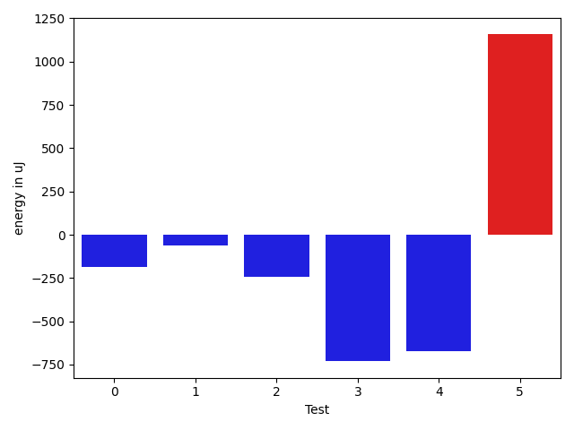

# gson 4e4f9b

https://github.com/google/gson/commit/4e4f9b

## Delta Energy per test method

| ID | EnergyV1 | EnergyV2 | DeltaEnergy | σV1 | σV2 |
| --- | --- | --- | --- | --- | --- |
| 0 | 37598 | 37414 | -184 | 3238.9063447325825 | 3800.8532695157915 |
| 1 | 37353 | 37293 | -60 | 3364.7443445881395 | 3424.5955401530796 |
| 2 | 39368 | 39124 | -244 | 14642.609325131498 | 12138.522968977832 |
| 3 | 38391 | 37659 | -732 | 14156.393376281834 | 13112.798581418117 |
| 4 | 39917 | 39245 | -672 | 10804.894318271927 | 3817.985245659917 |
| 5 | 35523 | 36682 | 1159 | 3433.8956177940713 | 4044.5519495022218 |

## Delta Duration per test method

| ID | DurationV1 | DurationsV2 | DeltaDuration |
| --- | --- | --- | --- |
| 0 | 842125.1428571428 | 1216358.5416666667 | 374233.3988095239 |
| 1 | 768137.4230769231 | 953017.5454545454 | 184880.1223776223 |
| 2 | 1395825.2950819673 | 1332930.2 | -62895.0950819673 |
| 3 | 1429110.7936507936 | 1506853.7101449275 | 77742.91649413388 |
| 4 | 922285.0 | 892602.8148148148 | -29682.185185185168 |
| 5 | 920513.5 | 892848.5 | -27665.0 |

## Misc.

| ID | Test Class | Test Method |
| --- | --- | --- |
| 0 | com.google.gson.DisjunctionExclusionStrategyTest | testBadInstantiation |
| 1 | com.google.gson.JsonObjectTest | testAddingNullOrEmptyPropertyName |
| 2 | com.google.gson.ModifyFirstLetterNamingPolicyTest | testInvalidConstruction |
| 3 | com.google.gson.VersionExclusionStrategyTest | testDisallowNegativeValuesAndFailFast |
| 4 | com.google.gson.CamelCaseSeparatorNamingPolicyTest | testInvalidInstantiation |
| 5 | com.google.gson.JavaFieldNamingPolicyTest | testNullField |

| Test | IterationV1 | IterationV2 | DeltaIteration |
| --- | --- | --- | --- |
| 0 | 28 | 24 | -4 |
| 1 | 26 | 22 | -4 |
| 2 | 61 | 65 | 4 |
| 3 | 63 | 69 | 6 |
| 4 | 21 | 27 | 6 |
| 5 | 26 | 24 | -2 |

| Time Label | Time (s) |
| --- | --- |
| Selection | 25.96170139312744 |
| Injection | 9.722789764404297 |
| Total | 1066.067456483841 |

