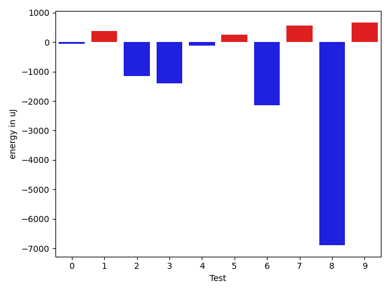
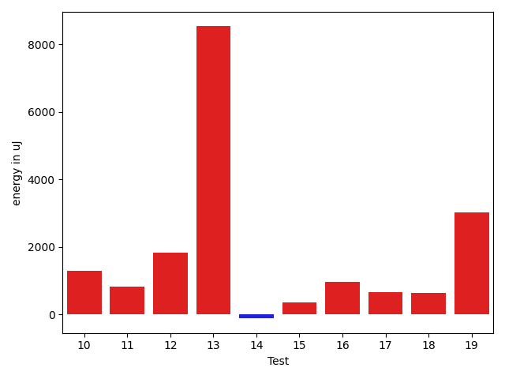
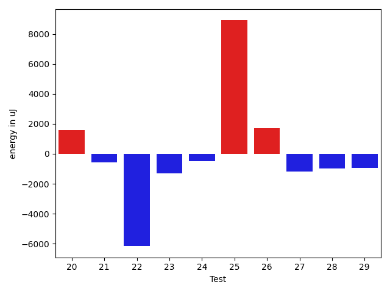
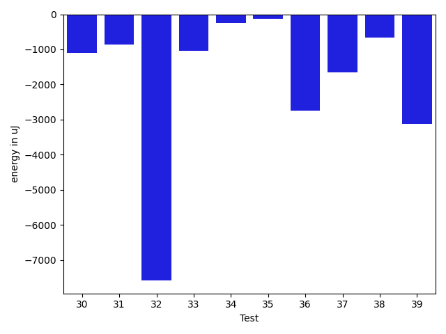
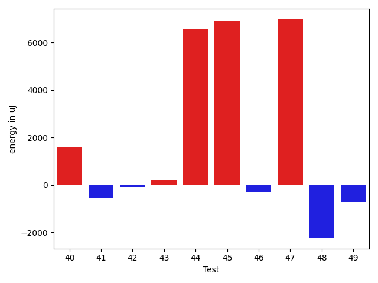
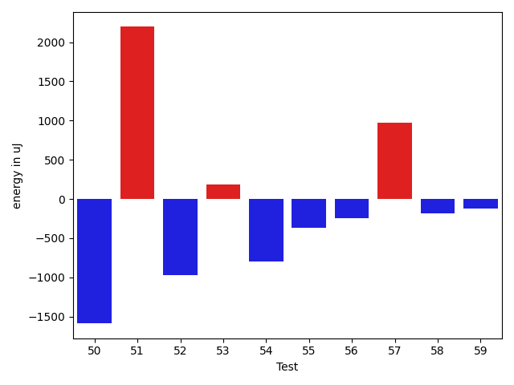
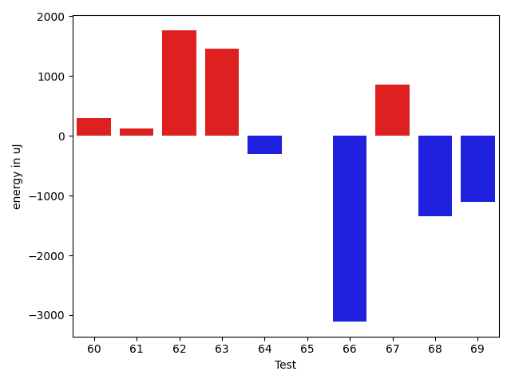
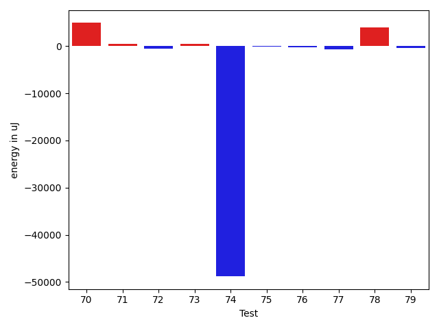
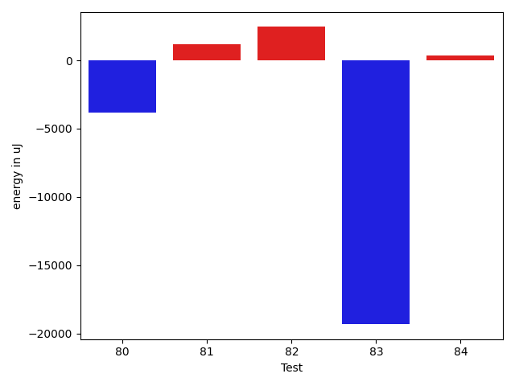

# gson 52288d

https://github.com/google/gson/commit/52288d

## Delta Energy per test method

| ID | EnergyV1 | EnergyV2 | DeltaEnergy | σV1 | σV2 |
| --- | --- | --- | --- | --- | --- |
| 0 | 38391 | 38330 | -61 | 7084.78777103129 | 5232.629635132419 |
| 1 | 37842 | 38207 | 365 | 8458.85262946443 | 4208.904812109641 |
| 2 | 38941 | 37781 | -1160 | 22635.09670159622 | 16078.87517062674 |
| 3 | 38757 | 37353 | -1404 | 4886.375645749428 | 3769.6046207964705 |
| 4 | 38453 | 38330 | -123 | 36075.90468877043 | 27867.505791015217 |
| 5 | 38147 | 38391 | 244 | 26391.212170015548 | 19495.956066062325 |
| 6 | 39184 | 37048 | -2136 | 5741.925653158528 | 8785.814287041394 |
| 7 | 39429 | 39978 | 549 | 24715.31070176946 | 20428.348511044554 |
| 8 | 112060 | 105164 | -6896 | 410852.6104416755 | 201625.84097296937 |
| 9 | 36865 | 37536 | 671 | 5897.670676127375 | 6565.104516152997 |
| 10 | 35218 | 36499 | 1281 | 3789.8468359460853 | 3897.6874412767606 |
| 11 | 36194 | 36682 | 488 | 3737.1901664572333 | 3249.686221855284 |
| 12 | 36743 | 36927 | 184 | 10357.885758472245 | 13883.129953858168 |
| 13 | 38452 | 39550 | 1098 | 42113.299610061804 | 62839.22394130997 |
| 14 | 36133 | 37231 | 1098 | 4821.427462207986 | 4132.272841685848 |
| 15 | 34912 | 35889 | 977 | 3903.824022810836 | 5915.521999353776 |
| 16 | 37232 | 36926 | -306 | 4422.18082928781 | 8766.10903104788 |
| 17 | 34851 | 35400 | 549 | 4093.0196695832606 | 4415.749766685549 |
| 18 | 35827 | 36804 | 977 | 4448.93481001615 | 6681.16089084918 |
| 19 | 37414 | 37231 | -183 | 4029.370813587256 | 26139.661986394854 |
| 20 | 37048 | 38818 | 1770 | 4559.412995825289 | 5450.749527160864 |
| 21 | 35278 | 34729 | -549 | 3541.308886235643 | 3389.93857695911 |
| 22 | 39551 | 38086 | -1465 | 70656.54292286719 | 56644.11757415686 |
| 23 | 36072 | 35766 | -306 | 7586.427240697692 | 4033.1332284725727 |
| 24 | 35522 | 35034 | -488 | 4232.600656573296 | 3981.7934235788216 |
| 25 | 72265 | 82092 | 9827 | 52535.027788005755 | 50347.77728153598 |
| 26 | 39245 | 39002 | -243 | 13523.512945825492 | 16439.199633163258 |
| 27 | 36743 | 35522 | -1221 | 4052.6792101567876 | 4257.570285619806 |
| 28 | 35461 | 34668 | -793 | 13575.09933388944 | 13273.799713827619 |
| 29 | 36377 | 35462 | -915 | 5812.2267566054325 | 7132.48406059131 |
| 30 | 35706 | 34607 | -1099 | 3166.2493245024325 | 3357.658606446259 |
| 31 | 37842 | 36987 | -855 | 13189.276245582989 | 11410.28259006552 |
| 32 | 82641 | 75073 | -7568 | 111891.00972429528 | 120986.57273202628 |
| 33 | 36255 | 35217 | -1038 | 10476.140757198218 | 10592.746508861352 |
| 34 | 70557 | 70313 | -244 | 30513.88787321051 | 31383.31356661966 |
| 35 | 36682 | 36560 | -122 | 16164.745215557512 | 16747.379353185388 |
| 36 | 41626 | 38879 | -2747 | 78200.0292481857 | 75926.82826700398 |
| 37 | 72632 | 70983 | -1649 | 22686.530603321145 | 19641.05439623177 |
| 38 | 39246 | 38574 | -672 | 18162.25989937182 | 14948.893456376065 |
| 39 | 79041 | 75928 | -3113 | 33346.76230780468 | 29492.985834941417 |
| 40 | 35827 | 36193 | 366 | 12163.394678519273 | 13572.900336869016 |
| 41 | 36072 | 35950 | -122 | 6206.227821486122 | 6595.184272425444 |
| 42 | 35156 | 34973 | -183 | 3103.169764304518 | 3642.8942000262477 |
| 43 | 38757 | 39551 | 794 | 42893.15319286194 | 40350.88290165047 |
| 44 | 39551 | 38269 | -1282 | 12639.22303787893 | 29946.871704570352 |
| 45 | 39123 | 40283 | 1160 | 16351.66537855835 | 33332.17797816998 |
| 46 | 38147 | 38879 | 732 | 4713.627332416578 | 4543.010382532229 |
| 47 | 83740 | 97107 | 13367 | 26583.26901865134 | 26941.086006852995 |
| 48 | 40832 | 39734 | -1098 | 21023.143004888232 | 26634.614500331467 |
| 49 | 37841 | 36987 | -854 | 4141.757856064948 | 3797.624273250713 |
| 50 | 36011 | 34423 | -1588 | 3487.1468593281775 | 3759.8732403047575 |
| 51 | 35218 | 37414 | 2196 | 4052.781412751782 | 4151.126518656174 |
| 52 | 36071 | 35096 | -975 | 3908.4619083328535 | 3846.3949035083133 |
| 53 | 35949 | 36133 | 184 | 3893.412299119216 | 3282.814633308842 |
| 54 | 36499 | 35706 | -793 | 12213.51955935438 | 7478.474559898936 |
| 55 | 37292 | 36926 | -366 | 17322.139136599955 | 15237.34575650548 |
| 56 | 40344 | 40100 | -244 | 91910.63186184356 | 75478.82326737477 |
| 57 | 36987 | 37963 | 976 | 3607.9154362337613 | 4401.195847762193 |
| 58 | 36865 | 36682 | -183 | 3929.5934573179347 | 4495.2914194887835 |
| 59 | 35217 | 35095 | -122 | 6464.292079567763 | 3671.9283497643214 |
| 60 | 35645 | 35949 | 304 | 4047.2484839279928 | 3815.6693056269805 |
| 61 | 35583 | 35706 | 123 | 3536.8928766928534 | 3979.035869186889 |
| 62 | 37781 | 39551 | 1770 | 37330.94015758553 | 45308.32063042776 |
| 63 | 36011 | 37476 | 1465 | 4126.854217740189 | 6588.7758682708045 |
| 64 | 36743 | 36438 | -305 | 4361.869890024232 | 4174.163902340204 |
| 65 | 35156 | 35156 | 0 | 3592.266413335041 | 4068.587929287038 |
| 66 | 78797 | 75684 | -3113 | 79670.1241894114 | 116704.90423988404 |
| 67 | 39489 | 40344 | 855 | 26458.0373335027 | 18051.953019685658 |
| 68 | 39246 | 37903 | -1343 | 11693.803966718437 | 7890.573942075461 |
| 69 | 40100 | 39002 | -1098 | 4375.9063036967145 | 9149.90883224238 |
| 70 | 39611 | 37841 | -1770 | 17364.750788882637 | 26667.697869934313 |
| 71 | 38575 | 37170 | -1405 | 6873.001937531298 | 16098.419608879827 |
| 72 | 88256 | 92285 | 4029 | 477702.7787431033 | 460316.4621668962 |
| 73 | 42969 | 41565 | -1404 | 22861.166255004187 | 22635.712098223317 |
| 74 | 39917 | 40955 | 1038 | 444578.58780045976 | 327122.78901606245 |
| 75 | 40467 | 41992 | 1525 | 20157.69751914122 | 18048.61120608083 |
| 76 | 37842 | 37658 | -184 | 7557.18982575436 | 4254.6610271037525 |
| 77 | 39917 | 38697 | -1220 | 5645.893855493565 | 8249.994431332956 |
| 78 | 38941 | 38269 | -672 | 9434.997788292752 | 23043.913624053224 |
| 79 | 39612 | 36743 | -2869 | 7386.846209218048 | 9924.097747957767 |
| 80 | 43762 | 41260 | -2502 | 43715.049506865485 | 39440.01913687925 |
| 81 | 40466 | 39429 | -1037 | 15989.17230212255 | 20166.962850898894 |
| 82 | 40467 | 40161 | -306 | 20713.37797645228 | 24455.354866902166 |
| 83 | 84533 | 80505 | -4028 | 144204.69354288708 | 128368.14558776439 |
| 84 | 40833 | 39673 | -1160 | 57910.64845592743 | 54743.03675062729 |

## Delta Duration per test method

| ID | DurationV1 | DurationsV2 | DeltaDuration |
| --- | --- | --- | --- |
| 0 | 970163.1304347826 | 1000494.7297297297 | 30331.59929494711 |
| 1 | 904126.4705882353 | 897399.4722222222 | -6726.998366013053 |
| 2 | 1408466.0571428572 | 1298303.1578947369 | -110162.89924812037 |
| 3 | 944379.6349206349 | 973114.0 | 28734.36507936509 |
| 4 | 1722549.8333333333 | 1399151.28 | -323398.5533333332 |
| 5 | 991138.679245283 | 933068.2553191489 | -58070.42392613413 |
| 6 | 760515.64 | 865532.5306122449 | 105016.89061224484 |
| 7 | 1417887.7 | 1278363.736111111 | -139523.96388888895 |
| 8 | 5956777.97979798 | 3860899.3333333335 | -2095878.6464646463 |
| 9 | 1080335.921875 | 964805.1774193548 | -115530.74445564521 |
| 10 | 769517.75 | 801194.195652174 | 31676.44565217395 |
| 11 | 795027.1304347826 | 776189.914893617 | -18837.215541165555 |
| 12 | 1136898.5076923077 | 1191689.6949152541 | 54791.187222946435 |
| 13 | 1451186.9696969697 | 1766544.3472222222 | 315357.3775252525 |
| 14 | 860610.5555555555 | 869068.8148148148 | 8458.259259259328 |
| 15 | 952537.9344262296 | 983000.1343283582 | 30462.19990212866 |
| 16 | 943740.4246575342 | 1057694.4179104478 | 113953.99325291358 |
| 17 | 796064.6304347826 | 830830.2545454545 | 34765.624110671924 |
| 18 | 784410.4897959183 | 834527.5849056604 | 50117.09510974202 |
| 19 | 985391.9827586206 | 1275002.3823529412 | 289610.39959432057 |
| 20 | 818735.9245283019 | 879796.0535714285 | 61060.129043126595 |
| 21 | 858779.2580645161 | 841975.3666666667 | -16803.891397849424 |
| 22 | 1498843.7966101696 | 1396522.0983606558 | -102321.69824951375 |
| 23 | 803649.28 | 819268.6949152543 | 15619.414915254223 |
| 24 | 791546.0222222222 | 787904.6666666666 | -3641.3555555555504 |
| 25 | 2561825.6210526316 | 2757216.3829787234 | 195390.76192609174 |
| 26 | 1410789.5842696629 | 1463406.5957446808 | 52617.01147501799 |
| 27 | 925468.0 | 881664.5645161291 | -43803.43548387091 |
| 28 | 1407740.4432989692 | 1402056.1340206186 | -5684.309278350556 |
| 29 | 1130234.1511627906 | 1141452.2051282052 | 11218.053965414641 |
| 30 | 873460.421875 | 860312.4626865672 | -13147.959188432782 |
| 31 | 1357624.1170212766 | 1325639.694736842 | -31984.42228443455 |
| 32 | 3526155.696969697 | 3459050.474747475 | -67105.22222222202 |
| 33 | 1334265.8041237113 | 1331976.440860215 | -2289.3632634961978 |
| 34 | 2355758.727272727 | 2349843.242424242 | -5915.484848484863 |
| 35 | 1511547.888888889 | 1476531.051020408 | -35016.83786848094 |
| 36 | 2375166.087912088 | 2178534.076923077 | -196632.0109890108 |
| 37 | 2279863.262626263 | 2277722.909090909 | -2140.3535353536718 |
| 38 | 1487946.5376344086 | 1452250.4421052632 | -35696.09552914533 |
| 39 | 2765157.696969697 | 2602407.474747475 | -162750.22222222202 |
| 40 | 1385074.3711340206 | 1409755.7916666667 | 24681.420532646123 |
| 41 | 1266344.1789473684 | 1239644.7802197803 | -26699.398727588123 |
| 42 | 1080316.8 | 1064590.013888889 | -15726.786111111054 |
| 43 | 1108203.081632653 | 1125109.5625 | 16906.48086734698 |
| 44 | 808903.2653061225 | 1206264.6792452831 | 397361.41393916064 |
| 45 | 926813.9375 | 1159949.46 | 233135.52249999996 |
| 46 | 897648.8367346938 | 941125.2807017544 | 43476.443967060535 |
| 47 | 2748760.111111111 | 2838874.02020202 | 90113.90909090918 |
| 48 | 1344428.507936508 | 1276940.9545454546 | -67487.55339105334 |
| 49 | 777018.9387755102 | 803758.7959183673 | 26739.85714285716 |
| 50 | 817076.7741935484 | 828161.3191489362 | 11084.544955387828 |
| 51 | 838266.1176470588 | 839215.5769230769 | 949.4592760180822 |
| 52 | 787148.5333333333 | 731416.4893617021 | -55732.04397163121 |
| 53 | 924859.8888888889 | 848436.574074074 | -76423.31481481483 |
| 54 | 1073671.985074627 | 1076194.4166666667 | 2522.431592039764 |
| 55 | 1526425.5454545454 | 1495241.606060606 | -31183.93939393945 |
| 56 | 2078692.25 | 1610234.2878787878 | -468457.96212121216 |
| 57 | 860956.7368421053 | 805906.4347826086 | -55050.30205949664 |
| 58 | 809701.875 | 798151.3829787234 | -11550.492021276616 |
| 59 | 867402.4081632653 | 796236.1525423729 | -71166.25562089239 |
| 60 | 863064.9803921569 | 816417.0 | -46647.98039215687 |
| 61 | 812779.2093023256 | 799357.7931034482 | -13421.416198877385 |
| 62 | 1333962.671641791 | 1554046.0350877193 | 220083.36344592832 |
| 63 | 856453.0983606557 | 843558.0192307692 | -12895.079129886464 |
| 64 | 824508.775 | 781396.22 | -43112.55500000005 |
| 65 | 807642.8333333334 | 781006.4444444445 | -26636.388888888876 |
| 66 | 2635971.5164835164 | 3151882.5 | 515910.98351648357 |
| 67 | 1556521.8620689656 | 1526541.7228915663 | -29980.13917739922 |
| 68 | 1024169.9344262296 | 1001258.1428571428 | -22911.791569086723 |
| 69 | 925767.6458333334 | 903454.5818181818 | -22313.064015151584 |
| 70 | 1032861.16 | 1289675.962962963 | 256814.8029629629 |
| 71 | 1154379.7162162163 | 1224189.9736842106 | 69810.25746799423 |
| 72 | 6412113.96969697 | 6386894.919191919 | -25219.050505050458 |
| 73 | 1762609.112244898 | 1776967.1515151516 | 14358.03927025362 |
| 74 | 4517059.847222222 | 3092548.2328767125 | -1424511.6143455096 |
| 75 | 1427486.8513513512 | 1319375.1466666667 | -108111.70468468452 |
| 76 | 987111.0615384616 | 1025302.75 | 38191.688461538404 |
| 77 | 1063095.675 | 1049054.9636363636 | -14040.711363636423 |
| 78 | 914946.1666666666 | 1064476.111111111 | 149529.94444444438 |
| 79 | 799182.9615384615 | 818573.6285714286 | 19390.66703296709 |
| 80 | 2098125.052631579 | 2034660.8279569892 | -63464.2246745897 |
| 81 | 1358742.985915493 | 1377876.1341463414 | 19133.14823084837 |
| 82 | 1169084.0163934426 | 1259203.7636363637 | 90119.74724292103 |
| 83 | 4082472.0606060605 | 3522435.212121212 | -560036.8484848486 |
| 84 | 1677194.7608695652 | 1748856.8043478262 | 71662.04347826098 |

## Misc.

| ID | Test Class | Test Method |
| --- | --- | --- |
| 0 | com.google.gson.functional.CustomTypeAdaptersTest | testCustomAdapterInvokedForCollectionElementDeserialization |
| 1 | com.google.gson.functional.CustomTypeAdaptersTest | testCustomAdapterInvokedForMapElementSerializationWithType |
| 2 | com.google.gson.functional.CustomTypeAdaptersTest | testCustomAdapterInvokedForCollectionElementSerializationWithType |
| 3 | com.google.gson.functional.CustomTypeAdaptersTest | testCustomAdapterInvokedForMapElementDeserialization |
| 4 | com.google.gson.functional.DefaultTypeAdaptersTest | testTreeSetDeserialization |
| 5 | com.google.gson.ParameterizedTypeTest | testNotEquals |
| 6 | com.google.gson.ParameterizedTypeTest | testOurTypeFunctionality |
| 7 | com.google.gson.functional.MapAsArrayTypeAdapterTest | testTwoTypesCollapseToOneSerialize |
| 8 | com.google.gson.functional.MapAsArrayTypeAdapterTest | testSerializeComplexMapWithTypeAdapter |
| 9 | com.google.gson.functional.MapAsArrayTypeAdapterTest | testTwoTypesCollapseToOneDeserialize |
| 10 | com.google.gson.functional.CollectionTest | testNullsInListDeserialization |
| 11 | com.google.gson.functional.CollectionTest | testCollectionOfStringsDeserialization |
| 12 | com.google.gson.functional.CollectionTest | testWildcardPrimitiveCollectionSerilaization |
| 13 | com.google.gson.functional.CollectionTest | testTopLevelCollectionOfIntegersDeserialization |
| 14 | com.google.gson.functional.CollectionTest | testQueueSerialization |
| 15 | com.google.gson.functional.CollectionTest | testSetDeserialization |
| 16 | com.google.gson.functional.CollectionTest | testLinkedListSerialization |
| 17 | com.google.gson.functional.CollectionTest | testCollectionOfObjectSerialization |
| 18 | com.google.gson.functional.CollectionTest | testNullsInListSerialization |
| 19 | com.google.gson.functional.CollectionTest | testTopLevelListOfIntegerCollectionsDeserialization |
| 20 | com.google.gson.functional.CollectionTest | testLinkedListDeserialization |
| 21 | com.google.gson.functional.CollectionTest | testWildcardPrimitiveCollectionDeserilaization |
| 22 | com.google.gson.functional.CollectionTest | testTopLevelCollectionOfIntegersSerialization |
| 23 | com.google.gson.functional.CollectionTest | testQueueDeserialization |
| 24 | com.google.gson.functional.CollectionTest | testCollectionOfObjectWithNullSerialization |
| 25 | com.google.gson.functional.InheritanceTest | testSubInterfacesOfCollectionSerialization |
| 26 | com.google.gson.functional.InheritanceTest | testSubInterfacesOfCollectionDeserialization |
| 27 | com.google.gson.functional.ParameterizedTypesTest | testParameterizedTypesWithWriterSerialization |
| 28 | com.google.gson.functional.ParameterizedTypesTest | testVariableTypeArrayDeserialization |
| 29 | com.google.gson.functional.ParameterizedTypesTest | testParameterizedTypeWithReaderDeserialization |
| 30 | com.google.gson.functional.ParameterizedTypesTest | testDeepParameterizedTypeDeserialization |
| 31 | com.google.gson.functional.ParameterizedTypesTest | testParameterizedTypeWithCustomSerializer |
| 32 | com.google.gson.functional.ParameterizedTypesTest | testParameterizedTypesSerialization |
| 33 | com.google.gson.functional.ParameterizedTypesTest | testVariableTypeDeserialization |
| 34 | com.google.gson.functional.ParameterizedTypesTest | testVariableTypeFieldsAndGenericArraysSerialization |
| 35 | com.google.gson.functional.ParameterizedTypesTest | testParameterizedTypeGenericArraysDeserialization |
| 36 | com.google.gson.functional.ParameterizedTypesTest | testParameterizedTypeDeserialization |
| 37 | com.google.gson.functional.ParameterizedTypesTest | testVariableTypeFieldsAndGenericArraysDeserialization |
| 38 | com.google.gson.functional.ParameterizedTypesTest | testTypesWithMultipleParametersDeserialization |
| 39 | com.google.gson.functional.ParameterizedTypesTest | testTypesWithMultipleParametersSerialization |
| 40 | com.google.gson.functional.ParameterizedTypesTest | testParameterizedTypeWithVariableTypeDeserialization |
| 41 | com.google.gson.functional.ParameterizedTypesTest | testParameterizedTypesWithCustomDeserializer |
| 42 | com.google.gson.functional.ParameterizedTypesTest | testParameterizedTypeGenericArraysSerialization |
| 43 | com.google.gson.ParameterizedTypeHandlerMapTest | testHasSpecificType |
| 44 | com.google.gson.ParameterizedTypeHandlerMapTest | testHasGenericButNotSpecific |
| 45 | com.google.gson.DefaultMapJsonSerializerTest | testEmptyMapSerialization |
| 46 | com.google.gson.DefaultMapJsonSerializerTest | testNonEmptyMapSerialization |
| 47 | com.google.gson.functional.ObjectTest | testSingletonLists |
| 48 | com.google.gson.functional.ObjectTest | testTruncatedDeserialization |
| 49 | com.google.gson.functional.MapTest | testMapSerializationEmpty |
| 50 | com.google.gson.functional.MapTest | testMapOfMapDeserialization |
| 51 | com.google.gson.functional.MapTest | testMapDeserializationWithNullKey |
| 52 | com.google.gson.functional.MapTest | testReadMapsWithEmptyStringKey |
| 53 | com.google.gson.functional.MapTest | testMapSerializationWithNullValueButSerializeNulls |
| 54 | com.google.gson.functional.MapTest | testMapSerializationWithWildcardValues |
| 55 | com.google.gson.functional.MapTest | testParameterizedMapSubclassSerialization |
| 56 | com.google.gson.functional.MapTest | testMapSerialization |
| 57 | com.google.gson.functional.MapTest | testMapDeserializationWithNullValue |
| 58 | com.google.gson.functional.MapTest | testMapDeserializationEmpty |
| 59 | com.google.gson.functional.MapTest | testMapDeserializationWithIntegerKeys |
| 60 | com.google.gson.functional.MapTest | testMapStandardSubclassDeserialization |
| 61 | com.google.gson.functional.MapTest | testMapSerializationWithIntegerKeys |
| 62 | com.google.gson.functional.MapTest | testMapDeserialization |
| 63 | com.google.gson.functional.MapTest | testMapSerializationWithNullKey |
| 64 | com.google.gson.functional.MapTest | testMapSerializationWithNullValue |
| 65 | com.google.gson.functional.MapTest | testMapDeserializationWithWildcardValues |
| 66 | com.google.gson.functional.EnumTest | testEnumSubclass |
| 67 | com.google.gson.functional.EnumTest | testEnumSubclassWithRegisteredTypeAdapter |
| 68 | com.google.gson.functional.EnumTest | testCollectionOfEnumsDeserialization |
| 69 | com.google.gson.functional.EnumTest | testCollectionOfEnumsSerialization |
| 70 | com.google.gson.GenericArrayTypeTest | testNotEquals |
| 71 | com.google.gson.GenericArrayTypeTest | testOurTypeFunctionality |
| 72 | com.google.gson.functional.TypeVariableTest | testAdvancedTypeVariables |
| 73 | com.google.gson.functional.TypeVariableTest | testTypeVariablesViaTypeParameter |
| 74 | com.google.gson.CommentsTest | testParseComments |
| 75 | com.google.gson.functional.ArrayTest | testArrayOfCollectionSerialization |
| 76 | com.google.gson.functional.ArrayTest | testArrayOfCollectionDeserialization |
| 77 | com.google.gson.reflect.TypeTokenTest | testIsAssignableFromWithBasicWildcards |
| 78 | com.google.gson.reflect.TypeTokenTest | testIsAssignableFromWithTypeParameters |
| 79 | com.google.gson.reflect.TypeTokenTest | testIsAssignableFromWithNestedWildcards |
| 80 | com.google.gson.MixedStreamTest | testWriteHtmlSafe |
| 81 | com.google.gson.MixedStreamTest | testWriteLenient |
| 82 | com.google.gson.MixedStreamTest | testReadClosed |
| 83 | com.google.gson.functional.PrettyPrintingTest | testPrettyPrintList |
| 84 | com.google.gson.FieldAttributesTest | testDeclaredTypeAndClass |

| Test | IterationV1 | IterationV2 | DeltaIteration |
| --- | --- | --- | --- |
| 0 | 69 | 74 | 5 |
| 1 | 51 | 72 | 21 |
| 2 | 70 | 76 | 6 |
| 3 | 63 | 56 | -7 |
| 4 | 78 | 75 | -3 |
| 5 | 53 | 47 | -6 |
| 6 | 50 | 49 | -1 |
| 7 | 80 | 72 | -8 |
| 8 | 99 | 99 | 0 |
| 9 | 64 | 62 | -2 |
| 10 | 48 | 46 | -2 |
| 11 | 46 | 47 | 1 |
| 12 | 65 | 59 | -6 |
| 13 | 66 | 72 | 6 |
| 14 | 45 | 54 | 9 |
| 15 | 61 | 67 | 6 |
| 16 | 73 | 67 | -6 |
| 17 | 46 | 55 | 9 |
| 18 | 49 | 53 | 4 |
| 19 | 58 | 68 | 10 |
| 20 | 53 | 56 | 3 |
| 21 | 62 | 60 | -2 |
| 22 | 59 | 61 | 2 |
| 23 | 50 | 59 | 9 |
| 24 | 45 | 48 | 3 |
| 25 | 95 | 94 | -1 |
| 26 | 89 | 94 | 5 |
| 27 | 62 | 62 | 0 |
| 28 | 97 | 97 | 0 |
| 29 | 86 | 78 | -8 |
| 30 | 64 | 67 | 3 |
| 31 | 94 | 95 | 1 |
| 32 | 99 | 99 | 0 |
| 33 | 97 | 93 | -4 |
| 34 | 99 | 99 | 0 |
| 35 | 99 | 98 | -1 |
| 36 | 91 | 91 | 0 |
| 37 | 99 | 99 | 0 |
| 38 | 93 | 95 | 2 |
| 39 | 99 | 99 | 0 |
| 40 | 97 | 96 | -1 |
| 41 | 95 | 91 | -4 |
| 42 | 80 | 72 | -8 |
| 43 | 49 | 48 | -1 |
| 44 | 49 | 53 | 4 |
| 45 | 48 | 50 | 2 |
| 46 | 49 | 57 | 8 |
| 47 | 99 | 99 | 0 |
| 48 | 63 | 66 | 3 |
| 49 | 49 | 49 | 0 |
| 50 | 62 | 47 | -15 |
| 51 | 51 | 52 | 1 |
| 52 | 45 | 47 | 2 |
| 53 | 54 | 54 | 0 |
| 54 | 67 | 60 | -7 |
| 55 | 99 | 99 | 0 |
| 56 | 60 | 66 | 6 |
| 57 | 57 | 46 | -11 |
| 58 | 56 | 47 | -9 |
| 59 | 49 | 59 | 10 |
| 60 | 51 | 51 | 0 |
| 61 | 43 | 58 | 15 |
| 62 | 67 | 57 | -10 |
| 63 | 61 | 52 | -9 |
| 64 | 40 | 50 | 10 |
| 65 | 48 | 54 | 6 |
| 66 | 91 | 88 | -3 |
| 67 | 87 | 83 | -4 |
| 68 | 61 | 49 | -12 |
| 69 | 48 | 55 | 7 |
| 70 | 50 | 54 | 4 |
| 71 | 74 | 76 | 2 |
| 72 | 99 | 99 | 0 |
| 73 | 98 | 99 | 1 |
| 74 | 72 | 73 | 1 |
| 75 | 74 | 75 | 1 |
| 76 | 65 | 60 | -5 |
| 77 | 40 | 55 | 15 |
| 78 | 54 | 54 | 0 |
| 79 | 26 | 35 | 9 |
| 80 | 95 | 93 | -2 |
| 81 | 71 | 82 | 11 |
| 82 | 61 | 55 | -6 |
| 83 | 99 | 99 | 0 |
| 84 | 46 | 46 | 0 |

| Time Label | Time (s) |
| --- | --- |
| Selection | 28.40401577949524 |
| Injection | 13.069382667541504 |
| Total | 1134.0649101734161 |

