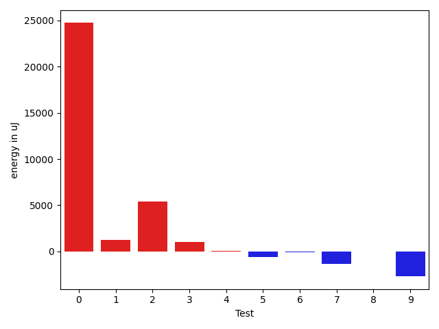
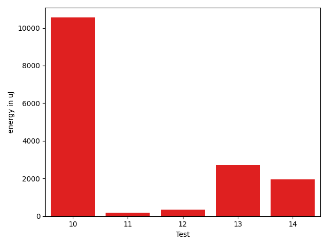

# gson 3d006c

https://github.com/google/gson/commit/3d006c

## Delta Energy per test method

| ID | EnergyV1 | EnergyV2 | DeltaEnergy | σV1 | σV2 |
| --- | --- | --- | --- | --- | --- |
| 0 | 42663 | 46386 | 3723 | 22855.25924841789 | 183063.4475809564 |
| 1 | 37964 | 38819 | 855 | 14893.356745427309 | 14081.365702105622 |
| 2 | 36865 | 37536 | 671 | 4601.908042345798 | 34757.40159051398 |
| 3 | 37292 | 38086 | 794 | 5048.9935644878715 | 5098.555158230864 |
| 4 | 38025 | 38758 | 733 | 4396.652260527321 | 5259.260951672341 |
| 5 | 38635 | 38696 | 61 | 3371.6305932886535 | 5035.675149359472 |
| 6 | 38513 | 38879 | 366 | 4098.230162182478 | 4009.38389678937 |
| 7 | 37414 | 34607 | -2807 | 4252.483608724334 | 4978.446363519893 |
| 8 | 38086 | 37720 | -366 | 5633.151233616217 | 6071.546881445762 |
| 9 | 39368 | 41016 | 1648 | 81190.43350062387 | 70551.28748873711 |
| 10 | 40955 | 40954 | -1 | 105493.63723777757 | 119613.09781784323 |
| 11 | 38635 | 40161 | 1526 | 4988.147204011614 | 4470.097877654657 |
| 12 | 38146 | 39977 | 1831 | 4974.106797210817 | 4933.490114783957 |
| 13 | 36621 | 39367 | 2746 | 4398.496080271445 | 4789.692016089094 |
| 14 | 36254 | 38391 | 2137 | 7056.735578077416 | 8097.471925838558 |

## Delta Duration per test method

| ID | DurationV1 | DurationsV2 | DeltaDuration |
| --- | --- | --- | --- |
| 0 | 1731438.5729166667 | 2587936.6315789474 | 856498.0586622807 |
| 1 | 1257267.4659090908 | 1411877.0975609757 | 154609.63165188488 |
| 2 | 977802.5081967213 | 1159069.7142857143 | 181267.206088993 |
| 3 | 1025185.641509434 | 1018516.1694915254 | -6669.472017908585 |
| 4 | 694844.25 | 780192.8235294118 | 85348.5735294118 |
| 5 | 569040.16 | 585703.5555555555 | 16663.39555555547 |
| 6 | 543992.5333333333 | 535241.1176470588 | -8751.41568627453 |
| 7 | 822886.5555555555 | 989938.8333333334 | 167052.27777777787 |
| 8 | 1213884.602739726 | 1222961.825 | 9077.222260273993 |
| 9 | 1855425.7215189873 | 1799992.2857142857 | -55433.43580470164 |
| 10 | 2546328.2291666665 | 2837129.4509803923 | 290801.2218137258 |
| 11 | 801636.4333333333 | 943461.0303030303 | 141824.59696969693 |
| 12 | 753181.1276595745 | 827263.8536585366 | 74082.72599896207 |
| 13 | 943436.2857142857 | 894759.0227272727 | -48677.262987012975 |
| 14 | 1092568.8260869565 | 927679.7435897436 | -164889.08249721292 |

## Misc.

| ID | Test Class | Test Method |
| --- | --- | --- |
| 0 | com.google.gson.functional.MapAsArrayTypeAdapterTest | testTwoTypesCollapseToOneSerialize |
| 1 | com.google.gson.functional.MapAsArrayTypeAdapterTest | testTwoTypesCollapseToOneDeserialize |
| 2 | com.google.gson.functional.CollectionTest | testRawCollectionOfBagOfPrimitivesNotAllowed |
| 3 | com.google.gson.functional.CollectionTest | testRawCollectionDeserializationNotAlllowed |
| 4 | com.google.gson.JsonPrimitiveTest | testFloatEqualsDouble |
| 5 | com.google.gson.JsonPrimitiveTest | testFloatEqualsBigDecimal |
| 6 | com.google.gson.JsonPrimitiveTest | testDoubleEqualsBigDecimal |
| 7 | com.google.gson.functional.JsonParserTest | testBadFieldTypeForCustomDeserializerCustomTree |
| 8 | com.google.gson.functional.JsonParserTest | testBadFieldTypeForDeserializingCustomTree |
| 9 | com.google.gson.functional.JsonTreeTest | testToJsonTreeObjectType |
| 10 | com.google.gson.functional.JsonTreeTest | testToJsonTree |
| 11 | com.google.gson.JsonParserTest | testParseMixedArray |
| 12 | com.google.gson.functional.ArrayTest | testArrayWithoutTypeInfoDeserialization |
| 13 | com.google.gson.functional.ArrayTest | testArrayOfObjectsWithoutTypeInfoDeserialization |
| 14 | com.google.gson.GsonTypeAdapterTest | testDefaultTypeAdapterThrowsParseException |

| Test | IterationV1 | IterationV2 | DeltaIteration |
| --- | --- | --- | --- |
| 0 | 96 | 95 | -1 |
| 1 | 88 | 82 | -6 |
| 2 | 61 | 63 | 2 |
| 3 | 53 | 59 | 6 |
| 4 | 20 | 17 | -3 |
| 5 | 25 | 18 | -7 |
| 6 | 15 | 17 | 2 |
| 7 | 45 | 36 | -9 |
| 8 | 73 | 80 | 7 |
| 9 | 79 | 77 | -2 |
| 10 | 48 | 51 | 3 |
| 11 | 30 | 33 | 3 |
| 12 | 47 | 41 | -6 |
| 13 | 35 | 44 | 9 |
| 14 | 46 | 39 | -7 |

| Time Label | Time (s) |
| --- | --- |
| Selection | 26.645811080932617 |
| Injection | 9.929550170898438 |
| Total | 1080.8389387130737 |

