# gson 451a9d

https://github.com/google/gson/commit/451a9d

## Delta Energy per test method

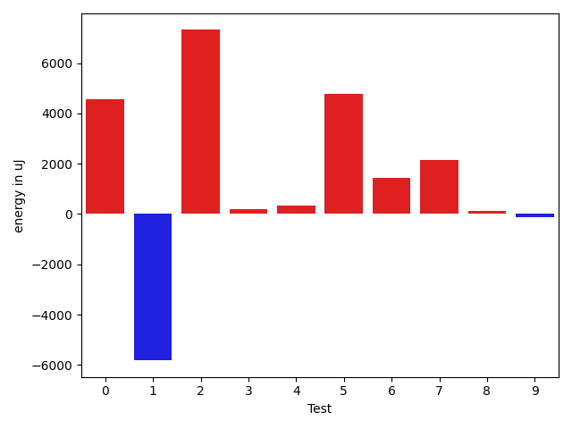

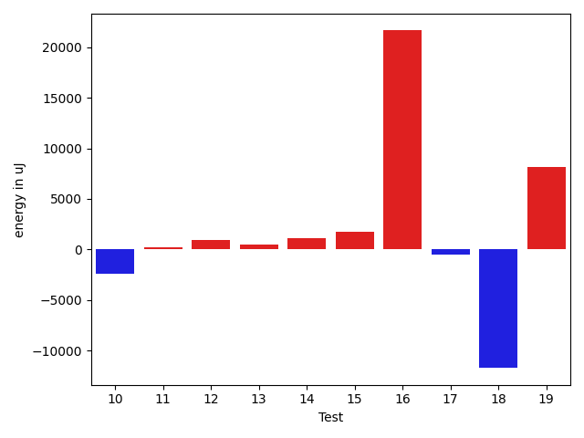

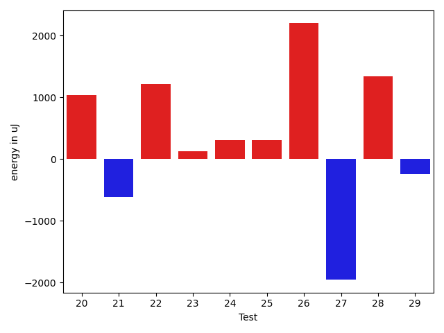

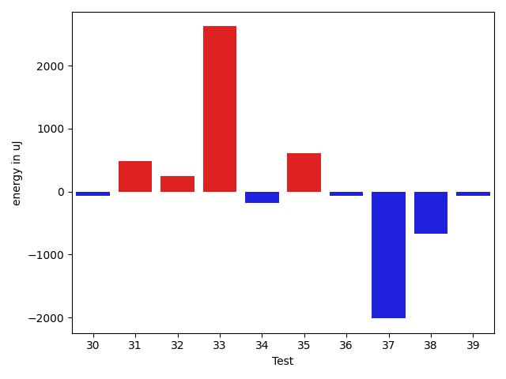

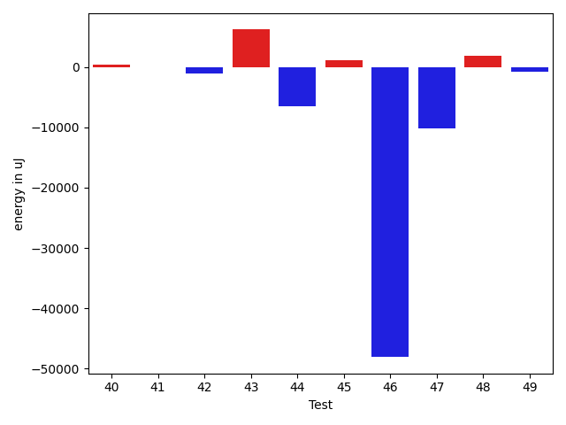

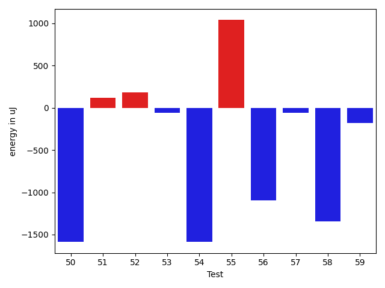

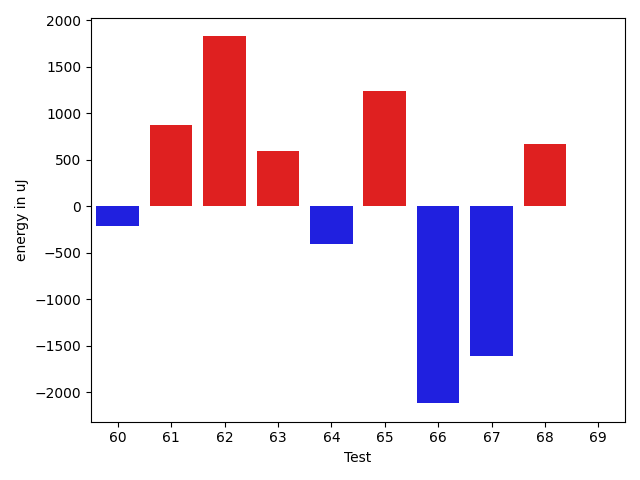

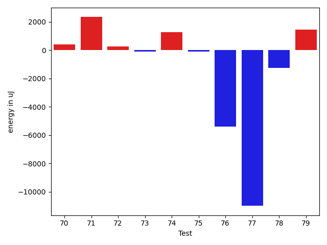

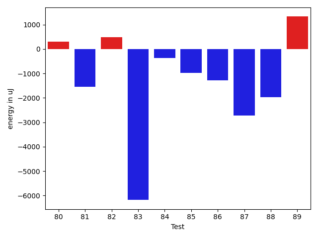

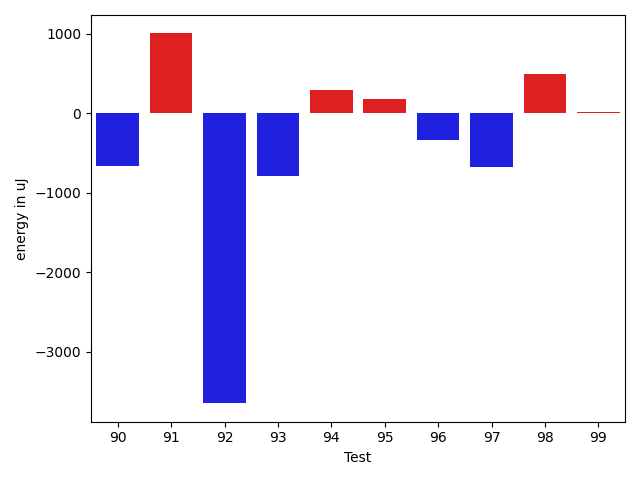

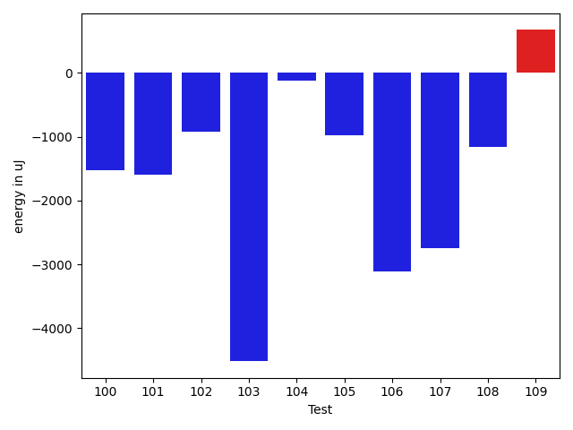

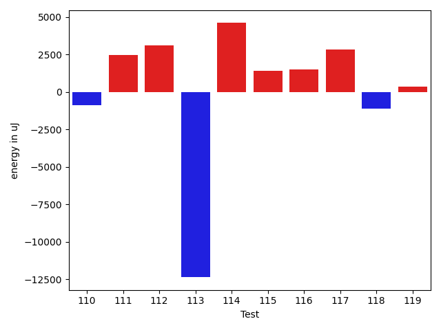

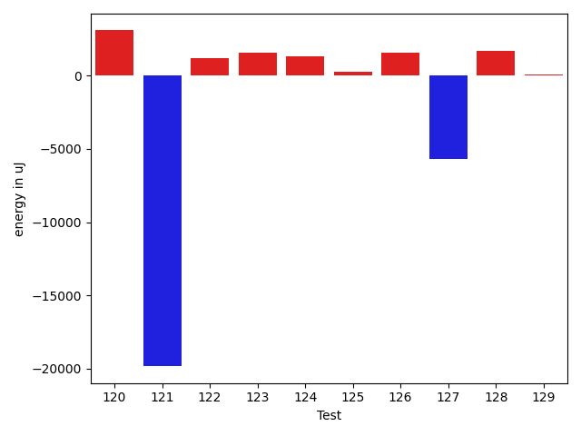

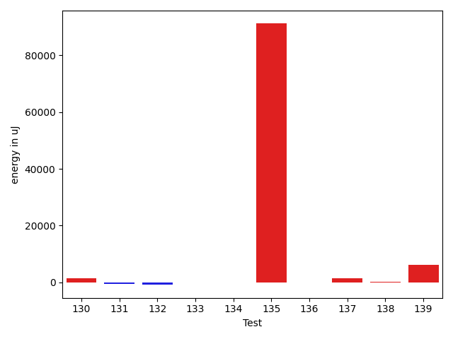

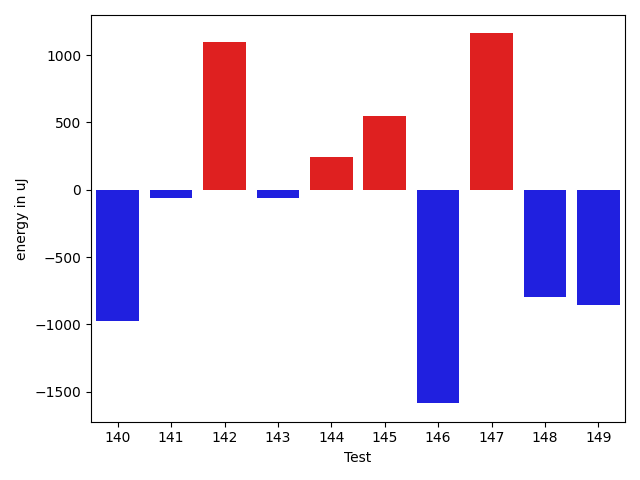

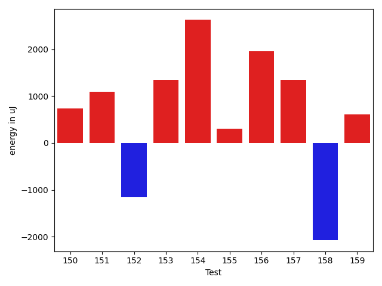

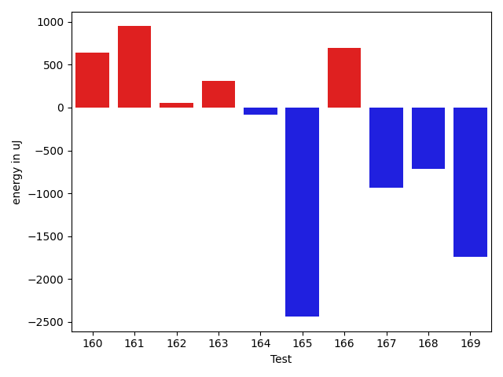

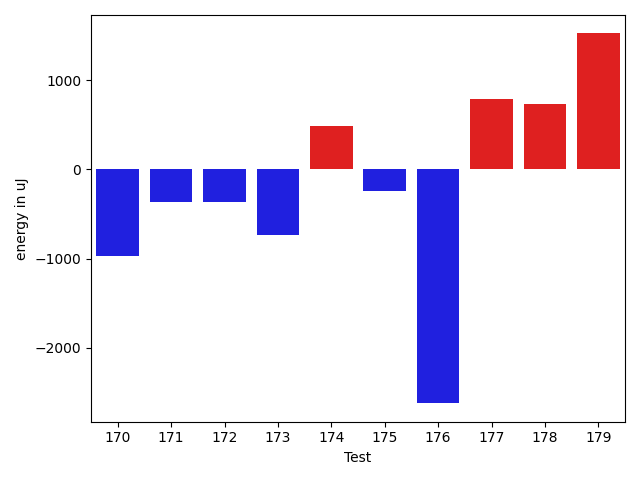

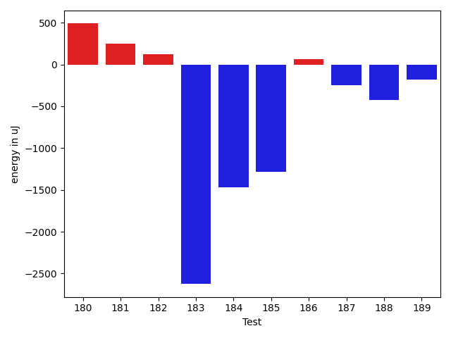

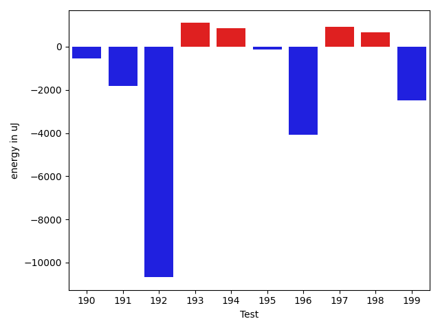

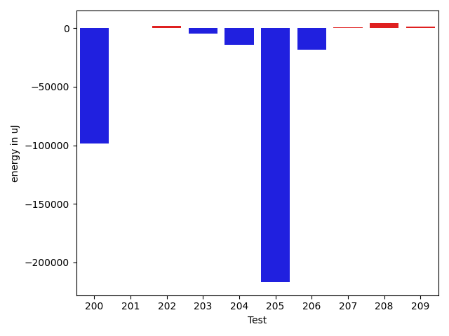

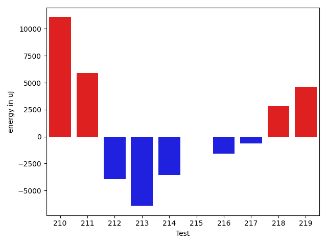

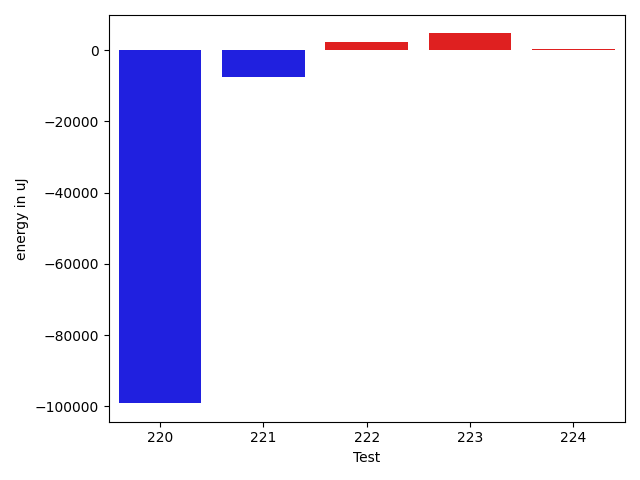

| ID | EnergyV1 | EnergyV2 | DeltaEnergy | σV1 | σV2 |
| --- | --- | --- | --- | --- | --- |
| 0 | 37353 | 40345 | 2992 | 8186.53826362634 | 18221.128549233217 |
| 1 | 39977 | 38879 | -1098 | 28152.068836757637 | 3124.763934897166 |
| 2 | 38391 | 39063 | 672 | 4394.270882637983 | 35980.075294621005 |
| 3 | 38819 | 38269 | -550 | 3315.5468248088428 | 3347.7798464470466 |
| 4 | 39612 | 41503 | 1891 | 29351.956464644292 | 27251.36635967334 |
| 5 | 39307 | 39611 | 304 | 8380.651034341681 | 20382.549966286788 |
| 6 | 37659 | 39306 | 1647 | 3242.208732178999 | 3687.471822123862 |
| 7 | 38147 | 42297 | 4150 | 4196.354335532518 | 3487.9447512109477 |
| 8 | 39307 | 39428 | 121 | 2840.425007322359 | 3195.9933696814232 |
| 9 | 39184 | 39734 | 550 | 3724.6170745515324 | 2554.0462872665407 |
| 10 | 41016 | 38147 | -2869 | 3948.9894065866188 | 2411.866687167155 |
| 11 | 36377 | 35583 | -794 | 3932.219492904848 | 7741.115278227098 |
| 12 | 35827 | 37841 | 2014 | 3517.9827514320536 | 3968.4915631807808 |
| 13 | 36011 | 35828 | -183 | 3513.654639503082 | 4000.5723981801593 |
| 14 | 34851 | 36255 | 1404 | 4207.340452405684 | 7373.781144026448 |
| 15 | 38757 | 38146 | -611 | 22114.64286410523 | 27492.343205342335 |
| 16 | 39306 | 39611 | 305 | 367744.4753493044 | 408187.86672977183 |
| 17 | 36987 | 37414 | 427 | 4343.945833201159 | 3570.691628200859 |
| 18 | 97351 | 78918 | -18433 | 35189.099561625095 | 25135.907320204646 |
| 19 | 36621 | 36987 | 366 | 25216.468962954645 | 42074.69124094568 |
| 20 | 38086 | 39123 | 1037 | 43473.269664137406 | 51209.45459024854 |
| 21 | 37537 | 36926 | -611 | 8938.417180211494 | 7988.160152805254 |
| 22 | 35279 | 36499 | 1220 | 3210.4373132729775 | 4004.485639711778 |
| 23 | 36072 | 36194 | 122 | 3913.760858612845 | 43790.9517492255 |
| 24 | 36254 | 36560 | 306 | 5257.777814999709 | 4228.847721257739 |
| 25 | 36255 | 36560 | 305 | 3788.8985769810874 | 3574.739595969766 |
| 26 | 35400 | 37598 | 2198 | 3403.4097137947424 | 3596.861795022343 |
| 27 | 36682 | 34729 | -1953 | 3190.7112898454775 | 4014.2807135349694 |
| 28 | 35462 | 36804 | 1342 | 3467.183268533696 | 3851.2150062923465 |
| 29 | 37109 | 36865 | -244 | 26313.534065244716 | 33497.38049528891 |
| 30 | 36010 | 35949 | -61 | 3293.8501776364874 | 3664.6480134048243 |
| 31 | 37841 | 38330 | 489 | 3623.8146069515697 | 28325.890479178754 |
| 32 | 37720 | 37964 | 244 | 5491.221734213392 | 6894.8146242288 |
| 33 | 115234 | 117858 | 2624 | 21963.988583471066 | 23253.39263334962 |
| 34 | 36804 | 36621 | -183 | 4169.457387040159 | 3773.0522895402046 |
| 35 | 40344 | 40955 | 611 | 20563.3006844422 | 16180.861744729335 |
| 36 | 36499 | 36438 | -61 | 3764.589327200572 | 3908.2966022698147 |
| 37 | 38208 | 36194 | -2014 | 42731.92737187941 | 34965.78855295266 |
| 38 | 35767 | 35095 | -672 | 3357.9600555098928 | 2225.013004624535 |
| 39 | 35339 | 35278 | -61 | 3776.79229306749 | 4109.847403463062 |
| 40 | 35888 | 35950 | 62 | 3551.3657319379927 | 3937.7647258073544 |
| 41 | 38147 | 36866 | -1281 | 4307.124818283578 | 3817.7203651761265 |
| 42 | 37292 | 36560 | -732 | 3886.176612298964 | 3988.4554012173685 |
| 43 | 35766 | 36988 | 1222 | 3328.2914470636765 | 29056.79159455205 |
| 44 | 42968 | 40161 | -2807 | 23863.49615024889 | 21270.05782384789 |
| 45 | 36315 | 37293 | 978 | 4902.19024569807 | 5175.771651778895 |
| 46 | 40467 | 38513 | -1954 | 118299.52950602527 | 52532.22205055994 |
| 47 | 38208 | 36377 | -1831 | 28953.79676279211 | 15022.722678417953 |
| 48 | 36438 | 39978 | 3540 | 3827.7272560541887 | 4931.624747934716 |
| 49 | 36743 | 35584 | -1159 | 3421.453344701508 | 3213.5380186429315 |
| 50 | 36865 | 35278 | -1587 | 3552.238543560963 | 4679.334834991281 |
| 51 | 37476 | 37597 | 121 | 6576.037276057198 | 7342.814661517519 |
| 52 | 39551 | 39734 | 183 | 49102.220685976325 | 10218.467331359972 |
| 53 | 38513 | 38452 | -61 | 4385.903310937606 | 3984.537254537562 |
| 54 | 39429 | 37842 | -1587 | 3887.7273388258236 | 4229.389841761309 |
| 55 | 36682 | 37719 | 1037 | 3872.7349226139067 | 4499.937260702689 |
| 56 | 38025 | 36926 | -1099 | 3681.0157858261005 | 4043.787734668519 |
| 57 | 36804 | 36743 | -61 | 39710.72195003384 | 2573.3476323618324 |
| 58 | 37903 | 36560 | -1343 | 4224.30430608402 | 4067.9197363223743 |
| 59 | 37963 | 37781 | -182 | 4108.200431137702 | 4504.325907944788 |
| 60 | 36072 | 36560 | 488 | 4291.128084772997 | 3656.2573661012193 |
| 61 | 37719 | 38391 | 672 | 4077.7237683113694 | 3730.3286786606736 |
| 62 | 37414 | 38635 | 1221 | 7914.105620510485 | 11919.590104770015 |
| 63 | 37537 | 38514 | 977 | 14218.67587226246 | 13876.767573954987 |
| 64 | 73670 | 71655 | -2015 | 24919.242392496166 | 25327.624838133375 |
| 65 | 35889 | 37903 | 2014 | 3999.1213853384443 | 3145.768968367472 |
| 66 | 37902 | 37659 | -243 | 13461.409202770532 | 11216.718364553966 |
| 67 | 36682 | 36072 | -610 | 6274.954295927418 | 2914.6254318802726 |
| 68 | 36255 | 37964 | 1709 | 4105.1997101490615 | 3043.5801447711915 |
| 69 | 37720 | 36682 | -1038 | 3904.4175088396137 | 3191.721170049751 |
| 70 | 36132 | 36743 | 611 | 3674.8736820663544 | 3600.898517793505 |
| 71 | 39978 | 39734 | -244 | 89840.49228938259 | 91506.03722217743 |
| 72 | 36316 | 37597 | 1281 | 6397.984098821916 | 4018.013943536473 |
| 73 | 37476 | 36438 | -1038 | 3502.960877622443 | 3604.8807293242116 |
| 74 | 35705 | 36987 | 1282 | 3168.728017675231 | 3903.737125294263 |
| 75 | 37292 | 38086 | 794 | 4225.516357559584 | 4653.72299810115 |
| 76 | 38513 | 36560 | -1953 | 26611.489392846845 | 3247.4816842502464 |
| 77 | 35766 | 36438 | 672 | 46697.67981418008 | 4044.9067930971846 |
| 78 | 38391 | 38636 | 245 | 3316.274778185929 | 3674.858913240374 |
| 79 | 36194 | 37842 | 1648 | 3349.12442537847 | 3257.512220069992 |
| 80 | 36804 | 37964 | 1160 | 3691.310172434124 | 3371.6491039252587 |
| 81 | 37719 | 37842 | 123 | 3263.5034972233275 | 3641.6204922429533 |
| 82 | 38818 | 37841 | -977 | 4567.194781361797 | 3909.89254413298 |
| 83 | 36926 | 37720 | 794 | 29187.501514614094 | 4556.749576909693 |
| 84 | 37719 | 37292 | -427 | 3535.0698242609014 | 3926.954183552721 |
| 85 | 37720 | 37109 | -611 | 4130.575234223995 | 4695.897520142263 |
| 86 | 38024 | 36926 | -1098 | 6318.0787825607085 | 4659.425969394291 |
| 87 | 38330 | 36927 | -1403 | 10092.1461382454 | 7130.206667962955 |
| 88 | 38757 | 35950 | -2807 | 4297.787557081256 | 4106.7739174445405 |
| 89 | 39246 | 38269 | -977 | 11150.6913855708 | 14763.947730531523 |
| 90 | 37659 | 36621 | -1038 | 10662.942762752255 | 14529.178753762188 |
| 91 | 38269 | 37231 | -1038 | 8410.359747528002 | 11156.47854734332 |
| 92 | 41625 | 40283 | -1342 | 57387.4332103073 | 57618.81398211287 |
| 93 | 38757 | 37475 | -1282 | 12640.524712888418 | 12888.608091773654 |
| 94 | 40893 | 37170 | -3723 | 20435.107859094835 | 25092.371963595102 |
| 95 | 36499 | 37475 | 976 | 4246.93627773769 | 4493.22051109475 |
| 96 | 37780 | 36560 | -1220 | 4390.257781750238 | 5083.588712183223 |
| 97 | 37536 | 36621 | -915 | 4050.7638273492244 | 4618.806082203495 |
| 98 | 36316 | 36804 | 488 | 4532.57272076337 | 5394.940213432236 |
| 99 | 35828 | 35950 | 122 | 3897.8482357789435 | 7431.018409464516 |
| 100 | 37658 | 36133 | -1525 | 4362.521639954778 | 3883.1851813753333 |
| 101 | 38635 | 37048 | -1587 | 4387.856601009245 | 3965.4699560478757 |
| 102 | 37964 | 37049 | -915 | 4705.076778502132 | 4205.774258220608 |
| 103 | 39123 | 34607 | -4516 | 4308.020069204259 | 3948.628307262704 |
| 104 | 36499 | 36377 | -122 | 3972.435956991372 | 4161.046889802589 |
| 105 | 43396 | 42419 | -977 | 36466.63446855234 | 46623.88584650041 |
| 106 | 41809 | 38696 | -3113 | 503550.452189604 | 304176.5825530796 |
| 107 | 41748 | 39001 | -2747 | 40814.98988661308 | 39831.67951017231 |
| 108 | 41199 | 40039 | -1160 | 513896.5109271312 | 447617.4033630008 |
| 109 | 38268 | 38941 | 673 | 14735.235449220201 | 24654.47650779146 |
| 110 | 36987 | 36987 | 0 | 6775.767292662949 | 3753.2605948156215 |
| 111 | 37293 | 38574 | 1281 | 7069.848256335665 | 10488.277320460424 |
| 112 | 38208 | 39368 | 1160 | 12707.1491233146 | 15706.464584923926 |
| 113 | 37842 | 38635 | 793 | 70101.42443459044 | 41053.0296612188 |
| 114 | 70373 | 75012 | 4639 | 23480.677806703494 | 24869.97098103844 |
| 115 | 38269 | 38941 | 672 | 15249.13803271448 | 17306.070367689103 |
| 116 | 38086 | 38635 | 549 | 13484.808084260449 | 20603.36718673325 |
| 117 | 36621 | 37536 | 915 | 7959.337621274117 | 24137.84465623796 |
| 118 | 38513 | 37903 | -610 | 13799.23356215541 | 12387.709570109586 |
| 119 | 37048 | 37475 | 427 | 3615.613770205929 | 3663.1890349096157 |
| 120 | 79040 | 80383 | 1343 | 31922.67323876413 | 41215.831134932254 |
| 121 | 83802 | 84961 | 1159 | 263918.62823167065 | 160996.00634413428 |
| 122 | 35583 | 36194 | 611 | 3856.714188446033 | 4550.396118421707 |
| 123 | 36499 | 36987 | 488 | 3909.7494170115588 | 6071.302283710389 |
| 124 | 35523 | 36254 | 731 | 3331.373037292581 | 3443.595278193998 |
| 125 | 38513 | 37841 | -672 | 3771.0159594214047 | 4668.617029147256 |
| 126 | 36560 | 37537 | 977 | 5986.009876911406 | 5841.21963988309 |
| 127 | 38574 | 37597 | -977 | 47644.52771933348 | 39766.023517483125 |
| 128 | 35949 | 38208 | 2259 | 3870.0760451386104 | 3107.499170661718 |
| 129 | 36011 | 36927 | 916 | 3641.6533451861105 | 4208.597770841814 |
| 130 | 35645 | 37719 | 2074 | 3575.576141765426 | 3803.3258042241036 |
| 131 | 37841 | 37292 | -549 | 4138.89911623852 | 4006.27620242302 |
| 132 | 37292 | 36987 | -305 | 4459.331587759177 | 4605.618991394724 |
| 133 | 39307 | 38085 | -1222 | 4787.771386318004 | 4000.8950159925566 |
| 134 | 36682 | 37903 | 1221 | 4396.231634121947 | 4417.52397128559 |
| 135 | 40222 | 41931 | 1709 | 379713.0844229044 | 553355.9374641188 |
| 136 | 37475 | 36804 | -671 | 3312.7434142371226 | 3997.6015317187375 |
| 137 | 71594 | 72143 | 549 | 23137.36600990713 | 21714.60472811476 |
| 138 | 39307 | 37720 | -1587 | 5812.131437218695 | 9114.75315416176 |
| 139 | 36926 | 38452 | 1526 | 6320.678474107717 | 21143.752301252272 |
| 140 | 38940 | 37964 | -976 | 7544.314272000521 | 56138.556147709045 |
| 141 | 39185 | 39124 | -61 | 6387.5309840855625 | 4365.795762108521 |
| 142 | 86975 | 88074 | 1099 | 427413.70224471384 | 364868.7977469464 |
| 143 | 42297 | 42236 | -61 | 33555.39314353099 | 28719.148387065743 |
| 144 | 161132 | 161377 | 245 | 174236.30571450153 | 299595.0873495789 |
| 145 | 37048 | 37597 | 549 | 4052.0817327754667 | 5819.975521216417 |
| 146 | 38391 | 36805 | -1586 | 6155.988386029154 | 3921.9947630872766 |
| 147 | 36865 | 38025 | 1160 | 7725.380843499105 | 10318.746485547834 |
| 148 | 39307 | 38513 | -794 | 48287.9238472651 | 44519.398816105786 |
| 149 | 36804 | 35950 | -854 | 4125.399915368233 | 3663.517631528943 |
| 150 | 35461 | 36194 | 733 | 4011.9354326788884 | 3851.938348407274 |
| 151 | 37110 | 38208 | 1098 | 23922.91607670017 | 42138.41716624937 |
| 152 | 37598 | 36438 | -1160 | 5073.9218349813 | 4092.983785126216 |
| 153 | 35583 | 36926 | 1343 | 4342.180298824544 | 3764.1875481140078 |
| 154 | 35462 | 38086 | 2624 | 3932.263031181776 | 3278.40610365706 |
| 155 | 37292 | 37598 | 306 | 22404.89851675981 | 11676.258515546622 |
| 156 | 78858 | 80810 | 1952 | 486505.677546609 | 223427.80270995368 |
| 157 | 37781 | 39124 | 1343 | 4781.405674729071 | 4210.116444021735 |
| 158 | 37902 | 35827 | -2075 | 4024.671196507859 | 3971.2575708961513 |
| 159 | 38208 | 38818 | 610 | 9163.548167368584 | 3890.8691417429804 |
| 160 | 37902 | 38086 | 184 | 4643.700290165721 | 7831.072050659476 |
| 161 | 37659 | 38330 | 671 | 4511.0490985500355 | 4819.542045174092 |
| 162 | 40893 | 39917 | -976 | 6453.567008940783 | 6747.0913583454385 |
| 163 | 38330 | 38758 | 428 | 3957.880340637623 | 3736.833021532535 |
| 164 | 37719 | 36988 | -731 | 3264.387978155808 | 4334.215989461737 |
| 165 | 37048 | 37964 | 916 | 20940.707804368576 | 4053.437278099395 |
| 166 | 38452 | 38452 | 0 | 29787.49667645369 | 23438.872635578486 |
| 167 | 38452 | 37964 | -488 | 3677.782460896786 | 4180.117802845185 |
| 168 | 37964 | 38025 | 61 | 4127.80178060073 | 4190.378352648009 |
| 169 | 38879 | 36926 | -1953 | 18031.052909491176 | 15744.436341711084 |
| 170 | 37659 | 36682 | -977 | 23802.17684752454 | 4219.041184156594 |
| 171 | 37903 | 37536 | -367 | 3395.7128136376673 | 3853.873274272054 |
| 172 | 39245 | 38879 | -366 | 3273.8077732462853 | 31411.75212279741 |
| 173 | 37536 | 36804 | -732 | 3646.310897676853 | 3803.8234906368357 |
| 174 | 38086 | 38574 | 488 | 4003.1085947657734 | 4697.351684726193 |
| 175 | 38391 | 38147 | -244 | 23188.24785236998 | 30207.14546724841 |
| 176 | 38269 | 35645 | -2624 | 4798.326500516149 | 4987.406630691228 |
| 177 | 39062 | 39856 | 794 | 299500.6379718766 | 497463.2271772558 |
| 178 | 39734 | 40466 | 732 | 25037.989105297438 | 37206.60043950963 |
| 179 | 37292 | 38818 | 1526 | 24451.58293036537 | 23753.34145419958 |
| 180 | 37353 | 37842 | 489 | 3755.618817457493 | 4890.686728508189 |
| 181 | 35644 | 35889 | 245 | 3995.8793571296283 | 3808.5600990108824 |
| 182 | 37109 | 37231 | 122 | 12359.16347878579 | 13514.464990771388 |
| 183 | 38147 | 35522 | -2625 | 3637.0595458419434 | 4666.463199881442 |
| 184 | 39185 | 37719 | -1466 | 31710.906265991933 | 4822.073214799718 |
| 185 | 38208 | 36926 | -1282 | 4773.577530422804 | 4241.828339870739 |
| 186 | 39490 | 39550 | 60 | 444533.7345206005 | 610717.2230431677 |
| 187 | 39185 | 38941 | -244 | 37214.94278318381 | 45471.50587370587 |
| 188 | 39185 | 38758 | -427 | 12747.211597777958 | 14917.298317439652 |
| 189 | 38513 | 38330 | -183 | 4267.71974666016 | 3818.5570105275233 |
| 190 | 42236 | 41686 | -550 | 233251.4372531162 | 348135.28623142274 |
| 191 | 39124 | 37292 | -1832 | 6284.6375826889025 | 4188.62454404637 |
| 192 | 101257 | 90576 | -10681 | 247810.71233060825 | 347526.5914474275 |
| 193 | 38513 | 39611 | 1098 | 21175.697118443186 | 21528.84002286032 |
| 194 | 36560 | 37415 | 855 | 3765.392055124962 | 31075.29054845786 |
| 195 | 39001 | 38879 | -122 | 252455.19118343046 | 522141.40407692734 |
| 196 | 370544 | 366454 | -4090 | 123081.67493766102 | 131254.5774877548 |
| 197 | 39550 | 40466 | 916 | 34352.72423088645 | 38272.90298867502 |
| 198 | 37048 | 37719 | 671 | 3844.923876898829 | 4118.241294117668 |
| 199 | 38330 | 35828 | -2502 | 3820.5590730445247 | 4320.985112198809 |
| 200 | 39368 | 39734 | 366 | 440894.1767373756 | 204636.03980633922 |
| 201 | 39978 | 40162 | 184 | 44990.66907315338 | 41999.15217402293 |
| 202 | 39306 | 41016 | 1710 | 19693.526522101994 | 19802.8054921656 |
| 203 | 75866 | 71045 | -4821 | 25760.59746211532 | 23351.76175883751 |
| 204 | 81848 | 84899 | 3051 | 417861.72004302044 | 350196.0317768927 |
| 205 | 39490 | 40954 | 1464 | 578500.0395771137 | 5416.207843347941 |
| 206 | 39307 | 40954 | 1647 | 556824.2349952582 | 525075.4371697009 |
| 207 | 37292 | 38208 | 916 | 4779.723231150524 | 4061.24272153405 |
| 208 | 37415 | 39368 | 1953 | 7422.860774201848 | 24710.58207901638 |
| 209 | 39917 | 37536 | -2381 | 10852.924074407032 | 24159.267664818373 |
| 210 | 40039 | 39551 | -488 | 38283.960316066026 | 59806.71494412783 |
| 211 | 39062 | 36377 | -2685 | 4421.732009246062 | 39682.67608772111 |
| 212 | 38452 | 38269 | -183 | 35740.13779794285 | 29777.67223641336 |
| 213 | 39429 | 38513 | -916 | 31850.353064322873 | 8405.553974010278 |
| 214 | 40039 | 40588 | 549 | 498126.48095935566 | 523142.9463571107 |
| 215 | 41381 | 39367 | -2014 | 4257.842864975854 | 4206.342835511805 |
| 216 | 39184 | 39307 | 123 | 6295.284524473985 | 4247.569130130251 |
| 217 | 37964 | 37598 | -366 | 3790.1146864135653 | 3928.431430815136 |
| 218 | 39245 | 38818 | -427 | 13424.863565384521 | 17704.977387064973 |
| 219 | 40283 | 40527 | 244 | 43548.977082222715 | 56763.54396871664 |
| 220 | 36499 | 39978 | 3479 | 617095.996971114 | 475392.3442011516 |
| 221 | 39184 | 40344 | 1160 | 47248.32175188461 | 28472.229028363283 |
| 222 | 36865 | 37964 | 1099 | 3973.919344023747 | 4025.0181550881143 |
| 223 | 38635 | 39734 | 1099 | 3311.215029388862 | 25840.472450525922 |
| 224 | 39917 | 39795 | -122 | 6320.994433663107 | 6795.80601052183 |

## Delta Duration per test method

| ID | DurationV1 | DurationsV2 | DeltaDuration |
| --- | --- | --- | --- |
| 0 | 919254.0181818182 | 1009428.5925925926 | 90174.5744107744 |
| 1 | 684729.4285714285 | 474214.74074074073 | -210514.6878306878 |
| 2 | 524797.0 | 714201.625 | 189404.625 |
| 3 | 513796.0 | 554382.052631579 | 40586.05263157899 |
| 4 | 1328573.1020408163 | 1402894.611111111 | 74321.50907029468 |
| 5 | 801002.1515151515 | 965016.8837209302 | 164014.7322057787 |
| 6 | 515733.42307692306 | 549742.1111111111 | 34008.68803418806 |
| 7 | 485131.76470588235 | 454580.4 | -30551.364705882326 |
| 8 | 485587.9583333333 | 452425.90476190473 | -33162.05357142858 |
| 9 | 457360.4285714286 | 505840.1875 | 48479.75892857142 |
| 10 | 437004.5833333333 | 428748.9166666667 | -8255.666666666628 |
| 11 | 869061.6875 | 911191.641509434 | 42129.954009433975 |
| 12 | 866812.8867924528 | 757130.4629629629 | -109682.42382948985 |
| 13 | 830906.3214285715 | 807655.9122807018 | -23250.40914786968 |
| 14 | 915200.5849056604 | 913738.06 | -1462.524905660306 |
| 15 | 1202308.5735294118 | 1265160.8620689656 | 62852.28853955376 |
| 16 | 3957893.125 | 5036446.145161291 | 1078553.0201612907 |
| 17 | 952953.3035714285 | 891863.5925925926 | -61089.71097883594 |
| 18 | 2891395.8080808083 | 2671039.0707070706 | -220356.73737373762 |
| 19 | 1411970.2465753425 | 1526906.0634920634 | 114935.81691672094 |
| 20 | 1392952.9074074074 | 1513791.3333333333 | 120838.42592592584 |
| 21 | 1052268.9166666667 | 997149.8656716418 | -55119.05099502497 |
| 22 | 757122.5370370371 | 715346.695652174 | -41775.84138486313 |
| 23 | 685887.2790697674 | 982565.4324324324 | 296678.153362665 |
| 24 | 980585.1911764706 | 949982.6363636364 | -30602.55481283425 |
| 25 | 807856.5208333334 | 803865.6538461539 | -3990.866987179499 |
| 26 | 578349.487804878 | 606705.0 | 28355.512195121963 |
| 27 | 430088.71428571426 | 476461.35294117645 | 46372.638655462186 |
| 28 | 478767.36 | 502296.0 | 23528.640000000014 |
| 29 | 1276230.2948717948 | 1293800.8219178081 | 17570.52704601339 |
| 30 | 908007.9032258064 | 904769.2835820896 | -3238.61964371684 |
| 31 | 675429.6944444445 | 831536.0 | 156106.3055555555 |
| 32 | 803852.4318181818 | 805688.7272727273 | 1836.2954545455286 |
| 33 | 3404627.373737374 | 3306350.777777778 | -98276.59595959587 |
| 34 | 825252.265625 | 852408.2258064516 | 27155.960181451635 |
| 35 | 1120485.0263157894 | 1074456.2162162163 | -46028.81009957311 |
| 36 | 864057.9508196721 | 846022.2678571428 | -18035.682962529245 |
| 37 | 758710.3103448276 | 757016.3714285714 | -1693.9389162561856 |
| 38 | 470737.64 | 479242.09523809527 | 8504.455238095252 |
| 39 | 571150.6451612903 | 563689.0909090909 | -7461.554252199363 |
| 40 | 601183.1818181818 | 577595.9393939395 | -23587.242424242315 |
| 41 | 534833.0370370371 | 541947.3225806452 | 7114.28554360813 |
| 42 | 691192.3488372093 | 699456.35 | 8264.001162790693 |
| 43 | 590042.3333333334 | 767170.3076923077 | 177127.97435897437 |
| 44 | 1423337.0961538462 | 1025101.1132075472 | -398235.982946299 |
| 45 | 618711.9705882353 | 571113.8055555555 | -47598.1650326798 |
| 46 | 2503403.5428571426 | 896476.25 | -1606927.2928571426 |
| 47 | 1301804.1627906978 | 1054317.9428571428 | -247486.219933555 |
| 48 | 800439.9696969697 | 715693.2727272727 | -84746.69696969702 |
| 49 | 704473.5 | 643172.1219512195 | -61301.37804878049 |
| 50 | 751272.5614035088 | 742781.9787234042 | -8490.582680104533 |
| 51 | 1123317.7875 | 1061322.5135135136 | -61995.273986486485 |
| 52 | 1378108.3777777778 | 812517.4423076923 | -565590.9354700856 |
| 53 | 774106.8372093023 | 708872.7826086957 | -65234.05460060667 |
| 54 | 755828.0 | 682023.0833333334 | -73804.91666666663 |
| 55 | 768452.4 | 732262.7291666666 | -36189.670833333395 |
| 56 | 720537.9565217391 | 677893.5416666666 | -42644.41485507251 |
| 57 | 835923.6153846154 | 519851.73076923075 | -316071.8846153846 |
| 58 | 801893.06 | 708859.2549019608 | -93033.80509803921 |
| 59 | 773383.0 | 727876.9166666666 | -45506.08333333337 |
| 60 | 812691.4468085107 | 717003.0454545454 | -95688.40135396528 |
| 61 | 736000.4716981133 | 730322.9302325582 | -5677.541465555085 |
| 62 | 1113750.6790123456 | 1192322.5833333333 | 78571.90432098764 |
| 63 | 1202061.7349397591 | 1200304.3246753246 | -1757.4102644345257 |
| 64 | 2192448.3535353537 | 2197522.212121212 | 5073.858585858252 |
| 65 | 664580.1764705882 | 641260.125 | -23320.051470588194 |
| 66 | 977232.224137931 | 956811.6166666667 | -20420.607471264317 |
| 67 | 581783.2727272727 | 534731.1428571428 | -47052.129870129866 |
| 68 | 620419.5869565217 | 636134.3421052631 | 15714.755148741417 |
| 69 | 512381.1666666667 | 482167.1875 | -30213.979166666686 |
| 70 | 936991.2033898305 | 895401.2131147541 | -41589.990275076474 |
| 71 | 1896542.9444444445 | 1842805.8181818181 | -53737.12626262638 |
| 72 | 841953.2280701754 | 770784.9523809524 | -71168.27568922297 |
| 73 | 703590.4864864865 | 682461.4 | -21129.086486486485 |
| 74 | 582417.3846153846 | 590647.6896551724 | 8230.305039787781 |
| 75 | 599516.8936170213 | 583788.0833333334 | -15728.810283687897 |
| 76 | 887446.02 | 766602.7678571428 | -120843.25214285718 |
| 77 | 676971.7058823529 | 406157.375 | -270814.3308823529 |
| 78 | 435075.3157894737 | 410756.36666666664 | -24318.94912280707 |
| 79 | 593714.4166666666 | 467573.1538461539 | -126141.26282051275 |
| 80 | 475719.85714285716 | 484774.72 | 9054.862857142813 |
| 81 | 437182.4166666667 | 466167.28571428574 | 28984.869047619053 |
| 82 | 649255.9375 | 764283.7666666667 | 115027.82916666672 |
| 83 | 846742.72 | 587761.8 | -258980.91999999993 |
| 84 | 531132.48 | 468077.0833333333 | -63055.39666666667 |
| 85 | 919040.4406779661 | 905804.9830508474 | -13235.457627118682 |
| 86 | 1083101.329113924 | 1047197.6184210526 | -35903.71069287136 |
| 87 | 864422.8571428572 | 864811.693877551 | 388.83673469384667 |
| 88 | 660034.4444444445 | 711848.6578947369 | 51814.21345029236 |
| 89 | 923487.9508196721 | 942544.1346153846 | 19056.18379571254 |
| 90 | 816582.3770491803 | 868066.0 | 51483.62295081967 |
| 91 | 1109665.2911392406 | 1095732.831168831 | -13932.459970409516 |
| 92 | 1700411.0322580645 | 1582607.723076923 | -117803.30918114143 |
| 93 | 845860.0285714286 | 845116.8 | -743.2285714285681 |
| 94 | 1329465.6666666667 | 1413837.0459770116 | 84371.37931034481 |
| 95 | 713761.2826086957 | 716535.4509803922 | 2774.168371696491 |
| 96 | 548824.3548387097 | 606034.2941176471 | 57209.93927893741 |
| 97 | 492617.75 | 555277.59375 | 62659.84375 |
| 98 | 649958.1136363636 | 761808.1363636364 | 111850.0227272727 |
| 99 | 667055.6153846154 | 705973.8947368421 | 38918.27935222676 |
| 100 | 706489.695652174 | 736534.8571428572 | 30045.16149068321 |
| 101 | 544585.4 | 596760.1176470588 | 52174.71764705877 |
| 102 | 695874.08 | 727729.9814814815 | 31855.901481481502 |
| 103 | 460373.5333333333 | 529441.0370370371 | 69067.50370370375 |
| 104 | 569729.0714285715 | 507678.1666666667 | -62050.90476190479 |
| 105 | 1575908.7857142857 | 1385786.2 | -190122.58571428573 |
| 106 | 10656621.842105264 | 3684536.8 | -6972085.042105264 |
| 107 | 1582644.5806451612 | 1210625.25 | -372019.3306451612 |
| 108 | 5307642.119402985 | 4004983.025974026 | -1302659.0934289591 |
| 109 | 1352518.8850574712 | 1410071.3894736841 | 57552.504416212905 |
| 110 | 1025081.2916666666 | 1000473.5714285715 | -24607.72023809515 |
| 111 | 1214909.9411764706 | 1272190.6559139786 | 57280.71473750798 |
| 112 | 1385502.597826087 | 1417877.244680851 | 32374.646854764083 |
| 113 | 1840728.3625 | 1415821.91954023 | -424906.4429597701 |
| 114 | 2070367.888888889 | 2219896.7474747472 | 149528.85858585825 |
| 115 | 1332855.463414634 | 1331515.2345679011 | -1340.2288467329927 |
| 116 | 1349015.3333333333 | 1359277.293478261 | 10261.960144927725 |
| 117 | 1113913.9759036144 | 1184397.8051948051 | 70483.82929119072 |
| 118 | 1258394.7865168538 | 1268172.6629213484 | 9777.876404494513 |
| 119 | 903796.546875 | 841191.9130434783 | -62604.63383152173 |
| 120 | 2647249.6565656564 | 2698582.777777778 | 51333.121212121565 |
| 121 | 4594620.939393939 | 3895563.3636363638 | -699057.5757575757 |
| 122 | 501168.23076923075 | 508243.1935483871 | 7074.96277915634 |
| 123 | 990383.5466666666 | 986926.6052631579 | -3456.9414035087684 |
| 124 | 516362.88 | 518768.63333333336 | 2405.753333333356 |
| 125 | 566106.875 | 590092.0625 | 23985.1875 |
| 126 | 893530.6949152543 | 916225.2372881356 | 22694.54237288132 |
| 127 | 1443881.8709677418 | 1097535.1818181819 | -346346.68914955994 |
| 128 | 523486.5294117647 | 534332.0 | 10845.470588235301 |
| 129 | 677925.9705882353 | 685610.6 | 7684.629411764676 |
| 130 | 562594.3461538461 | 569911.6153846154 | 7317.269230769249 |
| 131 | 523456.2 | 570952.1212121212 | 47495.921212121204 |
| 132 | 756425.1272727273 | 763732.4074074074 | 7307.280134680099 |
| 133 | 599800.6315789474 | 559885.6538461539 | -39914.977732793544 |
| 134 | 689724.8837209302 | 747959.4390243902 | 58234.55530345999 |
| 135 | 3278417.3220338984 | 6292655.444444444 | 3014238.1224105456 |
| 136 | 518344.85714285716 | 549104.08 | 30759.2228571428 |
| 137 | 1996931.806122449 | 2005266.625 | 8334.818877551006 |
| 138 | 927024.34375 | 920053.3538461538 | -6970.989903846174 |
| 139 | 1155148.5909090908 | 1238963.0 | 83814.40909090918 |
| 140 | 641871.6818181818 | 1091423.8529411764 | 449552.1711229946 |
| 141 | 995163.4571428571 | 928940.1379310344 | -66223.3192118227 |
| 142 | 5657631.94949495 | 4866107.757575758 | -791524.1919191917 |
| 143 | 1713778.09375 | 1664605.0 | -49173.09375 |
| 144 | 5436138.111111111 | 6989550.05050505 | 1553411.9393939395 |
| 145 | 760489.2826086957 | 785603.074074074 | 25113.791465378366 |
| 146 | 812060.947368421 | 897134.0638297872 | 85073.11646136618 |
| 147 | 916367.655737705 | 976550.7142857143 | 60183.05854800937 |
| 148 | 1076205.125 | 1391004.0833333333 | 314798.95833333326 |
| 149 | 636676.4130434783 | 676465.5625 | 39789.14945652173 |
| 150 | 810908.7924528302 | 934719.8333333334 | 123811.04088050313 |
| 151 | 806355.1333333333 | 1337789.9090909092 | 531434.7757575759 |
| 152 | 526242.35 | 538261.880952381 | 12019.53095238097 |
| 153 | 549279.0 | 574228.0 | 24949.0 |
| 154 | 882911.447368421 | 767578.4181818182 | -115333.0291866028 |
| 155 | 1095027.7419354839 | 683695.90625 | -411331.8356854839 |
| 156 | 6551796.97979798 | 3511818.1919191917 | -3039978.787878788 |
| 157 | 644111.6153846154 | 556047.2222222222 | -88064.39316239313 |
| 158 | 549147.9142857143 | 533682.56 | -15465.354285714217 |
| 159 | 904239.976744186 | 794851.756097561 | -109388.22064662504 |
| 160 | 869934.3392857143 | 869644.7962962963 | -289.542989418027 |
| 161 | 713322.2105263158 | 659463.0540540541 | -53859.15647226176 |
| 162 | 638311.7083333334 | 687381.9310344828 | 49070.22270114941 |
| 163 | 693582.2727272727 | 656636.8333333334 | -36945.439393939334 |
| 164 | 749888.2826086957 | 864163.8545454545 | 114275.57193675882 |
| 165 | 868185.0784313725 | 684677.5434782609 | -183507.53495311167 |
| 166 | 1487860.5268817204 | 1504860.1397849463 | 16999.612903225934 |
| 167 | 882031.6507936508 | 861203.6607142857 | -20827.99007936509 |
| 168 | 718430.7083333334 | 728609.5471698113 | 10178.838836477953 |
| 169 | 1051954.8235294118 | 976497.9827586206 | -75456.84077079117 |
| 170 | 972786.3666666667 | 854288.4307692308 | -118497.93589743588 |
| 171 | 731890.8163265307 | 689717.8627450981 | -42172.95358143258 |
| 172 | 699951.8095238095 | 1048845.450980392 | 348893.6414565826 |
| 173 | 775254.2553191489 | 711289.4565217391 | -63964.79879740975 |
| 174 | 435663.0 | 437753.8 | 2090.7999999999884 |
| 175 | 1397752.1609195403 | 1566560.5111111111 | 168808.35019157082 |
| 176 | 654515.4666666667 | 514768.8888888889 | -139746.5777777778 |
| 177 | 2529385.3636363638 | 5106125.761904762 | 2576740.3982683984 |
| 178 | 948020.6744186047 | 1225211.1707317072 | 277190.49631310254 |
| 179 | 1028561.9655172414 | 1142919.1785714286 | 114357.21305418725 |
| 180 | 650157.6571428571 | 687082.6216216217 | 36924.96447876457 |
| 181 | 486965.39285714284 | 533451.5555555555 | 46486.16269841266 |
| 182 | 991613.5263157894 | 1063000.3050847459 | 71386.77876895643 |
| 183 | 452391.05 | 449898.4705882353 | -2492.5794117646874 |
| 184 | 740717.9736842106 | 639391.3666666667 | -101326.60701754387 |
| 185 | 552470.0370370371 | 501619.5416666667 | -50850.495370370394 |
| 186 | 4579286.781818182 | 7065034.518518519 | 2485747.7367003364 |
| 187 | 1300806.1694915255 | 1313458.8360655739 | 12652.666574048344 |
| 188 | 1267462.394736842 | 1313977.105882353 | 46514.7111455109 |
| 189 | 869654.3090909091 | 810211.8979591837 | -59442.411131725414 |
| 190 | 2435947.287671233 | 3579870.0422535213 | 1143922.7545822882 |
| 191 | 841773.6981132076 | 796774.4444444445 | -44999.25366876309 |
| 192 | 3832411.111111111 | 4557140.222222222 | 724729.111111111 |
| 193 | 1230129.9605263157 | 1220887.3243243243 | -9242.636201991467 |
| 194 | 878340.9365079365 | 1013106.6363636364 | 134765.6998556999 |
| 195 | 2256286.533333333 | 5608280.718309859 | 3351994.1849765256 |
| 196 | 10897661.212121213 | 10982000.696969697 | 84339.4848484844 |
| 197 | 1629555.7916666667 | 1632027.391304348 | 2471.5996376811527 |
| 198 | 545313.8387096775 | 602312.380952381 | 56998.542242703494 |
| 199 | 665352.6764705882 | 639909.6875 | -25442.988970588194 |
| 200 | 4806452.05882353 | 1838214.975609756 | -2968237.0832137736 |
| 201 | 1158025.55 | 1019057.0 | -138968.55000000005 |
| 202 | 1026220.8857142857 | 1115175.1666666667 | 88954.28095238109 |
| 203 | 2067133.3636363635 | 1996142.2222222222 | -70991.14141414128 |
| 204 | 5225894.353535353 | 4681070.202020202 | -544824.1515151514 |
| 205 | 6923335.916666667 | 490623.3125 | -6432712.604166667 |
| 206 | 7169914.095238095 | 6994146.2272727275 | -175767.86796536762 |
| 207 | 554251.32 | 537887.0 | -16364.319999999949 |
| 208 | 1078422.5479452056 | 1123493.2465753425 | 45070.6986301369 |
| 209 | 1045129.515625 | 1118025.3859649124 | 72895.87033991236 |
| 210 | 1326084.7872340425 | 1698548.342857143 | 372463.5556231004 |
| 211 | 464350.9259259259 | 739373.380952381 | 275022.45502645505 |
| 212 | 1270156.4736842106 | 1121743.5 | -148412.97368421056 |
| 213 | 1234597.703125 | 1038701.8571428572 | -195895.84598214284 |
| 214 | 4901057.048192771 | 4692449.139240506 | -208607.90895226505 |
| 215 | 567939.4074074074 | 491353.05263157893 | -76586.35477582848 |
| 216 | 673207.8285714285 | 708670.447368421 | 35462.618796992465 |
| 217 | 726966.4285714285 | 784504.6304347826 | 57538.20186335407 |
| 218 | 1260598.1511627906 | 1354629.7777777778 | 94031.62661498715 |
| 219 | 1298563.546875 | 1479849.546875 | 181286.0 |
| 220 | 8237532.666666667 | 5227265.454545454 | -3010267.212121213 |
| 221 | 1364252.4054054054 | 1195718.0652173914 | -168534.3401880141 |
| 222 | 595630.6785714285 | 538938.3529411765 | -56692.32563025202 |
| 223 | 839532.5365853659 | 842556.5609756098 | 3024.024390243925 |
| 224 | 958307.4 | 798269.8181818182 | -160037.5818181818 |

## Misc.

| ID | Test Class | Test Method |
| --- | --- | --- |
| 0 | com.google.gson.functional.PrimitiveTest | testDeserializePrimitiveWrapperAsObjectField |
| 1 | com.google.gson.functional.PrimitiveTest | testDoubleInfinitySerialization |
| 2 | com.google.gson.functional.PrimitiveTest | testFloatNaNSerialization |
| 3 | com.google.gson.functional.PrimitiveTest | testDoubleNaNSerialization |
| 4 | com.google.gson.functional.PrimitiveTest | testHtmlCharacterSerialization |
| 5 | com.google.gson.functional.PrimitiveTest | testOverridingDefaultPrimitiveSerialization |
| 6 | com.google.gson.functional.PrimitiveTest | testLongAsStringDeserialization |
| 7 | com.google.gson.functional.PrimitiveTest | testNegativeInfinitySerialization |
| 8 | com.google.gson.functional.PrimitiveTest | testLongAsStringSerialization |
| 9 | com.google.gson.functional.PrimitiveTest | testNegativeInfinityFloatSerialization |
| 10 | com.google.gson.functional.PrimitiveTest | testFloatInfinitySerialization |
| 11 | com.google.gson.functional.CustomTypeAdaptersTest | testCustomAdapterInvokedForCollectionElementDeserialization |
| 12 | com.google.gson.functional.CustomTypeAdaptersTest | testCustomTypeAdapterAppliesToSubClassesSerializedAsBaseClass |
| 13 | com.google.gson.functional.CustomTypeAdaptersTest | testCustomAdapterInvokedForMapElementDeserialization |
| 14 | com.google.gson.functional.CustomTypeAdaptersTest | testCustomAdapterInvokedForMapElementSerializationWithType |
| 15 | com.google.gson.functional.CustomTypeAdaptersTest | testCustomNestedSerializers |
| 16 | com.google.gson.functional.CustomTypeAdaptersTest | testCustomSerializers |
| 17 | com.google.gson.functional.CustomTypeAdaptersTest | testCustomNestedDeserializers |
| 18 | com.google.gson.functional.CustomTypeAdaptersTest | testCustomTypeAdapterDoesNotAppliesToSubClasses |
| 19 | com.google.gson.functional.CustomTypeAdaptersTest | testCustomAdapterInvokedForCollectionElementSerializationWithType |
| 20 | com.google.gson.functional.CustomTypeAdaptersTest | testCustomDeserializers |
| 21 | com.google.gson.functional.CustomTypeAdaptersTest | testCustomSerializerForLong |
| 22 | com.google.gson.functional.CustomTypeAdaptersTest | testCustomByteArraySerializer |
| 23 | com.google.gson.functional.CustomTypeAdaptersTest | testEnsureCustomSerializerNotInvokedForNullValues |
| 24 | com.google.gson.functional.CustomTypeAdaptersTest | testCustomDeserializerForLong |
| 25 | com.google.gson.functional.CustomTypeAdaptersTest | testCustomByteArrayDeserializerAndInstanceCreator |
| 26 | com.google.gson.functional.CustomTypeAdaptersTest | testEnsureCustomDeserializerNotInvokedForNullValues |
| 27 | com.google.gson.functional.CustomTypeAdaptersTest | testCustomAdapterInvokedForMapElementSerialization |
| 28 | com.google.gson.functional.CustomTypeAdaptersTest | testCustomAdapterInvokedForCollectionElementSerialization |
| 29 | com.google.gson.functional.DefaultTypeAdaptersTest | testTreeSetDeserialization |
| 30 | com.google.gson.functional.DefaultTypeAdaptersTest | testDateSerializationWithPatternNotOverridenByTypeAdapter |
| 31 | com.google.gson.functional.DefaultTypeAdaptersTest | testBadValueForBigDecimalDeserialization |
| 32 | com.google.gson.functional.DefaultTypeAdaptersTest | testUrlNullDeserialization |
| 33 | com.google.gson.functional.DefaultTypeAdaptersTest | testDefaultDateDeserializationUsingBuilder |
| 34 | com.google.gson.functional.DefaultTypeAdaptersTest | testDateDeserializationWithPattern |
| 35 | com.google.gson.functional.DefaultTypeAdaptersTest | testBigDecimalFieldDeserialization |
| 36 | com.google.gson.functional.DefaultTypeAdaptersTest | testDateSerializationWithPattern |
| 37 | com.google.gson.functional.DefaultTypeAdaptersTest | testDefaultGregorianCalendarDeserialization |
| 38 | com.google.gson.functional.DefaultTypeAdaptersTest | testPropertiesDeserialization |
| 39 | com.google.gson.functional.DefaultTypeAdaptersTest | testDefaultCalendarSerialization |
| 40 | com.google.gson.functional.DefaultTypeAdaptersTest | testDefaultCalendarDeserialization |
| 41 | com.google.gson.functional.DefaultTypeAdaptersTest | testDefaultGregorianCalendarSerialization |
| 42 | com.google.gson.functional.DefaultTypeAdaptersTest | testBigIntegerFieldDeserialization |
| 43 | com.google.gson.functional.DefaultTypeAdaptersTest | testSetSerialization |
| 44 | com.google.gson.functional.JsonParserTest | testBadTypeForDeserializingCustomTree |
| 45 | com.google.gson.functional.JsonParserTest | testBadFieldTypeForCustomDeserializerCustomTree |
| 46 | com.google.gson.functional.JsonParserTest | testDeserializingCustomTree |
| 47 | com.google.gson.functional.JsonParserTest | testChangingCustomTreeAndDeserializing |
| 48 | com.google.gson.functional.JsonParserTest | testBadFieldTypeForDeserializingCustomTree |
| 49 | com.google.gson.functional.MapTest | testSerializeMaps |
| 50 | com.google.gson.functional.MapTest | testMapOfMapDeserialization |
| 51 | com.google.gson.functional.MapTest | testParameterizedMapSubclassDeserialization |
| 52 | com.google.gson.functional.MapTest | testMapDeserialization |
| 53 | com.google.gson.functional.MapTest | testMapDeserializationWithNullValue |
| 54 | com.google.gson.functional.MapTest | testMapDeserializationWithIntegerKeys |
| 55 | com.google.gson.functional.MapTest | testMapStandardSubclassDeserialization |
| 56 | com.google.gson.functional.MapTest | testReadMapsWithEmptyStringKey |
| 57 | com.google.gson.functional.MapTest | testMapSerializationWithNullValuesSerialized |
| 58 | com.google.gson.functional.MapTest | testMapSerializationWithNullValueButSerializeNulls |
| 59 | com.google.gson.functional.MapTest | testMapDeserializationWithNullKey |
| 60 | com.google.gson.functional.MapTest | testMapDeserializationWithWildcardValues |
| 61 | com.google.gson.functional.MapTest | testMapDeserializationEmpty |
| 62 | com.google.gson.functional.ObjectTest | testEmptyCollectionInAnObjectDeserialization |
| 63 | com.google.gson.functional.ObjectTest | testArrayOfArraysDeserialization |
| 64 | com.google.gson.functional.ObjectTest | testSingletonLists |
| 65 | com.google.gson.functional.ObjectTest | testClassWithTransientFieldsDeserialization |
| 66 | com.google.gson.functional.ObjectTest | testStringFieldWithNumberValueDeserialization |
| 67 | com.google.gson.functional.ObjectTest | testPrivateNoArgConstructorDeserialization |
| 68 | com.google.gson.functional.ObjectTest | testPrimitiveArrayInAnObjectDeserialization |
| 69 | com.google.gson.functional.ObjectTest | testObjectFieldNamesWithoutQuotesDeserialization |
| 70 | com.google.gson.functional.ObjectTest | testArrayOfObjectsDeserialization |
| 71 | com.google.gson.functional.ObjectTest | testJsonInSingleQuotesDeserialization |
| 72 | com.google.gson.functional.ObjectTest | testNestedDeserialization |
| 73 | com.google.gson.functional.ObjectTest | testNullFieldsDeserialization |
| 74 | com.google.gson.functional.ObjectTest | testNullPrimitiveFieldsDeserialization |
| 75 | com.google.gson.functional.ObjectTest | testBagOfPrimitivesDeserialization |
| 76 | com.google.gson.functional.ObjectTest | testInnerClassDeserialization |
| 77 | com.google.gson.functional.ObjectTest | testJsonObjectSerialization |
| 78 | com.google.gson.functional.ObjectTest | testClassWithNoFieldsDeserialization |
| 79 | com.google.gson.functional.ObjectTest | testClassWithTransientFieldsDeserializationTransientFieldsPassedInJsonAreIgnored |
| 80 | com.google.gson.functional.ObjectTest | testNullArraysDeserialization |
| 81 | com.google.gson.functional.ObjectTest | testNullObjectFieldsDeserialization |
| 82 | com.google.gson.functional.ObjectTest | testBagOfPrimitiveWrappersDeserialization |
| 83 | com.google.gson.functional.ObjectTest | testJsonInMixedQuotesDeserialization |
| 84 | com.google.gson.functional.ObjectTest | testStringFieldWithEmptyValueDeserialization |
| 85 | com.google.gson.functional.CustomDeserializerTest | testCustomDeserializerReturnsNullForArrayElementsForArrayField |
| 86 | com.google.gson.functional.CustomDeserializerTest | testJsonTypeFieldBasedDeserialization |
| 87 | com.google.gson.functional.CustomDeserializerTest | testCustomDeserializerReturnsNullForArrayElements |
| 88 | com.google.gson.functional.CustomDeserializerTest | testDefaultConstructorNotCalledOnField |
| 89 | com.google.gson.functional.CustomDeserializerTest | testCustomDeserializerReturnsNull |
| 90 | com.google.gson.functional.CustomDeserializerTest | testCustomDeserializerReturnsNullForTopLevelPrimitives |
| 91 | com.google.gson.functional.CustomDeserializerTest | testCustomDeserializerReturnsNullForPrimitiveFields |
| 92 | com.google.gson.functional.CustomDeserializerTest | testCustomDeserializerReturnsNullForTopLevelObject |
| 93 | com.google.gson.functional.NullObjectAndFieldTest | testExplicitDeserializationOfNulls |
| 94 | com.google.gson.functional.NullObjectAndFieldTest | testExplicitSerializationOfNullArrayMembers |
| 95 | com.google.gson.functional.NullObjectAndFieldTest | testCustomTypeAdapterPassesNullDesrialization |
| 96 | com.google.gson.functional.NullObjectAndFieldTest | testExplicitSerializationOfNullCollectionMembers |
| 97 | com.google.gson.functional.NullObjectAndFieldTest | testCustomSerializationOfNulls |
| 98 | com.google.gson.functional.NullObjectAndFieldTest | testPrintPrintingObjectWithNulls |
| 99 | com.google.gson.functional.NullObjectAndFieldTest | testPrintPrintingArraysWithNulls |
| 100 | com.google.gson.functional.NullObjectAndFieldTest | testNullWrappedPrimitiveMemberSerialization |
| 101 | com.google.gson.functional.NullObjectAndFieldTest | testExplicitNullSetsFieldToNullDuringDeserialization |
| 102 | com.google.gson.functional.NullObjectAndFieldTest | testNullWrappedPrimitiveMemberDeserialization |
| 103 | com.google.gson.functional.NullObjectAndFieldTest | testCustomTypeAdapterPassesNullSerialization |
| 104 | com.google.gson.functional.NullObjectAndFieldTest | testExplicitSerializationOfNullStringMembers |
| 105 | com.google.gson.functional.NullObjectAndFieldTest | testTopLevelNullObjectDeserialization |
| 106 | com.google.gson.functional.NullObjectAndFieldTest | testTopLevelNullObjectSerialization |
| 107 | com.google.gson.functional.NullObjectAndFieldTest | testExplicitSerializationOfNulls |
| 108 | com.google.gson.JsonParserTest | testReadWriteTwoObjects |
| 109 | com.google.gson.functional.ParameterizedTypesTest | testVariableTypeArrayDeserialization |
| 110 | com.google.gson.functional.ParameterizedTypesTest | testParameterizedTypeWithReaderDeserialization |
| 111 | com.google.gson.functional.ParameterizedTypesTest | testParameterizedTypeWithCustomSerializer |
| 112 | com.google.gson.functional.ParameterizedTypesTest | testParameterizedTypeGenericArraysDeserialization |
| 113 | com.google.gson.functional.ParameterizedTypesTest | testParameterizedTypeDeserialization |
| 114 | com.google.gson.functional.ParameterizedTypesTest | testVariableTypeFieldsAndGenericArraysDeserialization |
| 115 | com.google.gson.functional.ParameterizedTypesTest | testTypesWithMultipleParametersDeserialization |
| 116 | com.google.gson.functional.ParameterizedTypesTest | testParameterizedTypeWithVariableTypeDeserialization |
| 117 | com.google.gson.functional.ParameterizedTypesTest | testParameterizedTypesWithCustomDeserializer |
| 118 | com.google.gson.functional.ParameterizedTypesTest | testVariableTypeDeserialization |
| 119 | com.google.gson.functional.ParameterizedTypesTest | testDeepParameterizedTypeDeserialization |
| 120 | com.google.gson.functional.NamingPolicyTest | testGsonWithNonDefaultFieldNamingPolicySerialization |
| 121 | com.google.gson.functional.NamingPolicyTest | testGsonDuplicateNameUsingSerializedNameFieldNamingPolicySerialization |
| 122 | com.google.gson.functional.NamingPolicyTest | testGsonWithUpperCamelCaseSpacesPolicyDeserialiation |
| 123 | com.google.gson.functional.NamingPolicyTest | testDeprecatedNamingStrategy |
| 124 | com.google.gson.functional.NamingPolicyTest | testGsonWithUpperCamelCaseSpacesPolicySerialiation |
| 125 | com.google.gson.functional.NamingPolicyTest | testGsonWithLowerCaseDashPolicySerialization |
| 126 | com.google.gson.functional.NamingPolicyTest | testGsonWithSerializedNameFieldNamingPolicySerialization |
| 127 | com.google.gson.functional.NamingPolicyTest | testGsonWithNonDefaultFieldNamingPolicyDeserialiation |
| 128 | com.google.gson.functional.NamingPolicyTest | testGsonWithLowerCaseUnderscorePolicyDeserialiation |
| 129 | com.google.gson.functional.NamingPolicyTest | testGsonWithSerializedNameFieldNamingPolicyDeserialization |
| 130 | com.google.gson.functional.NamingPolicyTest | testGsonWithLowerCaseUnderscorePolicySerialization |
| 131 | com.google.gson.functional.NamingPolicyTest | testGsonWithLowerCaseDashPolicyDeserialiation |
| 132 | com.google.gson.functional.CustomSerializerTest | testSerializerReturnsNull |
| 133 | com.google.gson.functional.CustomSerializerTest | testBaseClassSerializerInvokedForBaseClassFields |
| 134 | com.google.gson.functional.CustomSerializerTest | testSubClassSerializerInvokedForBaseClassFieldsHoldingArrayOfSubClassInstances |
| 135 | com.google.gson.functional.CustomSerializerTest | testSubClassSerializerInvokedForBaseClassFieldsHoldingSubClassInstances |
| 136 | com.google.gson.functional.CustomSerializerTest | testBaseClassSerializerInvokedForBaseClassFieldsHoldingSubClassInstances |
| 137 | com.google.gson.functional.EnumTest | testEnumSubclass |
| 138 | com.google.gson.functional.EnumTest | testCollectionOfEnumsDeserialization |
| 139 | com.google.gson.functional.EnumTest | testEnumSubclassWithRegisteredTypeAdapter |
| 140 | com.google.gson.functional.EnumTest | testClassWithEnumFieldDeserialization |
| 141 | com.google.gson.functional.TypeVariableTest | testBasicTypeVariables |
| 142 | com.google.gson.functional.TypeVariableTest | testAdvancedTypeVariables |
| 143 | com.google.gson.functional.TypeVariableTest | testTypeVariablesViaTypeParameter |
| 144 | com.google.gson.functional.VersioningTest | testVersionedUntilSerialization |
| 145 | com.google.gson.functional.VersioningTest | testVersionedClassesDeserialization |
| 146 | com.google.gson.functional.VersioningTest | testVersionedClassesSerialization |
| 147 | com.google.gson.functional.VersioningTest | testVersionedGsonMixingSinceAndUntilSerialization |
| 148 | com.google.gson.functional.VersioningTest | testVersionedUntilDeserialization |
| 149 | com.google.gson.functional.VersioningTest | testVersionedGsonWithUnversionedClassesDeserialization |
| 150 | com.google.gson.functional.VersioningTest | testVersionedGsonMixingSinceAndUntilDeserialization |
| 151 | com.google.gson.functional.VersioningTest | testVersionedGsonWithUnversionedClassesSerialization |
| 152 | com.google.gson.functional.VersioningTest | testIgnoreLaterVersionClassDeserialization |
| 153 | com.google.gson.functional.VersioningTest | testIgnoreLaterVersionClassSerialization |
| 154 | com.google.gson.functional.ExclusionStrategyFunctionalTest | testExclusionStrategyWithMode |
| 155 | com.google.gson.functional.ExclusionStrategyFunctionalTest | testExclusionStrategyDeserialization |
| 156 | com.google.gson.functional.ExclusionStrategyFunctionalTest | testExclusionStrategySerialization |
| 157 | com.google.gson.functional.ArrayTest | testArrayOfObjectsWithoutTypeInfoDeserialization |
| 158 | com.google.gson.functional.ArrayTest | testArrayWithoutTypeInfoDeserialization |
| 159 | com.google.gson.functional.ArrayTest | testArrayOfPrimitivesAsObjectsDeserialization |
| 160 | com.google.gson.functional.ArrayTest | testArrayOfCollectionDeserialization |
| 161 | com.google.gson.functional.ArrayTest | testArrayOfPrimitivesWithCustomTypeAdapter |
| 162 | com.google.gson.functional.ArrayTest | testNullsInArrayWithSerializeNullPropertySetSerialization |
| 163 | com.google.gson.functional.CollectionTest | testCollectionOfStringsDeserialization |
| 164 | com.google.gson.functional.CollectionTest | testWildcardPrimitiveCollectionDeserilaization |
| 165 | com.google.gson.functional.CollectionTest | testQueueDeserialization |
| 166 | com.google.gson.functional.CollectionTest | testWildcardCollectionField |
| 167 | com.google.gson.functional.CollectionTest | testTopLevelListOfIntegerCollectionsDeserialization |
| 168 | com.google.gson.functional.CollectionTest | testRawCollectionOfBagOfPrimitivesNotAllowed |
| 169 | com.google.gson.functional.CollectionTest | testTopLevelCollectionOfIntegersDeserialization |
| 170 | com.google.gson.functional.CollectionTest | testSetDeserialization |
| 171 | com.google.gson.functional.CollectionTest | testNullsInListDeserialization |
| 172 | com.google.gson.functional.CollectionTest | testRawCollectionDeserializationNotAlllowed |
| 173 | com.google.gson.functional.CollectionTest | testLinkedListDeserialization |
| 174 | com.google.gson.MixedStreamTest | testReadInvalidState |
| 175 | com.google.gson.MixedStreamTest | testWriteHtmlSafe |
| 176 | com.google.gson.MixedStreamTest | testReadNulls |
| 177 | com.google.gson.MixedStreamTest | testWriteMixedStreamed |
| 178 | com.google.gson.MixedStreamTest | testReadMixedStreamed |
| 179 | com.google.gson.MixedStreamTest | testReadClosed |
| 180 | com.google.gson.MixedStreamTest | testReaderDoesNotMutateState |
| 181 | com.google.gson.MixedStreamTest | testWriteClosed |
| 182 | com.google.gson.MixedStreamTest | testWriteLenient |
| 183 | com.google.gson.MixedStreamTest | testWriteNulls |
| 184 | com.google.gson.MixedStreamTest | testWriteDoesNotMutateState |
| 185 | com.google.gson.MixedStreamTest | testWriteInvalidState |
| 186 | com.google.gson.FunctionWithInternalDependenciesTest | testAnonymousLocalClassesSerialization |
| 187 | com.google.gson.functional.InheritanceTest | testSubClassDeserialization |
| 188 | com.google.gson.functional.InheritanceTest | testSubInterfacesOfCollectionDeserialization |
| 189 | com.google.gson.functional.InstanceCreatorTest | testInstanceCreatorReturnsBaseType |
| 190 | com.google.gson.functional.InstanceCreatorTest | testInstanceCreatorReturnsSubTypeForField |
| 191 | com.google.gson.functional.InstanceCreatorTest | testInstanceCreatorReturnsSubTypeForTopLevelObject |
| 192 | com.google.gson.functional.MapAsArrayTypeAdapterTest | testSerializeComplexMapWithTypeAdapter |
| 193 | com.google.gson.functional.MapAsArrayTypeAdapterTest | testTwoTypesCollapseToOneSerialize |
| 194 | com.google.gson.functional.MapAsArrayTypeAdapterTest | testTwoTypesCollapseToOneDeserialize |
| 195 | com.google.gson.CommentsTest | testParseComments |
| 196 | com.google.gson.functional.ConcurrencyTest | testMultiThreadDeserialization |
| 197 | com.google.gson.functional.ConcurrencyTest | testSingleThreadDeserialization |
| 198 | com.google.gson.functional.SecurityTest | testJsonWithNonExectuableTokenWithConfiguredGsonDeserialization |
| 199 | com.google.gson.functional.SecurityTest | testJsonWithNonExectuableTokenWithRegularGsonDeserialization |
| 200 | com.google.gson.functional.SecurityTest | testNonExecutableJsonSerialization |
| 201 | com.google.gson.functional.SecurityTest | testNonExecutableJsonDeserialization |
| 202 | com.google.gson.functional.SecurityTest | testJsonWithNonExectuableTokenSerialization |
| 203 | com.google.gson.functional.UncategorizedTest | testReturningDerivedClassesDuringDeserialization |
| 204 | com.google.gson.functional.TypeHierarchyAdapterTest | testTypeHierarchy |
| 205 | com.google.gson.JsonObjectTest | testWritePropertyWithEmptyStringName |
| 206 | com.google.gson.JsonObjectTest | testPropertyWithQuotes |
| 207 | com.google.gson.functional.ReadersWritersTest | testTopLevelNullObjectSerializationWithWriterAndSerializeNulls |
| 208 | com.google.gson.functional.ReadersWritersTest | testReadWriteTwoStrings |
| 209 | com.google.gson.functional.ReadersWritersTest | testReadWriteTwoObjects |
| 210 | com.google.gson.functional.ReadersWritersTest | testReaderForDeserialization |
| 211 | com.google.gson.functional.ReadersWritersTest | testTopLevelNullObjectDeserializationWithReaderAndSerializeNulls |
| 212 | com.google.gson.functional.CircularReferenceTest | testDirectedAcyclicGraphDeserialization |
| 213 | com.google.gson.functional.CircularReferenceTest | testSelfReferenceCustomHandlerSerialization |
| 214 | com.google.gson.functional.FieldExclusionTest | testDefaultInnerClassExclusion |
| 215 | com.google.gson.functional.FieldExclusionTest | testInnerClassExclusion |
| 216 | com.google.gson.functional.FieldExclusionTest | testDefaultNestedStaticClassIncluded |
| 217 | com.google.gson.functional.EscapingTest | testGsonDoubleDeserialization |
| 218 | com.google.gson.functional.EscapingTest | testGsonAcceptsEscapedAndNonEscapedJsonDeserialization |
| 219 | com.google.gson.functional.EscapingTest | testEscapingObjectFields |
| 220 | com.google.gson.GsonBuilderTest | testCreatingMoreThanOnce |
| 221 | com.google.gson.functional.ExposeFieldsTest | testExposeAnnotationDeserialization |
| 222 | com.google.gson.functional.ExposeFieldsTest | testExposedInterfaceFieldDeserialization |
| 223 | com.google.gson.functional.ExposeFieldsTest | testNoExposedFieldDeserialization |
| 224 | com.google.gson.functional.PrintFormattingTest | testJsonObjectWithNullValuesSerialized |

| Test | IterationV1 | IterationV2 | DeltaIteration |
| --- | --- | --- | --- |
| 0 | 55 | 54 | -1 |
| 1 | 28 | 27 | -1 |
| 2 | 20 | 24 | 4 |
| 3 | 20 | 19 | -1 |
| 4 | 49 | 54 | 5 |
| 5 | 33 | 43 | 10 |
| 6 | 26 | 27 | 1 |
| 7 | 17 | 20 | 3 |
| 8 | 24 | 21 | -3 |
| 9 | 14 | 16 | 2 |
| 10 | 12 | 12 | 0 |
| 11 | 64 | 53 | -11 |
| 12 | 53 | 54 | 1 |
| 13 | 56 | 57 | 1 |
| 14 | 53 | 50 | -3 |
| 15 | 68 | 58 | -10 |
| 16 | 64 | 62 | -2 |
| 17 | 56 | 54 | -2 |
| 18 | 99 | 99 | 0 |
| 19 | 73 | 63 | -10 |
| 20 | 54 | 54 | 0 |
| 21 | 60 | 67 | 7 |
| 22 | 54 | 46 | -8 |
| 23 | 43 | 37 | -6 |
| 24 | 68 | 66 | -2 |
| 25 | 48 | 52 | 4 |
| 26 | 41 | 34 | -7 |
| 27 | 21 | 17 | -4 |
| 28 | 25 | 18 | -7 |
| 29 | 78 | 73 | -5 |
| 30 | 62 | 67 | 5 |
| 31 | 36 | 41 | 5 |
| 32 | 44 | 44 | 0 |
| 33 | 99 | 99 | 0 |
| 34 | 64 | 62 | -2 |
| 35 | 38 | 37 | -1 |
| 36 | 61 | 56 | -5 |
| 37 | 29 | 35 | 6 |
| 38 | 25 | 21 | -4 |
| 39 | 31 | 22 | -9 |
| 40 | 33 | 33 | 0 |
| 41 | 27 | 31 | 4 |
| 42 | 43 | 40 | -3 |
| 43 | 24 | 26 | 2 |
| 44 | 52 | 53 | 1 |
| 45 | 34 | 36 | 2 |
| 46 | 35 | 32 | -3 |
| 47 | 43 | 35 | -8 |
| 48 | 33 | 44 | 11 |
| 49 | 36 | 41 | 5 |
| 50 | 57 | 47 | -10 |
| 51 | 80 | 74 | -6 |
| 52 | 45 | 52 | 7 |
| 53 | 43 | 46 | 3 |
| 54 | 44 | 48 | 4 |
| 55 | 60 | 48 | -12 |
| 56 | 46 | 48 | 2 |
| 57 | 26 | 26 | 0 |
| 58 | 50 | 51 | 1 |
| 59 | 50 | 48 | -2 |
| 60 | 47 | 44 | -3 |
| 61 | 53 | 43 | -10 |
| 62 | 81 | 84 | 3 |
| 63 | 83 | 77 | -6 |
| 64 | 99 | 99 | 0 |
| 65 | 34 | 32 | -2 |
| 66 | 58 | 60 | 2 |
| 67 | 33 | 28 | -5 |
| 68 | 46 | 38 | -8 |
| 69 | 24 | 32 | 8 |
| 70 | 59 | 61 | 2 |
| 71 | 36 | 33 | -3 |
| 72 | 57 | 42 | -15 |
| 73 | 37 | 35 | -2 |
| 74 | 26 | 29 | 3 |
| 75 | 47 | 24 | -23 |
| 76 | 50 | 56 | 6 |
| 77 | 17 | 16 | -1 |
| 78 | 19 | 30 | 11 |
| 79 | 24 | 26 | 2 |
| 80 | 21 | 25 | 4 |
| 81 | 12 | 21 | 9 |
| 82 | 32 | 30 | -2 |
| 83 | 25 | 30 | 5 |
| 84 | 25 | 24 | -1 |
| 85 | 59 | 59 | 0 |
| 86 | 79 | 76 | -3 |
| 87 | 56 | 49 | -7 |
| 88 | 36 | 38 | 2 |
| 89 | 61 | 52 | -9 |
| 90 | 61 | 41 | -20 |
| 91 | 79 | 77 | -2 |
| 92 | 62 | 65 | 3 |
| 93 | 35 | 30 | -5 |
| 94 | 90 | 87 | -3 |
| 95 | 46 | 51 | 5 |
| 96 | 31 | 34 | 3 |
| 97 | 32 | 32 | 0 |
| 98 | 44 | 44 | 0 |
| 99 | 39 | 38 | -1 |
| 100 | 46 | 49 | 3 |
| 101 | 35 | 34 | -1 |
| 102 | 50 | 54 | 4 |
| 103 | 30 | 27 | -3 |
| 104 | 28 | 36 | 8 |
| 105 | 28 | 20 | -8 |
| 106 | 19 | 25 | 6 |
| 107 | 31 | 36 | 5 |
| 108 | 67 | 77 | 10 |
| 109 | 87 | 95 | 8 |
| 110 | 72 | 77 | 5 |
| 111 | 85 | 93 | 8 |
| 112 | 92 | 94 | 2 |
| 113 | 80 | 87 | 7 |
| 114 | 99 | 99 | 0 |
| 115 | 82 | 81 | -1 |
| 116 | 96 | 92 | -4 |
| 117 | 83 | 77 | -6 |
| 118 | 89 | 89 | 0 |
| 119 | 64 | 46 | -18 |
| 120 | 99 | 99 | 0 |
| 121 | 99 | 99 | 0 |
| 122 | 26 | 31 | 5 |
| 123 | 75 | 76 | 1 |
| 124 | 25 | 30 | 5 |
| 125 | 32 | 32 | 0 |
| 126 | 59 | 59 | 0 |
| 127 | 31 | 33 | 2 |
| 128 | 34 | 28 | -6 |
| 129 | 34 | 35 | 1 |
| 130 | 26 | 26 | 0 |
| 131 | 25 | 33 | 8 |
| 132 | 55 | 54 | -1 |
| 133 | 19 | 26 | 7 |
| 134 | 43 | 41 | -2 |
| 135 | 59 | 63 | 4 |
| 136 | 28 | 25 | -3 |
| 137 | 98 | 96 | -2 |
| 138 | 64 | 65 | 1 |
| 139 | 66 | 71 | 5 |
| 140 | 22 | 34 | 12 |
| 141 | 70 | 58 | -12 |
| 142 | 99 | 99 | 0 |
| 143 | 96 | 98 | 2 |
| 144 | 99 | 99 | 0 |
| 145 | 46 | 54 | 8 |
| 146 | 57 | 47 | -10 |
| 147 | 61 | 63 | 2 |
| 148 | 56 | 48 | -8 |
| 149 | 46 | 32 | -14 |
| 150 | 53 | 48 | -5 |
| 151 | 45 | 44 | -1 |
| 152 | 20 | 42 | 22 |
| 153 | 20 | 36 | 16 |
| 154 | 38 | 55 | 17 |
| 155 | 31 | 32 | 1 |
| 156 | 99 | 99 | 0 |
| 157 | 26 | 18 | -8 |
| 158 | 35 | 25 | -10 |
| 159 | 43 | 41 | -2 |
| 160 | 56 | 54 | -2 |
| 161 | 38 | 37 | -1 |
| 162 | 24 | 29 | 5 |
| 163 | 44 | 48 | 4 |
| 164 | 46 | 55 | 9 |
| 165 | 51 | 46 | -5 |
| 166 | 93 | 93 | 0 |
| 167 | 63 | 56 | -7 |
| 168 | 48 | 53 | 5 |
| 169 | 68 | 58 | -10 |
| 170 | 60 | 65 | 5 |
| 171 | 49 | 51 | 2 |
| 172 | 42 | 51 | 9 |
| 173 | 47 | 46 | -1 |
| 174 | 22 | 10 | -12 |
| 175 | 87 | 90 | 3 |
| 176 | 30 | 27 | -3 |
| 177 | 33 | 42 | 9 |
| 178 | 43 | 41 | -2 |
| 179 | 58 | 56 | -2 |
| 180 | 35 | 37 | 2 |
| 181 | 28 | 18 | -10 |
| 182 | 57 | 59 | 2 |
| 183 | 20 | 17 | -3 |
| 184 | 38 | 30 | -8 |
| 185 | 27 | 24 | -3 |
| 186 | 55 | 54 | -1 |
| 187 | 59 | 61 | 2 |
| 188 | 76 | 85 | 9 |
| 189 | 55 | 49 | -6 |
| 190 | 73 | 71 | -2 |
| 191 | 53 | 54 | 1 |
| 192 | 99 | 99 | 0 |
| 193 | 76 | 74 | -2 |
| 194 | 63 | 55 | -8 |
| 195 | 75 | 71 | -4 |
| 196 | 99 | 99 | 0 |
| 197 | 96 | 92 | -4 |
| 198 | 31 | 42 | 11 |
| 199 | 34 | 32 | -2 |
| 200 | 34 | 41 | 7 |
| 201 | 40 | 28 | -12 |
| 202 | 35 | 42 | 7 |
| 203 | 99 | 99 | 0 |
| 204 | 99 | 99 | 0 |
| 205 | 24 | 16 | -8 |
| 206 | 21 | 22 | 1 |
| 207 | 25 | 19 | -6 |
| 208 | 73 | 73 | 0 |
| 209 | 64 | 57 | -7 |
| 210 | 47 | 35 | -12 |
| 211 | 27 | 21 | -6 |
| 212 | 57 | 58 | 1 |
| 213 | 64 | 70 | 6 |
| 214 | 83 | 79 | -4 |
| 215 | 27 | 19 | -8 |
| 216 | 35 | 38 | 3 |
| 217 | 42 | 46 | 4 |
| 218 | 86 | 81 | -5 |
| 219 | 64 | 64 | 0 |
| 220 | 21 | 22 | 1 |
| 221 | 37 | 46 | 9 |
| 222 | 28 | 34 | 6 |
| 223 | 41 | 41 | 0 |
| 224 | 25 | 22 | -3 |

| Time Label | Time (s) |
| --- | --- |
| Selection | 25.910927057266235 |
| Injection | 15.304413795471191 |
| Total | 1183.1549406051636 |

