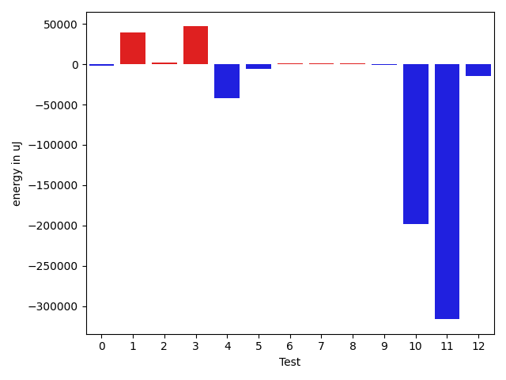

# gson 6e81cf

https://github.com/google/gson/commit/6e81cf

## Delta Energy per test method

| ID | EnergyV1 | EnergyV2 | DeltaEnergy | σV1 | σV2 |
| --- | --- | --- | --- | --- | --- |
| 0 | 36377 | 37353 | 976 | 35243.19715333253 | 9161.128460477727 |
| 1 | 33447 | 34180 | 733 | 2964.794479480079 | 91040.78985420245 |
| 2 | 38513 | 38941 | 428 | 3183.4390735332054 | 11814.122452820902 |
| 3 | 33996 | 33814 | -182 | 15817.868229737323 | 88205.94003444977 |
| 4 | 118774 | 95215 | -23559 | 22262.869849787483 | 43556.9965786855 |
| 5 | 37597 | 37414 | -183 | 39118.84135127158 | 6383.954628688674 |
| 6 | 32775 | 33448 | 673 | 2142.0941596691982 | 2572.159914954584 |
| 7 | 60486 | 70373 | 9887 | 21073.50816827892 | 21633.80389771898 |
| 8 | 34973 | 34302 | -671 | 3165.688893174335 | 1951.2415555293742 |
| 9 | 81726 | 40893 | -40833 | 38633.114553514926 | 47301.38543508406 |
| 10 | 36988 | 37231 | 243 | 375160.65016015223 | 3445.5916980279894 |
| 11 | 39916 | 34851 | -5065 | 327494.1085156078 | 3628.328853733263 |
| 12 | 35583 | 37658 | 2075 | 104440.96745636441 | 3767.1309506526627 |

## Delta Duration per test method

| ID | DurationV1 | DurationsV2 | DeltaDuration |
| --- | --- | --- | --- |
| 0 | 1204864.493150685 | 1193107.9875 | -11756.505650684936 |
| 1 | 1066395.6666666667 | 2447982.2413793104 | 1381586.5747126436 |
| 2 | 1080218.2714285713 | 1185624.7222222222 | 105406.45079365093 |
| 3 | 1079949.2222222222 | 2848860.769230769 | 1768911.5470085468 |
| 4 | 3813481.121212121 | 2673582.59375 | -1139898.527462121 |
| 5 | 1153165.1866666668 | 1172693.6266666667 | 19528.439999999944 |
| 6 | 1299231.5 | 1294388.4545454546 | -4843.045454545412 |
| 7 | 2681246.111111111 | 2457201.21875 | -224044.892361111 |
| 8 | 952015.0 | 959872.7222222222 | 7857.722222222248 |
| 9 | 2716110.237113402 | 2587040.215909091 | -129070.0212043114 |
| 10 | 6834974.774193549 | 989865.4528301887 | -5845109.32136336 |
| 11 | 10222518.46511628 | 642016.7916666666 | -9580501.673449613 |
| 12 | 1452286.2127659575 | 1067520.0625 | -384766.15026595746 |

## Misc.

| ID | Test Class | Test Method |
| --- | --- | --- |
| 0 | com.google.gson.functional.DefaultTypeAdaptersTest | testDateSerializationWithPatternNotOverridenByTypeAdapter |
| 1 | com.google.gson.functional.DefaultTypeAdaptersTest | testDefaultJavaSqlTimestampDeserialization |
| 2 | com.google.gson.functional.DefaultTypeAdaptersTest | testDateSerializationWithPattern |
| 3 | com.google.gson.functional.DefaultTypeAdaptersTest | testDefaultJavaSqlTimestampSerialization |
| 4 | com.google.gson.functional.DefaultTypeAdaptersTest | testDefaultDateDeserializationUsingBuilder |
| 5 | com.google.gson.functional.DefaultTypeAdaptersTest | testDateDeserializationWithPattern |
| 6 | com.google.gson.functional.DefaultTypeAdaptersTest | testDefaultDateSerialization |
| 7 | com.google.gson.functional.DefaultTypeAdaptersTest | testDefaultDateDeserialization |
| 8 | com.google.gson.functional.DefaultTypeAdaptersTest | testDefaultDateSerializationUsingBuilder |
| 9 | com.google.gson.JsonDeserializerExceptionWrapperTest | testProperSerialization |
| 10 | com.google.gson.DefaultDateTypeAdapterTest | testDatePattern |
| 11 | com.google.gson.DefaultDateTypeAdapterTest | testInvalidDatePattern |
| 12 | com.google.gson.DefaultDateTypeAdapterTest | testDateSerialization |

| Test | IterationV1 | IterationV2 | DeltaIteration |
| --- | --- | --- | --- |
| 0 | 73 | 80 | 7 |
| 1 | 24 | 29 | 5 |
| 2 | 70 | 72 | 2 |
| 3 | 9 | 13 | 4 |
| 4 | 99 | 96 | -3 |
| 5 | 75 | 75 | 0 |
| 6 | 24 | 22 | -2 |
| 7 | 27 | 32 | 5 |
| 8 | 14 | 18 | 4 |
| 9 | 97 | 88 | -9 |
| 10 | 62 | 53 | -9 |
| 11 | 43 | 24 | -19 |
| 12 | 47 | 64 | 17 |

| Time Label | Time (s) |
| --- | --- |
| Selection | 26.601621866226196 |
| Injection | 9.9739248752594 |
| Total | 1074.0585536956787 |

