# gson 114633

https://github.com/google/gson/commit/114633

## Delta Energy per test method

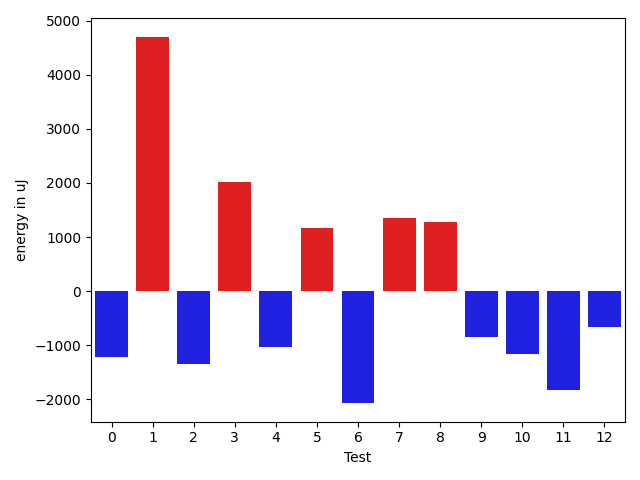

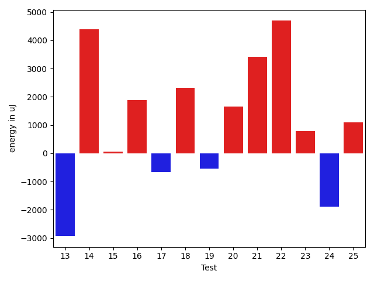

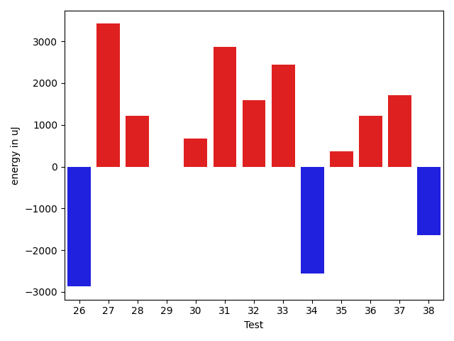

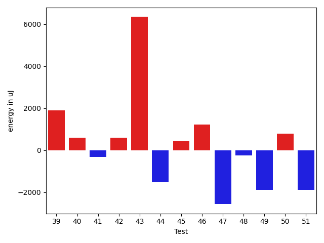

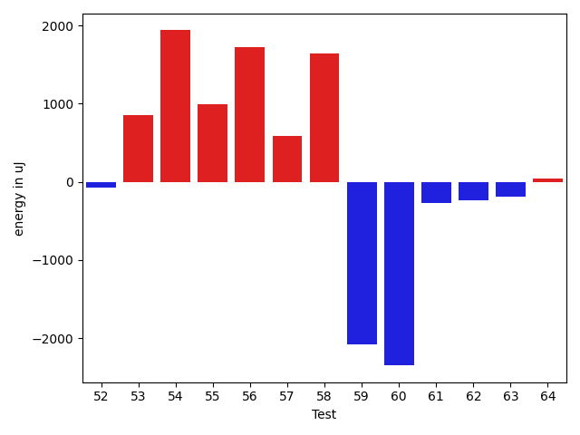

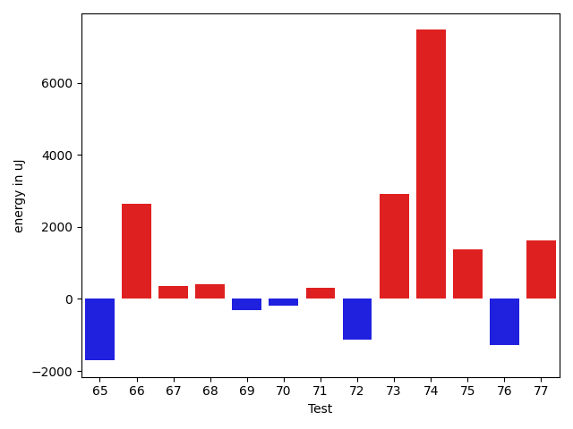

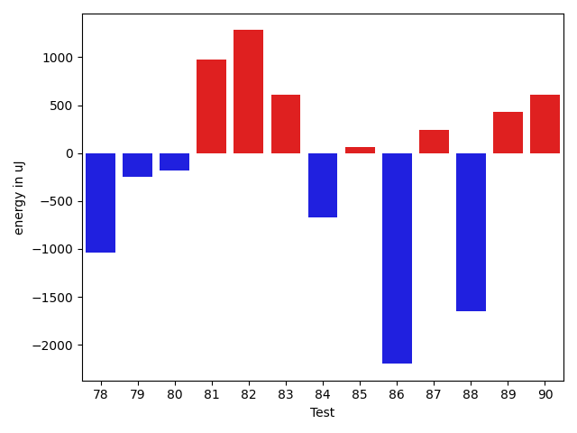

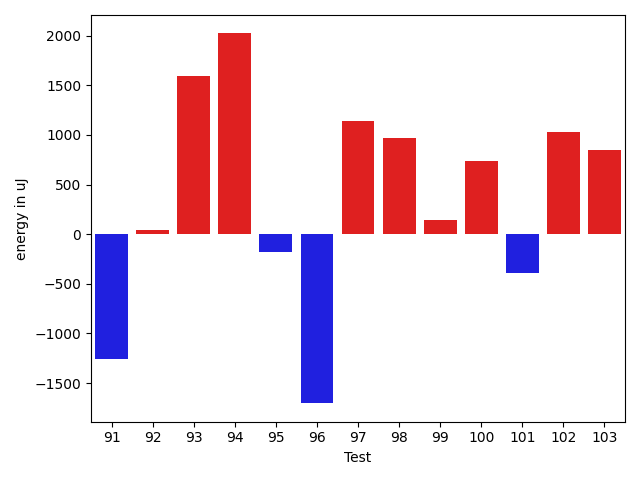

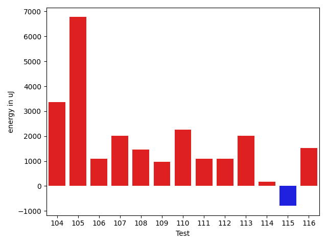

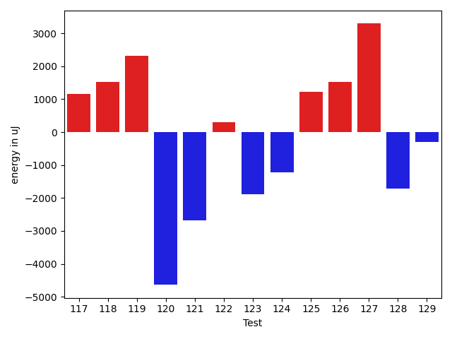

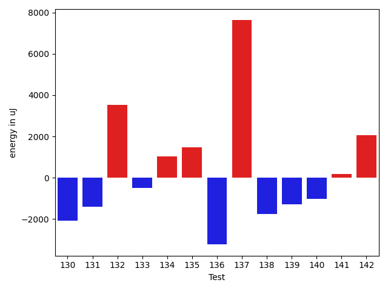

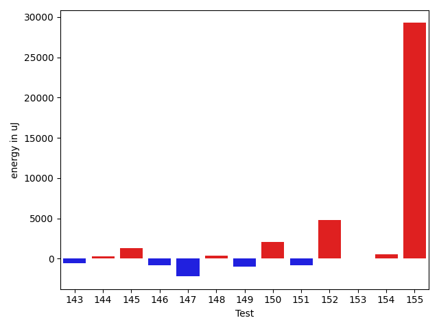

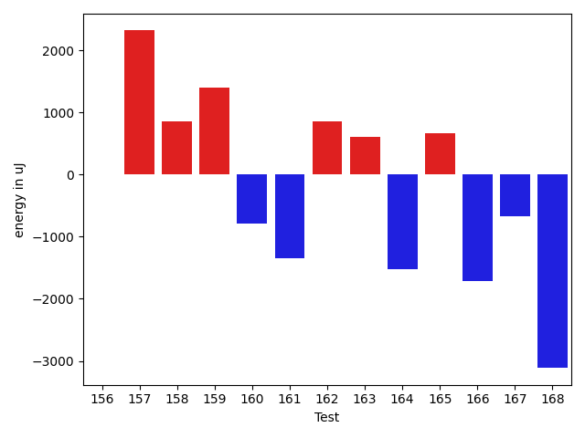

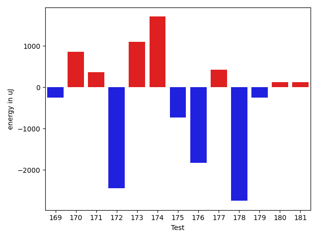

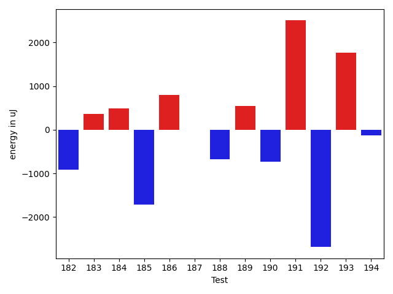

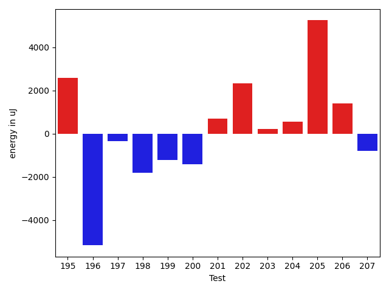

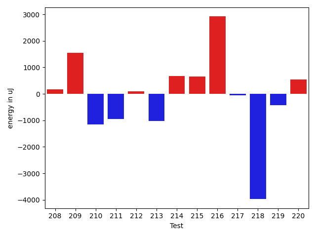

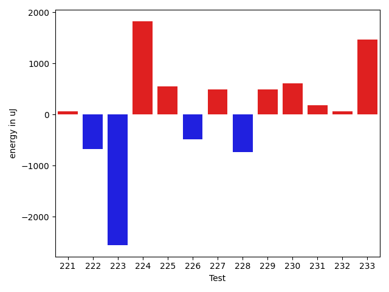

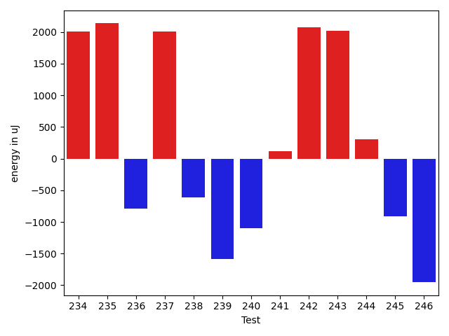

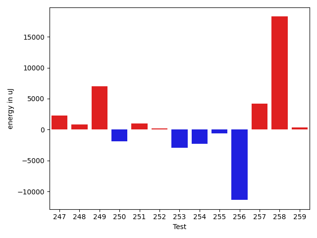

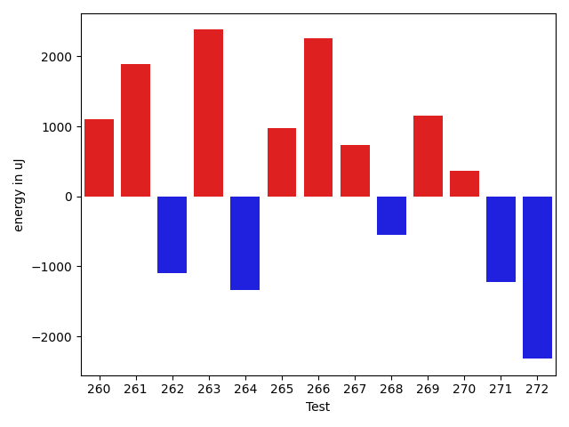

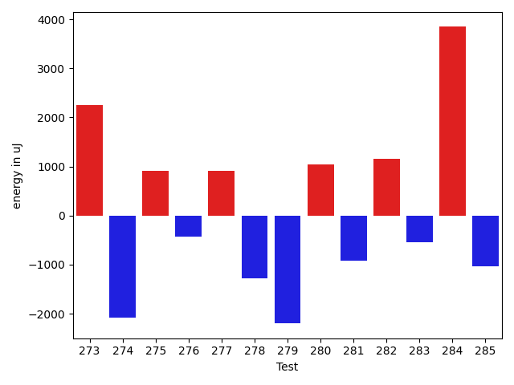

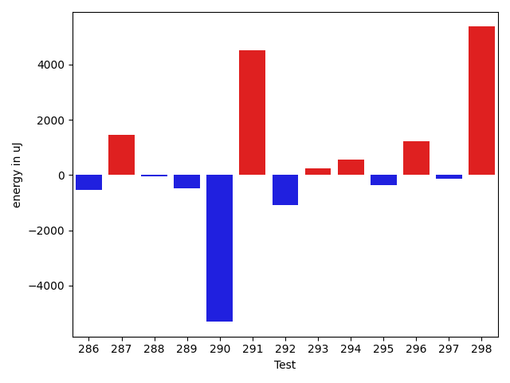

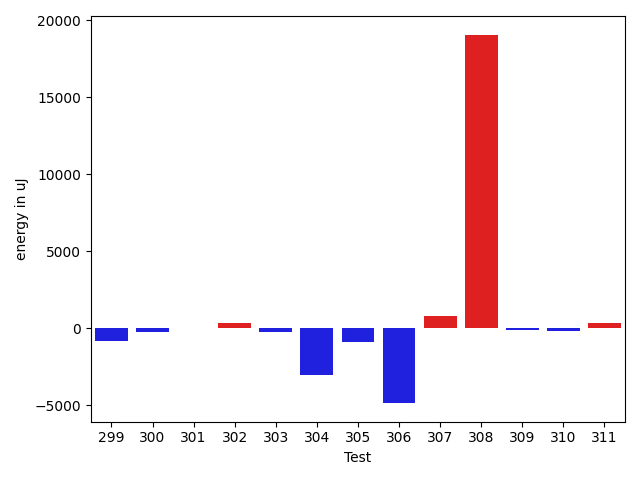

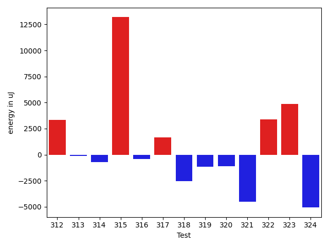

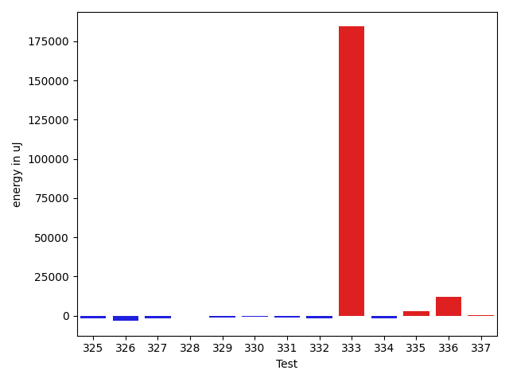

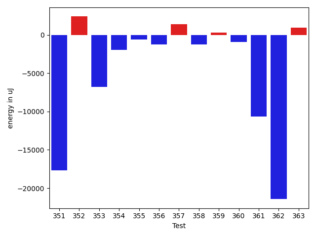

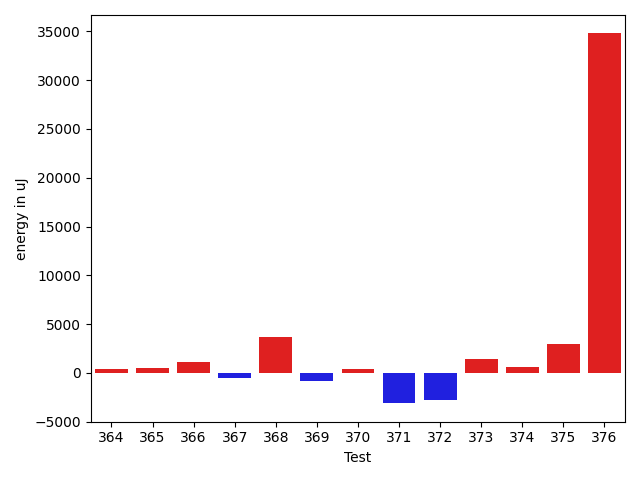

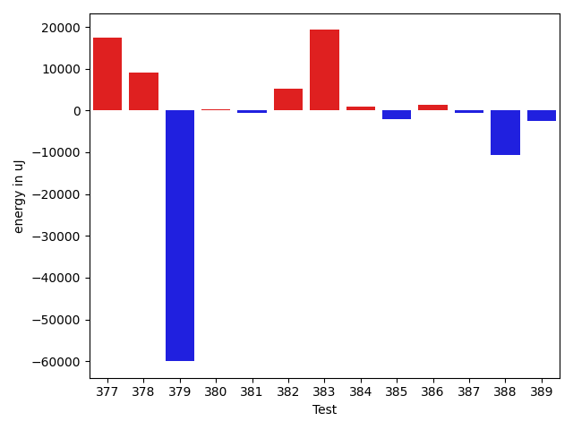

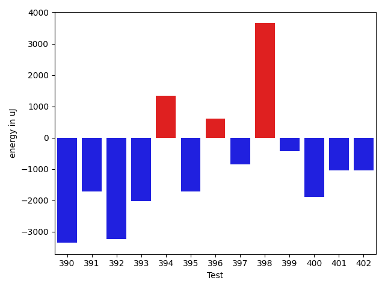

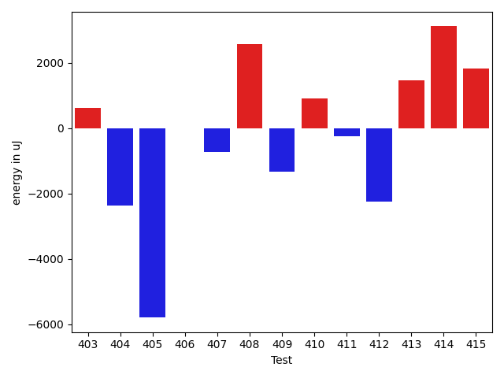

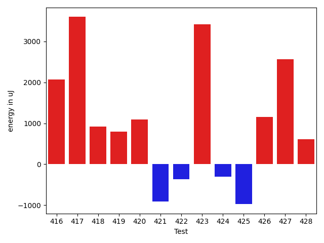

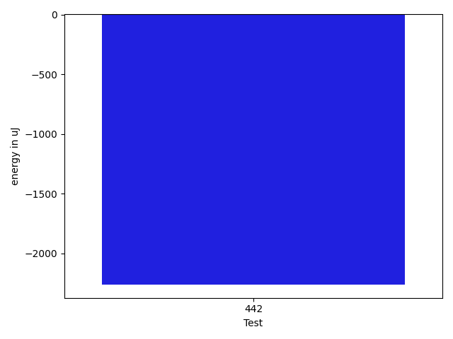

| ID | EnergyV1 | EnergyV2 | DeltaEnergy | σV1 | σV2 |
| --- | --- | --- | --- | --- | --- |
| 0 | 38208 | 36987 | -1221 | 10158.512825130565 | 12438.262549476221 |
| 1 | 35034 | 39734 | 4700 | 4115.955140007695 | 4172.503852012809 |
| 2 | 38025 | 36682 | -1343 | 4325.918208136892 | 3959.178800819622 |
| 3 | 37354 | 39368 | 2014 | 4796.92770322839 | 3655.7445889996197 |
| 4 | 37537 | 36499 | -1038 | 4354.536117297017 | 4053.3928496833532 |
| 5 | 38819 | 39978 | 1159 | 15797.841419842225 | 15664.060517073756 |
| 6 | 39367 | 37293 | -2074 | 4636.361679279751 | 3829.2139552793496 |
| 7 | 38024 | 39368 | 1344 | 3941.880451879988 | 4221.01457030694 |
| 8 | 37598 | 38880 | 1282 | 4133.966575282819 | 39751.66095179016 |
| 9 | 35767 | 34912 | -855 | 3593.2303107532225 | 4656.192718101257 |
| 10 | 37109 | 35950 | -1159 | 3668.2918499498264 | 4432.726173962625 |
| 11 | 38330 | 36499 | -1831 | 4549.846601224546 | 4372.385747061581 |
| 12 | 36987 | 36316 | -671 | 4198.39945635862 | 47529.411280747 |
| 13 | 36988 | 34058 | -2930 | 4439.710474306096 | 5022.619637092141 |
| 14 | 36255 | 40649 | 4394 | 7776.727870358642 | 17260.014051872873 |
| 15 | 38880 | 38941 | 61 | 4753.268408158748 | 4447.337226065025 |
| 16 | 34302 | 36194 | 1892 | 4119.809981945114 | 4296.578779261472 |
| 17 | 37964 | 37292 | -672 | 4775.923833144746 | 4556.354836502737 |
| 18 | 35217 | 37537 | 2320 | 4157.266983321163 | 11069.101018527535 |
| 19 | 36926 | 36377 | -549 | 3810.9460860796653 | 3790.3171277604306 |
| 20 | 36621 | 38269 | 1648 | 5302.304344339355 | 3054.5467261808494 |
| 21 | 36071 | 39490 | 3419 | 4270.285346003015 | 4160.527654473211 |
| 22 | 33935 | 38635 | 4700 | 3963.337652721626 | 4728.408249187844 |
| 23 | 38147 | 38940 | 793 | 4625.843577722398 | 4538.924835978964 |
| 24 | 38757 | 36865 | -1892 | 4964.379521664713 | 4049.5343372745256 |
| 25 | 36804 | 37903 | 1099 | 4280.450381341668 | 4382.931403724076 |
| 26 | 37476 | 34607 | -2869 | 4352.114444083473 | 4828.834333541993 |
| 27 | 35461 | 38879 | 3418 | 5108.725469472564 | 5089.624328965744 |
| 28 | 36133 | 37354 | 1221 | 4757.686967145248 | 4149.233948498807 |
| 29 | 37781 | 37781 | 0 | 4134.350351324861 | 3413.043949321485 |
| 30 | 36133 | 36804 | 671 | 36610.89511347185 | 6028.4327870528905 |
| 31 | 39795 | 42663 | 2868 | 100433.84270288554 | 65270.45994780956 |
| 32 | 36865 | 38452 | 1587 | 4251.321642344492 | 3673.9388301249655 |
| 33 | 36560 | 39001 | 2441 | 4698.673999562714 | 3668.8629633425917 |
| 34 | 36560 | 33996 | -2564 | 4109.454544552064 | 5150.4391933404595 |
| 35 | 38208 | 38574 | 366 | 4845.155513242067 | 3293.6184767456157 |
| 36 | 36133 | 37353 | 1220 | 4372.679611448225 | 4330.417695758506 |
| 37 | 37781 | 39489 | 1708 | 4933.391596729746 | 4997.984684850485 |
| 38 | 36438 | 34790 | -1648 | 5481.151221282114 | 39496.43020399913 |
| 39 | 37231 | 39123 | 1892 | 51819.99693088246 | 4229.765537639333 |
| 40 | 39672 | 40283 | 611 | 4146.041073522226 | 3745.160710837387 |
| 41 | 36133 | 35827 | -306 | 3599.5365010265173 | 3315.829747840903 |
| 42 | 38391 | 39001 | 610 | 4674.355528773459 | 4632.434522945252 |
| 43 | 33875 | 40222 | 6347 | 3920.344070697502 | 4736.011744395864 |
| 44 | 39062 | 37536 | -1526 | 3515.216417551304 | 4157.5533404331345 |
| 45 | 38146 | 38574 | 428 | 4154.7962688518555 | 5122.899592094087 |
| 46 | 36011 | 37231 | 1220 | 4364.900939802153 | 3559.797765941206 |
| 47 | 38208 | 35645 | -2563 | 5288.661078717388 | 3861.6762156746126 |
| 48 | 35950 | 35706 | -244 | 4872.887196177095 | 35488.71466707514 |
| 49 | 37415 | 35522 | -1893 | 3464.9967002818325 | 4305.440755458776 |
| 50 | 37170 | 37964 | 794 | 4459.4357943765335 | 4721.6401721150405 |
| 51 | 39795 | 37902 | -1893 | 4328.955469172862 | 3743.8548418606024 |
| 52 | 34057 | 35034 | 977 | 3146.866269093041 | 4230.109382481156 |
| 53 | 35034 | 37109 | 2075 | 4033.511784834649 | 5248.975394901466 |
| 54 | 35766 | 38391 | 2625 | 3678.876169113995 | 4035.8776504896955 |
| 55 | 36133 | 37354 | 1221 | 3854.5885826212684 | 4822.069354771063 |
| 56 | 36560 | 38635 | 2075 | 3015.0787909365745 | 3808.4685163461704 |
| 57 | 34606 | 36072 | 1466 | 4860.257183867263 | 3836.081216820209 |
| 58 | 39673 | 41687 | 2014 | 4823.653157845211 | 4105.651664474228 |
| 59 | 36743 | 40711 | 3968 | 25699.34404720765 | 5203.783358288467 |
| 60 | 40405 | 37537 | -2868 | 4629.920590406426 | 5644.596001082105 |
| 61 | 38208 | 37353 | -855 | 4207.01382775702 | 3031.1089566238306 |
| 62 | 37903 | 36377 | -1526 | 3935.4647535795148 | 3922.502563556984 |
| 63 | 37781 | 36804 | -977 | 4864.303003141477 | 3470.9475044215096 |
| 64 | 36682 | 35645 | -1037 | 4283.070674694983 | 3747.6230544965097 |
| 65 | 38574 | 35217 | -3357 | 4282.430893549211 | 3629.082863020169 |
| 66 | 34729 | 38269 | 3540 | 2899.201072601726 | 3357.876660430914 |
| 67 | 37048 | 37598 | 550 | 3512.8633009880373 | 5075.224710952873 |
| 68 | 37964 | 35706 | -2258 | 4445.9488625135955 | 3805.9908774912105 |
| 69 | 36438 | 36193 | -245 | 4812.61852086198 | 5004.686753043966 |
| 70 | 37780 | 38452 | 672 | 11114.9117516977 | 9367.087426521317 |
| 71 | 38513 | 39184 | 671 | 23581.388406935534 | 14241.641773371553 |
| 72 | 77575 | 78125 | 550 | 28363.144169090574 | 24036.6647092364 |
| 73 | 38025 | 38940 | 915 | 10126.66767473588 | 14526.206941408942 |
| 74 | 37963 | 37049 | -914 | 4771.154006266078 | 37745.019903657485 |
| 75 | 38513 | 36926 | -1587 | 6670.000203979639 | 11224.742121609694 |
| 76 | 36926 | 36438 | -488 | 4405.730573174299 | 4228.018150491839 |
| 77 | 36621 | 37171 | 550 | 5553.115684491167 | 9129.713688003576 |
| 78 | 46691 | 45654 | -1037 | 49194.77308712422 | 23406.751026265494 |
| 79 | 36987 | 36743 | -244 | 4000.138652490599 | 4066.507506867195 |
| 80 | 36804 | 36621 | -183 | 4504.14222337476 | 4061.53768916623 |
| 81 | 36987 | 37964 | 977 | 3901.8742441011664 | 3644.3200750757333 |
| 82 | 36560 | 37841 | 1281 | 3844.7405347150393 | 3594.20590694237 |
| 83 | 36194 | 36804 | 610 | 4440.751602125403 | 4611.953200738557 |
| 84 | 38208 | 37536 | -672 | 4907.353800496905 | 5258.74804228366 |
| 85 | 38208 | 38269 | 61 | 4841.562139361461 | 8671.121643167273 |
| 86 | 38025 | 35828 | -2197 | 5065.044042914797 | 4815.717815197893 |
| 87 | 36560 | 36804 | 244 | 4407.132502972917 | 4204.566494954285 |
| 88 | 39185 | 37537 | -1648 | 4574.452760986826 | 4223.82078148243 |
| 89 | 37109 | 37537 | 428 | 7997.893365964148 | 8421.575406737207 |
| 90 | 36926 | 37536 | 610 | 4028.7005768547924 | 3775.117777156755 |
| 91 | 37719 | 37476 | -243 | 8639.497609393056 | 4647.038826795728 |
| 92 | 35827 | 35279 | -548 | 4844.19680767289 | 4646.19648297049 |
| 93 | 35827 | 37476 | 1649 | 4000.476395578611 | 4969.34354635132 |
| 94 | 35522 | 38513 | 2991 | 4016.2132093814284 | 3379.2376608293403 |
| 95 | 37475 | 37231 | -244 | 5626.726157235725 | 3170.445923741943 |
| 96 | 39002 | 35217 | -3785 | 4764.319263316239 | 5015.720447752247 |
| 97 | 37658 | 37232 | -426 | 4812.665511583876 | 4670.8864093326965 |
| 98 | 38879 | 39123 | 244 | 5194.535763011924 | 5504.840716461237 |
| 99 | 37842 | 38391 | 549 | 4649.906208210265 | 4665.090572101863 |
| 100 | 39063 | 37536 | -1527 | 4603.835836534934 | 4858.679208830419 |
| 101 | 39673 | 37475 | -2198 | 4484.235262437609 | 4263.272416677855 |
| 102 | 36255 | 38452 | 2197 | 5029.464712405618 | 5514.602573542145 |
| 103 | 36560 | 37476 | 916 | 4694.703490038002 | 2181.9057419298997 |
| 104 | 39673 | 43030 | 3357 | 109975.25293447539 | 178450.35846295967 |
| 105 | 34363 | 41138 | 6775 | 5091.820323733318 | 5538.3776927414065 |
| 106 | 42114 | 43212 | 1098 | 69269.4653270018 | 23129.18668967467 |
| 107 | 37170 | 39184 | 2014 | 4168.941748707195 | 4284.15361543179 |
| 108 | 38086 | 39551 | 1465 | 8200.792487329923 | 9811.17314743483 |
| 109 | 38941 | 39917 | 976 | 6329.627456763542 | 7854.051405367692 |
| 110 | 38269 | 40527 | 2258 | 26649.512106957773 | 29061.193232582682 |
| 111 | 37781 | 38880 | 1099 | 35641.60482723127 | 4640.165121051286 |
| 112 | 37232 | 38330 | 1098 | 3783.224368445639 | 7028.7656357002 |
| 113 | 36682 | 38696 | 2014 | 3684.877412584961 | 6672.108477989443 |
| 114 | 38086 | 38269 | 183 | 5902.67809816096 | 3883.1508710710687 |
| 115 | 37537 | 36743 | -794 | 22154.38759512889 | 36836.58374915837 |
| 116 | 38940 | 40467 | 1527 | 31131.206952851688 | 68687.40709521458 |
| 117 | 37048 | 38208 | 1160 | 4296.378686554544 | 6183.883150383746 |
| 118 | 114258 | 115783 | 1525 | 22127.282644220522 | 18731.26532640251 |
| 119 | 36499 | 38818 | 2319 | 8335.686598011389 | 9841.872563015173 |
| 120 | 39123 | 34485 | -4638 | 3972.453780345625 | 4592.25342004586 |
| 121 | 36011 | 33325 | -2686 | 3717.0884212777637 | 4101.101117179791 |
| 122 | 39062 | 39368 | 306 | 19844.61309663433 | 19401.654000338935 |
| 123 | 37414 | 35523 | -1891 | 5875.013558282227 | 5228.601830235295 |
| 124 | 40344 | 39124 | -1220 | 4642.246377951089 | 3963.9420577398846 |
| 125 | 36438 | 37659 | 1221 | 4661.603334055958 | 3465.5210434878536 |
| 126 | 36316 | 37841 | 1525 | 4836.018909640297 | 4159.751629899192 |
| 127 | 35767 | 39063 | 3296 | 4714.072083898205 | 4581.017586408519 |
| 128 | 36743 | 35034 | -1709 | 4717.501230795522 | 4951.461764709142 |
| 129 | 36865 | 36560 | -305 | 5711.846950541989 | 4222.8568098112755 |
| 130 | 38696 | 36621 | -2075 | 4678.5833612057695 | 4649.156809417032 |
| 131 | 37659 | 36254 | -1405 | 15512.975498521851 | 8709.97980207155 |
| 132 | 38147 | 41687 | 3540 | 40368.83894674421 | 45042.33133627297 |
| 133 | 35705 | 35217 | -488 | 4370.632109889827 | 4610.666217536147 |
| 134 | 36133 | 37170 | 1037 | 4345.092703748295 | 4217.516654299061 |
| 135 | 35156 | 36621 | 1465 | 4318.918681984788 | 3522.928058571073 |
| 136 | 36926 | 33691 | -3235 | 5046.329067631592 | 4564.895445790833 |
| 137 | 31494 | 39123 | 7629 | 4240.613499738766 | 5049.524924875819 |
| 138 | 36682 | 34912 | -1770 | 4247.824805284334 | 4867.716153497491 |
| 139 | 38391 | 37109 | -1282 | 4985.245822464525 | 4798.068217754122 |
| 140 | 37232 | 36194 | -1038 | 4427.393352627355 | 3578.50010725164 |
| 141 | 35950 | 36133 | 183 | 4462.721979042036 | 4883.339017723237 |
| 142 | 34973 | 37048 | 2075 | 3898.7873292716145 | 3915.7054392196933 |
| 143 | 37536 | 37658 | 122 | 5173.467438124389 | 5111.476493412479 |
| 144 | 37781 | 38757 | 976 | 4772.413771872776 | 4892.147041212018 |
| 145 | 35950 | 37292 | 1342 | 3918.8545952667055 | 2597.836886680131 |
| 146 | 34790 | 32104 | -2686 | 4166.4373338274 | 5201.835491940042 |
| 147 | 39184 | 34607 | -4577 | 3958.646264036143 | 5592.071955903287 |
| 148 | 39551 | 36377 | -3174 | 5514.434186302501 | 4190.610944700516 |
| 149 | 36743 | 36560 | -183 | 4218.936905379156 | 4161.667518260484 |
| 150 | 37293 | 39246 | 1953 | 4333.330483973422 | 4739.787530399789 |
| 151 | 40283 | 38880 | -1403 | 0.0 | 1139.3332358104112 |
| 152 | 33264 | 38208 | 4944 | 0.0 | 152.5 |
| 153 | 37598 | 37903 | 305 | 0.0 | 785.503461163603 |
| 154 | 38452 | 39795 | 1343 | 0.0 | 2211.170027132443 |
| 155 | 71106 | 109802 | 38696 | 0.0 | 13223.845928431292 |
| 156 | 37659 | 37659 | 0 | 7041.432761699436 | 4586.186858990188 |
| 157 | 36072 | 38391 | 2319 | 4885.335921935467 | 4544.21273490986 |
| 158 | 37903 | 38757 | 854 | 12111.848650822467 | 12581.471711289756 |
| 159 | 36010 | 37415 | 1405 | 4075.0453536119326 | 4558.918685546889 |
| 160 | 37658 | 36865 | -793 | 4236.861936624601 | 4390.220979886109 |
| 161 | 72022 | 70678 | -1344 | 62323.967024047255 | 60804.71468542654 |
| 162 | 38086 | 38940 | 854 | 9787.04551444042 | 9191.844150432877 |
| 163 | 75684 | 76294 | 610 | 27847.695786903714 | 28755.658890580213 |
| 164 | 39673 | 38147 | -1526 | 15191.134618673465 | 9914.54194640451 |
| 165 | 37781 | 38452 | 671 | 34607.94466564025 | 43022.22043271486 |
| 166 | 68359 | 66651 | -1708 | 26387.701064148663 | 21570.849526369057 |
| 167 | 38696 | 38025 | -671 | 17135.439633208513 | 14044.218522636449 |
| 168 | 77209 | 74096 | -3113 | 29208.632083920933 | 38546.92577316883 |
| 169 | 38819 | 38575 | -244 | 12072.362736212466 | 11979.041610546223 |
| 170 | 36438 | 37292 | 854 | 8580.163761584794 | 6243.469111507726 |
| 171 | 38147 | 38513 | 366 | 10676.663078623604 | 7981.185276729742 |
| 172 | 38879 | 36438 | -2441 | 4599.213664606506 | 4260.173315969523 |
| 173 | 37170 | 38269 | 1099 | 3790.9007161887 | 4181.855428644916 |
| 174 | 36438 | 38146 | 1708 | 4389.237659358522 | 4050.2792754554184 |
| 175 | 40161 | 39429 | -732 | 23811.884581863735 | 19236.041972884792 |
| 176 | 41931 | 40100 | -1831 | 172775.4148907725 | 221459.73378330725 |
| 177 | 37842 | 38269 | 427 | 4573.770507618574 | 6025.418712974781 |
| 178 | 84411 | 81665 | -2746 | 23581.758512528486 | 29312.865101426767 |
| 179 | 38086 | 37842 | -244 | 25732.82316884373 | 28324.809492189263 |
| 180 | 39001 | 39124 | 123 | 28460.341271085334 | 42070.39794495301 |
| 181 | 38086 | 38208 | 122 | 5540.231346859243 | 11589.958007832936 |
| 182 | 37964 | 37048 | -916 | 3539.107104089233 | 4559.149414710723 |
| 183 | 36866 | 37231 | 365 | 3949.2475049505715 | 4545.842823634588 |
| 184 | 37293 | 37780 | 487 | 7202.287330970606 | 8329.2529216426 |
| 185 | 38513 | 36804 | -1709 | 3894.363627410774 | 4204.706737898627 |
| 186 | 36438 | 37231 | 793 | 4377.26734104738 | 4319.029714500756 |
| 187 | 37964 | 37964 | 0 | 4087.539482951983 | 4796.386785933172 |
| 188 | 37902 | 37231 | -671 | 28229.539451528428 | 4175.372742068259 |
| 189 | 36926 | 37476 | 550 | 4315.503603216547 | 4113.548971507147 |
| 190 | 38513 | 37781 | -732 | 4336.42631839211 | 5331.822113804477 |
| 191 | 38940 | 41443 | 2503 | 29446.092677600333 | 18226.170799529053 |
| 192 | 92590 | 89905 | -2685 | 384462.9844071512 | 384489.2917368242 |
| 193 | 36560 | 38330 | 1770 | 4575.410676938528 | 7156.800196297379 |
| 194 | 42847 | 42724 | -123 | 44842.30958917367 | 52904.148770213746 |
| 195 | 38941 | 38391 | -550 | 5465.0564167623925 | 16961.678394734372 |
| 196 | 38330 | 38391 | 61 | 46190.66412308204 | 23969.4083851464 |
| 197 | 39245 | 38452 | -793 | 3886.185531260635 | 4538.503176787946 |
| 198 | 38269 | 37414 | -855 | 9152.596749397891 | 4604.116941996152 |
| 199 | 38086 | 37110 | -976 | 6700.14057121288 | 4662.442042200096 |
| 200 | 37415 | 36438 | -977 | 5338.39336201834 | 4664.571429978302 |
| 201 | 36926 | 36804 | -122 | 5085.245143571032 | 4931.348040085532 |
| 202 | 35583 | 37475 | 1892 | 4420.296894975884 | 4452.365418821178 |
| 203 | 37842 | 37964 | 122 | 4014.388082070465 | 4314.371775650696 |
| 204 | 38696 | 39246 | 550 | 12422.928339427577 | 13901.950839850122 |
| 205 | 39184 | 38025 | -1159 | 6262.5308995698315 | 31989.412781349318 |
| 206 | 35339 | 36316 | 977 | 4460.610457190098 | 5202.074472025559 |
| 207 | 37475 | 36133 | -1342 | 4159.622253875708 | 4297.6047725234075 |
| 208 | 38758 | 39551 | 793 | 15491.984958723451 | 13898.652841073334 |
| 209 | 39306 | 38574 | -732 | 52126.53328231602 | 61118.32266042808 |
| 210 | 38147 | 38513 | 366 | 20559.203427915196 | 16452.621634256346 |
| 211 | 38697 | 38025 | -672 | 7180.845289824096 | 5775.835407890088 |
| 212 | 36987 | 37109 | 122 | 5531.2368333877 | 4015.1145632072153 |
| 213 | 36987 | 35644 | -1343 | 4525.30411472019 | 4783.535680087016 |
| 214 | 35645 | 38207 | 2562 | 4758.211838500009 | 4331.753593327676 |
| 215 | 37598 | 37414 | -184 | 4765.510997196418 | 4363.192984547917 |
| 216 | 38635 | 35950 | -2685 | 30512.788278031883 | 37307.130665271274 |
| 217 | 38147 | 38086 | -61 | 4605.117911113723 | 4724.181987539101 |
| 218 | 39184 | 38513 | -671 | 50228.173235947055 | 34961.56943199126 |
| 219 | 37415 | 37353 | -62 | 4227.388875457814 | 4333.588279479416 |
| 220 | 37292 | 37964 | 672 | 4605.231729815318 | 4474.055047040662 |
| 221 | 36499 | 36560 | 61 | 3712.8457851592766 | 4382.7814055977115 |
| 222 | 36804 | 36132 | -672 | 3475.6700408247875 | 3928.0015274946113 |
| 223 | 38879 | 36316 | -2563 | 4138.086502300192 | 3460.412287081006 |
| 224 | 36255 | 38086 | 1831 | 4023.8662088751266 | 3872.566720550238 |
| 225 | 37292 | 37841 | 549 | 4280.778274903862 | 4505.134795862261 |
| 226 | 38208 | 37720 | -488 | 7923.291928556458 | 7726.771497707033 |
| 227 | 38391 | 38879 | 488 | 4119.360356144564 | 5965.428931583861 |
| 228 | 40223 | 39489 | -734 | 18068.261756684475 | 16464.13106845302 |
| 229 | 38452 | 38940 | 488 | 3086.006076061292 | 3178.966249065632 |
| 230 | 40528 | 41138 | 610 | 83312.85620029982 | 96066.40341065788 |
| 231 | 37293 | 37476 | 183 | 6904.814042723966 | 3773.416490271631 |
| 232 | 37597 | 37658 | 61 | 3864.0766962569164 | 4771.467645144228 |
| 233 | 37903 | 39367 | 1464 | 3802.298158213085 | 3162.519170878311 |
| 234 | 35828 | 37842 | 2014 | 4055.0466198719805 | 4382.100129078636 |
| 235 | 37109 | 39245 | 2136 | 4775.63039324575 | 13828.69615161226 |
| 236 | 38513 | 37720 | -793 | 4294.312451435684 | 4609.296896881346 |
| 237 | 35828 | 37842 | 2014 | 4771.502156951464 | 4663.309050113985 |
| 238 | 38513 | 37903 | -610 | 4632.460476871413 | 4527.620589240377 |
| 239 | 38635 | 37048 | -1587 | 5487.362736178464 | 4765.847251820148 |
| 240 | 38391 | 37293 | -1098 | 10907.737238699106 | 10144.413108400031 |
| 241 | 39245 | 39367 | 122 | 26054.540402835504 | 24638.820069002642 |
| 242 | 38025 | 40100 | 2075 | 12079.869257975459 | 10067.17878747301 |
| 243 | 36865 | 38880 | 2015 | 4412.276438529209 | 4741.449096762516 |
| 244 | 37048 | 37353 | 305 | 3389.019151030081 | 3876.78729388732 |
| 245 | 37353 | 36438 | -915 | 4557.308199678787 | 4281.304877497237 |
| 246 | 38330 | 36377 | -1953 | 4489.025186774964 | 5048.388487526257 |
| 247 | 37048 | 39062 | 2014 | 4979.750225432226 | 3125.6771202920913 |
| 248 | 38880 | 38574 | -306 | 3662.8968963744237 | 3844.5879373690054 |
| 249 | 129638 | 128051 | -1587 | 88943.44073260119 | 117460.0901632224 |
| 250 | 41442 | 38452 | -2990 | 4289.581732839268 | 3442.3365453761744 |
| 251 | 37597 | 39246 | 1649 | 4235.191334709685 | 3115.578166649009 |
| 252 | 39550 | 38697 | -853 | 4118.547502659585 | 8267.796709349275 |
| 253 | 40588 | 37048 | -3540 | 4324.200511234262 | 3812.170961687806 |
| 254 | 39001 | 36560 | -2441 | 3823.0055477703077 | 3893.8667522624605 |
| 255 | 39307 | 39063 | -244 | 5397.834410692822 | 4407.124925148748 |
| 256 | 40039 | 40039 | 0 | 82690.36138745745 | 36426.1684703853 |
| 257 | 55237 | 50537 | -4700 | 48557.76312535881 | 52106.420599948135 |
| 258 | 41260 | 41992 | 732 | 25390.993582141018 | 76631.39525437764 |
| 259 | 40649 | 37110 | -3539 | 5677.278032649097 | 4084.564214314873 |
| 260 | 38940 | 40039 | 1099 | 10992.823972580132 | 34214.15563450634 |
| 261 | 38574 | 40466 | 1892 | 13635.25419665095 | 11858.809196941256 |
| 262 | 42480 | 41382 | -1098 | 22526.534788277186 | 15204.695116818528 |
| 263 | 38879 | 41260 | 2381 | 5643.49405896737 | 4060.4542631988124 |
| 264 | 40222 | 38880 | -1342 | 4794.80801750201 | 4212.771388014874 |
| 265 | 38574 | 39551 | 977 | 4910.301678579223 | 47276.09132085161 |
| 266 | 38758 | 41015 | 2257 | 5266.360335715319 | 5138.044535695817 |
| 267 | 38147 | 38879 | 732 | 3901.3400495727105 | 4647.617588282579 |
| 268 | 39612 | 39063 | -549 | 4674.353646808519 | 4217.203923612579 |
| 269 | 40527 | 41687 | 1160 | 417038.324706996 | 382714.8619766964 |
| 270 | 81421 | 81787 | 366 | 35620.82634388888 | 24032.33772900054 |
| 271 | 88196 | 86975 | -1221 | 227138.17282991557 | 213616.29227780853 |
| 272 | 39002 | 36682 | -2320 | 4517.593349585841 | 4501.9485266389065 |
| 273 | 35400 | 37659 | 2259 | 4126.040929769387 | 4443.723335402107 |
| 274 | 38574 | 36499 | -2075 | 5072.075084339577 | 4420.445367811608 |
| 275 | 35645 | 36560 | 915 | 5032.895950390882 | 42673.02144985428 |
| 276 | 37780 | 37354 | -426 | 4612.651602964825 | 6663.847155192608 |
| 277 | 37780 | 38696 | 916 | 28475.098260853774 | 31607.850436965113 |
| 278 | 37476 | 36194 | -1282 | 4476.097596110517 | 4928.0629854016615 |
| 279 | 36438 | 34241 | -2197 | 4713.642209586977 | 4894.341841105911 |
| 280 | 35766 | 36804 | 1038 | 4378.455072041161 | 3917.4076066534953 |
| 281 | 36255 | 35339 | -916 | 4248.837177393363 | 4020.131947245499 |
| 282 | 38513 | 39673 | 1160 | 4983.270209369731 | 5275.372406159459 |
| 283 | 38086 | 37536 | -550 | 4207.8665128356615 | 4770.540977941833 |
| 284 | 34546 | 38391 | 3845 | 26871.802830388373 | 23705.604779325506 |
| 285 | 40039 | 39001 | -1038 | 29370.794614060713 | 20621.88040419312 |
| 286 | 39124 | 38574 | -550 | 4605.229422562874 | 3825.7641895552115 |
| 287 | 36744 | 38208 | 1464 | 3296.878536848862 | 2520.2572258352916 |
| 288 | 39551 | 39490 | -61 | 31128.243606025924 | 41812.321138989035 |
| 289 | 37598 | 37110 | -488 | 12119.240467832413 | 12370.452295411658 |
| 290 | 42420 | 37109 | -5311 | 50399.11186462996 | 49243.413698329445 |
| 291 | 34546 | 39062 | 4516 | 3883.117686712332 | 3900.8005969014093 |
| 292 | 37720 | 36621 | -1099 | 9854.045156571747 | 6985.898278201729 |
| 293 | 40466 | 40710 | 244 | 5189.791716527922 | 3909.421362412715 |
| 294 | 37963 | 38513 | 550 | 4670.042070828769 | 5191.090454915144 |
| 295 | 38208 | 37841 | -367 | 4713.442853630325 | 4189.949785937499 |
| 296 | 37842 | 39062 | 1220 | 4787.772547196467 | 26828.9513249283 |
| 297 | 42114 | 41992 | -122 | 5733.532886395176 | 4190.790203833208 |
| 298 | 33692 | 39062 | 5370 | 4677.795222912179 | 4536.116056203397 |
| 299 | 39917 | 38330 | -1587 | 4019.490283467406 | 2574.5915997154666 |
| 300 | 37720 | 37292 | -428 | 3744.8826499934844 | 3819.073319646185 |
| 301 | 39733 | 42663 | 2930 | 14700.160638436839 | 12866.352407890268 |
| 302 | 34180 | 36377 | 2197 | 4718.344891509676 | 5213.55440055055 |
| 303 | 37048 | 38086 | 1038 | 5050.698366867653 | 3709.303120383786 |
| 304 | 38330 | 36805 | -1525 | 3777.8840373944777 | 4493.703944285703 |
| 305 | 36987 | 35339 | -1648 | 5410.21189678982 | 4545.208673169259 |
| 306 | 43030 | 38452 | -4578 | 2689.3127723453813 | 4813.8551651478265 |
| 307 | 37170 | 37903 | 733 | 4671.5816788884285 | 3800.560952754212 |
| 308 | 170226 | 173889 | 3663 | 158184.03134570667 | 217482.46319316764 |
| 309 | 38514 | 38269 | -245 | 4405.916022579719 | 4135.907660182191 |
| 310 | 40344 | 39734 | -610 | 4753.279733506719 | 4291.037073828165 |
| 311 | 38330 | 37048 | -1282 | 9115.56005940866 | 10795.479105509628 |
| 312 | 40527 | 39124 | -1403 | 35494.077268800494 | 43932.01753959605 |
| 313 | 38452 | 38635 | 183 | 4642.343907336142 | 4747.447349775338 |
| 314 | 40039 | 39795 | -244 | 4276.281691566184 | 4763.913456708716 |
| 315 | 39245 | 39367 | 122 | 35586.43167899246 | 43975.03067292732 |
| 316 | 37903 | 37781 | -122 | 5078.424107880429 | 5051.123981987074 |
| 317 | 40161 | 39368 | -793 | 226662.52975730866 | 260797.29833498137 |
| 318 | 39123 | 37048 | -2075 | 3769.5347274867217 | 4094.268906044155 |
| 319 | 39307 | 38208 | -1099 | 4559.933013364162 | 4288.252496189372 |
| 320 | 67078 | 70007 | 2929 | 23693.994536833074 | 21681.4587194079 |
| 321 | 38391 | 38208 | -183 | 36508.892242509195 | 12758.054726415567 |
| 322 | 37476 | 40894 | 3418 | 29752.91670311333 | 25858.781285162597 |
| 323 | 39124 | 39124 | 0 | 32758.161358509362 | 42645.44938693118 |
| 324 | 38758 | 39124 | 366 | 45996.95279197724 | 26617.155019624053 |
| 325 | 39429 | 36255 | -3174 | 4538.242645072601 | 4126.609593063537 |
| 326 | 40405 | 40222 | -183 | 46114.04826284425 | 33988.06690169296 |
| 327 | 37598 | 37781 | 183 | 13624.532489104595 | 10387.245091296667 |
| 328 | 37720 | 39734 | 2014 | 21690.498405278173 | 9976.935116142593 |
| 329 | 38513 | 37231 | -1282 | 4164.5802174528935 | 4612.703434237044 |
| 330 | 39001 | 38452 | -549 | 3752.1940303758147 | 5085.167541733507 |
| 331 | 38941 | 36804 | -2137 | 3577.752132944137 | 6582.894786153804 |
| 332 | 38147 | 36621 | -1526 | 3893.637002759912 | 4065.3447972465365 |
| 333 | 40527 | 42969 | 2442 | 417779.71209202614 | 517402.334096611 |
| 334 | 38574 | 36866 | -1708 | 3042.4669330247048 | 3574.0017220437367 |
| 335 | 39245 | 39795 | 550 | 16743.87072018657 | 22779.05759715096 |
| 336 | 40405 | 39428 | -977 | 12382.97620317479 | 46637.14202879026 |
| 337 | 37964 | 38208 | 244 | 4138.247782227073 | 7895.537674323811 |
| 338 | 38757 | 37780 | -977 | 4038.092710818602 | 3948.4512170541457 |
| 339 | 40588 | 42114 | 1526 | 41021.882049884065 | 46302.37035862743 |
| 340 | 38086 | 37659 | -427 | 4453.831672913192 | 3573.2259488809036 |
| 341 | 41504 | 43213 | 1709 | 36806.937051055094 | 33899.74544338103 |
| 342 | 38147 | 36499 | -1648 | 3778.81513520931 | 3522.2468558549735 |
| 343 | 36926 | 35888 | -1038 | 4053.582693657672 | 4930.235656386011 |
| 344 | 37475 | 39490 | 2015 | 7459.501890350885 | 4538.3368519070455 |
| 345 | 70556 | 72143 | 1587 | 195596.57777207383 | 43365.94664175448 |
| 346 | 67322 | 76843 | 9521 | 445580.126643637 | 218635.65060491374 |
| 347 | 44311 | 41870 | -2441 | 39567.65363449714 | 17455.051102737674 |
| 348 | 40771 | 39978 | -793 | 409666.13013153273 | 311152.0957317087 |
| 349 | 38452 | 37781 | -671 | 5081.385031662134 | 4703.4838043131285 |
| 350 | 38147 | 37109 | -1038 | 11048.063415468896 | 4893.357734558893 |
| 351 | 40039 | 38208 | -1831 | 65600.4951098497 | 41539.146683485335 |
| 352 | 36926 | 40771 | 3845 | 4049.8109201404563 | 5345.988035563574 |
| 353 | 40832 | 39246 | -1586 | 31120.484868402105 | 28614.370715778463 |
| 354 | 38514 | 37842 | -672 | 3078.6849505416044 | 4576.966309200402 |
| 355 | 38086 | 37598 | -488 | 4587.975682081914 | 5453.266810132651 |
| 356 | 38025 | 36194 | -1831 | 3907.3523013570725 | 3901.8911009381395 |
| 357 | 37719 | 39856 | 2137 | 3664.254695103526 | 3828.568771747479 |
| 358 | 38086 | 37475 | -611 | 4998.668387915301 | 3894.8836242281996 |
| 359 | 38086 | 38269 | 183 | 3887.714477604419 | 4714.170268561335 |
| 360 | 36988 | 37293 | 305 | 3880.2592261628893 | 4388.371151050808 |
| 361 | 41381 | 39611 | -1770 | 25879.28323070645 | 16777.777807515726 |
| 362 | 39367 | 39734 | 367 | 67078.58741270157 | 4139.429673842927 |
| 363 | 35278 | 39611 | 4333 | 6391.455195858072 | 5294.354286932029 |
| 364 | 36744 | 37109 | 365 | 3706.3819890681652 | 4365.643103752591 |
| 365 | 35949 | 36438 | 489 | 3631.6983735421763 | 5282.654187556302 |
| 366 | 37475 | 38635 | 1160 | 3140.7974316511827 | 4815.457990488885 |
| 367 | 38513 | 38025 | -488 | 4729.49128097933 | 4211.518829056805 |
| 368 | 35644 | 39368 | 3724 | 3900.4899247264516 | 3305.974100019539 |
| 369 | 38940 | 38086 | -854 | 3846.833559938592 | 5546.261559439321 |
| 370 | 38757 | 39185 | 428 | 4833.783066540636 | 4261.325262372674 |
| 371 | 40771 | 37658 | -3113 | 3931.7680522290384 | 3920.7397543643833 |
| 372 | 41931 | 39123 | -2808 | 4507.651657695837 | 4056.580808374866 |
| 373 | 37170 | 38574 | 1404 | 5472.007958050731 | 4280.145529846697 |
| 374 | 38941 | 39551 | 610 | 4082.3588878109294 | 4478.752363622196 |
| 375 | 38818 | 41748 | 2930 | 58115.14908785268 | 83853.60274982064 |
| 376 | 248046 | 282836 | 34790 | 126488.71032386308 | 130904.50056892418 |
| 377 | 368529 | 382445 | 13916 | 104050.3486444261 | 128552.52330850123 |
| 378 | 40345 | 43274 | 2929 | 45096.88811390343 | 49719.49480908165 |
| 379 | 42908 | 41748 | -1160 | 431713.0562484097 | 241651.00344411435 |
| 380 | 38269 | 37719 | -550 | 5648.5106364514195 | 7938.676858141737 |
| 381 | 39917 | 40344 | 427 | 6032.876316404842 | 5435.33136048428 |
| 382 | 39245 | 38452 | -793 | 48279.152555905916 | 57881.439296849116 |
| 383 | 38879 | 39429 | 550 | 96696.48739946842 | 116914.55322440497 |
| 384 | 36804 | 37536 | 732 | 11176.371590895578 | 10047.27823423006 |
| 385 | 38879 | 37719 | -1160 | 10557.186517113732 | 5916.906113104117 |
| 386 | 37598 | 38452 | 854 | 4928.3418234624205 | 4643.703816577309 |
| 387 | 38147 | 36499 | -1648 | 4520.879531354958 | 5487.311294933066 |
| 388 | 39734 | 39856 | 122 | 256403.40197272148 | 218206.34516437663 |
| 389 | 40711 | 38086 | -2625 | 13950.083616735812 | 12432.63245840729 |
| 390 | 41198 | 37842 | -3356 | 42172.58842078399 | 58448.18292987223 |
| 391 | 41626 | 39916 | -1710 | 104340.04139187218 | 112596.2942924148 |
| 392 | 42359 | 39123 | -3236 | 22099.462620737406 | 23011.099584221713 |
| 393 | 39429 | 37415 | -2014 | 5275.839966182204 | 4890.390901480237 |
| 394 | 37414 | 38757 | 1343 | 47043.72427576685 | 3710.4366692673775 |
| 395 | 40039 | 38330 | -1709 | 11177.63174931346 | 8293.30020812915 |
| 396 | 42663 | 43274 | 611 | 68284.88024887891 | 50940.03289028784 |
| 397 | 39490 | 38635 | -855 | 6661.166117948801 | 4462.258568518671 |
| 398 | 37110 | 40771 | 3661 | 4984.937888279051 | 4104.321723166478 |
| 399 | 38575 | 38147 | -428 | 4675.948636626248 | 4441.035339130045 |
| 400 | 39795 | 37903 | -1892 | 4358.694906448489 | 4361.858097449267 |
| 401 | 38635 | 37597 | -1038 | 4293.918470736646 | 4378.644569323115 |
| 402 | 40588 | 39550 | -1038 | 24042.010039584547 | 22705.528312655206 |
| 403 | 38208 | 38818 | 610 | 4147.400556184862 | 5716.564997169533 |
| 404 | 41504 | 39124 | -2380 | 92671.79692594685 | 45831.30763807997 |
| 405 | 68604 | 62805 | -5799 | 25165.248994354544 | 42289.78147333398 |
| 406 | 40466 | 40467 | 1 | 15914.142341958292 | 15156.35951803215 |
| 407 | 39429 | 38696 | -733 | 65808.54413564983 | 70096.36575201908 |
| 408 | 80139 | 82702 | 2563 | 509426.132183143 | 424821.99229415494 |
| 409 | 37597 | 36254 | -1343 | 4316.006628077694 | 4905.446182430757 |
| 410 | 39063 | 39978 | 915 | 229585.71660774833 | 33345.889472290546 |
| 411 | 35767 | 35522 | -245 | 5511.4033560972475 | 4259.808604387837 |
| 412 | 39611 | 37353 | -2258 | 15990.183024604723 | 28660.222380785875 |
| 413 | 38818 | 40283 | 1465 | 404344.9160514981 | 283037.4366642332 |
| 414 | 34729 | 37841 | 3112 | 5411.699002147454 | 33127.044147246124 |
| 415 | 38269 | 40100 | 1831 | 45969.709348196404 | 28995.1925918336 |
| 416 | 37780 | 39856 | 2076 | 24942.878312811903 | 27748.05462219517 |
| 417 | 35401 | 39001 | 3600 | 4622.125328916668 | 3528.525558348268 |
| 418 | 38086 | 39002 | 916 | 4581.910366415666 | 4752.4486641683525 |
| 419 | 37353 | 38147 | 794 | 5257.157916321599 | 4410.042854158019 |
| 420 | 36744 | 37842 | 1098 | 5159.807682031915 | 4468.975664633009 |
| 421 | 40039 | 39123 | -916 | 5087.285001004017 | 2924.9868945575354 |
| 422 | 41443 | 41077 | -366 | 511189.87902726815 | 667922.6988196237 |
| 423 | 160034 | 163452 | 3418 | 38189.01056667248 | 64574.90613156806 |
| 424 | 38635 | 38330 | -305 | 4117.915916588602 | 3820.597688611672 |
| 425 | 38696 | 37720 | -976 | 3368.7144282957975 | 4835.4683347664395 |
| 426 | 39123 | 40283 | 1160 | 111847.17094017616 | 67954.72794559626 |
| 427 | 39001 | 41564 | 2563 | 5556.795033110363 | 4058.7274156285735 |
| 428 | 40466 | 41076 | 610 | 91509.21383912067 | 59735.177568462976 |
| 429 | 39123 | 42419 | 3296 | 3928.953715991065 | 5053.122131937524 |
| 430 | 38269 | 40161 | 1892 | 6331.323395184736 | 7282.332689405481 |
| 431 | 38635 | 38819 | 184 | 4430.598495192269 | 4774.887909937691 |
| 432 | 41565 | 41748 | 183 | 380652.2213183682 | 241213.78155443544 |
| 433 | 39001 | 39856 | 855 | 3665.084991956379 | 5178.261776648608 |
| 434 | 39428 | 37842 | -1586 | 4140.9754870531415 | 4750.655776611397 |
| 435 | 39124 | 41199 | 2075 | 18362.859853142676 | 30807.048739804835 |
| 436 | 41199 | 37597 | -3602 | 4454.992271068016 | 4489.399319475016 |
| 437 | 39428 | 37903 | -1525 | 4640.804267959205 | 7759.714520363856 |
| 438 | 42419 | 41808 | -611 | 28645.386532992816 | 27176.191499005505 |
| 439 | 43213 | 40955 | -2258 | 78113.37958759266 | 111006.72202963562 |
| 440 | 41198 | 40894 | -304 | 82028.68346505387 | 76717.66161550728 |
| 441 | 38819 | 38697 | -122 | 4245.49289345629 | 4070.5762347182567 |
| 442 | 39917 | 37659 | -2258 | 485340.09720618324 | 587709.1728001051 |

## Delta Duration per test method

| ID | DurationV1 | DurationsV2 | DeltaDuration |
| --- | --- | --- | --- |
| 0 | 896158.6825396825 | 967340.3103448276 | 71181.62780514511 |
| 1 | 499009.0869565217 | 599960.4722222222 | 100951.38526570052 |
| 2 | 387251.4210526316 | 384911.54545454547 | -2339.8755980861024 |
| 3 | 341237.95 | 395412.875 | 54174.92499999999 |
| 4 | 530599.0256410256 | 617478.5675675676 | 86879.54192654195 |
| 5 | 1028898.5957446808 | 1243325.6326530613 | 214427.03690838045 |
| 6 | 372425.3125 | 351784.64285714284 | -20640.66964285716 |
| 7 | 428942.5 | 462060.55555555556 | 33118.05555555556 |
| 8 | 550812.4333333333 | 743787.3939393939 | 192974.96060606057 |
| 9 | 355146.63636363635 | 361261.0909090909 | 6114.45454545453 |
| 10 | 398387.17391304346 | 433862.5238095238 | 35475.34989648033 |
| 11 | 338177.3076923077 | 322035.4117647059 | -16141.895927601785 |
| 12 | 517166.55263157893 | 813667.92 | 296501.3673684211 |
| 13 | 449634.0714285714 | 484423.5652173913 | 34789.49378881988 |
| 14 | 801413.5135135135 | 1072698.2558139535 | 271284.74230044 |
| 15 | 348326.4 | 413765.75 | 65439.34999999998 |
| 16 | 418348.3043478261 | 402409.92 | -15938.384347826126 |
| 17 | 522744.75 | 624484.947368421 | 101740.19736842101 |
| 18 | 727382.9714285714 | 907517.2 | 180134.22857142857 |
| 19 | 327044.76923076925 | 368523.76923076925 | 41479.0 |
| 20 | 396535.4 | 440997.1176470588 | 44461.71764705877 |
| 21 | 408480.5789473684 | 386684.45454545453 | -21796.124401913898 |
| 22 | 473820.4705882353 | 448766.0 | -25054.4705882353 |
| 23 | 432590.125 | 466894.6666666667 | 34304.541666666686 |
| 24 | 451340.45454545453 | 494226.55555555556 | 42886.10101010103 |
| 25 | 427015.35294117645 | 437030.05263157893 | 10014.699690402485 |
| 26 | 386374.48 | 400204.73913043475 | 13830.259130434773 |
| 27 | 362738.5789473684 | 419555.0 | 56816.42105263157 |
| 28 | 314787.5 | 323916.375 | 9128.875 |
| 29 | 348128.85 | 354769.8 | 6640.950000000012 |
| 30 | 973389.2380952381 | 914548.0 | -58841.238095238106 |
| 31 | 2052788.5757575757 | 1371734.0555555555 | -681054.5202020202 |
| 32 | 405270.93333333335 | 368137.1 | -37133.83333333337 |
| 33 | 404786.0 | 467653.8461538461 | 62867.84615384613 |
| 34 | 371505.5789473684 | 390971.1818181818 | 19465.602870813396 |
| 35 | 389643.5 | 392455.94736842107 | 2812.447368421068 |
| 36 | 596007.59375 | 679531.0689655172 | 83523.47521551722 |
| 37 | 433818.64285714284 | 486871.5 | 53052.85714285716 |
| 38 | 389487.1111111111 | 787235.5 | 397748.3888888889 |
| 39 | 720881.7777777778 | 390990.2380952381 | -329891.53968253965 |
| 40 | 337883.25 | 378135.6666666667 | 40252.416666666686 |
| 41 | 371535.73333333334 | 395247.44444444444 | 23711.7111111111 |
| 42 | 405103.75 | 520930.125 | 115826.375 |
| 43 | 438260.5714285714 | 480963.5416666667 | 42702.970238095266 |
| 44 | 393901.0 | 365654.17647058825 | -28246.823529411748 |
| 45 | 423396.1111111111 | 560256.1034482758 | 136859.9923371647 |
| 46 | 475140.21428571426 | 512427.72 | 37287.50571428571 |
| 47 | 397986.7368421053 | 417972.17391304346 | 19985.437070938176 |
| 48 | 374494.4 | 583725.1818181818 | 209230.78181818174 |
| 49 | 442766.5263157895 | 441020.22222222225 | -1746.304093567247 |
| 50 | 417516.625 | 463368.25 | 45851.625 |
| 51 | 326093.21428571426 | 331207.0 | 5113.785714285739 |
| 52 | 349587.26666666666 | 367470.35714285716 | 17883.090476190497 |
| 53 | 478261.32 | 473221.54545454547 | -5039.774545454537 |
| 54 | 450649.9130434783 | 526906.4583333334 | 76256.5452898551 |
| 55 | 462826.7894736842 | 448915.4666666667 | -13911.32280701754 |
| 56 | 357844.13333333336 | 450543.2 | 92699.06666666665 |
| 57 | 290258.26666666666 | 367123.9285714286 | 76865.66190476192 |
| 58 | 360095.9090909091 | 409372.55 | 49276.64090909087 |
| 59 | 599188.7058823529 | 467484.8 | -131703.9058823529 |
| 60 | 316250.78571428574 | 346196.3333333333 | 29945.547619047575 |
| 61 | 316785.9285714286 | 316566.4736842105 | -219.45488721807487 |
| 62 | 326401.0 | 378991.1666666667 | 52590.166666666686 |
| 63 | 409468.4210526316 | 386062.2173913043 | -23406.20366132725 |
| 64 | 355194.8947368421 | 385271.125 | 30076.230263157922 |
| 65 | 326239.0 | 369420.13333333336 | 43181.13333333336 |
| 66 | 386029.75 | 383620.9166666667 | -2408.833333333314 |
| 67 | 302744.4285714286 | 313332.93333333335 | 10588.50476190477 |
| 68 | 482180.21875 | 440927.1304347826 | -41253.08831521741 |
| 69 | 397827.8125 | 433070.4375 | 35242.625 |
| 70 | 1085295.1794871795 | 1140751.0125 | 55455.833012820454 |
| 71 | 1273560.5789473683 | 1216234.4722222222 | -57326.10672514606 |
| 72 | 2193505.4444444445 | 2121724.7474747472 | -71780.69696969725 |
| 73 | 1027794.8039215687 | 1021654.448275862 | -6140.355645706644 |
| 74 | 570229.2258064516 | 835732.4 | 265503.1741935484 |
| 75 | 919487.619047619 | 1041339.7118644068 | 121852.09281678777 |
| 76 | 733159.3414634146 | 632309.7727272727 | -100849.5687361419 |
| 77 | 868303.8936170213 | 872234.0188679246 | 3930.1252509033075 |
| 78 | 1837149.6354166667 | 1757903.6224489796 | -79246.0129676871 |
| 79 | 663986.9583333334 | 688979.6279069767 | 24992.66957364336 |
| 80 | 760999.0943396227 | 722782.3653846154 | -38216.728955007275 |
| 81 | 437829.4761904762 | 451963.52 | 14134.043809523806 |
| 82 | 694350.4905660377 | 758804.0784313725 | 64453.58786533482 |
| 83 | 644218.6976744186 | 684259.7586206896 | 40041.060946271056 |
| 84 | 502048.26086956525 | 601848.5416666666 | 99800.28079710138 |
| 85 | 804824.6808510638 | 897181.3469387755 | 92356.6660877117 |
| 86 | 553219.9666666667 | 615837.8260869565 | 62617.85942028987 |
| 87 | 705499.1818181818 | 754755.6976744186 | 49256.5158562368 |
| 88 | 461632.875 | 475688.8461538461 | 14055.971153846127 |
| 89 | 687907.2 | 516721.46153846156 | -171185.7384615384 |
| 90 | 489928.2105263158 | 489372.5909090909 | -555.6196172249038 |
| 91 | 814356.1666666666 | 775553.6862745098 | -38802.48039215687 |
| 92 | 591831.0540540541 | 607331.6 | 15500.545945945894 |
| 93 | 672932.0714285715 | 653855.0434782609 | -19077.027950310614 |
| 94 | 555208.2962962963 | 508107.78571428574 | -47100.51058201055 |
| 95 | 508209.42307692306 | 494596.36363636365 | -13613.059440559417 |
| 96 | 557828.2413793104 | 648167.6666666666 | 90339.42528735625 |
| 97 | 423988.4583333333 | 406002.73333333334 | -17985.724999999977 |
| 98 | 365485.72222222225 | 359053.8461538461 | -6431.876068376121 |
| 99 | 549759.0 | 637048.2121212122 | 87289.21212121216 |
| 100 | 501272.26923076925 | 489051.85185185185 | -12220.417378917395 |
| 101 | 596181.1666666666 | 582816.5454545454 | -13364.621212121216 |
| 102 | 566610.4333333333 | 520687.17647058825 | -45923.2568627451 |
| 103 | 400039.6666666667 | 457343.3333333333 | 57303.66666666663 |
| 104 | 2048475.9090909092 | 4255491.324324325 | 2207015.4152334156 |
| 105 | 398587.21428571426 | 340841.0 | -57746.21428571426 |
| 106 | 1982032.292929293 | 1627359.7474747475 | -354672.5454545454 |
| 107 | 747067.6078431372 | 726553.425925926 | -20514.181917211274 |
| 108 | 750710.0666666667 | 688167.7551020408 | -62542.31156462582 |
| 109 | 1037998.794520548 | 1099140.1168831168 | 61141.32236256881 |
| 110 | 1223353.8166666667 | 1168958.1851851852 | -54395.63148148148 |
| 111 | 804838.0784313725 | 669012.972972973 | -135825.1054583995 |
| 112 | 748707.5957446808 | 763879.46 | 15171.864255319117 |
| 113 | 836409.2931034482 | 806774.0983606557 | -29635.19474279252 |
| 114 | 745409.8679245283 | 754520.6590909091 | 9110.791166380746 |
| 115 | 1074606.8684210526 | 1280644.2028985508 | 206037.3344774982 |
| 116 | 1014042.7118644068 | 1662428.2586206896 | 648385.5467562828 |
| 117 | 670758.1395348837 | 919844.78 | 249086.64046511636 |
| 118 | 3117019.6868686867 | 3170289.0303030303 | 53269.34343434358 |
| 119 | 1027428.0266666666 | 1117803.109375 | 90375.08270833339 |
| 120 | 383484.73076923075 | 371603.09523809527 | -11881.635531135486 |
| 121 | 431993.125 | 447271.0 | 15277.875 |
| 122 | 1014139.976744186 | 1028404.2972972973 | 14264.320553111262 |
| 123 | 676048.55 | 636797.5106382979 | -39251.03936170216 |
| 124 | 449279.84 | 471550.94736842107 | 22271.107368421042 |
| 125 | 592839.8571428572 | 559306.9714285714 | -33532.885714285774 |
| 126 | 467976.24242424243 | 446851.53571428574 | -21124.706709956692 |
| 127 | 421450.05263157893 | 372235.0 | -49215.05263157893 |
| 128 | 825573.1632653062 | 863061.3170731707 | 37488.153807864524 |
| 129 | 889284.7321428572 | 858228.7735849057 | -31055.958557951497 |
| 130 | 416059.03846153844 | 538372.1428571428 | 122313.1043956044 |
| 131 | 869466.6744186047 | 947641.0714285715 | 78174.39700996678 |
| 132 | 839312.0303030303 | 1479381.7916666667 | 640069.7613636365 |
| 133 | 497401.52 | 519816.5789473684 | 22415.05894736841 |
| 134 | 419548.375 | 423446.92307692306 | 3898.5480769230635 |
| 135 | 514262.875 | 524900.8571428572 | 10637.98214285716 |
| 136 | 388261.4117647059 | 365735.0 | -22526.411764705903 |
| 137 | 320083.0 | 328565.0 | 8482.0 |
| 138 | 445768.5 | 389142.0 | -56626.5 |
| 139 | 449323.04 | 429498.5333333333 | -19824.506666666653 |
| 140 | 462524.4666666667 | 464910.72 | 2386.2533333332976 |
| 141 | 670743.7073170731 | 637522.1904761905 | -33221.5168408826 |
| 142 | 384735.9166666667 | 351100.0714285714 | -33635.845238095266 |
| 143 | 395602.4166666667 | 354922.9166666667 | -40679.5 |
| 144 | 615746.6875 | 576314.25 | -39432.4375 |
| 145 | 357254.8181818182 | 321034.0 | -36220.81818181818 |
| 146 | 433536.7826086957 | 406179.3846153846 | -27357.397993311053 |
| 147 | 363971.05263157893 | 363796.5 | -174.55263157893205 |
| 148 | 450050.5 | 393701.0625 | -56349.4375 |
| 149 | 331573.8181818182 | 349907.6923076923 | 18333.874125874136 |
| 150 | 311811.0 | 314481.9166666667 | 2670.916666666686 |
| 151 | 1204885.0 | 1013605.6666666666 | -191279.33333333337 |
| 152 | 688658.0 | 575261.0 | -113397.0 |
| 153 | 1083612.0 | 1031931.5 | -51680.5 |
| 154 | 1167883.0 | 907933.6666666666 | -259949.33333333337 |
| 155 | 2646414.0 | 2812774.0 | 166360.0 |
| 156 | 983691.6086956522 | 920205.0281690141 | -63486.58052663808 |
| 157 | 789917.1428571428 | 770949.8421052631 | -18967.300751879695 |
| 158 | 1281011.9891304348 | 1242813.9655172413 | -38198.02361319354 |
| 159 | 964644.1641791045 | 971471.8857142857 | 6827.721535181161 |
| 160 | 784211.4242424242 | 767084.5 | -17126.924242424197 |
| 161 | 2277073.0404040404 | 2381000.616161616 | 103927.57575757569 |
| 162 | 1220594.2777777778 | 1159312.2954545454 | -61281.98232323234 |
| 163 | 2338382.4646464647 | 2240344.202020202 | -98038.26262626285 |
| 164 | 1391818.4731182796 | 1297907.0515463918 | -93911.4215718878 |
| 165 | 1274021.3214285714 | 1395445.1647058823 | 121423.84327731095 |
| 166 | 2031455.6565656567 | 1910394.9292929294 | -121060.7272727273 |
| 167 | 1230387.0777777778 | 1183074.8452380951 | -47312.23253968265 |
| 168 | 2297125.6464646463 | 2328198.101010101 | 31072.454545454588 |
| 169 | 1264987.7444444445 | 1185218.6595744682 | -79769.08486997639 |
| 170 | 1107425.6582278481 | 1070441.8461538462 | -36983.81207400188 |
| 171 | 1233104.5333333334 | 1135296.6022727273 | -97807.93106060615 |
| 172 | 466647.7826086957 | 466835.1111111111 | 187.32850241544656 |
| 173 | 714433.6888888889 | 700354.7391304348 | -14078.94975845411 |
| 174 | 769640.962264151 | 741283.6964285715 | -28357.265835579485 |
| 175 | 1047813.4833333333 | 1079824.3934426229 | 32010.910109289573 |
| 176 | 1785202.517857143 | 2341733.1967213117 | 556530.6788641687 |
| 177 | 842405.6379310344 | 847832.1 | 5426.462068965542 |
| 178 | 2624940.4545454546 | 2649779.626262626 | 24839.171717171557 |
| 179 | 1098180.8181818181 | 1185093.544117647 | 86912.72593582887 |
| 180 | 953802.1509433963 | 1147449.3396226414 | 193647.18867924518 |
| 181 | 897725.0303030303 | 928147.5873015873 | 30422.556998557062 |
| 182 | 725285.8727272727 | 736363.8596491228 | 11077.986921850126 |
| 183 | 657269.5384615385 | 686518.4363636364 | 29248.897902097902 |
| 184 | 860735.8620689656 | 911349.3728813559 | 50613.51081239036 |
| 185 | 566420.03125 | 562451.7058823529 | -3968.3253676471068 |
| 186 | 409308.0625 | 454430.70588235295 | 45122.64338235295 |
| 187 | 775160.074074074 | 842406.3148148148 | 67246.24074074079 |
| 188 | 816417.5833333334 | 744319.0727272728 | -72098.51060606062 |
| 189 | 606115.65 | 684866.8292682926 | 78751.17926829262 |
| 190 | 430806.75 | 461518.3076923077 | 30711.557692307688 |
| 191 | 1200196.8412698412 | 1154007.2698412698 | -46189.57142857136 |
| 192 | 5125349.464646464 | 5002351.484848484 | -122997.97979797982 |
| 193 | 872504.3064516129 | 880299.75 | 7795.443548387149 |
| 194 | 1855974.1313131314 | 1880886.6565656567 | 24912.52525252523 |
| 195 | 718571.5897435897 | 753698.5405405406 | 35126.95079695084 |
| 196 | 1121553.125 | 1005916.037735849 | -115637.08726415096 |
| 197 | 612285.5263157894 | 616080.6 | 3795.07368421054 |
| 198 | 757547.804347826 | 810008.3488372093 | 52460.54448938323 |
| 199 | 921307.0303030303 | 914661.5 | -6645.530303030275 |
| 200 | 693949.1063829787 | 628824.1538461539 | -65124.95253682486 |
| 201 | 514685.87234042556 | 522962.14814814815 | 8276.275807722588 |
| 202 | 826040.081632653 | 665075.2105263158 | -160964.87110633717 |
| 203 | 678716.5476190476 | 606175.9803921569 | -72540.56722689071 |
| 204 | 983386.2465753425 | 1064096.446153846 | 80710.19957850361 |
| 205 | 923557.283018868 | 1054372.3166666667 | 130815.0336477987 |
| 206 | 370632.2380952381 | 395946.1875 | 25313.949404761894 |
| 207 | 724377.4090909091 | 665356.4375 | -59020.97159090906 |
| 208 | 1371535.3195876288 | 1310969.494736842 | -60565.82485078671 |
| 209 | 1222832.22 | 1223659.6304347827 | 827.4104347827379 |
| 210 | 854669.34 | 862320.9777777778 | 7651.637777777854 |
| 211 | 869505.3541666666 | 806992.1724137932 | -62513.18175287347 |
| 212 | 619088.6818181818 | 645645.3684210526 | 26556.686602870817 |
| 213 | 680506.1538461539 | 661395.918367347 | -19110.23547880689 |
| 214 | 726169.6326530612 | 699428.4339622641 | -26741.198690797086 |
| 215 | 694965.12 | 640549.8979591837 | -54415.22204081633 |
| 216 | 932720.1666666666 | 993534.3103448276 | 60814.14367816097 |
| 217 | 710248.5625 | 666728.75 | -43519.8125 |
| 218 | 1317109.507936508 | 1168245.7627118644 | -148863.7452246435 |
| 219 | 825914.3529411765 | 825964.4406779661 | 50.087736789602786 |
| 220 | 654588.7346938775 | 639790.9512195121 | -14797.783474365366 |
| 221 | 709452.65 | 625577.3829787234 | -83875.26702127664 |
| 222 | 341330.1052631579 | 309045.54545454547 | -32284.559808612452 |
| 223 | 719213.8823529412 | 655832.4871794871 | -63381.395173454075 |
| 224 | 629976.6875 | 679977.8918918918 | 50001.204391891835 |
| 225 | 765630.625 | 744472.9555555555 | -21157.669444444473 |
| 226 | 1065806.9390243902 | 1052082.7160493827 | -13724.222975007491 |
| 227 | 743019.9787234042 | 742712.2666666667 | -307.71205673750956 |
| 228 | 1480117.8350515463 | 1404936.1313131314 | -75181.70373841492 |
| 229 | 690180.2195121951 | 645195.880952381 | -44984.33855981415 |
| 230 | 1845352.121212121 | 2109338.5555555555 | 263986.4343434344 |
| 231 | 754993.306122449 | 729750.2978723404 | -25243.00825010857 |
| 232 | 711792.0217391305 | 710346.6666666666 | -1445.3550724638626 |
| 233 | 448469.22222222225 | 335767.77777777775 | -112701.4444444445 |
| 234 | 664373.6052631579 | 632692.972972973 | -31680.632290184847 |
| 235 | 650909.9090909091 | 689866.7045454546 | 38956.79545454553 |
| 236 | 734014.7291666666 | 719880.5 | -14134.229166666628 |
| 237 | 568431.0303030303 | 529495.5625 | -38935.467803030275 |
| 238 | 721602.9811320754 | 715483.2619047619 | -6119.71922731353 |
| 239 | 826470.54 | 811621.7647058824 | -14848.77529411763 |
| 240 | 1033242.0 | 1038331.5223880596 | 5089.522388059646 |
| 241 | 1416353.779661017 | 1345888.7068965517 | -70465.07276446535 |
| 242 | 908545.6666666666 | 869826.3529411765 | -38719.31372549012 |
| 243 | 757248.2 | 709470.4090909091 | -47777.790909090894 |
| 244 | 716780.5897435897 | 712194.3191489362 | -4586.270594653557 |
| 245 | 418541.9090909091 | 467164.9285714286 | 48623.01948051946 |
| 246 | 444351.0 | 467690.1111111111 | 23339.111111111124 |
| 247 | 363630.07692307694 | 383055.28571428574 | 19425.208791208803 |
| 248 | 348709.5714285714 | 410774.0714285714 | 62064.5 |
| 249 | 4603493.858585859 | 4772719.484848484 | 169225.62626262568 |
| 250 | 452533.2916666667 | 441224.55555555556 | -11308.736111111124 |
| 251 | 510861.32 | 540416.5 | 29555.179999999993 |
| 252 | 853198.304347826 | 903534.8780487805 | 50336.57370095444 |
| 253 | 626534.4054054054 | 625686.5 | -847.9054054054432 |
| 254 | 730296.1315789474 | 596621.9 | -133674.2315789474 |
| 255 | 520466.8823529412 | 482719.5714285714 | -37747.31092436978 |
| 256 | 1472907.6046511629 | 1145585.347826087 | -327322.25682507595 |
| 257 | 2066183.0 | 2057874.182795699 | -8308.817204301013 |
| 258 | 1121643.6136363635 | 1750194.0 | 628550.3863636365 |
| 259 | 453490.05 | 471190.0 | 17699.95000000001 |
| 260 | 947145.3962264151 | 1007319.5333333333 | 60174.137106918264 |
| 261 | 1202037.8902439023 | 1111243.5542168675 | -90794.33602703479 |
| 262 | 1426167.1195652173 | 1384280.3085106383 | -41886.81105457898 |
| 263 | 381336.32 | 370285.17647058825 | -11051.143529411755 |
| 264 | 552151.0303030303 | 731171.1515151515 | 179020.12121212122 |
| 265 | 651623.6097560975 | 899662.725 | 248039.11524390243 |
| 266 | 421842.1052631579 | 379721.0 | -42121.10526315792 |
| 267 | 447439.44 | 386636.27777777775 | -60803.16222222225 |
| 268 | 443368.8888888889 | 403146.4 | -40222.48888888885 |
| 269 | 3881145.38028169 | 3289103.205882353 | -592042.1743993373 |
| 270 | 2541216.4343434344 | 2479032.878787879 | -62183.555555555504 |
| 271 | 4141762.9191919193 | 4342125.636363637 | 200362.71717171744 |
| 272 | 526330.8333333334 | 629358.8139534884 | 103027.980620155 |
| 273 | 543829.0454545454 | 517166.125 | -26662.920454545412 |
| 274 | 918084.985915493 | 936480.2916666666 | 18395.30575117364 |
| 275 | 532559.3125 | 776487.4583333334 | 243928.14583333337 |
| 276 | 867351.3913043478 | 875743.6545454545 | 8392.26324110676 |
| 277 | 821414.0555555555 | 860882.7666666667 | 39468.71111111122 |
| 278 | 501493.70967741933 | 527909.5 | 26415.790322580666 |
| 279 | 526162.2 | 470578.52 | -55583.679999999935 |
| 280 | 487993.4871794872 | 506272.36666666664 | 18278.879487179453 |
| 281 | 464059.8 | 489598.2083333333 | 25538.408333333326 |
| 282 | 377200.9285714286 | 330541.6923076923 | -46659.23626373627 |
| 283 | 498140.15625 | 532170.3333333334 | 34030.17708333337 |
| 284 | 991277.3265306122 | 951380.4222222222 | -39896.90430838999 |
| 285 | 995463.1666666666 | 794938.8235294118 | -200524.34313725482 |
| 286 | 592324.3571428572 | 488763.5 | -103560.85714285716 |
| 287 | 297292.85714285716 | 359550.375 | 62257.51785714284 |
| 288 | 1279510.703125 | 1239261.2162162163 | -40249.48690878367 |
| 289 | 830831.0 | 693047.2083333334 | -137783.79166666663 |
| 290 | 1054717.5555555555 | 859124.052631579 | -195593.5029239765 |
| 291 | 469859.5294117647 | 438672.5652173913 | -31186.964194373402 |
| 292 | 825757.1714285715 | 706543.4838709678 | -119213.6875576037 |
| 293 | 358518.36842105264 | 381329.5 | 22811.13157894736 |
| 294 | 368654.09523809527 | 391573.1111111111 | 22919.01587301586 |
| 295 | 471102.28571428574 | 456300.2272727273 | -14802.058441558445 |
| 296 | 802969.5471698113 | 843833.3818181818 | 40863.83464837051 |
| 297 | 370127.375 | 431710.6923076923 | 61583.31730769231 |
| 298 | 503510.4 | 421241.63157894736 | -82268.76842105266 |
| 299 | 399220.8333333333 | 389893.6153846154 | -9327.217948717938 |
| 300 | 437491.06666666665 | 400057.5 | -37433.56666666665 |
| 301 | 589362.4705882353 | 659248.3846153846 | 69885.91402714932 |
| 302 | 437225.84210526315 | 403866.95 | -33358.892105263134 |
| 303 | 326714.64705882355 | 338946.6666666667 | 12232.019607843133 |
| 304 | 343332.35 | 368434.75 | 25102.400000000023 |
| 305 | 336952.8823529412 | 311266.0 | -25686.882352941204 |
| 306 | 248611.0 | 345665.28571428574 | 97054.28571428574 |
| 307 | 804335.8510638297 | 857621.42 | 53285.56893617031 |
| 308 | 5655982.777777778 | 6256555.0 | 600572.222222222 |
| 309 | 705857.7333333333 | 732994.7045454546 | 27136.97121212131 |
| 310 | 753729.6851851852 | 768134.0 | 14404.314814814832 |
| 311 | 877876.5230769231 | 903513.9322033898 | 25637.409126466722 |
| 312 | 999113.8333333334 | 1185700.325 | 186586.49166666658 |
| 313 | 586693.8108108108 | 879053.9666666667 | 292360.1558558559 |
| 314 | 503383.0740740741 | 534747.1470588235 | 31364.072984749393 |
| 315 | 914453.0 | 1372314.4827586208 | 457861.48275862075 |
| 316 | 448316.14285714284 | 533892.8636363636 | 85576.7207792208 |
| 317 | 1881422.9090909092 | 1895648.5897435897 | 14225.680652680574 |
| 318 | 486676.94444444444 | 439994.9375 | -46682.00694444444 |
| 319 | 609084.2258064516 | 581440.6818181818 | -27643.54398826987 |
| 320 | 1928458.0 | 1947526.1354166667 | 19068.135416666744 |
| 321 | 1355917.5384615385 | 1188104.0235294118 | -167813.51493212674 |
| 322 | 716417.8 | 849081.304347826 | 132663.504347826 |
| 323 | 963434.8571428572 | 1069913.170212766 | 106478.31306990876 |
| 324 | 1241267.3018867925 | 1014066.2615384615 | -227201.04034833098 |
| 325 | 441683.8333333333 | 552813.3529411765 | 111129.51960784319 |
| 326 | 1402615.2222222222 | 1189505.549019608 | -213109.6732026143 |
| 327 | 1091482.6133333333 | 1056286.9333333333 | -35195.679999999935 |
| 328 | 709581.3 | 633925.3170731707 | -75655.98292682937 |
| 329 | 675752.54 | 742981.9444444445 | 67229.40444444446 |
| 330 | 435928.39130434784 | 541763.25 | 105834.85869565216 |
| 331 | 606804.282051282 | 755434.7941176471 | 148630.5120663651 |
| 332 | 564508.1612903225 | 670865.8387096775 | 106357.6774193549 |
| 333 | 5711433.363636363 | 11892842.375 | 6181409.011363637 |
| 334 | 563124.4285714285 | 565590.5 | 2466.0714285714785 |
| 335 | 1272784.8 | 1334704.3666666667 | 61919.56666666665 |
| 336 | 745245.3478260869 | 1296194.9655172413 | 550949.6176911544 |
| 337 | 680834.1914893617 | 708323.0208333334 | 27488.82934397168 |
| 338 | 676858.1016949152 | 698650.4705882353 | 21792.36889332009 |
| 339 | 1192621.8484848484 | 1369196.35 | 176574.5015151517 |
| 340 | 528960.8148148148 | 518641.1111111111 | -10319.703703703708 |
| 341 | 1083012.4736842106 | 1431503.9545454546 | 348491.480861244 |
| 342 | 547302.304347826 | 600240.6666666666 | 52938.362318840576 |
| 343 | 435640.44444444444 | 561188.25 | 125547.80555555556 |
| 344 | 918452.875 | 825559.8928571428 | -92892.98214285716 |
| 345 | 2793128.262626263 | 2018264.01010101 | -774864.2525252528 |
| 346 | 5003603.927835052 | 2828954.1875 | -2174649.740335052 |
| 347 | 1475991.3488372094 | 943352.6571428571 | -532638.6916943523 |
| 348 | 5556674.243902439 | 3048340.8048780486 | -2508333.4390243907 |
| 349 | 648159.9333333333 | 570324.9230769231 | -77835.01025641023 |
| 350 | 766306.5 | 558086.0571428571 | -208220.4428571429 |
| 351 | 1661881.3513513512 | 969629.5135135135 | -692251.8378378378 |
| 352 | 326084.2 | 420898.8333333333 | 94814.6333333333 |
| 353 | 992864.3888888889 | 610550.95 | -382313.4388888889 |
| 354 | 363772.44444444444 | 328912.4666666667 | -34859.97777777776 |
| 355 | 357541.75 | 364600.28571428574 | 7058.535714285739 |
| 356 | 484036.5294117647 | 368517.5 | -115519.0294117647 |
| 357 | 395519.35294117645 | 334316.2 | -61203.152941176435 |
| 358 | 375891.8125 | 327310.8181818182 | -48580.99431818182 |
| 359 | 568852.5 | 456723.0 | -112129.5 |
| 360 | 321895.4 | 332037.375 | 10141.974999999977 |
| 361 | 1281207.0227272727 | 786789.9428571429 | -494417.0798701298 |
| 362 | 1241722.3333333333 | 322451.77777777775 | -919270.5555555555 |
| 363 | 383377.7272727273 | 350578.86666666664 | -32798.860606060654 |
| 364 | 409846.6666666667 | 335042.70588235295 | -74803.96078431373 |
| 365 | 401906.8333333333 | 349649.85714285716 | -52256.976190476154 |
| 366 | 394061.4666666667 | 740807.3571428572 | 346745.8904761905 |
| 367 | 403324.5 | 418973.5 | 15649.0 |
| 368 | 353819.7272727273 | 356228.75 | 2409.022727272706 |
| 369 | 518774.46153846156 | 361883.85714285716 | -156890.6043956044 |
| 370 | 375329.125 | 349559.36363636365 | -25769.761363636353 |
| 371 | 427353.0909090909 | 488134.76470588235 | 60781.67379679147 |
| 372 | 403512.70588235295 | 443675.04761904763 | 40162.34173669468 |
| 373 | 511440.8095238095 | 504706.8333333333 | -6733.976190476213 |
| 374 | 479455.3 | 539467.4838709678 | 60012.18387096777 |
| 375 | 1666411.370786517 | 2073320.5505617978 | 406909.1797752809 |
| 376 | 8377415.151515151 | 8737957.494949495 | 360542.34343434405 |
| 377 | 10494698.393939395 | 10726562.535353536 | 231864.14141414128 |
| 378 | 1689866.9764705882 | 1886211.1739130435 | 196344.19744245522 |
| 379 | 4067519.054054054 | 2549748.9264705884 | -1517770.1275834655 |
| 380 | 939822.0983606557 | 892082.5901639344 | -47739.50819672132 |
| 381 | 846564.9615384615 | 790710.125 | -55854.8365384615 |
| 382 | 1108155.794117647 | 1275116.142857143 | 166960.34873949597 |
| 383 | 1934290.1666666667 | 2491056.1 | 556765.9333333333 |
| 384 | 999244.3777777777 | 944425.5272727272 | -54818.850505050505 |
| 385 | 1033676.7580645161 | 1049890.92 | 16214.161935483804 |
| 386 | 437836.6 | 457526.6923076923 | 19690.092307692335 |
| 387 | 485632.1176470588 | 433928.5 | -51703.617647058796 |
| 388 | 2284256.103896104 | 2133240.364864865 | -151015.73903123895 |
| 389 | 1196449.5421686748 | 1197286.051948052 | 836.509779377142 |
| 390 | 1402652.2698412698 | 1528459.1724137932 | 125806.90257252334 |
| 391 | 2171212.44 | 2177900.529411765 | 6688.089411764871 |
| 392 | 1105884.4038461538 | 1183566.142857143 | 77681.7390109892 |
| 393 | 739412.425925926 | 752663.2093023256 | 13250.78337639966 |
| 394 | 854975.9583333334 | 450827.5714285714 | -404148.38690476195 |
| 395 | 911877.9019607843 | 798669.5217391305 | -113208.38022165385 |
| 396 | 2162877.1875 | 1898248.3854166667 | -264628.80208333326 |
| 397 | 896716.8363636363 | 821523.8305084746 | -75193.0058551617 |
| 398 | 467932.0625 | 379360.71428571426 | -88571.34821428574 |
| 399 | 563195.6923076923 | 494243.037037037 | -68952.65527065523 |
| 400 | 379753.95 | 374969.5294117647 | -4784.420588235313 |
| 401 | 515211.75 | 439611.0909090909 | -75600.65909090912 |
| 402 | 1299997.1296296297 | 1195832.6875 | -104164.44212962966 |
| 403 | 755290.5660377359 | 786348.8846153846 | 31058.318577648723 |
| 404 | 1974824.2727272727 | 1035291.6428571428 | -939532.6298701299 |
| 405 | 1824264.313131313 | 1965685.797979798 | 141421.48484848486 |
| 406 | 937210.8518518518 | 845679.90625 | -91530.9456018518 |
| 407 | 1441751.3333333333 | 1753770.608695652 | 312019.27536231885 |
| 408 | 6105107.98989899 | 4543514.080808081 | -1561593.9090909092 |
| 409 | 605333.4782608695 | 632410.3214285715 | 27076.84316770197 |
| 410 | 2141763.367816092 | 1618006.2159090908 | -523757.15190700116 |
| 411 | 457386.08 | 526607.9310344828 | 69221.85103448277 |
| 412 | 1117568.245614035 | 1150847.0634920634 | 33278.81787802838 |
| 413 | 3065790.7346938774 | 2323786.5789473685 | -742004.1557465089 |
| 414 | 432434.0625 | 700385.5625 | 267951.5 |
| 415 | 1336659.0 | 964391.3396226416 | -372267.66037735844 |
| 416 | 1022524.8392857143 | 1202931.8214285714 | 180406.98214285704 |
| 417 | 942868.9230769231 | 440272.64705882355 | -502596.27601809957 |
| 418 | 496906.28571428574 | 709174.25 | 212267.96428571426 |
| 419 | 587414.6428571428 | 656914.6857142857 | 69500.04285714286 |
| 420 | 500247.0 | 502140.6896551724 | 1893.6896551724058 |
| 421 | 367592.1052631579 | 442587.1111111111 | 74995.0058479532 |
| 422 | 6826511.521739131 | 10638332.5 | 3811820.978260869 |
| 423 | 4602107.626262627 | 4882077.222222222 | 279969.5959595954 |
| 424 | 421461.4375 | 357957.6153846154 | -63503.822115384624 |
| 425 | 369138.92307692306 | 335690.2727272727 | -33448.65034965036 |
| 426 | 2155692.777777778 | 1034806.4 | -1120886.377777778 |
| 427 | 381619.9 | 332007.125 | -49612.77500000002 |
| 428 | 2065974.0 | 1469248.3333333333 | -596725.6666666667 |
| 429 | 546748.92 | 441355.70588235295 | -105393.21411764709 |
| 430 | 672136.5833333334 | 636919.0 | -35217.58333333337 |
| 431 | 736108.18 | 698159.4444444445 | -37948.735555555555 |
| 432 | 3602995.0185185187 | 2474590.862745098 | -1128404.1557734208 |
| 433 | 532997.6666666666 | 592890.5 | 59892.83333333337 |
| 434 | 453180.25 | 512707.54545454547 | 59527.29545454547 |
| 435 | 1034815.5098039216 | 1241159.9347826086 | 206344.42497868708 |
| 436 | 579789.0 | 579393.8275862068 | -395.17241379315965 |
| 437 | 763487.2127659575 | 795025.7567567568 | 31538.543990799342 |
| 438 | 1230678.9583333333 | 1267970.5294117648 | 37291.57107843156 |
| 439 | 1965818.2592592593 | 2871823.0384615385 | 906004.7792022792 |
| 440 | 1609001.48 | 1748453.0512820513 | 139451.57128205127 |
| 441 | 582704.512195122 | 531990.6785714285 | -50713.83362369344 |
| 442 | 5043147.863636363 | 7326706.260869565 | 2283558.397233202 |

## Misc.

| ID | Test Class | Test Method |
| --- | --- | --- |
| 0 | com.google.gson.functional.PrimitiveTest | testDeserializePrimitiveWrapperAsObjectField |
| 1 | com.google.gson.functional.PrimitiveTest | testPrimitiveBooleanAutoboxedDeserialization |
| 2 | com.google.gson.functional.PrimitiveTest | testLongAsStringDeserialization |
| 3 | com.google.gson.functional.PrimitiveTest | testFloatNaNSerializationNotSupportedByDefault |
| 4 | com.google.gson.functional.PrimitiveTest | testBigIntegerDeserialization |
| 5 | com.google.gson.functional.PrimitiveTest | testHtmlCharacterSerialization |
| 6 | com.google.gson.functional.PrimitiveTest | testBigDecimalInfinityDeserializationNotSupported |
| 7 | com.google.gson.functional.PrimitiveTest | testPrimitiveDoubleAutoboxedInASingleElementArrayDeserialization |
| 8 | com.google.gson.functional.PrimitiveTest | testDoubleNaNDeserialization |
| 9 | com.google.gson.functional.PrimitiveTest | testQuotedStringSerializationAndDeserialization |
| 10 | com.google.gson.functional.PrimitiveTest | testFloatInfinityDeserialization |
| 11 | com.google.gson.functional.PrimitiveTest | testNegativeInfinityFloatSerializationNotSupportedByDefault |
| 12 | com.google.gson.functional.PrimitiveTest | testBigIntegerInASingleElementArraySerialization |
| 13 | com.google.gson.functional.PrimitiveTest | testBigIntegerInASingleElementArrayDeserialization |
| 14 | com.google.gson.functional.PrimitiveTest | testNumberDeserialization |
| 15 | com.google.gson.functional.PrimitiveTest | testSmallValueForBigDecimalDeserialization |
| 16 | com.google.gson.functional.PrimitiveTest | testDoubleInfinityDeserialization |
| 17 | com.google.gson.functional.PrimitiveTest | testPrimitiveIntegerAutoboxedInASingleElementArraySerialization |
| 18 | com.google.gson.functional.PrimitiveTest | testPrimitiveDoubleAutoboxedDeserialization |
| 19 | com.google.gson.functional.PrimitiveTest | testBigDecimalPreservePrecisionSerialization |
| 20 | com.google.gson.functional.PrimitiveTest | testBigDecimalDeserialization |
| 21 | com.google.gson.functional.PrimitiveTest | testPrimitiveDoubleAutoboxedSerialization |
| 22 | com.google.gson.functional.PrimitiveTest | testPrimitiveIntegerAutoboxedDeserialization |
| 23 | com.google.gson.functional.PrimitiveTest | testDoubleAsStringRepresentationDeserialization |
| 24 | com.google.gson.functional.PrimitiveTest | testFloatNaNDeserialization |
| 25 | com.google.gson.functional.PrimitiveTest | testReallyLongValuesDeserialization |
| 26 | com.google.gson.functional.PrimitiveTest | testNegativeInfinityFloatDeserialization |
| 27 | com.google.gson.functional.PrimitiveTest | testNumberSerialization |
| 28 | com.google.gson.functional.PrimitiveTest | testDoubleInfinitySerializationNotSupportedByDefault |
| 29 | com.google.gson.functional.PrimitiveTest | testFloatNaNSerialization |
| 30 | com.google.gson.functional.PrimitiveTest | testBigIntegerSerialization |
| 31 | com.google.gson.functional.PrimitiveTest | testPrimitiveIntegerAutoboxedInASingleElementArrayDeserialization |
| 32 | com.google.gson.functional.PrimitiveTest | testDoubleNaNSerialization |
| 33 | com.google.gson.functional.PrimitiveTest | testBigDecimalInASingleElementArraySerialization |
| 34 | com.google.gson.functional.PrimitiveTest | testBigDecimalNegativeInfinityDeserializationNotSupported |
| 35 | com.google.gson.functional.PrimitiveTest | testBigDecimalNaNDeserializationNotSupported |
| 36 | com.google.gson.functional.PrimitiveTest | testOverridingDefaultPrimitiveSerialization |
| 37 | com.google.gson.functional.PrimitiveTest | testPrimitiveDoubleAutoboxedInASingleElementArraySerialization |
| 38 | com.google.gson.functional.PrimitiveTest | testPrimitiveClassLiteral |
| 39 | com.google.gson.functional.PrimitiveTest | testBigDecimalNoFractAsStringRepresentationDeserialization |
| 40 | com.google.gson.functional.PrimitiveTest | testReallyLongValuesSerialization |
| 41 | com.google.gson.functional.PrimitiveTest | testBigDecimalPreservePrecisionDeserialization |
| 42 | com.google.gson.functional.PrimitiveTest | testPrimitiveBooleanAutoboxedInASingleElementArraySerialization |
| 43 | com.google.gson.functional.PrimitiveTest | testPrimitiveLongAutoboxedDeserialization |
| 44 | com.google.gson.functional.PrimitiveTest | testPrimitiveLongAutoboxedInASingleElementArraySerialization |
| 45 | com.google.gson.functional.PrimitiveTest | testBigDecimalSerialization |
| 46 | com.google.gson.functional.PrimitiveTest | testBadValueForBigIntegerDeserialization |
| 47 | com.google.gson.functional.PrimitiveTest | testNegativeInfinityDeserialization |
| 48 | com.google.gson.functional.PrimitiveTest | testDoubleNaNSerializationNotSupportedByDefault |
| 49 | com.google.gson.functional.PrimitiveTest | testPrimitiveLongAutoboxedInASingleElementArrayDeserialization |
| 50 | com.google.gson.functional.PrimitiveTest | testBigDecimalInASingleElementArrayDeserialization |
| 51 | com.google.gson.functional.PrimitiveTest | testSmallValueForBigDecimalSerialization |
| 52 | com.google.gson.functional.PrimitiveTest | testNegativeInfinityFloatSerialization |
| 53 | com.google.gson.functional.PrimitiveTest | testPrimitiveBooleanAutoboxedInASingleElementArrayDeserialization |
| 54 | com.google.gson.functional.PrimitiveTest | testDoubleNoFractAsStringRepresentationDeserialization |
| 55 | com.google.gson.functional.PrimitiveTest | testLargeDoubleDeserialization |
| 56 | com.google.gson.functional.PrimitiveTest | testPrimitiveBooleanAutoboxedSerialization |
| 57 | com.google.gson.functional.PrimitiveTest | testNegativeInfinitySerialization |
| 58 | com.google.gson.functional.PrimitiveTest | testPrimitiveIntegerAutoboxedSerialization |
| 59 | com.google.gson.functional.PrimitiveTest | testPrimitiveLongAutoboxedSerialization |
| 60 | com.google.gson.functional.PrimitiveTest | testSmallValueForBigIntegerSerialization |
| 61 | com.google.gson.functional.PrimitiveTest | testNegativeInfinitySerializationNotSupportedByDefault |
| 62 | com.google.gson.functional.PrimitiveTest | testDoubleInfinitySerialization |
| 63 | com.google.gson.functional.PrimitiveTest | testLongAsStringSerialization |
| 64 | com.google.gson.functional.PrimitiveTest | testBigDecimalAsStringRepresentationDeserialization |
| 65 | com.google.gson.functional.PrimitiveTest | testFloatInfinitySerialization |
| 66 | com.google.gson.functional.PrimitiveTest | testSmallValueForBigIntegerDeserialization |
| 67 | com.google.gson.functional.PrimitiveTest | testFloatInfinitySerializationNotSupportedByDefault |
| 68 | com.google.gson.functional.ObjectTest | testStringFieldWithEmptyValueDeserialization |
| 69 | com.google.gson.functional.ObjectTest | testNullObjectFieldsDeserialization |
| 70 | com.google.gson.functional.ObjectTest | testEmptyCollectionInAnObjectDeserialization |
| 71 | com.google.gson.functional.ObjectTest | testArrayOfArraysDeserialization |
| 72 | com.google.gson.functional.ObjectTest | testSingletonLists |
| 73 | com.google.gson.functional.ObjectTest | testStringFieldWithNumberValueDeserialization |
| 74 | com.google.gson.functional.ObjectTest | testPrivateNoArgConstructorDeserialization |
| 75 | com.google.gson.functional.ObjectTest | testArrayOfObjectsAsFields |
| 76 | com.google.gson.functional.ObjectTest | testPrimitiveArrayInAnObjectDeserialization |
| 77 | com.google.gson.functional.ObjectTest | testArrayOfObjectsDeserialization |
| 78 | com.google.gson.functional.ObjectTest | testArrayOfArraysSerialization |
| 79 | com.google.gson.functional.ObjectTest | testAnonymousLocalClassesSerialization |
| 80 | com.google.gson.functional.ObjectTest | testInnerClassDeserialization |
| 81 | com.google.gson.functional.ObjectTest | testNullArraysDeserialization |
| 82 | com.google.gson.functional.ObjectTest | testInnerClassSerialization |
| 83 | com.google.gson.functional.ObjectTest | testBagOfPrimitiveWrappersSerialization |
| 84 | com.google.gson.functional.ObjectTest | testBagOfPrimitivesSerialization |
| 85 | com.google.gson.functional.ObjectTest | testArrayOfObjectsSerialization |
| 86 | com.google.gson.functional.ObjectTest | testBagOfPrimitivesDeserialization |
| 87 | com.google.gson.functional.ObjectTest | testNestedSerialization |
| 88 | com.google.gson.functional.ObjectTest | testClassWithTransientFieldsDeserializationTransientFieldsPassedInJsonAreIgnored |
| 89 | com.google.gson.functional.ObjectTest | testEmptyCollectionInAnObjectSerialization |
| 90 | com.google.gson.functional.ObjectTest | testClassWithObjectFieldSerialization |
| 91 | com.google.gson.functional.ObjectTest | testNestedDeserialization |
| 92 | com.google.gson.functional.ObjectTest | testNullFieldsDeserialization |
| 93 | com.google.gson.functional.ObjectTest | testNullPrimitiveFieldsDeserialization |
| 94 | com.google.gson.functional.ObjectTest | testStringFieldWithEmptyValueSerialization |
| 95 | com.google.gson.functional.ObjectTest | testObjectFieldNamesWithoutQuotesDeserialization |
| 96 | com.google.gson.functional.ObjectTest | testClassWithTransientFieldsSerialization |
| 97 | com.google.gson.functional.ObjectTest | testClassWithNoFieldsDeserialization |
| 98 | com.google.gson.functional.ObjectTest | testClassWithNoFieldsSerialization |
| 99 | com.google.gson.functional.ObjectTest | testClassWithTransientFieldsDeserialization |
| 100 | com.google.gson.functional.ObjectTest | testNullFieldsSerialization |
| 101 | com.google.gson.functional.ObjectTest | testJsonInMixedQuotesDeserialization |
| 102 | com.google.gson.functional.ObjectTest | testBagOfPrimitiveWrappersDeserialization |
| 103 | com.google.gson.functional.ObjectTest | testPrimitiveArrayFieldSerialization |
| 104 | com.google.gson.functional.ObjectTest | testJsonInSingleQuotesDeserialization |
| 105 | com.google.gson.functional.ObjectTest | testJsonObjectSerialization |
| 106 | com.google.gson.functional.CustomDeserializerTest | testDefaultConstructorNotCalledOnObject |
| 107 | com.google.gson.functional.CustomDeserializerTest | testCustomDeserializerReturnsNull |
| 108 | com.google.gson.functional.CustomDeserializerTest | testCustomDeserializerReturnsNullForTopLevelPrimitives |
| 109 | com.google.gson.functional.CustomDeserializerTest | testJsonTypeFieldBasedDeserialization |
| 110 | com.google.gson.functional.CustomDeserializerTest | testCustomDeserializerReturnsNullForTopLevelObject |
| 111 | com.google.gson.functional.CustomDeserializerTest | testDefaultConstructorNotCalledOnField |
| 112 | com.google.gson.functional.CustomDeserializerTest | testCustomDeserializerReturnsNullForPrimitiveFields |
| 113 | com.google.gson.functional.CustomDeserializerTest | testCustomDeserializerReturnsNullForArrayElementsForArrayField |
| 114 | com.google.gson.functional.CustomDeserializerTest | testCustomDeserializerReturnsNullForArrayElements |
| 115 | com.google.gson.functional.DefaultTypeAdaptersTest | testTreeSetDeserialization |
| 116 | com.google.gson.functional.DefaultTypeAdaptersTest | testUrlSerialization |
| 117 | com.google.gson.functional.DefaultTypeAdaptersTest | testUrlNullDeserialization |
| 118 | com.google.gson.functional.DefaultTypeAdaptersTest | testDefaultDateDeserializationUsingBuilder |
| 119 | com.google.gson.functional.DefaultTypeAdaptersTest | testUrlNullSerialization |
| 120 | com.google.gson.functional.DefaultTypeAdaptersTest | testLocaleDeserializationWithLanguageCountry |
| 121 | com.google.gson.functional.DefaultTypeAdaptersTest | testDefaultGregorianCalendarSerialization |
| 122 | com.google.gson.functional.DefaultTypeAdaptersTest | testBigDecimalFieldDeserialization |
| 123 | com.google.gson.functional.DefaultTypeAdaptersTest | testDateSerializationWithPattern |
| 124 | com.google.gson.functional.DefaultTypeAdaptersTest | testDefaultJavaSqlDateSerialization |
| 125 | com.google.gson.functional.DefaultTypeAdaptersTest | testBigIntegerFieldDeserialization |
| 126 | com.google.gson.functional.DefaultTypeAdaptersTest | testUriSerialization |
| 127 | com.google.gson.functional.DefaultTypeAdaptersTest | testUriDeserialization |
| 128 | com.google.gson.functional.DefaultTypeAdaptersTest | testTreeSetSerialization |
| 129 | com.google.gson.functional.DefaultTypeAdaptersTest | testBigIntegerFieldSerialization |
| 130 | com.google.gson.functional.DefaultTypeAdaptersTest | testSetSerialization |
| 131 | com.google.gson.functional.DefaultTypeAdaptersTest | testBigDecimalFieldSerialization |
| 132 | com.google.gson.functional.DefaultTypeAdaptersTest | testUrlDeserialization |
| 133 | com.google.gson.functional.DefaultTypeAdaptersTest | testDefaultCalendarSerialization |
| 134 | com.google.gson.functional.DefaultTypeAdaptersTest | testLocaleDeserializationWithLanguage |
| 135 | com.google.gson.functional.DefaultTypeAdaptersTest | testDefaultCalendarDeserialization |
| 136 | com.google.gson.functional.DefaultTypeAdaptersTest | testLocaleDeserializationWithLanguageCountryVariant |
| 137 | com.google.gson.functional.DefaultTypeAdaptersTest | testStringBufferDeserialization |
| 138 | com.google.gson.functional.DefaultTypeAdaptersTest | testLocaleSerializationWithLanguageCountryVariant |
| 139 | com.google.gson.functional.DefaultTypeAdaptersTest | testDefaultGregorianCalendarDeserialization |
| 140 | com.google.gson.functional.DefaultTypeAdaptersTest | testUuidSerialization |
| 141 | com.google.gson.functional.DefaultTypeAdaptersTest | testDateSerializationWithPatternNotOverridenByTypeAdapter |
| 142 | com.google.gson.functional.DefaultTypeAdaptersTest | testLocaleSerializationWithLanguageCountry |
| 143 | com.google.gson.functional.DefaultTypeAdaptersTest | testPropertiesSerialization |
| 144 | com.google.gson.functional.DefaultTypeAdaptersTest | testDateDeserializationWithPattern |
| 145 | com.google.gson.functional.DefaultTypeAdaptersTest | testStringBufferSerialization |
| 146 | com.google.gson.functional.DefaultTypeAdaptersTest | testUuidDeserialization |
| 147 | com.google.gson.functional.DefaultTypeAdaptersTest | testLocaleSerializationWithLanguage |
| 148 | com.google.gson.functional.DefaultTypeAdaptersTest | testPropertiesDeserialization |
| 149 | com.google.gson.functional.DefaultTypeAdaptersTest | testStringBuilderDeserialization |
| 150 | com.google.gson.functional.DefaultTypeAdaptersTest | testStringBuilderSerialization |
| 151 | com.google.gson.functional.DefaultTypeAdaptersTest | testDefaultJavaSqlTimestampDeserialization |
| 152 | com.google.gson.functional.DefaultTypeAdaptersTest | testDefaultJavaSqlTimeDeserialization |
| 153 | com.google.gson.functional.DefaultTypeAdaptersTest | testDefaultDateSerialization |
| 154 | com.google.gson.functional.DefaultTypeAdaptersTest | testDefaultJavaSqlDateDeserialization |
| 155 | com.google.gson.functional.DefaultTypeAdaptersTest | testDefaultDateDeserialization |
| 156 | com.google.gson.functional.ParameterizedTypesTest | testParameterizedTypeGenericArraysSerialization |
| 157 | com.google.gson.functional.ParameterizedTypesTest | testParameterizedTypesWithWriterSerialization |
| 158 | com.google.gson.functional.ParameterizedTypesTest | testVariableTypeArrayDeserialization |
| 159 | com.google.gson.functional.ParameterizedTypesTest | testParameterizedTypeWithReaderDeserialization |
| 160 | com.google.gson.functional.ParameterizedTypesTest | testDeepParameterizedTypeDeserialization |
| 161 | com.google.gson.functional.ParameterizedTypesTest | testParameterizedTypesSerialization |
| 162 | com.google.gson.functional.ParameterizedTypesTest | testVariableTypeDeserialization |
| 163 | com.google.gson.functional.ParameterizedTypesTest | testVariableTypeFieldsAndGenericArraysSerialization |
| 164 | com.google.gson.functional.ParameterizedTypesTest | testParameterizedTypeGenericArraysDeserialization |
| 165 | com.google.gson.functional.ParameterizedTypesTest | testParameterizedTypeDeserialization |
| 166 | com.google.gson.functional.ParameterizedTypesTest | testVariableTypeFieldsAndGenericArraysDeserialization |
| 167 | com.google.gson.functional.ParameterizedTypesTest | testTypesWithMultipleParametersDeserialization |
| 168 | com.google.gson.functional.ParameterizedTypesTest | testTypesWithMultipleParametersSerialization |
| 169 | com.google.gson.functional.ParameterizedTypesTest | testParameterizedTypeWithVariableTypeDeserialization |
| 170 | com.google.gson.functional.ParameterizedTypesTest | testParameterizedTypesWithCustomDeserializer |
| 171 | com.google.gson.functional.ParameterizedTypesTest | testParameterizedTypeWithCustomSerializer |
| 172 | com.google.gson.functional.ParameterizedTypesTest | testDeepParameterizedTypeSerialization |
| 173 | com.google.gson.functional.CustomTypeAdaptersTest | testCustomTypeAdapterAppliesToSubClassesSerializedAsBaseClass |
| 174 | com.google.gson.functional.CustomTypeAdaptersTest | testCustomAdapterInvokedForMapElementDeserialization |
| 175 | com.google.gson.functional.CustomTypeAdaptersTest | testCustomNestedSerializers |
| 176 | com.google.gson.functional.CustomTypeAdaptersTest | testCustomSerializers |
| 177 | com.google.gson.functional.CustomTypeAdaptersTest | testCustomNestedDeserializers |
| 178 | com.google.gson.functional.CustomTypeAdaptersTest | testCustomTypeAdapterDoesNotAppliesToSubClasses |
| 179 | com.google.gson.functional.CustomTypeAdaptersTest | testCustomAdapterInvokedForCollectionElementSerializationWithType |
| 180 | com.google.gson.functional.CustomTypeAdaptersTest | testCustomDeserializers |
| 181 | com.google.gson.functional.CustomTypeAdaptersTest | testCustomSerializerForLong |
| 182 | com.google.gson.functional.CustomTypeAdaptersTest | testCustomByteArrayDeserializerAndInstanceCreator |
| 183 | com.google.gson.functional.CustomTypeAdaptersTest | testCustomByteArraySerializer |
| 184 | com.google.gson.functional.CustomTypeAdaptersTest | testCustomDeserializerForLong |
| 185 | com.google.gson.functional.CustomTypeAdaptersTest | testEnsureCustomDeserializerNotInvokedForNullValues |
| 186 | com.google.gson.functional.CustomTypeAdaptersTest | testCustomAdapterInvokedForMapElementSerialization |
| 187 | com.google.gson.functional.CustomTypeAdaptersTest | testCustomAdapterInvokedForCollectionElementDeserialization |
| 188 | com.google.gson.functional.CustomTypeAdaptersTest | testCustomAdapterInvokedForMapElementSerializationWithType |
| 189 | com.google.gson.functional.CustomTypeAdaptersTest | testEnsureCustomSerializerNotInvokedForNullValues |
| 190 | com.google.gson.functional.CustomTypeAdaptersTest | testCustomAdapterInvokedForCollectionElementSerialization |
| 191 | com.google.gson.functional.MapAsArrayTypeAdapterTest | testTwoTypesCollapseToOneSerialize |
| 192 | com.google.gson.functional.MapAsArrayTypeAdapterTest | testSerializeComplexMapWithTypeAdapter |
| 193 | com.google.gson.functional.MapAsArrayTypeAdapterTest | testTwoTypesCollapseToOneDeserialize |
| 194 | com.google.gson.functional.CircularReferenceTest | testCircularSerialization |
| 195 | com.google.gson.functional.CircularReferenceTest | testSelfReferenceSerialization |
| 196 | com.google.gson.functional.CircularReferenceTest | testDirectedAcyclicGraphDeserialization |
| 197 | com.google.gson.functional.CircularReferenceTest | testSelfReferenceArrayFieldSerialization |
| 198 | com.google.gson.functional.CircularReferenceTest | testDirectedAcyclicGraphSerialization |
| 199 | com.google.gson.functional.CircularReferenceTest | testSelfReferenceCustomHandlerSerialization |
| 200 | com.google.gson.functional.CollectionTest | testNullsInListDeserialization |
| 201 | com.google.gson.functional.CollectionTest | testRawCollectionSerialization |
| 202 | com.google.gson.functional.CollectionTest | testCollectionOfStringsDeserialization |
| 203 | com.google.gson.functional.CollectionTest | testNullsInListSerialization |
| 204 | com.google.gson.functional.CollectionTest | testWildcardPrimitiveCollectionSerilaization |
| 205 | com.google.gson.functional.CollectionTest | testTopLevelCollectionOfIntegersDeserialization |
| 206 | com.google.gson.functional.CollectionTest | testRawCollectionOfIntegersSerialization |
| 207 | com.google.gson.functional.CollectionTest | testLinkedListDeserialization |
| 208 | com.google.gson.functional.CollectionTest | testWildcardCollectionField |
| 209 | com.google.gson.functional.CollectionTest | testSetSerialization |
| 210 | com.google.gson.functional.CollectionTest | testTopLevelCollectionOfIntegersSerialization |
| 211 | com.google.gson.functional.CollectionTest | testLinkedListSerialization |
| 212 | com.google.gson.functional.CollectionTest | testRawCollectionDeserializationNotAlllowed |
| 213 | com.google.gson.functional.CollectionTest | testCollectionOfObjectSerialization |
| 214 | com.google.gson.functional.CollectionTest | testWildcardPrimitiveCollectionDeserilaization |
| 215 | com.google.gson.functional.CollectionTest | testQueueDeserialization |
| 216 | com.google.gson.functional.CollectionTest | testCollectionOfBagOfPrimitivesSerialization |
| 217 | com.google.gson.functional.CollectionTest | testQueueSerialization |
| 218 | com.google.gson.functional.CollectionTest | testSetDeserialization |
| 219 | com.google.gson.functional.CollectionTest | testTopLevelListOfIntegerCollectionsDeserialization |
| 220 | com.google.gson.functional.CollectionTest | testRawCollectionOfBagOfPrimitivesNotAllowed |
| 221 | com.google.gson.functional.CollectionTest | testCollectionOfObjectWithNullSerialization |
| 222 | com.google.gson.functional.CollectionTest | testCollectionOfStringsSerialization |
| 223 | com.google.gson.functional.MapTest | testSerializeMaps |
| 224 | com.google.gson.functional.MapTest | testMapSerializationEmpty |
| 225 | com.google.gson.functional.MapTest | testMapOfMapDeserialization |
| 226 | com.google.gson.functional.MapTest | testParameterizedMapSubclassDeserialization |
| 227 | com.google.gson.functional.MapTest | testMapDeserialization |
| 228 | com.google.gson.functional.MapTest | testParameterizedMapSubclassSerialization |
| 229 | com.google.gson.functional.MapTest | testMapSerialization |
| 230 | com.google.gson.functional.MapTest | testMapDeserializationWithNullValue |
| 231 | com.google.gson.functional.MapTest | testMapDeserializationWithWildcardValues |
| 232 | com.google.gson.functional.MapTest | testMapSerializationWithNullKey |
| 233 | com.google.gson.functional.MapTest | testRawMapSerialization |
| 234 | com.google.gson.functional.MapTest | testMapDeserializationEmpty |
| 235 | com.google.gson.functional.MapTest | testMapSerializationWithNullValue |
| 236 | com.google.gson.functional.MapTest | testMapDeserializationWithIntegerKeys |
| 237 | com.google.gson.functional.MapTest | testMapSerializationWithNullValuesSerialized |
| 238 | com.google.gson.functional.MapTest | testMapSerializationWithIntegerKeys |
| 239 | com.google.gson.functional.MapTest | testMapSerializationWithNullValueButSerializeNulls |
| 240 | com.google.gson.functional.MapTest | testMapSerializationWithWildcardValues |
| 241 | com.google.gson.functional.MapTest | testMapSerializationWithNullValues |
| 242 | com.google.gson.functional.MapTest | testMapDeserializationWithNullKey |
| 243 | com.google.gson.functional.MapTest | testMapStandardSubclassDeserialization |
| 244 | com.google.gson.functional.MapTest | testReadMapsWithEmptyStringKey |
| 245 | com.google.gson.functional.MapTest | testMapOfMapSerialization |
| 246 | com.google.gson.functional.MapTest | testMapSubclassSerialization |
| 247 | com.google.gson.functional.MapTest | testWriteMapsWithEmptyStringKey |
| 248 | com.google.gson.functional.MapTest | testMapWithQuotes |
| 249 | com.google.gson.functional.ExposeFieldsTest | testNullExposeFieldSerialization |
| 250 | com.google.gson.functional.ExposeFieldsTest | testNoExposedFieldSerialization |
| 251 | com.google.gson.functional.ExposeFieldsTest | testExposeAnnotationSerialization |
| 252 | com.google.gson.functional.ExposeFieldsTest | testArrayWithOneNullExposeFieldObjectSerialization |
| 253 | com.google.gson.functional.ExposeFieldsTest | testNoExposedFieldDeserialization |
| 254 | com.google.gson.functional.ExposeFieldsTest | testExposedInterfaceFieldSerialization |
| 255 | com.google.gson.functional.ExposeFieldsTest | testExposedInterfaceFieldDeserialization |
| 256 | com.google.gson.functional.ExposeFieldsTest | testExposeAnnotationDeserialization |
| 257 | com.google.gson.functional.InheritanceTest | testSubInterfacesOfCollectionSerialization |
| 258 | com.google.gson.functional.InheritanceTest | testBaseSerializedAsBaseWhenSpecifiedWithExplicitTypeForToJsonMethod |
| 259 | com.google.gson.functional.InheritanceTest | testBaseSerializedAsSubForToJsonMethod |
| 260 | com.google.gson.functional.InheritanceTest | testSubClassDeserialization |
| 261 | com.google.gson.functional.InheritanceTest | testSubInterfacesOfCollectionDeserialization |
| 262 | com.google.gson.functional.InheritanceTest | testSubClassSerialization |
| 263 | com.google.gson.functional.InheritanceTest | testBaseSerializedAsSubWhenSpecifiedWithExplicitType |
| 264 | com.google.gson.functional.InheritanceTest | testClassWithBaseFieldSerialization |
| 265 | com.google.gson.functional.InheritanceTest | testClassWithBaseArrayFieldSerialization |
| 266 | com.google.gson.functional.InheritanceTest | testBaseSerializedAsSub |
| 267 | com.google.gson.functional.InheritanceTest | testBaseSerializedAsSubWhenSpecifiedWithExplicitTypeForToJsonMethod |
| 268 | com.google.gson.functional.InheritanceTest | testBaseSerializedAsBaseWhenSpecifiedWithExplicitType |
| 269 | com.google.gson.JsonParserTest | testReadWriteTwoObjects |
| 270 | com.google.gson.functional.NamingPolicyTest | testGsonWithNonDefaultFieldNamingPolicySerialization |
| 271 | com.google.gson.functional.NamingPolicyTest | testGsonDuplicateNameUsingSerializedNameFieldNamingPolicySerialization |
| 272 | com.google.gson.functional.NamingPolicyTest | testGsonWithSerializedNameFieldNamingPolicyDeserialization |
| 273 | com.google.gson.functional.NamingPolicyTest | testGsonWithUpperCamelCaseSpacesPolicyDeserialiation |
| 274 | com.google.gson.functional.NamingPolicyTest | testDeprecatedNamingStrategy |
| 275 | com.google.gson.functional.NamingPolicyTest | testGsonWithLowerCaseDashPolicyDeserialiation |
| 276 | com.google.gson.functional.NamingPolicyTest | testGsonWithSerializedNameFieldNamingPolicySerialization |
| 277 | com.google.gson.functional.NamingPolicyTest | testGsonWithNonDefaultFieldNamingPolicyDeserialiation |
| 278 | com.google.gson.functional.NamingPolicyTest | testGsonWithLowerCaseDashPolicySerialization |
| 279 | com.google.gson.functional.NamingPolicyTest | testGsonWithLowerCaseUnderscorePolicySerialization |
| 280 | com.google.gson.functional.NamingPolicyTest | testGsonWithLowerCaseUnderscorePolicyDeserialiation |
| 281 | com.google.gson.functional.NamingPolicyTest | testGsonWithUpperCamelCaseSpacesPolicySerialiation |
| 282 | com.google.gson.functional.ArrayTest | testEmptyArraySerialization |
| 283 | com.google.gson.functional.ArrayTest | testArrayOfObjectsWithoutTypeInfoDeserialization |
| 284 | com.google.gson.functional.ArrayTest | testObjectArrayWithNonPrimitivesSerialization |
| 285 | com.google.gson.functional.ArrayTest | testTopLevelArrayOfIntsDeserialization |
| 286 | com.google.gson.functional.ArrayTest | testArrayOfPrimitivesWithCustomTypeAdapter |
| 287 | com.google.gson.functional.ArrayTest | testArrayOfNullSerialization |
| 288 | com.google.gson.functional.ArrayTest | testArrayOfCollectionSerialization |
| 289 | com.google.gson.functional.ArrayTest | testArrayOfPrimitivesAsObjectsSerialization |
| 290 | com.google.gson.functional.ArrayTest | testTopLevelArrayOfIntsSerialization |
| 291 | com.google.gson.functional.ArrayTest | testMultidimenstionalArraysDeserialization |
| 292 | com.google.gson.functional.ArrayTest | testArrayOfPrimitivesAsObjectsDeserialization |
| 293 | com.google.gson.functional.ArrayTest | testNullsInArrayDeserialization |
| 294 | com.google.gson.functional.ArrayTest | testArrayOfStringsDeserialization |
| 295 | com.google.gson.functional.ArrayTest | testArrayWithoutTypeInfoDeserialization |
| 296 | com.google.gson.functional.ArrayTest | testArrayOfCollectionDeserialization |
| 297 | com.google.gson.functional.ArrayTest | testNullsInArraySerialization |
| 298 | com.google.gson.functional.ArrayTest | testEmptyArrayDeserialization |
| 299 | com.google.gson.functional.ArrayTest | testMultidimenstionalArraysSerialization |
| 300 | com.google.gson.functional.ArrayTest | testSingleStringArrayDeserialization |
| 301 | com.google.gson.functional.ArrayTest | testSingleNullInArraySerialization |
| 302 | com.google.gson.functional.ArrayTest | testNullsInArrayWithSerializeNullPropertySetSerialization |
| 303 | com.google.gson.functional.ArrayTest | testArrayOfStringsSerialization |
| 304 | com.google.gson.functional.ArrayTest | testSingleNullInArrayDeserialization |
| 305 | com.google.gson.functional.ArrayTest | testArrayOfNullDeserialization |
| 306 | com.google.gson.functional.ArrayTest | testSingleStringArraySerialization |
| 307 | com.google.gson.functional.VersioningTest | testVersionedGsonMixingSinceAndUntilDeserialization |
| 308 | com.google.gson.functional.VersioningTest | testVersionedUntilSerialization |
| 309 | com.google.gson.functional.VersioningTest | testVersionedClassesDeserialization |
| 310 | com.google.gson.functional.VersioningTest | testVersionedClassesSerialization |
| 311 | com.google.gson.functional.VersioningTest | testVersionedGsonMixingSinceAndUntilSerialization |
| 312 | com.google.gson.functional.VersioningTest | testVersionedUntilDeserialization |
| 313 | com.google.gson.functional.VersioningTest | testVersionedGsonWithUnversionedClassesDeserialization |
| 314 | com.google.gson.functional.VersioningTest | testIgnoreLaterVersionClassSerialization |
| 315 | com.google.gson.functional.VersioningTest | testVersionedGsonWithUnversionedClassesSerialization |
| 316 | com.google.gson.functional.VersioningTest | testIgnoreLaterVersionClassDeserialization |
| 317 | com.google.gson.functional.FieldExclusionTest | testDefaultInnerClassExclusion |
| 318 | com.google.gson.functional.FieldExclusionTest | testInnerClassExclusion |
| 319 | com.google.gson.functional.FieldExclusionTest | testDefaultNestedStaticClassIncluded |
| 320 | com.google.gson.functional.EnumTest | testEnumSubclass |
| 321 | com.google.gson.functional.EnumTest | testClassWithEnumFieldSerialization |
| 322 | com.google.gson.functional.EnumTest | testTopLevelEnumDeserialization |
| 323 | com.google.gson.functional.EnumTest | testTopLevelEnumSerialization |
| 324 | com.google.gson.functional.EnumTest | testCollectionOfEnumsDeserialization |
| 325 | com.google.gson.functional.EnumTest | testTopLevelEnumInASingleElementArrayDeserialization |
| 326 | com.google.gson.functional.EnumTest | testCollectionOfEnumsSerialization |
| 327 | com.google.gson.functional.EnumTest | testEnumSubclassWithRegisteredTypeAdapter |
| 328 | com.google.gson.functional.EnumTest | testClassWithEnumFieldDeserialization |
| 329 | com.google.gson.functional.NullObjectAndFieldTest | testCustomTypeAdapterPassesNullDesrialization |
| 330 | com.google.gson.functional.NullObjectAndFieldTest | testCustomSerializationOfNulls |
| 331 | com.google.gson.functional.NullObjectAndFieldTest | testPrintPrintingObjectWithNulls |
| 332 | com.google.gson.functional.NullObjectAndFieldTest | testPrintPrintingArraysWithNulls |
| 333 | com.google.gson.functional.NullObjectAndFieldTest | testTopLevelNullObjectSerialization |
| 334 | com.google.gson.functional.NullObjectAndFieldTest | testExplicitNullSetsFieldToNullDuringDeserialization |
| 335 | com.google.gson.functional.NullObjectAndFieldTest | testExplicitSerializationOfNullArrayMembers |
| 336 | com.google.gson.functional.NullObjectAndFieldTest | testExplicitDeserializationOfNulls |
| 337 | com.google.gson.functional.NullObjectAndFieldTest | testNullWrappedPrimitiveMemberSerialization |
| 338 | com.google.gson.functional.NullObjectAndFieldTest | testNullWrappedPrimitiveMemberDeserialization |
| 339 | com.google.gson.functional.NullObjectAndFieldTest | testExplicitSerializationOfNulls |
| 340 | com.google.gson.functional.NullObjectAndFieldTest | testExplicitSerializationOfNullCollectionMembers |
| 341 | com.google.gson.functional.NullObjectAndFieldTest | testTopLevelNullObjectDeserialization |
| 342 | com.google.gson.functional.NullObjectAndFieldTest | testExplicitSerializationOfNullStringMembers |
| 343 | com.google.gson.functional.NullObjectAndFieldTest | testCustomTypeAdapterPassesNullSerialization |
| 344 | com.google.gson.functional.TypeVariableTest | testBasicTypeVariables |
| 345 | com.google.gson.functional.TypeVariableTest | testAdvancedTypeVariables |
| 346 | com.google.gson.functional.TypeVariableTest | testTypeVariablesViaTypeParameter |
| 347 | com.google.gson.functional.SecurityTest | testJsonWithNonExectuableTokenSerialization |
| 348 | com.google.gson.functional.SecurityTest | testNonExecutableJsonSerialization |
| 349 | com.google.gson.functional.SecurityTest | testJsonWithNonExectuableTokenWithConfiguredGsonDeserialization |
| 350 | com.google.gson.functional.SecurityTest | testJsonWithNonExectuableTokenWithRegularGsonDeserialization |
| 351 | com.google.gson.functional.SecurityTest | testNonExecutableJsonDeserialization |
| 352 | com.google.gson.functional.StringTest | testEscapedCtrlRInStringSerialization |
| 353 | com.google.gson.functional.StringTest | testStringValueDeserialization |
| 354 | com.google.gson.functional.StringTest | testEscapedBackslashInStringDeserialization |
| 355 | com.google.gson.functional.StringTest | testAssignmentCharDeserialization |
| 356 | com.google.gson.functional.StringTest | testStringValueAsSingleElementArrayDeserialization |
| 357 | com.google.gson.functional.StringTest | testEscapingQuotesInStringSerialization |
| 358 | com.google.gson.functional.StringTest | testEscapedBackslashInStringSerialization |
| 359 | com.google.gson.functional.StringTest | testStringValueAsSingleElementArraySerialization |
| 360 | com.google.gson.functional.StringTest | testJavascriptKeywordsInStringSerialization |
| 361 | com.google.gson.functional.StringTest | testSingleQuoteInStringSerialization |
| 362 | com.google.gson.functional.StringTest | testStringValueSerialization |
| 363 | com.google.gson.functional.StringTest | testStringWithEscapedSlashDeserialization |
| 364 | com.google.gson.functional.StringTest | testSingleQuoteInStringDeserialization |
| 365 | com.google.gson.functional.StringTest | testEscapedCtrlNInStringSerialization |
| 366 | com.google.gson.functional.StringTest | testEscapedCtrlNInStringDeserialization |
| 367 | com.google.gson.functional.StringTest | testAssignmentCharSerialization |
| 368 | com.google.gson.functional.StringTest | testJavascriptKeywordsInStringDeserialization |
| 369 | com.google.gson.functional.StringTest | testEscapingQuotesInStringDeserialization |
| 370 | com.google.gson.functional.StringTest | testEscapedCtrlRInStringDeserialization |
| 371 | com.google.gson.GsonTypeAdapterTest | testTypeAdapterDoesNotAffectNonAdaptedTypes |
| 372 | com.google.gson.GsonTypeAdapterTest | testTypeAdapterProperlyConvertsTypes |
| 373 | com.google.gson.GsonTypeAdapterTest | testTypeAdapterThrowsException |
| 374 | com.google.gson.GsonTypeAdapterTest | testDefaultTypeAdapterThrowsParseException |
| 375 | com.google.gson.functional.ConcurrencyTest | testSingleThreadSerialization |
| 376 | com.google.gson.functional.ConcurrencyTest | testMultiThreadSerialization |
| 377 | com.google.gson.functional.ConcurrencyTest | testMultiThreadDeserialization |
| 378 | com.google.gson.functional.ConcurrencyTest | testSingleThreadDeserialization |
| 379 | com.google.gson.functional.InstanceCreatorTest | testInstanceCreatorReturnsBaseType |
| 380 | com.google.gson.functional.InstanceCreatorTest | testInstanceCreatorReturnsSubTypeForField |
| 381 | com.google.gson.functional.InstanceCreatorTest | testInstanceCreatorReturnsSubTypeForTopLevelObject |
| 382 | com.google.gson.functional.ReadersWritersTest | testReaderForDeserialization |
| 383 | com.google.gson.functional.ReadersWritersTest | testWriterForSerialization |
| 384 | com.google.gson.functional.ReadersWritersTest | testReadWriteTwoObjects |
| 385 | com.google.gson.functional.ReadersWritersTest | testReadWriteTwoStrings |
| 386 | com.google.gson.functional.ReadersWritersTest | testTopLevelNullObjectDeserializationWithReaderAndSerializeNulls |
| 387 | com.google.gson.functional.ReadersWritersTest | testTopLevelNullObjectSerializationWithWriterAndSerializeNulls |
| 388 | com.google.gson.CommentsTest | testParseComments |
| 389 | com.google.gson.functional.EscapingTest | testGsonAcceptsEscapedAndNonEscapedJsonDeserialization |
| 390 | com.google.gson.functional.EscapingTest | testEscapingObjectFields |
| 391 | com.google.gson.functional.EscapingTest | testEscapingQuotesInStringArray |
| 392 | com.google.gson.functional.EscapingTest | testEscapeAllHtmlCharacters |
| 393 | com.google.gson.functional.EscapingTest | testGsonDoubleDeserialization |
| 394 | com.google.gson.functional.PrettyPrintingTest | testMap |
| 395 | com.google.gson.functional.PrettyPrintingTest | testPrettyPrintArrayOfObjects |
| 396 | com.google.gson.functional.PrettyPrintingTest | testPrettyPrintList |
| 397 | com.google.gson.functional.PrettyPrintingTest | testEmptyMapField |
| 398 | com.google.gson.functional.PrettyPrintingTest | testMultipleArrays |
| 399 | com.google.gson.functional.PrettyPrintingTest | testPrettyPrintListOfPrimitiveArrays |
| 400 | com.google.gson.functional.PrettyPrintingTest | testPrettyPrintArrayOfPrimitives |
| 401 | com.google.gson.functional.PrettyPrintingTest | testPrettyPrintArrayOfPrimitiveArrays |
| 402 | com.google.gson.functional.JsonTreeTest | testJsonTreeToString |
| 403 | com.google.gson.functional.JsonTreeTest | testToJsonTreeObjectType |
| 404 | com.google.gson.functional.JsonTreeTest | testToJsonTree |
| 405 | com.google.gson.functional.UncategorizedTest | testReturningDerivedClassesDuringDeserialization |
| 406 | com.google.gson.functional.UncategorizedTest | testStaticFieldsAreNotSerialized |
| 407 | com.google.gson.functional.UncategorizedTest | testObjectEqualButNotSameSerialization |
| 408 | com.google.gson.functional.TypeHierarchyAdapterTest | testTypeHierarchy |
| 409 | com.google.gson.MixedStreamTest | testWriteDoesNotMutateState |
| 410 | com.google.gson.MixedStreamTest | testWriteHtmlSafe |
| 411 | com.google.gson.MixedStreamTest | testReadNulls |
| 412 | com.google.gson.MixedStreamTest | testWriteLenient |
| 413 | com.google.gson.MixedStreamTest | testWriteMixedStreamed |
| 414 | com.google.gson.MixedStreamTest | testWriteNulls |
| 415 | com.google.gson.MixedStreamTest | testReadMixedStreamed |
| 416 | com.google.gson.MixedStreamTest | testReadClosed |
| 417 | com.google.gson.MixedStreamTest | testReadInvalidState |
| 418 | com.google.gson.MixedStreamTest | testWriteInvalidState |
| 419 | com.google.gson.MixedStreamTest | testReaderDoesNotMutateState |
| 420 | com.google.gson.MixedStreamTest | testWriteClosed |
| 421 | com.google.gson.JsonObjectTest | testWritePropertyWithEmptyStringName |
| 422 | com.google.gson.JsonObjectTest | testPropertyWithQuotes |
| 423 | com.google.gson.DefaultInetAddressTypeAdapterTest | testInetAddressSerializationAndDeserialization |
| 424 | com.google.gson.functional.InternationalizationTest | testStringsWithUnicodeChineseCharactersEscapedDeserialization |
| 425 | com.google.gson.functional.InternationalizationTest | testStringsWithUnicodeChineseCharactersDeserialization |
| 426 | com.google.gson.functional.InternationalizationTest | testStringsWithRawChineseCharactersDeserialization |
| 427 | com.google.gson.functional.InternationalizationTest | testStringsWithUnicodeChineseCharactersSerialization |
| 428 | com.google.gson.functional.PrintFormattingTest | testCompactFormattingLeavesNoWhiteSpace |
| 429 | com.google.gson.functional.PrintFormattingTest | testJsonObjectWithNullValuesSerialized |
| 430 | com.google.gson.functional.CustomSerializerTest | testSubClassSerializerInvokedForBaseClassFieldsHoldingArrayOfSubClassInstances |
| 431 | com.google.gson.functional.CustomSerializerTest | testSerializerReturnsNull |
| 432 | com.google.gson.functional.CustomSerializerTest | testSubClassSerializerInvokedForBaseClassFieldsHoldingSubClassInstances |
| 433 | com.google.gson.functional.CustomSerializerTest | testBaseClassSerializerInvokedForBaseClassFields |
| 434 | com.google.gson.functional.CustomSerializerTest | testBaseClassSerializerInvokedForBaseClassFieldsHoldingSubClassInstances |
| 435 | com.google.gson.functional.JsonParserTest | testChangingCustomTreeAndDeserializing |
| 436 | com.google.gson.functional.JsonParserTest | testBadFieldTypeForCustomDeserializerCustomTree |
| 437 | com.google.gson.functional.JsonParserTest | testBadFieldTypeForDeserializingCustomTree |
| 438 | com.google.gson.functional.JsonParserTest | testBadTypeForDeserializingCustomTree |
| 439 | com.google.gson.functional.JsonParserTest | testDeserializingCustomTree |
| 440 | com.google.gson.functional.InterfaceTest | testSerializingObjectImplementingInterface |
| 441 | com.google.gson.functional.InterfaceTest | testSerializingInterfaceObjectField |
| 442 | com.google.gson.GsonBuilderTest | testCreatingMoreThanOnce |

| Test | IterationV1 | IterationV2 | DeltaIteration |
| --- | --- | --- | --- |
| 0 | 63 | 58 | -5 |
| 1 | 23 | 36 | 13 |
| 2 | 19 | 11 | -8 |
| 3 | 20 | 16 | -4 |
| 4 | 39 | 37 | -2 |
| 5 | 47 | 49 | 2 |
| 6 | 16 | 14 | -2 |
| 7 | 18 | 27 | 9 |
| 8 | 30 | 33 | 3 |
| 9 | 11 | 11 | 0 |
| 10 | 23 | 21 | -2 |
| 11 | 13 | 17 | 4 |
| 12 | 38 | 25 | -13 |
| 13 | 28 | 23 | -5 |
| 14 | 37 | 43 | 6 |
| 15 | 10 | 16 | 6 |
| 16 | 23 | 25 | 2 |
| 17 | 20 | 19 | -1 |
| 18 | 35 | 35 | 0 |
| 19 | 13 | 13 | 0 |
| 20 | 25 | 17 | -8 |
| 21 | 19 | 22 | 3 |
| 22 | 17 | 18 | 1 |
| 23 | 24 | 24 | 0 |
| 24 | 22 | 18 | -4 |
| 25 | 17 | 19 | 2 |
| 26 | 25 | 23 | -2 |
| 27 | 19 | 10 | -9 |
| 28 | 16 | 16 | 0 |
| 29 | 20 | 10 | -10 |
| 30 | 42 | 58 | 16 |
| 31 | 33 | 36 | 3 |
| 32 | 15 | 20 | 5 |
| 33 | 24 | 13 | -11 |
| 34 | 19 | 11 | -8 |
| 35 | 20 | 19 | -1 |
| 36 | 32 | 29 | -3 |
| 37 | 28 | 20 | -8 |
| 38 | 27 | 16 | -11 |
| 39 | 18 | 21 | 3 |
| 40 | 12 | 12 | 0 |
| 41 | 15 | 18 | 3 |
| 42 | 16 | 16 | 0 |
| 43 | 14 | 24 | 10 |
| 44 | 15 | 17 | 2 |
| 45 | 27 | 29 | 2 |
| 46 | 28 | 25 | -3 |
| 47 | 19 | 23 | 4 |
| 48 | 15 | 22 | 7 |
| 49 | 19 | 18 | -1 |
| 50 | 24 | 24 | 0 |
| 51 | 14 | 13 | -1 |
| 52 | 15 | 14 | -1 |
| 53 | 25 | 22 | -3 |
| 54 | 23 | 24 | 1 |
| 55 | 19 | 15 | -4 |
| 56 | 15 | 20 | 5 |
| 57 | 15 | 14 | -1 |
| 58 | 22 | 20 | -2 |
| 59 | 17 | 10 | -7 |
| 60 | 14 | 18 | 4 |
| 61 | 14 | 19 | 5 |
| 62 | 15 | 18 | 3 |
| 63 | 19 | 23 | 4 |
| 64 | 19 | 16 | -3 |
| 65 | 18 | 15 | -3 |
| 66 | 16 | 12 | -4 |
| 67 | 7 | 15 | 8 |
| 68 | 32 | 23 | -9 |
| 69 | 16 | 16 | 0 |
| 70 | 78 | 80 | 2 |
| 71 | 76 | 72 | -4 |
| 72 | 99 | 99 | 0 |
| 73 | 51 | 58 | 7 |
| 74 | 31 | 20 | -11 |
| 75 | 63 | 59 | -4 |
| 76 | 41 | 44 | 3 |
| 77 | 47 | 53 | 6 |
| 78 | 96 | 98 | 2 |
| 79 | 48 | 43 | -5 |
| 80 | 53 | 52 | -1 |
| 81 | 21 | 25 | 4 |
| 82 | 53 | 51 | -2 |
| 83 | 43 | 29 | -14 |
| 84 | 23 | 24 | 1 |
| 85 | 47 | 49 | 2 |
| 86 | 30 | 23 | -7 |
| 87 | 44 | 43 | -1 |
| 88 | 16 | 26 | 10 |
| 89 | 15 | 26 | 11 |
| 90 | 19 | 22 | 3 |
| 91 | 48 | 51 | 3 |
| 92 | 37 | 35 | -2 |
| 93 | 28 | 23 | -5 |
| 94 | 27 | 28 | 1 |
| 95 | 26 | 22 | -4 |
| 96 | 29 | 30 | 1 |
| 97 | 24 | 15 | -9 |
| 98 | 18 | 13 | -5 |
| 99 | 38 | 33 | -5 |
| 100 | 26 | 27 | 1 |
| 101 | 24 | 33 | 9 |
| 102 | 30 | 34 | 4 |
| 103 | 24 | 12 | -12 |
| 104 | 33 | 37 | 4 |
| 105 | 14 | 13 | -1 |
| 106 | 99 | 99 | 0 |
| 107 | 51 | 54 | 3 |
| 108 | 45 | 49 | 4 |
| 109 | 73 | 77 | 4 |
| 110 | 60 | 54 | -6 |
| 111 | 51 | 37 | -14 |
| 112 | 47 | 50 | 3 |
| 113 | 58 | 61 | 3 |
| 114 | 53 | 44 | -9 |
| 115 | 76 | 69 | -7 |
| 116 | 59 | 58 | -1 |
| 117 | 43 | 50 | 7 |
| 118 | 99 | 99 | 0 |
| 119 | 75 | 64 | -11 |
| 120 | 26 | 21 | -5 |
| 121 | 24 | 15 | -9 |
| 122 | 43 | 37 | -6 |
| 123 | 40 | 47 | 7 |
| 124 | 25 | 19 | -6 |
| 125 | 35 | 35 | 0 |
| 126 | 33 | 28 | -5 |
| 127 | 19 | 21 | 2 |
| 128 | 49 | 41 | -8 |
| 129 | 56 | 53 | -3 |
| 130 | 26 | 21 | -5 |
| 131 | 43 | 42 | -1 |
| 132 | 33 | 24 | -9 |
| 133 | 25 | 19 | -6 |
| 134 | 24 | 26 | 2 |
| 135 | 24 | 28 | 4 |
| 136 | 17 | 23 | 6 |
| 137 | 12 | 11 | -1 |
| 138 | 12 | 14 | 2 |
| 139 | 25 | 30 | 5 |
| 140 | 30 | 25 | -5 |
| 141 | 41 | 42 | 1 |
| 142 | 12 | 14 | 2 |
| 143 | 12 | 24 | 12 |
| 144 | 32 | 36 | 4 |
| 145 | 11 | 7 | -4 |
| 146 | 23 | 13 | -10 |
| 147 | 19 | 20 | 1 |
| 148 | 18 | 16 | -2 |
| 149 | 11 | 13 | 2 |
| 150 | 12 | 12 | 0 |
| 151 | 1 | 3 | 2 |
| 152 | 1 | 2 | 1 |
| 153 | 1 | 4 | 3 |
| 154 | 1 | 3 | 2 |
| 155 | 1 | 6 | 5 |
| 156 | 69 | 71 | 2 |
| 157 | 56 | 57 | 1 |
| 158 | 92 | 87 | -5 |
| 159 | 67 | 70 | 3 |
| 160 | 66 | 56 | -10 |
| 161 | 99 | 99 | 0 |
| 162 | 90 | 88 | -2 |
| 163 | 99 | 99 | 0 |
| 164 | 93 | 97 | 4 |
| 165 | 84 | 85 | 1 |
| 166 | 99 | 99 | 0 |
| 167 | 90 | 84 | -6 |
| 168 | 99 | 99 | 0 |
| 169 | 90 | 94 | 4 |
| 170 | 79 | 78 | -1 |
| 171 | 90 | 88 | -2 |
| 172 | 23 | 18 | -5 |
| 173 | 45 | 46 | 1 |
| 174 | 53 | 56 | 3 |
| 175 | 60 | 61 | 1 |
| 176 | 56 | 61 | 5 |
| 177 | 58 | 60 | 2 |
| 178 | 99 | 99 | 0 |
| 179 | 66 | 68 | 2 |
| 180 | 53 | 53 | 0 |
| 181 | 66 | 63 | -3 |
| 182 | 55 | 57 | 2 |
| 183 | 39 | 55 | 16 |
| 184 | 58 | 59 | 1 |
| 185 | 32 | 34 | 2 |
| 186 | 16 | 17 | 1 |
| 187 | 54 | 54 | 0 |
| 188 | 48 | 55 | 7 |
| 189 | 40 | 41 | 1 |
| 190 | 16 | 13 | -3 |
| 191 | 63 | 63 | 0 |
| 192 | 99 | 99 | 0 |
| 193 | 62 | 60 | -2 |
| 194 | 99 | 99 | 0 |
| 195 | 39 | 37 | -2 |
| 196 | 56 | 53 | -3 |
| 197 | 38 | 35 | -3 |
| 198 | 46 | 43 | -3 |
| 199 | 66 | 64 | -2 |
| 200 | 47 | 52 | 5 |
| 201 | 47 | 27 | -20 |
| 202 | 49 | 38 | -11 |
| 203 | 42 | 51 | 9 |
| 204 | 73 | 65 | -8 |
| 205 | 53 | 60 | 7 |
| 206 | 21 | 16 | -5 |
| 207 | 44 | 48 | 4 |
| 208 | 97 | 95 | -2 |
| 209 | 50 | 46 | -4 |
| 210 | 50 | 45 | -5 |
| 211 | 48 | 58 | 10 |
| 212 | 44 | 38 | -6 |
| 213 | 39 | 49 | 10 |
| 214 | 49 | 53 | 4 |
| 215 | 50 | 49 | -1 |
| 216 | 36 | 29 | -7 |
| 217 | 48 | 48 | 0 |
| 218 | 63 | 59 | -4 |
| 219 | 51 | 59 | 8 |
| 220 | 49 | 41 | -8 |
| 221 | 40 | 47 | 7 |
| 222 | 19 | 11 | -8 |
| 223 | 34 | 39 | 5 |
| 224 | 48 | 37 | -11 |
| 225 | 48 | 45 | -3 |
| 226 | 82 | 81 | -1 |
| 227 | 47 | 45 | -2 |
| 228 | 97 | 99 | 2 |
| 229 | 41 | 42 | 1 |
| 230 | 66 | 54 | -12 |
| 231 | 49 | 47 | -2 |
| 232 | 46 | 51 | 5 |
| 233 | 9 | 9 | 0 |
| 234 | 38 | 37 | -1 |
| 235 | 33 | 44 | 11 |
| 236 | 48 | 50 | 2 |
| 237 | 33 | 32 | -1 |
| 238 | 53 | 42 | -11 |
| 239 | 50 | 51 | 1 |
| 240 | 66 | 67 | 1 |
| 241 | 59 | 58 | -1 |
| 242 | 54 | 51 | -3 |
| 243 | 50 | 44 | -6 |
| 244 | 39 | 47 | 8 |
| 245 | 22 | 14 | -8 |
| 246 | 20 | 18 | -2 |
| 247 | 13 | 21 | 8 |
| 248 | 14 | 14 | 0 |
| 249 | 99 | 99 | 0 |
| 250 | 24 | 27 | 3 |
| 251 | 25 | 16 | -9 |
| 252 | 46 | 41 | -5 |
| 253 | 37 | 38 | 1 |
| 254 | 38 | 40 | 2 |
| 255 | 17 | 28 | 11 |
| 256 | 43 | 46 | 3 |
| 257 | 94 | 93 | -1 |
| 258 | 44 | 42 | -2 |
| 259 | 20 | 21 | 1 |
| 260 | 53 | 60 | 7 |
| 261 | 82 | 83 | 1 |
| 262 | 92 | 94 | 2 |
| 263 | 25 | 17 | -8 |
| 264 | 33 | 33 | 0 |
| 265 | 41 | 40 | -1 |
| 266 | 19 | 21 | 2 |
| 267 | 25 | 18 | -7 |
| 268 | 18 | 15 | -3 |
| 269 | 71 | 68 | -3 |
| 270 | 99 | 99 | 0 |
| 271 | 99 | 99 | 0 |
| 272 | 30 | 43 | 13 |
| 273 | 22 | 24 | 2 |
| 274 | 71 | 72 | 1 |
| 275 | 32 | 24 | -8 |
| 276 | 69 | 55 | -14 |
| 277 | 36 | 30 | -6 |
| 278 | 31 | 32 | 1 |
| 279 | 25 | 25 | 0 |
| 280 | 39 | 30 | -9 |
| 281 | 15 | 24 | 9 |
| 282 | 14 | 13 | -1 |
| 283 | 32 | 30 | -2 |
| 284 | 49 | 45 | -4 |
| 285 | 42 | 34 | -8 |
| 286 | 28 | 34 | 6 |
| 287 | 14 | 8 | -6 |
| 288 | 64 | 74 | 10 |
| 289 | 27 | 24 | -3 |
| 290 | 27 | 19 | -8 |
| 291 | 17 | 23 | 6 |
| 292 | 35 | 31 | -4 |
| 293 | 19 | 12 | -7 |
| 294 | 21 | 18 | -3 |
| 295 | 28 | 22 | -6 |
| 296 | 53 | 55 | 2 |
| 297 | 16 | 13 | -3 |
| 298 | 20 | 19 | -1 |
| 299 | 12 | 13 | 1 |
| 300 | 15 | 12 | -3 |
| 301 | 17 | 13 | -4 |
| 302 | 19 | 20 | 1 |
| 303 | 17 | 12 | -5 |
| 304 | 20 | 12 | -8 |
| 305 | 17 | 14 | -3 |
| 306 | 4 | 14 | 10 |
| 307 | 47 | 50 | 3 |
| 308 | 99 | 99 | 0 |
| 309 | 45 | 44 | -1 |
| 310 | 54 | 39 | -15 |
| 311 | 65 | 59 | -6 |
| 312 | 54 | 40 | -14 |
| 313 | 37 | 30 | -7 |
| 314 | 27 | 34 | 7 |
| 315 | 34 | 29 | -5 |
| 316 | 21 | 22 | 1 |
| 317 | 77 | 78 | 1 |
| 318 | 18 | 16 | -2 |
| 319 | 31 | 22 | -9 |
| 320 | 94 | 96 | 2 |
| 321 | 78 | 85 | 7 |
| 322 | 25 | 23 | -2 |
| 323 | 42 | 47 | 5 |
| 324 | 53 | 65 | 12 |
| 325 | 24 | 17 | -7 |
| 326 | 54 | 51 | -3 |
| 327 | 75 | 75 | 0 |
| 328 | 40 | 41 | 1 |
| 329 | 50 | 36 | -14 |
| 330 | 23 | 20 | -3 |
| 331 | 39 | 34 | -5 |
| 332 | 31 | 31 | 0 |
| 333 | 22 | 16 | -6 |
| 334 | 42 | 26 | -16 |
| 335 | 90 | 90 | 0 |
| 336 | 23 | 29 | 6 |
| 337 | 47 | 48 | 1 |
| 338 | 59 | 51 | -8 |
| 339 | 33 | 40 | 7 |
| 340 | 27 | 27 | 0 |
| 341 | 19 | 22 | 3 |
| 342 | 23 | 27 | 4 |
| 343 | 18 | 20 | 2 |
| 344 | 64 | 56 | -8 |
| 345 | 99 | 99 | 0 |
| 346 | 97 | 96 | -1 |
| 347 | 43 | 35 | -8 |
| 348 | 41 | 41 | 0 |
| 349 | 30 | 39 | 9 |
| 350 | 30 | 35 | 5 |
| 351 | 37 | 37 | 0 |
| 352 | 15 | 12 | -3 |
| 353 | 18 | 20 | 2 |
| 354 | 18 | 15 | -3 |
| 355 | 16 | 21 | 5 |
| 356 | 17 | 18 | 1 |
| 357 | 17 | 10 | -7 |
| 358 | 16 | 11 | -5 |
| 359 | 24 | 18 | -6 |
| 360 | 15 | 8 | -7 |
| 361 | 44 | 35 | -9 |
| 362 | 21 | 9 | -12 |
| 363 | 11 | 15 | 4 |
| 364 | 15 | 17 | 2 |
| 365 | 12 | 14 | 2 |
| 366 | 15 | 14 | -1 |
| 367 | 22 | 20 | -2 |
| 368 | 11 | 12 | 1 |
| 369 | 13 | 14 | 1 |
| 370 | 8 | 11 | 3 |
| 371 | 22 | 17 | -5 |
| 372 | 17 | 21 | 4 |
| 373 | 21 | 30 | 9 |
| 374 | 30 | 31 | 1 |
| 375 | 89 | 89 | 0 |
| 376 | 99 | 99 | 0 |
| 377 | 99 | 99 | 0 |
| 378 | 85 | 92 | 7 |
| 379 | 74 | 68 | -6 |
| 380 | 61 | 61 | 0 |
| 381 | 52 | 48 | -4 |
| 382 | 34 | 42 | 8 |
| 383 | 30 | 30 | 0 |
| 384 | 45 | 55 | 10 |
| 385 | 62 | 75 | 13 |
| 386 | 15 | 13 | -2 |
| 387 | 17 | 20 | 3 |
| 388 | 77 | 74 | -3 |
| 389 | 83 | 77 | -6 |
| 390 | 63 | 58 | -5 |
| 391 | 25 | 34 | 9 |
| 392 | 52 | 49 | -3 |
| 393 | 54 | 43 | -11 |
| 394 | 24 | 21 | -3 |
| 395 | 51 | 46 | -5 |
| 396 | 96 | 96 | 0 |
| 397 | 55 | 59 | 4 |
| 398 | 16 | 21 | 5 |
| 399 | 26 | 27 | 1 |
| 400 | 20 | 17 | -3 |
| 401 | 24 | 22 | -2 |
| 402 | 54 | 64 | 10 |
| 403 | 53 | 52 | -1 |
| 404 | 33 | 42 | 9 |
| 405 | 99 | 99 | 0 |
| 406 | 27 | 32 | 5 |
| 407 | 27 | 23 | -4 |
| 408 | 99 | 99 | 0 |
| 409 | 23 | 28 | 5 |
| 410 | 87 | 88 | 1 |
| 411 | 25 | 29 | 4 |
| 412 | 57 | 63 | 6 |
| 413 | 49 | 38 | -11 |
| 414 | 16 | 16 | 0 |
| 415 | 46 | 53 | 7 |
| 416 | 56 | 56 | 0 |
| 417 | 13 | 17 | 4 |
| 418 | 28 | 36 | 8 |
| 419 | 28 | 35 | 7 |
| 420 | 15 | 29 | 14 |
| 421 | 19 | 18 | -1 |
| 422 | 23 | 14 | -9 |
| 423 | 99 | 99 | 0 |
| 424 | 16 | 13 | -3 |
| 425 | 13 | 11 | -2 |
| 426 | 18 | 15 | -3 |
| 427 | 10 | 8 | -2 |
| 428 | 61 | 54 | -7 |
| 429 | 25 | 17 | -8 |
| 430 | 36 | 35 | -1 |
| 431 | 50 | 36 | -14 |
| 432 | 54 | 51 | -3 |
| 433 | 24 | 20 | -4 |
| 434 | 16 | 22 | 6 |
| 435 | 51 | 46 | -5 |
| 436 | 31 | 29 | -2 |
| 437 | 47 | 37 | -10 |
| 438 | 48 | 51 | 3 |
| 439 | 27 | 26 | -1 |
| 440 | 50 | 39 | -11 |
| 441 | 41 | 28 | -13 |
| 442 | 22 | 23 | 1 |

| Time Label | Time (s) |
| --- | --- |
| Selection | 28.17521333694458 |
| Injection | 15.195051908493042 |
| Total | 1223.5897347927094 |

