# gson 56aa82

https://github.com/google/gson/commit/56aa82

## Delta Energy per test method

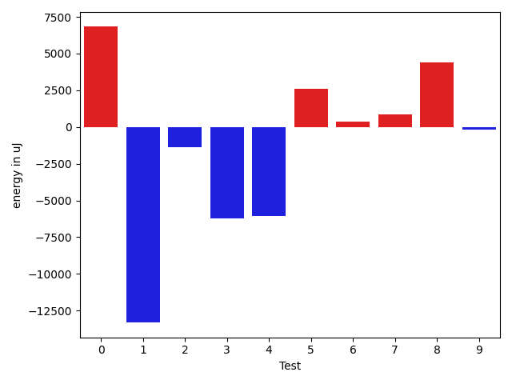

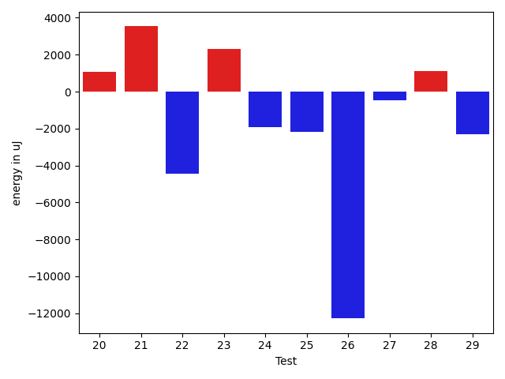

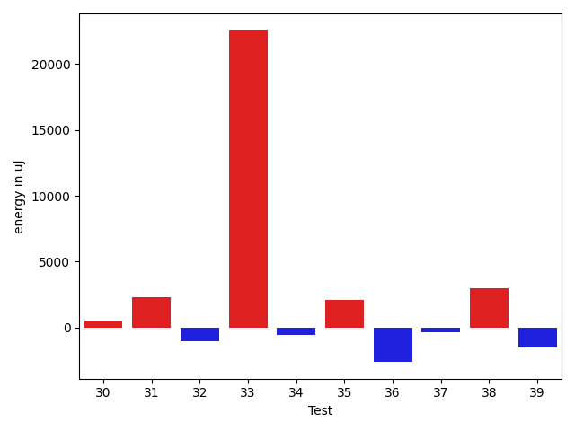

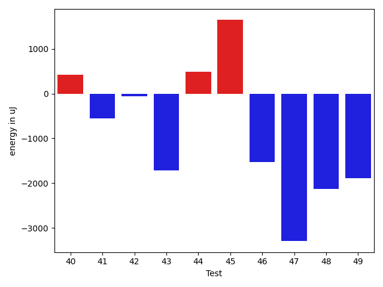

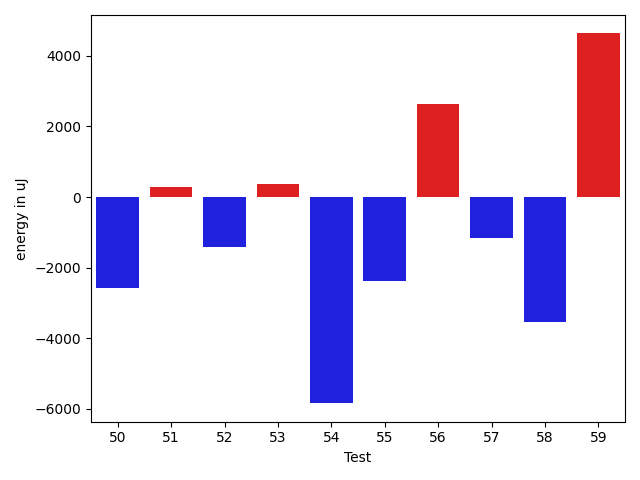

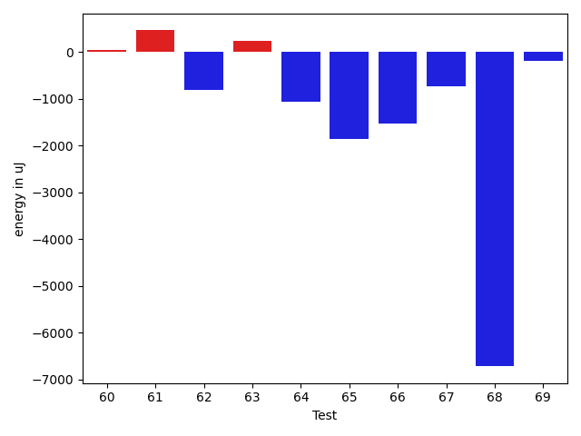

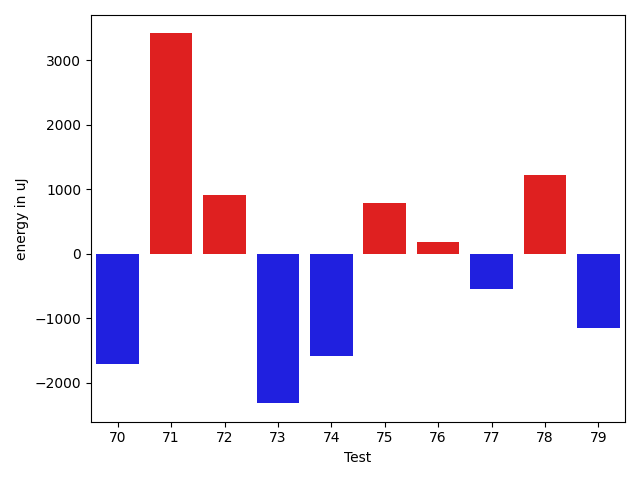

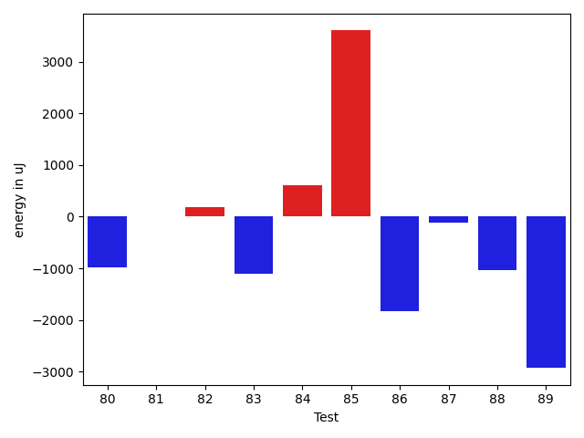

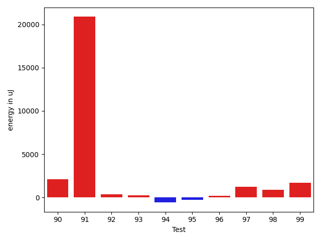

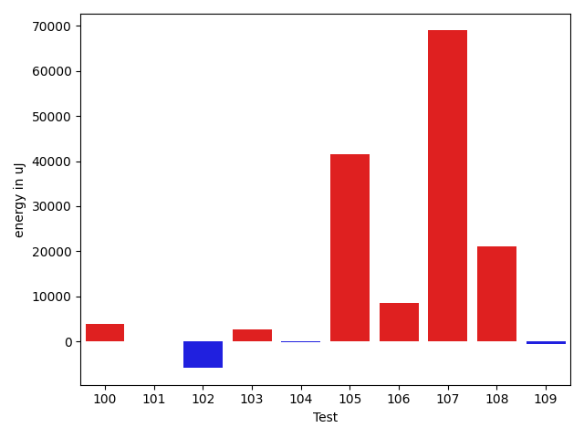

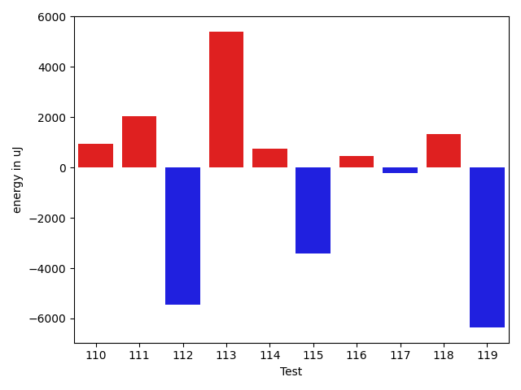

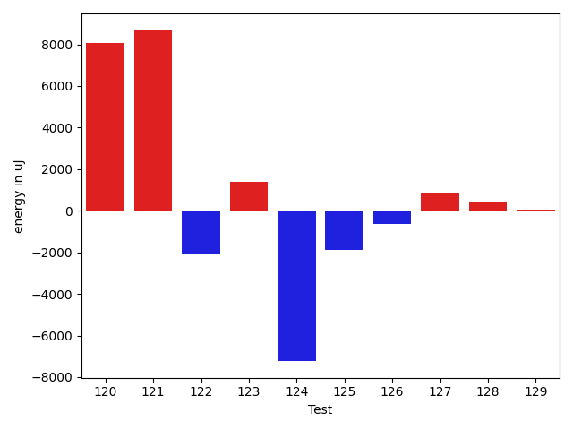

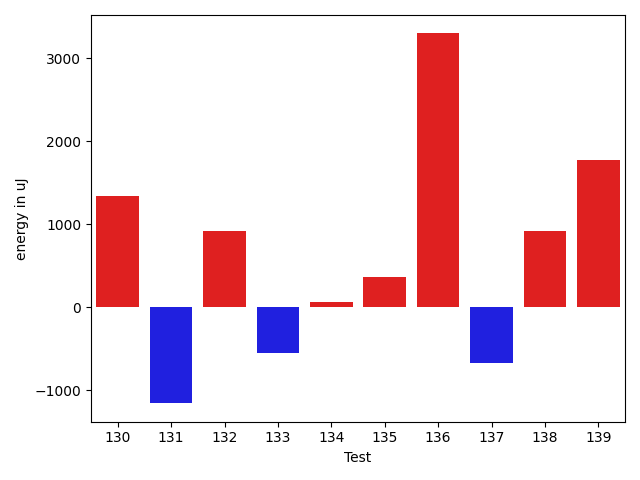

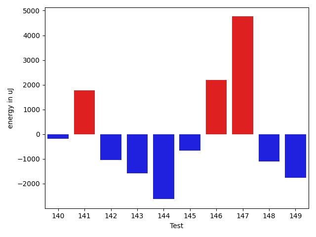

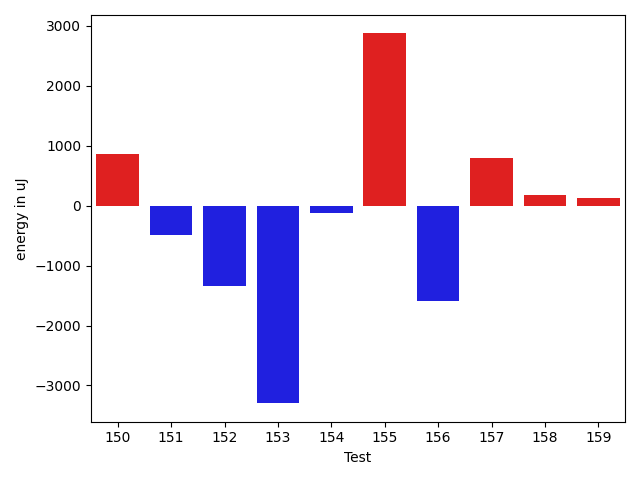

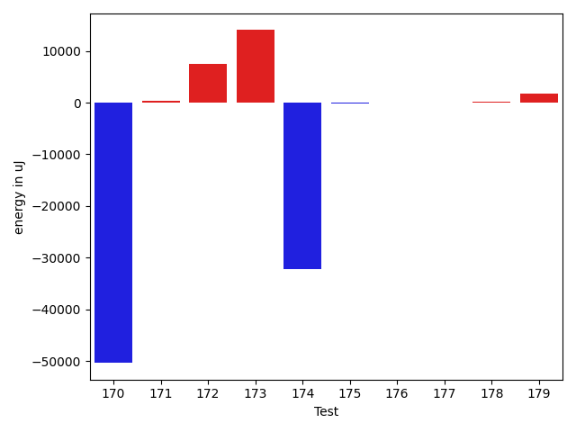

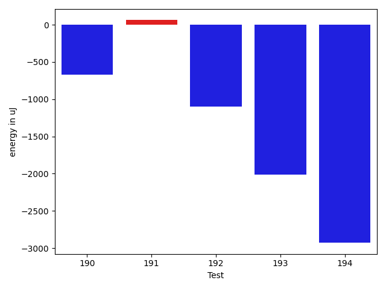

| ID | EnergyV1 | EnergyV2 | DeltaEnergy | σV1 | σV2 |
| --- | --- | --- | --- | --- | --- |
| 0 | 37719 | 40528 | 2809 | 4333.9733001252125 | 33213.84730542717 |
| 1 | 43945 | 42175 | -1770 | 88954.5571392057 | 64446.636824944864 |
| 2 | 38269 | 36133 | -2136 | 4512.939212017036 | 3271.5547049529832 |
| 3 | 38025 | 36316 | -1709 | 31492.951886605217 | 16207.033167412215 |
| 4 | 40405 | 36987 | -3418 | 15552.2980678198 | 15684.09782083838 |
| 5 | 33997 | 39490 | 5493 | 5137.500808952099 | 4503.465248345496 |
| 6 | 36194 | 36743 | 549 | 3766.339941377653 | 4011.2864753017543 |
| 7 | 38147 | 39916 | 1769 | 3001.693469395322 | 4206.394581164371 |
| 8 | 42419 | 41870 | -549 | 20877.296189230052 | 32149.642479712482 |
| 9 | 39490 | 38391 | -1099 | 4583.441889623513 | 3715.8401044849556 |
| 10 | 38879 | 40527 | 1648 | 74692.97590260748 | 72081.19748678492 |
| 11 | 38696 | 37475 | -1221 | 5102.131465704635 | 5372.943845710747 |
| 12 | 37597 | 40039 | 2442 | 3906.660409551303 | 5056.215159885461 |
| 13 | 38636 | 39612 | 976 | 92906.1099137197 | 41659.414561283054 |
| 14 | 37963 | 37719 | -244 | 4160.519929937717 | 4611.028919197193 |
| 15 | 38330 | 39367 | 1037 | 14577.587053581834 | 14924.359226792858 |
| 16 | 39734 | 36987 | -2747 | 220511.5734891745 | 361176.152586288 |
| 17 | 44007 | 44800 | 793 | 54205.509364876605 | 60686.35506418749 |
| 18 | 35766 | 38025 | 2259 | 4465.940021555834 | 4392.395494930208 |
| 19 | 36438 | 37048 | 610 | 5181.653201757995 | 6414.378192529042 |
| 20 | 38024 | 37232 | -792 | 5640.350986712452 | 7536.837656803733 |
| 21 | 38025 | 39062 | 1037 | 14687.02159979059 | 14256.639825719589 |
| 22 | 38147 | 38391 | 244 | 25100.211957255837 | 3732.8565339709853 |
| 23 | 40466 | 39246 | -1220 | 18296.286401245878 | 21019.985227450146 |
| 24 | 38025 | 36621 | -1404 | 4170.901486269277 | 4445.054708141099 |
| 25 | 38757 | 36988 | -1769 | 2979.3999494792433 | 3207.5377612424018 |
| 26 | 38880 | 36133 | -2747 | 41632.78851378555 | 4651.403919965096 |
| 27 | 39611 | 38513 | -1098 | 2759.3961345453376 | 4005.7044324313297 |
| 28 | 38758 | 38086 | -672 | 4158.9970315682785 | 5238.612423967288 |
| 29 | 38391 | 37536 | -855 | 8533.335581534584 | 3933.3088627416764 |
| 30 | 36499 | 38269 | 1770 | 3887.6743556222223 | 3157.8684088725263 |
| 31 | 39306 | 39611 | 305 | 5791.558513552493 | 9418.645014043386 |
| 32 | 38757 | 37171 | -1586 | 4054.767016323708 | 3514.5194471415202 |
| 33 | 39978 | 39978 | 0 | 4739.74092118968 | 70951.48537811653 |
| 34 | 39184 | 38391 | -793 | 4383.339780214268 | 4059.4802368515643 |
| 35 | 38024 | 40344 | 2320 | 3979.664375287262 | 3528.9326869594593 |
| 36 | 130371 | 121643 | -8728 | 117959.91548581437 | 117046.31476338946 |
| 37 | 38513 | 38269 | -244 | 3573.814655742516 | 3448.4732583337623 |
| 38 | 39123 | 38513 | -610 | 10296.617580411645 | 25062.882747353386 |
| 39 | 39306 | 37109 | -2197 | 3545.6594402052992 | 3663.815415309693 |
| 40 | 37537 | 37964 | 427 | 28727.488966459023 | 4677.811579895364 |
| 41 | 37476 | 36926 | -550 | 3981.978249262544 | 3950.656352598455 |
| 42 | 40405 | 40344 | -61 | 367905.5477528015 | 616371.9641997607 |
| 43 | 39917 | 38208 | -1709 | 4764.838572905733 | 4326.475337740013 |
| 44 | 41015 | 41504 | 489 | 575045.8971735836 | 466482.84901728574 |
| 45 | 40284 | 41931 | 1647 | 36301.50419763866 | 22956.40177395022 |
| 46 | 39001 | 37475 | -1526 | 46351.62267750041 | 6195.797237505762 |
| 47 | 40894 | 37598 | -3296 | 13571.863192926017 | 6075.044434518775 |
| 48 | 40039 | 37903 | -2136 | 3516.848598067366 | 3599.40977245703 |
| 49 | 41626 | 39733 | -1893 | 95392.27983744812 | 25379.925805305218 |
| 50 | 41138 | 36987 | -4151 | 4468.371767113268 | 4805.384410281712 |
| 51 | 39856 | 38635 | -1221 | 4796.317460655727 | 3762.4352283461308 |
| 52 | 39551 | 35522 | -4029 | 3991.162267572411 | 3211.914209626403 |
| 53 | 37597 | 38330 | 733 | 3805.3384571327333 | 3436.4699370282833 |
| 54 | 75745 | 75561 | -184 | 32470.902608451295 | 30834.996367682623 |
| 55 | 37841 | 38330 | 489 | 10497.510522840517 | 5836.400958158934 |
| 56 | 35400 | 38513 | 3113 | 2854.8157926347094 | 4321.200527631181 |
| 57 | 36865 | 36315 | -550 | 7837.29840569281 | 3654.438685637633 |
| 58 | 41870 | 42175 | 305 | 28252.525439978795 | 20626.99292728087 |
| 59 | 38697 | 37719 | -978 | 32866.129531818595 | 43803.08519708223 |
| 60 | 38147 | 38086 | -61 | 3291.2420240604956 | 3932.825062723415 |
| 61 | 38208 | 38269 | 61 | 6967.980915925893 | 4201.617922701605 |
| 62 | 38452 | 36865 | -1587 | 3522.4830318966765 | 4023.7429308485553 |
| 63 | 38941 | 38391 | -550 | 3377.846095104768 | 3994.3218534606763 |
| 64 | 38269 | 38147 | -122 | 5345.639140497222 | 3302.0012392310186 |
| 65 | 37476 | 37048 | -428 | 7216.888950344186 | 4389.810185319861 |
| 66 | 38208 | 37537 | -671 | 4237.762558318465 | 3857.3866001910324 |
| 67 | 38086 | 36621 | -1465 | 3497.0705359390927 | 4151.534906078581 |
| 68 | 39002 | 37658 | -1344 | 22564.996092128073 | 2546.2973186813765 |
| 69 | 36499 | 36377 | -122 | 3797.9314730682736 | 5088.458341568451 |
| 70 | 40039 | 38330 | -1709 | 79545.8390720311 | 29859.22003395322 |
| 71 | 114318 | 117736 | 3418 | 37332.729169061415 | 27277.75769318074 |
| 72 | 34851 | 35767 | 916 | 3991.089463954869 | 3802.5285576966767 |
| 73 | 36621 | 34302 | -2319 | 3086.6112823690833 | 4038.733145368871 |
| 74 | 37536 | 35950 | -1586 | 3416.8344710373567 | 4216.540677382784 |
| 75 | 36194 | 36987 | 793 | 3146.303524478757 | 3604.898816223087 |
| 76 | 37170 | 37354 | 184 | 26444.331217405208 | 3367.7269792551065 |
| 77 | 37780 | 37231 | -549 | 3500.426292931837 | 3918.8023599701905 |
| 78 | 35583 | 36804 | 1221 | 3377.943133968737 | 3831.5331503953967 |
| 79 | 39123 | 37964 | -1159 | 11170.058456295455 | 8689.305246732103 |
| 80 | 36316 | 35339 | -977 | 3950.233831593142 | 4065.5311289350016 |
| 81 | 36621 | 36621 | 0 | 4824.417742177606 | 4211.791418321986 |
| 82 | 36133 | 36316 | 183 | 11697.0321467499 | 7441.512104121865 |
| 83 | 38208 | 37109 | -1099 | 4391.826077792454 | 4925.756471508615 |
| 84 | 37049 | 37658 | 609 | 4008.4762563174722 | 5209.491744057664 |
| 85 | 35827 | 39428 | 3601 | 33530.85071273916 | 4239.179876738394 |
| 86 | 36072 | 34240 | -1832 | 4298.043013686577 | 3999.462835832659 |
| 87 | 36865 | 36743 | -122 | 4064.9212384197817 | 4111.7409557874635 |
| 88 | 36743 | 35706 | -1037 | 5257.566963925927 | 3663.9740513394586 |
| 89 | 36315 | 33386 | -2929 | 3160.9282161257634 | 0.0 |
| 90 | 38208 | 37964 | -244 | 10581.662487465203 | 15259.471983686513 |
| 91 | 40344 | 39062 | -1282 | 164102.72570480456 | 224069.91434837857 |
| 92 | 78369 | 80994 | 2625 | 26245.526629099513 | 23330.43641497808 |
| 93 | 36987 | 36376 | -611 | 4210.731337401609 | 5886.810623053094 |
| 94 | 37109 | 37353 | 244 | 4500.123930581198 | 3944.5327969835894 |
| 95 | 36682 | 36560 | -122 | 4455.052122816712 | 4265.661369727344 |
| 96 | 36682 | 34057 | -2625 | 4179.565294082628 | 4878.927082794369 |
| 97 | 36438 | 37903 | 1465 | 3670.0322660744223 | 4394.93134490176 |
| 98 | 36621 | 36438 | -183 | 3009.1484557215567 | 4023.3327050299135 |
| 99 | 70618 | 72632 | 2014 | 27433.707992751737 | 25681.014596542584 |
| 100 | 37659 | 37842 | 183 | 14845.318749411443 | 30813.24925691767 |
| 101 | 39672 | 40466 | 794 | 32622.99447122957 | 14698.74856595471 |
| 102 | 41321 | 38758 | -2563 | 53294.44584174436 | 39969.49640502255 |
| 103 | 40283 | 41321 | 1038 | 23776.69129250878 | 29271.404362785914 |
| 104 | 37232 | 38085 | 853 | 6657.787119177492 | 3806.7618690298973 |
| 105 | 88501 | 101074 | 12573 | 255101.5796014161 | 400677.03637668525 |
| 106 | 40588 | 43945 | 3357 | 217804.5166949325 | 235735.10345979827 |
| 107 | 40161 | 40039 | -122 | 271029.0138972624 | 378405.1704743373 |
| 108 | 161804 | 164307 | 2503 | 148330.22917108206 | 206991.7847620299 |
| 109 | 37537 | 38452 | 915 | 3720.687518750851 | 3906.546756544096 |
| 110 | 37964 | 37964 | 0 | 3248.0821912192605 | 3626.1316612145797 |
| 111 | 36438 | 38391 | 1953 | 3953.928900586437 | 6412.3633657542805 |
| 112 | 38391 | 36865 | -1526 | 33960.492459893925 | 25835.633117378846 |
| 113 | 81970 | 82703 | 733 | 212178.79341260807 | 218283.0798344827 |
| 114 | 37598 | 38207 | 609 | 3191.5676939151617 | 4673.564426968724 |
| 115 | 85265 | 83862 | -1403 | 26633.007432865892 | 31088.520345945624 |
| 116 | 38330 | 37842 | -488 | 3400.3414446199367 | 3595.082441796517 |
| 117 | 38086 | 37536 | -550 | 3782.644823532013 | 4038.9370030975024 |
| 118 | 37537 | 39124 | 1587 | 3547.8585000519015 | 4149.008352652052 |
| 119 | 37231 | 38208 | 977 | 33684.00359608207 | 2957.033241558576 |
| 120 | 37658 | 36804 | -854 | 3075.2025927001273 | 35068.89946647885 |
| 121 | 35217 | 36194 | 977 | 4608.078508445792 | 34587.511438404035 |
| 122 | 39062 | 36377 | -2685 | 2842.5493887255066 | 3250.7534894065543 |
| 123 | 36682 | 37109 | 427 | 3169.194356186434 | 3674.7847733323783 |
| 124 | 37720 | 37537 | -183 | 91918.93765412555 | 76028.0498769154 |
| 125 | 37780 | 36438 | -1342 | 4501.087420495423 | 2028.5017958370868 |
| 126 | 40589 | 39123 | -1466 | 4535.620150938567 | 3286.427038913045 |
| 127 | 35461 | 36499 | 1038 | 3393.438368260675 | 3422.8671463745277 |
| 128 | 35827 | 35827 | 0 | 3035.580596375828 | 2908.2657800655015 |
| 129 | 37353 | 38513 | 1160 | 4132.220025494812 | 3836.0358814732976 |
| 130 | 35461 | 36804 | 1343 | 3990.422752795967 | 2839.2844712345664 |
| 131 | 37963 | 36804 | -1159 | 3896.670020406383 | 3893.399880616617 |
| 132 | 37598 | 38513 | 915 | 4906.397821539737 | 26305.396879151263 |
| 133 | 38574 | 38025 | -549 | 3551.793775099187 | 3670.0579573080317 |
| 134 | 37780 | 37841 | 61 | 3912.445122261876 | 50859.61358438894 |
| 135 | 38513 | 38879 | 366 | 3468.395197772867 | 4740.549025294907 |
| 136 | 35217 | 38513 | 3296 | 3182.880770622739 | 3706.6010866981906 |
| 137 | 38452 | 37780 | -672 | 48380.07578760955 | 3040.0893078987006 |
| 138 | 35828 | 36743 | 915 | 4536.076882546746 | 3809.0851283135207 |
| 139 | 35584 | 37353 | 1769 | 3595.124050194665 | 4230.295406376085 |
| 140 | 39672 | 39490 | -182 | 25336.460802542435 | 21033.839927661316 |
| 141 | 36743 | 38513 | 1770 | 3935.0384578043313 | 42675.31454168597 |
| 142 | 37475 | 36438 | -1037 | 4169.705397512013 | 2294.312953586342 |
| 143 | 37903 | 36315 | -1588 | 3727.023384686498 | 3467.5266489566434 |
| 144 | 37781 | 35156 | -2625 | 3600.0365764531552 | 4147.827683123889 |
| 145 | 38513 | 37842 | -671 | 10520.583497482448 | 7683.662269458084 |
| 146 | 36499 | 38696 | 2197 | 3996.7714928783603 | 4463.853113745316 |
| 147 | 36865 | 41625 | 4760 | 3004.7958831123583 | 3655.503434463576 |
| 148 | 37719 | 36621 | -1098 | 3076.309619495411 | 2633.997823054521 |
| 149 | 36071 | 34301 | -1770 | 3678.3769830717238 | 2944.536859262515 |
| 150 | 36377 | 37232 | 855 | 4066.7203001927733 | 3309.237170563885 |
| 151 | 37720 | 37231 | -489 | 4027.498859308143 | 4173.87326592459 |
| 152 | 40954 | 39611 | -1343 | 76929.9109325646 | 39830.02588297669 |
| 153 | 257751 | 254455 | -3296 | 90572.90834757888 | 89195.73620416825 |
| 154 | 39612 | 39490 | -122 | 17455.427124698985 | 16562.226591455237 |
| 155 | 87036 | 89905 | 2869 | 95182.38835420841 | 83856.75184489517 |
| 156 | 37658 | 36071 | -1587 | 9593.007173489596 | 33304.350477443266 |
| 157 | 38757 | 39551 | 794 | 15524.533187594863 | 15942.074791829773 |
| 158 | 36315 | 36499 | 184 | 3650.057058541996 | 4277.053078365306 |
| 159 | 37110 | 37231 | 121 | 3965.206531258965 | 3940.719234052669 |
| 160 | 39124 | 37476 | -1648 | 14163.917737708718 | 10074.882195845485 |
| 161 | 39245 | 38635 | -610 | 3928.7346211734975 | 69211.94583595174 |
| 162 | 35523 | 35766 | 243 | 4023.6463387548115 | 3290.377902837944 |
| 163 | 37598 | 37231 | -367 | 3684.9022032477333 | 3536.5923212235525 |
| 164 | 37292 | 39246 | 1954 | 4732.438474863392 | 4383.377308081064 |
| 165 | 41381 | 41992 | 611 | 23963.18449712141 | 19927.230754675733 |
| 166 | 41260 | 39734 | -1526 | 72695.094298861 | 57258.222615533276 |
| 167 | 38513 | 37049 | -1464 | 13577.627443248484 | 13604.675469252026 |
| 168 | 36987 | 37414 | 427 | 4661.200940929303 | 4282.2818545016735 |
| 169 | 39978 | 38452 | -1526 | 61154.99741279291 | 27308.315690713767 |
| 170 | 40894 | 39246 | -1648 | 128823.38381207187 | 48417.648185093734 |
| 171 | 39185 | 40161 | 976 | 20383.141060111146 | 19611.923606403347 |
| 172 | 41077 | 41077 | 0 | 29813.693865012214 | 34571.94133345453 |
| 173 | 160889 | 160583 | -306 | 53700.97105177979 | 86026.79850120483 |
| 174 | 42236 | 39246 | -2990 | 104311.09939131152 | 48526.37183638114 |
| 175 | 40833 | 39612 | -1221 | 10732.552932430795 | 10888.11372799306 |
| 176 | 39856 | 38635 | -1221 | 5398.166828330605 | 8725.926435435713 |
| 177 | 40527 | 39185 | -1342 | 90568.78152709195 | 97262.3291722005 |
| 178 | 45532 | 42786 | -2746 | 53982.073668243276 | 56717.866741417434 |
| 179 | 39001 | 40832 | 1831 | 21701.232513622646 | 17310.84822930592 |
| 180 | 39611 | 39672 | 61 | 4860.900530663867 | 3507.5811866031336 |
| 181 | 42175 | 40344 | -1831 | 127773.31863269901 | 120923.8771920717 |
| 182 | 38452 | 36010 | -2442 | 3457.986167242466 | 6407.729005766229 |
| 183 | 40405 | 37231 | -3174 | 6625.439835622824 | 68611.98829730395 |
| 184 | 40832 | 39123 | -1709 | 21980.5924455482 | 20176.41984222673 |
| 185 | 41320 | 42724 | 1404 | 63822.705320630856 | 84053.61896076686 |
| 186 | 37293 | 36499 | -794 | 4054.1368385028795 | 3574.4612601855274 |
| 187 | 37536 | 37292 | -244 | 4109.437154314068 | 4421.639926417447 |
| 188 | 37476 | 34668 | -2808 | 3401.298701109132 | 4489.976255438329 |
| 189 | 37232 | 37170 | -62 | 6964.570367951702 | 7679.543444177221 |
| 190 | 36865 | 36194 | -671 | 3806.995497472178 | 4380.129873645301 |
| 191 | 38818 | 38880 | 62 | 3433.8082304606946 | 4492.813933899651 |
| 192 | 39551 | 38452 | -1099 | 4831.804390121674 | 3988.7063395261102 |
| 193 | 40894 | 38880 | -2014 | 20646.899076268088 | 15347.9402988897 |
| 194 | 39856 | 36927 | -2929 | 4237.214677734255 | 4730.160983400977 |

## Delta Duration per test method

| ID | DurationV1 | DurationsV2 | DeltaDuration |
| --- | --- | --- | --- |
| 0 | 720361.7307692308 | 825317.4761904762 | 104955.74542124546 |
| 1 | 2418888.3333333335 | 1882365.9896907217 | -536522.3436426118 |
| 2 | 408328.8461538461 | 385015.0625 | -23313.783653846127 |
| 3 | 1369966.4915254237 | 1103589.59375 | -266376.8977754237 |
| 4 | 1209866.5588235294 | 938307.3636363636 | -271559.19518716575 |
| 5 | 541470.8181818182 | 408727.25 | -132743.56818181823 |
| 6 | 686035.3157894737 | 616853.6857142857 | -69181.630075188 |
| 7 | 487417.7368421053 | 499043.5 | 11625.763157894718 |
| 8 | 1145930.0 | 1268275.8 | 122345.80000000005 |
| 9 | 412685.8888888889 | 461645.27777777775 | 48959.388888888876 |
| 10 | 1593106.888888889 | 1557448.5333333334 | -35658.35555555555 |
| 11 | 541681.4666666667 | 530787.6666666666 | -10893.800000000047 |
| 12 | 374492.3333333333 | 376833.75 | 2341.416666666686 |
| 13 | 1841461.511627907 | 1069399.2954545454 | -772062.2161733615 |
| 14 | 660954.4193548387 | 596713.3055555555 | -64241.113799283165 |
| 15 | 1063073.2295081967 | 1007742.2321428572 | -55330.99736533954 |
| 16 | 1732922.0576923077 | 2922381.64 | 1189459.5823076924 |
| 17 | 2253125.8163265307 | 2221436.1616161615 | -31689.654710369185 |
| 18 | 704892.717948718 | 728947.2558139535 | 24054.53786523547 |
| 19 | 966578.72 | 1005444.3731343284 | 38865.65313432843 |
| 20 | 783382.304347826 | 898628.9615384615 | 115246.65719063545 |
| 21 | 849574.0256410256 | 981380.3636363636 | 131806.33799533802 |
| 22 | 864655.6842105263 | 824915.4888888889 | -39740.19532163744 |
| 23 | 1203356.5762711863 | 1469309.3333333333 | 265952.7570621469 |
| 24 | 604101.4571428571 | 630805.5714285715 | 26704.114285714342 |
| 25 | 626826.380952381 | 395115.4285714286 | -231710.95238095237 |
| 26 | 677690.3125 | 471974.93333333335 | -205715.37916666665 |
| 27 | 444200.25 | 507028.9411764706 | 62828.6911764706 |
| 28 | 486057.5 | 502502.652173913 | 16445.152173913026 |
| 29 | 917525.779661017 | 909563.3833333333 | -7962.396327683702 |
| 30 | 529510.4137931034 | 589142.1071428572 | 59631.69334975374 |
| 31 | 885511.7692307692 | 1006271.8524590164 | 120760.08322824712 |
| 32 | 567474.2333333333 | 592148.90625 | 24674.67291666672 |
| 33 | 472431.56 | 1325684.3548387096 | 853252.7948387095 |
| 34 | 474660.94736842107 | 493664.54545454547 | 19003.598086124402 |
| 35 | 425273.375 | 466533.54545454547 | 41260.17045454547 |
| 36 | 4939915.333333333 | 5012734.797979798 | 72819.46464646515 |
| 37 | 519132.32 | 593275.074074074 | 74142.75407407404 |
| 38 | 869071.6271186441 | 1098834.0169491526 | 229762.3898305085 |
| 39 | 532623.2647058824 | 594744.90625 | 62121.64154411759 |
| 40 | 767304.3555555556 | 807405.7234042553 | 40101.367848699796 |
| 41 | 626558.8 | 735638.8 | 109080.0 |
| 42 | 2890281.6266666665 | 7407511.623376624 | 4517229.996709958 |
| 43 | 543617.1904761905 | 638958.0952380953 | 95340.90476190473 |
| 44 | 6428973.636363637 | 5058657.050632912 | -1370316.585730725 |
| 45 | 1217465.9743589743 | 1282382.7272727273 | 64916.75291375304 |
| 46 | 796719.1764705882 | 411510.92307692306 | -385208.25339366513 |
| 47 | 848187.95 | 603264.2857142857 | -244923.66428571427 |
| 48 | 406845.3888888889 | 387678.0 | -19167.388888888876 |
| 49 | 1720362.5217391304 | 832252.8695652174 | -888109.652173913 |
| 50 | 694498.7647058824 | 548358.6818181818 | -146140.08288770064 |
| 51 | 744596.4705882353 | 405696.45 | -338900.0205882353 |
| 52 | 421956.25 | 380648.5 | -41307.75 |
| 53 | 482824.73333333334 | 367740.8181818182 | -115083.91515151516 |
| 54 | 2486054.9696969697 | 2347577.97979798 | -138476.9898989899 |
| 55 | 1022644.8450704225 | 993869.0757575758 | -28775.769312846707 |
| 56 | 472291.77777777775 | 544763.5 | 72471.72222222225 |
| 57 | 826943.6530612245 | 765560.4651162791 | -61383.18794494541 |
| 58 | 1788285.2359550563 | 1614064.5714285714 | -174220.6645264849 |
| 59 | 1072026.4905660378 | 1186183.0357142857 | 114156.54514824785 |
| 60 | 670827.9736842106 | 670269.1290322581 | -558.8446519525023 |
| 61 | 846265.7435897436 | 753177.1904761905 | -93088.55311355309 |
| 62 | 511246.0 | 516378.3181818182 | 5132.3181818181765 |
| 63 | 770308.5294117647 | 719023.358974359 | -51285.1704374057 |
| 64 | 918582.5652173914 | 902746.9534883721 | -15835.611729019205 |
| 65 | 663273.44 | 701995.4782608695 | 38722.038260869565 |
| 66 | 627883.7037037037 | 613037.1666666666 | -14846.53703703708 |
| 67 | 478756.0416666667 | 453955.9583333333 | -24800.083333333372 |
| 68 | 733505.0357142857 | 508723.7727272727 | -224781.26298701297 |
| 69 | 735713.9024390244 | 762077.3714285714 | 26363.468989546993 |
| 70 | 2014646.392857143 | 1046740.0363636364 | -967906.3564935066 |
| 71 | 3284858.898989899 | 3300888.6464646463 | 16029.747474747244 |
| 72 | 899277.9056603773 | 903551.4444444445 | 4273.5387840671465 |
| 73 | 529036.7575757576 | 461833.14285714284 | -67203.61471861473 |
| 74 | 549235.074074074 | 490103.53846153844 | -59131.535612535605 |
| 75 | 734431.2608695652 | 726896.8863636364 | -7534.374505928834 |
| 76 | 850673.2051282051 | 697577.2857142857 | -153095.91941391944 |
| 77 | 542046.5769230769 | 515989.14285714284 | -26057.434065934038 |
| 78 | 585967.6904761905 | 501363.51851851854 | -84604.17195767199 |
| 79 | 1227236.6712328766 | 1054058.7215189873 | -173177.94971388928 |
| 80 | 695857.6904761905 | 677888.2777777778 | -17969.41269841278 |
| 81 | 994636.1911764706 | 966175.1016949152 | -28461.08948155539 |
| 82 | 1034725.2127659575 | 849303.7692307692 | -185421.4435351882 |
| 83 | 497780.23529411765 | 405918.35294117645 | -91861.8823529412 |
| 84 | 593778.1875 | 534767.3636363636 | -59010.82386363635 |
| 85 | 629757.56 | 359187.625 | -270569.93500000006 |
| 86 | 547743.95 | 584711.8636363636 | 36967.91363636369 |
| 87 | 438723.6153846154 | 408248.75 | -30474.865384615376 |
| 88 | 498149.95454545453 | 469140.13333333336 | -29009.82121212117 |
| 89 | 638511.0 | 720176.0 | 81665.0 |
| 90 | 969825.5925925926 | 999073.4576271187 | 29247.865034526098 |
| 91 | 1610109.8970588236 | 2263784.9682539683 | 653675.0711951447 |
| 92 | 2622995.696969697 | 2679748.292929293 | 56752.595959596336 |
| 93 | 904273.4545454546 | 926280.5342465753 | 22007.079701120732 |
| 94 | 833785.1428571428 | 719625.6744186047 | -114159.46843853814 |
| 95 | 760042.6585365854 | 863167.274509804 | 103124.61597321858 |
| 96 | 475235.3 | 436140.7368421053 | -39094.56315789471 |
| 97 | 652360.2926829269 | 650249.22 | -2111.072682926897 |
| 98 | 483909.64285714284 | 462600.70588235295 | -21308.93697478989 |
| 99 | 2056720.612244898 | 2083523.5360824743 | 26802.923837576294 |
| 100 | 1195183.8904109588 | 1241763.987654321 | 46580.09724336211 |
| 101 | 1306446.7906976745 | 1275355.4666666666 | -31091.32403100794 |
| 102 | 1271107.0588235294 | 1129538.5333333334 | -141568.52549019596 |
| 103 | 1228397.2586206896 | 1290145.8666666667 | 61748.608045977075 |
| 104 | 1000320.5428571429 | 973661.8 | -26658.742857142817 |
| 105 | 3693746.8383838385 | 4985481.222222222 | 1291734.3838383835 |
| 106 | 2169963.282608696 | 2684293.904761905 | 514330.62215320906 |
| 107 | 2287600.238095238 | 4483186.395348838 | 2195586.1572535997 |
| 108 | 5353895.101010101 | 6206218.414141414 | 852323.3131313128 |
| 109 | 595565.2368421053 | 602138.9393939395 | 6573.702551834169 |
| 110 | 850628.5 | 837901.4545454546 | -12727.045454545412 |
| 111 | 965827.695652174 | 969025.1739130435 | 3197.4782608695095 |
| 112 | 1048645.9705882352 | 1015563.5555555555 | -33082.41503267968 |
| 113 | 3952701.737373737 | 4095777.262626263 | 143075.5252525257 |
| 114 | 1003171.8208955224 | 1002731.012987013 | -440.8079085093923 |
| 115 | 2651644.3333333335 | 2713839.6363636362 | 62195.30303030275 |
| 116 | 506673.25 | 526114.5384615385 | 19441.288461538497 |
| 117 | 903788.9402985075 | 906927.484375 | 3138.5440764925443 |
| 118 | 574886.5 | 595947.2727272727 | 21060.772727272706 |
| 119 | 791041.3913043478 | 526668.7391304348 | -264372.65217391297 |
| 120 | 586822.2105263158 | 638857.95 | 52035.73947368411 |
| 121 | 438940.15 | 695980.6470588235 | 257040.49705882347 |
| 122 | 417765.0 | 390967.8 | -26797.20000000001 |
| 123 | 498578.6666666667 | 472381.81481481483 | -26196.851851851854 |
| 124 | 1735311.8076923077 | 1689309.357142857 | -46002.4505494507 |
| 125 | 379856.8181818182 | 393116.9285714286 | 13260.110389610403 |
| 126 | 540212.36 | 460101.72222222225 | -80110.63777777774 |
| 127 | 408842.1904761905 | 450868.5294117647 | 42026.338935574226 |
| 128 | 395856.1176470588 | 397596.25 | 1740.1323529412039 |
| 129 | 414367.82352941175 | 424444.44444444444 | 10076.62091503269 |
| 130 | 455637.38095238095 | 409105.75 | -46531.63095238095 |
| 131 | 443166.0 | 407854.14285714284 | -35311.85714285716 |
| 132 | 679926.3777777777 | 771824.512195122 | 91898.13441734423 |
| 133 | 393088.4166666667 | 366046.6 | -27041.81666666671 |
| 134 | 464466.0909090909 | 722868.8518518518 | 258402.7609427609 |
| 135 | 476797.8181818182 | 457935.28571428574 | -18862.532467532437 |
| 136 | 403459.8 | 357475.25925925927 | -45984.54074074072 |
| 137 | 746058.625 | 427711.6875 | -318346.9375 |
| 138 | 413213.625 | 414917.71428571426 | 1704.0892857142608 |
| 139 | 481111.0 | 476815.04545454547 | -4295.95454545453 |
| 140 | 1392939.701754386 | 1276509.0 | -116430.70175438607 |
| 141 | 413570.2380952381 | 741292.7058823529 | 327722.4677871148 |
| 142 | 362776.85714285716 | 365886.6153846154 | 3109.758241758216 |
| 143 | 507734.7 | 453013.21428571426 | -54721.48571428575 |
| 144 | 406077.1052631579 | 480804.86666666664 | 74727.76140350872 |
| 145 | 1013944.525 | 971640.1875 | -42304.33750000002 |
| 146 | 671564.9032258064 | 598618.9375 | -72945.96572580643 |
| 147 | 395027.94736842107 | 402437.375 | 7409.427631578932 |
| 148 | 364702.4375 | 370210.36842105264 | 5507.930921052641 |
| 149 | 437683.5714285714 | 385627.86666666664 | -52055.70476190478 |
| 150 | 455528.8823529412 | 457095.7916666667 | 1566.9093137254822 |
| 151 | 355350.0 | 404641.6 | 49291.59999999998 |
| 152 | 2141275.6506024096 | 1642477.9139784947 | -498797.7366239149 |
| 153 | 7508463.202020202 | 7638223.080808081 | 129759.8787878789 |
| 154 | 1382663.8279569892 | 1386153.6593406594 | 3489.8313836702146 |
| 155 | 3679087.8080808083 | 3719614.98989899 | 40527.18181818165 |
| 156 | 743966.3823529412 | 1165689.375 | 421722.9926470588 |
| 157 | 1461383.8404255318 | 1459338.625 | -2045.2154255318455 |
| 158 | 776686.306122449 | 801265.1860465116 | 24578.87992406264 |
| 159 | 761426.3695652174 | 810366.306122449 | 48939.93655723159 |
| 160 | 1092657.1617647058 | 1121388.1617647058 | 28731.0 |
| 161 | 803873.9649122807 | 1503762.6037735848 | 699888.6388613041 |
| 162 | 628474.59375 | 687254.0370370371 | 58779.44328703708 |
| 163 | 421660.35 | 528687.947368421 | 107027.59736842103 |
| 164 | 376557.4285714286 | 440772.8125 | 64215.38392857142 |
| 165 | 1055226.5294117648 | 980998.4347826086 | -74228.09462915617 |
| 166 | 1830840.0 | 1262407.1470588236 | -568432.8529411764 |
| 167 | 1230956.2839506173 | 1226119.8823529412 | -4836.4015976761 |
| 168 | 744188.3260869565 | 736176.3617021276 | -8011.964384828927 |
| 169 | 1679016.1594202898 | 1111210.7580645161 | -567805.4013557737 |
| 170 | 3046037.3529411764 | 1205600.642857143 | -1840436.7100840334 |
| 171 | 1151241.4 | 1149171.1724137932 | -2070.227586206747 |
| 172 | 1420970.5166666666 | 1583892.2388059702 | 162921.72213930357 |
| 173 | 4829431.787878788 | 5462917.757575758 | 633485.9696969697 |
| 174 | 2467839.627118644 | 1285150.544117647 | -1182689.0830009968 |
| 175 | 1010069.2424242424 | 1106404.453125 | 96335.21070075757 |
| 176 | 1032471.4533333334 | 1090898.1527777778 | 58426.699444444384 |
| 177 | 1763000.696969697 | 1951008.2692307692 | 188007.57226107223 |
| 178 | 2221746.2365591396 | 2230681.011494253 | 8934.774935113266 |
| 179 | 1426262.4945054946 | 1429340.8837209302 | 3078.3892154356 |
| 180 | 576541.2272727273 | 508247.25 | -68293.9772727273 |
| 181 | 2549817.6818181816 | 2963966.703703704 | 414149.0218855222 |
| 182 | 651903.4615384615 | 703536.0 | 51632.5384615385 |
| 183 | 663032.6551724138 | 1042175.46875 | 379142.8135775862 |
| 184 | 1423815.9887640448 | 1406903.6043956045 | -16912.38436844037 |
| 185 | 1592810.6285714286 | 2287324.464285714 | 694513.8357142855 |
| 186 | 534783.0285714286 | 574248.304347826 | 39465.27577639744 |
| 187 | 714497.9302325582 | 737537.5 | 23039.569767441833 |
| 188 | 665163.2222222222 | 784689.32 | 119526.0977777777 |
| 189 | 753036.074074074 | 848346.0487804879 | 95309.9747064138 |
| 190 | 543115.78125 | 614620.95 | 71505.16874999995 |
| 191 | 532045.5806451613 | 628616.1071428572 | 96570.52649769583 |
| 192 | 588450.7619047619 | 659691.3823529412 | 71240.62044817931 |
| 193 | 854312.04 | 726924.6315789474 | -127387.40842105262 |
| 194 | 559764.3636363636 | 577887.3666666667 | 18123.00303030305 |

## Misc.

| ID | Test Class | Test Method |
| --- | --- | --- |
| 0 | com.google.gson.functional.CustomDeserializerTest | testDefaultConstructorNotCalledOnField |
| 1 | com.google.gson.functional.CustomDeserializerTest | testDefaultConstructorNotCalledOnObject |
| 2 | com.google.gson.functional.ArrayTest | testSingleStringArraySerialization |
| 3 | com.google.gson.functional.ArrayTest | testObjectArrayWithNonPrimitivesSerialization |
| 4 | com.google.gson.functional.ArrayTest | testArrayOfPrimitivesAsObjectsSerialization |
| 5 | com.google.gson.functional.ArrayTest | testArrayOfStringsSerialization |
| 6 | com.google.gson.functional.ArrayTest | testArrayOfPrimitivesWithCustomTypeAdapter |
| 7 | com.google.gson.functional.ArrayTest | testNullsInArrayWithSerializeNullPropertySetSerialization |
| 8 | com.google.gson.functional.ArrayTest | testSingleNullInArraySerialization |
| 9 | com.google.gson.functional.ArrayTest | testEmptyArraySerialization |
| 10 | com.google.gson.functional.ArrayTest | testTopLevelArrayOfIntsSerialization |
| 11 | com.google.gson.functional.ArrayTest | testNullsInArraySerialization |
| 12 | com.google.gson.functional.ArrayTest | testArrayOfNullSerialization |
| 13 | com.google.gson.functional.InterfaceTest | testSerializingObjectImplementingInterface |
| 14 | com.google.gson.functional.InterfaceTest | testSerializingInterfaceObjectField |
| 15 | com.google.gson.FunctionWithInternalDependenciesTest | testUserDefinedExclusionPolicies |
| 16 | com.google.gson.FunctionWithInternalDependenciesTest | testAnonymousLocalClassesSerialization |
| 17 | com.google.gson.functional.CircularReferenceTest | testCircularSerialization |
| 18 | com.google.gson.functional.CircularReferenceTest | testSelfReferenceArrayFieldSerialization |
| 19 | com.google.gson.functional.CircularReferenceTest | testSelfReferenceCustomHandlerSerialization |
| 20 | com.google.gson.functional.CircularReferenceTest | testDirectedAcyclicGraphSerialization |
| 21 | com.google.gson.functional.CircularReferenceTest | testSelfReferenceSerialization |
| 22 | com.google.gson.functional.MapTest | testSerializeMaps |
| 23 | com.google.gson.functional.MapTest | testMapSerializationWithNullValues |
| 24 | com.google.gson.functional.MapTest | testMapSerializationWithNullValuesSerialized |
| 25 | com.google.gson.functional.MapTest | testMapWithQuotes |
| 26 | com.google.gson.functional.MapTest | testWriteMapsWithEmptyStringKey |
| 27 | com.google.gson.functional.MapTest | testRawMapSerialization |
| 28 | com.google.gson.functional.MapTest | testMapOfMapSerialization |
| 29 | com.google.gson.functional.PrettyPrintingTest | testEmptyMapField |
| 30 | com.google.gson.functional.PrettyPrintingTest | testPrettyPrintArrayOfPrimitiveArrays |
| 31 | com.google.gson.functional.PrettyPrintingTest | testPrettyPrintArrayOfObjects |
| 32 | com.google.gson.functional.PrettyPrintingTest | testPrettyPrintListOfPrimitiveArrays |
| 33 | com.google.gson.functional.PrettyPrintingTest | testMap |
| 34 | com.google.gson.functional.PrettyPrintingTest | testMultipleArrays |
| 35 | com.google.gson.functional.PrettyPrintingTest | testPrettyPrintArrayOfPrimitives |
| 36 | com.google.gson.functional.ExposeFieldsTest | testNullExposeFieldSerialization |
| 37 | com.google.gson.functional.ExposeFieldsTest | testNoExposedFieldSerialization |
| 38 | com.google.gson.functional.ExposeFieldsTest | testArrayWithOneNullExposeFieldObjectSerialization |
| 39 | com.google.gson.functional.ExposeFieldsTest | testExposeAnnotationSerialization |
| 40 | com.google.gson.functional.ExposeFieldsTest | testExposedInterfaceFieldSerialization |
| 41 | com.google.gson.functional.FieldExclusionTest | testDefaultNestedStaticClassIncluded |
| 42 | com.google.gson.functional.FieldExclusionTest | testDefaultInnerClassExclusion |
| 43 | com.google.gson.functional.FieldExclusionTest | testInnerClassExclusion |
| 44 | com.google.gson.JsonParserTest | testReadWriteTwoObjects |
| 45 | com.google.gson.functional.StringTest | testSingleQuoteInStringSerialization |
| 46 | com.google.gson.functional.StringTest | testJavascriptKeywordsInStringSerialization |
| 47 | com.google.gson.functional.StringTest | testAssignmentCharSerialization |
| 48 | com.google.gson.functional.StringTest | testEscapedCtrlNInStringSerialization |
| 49 | com.google.gson.functional.StringTest | testEscapingQuotesInStringSerialization |
| 50 | com.google.gson.functional.StringTest | testStringValueAsSingleElementArraySerialization |
| 51 | com.google.gson.functional.StringTest | testStringValueSerialization |
| 52 | com.google.gson.functional.StringTest | testEscapedCtrlRInStringSerialization |
| 53 | com.google.gson.functional.StringTest | testEscapedBackslashInStringSerialization |
| 54 | com.google.gson.functional.ObjectTest | testSingletonLists |
| 55 | com.google.gson.functional.ObjectTest | testArrayOfObjectsAsFields |
| 56 | com.google.gson.functional.ObjectTest | testClassWithNoFieldsSerialization |
| 57 | com.google.gson.functional.ObjectTest | testInnerClassSerialization |
| 58 | com.google.gson.functional.ObjectTest | testArrayOfArraysSerialization |
| 59 | com.google.gson.functional.ObjectTest | testAnonymousLocalClassesSerialization |
| 60 | com.google.gson.functional.ObjectTest | testBagOfPrimitivesSerialization |
| 61 | com.google.gson.functional.ObjectTest | testNestedSerialization |
| 62 | com.google.gson.functional.ObjectTest | testPrimitiveArrayFieldSerialization |
| 63 | com.google.gson.functional.ObjectTest | testBagOfPrimitiveWrappersSerialization |
| 64 | com.google.gson.functional.ObjectTest | testArrayOfObjectsSerialization |
| 65 | com.google.gson.functional.ObjectTest | testClassWithTransientFieldsSerialization |
| 66 | com.google.gson.functional.ObjectTest | testNullFieldsSerialization |
| 67 | com.google.gson.functional.ObjectTest | testClassWithObjectFieldSerialization |
| 68 | com.google.gson.functional.ObjectTest | testEmptyCollectionInAnObjectSerialization |
| 69 | com.google.gson.functional.ObjectTest | testStringFieldWithEmptyValueSerialization |
| 70 | com.google.gson.functional.DefaultTypeAdaptersTest | testUrlSerialization |
| 71 | com.google.gson.functional.DefaultTypeAdaptersTest | testDefaultDateDeserializationUsingBuilder |
| 72 | com.google.gson.functional.DefaultTypeAdaptersTest | testTreeSetSerialization |
| 73 | com.google.gson.functional.DefaultTypeAdaptersTest | testSetSerialization |
| 74 | com.google.gson.functional.DefaultTypeAdaptersTest | testDefaultGregorianCalendarSerialization |
| 75 | com.google.gson.functional.DefaultTypeAdaptersTest | testDateSerializationWithPatternNotOverridenByTypeAdapter |
| 76 | com.google.gson.functional.DefaultTypeAdaptersTest | testDateSerializationWithPattern |
| 77 | com.google.gson.functional.DefaultTypeAdaptersTest | testDefaultJavaSqlDateSerialization |
| 78 | com.google.gson.functional.DefaultTypeAdaptersTest | testDefaultCalendarSerialization |
| 79 | com.google.gson.functional.DefaultTypeAdaptersTest | testUrlNullSerialization |
| 80 | com.google.gson.functional.DefaultTypeAdaptersTest | testDateDeserializationWithPattern |
| 81 | com.google.gson.functional.DefaultTypeAdaptersTest | testBigIntegerFieldSerialization |
| 82 | com.google.gson.functional.DefaultTypeAdaptersTest | testBigDecimalFieldSerialization |
| 83 | com.google.gson.functional.DefaultTypeAdaptersTest | testLocaleSerializationWithLanguageCountryVariant |
| 84 | com.google.gson.functional.DefaultTypeAdaptersTest | testUuidSerialization |
| 85 | com.google.gson.functional.DefaultTypeAdaptersTest | testPropertiesSerialization |
| 86 | com.google.gson.functional.DefaultTypeAdaptersTest | testUriSerialization |
| 87 | com.google.gson.functional.DefaultTypeAdaptersTest | testLocaleSerializationWithLanguageCountry |
| 88 | com.google.gson.functional.DefaultTypeAdaptersTest | testLocaleSerializationWithLanguage |
| 89 | com.google.gson.functional.DefaultTypeAdaptersTest | testDefaultJavaSqlTimestampSerialization |
| 90 | com.google.gson.functional.CustomTypeAdaptersTest | testCustomNestedSerializers |
| 91 | com.google.gson.functional.CustomTypeAdaptersTest | testCustomSerializers |
| 92 | com.google.gson.functional.CustomTypeAdaptersTest | testCustomTypeAdapterDoesNotAppliesToSubClasses |
| 93 | com.google.gson.functional.CustomTypeAdaptersTest | testCustomSerializerForLong |
| 94 | com.google.gson.functional.CustomTypeAdaptersTest | testCustomByteArraySerializer |
| 95 | com.google.gson.functional.CustomTypeAdaptersTest | testCustomTypeAdapterAppliesToSubClassesSerializedAsBaseClass |
| 96 | com.google.gson.functional.CustomTypeAdaptersTest | testCustomAdapterInvokedForCollectionElementSerialization |
| 97 | com.google.gson.functional.CustomTypeAdaptersTest | testEnsureCustomSerializerNotInvokedForNullValues |
| 98 | com.google.gson.functional.CustomTypeAdaptersTest | testCustomAdapterInvokedForMapElementSerialization |
| 99 | com.google.gson.functional.EnumTest | testEnumSubclass |
| 100 | com.google.gson.functional.EnumTest | testEnumSubclassWithRegisteredTypeAdapter |
| 101 | com.google.gson.functional.EnumTest | testClassWithEnumFieldSerialization |
| 102 | com.google.gson.functional.EnumTest | testTopLevelEnumSerialization |
| 103 | com.google.gson.functional.EnumTest | testCollectionOfEnumsSerialization |
| 104 | com.google.gson.functional.TypeVariableTest | testBasicTypeVariables |
| 105 | com.google.gson.functional.TypeVariableTest | testAdvancedTypeVariables |
| 106 | com.google.gson.functional.SecurityTest | testJsonWithNonExectuableTokenSerialization |
| 107 | com.google.gson.functional.SecurityTest | testNonExecutableJsonSerialization |
| 108 | com.google.gson.functional.VersioningTest | testVersionedUntilSerialization |
| 109 | com.google.gson.functional.VersioningTest | testIgnoreLaterVersionClassSerialization |
| 110 | com.google.gson.functional.VersioningTest | testVersionedClassesSerialization |
| 111 | com.google.gson.functional.VersioningTest | testVersionedGsonMixingSinceAndUntilSerialization |
| 112 | com.google.gson.functional.VersioningTest | testVersionedGsonWithUnversionedClassesSerialization |
| 113 | com.google.gson.functional.NamingPolicyTest | testGsonDuplicateNameUsingSerializedNameFieldNamingPolicySerialization |
| 114 | com.google.gson.functional.NamingPolicyTest | testDeprecatedNamingStrategy |
| 115 | com.google.gson.functional.NamingPolicyTest | testGsonWithUpperCamelCaseSpacesPolicySerialiation |
| 116 | com.google.gson.functional.NamingPolicyTest | testGsonWithNonDefaultFieldNamingPolicySerialization |
| 117 | com.google.gson.functional.NamingPolicyTest | testGsonWithSerializedNameFieldNamingPolicySerialization |
| 118 | com.google.gson.functional.NamingPolicyTest | testGsonWithLowerCaseDashPolicySerialization |
| 119 | com.google.gson.functional.NamingPolicyTest | testGsonWithLowerCaseUnderscorePolicySerialization |
| 120 | com.google.gson.functional.PrimitiveTest | testPrimitiveBooleanAutoboxedSerialization |
| 121 | com.google.gson.functional.PrimitiveTest | testNegativeInfinitySerialization |
| 122 | com.google.gson.functional.PrimitiveTest | testQuotedStringSerializationAndDeserialization |
| 123 | com.google.gson.functional.PrimitiveTest | testLongAsStringSerialization |
| 124 | com.google.gson.functional.PrimitiveTest | testSmallValueForBigDecimalSerialization |
| 125 | com.google.gson.functional.PrimitiveTest | testNumberSerialization |
| 126 | com.google.gson.functional.PrimitiveTest | testBigDecimalPreservePrecisionSerialization |
| 127 | com.google.gson.functional.PrimitiveTest | testNegativeInfinitySerializationNotSupportedByDefault |
| 128 | com.google.gson.functional.PrimitiveTest | testBigDecimalInASingleElementArraySerialization |
| 129 | com.google.gson.functional.PrimitiveTest | testDoubleInfinitySerialization |
| 130 | com.google.gson.functional.PrimitiveTest | testFloatInfinitySerialization |
| 131 | com.google.gson.functional.PrimitiveTest | testPrimitiveLongAutoboxedInASingleElementArraySerialization |
| 132 | com.google.gson.functional.PrimitiveTest | testBigIntegerInASingleElementArraySerialization |
| 133 | com.google.gson.functional.PrimitiveTest | testNegativeInfinityFloatSerialization |
| 134 | com.google.gson.functional.PrimitiveTest | testPrimitiveDoubleAutoboxedInASingleElementArraySerialization |
| 135 | com.google.gson.functional.PrimitiveTest | testFloatNaNSerializationNotSupportedByDefault |
| 136 | com.google.gson.functional.PrimitiveTest | testPrimitiveIntegerAutoboxedSerialization |
| 137 | com.google.gson.functional.PrimitiveTest | testDoubleInfinitySerializationNotSupportedByDefault |
| 138 | com.google.gson.functional.PrimitiveTest | testPrimitiveBooleanAutoboxedInASingleElementArraySerialization |
| 139 | com.google.gson.functional.PrimitiveTest | testDoubleNaNSerialization |
| 140 | com.google.gson.functional.PrimitiveTest | testHtmlCharacterSerialization |
| 141 | com.google.gson.functional.PrimitiveTest | testNegativeInfinityFloatSerializationNotSupportedByDefault |
| 142 | com.google.gson.functional.PrimitiveTest | testReallyLongValuesSerialization |
| 143 | com.google.gson.functional.PrimitiveTest | testDoubleNaNSerializationNotSupportedByDefault |
| 144 | com.google.gson.functional.PrimitiveTest | testFloatNaNSerialization |
| 145 | com.google.gson.functional.PrimitiveTest | testBigIntegerSerialization |
| 146 | com.google.gson.functional.PrimitiveTest | testOverridingDefaultPrimitiveSerialization |
| 147 | com.google.gson.functional.PrimitiveTest | testFloatInfinitySerializationNotSupportedByDefault |
| 148 | com.google.gson.functional.PrimitiveTest | testBigDecimalSerialization |
| 149 | com.google.gson.functional.PrimitiveTest | testPrimitiveDoubleAutoboxedSerialization |
| 150 | com.google.gson.functional.PrimitiveTest | testPrimitiveIntegerAutoboxedInASingleElementArraySerialization |
| 151 | com.google.gson.functional.PrimitiveTest | testSmallValueForBigIntegerSerialization |
| 152 | com.google.gson.functional.ConcurrencyTest | testSingleThreadSerialization |
| 153 | com.google.gson.functional.ConcurrencyTest | testMultiThreadSerialization |
| 154 | com.google.gson.functional.ExclusionStrategyFunctionalTest | testExclusionStrategy2Serialization |
| 155 | com.google.gson.functional.ExclusionStrategyFunctionalTest | testExclusionStrategySerialization |
| 156 | com.google.gson.functional.CollectionTest | testCollectionOfBagOfPrimitivesSerialization |
| 157 | com.google.gson.functional.CollectionTest | testWildcardCollectionField |
| 158 | com.google.gson.functional.CollectionTest | testCollectionOfObjectWithNullSerialization |
| 159 | com.google.gson.functional.CollectionTest | testCollectionOfObjectSerialization |
| 160 | com.google.gson.functional.CollectionTest | testWildcardPrimitiveCollectionSerilaization |
| 161 | com.google.gson.functional.CollectionTest | testSetSerialization |
| 162 | com.google.gson.functional.CollectionTest | testRawCollectionSerialization |
| 163 | com.google.gson.functional.CollectionTest | testRawCollectionOfIntegersSerialization |
| 164 | com.google.gson.functional.CollectionTest | testCollectionOfStringsSerialization |
| 165 | com.google.gson.functional.UncategorizedTest | testStaticFieldsAreNotSerialized |
| 166 | com.google.gson.functional.UncategorizedTest | testObjectEqualButNotSameSerialization |
| 167 | com.google.gson.functional.EscapingTest | testGsonAcceptsEscapedAndNonEscapedJsonDeserialization |
| 168 | com.google.gson.functional.EscapingTest | testGsonDoubleDeserialization |
| 169 | com.google.gson.functional.EscapingTest | testEscapingObjectFields |
| 170 | com.google.gson.functional.EscapingTest | testEscapingQuotesInStringArray |
| 171 | com.google.gson.functional.EscapingTest | testEscapeAllHtmlCharacters |
| 172 | com.google.gson.functional.JsonTreeTest | testJsonTreeToString |
| 173 | com.google.gson.DefaultInetAddressTypeAdapterTest | testInetAddressSerializationAndDeserialization |
| 174 | com.google.gson.functional.PrintFormattingTest | testCompactFormattingLeavesNoWhiteSpace |
| 175 | com.google.gson.functional.ReadersWritersTest | testReadWriteTwoObjects |
| 176 | com.google.gson.functional.ReadersWritersTest | testReadWriteTwoStrings |
| 177 | com.google.gson.functional.ReadersWritersTest | testWriterForSerialization |
| 178 | com.google.gson.functional.InheritanceTest | testSubInterfacesOfCollectionSerialization |
| 179 | com.google.gson.functional.InheritanceTest | testSubClassSerialization |
| 180 | com.google.gson.functional.InheritanceTest | testBaseSerializedAsSubForToJsonMethod |
| 181 | com.google.gson.GsonTypeAdapterTest | testTypeAdapterDoesNotAffectNonAdaptedTypes |
| 182 | com.google.gson.GsonTypeAdapterTest | testTypeAdapterProperlyConvertsTypes |
| 183 | com.google.gson.GsonTypeAdapterTest | testTypeAdapterThrowsException |
| 184 | com.google.gson.functional.NullObjectAndFieldTest | testExplicitSerializationOfNullArrayMembers |
| 185 | com.google.gson.functional.NullObjectAndFieldTest | testExplicitSerializationOfNulls |
| 186 | com.google.gson.functional.NullObjectAndFieldTest | testCustomTypeAdapterPassesNullSerialization |
| 187 | com.google.gson.functional.NullObjectAndFieldTest | testPrintPrintingObjectWithNulls |
| 188 | com.google.gson.functional.NullObjectAndFieldTest | testPrintPrintingArraysWithNulls |
| 189 | com.google.gson.functional.NullObjectAndFieldTest | testNullWrappedPrimitiveMemberSerialization |
| 190 | com.google.gson.functional.NullObjectAndFieldTest | testCustomSerializationOfNulls |
| 191 | com.google.gson.functional.NullObjectAndFieldTest | testExplicitSerializationOfNullStringMembers |
| 192 | com.google.gson.functional.NullObjectAndFieldTest | testExplicitSerializationOfNullCollectionMembers |
| 193 | com.google.gson.functional.InternationalizationTest | testStringsWithUnicodeChineseCharactersSerialization |
| 194 | com.google.gson.functional.ParameterizedTypesTest | testDeepParameterizedTypeSerialization |

| Test | IterationV1 | IterationV2 | DeltaIteration |
| --- | --- | --- | --- |
| 0 | 52 | 42 | -10 |
| 1 | 87 | 97 | 10 |
| 2 | 13 | 16 | 3 |
| 3 | 59 | 64 | 5 |
| 4 | 34 | 33 | -1 |
| 5 | 11 | 12 | 1 |
| 6 | 38 | 35 | -3 |
| 7 | 19 | 14 | -5 |
| 8 | 27 | 15 | -12 |
| 9 | 18 | 18 | 0 |
| 10 | 36 | 30 | -6 |
| 11 | 15 | 21 | 6 |
| 12 | 9 | 12 | 3 |
| 13 | 43 | 44 | 1 |
| 14 | 31 | 36 | 5 |
| 15 | 61 | 56 | -5 |
| 16 | 52 | 50 | -2 |
| 17 | 98 | 99 | 1 |
| 18 | 39 | 43 | 4 |
| 19 | 75 | 67 | -8 |
| 20 | 46 | 52 | 6 |
| 21 | 39 | 33 | -6 |
| 22 | 38 | 45 | 7 |
| 23 | 59 | 60 | 1 |
| 24 | 35 | 35 | 0 |
| 25 | 21 | 7 | -14 |
| 26 | 16 | 15 | -1 |
| 27 | 16 | 17 | 1 |
| 28 | 16 | 23 | 7 |
| 29 | 59 | 60 | 1 |
| 30 | 29 | 28 | -1 |
| 31 | 52 | 61 | 9 |
| 32 | 30 | 32 | 2 |
| 33 | 25 | 31 | 6 |
| 34 | 19 | 22 | 3 |
| 35 | 24 | 22 | -2 |
| 36 | 99 | 99 | 0 |
| 37 | 25 | 27 | 2 |
| 38 | 59 | 59 | 0 |
| 39 | 34 | 32 | -2 |
| 40 | 45 | 47 | 2 |
| 41 | 25 | 35 | 10 |
| 42 | 75 | 77 | 2 |
| 43 | 21 | 21 | 0 |
| 44 | 77 | 79 | 2 |
| 45 | 39 | 22 | -17 |
| 46 | 17 | 13 | -4 |
| 47 | 20 | 28 | 8 |
| 48 | 18 | 13 | -5 |
| 49 | 23 | 23 | 0 |
| 50 | 17 | 22 | 5 |
| 51 | 17 | 20 | 3 |
| 52 | 16 | 10 | -6 |
| 53 | 15 | 22 | 7 |
| 54 | 99 | 99 | 0 |
| 55 | 71 | 66 | -5 |
| 56 | 18 | 8 | -10 |
| 57 | 49 | 43 | -6 |
| 58 | 89 | 98 | 9 |
| 59 | 53 | 56 | 3 |
| 60 | 38 | 31 | -7 |
| 61 | 39 | 42 | 3 |
| 62 | 20 | 22 | 2 |
| 63 | 34 | 39 | 5 |
| 64 | 46 | 43 | -3 |
| 65 | 25 | 23 | -2 |
| 66 | 27 | 30 | 3 |
| 67 | 24 | 24 | 0 |
| 68 | 28 | 22 | -6 |
| 69 | 41 | 35 | -6 |
| 70 | 56 | 55 | -1 |
| 71 | 99 | 99 | 0 |
| 72 | 53 | 45 | -8 |
| 73 | 33 | 21 | -12 |
| 74 | 27 | 26 | -1 |
| 75 | 46 | 44 | -2 |
| 76 | 39 | 42 | 3 |
| 77 | 26 | 21 | -5 |
| 78 | 42 | 27 | -15 |
| 79 | 73 | 79 | 6 |
| 80 | 42 | 36 | -6 |
| 81 | 68 | 59 | -9 |
| 82 | 47 | 39 | -8 |
| 83 | 17 | 17 | 0 |
| 84 | 32 | 22 | -10 |
| 85 | 25 | 16 | -9 |
| 86 | 20 | 22 | 2 |
| 87 | 13 | 12 | -1 |
| 88 | 22 | 15 | -7 |
| 89 | 4 | 1 | -3 |
| 90 | 54 | 59 | 5 |
| 91 | 68 | 63 | -5 |
| 92 | 99 | 99 | 0 |
| 93 | 66 | 73 | 7 |
| 94 | 42 | 43 | 1 |
| 95 | 41 | 51 | 10 |
| 96 | 20 | 19 | -1 |
| 97 | 41 | 50 | 9 |
| 98 | 14 | 17 | 3 |
| 99 | 98 | 97 | -1 |
| 100 | 73 | 81 | 8 |
| 101 | 86 | 75 | -11 |
| 102 | 51 | 45 | -6 |
| 103 | 58 | 60 | 2 |
| 104 | 70 | 60 | -10 |
| 105 | 99 | 99 | 0 |
| 106 | 46 | 42 | -4 |
| 107 | 42 | 43 | 1 |
| 108 | 99 | 99 | 0 |
| 109 | 38 | 33 | -5 |
| 110 | 62 | 55 | -7 |
| 111 | 69 | 69 | 0 |
| 112 | 34 | 45 | 11 |
| 113 | 99 | 99 | 0 |
| 114 | 67 | 77 | 10 |
| 115 | 99 | 99 | 0 |
| 116 | 20 | 26 | 6 |
| 117 | 67 | 64 | -3 |
| 118 | 26 | 33 | 7 |
| 119 | 23 | 23 | 0 |
| 120 | 19 | 20 | 1 |
| 121 | 20 | 17 | -3 |
| 122 | 16 | 15 | -1 |
| 123 | 18 | 27 | 9 |
| 124 | 26 | 28 | 2 |
| 125 | 11 | 14 | 3 |
| 126 | 25 | 18 | -7 |
| 127 | 21 | 17 | -4 |
| 128 | 17 | 20 | 3 |
| 129 | 17 | 9 | -8 |
| 130 | 21 | 16 | -5 |
| 131 | 22 | 21 | -1 |
| 132 | 45 | 41 | -4 |
| 133 | 12 | 10 | -2 |
| 134 | 22 | 27 | 5 |
| 135 | 22 | 14 | -8 |
| 136 | 15 | 27 | 12 |
| 137 | 16 | 16 | 0 |
| 138 | 16 | 21 | 5 |
| 139 | 19 | 22 | 3 |
| 140 | 57 | 55 | -2 |
| 141 | 21 | 17 | -4 |
| 142 | 14 | 13 | -1 |
| 143 | 20 | 14 | -6 |
| 144 | 19 | 15 | -4 |
| 145 | 40 | 48 | 8 |
| 146 | 31 | 32 | 1 |
| 147 | 19 | 16 | -3 |
| 148 | 16 | 19 | 3 |
| 149 | 14 | 15 | 1 |
| 150 | 17 | 24 | 7 |
| 151 | 9 | 10 | 1 |
| 152 | 83 | 93 | 10 |
| 153 | 99 | 99 | 0 |
| 154 | 93 | 91 | -2 |
| 155 | 99 | 99 | 0 |
| 156 | 34 | 40 | 6 |
| 157 | 94 | 96 | 2 |
| 158 | 49 | 43 | -6 |
| 159 | 46 | 49 | 3 |
| 160 | 68 | 68 | 0 |
| 161 | 57 | 53 | -4 |
| 162 | 32 | 27 | -5 |
| 163 | 20 | 19 | -1 |
| 164 | 14 | 16 | 2 |
| 165 | 34 | 23 | -11 |
| 166 | 33 | 34 | 1 |
| 167 | 81 | 85 | 4 |
| 168 | 46 | 47 | 1 |
| 169 | 69 | 62 | -7 |
| 170 | 34 | 28 | -6 |
| 171 | 60 | 58 | -2 |
| 172 | 60 | 67 | 7 |
| 173 | 99 | 99 | 0 |
| 174 | 59 | 68 | 9 |
| 175 | 66 | 64 | -2 |
| 176 | 75 | 72 | -3 |
| 177 | 33 | 26 | -7 |
| 178 | 93 | 87 | -6 |
| 179 | 91 | 86 | -5 |
| 180 | 22 | 28 | 6 |
| 181 | 22 | 27 | 5 |
| 182 | 26 | 21 | -5 |
| 183 | 29 | 32 | 3 |
| 184 | 89 | 91 | 2 |
| 185 | 35 | 28 | -7 |
| 186 | 35 | 23 | -12 |
| 187 | 43 | 36 | -7 |
| 188 | 36 | 25 | -11 |
| 189 | 54 | 41 | -13 |
| 190 | 32 | 20 | -12 |
| 191 | 31 | 28 | -3 |
| 192 | 21 | 34 | 13 |
| 193 | 25 | 19 | -6 |
| 194 | 22 | 30 | 8 |

| Time Label | Time (s) |
| --- | --- |
| Selection | 26.168132066726685 |
| Injection | 13.883503198623657 |
| Total | 1174.947408914566 |

