# gson 2b9f81

https://github.com/google/gson/commit/2b9f81

## Delta Energy per test method

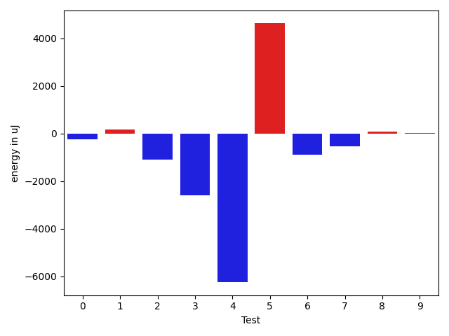

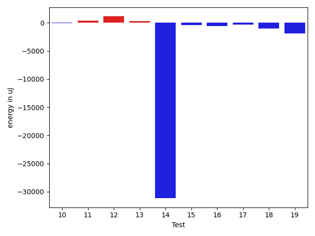

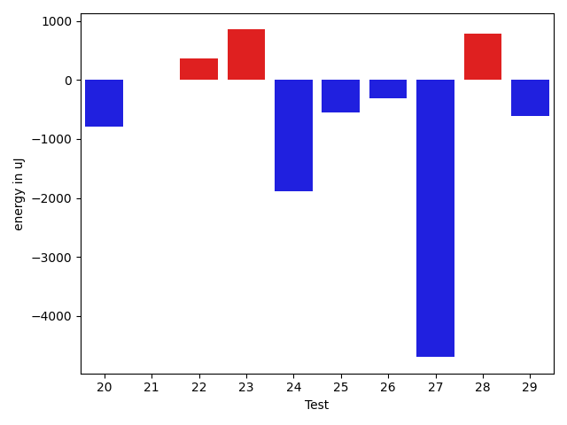

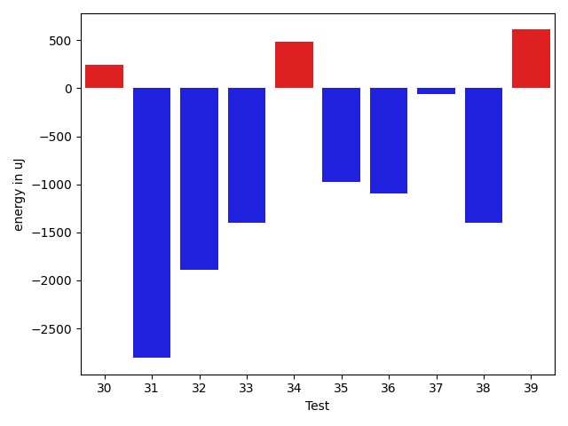

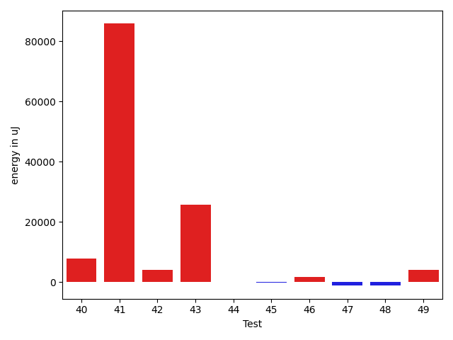

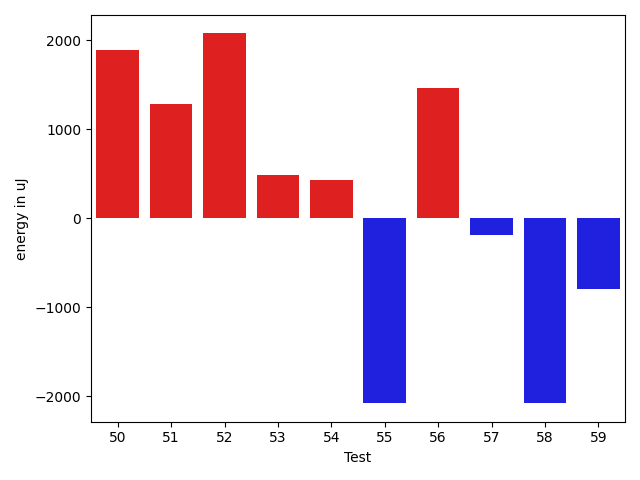

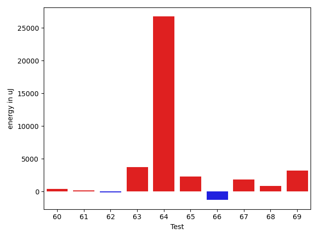

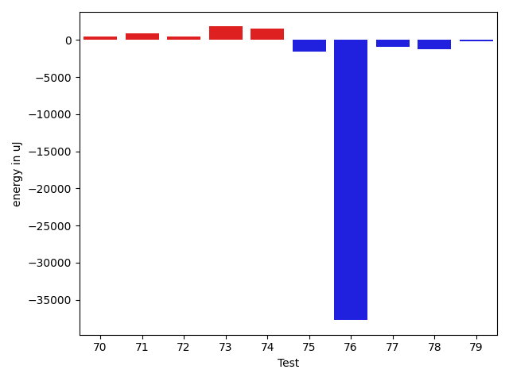

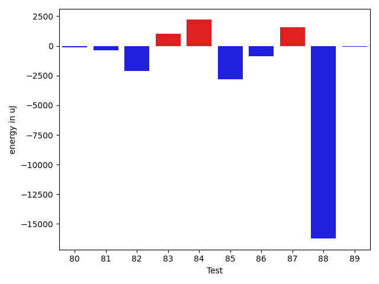

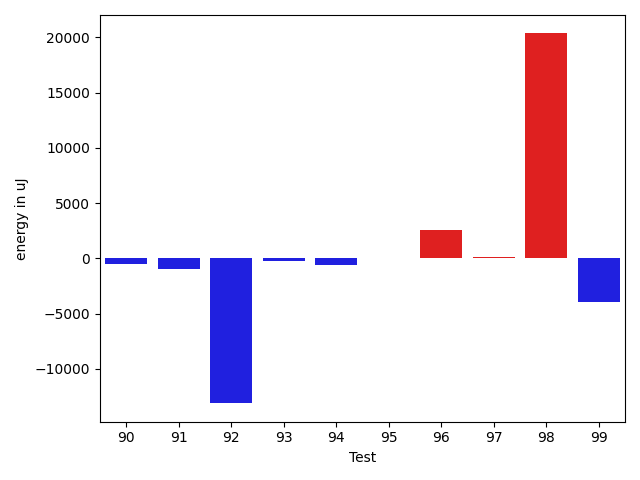

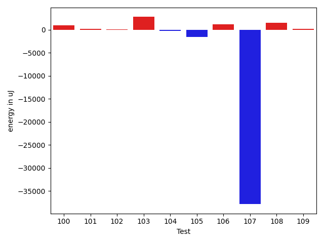

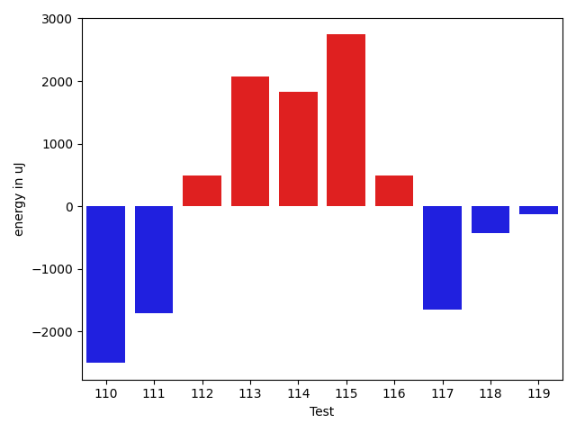

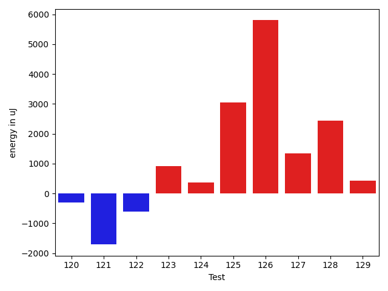

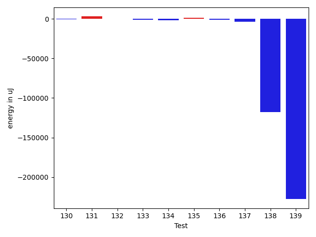

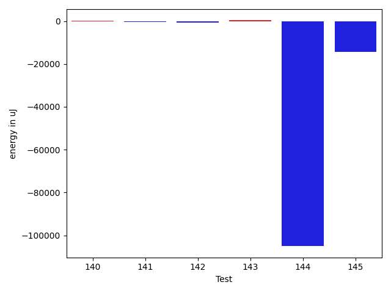

| ID | EnergyV1 | EnergyV2 | DeltaEnergy | σV1 | σV2 |
| --- | --- | --- | --- | --- | --- |
| 0 | 35217 | 34424 | -793 | 4003.3705498247987 | 5062.524858881143 |
| 1 | 34484 | 34789 | 305 | 3613.145800022776 | 3504.69081317842 |
| 2 | 34729 | 35279 | 550 | 6556.962971558967 | 3299.952704774046 |
| 3 | 38574 | 36804 | -1770 | 25324.13751226645 | 20042.328153402083 |
| 4 | 78369 | 76111 | -2258 | 31098.69476502765 | 24676.375884484496 |
| 5 | 35583 | 35889 | 306 | 24845.487583899067 | 34711.033576207235 |
| 6 | 38147 | 36193 | -1954 | 47411.127926239984 | 48876.45392643063 |
| 7 | 35278 | 35583 | 305 | 4045.5835512132144 | 3496.2646794024577 |
| 8 | 34973 | 35584 | 611 | 3438.480356295113 | 3432.554245028289 |
| 9 | 34301 | 35706 | 1405 | 3789.550142187254 | 3529.8718145579855 |
| 10 | 35462 | 35461 | -1 | 6435.350023320649 | 4901.9827934508685 |
| 11 | 34606 | 34973 | 367 | 3881.187853516719 | 3552.662335752583 |
| 12 | 35095 | 35584 | 489 | 3431.981337367913 | 5881.551139656952 |
| 13 | 34302 | 34363 | 61 | 3913.42554736119 | 2452.9595002771653 |
| 14 | 38635 | 38391 | -244 | 390936.2217124255 | 349019.4549967385 |
| 15 | 36255 | 36926 | 671 | 6735.336688494714 | 7092.380387384073 |
| 16 | 35339 | 35339 | 0 | 6814.184804617341 | 6485.313499420819 |
| 17 | 34180 | 33264 | -916 | 3782.9314688828154 | 2246.2444927005727 |
| 18 | 38147 | 37842 | -305 | 4303.961727759277 | 5039.0628344758625 |
| 19 | 37598 | 35706 | -1892 | 4321.888345638914 | 3592.2476975868626 |
| 20 | 36377 | 35583 | -794 | 28799.945565514376 | 24731.589706918494 |
| 21 | 36255 | 36255 | 0 | 24974.40428248229 | 17165.81752447132 |
| 22 | 38146 | 38513 | 367 | 244418.5015071044 | 535427.0800703607 |
| 23 | 36743 | 37598 | 855 | 23923.989769087533 | 49694.70373062046 |
| 24 | 36621 | 34729 | -1892 | 4920.841092458894 | 3883.369396054274 |
| 25 | 35828 | 35278 | -550 | 4500.979264930393 | 4049.0501818327716 |
| 26 | 35400 | 35095 | -305 | 4315.387659416205 | 4318.389501405609 |
| 27 | 38819 | 34119 | -4700 | 4089.121707634018 | 4613.308193657716 |
| 28 | 35400 | 36193 | 793 | 6103.416430778749 | 3313.767325869455 |
| 29 | 37354 | 36743 | -611 | 31193.45256985031 | 20334.172141296105 |
| 30 | 34607 | 34851 | 244 | 3770.626420158858 | 3229.924989619304 |
| 31 | 38330 | 35523 | -2807 | 3519.668340851427 | 3339.800562066349 |
| 32 | 113220 | 111328 | -1892 | 21877.78220620678 | 25058.235025638638 |
| 33 | 37536 | 36133 | -1403 | 3704.987769541079 | 3515.2866279137024 |
| 34 | 35950 | 36438 | 488 | 4296.399732894967 | 3899.809025118789 |
| 35 | 36621 | 35644 | -977 | 4179.084087019764 | 3652.79746358171 |
| 36 | 36315 | 35218 | -1097 | 3879.7028979454776 | 3680.5203997476156 |
| 37 | 37048 | 36987 | -61 | 3955.7152780463603 | 3349.802648853427 |
| 38 | 37231 | 35827 | -1404 | 4129.348662790404 | 3119.299041195039 |
| 39 | 30030 | 30640 | 610 | 0.0 | 1208.6138984620175 |
| 40 | 37841 | 39306 | 1465 | 13847.162172853683 | 27388.738233988446 |
| 41 | 37048 | 39124 | 2076 | 464967.7853878678 | 586958.6529503065 |
| 42 | 38452 | 38208 | -244 | 17533.912949629972 | 27566.42455800813 |
| 43 | 105712 | 109069 | 3357 | 300233.41051537433 | 367649.2714937093 |
| 44 | 36804 | 36560 | -244 | 5913.852250152598 | 6484.195838950813 |
| 45 | 38696 | 37231 | -1465 | 13107.04950858331 | 13809.214266558478 |
| 46 | 36865 | 36499 | -366 | 5983.429354362148 | 10738.553678129683 |
| 47 | 38208 | 35706 | -2502 | 3194.8079851109037 | 3979.2810141744358 |
| 48 | 35889 | 35034 | -855 | 4353.780101057855 | 3465.3239711123506 |
| 49 | 36011 | 37780 | 1769 | 8223.724169554313 | 12175.9476367249 |
| 50 | 36377 | 38269 | 1892 | 5860.517334828234 | 8020.517060794078 |
| 51 | 37658 | 38941 | 1283 | 4248.212317633338 | 4378.245816112185 |
| 52 | 37720 | 39795 | 2075 | 8448.322478128095 | 7044.973048866778 |
| 53 | 36865 | 37353 | 488 | 4186.422696633343 | 3917.329431911023 |
| 54 | 37659 | 38086 | 427 | 328099.3598041114 | 244515.31135904865 |
| 55 | 37903 | 35828 | -2075 | 4444.801510656668 | 5961.942440902885 |
| 56 | 35156 | 36621 | 1465 | 4157.437583661458 | 4284.632650173207 |
| 57 | 36072 | 35888 | -184 | 4203.440564510195 | 4683.515208054911 |
| 58 | 37781 | 35705 | -2076 | 15630.621968892689 | 8055.755437921386 |
| 59 | 38208 | 37415 | -793 | 9553.70689572247 | 8145.191656628925 |
| 60 | 40467 | 40893 | 426 | 32082.665881705474 | 33038.57840244148 |
| 61 | 36194 | 36377 | 183 | 6906.816464733574 | 4165.963403150452 |
| 62 | 35889 | 35766 | -123 | 4429.681034843463 | 6693.771786576625 |
| 63 | 74462 | 78186 | 3724 | 23705.30593370329 | 25493.77273853434 |
| 64 | 114868 | 141601 | 26733 | 252690.65012034628 | 283799.152409002 |
| 65 | 34546 | 36865 | 2319 | 3418.8627793893147 | 4227.414656802345 |
| 66 | 35828 | 34545 | -1283 | 3862.7102598446136 | 3632.681182080905 |
| 67 | 34912 | 36743 | 1831 | 7110.458204814522 | 7023.793407956023 |
| 68 | 36805 | 37659 | 854 | 28384.09496873865 | 24816.02744175627 |
| 69 | 34241 | 37414 | 3173 | 3894.9794152929176 | 4487.115743375074 |
| 70 | 34851 | 35706 | 855 | 7051.133357431335 | 4527.980411539884 |
| 71 | 34485 | 37353 | 2868 | 3896.945908686046 | 3980.8803118070464 |
| 72 | 34851 | 35828 | 977 | 3699.8997867810176 | 4990.5953398971715 |
| 73 | 33935 | 36621 | 2686 | 4279.38879961425 | 4287.001130756705 |
| 74 | 35034 | 36011 | 977 | 3449.3407371134067 | 4203.86235628171 |
| 75 | 36804 | 35889 | -915 | 3828.5146309640986 | 4400.703427684202 |
| 76 | 39673 | 38940 | -733 | 461687.8704453849 | 401285.95729469403 |
| 77 | 37537 | 37293 | -244 | 4450.115912844866 | 4230.641273637709 |
| 78 | 37720 | 37537 | -183 | 4719.895976132335 | 3985.091944170102 |
| 79 | 36133 | 37292 | 1159 | 4696.969365899102 | 6820.801101246129 |
| 80 | 79285 | 79162 | -123 | 28828.74279293713 | 35229.13460222594 |
| 81 | 38085 | 37720 | -365 | 8490.755911713408 | 8129.733823876791 |
| 82 | 39611 | 37476 | -2135 | 3647.1862736695734 | 3839.0732598375876 |
| 83 | 39978 | 41016 | 1038 | 249645.3332543782 | 20901.91512854127 |
| 84 | 38025 | 40222 | 2197 | 329185.8280551326 | 388587.87257323205 |
| 85 | 38513 | 35705 | -2808 | 6898.024502175148 | 3458.0285197030385 |
| 86 | 37049 | 36194 | -855 | 41069.97661613022 | 4405.229296465979 |
| 87 | 38940 | 40527 | 1587 | 52614.57264810578 | 202013.87028641123 |
| 88 | 225524 | 209289 | -16235 | 362555.01351803105 | 201013.48580849587 |
| 89 | 36560 | 36499 | -61 | 3884.487144581281 | 4484.859635606049 |
| 90 | 35095 | 34851 | -244 | 5640.245323245832 | 3225.192989417515 |
| 91 | 37598 | 34973 | -2625 | 3926.6272539822235 | 3984.1737043607604 |
| 92 | 38391 | 38025 | -366 | 47750.66015574121 | 26186.854386008148 |
| 93 | 35888 | 35522 | -366 | 5686.545342835472 | 3686.518006486985 |
| 94 | 35400 | 36316 | 916 | 4151.87426129453 | 3911.4679248523103 |
| 95 | 36316 | 36071 | -245 | 3883.946333027212 | 4528.222685387351 |
| 96 | 37231 | 38086 | 855 | 23017.41711400304 | 30519.46155560613 |
| 97 | 34973 | 35706 | 733 | 4449.936781611566 | 3654.3195392239472 |
| 98 | 85816 | 82092 | -3724 | 194822.19439033902 | 306886.9495039592 |
| 99 | 41992 | 39306 | -2686 | 23711.180805633216 | 25959.860732097626 |
| 100 | 36072 | 35766 | -306 | 2987.9822968679264 | 6098.6829814123475 |
| 101 | 36438 | 36072 | -366 | 3760.9918359098856 | 7061.147542717644 |
| 102 | 37720 | 38208 | 488 | 12437.957048564782 | 10966.566151439827 |
| 103 | 38269 | 37964 | -305 | 44305.88124129857 | 52293.82040561314 |
| 104 | 36804 | 35766 | -1038 | 8373.844012861024 | 8111.373512660954 |
| 105 | 38452 | 37110 | -1342 | 4685.138643270514 | 3474.683860279794 |
| 106 | 34241 | 36866 | 2625 | 4510.397560044998 | 6902.374451759788 |
| 107 | 38818 | 38879 | 61 | 486318.2809873879 | 450355.8949726325 |
| 108 | 37598 | 39245 | 1647 | 27520.023711083893 | 25789.647372755186 |
| 109 | 34851 | 35522 | 671 | 3943.3206345244953 | 3902.3718562766117 |
| 110 | 41199 | 38696 | -2503 | 32083.70767377352 | 26777.58452769322 |
| 111 | 40283 | 38574 | -1709 | 43868.329212649245 | 54562.99707173164 |
| 112 | 35584 | 36072 | 488 | 3838.452967822747 | 3725.611750088392 |
| 113 | 34851 | 36927 | 2076 | 3957.727329108241 | 3674.8012602602766 |
| 114 | 32715 | 34546 | 1831 | 4676.256353026893 | 3231.915084032995 |
| 115 | 36194 | 38941 | 2747 | 11416.417461650955 | 10792.493123987382 |
| 116 | 35462 | 35950 | 488 | 4177.757905226469 | 3022.5314902205732 |
| 117 | 36865 | 35218 | -1647 | 4019.998473353164 | 3763.7031086214283 |
| 118 | 36254 | 35827 | -427 | 4434.286706891777 | 4245.5278639223725 |
| 119 | 36499 | 36377 | -122 | 3881.161504627191 | 3982.3135871215413 |
| 120 | 36988 | 36682 | -306 | 8935.19396015305 | 10146.800101774086 |
| 121 | 41992 | 40283 | -1709 | 609373.5702415947 | 339978.3195222369 |
| 122 | 36804 | 36194 | -610 | 6191.327974675548 | 4432.874929973321 |
| 123 | 37658 | 38574 | 916 | 211713.7424972488 | 273107.34103433543 |
| 124 | 38635 | 39001 | 366 | 19083.318046980577 | 18300.520634217173 |
| 125 | 69641 | 72693 | 3052 | 26023.927160590265 | 29816.826896480383 |
| 126 | 79650 | 85449 | 5799 | 384646.96049993025 | 425801.4400193318 |
| 127 | 37170 | 38513 | 1343 | 3474.422828576789 | 2716.1761866497313 |
| 128 | 36438 | 38879 | 2441 | 3460.784440148862 | 4180.630714928451 |
| 129 | 38941 | 39368 | 427 | 23099.56005732212 | 23920.35319880992 |
| 130 | 39246 | 39856 | 610 | 13199.011252875707 | 10808.984373721614 |
| 131 | 36682 | 38696 | 2014 | 3694.3411380710963 | 4359.745994182097 |
| 132 | 37476 | 36865 | -611 | 4179.843133423482 | 3717.4373677754593 |
| 133 | 39062 | 36499 | -2563 | 4239.458190467797 | 3313.7247362296102 |
| 134 | 37476 | 35278 | -2198 | 3838.957190816951 | 4216.709514987587 |
| 135 | 37781 | 39489 | 1708 | 4481.00155500424 | 4474.191083858096 |
| 136 | 37171 | 35584 | -1587 | 3498.96250480053 | 4117.8319056300215 |
| 137 | 38696 | 38086 | -610 | 16897.906720952524 | 10705.288642966652 |
| 138 | 40100 | 39734 | -366 | 551592.7419464556 | 216705.47806435317 |
| 139 | 38391 | 39490 | 1099 | 804570.8365137824 | 640267.3747849823 |
| 140 | 38330 | 39368 | 1038 | 7951.267937731693 | 9007.463288799097 |
| 141 | 38574 | 37293 | -1281 | 3440.6036827818807 | 4104.475400936979 |
| 142 | 41565 | 40283 | -1282 | 8865.985680692062 | 7241.266245768434 |
| 143 | 37292 | 37232 | -60 | 3121.623976394338 | 4339.180933945345 |
| 144 | 39307 | 37842 | -1465 | 419090.89766341296 | 4363.4416932288605 |
| 145 | 37536 | 39795 | 2259 | 321986.5713851451 | 305783.0453229024 |

## Delta Duration per test method

| ID | DurationV1 | DurationsV2 | DeltaDuration |
| --- | --- | --- | --- |
| 0 | 878630.6393442623 | 872475.5344827586 | -6155.1048615037 |
| 1 | 799130.0666666667 | 785220.4905660377 | -13909.57610062894 |
| 2 | 849066.1785714285 | 801466.6724137932 | -47599.50615763536 |
| 3 | 1288465.5942028984 | 1214117.475409836 | -74348.1187930624 |
| 4 | 2842915.6565656564 | 2719200.3535353537 | -123715.30303030275 |
| 5 | 1335719.0131578948 | 1437064.0 | 101344.98684210517 |
| 6 | 1444726.1290322582 | 1399652.7222222222 | -45073.40681003593 |
| 7 | 823999.283018868 | 796691.0943396227 | -27308.1886792453 |
| 8 | 778277.0465116279 | 744065.8518518518 | -34211.194659776054 |
| 9 | 663279.2558139535 | 647781.4761904762 | -15497.779623477254 |
| 10 | 997997.5285714286 | 976924.8405797102 | -21072.687991718412 |
| 11 | 583870.2857142857 | 604300.9375 | 20430.65178571432 |
| 12 | 837148.1632653062 | 820150.24 | -16997.923265306163 |
| 13 | 481728.09523809527 | 473680.3 | -8047.795238095277 |
| 14 | 4973727.538461538 | 3947267.338235294 | -1026460.200226244 |
| 15 | 965791.3728813559 | 950376.5918367347 | -15414.781044621253 |
| 16 | 1025150.1267605633 | 1022343.8529411765 | -2806.2738193868427 |
| 17 | 478197.125 | 482789.1111111111 | 4591.986111111124 |
| 18 | 642033.6315789474 | 727943.1714285715 | 85909.53984962404 |
| 19 | 565983.027027027 | 691093.8648648649 | 125110.83783783787 |
| 20 | 1574032.9146341463 | 1468507.8804347827 | -105525.03419936355 |
| 21 | 1318994.8507462686 | 1265830.4603174604 | -53164.390428808285 |
| 22 | 1994772.6666666667 | 6633778.56 | 4639005.893333333 |
| 23 | 910268.2 | 1478378.2962962964 | 568110.0962962965 |
| 24 | 519517.03225806454 | 583816.03125 | 64298.998991935456 |
| 25 | 532089.2666666667 | 601181.84375 | 69092.57708333328 |
| 26 | 486994.7083333333 | 521922.275862069 | 34927.56752873567 |
| 27 | 450202.4375 | 430780.7727272727 | -19421.664772727294 |
| 28 | 440184.55 | 481901.9 | 41717.350000000035 |
| 29 | 1074787.8333333333 | 1136724.3278688525 | 61936.494535519276 |
| 30 | 815032.06 | 810337.4897959183 | -4694.570204081712 |
| 31 | 591535.9285714285 | 628124.8846153846 | 36588.9560439561 |
| 32 | 3384203.4646464647 | 3435253.5555555555 | 51050.090909090824 |
| 33 | 671478.3214285715 | 731622.2916666666 | 60143.97023809515 |
| 34 | 522616.4210526316 | 584436.0714285715 | 61819.650375939906 |
| 35 | 749463.0465116279 | 778522.0357142857 | 29058.98920265783 |
| 36 | 697598.2285714286 | 743236.2264150943 | 45637.99784366577 |
| 37 | 672598.3571428572 | 621376.8611111111 | -51221.496031746035 |
| 38 | 701679.1666666666 | 670443.0810810811 | -31236.085585585563 |
| 39 | 845207.0 | 964827.0 | 119620.0 |
| 40 | 1045523.8644067796 | 1307623.396551724 | 262099.53214494442 |
| 41 | 4253465.520833333 | 6972443.509090909 | 2718977.988257576 |
| 42 | 1311097.191780822 | 1365747.7088607594 | 54650.517079937505 |
| 43 | 4594950.96969697 | 5475299.131313131 | 880348.1616161615 |
| 44 | 937265.8676470588 | 989184.9324324324 | 51919.06478537363 |
| 45 | 993392.0169491526 | 1056677.7916666667 | 63285.77471751417 |
| 46 | 1126646.0526315789 | 1159359.5714285714 | 32713.51879699249 |
| 47 | 867116.9074074074 | 817010.7234042553 | -50106.18400315207 |
| 48 | 559154.9642857143 | 650756.8064516129 | 91601.84216589853 |
| 49 | 1044524.5735294118 | 1165616.0933333333 | 121091.51980392146 |
| 50 | 1042079.0666666667 | 1124886.8933333333 | 82807.82666666666 |
| 51 | 514072.61904761905 | 553763.9523809524 | 39691.33333333337 |
| 52 | 709811.7777777778 | 768560.1111111111 | 58748.33333333337 |
| 53 | 620951.4864864865 | 760259.3947368421 | 139307.90825035563 |
| 54 | 2834589.7792207794 | 2142407.1830985914 | -692182.596122188 |
| 55 | 496554.18518518517 | 549467.9230769231 | 52913.737891737954 |
| 56 | 912014.0571428571 | 850304.2741935484 | -61709.78294930875 |
| 57 | 845850.775862069 | 855178.3571428572 | 9327.581280788174 |
| 58 | 936261.4074074074 | 815043.5 | -121217.90740740742 |
| 59 | 1181540.8 | 1127975.3544303798 | -53565.445569620235 |
| 60 | 1602480.078125 | 1425833.7857142857 | -176646.29241071432 |
| 61 | 975018.0384615385 | 851912.1875 | -123105.8509615385 |
| 62 | 920330.448275862 | 853323.25 | -67007.19827586203 |
| 63 | 2548342.909090909 | 2626960.090909091 | 78617.18181818165 |
| 64 | 4921677.303030303 | 5180635.262626262 | 258957.95959595963 |
| 65 | 686274.6052631579 | 650354.1219512195 | -35920.483311938355 |
| 66 | 574444.5806451613 | 502496.25925925927 | -71948.32138590206 |
| 67 | 934889.8548387097 | 938855.890625 | 3966.035786290304 |
| 68 | 900579.75 | 926397.85 | 25818.099999999977 |
| 69 | 543480.2666666667 | 542933.9166666666 | -546.3500000000931 |
| 70 | 1015371.5492957747 | 1001996.0933333334 | -13375.45596244128 |
| 71 | 555973.0588235294 | 561330.303030303 | 5357.244206773583 |
| 72 | 572775.0333333333 | 570417.3783783783 | -2357.654954954982 |
| 73 | 554350.25 | 524486.6774193548 | -29863.57258064521 |
| 74 | 578262.3461538461 | 494748.037037037 | -83514.3091168091 |
| 75 | 791680.6222222223 | 770819.4406779661 | -20861.181544256164 |
| 76 | 5181024.873015873 | 3830799.2933333335 | -1350225.5796825397 |
| 77 | 511045.71428571426 | 586847.1034482758 | 75801.38916256157 |
| 78 | 624547.6785714285 | 565751.7878787878 | -58795.89069264068 |
| 79 | 755827.6666666666 | 786227.7083333334 | 30400.041666666744 |
| 80 | 2629579.1515151514 | 2754172.202020202 | 124593.05050505046 |
| 81 | 981206.2641509434 | 1020942.8548387097 | 39736.59068776632 |
| 82 | 462706.875 | 494598.68 | 31891.804999999993 |
| 83 | 2225817.302325581 | 1403918.8723404256 | -821898.4299851556 |
| 84 | 3806450.0416666665 | 5201442.796296297 | 1394992.7546296301 |
| 85 | 692879.4347826086 | 660454.2941176471 | -32425.14066496154 |
| 86 | 863978.3181818182 | 658164.0681818182 | -205814.25 |
| 87 | 1456600.3076923077 | 2718673.0434782607 | 1262072.735785953 |
| 88 | 8413310.252525253 | 6785971.555555556 | -1627338.6969696973 |
| 89 | 856178.3174603175 | 843471.1475409836 | -12707.169919333886 |
| 90 | 1044075.78125 | 1010387.0147058824 | -33688.76654411759 |
| 91 | 588435.0 | 575835.9696969697 | -12599.030303030275 |
| 92 | 1457021.7454545454 | 1016001.9104477612 | -441019.8350067842 |
| 93 | 918989.1408450705 | 915110.8472222222 | -3878.2936228482286 |
| 94 | 633939.4 | 546140.6875 | -87798.71250000002 |
| 95 | 846320.0943396227 | 835846.7142857143 | -10473.380053908331 |
| 96 | 1172107.225 | 1082278.9677419355 | -89828.25725806458 |
| 97 | 737399.6388888889 | 706184.2093023256 | -31215.42958656326 |
| 98 | 3604259.3131313133 | 4247739.333333333 | 643480.0202020197 |
| 99 | 1684195.2323232323 | 1620082.6530612244 | -64112.57926200796 |
| 100 | 958829.4098360656 | 964676.7454545455 | 5847.335618479876 |
| 101 | 1098140.8915662651 | 1094361.7654320989 | -3779.126134166261 |
| 102 | 1320050.3152173914 | 1296893.9473684211 | -23156.36784897023 |
| 103 | 1582448.2045454546 | 1677908.6627906978 | 95460.45824524318 |
| 104 | 1213910.4 | 1187139.1707317072 | -26771.229268292664 |
| 105 | 590538.7666666667 | 586925.6666666666 | -3613.100000000093 |
| 106 | 780281.4523809524 | 827089.8695652174 | 46808.41718426498 |
| 107 | 8402845.068965517 | 7207193.090909091 | -1195651.9780564262 |
| 108 | 1578058.3763440861 | 1552027.5760869565 | -26030.800257129595 |
| 109 | 748238.2222222222 | 813745.0576923077 | 65506.8354700855 |
| 110 | 1389982.4615384615 | 1369494.25 | -20488.211538461503 |
| 111 | 1472001.65 | 1902576.4 | 430574.75 |
| 112 | 782150.4905660377 | 836491.2727272727 | 54340.782161234994 |
| 113 | 622810.4090909091 | 616236.2432432432 | -6574.165847665863 |
| 114 | 538705.3684210526 | 586715.64 | 48010.27157894743 |
| 115 | 979279.2580645161 | 933277.9705882353 | -46001.28747628082 |
| 116 | 638852.4324324324 | 646479.95 | 7627.517567567527 |
| 117 | 825803.7894736842 | 817552.0 | -8251.789473684155 |
| 118 | 791539.693877551 | 783947.1379310344 | -7592.555946516572 |
| 119 | 582733.40625 | 691639.75 | 108906.34375 |
| 120 | 1103057.8666666667 | 1009983.2777777778 | -93074.58888888895 |
| 121 | 6936165.081081081 | 3382540.657534247 | -3553624.4235468344 |
| 122 | 984015.5833333334 | 925742.3389830509 | -58273.244350282475 |
| 123 | 2110033.8055555555 | 2412674.696969697 | 302640.8914141413 |
| 124 | 1450066.2588235294 | 1410163.9247311829 | -39902.334092346486 |
| 125 | 1998794.202020202 | 2104248.474747475 | 105454.2727272727 |
| 126 | 4708995.7272727275 | 5562161.515151516 | 853165.7878787881 |
| 127 | 493723.5 | 436310.53846153844 | -57412.96153846156 |
| 128 | 492513.29411764705 | 498713.2380952381 | 6199.943977591058 |
| 129 | 1371187.6451612904 | 1116854.2083333333 | -254333.43682795716 |
| 130 | 882343.5853658536 | 884509.5 | 2165.9146341463784 |
| 131 | 579570.2222222222 | 543732.0 | -35838.22222222225 |
| 132 | 538958.8518518518 | 444276.94444444444 | -94681.90740740736 |
| 133 | 555342.7857142857 | 466182.45 | -89160.33571428567 |
| 134 | 557567.3333333334 | 526747.9523809524 | -30819.380952380947 |
| 135 | 537023.0 | 495891.2380952381 | -41131.761904761894 |
| 136 | 485193.2 | 460365.26086956525 | -24827.939130434766 |
| 137 | 1224102.7301587302 | 1089357.076923077 | -134745.65323565318 |
| 138 | 5698290.948051948 | 2213766.7875 | -3484524.160551948 |
| 139 | 16368189.95 | 9421553.913043479 | -6946636.036956521 |
| 140 | 974138.8 | 712168.7741935484 | -261970.02580645168 |
| 141 | 717413.1081081082 | 736595.641025641 | 19182.532917532837 |
| 142 | 792006.9615384615 | 797628.7368421053 | 5621.775303643779 |
| 143 | 494935.22222222225 | 503934.1538461539 | 8998.931623931625 |
| 144 | 3896259.588235294 | 450175.47826086957 | -3446084.1099744244 |
| 145 | 3028072.111111111 | 2296142.0384615385 | -731930.0726495725 |

## Misc.

| ID | Test Class | Test Method |
| --- | --- | --- |
| 0 | com.google.gson.functional.CustomTypeAdaptersTest | testCustomAdapterInvokedForCollectionElementDeserialization |
| 1 | com.google.gson.functional.CustomTypeAdaptersTest | testCustomAdapterInvokedForMapElementDeserialization |
| 2 | com.google.gson.functional.CustomTypeAdaptersTest | testCustomAdapterInvokedForMapElementSerializationWithType |
| 3 | com.google.gson.functional.CustomTypeAdaptersTest | testCustomNestedSerializers |
| 4 | com.google.gson.functional.CustomTypeAdaptersTest | testCustomTypeAdapterDoesNotAppliesToSubClasses |
| 5 | com.google.gson.functional.CustomTypeAdaptersTest | testCustomAdapterInvokedForCollectionElementSerializationWithType |
| 6 | com.google.gson.functional.CustomTypeAdaptersTest | testCustomDeserializers |
| 7 | com.google.gson.functional.CustomTypeAdaptersTest | testCustomByteArrayDeserializerAndInstanceCreator |
| 8 | com.google.gson.functional.CustomTypeAdaptersTest | testCustomByteArraySerializer |
| 9 | com.google.gson.functional.CustomTypeAdaptersTest | testEnsureCustomSerializerNotInvokedForNullValues |
| 10 | com.google.gson.functional.CustomTypeAdaptersTest | testCustomDeserializerForLong |
| 11 | com.google.gson.functional.CustomTypeAdaptersTest | testEnsureCustomDeserializerNotInvokedForNullValues |
| 12 | com.google.gson.functional.CustomTypeAdaptersTest | testCustomTypeAdapterAppliesToSubClassesSerializedAsBaseClass |
| 13 | com.google.gson.functional.CustomTypeAdaptersTest | testCustomAdapterInvokedForMapElementSerialization |
| 14 | com.google.gson.functional.CustomTypeAdaptersTest | testCustomSerializers |
| 15 | com.google.gson.functional.CustomTypeAdaptersTest | testCustomNestedDeserializers |
| 16 | com.google.gson.functional.CustomTypeAdaptersTest | testCustomSerializerForLong |
| 17 | com.google.gson.functional.CustomTypeAdaptersTest | testCustomAdapterInvokedForCollectionElementSerialization |
| 18 | com.google.gson.MixedStreamTest | testReaderDoesNotMutateState |
| 19 | com.google.gson.MixedStreamTest | testWriteDoesNotMutateState |
| 20 | com.google.gson.MixedStreamTest | testWriteHtmlSafe |
| 21 | com.google.gson.MixedStreamTest | testWriteLenient |
| 22 | com.google.gson.MixedStreamTest | testWriteMixedStreamed |
| 23 | com.google.gson.MixedStreamTest | testReadMixedStreamed |
| 24 | com.google.gson.MixedStreamTest | testWriteClosed |
| 25 | com.google.gson.MixedStreamTest | testWriteInvalidState |
| 26 | com.google.gson.MixedStreamTest | testReadNulls |
| 27 | com.google.gson.MixedStreamTest | testWriteNulls |
| 28 | com.google.gson.MixedStreamTest | testReadInvalidState |
| 29 | com.google.gson.MixedStreamTest | testReadClosed |
| 30 | com.google.gson.functional.DefaultTypeAdaptersTest | testDateSerializationWithPatternNotOverridenByTypeAdapter |
| 31 | com.google.gson.functional.DefaultTypeAdaptersTest | testDefaultGregorianCalendarDeserialization |
| 32 | com.google.gson.functional.DefaultTypeAdaptersTest | testDefaultDateDeserializationUsingBuilder |
| 33 | com.google.gson.functional.DefaultTypeAdaptersTest | testSetSerialization |
| 34 | com.google.gson.functional.DefaultTypeAdaptersTest | testDefaultGregorianCalendarSerialization |
| 35 | com.google.gson.functional.DefaultTypeAdaptersTest | testDateSerializationWithPattern |
| 36 | com.google.gson.functional.DefaultTypeAdaptersTest | testDateDeserializationWithPattern |
| 37 | com.google.gson.functional.DefaultTypeAdaptersTest | testDefaultCalendarSerialization |
| 38 | com.google.gson.functional.DefaultTypeAdaptersTest | testDefaultCalendarDeserialization |
| 39 | com.google.gson.functional.DefaultTypeAdaptersTest | testDefaultDateSerializationUsingBuilder |
| 40 | com.google.gson.FunctionWithInternalDependenciesTest | testUserDefinedExclusionPolicies |
| 41 | com.google.gson.FunctionWithInternalDependenciesTest | testAnonymousLocalClassesSerialization |
| 42 | com.google.gson.functional.MapAsArrayTypeAdapterTest | testTwoTypesCollapseToOneSerialize |
| 43 | com.google.gson.functional.MapAsArrayTypeAdapterTest | testSerializeComplexMapWithTypeAdapter |
| 44 | com.google.gson.functional.MapAsArrayTypeAdapterTest | testTwoTypesCollapseToOneDeserialize |
| 45 | com.google.gson.functional.MapTest | testSerializeMaps |
| 46 | com.google.gson.functional.MapTest | testParameterizedMapSubclassDeserialization |
| 47 | com.google.gson.functional.MapTest | testMapSerializationWithNullValueButSerializeNulls |
| 48 | com.google.gson.functional.MapTest | testMapSerializationWithNullValuesSerialized |
| 49 | com.google.gson.functional.ReadersWritersTest | testReadWriteTwoObjects |
| 50 | com.google.gson.functional.ReadersWritersTest | testReadWriteTwoStrings |
| 51 | com.google.gson.functional.ReadersWritersTest | testTopLevelNullObjectDeserializationWithReaderAndSerializeNulls |
| 52 | com.google.gson.functional.ReadersWritersTest | testTopLevelNullObjectSerializationWithWriterAndSerializeNulls |
| 53 | com.google.gson.functional.FieldExclusionTest | testDefaultNestedStaticClassIncluded |
| 54 | com.google.gson.functional.FieldExclusionTest | testDefaultInnerClassExclusion |
| 55 | com.google.gson.functional.FieldExclusionTest | testInnerClassExclusion |
| 56 | com.google.gson.functional.CustomDeserializerTest | testCustomDeserializerReturnsNullForArrayElementsForArrayField |
| 57 | com.google.gson.functional.CustomDeserializerTest | testCustomDeserializerReturnsNull |
| 58 | com.google.gson.functional.CustomDeserializerTest | testCustomDeserializerReturnsNullForTopLevelPrimitives |
| 59 | com.google.gson.functional.CustomDeserializerTest | testJsonTypeFieldBasedDeserialization |
| 60 | com.google.gson.functional.CustomDeserializerTest | testCustomDeserializerReturnsNullForTopLevelObject |
| 61 | com.google.gson.functional.CustomDeserializerTest | testCustomDeserializerReturnsNullForArrayElements |
| 62 | com.google.gson.functional.CustomDeserializerTest | testCustomDeserializerReturnsNullForPrimitiveFields |
| 63 | com.google.gson.functional.NamingPolicyTest | testGsonWithNonDefaultFieldNamingPolicySerialization |
| 64 | com.google.gson.functional.NamingPolicyTest | testGsonDuplicateNameUsingSerializedNameFieldNamingPolicySerialization |
| 65 | com.google.gson.functional.NamingPolicyTest | testGsonWithSerializedNameFieldNamingPolicyDeserialization |
| 66 | com.google.gson.functional.NamingPolicyTest | testGsonWithUpperCamelCaseSpacesPolicyDeserialiation |
| 67 | com.google.gson.functional.NamingPolicyTest | testGsonWithSerializedNameFieldNamingPolicySerialization |
| 68 | com.google.gson.functional.NamingPolicyTest | testGsonWithNonDefaultFieldNamingPolicyDeserialiation |
| 69 | com.google.gson.functional.NamingPolicyTest | testGsonWithLowerCaseUnderscorePolicySerialization |
| 70 | com.google.gson.functional.NamingPolicyTest | testDeprecatedNamingStrategy |
| 71 | com.google.gson.functional.NamingPolicyTest | testGsonWithLowerCaseDashPolicyDeserialiation |
| 72 | com.google.gson.functional.NamingPolicyTest | testGsonWithLowerCaseDashPolicySerialization |
| 73 | com.google.gson.functional.NamingPolicyTest | testGsonWithLowerCaseUnderscorePolicyDeserialiation |
| 74 | com.google.gson.functional.NamingPolicyTest | testGsonWithUpperCamelCaseSpacesPolicySerialiation |
| 75 | com.google.gson.functional.CustomSerializerTest | testSerializerReturnsNull |
| 76 | com.google.gson.functional.CustomSerializerTest | testSubClassSerializerInvokedForBaseClassFieldsHoldingSubClassInstances |
| 77 | com.google.gson.functional.CustomSerializerTest | testBaseClassSerializerInvokedForBaseClassFieldsHoldingSubClassInstances |
| 78 | com.google.gson.functional.CustomSerializerTest | testBaseClassSerializerInvokedForBaseClassFields |
| 79 | com.google.gson.functional.CustomSerializerTest | testSubClassSerializerInvokedForBaseClassFieldsHoldingArrayOfSubClassInstances |
| 80 | com.google.gson.functional.ObjectTest | testSingletonLists |
| 81 | com.google.gson.functional.ObjectTest | testInnerClassDeserialization |
| 82 | com.google.gson.functional.ObjectTest | testJsonObjectSerialization |
| 83 | com.google.gson.functional.SecurityTest | testJsonWithNonExectuableTokenSerialization |
| 84 | com.google.gson.functional.SecurityTest | testNonExecutableJsonSerialization |
| 85 | com.google.gson.functional.SecurityTest | testJsonWithNonExectuableTokenWithConfiguredGsonDeserialization |
| 86 | com.google.gson.functional.SecurityTest | testJsonWithNonExectuableTokenWithRegularGsonDeserialization |
| 87 | com.google.gson.functional.SecurityTest | testNonExecutableJsonDeserialization |
| 88 | com.google.gson.functional.VersioningTest | testVersionedUntilSerialization |
| 89 | com.google.gson.functional.VersioningTest | testVersionedClassesSerialization |
| 90 | com.google.gson.functional.VersioningTest | testVersionedGsonMixingSinceAndUntilSerialization |
| 91 | com.google.gson.functional.VersioningTest | testIgnoreLaterVersionClassDeserialization |
| 92 | com.google.gson.functional.VersioningTest | testVersionedUntilDeserialization |
| 93 | com.google.gson.functional.VersioningTest | testVersionedGsonMixingSinceAndUntilDeserialization |
| 94 | com.google.gson.functional.VersioningTest | testIgnoreLaterVersionClassSerialization |
| 95 | com.google.gson.functional.VersioningTest | testVersionedClassesDeserialization |
| 96 | com.google.gson.functional.VersioningTest | testVersionedGsonWithUnversionedClassesSerialization |
| 97 | com.google.gson.functional.VersioningTest | testVersionedGsonWithUnversionedClassesDeserialization |
| 98 | com.google.gson.functional.TypeVariableTest | testAdvancedTypeVariables |
| 99 | com.google.gson.functional.TypeVariableTest | testTypeVariablesViaTypeParameter |
| 100 | com.google.gson.functional.TypeVariableTest | testBasicTypeVariables |
| 101 | com.google.gson.functional.ParameterizedTypesTest | testParameterizedTypeWithReaderDeserialization |
| 102 | com.google.gson.functional.ParameterizedTypesTest | testParameterizedTypeWithCustomSerializer |
| 103 | com.google.gson.functional.ParameterizedTypesTest | testParameterizedTypeDeserialization |
| 104 | com.google.gson.functional.ParameterizedTypesTest | testParameterizedTypesWithCustomDeserializer |
| 105 | com.google.gson.functional.NullObjectAndFieldTest | testCustomSerializationOfNulls |
| 106 | com.google.gson.functional.NullObjectAndFieldTest | testPrintPrintingObjectWithNulls |
| 107 | com.google.gson.functional.NullObjectAndFieldTest | testTopLevelNullObjectSerialization |
| 108 | com.google.gson.functional.NullObjectAndFieldTest | testExplicitSerializationOfNullArrayMembers |
| 109 | com.google.gson.functional.NullObjectAndFieldTest | testCustomTypeAdapterPassesNullDesrialization |
| 110 | com.google.gson.functional.NullObjectAndFieldTest | testTopLevelNullObjectDeserialization |
| 111 | com.google.gson.functional.NullObjectAndFieldTest | testExplicitSerializationOfNulls |
| 112 | com.google.gson.functional.NullObjectAndFieldTest | testNullWrappedPrimitiveMemberSerialization |
| 113 | com.google.gson.functional.NullObjectAndFieldTest | testExplicitSerializationOfNullStringMembers |
| 114 | com.google.gson.functional.NullObjectAndFieldTest | testCustomTypeAdapterPassesNullSerialization |
| 115 | com.google.gson.functional.NullObjectAndFieldTest | testExplicitDeserializationOfNulls |
| 116 | com.google.gson.functional.NullObjectAndFieldTest | testExplicitSerializationOfNullCollectionMembers |
| 117 | com.google.gson.functional.NullObjectAndFieldTest | testPrintPrintingArraysWithNulls |
| 118 | com.google.gson.functional.NullObjectAndFieldTest | testNullWrappedPrimitiveMemberDeserialization |
| 119 | com.google.gson.functional.NullObjectAndFieldTest | testExplicitNullSetsFieldToNullDuringDeserialization |
| 120 | com.google.gson.functional.InstanceCreatorTest | testInstanceCreatorReturnsSubTypeForField |
| 121 | com.google.gson.functional.InstanceCreatorTest | testInstanceCreatorReturnsBaseType |
| 122 | com.google.gson.functional.InstanceCreatorTest | testInstanceCreatorReturnsSubTypeForTopLevelObject |
| 123 | com.google.gson.CommentsTest | testParseComments |
| 124 | com.google.gson.functional.EscapingTest | testGsonAcceptsEscapedAndNonEscapedJsonDeserialization |
| 125 | com.google.gson.functional.UncategorizedTest | testReturningDerivedClassesDuringDeserialization |
| 126 | com.google.gson.functional.TypeHierarchyAdapterTest | testTypeHierarchy |
| 127 | com.google.gson.functional.PrimitiveTest | testNegativeInfinityFloatSerialization |
| 128 | com.google.gson.functional.PrimitiveTest | testDoubleNaNSerialization |
| 129 | com.google.gson.functional.PrimitiveTest | testHtmlCharacterSerialization |
| 130 | com.google.gson.functional.PrimitiveTest | testOverridingDefaultPrimitiveSerialization |
| 131 | com.google.gson.functional.PrimitiveTest | testLongAsStringSerialization |
| 132 | com.google.gson.functional.PrimitiveTest | testDoubleInfinitySerialization |
| 133 | com.google.gson.functional.PrimitiveTest | testLongAsStringDeserialization |
| 134 | com.google.gson.functional.PrimitiveTest | testFloatNaNSerialization |
| 135 | com.google.gson.functional.PrimitiveTest | testFloatInfinitySerialization |
| 136 | com.google.gson.functional.PrimitiveTest | testNegativeInfinitySerialization |
| 137 | com.google.gson.functional.CircularReferenceTest | testSelfReferenceCustomHandlerSerialization |
| 138 | com.google.gson.JsonParserTest | testReadWriteTwoObjects |
| 139 | com.google.gson.GsonBuilderTest | testCreatingMoreThanOnce |
| 140 | com.google.gson.functional.PrintFormattingTest | testJsonObjectWithNullValuesSerialized |
| 141 | com.google.gson.functional.ArrayTest | testArrayOfPrimitivesWithCustomTypeAdapter |
| 142 | com.google.gson.functional.ArrayTest | testNullsInArrayWithSerializeNullPropertySetSerialization |
| 143 | com.google.gson.ParameterizedTypeHandlerMapTest | testMakeUnmodifiable |
| 144 | com.google.gson.JsonObjectTest | testWritePropertyWithEmptyStringName |
| 145 | com.google.gson.JsonObjectTest | testPropertyWithQuotes |

| Test | IterationV1 | IterationV2 | DeltaIteration |
| --- | --- | --- | --- |
| 0 | 61 | 58 | -3 |
| 1 | 60 | 53 | -7 |
| 2 | 56 | 58 | 2 |
| 3 | 69 | 61 | -8 |
| 4 | 99 | 99 | 0 |
| 5 | 76 | 69 | -7 |
| 6 | 62 | 54 | -8 |
| 7 | 53 | 53 | 0 |
| 8 | 43 | 54 | 11 |
| 9 | 43 | 42 | -1 |
| 10 | 70 | 69 | -1 |
| 11 | 35 | 32 | -3 |
| 12 | 49 | 50 | 1 |
| 13 | 21 | 20 | -1 |
| 14 | 65 | 68 | 3 |
| 15 | 59 | 49 | -10 |
| 16 | 71 | 68 | -3 |
| 17 | 24 | 18 | -6 |
| 18 | 38 | 35 | -3 |
| 19 | 37 | 37 | 0 |
| 20 | 82 | 92 | 10 |
| 21 | 67 | 63 | -4 |
| 22 | 54 | 50 | -4 |
| 23 | 55 | 54 | -1 |
| 24 | 31 | 32 | 1 |
| 25 | 30 | 32 | 2 |
| 26 | 24 | 29 | 5 |
| 27 | 16 | 22 | 6 |
| 28 | 20 | 20 | 0 |
| 29 | 60 | 61 | 1 |
| 30 | 50 | 49 | -1 |
| 31 | 28 | 26 | -2 |
| 32 | 99 | 99 | 0 |
| 33 | 28 | 24 | -4 |
| 34 | 19 | 28 | 9 |
| 35 | 43 | 56 | 13 |
| 36 | 35 | 53 | 18 |
| 37 | 28 | 36 | 8 |
| 38 | 30 | 37 | 7 |
| 39 | 1 | 3 | 2 |
| 40 | 59 | 58 | -1 |
| 41 | 48 | 55 | 7 |
| 42 | 73 | 79 | 6 |
| 43 | 99 | 99 | 0 |
| 44 | 68 | 74 | 6 |
| 45 | 59 | 48 | -11 |
| 46 | 76 | 84 | 8 |
| 47 | 54 | 47 | -7 |
| 48 | 28 | 31 | 3 |
| 49 | 68 | 75 | 7 |
| 50 | 75 | 75 | 0 |
| 51 | 21 | 21 | 0 |
| 52 | 18 | 27 | 9 |
| 53 | 37 | 38 | 1 |
| 54 | 77 | 71 | -6 |
| 55 | 27 | 13 | -14 |
| 56 | 70 | 62 | -8 |
| 57 | 58 | 56 | -2 |
| 58 | 54 | 50 | -4 |
| 59 | 80 | 79 | -1 |
| 60 | 64 | 56 | -8 |
| 61 | 52 | 48 | -4 |
| 62 | 58 | 52 | -6 |
| 63 | 99 | 99 | 0 |
| 64 | 99 | 99 | 0 |
| 65 | 38 | 41 | 3 |
| 66 | 31 | 27 | -4 |
| 67 | 62 | 64 | 2 |
| 68 | 40 | 40 | 0 |
| 69 | 30 | 36 | 6 |
| 70 | 71 | 75 | 4 |
| 71 | 34 | 33 | -1 |
| 72 | 30 | 37 | 7 |
| 73 | 24 | 31 | 7 |
| 74 | 26 | 27 | 1 |
| 75 | 45 | 59 | 14 |
| 76 | 63 | 75 | 12 |
| 77 | 14 | 29 | 15 |
| 78 | 28 | 33 | 5 |
| 79 | 39 | 48 | 9 |
| 80 | 99 | 99 | 0 |
| 81 | 53 | 62 | 9 |
| 82 | 16 | 25 | 9 |
| 83 | 43 | 47 | 4 |
| 84 | 48 | 54 | 6 |
| 85 | 46 | 34 | -12 |
| 86 | 44 | 44 | 0 |
| 87 | 39 | 46 | 7 |
| 88 | 99 | 99 | 0 |
| 89 | 63 | 61 | -2 |
| 90 | 64 | 68 | 4 |
| 91 | 26 | 33 | 7 |
| 92 | 55 | 67 | 12 |
| 93 | 71 | 72 | 1 |
| 94 | 25 | 32 | 7 |
| 95 | 53 | 56 | 3 |
| 96 | 40 | 31 | -9 |
| 97 | 36 | 43 | 7 |
| 98 | 99 | 99 | 0 |
| 99 | 99 | 98 | -1 |
| 100 | 61 | 55 | -6 |
| 101 | 83 | 81 | -2 |
| 102 | 92 | 95 | 3 |
| 103 | 88 | 86 | -2 |
| 104 | 90 | 82 | -8 |
| 105 | 30 | 30 | 0 |
| 106 | 42 | 46 | 4 |
| 107 | 29 | 44 | 15 |
| 108 | 93 | 92 | -1 |
| 109 | 45 | 52 | 7 |
| 110 | 26 | 28 | 2 |
| 111 | 40 | 35 | -5 |
| 112 | 53 | 55 | 2 |
| 113 | 22 | 37 | 15 |
| 114 | 19 | 25 | 6 |
| 115 | 31 | 34 | 3 |
| 116 | 37 | 40 | 3 |
| 117 | 38 | 37 | -1 |
| 118 | 49 | 58 | 9 |
| 119 | 32 | 36 | 4 |
| 120 | 60 | 72 | 12 |
| 121 | 74 | 73 | -1 |
| 122 | 60 | 59 | -1 |
| 123 | 72 | 66 | -6 |
| 124 | 85 | 93 | 8 |
| 125 | 99 | 99 | 0 |
| 126 | 99 | 99 | 0 |
| 127 | 22 | 13 | -9 |
| 128 | 17 | 21 | 4 |
| 129 | 62 | 48 | -14 |
| 130 | 41 | 36 | -5 |
| 131 | 18 | 21 | 3 |
| 132 | 27 | 18 | -9 |
| 133 | 28 | 20 | -8 |
| 134 | 21 | 21 | 0 |
| 135 | 22 | 21 | -1 |
| 136 | 20 | 23 | 3 |
| 137 | 63 | 65 | 2 |
| 138 | 77 | 80 | 3 |
| 139 | 20 | 23 | 3 |
| 140 | 25 | 31 | 6 |
| 141 | 37 | 39 | 2 |
| 142 | 26 | 19 | -7 |
| 143 | 18 | 26 | 8 |
| 144 | 17 | 23 | 6 |
| 145 | 18 | 26 | 8 |

| Time Label | Time (s) |
| --- | --- |
| Selection | 27.19154119491577 |
| Injection | 13.508540868759155 |
| Total | 1151.9536592960358 |

