# gson 439d93

https://github.com/google/gson/commit/439d93

## Delta Energy per test method

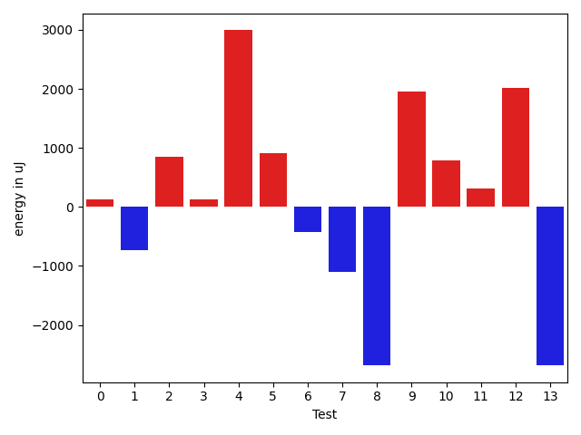

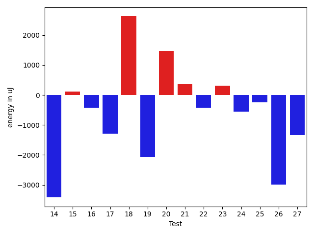

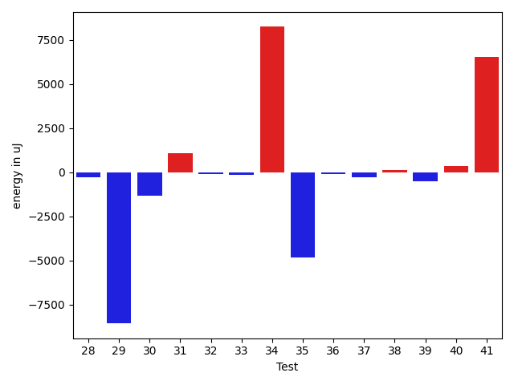

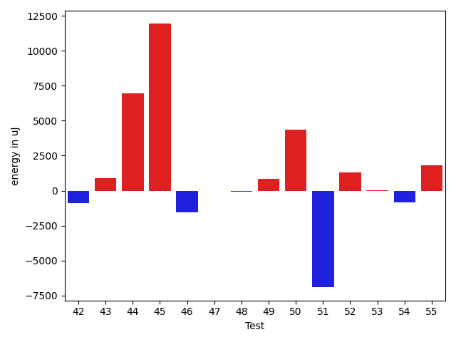

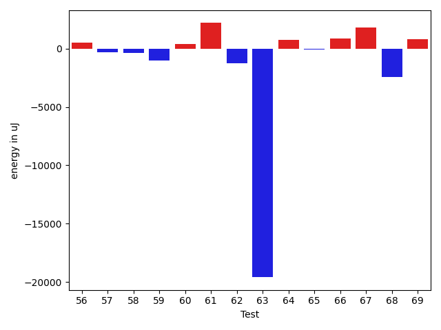

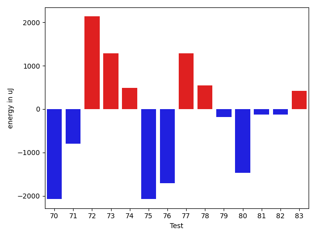

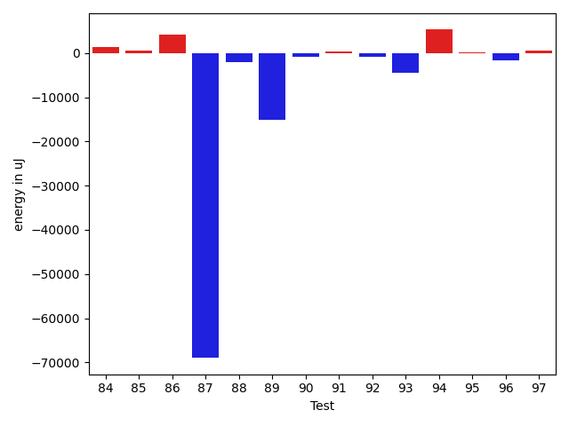

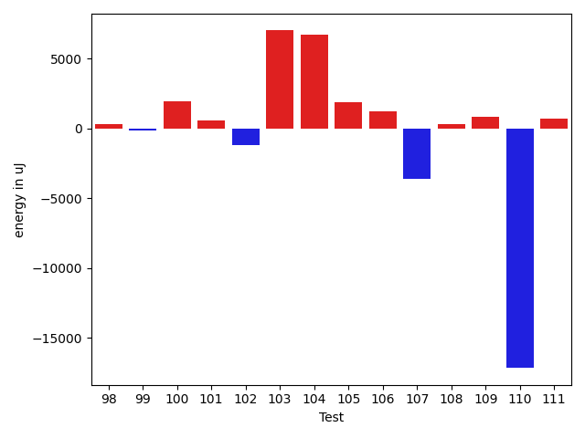

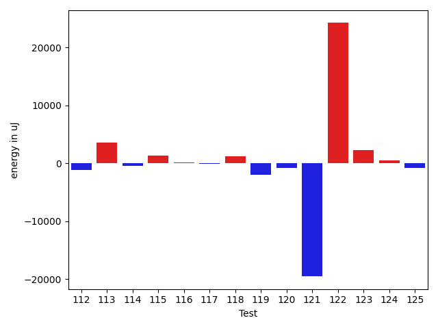

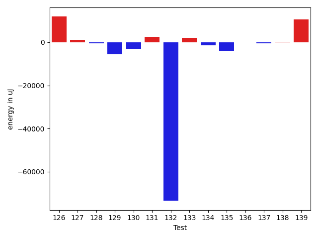

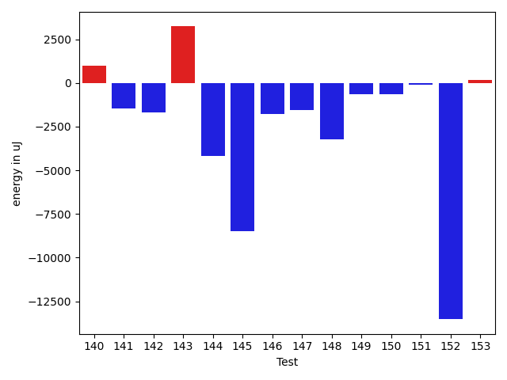

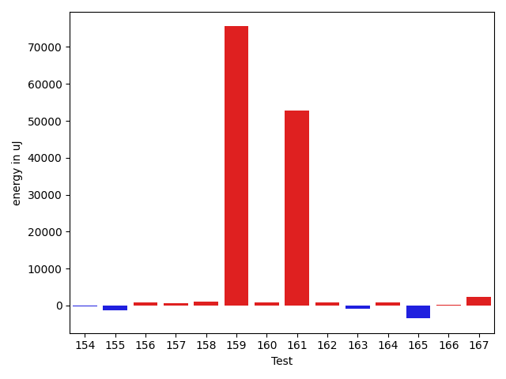

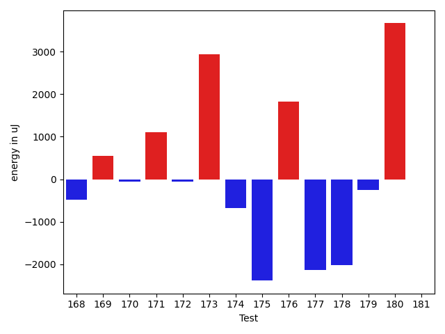

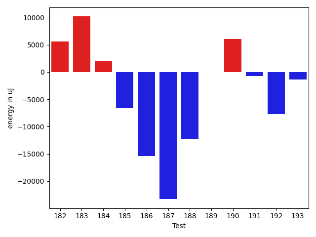

| ID | EnergyV1 | EnergyV2 | DeltaEnergy | σV1 | σV2 |
| --- | --- | --- | --- | --- | --- |
| 0 | 38818 | 38940 | 122 | 6349.52273510219 | 11329.103291803971 |
| 1 | 35767 | 35034 | -733 | 9674.704656344813 | 4087.7661502054434 |
| 2 | 36499 | 37353 | 854 | 27481.934772452678 | 47021.27421248588 |
| 3 | 36194 | 36315 | 121 | 12760.410593874907 | 24451.623486737524 |
| 4 | 69214 | 72205 | 2991 | 34110.872494656294 | 31963.68262720592 |
| 5 | 35278 | 36193 | 915 | 13453.385006369495 | 9899.395982937018 |
| 6 | 36743 | 36316 | -427 | 25396.334151426003 | 5878.7862869868095 |
| 7 | 36072 | 34973 | -1099 | 3976.885070165819 | 3933.4076323888794 |
| 8 | 37720 | 35034 | -2686 | 4074.9297116973 | 4450.938280770044 |
| 9 | 34607 | 36560 | 1953 | 34685.13932248439 | 3473.454474586391 |
| 10 | 41443 | 42237 | 794 | 22109.12402164643 | 46363.88012297022 |
| 11 | 34607 | 34912 | 305 | 4277.585215519739 | 4233.755632809611 |
| 12 | 35339 | 37354 | 2015 | 36837.319999047046 | 39535.74389962512 |
| 13 | 37109 | 34424 | -2685 | 4354.767816452112 | 4115.8928120899345 |
| 14 | 38330 | 34912 | -3418 | 4502.981350548593 | 3691.6189566142025 |
| 15 | 36438 | 36560 | 122 | 7958.71540182348 | 4569.017304250796 |
| 16 | 35522 | 35095 | -427 | 3905.254932778502 | 4228.480593376102 |
| 17 | 36255 | 34973 | -1282 | 22590.02874423193 | 4063.776530330637 |
| 18 | 33508 | 36133 | 2625 | 4075.8299727714534 | 3178.1505177803992 |
| 19 | 37109 | 35034 | -2075 | 34934.46481446223 | 11994.26480606267 |
| 20 | 35522 | 36987 | 1465 | 7936.016633047086 | 4147.889011188095 |
| 21 | 36071 | 36438 | 367 | 5386.1228876453415 | 3924.2920545759084 |
| 22 | 35889 | 35461 | -428 | 4512.617178310144 | 4894.709787315364 |
| 23 | 35827 | 36132 | 305 | 3878.3004395017906 | 77111.7569968763 |
| 24 | 36499 | 35950 | -549 | 4230.941842202367 | 5091.264188553686 |
| 25 | 35706 | 35461 | -245 | 30307.335187098208 | 5165.026580908137 |
| 26 | 37354 | 34362 | -2992 | 3239.3829828215094 | 35429.518115686 |
| 27 | 38513 | 37170 | -1343 | 117114.36593594101 | 31690.36075393519 |
| 28 | 36621 | 35889 | -732 | 3113.133893637507 | 3769.4370135935465 |
| 29 | 36560 | 35706 | -854 | 37577.92874780921 | 4399.210167253125 |
| 30 | 36804 | 34912 | -1892 | 3619.7103009890084 | 3767.2175537044277 |
| 31 | 36377 | 37232 | 855 | 3784.9389098135266 | 3082.306867834545 |
| 32 | 36743 | 37414 | 671 | 3773.472269269002 | 4714.28898929162 |
| 33 | 35706 | 37353 | 1647 | 3222.526384960873 | 3595.073569806095 |
| 34 | 35339 | 39856 | 4517 | 20398.22701032937 | 26415.254814016414 |
| 35 | 41320 | 41016 | -304 | 84503.08574609313 | 52276.30997133169 |
| 36 | 37903 | 37842 | -61 | 4429.983658222817 | 3714.965247729531 |
| 37 | 37414 | 37476 | 62 | 3933.732210910597 | 4376.250572139875 |
| 38 | 37720 | 37719 | -1 | 4192.310969673811 | 4877.501840539964 |
| 39 | 37658 | 37475 | -183 | 4165.5735550941135 | 3800.668375268412 |
| 40 | 35828 | 37293 | 1465 | 4733.060825958421 | 4848.914798929007 |
| 41 | 65735 | 44372 | -21363 | 62847.72060714146 | 69441.2194055779 |
| 42 | 40100 | 38452 | -1648 | 33498.703712895156 | 35173.55432082529 |
| 43 | 36865 | 37109 | 244 | 4766.579181443493 | 4451.217698350603 |
| 44 | 36743 | 38086 | 1343 | 4705.742817482243 | 26093.3483715678 |
| 45 | 39001 | 38818 | -183 | 34318.016612535204 | 69935.87086971683 |
| 46 | 37719 | 37292 | -427 | 4069.976859663968 | 4500.467877308119 |
| 47 | 35583 | 36072 | 489 | 4759.390179288238 | 4753.588774688183 |
| 48 | 36072 | 36438 | 366 | 3609.828612381504 | 3757.61939276585 |
| 49 | 35095 | 35522 | 427 | 5583.045395692943 | 7185.615463958854 |
| 50 | 70800 | 68542 | -2258 | 80440.37785700649 | 103885.04483197987 |
| 51 | 37963 | 36499 | -1464 | 29624.450307349874 | 18006.235689700123 |
| 52 | 69763 | 71289 | 1526 | 31872.302784096843 | 29361.657695322378 |
| 53 | 38880 | 38208 | -672 | 13994.788390845348 | 16418.551135461224 |
| 54 | 36560 | 37414 | 854 | 58103.30190712521 | 62254.26554612577 |
| 55 | 70923 | 70984 | 61 | 23673.25442098155 | 27119.240301644004 |
| 56 | 71838 | 72326 | 488 | 32980.56052500508 | 31415.435801756656 |
| 57 | 37048 | 36743 | -305 | 14794.104146424232 | 11414.611976585995 |
| 58 | 37963 | 37598 | -365 | 97573.63641522148 | 25659.505868105807 |
| 59 | 35950 | 34912 | -1038 | 4130.674874597021 | 3831.5804993037304 |
| 60 | 37963 | 38391 | 428 | 18592.01946359323 | 16546.87355155244 |
| 61 | 34851 | 37048 | 2197 | 3623.933148169265 | 4025.626556554831 |
| 62 | 37110 | 35888 | -1222 | 51428.5300050226 | 3304.9256714603357 |
| 63 | 63965 | 44373 | -19592 | 48894.34899144358 | 53148.793119929105 |
| 64 | 37415 | 38147 | 732 | 3490.0543843000355 | 2994.0991263201845 |
| 65 | 38085 | 38025 | -60 | 56517.8709777973 | 49427.03227520384 |
| 66 | 36315 | 37171 | 856 | 12592.324534894215 | 13166.330926244491 |
| 67 | 37415 | 39246 | 1831 | 4909.988222842796 | 34484.12718025125 |
| 68 | 39917 | 37475 | -2442 | 21356.195998721425 | 16236.67755646284 |
| 69 | 35401 | 36194 | 793 | 3381.7854281575537 | 4288.156983241772 |
| 70 | 41015 | 38941 | -2074 | 134077.3934983368 | 79947.66633131608 |
| 71 | 36866 | 36071 | -795 | 4572.140988252135 | 4042.3450780122334 |
| 72 | 36072 | 38208 | 2136 | 3973.413113791868 | 3834.310916007893 |
| 73 | 34912 | 36194 | 1282 | 4172.36384162018 | 4574.631134947749 |
| 74 | 38818 | 39307 | 489 | 16422.2836563583 | 17782.031072215097 |
| 75 | 37537 | 35461 | -2076 | 4385.460885802074 | 4681.37320423067 |
| 76 | 39002 | 37293 | -1709 | 8057.074058166035 | 10138.35282320269 |
| 77 | 37964 | 39246 | 1282 | 87799.53501395474 | 81587.2705696541 |
| 78 | 39367 | 39917 | 550 | 132619.30939998478 | 114059.72458076348 |
| 79 | 77636 | 77453 | -183 | 81107.2452284261 | 122371.93666668491 |
| 80 | 38269 | 36804 | -1465 | 4289.34076255267 | 4588.099378797524 |
| 81 | 38086 | 37963 | -123 | 8073.806091796723 | 7793.325233765465 |
| 82 | 36621 | 36499 | -122 | 4137.0137839921235 | 4367.878734814584 |
| 83 | 37720 | 38147 | 427 | 4695.105112487542 | 3879.461840819549 |
| 84 | 36988 | 38024 | 1036 | 3284.5048872191783 | 4600.77352731038 |
| 85 | 37109 | 37964 | 855 | 3033.510040710569 | 3840.777319573389 |
| 86 | 39002 | 39978 | 976 | 37315.93653817479 | 41689.643700342975 |
| 87 | 39917 | 40344 | 427 | 542566.2035263332 | 379474.9372886382 |
| 88 | 80871 | 77392 | -3479 | 41657.57611385796 | 40497.36018257948 |
| 89 | 71228 | 44128 | -27100 | 409517.0147505251 | 391612.7662633484 |
| 90 | 35949 | 35340 | -609 | 4190.631896703984 | 4235.713233992699 |
| 91 | 37232 | 37292 | 60 | 4762.511184499749 | 4129.504235069341 |
| 92 | 36621 | 34607 | -2014 | 5530.9997846034985 | 4828.901423367143 |
| 93 | 37048 | 34851 | -2197 | 32057.45480827376 | 4780.36391625941 |
| 94 | 37963 | 36438 | -1525 | 50574.96112662865 | 53698.39373043341 |
| 95 | 35889 | 36865 | 976 | 4392.081029795649 | 4293.934275521692 |
| 96 | 38208 | 34057 | -4151 | 4505.358962409688 | 3732.328762368074 |
| 97 | 36560 | 36255 | -305 | 4790.023303999847 | 4689.003432279473 |
| 98 | 36865 | 37292 | 427 | 4287.197911377727 | 4120.326899522484 |
| 99 | 35888 | 34424 | -1464 | 4092.128349197255 | 5203.835278868846 |
| 100 | 67321 | 72570 | 5249 | 62587.88759841342 | 61743.439794253994 |
| 101 | 37597 | 38391 | 794 | 2792.9350503646797 | 2811.608048462982 |
| 102 | 36743 | 35522 | -1221 | 6045.249324026961 | 3057.2201719277964 |
| 103 | 113464 | 125610 | 12146 | 268065.0079435671 | 289100.93011292035 |
| 104 | 38818 | 38879 | 61 | 40497.41337538014 | 54003.154944067785 |
| 105 | 36071 | 36011 | -60 | 4537.34949637082 | 7630.217372990818 |
| 106 | 34729 | 36987 | 2258 | 4914.455821390533 | 3771.314900822745 |
| 107 | 38574 | 37475 | -1099 | 34599.14586463058 | 28900.188425029195 |
| 108 | 35278 | 36743 | 1465 | 4292.991014439427 | 4119.26656815974 |
| 109 | 36011 | 37049 | 1038 | 4141.256598306577 | 4138.032067370862 |
| 110 | 38453 | 39063 | 610 | 301977.3047848822 | 256306.9532278759 |
| 111 | 36987 | 38696 | 1709 | 4097.961573969233 | 4355.0758294101315 |
| 112 | 39367 | 38208 | -1159 | 31401.376530495367 | 27647.337578247512 |
| 113 | 81542 | 85143 | 3601 | 30371.90176869134 | 23193.289264132098 |
| 114 | 36865 | 36377 | -488 | 7076.084485669973 | 5629.340135278246 |
| 115 | 36315 | 37659 | 1344 | 4049.0172967921762 | 4117.789071848713 |
| 116 | 37475 | 37597 | 122 | 3983.5689612061597 | 3421.980657020328 |
| 117 | 36987 | 36926 | -61 | 3318.4089870022503 | 4262.286612565789 |
| 118 | 37292 | 38513 | 1221 | 6408.8400001433965 | 4763.021602013789 |
| 119 | 43457 | 41504 | -1953 | 238740.5043326964 | 402394.05296369997 |
| 120 | 40711 | 39856 | -855 | 74768.33900219112 | 51823.099004763484 |
| 121 | 256775 | 237243 | -19532 | 96923.17672244766 | 90262.38838344128 |
| 122 | 337584 | 361816 | 24232 | 116138.78434708806 | 117998.08350868881 |
| 123 | 39612 | 41870 | 2258 | 43803.92056784587 | 53040.933261832804 |
| 124 | 37720 | 38269 | 549 | 10260.229909483245 | 7857.508170148512 |
| 125 | 39185 | 38391 | -794 | 9352.338667377255 | 16855.264267322116 |
| 126 | 39246 | 40039 | 793 | 25638.748564318343 | 50477.91851251024 |
| 127 | 35217 | 36744 | 1527 | 4300.091516338797 | 4203.89370741101 |
| 128 | 36194 | 36560 | 366 | 4053.7112298055235 | 3755.828120774796 |
| 129 | 39856 | 38208 | -1648 | 22682.240047645097 | 12930.841728950247 |
| 130 | 38025 | 37476 | -549 | 11849.313568794061 | 8494.749501751066 |
| 131 | 36438 | 37476 | 1038 | 4859.071353599883 | 5218.673724702279 |
| 132 | 41931 | 39429 | -2502 | 432025.4021932852 | 40059.668493827165 |
| 133 | 36682 | 37842 | 1160 | 3887.8342558988847 | 9520.179965586178 |
| 134 | 38636 | 37110 | -1526 | 7163.9352552495275 | 7083.84981782971 |
| 135 | 39062 | 37415 | -1647 | 22561.36145042921 | 16689.372467198667 |
| 136 | 37781 | 36377 | -1404 | 4869.71479891022 | 4786.145972478859 |
| 137 | 38574 | 40710 | 2136 | 74523.82561348395 | 61859.572679341705 |
| 138 | 38574 | 38086 | -488 | 4570.675379307787 | 3955.3429744492055 |
| 139 | 37475 | 39184 | 1709 | 206121.9969852374 | 230759.55969098117 |
| 140 | 37292 | 39489 | 2197 | 40921.15947002325 | 41963.494170191894 |
| 141 | 37171 | 35950 | -1221 | 4624.761357018868 | 3584.1515644633023 |
| 142 | 38025 | 35645 | -2380 | 4263.555671739713 | 4161.203954116537 |
| 143 | 40588 | 39734 | -854 | 24986.23287994726 | 28433.715887991202 |
| 144 | 39307 | 38818 | -489 | 58981.81544551054 | 57485.02416044982 |
| 145 | 39733 | 36193 | -3540 | 29578.94724003502 | 3717.811178527451 |
| 146 | 37049 | 36437 | -612 | 4447.518723608051 | 3930.6355446057173 |
| 147 | 38025 | 38025 | 0 | 4019.044494213102 | 4129.901099165559 |
| 148 | 38574 | 36866 | -1708 | 18236.42172554722 | 15411.582746910959 |
| 149 | 38453 | 39551 | 1098 | 10934.463627827514 | 9623.014825349115 |
| 150 | 37292 | 35583 | -1709 | 5103.736382516462 | 4383.540716114071 |
| 151 | 37964 | 36499 | -1465 | 4076.1093371357892 | 3920.4333196157954 |
| 152 | 39978 | 37903 | -2075 | 70980.42302004572 | 91693.27993874227 |
| 153 | 37048 | 36682 | -366 | 3356.6071015796592 | 4496.603712164572 |
| 154 | 36376 | 35095 | -1281 | 4058.3934360776207 | 4048.1340859215616 |
| 155 | 39734 | 36743 | -2991 | 4726.912158166302 | 3964.5362531350556 |
| 156 | 36926 | 37048 | 122 | 4799.255384545998 | 3126.773489836992 |
| 157 | 41016 | 41321 | 305 | 5848.09919789103 | 4175.910184597184 |
| 158 | 35889 | 36743 | 854 | 4694.0425618100735 | 3355.894862068762 |
| 159 | 39795 | 39429 | -366 | 481972.3617683849 | 623716.2608809968 |
| 160 | 40100 | 38269 | -1831 | 56711.15220781339 | 56721.990002054845 |
| 161 | 36804 | 36926 | 122 | 3867.691149549541 | 320246.3108989084 |
| 162 | 35950 | 36621 | 671 | 4447.021537688644 | 4913.927999335467 |
| 163 | 37171 | 35156 | -2015 | 4978.412008187339 | 4052.3000394809515 |
| 164 | 39368 | 40162 | 794 | 17592.185551518545 | 18419.32796285609 |
| 165 | 38391 | 39063 | 672 | 64576.59366884513 | 58734.59230119325 |
| 166 | 36315 | 36682 | 367 | 4462.366495802104 | 3295.3916771927757 |
| 167 | 39123 | 38574 | -549 | 27179.027477397765 | 34934.12775788211 |
| 168 | 37353 | 36865 | -488 | 4007.6117556937825 | 3420.9989582571775 |
| 169 | 36438 | 36987 | 549 | 28931.409838518022 | 13072.115603932412 |
| 170 | 36987 | 36926 | -61 | 41211.19586198248 | 35391.26466379069 |
| 171 | 38330 | 39428 | 1098 | 35663.98183925366 | 77599.64111518333 |
| 172 | 39551 | 39489 | -62 | 72294.86751680552 | 52468.74916566658 |
| 173 | 40161 | 43091 | 2930 | 12980.191207232909 | 16242.45188123354 |
| 174 | 80627 | 79956 | -671 | 109250.7792065561 | 65982.17391257864 |
| 175 | 39368 | 36987 | -2381 | 21868.194180994295 | 15279.112504147584 |
| 176 | 43213 | 45043 | 1830 | 75647.43089282082 | 108989.55450545567 |
| 177 | 39673 | 37536 | -2137 | 7694.305370728657 | 29019.744588441765 |
| 178 | 39673 | 37658 | -2015 | 3386.3536377643727 | 3714.1706857103472 |
| 179 | 37109 | 36865 | -244 | 3587.383084734593 | 3715.8040466094503 |
| 180 | 38879 | 42542 | 3663 | 430585.32111931825 | 428850.57825578214 |
| 181 | 39672 | 39672 | 0 | 5132.404312409698 | 4160.638241470759 |
| 182 | 40100 | 39185 | -915 | 4810.484281000352 | 35922.7339683233 |
| 183 | 39124 | 39978 | 854 | 52810.07280273717 | 56389.4737399829 |
| 184 | 38513 | 37903 | -610 | 7934.6303352478135 | 12506.580940524473 |
| 185 | 36682 | 36865 | 183 | 30961.155982004955 | 8381.393276896315 |
| 186 | 76294 | 66162 | -10132 | 72804.79218529415 | 66919.9191557452 |
| 187 | 38208 | 37780 | -428 | 77504.6852696213 | 3765.34333891035 |
| 188 | 36865 | 38940 | 2075 | 52533.34516266398 | 9153.98358843924 |
| 189 | 39429 | 40833 | 1404 | 22715.553286374594 | 22115.757172122692 |
| 190 | 37110 | 38025 | 915 | 28373.041649629547 | 54968.76396374938 |
| 191 | 36804 | 39002 | 2198 | 7739.473367273996 | 4913.848904428743 |
| 192 | 51574 | 46020 | -5554 | 57418.00818064596 | 44405.69703506007 |
| 193 | 37780 | 36133 | -1647 | 4383.360618489927 | 3068.114754054079 |

## Delta Duration per test method

| ID | DurationV1 | DurationsV2 | DeltaDuration |
| --- | --- | --- | --- |
| 0 | 924471.2096774194 | 1117739.4727272727 | 193268.26304985327 |
| 1 | 622066.25 | 664505.5555555555 | 42439.305555555504 |
| 2 | 1293035.4375 | 1423014.0394736843 | 129978.60197368427 |
| 3 | 1220054.5063291139 | 1367403.5753424657 | 147349.0690133518 |
| 4 | 2371347.1616161615 | 2405736.5656565656 | 34389.40404040413 |
| 5 | 1022144.5689655172 | 1017221.8529411765 | -4922.7160243407125 |
| 6 | 1077060.1267605633 | 1022479.3880597015 | -54580.73870086181 |
| 7 | 718717.9795918367 | 858546.0212765958 | 139828.04168475908 |
| 8 | 677779.78125 | 688367.3076923077 | 10587.526442307746 |
| 9 | 756946.0714285715 | 567149.3235294118 | -189796.74789915967 |
| 10 | 1700915.757894737 | 1823314.6276595744 | 122398.86976483744 |
| 11 | 799768.6181818182 | 850907.8909090909 | 51139.272727272706 |
| 12 | 1062441.888888889 | 973603.6346153846 | -88838.25427350437 |
| 13 | 724730.5384615385 | 581299.6486486486 | -143430.88981288986 |
| 14 | 577171.9090909091 | 508114.5833333333 | -69057.32575757575 |
| 15 | 873869.75 | 820402.2962962963 | -53467.45370370371 |
| 16 | 675671.5454545454 | 630923.4242424242 | -44748.121212121216 |
| 17 | 741125.1764705882 | 573847.8965517242 | -167277.27991886402 |
| 18 | 574780.7727272727 | 600047.5 | 25266.727272727294 |
| 19 | 852399.8378378379 | 821854.5853658536 | -30545.252471984248 |
| 20 | 634720.575 | 750818.7058823529 | 116098.13088235294 |
| 21 | 918373.7868852459 | 885280.724137931 | -33093.06274731492 |
| 22 | 630663.8181818182 | 611106.4 | -19557.41818181821 |
| 23 | 627657.1851851852 | 962827.4615384615 | 335170.27635327633 |
| 24 | 618266.9777777778 | 643900.7272727273 | 25633.749494949472 |
| 25 | 954557.4615384615 | 866450.2909090909 | -88107.17062937061 |
| 26 | 489869.1724137931 | 706622.625 | 216753.4525862069 |
| 27 | 1984120.35 | 845687.4782608695 | -1138432.8717391305 |
| 28 | 654301.2068965518 | 598569.3636363636 | -55731.84326018812 |
| 29 | 704565.0869565217 | 490854.5714285714 | -213710.5155279503 |
| 30 | 636579.46875 | 551513.5 | -85065.96875 |
| 31 | 462490.0 | 491528.4 | 29038.400000000023 |
| 32 | 696639.0909090909 | 590885.6153846154 | -105753.47552447557 |
| 33 | 648297.9677419355 | 483746.0588235294 | -164551.90891840612 |
| 34 | 1102760.25 | 1253994.103448276 | 151233.85344827594 |
| 35 | 1959899.2727272727 | 1891167.6363636365 | -68731.63636363624 |
| 36 | 840072.3181818182 | 844395.2037037037 | 4322.885521885473 |
| 37 | 825892.2075471698 | 795302.7068965518 | -30589.500650617993 |
| 38 | 1064044.0526315789 | 1067987.4743589743 | 3943.4217273953836 |
| 39 | 823959.8461538461 | 823411.5 | -548.346153846127 |
| 40 | 744500.911111111 | 714801.3636363636 | -29699.547474747407 |
| 41 | 2233251.3076923075 | 2370044.592592593 | 136793.2849002853 |
| 42 | 1069628.4375 | 1131683.8275862068 | 62055.39008620684 |
| 43 | 475318.61904761905 | 489021.52173913043 | 13702.902691511379 |
| 44 | 524017.10714285716 | 699358.2666666667 | 175341.15952380956 |
| 45 | 970981.1836734693 | 1385977.836734694 | 414996.6530612246 |
| 46 | 564024.4242424242 | 626041.3783783783 | 62016.95413595415 |
| 47 | 1107559.4810126582 | 1039040.5070422535 | -68518.97397040471 |
| 48 | 920926.0925925926 | 852848.679245283 | -68077.41334730957 |
| 49 | 1056952.1153846155 | 1013138.6233766234 | -43813.492007992114 |
| 50 | 2775862.888888889 | 2775428.02020202 | -434.86868686880916 |
| 51 | 1528813.3043478262 | 1506000.3333333333 | -22812.971014492912 |
| 52 | 2307595.8080808083 | 2315425.515151515 | 7829.707070706878 |
| 53 | 1454567.2448979593 | 1408754.2959183673 | -45812.94897959195 |
| 54 | 1729793.0786516855 | 1655179.9655172413 | -74613.11313444423 |
| 55 | 2204819.2525252528 | 2233710.8585858587 | 28891.606060605962 |
| 56 | 2383395.887755102 | 2361757.442105263 | -21638.445649839006 |
| 57 | 1377734.8617021276 | 1318248.247311828 | -59486.614390299655 |
| 58 | 1777211.2872340425 | 1468158.2653061224 | -309053.02192792017 |
| 59 | 843105.3968253968 | 838535.7454545455 | -4569.651370851323 |
| 60 | 1419439.5056179776 | 1359949.642857143 | -59489.86276083463 |
| 61 | 551775.68 | 534511.6666666666 | -17264.013333333423 |
| 62 | 786133.6470588235 | 492049.0714285714 | -294084.5756302521 |
| 63 | 2376914.861702128 | 2193415.1914893617 | -183499.67021276616 |
| 64 | 561678.0454545454 | 504108.8095238095 | -57569.235930735886 |
| 65 | 1589252.0163934426 | 1297068.93220339 | -292183.0841900527 |
| 66 | 1274674.0555555555 | 1224063.5952380951 | -50610.460317460354 |
| 67 | 580352.0 | 803274.7826086957 | 222922.78260869568 |
| 68 | 1493655.4065934066 | 1366981.2978723405 | -126674.10872106603 |
| 69 | 544102.7777777778 | 418752.95238095237 | -125349.82539682538 |
| 70 | 2823361.409090909 | 1951922.574468085 | -871438.8346228241 |
| 71 | 793158.0 | 787705.027027027 | -5452.972972973017 |
| 72 | 498786.8947368421 | 504517.77777777775 | 5730.883040935674 |
| 73 | 571119.5 | 475767.375 | -95352.125 |
| 74 | 1320509.3793103448 | 1322805.0909090908 | 2295.711598746013 |
| 75 | 589325.696969697 | 570243.0344827586 | -19082.66248693841 |
| 76 | 1056257.6935483871 | 1086302.822580645 | 30045.129032257944 |
| 77 | 2280026.1481481483 | 2103201.0344827585 | -176825.11366538983 |
| 78 | 2953950.2666666666 | 2282460.2926829266 | -671489.97398374 |
| 79 | 2863477.6326530613 | 3565730.242424242 | 702252.6097711809 |
| 80 | 582376.6071428572 | 586934.8333333334 | 4558.226190476213 |
| 81 | 884757.9454545454 | 927011.5185185185 | 42253.573063973105 |
| 82 | 672157.9459459459 | 662468.8409090909 | -9689.105036854977 |
| 83 | 688399.4651162791 | 855532.7 | 167133.23488372087 |
| 84 | 544327.3333333334 | 497894.84 | -46432.49333333335 |
| 85 | 609357.9642857143 | 563005.0689655172 | -46352.8953201971 |
| 86 | 1140225.0714285714 | 1478269.3255813953 | 338044.25415282394 |
| 87 | 5232704.466666667 | 3287260.4647887326 | -1945444.0018779342 |
| 88 | 2780746.101010101 | 2721598.3535353537 | -59147.747474747244 |
| 89 | 5150688.091954023 | 5282295.433734939 | 131607.3417809168 |
| 90 | 978137.1527777778 | 1017725.9594594594 | 39588.80668168166 |
| 91 | 924787.1538461539 | 926716.2923076923 | 1929.138461538474 |
| 92 | 500699.5925925926 | 531105.75 | 30406.157407407416 |
| 93 | 783849.6486486486 | 688682.84375 | -95166.80489864864 |
| 94 | 1296350.4285714286 | 1656037.606060606 | 359687.1774891773 |
| 95 | 566130.7037037037 | 606076.40625 | 39945.70254629629 |
| 96 | 482458.95454545453 | 587547.0 | 105088.04545454547 |
| 97 | 579632.6774193548 | 550160.7407407408 | -29471.936678614 |
| 98 | 544049.0967741936 | 551827.5357142857 | 7778.438940092106 |
| 99 | 596516.2380952381 | 765796.48 | 169280.24190476188 |
| 100 | 2288606.3731343285 | 2432649.466666667 | 144043.09353233827 |
| 101 | 415580.0 | 438022.36363636365 | 22442.363636363647 |
| 102 | 881195.734375 | 911546.3333333334 | 30350.598958333372 |
| 103 | 5556932.333333333 | 5560264.585858586 | 3332.2525252532214 |
| 104 | 1201211.1515151516 | 1280298.5151515151 | 79087.36363636353 |
| 105 | 973740.8208955224 | 992576.8484848485 | 18836.027589326142 |
| 106 | 832556.1458333334 | 833654.7735849057 | 1098.6277515722904 |
| 107 | 1241955.9545454546 | 1084689.5675675676 | -157266.386977887 |
| 108 | 889551.3333333334 | 982358.612244898 | 92807.27891156462 |
| 109 | 691242.8974358974 | 699346.6904761905 | 8103.793040293152 |
| 110 | 2687126.2098765434 | 2088874.718309859 | -598251.4915666843 |
| 111 | 604024.6666666666 | 622329.0 | 18304.333333333372 |
| 112 | 1204440.9444444445 | 1231380.3448275863 | 26939.400383141823 |
| 113 | 2757091.9393939395 | 2672761.0404040404 | -84330.89898989908 |
| 114 | 971100.8493150685 | 970845.9402985075 | -254.90901656099595 |
| 115 | 912015.4333333333 | 904115.7538461538 | -7899.679487179499 |
| 116 | 662744.5588235294 | 667924.0212765958 | 5179.462453066371 |
| 117 | 595608.8529411765 | 614419.9310344828 | 18811.078093306278 |
| 118 | 888279.0363636364 | 887106.0625 | -1172.9738636363763 |
| 119 | 2411504.111111111 | 3948519.1919191917 | 1537015.0808080807 |
| 120 | 1937288.9213483145 | 1771375.4157303371 | -165913.50561797735 |
| 121 | 7588517.606060606 | 7537926.222222222 | -50591.38383838441 |
| 122 | 9906633.717171717 | 11017224.141414141 | 1110590.4242424238 |
| 123 | 1748442.3541666667 | 1859538.5617977527 | 111096.207631086 |
| 124 | 747968.4318181818 | 821856.8444444444 | 73888.41262626264 |
| 125 | 1147610.9047619049 | 1326456.626506024 | 178845.7217441192 |
| 126 | 984247.734375 | 1498848.4259259258 | 514600.69155092584 |
| 127 | 717613.6888888889 | 762371.3555555556 | 44757.66666666663 |
| 128 | 970680.0322580645 | 898921.453125 | -71758.57913306449 |
| 129 | 1181241.0 | 970652.3571428572 | -210588.64285714284 |
| 130 | 1030267.7234042553 | 872147.475 | -158120.24840425537 |
| 131 | 839787.475 | 770794.6285714286 | -68992.84642857139 |
| 132 | 3367554.8 | 1538612.652173913 | -1828942.1478260867 |
| 133 | 935030.7205882353 | 991033.875 | 56003.1544117647 |
| 134 | 829880.6470588235 | 918828.0612244898 | 88947.41416566633 |
| 135 | 1252178.648148148 | 1049411.8833333333 | -202766.7648148148 |
| 136 | 931952.1914893617 | 752004.5116279069 | -179947.67986145476 |
| 137 | 1581558.3103448276 | 1552199.4516129033 | -29358.858731924323 |
| 138 | 654374.3823529412 | 625734.5277777778 | -28639.854575163452 |
| 139 | 1868276.8444444444 | 2196184.5428571426 | 327907.6984126982 |
| 140 | 997157.5675675676 | 1004829.2051282051 | 7671.637560637551 |
| 141 | 608462.625 | 586393.5483870967 | -22069.07661290327 |
| 142 | 694033.0606060605 | 619058.8 | -74974.2606060605 |
| 143 | 1191421.2258064516 | 1316516.3396226414 | 125095.11381618981 |
| 144 | 1384808.9027777778 | 1333878.0666666667 | -50930.8361111111 |
| 145 | 716456.1724137932 | 552105.7619047619 | -164350.41050903127 |
| 146 | 709972.2051282051 | 669764.6808510638 | -40207.52427714132 |
| 147 | 581264.0303030303 | 588149.8666666667 | 6885.836363636423 |
| 148 | 1357677.8461538462 | 1295495.857142857 | -62181.9890109892 |
| 149 | 775933.0303030303 | 620937.2333333333 | -154995.796969697 |
| 150 | 584729.8 | 509299.4347826087 | -75430.36521739134 |
| 151 | 774757.5348837209 | 732723.8 | -42033.73488372087 |
| 152 | 1751229.2413793104 | 996274.6153846154 | -754954.625994695 |
| 153 | 741234.225 | 754512.7647058824 | 13278.539705882431 |
| 154 | 628709.9677419355 | 588108.76 | -40601.207741935505 |
| 155 | 665830.0714285715 | 589923.1764705882 | -75906.89495798328 |
| 156 | 431080.25 | 419126.9411764706 | -11953.308823529398 |
| 157 | 449655.29411764705 | 412492.23076923075 | -37163.0633484163 |
| 158 | 628106.1818181818 | 616984.3823529412 | -11121.799465240561 |
| 159 | 5296423.853658536 | 7584616.765957447 | 2288192.9122989103 |
| 160 | 1475455.177777778 | 1541313.2962962964 | 65858.11851851852 |
| 161 | 668560.5806451613 | 2474251.972222222 | 1805691.3915770608 |
| 162 | 570799.4666666667 | 543953.3571428572 | -26846.109523809515 |
| 163 | 477150.2083333333 | 536227.619047619 | 59077.41071428574 |
| 164 | 1437184.7395833333 | 1489476.587628866 | 52291.848045532824 |
| 165 | 1451160.9622641508 | 1341337.0980392157 | -109823.86422493518 |
| 166 | 683895.5714285715 | 700976.7674418605 | 17081.196013289038 |
| 167 | 1119466.2285714287 | 1180989.8863636365 | 61523.657792207785 |
| 168 | 892252.4285714285 | 889888.5272727272 | -2363.9012987012975 |
| 169 | 1051702.5272727273 | 1025938.6315789474 | -25763.895693779923 |
| 170 | 1220714.875 | 1211721.5272727273 | -8993.34772727266 |
| 171 | 1258415.71875 | 1776446.8076923077 | 518031.08894230775 |
| 172 | 1826242.6756756757 | 1280879.1904761905 | -545363.4851994852 |
| 173 | 995620.3428571429 | 1026152.7647058824 | 30532.421848739497 |
| 174 | 3518646.111111111 | 2886398.9494949495 | -632247.1616161615 |
| 175 | 963060.717948718 | 799260.880952381 | -163799.83699633705 |
| 176 | 2400712.7684210525 | 2829054.3711340204 | 428341.6027129679 |
| 177 | 950961.0588235294 | 1053452.3148148148 | 102491.25599128543 |
| 178 | 874373.3 | 880609.9523809524 | 6236.652380952379 |
| 179 | 687969.7027027027 | 725700.2903225806 | 37730.587619877886 |
| 180 | 3707173.31372549 | 3593210.7636363637 | -113962.55008912645 |
| 181 | 503358.5416666667 | 494267.4166666667 | -9091.125 |
| 182 | 534805.1923076923 | 774523.1428571428 | 239717.9505494506 |
| 183 | 1120943.72 | 1714602.2 | 593658.48 |
| 184 | 1225046.8076923077 | 1246645.2048192772 | 21598.397126969416 |
| 185 | 852709.7428571428 | 646162.8518518518 | -206546.89100529102 |
| 186 | 2682053.6103896103 | 2328102.794871795 | -353950.8155178153 |
| 187 | 1050239.8333333333 | 359723.0 | -690516.8333333333 |
| 188 | 832829.9285714285 | 499474.85714285716 | -333355.07142857136 |
| 189 | 1140944.6551724137 | 1117052.6296296297 | -23892.025542784017 |
| 190 | 902781.6774193548 | 1017979.9354838709 | 115198.25806451612 |
| 191 | 594438.8888888889 | 511439.375 | -82999.51388888888 |
| 192 | 2070727.7454545454 | 1955915.0975609757 | -114812.64789356967 |
| 193 | 493411.3333333333 | 520894.3157894737 | 27482.982456140395 |

## Misc.

| ID | Test Class | Test Method |
| --- | --- | --- |
| 0 | com.google.gson.functional.PrimitiveTest | testDeserializePrimitiveWrapperAsObjectField |
| 1 | com.google.gson.functional.ObjectTest | testStringFieldWithEmptyValueDeserialization |
| 2 | com.google.gson.functional.ObjectTest | testEmptyCollectionInAnObjectDeserialization |
| 3 | com.google.gson.functional.ObjectTest | testArrayOfArraysDeserialization |
| 4 | com.google.gson.functional.ObjectTest | testSingletonLists |
| 5 | com.google.gson.functional.ObjectTest | testStringFieldWithNumberValueDeserialization |
| 6 | com.google.gson.functional.ObjectTest | testArrayOfObjectsAsFields |
| 7 | com.google.gson.functional.ObjectTest | testInnerClassSerialization |
| 8 | com.google.gson.functional.ObjectTest | testBagOfPrimitiveWrappersSerialization |
| 9 | com.google.gson.functional.ObjectTest | testObjectFieldNamesWithoutQuotesDeserialization |
| 10 | com.google.gson.functional.ObjectTest | testArrayOfArraysSerialization |
| 11 | com.google.gson.functional.ObjectTest | testInnerClassDeserialization |
| 12 | com.google.gson.functional.ObjectTest | testNestedSerialization |
| 13 | com.google.gson.functional.ObjectTest | testClassWithTransientFieldsDeserialization |
| 14 | com.google.gson.functional.ObjectTest | testClassWithTransientFieldsDeserializationTransientFieldsPassedInJsonAreIgnored |
| 15 | com.google.gson.functional.ObjectTest | testNestedDeserialization |
| 16 | com.google.gson.functional.ObjectTest | testClassWithTransientFieldsSerialization |
| 17 | com.google.gson.functional.ObjectTest | testNullFieldsSerialization |
| 18 | com.google.gson.functional.ObjectTest | testPrivateNoArgConstructorDeserialization |
| 19 | com.google.gson.functional.ObjectTest | testPrimitiveArrayInAnObjectDeserialization |
| 20 | com.google.gson.functional.ObjectTest | testStringFieldWithEmptyValueSerialization |
| 21 | com.google.gson.functional.ObjectTest | testArrayOfObjectsDeserialization |
| 22 | com.google.gson.functional.ObjectTest | testBagOfPrimitiveWrappersDeserialization |
| 23 | com.google.gson.functional.ObjectTest | testJsonInMixedQuotesDeserialization |
| 24 | com.google.gson.functional.ObjectTest | testNullFieldsDeserialization |
| 25 | com.google.gson.functional.ObjectTest | testArrayOfObjectsSerialization |
| 26 | com.google.gson.functional.ObjectTest | testPrimitiveArrayFieldSerialization |
| 27 | com.google.gson.functional.ObjectTest | testJsonInSingleQuotesDeserialization |
| 28 | com.google.gson.functional.ObjectTest | testBagOfPrimitivesSerialization |
| 29 | com.google.gson.functional.ObjectTest | testClassWithObjectFieldSerialization |
| 30 | com.google.gson.functional.ObjectTest | testBagOfPrimitivesDeserialization |
| 31 | com.google.gson.functional.ObjectTest | testNullObjectFieldsDeserialization |
| 32 | com.google.gson.functional.ObjectTest | testNullPrimitiveFieldsDeserialization |
| 33 | com.google.gson.functional.ObjectTest | testNullArraysDeserialization |
| 34 | com.google.gson.functional.ObjectTest | testEmptyCollectionInAnObjectSerialization |
| 35 | com.google.gson.functional.CustomDeserializerTest | testDefaultConstructorNotCalledOnObject |
| 36 | com.google.gson.functional.CustomDeserializerTest | testCustomDeserializerReturnsNullForArrayElementsForArrayField |
| 37 | com.google.gson.functional.CustomDeserializerTest | testCustomDeserializerReturnsNull |
| 38 | com.google.gson.functional.CustomDeserializerTest | testJsonTypeFieldBasedDeserialization |
| 39 | com.google.gson.functional.CustomDeserializerTest | testCustomDeserializerReturnsNullForPrimitiveFields |
| 40 | com.google.gson.functional.CustomDeserializerTest | testDefaultConstructorNotCalledOnField |
| 41 | com.google.gson.ExposeAnnotationSerializationExclusionStrategyTest | testSkipExplicitlySkippedFields |
| 42 | com.google.gson.ExposeAnnotationSerializationExclusionStrategyTest | testSkipNonAnnotatedFields |
| 43 | com.google.gson.ExposeAnnotationSerializationExclusionStrategyTest | testNeverSkipExposedAnnotatedFields |
| 44 | com.google.gson.ExposeAnnotationSerializationExclusionStrategyTest | testNeverSkipExplicitlyExposedAnnotatedFields |
| 45 | com.google.gson.functional.InterfaceTest | testSerializingObjectImplementingInterface |
| 46 | com.google.gson.functional.InterfaceTest | testSerializingInterfaceObjectField |
| 47 | com.google.gson.functional.ParameterizedTypesTest | testParameterizedTypeGenericArraysSerialization |
| 48 | com.google.gson.functional.ParameterizedTypesTest | testParameterizedTypesWithWriterSerialization |
| 49 | com.google.gson.functional.ParameterizedTypesTest | testParameterizedTypeWithReaderDeserialization |
| 50 | com.google.gson.functional.ParameterizedTypesTest | testParameterizedTypesSerialization |
| 51 | com.google.gson.functional.ParameterizedTypesTest | testVariableTypeDeserialization |
| 52 | com.google.gson.functional.ParameterizedTypesTest | testVariableTypeFieldsAndGenericArraysSerialization |
| 53 | com.google.gson.functional.ParameterizedTypesTest | testParameterizedTypeGenericArraysDeserialization |
| 54 | com.google.gson.functional.ParameterizedTypesTest | testParameterizedTypeDeserialization |
| 55 | com.google.gson.functional.ParameterizedTypesTest | testVariableTypeFieldsAndGenericArraysDeserialization |
| 56 | com.google.gson.functional.ParameterizedTypesTest | testTypesWithMultipleParametersSerialization |
| 57 | com.google.gson.functional.ParameterizedTypesTest | testParameterizedTypeWithVariableTypeDeserialization |
| 58 | com.google.gson.functional.ParameterizedTypesTest | testVariableTypeArrayDeserialization |
| 59 | com.google.gson.functional.ParameterizedTypesTest | testDeepParameterizedTypeDeserialization |
| 60 | com.google.gson.functional.ParameterizedTypesTest | testTypesWithMultipleParametersDeserialization |
| 61 | com.google.gson.functional.ParameterizedTypesTest | testDeepParameterizedTypeSerialization |
| 62 | com.google.gson.functional.InheritanceTest | testBaseSerializedAsBaseWhenSpecifiedWithExplicitType |
| 63 | com.google.gson.functional.InheritanceTest | testSubInterfacesOfCollectionSerialization |
| 64 | com.google.gson.functional.InheritanceTest | testBaseSerializedAsSub |
| 65 | com.google.gson.functional.InheritanceTest | testSubClassDeserialization |
| 66 | com.google.gson.functional.InheritanceTest | testSubInterfacesOfCollectionDeserialization |
| 67 | com.google.gson.functional.InheritanceTest | testClassWithBaseFieldSerialization |
| 68 | com.google.gson.functional.InheritanceTest | testSubClassSerialization |
| 69 | com.google.gson.functional.InheritanceTest | testBaseSerializedAsSubWhenSpecifiedWithExplicitType |
| 70 | com.google.gson.functional.InheritanceTest | testBaseSerializedAsBaseWhenSpecifiedWithExplicitTypeForToJsonMethod |
| 71 | com.google.gson.functional.InheritanceTest | testClassWithBaseArrayFieldSerialization |
| 72 | com.google.gson.functional.InheritanceTest | testBaseSerializedAsSubWhenSpecifiedWithExplicitTypeForToJsonMethod |
| 73 | com.google.gson.functional.InheritanceTest | testBaseSerializedAsSubForToJsonMethod |
| 74 | com.google.gson.functional.MapTest | testMapSerializationWithNullValues |
| 75 | com.google.gson.functional.MapTest | testMapSerializationWithNullValuesSerialized |
| 76 | com.google.gson.functional.ReadersWritersTest | testReadWriteTwoObjects |
| 77 | com.google.gson.functional.ReadersWritersTest | testReaderForDeserialization |
| 78 | com.google.gson.functional.ReadersWritersTest | testWriterForSerialization |
| 79 | com.google.gson.functional.ExposeFieldsTest | testNullExposeFieldSerialization |
| 80 | com.google.gson.functional.ExposeFieldsTest | testExposedInterfaceFieldDeserialization |
| 81 | com.google.gson.functional.ExposeFieldsTest | testArrayWithOneNullExposeFieldObjectSerialization |
| 82 | com.google.gson.functional.ExposeFieldsTest | testExposedInterfaceFieldSerialization |
| 83 | com.google.gson.functional.ExposeFieldsTest | testNoExposedFieldDeserialization |
| 84 | com.google.gson.functional.ExposeFieldsTest | testNoExposedFieldSerialization |
| 85 | com.google.gson.functional.ExposeFieldsTest | testExposeAnnotationSerialization |
| 86 | com.google.gson.functional.ExposeFieldsTest | testExposeAnnotationDeserialization |
| 87 | com.google.gson.JsonParserTest | testReadWriteTwoObjects |
| 88 | com.google.gson.functional.NamingPolicyTest | testGsonWithNonDefaultFieldNamingPolicySerialization |
| 89 | com.google.gson.functional.NamingPolicyTest | testGsonDuplicateNameUsingSerializedNameFieldNamingPolicySerialization |
| 90 | com.google.gson.functional.NamingPolicyTest | testDeprecatedNamingStrategy |
| 91 | com.google.gson.functional.NamingPolicyTest | testGsonWithSerializedNameFieldNamingPolicySerialization |
| 92 | com.google.gson.functional.NamingPolicyTest | testGsonWithUpperCamelCaseSpacesPolicySerialiation |
| 93 | com.google.gson.functional.NamingPolicyTest | testGsonWithSerializedNameFieldNamingPolicyDeserialization |
| 94 | com.google.gson.functional.NamingPolicyTest | testGsonWithNonDefaultFieldNamingPolicyDeserialiation |
| 95 | com.google.gson.functional.NamingPolicyTest | testGsonWithLowerCaseDashPolicySerialization |
| 96 | com.google.gson.functional.NamingPolicyTest | testGsonWithUpperCamelCaseSpacesPolicyDeserialiation |
| 97 | com.google.gson.functional.NamingPolicyTest | testGsonWithLowerCaseUnderscorePolicyDeserialiation |
| 98 | com.google.gson.functional.NamingPolicyTest | testGsonWithLowerCaseDashPolicyDeserialiation |
| 99 | com.google.gson.functional.NamingPolicyTest | testGsonWithLowerCaseUnderscorePolicySerialization |
| 100 | com.google.gson.SerializedNameAnnotationInterceptingNamingPolicyTest | testFieldWithAnnotation |
| 101 | com.google.gson.SerializedNameAnnotationInterceptingNamingPolicyTest | testFieldWithoutAnnotation |
| 102 | com.google.gson.functional.VersioningTest | testVersionedGsonMixingSinceAndUntilDeserialization |
| 103 | com.google.gson.functional.VersioningTest | testVersionedUntilSerialization |
| 104 | com.google.gson.functional.VersioningTest | testVersionedUntilDeserialization |
| 105 | com.google.gson.functional.VersioningTest | testVersionedGsonMixingSinceAndUntilSerialization |
| 106 | com.google.gson.functional.VersioningTest | testVersionedClassesDeserialization |
| 107 | com.google.gson.functional.VersioningTest | testVersionedGsonWithUnversionedClassesSerialization |
| 108 | com.google.gson.functional.VersioningTest | testVersionedClassesSerialization |
| 109 | com.google.gson.functional.VersioningTest | testVersionedGsonWithUnversionedClassesDeserialization |
| 110 | com.google.gson.functional.FieldExclusionTest | testDefaultInnerClassExclusion |
| 111 | com.google.gson.functional.FieldExclusionTest | testDefaultNestedStaticClassIncluded |
| 112 | com.google.gson.functional.CustomTypeAdaptersTest | testCustomNestedSerializers |
| 113 | com.google.gson.functional.CustomTypeAdaptersTest | testCustomTypeAdapterDoesNotAppliesToSubClasses |
| 114 | com.google.gson.functional.CustomTypeAdaptersTest | testCustomSerializerForLong |
| 115 | com.google.gson.functional.CustomTypeAdaptersTest | testCustomDeserializerForLong |
| 116 | com.google.gson.functional.CustomTypeAdaptersTest | testEnsureCustomSerializerNotInvokedForNullValues |
| 117 | com.google.gson.functional.CustomTypeAdaptersTest | testEnsureCustomDeserializerNotInvokedForNullValues |
| 118 | com.google.gson.functional.CustomTypeAdaptersTest | testCustomNestedDeserializers |
| 119 | com.google.gson.functional.TypeVariableTest | testBasicTypeVariables |
| 120 | com.google.gson.functional.ConcurrencyTest | testSingleThreadSerialization |
| 121 | com.google.gson.functional.ConcurrencyTest | testMultiThreadSerialization |
| 122 | com.google.gson.functional.ConcurrencyTest | testMultiThreadDeserialization |
| 123 | com.google.gson.functional.ConcurrencyTest | testSingleThreadDeserialization |
| 124 | com.google.gson.functional.EscapingTest | testGsonDoubleDeserialization |
| 125 | com.google.gson.functional.EscapingTest | testGsonAcceptsEscapedAndNonEscapedJsonDeserialization |
| 126 | com.google.gson.functional.EscapingTest | testEscapingObjectFields |
| 127 | com.google.gson.functional.DefaultTypeAdaptersTest | testBigIntegerFieldDeserialization |
| 128 | com.google.gson.functional.DefaultTypeAdaptersTest | testBigIntegerFieldSerialization |
| 129 | com.google.gson.functional.DefaultTypeAdaptersTest | testBigDecimalFieldDeserialization |
| 130 | com.google.gson.functional.DefaultTypeAdaptersTest | testBigDecimalFieldSerialization |
| 131 | com.google.gson.functional.DefaultTypeAdaptersTest | testUrlNullDeserialization |
| 132 | com.google.gson.functional.InstanceCreatorTest | testInstanceCreatorReturnsBaseType |
| 133 | com.google.gson.functional.InstanceCreatorTest | testInstanceCreatorReturnsSubTypeForField |
| 134 | com.google.gson.functional.InstanceCreatorTest | testInstanceCreatorReturnsSubTypeForTopLevelObject |
| 135 | com.google.gson.functional.JsonParserTest | testChangingCustomTreeAndDeserializing |
| 136 | com.google.gson.functional.JsonParserTest | testBadFieldTypeForDeserializingCustomTree |
| 137 | com.google.gson.functional.JsonParserTest | testDeserializingCustomTree |
| 138 | com.google.gson.functional.JsonParserTest | testBadFieldTypeForCustomDeserializerCustomTree |
| 139 | com.google.gson.functional.SecurityTest | testNonExecutableJsonSerialization |
| 140 | com.google.gson.functional.SecurityTest | testNonExecutableJsonDeserialization |
| 141 | com.google.gson.functional.SecurityTest | testJsonWithNonExectuableTokenWithConfiguredGsonDeserialization |
| 142 | com.google.gson.functional.SecurityTest | testJsonWithNonExectuableTokenWithRegularGsonDeserialization |
| 143 | com.google.gson.functional.JsonTreeTest | testJsonTreeToString |
| 144 | com.google.gson.functional.JsonTreeTest | testToJsonTreeObjectType |
| 145 | com.google.gson.functional.JsonTreeTest | testToJsonTree |
| 146 | com.google.gson.functional.NullObjectAndFieldTest | testPrintPrintingObjectWithNulls |
| 147 | com.google.gson.functional.NullObjectAndFieldTest | testExplicitNullSetsFieldToNullDuringDeserialization |
| 148 | com.google.gson.functional.NullObjectAndFieldTest | testExplicitSerializationOfNullArrayMembers |
| 149 | com.google.gson.functional.NullObjectAndFieldTest | testExplicitDeserializationOfNulls |
| 150 | com.google.gson.functional.NullObjectAndFieldTest | testExplicitSerializationOfNullStringMembers |
| 151 | com.google.gson.functional.NullObjectAndFieldTest | testNullWrappedPrimitiveMemberDeserialization |
| 152 | com.google.gson.functional.NullObjectAndFieldTest | testExplicitSerializationOfNulls |
| 153 | com.google.gson.functional.NullObjectAndFieldTest | testNullWrappedPrimitiveMemberSerialization |
| 154 | com.google.gson.functional.NullObjectAndFieldTest | testExplicitSerializationOfNullCollectionMembers |
| 155 | com.google.gson.LruCacheTest | testCacheHitAndMiss |
| 156 | com.google.gson.LruCacheTest | testCacheEviction |
| 157 | com.google.gson.LruCacheTest | testCacheKeyOverwrite |
| 158 | com.google.gson.MixedStreamTest | testWriteDoesNotMutateState |
| 159 | com.google.gson.MixedStreamTest | testWriteMixedStreamed |
| 160 | com.google.gson.MixedStreamTest | testReadMixedStreamed |
| 161 | com.google.gson.MixedStreamTest | testReaderDoesNotMutateState |
| 162 | com.google.gson.MixedStreamTest | testWriteInvalidState |
| 163 | com.google.gson.MixedStreamTest | testWriteClosed |
| 164 | com.google.gson.functional.CollectionTest | testWildcardCollectionField |
| 165 | com.google.gson.functional.CollectionTest | testSetSerialization |
| 166 | com.google.gson.functional.CollectionTest | testRawCollectionSerialization |
| 167 | com.google.gson.functional.CollectionTest | testCollectionOfBagOfPrimitivesSerialization |
| 168 | com.google.gson.functional.CollectionTest | testSetDeserialization |
| 169 | com.google.gson.functional.CircularReferenceTest | testDirectedAcyclicGraphSerialization |
| 170 | com.google.gson.functional.CircularReferenceTest | testDirectedAcyclicGraphDeserialization |
| 171 | com.google.gson.functional.PrintFormattingTest | testCompactFormattingLeavesNoWhiteSpace |
| 172 | com.google.gson.functional.UncategorizedTest | testObjectEqualButNotSameSerialization |
| 173 | com.google.gson.functional.UncategorizedTest | testStaticFieldsAreNotSerialized |
| 174 | com.google.gson.functional.ExclusionStrategyFunctionalTest | testExclusionStrategySerialization |
| 175 | com.google.gson.functional.ExclusionStrategyFunctionalTest | testExclusionStrategyDeserialization |
| 176 | com.google.gson.functional.PrettyPrintingTest | testPrettyPrintList |
| 177 | com.google.gson.functional.PrettyPrintingTest | testPrettyPrintArrayOfObjects |
| 178 | com.google.gson.functional.PrettyPrintingTest | testEmptyMapField |
| 179 | com.google.gson.functional.CustomSerializerTest | testSubClassSerializerInvokedForBaseClassFieldsHoldingArrayOfSubClassInstances |
| 180 | com.google.gson.functional.CustomSerializerTest | testSubClassSerializerInvokedForBaseClassFieldsHoldingSubClassInstances |
| 181 | com.google.gson.functional.CustomSerializerTest | testBaseClassSerializerInvokedForBaseClassFieldsHoldingSubClassInstances |
| 182 | com.google.gson.functional.CustomSerializerTest | testBaseClassSerializerInvokedForBaseClassFields |
| 183 | com.google.gson.JavaFieldNamingPolicyTest | testFieldNamingPolicy |
| 184 | com.google.gson.functional.EnumTest | testClassWithEnumFieldSerialization |
| 185 | com.google.gson.functional.EnumTest | testClassWithEnumFieldDeserialization |
| 186 | com.google.gson.VersionExclusionStrategyTest | testClassAndFieldAreAtSameVersion |
| 187 | com.google.gson.VersionExclusionStrategyTest | testClassAndFieldAreBehindInVersion |
| 188 | com.google.gson.VersionExclusionStrategyTest | testClassAndFieldAreAheadInVersion |
| 189 | com.google.gson.functional.ArrayTest | testObjectArrayWithNonPrimitivesSerialization |
| 190 | com.google.gson.ExposeAnnotationDeserializationExclusionStrategyTest | testSkipNonAnnotatedFields |
| 191 | com.google.gson.ExposeAnnotationDeserializationExclusionStrategyTest | testNeverSkipExplicitlyExposedAnnotatedFields |
| 192 | com.google.gson.ExposeAnnotationDeserializationExclusionStrategyTest | testSkipExplicitlySkippedFields |
| 193 | com.google.gson.ExposeAnnotationDeserializationExclusionStrategyTest | testNeverSkipExposedAnnotatedFields |

| Test | IterationV1 | IterationV2 | DeltaIteration |
| --- | --- | --- | --- |
| 0 | 62 | 55 | -7 |
| 1 | 32 | 36 | 4 |
| 2 | 80 | 76 | -4 |
| 3 | 79 | 73 | -6 |
| 4 | 99 | 99 | 0 |
| 5 | 58 | 68 | 10 |
| 6 | 71 | 67 | -4 |
| 7 | 49 | 47 | -2 |
| 8 | 32 | 39 | 7 |
| 9 | 28 | 34 | 6 |
| 10 | 95 | 94 | -1 |
| 11 | 55 | 55 | 0 |
| 12 | 36 | 52 | 16 |
| 13 | 26 | 37 | 11 |
| 14 | 22 | 24 | 2 |
| 15 | 48 | 54 | 6 |
| 16 | 33 | 33 | 0 |
| 17 | 34 | 29 | -5 |
| 18 | 22 | 34 | 12 |
| 19 | 37 | 41 | 4 |
| 20 | 40 | 34 | -6 |
| 21 | 61 | 58 | -3 |
| 22 | 33 | 35 | 2 |
| 23 | 27 | 39 | 12 |
| 24 | 45 | 33 | -12 |
| 25 | 52 | 55 | 3 |
| 26 | 29 | 24 | -5 |
| 27 | 40 | 46 | 6 |
| 28 | 29 | 33 | 4 |
| 29 | 23 | 28 | 5 |
| 30 | 32 | 28 | -4 |
| 31 | 28 | 20 | -8 |
| 32 | 22 | 26 | 4 |
| 33 | 31 | 17 | -14 |
| 34 | 24 | 29 | 5 |
| 35 | 99 | 99 | 0 |
| 36 | 66 | 54 | -12 |
| 37 | 53 | 58 | 5 |
| 38 | 76 | 78 | 2 |
| 39 | 52 | 54 | 2 |
| 40 | 45 | 44 | -1 |
| 41 | 52 | 54 | 2 |
| 42 | 32 | 29 | -3 |
| 43 | 21 | 23 | 2 |
| 44 | 28 | 30 | 2 |
| 45 | 49 | 49 | 0 |
| 46 | 33 | 37 | 4 |
| 47 | 79 | 71 | -8 |
| 48 | 54 | 53 | -1 |
| 49 | 78 | 77 | -1 |
| 50 | 99 | 99 | 0 |
| 51 | 92 | 93 | 1 |
| 52 | 99 | 99 | 0 |
| 53 | 98 | 98 | 0 |
| 54 | 89 | 87 | -2 |
| 55 | 99 | 99 | 0 |
| 56 | 98 | 95 | -3 |
| 57 | 94 | 93 | -1 |
| 58 | 94 | 98 | 4 |
| 59 | 63 | 55 | -8 |
| 60 | 89 | 84 | -5 |
| 61 | 25 | 36 | 11 |
| 62 | 17 | 14 | -3 |
| 63 | 94 | 94 | 0 |
| 64 | 22 | 21 | -1 |
| 65 | 61 | 59 | -2 |
| 66 | 90 | 84 | -6 |
| 67 | 39 | 23 | -16 |
| 68 | 91 | 94 | 3 |
| 69 | 18 | 21 | 3 |
| 70 | 44 | 47 | 3 |
| 71 | 51 | 37 | -14 |
| 72 | 19 | 18 | -1 |
| 73 | 22 | 24 | 2 |
| 74 | 58 | 55 | -3 |
| 75 | 33 | 29 | -4 |
| 76 | 62 | 62 | 0 |
| 77 | 27 | 29 | 2 |
| 78 | 30 | 41 | 11 |
| 79 | 98 | 99 | 1 |
| 80 | 28 | 24 | -4 |
| 81 | 55 | 54 | -1 |
| 82 | 37 | 44 | 7 |
| 83 | 43 | 40 | -3 |
| 84 | 24 | 25 | 1 |
| 85 | 28 | 29 | 1 |
| 86 | 42 | 43 | 1 |
| 87 | 75 | 71 | -4 |
| 88 | 99 | 99 | 0 |
| 89 | 87 | 83 | -4 |
| 90 | 72 | 74 | 2 |
| 91 | 65 | 65 | 0 |
| 92 | 27 | 24 | -3 |
| 93 | 37 | 32 | -5 |
| 94 | 35 | 33 | -2 |
| 95 | 27 | 32 | 5 |
| 96 | 22 | 25 | 3 |
| 97 | 31 | 27 | -4 |
| 98 | 31 | 28 | -3 |
| 99 | 21 | 25 | 4 |
| 100 | 67 | 75 | 8 |
| 101 | 15 | 11 | -4 |
| 102 | 64 | 63 | -1 |
| 103 | 99 | 99 | 0 |
| 104 | 66 | 66 | 0 |
| 105 | 67 | 66 | -1 |
| 106 | 48 | 53 | 5 |
| 107 | 44 | 37 | -7 |
| 108 | 51 | 49 | -2 |
| 109 | 39 | 42 | 3 |
| 110 | 81 | 71 | -10 |
| 111 | 27 | 37 | 10 |
| 112 | 54 | 58 | 4 |
| 113 | 99 | 99 | 0 |
| 114 | 73 | 67 | -6 |
| 115 | 60 | 65 | 5 |
| 116 | 34 | 47 | 13 |
| 117 | 34 | 29 | -5 |
| 118 | 55 | 64 | 9 |
| 119 | 99 | 99 | 0 |
| 120 | 89 | 89 | 0 |
| 121 | 99 | 99 | 0 |
| 122 | 99 | 99 | 0 |
| 123 | 96 | 89 | -7 |
| 124 | 44 | 45 | 1 |
| 125 | 84 | 83 | -1 |
| 126 | 64 | 54 | -10 |
| 127 | 45 | 45 | 0 |
| 128 | 62 | 64 | 2 |
| 129 | 47 | 42 | -5 |
| 130 | 47 | 40 | -7 |
| 131 | 40 | 35 | -5 |
| 132 | 65 | 69 | 4 |
| 133 | 68 | 64 | -4 |
| 134 | 51 | 49 | -2 |
| 135 | 54 | 60 | 6 |
| 136 | 47 | 43 | -4 |
| 137 | 29 | 31 | 2 |
| 138 | 34 | 36 | 2 |
| 139 | 45 | 35 | -10 |
| 140 | 37 | 39 | 2 |
| 141 | 32 | 31 | -1 |
| 142 | 33 | 35 | 2 |
| 143 | 62 | 53 | -9 |
| 144 | 72 | 60 | -12 |
| 145 | 29 | 21 | -8 |
| 146 | 39 | 47 | 8 |
| 147 | 33 | 30 | -3 |
| 148 | 91 | 91 | 0 |
| 149 | 33 | 30 | -3 |
| 150 | 30 | 23 | -7 |
| 151 | 43 | 55 | 12 |
| 152 | 29 | 26 | -3 |
| 153 | 40 | 51 | 11 |
| 154 | 31 | 25 | -6 |
| 155 | 14 | 17 | 3 |
| 156 | 16 | 17 | 1 |
| 157 | 17 | 13 | -4 |
| 158 | 33 | 34 | 1 |
| 159 | 41 | 47 | 6 |
| 160 | 45 | 54 | 9 |
| 161 | 31 | 36 | 5 |
| 162 | 30 | 28 | -2 |
| 163 | 24 | 21 | -3 |
| 164 | 96 | 97 | 1 |
| 165 | 53 | 51 | -2 |
| 166 | 35 | 43 | 8 |
| 167 | 35 | 44 | 9 |
| 168 | 56 | 55 | -1 |
| 169 | 55 | 57 | 2 |
| 170 | 56 | 55 | -1 |
| 171 | 64 | 52 | -12 |
| 172 | 37 | 42 | 5 |
| 173 | 35 | 34 | -1 |
| 174 | 99 | 99 | 0 |
| 175 | 39 | 42 | 3 |
| 176 | 95 | 97 | 2 |
| 177 | 51 | 54 | 3 |
| 178 | 50 | 63 | 13 |
| 179 | 37 | 31 | -6 |
| 180 | 51 | 55 | 4 |
| 181 | 24 | 12 | -12 |
| 182 | 26 | 28 | 2 |
| 183 | 25 | 30 | 5 |
| 184 | 78 | 83 | 5 |
| 185 | 35 | 27 | -8 |
| 186 | 77 | 78 | 1 |
| 187 | 12 | 18 | 6 |
| 188 | 14 | 21 | 7 |
| 189 | 58 | 54 | -4 |
| 190 | 31 | 31 | 0 |
| 191 | 27 | 24 | -3 |
| 192 | 55 | 41 | -14 |
| 193 | 18 | 19 | 1 |

| Time Label | Time (s) |
| --- | --- |
| Selection | 24.82965898513794 |
| Injection | 13.913767099380493 |
| Total | 1091.3669888973236 |

