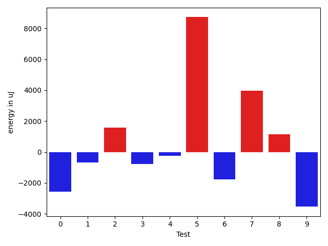
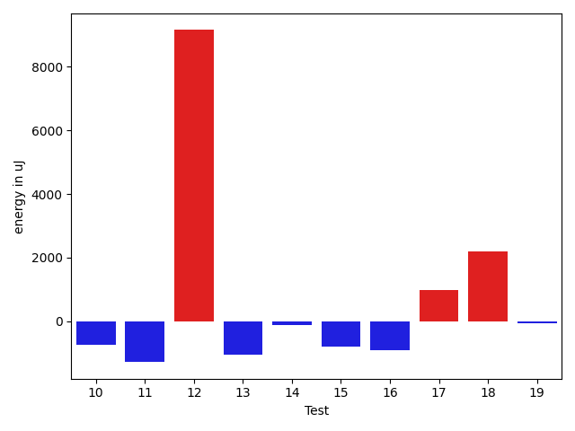
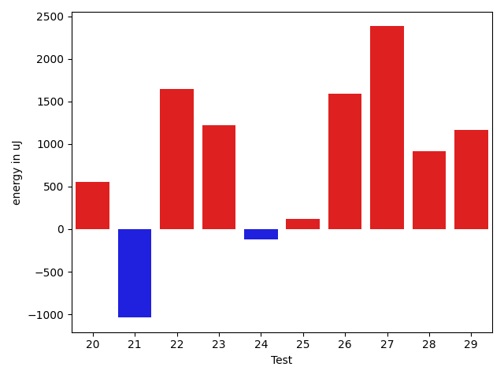
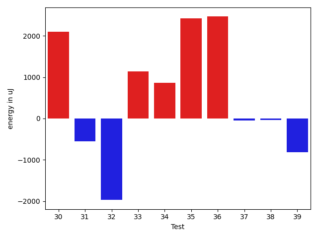
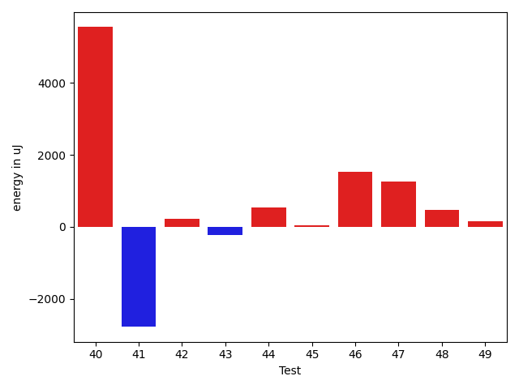
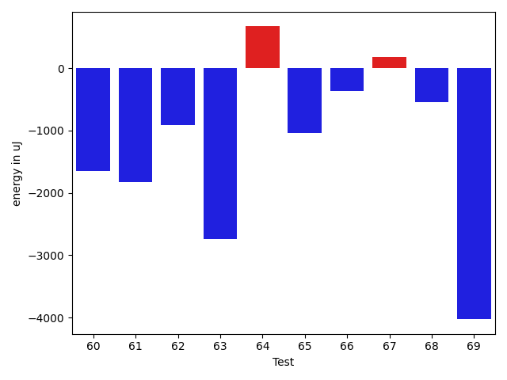
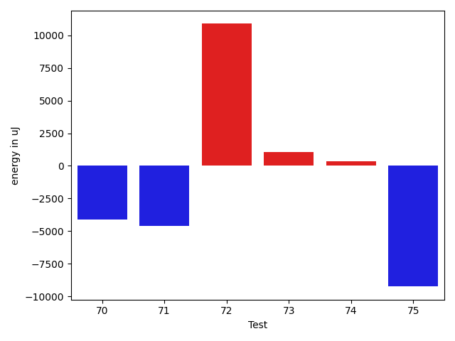

# gson 8380d2

https://github.com/google/gson/commit/8380d2

## Delta Energy per test method

| ID | EnergyV1 | EnergyV2 | DeltaEnergy | σV1 | σV2 |
| --- | --- | --- | --- | --- | --- |
| 0 | 39123 | 36560 | -2563 | 29204.141090258767 | 30082.175747696147 |
| 1 | 34851 | 34180 | -671 | 4120.163338991252 | 3959.6110548659167 |
| 2 | 35279 | 36865 | 1586 | 12827.65007049897 | 16434.969130947917 |
| 3 | 36377 | 35583 | -794 | 7115.9403872134135 | 7401.169653141108 |
| 4 | 37048 | 36804 | -244 | 12263.744903355544 | 14279.872669855424 |
| 5 | 79224 | 87952 | 8728 | 112418.8973818783 | 143819.7335337789 |
| 6 | 37903 | 36133 | -1770 | 12331.413445616516 | 13814.81907304013 |
| 7 | 71533 | 75500 | 3967 | 29753.25698336317 | 28512.199191705196 |
| 8 | 36438 | 37598 | 1160 | 13610.955443550525 | 17370.73983091162 |
| 9 | 41748 | 38207 | -3541 | 86683.12117343274 | 113629.72979011585 |
| 10 | 73609 | 72876 | -733 | 23045.257158019238 | 24851.132719933074 |
| 11 | 39978 | 38696 | -1282 | 19265.570071037724 | 18621.22788650832 |
| 12 | 83862 | 93017 | 9155 | 30853.955749870347 | 36299.05971762963 |
| 13 | 36682 | 35644 | -1038 | 15368.308980808935 | 13440.241942352499 |
| 14 | 36193 | 36071 | -122 | 8042.813332675695 | 11924.769988300804 |
| 15 | 37354 | 36560 | -794 | 4185.288875190441 | 3939.8810722845815 |
| 16 | 34607 | 33691 | -916 | 3316.5948893390037 | 5515.986287948736 |
| 17 | 34607 | 35584 | 977 | 3830.0210447601703 | 4447.2754569948 |
| 18 | 34058 | 36255 | 2197 | 4617.812958025273 | 3947.8539256175027 |
| 19 | 36438 | 36377 | -61 | 3822.297087631428 | 4310.024304790812 |
| 20 | 35888 | 36438 | 550 | 12117.358823766232 | 11028.391903665435 |
| 21 | 35095 | 34057 | -1038 | 3446.5699911391243 | 3905.81827212744 |
| 22 | 39734 | 41382 | 1648 | 20121.88431401694 | 24327.91002426652 |
| 23 | 36621 | 37842 | 1221 | 6076.750089529031 | 4169.876666290114 |
| 24 | 36255 | 36133 | -122 | 4242.328373397878 | 4494.452256354904 |
| 25 | 39490 | 39612 | 122 | 63764.482269631364 | 41772.134432191684 |
| 26 | 35828 | 37414 | 1586 | 3901.801662673764 | 4712.277386953959 |
| 27 | 34485 | 36865 | 2380 | 4015.6621977861673 | 3798.7469432549588 |
| 28 | 37353 | 38269 | 916 | 5279.665430322234 | 5880.647675757367 |
| 29 | 35217 | 36377 | 1160 | 4058.3452277375322 | 3686.2625070266026 |
| 30 | 34301 | 37170 | 2869 | 4428.391708426873 | 4426.757888142368 |
| 31 | 37292 | 36316 | -976 | 4102.578787307248 | 4549.201001647259 |
| 32 | 68664 | 51025 | -17639 | 46593.81754774409 | 49290.51978801703 |
| 33 | 39612 | 39428 | -184 | 18230.360301293582 | 18598.70392291801 |
| 34 | 38269 | 38696 | 427 | 4669.86733447536 | 4432.124421639005 |
| 35 | 39978 | 39002 | -976 | 29878.072462398384 | 35136.162010967695 |
| 36 | 87158 | 95032 | 7874 | 23818.442704630972 | 24571.446613355765 |
| 37 | 37903 | 38635 | 732 | 12628.38280867281 | 11883.511338146645 |
| 38 | 37536 | 37536 | 0 | 3805.291709653224 | 5954.617779140842 |
| 39 | 38513 | 37292 | -1221 | 3766.069222706683 | 4182.60213320264 |
| 40 | 38330 | 39306 | 976 | 21116.0124567495 | 24741.47209955909 |
| 41 | 39673 | 36133 | -3540 | 7348.234681090054 | 6373.05700013807 |
| 42 | 37171 | 37476 | 305 | 4464.631765341293 | 3573.879651140108 |
| 43 | 35888 | 34851 | -1037 | 2814.0684000320907 | 4184.688387046719 |
| 44 | 34485 | 34790 | 305 | 4003.7479909780054 | 4275.414894533628 |
| 45 | 36072 | 35217 | -855 | 3121.312494427596 | 4453.925355638552 |
| 46 | 35522 | 35461 | -61 | 6601.96983928195 | 8322.743157503137 |
| 47 | 36560 | 38147 | 1587 | 3904.5186798238974 | 3977.9579054325973 |
| 48 | 34851 | 35401 | 550 | 8800.058608075036 | 7654.82653706473 |
| 49 | 38635 | 39429 | 794 | 61609.03842399321 | 61113.65858895384 |
| 50 | 36376 | 36316 | -60 | 15998.477094407188 | 17895.232479386133 |
| 51 | 38758 | 40283 | 1525 | 117209.8832669748 | 92502.65543558975 |
| 52 | 36682 | 37476 | 794 | 3955.0255180161735 | 3353.806646246644 |
| 53 | 35400 | 34668 | -732 | 4106.948156100806 | 4030.6715785802994 |
| 54 | 37231 | 38330 | 1099 | 3680.985383545599 | 4021.5070955570764 |
| 55 | 36010 | 37536 | 1526 | 4216.855984342752 | 3907.8437755673754 |
| 56 | 36682 | 37963 | 1281 | 4103.7991180855815 | 6077.06435131306 |
| 57 | 36988 | 38208 | 1220 | 3485.5233939004174 | 4092.3110948941417 |
| 58 | 36011 | 35706 | -305 | 3542.9424430633053 | 3979.20888371984 |
| 59 | 35766 | 37719 | 1953 | 4150.391789630424 | 3839.4284066768223 |
| 60 | 73242 | 71594 | -1648 | 22785.196450467556 | 18335.393011774657 |
| 61 | 39856 | 38025 | -1831 | 7612.440901489354 | 4340.104370212303 |
| 62 | 38635 | 37719 | -916 | 8491.947583707492 | 35806.236912058615 |
| 63 | 39795 | 37049 | -2746 | 43175.36641074446 | 8205.605718943187 |
| 64 | 37659 | 38330 | 671 | 39958.188851990795 | 43858.94451242622 |
| 65 | 41137 | 40100 | -1037 | 748434.9981307118 | 576102.4737737547 |
| 66 | 41504 | 41138 | -366 | 69004.62068700639 | 66064.2316688478 |
| 67 | 39551 | 39733 | 182 | 20368.50901228393 | 16141.334936196845 |
| 68 | 38757 | 38208 | -549 | 4092.5682844655566 | 3634.6669214905396 |
| 69 | 43823 | 39795 | -4028 | 38256.79126659646 | 34817.40065921903 |
| 70 | 40833 | 37537 | -3296 | 19356.97365305503 | 23872.4533592688 |
| 71 | 39612 | 38513 | -1099 | 27607.933047793846 | 22401.71072685269 |
| 72 | 78613 | 76721 | -1892 | 158562.0273233794 | 148196.9777360936 |
| 73 | 37902 | 38635 | 733 | 4114.539793221108 | 5960.164734827571 |
| 74 | 38697 | 38696 | -1 | 4563.491600325141 | 3943.398360817578 |
| 75 | 39307 | 38696 | -611 | 49013.729435319285 | 39919.33401647641 |

## Delta Duration per test method

| ID | DurationV1 | DurationsV2 | DeltaDuration |
| --- | --- | --- | --- |
| 0 | 1496024.582278481 | 1417007.1805555555 | -79017.40172292548 |
| 1 | 1112270.453488372 | 1137222.3417721519 | 24951.888283779845 |
| 2 | 1466025.7113402062 | 1503070.7835051545 | 37045.07216494833 |
| 3 | 1159298.725 | 1196631.096385542 | 37332.37138554198 |
| 4 | 1338967.6875 | 1427223.388888889 | 88255.70138888899 |
| 5 | 3523864.8383838385 | 4478002.121212121 | 954137.2828282826 |
| 6 | 1394511.1666666667 | 1404535.3333333333 | 10024.166666666511 |
| 7 | 2467471.777777778 | 2618582.090909091 | 151110.31313131284 |
| 8 | 1552598.5757575757 | 1597779.5918367347 | 45181.01607915899 |
| 9 | 2592736.1222222224 | 3237339.755319149 | 644603.6330969264 |
| 10 | 2409501.777777778 | 2576418.4646464647 | 166916.6868686867 |
| 11 | 1552864.925531915 | 1666132.268041237 | 113267.3425093221 |
| 12 | 2845628.525252525 | 3052724.5757575757 | 207096.05050505046 |
| 13 | 1443855.663265306 | 1419069.2040816327 | -24786.459183673374 |
| 14 | 1259367.2736842106 | 1339367.425531915 | 80000.15184770431 |
| 15 | 891024.4629629629 | 934292.3606557377 | 43267.89769277477 |
| 16 | 907418.5645161291 | 993727.768115942 | 86309.20359981293 |
| 17 | 836003.4545454546 | 816791.0980392157 | -19212.356506238924 |
| 18 | 764457.0357142857 | 772188.4528301887 | 7731.417115902994 |
| 19 | 836332.2181818181 | 829145.7222222222 | -7186.4959595958935 |
| 20 | 1175274.7846153846 | 1155682.2166666666 | -19592.56794871809 |
| 21 | 853850.1186440678 | 861115.6842105263 | 7265.5655664585065 |
| 22 | 1254565.2459016393 | 1306312.566037736 | 51747.32013609656 |
| 23 | 1057796.493150685 | 1007753.4838709678 | -50043.009279717226 |
| 24 | 850653.3076923077 | 817118.8297872341 | -33534.47790507367 |
| 25 | 1929917.0 | 1496509.275 | -433407.7250000001 |
| 26 | 887296.2083333334 | 805107.8461538461 | -82188.36217948725 |
| 27 | 908511.1971830986 | 939261.5666666667 | 30750.369483568007 |
| 28 | 1083593.7323943663 | 1012094.4923076923 | -71499.24008667399 |
| 29 | 797221.3166666667 | 797502.0961538461 | 280.77948717947584 |
| 30 | 812038.3958333334 | 846997.1372549019 | 34958.74142156856 |
| 31 | 884699.754385965 | 867795.6545454545 | -16904.099840510404 |
| 32 | 2358939.3789473684 | 2493388.8969072164 | 134449.51795984805 |
| 33 | 1465001.9069767443 | 1509798.0 | 44796.0930232557 |
| 34 | 820739.14 | 815773.8787878788 | -4965.26121212123 |
| 35 | 1150557.1228070175 | 1240853.4285714286 | 90296.30576441111 |
| 36 | 2708943.292929293 | 2755817.757575758 | 46874.46464646468 |
| 37 | 1078604.2580645161 | 1050840.9523809524 | -27763.305683563696 |
| 38 | 909949.2666666667 | 941024.8596491228 | 31075.592982456088 |
| 39 | 916396.8064516129 | 923077.3382352941 | 6680.531783681246 |
| 40 | 1189132.0666666667 | 1461120.405063291 | 271988.33839662443 |
| 41 | 980310.8939393939 | 1046419.7704918033 | 66108.87655240938 |
| 42 | 892386.6304347826 | 832706.0666666667 | -59680.56376811594 |
| 43 | 814575.3076923077 | 814891.0 | 315.69230769225396 |
| 44 | 875839.7291666666 | 844174.14 | -31665.589166666614 |
| 45 | 776575.0192307692 | 800118.56 | 23543.540769230807 |
| 46 | 1185250.511627907 | 1177527.8720930233 | -7722.639534883667 |
| 47 | 901089.296875 | 918009.1666666666 | 16919.869791666628 |
| 48 | 1047745.7333333333 | 1047135.655737705 | -610.0775956283323 |
| 49 | 1929925.9253731344 | 1905777.9677419355 | -24147.957631198922 |
| 50 | 1553973.111111111 | 1535040.2323232323 | -18932.878787878668 |
| 51 | 2097082.322580645 | 2004668.4242424243 | -92413.89833822078 |
| 52 | 869203.3278688524 | 838144.8775510204 | -31058.45031783206 |
| 53 | 811350.1521739131 | 814332.35 | 2982.1978260868927 |
| 54 | 873670.7586206896 | 864200.0925925926 | -9470.666028097039 |
| 55 | 866118.6034482758 | 835659.9803921569 | -30458.62305611896 |
| 56 | 823210.7 | 795044.1 | -28166.599999999977 |
| 57 | 853147.1666666666 | 834242.2407407408 | -18904.92592592584 |
| 58 | 831466.1320754717 | 835848.7959183673 | 4382.66384289565 |
| 59 | 865775.4137931034 | 848843.6315789474 | -16931.782214156003 |
| 60 | 2212340.727272727 | 2228298.484848485 | 15957.757575757802 |
| 61 | 936167.5483870967 | 1020093.3125 | 83925.76411290327 |
| 62 | 931340.3559322034 | 1166947.6666666667 | 235607.3107344634 |
| 63 | 1005601.8571428572 | 787070.8536585366 | -218531.0034843206 |
| 64 | 1242193.5384615385 | 1219979.673076923 | -22213.865384615492 |
| 65 | 9196543.545454545 | 6770684.363636363 | -2425859.1818181816 |
| 66 | 1846294.9411764706 | 1768531.8846153845 | -77763.0565610861 |
| 67 | 1282602.810810811 | 1183853.6133333333 | -98749.1974774776 |
| 68 | 988984.5238095238 | 916674.0576923077 | -72310.46611721604 |
| 69 | 2068912.142857143 | 1842870.2580645161 | -226041.88479262684 |
| 70 | 1629320.2191780822 | 1355398.5652173914 | -273921.65396069083 |
| 71 | 1333506.9074074074 | 1000856.2727272727 | -332650.6346801347 |
| 72 | 3750056.707070707 | 4142110.767676768 | 392054.060606061 |
| 73 | 961989.725 | 1003509.8627450981 | 41520.137745098094 |
| 74 | 939876.340425532 | 890192.7111111111 | -49683.62931442086 |
| 75 | 1469348.530612245 | 1152437.1041666667 | -316911.4264455782 |

## Misc.

| ID | Test Class | Test Method |
| --- | --- | --- |
| 0 | com.google.gson.functional.DefaultTypeAdaptersTest | testTreeSetDeserialization |
| 1 | com.google.gson.functional.ParameterizedTypesTest | testParameterizedTypeGenericArraysSerialization |
| 2 | com.google.gson.functional.ParameterizedTypesTest | testVariableTypeArrayDeserialization |
| 3 | com.google.gson.functional.ParameterizedTypesTest | testParameterizedTypeWithReaderDeserialization |
| 4 | com.google.gson.functional.ParameterizedTypesTest | testParameterizedTypeWithCustomSerializer |
| 5 | com.google.gson.functional.ParameterizedTypesTest | testParameterizedTypesSerialization |
| 6 | com.google.gson.functional.ParameterizedTypesTest | testVariableTypeDeserialization |
| 7 | com.google.gson.functional.ParameterizedTypesTest | testVariableTypeFieldsAndGenericArraysSerialization |
| 8 | com.google.gson.functional.ParameterizedTypesTest | testParameterizedTypeGenericArraysDeserialization |
| 9 | com.google.gson.functional.ParameterizedTypesTest | testParameterizedTypeDeserialization |
| 10 | com.google.gson.functional.ParameterizedTypesTest | testVariableTypeFieldsAndGenericArraysDeserialization |
| 11 | com.google.gson.functional.ParameterizedTypesTest | testTypesWithMultipleParametersDeserialization |
| 12 | com.google.gson.functional.ParameterizedTypesTest | testTypesWithMultipleParametersSerialization |
| 13 | com.google.gson.functional.ParameterizedTypesTest | testParameterizedTypeWithVariableTypeDeserialization |
| 14 | com.google.gson.functional.ParameterizedTypesTest | testParameterizedTypesWithCustomDeserializer |
| 15 | com.google.gson.functional.ParameterizedTypesTest | testParameterizedTypesWithWriterSerialization |
| 16 | com.google.gson.functional.ParameterizedTypesTest | testDeepParameterizedTypeDeserialization |
| 17 | com.google.gson.functional.CollectionTest | testNullsInListDeserialization |
| 18 | com.google.gson.functional.CollectionTest | testCollectionOfStringsDeserialization |
| 19 | com.google.gson.functional.CollectionTest | testNullsInListSerialization |
| 20 | com.google.gson.functional.CollectionTest | testWildcardPrimitiveCollectionSerilaization |
| 21 | com.google.gson.functional.CollectionTest | testWildcardPrimitiveCollectionDeserilaization |
| 22 | com.google.gson.functional.CollectionTest | testTopLevelCollectionOfIntegersSerialization |
| 23 | com.google.gson.functional.CollectionTest | testLinkedListSerialization |
| 24 | com.google.gson.functional.CollectionTest | testQueueDeserialization |
| 25 | com.google.gson.functional.CollectionTest | testTopLevelCollectionOfIntegersDeserialization |
| 26 | com.google.gson.functional.CollectionTest | testLinkedListDeserialization |
| 27 | com.google.gson.functional.CollectionTest | testSetDeserialization |
| 28 | com.google.gson.functional.CollectionTest | testTopLevelListOfIntegerCollectionsDeserialization |
| 29 | com.google.gson.functional.CollectionTest | testCollectionOfObjectWithNullSerialization |
| 30 | com.google.gson.functional.CollectionTest | testCollectionOfObjectSerialization |
| 31 | com.google.gson.functional.CollectionTest | testQueueSerialization |
| 32 | com.google.gson.functional.InheritanceTest | testSubInterfacesOfCollectionSerialization |
| 33 | com.google.gson.functional.InheritanceTest | testSubInterfacesOfCollectionDeserialization |
| 34 | com.google.gson.ParameterizedTypeHandlerMapTest | testHasSpecificType |
| 35 | com.google.gson.ParameterizedTypeHandlerMapTest | testHasGenericButNotSpecific |
| 36 | com.google.gson.functional.ObjectTest | testSingletonLists |
| 37 | com.google.gson.functional.ObjectTest | testTruncatedDeserialization |
| 38 | com.google.gson.functional.CustomTypeAdaptersTest | testCustomAdapterInvokedForMapElementSerializationWithType |
| 39 | com.google.gson.functional.CustomTypeAdaptersTest | testCustomAdapterInvokedForMapElementDeserialization |
| 40 | com.google.gson.functional.CustomTypeAdaptersTest | testCustomAdapterInvokedForCollectionElementSerializationWithType |
| 41 | com.google.gson.functional.CustomTypeAdaptersTest | testCustomAdapterInvokedForCollectionElementDeserialization |
| 42 | com.google.gson.functional.MapTest | testMapSerializationEmpty |
| 43 | com.google.gson.functional.MapTest | testMapOfMapDeserialization |
| 44 | com.google.gson.functional.MapTest | testMapStandardSubclassDeserialization |
| 45 | com.google.gson.functional.MapTest | testReadMapsWithEmptyStringKey |
| 46 | com.google.gson.functional.MapTest | testParameterizedMapSubclassDeserialization |
| 47 | com.google.gson.functional.MapTest | testMapSerializationWithNullValueButSerializeNulls |
| 48 | com.google.gson.functional.MapTest | testMapSerializationWithWildcardValues |
| 49 | com.google.gson.functional.MapTest | testMapDeserialization |
| 50 | com.google.gson.functional.MapTest | testParameterizedMapSubclassSerialization |
| 51 | com.google.gson.functional.MapTest | testMapSerialization |
| 52 | com.google.gson.functional.MapTest | testMapDeserializationWithNullValue |
| 53 | com.google.gson.functional.MapTest | testMapDeserializationWithWildcardValues |
| 54 | com.google.gson.functional.MapTest | testMapDeserializationEmpty |
| 55 | com.google.gson.functional.MapTest | testMapSerializationWithNullValue |
| 56 | com.google.gson.functional.MapTest | testMapSerializationWithIntegerKeys |
| 57 | com.google.gson.functional.MapTest | testMapSerializationWithNullKey |
| 58 | com.google.gson.functional.MapTest | testMapDeserializationWithIntegerKeys |
| 59 | com.google.gson.functional.MapTest | testMapDeserializationWithNullKey |
| 60 | com.google.gson.functional.EnumTest | testEnumSubclass |
| 61 | com.google.gson.functional.EnumTest | testCollectionOfEnumsDeserialization |
| 62 | com.google.gson.functional.EnumTest | testCollectionOfEnumsSerialization |
| 63 | com.google.gson.reflect.TypeTokenTest | testIsAssignableFromWithNestedWildcards |
| 64 | com.google.gson.reflect.TypeTokenTest | testIsAssignableFromWithTypeParameters |
| 65 | com.google.gson.CommentsTest | testParseComments |
| 66 | com.google.gson.FieldAttributesTest | testDeclaredTypeAndClass |
| 67 | com.google.gson.functional.ArrayTest | testArrayOfCollectionSerialization |
| 68 | com.google.gson.functional.ArrayTest | testArrayOfCollectionDeserialization |
| 69 | com.google.gson.MixedStreamTest | testWriteHtmlSafe |
| 70 | com.google.gson.MixedStreamTest | testWriteLenient |
| 71 | com.google.gson.MixedStreamTest | testReadClosed |
| 72 | com.google.gson.functional.PrettyPrintingTest | testPrettyPrintList |
| 73 | com.google.gson.ParameterizedTypeImplTest | testNotEquals |
| 74 | com.google.gson.GenericArrayTypeImplTest | testNotEquals |
| 75 | com.google.gson.DefaultMapJsonSerializerTest | testEmptyMapSerialization |

| Test | IterationV1 | IterationV2 | DeltaIteration |
| --- | --- | --- | --- |
| 0 | 79 | 72 | -7 |
| 1 | 86 | 79 | -7 |
| 2 | 97 | 97 | 0 |
| 3 | 80 | 83 | 3 |
| 4 | 96 | 90 | -6 |
| 5 | 99 | 99 | 0 |
| 6 | 96 | 96 | 0 |
| 7 | 99 | 99 | 0 |
| 8 | 99 | 98 | -1 |
| 9 | 90 | 94 | 4 |
| 10 | 99 | 99 | 0 |
| 11 | 94 | 97 | 3 |
| 12 | 99 | 99 | 0 |
| 13 | 98 | 98 | 0 |
| 14 | 95 | 94 | -1 |
| 15 | 54 | 61 | 7 |
| 16 | 62 | 69 | 7 |
| 17 | 55 | 51 | -4 |
| 18 | 56 | 53 | -3 |
| 19 | 55 | 54 | -1 |
| 20 | 65 | 60 | -5 |
| 21 | 59 | 57 | -2 |
| 22 | 61 | 53 | -8 |
| 23 | 73 | 62 | -11 |
| 24 | 52 | 47 | -5 |
| 25 | 74 | 80 | 6 |
| 26 | 48 | 52 | 4 |
| 27 | 71 | 60 | -11 |
| 28 | 71 | 65 | -6 |
| 29 | 60 | 52 | -8 |
| 30 | 48 | 51 | 3 |
| 31 | 57 | 55 | -2 |
| 32 | 95 | 97 | 2 |
| 33 | 86 | 91 | 5 |
| 34 | 50 | 33 | -17 |
| 35 | 57 | 56 | -1 |
| 36 | 99 | 99 | 0 |
| 37 | 62 | 63 | 1 |
| 38 | 60 | 57 | -3 |
| 39 | 62 | 68 | 6 |
| 40 | 75 | 79 | 4 |
| 41 | 66 | 61 | -5 |
| 42 | 46 | 60 | 14 |
| 43 | 52 | 56 | 4 |
| 44 | 48 | 50 | 2 |
| 45 | 52 | 50 | -2 |
| 46 | 86 | 86 | 0 |
| 47 | 64 | 54 | -10 |
| 48 | 60 | 61 | 1 |
| 49 | 67 | 62 | -5 |
| 50 | 99 | 99 | 0 |
| 51 | 62 | 66 | 4 |
| 52 | 61 | 49 | -12 |
| 53 | 46 | 40 | -6 |
| 54 | 58 | 54 | -4 |
| 55 | 58 | 51 | -7 |
| 56 | 50 | 50 | 0 |
| 57 | 48 | 54 | 6 |
| 58 | 53 | 49 | -4 |
| 59 | 58 | 57 | -1 |
| 60 | 99 | 99 | 0 |
| 61 | 62 | 64 | 2 |
| 62 | 59 | 54 | -5 |
| 63 | 35 | 41 | 6 |
| 64 | 52 | 52 | 0 |
| 65 | 88 | 88 | 0 |
| 66 | 51 | 52 | 1 |
| 67 | 74 | 75 | 1 |
| 68 | 63 | 52 | -11 |
| 69 | 98 | 93 | -5 |
| 70 | 73 | 69 | -4 |
| 71 | 54 | 55 | 1 |
| 72 | 99 | 99 | 0 |
| 73 | 40 | 51 | 11 |
| 74 | 47 | 45 | -2 |
| 75 | 49 | 48 | -1 |

| Time Label | Time (s) |
| --- | --- |
| Selection | 26.165396451950073 |
| Injection | 12.40289044380188 |
| Total | 1034.102035522461 |

