# gson 1c5f51

https://github.com/google/gson/commit/1c5f51

## Delta Energy per test method

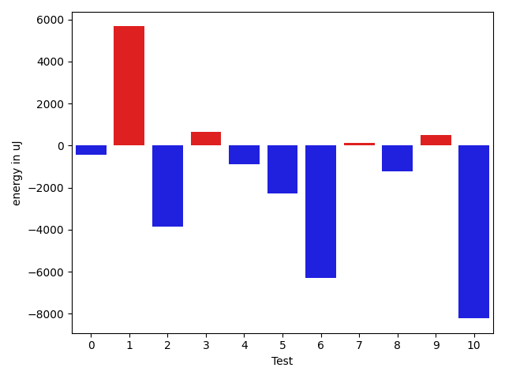

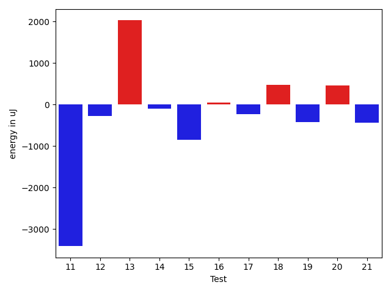

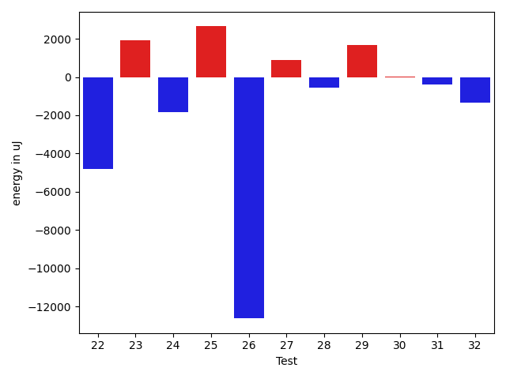

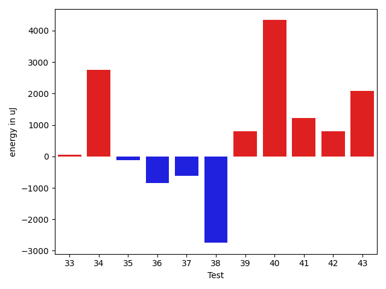

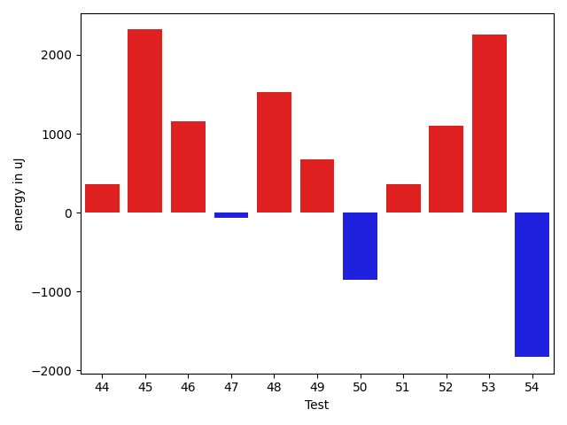

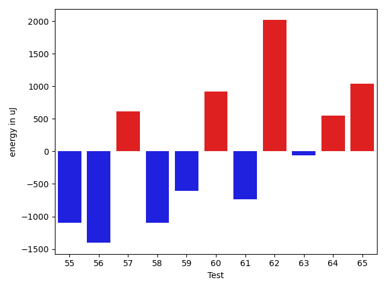

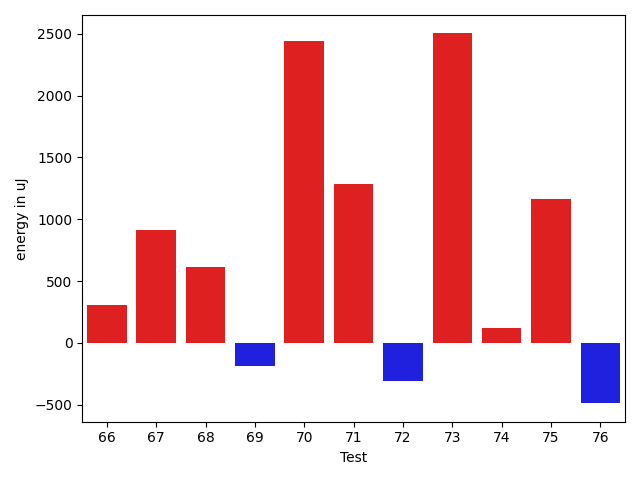

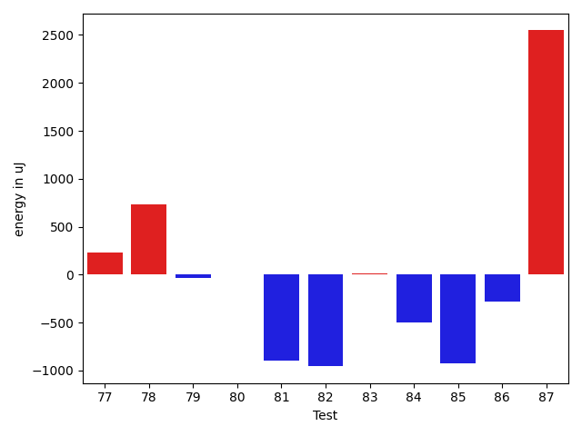

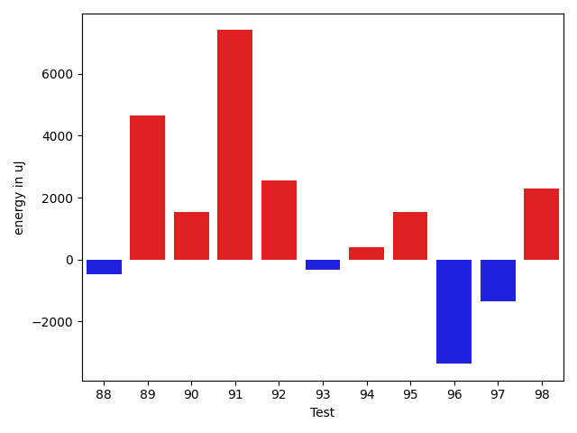

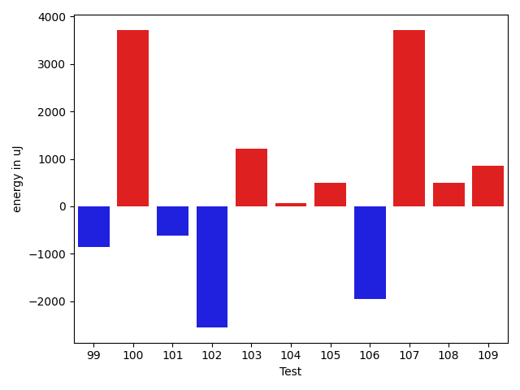

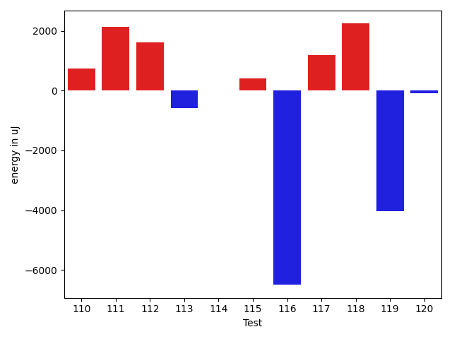

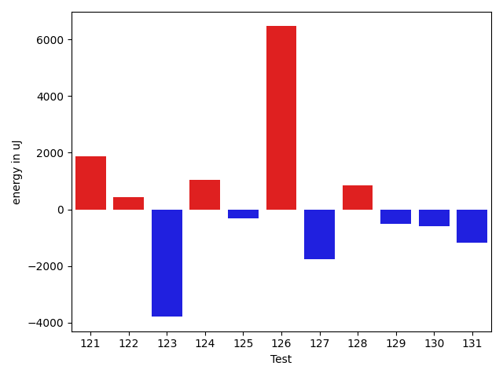

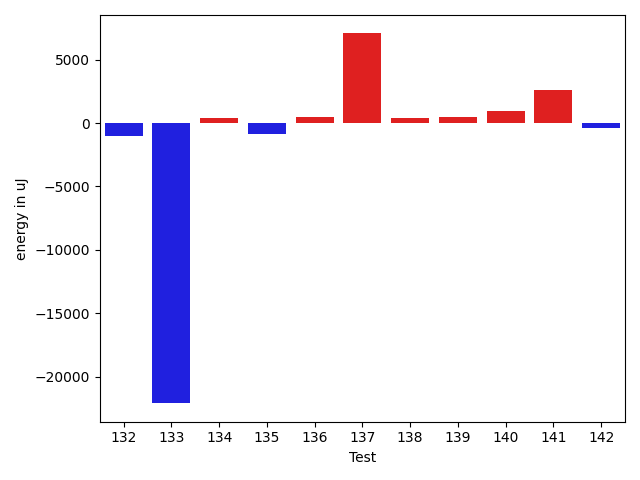

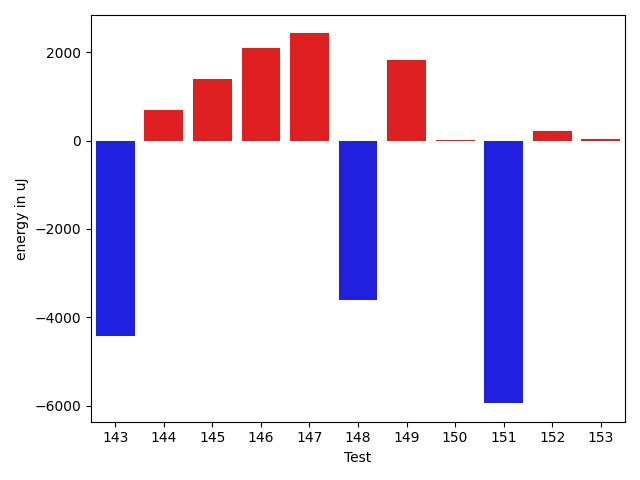

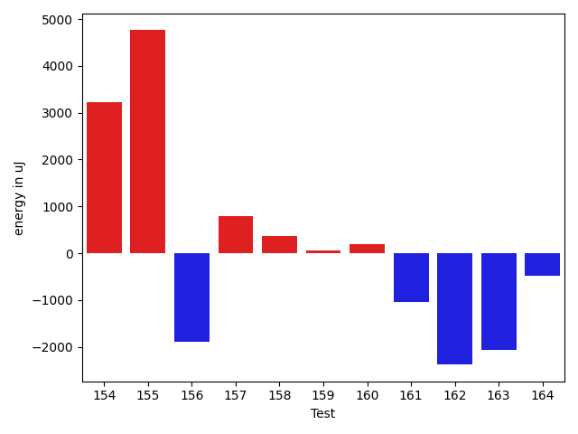

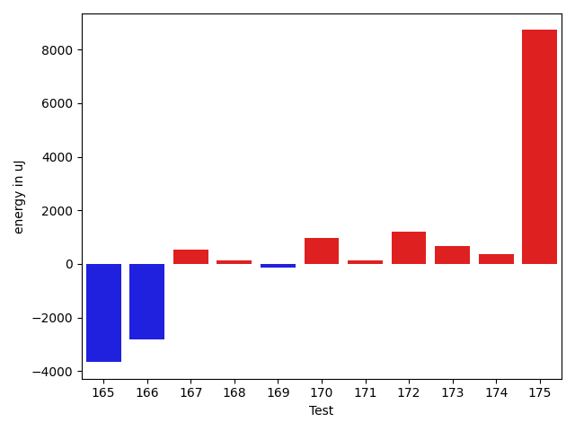

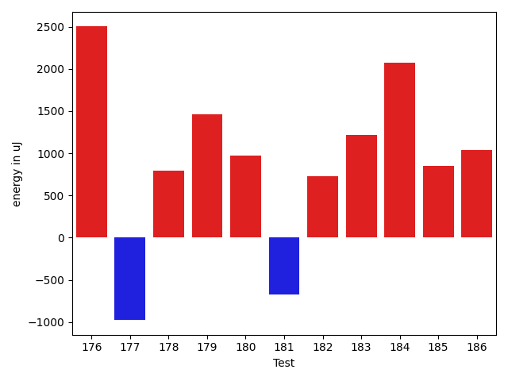

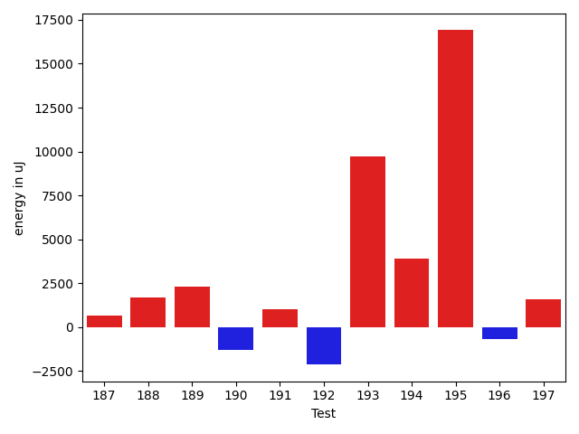

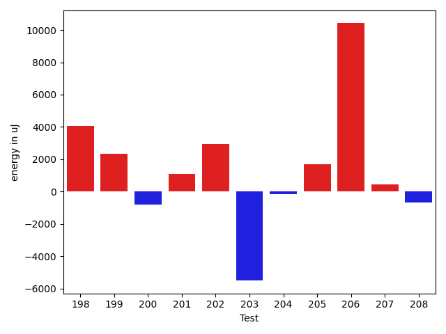

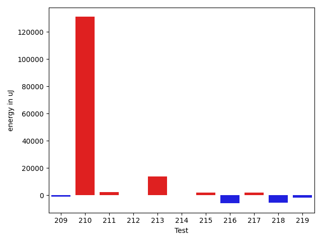

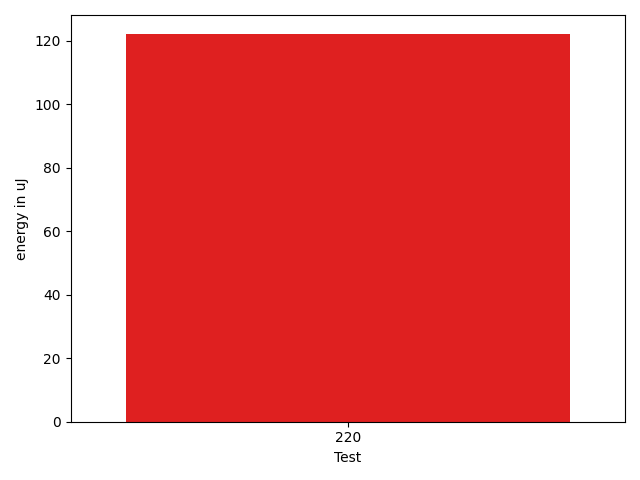

| ID | EnergyV1 | EnergyV2 | DeltaEnergy | σV1 | σV2 |
| --- | --- | --- | --- | --- | --- |
| 0 | 37658 | 37415 | -243 | 3609.73142927512 | 3932.465457748979 |
| 1 | 44434 | 49255 | 4821 | 53354.61400143687 | 68141.03233883395 |
| 2 | 36621 | 36560 | -61 | 25318.299898564717 | 4935.070264435489 |
| 3 | 37170 | 37170 | 0 | 7035.277210672079 | 9174.520902746803 |
| 4 | 36926 | 36927 | 1 | 10356.866775557428 | 9918.887688111758 |
| 5 | 36987 | 36072 | -915 | 9232.56264134074 | 5398.550073468578 |
| 6 | 41870 | 38452 | -3418 | 32202.366923645295 | 29661.838048106012 |
| 7 | 37170 | 36072 | -1098 | 4173.551089664828 | 6410.307094592441 |
| 8 | 36743 | 34973 | -1770 | 4479.3905968465215 | 5888.57615169584 |
| 9 | 36682 | 38757 | 2075 | 4223.452512459445 | 4943.536655555408 |
| 10 | 38696 | 40161 | 1465 | 54661.99671665091 | 29505.332039101 |
| 11 | 39429 | 38208 | -1221 | 23107.94473218248 | 18967.76467423046 |
| 12 | 37842 | 36682 | -1160 | 2825.485009032316 | 3970.1291987635973 |
| 13 | 36438 | 39856 | 3418 | 2317.2325740997894 | 4178.539315190626 |
| 14 | 36438 | 37415 | 977 | 4190.24763209956 | 3636.7444159003207 |
| 15 | 37476 | 36743 | -733 | 5452.907744929372 | 4447.07011596752 |
| 16 | 38452 | 37475 | -977 | 26458.08964129534 | 29832.446923583822 |
| 17 | 37109 | 36499 | -610 | 6463.267716126985 | 3467.6252001949833 |
| 18 | 37109 | 36743 | -366 | 4280.868148079223 | 5702.8746554951485 |
| 19 | 37292 | 36072 | -1220 | 5116.5155406228205 | 7538.4542117979045 |
| 20 | 37353 | 37903 | 550 | 4032.6636864836655 | 4120.177228598514 |
| 21 | 35644 | 34546 | -1098 | 3583.81928778503 | 2754.2215042865664 |
| 22 | 38025 | 38086 | 61 | 16169.28710892419 | 11620.259343699854 |
| 23 | 33447 | 36987 | 3540 | 4133.056828789075 | 3920.2083978601263 |
| 24 | 37231 | 36132 | -1099 | 3377.884753806737 | 4497.768020737324 |
| 25 | 35340 | 38940 | 3600 | 4632.89975429356 | 4860.466780613132 |
| 26 | 40527 | 39490 | -1037 | 47544.873373334376 | 38160.34970841478 |
| 27 | 37048 | 38025 | 977 | 4905.711220240026 | 4854.035306377114 |
| 28 | 35583 | 35340 | -243 | 5199.863123198533 | 3855.792319319367 |
| 29 | 34180 | 37353 | 3173 | 3969.15034103674 | 3461.679541422054 |
| 30 | 36438 | 36682 | 244 | 4516.578981313672 | 3337.4633292251924 |
| 31 | 36682 | 35644 | -1038 | 3600.7139625357636 | 4174.328391569254 |
| 32 | 39246 | 36194 | -3052 | 3435.66277266847 | 3909.0019790506913 |
| 33 | 37781 | 37841 | 60 | 18286.604984008995 | 25399.483689013636 |
| 34 | 64697 | 67444 | 2747 | 21698.43058914717 | 22279.162749756088 |
| 35 | 36499 | 36377 | -122 | 4012.6809765330504 | 4263.60162285356 |
| 36 | 35339 | 34484 | -855 | 3692.692622060548 | 3332.516153999357 |
| 37 | 38391 | 37780 | -611 | 29358.44900787182 | 21274.32966787708 |
| 38 | 37902 | 35156 | -2746 | 3349.157793982554 | 42352.08893308045 |
| 39 | 38330 | 39123 | 793 | 28192.59468696248 | 15761.358671975864 |
| 40 | 33752 | 38086 | 4334 | 4339.299561155054 | 4149.507923838681 |
| 41 | 34912 | 36133 | 1221 | 4569.156168264642 | 3768.628982009293 |
| 42 | 35461 | 36255 | 794 | 12548.67633571552 | 9072.703309472648 |
| 43 | 35950 | 38025 | 2075 | 4516.087221871999 | 4106.083965153281 |
| 44 | 35217 | 35583 | 366 | 4534.701230511223 | 4230.409121922249 |
| 45 | 35461 | 37781 | 2320 | 3566.4327649160396 | 4296.542728694913 |
| 46 | 36498 | 37659 | 1161 | 5469.2893580740865 | 5644.529221603419 |
| 47 | 39856 | 39794 | -62 | 176237.86236714633 | 78091.88080933894 |
| 48 | 34912 | 36438 | 1526 | 3885.6877948297506 | 13765.51823652128 |
| 49 | 36255 | 36926 | 671 | 3662.91268715658 | 29868.77289051949 |
| 50 | 36499 | 35645 | -854 | 4887.1377850017525 | 6856.038633097134 |
| 51 | 36682 | 37048 | 366 | 4385.010227052842 | 4478.8493796460225 |
| 52 | 35583 | 36682 | 1099 | 3565.535966568585 | 3834.4480620889854 |
| 53 | 34790 | 37048 | 2258 | 4466.2285904871915 | 3314.8863116144075 |
| 54 | 39245 | 37415 | -1830 | 4435.492617356125 | 4026.367263461016 |
| 55 | 37231 | 36133 | -1098 | 4631.97131783609 | 3658.3477465072947 |
| 56 | 36987 | 35583 | -1404 | 4859.528592424327 | 4083.5317510863288 |
| 57 | 36743 | 37353 | 610 | 4162.528415019048 | 28861.592676818662 |
| 58 | 37720 | 36621 | -1099 | 5069.445692843601 | 5731.105974171204 |
| 59 | 68115 | 67505 | -610 | 100160.59502962072 | 69507.05319773991 |
| 60 | 36194 | 37109 | 915 | 3148.8392581090397 | 4077.8209305797322 |
| 61 | 36377 | 35645 | -732 | 4435.896310851375 | 3817.051385645883 |
| 62 | 36438 | 38452 | 2014 | 4364.811751803828 | 23427.39287837987 |
| 63 | 37048 | 36987 | -61 | 31547.64017223068 | 3403.1493059478203 |
| 64 | 37109 | 37658 | 549 | 3714.0016269581806 | 2981.3569709040803 |
| 65 | 36804 | 37842 | 1038 | 3766.1554738650384 | 3737.958324308247 |
| 66 | 36560 | 36865 | 305 | 2957.6963690584043 | 4359.657814890835 |
| 67 | 35828 | 36743 | 915 | 10322.130170996525 | 11006.073513191604 |
| 68 | 37597 | 38208 | 611 | 68480.50920132175 | 69947.28577430818 |
| 69 | 37598 | 37415 | -183 | 76714.37038445545 | 25319.48851059049 |
| 70 | 62866 | 65308 | 2442 | 26648.064821742722 | 23121.36703136389 |
| 71 | 35888 | 37170 | 1282 | 12262.593746222698 | 26289.82004303592 |
| 72 | 38452 | 38147 | -305 | 15756.372195003349 | 15902.099362150217 |
| 73 | 34973 | 37475 | 2502 | 93507.6907832662 | 6154.9087709512505 |
| 74 | 38147 | 38269 | 122 | 12967.136242857681 | 13055.026686096346 |
| 75 | 36438 | 37598 | 1160 | 7227.366758189251 | 5722.320456933894 |
| 76 | 36987 | 36499 | -488 | 10308.162629052264 | 6597.580949411868 |
| 77 | 36255 | 36987 | 732 | 4051.556989655713 | 3577.8860068615563 |
| 78 | 34485 | 36132 | 1647 | 4037.258194032946 | 4613.574668543062 |
| 79 | 38207 | 39307 | 1100 | 30513.161670156955 | 29093.535685808085 |
| 80 | 37293 | 36438 | -855 | 4180.376954294911 | 4018.6083851457674 |
| 81 | 37171 | 37354 | 183 | 3867.0721773522764 | 3197.347678762648 |
| 82 | 37598 | 36743 | -855 | 4397.664739981827 | 2845.5408418296884 |
| 83 | 36132 | 37110 | 978 | 3642.543113137546 | 3247.9787037369347 |
| 84 | 35705 | 35950 | 245 | 3789.464984105913 | 3342.905139619034 |
| 85 | 39429 | 39245 | -184 | 49940.02078123816 | 39400.08581737341 |
| 86 | 35339 | 35340 | 1 | 4699.59638353798 | 3719.182682796738 |
| 87 | 65917 | 71106 | 5189 | 24309.514279311956 | 20059.352567355894 |
| 88 | 37232 | 37232 | 0 | 7210.1430205809465 | 6612.505384389379 |
| 89 | 38147 | 39246 | 1099 | 26035.476402045755 | 32533.726233913374 |
| 90 | 37841 | 37902 | 61 | 3510.7815584341993 | 8735.182757129556 |
| 91 | 35522 | 36683 | 1161 | 4814.906443427216 | 33039.22358372593 |
| 92 | 41687 | 45410 | 3723 | 255291.43819552512 | 249366.03801262163 |
| 93 | 35156 | 35889 | 733 | 4755.859295531029 | 4323.040278553972 |
| 94 | 36194 | 36254 | 60 | 2481.5661381341192 | 4293.072347817324 |
| 95 | 33691 | 35706 | 2015 | 3332.239914478762 | 3872.3850421840234 |
| 96 | 35583 | 36743 | 1160 | 25839.95951383567 | 3905.378025690433 |
| 97 | 37110 | 35644 | -1466 | 3274.3496115541493 | 3754.1460012028174 |
| 98 | 34790 | 36072 | 1282 | 2873.233256716203 | 4097.3010660189475 |
| 99 | 37659 | 36804 | -855 | 26312.610121950125 | 4661.439503727746 |
| 100 | 36072 | 39795 | 3723 | 15520.842982543081 | 19020.493822453718 |
| 101 | 36255 | 35644 | -611 | 12698.984701288158 | 12784.268204980104 |
| 102 | 36071 | 33508 | -2563 | 3560.586776367611 | 4009.9511591838345 |
| 103 | 33874 | 35095 | 1221 | 3217.6804509421067 | 3464.4259852138266 |
| 104 | 35096 | 35156 | 60 | 3942.1448209751015 | 4280.826485845979 |
| 105 | 34363 | 34851 | 488 | 3632.3661548359532 | 4036.3797279060896 |
| 106 | 38513 | 36560 | -1953 | 4225.802669389247 | 3148.137385114499 |
| 107 | 33447 | 37170 | 3723 | 4443.161591974566 | 9272.071764363465 |
| 108 | 36193 | 36682 | 489 | 29198.8314903841 | 4145.35656582775 |
| 109 | 34363 | 35217 | 854 | 4831.193981532643 | 3886.0807427135233 |
| 110 | 33692 | 35156 | 1464 | 3316.9674267370483 | 3695.7521787407045 |
| 111 | 34546 | 35828 | 1282 | 4105.032363689569 | 4342.470887607909 |
| 112 | 34546 | 36132 | 1586 | 3773.831789956846 | 3486.055465591974 |
| 113 | 34790 | 34729 | -61 | 4118.9304185928995 | 4021.459500673301 |
| 114 | 36865 | 36560 | -305 | 3240.1098823321995 | 4131.997643507503 |
| 115 | 35400 | 35217 | -183 | 3343.066272845535 | 3802.892588989663 |
| 116 | 34912 | 34302 | -610 | 36739.65207671098 | 3329.010093105757 |
| 117 | 36744 | 37353 | 609 | 4355.243891606061 | 3901.3395077372306 |
| 118 | 35279 | 37476 | 2197 | 3670.350506423058 | 3154.400912982128 |
| 119 | 35339 | 36438 | 1099 | 23320.00176912991 | 4647.342862467945 |
| 120 | 36560 | 34485 | -2075 | 2953.6309899327907 | 3917.756557812263 |
| 121 | 34607 | 35461 | 854 | 4051.340447033472 | 4660.129914948359 |
| 122 | 34729 | 35950 | 1221 | 3674.8949098769417 | 4010.2702408745836 |
| 123 | 40466 | 38818 | -1648 | 110466.52379167575 | 109619.37255394374 |
| 124 | 35156 | 35400 | 244 | 3950.2371316317053 | 4062.9712342077933 |
| 125 | 36926 | 34607 | -2319 | 4238.6322886718335 | 4439.972243555775 |
| 126 | 36133 | 35584 | -549 | 2592.810814540853 | 37071.43845129391 |
| 127 | 36377 | 34729 | -1648 | 4516.71698926456 | 3473.052459689474 |
| 128 | 35889 | 35888 | -1 | 3697.7758626745494 | 3761.8022276563133 |
| 129 | 36865 | 36682 | -183 | 5049.955968516025 | 4265.393456677889 |
| 130 | 37720 | 36377 | -1343 | 3321.093838485096 | 4509.063388855694 |
| 131 | 35584 | 37842 | 2258 | 77796.57687010785 | 61135.159971560264 |
| 132 | 36621 | 36255 | -366 | 10461.67009565449 | 3448.0631955423205 |
| 133 | 37964 | 36865 | -1099 | 75778.47682188083 | 10524.557553893437 |
| 134 | 36926 | 37903 | 977 | 4097.357689345509 | 4245.044351420218 |
| 135 | 36743 | 37110 | 367 | 4413.513432910637 | 3939.398011117942 |
| 136 | 37903 | 37781 | -122 | 29525.502067591213 | 37952.448702606096 |
| 137 | 37109 | 39917 | 2808 | 16290.486422528658 | 20462.878226091292 |
| 138 | 37170 | 37537 | 367 | 4968.369137720913 | 4574.325658007956 |
| 139 | 36499 | 36072 | -427 | 3007.4237387463377 | 4347.542655197926 |
| 140 | 36132 | 37597 | 1465 | 3692.096990860296 | 4711.754153068717 |
| 141 | 35095 | 36988 | 1893 | 3950.938769036836 | 7559.767672985177 |
| 142 | 36926 | 36255 | -671 | 4062.2559136058553 | 4352.756769496775 |
| 143 | 35767 | 38025 | 2258 | 34859.723641579316 | 3870.66423232176 |
| 144 | 36072 | 36377 | 305 | 3820.87857564772 | 3907.8028516299137 |
| 145 | 36987 | 38330 | 1343 | 3856.873521534134 | 4194.75347186634 |
| 146 | 36866 | 39734 | 2868 | 37261.92796053928 | 38759.099734383766 |
| 147 | 37475 | 37963 | 488 | 10079.699525007842 | 12239.08936641312 |
| 148 | 37109 | 36560 | -549 | 25001.665907066286 | 3785.829399408617 |
| 149 | 35645 | 36987 | 1342 | 2653.401325762003 | 3500.6449856498666 |
| 150 | 36499 | 36011 | -488 | 3732.2419148775225 | 3669.296047335674 |
| 151 | 37903 | 35767 | -2136 | 26702.005323089237 | 3821.3355433618935 |
| 152 | 36010 | 35706 | -304 | 2909.224876560765 | 3077.297748608956 |
| 153 | 38086 | 35278 | -2808 | 4038.5524894447017 | 4812.489106265475 |
| 154 | 36988 | 40223 | 3235 | 54032.649964397955 | 49856.52922511044 |
| 155 | 34423 | 39184 | 4761 | 3622.624828422066 | 3916.589212788136 |
| 156 | 39795 | 37903 | -1892 | 4269.169820106549 | 4322.689896060091 |
| 157 | 39368 | 40161 | 793 | 4369.90378174719 | 3640.3388578537574 |
| 158 | 35339 | 35706 | 367 | 6955.370954373869 | 3638.5662272273744 |
| 159 | 38025 | 38086 | 61 | 4106.889268954743 | 3865.438550475224 |
| 160 | 38024 | 38208 | 184 | 31701.96435058797 | 4267.8727726850675 |
| 161 | 38635 | 37597 | -1038 | 4659.288613320946 | 4005.6932296420305 |
| 162 | 39123 | 36743 | -2380 | 4357.853778588212 | 3262.9740253333307 |
| 163 | 38940 | 36865 | -2075 | 3620.3509976267005 | 4058.5191526247877 |
| 164 | 36682 | 36193 | -489 | 3875.2974155762026 | 3786.6639156356778 |
| 165 | 39611 | 35950 | -3661 | 3497.837629618591 | 2634.618817386145 |
| 166 | 38269 | 35461 | -2808 | 3963.3589364271456 | 4100.033797286174 |
| 167 | 36377 | 36926 | 549 | 34715.00930727446 | 4283.950114790243 |
| 168 | 37048 | 37171 | 123 | 5008.9702942105805 | 2958.998001613674 |
| 169 | 38940 | 38818 | -122 | 26819.51547554859 | 31108.238255697866 |
| 170 | 38391 | 39368 | 977 | 425071.7885275246 | 430357.1796423562 |
| 171 | 38025 | 38147 | 122 | 10991.381113144971 | 25994.89479387466 |
| 172 | 37048 | 38269 | 1221 | 31403.24293148307 | 56713.89221182239 |
| 173 | 36499 | 37171 | 672 | 3920.4548938056314 | 4607.51738577591 |
| 174 | 37780 | 38147 | 367 | 68417.24819061505 | 125590.29384552008 |
| 175 | 106323 | 115051 | 8728 | 18780.972737237047 | 24283.98975203437 |
| 176 | 35156 | 37658 | 2502 | 2991.4879563091035 | 31704.6754391845 |
| 177 | 36987 | 36010 | -977 | 29560.755358145572 | 22533.029294650954 |
| 178 | 36254 | 37048 | 794 | 5656.131008357483 | 3940.2127724838624 |
| 179 | 36011 | 37475 | 1464 | 2904.356921150106 | 3098.978988418791 |
| 180 | 35035 | 36011 | 976 | 3237.7390100773323 | 2816.912382958314 |
| 181 | 36255 | 35583 | -672 | 4281.499221943173 | 5075.1356266418015 |
| 182 | 35462 | 36193 | 731 | 4034.1556630328787 | 4148.940349313384 |
| 183 | 37720 | 38941 | 1221 | 16765.037031651704 | 38706.57078434074 |
| 184 | 35034 | 37110 | 2076 | 3138.248461298801 | 3336.3238017314807 |
| 185 | 35462 | 36315 | 853 | 3517.1932972186787 | 3520.6416772035723 |
| 186 | 35217 | 36255 | 1038 | 2987.08323833255 | 3473.828801183293 |
| 187 | 34851 | 35523 | 672 | 3168.1639529425584 | 4220.506122712661 |
| 188 | 36682 | 38391 | 1709 | 4397.225297963067 | 3701.293625765488 |
| 189 | 35766 | 38086 | 2320 | 2786.541735835937 | 3411.184495288939 |
| 190 | 35400 | 34119 | -1281 | 2575.407281706462 | 0.0 |
| 191 | 37171 | 38208 | 1037 | 36781.922366912186 | 27637.870801027097 |
| 192 | 35034 | 32898 | -2136 | 2213.150207283726 | 0.0 |
| 193 | 83069 | 92773 | 9704 | 12415.089873214773 | 15320.0 |
| 194 | 31067 | 34973 | 3906 | 0.0 | 0.0 |
| 195 | 358093 | 374999 | 16906 | 120943.87752671998 | 108298.41063814129 |
| 196 | 39490 | 38818 | -672 | 37556.16349709007 | 36852.377859036984 |
| 197 | 37415 | 39002 | 1587 | 41539.76955213324 | 42419.34410475456 |
| 198 | 62133 | 68237 | 6104 | 24951.929856042458 | 24742.39974988118 |
| 199 | 39368 | 41137 | 1769 | 39502.0558258224 | 46911.85312809501 |
| 200 | 37597 | 38574 | 977 | 2925.639665098899 | 3459.172168705503 |
| 201 | 38330 | 38269 | -61 | 4444.875569434436 | 4166.627047473894 |
| 202 | 35523 | 40771 | 5248 | 4073.890776640925 | 3594.145955290213 |
| 203 | 40283 | 38818 | -1465 | 93776.29720675689 | 104689.50139742813 |
| 204 | 36804 | 36438 | -366 | 3771.5651932480782 | 3403.00901547072 |
| 205 | 39490 | 38880 | -610 | 8147.845097791194 | 10158.912660044556 |
| 206 | 39795 | 40466 | 671 | 28556.89522005806 | 40653.947140823715 |
| 207 | 36865 | 37109 | 244 | 4727.602656844095 | 4250.968384921253 |
| 208 | 37780 | 36926 | -854 | 3737.935846933738 | 4164.464259666284 |
| 209 | 38574 | 37781 | -793 | 4641.247891948137 | 4145.860538004858 |
| 210 | 40100 | 44861 | 4761 | 51796.76426867203 | 533148.3785750698 |
| 211 | 36133 | 38940 | 2807 | 4029.747093182848 | 7259.99778684472 |
| 212 | 37536 | 38330 | 794 | 6400.849366794137 | 5628.351085732738 |
| 213 | 39306 | 39978 | 672 | 17207.164869095148 | 69857.6385245384 |
| 214 | 37048 | 36865 | -183 | 4065.198113035188 | 4316.359876999508 |
| 215 | 40039 | 38818 | -1221 | 47858.397851961854 | 50089.948888706786 |
| 216 | 38024 | 37659 | -365 | 31567.411319780756 | 4456.824919612799 |
| 217 | 37415 | 39185 | 1770 | 3588.5737303673372 | 3751.47314189706 |
| 218 | 40466 | 37842 | -2624 | 38382.08769613217 | 29444.501994998303 |
| 219 | 39733 | 38757 | -976 | 4456.397072726587 | 5141.259128789648 |
| 220 | 37597 | 37719 | 122 | 22412.3217364001 | 42812.418040463504 |

## Delta Duration per test method

| ID | DurationV1 | DurationsV2 | DeltaDuration |
| --- | --- | --- | --- |
| 0 | 803368.1904761905 | 773858.5277777778 | -29509.66269841278 |
| 1 | 1996527.5858585858 | 2146378.474747475 | 149850.888888889 |
| 2 | 994318.34375 | 886969.1147540984 | -107349.22899590165 |
| 3 | 836650.9347826086 | 817838.2727272727 | -18812.66205533594 |
| 4 | 1164682.4285714286 | 1082005.8 | -82676.62857142859 |
| 5 | 998461.9591836735 | 910391.8518518518 | -88070.1073318217 |
| 6 | 1620794.7049180327 | 1364460.776119403 | -256333.92879862967 |
| 7 | 899631.4285714285 | 801061.6481481482 | -98569.78042328032 |
| 8 | 859658.1224489796 | 859767.6222222223 | 109.49977324262727 |
| 9 | 590617.5625 | 666444.447368421 | 75826.88486842101 |
| 10 | 1417194.914893617 | 1162557.98 | -254636.93489361694 |
| 11 | 1153292.46 | 1091621.170212766 | -61671.28978723404 |
| 12 | 502304.8275862069 | 516547.09523809527 | 14242.267651888367 |
| 13 | 464852.8888888889 | 465499.75 | 646.861111111124 |
| 14 | 790095.3958333334 | 789962.1702127659 | -133.22562056744937 |
| 15 | 827058.9636363636 | 875293.1076923077 | 48234.14405594405 |
| 16 | 1061279.440677966 | 1096128.245614035 | 34848.804936069064 |
| 17 | 778106.052631579 | 799751.6274509804 | 21645.574819401372 |
| 18 | 937122.2753623188 | 900334.3235294118 | -36787.95183290704 |
| 19 | 842282.0370370371 | 851743.4693877551 | 9461.432350718067 |
| 20 | 575045.4230769231 | 575202.8333333334 | 157.41025641025044 |
| 21 | 412027.0 | 379382.6153846154 | -32644.384615384624 |
| 22 | 1126088.6451612904 | 872277.21875 | -253811.42641129042 |
| 23 | 431235.6875 | 350846.21428571426 | -80389.47321428574 |
| 24 | 490757.9 | 491472.28571428574 | 714.385714285716 |
| 25 | 421671.06666666665 | 371051.53846153844 | -50619.52820512821 |
| 26 | 1554330.6 | 1068730.3529411764 | -485600.2470588237 |
| 27 | 439196.4166666667 | 397025.6 | -42170.81666666671 |
| 28 | 444610.4375 | 367945.5 | -76664.9375 |
| 29 | 400378.8181818182 | 387934.55 | -12444.268181818188 |
| 30 | 466571.94444444444 | 388346.3333333333 | -78225.61111111112 |
| 31 | 483734.5 | 377520.3181818182 | -106214.18181818182 |
| 32 | 451305.5 | 403337.55555555556 | -47967.94444444444 |
| 33 | 1259205.4197530865 | 1411109.9069767443 | 151904.48722365778 |
| 34 | 1876777.8585858585 | 2010257.898989899 | 133480.0404040406 |
| 35 | 644231.7027027027 | 712011.2807017544 | 67779.57799905166 |
| 36 | 498598.60714285716 | 555430.5833333334 | 56831.97619047621 |
| 37 | 1139753.3278688525 | 1099709.1384615384 | -40044.189407314174 |
| 38 | 572262.5769230769 | 799363.4333333333 | 227100.85641025647 |
| 39 | 1368917.8421052631 | 1292007.7341772153 | -76910.10792804789 |
| 40 | 472477.5789473684 | 489677.4 | 17199.821052631596 |
| 41 | 562491.5454545454 | 627803.2424242424 | 65311.69696969702 |
| 42 | 979616.4901960784 | 1051692.0192307692 | 72075.52903469082 |
| 43 | 458984.06666666665 | 411499.4 | -47484.66666666663 |
| 44 | 558340.9166666666 | 560556.4545454546 | 2215.53787878796 |
| 45 | 462076.0 | 471117.2380952381 | 9041.238095238106 |
| 46 | 920554.4655172414 | 923292.3015873015 | 2737.836070060148 |
| 47 | 3159166.875 | 1680866.85 | -1478300.025 |
| 48 | 803192.0 | 861596.56 | 58404.560000000056 |
| 49 | 687887.5 | 834085.2580645161 | 146197.75806451612 |
| 50 | 533232.4642857143 | 709151.2142857143 | 175918.75 |
| 51 | 625944.9629629629 | 620271.1666666666 | -5673.796296296292 |
| 52 | 727934.7586206896 | 750706.4693877551 | 22771.710767065524 |
| 53 | 482765.76923076925 | 491582.1785714286 | 8816.409340659331 |
| 54 | 577486.448275862 | 639383.3225806452 | 61896.87430478318 |
| 55 | 447315.0909090909 | 469578.0 | 22262.909090909117 |
| 56 | 448325.1904761905 | 460537.53846153844 | 12212.347985347966 |
| 57 | 669633.4651162791 | 812204.7037037037 | 142571.23858742462 |
| 58 | 797159.1515151515 | 867778.3606557377 | 70619.2091405862 |
| 59 | 2618448.727272727 | 2334667.4545454546 | -283781.2727272725 |
| 60 | 802774.756097561 | 787239.6808510638 | -15535.075246497174 |
| 61 | 862274.6349206349 | 834375.0909090909 | -27899.54401154397 |
| 62 | 653460.619047619 | 800771.4905660377 | 147310.87151841866 |
| 63 | 841603.7111111111 | 762778.6551724138 | -78825.0559386973 |
| 64 | 706041.7407407408 | 733662.7234042553 | 27620.98266351456 |
| 65 | 728590.0810810811 | 716180.756097561 | -12409.324983520084 |
| 66 | 702557.2162162162 | 730948.3170731707 | 28391.100856954465 |
| 67 | 1304202.1098901099 | 1298890.3111111112 | -5311.7987789986655 |
| 68 | 1712953.8659793814 | 1669982.5913978494 | -42971.274581531994 |
| 69 | 2044426.987341772 | 1371261.6 | -673165.387341772 |
| 70 | 2006285.8383838383 | 1805383.8484848484 | -200901.9898989899 |
| 71 | 1314349.3010752688 | 1380580.3837209302 | 66231.08264566143 |
| 72 | 1600990.8484848484 | 1467071.142857143 | -133919.70562770544 |
| 73 | 1158021.9836065574 | 890013.6041666666 | -268008.37943989073 |
| 74 | 1380346.9638554216 | 1284152.756097561 | -96194.20775786065 |
| 75 | 1061105.857142857 | 991324.8333333334 | -69781.02380952367 |
| 76 | 1268201.5647058825 | 1172949.4831460675 | -95252.08155981498 |
| 77 | 998725.9310344828 | 921388.5645161291 | -77337.3665183537 |
| 78 | 727456.8064516129 | 722279.1388888889 | -5177.667562723975 |
| 79 | 1199724.3555555556 | 1108248.5833333333 | -91475.7722222223 |
| 80 | 770969.46 | 782749.3488372093 | 11779.88883720932 |
| 81 | 787684.7307692308 | 542923.2333333333 | -244761.49743589747 |
| 82 | 588212.8620689656 | 565136.0689655172 | -23076.793103448348 |
| 83 | 652213.1904761905 | 561725.5862068966 | -90487.60426929395 |
| 84 | 534862.8064516129 | 729239.5 | 194376.69354838715 |
| 85 | 1501192.9827586208 | 1536878.3666666667 | 35685.383908045944 |
| 86 | 644888.6 | 642842.7906976744 | -2045.8093023255933 |
| 87 | 1995056.2323232323 | 1880197.4545454546 | -114858.77777777775 |
| 88 | 881802.8928571428 | 938427.2765957447 | 56624.38373860181 |
| 89 | 790089.9629629629 | 1057478.2727272727 | 267388.3097643098 |
| 90 | 575843.6666666666 | 679515.619047619 | 103671.95238095243 |
| 91 | 457801.61904761905 | 926969.0555555555 | 469167.43650793645 |
| 92 | 2561147.505050505 | 2462493.494949495 | -98654.01010101009 |
| 93 | 439643.75 | 483918.9583333333 | 44275.208333333314 |
| 94 | 473468.7727272727 | 500890.84375 | 27422.071022727294 |
| 95 | 411348.15789473685 | 493428.125 | 82079.96710526315 |
| 96 | 583802.4666666667 | 465868.6842105263 | -117933.78245614038 |
| 97 | 402495.4285714286 | 460218.9090909091 | 57723.48051948054 |
| 98 | 426879.6 | 444186.12 | 17306.52000000002 |
| 99 | 643375.4545454546 | 546844.2222222222 | -96531.23232323234 |
| 100 | 941720.8292682926 | 1150135.1 | 208414.27073170745 |
| 101 | 926154.1016949152 | 996618.4375 | 70464.33580508479 |
| 102 | 512182.4074074074 | 512745.22222222225 | 562.8148148148321 |
| 103 | 422011.25 | 392220.95454545453 | -29790.29545454547 |
| 104 | 517024.39285714284 | 528080.1481481482 | 11055.755291005364 |
| 105 | 458567.95652173914 | 499104.0909090909 | 40536.13438735175 |
| 106 | 424830.5 | 490398.13333333336 | 65567.63333333336 |
| 107 | 945997.6785714285 | 978536.9189189189 | 32539.240347490413 |
| 108 | 655946.1923076923 | 531863.2727272727 | -124082.91958041955 |
| 109 | 540160.8823529412 | 552247.7 | 12086.81764705875 |
| 110 | 510549.9705882353 | 516532.8888888889 | 5982.918300653575 |
| 111 | 553339.0857142857 | 612876.9722222222 | 59537.88650793652 |
| 112 | 593242.8666666667 | 649478.9642857143 | 56236.09761904762 |
| 113 | 437789.05555555556 | 452608.13333333336 | 14819.077777777798 |
| 114 | 441466.45454545453 | 471548.76470588235 | 30082.31016042782 |
| 115 | 580052.1379310344 | 608655.282051282 | 28603.14412024757 |
| 116 | 692699.9375 | 509554.9 | -183145.03749999998 |
| 117 | 459580.9090909091 | 473351.39130434784 | 13770.482213438721 |
| 118 | 388751.5 | 397900.1153846154 | 9148.615384615376 |
| 119 | 694903.5666666667 | 584598.5172413794 | -110305.04942528729 |
| 120 | 397350.8888888889 | 425480.9090909091 | 28130.02020202024 |
| 121 | 410993.4347826087 | 407907.95652173914 | -3085.4782608695677 |
| 122 | 391482.1904761905 | 427843.0588235294 | 36360.868347338925 |
| 123 | 2269602.5 | 2049886.3333333333 | -219716.16666666674 |
| 124 | 422912.5263157895 | 428743.14285714284 | 5830.616541353345 |
| 125 | 398039.78571428574 | 443726.94736842107 | 45687.16165413533 |
| 126 | 446397.72 | 778728.1428571428 | 332330.42285714287 |
| 127 | 462821.6666666667 | 460079.0 | -2742.666666666686 |
| 128 | 459195.63636363635 | 450366.9130434783 | -8828.723320158082 |
| 129 | 486215.5 | 567660.9354838709 | 81445.43548387091 |
| 130 | 614701.1538461539 | 527531.5555555555 | -87169.59829059837 |
| 131 | 1027289.5833333334 | 1151743.375 | 124453.79166666663 |
| 132 | 569918.8235294118 | 501931.90476190473 | -67986.91876750707 |
| 133 | 1443937.2580645161 | 663198.2380952381 | -780739.019969278 |
| 134 | 642119.25 | 608162.1666666666 | -33957.08333333337 |
| 135 | 696988.8333333334 | 819440.36 | 122451.52666666661 |
| 136 | 1271849.85 | 1307835.9253731344 | 35986.07537313434 |
| 137 | 1397664.5280898877 | 1506869.9130434783 | 109205.38495359058 |
| 138 | 905590.0483870967 | 973289.4406779661 | 67699.39229086938 |
| 139 | 679081.725 | 835310.3777777777 | 156228.65277777775 |
| 140 | 702568.8918918918 | 728541.2391304348 | 25972.347238542978 |
| 141 | 834093.6721311476 | 850608.0196078431 | 16514.347476695548 |
| 142 | 691623.7674418605 | 709111.24 | 17487.472558139474 |
| 143 | 880585.6111111111 | 674235.25 | -206350.36111111112 |
| 144 | 795617.8333333334 | 804751.1914893617 | 9133.35815602832 |
| 145 | 732525.4166666666 | 717855.1568627451 | -14670.259803921566 |
| 146 | 1227263.2075471699 | 1374453.2040816327 | 147189.99653446279 |
| 147 | 1189362.0361445784 | 1169156.6438356165 | -20205.392308961833 |
| 148 | 739954.5675675676 | 590455.2592592592 | -149499.30830830836 |
| 149 | 372037.6 | 400296.06666666665 | 28258.466666666674 |
| 150 | 876726.5192307692 | 832813.126984127 | -43913.39224664227 |
| 151 | 732685.7428571428 | 587804.53125 | -144881.21160714282 |
| 152 | 526646.4 | 500046.875 | -26599.525000000023 |
| 153 | 429813.65 | 442548.0588235294 | 12734.408823529375 |
| 154 | 1693942.111111111 | 1380205.2826086956 | -313736.82850241545 |
| 155 | 458791.95 | 468825.3888888889 | 10033.438888888864 |
| 156 | 492112.8947368421 | 545228.7083333334 | 53115.813596491294 |
| 157 | 480555.3888888889 | 454113.1 | -26442.2888888889 |
| 158 | 846233.5151515151 | 769950.6216216217 | -76282.89352989348 |
| 159 | 433874.8461538461 | 414188.75 | -19686.096153846127 |
| 160 | 700504.3636363636 | 544717.2142857143 | -155787.14935064933 |
| 161 | 464078.93333333335 | 461860.0625 | -2218.870833333349 |
| 162 | 414337.6666666667 | 470127.6 | 55789.93333333329 |
| 163 | 675361.0689655172 | 620804.0333333333 | -54557.03563218389 |
| 164 | 413947.8461538461 | 457048.09523809527 | 43100.24908424914 |
| 165 | 479959.4347826087 | 485126.5238095238 | 5167.089026915084 |
| 166 | 420427.0 | 429521.1666666667 | 9094.166666666686 |
| 167 | 673028.0588235294 | 411271.347826087 | -261756.71099744242 |
| 168 | 404284.23076923075 | 405059.9090909091 | 775.678321678366 |
| 169 | 1163328.836734694 | 1245169.125 | 81840.28826530604 |
| 170 | 4037758.097826087 | 4239256.505376345 | 201498.40755025763 |
| 171 | 1136320.6133333333 | 1367611.0740740742 | 231290.46074074088 |
| 172 | 1162262.4150943395 | 1703948.0 | 541685.5849056605 |
| 173 | 685995.8139534884 | 781065.0681818182 | 95069.25422832987 |
| 174 | 1042290.724137931 | 2591549.057142857 | 1549258.3330049259 |
| 175 | 3217006.121212121 | 3353669.6868686867 | 136663.5656565656 |
| 176 | 677290.3170731707 | 802026.6136363636 | 124736.29656319297 |
| 177 | 1374237.2181818183 | 1162206.350877193 | -212030.86730462522 |
| 178 | 814805.6382978724 | 748003.0731707317 | -66802.56512714073 |
| 179 | 761582.1470588235 | 661118.9545454546 | -100463.19251336891 |
| 180 | 618938.6666666666 | 611827.6666666666 | -7111.0 |
| 181 | 490392.1 | 543757.5263157894 | 53365.42631578946 |
| 182 | 381022.3333333333 | 514794.05263157893 | 133771.71929824562 |
| 183 | 1165257.0857142857 | 1272937.7906976745 | 107680.70498338877 |
| 184 | 486612.64705882355 | 437476.75 | -49135.89705882355 |
| 185 | 522269.15 | 476278.3103448276 | -45990.83965517243 |
| 186 | 536875.4090909091 | 526273.7083333334 | -10601.700757575687 |
| 187 | 711122.2972972973 | 656506.4883720931 | -54615.80892520421 |
| 188 | 443709.6206896552 | 454364.3181818182 | 10654.697492162988 |
| 189 | 421379.26666666666 | 380626.64705882355 | -40752.61960784311 |
| 190 | 952899.6666666666 | 1125483.0 | 172583.33333333337 |
| 191 | 1266501.6333333333 | 879018.3333333334 | -387483.29999999993 |
| 192 | 715975.8 | 848399.0 | 132423.19999999995 |
| 193 | 2871337.8 | 2634790.5 | -236547.2999999998 |
| 194 | 1369467.0 | 947023.0 | -422444.0 |
| 195 | 10759598.151515152 | 10840578.353535354 | 80980.20202020183 |
| 196 | 1696469.0 | 1682419.9885057472 | -14049.01149425283 |
| 197 | 1181662.375 | 1146228.1081081082 | -35434.266891891835 |
| 198 | 1940002.3737373736 | 1960428.9797979798 | 20426.606060606195 |
| 199 | 1482251.536585366 | 1445064.7073170731 | -37186.82926829276 |
| 200 | 484152.15 | 569030.7586206896 | 84878.6086206896 |
| 201 | 748635.2285714286 | 695396.0869565217 | -53239.14161490684 |
| 202 | 403856.05 | 443111.92307692306 | 39255.873076923075 |
| 203 | 1911425.4 | 1399935.3157894737 | -511490.0842105262 |
| 204 | 440672.29411764705 | 364364.375 | -76307.91911764705 |
| 205 | 756487.76 | 976468.1944444445 | 219980.4344444445 |
| 206 | 1031519.5625 | 1486986.7 | 455467.13749999995 |
| 207 | 720738.3333333334 | 770243.82 | 49505.48666666658 |
| 208 | 734332.5384615385 | 748659.8837209302 | 14327.345259391703 |
| 209 | 598020.6296296297 | 575925.59375 | -22095.035879629664 |
| 210 | 1827449.2615384615 | 5426568.426666667 | 3599119.165128205 |
| 211 | 913639.8064516129 | 1015368.671875 | 101728.86542338715 |
| 212 | 852312.5833333334 | 941150.0 | 88837.41666666663 |
| 213 | 1043943.2666666667 | 1600491.4473684211 | 556548.1807017544 |
| 214 | 658568.8076923077 | 675983.4102564103 | 17414.602564102504 |
| 215 | 1490289.3666666667 | 1448514.6451612904 | -41774.72150537628 |
| 216 | 806194.1333333333 | 642722.0857142857 | -163472.04761904757 |
| 217 | 515708.2105263158 | 416594.0 | -99114.21052631579 |
| 218 | 1127647.3333333333 | 1035963.3695652174 | -91683.96376811585 |
| 219 | 432834.8947368421 | 466779.6842105263 | 33944.78947368421 |
| 220 | 1121340.611111111 | 1606703.2545454546 | 485362.6434343436 |

## Misc.

| ID | Test Class | Test Method |
| --- | --- | --- |
| 0 | com.google.gson.functional.CustomDeserializerTest | testDefaultConstructorNotCalledOnField |
| 1 | com.google.gson.functional.CustomDeserializerTest | testDefaultConstructorNotCalledOnObject |
| 2 | com.google.gson.functional.CustomDeserializerTest | testCustomDeserializerReturnsNullForArrayElementsForArrayField |
| 3 | com.google.gson.functional.CustomDeserializerTest | testCustomDeserializerReturnsNullForTopLevelPrimitives |
| 4 | com.google.gson.functional.CustomDeserializerTest | testJsonTypeFieldBasedDeserialization |
| 5 | com.google.gson.functional.CustomDeserializerTest | testCustomDeserializerReturnsNullForArrayElements |
| 6 | com.google.gson.functional.CustomDeserializerTest | testCustomDeserializerReturnsNullForTopLevelObject |
| 7 | com.google.gson.functional.CustomDeserializerTest | testCustomDeserializerReturnsNull |
| 8 | com.google.gson.functional.CustomDeserializerTest | testCustomDeserializerReturnsNullForPrimitiveFields |
| 9 | com.google.gson.MixedStreamTest | testReaderDoesNotMutateState |
| 10 | com.google.gson.MixedStreamTest | testReadMixedStreamed |
| 11 | com.google.gson.MixedStreamTest | testReadClosed |
| 12 | com.google.gson.MixedStreamTest | testReadNulls |
| 13 | com.google.gson.MixedStreamTest | testReadInvalidState |
| 14 | com.google.gson.functional.CustomTypeAdaptersTest | testCustomAdapterInvokedForMapElementDeserialization |
| 15 | com.google.gson.functional.CustomTypeAdaptersTest | testCustomNestedDeserializers |
| 16 | com.google.gson.functional.CustomTypeAdaptersTest | testCustomDeserializers |
| 17 | com.google.gson.functional.CustomTypeAdaptersTest | testCustomByteArrayDeserializerAndInstanceCreator |
| 18 | com.google.gson.functional.CustomTypeAdaptersTest | testCustomDeserializerForLong |
| 19 | com.google.gson.functional.CustomTypeAdaptersTest | testCustomAdapterInvokedForCollectionElementDeserialization |
| 20 | com.google.gson.functional.CustomTypeAdaptersTest | testEnsureCustomDeserializerNotInvokedForNullValues |
| 21 | com.google.gson.functional.StringTest | testEscapingQuotesInStringSerialization |
| 22 | com.google.gson.functional.StringTest | testSingleQuoteInStringSerialization |
| 23 | com.google.gson.functional.StringTest | testEscapedCtrlNInStringDeserialization |
| 24 | com.google.gson.functional.StringTest | testStringValueAsSingleElementArrayDeserialization |
| 25 | com.google.gson.functional.StringTest | testEscapedBackslashInStringDeserialization |
| 26 | com.google.gson.functional.StringTest | testStringValueDeserialization |
| 27 | com.google.gson.functional.StringTest | testEscapedCtrlRInStringDeserialization |
| 28 | com.google.gson.functional.StringTest | testJavascriptKeywordsInStringDeserialization |
| 29 | com.google.gson.functional.StringTest | testStringWithEscapedSlashDeserialization |
| 30 | com.google.gson.functional.StringTest | testAssignmentCharDeserialization |
| 31 | com.google.gson.functional.StringTest | testEscapingQuotesInStringDeserialization |
| 32 | com.google.gson.functional.StringTest | testSingleQuoteInStringDeserialization |
| 33 | com.google.gson.functional.ObjectTest | testEmptyCollectionInAnObjectDeserialization |
| 34 | com.google.gson.functional.ObjectTest | testSingletonLists |
| 35 | com.google.gson.functional.ObjectTest | testPrimitiveArrayInAnObjectDeserialization |
| 36 | com.google.gson.functional.ObjectTest | testObjectFieldNamesWithoutQuotesDeserialization |
| 37 | com.google.gson.functional.ObjectTest | testTruncatedDeserialization |
| 38 | com.google.gson.functional.ObjectTest | testBagOfPrimitiveWrappersDeserialization |
| 39 | com.google.gson.functional.ObjectTest | testArrayOfArraysDeserialization |
| 40 | com.google.gson.functional.ObjectTest | testClassWithNoFieldsDeserialization |
| 41 | com.google.gson.functional.ObjectTest | testClassWithTransientFieldsDeserialization |
| 42 | com.google.gson.functional.ObjectTest | testStringFieldWithNumberValueDeserialization |
| 43 | com.google.gson.functional.ObjectTest | testEmptyStringDeserialization |
| 44 | com.google.gson.functional.ObjectTest | testClassWithTransientFieldsDeserializationTransientFieldsPassedInJsonAreIgnored |
| 45 | com.google.gson.functional.ObjectTest | testNullArraysDeserialization |
| 46 | com.google.gson.functional.ObjectTest | testArrayOfObjectsDeserialization |
| 47 | com.google.gson.functional.ObjectTest | testJsonInSingleQuotesDeserialization |
| 48 | com.google.gson.functional.ObjectTest | testNestedDeserialization |
| 49 | com.google.gson.functional.ObjectTest | testNullFieldsDeserialization |
| 50 | com.google.gson.functional.ObjectTest | testNullPrimitiveFieldsDeserialization |
| 51 | com.google.gson.functional.ObjectTest | testBagOfPrimitivesDeserialization |
| 52 | com.google.gson.functional.ObjectTest | testInnerClassDeserialization |
| 53 | com.google.gson.functional.ObjectTest | testPrivateNoArgConstructorDeserialization |
| 54 | com.google.gson.functional.ObjectTest | testJsonInMixedQuotesDeserialization |
| 55 | com.google.gson.functional.ObjectTest | testStringFieldWithEmptyValueDeserialization |
| 56 | com.google.gson.functional.ObjectTest | testNullObjectFieldsDeserialization |
| 57 | com.google.gson.functional.MapTest | testMapDeserializationWithIntegerKeys |
| 58 | com.google.gson.functional.MapTest | testMapStandardSubclassDeserialization |
| 59 | com.google.gson.functional.MapTest | testParameterizedMapSubclassDeserialization |
| 60 | com.google.gson.functional.MapTest | testMapDeserialization |
| 61 | com.google.gson.functional.MapTest | testMapDeserializationWithWildcardValues |
| 62 | com.google.gson.functional.MapTest | testMapDeserializationEmpty |
| 63 | com.google.gson.functional.MapTest | testMapOfMapDeserialization |
| 64 | com.google.gson.functional.MapTest | testReadMapsWithEmptyStringKey |
| 65 | com.google.gson.functional.MapTest | testMapDeserializationWithNullValue |
| 66 | com.google.gson.functional.MapTest | testMapDeserializationWithNullKey |
| 67 | com.google.gson.functional.ParameterizedTypesTest | testVariableTypeArrayDeserialization |
| 68 | com.google.gson.functional.ParameterizedTypesTest | testParameterizedTypeGenericArraysDeserialization |
| 69 | com.google.gson.functional.ParameterizedTypesTest | testParameterizedTypeDeserialization |
| 70 | com.google.gson.functional.ParameterizedTypesTest | testVariableTypeFieldsAndGenericArraysDeserialization |
| 71 | com.google.gson.functional.ParameterizedTypesTest | testParameterizedTypeWithVariableTypeDeserialization |
| 72 | com.google.gson.functional.ParameterizedTypesTest | testParameterizedTypesWithCustomDeserializer |
| 73 | com.google.gson.functional.ParameterizedTypesTest | testDeepParameterizedTypeDeserialization |
| 74 | com.google.gson.functional.ParameterizedTypesTest | testTypesWithMultipleParametersDeserialization |
| 75 | com.google.gson.functional.ParameterizedTypesTest | testParameterizedTypeWithReaderDeserialization |
| 76 | com.google.gson.functional.ParameterizedTypesTest | testVariableTypeDeserialization |
| 77 | com.google.gson.functional.VersioningTest | testVersionedGsonMixingSinceAndUntilDeserialization |
| 78 | com.google.gson.functional.VersioningTest | testVersionedGsonWithUnversionedClassesDeserialization |
| 79 | com.google.gson.functional.VersioningTest | testVersionedUntilDeserialization |
| 80 | com.google.gson.functional.VersioningTest | testVersionedClassesDeserialization |
| 81 | com.google.gson.functional.VersioningTest | testIgnoreLaterVersionClassDeserialization |
| 82 | com.google.gson.functional.NamingPolicyTest | testGsonWithLowerCaseDashPolicyDeserialiation |
| 83 | com.google.gson.functional.NamingPolicyTest | testGsonWithNonDefaultFieldNamingPolicyDeserialiation |
| 84 | com.google.gson.functional.NamingPolicyTest | testGsonWithLowerCaseUnderscorePolicyDeserialiation |
| 85 | com.google.gson.functional.NamingPolicyTest | testGsonWithSerializedNameFieldNamingPolicyDeserialization |
| 86 | com.google.gson.functional.NamingPolicyTest | testGsonWithUpperCamelCaseSpacesPolicyDeserialiation |
| 87 | com.google.gson.functional.EnumTest | testEnumSubclass |
| 88 | com.google.gson.functional.EnumTest | testCollectionOfEnumsDeserialization |
| 89 | com.google.gson.functional.EnumTest | testTopLevelEnumDeserialization |
| 90 | com.google.gson.functional.EnumTest | testClassWithEnumFieldDeserialization |
| 91 | com.google.gson.functional.EnumTest | testTopLevelEnumInASingleElementArrayDeserialization |
| 92 | com.google.gson.functional.TypeVariableTest | testBasicTypeVariables |
| 93 | com.google.gson.functional.PrimitiveTest | testDoubleInfinityDeserialization |
| 94 | com.google.gson.functional.PrimitiveTest | testFloatNaNDeserialization |
| 95 | com.google.gson.functional.PrimitiveTest | testNegativeInfinityFloatDeserialization |
| 96 | com.google.gson.functional.PrimitiveTest | testFloatInfinityDeserialization |
| 97 | com.google.gson.functional.PrimitiveTest | testBigDecimalAsStringRepresentationDeserialization |
| 98 | com.google.gson.functional.PrimitiveTest | testLongAsStringDeserialization |
| 99 | com.google.gson.functional.PrimitiveTest | testPrimitiveLongAutoboxedInASingleElementArrayDeserialization |
| 100 | com.google.gson.functional.PrimitiveTest | testNumberDeserialization |
| 101 | com.google.gson.functional.PrimitiveTest | testDeserializePrimitiveWrapperAsObjectField |
| 102 | com.google.gson.functional.PrimitiveTest | testDoubleNoFractAsStringRepresentationDeserialization |
| 103 | com.google.gson.functional.PrimitiveTest | testSmallValueForBigIntegerDeserialization |
| 104 | com.google.gson.functional.PrimitiveTest | testDoubleAsStringRepresentationDeserialization |
| 105 | com.google.gson.functional.PrimitiveTest | testPrimitiveDoubleAutoboxedInASingleElementArrayDeserialization |
| 106 | com.google.gson.functional.PrimitiveTest | testReallyLongValuesDeserialization |
| 107 | com.google.gson.functional.PrimitiveTest | testPrimitiveDoubleAutoboxedDeserialization |
| 108 | com.google.gson.functional.PrimitiveTest | testLargeDoubleDeserialization |
| 109 | com.google.gson.functional.PrimitiveTest | testBigIntegerInASingleElementArrayDeserialization |
| 110 | com.google.gson.functional.PrimitiveTest | testBadValueForBigIntegerDeserialization |
| 111 | com.google.gson.functional.PrimitiveTest | testOverridingDefaultPrimitiveSerialization |
| 112 | com.google.gson.functional.PrimitiveTest | testBigIntegerDeserialization |
| 113 | com.google.gson.functional.PrimitiveTest | testPrimitiveClassLiteral |
| 114 | com.google.gson.functional.PrimitiveTest | testNegativeInfinityDeserialization |
| 115 | com.google.gson.functional.PrimitiveTest | testDoubleNaNDeserialization |
| 116 | com.google.gson.functional.PrimitiveTest | testUnquotedStringDeserializationFails |
| 117 | com.google.gson.functional.PrimitiveTest | testPrimitiveLongAutoboxedDeserialization |
| 118 | com.google.gson.functional.PrimitiveTest | testBigDecimalNegativeInfinityDeserializationNotSupported |
| 119 | com.google.gson.functional.PrimitiveTest | testPrimitiveBooleanAutoboxedDeserialization |
| 120 | com.google.gson.functional.PrimitiveTest | testBigDecimalPreservePrecisionDeserialization |
| 121 | com.google.gson.functional.PrimitiveTest | testQuotedStringSerializationAndDeserialization |
| 122 | com.google.gson.functional.PrimitiveTest | testBigDecimalNoFractAsStringRepresentationDeserialization |
| 123 | com.google.gson.functional.PrimitiveTest | testPrimitiveIntegerAutoboxedInASingleElementArrayDeserialization |
| 124 | com.google.gson.functional.PrimitiveTest | testBigDecimalInfinityDeserializationNotSupported |
| 125 | com.google.gson.functional.PrimitiveTest | testBigDecimalDeserialization |
| 126 | com.google.gson.functional.PrimitiveTest | testBigDecimalNaNDeserializationNotSupported |
| 127 | com.google.gson.functional.PrimitiveTest | testBigDecimalInASingleElementArrayDeserialization |
| 128 | com.google.gson.functional.PrimitiveTest | testSmallValueForBigDecimalDeserialization |
| 129 | com.google.gson.functional.PrimitiveTest | testPrimitiveBooleanAutoboxedInASingleElementArrayDeserialization |
| 130 | com.google.gson.functional.PrimitiveTest | testPrimitiveIntegerAutoboxedDeserialization |
| 131 | com.google.gson.GsonTypeAdapterTest | testTypeAdapterDoesNotAffectNonAdaptedTypes |
| 132 | com.google.gson.GsonTypeAdapterTest | testTypeAdapterProperlyConvertsTypes |
| 133 | com.google.gson.GsonTypeAdapterTest | testTypeAdapterThrowsException |
| 134 | com.google.gson.GsonTypeAdapterTest | testDefaultTypeAdapterThrowsParseException |
| 135 | com.google.gson.functional.CollectionTest | testQueueDeserialization |
| 136 | com.google.gson.functional.CollectionTest | testTopLevelCollectionOfIntegersDeserialization |
| 137 | com.google.gson.functional.CollectionTest | testWildcardCollectionField |
| 138 | com.google.gson.functional.CollectionTest | testTopLevelListOfIntegerCollectionsDeserialization |
| 139 | com.google.gson.functional.CollectionTest | testNullsInListDeserialization |
| 140 | com.google.gson.functional.CollectionTest | testCollectionOfStringsDeserialization |
| 141 | com.google.gson.functional.CollectionTest | testSetDeserialization |
| 142 | com.google.gson.functional.CollectionTest | testRawCollectionOfBagOfPrimitivesNotAllowed |
| 143 | com.google.gson.functional.CollectionTest | testRawCollectionDeserializationNotAlllowed |
| 144 | com.google.gson.functional.CollectionTest | testWildcardPrimitiveCollectionDeserilaization |
| 145 | com.google.gson.functional.CollectionTest | testLinkedListDeserialization |
| 146 | com.google.gson.functional.InheritanceTest | testSubClassDeserialization |
| 147 | com.google.gson.functional.InheritanceTest | testSubInterfacesOfCollectionDeserialization |
| 148 | com.google.gson.functional.ArrayTest | testArrayOfPrimitivesWithCustomTypeAdapter |
| 149 | com.google.gson.functional.ArrayTest | testArrayOfNullDeserialization |
| 150 | com.google.gson.functional.ArrayTest | testArrayOfCollectionDeserialization |
| 151 | com.google.gson.functional.ArrayTest | testArrayOfObjectsWithoutTypeInfoDeserialization |
| 152 | com.google.gson.functional.ArrayTest | testArrayWithoutTypeInfoDeserialization |
| 153 | com.google.gson.functional.ArrayTest | testArrayOfStringsDeserialization |
| 154 | com.google.gson.functional.ArrayTest | testTopLevelArrayOfIntsDeserialization |
| 155 | com.google.gson.functional.ArrayTest | testSingleStringArrayDeserialization |
| 156 | com.google.gson.functional.ArrayTest | testInvalidArrayDeserialization |
| 157 | com.google.gson.functional.ArrayTest | testNullsInArrayDeserialization |
| 158 | com.google.gson.functional.ArrayTest | testArrayOfPrimitivesAsObjectsDeserialization |
| 159 | com.google.gson.functional.ArrayTest | testSingleNullInArrayDeserialization |
| 160 | com.google.gson.functional.ArrayTest | testEmptyArrayDeserialization |
| 161 | com.google.gson.JsonParserTest | testParseEmptyWhitespaceInput |
| 162 | com.google.gson.JsonParserTest | testParseReader |
| 163 | com.google.gson.JsonParserTest | testParseUnquotedStringArrayFails |
| 164 | com.google.gson.JsonParserTest | testParseUnquotedSingleWordStringFails |
| 165 | com.google.gson.JsonParserTest | testParseMixedArray |
| 166 | com.google.gson.JsonParserTest | testParseString |
| 167 | com.google.gson.JsonParserTest | testParseUnquotedMultiWordStringFails |
| 168 | com.google.gson.JsonParserTest | testParseEmptyString |
| 169 | com.google.gson.functional.JsonParserTest | testChangingCustomTreeAndDeserializing |
| 170 | com.google.gson.CommentsTest | testParseComments |
| 171 | com.google.gson.functional.EscapingTest | testGsonAcceptsEscapedAndNonEscapedJsonDeserialization |
| 172 | com.google.gson.functional.EscapingTest | testEscapingObjectFields |
| 173 | com.google.gson.functional.EscapingTest | testGsonDoubleDeserialization |
| 174 | com.google.gson.functional.EscapingTest | testEscapingQuotesInStringArray |
| 175 | com.google.gson.functional.DefaultTypeAdaptersTest | testDefaultDateDeserializationUsingBuilder |
| 176 | com.google.gson.functional.DefaultTypeAdaptersTest | testDateDeserializationWithPattern |
| 177 | com.google.gson.functional.DefaultTypeAdaptersTest | testTreeSetDeserialization |
| 178 | com.google.gson.functional.DefaultTypeAdaptersTest | testUrlNullDeserialization |
| 179 | com.google.gson.functional.DefaultTypeAdaptersTest | testPropertiesDeserialization |
| 180 | com.google.gson.functional.DefaultTypeAdaptersTest | testDefaultCalendarDeserialization |
| 181 | com.google.gson.functional.DefaultTypeAdaptersTest | testBadValueForBigDecimalDeserialization |
| 182 | com.google.gson.functional.DefaultTypeAdaptersTest | testLocaleDeserializationWithLanguageCountryVariant |
| 183 | com.google.gson.functional.DefaultTypeAdaptersTest | testBigDecimalFieldDeserialization |
| 184 | com.google.gson.functional.DefaultTypeAdaptersTest | testUuidDeserialization |
| 185 | com.google.gson.functional.DefaultTypeAdaptersTest | testUriDeserialization |
| 186 | com.google.gson.functional.DefaultTypeAdaptersTest | testDefaultGregorianCalendarDeserialization |
| 187 | com.google.gson.functional.DefaultTypeAdaptersTest | testBigIntegerFieldDeserialization |
| 188 | com.google.gson.functional.DefaultTypeAdaptersTest | testLocaleDeserializationWithLanguage |
| 189 | com.google.gson.functional.DefaultTypeAdaptersTest | testLocaleDeserializationWithLanguageCountry |
| 190 | com.google.gson.functional.DefaultTypeAdaptersTest | testDefaultJavaSqlTimestampDeserialization |
| 191 | com.google.gson.functional.DefaultTypeAdaptersTest | testUrlDeserialization |
| 192 | com.google.gson.functional.DefaultTypeAdaptersTest | testDefaultJavaSqlTimeDeserialization |
| 193 | com.google.gson.functional.DefaultTypeAdaptersTest | testDefaultDateDeserialization |
| 194 | com.google.gson.functional.DefaultTypeAdaptersTest | testDefaultJavaSqlDateDeserialization |
| 195 | com.google.gson.functional.ConcurrencyTest | testMultiThreadDeserialization |
| 196 | com.google.gson.functional.ConcurrencyTest | testSingleThreadDeserialization |
| 197 | com.google.gson.functional.UncategorizedTest | testInvalidJsonDeserializationFails |
| 198 | com.google.gson.functional.UncategorizedTest | testReturningDerivedClassesDuringDeserialization |
| 199 | com.google.gson.functional.ExposeFieldsTest | testExposeAnnotationDeserialization |
| 200 | com.google.gson.functional.ExposeFieldsTest | testExposedInterfaceFieldDeserialization |
| 201 | com.google.gson.functional.ExposeFieldsTest | testNoExposedFieldDeserialization |
| 202 | com.google.gson.functional.InternationalizationTest | testStringsWithUnicodeChineseCharactersDeserialization |
| 203 | com.google.gson.functional.InternationalizationTest | testStringsWithRawChineseCharactersDeserialization |
| 204 | com.google.gson.functional.InternationalizationTest | testStringsWithUnicodeChineseCharactersEscapedDeserialization |
| 205 | com.google.gson.functional.NullObjectAndFieldTest | testExplicitDeserializationOfNulls |
| 206 | com.google.gson.functional.NullObjectAndFieldTest | testTopLevelNullObjectDeserialization |
| 207 | com.google.gson.functional.NullObjectAndFieldTest | testNullWrappedPrimitiveMemberDeserialization |
| 208 | com.google.gson.functional.NullObjectAndFieldTest | testCustomTypeAdapterPassesNullDesrialization |
| 209 | com.google.gson.functional.NullObjectAndFieldTest | testExplicitNullSetsFieldToNullDuringDeserialization |
| 210 | com.google.gson.functional.InstanceCreatorTest | testInstanceCreatorReturnsBaseType |
| 211 | com.google.gson.functional.InstanceCreatorTest | testInstanceCreatorReturnsSubTypeForField |
| 212 | com.google.gson.functional.InstanceCreatorTest | testInstanceCreatorReturnsSubTypeForTopLevelObject |
| 213 | com.google.gson.JsonObjectTest | testReadPropertyWithEmptyStringName |
| 214 | com.google.gson.functional.SecurityTest | testJsonWithNonExectuableTokenWithConfiguredGsonDeserialization |
| 215 | com.google.gson.functional.SecurityTest | testNonExecutableJsonDeserialization |
| 216 | com.google.gson.functional.SecurityTest | testJsonWithNonExectuableTokenWithRegularGsonDeserialization |
| 217 | com.google.gson.functional.ReadersWritersTest | testTopLevelNullObjectDeserializationWithReaderAndSerializeNulls |
| 218 | com.google.gson.functional.ReadersWritersTest | testReaderForDeserialization |
| 219 | com.google.gson.functional.ReadersWritersTest | testTopLevelNullObjectDeserializationWithReader |
| 220 | com.google.gson.functional.CircularReferenceTest | testDirectedAcyclicGraphDeserialization |

| Test | IterationV1 | IterationV2 | DeltaIteration |
| --- | --- | --- | --- |
| 0 | 42 | 36 | -6 |
| 1 | 99 | 99 | 0 |
| 2 | 64 | 61 | -3 |
| 3 | 46 | 44 | -2 |
| 4 | 77 | 80 | 3 |
| 5 | 49 | 54 | 5 |
| 6 | 61 | 67 | 6 |
| 7 | 49 | 54 | 5 |
| 8 | 49 | 45 | -4 |
| 9 | 32 | 38 | 6 |
| 10 | 47 | 50 | 3 |
| 11 | 50 | 47 | -3 |
| 12 | 29 | 21 | -8 |
| 13 | 18 | 16 | -2 |
| 14 | 48 | 47 | -1 |
| 15 | 55 | 65 | 10 |
| 16 | 59 | 57 | -2 |
| 17 | 57 | 51 | -6 |
| 18 | 69 | 68 | -1 |
| 19 | 54 | 49 | -5 |
| 20 | 26 | 36 | 10 |
| 21 | 16 | 13 | -3 |
| 22 | 31 | 32 | 1 |
| 23 | 16 | 14 | -2 |
| 24 | 10 | 14 | 4 |
| 25 | 15 | 13 | -2 |
| 26 | 25 | 17 | -8 |
| 27 | 12 | 15 | 3 |
| 28 | 16 | 12 | -4 |
| 29 | 11 | 20 | 9 |
| 30 | 18 | 21 | 3 |
| 31 | 10 | 22 | 12 |
| 32 | 4 | 18 | 14 |
| 33 | 81 | 86 | 5 |
| 34 | 99 | 99 | 0 |
| 35 | 37 | 57 | 20 |
| 36 | 28 | 24 | -4 |
| 37 | 61 | 65 | 4 |
| 38 | 26 | 30 | 4 |
| 39 | 76 | 79 | 3 |
| 40 | 19 | 20 | 1 |
| 41 | 33 | 33 | 0 |
| 42 | 51 | 52 | 1 |
| 43 | 15 | 15 | 0 |
| 44 | 24 | 22 | -2 |
| 45 | 18 | 21 | 3 |
| 46 | 58 | 63 | 5 |
| 47 | 32 | 40 | 8 |
| 48 | 48 | 50 | 2 |
| 49 | 48 | 31 | -17 |
| 50 | 28 | 28 | 0 |
| 51 | 27 | 30 | 3 |
| 52 | 58 | 49 | -9 |
| 53 | 26 | 28 | 2 |
| 54 | 29 | 31 | 2 |
| 55 | 22 | 24 | 2 |
| 56 | 21 | 26 | 5 |
| 57 | 43 | 54 | 11 |
| 58 | 66 | 61 | -5 |
| 59 | 99 | 99 | 0 |
| 60 | 41 | 47 | 6 |
| 61 | 63 | 55 | -8 |
| 62 | 42 | 53 | 11 |
| 63 | 45 | 58 | 13 |
| 64 | 54 | 47 | -7 |
| 65 | 37 | 41 | 4 |
| 66 | 37 | 41 | 4 |
| 67 | 91 | 90 | -1 |
| 68 | 97 | 93 | -4 |
| 69 | 79 | 85 | 6 |
| 70 | 99 | 99 | 0 |
| 71 | 93 | 86 | -7 |
| 72 | 99 | 98 | -1 |
| 73 | 61 | 48 | -13 |
| 74 | 83 | 82 | -1 |
| 75 | 77 | 72 | -5 |
| 76 | 85 | 89 | 4 |
| 77 | 58 | 62 | 4 |
| 78 | 31 | 36 | 5 |
| 79 | 45 | 48 | 3 |
| 80 | 50 | 43 | -7 |
| 81 | 26 | 30 | 4 |
| 82 | 29 | 29 | 0 |
| 83 | 21 | 29 | 8 |
| 84 | 31 | 34 | 3 |
| 85 | 58 | 60 | 2 |
| 86 | 35 | 43 | 8 |
| 87 | 99 | 99 | 0 |
| 88 | 56 | 47 | -9 |
| 89 | 27 | 22 | -5 |
| 90 | 24 | 21 | -3 |
| 91 | 21 | 18 | -3 |
| 92 | 99 | 99 | 0 |
| 93 | 24 | 24 | 0 |
| 94 | 22 | 32 | 10 |
| 95 | 19 | 24 | 5 |
| 96 | 30 | 19 | -11 |
| 97 | 21 | 22 | 1 |
| 98 | 20 | 25 | 5 |
| 99 | 22 | 27 | 5 |
| 100 | 41 | 40 | -1 |
| 101 | 59 | 64 | 5 |
| 102 | 27 | 27 | 0 |
| 103 | 16 | 22 | 6 |
| 104 | 28 | 27 | -1 |
| 105 | 23 | 22 | -1 |
| 106 | 18 | 15 | -3 |
| 107 | 28 | 37 | 9 |
| 108 | 26 | 22 | -4 |
| 109 | 17 | 30 | 13 |
| 110 | 34 | 36 | 2 |
| 111 | 35 | 36 | 1 |
| 112 | 30 | 28 | -2 |
| 113 | 18 | 15 | -3 |
| 114 | 22 | 17 | -5 |
| 115 | 29 | 39 | 10 |
| 116 | 32 | 20 | -12 |
| 117 | 22 | 23 | 1 |
| 118 | 20 | 26 | 6 |
| 119 | 30 | 29 | -1 |
| 120 | 18 | 11 | -7 |
| 121 | 23 | 23 | 0 |
| 122 | 21 | 17 | -4 |
| 123 | 26 | 39 | 13 |
| 124 | 19 | 14 | -5 |
| 125 | 14 | 19 | 5 |
| 126 | 25 | 21 | -4 |
| 127 | 18 | 21 | 3 |
| 128 | 22 | 23 | 1 |
| 129 | 18 | 31 | 13 |
| 130 | 13 | 27 | 14 |
| 131 | 24 | 24 | 0 |
| 132 | 17 | 21 | 4 |
| 133 | 31 | 21 | -10 |
| 134 | 28 | 36 | 8 |
| 135 | 48 | 50 | 2 |
| 136 | 60 | 67 | 7 |
| 137 | 89 | 92 | 3 |
| 138 | 62 | 59 | -3 |
| 139 | 40 | 45 | 5 |
| 140 | 37 | 46 | 9 |
| 141 | 61 | 51 | -10 |
| 142 | 43 | 50 | 7 |
| 143 | 36 | 40 | 4 |
| 144 | 48 | 47 | -1 |
| 145 | 36 | 51 | 15 |
| 146 | 53 | 49 | -4 |
| 147 | 83 | 73 | -10 |
| 148 | 37 | 27 | -10 |
| 149 | 15 | 15 | 0 |
| 150 | 52 | 63 | 11 |
| 151 | 35 | 32 | -3 |
| 152 | 25 | 32 | 7 |
| 153 | 20 | 17 | -3 |
| 154 | 36 | 46 | 10 |
| 155 | 20 | 18 | -2 |
| 156 | 19 | 24 | 5 |
| 157 | 18 | 20 | 2 |
| 158 | 33 | 37 | 4 |
| 159 | 13 | 20 | 7 |
| 160 | 22 | 28 | 6 |
| 161 | 15 | 16 | 1 |
| 162 | 24 | 20 | -4 |
| 163 | 29 | 30 | 1 |
| 164 | 13 | 21 | 8 |
| 165 | 23 | 21 | -2 |
| 166 | 21 | 18 | -3 |
| 167 | 17 | 23 | 6 |
| 168 | 13 | 11 | -2 |
| 169 | 49 | 48 | -1 |
| 170 | 92 | 93 | 1 |
| 171 | 75 | 81 | 6 |
| 172 | 53 | 64 | 11 |
| 173 | 43 | 44 | 1 |
| 174 | 29 | 35 | 6 |
| 175 | 99 | 99 | 0 |
| 176 | 41 | 44 | 3 |
| 177 | 55 | 57 | 2 |
| 178 | 47 | 41 | -6 |
| 179 | 34 | 22 | -12 |
| 180 | 36 | 24 | -12 |
| 181 | 20 | 19 | -1 |
| 182 | 18 | 19 | 1 |
| 183 | 35 | 43 | 8 |
| 184 | 17 | 20 | 3 |
| 185 | 20 | 29 | 9 |
| 186 | 22 | 24 | 2 |
| 187 | 37 | 43 | 6 |
| 188 | 29 | 22 | -7 |
| 189 | 30 | 17 | -13 |
| 190 | 3 | 1 | -2 |
| 191 | 30 | 27 | -3 |
| 192 | 5 | 1 | -4 |
| 193 | 5 | 2 | -3 |
| 194 | 1 | 1 | 0 |
| 195 | 99 | 99 | 0 |
| 196 | 87 | 87 | 0 |
| 197 | 32 | 37 | 5 |
| 198 | 99 | 99 | 0 |
| 199 | 41 | 41 | 0 |
| 200 | 20 | 29 | 9 |
| 201 | 35 | 46 | 11 |
| 202 | 20 | 13 | -7 |
| 203 | 20 | 19 | -1 |
| 204 | 17 | 16 | -1 |
| 205 | 25 | 36 | 11 |
| 206 | 16 | 30 | 14 |
| 207 | 39 | 50 | 11 |
| 208 | 39 | 43 | 4 |
| 209 | 27 | 32 | 5 |
| 210 | 65 | 75 | 10 |
| 211 | 62 | 64 | 2 |
| 212 | 60 | 59 | -1 |
| 213 | 30 | 38 | 8 |
| 214 | 26 | 39 | 13 |
| 215 | 30 | 31 | 1 |
| 216 | 30 | 35 | 5 |
| 217 | 19 | 16 | -3 |
| 218 | 36 | 46 | 10 |
| 219 | 19 | 19 | 0 |
| 220 | 54 | 55 | 1 |

| Time Label | Time (s) |
| --- | --- |
| Selection | 25.970103979110718 |
| Injection | 13.573908805847168 |
| Total | 1090.134819984436 |

