# gson 0a3f5f

https://github.com/google/gson/commit/0a3f5f

## Delta Energy per test method

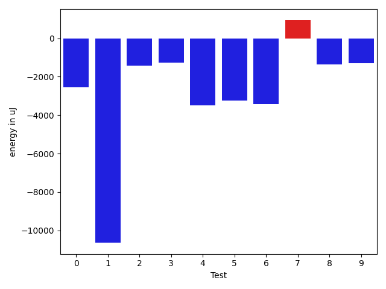

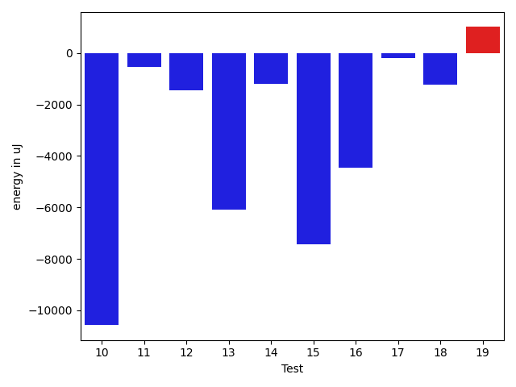

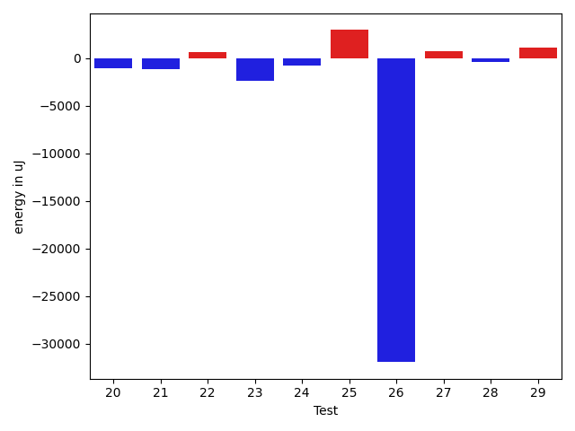

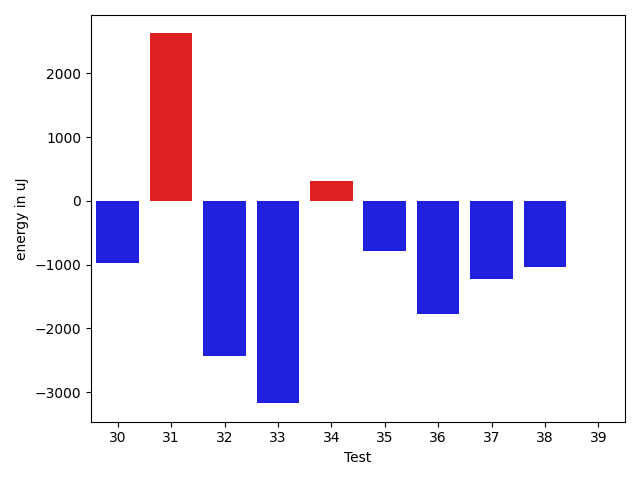

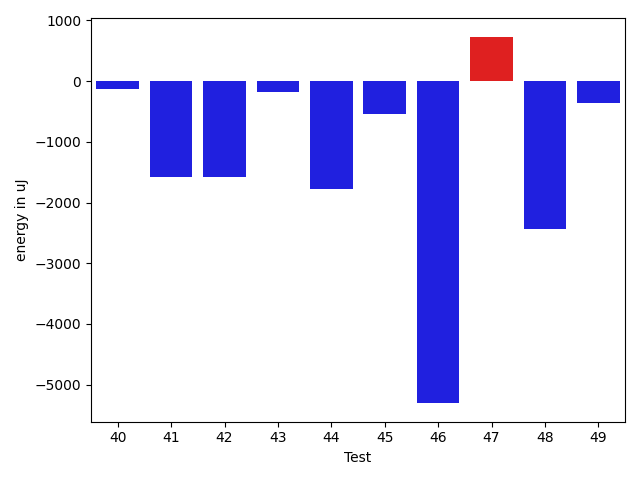

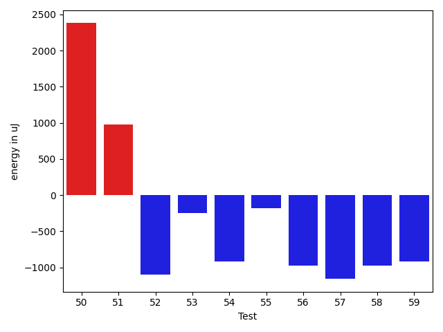

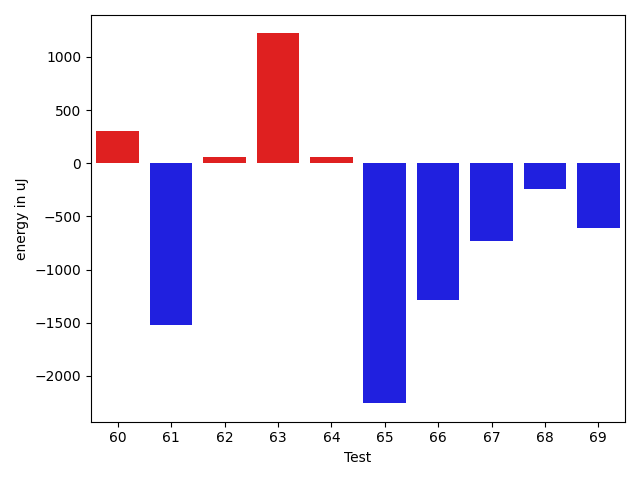

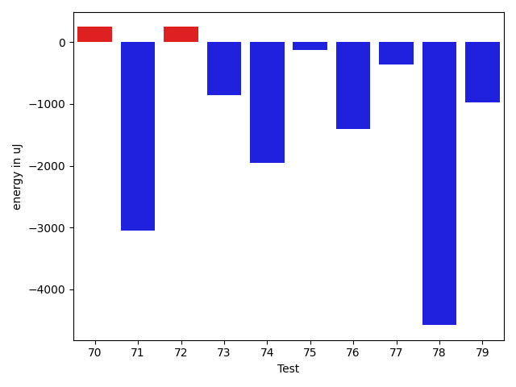

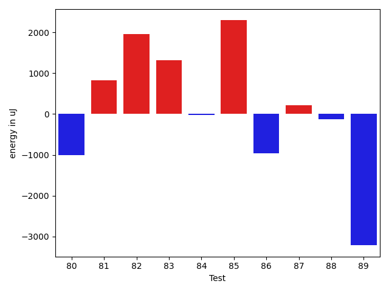

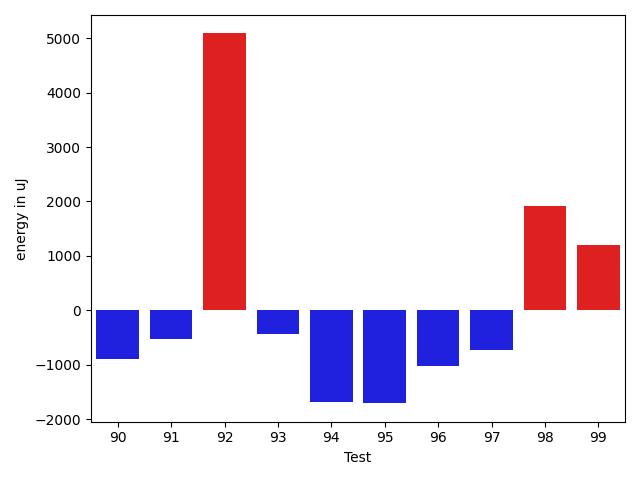

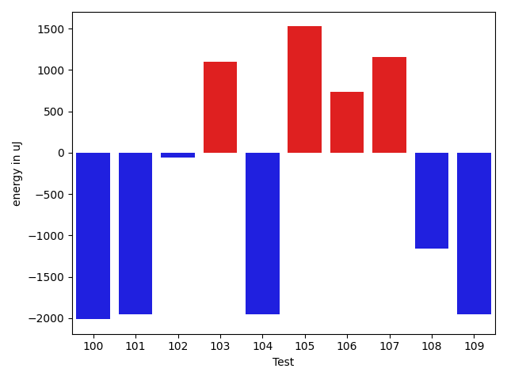

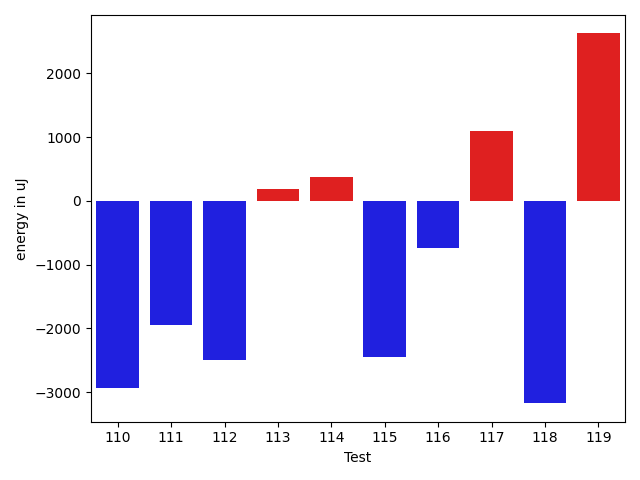

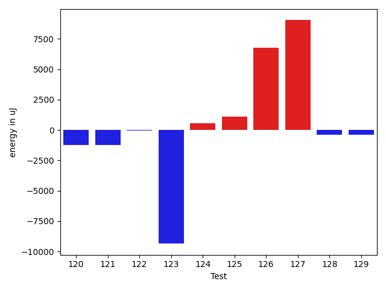

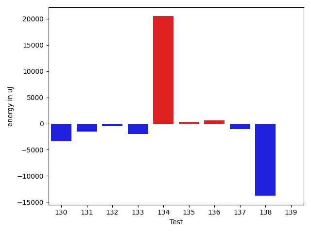

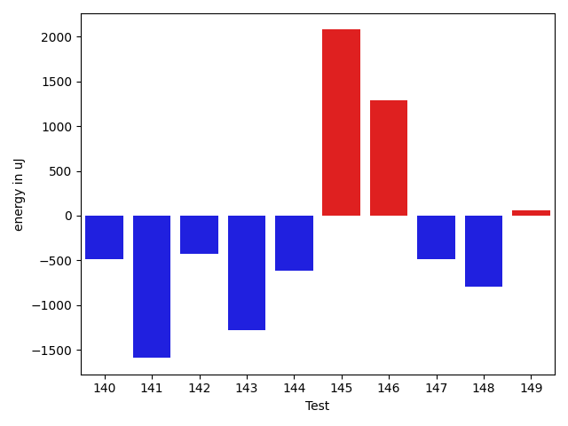

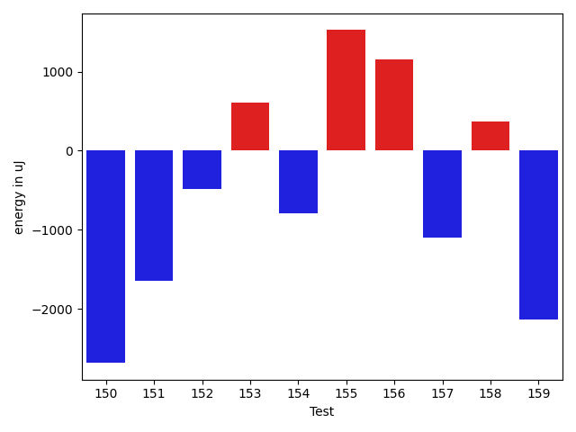

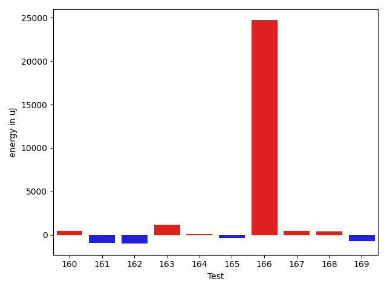

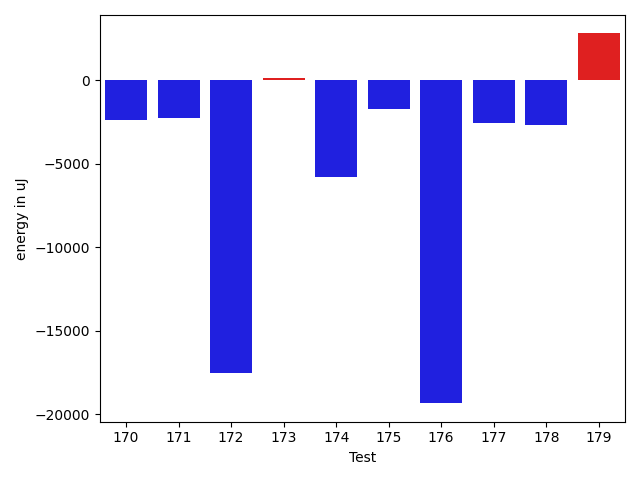

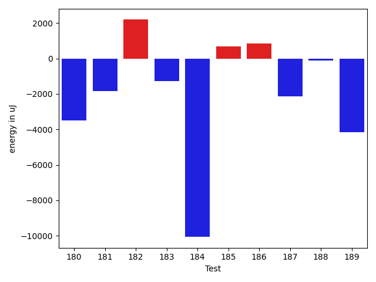

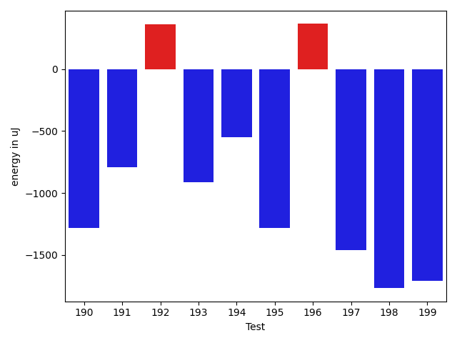

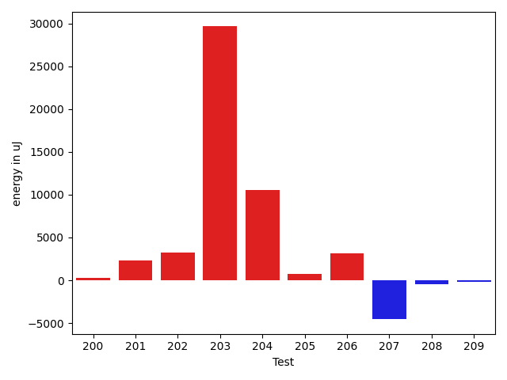

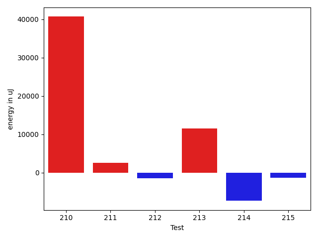

| ID | EnergyV1 | EnergyV2 | DeltaEnergy | σV1 | σV2 |
| --- | --- | --- | --- | --- | --- |
| 0 | 36987 | 37414 | 427 | 24681.607976632873 | 4664.445411417498 |
| 1 | 43884 | 41992 | -1892 | 87251.05618711772 | 63807.152400020575 |
| 2 | 36804 | 35339 | -1465 | 4125.927672410046 | 4134.913189559383 |
| 3 | 37415 | 35339 | -2076 | 3557.5643087967496 | 3450.5618748373226 |
| 4 | 36560 | 35766 | -794 | 11609.510368260186 | 6897.8350939456395 |
| 5 | 39673 | 40771 | 1098 | 31696.474153414536 | 27188.38107665771 |
| 6 | 38880 | 37842 | -1038 | 11789.85919310543 | 7259.1707728103165 |
| 7 | 36682 | 36499 | -183 | 6921.591671225629 | 10392.232573147201 |
| 8 | 36926 | 35095 | -1831 | 4450.921663313032 | 3922.9093309201066 |
| 9 | 36315 | 35827 | -488 | 23215.049787490763 | 24333.58486899673 |
| 10 | 39002 | 36132 | -2870 | 31045.210992089156 | 18360.279106743634 |
| 11 | 36988 | 35644 | -1344 | 3259.766921326976 | 3606.900975447437 |
| 12 | 36987 | 35339 | -1648 | 4029.9105672084356 | 3842.431900791766 |
| 13 | 111206 | 107787 | -3419 | 20309.130640435313 | 19497.958621964357 |
| 14 | 36987 | 35461 | -1526 | 3897.8304854182093 | 4048.5414949937704 |
| 15 | 37415 | 35645 | -1770 | 31312.05842502187 | 3356.850188367893 |
| 16 | 36804 | 35339 | -1465 | 19823.562930704134 | 16560.066681256278 |
| 17 | 34912 | 34607 | -305 | 3520.070867884701 | 3801.9040132587597 |
| 18 | 36560 | 34546 | -2014 | 3823.8543702523443 | 2439.3756793722773 |
| 19 | 36254 | 36560 | 306 | 6493.218962887359 | 8468.235873100675 |
| 20 | 35766 | 34668 | -1098 | 3061.1769830478524 | 3565.2653730199945 |
| 21 | 36682 | 35522 | -1160 | 3979.0983719061005 | 4345.831178448945 |
| 22 | 35339 | 35950 | 611 | 25342.546240778298 | 37101.81098875177 |
| 23 | 38574 | 36194 | -2380 | 4399.828931920568 | 3661.387406407019 |
| 24 | 36682 | 35889 | -793 | 3819.157389547926 | 3344.0110307988944 |
| 25 | 31066 | 33996 | 2930 | 2691.331434232671 | 0.0 |
| 26 | 98877 | 66956 | -31921 | 19197.702538324735 | 0.0 |
| 27 | 34424 | 35156 | 732 | 183.0 | 0.0 |
| 28 | 36988 | 36560 | -428 | 3832.745870491363 | 3525.399984777904 |
| 29 | 37964 | 39062 | 1098 | 22571.990170773846 | 28623.612446006595 |
| 30 | 38269 | 37293 | -976 | 6235.816207457241 | 3901.4146434819645 |
| 31 | 36987 | 39611 | 2624 | 4160.074869117942 | 4105.648706220357 |
| 32 | 39001 | 36560 | -2441 | 3843.095304661343 | 6131.3742085988415 |
| 33 | 38818 | 35644 | -3174 | 36031.37635700093 | 4173.8051550589535 |
| 34 | 37781 | 38085 | 304 | 3933.2126496590568 | 3974.9606378049534 |
| 35 | 37598 | 36804 | -794 | 25389.67856687613 | 4440.685614172985 |
| 36 | 37598 | 35828 | -1770 | 4276.34189109443 | 3795.300767335719 |
| 37 | 36682 | 35461 | -1221 | 22068.70887630136 | 3785.902732653002 |
| 38 | 38879 | 37842 | -1037 | 36122.25422243608 | 32534.72093772218 |
| 39 | 36866 | 36865 | -1 | 3925.6206787651945 | 3675.1098521488643 |
| 40 | 38818 | 38696 | -122 | 18420.180388347344 | 20837.114677216072 |
| 41 | 37902 | 36316 | -1586 | 4268.693144276117 | 5834.064893627389 |
| 42 | 38391 | 36804 | -1587 | 4232.026856245535 | 3363.2801446442163 |
| 43 | 36865 | 36682 | -183 | 4339.789358778999 | 3747.316211815724 |
| 44 | 37537 | 35766 | -1771 | 3835.792100627848 | 3497.7062051411117 |
| 45 | 37292 | 36743 | -549 | 3653.4527775106108 | 6293.644795783564 |
| 46 | 38330 | 33020 | -5310 | 3435.626267569788 | 4626.997013114986 |
| 47 | 38880 | 39612 | 732 | 19081.05746384726 | 22445.91563378632 |
| 48 | 41748 | 39306 | -2442 | 50888.20726796631 | 61556.81000528978 |
| 49 | 36743 | 36376 | -367 | 4331.426127452464 | 2464.573095985296 |
| 50 | 36560 | 38940 | 2380 | 3516.033783848073 | 3853.4816354621116 |
| 51 | 36926 | 37903 | 977 | 3564.3970261462173 | 2193.2434513146723 |
| 52 | 37293 | 36193 | -1100 | 3414.953967782893 | 3072.2882862142783 |
| 53 | 38146 | 37903 | -243 | 3880.046131116463 | 2831.8698928170675 |
| 54 | 37903 | 36988 | -915 | 44420.312038616124 | 3835.3024368649494 |
| 55 | 36865 | 36682 | -183 | 3413.207361836951 | 4433.815246236034 |
| 56 | 38758 | 37781 | -977 | 5011.329285439203 | 4512.752202093529 |
| 57 | 38086 | 36927 | -1159 | 3328.2776586155646 | 3467.2019276501032 |
| 58 | 37170 | 36194 | -976 | 12259.742496838846 | 23926.85739259737 |
| 59 | 38208 | 37292 | -916 | 14631.967855462999 | 17142.123397587373 |
| 60 | 67261 | 67566 | 305 | 23726.485641077088 | 23137.29671007607 |
| 61 | 35949 | 34424 | -1525 | 3491.4120176069314 | 60817.46875418086 |
| 62 | 36316 | 36377 | 61 | 7617.1392812300355 | 20021.862162573096 |
| 63 | 36804 | 38025 | 1221 | 27339.019877218 | 25148.113042731453 |
| 64 | 35706 | 35767 | 61 | 4033.0468962503937 | 4528.373824831311 |
| 65 | 36621 | 34363 | -2258 | 4242.957636098916 | 2696.9860867547013 |
| 66 | 38330 | 37048 | -1282 | 4817.9196701226865 | 24342.12422932916 |
| 67 | 36621 | 35889 | -732 | 3613.961215434757 | 3212.2507763120484 |
| 68 | 36010 | 35767 | -243 | 12684.633022966007 | 11214.1132371953 |
| 69 | 35583 | 34973 | -610 | 3540.4571175355363 | 3611.040676062469 |
| 70 | 35584 | 35828 | 244 | 3394.7610824999506 | 3062.2723615852537 |
| 71 | 41138 | 38086 | -3052 | 152116.94354215072 | 158964.90632128078 |
| 72 | 37109 | 37353 | 244 | 4091.7633895175377 | 3772.7849686484565 |
| 73 | 36926 | 36071 | -855 | 4254.279547073331 | 3594.9658492971053 |
| 74 | 35583 | 33630 | -1953 | 27582.098309789602 | 15125.386458382876 |
| 75 | 35339 | 35217 | -122 | 3388.7159493825975 | 8553.951523195563 |
| 76 | 35950 | 34545 | -1405 | 2428.239316857133 | 2758.9234442855736 |
| 77 | 35827 | 35461 | -366 | 3201.564425117131 | 3740.0128075253324 |
| 78 | 39184 | 34607 | -4577 | 5218.426433748438 | 3521.8495063815544 |
| 79 | 36682 | 35705 | -977 | 3515.387265821253 | 4089.15442563211 |
| 80 | 36194 | 36071 | -123 | 4131.228016885537 | 3437.003692262031 |
| 81 | 34301 | 35339 | 1038 | 3048.5626326188544 | 2932.9279605195957 |
| 82 | 38025 | 37536 | -489 | 18744.96942761174 | 22858.26831230684 |
| 83 | 36865 | 36682 | -183 | 9255.981801125226 | 16557.82745810326 |
| 84 | 37903 | 37476 | -427 | 12205.82132429208 | 12955.185426584689 |
| 85 | 36804 | 36866 | 62 | 52558.07308482077 | 56174.65770722057 |
| 86 | 61645 | 57311 | -4334 | 40780.02677065032 | 38723.91792248544 |
| 87 | 37658 | 37231 | -427 | 11614.037639032455 | 12376.823351878047 |
| 88 | 38147 | 37964 | -183 | 15503.90251029955 | 15149.165816163602 |
| 89 | 38574 | 36437 | -2137 | 25212.063547716945 | 19353.316977158083 |
| 90 | 36743 | 35217 | -1526 | 4085.0544368248293 | 4033.3017042062174 |
| 91 | 36438 | 36316 | -122 | 3248.446561582418 | 4002.4467403653593 |
| 92 | 35156 | 34423 | -733 | 4281.510337089112 | 28967.479059476766 |
| 93 | 35339 | 34973 | -366 | 3509.6451626972316 | 3258.3341628795633 |
| 94 | 35034 | 31616 | -3418 | 3022.9010825723863 | 3980.385129405614 |
| 95 | 36499 | 36743 | 244 | 4025.9129007356855 | 2868.665371442548 |
| 96 | 36682 | 36133 | -549 | 3799.435517170274 | 3581.166941546169 |
| 97 | 36316 | 35156 | -1160 | 2917.7743122969605 | 3487.711551548581 |
| 98 | 34668 | 38391 | 3723 | 3850.63380830008 | 3368.1530243524485 |
| 99 | 34546 | 35705 | 1159 | 4023.459103436345 | 3203.3577009132155 |
| 100 | 36743 | 34729 | -2014 | 3719.449477399922 | 3333.3568495382606 |
| 101 | 36560 | 34607 | -1953 | 9390.744654396778 | 5012.190253208046 |
| 102 | 36132 | 36072 | -60 | 3274.5596981796116 | 3411.525935377926 |
| 103 | 36438 | 37536 | 1098 | 2496.7891265383228 | 3478.5637280316314 |
| 104 | 38024 | 36072 | -1952 | 14769.741598003497 | 15377.52770735861 |
| 105 | 36255 | 37781 | 1526 | 3427.2836655432716 | 3449.5987286768427 |
| 106 | 35278 | 36011 | 733 | 4086.8881870262167 | 3114.6698900902315 |
| 107 | 34973 | 36133 | 1160 | 10378.309717828377 | 12139.940616804852 |
| 108 | 39063 | 37903 | -1160 | 2732.791388948341 | 4114.055928377516 |
| 109 | 39184 | 37231 | -1953 | 3364.501097139524 | 3966.560843554506 |
| 110 | 38024 | 35095 | -2929 | 2921.1201504445744 | 41681.012026911005 |
| 111 | 39673 | 37720 | -1953 | 3575.7471023331263 | 3714.452590875471 |
| 112 | 38574 | 36072 | -2502 | 3311.924434081145 | 3778.1656490269984 |
| 113 | 36560 | 36743 | 183 | 3800.390218451258 | 3510.3743429584297 |
| 114 | 34790 | 35156 | 366 | 3756.3103773242237 | 3097.607013189902 |
| 115 | 40344 | 37902 | -2442 | 65083.76500958372 | 120208.88570769939 |
| 116 | 37231 | 36499 | -732 | 2683.473629233734 | 3071.665147035106 |
| 117 | 35706 | 36805 | 1099 | 2878.7292758728313 | 3523.614367379041 |
| 118 | 35583 | 32409 | -3174 | 3981.815105529894 | 3698.4865324055845 |
| 119 | 35156 | 37780 | 2624 | 3457.128680069982 | 3618.808962290709 |
| 120 | 36010 | 33386 | -2624 | 3796.1099203658473 | 3668.7597529093496 |
| 121 | 36255 | 35034 | -1221 | 3171.482473444411 | 4073.83226674835 |
| 122 | 35828 | 36499 | 671 | 3503.7150144382463 | 3787.299402159803 |
| 123 | 36621 | 35339 | -1282 | 43151.35708894082 | 4130.280257298109 |
| 124 | 35095 | 34546 | -549 | 2802.2969960519235 | 4084.300722141905 |
| 125 | 35217 | 36743 | 1526 | 4175.186092825352 | 3488.7780150648737 |
| 126 | 35705 | 36438 | 733 | 4464.251819927769 | 29198.18681724827 |
| 127 | 34546 | 36377 | 1831 | 3008.979571420267 | 35538.029746290995 |
| 128 | 36804 | 35096 | -1708 | 2528.8440896488787 | 4798.769371337817 |
| 129 | 66223 | 67383 | 1160 | 20791.45367454682 | 19676.25256129406 |
| 130 | 41625 | 38208 | -3417 | 24389.12467863174 | 16814.715589312862 |
| 131 | 38086 | 36560 | -1526 | 5801.168005992953 | 3784.550574803718 |
| 132 | 36621 | 36072 | -549 | 13097.824574290531 | 3424.995850436224 |
| 133 | 39185 | 37170 | -2015 | 4154.437837814387 | 4525.648107551937 |
| 134 | 43823 | 64331 | 20508 | 342206.74735718704 | 424323.9521380343 |
| 135 | 35705 | 36011 | 306 | 3760.5944687022593 | 3350.8331580406348 |
| 136 | 36743 | 37353 | 610 | 3214.8150576754465 | 4371.7798315664995 |
| 137 | 37048 | 35950 | -1098 | 3965.69227846791 | 3876.4739843234292 |
| 138 | 70373 | 56579 | -13794 | 95152.965352702 | 87070.38289021305 |
| 139 | 36987 | 36988 | 1 | 4576.592172316903 | 4016.104952219261 |
| 140 | 36560 | 36072 | -488 | 4223.373757413147 | 3587.86173365911 |
| 141 | 37476 | 35889 | -1587 | 4020.400409713824 | 3619.228671608522 |
| 142 | 37659 | 37232 | -427 | 4398.629742964814 | 4115.626246626677 |
| 143 | 36621 | 35339 | -1282 | 4221.199864540887 | 22192.57924565686 |
| 144 | 36499 | 35888 | -611 | 4190.283065808324 | 3911.402238876195 |
| 145 | 35156 | 37231 | 2075 | 3874.9536146347523 | 3745.1569630925605 |
| 146 | 38024 | 39307 | 1283 | 30870.76043345871 | 19503.643229253983 |
| 147 | 37536 | 37048 | -488 | 5127.160305004113 | 3651.364478686429 |
| 148 | 40222 | 39429 | -793 | 28346.70665398277 | 33201.92082451021 |
| 149 | 36559 | 36621 | 62 | 3331.112411096729 | 3713.7547374052583 |
| 150 | 36194 | 33508 | -2686 | 30416.600152959465 | 3729.2795896644056 |
| 151 | 36743 | 35095 | -1648 | 3403.1431849710593 | 3279.1925979842285 |
| 152 | 37171 | 36682 | -489 | 36565.03818728698 | 3191.4889147630693 |
| 153 | 39550 | 40161 | 611 | 42093.32608713559 | 39898.82272217643 |
| 154 | 36132 | 35339 | -793 | 5015.388546347464 | 3010.4971859589355 |
| 155 | 36926 | 38452 | 1526 | 4881.75533732175 | 5060.874398623121 |
| 156 | 34546 | 35706 | 1160 | 6385.534060385551 | 9034.695134395655 |
| 157 | 36560 | 35461 | -1099 | 4191.254277924714 | 3647.071946835626 |
| 158 | 35461 | 35828 | 367 | 4659.432250549517 | 3316.6929444335397 |
| 159 | 37292 | 35156 | -2136 | 3326.4249600869043 | 3765.6046814263505 |
| 160 | 35645 | 35889 | 244 | 4227.149572044721 | 3622.9089771338754 |
| 161 | 38147 | 36499 | -1648 | 4569.708451677561 | 2984.699189935227 |
| 162 | 36194 | 34912 | -1282 | 3855.9372178829426 | 3118.8992695724583 |
| 163 | 35279 | 35217 | -62 | 3650.270858567771 | 3490.738295674554 |
| 164 | 36804 | 35767 | -1037 | 4473.474292819923 | 3898.721063245495 |
| 165 | 38269 | 37658 | -611 | 3264.8281615662736 | 3730.320905655651 |
| 166 | 39917 | 41748 | 1831 | 345760.7974544365 | 432353.8850863089 |
| 167 | 38207 | 38025 | -182 | 3978.215245687769 | 4178.664434613121 |
| 168 | 37415 | 37781 | 366 | 6164.148106103232 | 8202.547727420564 |
| 169 | 39856 | 37170 | -2686 | 4967.142563637568 | 4173.9513435331055 |
| 170 | 39856 | 36072 | -3784 | 4263.691525291142 | 2933.312291591197 |
| 171 | 40283 | 37658 | -2625 | 3885.469101522863 | 4123.184948688787 |
| 172 | 38696 | 37964 | -732 | 54624.87246106626 | 4090.179870526954 |
| 173 | 34973 | 34912 | -61 | 3967.0865406872304 | 4224.370980560999 |
| 174 | 38818 | 37659 | -1159 | 22011.67004800993 | 8221.88046455617 |
| 175 | 39856 | 39185 | -671 | 19852.40048382617 | 16733.733173089997 |
| 176 | 39245 | 38452 | -793 | 469602.10415272805 | 485527.9596314588 |
| 177 | 396971 | 399901 | 2930 | 130724.77454347943 | 116310.16720097931 |
| 178 | 39734 | 40100 | 366 | 52962.15958420929 | 46728.4389391463 |
| 179 | 37048 | 36988 | -60 | 37047.29142925408 | 53492.35891194969 |
| 180 | 38819 | 35339 | -3480 | 5080.250386920083 | 4114.9687790394155 |
| 181 | 38452 | 36621 | -1831 | 4415.509499781558 | 4625.787424489596 |
| 182 | 37781 | 39978 | 2197 | 106802.36676073133 | 95180.64447063301 |
| 183 | 39673 | 38391 | -1282 | 148493.04510444275 | 31751.388620795242 |
| 184 | 72448 | 62378 | -10070 | 24725.505154664716 | 23765.07429822948 |
| 185 | 37414 | 38086 | 672 | 11490.727964060603 | 22749.01591643323 |
| 186 | 37170 | 38025 | 855 | 38976.614273500025 | 41158.78649345928 |
| 187 | 39795 | 37659 | -2136 | 5047.061061384212 | 3840.7196542083393 |
| 188 | 39306 | 39185 | -121 | 10797.42636514492 | 5522.501454190292 |
| 189 | 41321 | 37171 | -4150 | 53548.516373928505 | 21650.632218798695 |
| 190 | 37903 | 36621 | -1282 | 4165.491132905701 | 3264.99174173232 |
| 191 | 38025 | 37231 | -794 | 3358.196133508451 | 3880.243151501298 |
| 192 | 38269 | 38635 | 366 | 119941.07131670952 | 36548.03714927213 |
| 193 | 37049 | 36133 | -916 | 4210.389667161268 | 2978.5758916636655 |
| 194 | 36987 | 36438 | -549 | 4130.640606938406 | 3508.8009945650783 |
| 195 | 39795 | 38513 | -1282 | 32801.030430346495 | 25589.867298804962 |
| 196 | 38757 | 39124 | 367 | 34303.053224942734 | 16606.006738168322 |
| 197 | 37903 | 36438 | -1465 | 4444.905176211323 | 4214.949156172598 |
| 198 | 38025 | 36255 | -1770 | 4176.528883888917 | 4770.451649918997 |
| 199 | 36927 | 35217 | -1710 | 28635.127934506043 | 4240.412216837825 |
| 200 | 37353 | 37536 | 183 | 4496.499449708016 | 5029.096280396708 |
| 201 | 36499 | 38635 | 2136 | 3864.274652214228 | 7293.155379378331 |
| 202 | 37232 | 38391 | 1159 | 10500.35776056865 | 15391.695711759725 |
| 203 | 39246 | 37719 | -1527 | 66271.64269523002 | 120714.4300124924 |
| 204 | 38574 | 39123 | 549 | 35524.614418196485 | 49767.90218515288 |
| 205 | 36987 | 39123 | 2136 | 3827.965757178926 | 3686.4837999449064 |
| 206 | 38880 | 39368 | 488 | 29732.799548737657 | 39602.12963511959 |
| 207 | 38818 | 37048 | -1770 | 27450.772229333226 | 26039.89280743758 |
| 208 | 37109 | 36499 | -610 | 4456.422826581897 | 3667.704751137863 |
| 209 | 39612 | 39489 | -123 | 3828.849973532847 | 4856.541657470705 |
| 210 | 35827 | 39978 | 4151 | 79717.70899186432 | 110962.96252287316 |
| 211 | 35583 | 39673 | 4090 | 5601.121273064076 | 4067.6567252381315 |
| 212 | 38696 | 35523 | -3173 | 3674.303061040964 | 3467.1340479806468 |
| 213 | 40405 | 36987 | -3418 | 50026.223897272794 | 65597.6470472693 |
| 214 | 38452 | 37536 | -916 | 37963.35123592884 | 3784.025094625217 |
| 215 | 39001 | 36926 | -2075 | 3687.5777229855526 | 3546.8963818918573 |

## Delta Duration per test method

| ID | DurationV1 | DurationsV2 | DeltaDuration |
| --- | --- | --- | --- |
| 0 | 857695.8431372549 | 733582.78125 | -124113.06188725494 |
| 1 | 2291808.4646464647 | 1996572.01010101 | -295236.4545454546 |
| 2 | 852527.28125 | 850013.2131147541 | -2514.068135245936 |
| 3 | 766917.9642857143 | 777504.8793103448 | 10586.915024630493 |
| 4 | 903686.4629629629 | 789702.4150943396 | -113984.04786862328 |
| 5 | 1578147.791044776 | 1406634.0606060605 | -171513.73043871555 |
| 6 | 869029.5294117647 | 743240.6764705882 | -125788.8529411765 |
| 7 | 1112412.1449275361 | 1066750.4657534247 | -45661.67917411146 |
| 8 | 789045.9074074074 | 794310.6521739131 | 5264.744766505668 |
| 9 | 1110480.3636363635 | 1149964.9666666666 | 39484.60303030303 |
| 10 | 1139984.4333333333 | 686797.9310344828 | -453186.50229885057 |
| 11 | 555586.7857142857 | 542103.4285714285 | -13483.35714285716 |
| 12 | 667437.2222222222 | 681317.9333333333 | 13880.7111111111 |
| 13 | 3270465.1515151514 | 3221447.7474747472 | -49017.40404040413 |
| 14 | 483611.2083333333 | 470414.1538461539 | -13197.054487179441 |
| 15 | 705267.0909090909 | 429994.8695652174 | -275272.22134387353 |
| 16 | 1230430.076923077 | 1071002.3055555555 | -159427.7713675215 |
| 17 | 665915.7916666666 | 645355.1363636364 | -20560.655303030275 |
| 18 | 603582.3714285714 | 579022.8965517242 | -24559.474876847235 |
| 19 | 823201.4583333334 | 797629.5555555555 | -25571.90277777787 |
| 20 | 468856.6666666667 | 425768.3157894737 | -43088.35087719298 |
| 21 | 476121.2727272727 | 457112.2631578947 | -19009.009569377988 |
| 22 | 797706.3095238095 | 833844.7777777778 | 36138.46825396828 |
| 23 | 514150.04545454547 | 501538.28571428574 | -12611.759740259731 |
| 24 | 658902.3617021276 | 657176.0909090909 | -1726.2707930366741 |
| 25 | 966933.0 | 877591.0 | -89342.0 |
| 26 | 2796671.75 | 2886435.0 | 89763.25 |
| 27 | 692254.0 | 731432.0 | 39178.0 |
| 28 | 799814.2363636363 | 790746.4705882353 | -9067.765775401029 |
| 29 | 1080794.1935483871 | 1125949.0892857143 | 45154.89573732717 |
| 30 | 926330.3787878788 | 907367.0877192982 | -18963.291068580584 |
| 31 | 613275.5277777778 | 568474.7 | -44800.8277777778 |
| 32 | 853622.3846153846 | 859756.925925926 | 6134.541310541332 |
| 33 | 1058950.4827586208 | 841076.6181818182 | -217873.8645768026 |
| 34 | 818924.3272727273 | 797013.6444444444 | -21910.68282828282 |
| 35 | 815631.0638297872 | 763130.2857142857 | -52500.77811550151 |
| 36 | 687110.3421052631 | 717933.3606557377 | 30823.018550474546 |
| 37 | 896500.5227272727 | 810200.9423076923 | -86299.58041958045 |
| 38 | 1405392.064516129 | 1405429.3235294118 | 37.25901328283362 |
| 39 | 823515.5492957747 | 901458.8245614035 | 77943.27526562882 |
| 40 | 1428754.8636363635 | 1552832.1720430108 | 124077.3084066473 |
| 41 | 918423.0634920635 | 938535.8833333333 | 20112.819841269753 |
| 42 | 676897.5227272727 | 721370.4888888889 | 44472.96616161615 |
| 43 | 693577.5952380953 | 721533.7959183673 | 27956.20068027207 |
| 44 | 692212.5862068966 | 674350.0208333334 | -17862.565373563208 |
| 45 | 713231.225 | 772225.4285714285 | 58994.203571428545 |
| 46 | 436492.3157894737 | 387590.75 | -48901.56578947371 |
| 47 | 1287454.7837837837 | 1075683.564102564 | -211771.21968121966 |
| 48 | 1519016.25 | 1412418.0625 | -106598.1875 |
| 49 | 372827.4705882353 | 424104.45454545453 | 51276.98395721923 |
| 50 | 538710.7142857143 | 470108.375 | -68602.33928571432 |
| 51 | 412677.3333333333 | 381573.28571428574 | -31104.047619047575 |
| 52 | 382438.29411764705 | 390128.8461538461 | 7690.552036199078 |
| 53 | 406757.78571428574 | 352954.0 | -53803.78571428574 |
| 54 | 777102.8888888889 | 385047.26666666666 | -392055.6222222222 |
| 55 | 397680.9285714286 | 701158.1428571428 | 303477.21428571426 |
| 56 | 403600.23076923075 | 430997.75 | 27397.51923076925 |
| 57 | 416960.1111111111 | 385552.6153846154 | -31407.49572649575 |
| 58 | 1252773.505376344 | 1305817.2758620689 | 53043.77048572479 |
| 59 | 1371667.25 | 1374464.7848101265 | 2797.5348101265263 |
| 60 | 2003959.5959595959 | 2017683.9393939395 | 13724.34343434358 |
| 61 | 699528.6976744186 | 940822.7674418605 | 241294.06976744195 |
| 62 | 934659.231884058 | 1010973.2419354839 | 76314.0100514259 |
| 63 | 1298985.8301886793 | 1169724.96 | -129260.87018867931 |
| 64 | 815456.0188679246 | 851672.9090909091 | 36216.89022298448 |
| 65 | 965976.8235294118 | 596860.59375 | -369116.2297794118 |
| 66 | 673942.6571428571 | 796422.53125 | 122479.87410714291 |
| 67 | 787757.6666666666 | 789866.7090909091 | 2109.042424242478 |
| 68 | 1026944.2881355932 | 1033131.406779661 | 6187.118644067785 |
| 69 | 675151.8684210526 | 687270.5217391305 | 12118.653318077908 |
| 70 | 492180.1904761905 | 475352.1818181818 | -16828.00865800865 |
| 71 | 2291246.0178571427 | 2966013.4411764704 | 674767.4233193276 |
| 72 | 682976.1612903225 | 633040.3913043478 | -49935.769985974766 |
| 73 | 663735.2727272727 | 590522.6470588235 | -73212.62566844921 |
| 74 | 722315.75 | 590129.5555555555 | -132186.1944444445 |
| 75 | 489797.52 | 576366.074074074 | 86568.55407407403 |
| 76 | 477608.9411764706 | 482550.5 | 4941.558823529398 |
| 77 | 500273.6296296296 | 524314.5238095238 | 24040.89417989418 |
| 78 | 649957.925925926 | 602076.12 | -47881.80592592596 |
| 79 | 476972.3461538461 | 447309.8888888889 | -29662.45726495725 |
| 80 | 565888.45 | 510002.29411764705 | -55886.155882352905 |
| 81 | 467533.6875 | 446318.6538461539 | -21215.033653846127 |
| 82 | 1329293.2222222222 | 1427868.054945055 | 98574.83272283268 |
| 83 | 1192658.8723404256 | 1238702.1411764706 | 46043.26883604494 |
| 84 | 1351990.0319148935 | 1312473.4157303371 | -39516.61618455639 |
| 85 | 1622214.0253164556 | 1618611.7160493827 | -3602.3092670729384 |
| 86 | 2005221.888888889 | 1936063.112244898 | -69158.776643991 |
| 87 | 1233373.3409090908 | 1220300.0375 | -13073.303409090731 |
| 88 | 1477662.5555555555 | 1469891.5353535353 | -7771.020202020183 |
| 89 | 1380890.294117647 | 1248474.857142857 | -132415.43697478995 |
| 90 | 994247.1466666666 | 990152.5694444445 | -4094.577222222113 |
| 91 | 826136.375 | 818334.0425531915 | -7802.332446808461 |
| 92 | 581143.1794871795 | 743915.2857142857 | 162772.10622710618 |
| 93 | 514439.0303030303 | 592275.7272727273 | 77836.69696969702 |
| 94 | 408853.0 | 410210.6842105263 | 1357.6842105262913 |
| 95 | 545520.9130434783 | 563556.7692307692 | 18035.856187290978 |
| 96 | 402313.23529411765 | 418081.8181818182 | 15768.582887700526 |
| 97 | 511722.25 | 487806.51612903224 | -23915.733870967757 |
| 98 | 479096.85714285716 | 491335.5909090909 | 12238.733766233723 |
| 99 | 396018.1818181818 | 397906.72 | 1888.5381818181486 |
| 100 | 509539.7083333333 | 468976.2272727273 | -40563.48106060602 |
| 101 | 828764.3714285714 | 768757.5 | -60006.87142857141 |
| 102 | 460188.45454545453 | 430905.5789473684 | -29282.875598086102 |
| 103 | 518211.6 | 511437.90476190473 | -6773.6952380952425 |
| 104 | 887580.5128205129 | 1076090.1842105263 | 188509.67139001342 |
| 105 | 412264.7894736842 | 430443.2083333333 | 18178.4188596491 |
| 106 | 563900.2307692308 | 590723.4285714285 | 26823.19780219777 |
| 107 | 887161.2857142857 | 1086688.8620689656 | 199527.57635467988 |
| 108 | 439929.14285714284 | 451876.45454545453 | 11947.311688311689 |
| 109 | 494164.64285714284 | 406532.7272727273 | -87631.91558441555 |
| 110 | 393844.6 | 659952.7 | 266108.1 |
| 111 | 503063.9375 | 462454.2105263158 | -40609.72697368421 |
| 112 | 852158.8947368421 | 521186.5909090909 | -330972.30382775125 |
| 113 | 462755.875 | 473583.7894736842 | 10827.914473684214 |
| 114 | 496415.2380952381 | 500667.4857142857 | 4252.247619047586 |
| 115 | 1385788.2631578948 | 2788591.9285714286 | 1402803.6654135338 |
| 116 | 496489.44444444444 | 538642.1428571428 | 42152.6984126984 |
| 117 | 440619.3157894737 | 396081.5 | -44537.81578947371 |
| 118 | 433792.7368421053 | 424445.3333333333 | -9347.403508771968 |
| 119 | 472226.2962962963 | 436503.6666666667 | -35722.629629629606 |
| 120 | 417765.9 | 444374.1176470588 | 26608.217647058773 |
| 121 | 470024.4285714286 | 549326.88 | 79302.45142857142 |
| 122 | 472656.4 | 459238.88 | -13417.520000000019 |
| 123 | 751893.7407407408 | 516859.60714285716 | -235034.13359788363 |
| 124 | 416098.21428571426 | 375326.0833333333 | -40772.13095238095 |
| 125 | 453579.9166666667 | 421403.72 | -32176.196666666714 |
| 126 | 405836.22222222225 | 654771.9583333334 | 248935.73611111112 |
| 127 | 416512.0714285714 | 703816.2916666666 | 287304.2202380952 |
| 128 | 381141.36363636365 | 362733.8461538461 | -18407.51748251752 |
| 129 | 1904081.2424242424 | 1908947.5858585858 | 4866.343434343347 |
| 130 | 769058.1875 | 756899.1764705882 | -12159.011029411806 |
| 131 | 993650.3137254902 | 804850.8070175438 | -188799.50670794642 |
| 132 | 905695.6333333333 | 685390.5862068966 | -220305.04712643672 |
| 133 | 596387.8333333334 | 459316.7727272727 | -137071.06060606067 |
| 134 | 3036870.585858586 | 3765841.3775510206 | 728970.7916924348 |
| 135 | 773000.5652173914 | 738800.1739130435 | -34200.3913043479 |
| 136 | 763917.3953488372 | 685936.5952380953 | -77980.80011074198 |
| 137 | 724192.05 | 704159.3863636364 | -20032.663636363694 |
| 138 | 2565408.1818181816 | 2222669.8484848486 | -342738.333333333 |
| 139 | 842550.1509433963 | 793295.3695652174 | -49254.78137817886 |
| 140 | 763583.1794871795 | 720835.5128205129 | -42747.66666666663 |
| 141 | 678001.375 | 796695.0697674418 | 118693.69476744183 |
| 142 | 794212.4098360656 | 807237.3773584906 | 13024.967522424995 |
| 143 | 823054.3 | 788307.9074074074 | -34746.39259259263 |
| 144 | 694629.6 | 653380.0 | -41249.59999999998 |
| 145 | 484895.82352941175 | 515333.9411764706 | 30438.117647058854 |
| 146 | 1006023.45 | 838807.0540540541 | -167216.39594594587 |
| 147 | 386552.22222222225 | 466498.6153846154 | 79946.39316239313 |
| 148 | 1112912.1612903227 | 1290654.1129032257 | 177741.95161290304 |
| 149 | 514845.724137931 | 495234.32 | -19611.404137931007 |
| 150 | 762535.6363636364 | 624215.9629629629 | -138319.67340067343 |
| 151 | 548436.9047619047 | 608514.1538461539 | 60077.24908424914 |
| 152 | 811322.4285714285 | 545943.375 | -265379.0535714285 |
| 153 | 1539342.3902439023 | 1439488.255319149 | -99854.13492475334 |
| 154 | 555268.625 | 568939.4 | 13670.775000000023 |
| 155 | 538731.1071428572 | 547020.1304347826 | 8289.023291925434 |
| 156 | 1067010.3255813953 | 890137.3529411765 | -176872.9726402188 |
| 157 | 875193.4333333333 | 872092.1071428572 | -3101.3261904761894 |
| 158 | 606039.40625 | 592010.5135135135 | -14028.892736486509 |
| 159 | 429085.3703703704 | 421073.09523809527 | -8012.275132275128 |
| 160 | 468012.53846153844 | 476192.625 | 8180.086538461561 |
| 161 | 467839.6666666667 | 483183.24 | 15343.573333333305 |
| 162 | 442123.8947368421 | 441666.1052631579 | -457.7894736841554 |
| 163 | 433733.36363636365 | 407790.26666666666 | -25943.096969696984 |
| 164 | 651951.8205128205 | 770294.0 | 118342.1794871795 |
| 165 | 531146.5 | 520018.42307692306 | -11128.076923076937 |
| 166 | 3138654.7866666666 | 3593035.393939394 | 454380.6072727274 |
| 167 | 836600.6379310344 | 820240.0961538461 | -16360.541777188308 |
| 168 | 921912.0579710145 | 894733.9714285714 | -27178.08654244314 |
| 169 | 439440.8 | 438484.9090909091 | -955.890909090871 |
| 170 | 359726.5 | 404659.875 | 44933.375 |
| 171 | 486378.05555555556 | 403723.75 | -82654.30555555556 |
| 172 | 1012467.3333333334 | 443693.0416666667 | -568774.2916666667 |
| 173 | 442686.0 | 414587.38095238095 | -28098.619047619053 |
| 174 | 1076873.652173913 | 890837.4545454546 | -186036.1976284585 |
| 175 | 1195808.0263157894 | 900215.2727272727 | -295592.75358851673 |
| 176 | 4710081.521739131 | 3956426.6172839506 | -753654.9044551803 |
| 177 | 11631926.02020202 | 11651953.08080808 | 20027.06060606055 |
| 178 | 1934110.7391304348 | 1794866.7241379311 | -139244.01499250368 |
| 179 | 975757.7692307692 | 946934.75 | -28823.01923076925 |
| 180 | 518563.0 | 453631.0 | -64932.0 |
| 181 | 618697.5925925926 | 526379.3870967742 | -92318.2054958184 |
| 182 | 1870673.608695652 | 1638243.4090909092 | -232430.19960474293 |
| 183 | 3108364.108108108 | 899977.5277777778 | -2208386.58033033 |
| 184 | 2012241.9292929294 | 1898073.7171717172 | -114168.21212121216 |
| 185 | 1097373.355263158 | 1190429.8181818181 | 93056.46291866014 |
| 186 | 1161069.5681818181 | 1197064.2333333334 | 35994.66515151528 |
| 187 | 600159.6842105263 | 592546.1666666666 | -7613.517543859663 |
| 188 | 725352.6764705882 | 747738.8275862068 | 22386.151115618646 |
| 189 | 1982392.2 | 950642.4210526316 | -1031749.7789473684 |
| 190 | 732617.4509803922 | 788073.8666666667 | 55456.41568627453 |
| 191 | 755382.0 | 774950.6818181818 | 19568.681818181765 |
| 192 | 1878686.75 | 1436092.6744186047 | -442594.0755813953 |
| 193 | 581950.695652174 | 531516.36 | -50434.33565217396 |
| 194 | 689693.5116279069 | 713788.8461538461 | 24095.334525939194 |
| 195 | 1364131.4285714286 | 1288952.5806451612 | -75178.84792626742 |
| 196 | 1273962.826923077 | 935154.7307692308 | -338808.09615384624 |
| 197 | 936101.625 | 875377.0689655172 | -60724.55603448278 |
| 198 | 819371.9782608695 | 736428.8181818182 | -82943.16007905127 |
| 199 | 718424.7878787878 | 571576.4285714285 | -146848.35930735932 |
| 200 | 725477.6857142857 | 720808.075 | -4669.610714285751 |
| 201 | 702246.9268292683 | 739938.4285714285 | 37691.50174216018 |
| 202 | 1194295.076923077 | 1281597.6951219512 | 87302.61819887417 |
| 203 | 1272864.6785714286 | 2264427.1219512196 | 991562.443379791 |
| 204 | 1173564.5344827587 | 1589587.8983050848 | 416023.36382232606 |
| 205 | 564840.4814814815 | 503860.95238095237 | -60979.52910052909 |
| 206 | 1130414.2857142857 | 1208111.224489796 | 77696.9387755103 |
| 207 | 1244455.5 | 1015657.0925925926 | -228798.40740740742 |
| 208 | 639971.0975609756 | 607657.6451612903 | -32313.45239968528 |
| 209 | 427413.1538461539 | 451597.09523809527 | 24183.941391941393 |
| 210 | 1371173.9047619049 | 2687979.4782608696 | 1316805.5734989648 |
| 211 | 427338.8823529412 | 420114.8125 | -7224.069852941204 |
| 212 | 452102.5625 | 486437.06666666665 | 34334.50416666665 |
| 213 | 1116797.4047619049 | 1721895.2777777778 | 605097.8730158729 |
| 214 | 860645.6875 | 720212.8709677419 | -140432.81653225806 |
| 215 | 602791.1612903225 | 754559.8214285715 | 151768.66013824893 |

## Misc.

| ID | Test Class | Test Method |
| --- | --- | --- |
| 0 | com.google.gson.functional.CustomDeserializerTest | testDefaultConstructorNotCalledOnField |
| 1 | com.google.gson.functional.CustomDeserializerTest | testDefaultConstructorNotCalledOnObject |
| 2 | com.google.gson.functional.CustomDeserializerTest | testCustomDeserializerReturnsNullForArrayElementsForArrayField |
| 3 | com.google.gson.functional.CustomDeserializerTest | testCustomDeserializerReturnsNull |
| 4 | com.google.gson.functional.CustomDeserializerTest | testCustomDeserializerReturnsNullForArrayElements |
| 5 | com.google.gson.functional.CustomDeserializerTest | testCustomDeserializerReturnsNullForTopLevelObject |
| 6 | com.google.gson.functional.CustomDeserializerTest | testCustomDeserializerReturnsNullForTopLevelPrimitives |
| 7 | com.google.gson.functional.CustomDeserializerTest | testJsonTypeFieldBasedDeserialization |
| 8 | com.google.gson.functional.CustomDeserializerTest | testCustomDeserializerReturnsNullForPrimitiveFields |
| 9 | com.google.gson.functional.DefaultTypeAdaptersTest | testTreeSetDeserialization |
| 10 | com.google.gson.functional.DefaultTypeAdaptersTest | testUrlDeserialization |
| 11 | com.google.gson.functional.DefaultTypeAdaptersTest | testDefaultGregorianCalendarDeserialization |
| 12 | com.google.gson.functional.DefaultTypeAdaptersTest | testPropertiesDeserialization |
| 13 | com.google.gson.functional.DefaultTypeAdaptersTest | testDefaultDateDeserializationUsingBuilder |
| 14 | com.google.gson.functional.DefaultTypeAdaptersTest | testUriDeserialization |
| 15 | com.google.gson.functional.DefaultTypeAdaptersTest | testLocaleDeserializationWithLanguageCountry |
| 16 | com.google.gson.functional.DefaultTypeAdaptersTest | testBigDecimalFieldDeserialization |
| 17 | com.google.gson.functional.DefaultTypeAdaptersTest | testBigIntegerFieldDeserialization |
| 18 | com.google.gson.functional.DefaultTypeAdaptersTest | testDefaultCalendarDeserialization |
| 19 | com.google.gson.functional.DefaultTypeAdaptersTest | testUrlNullDeserialization |
| 20 | com.google.gson.functional.DefaultTypeAdaptersTest | testLocaleDeserializationWithLanguage |
| 21 | com.google.gson.functional.DefaultTypeAdaptersTest | testLocaleDeserializationWithLanguageCountryVariant |
| 22 | com.google.gson.functional.DefaultTypeAdaptersTest | testBadValueForBigDecimalDeserialization |
| 23 | com.google.gson.functional.DefaultTypeAdaptersTest | testUuidDeserialization |
| 24 | com.google.gson.functional.DefaultTypeAdaptersTest | testDateDeserializationWithPattern |
| 25 | com.google.gson.functional.DefaultTypeAdaptersTest | testDefaultJavaSqlTimestampDeserialization |
| 26 | com.google.gson.functional.DefaultTypeAdaptersTest | testDefaultDateDeserialization |
| 27 | com.google.gson.functional.DefaultTypeAdaptersTest | testDefaultJavaSqlTimeDeserialization |
| 28 | com.google.gson.functional.CustomTypeAdaptersTest | testCustomAdapterInvokedForMapElementDeserialization |
| 29 | com.google.gson.functional.CustomTypeAdaptersTest | testCustomDeserializers |
| 30 | com.google.gson.functional.CustomTypeAdaptersTest | testCustomDeserializerForLong |
| 31 | com.google.gson.functional.CustomTypeAdaptersTest | testEnsureCustomDeserializerNotInvokedForNullValues |
| 32 | com.google.gson.functional.CustomTypeAdaptersTest | testCustomAdapterInvokedForCollectionElementDeserialization |
| 33 | com.google.gson.functional.CustomTypeAdaptersTest | testCustomNestedDeserializers |
| 34 | com.google.gson.functional.CustomTypeAdaptersTest | testCustomByteArrayDeserializerAndInstanceCreator |
| 35 | com.google.gson.functional.CollectionTest | testNullsInListDeserialization |
| 36 | com.google.gson.functional.CollectionTest | testRawCollectionOfBagOfPrimitivesNotAllowed |
| 37 | com.google.gson.functional.CollectionTest | testWildcardPrimitiveCollectionDeserilaization |
| 38 | com.google.gson.functional.CollectionTest | testTopLevelCollectionOfIntegersDeserialization |
| 39 | com.google.gson.functional.CollectionTest | testSetDeserialization |
| 40 | com.google.gson.functional.CollectionTest | testWildcardCollectionField |
| 41 | com.google.gson.functional.CollectionTest | testTopLevelListOfIntegerCollectionsDeserialization |
| 42 | com.google.gson.functional.CollectionTest | testCollectionOfStringsDeserialization |
| 43 | com.google.gson.functional.CollectionTest | testQueueDeserialization |
| 44 | com.google.gson.functional.CollectionTest | testRawCollectionDeserializationNotAlllowed |
| 45 | com.google.gson.functional.CollectionTest | testLinkedListDeserialization |
| 46 | com.google.gson.functional.StringTest | testEscapingQuotesInStringSerialization |
| 47 | com.google.gson.functional.StringTest | testSingleQuoteInStringSerialization |
| 48 | com.google.gson.functional.StringTest | testStringValueDeserialization |
| 49 | com.google.gson.functional.StringTest | testSingleQuoteInStringDeserialization |
| 50 | com.google.gson.functional.StringTest | testStringValueAsSingleElementArrayDeserialization |
| 51 | com.google.gson.functional.StringTest | testEscapedCtrlNInStringDeserialization |
| 52 | com.google.gson.functional.StringTest | testStringWithEscapedSlashDeserialization |
| 53 | com.google.gson.functional.StringTest | testEscapingQuotesInStringDeserialization |
| 54 | com.google.gson.functional.StringTest | testAssignmentCharDeserialization |
| 55 | com.google.gson.functional.StringTest | testJavascriptKeywordsInStringDeserialization |
| 56 | com.google.gson.functional.StringTest | testEscapedCtrlRInStringDeserialization |
| 57 | com.google.gson.functional.StringTest | testEscapedBackslashInStringDeserialization |
| 58 | com.google.gson.functional.ObjectTest | testEmptyCollectionInAnObjectDeserialization |
| 59 | com.google.gson.functional.ObjectTest | testArrayOfArraysDeserialization |
| 60 | com.google.gson.functional.ObjectTest | testSingletonLists |
| 61 | com.google.gson.functional.ObjectTest | testClassWithTransientFieldsDeserialization |
| 62 | com.google.gson.functional.ObjectTest | testArrayOfObjectsDeserialization |
| 63 | com.google.gson.functional.ObjectTest | testTruncatedDeserialization |
| 64 | com.google.gson.functional.ObjectTest | testNestedDeserialization |
| 65 | com.google.gson.functional.ObjectTest | testNullPrimitiveFieldsDeserialization |
| 66 | com.google.gson.functional.ObjectTest | testBagOfPrimitivesDeserialization |
| 67 | com.google.gson.functional.ObjectTest | testInnerClassDeserialization |
| 68 | com.google.gson.functional.ObjectTest | testStringFieldWithNumberValueDeserialization |
| 69 | com.google.gson.functional.ObjectTest | testPrimitiveArrayInAnObjectDeserialization |
| 70 | com.google.gson.functional.ObjectTest | testObjectFieldNamesWithoutQuotesDeserialization |
| 71 | com.google.gson.functional.ObjectTest | testJsonInSingleQuotesDeserialization |
| 72 | com.google.gson.functional.ObjectTest | testBagOfPrimitiveWrappersDeserialization |
| 73 | com.google.gson.functional.ObjectTest | testNullFieldsDeserialization |
| 74 | com.google.gson.functional.ObjectTest | testClassWithTransientFieldsDeserializationTransientFieldsPassedInJsonAreIgnored |
| 75 | com.google.gson.functional.ObjectTest | testStringFieldWithEmptyValueDeserialization |
| 76 | com.google.gson.functional.ObjectTest | testEmptyStringDeserialization |
| 77 | com.google.gson.functional.ObjectTest | testNullArraysDeserialization |
| 78 | com.google.gson.functional.ObjectTest | testJsonInMixedQuotesDeserialization |
| 79 | com.google.gson.functional.ObjectTest | testClassWithNoFieldsDeserialization |
| 80 | com.google.gson.functional.ObjectTest | testPrivateNoArgConstructorDeserialization |
| 81 | com.google.gson.functional.ObjectTest | testNullObjectFieldsDeserialization |
| 82 | com.google.gson.functional.ParameterizedTypesTest | testVariableTypeArrayDeserialization |
| 83 | com.google.gson.functional.ParameterizedTypesTest | testVariableTypeDeserialization |
| 84 | com.google.gson.functional.ParameterizedTypesTest | testParameterizedTypeGenericArraysDeserialization |
| 85 | com.google.gson.functional.ParameterizedTypesTest | testParameterizedTypeDeserialization |
| 86 | com.google.gson.functional.ParameterizedTypesTest | testVariableTypeFieldsAndGenericArraysDeserialization |
| 87 | com.google.gson.functional.ParameterizedTypesTest | testTypesWithMultipleParametersDeserialization |
| 88 | com.google.gson.functional.ParameterizedTypesTest | testParameterizedTypesWithCustomDeserializer |
| 89 | com.google.gson.functional.ParameterizedTypesTest | testParameterizedTypeWithVariableTypeDeserialization |
| 90 | com.google.gson.functional.ParameterizedTypesTest | testParameterizedTypeWithReaderDeserialization |
| 91 | com.google.gson.functional.ParameterizedTypesTest | testDeepParameterizedTypeDeserialization |
| 92 | com.google.gson.functional.PrimitiveTest | testBigIntegerDeserialization |
| 93 | com.google.gson.functional.PrimitiveTest | testDoubleNaNDeserialization |
| 94 | com.google.gson.functional.PrimitiveTest | testBigDecimalNoFractAsStringRepresentationDeserialization |
| 95 | com.google.gson.functional.PrimitiveTest | testPrimitiveBooleanAutoboxedDeserialization |
| 96 | com.google.gson.functional.PrimitiveTest | testBigDecimalPreservePrecisionDeserialization |
| 97 | com.google.gson.functional.PrimitiveTest | testDoubleAsStringRepresentationDeserialization |
| 98 | com.google.gson.functional.PrimitiveTest | testDoubleInfinityDeserialization |
| 99 | com.google.gson.functional.PrimitiveTest | testBigDecimalInfinityDeserializationNotSupported |
| 100 | com.google.gson.functional.PrimitiveTest | testPrimitiveDoubleAutoboxedInASingleElementArrayDeserialization |
| 101 | com.google.gson.functional.PrimitiveTest | testPrimitiveDoubleAutoboxedDeserialization |
| 102 | com.google.gson.functional.PrimitiveTest | testNegativeInfinityFloatDeserialization |
| 103 | com.google.gson.functional.PrimitiveTest | testBigIntegerInASingleElementArrayDeserialization |
| 104 | com.google.gson.functional.PrimitiveTest | testNumberDeserialization |
| 105 | com.google.gson.functional.PrimitiveTest | testBigDecimalNegativeInfinityDeserializationNotSupported |
| 106 | com.google.gson.functional.PrimitiveTest | testOverridingDefaultPrimitiveSerialization |
| 107 | com.google.gson.functional.PrimitiveTest | testDeserializePrimitiveWrapperAsObjectField |
| 108 | com.google.gson.functional.PrimitiveTest | testReallyLongValuesDeserialization |
| 109 | com.google.gson.functional.PrimitiveTest | testPrimitiveLongAutoboxedInASingleElementArrayDeserialization |
| 110 | com.google.gson.functional.PrimitiveTest | testBigDecimalAsStringRepresentationDeserialization |
| 111 | com.google.gson.functional.PrimitiveTest | testPrimitiveLongAutoboxedDeserialization |
| 112 | com.google.gson.functional.PrimitiveTest | testPrimitiveIntegerAutoboxedDeserialization |
| 113 | com.google.gson.functional.PrimitiveTest | testFloatNaNDeserialization |
| 114 | com.google.gson.functional.PrimitiveTest | testLargeDoubleDeserialization |
| 115 | com.google.gson.functional.PrimitiveTest | testPrimitiveIntegerAutoboxedInASingleElementArrayDeserialization |
| 116 | com.google.gson.functional.PrimitiveTest | testPrimitiveBooleanAutoboxedInASingleElementArrayDeserialization |
| 117 | com.google.gson.functional.PrimitiveTest | testSmallValueForBigIntegerDeserialization |
| 118 | com.google.gson.functional.PrimitiveTest | testPrimitiveClassLiteral |
| 119 | com.google.gson.functional.PrimitiveTest | testFloatInfinityDeserialization |
| 120 | com.google.gson.functional.PrimitiveTest | testBigDecimalDeserialization |
| 121 | com.google.gson.functional.PrimitiveTest | testBadValueForBigIntegerDeserialization |
| 122 | com.google.gson.functional.PrimitiveTest | testBigDecimalInASingleElementArrayDeserialization |
| 123 | com.google.gson.functional.PrimitiveTest | testDoubleNoFractAsStringRepresentationDeserialization |
| 124 | com.google.gson.functional.PrimitiveTest | testQuotedStringSerializationAndDeserialization |
| 125 | com.google.gson.functional.PrimitiveTest | testNegativeInfinityDeserialization |
| 126 | com.google.gson.functional.PrimitiveTest | testBigDecimalNaNDeserializationNotSupported |
| 127 | com.google.gson.functional.PrimitiveTest | testLongAsStringDeserialization |
| 128 | com.google.gson.functional.PrimitiveTest | testSmallValueForBigDecimalDeserialization |
| 129 | com.google.gson.functional.EnumTest | testEnumSubclass |
| 130 | com.google.gson.functional.EnumTest | testTopLevelEnumDeserialization |
| 131 | com.google.gson.functional.EnumTest | testCollectionOfEnumsDeserialization |
| 132 | com.google.gson.functional.EnumTest | testClassWithEnumFieldDeserialization |
| 133 | com.google.gson.functional.EnumTest | testTopLevelEnumInASingleElementArrayDeserialization |
| 134 | com.google.gson.functional.TypeVariableTest | testBasicTypeVariables |
| 135 | com.google.gson.functional.MapTest | testMapOfMapDeserialization |
| 136 | com.google.gson.functional.MapTest | testMapDeserializationWithNullKey |
| 137 | com.google.gson.functional.MapTest | testReadMapsWithEmptyStringKey |
| 138 | com.google.gson.functional.MapTest | testParameterizedMapSubclassDeserialization |
| 139 | com.google.gson.functional.MapTest | testMapDeserializationWithWildcardValues |
| 140 | com.google.gson.functional.MapTest | testMapDeserialization |
| 141 | com.google.gson.functional.MapTest | testMapDeserializationWithNullValue |
| 142 | com.google.gson.functional.MapTest | testMapStandardSubclassDeserialization |
| 143 | com.google.gson.functional.MapTest | testMapDeserializationWithIntegerKeys |
| 144 | com.google.gson.functional.MapTest | testMapDeserializationEmpty |
| 145 | com.google.gson.functional.ReadersWritersTest | testTopLevelNullObjectDeserializationWithReaderAndSerializeNulls |
| 146 | com.google.gson.functional.ReadersWritersTest | testReaderForDeserialization |
| 147 | com.google.gson.functional.ReadersWritersTest | testTopLevelNullObjectDeserializationWithReader |
| 148 | com.google.gson.functional.NamingPolicyTest | testGsonWithSerializedNameFieldNamingPolicyDeserialization |
| 149 | com.google.gson.functional.NamingPolicyTest | testGsonWithNonDefaultFieldNamingPolicyDeserialiation |
| 150 | com.google.gson.functional.NamingPolicyTest | testGsonWithUpperCamelCaseSpacesPolicyDeserialiation |
| 151 | com.google.gson.functional.NamingPolicyTest | testGsonWithLowerCaseDashPolicyDeserialiation |
| 152 | com.google.gson.functional.NamingPolicyTest | testGsonWithLowerCaseUnderscorePolicyDeserialiation |
| 153 | com.google.gson.functional.ArrayTest | testTopLevelArrayOfIntsDeserialization |
| 154 | com.google.gson.functional.ArrayTest | testArrayWithoutTypeInfoDeserialization |
| 155 | com.google.gson.functional.ArrayTest | testInvalidArrayDeserialization |
| 156 | com.google.gson.functional.ArrayTest | testArrayOfPrimitivesAsObjectsDeserialization |
| 157 | com.google.gson.functional.ArrayTest | testArrayOfCollectionDeserialization |
| 158 | com.google.gson.functional.ArrayTest | testArrayOfObjectsWithoutTypeInfoDeserialization |
| 159 | com.google.gson.functional.ArrayTest | testArrayOfStringsDeserialization |
| 160 | com.google.gson.functional.ArrayTest | testSingleStringArrayDeserialization |
| 161 | com.google.gson.functional.ArrayTest | testNullsInArrayDeserialization |
| 162 | com.google.gson.functional.ArrayTest | testSingleNullInArrayDeserialization |
| 163 | com.google.gson.functional.ArrayTest | testArrayOfNullDeserialization |
| 164 | com.google.gson.functional.ArrayTest | testArrayOfPrimitivesWithCustomTypeAdapter |
| 165 | com.google.gson.functional.ArrayTest | testEmptyArrayDeserialization |
| 166 | com.google.gson.functional.InstanceCreatorTest | testInstanceCreatorReturnsBaseType |
| 167 | com.google.gson.functional.InstanceCreatorTest | testInstanceCreatorReturnsSubTypeForTopLevelObject |
| 168 | com.google.gson.functional.InstanceCreatorTest | testInstanceCreatorReturnsSubTypeForField |
| 169 | com.google.gson.JsonParserTest | testParseEmptyWhitespaceInput |
| 170 | com.google.gson.JsonParserTest | testParseString |
| 171 | com.google.gson.JsonParserTest | testParseEmptyString |
| 172 | com.google.gson.JsonParserTest | testParseMixedArray |
| 173 | com.google.gson.JsonParserTest | testParseReader |
| 174 | com.google.gson.functional.JsonParserTest | testChangingCustomTreeAndDeserializing |
| 175 | com.google.gson.JsonObjectTest | testReadPropertyWithEmptyStringName |
| 176 | com.google.gson.CommentsTest | testParseComments |
| 177 | com.google.gson.functional.ConcurrencyTest | testMultiThreadDeserialization |
| 178 | com.google.gson.functional.ConcurrencyTest | testSingleThreadDeserialization |
| 179 | com.google.gson.GsonTypeAdapterTest | testTypeAdapterThrowsException |
| 180 | com.google.gson.GsonTypeAdapterTest | testTypeAdapterProperlyConvertsTypes |
| 181 | com.google.gson.GsonTypeAdapterTest | testDefaultTypeAdapterThrowsParseException |
| 182 | com.google.gson.GsonTypeAdapterTest | testTypeAdapterDoesNotAffectNonAdaptedTypes |
| 183 | com.google.gson.functional.UncategorizedTest | testInvalidJsonDeserializationFails |
| 184 | com.google.gson.functional.UncategorizedTest | testReturningDerivedClassesDuringDeserialization |
| 185 | com.google.gson.functional.InheritanceTest | testSubInterfacesOfCollectionDeserialization |
| 186 | com.google.gson.functional.InheritanceTest | testSubClassDeserialization |
| 187 | com.google.gson.functional.NullObjectAndFieldTest | testExplicitNullSetsFieldToNullDuringDeserialization |
| 188 | com.google.gson.functional.NullObjectAndFieldTest | testExplicitDeserializationOfNulls |
| 189 | com.google.gson.functional.NullObjectAndFieldTest | testTopLevelNullObjectDeserialization |
| 190 | com.google.gson.functional.NullObjectAndFieldTest | testNullWrappedPrimitiveMemberDeserialization |
| 191 | com.google.gson.functional.NullObjectAndFieldTest | testCustomTypeAdapterPassesNullDesrialization |
| 192 | com.google.gson.functional.ExposeFieldsTest | testExposeAnnotationDeserialization |
| 193 | com.google.gson.functional.ExposeFieldsTest | testExposedInterfaceFieldDeserialization |
| 194 | com.google.gson.functional.ExposeFieldsTest | testNoExposedFieldDeserialization |
| 195 | com.google.gson.functional.CircularReferenceTest | testDirectedAcyclicGraphDeserialization |
| 196 | com.google.gson.functional.VersioningTest | testVersionedUntilDeserialization |
| 197 | com.google.gson.functional.VersioningTest | testVersionedGsonMixingSinceAndUntilDeserialization |
| 198 | com.google.gson.functional.VersioningTest | testVersionedClassesDeserialization |
| 199 | com.google.gson.functional.VersioningTest | testIgnoreLaterVersionClassDeserialization |
| 200 | com.google.gson.functional.VersioningTest | testVersionedGsonWithUnversionedClassesDeserialization |
| 201 | com.google.gson.functional.EscapingTest | testGsonDoubleDeserialization |
| 202 | com.google.gson.functional.EscapingTest | testGsonAcceptsEscapedAndNonEscapedJsonDeserialization |
| 203 | com.google.gson.functional.EscapingTest | testEscapingQuotesInStringArray |
| 204 | com.google.gson.functional.EscapingTest | testEscapingObjectFields |
| 205 | com.google.gson.MixedStreamTest | testReadNulls |
| 206 | com.google.gson.MixedStreamTest | testReadMixedStreamed |
| 207 | com.google.gson.MixedStreamTest | testReadClosed |
| 208 | com.google.gson.MixedStreamTest | testReaderDoesNotMutateState |
| 209 | com.google.gson.MixedStreamTest | testReadInvalidState |
| 210 | com.google.gson.functional.InternationalizationTest | testStringsWithRawChineseCharactersDeserialization |
| 211 | com.google.gson.functional.InternationalizationTest | testStringsWithUnicodeChineseCharactersEscapedDeserialization |
| 212 | com.google.gson.functional.InternationalizationTest | testStringsWithUnicodeChineseCharactersDeserialization |
| 213 | com.google.gson.functional.SecurityTest | testNonExecutableJsonDeserialization |
| 214 | com.google.gson.functional.SecurityTest | testJsonWithNonExectuableTokenWithRegularGsonDeserialization |
| 215 | com.google.gson.functional.SecurityTest | testJsonWithNonExectuableTokenWithConfiguredGsonDeserialization |

| Test | IterationV1 | IterationV2 | DeltaIteration |
| --- | --- | --- | --- |
| 0 | 51 | 32 | -19 |
| 1 | 99 | 99 | 0 |
| 2 | 64 | 61 | -3 |
| 3 | 56 | 58 | 2 |
| 4 | 54 | 53 | -1 |
| 5 | 67 | 66 | -1 |
| 6 | 34 | 34 | 0 |
| 7 | 69 | 73 | 4 |
| 8 | 54 | 46 | -8 |
| 9 | 66 | 60 | -6 |
| 10 | 30 | 29 | -1 |
| 11 | 28 | 28 | 0 |
| 12 | 27 | 30 | 3 |
| 13 | 99 | 99 | 0 |
| 14 | 24 | 13 | -11 |
| 15 | 22 | 23 | 1 |
| 16 | 39 | 36 | -3 |
| 17 | 48 | 44 | -4 |
| 18 | 35 | 29 | -6 |
| 19 | 48 | 36 | -12 |
| 20 | 21 | 19 | -2 |
| 21 | 22 | 19 | -3 |
| 22 | 42 | 18 | -24 |
| 23 | 22 | 14 | -8 |
| 24 | 47 | 33 | -14 |
| 25 | 3 | 1 | -2 |
| 26 | 4 | 1 | -3 |
| 27 | 2 | 1 | -1 |
| 28 | 55 | 51 | -4 |
| 29 | 62 | 56 | -6 |
| 30 | 66 | 57 | -9 |
| 31 | 36 | 30 | -6 |
| 32 | 52 | 54 | 2 |
| 33 | 58 | 55 | -3 |
| 34 | 55 | 45 | -10 |
| 35 | 47 | 42 | -5 |
| 36 | 38 | 61 | 23 |
| 37 | 44 | 52 | 8 |
| 38 | 62 | 68 | 6 |
| 39 | 71 | 57 | -14 |
| 40 | 88 | 93 | 5 |
| 41 | 63 | 60 | -3 |
| 42 | 44 | 45 | 1 |
| 43 | 42 | 49 | 7 |
| 44 | 29 | 48 | 19 |
| 45 | 40 | 49 | 9 |
| 46 | 19 | 16 | -3 |
| 47 | 37 | 39 | 2 |
| 48 | 20 | 16 | -4 |
| 49 | 17 | 11 | -6 |
| 50 | 21 | 16 | -5 |
| 51 | 15 | 14 | -1 |
| 52 | 17 | 13 | -4 |
| 53 | 14 | 16 | 2 |
| 54 | 18 | 15 | -3 |
| 55 | 14 | 14 | 0 |
| 56 | 13 | 8 | -5 |
| 57 | 9 | 13 | 4 |
| 58 | 93 | 87 | -6 |
| 59 | 72 | 79 | 7 |
| 60 | 99 | 99 | 0 |
| 61 | 43 | 43 | 0 |
| 62 | 69 | 62 | -7 |
| 63 | 53 | 50 | -3 |
| 64 | 53 | 44 | -9 |
| 65 | 34 | 32 | -2 |
| 66 | 35 | 32 | -3 |
| 67 | 48 | 55 | 7 |
| 68 | 59 | 59 | 0 |
| 69 | 38 | 46 | 8 |
| 70 | 21 | 22 | 1 |
| 71 | 56 | 34 | -22 |
| 72 | 31 | 23 | -8 |
| 73 | 33 | 34 | 1 |
| 74 | 32 | 36 | 4 |
| 75 | 25 | 27 | 2 |
| 76 | 17 | 14 | -3 |
| 77 | 27 | 21 | -6 |
| 78 | 27 | 25 | -2 |
| 79 | 26 | 18 | -8 |
| 80 | 20 | 34 | 14 |
| 81 | 16 | 26 | 10 |
| 82 | 90 | 91 | 1 |
| 83 | 94 | 85 | -9 |
| 84 | 94 | 89 | -5 |
| 85 | 79 | 81 | 2 |
| 86 | 99 | 98 | -1 |
| 87 | 88 | 80 | -8 |
| 88 | 99 | 99 | 0 |
| 89 | 85 | 91 | 6 |
| 90 | 75 | 72 | -3 |
| 91 | 56 | 47 | -9 |
| 92 | 39 | 28 | -11 |
| 93 | 33 | 33 | 0 |
| 94 | 17 | 19 | 2 |
| 95 | 23 | 26 | 3 |
| 96 | 17 | 22 | 5 |
| 97 | 24 | 31 | 7 |
| 98 | 21 | 22 | 1 |
| 99 | 22 | 25 | 3 |
| 100 | 24 | 22 | -2 |
| 101 | 35 | 42 | 7 |
| 102 | 22 | 19 | -3 |
| 103 | 25 | 21 | -4 |
| 104 | 39 | 38 | -1 |
| 105 | 19 | 24 | 5 |
| 106 | 26 | 28 | 2 |
| 107 | 56 | 58 | 2 |
| 108 | 14 | 11 | -3 |
| 109 | 14 | 11 | -3 |
| 110 | 15 | 20 | 5 |
| 111 | 16 | 19 | 3 |
| 112 | 19 | 22 | 3 |
| 113 | 32 | 19 | -13 |
| 114 | 21 | 35 | 14 |
| 115 | 19 | 28 | 9 |
| 116 | 27 | 21 | -6 |
| 117 | 19 | 10 | -9 |
| 118 | 19 | 21 | 2 |
| 119 | 27 | 24 | -3 |
| 120 | 20 | 17 | -3 |
| 121 | 21 | 25 | 4 |
| 122 | 25 | 25 | 0 |
| 123 | 27 | 28 | 1 |
| 124 | 14 | 12 | -2 |
| 125 | 24 | 25 | 1 |
| 126 | 18 | 24 | 6 |
| 127 | 14 | 24 | 10 |
| 128 | 11 | 13 | 2 |
| 129 | 99 | 99 | 0 |
| 130 | 32 | 34 | 2 |
| 131 | 51 | 57 | 6 |
| 132 | 30 | 29 | -1 |
| 133 | 24 | 22 | -2 |
| 134 | 99 | 98 | -1 |
| 135 | 46 | 46 | 0 |
| 136 | 43 | 42 | -1 |
| 137 | 40 | 44 | 4 |
| 138 | 99 | 99 | 0 |
| 139 | 53 | 46 | -7 |
| 140 | 39 | 39 | 0 |
| 141 | 48 | 43 | -5 |
| 142 | 61 | 53 | -8 |
| 143 | 50 | 54 | 4 |
| 144 | 50 | 35 | -15 |
| 145 | 17 | 17 | 0 |
| 146 | 40 | 37 | -3 |
| 147 | 18 | 13 | -5 |
| 148 | 62 | 62 | 0 |
| 149 | 29 | 25 | -4 |
| 150 | 33 | 27 | -6 |
| 151 | 21 | 26 | 5 |
| 152 | 28 | 24 | -4 |
| 153 | 41 | 47 | 6 |
| 154 | 24 | 30 | 6 |
| 155 | 28 | 23 | -5 |
| 156 | 43 | 51 | 8 |
| 157 | 60 | 56 | -4 |
| 158 | 32 | 37 | 5 |
| 159 | 27 | 21 | -6 |
| 160 | 26 | 24 | -2 |
| 161 | 24 | 25 | 1 |
| 162 | 19 | 19 | 0 |
| 163 | 22 | 15 | -7 |
| 164 | 39 | 26 | -13 |
| 165 | 26 | 26 | 0 |
| 166 | 75 | 66 | -9 |
| 167 | 58 | 52 | -6 |
| 168 | 69 | 70 | 1 |
| 169 | 20 | 11 | -9 |
| 170 | 18 | 16 | -2 |
| 171 | 18 | 16 | -2 |
| 172 | 21 | 24 | 3 |
| 173 | 13 | 21 | 8 |
| 174 | 46 | 44 | -2 |
| 175 | 38 | 33 | -5 |
| 176 | 92 | 81 | -11 |
| 177 | 99 | 99 | 0 |
| 178 | 92 | 87 | -5 |
| 179 | 26 | 32 | 6 |
| 180 | 22 | 18 | -4 |
| 181 | 27 | 31 | 4 |
| 182 | 23 | 22 | -1 |
| 183 | 37 | 36 | -1 |
| 184 | 99 | 99 | 0 |
| 185 | 76 | 77 | 1 |
| 186 | 44 | 60 | 16 |
| 187 | 19 | 30 | 11 |
| 188 | 34 | 29 | -5 |
| 189 | 15 | 19 | 4 |
| 190 | 51 | 45 | -6 |
| 191 | 45 | 44 | -1 |
| 192 | 40 | 43 | 3 |
| 193 | 23 | 25 | 2 |
| 194 | 43 | 39 | -4 |
| 195 | 63 | 62 | -1 |
| 196 | 52 | 52 | 0 |
| 197 | 56 | 58 | 2 |
| 198 | 46 | 44 | -2 |
| 199 | 33 | 21 | -12 |
| 200 | 35 | 40 | 5 |
| 201 | 41 | 42 | 1 |
| 202 | 78 | 82 | 4 |
| 203 | 28 | 41 | 13 |
| 204 | 58 | 59 | 1 |
| 205 | 27 | 21 | -6 |
| 206 | 49 | 49 | 0 |
| 207 | 62 | 54 | -8 |
| 208 | 41 | 31 | -10 |
| 209 | 26 | 21 | -5 |
| 210 | 21 | 23 | 2 |
| 211 | 17 | 16 | -1 |
| 212 | 16 | 15 | -1 |
| 213 | 42 | 36 | -6 |
| 214 | 32 | 31 | -1 |
| 215 | 31 | 28 | -3 |

| Time Label | Time (s) |
| --- | --- |
| Selection | 26.058814764022827 |
| Injection | 13.69448471069336 |
| Total | 1087.7716352939606 |

