# gson 7d055f

https://github.com/google/gson/commit/7d055f

## Delta Energy per test method

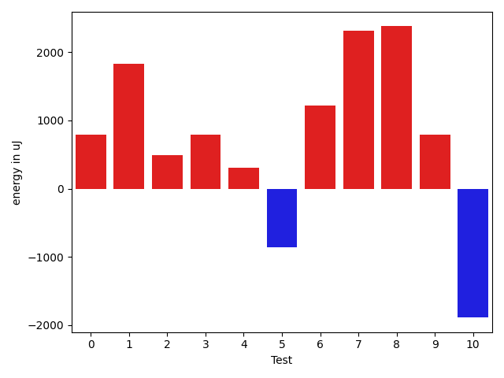

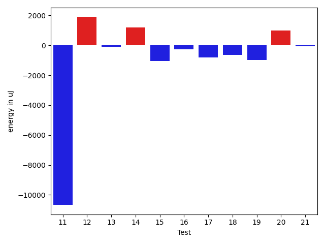

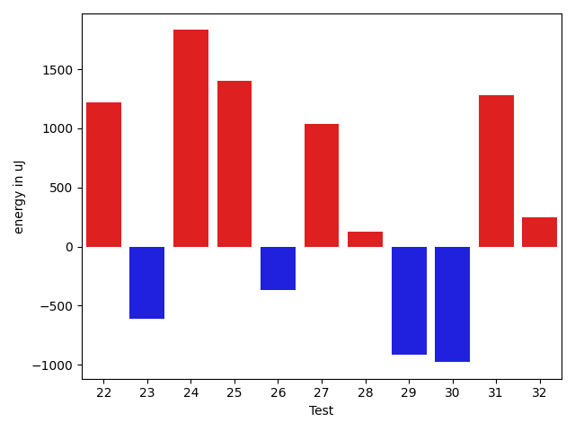

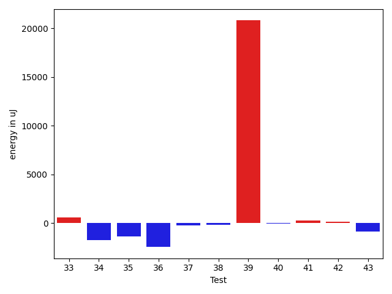

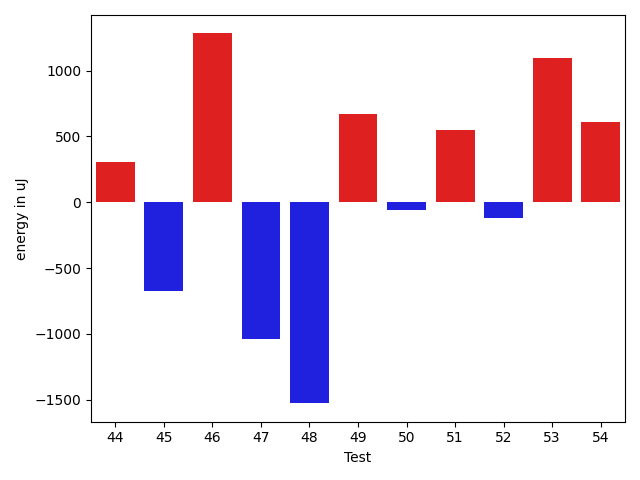

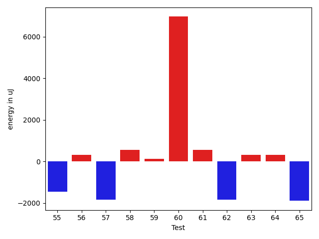

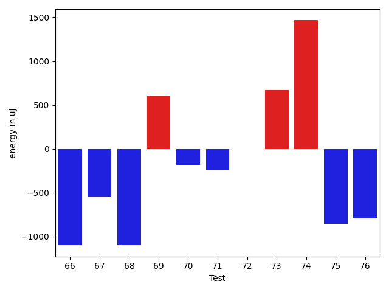

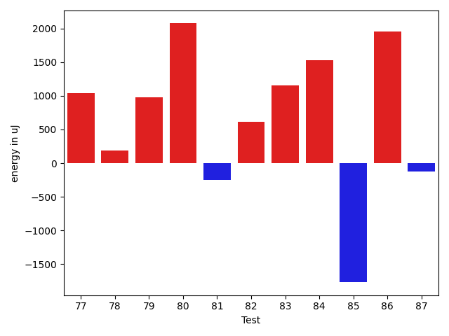

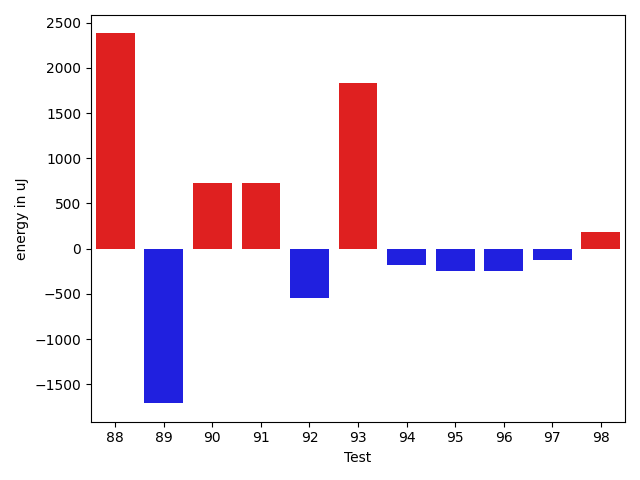

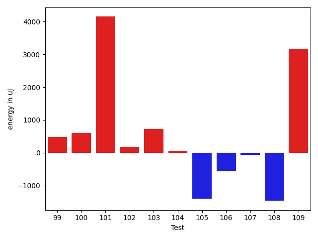

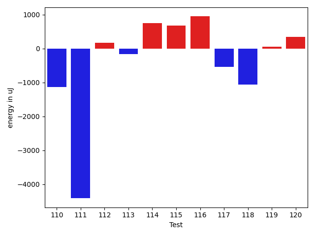

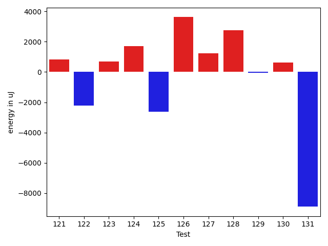

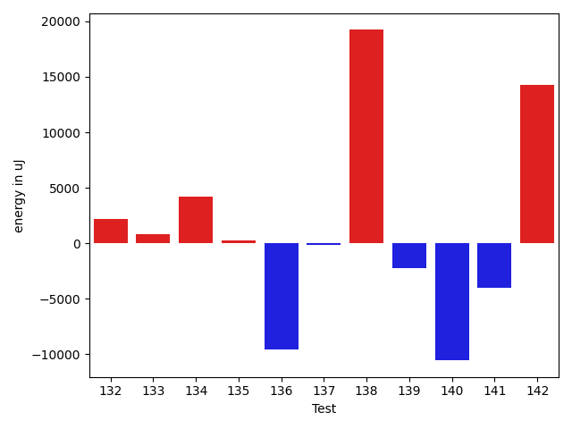

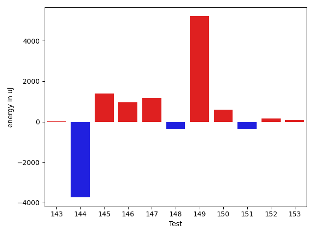

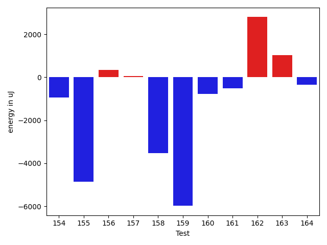

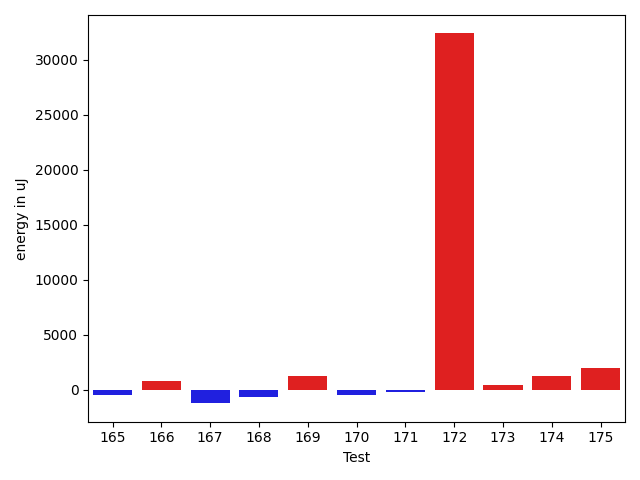

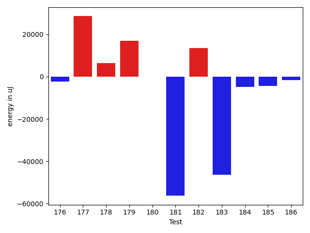

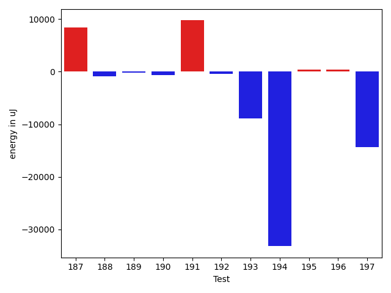

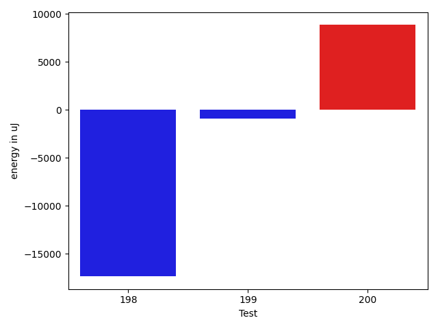

| ID | EnergyV1 | EnergyV2 | DeltaEnergy | σV1 | σV2 |
| --- | --- | --- | --- | --- | --- |
| 0 | 34973 | 35767 | 794 | 13676.934013229431 | 11697.988464078633 |
| 1 | 37049 | 38880 | 1831 | 2224.184358366005 | 3974.568606046028 |
| 2 | 36011 | 36499 | 488 | 3528.094484876344 | 2841.872241095779 |
| 3 | 35523 | 36316 | 793 | 2954.314114797018 | 4543.120550645032 |
| 4 | 36193 | 36499 | 306 | 4044.363019151194 | 9471.889646287762 |
| 5 | 36011 | 35156 | -855 | 3684.1632695280746 | 3329.5260443492552 |
| 6 | 34057 | 35279 | 1222 | 3072.5183596122865 | 3672.543895812093 |
| 7 | 35095 | 37415 | 2320 | 3766.4607974165433 | 3363.7263054957402 |
| 8 | 35889 | 38269 | 2380 | 12423.335518110887 | 17865.368837287064 |
| 9 | 35828 | 36621 | 793 | 3333.339435642562 | 3878.175765795047 |
| 10 | 36193 | 34302 | -1891 | 2814.8963629147374 | 3522.0469925314737 |
| 11 | 35278 | 34179 | -1099 | 42419.51786357051 | 4538.966457054942 |
| 12 | 34424 | 36621 | 2197 | 3749.26699214594 | 3817.5977975524806 |
| 13 | 35889 | 36132 | 243 | 4067.0214377354837 | 3106.3250683725937 |
| 14 | 39124 | 38940 | -184 | 83768.95380885205 | 98038.64278555867 |
| 15 | 36133 | 34973 | -1160 | 3301.589704428594 | 3592.042965593071 |
| 16 | 35888 | 36926 | 1038 | 4100.818239159573 | 3546.9624337132245 |
| 17 | 36011 | 35523 | -488 | 3064.222811394404 | 4111.1924664073895 |
| 18 | 37414 | 36133 | -1281 | 3417.8378420778286 | 4370.860144872592 |
| 19 | 35767 | 34851 | -916 | 5147.887511046535 | 4259.307865850243 |
| 20 | 35157 | 35706 | 549 | 4434.835814835252 | 4200.523906777908 |
| 21 | 36805 | 36560 | -245 | 2695.538469422837 | 3141.483012141071 |
| 22 | 34790 | 36011 | 1221 | 3929.027410112328 | 4306.649838041166 |
| 23 | 36376 | 35766 | -610 | 3879.065975142234 | 4758.958023632845 |
| 24 | 36011 | 37842 | 1831 | 3894.312569072142 | 4571.536245755742 |
| 25 | 34241 | 35645 | 1404 | 4919.036373874461 | 2731.412175454708 |
| 26 | 36316 | 35950 | -366 | 4036.696686370565 | 4197.972716159532 |
| 27 | 35950 | 36987 | 1037 | 2611.7001869791 | 3775.314416558911 |
| 28 | 36865 | 36987 | 122 | 3347.356022993551 | 5039.53326920545 |
| 29 | 37292 | 36377 | -915 | 3762.735441138534 | 3623.734261780243 |
| 30 | 36988 | 36010 | -978 | 39354.11724196593 | 3276.2716414364554 |
| 31 | 36499 | 37781 | 1282 | 4833.1649984605065 | 3539.792514752807 |
| 32 | 37598 | 37842 | 244 | 3420.769830875451 | 3694.187193716937 |
| 33 | 37475 | 38086 | 611 | 4683.099028677132 | 4260.289989378657 |
| 34 | 37781 | 36072 | -1709 | 3397.819533256367 | 3036.0753025996496 |
| 35 | 36438 | 35095 | -1343 | 3499.225900227998 | 4503.4230526495885 |
| 36 | 37171 | 34729 | -2442 | 3563.455339860972 | 3981.4249642008986 |
| 37 | 36133 | 35889 | -244 | 3144.7507341688306 | 3013.550304458182 |
| 38 | 36560 | 36377 | -183 | 12014.940437989964 | 4077.2514678291423 |
| 39 | 45166 | 65979 | 20813 | 104114.69793528212 | 83944.73679320265 |
| 40 | 36132 | 36072 | -60 | 4197.567556520579 | 24083.764225256637 |
| 41 | 37171 | 37475 | 304 | 5891.413701716286 | 4219.848672157534 |
| 42 | 37293 | 37415 | 122 | 10444.892138011863 | 7470.5510348148455 |
| 43 | 38514 | 37659 | -855 | 7791.583258990967 | 10920.466975019886 |
| 44 | 36560 | 36866 | 306 | 8219.622786562768 | 7371.878828536184 |
| 45 | 36560 | 35889 | -671 | 3756.1289479475363 | 4170.8479053668125 |
| 46 | 40405 | 41687 | 1282 | 38139.562830644216 | 40656.480932770544 |
| 47 | 37720 | 36682 | -1038 | 27586.461740031373 | 22941.239562078747 |
| 48 | 39429 | 37903 | -1526 | 19628.55294915783 | 20020.718808524332 |
| 49 | 113342 | 114014 | 672 | 22476.74136459693 | 23496.28929498462 |
| 50 | 36926 | 36865 | -61 | 3201.9506554598875 | 3948.7556240409535 |
| 51 | 38452 | 39002 | 550 | 68377.0317903972 | 55044.75095186638 |
| 52 | 37537 | 37414 | -123 | 3462.4086911014533 | 3773.4807976957445 |
| 53 | 35767 | 36865 | 1098 | 4136.411626330209 | 3521.7269630777932 |
| 54 | 38635 | 39245 | 610 | 0.0 | 0.0 |
| 55 | 36865 | 35400 | -1465 | 4163.925311529975 | 3435.6315263539436 |
| 56 | 35828 | 36133 | 305 | 3986.7193725382654 | 4448.3790442242835 |
| 57 | 37048 | 35217 | -1831 | 3798.830410166674 | 4188.581308441299 |
| 58 | 35279 | 35828 | 549 | 5057.275883319003 | 4361.269805407085 |
| 59 | 36194 | 36316 | 122 | 4300.10263571006 | 3773.4403876800543 |
| 60 | 32653 | 39612 | 6959 | 0.0 | 0.0 |
| 61 | 36011 | 36560 | 549 | 8721.351278456066 | 12412.711846228445 |
| 62 | 70373 | 68542 | -1831 | 12633.484510968812 | 0.0 |
| 63 | 36865 | 37170 | 305 | 3749.671890785746 | 4127.860440025422 |
| 64 | 35888 | 36194 | 306 | 3857.512408842647 | 40407.17420486394 |
| 65 | 37049 | 35157 | -1892 | 3027.6928470918842 | 60858.78546734234 |
| 66 | 37964 | 36865 | -1099 | 4071.3533332124416 | 4466.92340044415 |
| 67 | 36865 | 36316 | -549 | 3796.869194481158 | 4612.61454708715 |
| 68 | 38574 | 37476 | -1098 | 24643.825214470835 | 22445.625820854184 |
| 69 | 36194 | 36804 | 610 | 4132.014477893435 | 7745.953499300747 |
| 70 | 37415 | 37232 | -183 | 3690.0034485078736 | 3944.6582815686543 |
| 71 | 37170 | 36926 | -244 | 3821.207054687419 | 4333.559285018881 |
| 72 | 37292 | 37292 | 0 | 3383.639179926585 | 3656.9315617159555 |
| 73 | 37415 | 38086 | 671 | 14265.377871382363 | 13355.408440037068 |
| 74 | 66528 | 67993 | 1465 | 32333.93557071697 | 25897.272844312738 |
| 75 | 36560 | 35706 | -854 | 22399.427981189965 | 4466.781307995748 |
| 76 | 38452 | 37658 | -794 | 4229.04419371417 | 5139.960945788858 |
| 77 | 36682 | 37720 | 1038 | 10895.653973313065 | 10514.166022915444 |
| 78 | 36132 | 36316 | 184 | 10371.96216674823 | 9564.184995335463 |
| 79 | 35217 | 36193 | 976 | 3328.1437336777 | 4038.8122419595857 |
| 80 | 35705 | 37780 | 2075 | 18250.63125029188 | 20061.708896982927 |
| 81 | 36316 | 36071 | -245 | 3589.1967646368225 | 4791.862094627377 |
| 82 | 36682 | 37292 | 610 | 4255.179257213544 | 3830.031982054908 |
| 83 | 34241 | 35400 | 1159 | 3865.3828339255247 | 5792.28586851182 |
| 84 | 36377 | 37903 | 1526 | 3652.1604537598955 | 4362.195209951317 |
| 85 | 35889 | 34119 | -1770 | 3755.519542891108 | 4976.628688839058 |
| 86 | 38513 | 40466 | 1953 | 98471.68747922184 | 135883.29265697947 |
| 87 | 37780 | 37659 | -121 | 3063.242817992637 | 3733.512874717721 |
| 88 | 34485 | 36865 | 2380 | 6285.784011561327 | 3785.318478931301 |
| 89 | 36132 | 34423 | -1709 | 2983.1979392253434 | 3376.135747568712 |
| 90 | 36011 | 36743 | 732 | 3694.770958315762 | 3566.8265316560055 |
| 91 | 34363 | 35095 | 732 | 3997.2334404290114 | 4245.8403899421255 |
| 92 | 35095 | 34546 | -549 | 3954.492644659573 | 2871.1161640903406 |
| 93 | 33814 | 35645 | 1831 | 27403.893221636547 | 36440.23328474126 |
| 94 | 35888 | 35705 | -183 | 5168.501063338918 | 3827.7766461655074 |
| 95 | 37170 | 36926 | -244 | 3388.6336616361227 | 6343.638069410855 |
| 96 | 35889 | 35644 | -245 | 3136.116700889812 | 3207.763831557547 |
| 97 | 36438 | 36316 | -122 | 4180.310364519963 | 3337.9866837049717 |
| 98 | 37048 | 37231 | 183 | 34910.28384661653 | 4132.779659303548 |
| 99 | 37598 | 38086 | 488 | 3933.3443908905206 | 26748.62788368259 |
| 100 | 38025 | 38635 | 610 | 3471.435463260549 | 6988.507214820631 |
| 101 | 60363 | 64514 | 4151 | 83319.01710864104 | 110628.13386729867 |
| 102 | 36988 | 37170 | 182 | 4280.337836968273 | 4131.59818466859 |
| 103 | 36132 | 36865 | 733 | 5088.636445915371 | 31888.238578801942 |
| 104 | 38208 | 38269 | 61 | 4101.379362054625 | 4118.235139910059 |
| 105 | 38391 | 36987 | -1404 | 4093.463565744983 | 20898.028666379672 |
| 106 | 37720 | 37171 | -549 | 4303.243594706935 | 23741.296310016434 |
| 107 | 39917 | 39856 | -61 | 18252.335154550645 | 16881.819396519837 |
| 108 | 38086 | 36621 | -1465 | 3165.130514149082 | 3710.9136597981083 |
| 109 | 34179 | 37353 | 3174 | 4661.256564013137 | 4406.93591345832 |
| 110 | 37536 | 36072 | -1464 | 4315.729568903891 | 3606.126410672634 |
| 111 | 39062 | 37841 | -1221 | 34577.869440621 | 35745.9896540507 |
| 112 | 34973 | 36133 | 1160 | 4114.924385480837 | 4598.292077852493 |
| 113 | 37353 | 37476 | 123 | 3008.433990698298 | 3679.8126737117295 |
| 114 | 34180 | 36682 | 2502 | 4276.3268148610905 | 4919.227027440388 |
| 115 | 37292 | 37781 | 489 | 4226.554745623376 | 4341.854046436111 |
| 116 | 35766 | 36438 | 672 | 2985.511566809875 | 2791.8150060091334 |
| 117 | 37293 | 36132 | -1161 | 3453.4560746265474 | 4702.1410046312785 |
| 118 | 36316 | 34912 | -1404 | 3879.3062153950627 | 5209.302407027935 |
| 119 | 36743 | 38269 | 1526 | 11283.399243114029 | 10129.381755480632 |
| 120 | 35461 | 36499 | 1038 | 3603.4052548294567 | 3307.243390315294 |
| 121 | 37293 | 38086 | 793 | 10011.498663131491 | 9830.981828289643 |
| 122 | 37414 | 37841 | 427 | 24635.14066054798 | 10508.237810381132 |
| 123 | 38513 | 38635 | 122 | 69726.4609253294 | 66785.71662123247 |
| 124 | 61279 | 64881 | 3602 | 23550.969401526934 | 24943.6153013022 |
| 125 | 35950 | 36865 | 915 | 22209.493236115537 | 8560.26701318797 |
| 126 | 39184 | 39673 | 489 | 17621.942884233922 | 18637.58864187742 |
| 127 | 36499 | 36316 | -183 | 4089.628064076163 | 7623.86718664101 |
| 128 | 38330 | 38391 | 61 | 15998.854773386667 | 25766.691520510038 |
| 129 | 36987 | 36804 | -183 | 6755.826433020361 | 6260.673242240781 |
| 130 | 36743 | 37903 | 1160 | 3909.1547321256194 | 3911.6185659432717 |
| 131 | 39490 | 39612 | 122 | 43900.40774158626 | 29122.20208250425 |
| 132 | 36072 | 37353 | 1281 | 3720.3224733970064 | 4662.947645911618 |
| 133 | 37231 | 38757 | 1526 | 3853.697757873191 | 4267.5955474758775 |
| 134 | 70008 | 70007 | -1 | 23433.618681160435 | 47741.04324733855 |
| 135 | 37414 | 37292 | -122 | 6277.902944475825 | 6986.3888606704395 |
| 136 | 39124 | 36499 | -2625 | 27998.16584282138 | 6693.178036237036 |
| 137 | 34423 | 36621 | 2198 | 4580.763599761486 | 4766.322344916694 |
| 138 | 38696 | 38696 | 0 | 28698.120499864897 | 51523.568099268894 |
| 139 | 42846 | 61340 | 18494 | 372233.052864729 | 365750.9396082663 |
| 140 | 37963 | 37719 | -244 | 44239.107965277115 | 3191.9924811941523 |
| 141 | 37841 | 38330 | 489 | 26199.5056210936 | 4436.089899179231 |
| 142 | 38452 | 38879 | 427 | 27922.903474779825 | 46024.487743371785 |
| 143 | 37110 | 37170 | 60 | 3378.111826126481 | 4454.661533591304 |
| 144 | 36621 | 36926 | 305 | 21506.001507264198 | 4162.898588735023 |
| 145 | 37109 | 37720 | 611 | 3448.895887897394 | 4015.0210094652293 |
| 146 | 36926 | 37414 | 488 | 3269.5850533207476 | 4341.43081125208 |
| 147 | 36072 | 37415 | 1343 | 3617.993600569495 | 3423.2152654166953 |
| 148 | 37170 | 36072 | -1098 | 4164.37995293417 | 3405.515647850572 |
| 149 | 37109 | 39551 | 2442 | 34793.64681465559 | 42416.30638622127 |
| 150 | 36255 | 36438 | 183 | 3641.2467269267063 | 3512.6990586322436 |
| 151 | 36987 | 36804 | -183 | 5963.28952216395 | 4148.503806513025 |
| 152 | 36011 | 36254 | 243 | 4433.977602844429 | 4218.573163871293 |
| 153 | 35522 | 35523 | 1 | 4150.513660732728 | 4602.629688634697 |
| 154 | 36926 | 36132 | -794 | 6493.957531204822 | 4055.821030299416 |
| 155 | 40772 | 37476 | -3296 | 33399.1479031756 | 27225.37981414719 |
| 156 | 36743 | 36438 | -305 | 4119.660615844901 | 3916.8510969343165 |
| 157 | 37109 | 36072 | -1037 | 4802.158676118198 | 4249.033545193755 |
| 158 | 36560 | 36133 | -427 | 24057.617988953105 | 4312.368138691316 |
| 159 | 40649 | 37415 | -3234 | 43449.268115234874 | 46633.668803712775 |
| 160 | 37841 | 37110 | -731 | 3417.810664081643 | 3667.163989720121 |
| 161 | 37720 | 38452 | 732 | 3641.429184561035 | 4943.185332016864 |
| 162 | 37537 | 40100 | 2563 | 3692.852486137918 | 3529.944873308045 |
| 163 | 37353 | 38208 | 855 | 4016.692316865626 | 3861.610653600386 |
| 164 | 37170 | 36194 | -976 | 3999.4373512257307 | 4167.199350483087 |
| 165 | 36316 | 35888 | -428 | 7323.308225571944 | 3582.7359670560695 |
| 166 | 37170 | 37964 | 794 | 4447.172887926582 | 5034.258137879993 |
| 167 | 37232 | 36011 | -1221 | 32990.57439341207 | 3440.385802816629 |
| 168 | 36377 | 35767 | -610 | 3330.176216928475 | 3961.1399468636478 |
| 169 | 36926 | 38147 | 1221 | 4669.0681992877335 | 3601.7732188465166 |
| 170 | 37109 | 36621 | -488 | 3608.419845614175 | 3715.738030791378 |
| 171 | 37231 | 36987 | -244 | 3539.6573327429587 | 3896.1752983606316 |
| 172 | 41076 | 73486 | 32410 | 560479.1034678267 | 800740.6313676846 |
| 173 | 36682 | 37109 | 427 | 20065.829315802686 | 9086.826905519378 |
| 174 | 36682 | 37963 | 1281 | 5051.64735672104 | 7940.283576991347 |
| 175 | 38879 | 40832 | 1953 | 553716.607006328 | 473132.5768397731 |
| 176 | 38269 | 38330 | 61 | 16320.728399794869 | 13681.063831067804 |
| 177 | 39245 | 38207 | -1038 | 133150.5873447695 | 164861.38499287388 |
| 178 | 38391 | 38879 | 488 | 54356.79542252651 | 71622.97883049684 |
| 179 | 357116 | 363891 | 6775 | 108348.32234428523 | 139262.9361442117 |
| 180 | 40100 | 38635 | -1465 | 36563.86445511824 | 35088.51570447945 |
| 181 | 38513 | 37842 | -671 | 264797.43139463814 | 26649.093485372046 |
| 182 | 37415 | 37780 | 365 | 250050.67433466166 | 321588.8149130678 |
| 183 | 38879 | 38696 | -183 | 233277.22192736753 | 7386.510888568348 |
| 184 | 38452 | 38879 | 427 | 144914.02447195334 | 139513.9092209646 |
| 185 | 72326 | 69396 | -2930 | 30043.274296189447 | 23331.02643662886 |
| 186 | 39062 | 39429 | 367 | 22777.247116585448 | 18841.896702119277 |
| 187 | 38757 | 37842 | -915 | 3512.6182462309453 | 41040.07240789838 |
| 188 | 38574 | 37719 | -855 | 3410.40348126722 | 4405.12008350662 |
| 189 | 37841 | 38575 | 734 | 3754.177345887512 | 3949.8256452784312 |
| 190 | 38635 | 37415 | -1220 | 5643.688089054868 | 6864.554680385319 |
| 191 | 36804 | 38330 | 1526 | 35726.59134733392 | 48718.31397786209 |
| 192 | 37049 | 38391 | 1342 | 15408.047850217816 | 12959.374983747288 |
| 193 | 37353 | 38208 | 855 | 51388.51946268084 | 3790.345057533999 |
| 194 | 36682 | 40771 | 4089 | 99323.9424423014 | 4373.66279889065 |
| 195 | 36804 | 37536 | 732 | 4056.557145536101 | 3665.9438887326246 |
| 196 | 35339 | 38147 | 2808 | 5196.093709823741 | 4147.4011166512455 |
| 197 | 38696 | 42541 | 3845 | 73083.07153049238 | 5541.676118287679 |
| 198 | 37719 | 37475 | -244 | 85810.23316303772 | 71463.96866612151 |
| 199 | 38024 | 36254 | -1770 | 3695.9499783160663 | 4216.545831396108 |
| 200 | 37536 | 39611 | 2075 | 7041.126015161598 | 33751.29213853646 |

## Delta Duration per test method

| ID | DurationV1 | DurationsV2 | DeltaDuration |
| --- | --- | --- | --- |
| 0 | 946220.7857142857 | 953800.4745762711 | 7579.688861985458 |
| 1 | 529098.05 | 549467.0416666666 | 20368.99166666658 |
| 2 | 417391.7272727273 | 424385.6818181818 | 6993.95454545453 |
| 3 | 559957.125 | 552648.3448275862 | -7308.780172413797 |
| 4 | 1038127.9310344828 | 860360.0588235294 | -177767.87221095338 |
| 5 | 492763.76470588235 | 479518.32 | -13245.444705882343 |
| 6 | 525783.1724137932 | 521106.8333333333 | -4676.339080459846 |
| 7 | 522994.69696969696 | 543890.2692307692 | 20895.572261072288 |
| 8 | 996394.0 | 1033530.0256410256 | 37136.025641025626 |
| 9 | 477646.6111111111 | 486385.84 | 8739.228888888902 |
| 10 | 430610.77777777775 | 475530.12 | 44919.34222222224 |
| 11 | 724293.2222222222 | 421777.64705882355 | -302515.5751633987 |
| 12 | 431166.3333333333 | 426766.5 | -4399.833333333314 |
| 13 | 564203.5 | 602058.68 | 37855.18000000005 |
| 14 | 1857474.642857143 | 1661676.34375 | -195798.29910714296 |
| 15 | 569356.0833333334 | 634240.6 | 64884.516666666605 |
| 16 | 435720.0869565217 | 443944.5 | 8224.413043478271 |
| 17 | 425175.8076923077 | 434779.5789473684 | 9603.77125506074 |
| 18 | 509461.85714285716 | 554832.1481481482 | 45370.291005291045 |
| 19 | 486848.2916666667 | 554020.75 | 67172.45833333331 |
| 20 | 522531.13636363635 | 556931.1052631579 | 34399.96889952151 |
| 21 | 400171.76470588235 | 417554.35294117645 | 17382.588235294097 |
| 22 | 520290.5652173913 | 514335.1 | -5955.46521739132 |
| 23 | 465964.77777777775 | 471839.5652173913 | 5874.787439613545 |
| 24 | 477560.0 | 522761.5238095238 | 45201.52380952379 |
| 25 | 461797.85 | 449555.8333333333 | -12242.016666666663 |
| 26 | 557612.2857142857 | 627311.7575757576 | 69699.47186147189 |
| 27 | 762284.4666666667 | 440269.78571428574 | -322014.68095238094 |
| 28 | 480329.7619047619 | 457428.0 | -22901.761904761894 |
| 29 | 445367.3888888889 | 451034.4 | 5667.011111111147 |
| 30 | 694354.72 | 474297.3333333333 | -220057.38666666666 |
| 31 | 422716.1875 | 471480.35 | 48764.16249999998 |
| 32 | 494654.85714285716 | 539919.3 | 45264.44285714289 |
| 33 | 465653.45454545453 | 475927.56 | 10274.105454545468 |
| 34 | 474468.3181818182 | 477327.75 | 2859.4318181818235 |
| 35 | 417033.86363636365 | 412622.5263157895 | -4411.337320574152 |
| 36 | 546232.0714285715 | 556762.2692307692 | 10530.19780219777 |
| 37 | 409465.94736842107 | 442754.1875 | 33288.24013157893 |
| 38 | 840011.6530612245 | 759122.2765957447 | -80889.37646547984 |
| 39 | 2695147.612244898 | 2344473.727272727 | -350673.8849721709 |
| 40 | 1006536.033898305 | 1092844.0461538462 | 86308.01225554117 |
| 41 | 899071.8301886793 | 828934.0819672131 | -70137.7482214662 |
| 42 | 926327.8235294118 | 812663.5409836066 | -113664.28254580521 |
| 43 | 1170408.3461538462 | 1179362.5625 | 8954.216346153757 |
| 44 | 1021181.8225806452 | 927382.5925925926 | -93799.22998805263 |
| 45 | 865066.9846153846 | 966144.5689655172 | 101077.58435013262 |
| 46 | 1783633.6721311475 | 1673835.4642857143 | -109798.20784543315 |
| 47 | 1271148.1636363636 | 1213468.8059701493 | -57679.35766621423 |
| 48 | 1165926.3018867925 | 1070068.52 | -95857.78188679251 |
| 49 | 3303805.1515151514 | 3391114.373737374 | 87309.22222222248 |
| 50 | 439493.88 | 438725.6666666667 | -768.2133333333186 |
| 51 | 1700401.5569620254 | 1519619.2567567567 | -180782.30020526866 |
| 52 | 441990.36363636365 | 466379.7272727273 | 24389.363636363647 |
| 53 | 541717.4054054054 | 559286.0 | 17568.594594594557 |
| 54 | 985577.0 | 857516.0 | -128061.0 |
| 55 | 507298.96875 | 814835.0869565217 | 307536.1182065217 |
| 56 | 546707.1212121212 | 587737.6875 | 41030.566287878784 |
| 57 | 752047.8461538461 | 728392.5789473684 | -23655.2672064777 |
| 58 | 417596.7 | 458445.9666666667 | 40849.26666666666 |
| 59 | 569755.4074074074 | 690552.5625 | 120797.15509259258 |
| 60 | 946784.0 | 899398.0 | -47386.0 |
| 61 | 654585.6170212766 | 741879.575 | 87293.95797872334 |
| 62 | 2855867.0 | 2666815.0 | -189052.0 |
| 63 | 696818.0952380953 | 721336.8947368421 | 24518.79949874687 |
| 64 | 452107.0 | 746740.2222222222 | 294633.22222222225 |
| 65 | 393088.3846153846 | 827130.2 | 434041.8153846153 |
| 66 | 825608.4509803922 | 858958.5087719298 | 33350.057791537605 |
| 67 | 932734.16 | 874706.96 | -58027.20000000007 |
| 68 | 1090606.9166666667 | 1054268.0714285714 | -36338.84523809538 |
| 69 | 851622.725490196 | 898200.0 | 46577.274509803974 |
| 70 | 806424.0833333334 | 887827.8679245283 | 81403.78459119494 |
| 71 | 942222.5076923077 | 965459.3382352941 | 23236.830542986398 |
| 72 | 589780.9230769231 | 612699.717948718 | 22918.794871794875 |
| 73 | 1290347.3373493976 | 1366441.3333333333 | 76093.99598393566 |
| 74 | 2065793.4242424243 | 2087036.5252525252 | 21243.101010100916 |
| 75 | 1053553.6949152541 | 907785.6617647059 | -145768.03315054823 |
| 76 | 623809.7352941176 | 679286.5 | 55476.76470588241 |
| 77 | 1177200.3086419753 | 1254887.393258427 | 77687.08461645176 |
| 78 | 922080.4642857143 | 1009288.0 | 87207.53571428568 |
| 79 | 507856.8095238095 | 506018.3793103448 | -1838.430213464715 |
| 80 | 1055912.1311475409 | 1293934.2962962964 | 238022.16514875554 |
| 81 | 825528.4655172414 | 911790.5471698113 | 86262.08165256993 |
| 82 | 611770.7428571428 | 626027.1282051282 | 14256.38534798543 |
| 83 | 540105.4642857143 | 729794.4444444445 | 189688.98015873018 |
| 84 | 792814.8039215687 | 788736.4 | -4078.40392156865 |
| 85 | 459440.55555555556 | 527269.0 | 67828.44444444444 |
| 86 | 1677917.1578947369 | 2975819.4418604653 | 1297902.2839657285 |
| 87 | 628929.5151515151 | 703493.1351351351 | 74563.61998362001 |
| 88 | 564644.6571428571 | 564325.4285714285 | -319.2285714285681 |
| 89 | 413523.3157894737 | 567450.4347826086 | 153927.11899313494 |
| 90 | 636343.25 | 677283.2894736842 | 40940.039473684155 |
| 91 | 795411.2444444444 | 684738.6730769231 | -110672.5713675213 |
| 92 | 549004.6333333333 | 582363.0 | 33358.3666666667 |
| 93 | 756972.0 | 732878.5185185185 | -24093.48148148146 |
| 94 | 452728.7272727273 | 484024.82608695654 | 31296.098814229248 |
| 95 | 621570.90625 | 725009.7894736842 | 103438.88322368416 |
| 96 | 523058.96 | 647199.9655172414 | 124141.00551724137 |
| 97 | 703509.1923076923 | 738210.3269230769 | 34701.134615384624 |
| 98 | 967418.7358490566 | 829355.6226415094 | -138063.11320754723 |
| 99 | 697610.9302325582 | 863693.7708333334 | 166082.8406007752 |
| 100 | 858157.0555555555 | 884606.44 | 26449.38444444444 |
| 101 | 2425519.163265306 | 2634756.1224489794 | 209236.95918367337 |
| 102 | 665140.8695652174 | 736873.3157894737 | 71732.4462242563 |
| 103 | 870495.7884615385 | 1115610.7450980393 | 245114.95663650078 |
| 104 | 665211.7045454546 | 724706.1315789474 | 59494.42703349283 |
| 105 | 728349.2285714286 | 907919.8363636363 | 179570.60779220774 |
| 106 | 825332.5660377359 | 835936.24 | 10603.673962264089 |
| 107 | 1164483.543478261 | 1073130.2340425532 | -91353.30943570775 |
| 108 | 443107.23076923075 | 441418.04761904763 | -1689.1831501831184 |
| 109 | 428891.2 | 416116.29411764705 | -12774.905882352963 |
| 110 | 475923.6842105263 | 456667.7894736842 | -19255.894736842078 |
| 111 | 1187992.105263158 | 954605.7 | -233386.40526315803 |
| 112 | 382746.3846153846 | 423009.36842105264 | 40262.98380566802 |
| 113 | 428925.6666666667 | 438451.46153846156 | 9525.794871794875 |
| 114 | 440950.25 | 373721.8 | -67228.45000000001 |
| 115 | 426357.53846153844 | 368406.23529411765 | -57951.30316742079 |
| 116 | 416801.13333333336 | 400747.8888888889 | -16053.244444444485 |
| 117 | 485542.6875 | 456728.6296296296 | -28814.057870370394 |
| 118 | 424698.17647058825 | 402502.6842105263 | -22195.49226006196 |
| 119 | 1352739.5666666667 | 1255542.7083333333 | -97196.8583333334 |
| 120 | 830235.276923077 | 825671.4426229508 | -4563.834300126182 |
| 121 | 1283564.0 | 1218544.2386363635 | -65019.76136363647 |
| 122 | 1415927.1382978724 | 1311435.8709677418 | -104491.26733013056 |
| 123 | 1924061.894117647 | 1901414.0454545454 | -22647.84866310167 |
| 124 | 1917954.5656565656 | 1910512.6363636365 | -7441.929292929126 |
| 125 | 1338389.4888888889 | 1236457.0813953488 | -101932.40749354009 |
| 126 | 1534404.878787879 | 1526192.5656565656 | -8212.313131313305 |
| 127 | 1058511.9350649351 | 1052812.2647058824 | -5699.670359052718 |
| 128 | 1349985.9772727273 | 1397106.130952381 | 47120.15367965377 |
| 129 | 938022.0281690141 | 966430.4821428572 | 28408.453973843018 |
| 130 | 848599.0612244898 | 935321.8 | 86722.73877551022 |
| 131 | 1418269.0862068965 | 1090364.2727272727 | -327904.81347962376 |
| 132 | 772838.8108108108 | 633916.6744186047 | -138922.13639220607 |
| 133 | 633880.4827586206 | 598847.21875 | -35033.26400862064 |
| 134 | 2008787.5555555555 | 2188537.01010101 | 179749.4545454546 |
| 135 | 903190.2448979592 | 993151.15625 | 89960.91135204083 |
| 136 | 995496.4230769231 | 728249.9354838709 | -267246.4875930522 |
| 137 | 669126.695652174 | 655473.3913043478 | -13653.304347826168 |
| 138 | 860068.5806451613 | 1585995.6 | 725927.0193548388 |
| 139 | 3915664.414141414 | 3813744.707070707 | -101919.70707070734 |
| 140 | 935197.1025641026 | 730544.225 | -204652.87756410264 |
| 141 | 920229.5757575758 | 680985.96 | -239243.61575757584 |
| 142 | 1202212.0930232557 | 1756524.7777777778 | 554312.684754522 |
| 143 | 682579.2926829269 | 717482.9444444445 | 34903.65176151763 |
| 144 | 873460.9117647059 | 652152.9743589744 | -221307.93740573153 |
| 145 | 569472.1333333333 | 593229.5925925926 | 23757.45925925928 |
| 146 | 578549.8125 | 569566.4666666667 | -8983.345833333326 |
| 147 | 589583.695652174 | 553139.9032258064 | -36443.79242636752 |
| 148 | 775718.72 | 780931.4571428571 | 5212.737142857164 |
| 149 | 1485880.9848484849 | 1456981.3142857142 | -28899.670562770683 |
| 150 | 886066.9696969697 | 847748.8421052631 | -38318.12759170658 |
| 151 | 956875.5970149253 | 961574.1571428571 | 4698.560127931763 |
| 152 | 752281.0212765958 | 712038.4736842106 | -40242.54759238521 |
| 153 | 852247.6346153846 | 831157.8571428572 | -21089.777472527465 |
| 154 | 796539.4285714285 | 758474.3050847457 | -38065.12348668277 |
| 155 | 1650693.0869565217 | 1544774.4081632653 | -105918.6787932564 |
| 156 | 716342.9487179487 | 679501.0 | -36841.94871794875 |
| 157 | 767140.0370370371 | 751020.8863636364 | -16119.150673400727 |
| 158 | 827501.12 | 734875.3 | -92625.81999999995 |
| 159 | 1545471.75 | 1213070.875 | -332400.875 |
| 160 | 737104.8 | 609600.95 | -127503.8500000001 |
| 161 | 384893.1111111111 | 417016.26666666666 | 32123.15555555554 |
| 162 | 482847.0 | 521135.5 | 38288.5 |
| 163 | 528967.0 | 583456.0 | 54489.0 |
| 164 | 930184.7547169811 | 858674.9 | -71509.85471698106 |
| 165 | 896241.1086956522 | 723203.5714285715 | -173037.53726708074 |
| 166 | 695495.1935483871 | 552248.0689655172 | -143247.12458286993 |
| 167 | 755520.380952381 | 495042.8888888889 | -260477.49206349207 |
| 168 | 599517.1935483871 | 540388.7826086957 | -59128.41093969147 |
| 169 | 576328.4 | 523007.88 | -53320.52000000002 |
| 170 | 573226.7333333333 | 604408.5714285715 | 31181.8380952382 |
| 171 | 467974.8947368421 | 440202.26666666666 | -27772.628070175415 |
| 172 | 5548821.895522388 | 12086962.426470589 | 6538140.530948201 |
| 173 | 1040166.0281690141 | 1137930.7746478873 | 97764.74647887319 |
| 174 | 877840.5333333333 | 1050553.564516129 | 172713.03118279565 |
| 175 | 5817242.816091954 | 4646567.417582418 | -1170675.398509536 |
| 176 | 1391840.9659090908 | 1308848.7088607594 | -82992.25704833143 |
| 177 | 2228146.3913043477 | 3063080.769230769 | 834934.3779264214 |
| 178 | 1685928.4705882352 | 1775103.0447761193 | 89174.5741878841 |
| 179 | 10686583.595959596 | 10818555.323232323 | 131971.7272727266 |
| 180 | 1709727.8510638298 | 1685746.2886597938 | -23981.562404036056 |
| 181 | 2885745.048780488 | 986904.6888888889 | -1898840.359891599 |
| 182 | 1970713.2045454546 | 2036727.638888889 | 66014.4343434344 |
| 183 | 2256234.8947368423 | 836171.3428571429 | -1420063.5518796993 |
| 184 | 2766888.2264150945 | 2435542.2444444443 | -331345.98197065014 |
| 185 | 2131834.8080808083 | 2054267.4343434344 | -77567.37373737385 |
| 186 | 888705.4 | 713600.5555555555 | -175104.84444444452 |
| 187 | 599154.5135135135 | 803415.7037037037 | 204261.19019019022 |
| 188 | 760994.0408163265 | 718897.7380952381 | -42096.3027210884 |
| 189 | 700571.1 | 732675.0227272727 | 32103.92272727273 |
| 190 | 702030.8235294118 | 750383.3 | 48352.47647058824 |
| 191 | 1164709.4905660378 | 1502802.9523809524 | 338093.4618149146 |
| 192 | 1172183.0675675676 | 1170756.875 | -1426.1925675675739 |
| 193 | 1056098.6785714286 | 567545.724137931 | -488552.9544334976 |
| 194 | 1836500.84 | 506858.4 | -1329642.44 |
| 195 | 681710.6875 | 593269.1851851852 | -88441.50231481483 |
| 196 | 623852.9047619047 | 498384.04 | -125468.86476190476 |
| 197 | 935892.0 | 498000.3 | -437891.7 |
| 198 | 2020133.5714285714 | 1499188.6818181819 | -520944.8896103895 |
| 199 | 466720.4117647059 | 464967.7083333333 | -1752.703431372589 |
| 200 | 1040665.6666666666 | 1226829.0 | 186163.33333333337 |

## Misc.

| ID | Test Class | Test Method |
| --- | --- | --- |
| 0 | com.google.gson.functional.PrimitiveTest | testDeserializePrimitiveWrapperAsObjectField |
| 1 | com.google.gson.functional.PrimitiveTest | testPrimitiveIntegerAutoboxedDeserialization |
| 2 | com.google.gson.functional.PrimitiveTest | testBigDecimalInfinityDeserializationNotSupported |
| 3 | com.google.gson.functional.PrimitiveTest | testDoubleNaNDeserialization |
| 4 | com.google.gson.functional.PrimitiveTest | testPrimitiveDoubleAutoboxedDeserialization |
| 5 | com.google.gson.functional.PrimitiveTest | testFloatInfinityDeserialization |
| 6 | com.google.gson.functional.PrimitiveTest | testLargeDoubleDeserialization |
| 7 | com.google.gson.functional.PrimitiveTest | testBigIntegerInASingleElementArrayDeserialization |
| 8 | com.google.gson.functional.PrimitiveTest | testNumberDeserialization |
| 9 | com.google.gson.functional.PrimitiveTest | testBigDecimalInASingleElementArrayDeserialization |
| 10 | com.google.gson.functional.PrimitiveTest | testLongAsStringDeserialization |
| 11 | com.google.gson.functional.PrimitiveTest | testPrimitiveClassLiteral |
| 12 | com.google.gson.functional.PrimitiveTest | testBigDecimalNoFractAsStringRepresentationDeserialization |
| 13 | com.google.gson.functional.PrimitiveTest | testPrimitiveBooleanAutoboxedDeserialization |
| 14 | com.google.gson.functional.PrimitiveTest | testPrimitiveIntegerAutoboxedInASingleElementArrayDeserialization |
| 15 | com.google.gson.functional.PrimitiveTest | testBigIntegerDeserialization |
| 16 | com.google.gson.functional.PrimitiveTest | testNegativeInfinityDeserialization |
| 17 | com.google.gson.functional.PrimitiveTest | testBigDecimalNegativeInfinityDeserializationNotSupported |
| 18 | com.google.gson.functional.PrimitiveTest | testPrimitiveBooleanAutoboxedInASingleElementArrayDeserialization |
| 19 | com.google.gson.functional.PrimitiveTest | testPrimitiveDoubleAutoboxedInASingleElementArrayDeserialization |
| 20 | com.google.gson.functional.PrimitiveTest | testDoubleNoFractAsStringRepresentationDeserialization |
| 21 | com.google.gson.functional.PrimitiveTest | testSmallValueForBigIntegerDeserialization |
| 22 | com.google.gson.functional.PrimitiveTest | testDoubleAsStringRepresentationDeserialization |
| 23 | com.google.gson.functional.PrimitiveTest | testFloatNaNDeserialization |
| 24 | com.google.gson.functional.PrimitiveTest | testBadValueForBigIntegerDeserialization |
| 25 | com.google.gson.functional.PrimitiveTest | testBigDecimalNaNDeserializationNotSupported |
| 26 | com.google.gson.functional.PrimitiveTest | testOverridingDefaultPrimitiveSerialization |
| 27 | com.google.gson.functional.PrimitiveTest | testBigDecimalPreservePrecisionDeserialization |
| 28 | com.google.gson.functional.PrimitiveTest | testBigDecimalDeserialization |
| 29 | com.google.gson.functional.PrimitiveTest | testSmallValueForBigDecimalDeserialization |
| 30 | com.google.gson.functional.PrimitiveTest | testDoubleInfinityDeserialization |
| 31 | com.google.gson.functional.PrimitiveTest | testNegativeInfinityFloatDeserialization |
| 32 | com.google.gson.functional.PrimitiveTest | testPrimitiveLongAutoboxedInASingleElementArrayDeserialization |
| 33 | com.google.gson.functional.PrimitiveTest | testReallyLongValuesDeserialization |
| 34 | com.google.gson.functional.PrimitiveTest | testPrimitiveLongAutoboxedDeserialization |
| 35 | com.google.gson.functional.PrimitiveTest | testQuotedStringSerializationAndDeserialization |
| 36 | com.google.gson.functional.PrimitiveTest | testUnquotedStringDeserialization |
| 37 | com.google.gson.functional.PrimitiveTest | testBigDecimalAsStringRepresentationDeserialization |
| 38 | com.google.gson.functional.CustomDeserializerTest | testDefaultConstructorNotCalledOnField |
| 39 | com.google.gson.functional.CustomDeserializerTest | testDefaultConstructorNotCalledOnObject |
| 40 | com.google.gson.functional.CustomDeserializerTest | testCustomDeserializerReturnsNullForArrayElementsForArrayField |
| 41 | com.google.gson.functional.CustomDeserializerTest | testCustomDeserializerReturnsNull |
| 42 | com.google.gson.functional.CustomDeserializerTest | testCustomDeserializerReturnsNullForTopLevelPrimitives |
| 43 | com.google.gson.functional.CustomDeserializerTest | testJsonTypeFieldBasedDeserialization |
| 44 | com.google.gson.functional.CustomDeserializerTest | testCustomDeserializerReturnsNullForArrayElements |
| 45 | com.google.gson.functional.CustomDeserializerTest | testCustomDeserializerReturnsNullForPrimitiveFields |
| 46 | com.google.gson.functional.CustomDeserializerTest | testCustomDeserializerReturnsNullForTopLevelObject |
| 47 | com.google.gson.functional.DefaultTypeAdaptersTest | testTreeSetDeserialization |
| 48 | com.google.gson.functional.DefaultTypeAdaptersTest | testBigIntegerFieldDeserialization |
| 49 | com.google.gson.functional.DefaultTypeAdaptersTest | testDefaultDateDeserializationUsingBuilder |
| 50 | com.google.gson.functional.DefaultTypeAdaptersTest | testLocaleDeserializationWithLanguage |
| 51 | com.google.gson.functional.DefaultTypeAdaptersTest | testBadValueForBigDecimalDeserialization |
| 52 | com.google.gson.functional.DefaultTypeAdaptersTest | testUuidDeserialization |
| 53 | com.google.gson.functional.DefaultTypeAdaptersTest | testDefaultGregorianCalendarDeserialization |
| 54 | com.google.gson.functional.DefaultTypeAdaptersTest | testDefaultJavaSqlTimestampDeserialization |
| 55 | com.google.gson.functional.DefaultTypeAdaptersTest | testUrlDeserialization |
| 56 | com.google.gson.functional.DefaultTypeAdaptersTest | testUrlNullDeserialization |
| 57 | com.google.gson.functional.DefaultTypeAdaptersTest | testPropertiesDeserialization |
| 58 | com.google.gson.functional.DefaultTypeAdaptersTest | testUriDeserialization |
| 59 | com.google.gson.functional.DefaultTypeAdaptersTest | testDefaultCalendarDeserialization |
| 60 | com.google.gson.functional.DefaultTypeAdaptersTest | testDefaultJavaSqlDateDeserialization |
| 61 | com.google.gson.functional.DefaultTypeAdaptersTest | testBigDecimalFieldDeserialization |
| 62 | com.google.gson.functional.DefaultTypeAdaptersTest | testDefaultDateDeserialization |
| 63 | com.google.gson.functional.DefaultTypeAdaptersTest | testDateDeserializationWithPattern |
| 64 | com.google.gson.functional.DefaultTypeAdaptersTest | testLocaleDeserializationWithLanguageCountryVariant |
| 65 | com.google.gson.functional.DefaultTypeAdaptersTest | testLocaleDeserializationWithLanguageCountry |
| 66 | com.google.gson.functional.CustomTypeAdaptersTest | testCustomAdapterInvokedForMapElementDeserialization |
| 67 | com.google.gson.functional.CustomTypeAdaptersTest | testCustomNestedDeserializers |
| 68 | com.google.gson.functional.CustomTypeAdaptersTest | testCustomDeserializers |
| 69 | com.google.gson.functional.CustomTypeAdaptersTest | testCustomAdapterInvokedForCollectionElementDeserialization |
| 70 | com.google.gson.functional.CustomTypeAdaptersTest | testCustomByteArrayDeserializerAndInstanceCreator |
| 71 | com.google.gson.functional.CustomTypeAdaptersTest | testCustomDeserializerForLong |
| 72 | com.google.gson.functional.CustomTypeAdaptersTest | testEnsureCustomDeserializerNotInvokedForNullValues |
| 73 | com.google.gson.functional.ObjectTest | testArrayOfArraysDeserialization |
| 74 | com.google.gson.functional.ObjectTest | testSingletonLists |
| 75 | com.google.gson.functional.ObjectTest | testArrayOfObjectsDeserialization |
| 76 | com.google.gson.functional.ObjectTest | testJsonInMixedQuotesDeserialization |
| 77 | com.google.gson.functional.ObjectTest | testEmptyCollectionInAnObjectDeserialization |
| 78 | com.google.gson.functional.ObjectTest | testStringFieldWithNumberValueDeserialization |
| 79 | com.google.gson.functional.ObjectTest | testNullArraysDeserialization |
| 80 | com.google.gson.functional.ObjectTest | testTruncatedDeserialization |
| 81 | com.google.gson.functional.ObjectTest | testNestedDeserialization |
| 82 | com.google.gson.functional.ObjectTest | testBagOfPrimitiveWrappersDeserialization |
| 83 | com.google.gson.functional.ObjectTest | testNullPrimitiveFieldsDeserialization |
| 84 | com.google.gson.functional.ObjectTest | testInnerClassDeserialization |
| 85 | com.google.gson.functional.ObjectTest | testClassWithNoFieldsDeserialization |
| 86 | com.google.gson.functional.ObjectTest | testJsonInSingleQuotesDeserialization |
| 87 | com.google.gson.functional.ObjectTest | testBagOfPrimitivesDeserialization |
| 88 | com.google.gson.functional.ObjectTest | testPrivateNoArgConstructorDeserialization |
| 89 | com.google.gson.functional.ObjectTest | testEmptyStringDeserialization |
| 90 | com.google.gson.functional.ObjectTest | testNullFieldsDeserialization |
| 91 | com.google.gson.functional.ObjectTest | testPrimitiveArrayInAnObjectDeserialization |
| 92 | com.google.gson.functional.ObjectTest | testStringFieldWithEmptyValueDeserialization |
| 93 | com.google.gson.functional.ObjectTest | testObjectFieldNamesWithoutQuotesDeserialization |
| 94 | com.google.gson.functional.ObjectTest | testNullObjectFieldsDeserialization |
| 95 | com.google.gson.functional.ObjectTest | testClassWithTransientFieldsDeserialization |
| 96 | com.google.gson.functional.ObjectTest | testClassWithTransientFieldsDeserializationTransientFieldsPassedInJsonAreIgnored |
| 97 | com.google.gson.functional.MapTest | testMapDeserializationWithIntegerKeys |
| 98 | com.google.gson.functional.MapTest | testMapOfMapDeserialization |
| 99 | com.google.gson.functional.MapTest | testMapDeserializationWithNullKey |
| 100 | com.google.gson.functional.MapTest | testMapStandardSubclassDeserialization |
| 101 | com.google.gson.functional.MapTest | testParameterizedMapSubclassDeserialization |
| 102 | com.google.gson.functional.MapTest | testMapDeserializationWithNullValue |
| 103 | com.google.gson.functional.MapTest | testMapDeserializationWithWildcardValues |
| 104 | com.google.gson.functional.MapTest | testMapDeserializationEmpty |
| 105 | com.google.gson.functional.MapTest | testReadMapsWithEmptyStringKey |
| 106 | com.google.gson.functional.MapTest | testMapDeserialization |
| 107 | com.google.gson.functional.StringTest | testSingleQuoteInStringSerialization |
| 108 | com.google.gson.functional.StringTest | testEscapedCtrlNInStringDeserialization |
| 109 | com.google.gson.functional.StringTest | testAssignmentCharDeserialization |
| 110 | com.google.gson.functional.StringTest | testEscapedCtrlRInStringDeserialization |
| 111 | com.google.gson.functional.StringTest | testStringValueDeserialization |
| 112 | com.google.gson.functional.StringTest | testStringWithEscapedSlashDeserialization |
| 113 | com.google.gson.functional.StringTest | testSingleQuoteInStringDeserialization |
| 114 | com.google.gson.functional.StringTest | testEscapingQuotesInStringSerialization |
| 115 | com.google.gson.functional.StringTest | testJavascriptKeywordsInStringDeserialization |
| 116 | com.google.gson.functional.StringTest | testEscapedBackslashInStringDeserialization |
| 117 | com.google.gson.functional.StringTest | testStringValueAsSingleElementArrayDeserialization |
| 118 | com.google.gson.functional.StringTest | testEscapingQuotesInStringDeserialization |
| 119 | com.google.gson.functional.ParameterizedTypesTest | testVariableTypeArrayDeserialization |
| 120 | com.google.gson.functional.ParameterizedTypesTest | testDeepParameterizedTypeDeserialization |
| 121 | com.google.gson.functional.ParameterizedTypesTest | testVariableTypeDeserialization |
| 122 | com.google.gson.functional.ParameterizedTypesTest | testParameterizedTypeGenericArraysDeserialization |
| 123 | com.google.gson.functional.ParameterizedTypesTest | testParameterizedTypeDeserialization |
| 124 | com.google.gson.functional.ParameterizedTypesTest | testVariableTypeFieldsAndGenericArraysDeserialization |
| 125 | com.google.gson.functional.ParameterizedTypesTest | testParameterizedTypeWithVariableTypeDeserialization |
| 126 | com.google.gson.functional.ParameterizedTypesTest | testParameterizedTypesWithCustomDeserializer |
| 127 | com.google.gson.functional.ParameterizedTypesTest | testParameterizedTypeWithReaderDeserialization |
| 128 | com.google.gson.functional.ParameterizedTypesTest | testTypesWithMultipleParametersDeserialization |
| 129 | com.google.gson.functional.VersioningTest | testVersionedGsonMixingSinceAndUntilDeserialization |
| 130 | com.google.gson.functional.VersioningTest | testVersionedClassesDeserialization |
| 131 | com.google.gson.functional.VersioningTest | testVersionedUntilDeserialization |
| 132 | com.google.gson.functional.VersioningTest | testVersionedGsonWithUnversionedClassesDeserialization |
| 133 | com.google.gson.functional.VersioningTest | testIgnoreLaterVersionClassDeserialization |
| 134 | com.google.gson.functional.EnumTest | testEnumSubclass |
| 135 | com.google.gson.functional.EnumTest | testCollectionOfEnumsDeserialization |
| 136 | com.google.gson.functional.EnumTest | testClassWithEnumFieldDeserialization |
| 137 | com.google.gson.functional.EnumTest | testTopLevelEnumInASingleElementArrayDeserialization |
| 138 | com.google.gson.functional.EnumTest | testTopLevelEnumDeserialization |
| 139 | com.google.gson.functional.TypeVariableTest | testBasicTypeVariables |
| 140 | com.google.gson.functional.ExposeFieldsTest | testNoExposedFieldDeserialization |
| 141 | com.google.gson.functional.ExposeFieldsTest | testExposedInterfaceFieldDeserialization |
| 142 | com.google.gson.functional.ExposeFieldsTest | testExposeAnnotationDeserialization |
| 143 | com.google.gson.functional.NamingPolicyTest | testGsonWithSerializedNameFieldNamingPolicyDeserialization |
| 144 | com.google.gson.functional.NamingPolicyTest | testGsonWithNonDefaultFieldNamingPolicyDeserialiation |
| 145 | com.google.gson.functional.NamingPolicyTest | testGsonWithLowerCaseDashPolicyDeserialiation |
| 146 | com.google.gson.functional.NamingPolicyTest | testGsonWithUpperCamelCaseSpacesPolicyDeserialiation |
| 147 | com.google.gson.functional.NamingPolicyTest | testGsonWithLowerCaseUnderscorePolicyDeserialiation |
| 148 | com.google.gson.functional.CollectionTest | testQueueDeserialization |
| 149 | com.google.gson.functional.CollectionTest | testTopLevelCollectionOfIntegersDeserialization |
| 150 | com.google.gson.functional.CollectionTest | testSetDeserialization |
| 151 | com.google.gson.functional.CollectionTest | testTopLevelListOfIntegerCollectionsDeserialization |
| 152 | com.google.gson.functional.CollectionTest | testNullsInListDeserialization |
| 153 | com.google.gson.functional.CollectionTest | testWildcardPrimitiveCollectionDeserilaization |
| 154 | com.google.gson.functional.CollectionTest | testLinkedListDeserialization |
| 155 | com.google.gson.functional.CollectionTest | testWildcardCollectionField |
| 156 | com.google.gson.functional.CollectionTest | testRawCollectionDeserializationNotAlllowed |
| 157 | com.google.gson.functional.CollectionTest | testCollectionOfStringsDeserialization |
| 158 | com.google.gson.functional.CollectionTest | testRawCollectionOfBagOfPrimitivesNotAllowed |
| 159 | com.google.gson.functional.ArrayTest | testTopLevelArrayOfIntsDeserialization |
| 160 | com.google.gson.functional.ArrayTest | testArrayOfPrimitivesWithCustomTypeAdapter |
| 161 | com.google.gson.functional.ArrayTest | testArrayOfNullDeserialization |
| 162 | com.google.gson.functional.ArrayTest | testSingleStringArrayDeserialization |
| 163 | com.google.gson.functional.ArrayTest | testSingleNullInArrayDeserialization |
| 164 | com.google.gson.functional.ArrayTest | testArrayOfCollectionDeserialization |
| 165 | com.google.gson.functional.ArrayTest | testArrayOfPrimitivesAsObjectsDeserialization |
| 166 | com.google.gson.functional.ArrayTest | testInvalidArrayDeserialization |
| 167 | com.google.gson.functional.ArrayTest | testNullsInArrayDeserialization |
| 168 | com.google.gson.functional.ArrayTest | testArrayWithoutTypeInfoDeserialization |
| 169 | com.google.gson.functional.ArrayTest | testEmptyArrayDeserialization |
| 170 | com.google.gson.functional.ArrayTest | testArrayOfObjectsWithoutTypeInfoDeserialization |
| 171 | com.google.gson.functional.ArrayTest | testArrayOfStringsDeserialization |
| 172 | com.google.gson.functional.InstanceCreatorTest | testInstanceCreatorReturnsBaseType |
| 173 | com.google.gson.functional.InstanceCreatorTest | testInstanceCreatorReturnsSubTypeForField |
| 174 | com.google.gson.functional.InstanceCreatorTest | testInstanceCreatorReturnsSubTypeForTopLevelObject |
| 175 | com.google.gson.CommentsTest | testParseComments |
| 176 | com.google.gson.functional.EscapingTest | testGsonAcceptsEscapedAndNonEscapedJsonDeserialization |
| 177 | com.google.gson.functional.EscapingTest | testEscapingQuotesInStringArray |
| 178 | com.google.gson.functional.EscapingTest | testEscapingObjectFields |
| 179 | com.google.gson.functional.ConcurrencyTest | testMultiThreadDeserialization |
| 180 | com.google.gson.functional.ConcurrencyTest | testSingleThreadDeserialization |
| 181 | com.google.gson.functional.SecurityTest | testNonExecutableJsonDeserialization |
| 182 | com.google.gson.functional.SecurityTest | testJsonWithNonExectuableTokenWithRegularGsonDeserialization |
| 183 | com.google.gson.functional.SecurityTest | testJsonWithNonExectuableTokenWithConfiguredGsonDeserialization |
| 184 | com.google.gson.functional.UncategorizedTest | testInvalidJsonDeserializationFails |
| 185 | com.google.gson.functional.UncategorizedTest | testReturningDerivedClassesDuringDeserialization |
| 186 | com.google.gson.functional.NullObjectAndFieldTest | testTopLevelNullObjectDeserialization |
| 187 | com.google.gson.functional.NullObjectAndFieldTest | testExplicitNullSetsFieldToNullDuringDeserialization |
| 188 | com.google.gson.functional.NullObjectAndFieldTest | testCustomTypeAdapterPassesNullDesrialization |
| 189 | com.google.gson.functional.NullObjectAndFieldTest | testNullWrappedPrimitiveMemberDeserialization |
| 190 | com.google.gson.functional.NullObjectAndFieldTest | testExplicitDeserializationOfNulls |
| 191 | com.google.gson.functional.InheritanceTest | testSubClassDeserialization |
| 192 | com.google.gson.functional.InheritanceTest | testSubInterfacesOfCollectionDeserialization |
| 193 | com.google.gson.GsonTypeAdapterTest | testTypeAdapterThrowsException |
| 194 | com.google.gson.GsonTypeAdapterTest | testTypeAdapterDoesNotAffectNonAdaptedTypes |
| 195 | com.google.gson.GsonTypeAdapterTest | testDefaultTypeAdapterThrowsParseException |
| 196 | com.google.gson.GsonTypeAdapterTest | testTypeAdapterProperlyConvertsTypes |
| 197 | com.google.gson.functional.InternationalizationTest | testStringsWithUnicodeChineseCharactersDeserialization |
| 198 | com.google.gson.functional.InternationalizationTest | testStringsWithRawChineseCharactersDeserialization |
| 199 | com.google.gson.functional.InternationalizationTest | testStringsWithUnicodeChineseCharactersEscapedDeserialization |
| 200 | com.google.gson.functional.CircularReferenceTest | testDirectedAcyclicGraphDeserialization |

| Test | IterationV1 | IterationV2 | DeltaIteration |
| --- | --- | --- | --- |
| 0 | 56 | 59 | 3 |
| 1 | 20 | 24 | 4 |
| 2 | 11 | 22 | 11 |
| 3 | 24 | 29 | 5 |
| 4 | 29 | 34 | 5 |
| 5 | 17 | 25 | 8 |
| 6 | 29 | 24 | -5 |
| 7 | 33 | 26 | -7 |
| 8 | 30 | 39 | 9 |
| 9 | 18 | 25 | 7 |
| 10 | 18 | 25 | 7 |
| 11 | 18 | 17 | -1 |
| 12 | 18 | 14 | -4 |
| 13 | 32 | 25 | -7 |
| 14 | 28 | 32 | 4 |
| 15 | 24 | 30 | 6 |
| 16 | 23 | 18 | -5 |
| 17 | 26 | 19 | -7 |
| 18 | 21 | 27 | 6 |
| 19 | 24 | 16 | -8 |
| 20 | 22 | 19 | -3 |
| 21 | 17 | 17 | 0 |
| 22 | 23 | 20 | -3 |
| 23 | 18 | 23 | 5 |
| 24 | 23 | 21 | -2 |
| 25 | 20 | 18 | -2 |
| 26 | 28 | 33 | 5 |
| 27 | 15 | 14 | -1 |
| 28 | 21 | 14 | -7 |
| 29 | 18 | 25 | 7 |
| 30 | 25 | 21 | -4 |
| 31 | 16 | 20 | 4 |
| 32 | 21 | 30 | 9 |
| 33 | 11 | 25 | 14 |
| 34 | 22 | 24 | 2 |
| 35 | 22 | 19 | -3 |
| 36 | 28 | 26 | -2 |
| 37 | 19 | 16 | -3 |
| 38 | 49 | 47 | -2 |
| 39 | 98 | 99 | 1 |
| 40 | 59 | 65 | 6 |
| 41 | 53 | 61 | 8 |
| 42 | 51 | 61 | 10 |
| 43 | 78 | 80 | 2 |
| 44 | 62 | 54 | -8 |
| 45 | 65 | 58 | -7 |
| 46 | 61 | 56 | -5 |
| 47 | 55 | 67 | 12 |
| 48 | 53 | 50 | -3 |
| 49 | 99 | 99 | 0 |
| 50 | 25 | 18 | -7 |
| 51 | 79 | 74 | -5 |
| 52 | 22 | 22 | 0 |
| 53 | 37 | 36 | -1 |
| 54 | 1 | 1 | 0 |
| 55 | 32 | 23 | -9 |
| 56 | 33 | 32 | -1 |
| 57 | 26 | 38 | 12 |
| 58 | 20 | 30 | 10 |
| 59 | 27 | 32 | 5 |
| 60 | 1 | 1 | 0 |
| 61 | 47 | 40 | -7 |
| 62 | 3 | 1 | -2 |
| 63 | 42 | 38 | -4 |
| 64 | 16 | 18 | 2 |
| 65 | 13 | 15 | 2 |
| 66 | 51 | 57 | 6 |
| 67 | 50 | 50 | 0 |
| 68 | 48 | 56 | 8 |
| 69 | 51 | 59 | 8 |
| 70 | 60 | 53 | -7 |
| 71 | 65 | 68 | 3 |
| 72 | 39 | 39 | 0 |
| 73 | 83 | 81 | -2 |
| 74 | 99 | 99 | 0 |
| 75 | 59 | 68 | 9 |
| 76 | 34 | 28 | -6 |
| 77 | 81 | 89 | 8 |
| 78 | 56 | 64 | 8 |
| 79 | 21 | 29 | 8 |
| 80 | 61 | 54 | -7 |
| 81 | 58 | 53 | -5 |
| 82 | 35 | 39 | 4 |
| 83 | 28 | 36 | 8 |
| 84 | 51 | 60 | 9 |
| 85 | 27 | 21 | -6 |
| 86 | 38 | 43 | 5 |
| 87 | 33 | 37 | 4 |
| 88 | 35 | 35 | 0 |
| 89 | 19 | 23 | 4 |
| 90 | 36 | 38 | 2 |
| 91 | 45 | 52 | 7 |
| 92 | 30 | 19 | -11 |
| 93 | 35 | 27 | -8 |
| 94 | 22 | 23 | 1 |
| 95 | 32 | 38 | 6 |
| 96 | 25 | 29 | 4 |
| 97 | 52 | 52 | 0 |
| 98 | 53 | 53 | 0 |
| 99 | 43 | 48 | 5 |
| 100 | 54 | 50 | -4 |
| 101 | 98 | 98 | 0 |
| 102 | 46 | 38 | -8 |
| 103 | 52 | 51 | -1 |
| 104 | 44 | 38 | -6 |
| 105 | 35 | 55 | 20 |
| 106 | 53 | 50 | -3 |
| 107 | 46 | 47 | 1 |
| 108 | 13 | 21 | 8 |
| 109 | 15 | 17 | 2 |
| 110 | 19 | 19 | 0 |
| 111 | 19 | 20 | 1 |
| 112 | 13 | 19 | 6 |
| 113 | 12 | 13 | 1 |
| 114 | 20 | 20 | 0 |
| 115 | 13 | 17 | 4 |
| 116 | 15 | 18 | 3 |
| 117 | 16 | 27 | 11 |
| 118 | 17 | 19 | 2 |
| 119 | 90 | 96 | 6 |
| 120 | 65 | 61 | -4 |
| 121 | 89 | 88 | -1 |
| 122 | 94 | 93 | -1 |
| 123 | 85 | 88 | 3 |
| 124 | 99 | 99 | 0 |
| 125 | 90 | 86 | -4 |
| 126 | 99 | 99 | 0 |
| 127 | 77 | 68 | -9 |
| 128 | 88 | 84 | -4 |
| 129 | 71 | 56 | -15 |
| 130 | 49 | 45 | -4 |
| 131 | 58 | 55 | -3 |
| 132 | 37 | 43 | 6 |
| 133 | 29 | 32 | 3 |
| 134 | 99 | 99 | 0 |
| 135 | 49 | 64 | 15 |
| 136 | 26 | 31 | 5 |
| 137 | 23 | 23 | 0 |
| 138 | 31 | 25 | -6 |
| 139 | 99 | 99 | 0 |
| 140 | 39 | 40 | 1 |
| 141 | 33 | 25 | -8 |
| 142 | 43 | 54 | 11 |
| 143 | 41 | 36 | -5 |
| 144 | 34 | 39 | 5 |
| 145 | 30 | 27 | -3 |
| 146 | 32 | 30 | -2 |
| 147 | 23 | 31 | 8 |
| 148 | 50 | 35 | -15 |
| 149 | 66 | 70 | 4 |
| 150 | 66 | 57 | -9 |
| 151 | 67 | 70 | 3 |
| 152 | 47 | 57 | 10 |
| 153 | 52 | 56 | 4 |
| 154 | 56 | 59 | 3 |
| 155 | 92 | 98 | 6 |
| 156 | 39 | 45 | 6 |
| 157 | 54 | 44 | -10 |
| 158 | 50 | 50 | 0 |
| 159 | 48 | 40 | -8 |
| 160 | 35 | 40 | 5 |
| 161 | 18 | 15 | -3 |
| 162 | 32 | 16 | -16 |
| 163 | 14 | 20 | 6 |
| 164 | 53 | 60 | 7 |
| 165 | 46 | 42 | -4 |
| 166 | 31 | 29 | -2 |
| 167 | 21 | 18 | -3 |
| 168 | 31 | 23 | -8 |
| 169 | 25 | 25 | 0 |
| 170 | 30 | 35 | 5 |
| 171 | 19 | 15 | -4 |
| 172 | 67 | 68 | 1 |
| 173 | 71 | 71 | 0 |
| 174 | 60 | 62 | 2 |
| 175 | 87 | 91 | 4 |
| 176 | 88 | 79 | -9 |
| 177 | 46 | 39 | -7 |
| 178 | 68 | 67 | -1 |
| 179 | 99 | 99 | 0 |
| 180 | 94 | 97 | 3 |
| 181 | 41 | 45 | 4 |
| 182 | 44 | 36 | -8 |
| 183 | 38 | 35 | -3 |
| 184 | 53 | 45 | -8 |
| 185 | 99 | 99 | 0 |
| 186 | 20 | 18 | -2 |
| 187 | 37 | 27 | -10 |
| 188 | 49 | 42 | -7 |
| 189 | 40 | 44 | 4 |
| 190 | 34 | 20 | -14 |
| 191 | 53 | 63 | 10 |
| 192 | 74 | 80 | 6 |
| 193 | 28 | 29 | 1 |
| 194 | 25 | 25 | 0 |
| 195 | 32 | 27 | -5 |
| 196 | 21 | 25 | 4 |
| 197 | 21 | 10 | -11 |
| 198 | 28 | 22 | -6 |
| 199 | 17 | 24 | 7 |
| 200 | 54 | 72 | 18 |

| Time Label | Time (s) |
| --- | --- |
| Selection | 25.01845073699951 |
| Injection | 13.497358322143555 |
| Total | 1085.1824157238007 |

