# gson 32afd1

https://github.com/google/gson/commit/32afd1

## Delta Energy per test method

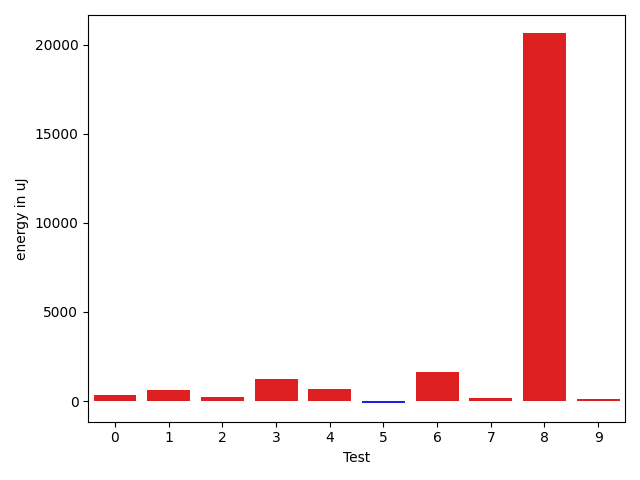

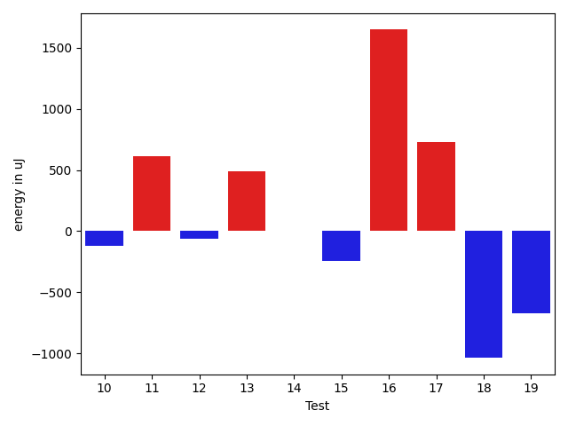

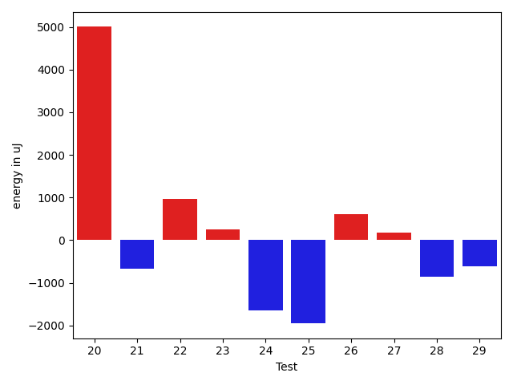

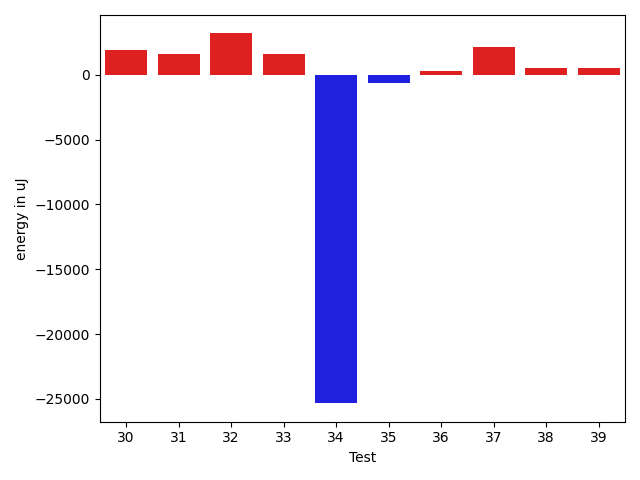

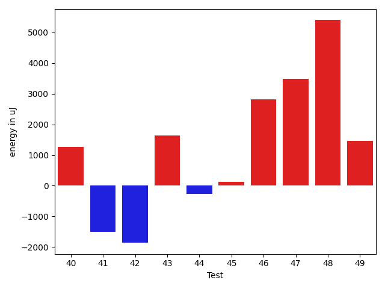

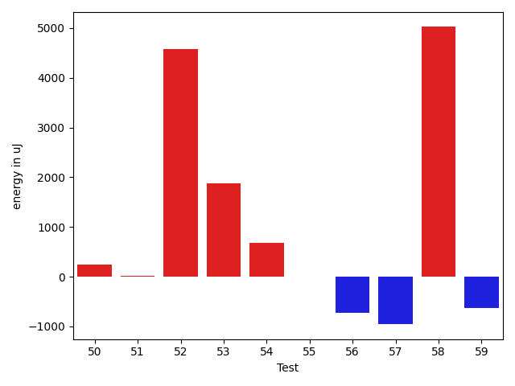

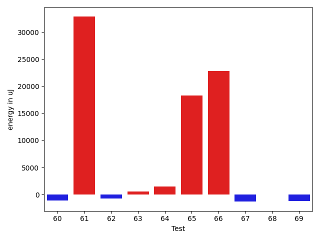

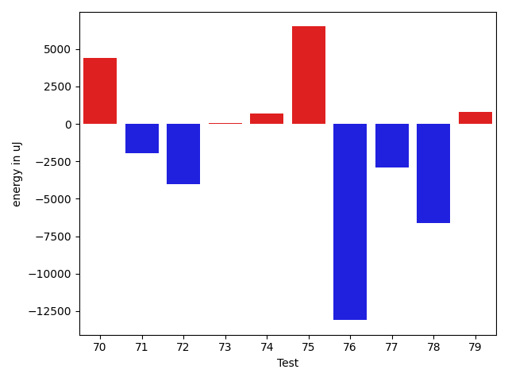

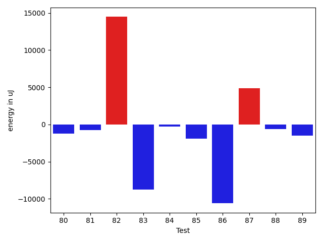

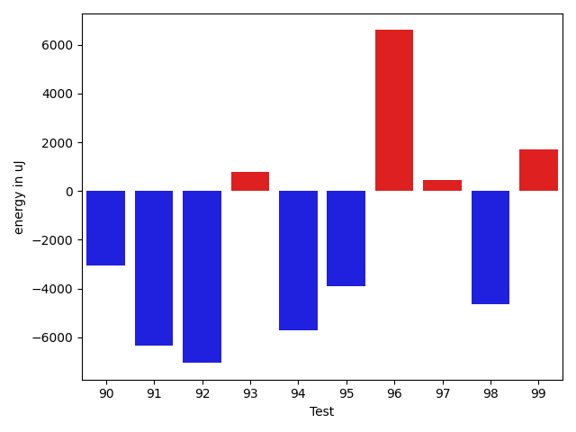

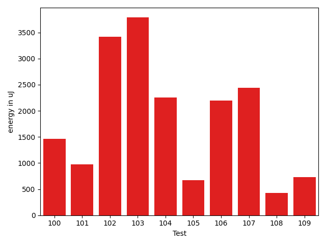

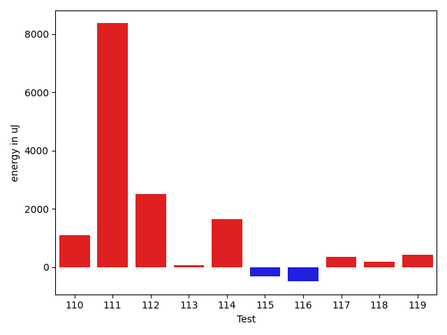

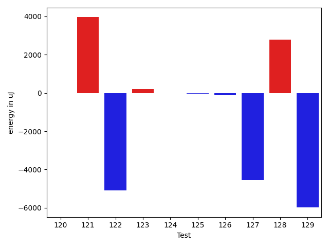

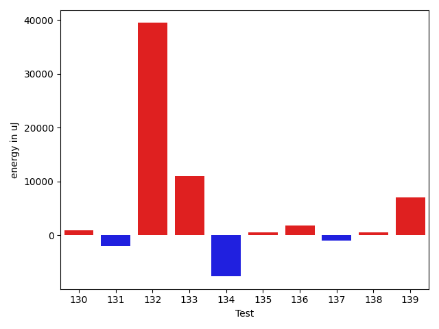

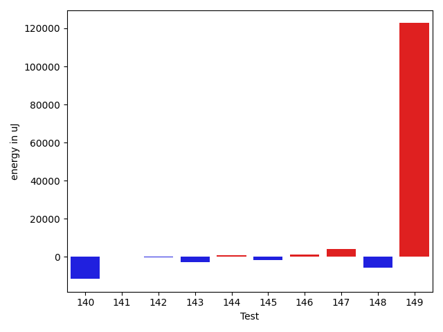

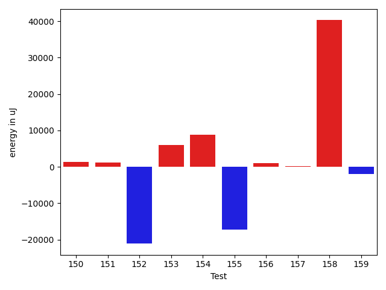

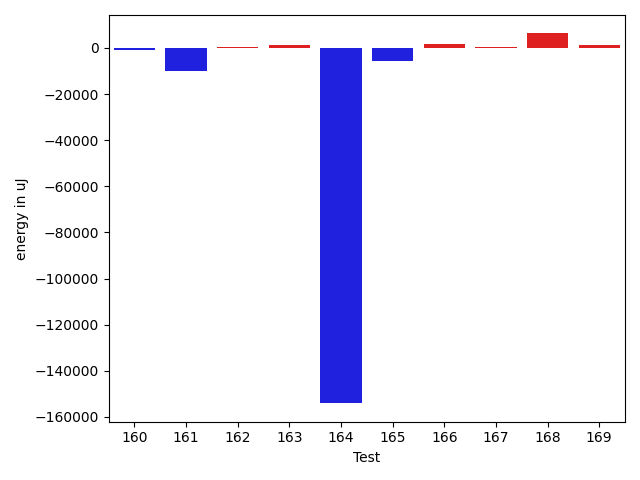

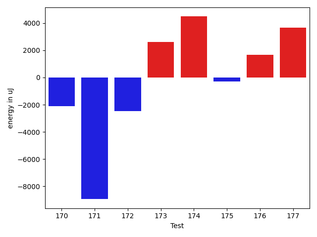

| ID | EnergyV1 | EnergyV2 | DeltaEnergy | σV1 | σV2 |
| --- | --- | --- | --- | --- | --- |
| 0 | 35522 | 35889 | 367 | 3869.1497883108527 | 4051.746671837423 |
| 1 | 35584 | 36194 | 610 | 4024.4160089579627 | 5075.330391915941 |
| 2 | 37475 | 37720 | 245 | 30500.63166083206 | 25713.280357572614 |
| 3 | 35523 | 36743 | 1220 | 3964.759650841307 | 4654.170412383785 |
| 4 | 36316 | 36987 | 671 | 4111.6346041410125 | 4315.6105956874135 |
| 5 | 36011 | 35888 | -123 | 19843.15100544165 | 3726.818793918257 |
| 6 | 35828 | 37475 | 1647 | 3222.5410258825 | 40580.2088347939 |
| 7 | 37170 | 37353 | 183 | 4484.997029035772 | 3948.997728190817 |
| 8 | 45654 | 66284 | 20630 | 89707.13262945661 | 68634.50505359861 |
| 9 | 37537 | 37659 | 122 | 26785.564494597405 | 10285.38595759767 |
| 10 | 35767 | 35644 | -123 | 30163.178378841607 | 3559.702957665766 |
| 11 | 35949 | 36560 | 611 | 3939.4777313779277 | 6643.652162062449 |
| 12 | 36438 | 36376 | -62 | 11507.291897853594 | 10977.962105156335 |
| 13 | 39367 | 39855 | 488 | 31158.955926679755 | 30198.141590849966 |
| 14 | 36193 | 36193 | 0 | 8680.07628679177 | 7250.676163043307 |
| 15 | 35766 | 35522 | -244 | 3327.641156109138 | 3815.1055943814963 |
| 16 | 36316 | 37964 | 1648 | 30667.289094218842 | 20321.14316926127 |
| 17 | 34363 | 35095 | 732 | 3090.7904295675194 | 3850.2800445848598 |
| 18 | 38574 | 37536 | -1038 | 3648.872858842851 | 3248.7504444016627 |
| 19 | 35218 | 34546 | -672 | 3019.176297347144 | 3456.109829825803 |
| 20 | 110413 | 115417 | 5004 | 22593.857983083337 | 25219.15756375473 |
| 21 | 37353 | 36682 | -671 | 18211.206124089716 | 18423.43538208363 |
| 22 | 34790 | 35766 | 976 | 39172.948408816264 | 3147.2447382078294 |
| 23 | 36132 | 36377 | 245 | 8868.659712064447 | 6629.692348849982 |
| 24 | 36682 | 35034 | -1648 | 3765.040114881469 | 2755.4576790132946 |
| 25 | 36926 | 34973 | -1953 | 3996.748402540479 | 2641.8085185889017 |
| 26 | 34363 | 34973 | 610 | 3553.885317031372 | 3856.6815461581027 |
| 27 | 35706 | 35888 | 182 | 3888.974206504592 | 3730.179817745429 |
| 28 | 36804 | 35950 | -854 | 3780.450501385434 | 3578.675095475878 |
| 29 | 36682 | 36071 | -611 | 3892.498943827837 | 4365.795049612947 |
| 30 | 36560 | 38452 | 1892 | 33679.682510132625 | 37829.206211815035 |
| 31 | 34484 | 36072 | 1588 | 3707.3558110026343 | 3529.145585060729 |
| 32 | 31311 | 34484 | 3173 | 1592.704269124965 | 1224.8240689992992 |
| 33 | 33508 | 35095 | 1587 | 1973.6612340183071 | 1983.2683095083228 |
| 34 | 88623 | 63293 | -25330 | 14695.638422334703 | 18491.74899678232 |
| 35 | 37170 | 36499 | -671 | 3462.7312630486526 | 28192.694189525435 |
| 36 | 36071 | 36377 | 306 | 3458.7069650119956 | 4355.453065481619 |
| 37 | 35034 | 37170 | 2136 | 4349.274319209198 | 3677.538766854114 |
| 38 | 35034 | 35583 | 549 | 3916.0404235596857 | 4238.428763223286 |
| 39 | 38697 | 39184 | 487 | 36216.71159296079 | 10955.254442055535 |
| 40 | 36376 | 38330 | 1954 | 4112.404529965226 | 4164.789919349541 |
| 41 | 36072 | 35828 | -244 | 5591.279035038288 | 4041.6079368048245 |
| 42 | 36865 | 38757 | 1892 | 22856.07541943706 | 16673.67032523797 |
| 43 | 35705 | 37659 | 1954 | 4793.871835121404 | 3805.6336942404605 |
| 44 | 36743 | 37292 | 549 | 3753.3737544037513 | 4193.85924265732 |
| 45 | 35827 | 36132 | 305 | 4073.5300296385276 | 4026.207633098243 |
| 46 | 35645 | 36010 | 365 | 20713.661139567874 | 20562.551888135225 |
| 47 | 37842 | 38086 | 244 | 19059.169698845093 | 31196.333864538203 |
| 48 | 67749 | 68542 | 793 | 22351.3237473728 | 32717.45068582281 |
| 49 | 35340 | 35645 | 305 | 3571.854606970073 | 4322.1550790664605 |
| 50 | 36804 | 36377 | -427 | 2865.689751897827 | 3404.051482996238 |
| 51 | 36072 | 35828 | -244 | 3675.779257921463 | 3753.0489805335014 |
| 52 | 37598 | 35095 | -2503 | 4067.0383722196757 | 31669.812430592145 |
| 53 | 36621 | 35950 | -671 | 8562.00862663985 | 12913.697628607975 |
| 54 | 35095 | 35522 | 427 | 3542.0252485788756 | 4367.865577899259 |
| 55 | 36133 | 36133 | 0 | 3759.7247544989027 | 4076.48616716338 |
| 56 | 36438 | 34057 | -2381 | 3955.744927739064 | 4555.65366357129 |
| 57 | 36743 | 35644 | -1099 | 3824.644495797063 | 3232.8565579143115 |
| 58 | 36377 | 35950 | -427 | 23576.50151414928 | 27241.977920084053 |
| 59 | 34545 | 35339 | 794 | 4083.8050372443367 | 3792.1455520265968 |
| 60 | 35950 | 34912 | -1038 | 3754.290580387122 | 3046.945610059101 |
| 61 | 37415 | 38452 | 1037 | 97928.82978258526 | 158749.78256630246 |
| 62 | 35644 | 36316 | 672 | 4580.854058985314 | 3689.7630766847315 |
| 63 | 35400 | 35888 | 488 | 3960.564445573175 | 3184.499809499696 |
| 64 | 35583 | 36560 | 977 | 3090.951127143939 | 3446.2696625096964 |
| 65 | 35888 | 36133 | 245 | 7897.579266573333 | 109456.48283967788 |
| 66 | 35706 | 35645 | -61 | 3460.6857475829843 | 126777.55633956754 |
| 67 | 36316 | 35583 | -733 | 2755.041665091272 | 3416.604954963706 |
| 68 | 35767 | 35889 | 122 | 4560.316178367863 | 3778.430319162665 |
| 69 | 36560 | 35339 | -1221 | 4324.286700385166 | 3549.407822090489 |
| 70 | 36682 | 38940 | 2258 | 4961.107397484457 | 9524.12272417911 |
| 71 | 35827 | 37536 | 1709 | 23477.90268343189 | 4040.7113079959045 |
| 72 | 39551 | 37293 | -2258 | 37843.444921128954 | 32260.836661013418 |
| 73 | 36865 | 37048 | 183 | 4405.911771068366 | 3911.1646082199854 |
| 74 | 37231 | 37842 | 611 | 4595.376564534895 | 4362.247554690128 |
| 75 | 38269 | 41016 | 2747 | 23572.543239638486 | 23525.47413323848 |
| 76 | 39245 | 37964 | -1281 | 48717.16212375563 | 39752.854662432735 |
| 77 | 39123 | 36072 | -3051 | 2884.292451170226 | 3328.9653047155657 |
| 78 | 35156 | 35705 | 549 | 32269.687994826454 | 3433.883381736351 |
| 79 | 37414 | 38086 | 672 | 3934.010488992118 | 4100.994258143438 |
| 80 | 36133 | 35767 | -366 | 2966.398942741856 | 4304.773090529482 |
| 81 | 37841 | 36193 | -1648 | 3505.940479940994 | 4339.982697158405 |
| 82 | 40100 | 38818 | -1282 | 3108.279684255513 | 47289.58075224384 |
| 83 | 37049 | 37902 | 853 | 36830.17839348723 | 4888.27993254907 |
| 84 | 36010 | 36072 | 62 | 3373.761694163988 | 4040.259334188834 |
| 85 | 38513 | 37292 | -1221 | 3241.3964366265045 | 3303.348715224446 |
| 86 | 38330 | 36377 | -1953 | 34712.85592701932 | 3653.0865836303415 |
| 87 | 36560 | 36926 | 366 | 10993.493237661858 | 31356.30077979589 |
| 88 | 35828 | 34790 | -1038 | 6216.387231553568 | 3775.479180279052 |
| 89 | 36133 | 37048 | 915 | 25205.249411066114 | 22688.38878063046 |
| 90 | 39062 | 38391 | -671 | 23088.824551997193 | 26936.792229276114 |
| 91 | 38696 | 38513 | -183 | 71342.25302245701 | 61695.78103553029 |
| 92 | 67017 | 43395 | -23622 | 29813.43284866427 | 25160.935752183737 |
| 93 | 37598 | 38696 | 1098 | 15702.826953399024 | 14199.365225700743 |
| 94 | 37354 | 37781 | 427 | 63391.95387257074 | 22417.45040196598 |
| 95 | 40222 | 38208 | -2014 | 17908.6020051425 | 14922.106090184378 |
| 96 | 36194 | 36071 | -123 | 3550.3961441805677 | 32982.826496040725 |
| 97 | 36133 | 36743 | 610 | 7207.261628649375 | 4302.752082874987 |
| 98 | 38086 | 37720 | -366 | 31429.72855776883 | 4198.80044478053 |
| 99 | 35706 | 37964 | 2258 | 3812.122687151328 | 4560.026947220268 |
| 100 | 37536 | 39001 | 1465 | 24550.540251053946 | 51189.086744645734 |
| 101 | 36621 | 37598 | 977 | 24277.8080667356 | 3592.7294591914583 |
| 102 | 67138 | 70556 | 3418 | 19950.60824372946 | 23640.86350779395 |
| 103 | 35400 | 39185 | 3785 | 4360.460896997581 | 5489.003666306345 |
| 104 | 38452 | 40711 | 2259 | 18066.32674321038 | 36502.207499255 |
| 105 | 36865 | 37537 | 672 | 21116.010916367828 | 4340.185043978693 |
| 106 | 37048 | 39246 | 2198 | 4851.955312339674 | 4109.167787370321 |
| 107 | 40832 | 43274 | 2442 | 468021.5359451338 | 26800.52742484316 |
| 108 | 35766 | 36194 | 428 | 3554.4000217672788 | 4052.859639275815 |
| 109 | 36682 | 37415 | 733 | 5743.754030820029 | 4380.422131240286 |
| 110 | 36743 | 37842 | 1099 | 4191.744073932033 | 3785.761070760436 |
| 111 | 61463 | 69824 | 8361 | 67492.58973425622 | 64914.27155669981 |
| 112 | 36193 | 38697 | 2504 | 3430.2827082859267 | 4012.7253999890195 |
| 113 | 36377 | 36438 | 61 | 3908.846569888003 | 4096.76771109114 |
| 114 | 36072 | 37719 | 1647 | 4349.039801629679 | 27132.30820703045 |
| 115 | 36438 | 36133 | -305 | 3815.649806310606 | 4177.186189865893 |
| 116 | 37109 | 36621 | -488 | 4509.428185044062 | 3713.1532617918638 |
| 117 | 36255 | 36621 | 366 | 4084.470251437404 | 4116.474420938549 |
| 118 | 36438 | 36621 | 183 | 3608.4566697121477 | 3982.727207108653 |
| 119 | 37232 | 37658 | 426 | 4438.78562414799 | 29345.03694423271 |
| 120 | 34790 | 35949 | 1159 | 4151.825555623554 | 4008.8260550744467 |
| 121 | 35462 | 36683 | 1221 | 5535.020110452522 | 25809.830619398504 |
| 122 | 40466 | 38635 | -1831 | 42235.47267285374 | 44029.06599866707 |
| 123 | 37720 | 37475 | -245 | 4055.3649080693094 | 4808.541931202455 |
| 124 | 37415 | 38024 | 609 | 3144.1300800156428 | 3875.386435872396 |
| 125 | 37475 | 36132 | -1343 | 5019.2595564383755 | 4415.583647025334 |
| 126 | 37658 | 36438 | -1220 | 2903.2909625497646 | 4306.886787865387 |
| 127 | 35217 | 36377 | 1160 | 27632.448819835277 | 8438.191768856399 |
| 128 | 34546 | 37475 | 2929 | 3195.0808373331374 | 3544.1112055992717 |
| 129 | 36926 | 35583 | -1343 | 27948.772847658263 | 3814.8417579763386 |
| 130 | 35949 | 36621 | 672 | 2937.7626258930027 | 3366.4677287712316 |
| 131 | 36011 | 34118 | -1893 | 4317.240096356327 | 3288.1195659180576 |
| 132 | 38391 | 37537 | -854 | 66639.06868129235 | 116841.05644058039 |
| 133 | 36743 | 36621 | -122 | 4827.592447248907 | 54018.14623523236 |
| 134 | 39123 | 36987 | -2136 | 48130.038298354586 | 6894.3308416118225 |
| 135 | 36926 | 37232 | 306 | 2656.1053717979166 | 4168.120258760943 |
| 136 | 35095 | 39123 | 4028 | 4115.823489561952 | 4741.522446547218 |
| 137 | 39063 | 37414 | -1649 | 4078.9773838880124 | 5343.262438576267 |
| 138 | 37415 | 37537 | 122 | 3803.667890273957 | 5336.293649489338 |
| 139 | 36682 | 36866 | 184 | 4309.7460477496525 | 32839.86124845396 |
| 140 | 38269 | 38025 | -244 | 51564.4729676255 | 34971.819484519205 |
| 141 | 34851 | 35217 | 366 | 3355.185129020454 | 3888.7568292109363 |
| 142 | 35034 | 35583 | 549 | 3835.673498425464 | 3783.7002517431692 |
| 143 | 36743 | 36255 | -488 | 12949.757393737795 | 3793.377462292485 |
| 144 | 35522 | 35217 | -305 | 3827.4133345293835 | 3146.4146626001066 |
| 145 | 38514 | 38940 | 426 | 39207.621684939666 | 40334.713044615535 |
| 146 | 38391 | 38818 | 427 | 14433.397239581385 | 14151.771437035495 |
| 147 | 39978 | 38757 | -1221 | 38193.46502248416 | 42503.332221066164 |
| 148 | 38330 | 40222 | 1892 | 28621.347389916256 | 27658.911026453672 |
| 149 | 38269 | 40405 | 2136 | 273942.64732041646 | 551592.8464329762 |
| 150 | 37476 | 39002 | 1526 | 13078.309733964095 | 12986.424487143931 |
| 151 | 37597 | 39123 | 1526 | 50306.89064584596 | 40723.49918385383 |
| 152 | 38391 | 39429 | 1038 | 102778.84028377014 | 54235.427096610954 |
| 153 | 326659 | 330749 | 4090 | 106623.70293685135 | 118003.63203491189 |
| 154 | 39246 | 41870 | 2624 | 24098.053906695466 | 38267.51747415792 |
| 155 | 37353 | 39489 | 2136 | 59148.25739881344 | 33866.349350390046 |
| 156 | 37048 | 37963 | 915 | 3577.506236348318 | 4199.5699573167185 |
| 157 | 37476 | 37415 | -61 | 4129.149633323428 | 3845.619885274856 |
| 158 | 37964 | 37048 | -916 | 27810.854449875627 | 120176.3936663568 |
| 159 | 69336 | 66284 | -3052 | 28553.394349682505 | 26203.50875042868 |
| 160 | 37902 | 35400 | -2502 | 3777.2669350365886 | 4088.6641535535337 |
| 161 | 38208 | 39551 | 1343 | 47000.118763105595 | 32478.85636500834 |
| 162 | 37415 | 37781 | 366 | 3413.7255934135524 | 3109.5035126191046 |
| 163 | 36926 | 38086 | 1160 | 4319.7261785872315 | 5675.76361617134 |
| 164 | 62317 | 39673 | -22644 | 642082.0915320116 | 322550.84180102445 |
| 165 | 37475 | 36010 | -1465 | 23796.052835308034 | 4004.9930814879613 |
| 166 | 37537 | 37658 | 121 | 22051.57118879868 | 19672.19217983489 |
| 167 | 38330 | 37720 | -610 | 3639.940389402002 | 3311.9529696561644 |
| 168 | 37903 | 40283 | 2380 | 9717.382570239215 | 24430.32302546772 |
| 169 | 36804 | 38330 | 1526 | 3640.9388655557896 | 4800.529588530534 |
| 170 | 39185 | 34729 | -4456 | 3952.832601614808 | 4046.7591574004664 |
| 171 | 37658 | 37292 | -366 | 38206.30636033795 | 3525.085712993461 |
| 172 | 37537 | 36499 | -1038 | 3649.9030323186284 | 3034.2745376373337 |
| 173 | 39368 | 38085 | -1283 | 73295.51506924914 | 80606.21065263431 |
| 174 | 38147 | 40222 | 2075 | 42306.99157564156 | 41081.95582235967 |
| 175 | 38025 | 37597 | -428 | 3072.9503323601502 | 3803.5793744644316 |
| 176 | 34485 | 38391 | 3906 | 3916.52437330175 | 3713.6160059763515 |
| 177 | 37902 | 38086 | 184 | 5642.055154410689 | 20616.188234517216 |

## Delta Duration per test method

| ID | DurationV1 | DurationsV2 | DeltaDuration |
| --- | --- | --- | --- |
| 0 | 882703.5409836066 | 846842.4545454546 | -35861.08643815201 |
| 1 | 945838.0 | 930757.1851851852 | -15080.814814814832 |
| 2 | 1202989.5555555555 | 1068942.9285714286 | -134046.62698412687 |
| 3 | 991288.5396825396 | 973998.5735294118 | -17289.96615312784 |
| 4 | 789417.4814814815 | 846228.0192307692 | 56810.53774928779 |
| 5 | 865071.6666666666 | 825146.0555555555 | -39925.611111111124 |
| 6 | 596092.1724137932 | 822873.3684210526 | 226781.19600725942 |
| 7 | 763822.1627906977 | 764025.5238095238 | 203.3610188261373 |
| 8 | 2122427.727272727 | 2147612.3333333335 | 25184.606060606427 |
| 9 | 1236384.8192771084 | 1196691.7341772153 | -39693.08509989316 |
| 10 | 982452.8305084746 | 890317.2105263158 | -92135.61998215877 |
| 11 | 892810.1639344263 | 860163.2807017544 | -32646.883232671884 |
| 12 | 953364.1578947369 | 973368.4615384615 | 20004.30364372465 |
| 13 | 1587733.9545454546 | 1693725.551724138 | 105991.59717868338 |
| 14 | 855983.2272727273 | 817260.0612244898 | -38723.16604823747 |
| 15 | 894366.6538461539 | 882902.3863636364 | -11464.26748251752 |
| 16 | 1305380.186440678 | 1069804.5492957747 | -235575.63714490342 |
| 17 | 731633.4222222222 | 668974.0 | -62659.4222222222 |
| 18 | 493494.6 | 501887.6 | 8393.0 |
| 19 | 740823.2272727273 | 686997.1794871795 | -53826.047785547795 |
| 20 | 3375723.9595959596 | 3396166.282828283 | 20442.323232323397 |
| 21 | 1018067.0961538461 | 955530.9024390244 | -62536.19371482171 |
| 22 | 896295.7037037037 | 545819.2857142857 | -350476.417989418 |
| 23 | 839833.5111111111 | 775220.74 | -64612.77111111116 |
| 24 | 448147.06666666665 | 423167.5 | -24979.56666666665 |
| 25 | 423081.6666666667 | 453168.2 | 30086.533333333326 |
| 26 | 706068.9655172414 | 664723.3157894737 | -41345.64972776768 |
| 27 | 577122.7777777778 | 579437.1538461539 | 2314.376068376121 |
| 28 | 660912.8461538461 | 666568.6538461539 | 5655.807692307746 |
| 29 | 493847.36842105264 | 499787.0 | 5939.631578947359 |
| 30 | 1185379.7333333334 | 1202823.677419355 | 17443.94408602151 |
| 31 | 481908.5625 | 433858.76470588235 | -48049.79779411765 |
| 32 | 944982.6666666666 | 937285.6666666666 | -7697.0 |
| 33 | 961758.0 | 1052169.5 | 90411.5 |
| 34 | 2792664.0 | 2718829.4 | -73834.6000000001 |
| 35 | 778945.4347826086 | 862959.4893617021 | 84014.05457909347 |
| 36 | 736399.7115384615 | 817294.274509804 | 80894.56297134247 |
| 37 | 797843.3958333334 | 899776.6590909091 | 101933.26325757569 |
| 38 | 823058.3157894737 | 893828.0 | 70769.68421052629 |
| 39 | 1368546.2741935484 | 1083026.3846153845 | -285519.88957816386 |
| 40 | 766338.6363636364 | 784555.7027027027 | 18217.06633906637 |
| 41 | 887822.7419354839 | 857619.5625 | -30203.17943548388 |
| 42 | 1538451.1489361702 | 1456944.5217391304 | -81506.62719703978 |
| 43 | 1000937.5454545454 | 953303.8636363636 | -47633.681818181765 |
| 44 | 774231.9777777778 | 748463.5416666666 | -25768.436111111194 |
| 45 | 710827.0192307692 | 767089.9756097561 | 56262.956378986826 |
| 46 | 1223122.8823529412 | 1329643.4606741574 | 106520.57832121616 |
| 47 | 1295649.1125 | 1483864.32 | 188215.20750000002 |
| 48 | 1946048.202020202 | 2103602.3434343436 | 157554.14141414152 |
| 49 | 497559.44444444444 | 537101.8 | 39542.35555555561 |
| 50 | 605360.0454545454 | 640235.1 | 34875.054545454565 |
| 51 | 532043.0645161291 | 494317.73913043475 | -37725.325385694334 |
| 52 | 418556.70588235295 | 706848.6666666666 | 288291.9607843137 |
| 53 | 969871.5901639344 | 1079293.484375 | 109421.8942110656 |
| 54 | 657269.1136363636 | 714499.9791666666 | 57230.86553030298 |
| 55 | 515100.78571428574 | 506579.42424242425 | -8521.361471861484 |
| 56 | 501010.9666666667 | 521912.2972972973 | 20901.330630630604 |
| 57 | 933115.6346153846 | 915525.0434782609 | -17590.59113712376 |
| 58 | 1017813.4821428572 | 1316232.8727272728 | 298419.39058441564 |
| 59 | 577216.4333333333 | 819987.1071428572 | 242770.6738095238 |
| 60 | 744903.5636363636 | 797870.3770491803 | 52966.81341281673 |
| 61 | 1338194.6829268292 | 2411628.2439024393 | 1073433.56097561 |
| 62 | 855129.0 | 905982.0416666666 | 50853.04166666663 |
| 63 | 596451.027027027 | 625973.8947368421 | 29522.867709815153 |
| 64 | 563174.551724138 | 713820.1785714285 | 150645.62684729055 |
| 65 | 669798.8484848485 | 1215877.9090909092 | 546079.0606060607 |
| 66 | 748516.4358974359 | 1257817.8 | 509301.36410256417 |
| 67 | 398010.75 | 418639.4736842105 | 20628.723684210505 |
| 68 | 518707.89285714284 | 616240.2121212122 | 97532.31926406932 |
| 69 | 426888.0588235294 | 486542.5925925926 | 59654.533769063186 |
| 70 | 750028.625 | 912822.5 | 162793.875 |
| 71 | 822443.5238095238 | 781327.5833333334 | -41115.940476190415 |
| 72 | 1104715.5 | 1141793.0 | 37077.5 |
| 73 | 580791.1071428572 | 643239.925925926 | 62448.8187830688 |
| 74 | 697439.8666666667 | 792172.56 | 94732.69333333336 |
| 75 | 965768.9210526316 | 1218212.861111111 | 252443.94005847943 |
| 76 | 1557492.619047619 | 973243.5625 | -584249.0565476189 |
| 77 | 399629.78571428574 | 442470.75 | 42840.96428571426 |
| 78 | 707310.5238095238 | 432048.0 | -275262.5238095238 |
| 79 | 395183.65 | 452939.76923076925 | 57756.119230769225 |
| 80 | 400422.3125 | 408721.07692307694 | 8298.764423076937 |
| 81 | 459711.86666666664 | 440472.8947368421 | -19238.97192982456 |
| 82 | 404274.0 | 1269291.2105263157 | 865017.2105263157 |
| 83 | 745264.5 | 408743.4705882353 | -336521.0294117647 |
| 84 | 440168.3181818182 | 389234.3 | -50934.01818181819 |
| 85 | 414386.3125 | 471492.25 | 57105.9375 |
| 86 | 681891.75 | 470521.5 | -211370.25 |
| 87 | 1333897.3152173914 | 1446805.6063829786 | 112908.29116558726 |
| 88 | 1047575.2133333334 | 1043741.8630136986 | -3833.3503196347738 |
| 89 | 1375657.7764705883 | 1394542.9764705882 | 18885.199999999953 |
| 90 | 1461737.0736842104 | 1472370.125 | 10633.051315789577 |
| 91 | 2008607.7882352942 | 1803283.3837209302 | -205324.40451436397 |
| 92 | 2186864.5353535353 | 1919778.0 | -267086.5353535353 |
| 93 | 1346159.9555555556 | 1382983.6555555556 | 36823.69999999995 |
| 94 | 1603271.75 | 1496563.3614457832 | -106708.38855421683 |
| 95 | 1554428.5959595959 | 1516202.121212121 | -38226.47474747477 |
| 96 | 864401.1071428572 | 1013580.6031746032 | 149179.49603174604 |
| 97 | 866447.4 | 1007732.696969697 | 141285.296969697 |
| 98 | 858038.8510638297 | 879465.3103448276 | 21426.459280997864 |
| 99 | 679960.4193548387 | 758906.575 | 78946.15564516129 |
| 100 | 1012430.5217391305 | 1458387.6274509805 | 445957.10571185 |
| 101 | 689822.0606060605 | 632338.0909090909 | -57483.96969696961 |
| 102 | 1969348.393939394 | 2019166.2222222222 | 49817.82828282821 |
| 103 | 610484.3793103448 | 572518.5714285715 | -37965.80788177333 |
| 104 | 1058513.0 | 1397988.9310344828 | 339475.9310344828 |
| 105 | 926988.2545454545 | 917424.1346153846 | -9564.119930069894 |
| 106 | 524783.2352941176 | 615017.8571428572 | 90234.62184873957 |
| 107 | 4370874.191919192 | 1733624.1313131314 | -2637250.0606060605 |
| 108 | 724221.0476190476 | 744329.4705882353 | 20108.422969187726 |
| 109 | 897103.4576271187 | 910761.2068965518 | 13657.749269433087 |
| 110 | 773530.8888888889 | 748817.3035714285 | -24713.585317460354 |
| 111 | 2323522.414141414 | 2376375.97979798 | 52853.565656565595 |
| 112 | 764245.6 | 780423.1176470588 | 16177.51764705882 |
| 113 | 708669.9736842106 | 712889.9347826086 | 4219.961098398082 |
| 114 | 837866.4074074074 | 969745.6274509804 | 131879.22004357295 |
| 115 | 720139.3265306122 | 726232.0 | 6092.67346938781 |
| 116 | 875953.0188679246 | 859732.45 | -16220.568867924623 |
| 117 | 731325.6521739131 | 745592.037735849 | 14266.385561935953 |
| 118 | 616360.7878787878 | 601486.2580645161 | -14874.529814271722 |
| 119 | 680154.6 | 812522.8974358974 | 132368.2974358974 |
| 120 | 580682.0322580645 | 573750.09375 | -6931.938508064486 |
| 121 | 924199.2407407408 | 987467.7321428572 | 63268.49140211637 |
| 122 | 1685426.075 | 1455451.8837209302 | -229974.19127906975 |
| 123 | 648496.24 | 635349.6363636364 | -13146.603636363638 |
| 124 | 512530.5 | 459553.1875 | -52977.3125 |
| 125 | 425276.28571428574 | 406401.28571428574 | -18875.0 |
| 126 | 588134.1363636364 | 587165.4242424242 | -968.7121212121565 |
| 127 | 1016916.3125 | 925013.1363636364 | -91903.17613636365 |
| 128 | 475849.0 | 447260.77777777775 | -28588.222222222248 |
| 129 | 653621.05 | 507262.44 | -146358.61000000004 |
| 130 | 438565.1875 | 493372.23529411765 | 54807.04779411765 |
| 131 | 595173.9696969697 | 665091.7391304348 | 69917.76943346509 |
| 132 | 1046172.95 | 2535604.074074074 | 1489431.1240740742 |
| 133 | 482546.64285714284 | 1029359.6774193548 | 546813.034562212 |
| 134 | 885350.4444444445 | 683957.6 | -201392.84444444452 |
| 135 | 451523.0 | 421843.95652173914 | -29679.043478260865 |
| 136 | 531679.7894736842 | 486314.77777777775 | -45365.0116959064 |
| 137 | 422503.8823529412 | 454425.8 | 31921.917647058784 |
| 138 | 486651.09523809527 | 506598.8888888889 | 19947.79365079361 |
| 139 | 476155.0 | 627239.875 | 151084.875 |
| 140 | 1689014.5967741935 | 1305903.98630137 | -383110.6104728235 |
| 141 | 693858.28125 | 658103.1714285715 | -35755.109821428545 |
| 142 | 584210.625 | 638987.4545454546 | 54776.82954545459 |
| 143 | 679916.8666666667 | 596082.8571428572 | -83834.00952380954 |
| 144 | 638395.7083333334 | 633291.2857142857 | -5104.422619047691 |
| 145 | 1411637.0746268656 | 1266843.0923076924 | -144793.98231917317 |
| 146 | 1267399.6 | 1285255.35 | 17855.75 |
| 147 | 1608078.4468085107 | 1540706.088888889 | -67372.35791962175 |
| 148 | 1378733.0 | 1111222.7674418604 | -267510.2325581396 |
| 149 | 2624200.8695652173 | 6019054.648351648 | 3394853.7787864306 |
| 150 | 1270077.35 | 1316788.3048780488 | 46710.95487804874 |
| 151 | 1364177.1147540985 | 1498654.625 | 134477.51024590153 |
| 152 | 1859828.7142857143 | 1211841.7631578948 | -647986.9511278195 |
| 153 | 9963228.656565657 | 9900594.181818182 | -62634.47474747524 |
| 154 | 1438957.5444444444 | 1786492.6041666667 | 347535.0597222224 |
| 155 | 1818163.7297297297 | 1089190.5294117648 | -728973.2003179649 |
| 156 | 610386.5777777778 | 623313.2068965518 | 12926.62911877397 |
| 157 | 712516.925 | 738120.9310344828 | 25604.006034482736 |
| 158 | 867254.3518518518 | 2323706.069767442 | 1456451.7179155904 |
| 159 | 1999271.0707070706 | 1982183.9696969697 | -17087.101010100916 |
| 160 | 531849.9615384615 | 537415.8235294118 | 5565.861990950303 |
| 161 | 1709544.5 | 1232498.8545454545 | -477045.6454545455 |
| 162 | 658596.1707317074 | 725146.5 | 66550.32926829264 |
| 163 | 942401.7966101695 | 881715.701754386 | -60686.09485578351 |
| 164 | 7678089.928571428 | 3176309.493150685 | -4501780.435420743 |
| 165 | 1140700.140625 | 948051.2698412698 | -192648.87078373018 |
| 166 | 961067.2549019608 | 1040518.8947368421 | 79451.6398348813 |
| 167 | 530941.04 | 503727.60714285716 | -27213.432857142878 |
| 168 | 856796.5666666667 | 1099213.673076923 | 242417.10641025635 |
| 169 | 617114.5263157894 | 675691.1071428572 | 58576.58082706772 |
| 170 | 660097.4166666666 | 463962.6666666667 | -196134.74999999994 |
| 171 | 726098.35 | 412141.55555555556 | -313956.7944444444 |
| 172 | 444356.23529411765 | 478675.5652173913 | 34319.329923273646 |
| 173 | 1472994.0 | 1735711.0909090908 | 262717.0909090908 |
| 174 | 1112358.2857142857 | 1380216.794117647 | 267858.5084033613 |
| 175 | 477156.8947368421 | 486775.5909090909 | 9618.696172248805 |
| 176 | 423066.9166666667 | 487927.1875 | 64860.270833333314 |
| 177 | 934482.6440677966 | 1050142.0172413792 | 115659.3731735826 |

## Misc.

| ID | Test Class | Test Method |
| --- | --- | --- |
| 0 | com.google.gson.functional.CustomTypeAdaptersTest | testCustomAdapterInvokedForCollectionElementDeserialization |
| 1 | com.google.gson.functional.CustomTypeAdaptersTest | testCustomNestedDeserializers |
| 2 | com.google.gson.functional.CustomTypeAdaptersTest | testCustomDeserializers |
| 3 | com.google.gson.functional.CustomTypeAdaptersTest | testCustomDeserializerForLong |
| 4 | com.google.gson.functional.CustomTypeAdaptersTest | testCustomAdapterInvokedForMapElementDeserialization |
| 5 | com.google.gson.functional.CustomTypeAdaptersTest | testCustomByteArrayDeserializerAndInstanceCreator |
| 6 | com.google.gson.functional.CustomTypeAdaptersTest | testEnsureCustomDeserializerNotInvokedForNullValues |
| 7 | com.google.gson.functional.CustomDeserializerTest | testDefaultConstructorNotCalledOnField |
| 8 | com.google.gson.functional.CustomDeserializerTest | testDefaultConstructorNotCalledOnObject |
| 9 | com.google.gson.functional.CustomDeserializerTest | testJsonTypeFieldBasedDeserialization |
| 10 | com.google.gson.functional.CustomDeserializerTest | testCustomDeserializerReturnsNullForArrayElementsForArrayField |
| 11 | com.google.gson.functional.CustomDeserializerTest | testCustomDeserializerReturnsNull |
| 12 | com.google.gson.functional.CustomDeserializerTest | testCustomDeserializerReturnsNullForArrayElements |
| 13 | com.google.gson.functional.CustomDeserializerTest | testCustomDeserializerReturnsNullForTopLevelObject |
| 14 | com.google.gson.functional.CustomDeserializerTest | testCustomDeserializerReturnsNullForTopLevelPrimitives |
| 15 | com.google.gson.functional.CustomDeserializerTest | testCustomDeserializerReturnsNullForPrimitiveFields |
| 16 | com.google.gson.functional.DefaultTypeAdaptersTest | testTreeSetDeserialization |
| 17 | com.google.gson.functional.DefaultTypeAdaptersTest | testBadValueForBigDecimalDeserialization |
| 18 | com.google.gson.functional.DefaultTypeAdaptersTest | testUuidDeserialization |
| 19 | com.google.gson.functional.DefaultTypeAdaptersTest | testBigIntegerFieldDeserialization |
| 20 | com.google.gson.functional.DefaultTypeAdaptersTest | testDefaultDateDeserializationUsingBuilder |
| 21 | com.google.gson.functional.DefaultTypeAdaptersTest | testBigDecimalFieldDeserialization |
| 22 | com.google.gson.functional.DefaultTypeAdaptersTest | testDefaultGregorianCalendarDeserialization |
| 23 | com.google.gson.functional.DefaultTypeAdaptersTest | testUrlNullDeserialization |
| 24 | com.google.gson.functional.DefaultTypeAdaptersTest | testLocaleDeserializationWithLanguageCountryVariant |
| 25 | com.google.gson.functional.DefaultTypeAdaptersTest | testLocaleDeserializationWithLanguageCountry |
| 26 | com.google.gson.functional.DefaultTypeAdaptersTest | testPropertiesDeserialization |
| 27 | com.google.gson.functional.DefaultTypeAdaptersTest | testDefaultCalendarDeserialization |
| 28 | com.google.gson.functional.DefaultTypeAdaptersTest | testDateDeserializationWithPattern |
| 29 | com.google.gson.functional.DefaultTypeAdaptersTest | testUriDeserialization |
| 30 | com.google.gson.functional.DefaultTypeAdaptersTest | testUrlDeserialization |
| 31 | com.google.gson.functional.DefaultTypeAdaptersTest | testLocaleDeserializationWithLanguage |
| 32 | com.google.gson.functional.DefaultTypeAdaptersTest | testDefaultJavaSqlTimestampDeserialization |
| 33 | com.google.gson.functional.DefaultTypeAdaptersTest | testDefaultJavaSqlDateDeserialization |
| 34 | com.google.gson.functional.DefaultTypeAdaptersTest | testDefaultDateDeserialization |
| 35 | com.google.gson.functional.CollectionTest | testNullsInListDeserialization |
| 36 | com.google.gson.functional.CollectionTest | testRawCollectionOfBagOfPrimitivesNotAllowed |
| 37 | com.google.gson.functional.CollectionTest | testCollectionOfStringsDeserialization |
| 38 | com.google.gson.functional.CollectionTest | testWildcardPrimitiveCollectionDeserilaization |
| 39 | com.google.gson.functional.CollectionTest | testTopLevelCollectionOfIntegersDeserialization |
| 40 | com.google.gson.functional.CollectionTest | testLinkedListDeserialization |
| 41 | com.google.gson.functional.CollectionTest | testSetDeserialization |
| 42 | com.google.gson.functional.CollectionTest | testWildcardCollectionField |
| 43 | com.google.gson.functional.CollectionTest | testTopLevelListOfIntegerCollectionsDeserialization |
| 44 | com.google.gson.functional.CollectionTest | testQueueDeserialization |
| 45 | com.google.gson.functional.CollectionTest | testRawCollectionDeserializationNotAlllowed |
| 46 | com.google.gson.functional.ObjectTest | testEmptyCollectionInAnObjectDeserialization |
| 47 | com.google.gson.functional.ObjectTest | testArrayOfArraysDeserialization |
| 48 | com.google.gson.functional.ObjectTest | testSingletonLists |
| 49 | com.google.gson.functional.ObjectTest | testPrivateNoArgConstructorDeserialization |
| 50 | com.google.gson.functional.ObjectTest | testBagOfPrimitivesDeserialization |
| 51 | com.google.gson.functional.ObjectTest | testStringFieldWithEmptyValueDeserialization |
| 52 | com.google.gson.functional.ObjectTest | testNullObjectFieldsDeserialization |
| 53 | com.google.gson.functional.ObjectTest | testStringFieldWithNumberValueDeserialization |
| 54 | com.google.gson.functional.ObjectTest | testPrimitiveArrayInAnObjectDeserialization |
| 55 | com.google.gson.functional.ObjectTest | testNullArraysDeserialization |
| 56 | com.google.gson.functional.ObjectTest | testObjectFieldNamesWithoutQuotesDeserialization |
| 57 | com.google.gson.functional.ObjectTest | testArrayOfObjectsDeserialization |
| 58 | com.google.gson.functional.ObjectTest | testTruncatedDeserialization |
| 59 | com.google.gson.functional.ObjectTest | testNullPrimitiveFieldsDeserialization |
| 60 | com.google.gson.functional.ObjectTest | testInnerClassDeserialization |
| 61 | com.google.gson.functional.ObjectTest | testJsonInSingleQuotesDeserialization |
| 62 | com.google.gson.functional.ObjectTest | testNestedDeserialization |
| 63 | com.google.gson.functional.ObjectTest | testBagOfPrimitiveWrappersDeserialization |
| 64 | com.google.gson.functional.ObjectTest | testJsonInMixedQuotesDeserialization |
| 65 | com.google.gson.functional.ObjectTest | testClassWithTransientFieldsDeserialization |
| 66 | com.google.gson.functional.ObjectTest | testNullFieldsDeserialization |
| 67 | com.google.gson.functional.ObjectTest | testEmptyStringDeserialization |
| 68 | com.google.gson.functional.ObjectTest | testClassWithTransientFieldsDeserializationTransientFieldsPassedInJsonAreIgnored |
| 69 | com.google.gson.functional.ObjectTest | testClassWithNoFieldsDeserialization |
| 70 | com.google.gson.functional.NullObjectAndFieldTest | testExplicitDeserializationOfNulls |
| 71 | com.google.gson.functional.NullObjectAndFieldTest | testCustomTypeAdapterPassesNullDesrialization |
| 72 | com.google.gson.functional.NullObjectAndFieldTest | testTopLevelNullObjectDeserialization |
| 73 | com.google.gson.functional.NullObjectAndFieldTest | testExplicitNullSetsFieldToNullDuringDeserialization |
| 74 | com.google.gson.functional.NullObjectAndFieldTest | testNullWrappedPrimitiveMemberDeserialization |
| 75 | com.google.gson.functional.StringTest | testSingleQuoteInStringSerialization |
| 76 | com.google.gson.functional.StringTest | testStringValueDeserialization |
| 77 | com.google.gson.functional.StringTest | testSingleQuoteInStringDeserialization |
| 78 | com.google.gson.functional.StringTest | testStringValueAsSingleElementArrayDeserialization |
| 79 | com.google.gson.functional.StringTest | testEscapedCtrlNInStringDeserialization |
| 80 | com.google.gson.functional.StringTest | testEscapingQuotesInStringDeserialization |
| 81 | com.google.gson.functional.StringTest | testEscapedCtrlRInStringDeserialization |
| 82 | com.google.gson.functional.StringTest | testEscapedBackslashInStringDeserialization |
| 83 | com.google.gson.functional.StringTest | testStringWithEscapedSlashDeserialization |
| 84 | com.google.gson.functional.StringTest | testJavascriptKeywordsInStringDeserialization |
| 85 | com.google.gson.functional.StringTest | testEscapingQuotesInStringSerialization |
| 86 | com.google.gson.functional.StringTest | testAssignmentCharDeserialization |
| 87 | com.google.gson.functional.ParameterizedTypesTest | testVariableTypeArrayDeserialization |
| 88 | com.google.gson.functional.ParameterizedTypesTest | testParameterizedTypeWithReaderDeserialization |
| 89 | com.google.gson.functional.ParameterizedTypesTest | testVariableTypeDeserialization |
| 90 | com.google.gson.functional.ParameterizedTypesTest | testParameterizedTypeGenericArraysDeserialization |
| 91 | com.google.gson.functional.ParameterizedTypesTest | testParameterizedTypeDeserialization |
| 92 | com.google.gson.functional.ParameterizedTypesTest | testVariableTypeFieldsAndGenericArraysDeserialization |
| 93 | com.google.gson.functional.ParameterizedTypesTest | testTypesWithMultipleParametersDeserialization |
| 94 | com.google.gson.functional.ParameterizedTypesTest | testParameterizedTypeWithVariableTypeDeserialization |
| 95 | com.google.gson.functional.ParameterizedTypesTest | testParameterizedTypesWithCustomDeserializer |
| 96 | com.google.gson.functional.ParameterizedTypesTest | testDeepParameterizedTypeDeserialization |
| 97 | com.google.gson.functional.VersioningTest | testVersionedGsonMixingSinceAndUntilDeserialization |
| 98 | com.google.gson.functional.VersioningTest | testVersionedClassesDeserialization |
| 99 | com.google.gson.functional.VersioningTest | testVersionedGsonWithUnversionedClassesDeserialization |
| 100 | com.google.gson.functional.VersioningTest | testVersionedUntilDeserialization |
| 101 | com.google.gson.functional.VersioningTest | testIgnoreLaterVersionClassDeserialization |
| 102 | com.google.gson.functional.EnumTest | testEnumSubclass |
| 103 | com.google.gson.functional.EnumTest | testClassWithEnumFieldDeserialization |
| 104 | com.google.gson.functional.EnumTest | testTopLevelEnumDeserialization |
| 105 | com.google.gson.functional.EnumTest | testCollectionOfEnumsDeserialization |
| 106 | com.google.gson.functional.EnumTest | testTopLevelEnumInASingleElementArrayDeserialization |
| 107 | com.google.gson.functional.TypeVariableTest | testBasicTypeVariables |
| 108 | com.google.gson.functional.MapTest | testMapDeserializationWithNullKey |
| 109 | com.google.gson.functional.MapTest | testMapStandardSubclassDeserialization |
| 110 | com.google.gson.functional.MapTest | testReadMapsWithEmptyStringKey |
| 111 | com.google.gson.functional.MapTest | testParameterizedMapSubclassDeserialization |
| 112 | com.google.gson.functional.MapTest | testMapDeserialization |
| 113 | com.google.gson.functional.MapTest | testMapDeserializationEmpty |
| 114 | com.google.gson.functional.MapTest | testMapOfMapDeserialization |
| 115 | com.google.gson.functional.MapTest | testMapDeserializationWithNullValue |
| 116 | com.google.gson.functional.MapTest | testMapDeserializationWithWildcardValues |
| 117 | com.google.gson.functional.MapTest | testMapDeserializationWithIntegerKeys |
| 118 | com.google.gson.functional.ArrayTest | testArrayOfObjectsWithoutTypeInfoDeserialization |
| 119 | com.google.gson.functional.ArrayTest | testArrayOfPrimitivesWithCustomTypeAdapter |
| 120 | com.google.gson.functional.ArrayTest | testArrayWithoutTypeInfoDeserialization |
| 121 | com.google.gson.functional.ArrayTest | testArrayOfCollectionDeserialization |
| 122 | com.google.gson.functional.ArrayTest | testTopLevelArrayOfIntsDeserialization |
| 123 | com.google.gson.functional.ArrayTest | testInvalidArrayDeserialization |
| 124 | com.google.gson.functional.ArrayTest | testNullsInArrayDeserialization |
| 125 | com.google.gson.functional.ArrayTest | testArrayOfNullDeserialization |
| 126 | com.google.gson.functional.ArrayTest | testEmptyArrayDeserialization |
| 127 | com.google.gson.functional.ArrayTest | testArrayOfPrimitivesAsObjectsDeserialization |
| 128 | com.google.gson.functional.ArrayTest | testArrayOfStringsDeserialization |
| 129 | com.google.gson.functional.ArrayTest | testSingleStringArrayDeserialization |
| 130 | com.google.gson.functional.ArrayTest | testSingleNullInArrayDeserialization |
| 131 | com.google.gson.GsonTypeAdapterTest | testDefaultTypeAdapterThrowsParseException |
| 132 | com.google.gson.GsonTypeAdapterTest | testTypeAdapterDoesNotAffectNonAdaptedTypes |
| 133 | com.google.gson.GsonTypeAdapterTest | testTypeAdapterProperlyConvertsTypes |
| 134 | com.google.gson.GsonTypeAdapterTest | testTypeAdapterThrowsException |
| 135 | com.google.gson.JsonParserTest | testParseString |
| 136 | com.google.gson.JsonParserTest | testParseMixedArray |
| 137 | com.google.gson.JsonParserTest | testParseEmptyWhitespaceInput |
| 138 | com.google.gson.JsonParserTest | testParseEmptyString |
| 139 | com.google.gson.JsonParserTest | testParseReader |
| 140 | com.google.gson.functional.NamingPolicyTest | testGsonWithSerializedNameFieldNamingPolicyDeserialization |
| 141 | com.google.gson.functional.NamingPolicyTest | testGsonWithUpperCamelCaseSpacesPolicyDeserialiation |
| 142 | com.google.gson.functional.NamingPolicyTest | testGsonWithLowerCaseDashPolicyDeserialiation |
| 143 | com.google.gson.functional.NamingPolicyTest | testGsonWithLowerCaseUnderscorePolicyDeserialiation |
| 144 | com.google.gson.functional.NamingPolicyTest | testGsonWithNonDefaultFieldNamingPolicyDeserialiation |
| 145 | com.google.gson.functional.InheritanceTest | testSubClassDeserialization |
| 146 | com.google.gson.functional.InheritanceTest | testSubInterfacesOfCollectionDeserialization |
| 147 | com.google.gson.functional.JsonParserTest | testChangingCustomTreeAndDeserializing |
| 148 | com.google.gson.JsonObjectTest | testReadPropertyWithEmptyStringName |
| 149 | com.google.gson.CommentsTest | testParseComments |
| 150 | com.google.gson.functional.EscapingTest | testGsonAcceptsEscapedAndNonEscapedJsonDeserialization |
| 151 | com.google.gson.functional.EscapingTest | testEscapingObjectFields |
| 152 | com.google.gson.functional.EscapingTest | testEscapingQuotesInStringArray |
| 153 | com.google.gson.functional.ConcurrencyTest | testMultiThreadDeserialization |
| 154 | com.google.gson.functional.ConcurrencyTest | testSingleThreadDeserialization |
| 155 | com.google.gson.functional.SecurityTest | testNonExecutableJsonDeserialization |
| 156 | com.google.gson.functional.SecurityTest | testJsonWithNonExectuableTokenWithConfiguredGsonDeserialization |
| 157 | com.google.gson.functional.SecurityTest | testJsonWithNonExectuableTokenWithRegularGsonDeserialization |
| 158 | com.google.gson.functional.UncategorizedTest | testInvalidJsonDeserializationFails |
| 159 | com.google.gson.functional.UncategorizedTest | testReturningDerivedClassesDuringDeserialization |
| 160 | com.google.gson.functional.ExposeFieldsTest | testExposedInterfaceFieldDeserialization |
| 161 | com.google.gson.functional.ExposeFieldsTest | testExposeAnnotationDeserialization |
| 162 | com.google.gson.functional.ExposeFieldsTest | testNoExposedFieldDeserialization |
| 163 | com.google.gson.functional.InstanceCreatorTest | testInstanceCreatorReturnsSubTypeForTopLevelObject |
| 164 | com.google.gson.functional.InstanceCreatorTest | testInstanceCreatorReturnsBaseType |
| 165 | com.google.gson.functional.InstanceCreatorTest | testInstanceCreatorReturnsSubTypeForField |
| 166 | com.google.gson.MixedStreamTest | testReadClosed |
| 167 | com.google.gson.MixedStreamTest | testReadNulls |
| 168 | com.google.gson.MixedStreamTest | testReadMixedStreamed |
| 169 | com.google.gson.MixedStreamTest | testReaderDoesNotMutateState |
| 170 | com.google.gson.MixedStreamTest | testReadInvalidState |
| 171 | com.google.gson.functional.InternationalizationTest | testStringsWithUnicodeChineseCharactersDeserialization |
| 172 | com.google.gson.functional.InternationalizationTest | testStringsWithUnicodeChineseCharactersEscapedDeserialization |
| 173 | com.google.gson.functional.InternationalizationTest | testStringsWithRawChineseCharactersDeserialization |
| 174 | com.google.gson.functional.ReadersWritersTest | testReaderForDeserialization |
| 175 | com.google.gson.functional.ReadersWritersTest | testTopLevelNullObjectDeserializationWithReaderAndSerializeNulls |
| 176 | com.google.gson.functional.ReadersWritersTest | testTopLevelNullObjectDeserializationWithReader |
| 177 | com.google.gson.functional.CircularReferenceTest | testDirectedAcyclicGraphDeserialization |

| Test | IterationV1 | IterationV2 | DeltaIteration |
| --- | --- | --- | --- |
| 0 | 61 | 66 | 5 |
| 1 | 59 | 54 | -5 |
| 2 | 63 | 56 | -7 |
| 3 | 63 | 68 | 5 |
| 4 | 54 | 52 | -2 |
| 5 | 54 | 54 | 0 |
| 6 | 29 | 38 | 9 |
| 7 | 43 | 42 | -1 |
| 8 | 99 | 99 | 0 |
| 9 | 83 | 79 | -4 |
| 10 | 59 | 57 | -2 |
| 11 | 61 | 57 | -4 |
| 12 | 57 | 52 | -5 |
| 13 | 66 | 58 | -8 |
| 14 | 44 | 49 | 5 |
| 15 | 52 | 44 | -8 |
| 16 | 59 | 71 | 12 |
| 17 | 45 | 45 | 0 |
| 18 | 20 | 20 | 0 |
| 19 | 44 | 39 | -5 |
| 20 | 99 | 99 | 0 |
| 21 | 52 | 41 | -11 |
| 22 | 27 | 21 | -6 |
| 23 | 45 | 50 | 5 |
| 24 | 15 | 12 | -3 |
| 25 | 18 | 15 | -3 |
| 26 | 29 | 19 | -10 |
| 27 | 36 | 39 | 3 |
| 28 | 39 | 52 | 13 |
| 29 | 19 | 17 | -2 |
| 30 | 30 | 31 | 1 |
| 31 | 16 | 17 | 1 |
| 32 | 3 | 3 | 0 |
| 33 | 3 | 4 | 1 |
| 34 | 5 | 5 | 0 |
| 35 | 46 | 47 | 1 |
| 36 | 52 | 51 | -1 |
| 37 | 48 | 44 | -4 |
| 38 | 57 | 53 | -4 |
| 39 | 62 | 65 | 3 |
| 40 | 44 | 37 | -7 |
| 41 | 62 | 64 | 2 |
| 42 | 94 | 92 | -2 |
| 43 | 55 | 66 | 11 |
| 44 | 45 | 48 | 3 |
| 45 | 52 | 41 | -11 |
| 46 | 85 | 89 | 4 |
| 47 | 80 | 75 | -5 |
| 48 | 99 | 99 | 0 |
| 49 | 27 | 20 | -7 |
| 50 | 22 | 30 | 8 |
| 51 | 31 | 23 | -8 |
| 52 | 17 | 24 | 7 |
| 53 | 61 | 64 | 3 |
| 54 | 44 | 48 | 4 |
| 55 | 28 | 33 | 5 |
| 56 | 30 | 37 | 7 |
| 57 | 52 | 69 | 17 |
| 58 | 56 | 55 | -1 |
| 59 | 30 | 28 | -2 |
| 60 | 55 | 61 | 6 |
| 61 | 41 | 41 | 0 |
| 62 | 48 | 48 | 0 |
| 63 | 37 | 38 | 1 |
| 64 | 29 | 28 | -1 |
| 65 | 33 | 33 | 0 |
| 66 | 39 | 30 | -9 |
| 67 | 12 | 19 | 7 |
| 68 | 28 | 33 | 5 |
| 69 | 17 | 27 | 10 |
| 70 | 24 | 34 | 10 |
| 71 | 42 | 48 | 6 |
| 72 | 26 | 27 | 1 |
| 73 | 28 | 27 | -1 |
| 74 | 45 | 50 | 5 |
| 75 | 38 | 36 | -2 |
| 76 | 21 | 16 | -5 |
| 77 | 14 | 12 | -2 |
| 78 | 21 | 21 | 0 |
| 79 | 20 | 13 | -7 |
| 80 | 16 | 13 | -3 |
| 81 | 15 | 19 | 4 |
| 82 | 15 | 19 | 4 |
| 83 | 16 | 17 | 1 |
| 84 | 22 | 20 | -2 |
| 85 | 16 | 16 | 0 |
| 86 | 20 | 20 | 0 |
| 87 | 92 | 94 | 2 |
| 88 | 75 | 73 | -2 |
| 89 | 85 | 85 | 0 |
| 90 | 95 | 96 | 1 |
| 91 | 85 | 86 | 1 |
| 92 | 99 | 99 | 0 |
| 93 | 90 | 90 | 0 |
| 94 | 92 | 83 | -9 |
| 95 | 99 | 99 | 0 |
| 96 | 56 | 63 | 7 |
| 97 | 55 | 66 | 11 |
| 98 | 47 | 58 | 11 |
| 99 | 31 | 40 | 9 |
| 100 | 46 | 51 | 5 |
| 101 | 33 | 22 | -11 |
| 102 | 99 | 99 | 0 |
| 103 | 29 | 28 | -1 |
| 104 | 23 | 29 | 6 |
| 105 | 55 | 52 | -3 |
| 106 | 17 | 21 | 4 |
| 107 | 99 | 99 | 0 |
| 108 | 42 | 51 | 9 |
| 109 | 59 | 58 | -1 |
| 110 | 54 | 56 | 2 |
| 111 | 99 | 99 | 0 |
| 112 | 45 | 51 | 6 |
| 113 | 38 | 46 | 8 |
| 114 | 54 | 51 | -3 |
| 115 | 49 | 49 | 0 |
| 116 | 53 | 60 | 7 |
| 117 | 46 | 53 | 7 |
| 118 | 33 | 31 | -2 |
| 119 | 35 | 39 | 4 |
| 120 | 31 | 32 | 1 |
| 121 | 54 | 56 | 2 |
| 122 | 40 | 43 | 3 |
| 123 | 25 | 22 | -3 |
| 124 | 26 | 16 | -10 |
| 125 | 14 | 14 | 0 |
| 126 | 22 | 33 | 11 |
| 127 | 48 | 44 | -4 |
| 128 | 17 | 18 | 1 |
| 129 | 20 | 25 | 5 |
| 130 | 16 | 17 | 1 |
| 131 | 33 | 23 | -10 |
| 132 | 20 | 27 | 7 |
| 133 | 28 | 31 | 3 |
| 134 | 36 | 25 | -11 |
| 135 | 16 | 23 | 7 |
| 136 | 19 | 18 | -1 |
| 137 | 17 | 20 | 3 |
| 138 | 21 | 18 | -3 |
| 139 | 16 | 24 | 8 |
| 140 | 62 | 73 | 11 |
| 141 | 32 | 35 | 3 |
| 142 | 32 | 22 | -10 |
| 143 | 30 | 28 | -2 |
| 144 | 24 | 21 | -3 |
| 145 | 67 | 65 | -2 |
| 146 | 75 | 80 | 5 |
| 147 | 47 | 45 | -2 |
| 148 | 27 | 43 | 16 |
| 149 | 92 | 91 | -1 |
| 150 | 80 | 82 | 2 |
| 151 | 61 | 64 | 3 |
| 152 | 35 | 38 | 3 |
| 153 | 99 | 99 | 0 |
| 154 | 90 | 96 | 6 |
| 155 | 37 | 34 | -3 |
| 156 | 45 | 29 | -16 |
| 157 | 40 | 29 | -11 |
| 158 | 54 | 43 | -11 |
| 159 | 99 | 99 | 0 |
| 160 | 26 | 17 | -9 |
| 161 | 42 | 55 | 13 |
| 162 | 41 | 46 | 5 |
| 163 | 59 | 57 | -2 |
| 164 | 70 | 73 | 3 |
| 165 | 64 | 63 | -1 |
| 166 | 51 | 57 | 6 |
| 167 | 25 | 28 | 3 |
| 168 | 60 | 52 | -8 |
| 169 | 38 | 28 | -10 |
| 170 | 24 | 21 | -3 |
| 171 | 20 | 18 | -2 |
| 172 | 17 | 23 | 6 |
| 173 | 22 | 22 | 0 |
| 174 | 42 | 34 | -8 |
| 175 | 19 | 22 | 3 |
| 176 | 12 | 16 | 4 |
| 177 | 59 | 58 | -1 |

| Time Label | Time (s) |
| --- | --- |
| Selection | 26.87349557876587 |
| Injection | 13.376721143722534 |
| Total | 1078.7405676841736 |

