# gson b1fb9c

https://github.com/google/gson/commit/b1fb9c

## Delta Energy per test method

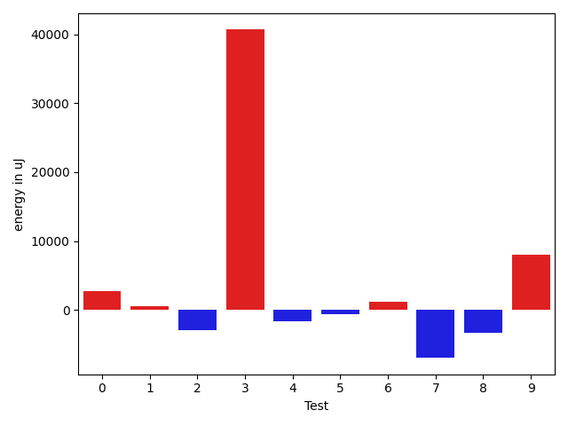

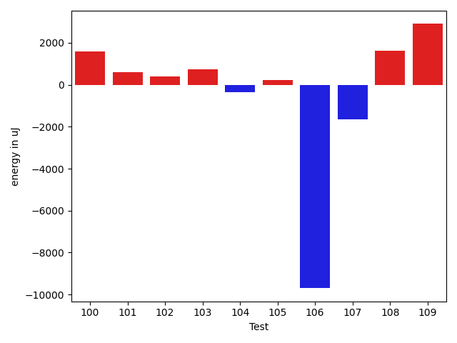

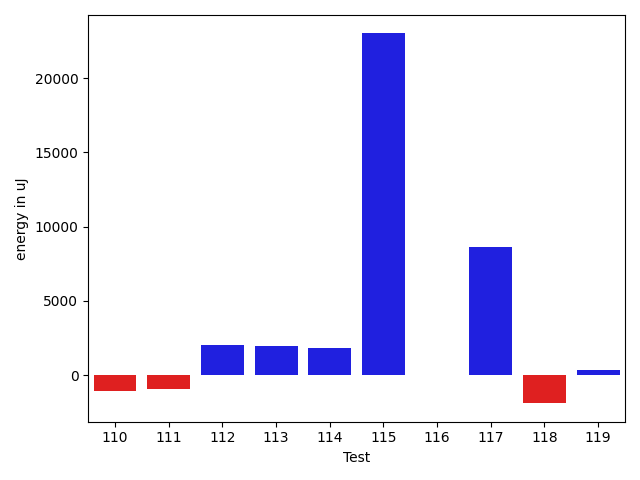

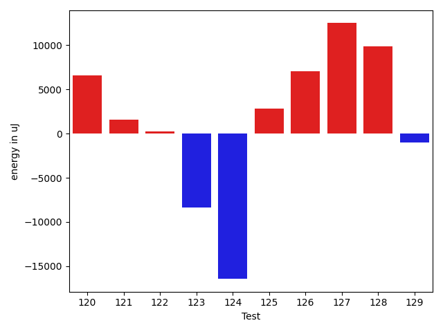

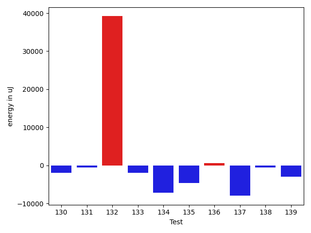

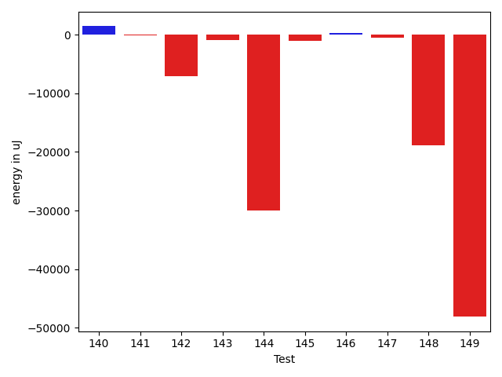

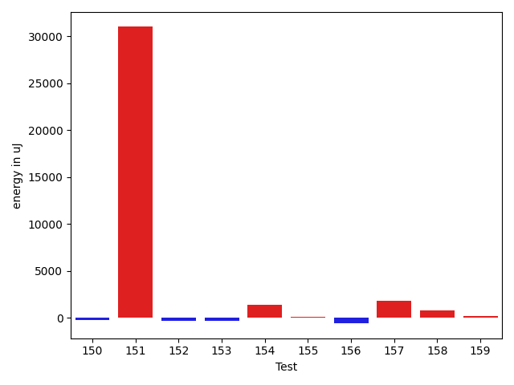

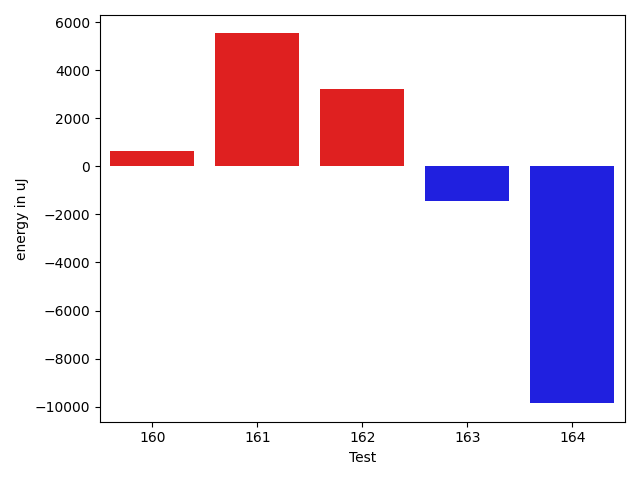

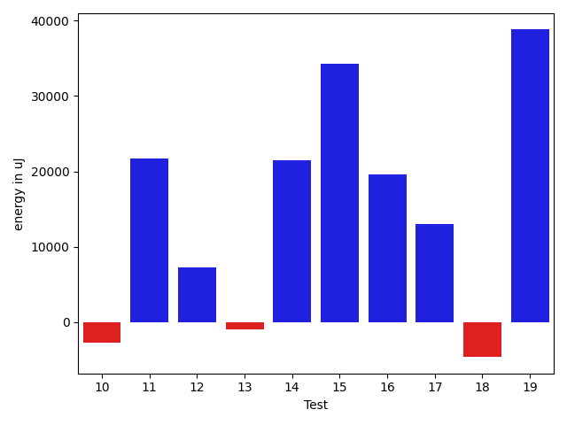

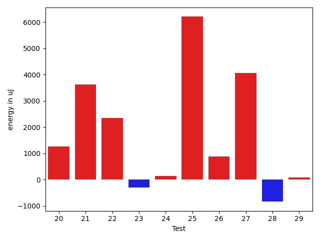

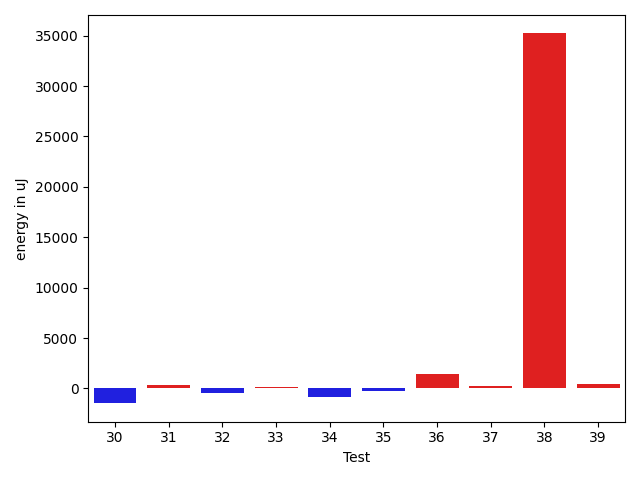

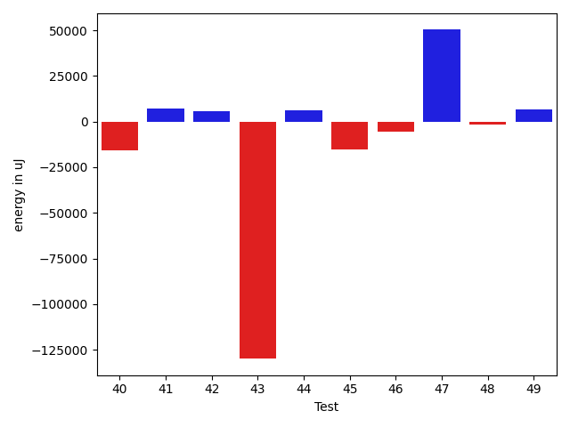

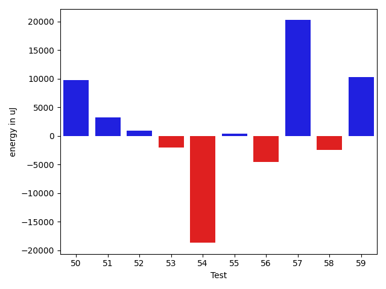

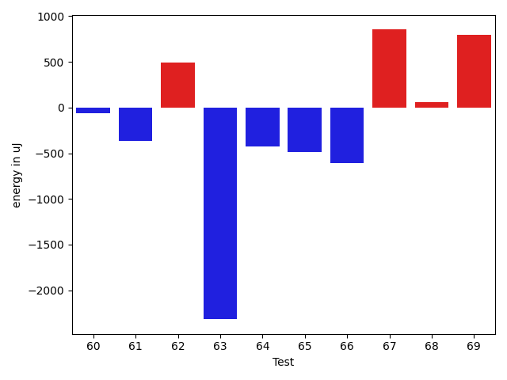

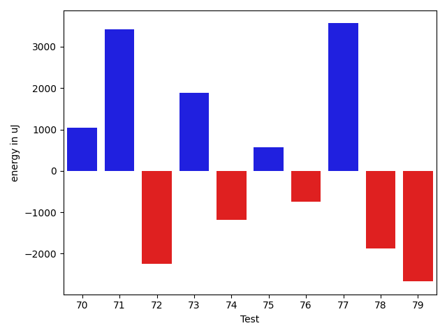

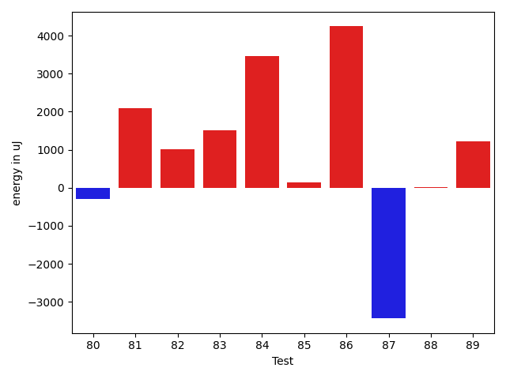

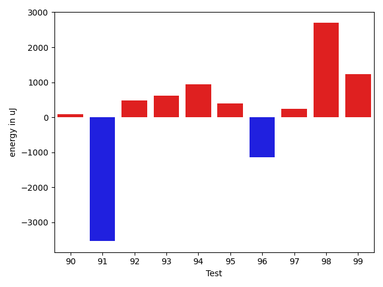

| ID | EnergyV1 | EnergyV2 | DeltaEnergy |
| --- | --- | --- | --- |
| 0 | 51410.1027768144 | 43536.84692598439 | -7873.255850830006 |
| 1 | 52935.11018225044 | 46477.166025113795 | -6457.944157136648 |
| 2 | 40973.22195786238 | 43140.99593943282 | 2167.773981570441 |
| 3 | 60571.20317134532 | 43331.33124604923 | -17239.871925296087 |
| 4 | 48981.31432444628 | 45029.69351344604 | -3951.620811000241 |
| 5 | 37861.2929687947 | 44066.18372309208 | 6204.890754297376 |
| 6 | 48829.01531748225 | 52540.35379977262 | 3711.3384822903754 |
| 7 | 67324.65983838783 | 69584.89237432065 | 2260.2325359328242 |
| 8 | 45526.62217406694 | 40202.38783284374 | -5324.2343412232 |
| 9 | 681559.7591084901 | 920025.2957635338 | 238465.53665504372 |
| 10 | 88461.96575400076 | 85714.35989627814 | -2747.6058577226213 |
| 11 | 38860.41231036662 | 60588.58440576788 | 21728.172095401256 |
| 12 | 39878.4252352491 | 47187.41405818921 | 7308.988822940111 |
| 13 | 41522.42136813994 | 40622.47961674571 | -899.9417513942317 |
| 14 | 52718.91307122866 | 74158.25827171898 | 21439.345200490323 |
| 15 | 42146.421332838065 | 76411.8766095562 | 34265.45527671814 |
| 16 | 44208.136929615335 | 63848.31457594566 | 19640.177646330325 |
| 17 | 44826.721931278116 | 57787.8238228727 | 12961.101891594582 |
| 18 | 45124.972675417885 | 40501.638511108664 | -4623.334164309221 |
| 19 | 78382.43001267836 | 117169.71512688207 | 38787.28511420371 |
| 20 | 46403.79102836708 | 46137.86215284972 | -265.92887551736203 |
| 21 | 40992.89325952177 | 41518.62348124576 | 525.7302217239921 |
| 22 | 42790.92658829689 | 38959.081913009286 | -3831.8446752876043 |
| 23 | 45497.585835796635 | 40068.52516886497 | -5429.060666931662 |
| 24 | 44757.682161109624 | 39168.87302748516 | -5588.8091336244615 |
| 25 | 43665.479621227365 | 44418.66394220494 | 753.1843209775761 |
| 26 | 39642.72713848537 | 40809.10197854078 | 1166.3748400554105 |
| 27 | 43677.71653291487 | 38736.4473681192 | -4941.269164795667 |
| 28 | 42670.13034134885 | 46279.00757282228 | 3608.8772314734306 |
| 29 | 46405.19638823981 | 40107.88199835866 | -6297.314389881154 |
| 30 | 44696.49634051985 | 40525.136217407235 | -4171.360123112616 |
| 31 | 43980.88343918887 | 41836.17528625736 | -2144.7081529315037 |
| 32 | 41691.48350596783 | 44878.6880041594 | 3187.204498191568 |
| 33 | 42945.54298879965 | 42422.6458579832 | -522.8971308164473 |
| 34 | 40164.083432481 | 39572.36238586771 | -591.7210466132892 |
| 35 | 44326.634125930206 | 39794.44124875567 | -4532.192877174537 |
| 36 | 42795.4744744756 | 45357.04267052328 | 2561.5681960476795 |
| 37 | 44645.280838254206 | 40378.06048315954 | -4267.220355094665 |
| 38 | 44143.8553805073 | 158423.61884513934 | 114279.76346463204 |
| 39 | 43976.7731003471 | 39187.88550917786 | -4788.887591169238 |
| 40 | 60401.27754843162 | 44699.34849020744 | -15701.929058224181 |
| 41 | 39743.668258071455 | 46870.907911205286 | 7127.239653133831 |
| 42 | 38896.3197390968 | 44754.917276191125 | 5858.597537094327 |
| 43 | 218149.73411031475 | 88219.60355343275 | -129930.130556882 |
| 44 | 39229.51363541064 | 45308.53786868551 | 6079.024233274868 |
| 45 | 72220.7610186034 | 57034.2260943664 | -15186.534924237 |
| 46 | 49555.397540306425 | 44014.497712047356 | -5540.899828259069 |
| 47 | 289177.4128059115 | 339476.1616219502 | 50298.748816038715 |
| 48 | 44411.19069006748 | 42835.314783810434 | -1575.8759062570462 |
| 49 | 43924.93409369707 | 50790.118180532474 | 6865.184086835405 |
| 50 | 44309.055829370496 | 54108.029846563164 | 9798.974017192668 |
| 51 | 43785.36467224626 | 47016.50693230734 | 3231.142260061082 |
| 52 | 90536.59367118287 | 91435.83892871925 | 899.2452575363859 |
| 53 | 42933.034098614036 | 40949.94401310584 | -1983.0900855081927 |
| 54 | 85499.98619630701 | 66835.35337735177 | -18664.632818955244 |
| 55 | 40813.26971338935 | 41254.98518163583 | 441.7154682464752 |
| 56 | 45491.84490305839 | 40986.59876722914 | -4505.246135829249 |
| 57 | 46269.043120376184 | 66515.90881528344 | 20246.86569490726 |
| 58 | 43035.62497277213 | 40654.70872344656 | -2380.9162493255717 |
| 59 | 41274.61000332677 | 51561.94065805481 | 10287.330654728037 |
| 60 | 41425.37108350215 | 36811.97975771871 | -4613.391325783436 |
| 61 | 59478.23125430134 | 52311.40575049276 | -7166.825503808577 |
| 62 | 154165.82643645146 | 113057.03184111448 | -41108.79459533698 |
| 63 | 41044.34288064155 | 43607.82686130657 | 2563.4839806650198 |
| 64 | 40680.54335769058 | 68057.57329622886 | 27377.029938538282 |
| 65 | 42884.4019227402 | 42332.69879185004 | -551.7031308901642 |
| 66 | 39563.820416122864 | 37039.30015656283 | -2524.520259560035 |
| 67 | 42051.82815954172 | 39017.06071065445 | -3034.7674488872726 |
| 68 | 46969.22035134227 | 55523.124976540304 | 8553.904625198033 |
| 69 | 119193.81012108026 | 99251.91866275418 | -19941.891458326078 |
| 70 | 42353.553517785906 | 43391.90046133517 | 1038.3469435492661 |
| 71 | 167995.97117847833 | 171417.07287227028 | 3421.1016937919485 |
| 72 | 43055.45977298872 | 40817.98497896323 | -2237.4747940254892 |
| 73 | 42119.45239512503 | 44007.116167782115 | 1887.6637726570843 |
| 74 | 43807.267472406485 | 42616.83784486111 | -1190.4296275453744 |
| 75 | 39131.25285185412 | 39710.288806769764 | 579.0359549156419 |
| 76 | 44934.609739114385 | 44197.823971373655 | -736.7857677407301 |
| 77 | 41736.33460430353 | 45301.134290088594 | 3564.7996857850667 |
| 78 | 45619.94169616699 | 43747.26016691327 | -1872.6815292537212 |
| 79 | 44048.75545481167 | 41378.32166978783 | -2670.433785023837 |
| 80 | 43425.83636656352 | 42735.04400486455 | -690.792361698972 |
| 81 | 44362.914244737025 | 57342.8980508542 | 12979.983806117176 |
| 82 | 45124.791036527866 | 47629.22324384001 | 2504.432207312144 |
| 83 | 43545.896538080415 | 46287.157828677446 | 2741.261290597031 |
| 84 | 42589.53458632149 | 43048.226084091686 | 458.6914977701963 |
| 85 | 44087.69823074341 | 44105.88126824936 | 18.18303750595078 |
| 86 | 42206.918966199824 | 42157.24373548625 | -49.67523071357573 |
| 87 | 45896.01382915418 | 41031.04657212169 | -4864.967257032491 |
| 88 | 44042.41524579262 | 41134.776584348685 | -2907.6386614439325 |
| 89 | 41498.61964583921 | 43500.53087167446 | 2001.9112258352543 |
| 90 | 43148.37341418583 | 41375.90604051855 | -1772.4673736672776 |
| 91 | 48580.832020936265 | 41758.45134403476 | -6822.380676901506 |
| 92 | 42546.594652166306 | 41865.90163196076 | -680.6930202055446 |
| 93 | 44404.93170199261 | 40958.723000633436 | -3446.2087013591736 |
| 94 | 42777.21293729039 | 41978.62726528912 | -798.5856720012671 |
| 95 | 43671.984375 | 39697.596450805664 | -3974.387924194336 |
| 96 | 45749.88781738281 | 126447.94970703125 | 80698.06188964844 |
| 97 | 95533.22023109652 | 117235.44167088458 | 21702.22143978806 |
| 98 | 80010.58928983017 | 62889.916870631 | -17120.672419199167 |
| 99 | 87454.36323376559 | 95697.1889039245 | 8242.825670158913 |
| 100 | 51711.3257338736 | 42581.78562701227 | -9129.540106861328 |
| 101 | 45446.31408141709 | 46617.97492879504 | 1171.6608473779488 |
| 102 | 55341.96937228045 | 43994.25799921808 | -11347.711373062368 |
| 103 | 39624.14313531667 | 44359.26613744721 | 4735.123002130538 |
| 104 | 46338.77338682641 | 41358.5796434262 | -4980.19374340021 |
| 105 | 42547.2286667735 | 53271.34822086674 | 10724.119554093239 |
| 106 | 103237.32203832896 | 88274.99099399094 | -14962.331044338018 |
| 107 | 43469.52117521961 | 70113.93207174317 | 26644.410896523557 |
| 108 | 43450.824855714265 | 40214.9003499602 | -3235.9245057540684 |
| 109 | 46023.65460928961 | 46226.83960969017 | 203.18500040056097 |
| 110 | 46456.57889463312 | 45369.14187181706 | -1087.4370228160624 |
| 111 | 44912.751787923495 | 43993.50947095455 | -919.2423169689428 |
| 112 | 41974.704598135984 | 44031.66707657804 | 2056.9624784420594 |
| 113 | 42641.94423297668 | 44587.62206650734 | 1945.677833530659 |
| 114 | 87621.2157945672 | 89461.89163908878 | 1840.675844521582 |
| 115 | 42656.726375941784 | 65654.63184890183 | 22997.905472960047 |
| 116 | 43428.6922130023 | 43469.017105919585 | 40.32489291728416 |
| 117 | 47824.7705812305 | 56441.626899597344 | 8616.856318366845 |
| 118 | 47786.11042017114 | 45902.922355863775 | -1883.1880643073673 |
| 119 | 45904.12349884925 | 46258.927476674784 | 354.80397782553337 |
| 120 | 43941.19949665615 | 203153.33721784633 | 159212.13772119017 |
| 121 | 44503.0737959935 | 42562.00090430277 | -1941.072891690732 |
| 122 | 38229.440482765436 | 43276.068296826445 | 5046.627814061008 |
| 123 | 50117.4274350129 | 48645.12606775857 | -1472.3013672543311 |
| 124 | 49694.1848597349 | 44785.271659401 | -4908.913200333904 |
| 125 | 82860.50971473925 | 71404.11639991777 | -11456.393314821486 |
| 126 | 98537.0244311837 | 98948.49049706293 | 411.46606587922724 |
| 127 | 56624.9819413797 | 45795.83449485045 | -10829.147446529249 |
| 128 | 48904.46494514257 | 94816.09606309459 | 45911.63111795202 |
| 129 | 45948.802505303654 | 50215.75227595206 | 4266.9497706484035 |
| 130 | 45855.1626378572 | 44715.957213633454 | -1139.2054242237427 |
| 131 | 233502.44699682528 | 203062.71909114846 | -30439.727905676817 |
| 132 | 761002.0855827935 | 734638.6759728116 | -26363.409609981813 |
| 133 | 44181.704674233064 | 43366.636642933365 | -815.0680312996992 |
| 134 | 46728.136236555925 | 360193.2977657036 | 313465.16152914765 |
| 135 | 44804.92963858535 | 43091.7561460802 | -1713.1734925051496 |
| 136 | 47492.17014073985 | 43159.10740253385 | -4333.062738205997 |
| 137 | 159892.6001698613 | 55884.163787929516 | -104008.4363819318 |
| 138 | 45646.84981843224 | 45879.12657808377 | 232.2767596515332 |
| 139 | 40995.24613330182 | 45446.46102014348 | 4451.214886841655 |
| 140 | 45230.05509409714 | 46657.84550656065 | 1427.7904124635097 |
| 141 | 41316.92231640946 | 41167.676616580706 | -149.24569982875255 |
| 142 | 49315.254396989185 | 42230.091492048814 | -7085.162904940371 |
| 143 | 55291.61014799721 | 54352.41506808136 | -939.1950799158512 |
| 144 | 78257.56073687557 | 48286.34951960946 | -29971.211217266115 |
| 145 | 44182.7484368477 | 43186.623369676294 | -996.1250671714079 |
| 146 | 43114.15313551191 | 43360.92788680143 | 246.7747512895221 |
| 147 | 45238.687820099745 | 44712.78697256882 | -525.9008475309238 |
| 148 | 64219.90139955939 | 45380.214842549576 | -18839.686557009816 |
| 149 | 242478.26523732624 | 194358.47280946485 | -48119.792427861394 |
| 150 | 61218.12319171361 | 65768.95821324017 | 4550.83502152656 |
| 151 | 46882.24133790899 | 43298.64114577691 | -3583.6001921320785 |
| 152 | 45032.65682504671 | 43228.218299692235 | -1804.4385253544751 |
| 153 | 37995.88987195492 | 42910.7544442229 | 4914.864572267979 |
| 154 | 90689.5458545626 | 62474.16099135902 | -28215.38486320358 |
| 155 | 42822.238715903644 | 46271.0525515468 | 3448.813835643159 |
| 156 | 44309.707137907906 | 45382.14162140826 | 1072.4344835003503 |
| 157 | 44010.060675382614 | 42627.556453472935 | -1382.5042219096795 |
| 158 | 45402.88842783254 | 47209.06142334924 | 1806.1729955166957 |
| 159 | 50143.9008634356 | 45516.17948439582 | -4627.72137903978 |
| 160 | 65546.99645140457 | 45806.01941571006 | -19740.97703569451 |
| 161 | 44918.594397163404 | 46384.836598712856 | 1466.2422015494521 |
| 162 | 102097.21687156378 | 48766.26393552856 | -53330.952936035224 |
| 163 | 46649.66794943021 | 46572.1699352832 | -77.49801414700778 |
| 164 | 40514.97439074516 | 44719.107555199414 | 4204.1331644542515 |

## Delta Duration per test method

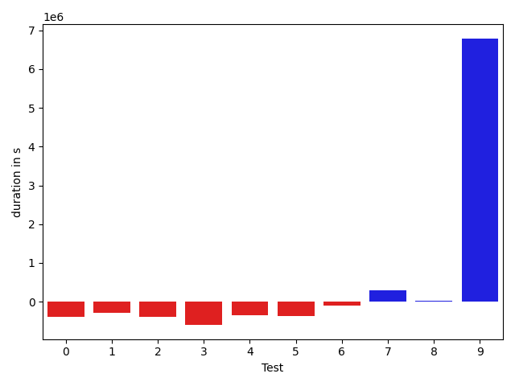

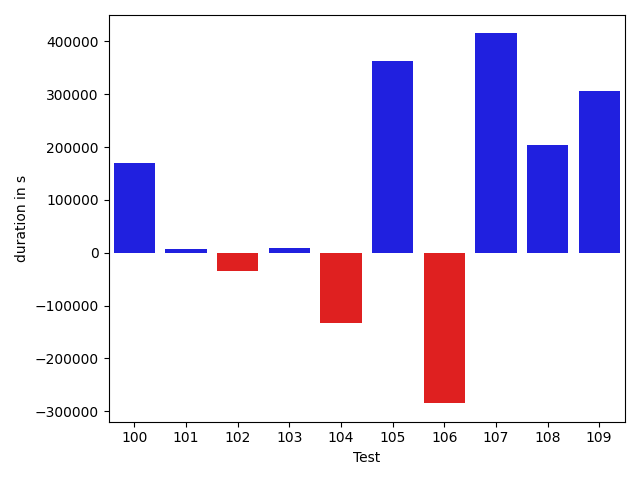

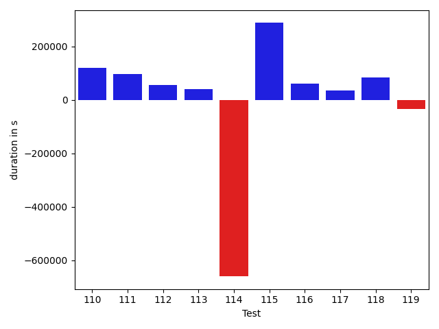

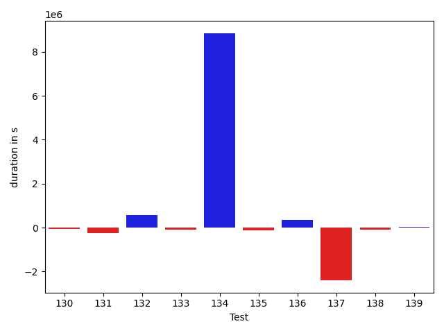

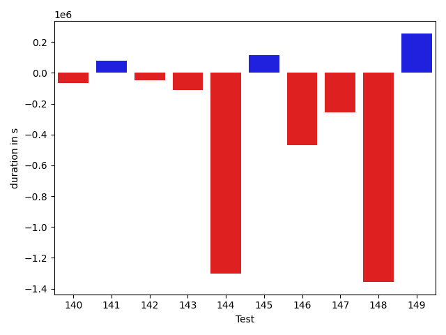

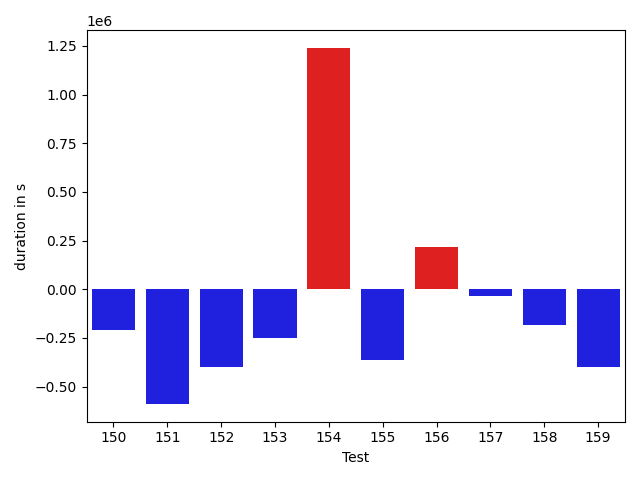

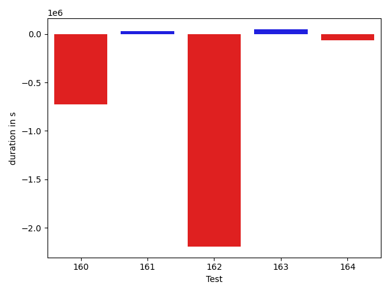

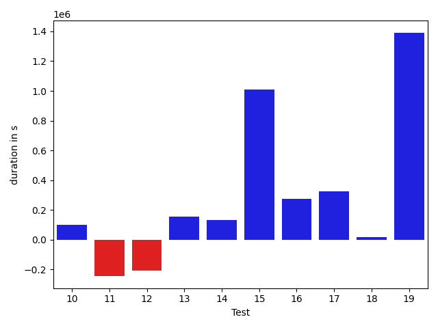

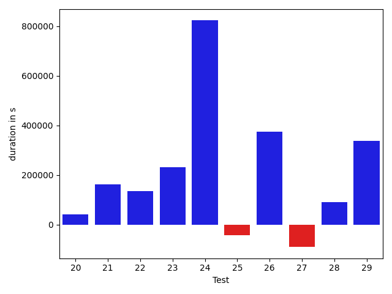

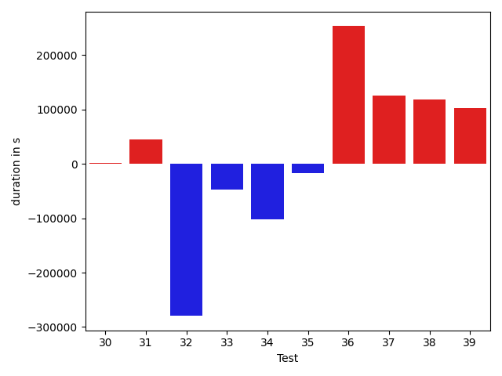

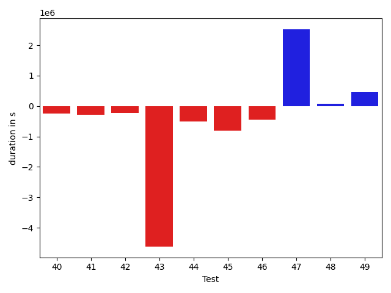

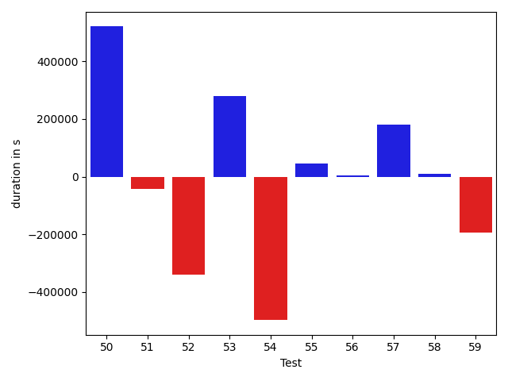

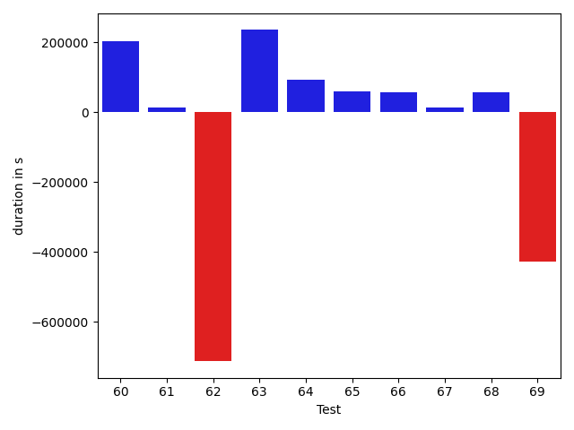

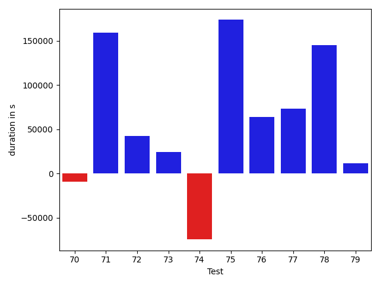

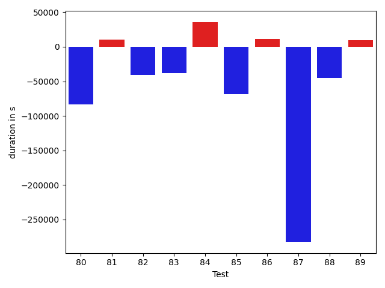

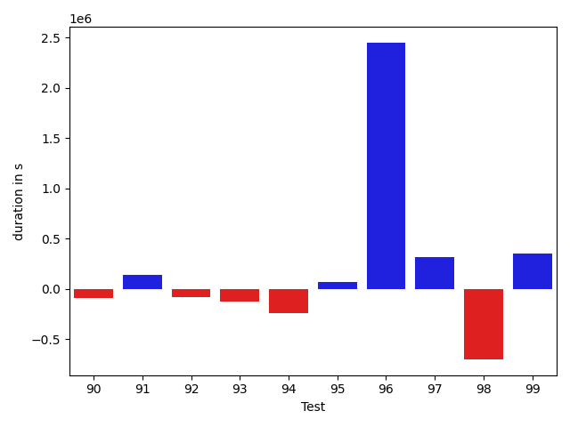

| ID | DurationV1 | DurationsV2 | DeltaDuration |
| --- | --- | --- | --- |
| 0 | 1222530.4632020257 | 838553.700213112 | -383976.7629889137 |
| 1 | 1007742.2849573286 | 727463.5789777825 | -280278.70597954607 |
| 2 | 902599.6474945098 | 504547.99036425486 | -398051.65713025496 |
| 3 | 1828854.7806323268 | 1233817.0455984636 | -595037.7350338632 |
| 4 | 1092059.5656946723 | 749277.225155699 | -342782.34053897334 |
| 5 | 798597.1525679678 | 438348.1347042322 | -360249.01786373556 |
| 6 | 1694581.6245684456 | 1600320.8013932458 | -94260.8231751998 |
| 7 | 1490691.5329024626 | 1790937.18155672 | 300245.6486542574 |
| 8 | 768190.7542181197 | 790603.1491819206 | 22412.394963800907 |
| 9 | 17676224.3807311 | 24460837.747267418 | 6784613.366536319 |
| 10 | 2048105.799616112 | 2149863.226648991 | 101757.42703287909 |
| 11 | 1403472.6098640226 | 1160078.702004017 | -243393.9078600055 |
| 12 | 893787.7387008965 | 686868.9650960627 | -206918.77360483375 |
| 13 | 770816.1713446982 | 926671.008046702 | 155854.83670200384 |
| 14 | 1927651.8028008156 | 2061151.208825186 | 133499.40602437034 |
| 15 | 728172.913038735 | 1737594.6968458951 | 1009421.7838071601 |
| 16 | 1250116.7201149357 | 1527293.3648635352 | 277176.6447485995 |
| 17 | 955180.1600567045 | 1281220.0913021495 | 326039.9312454449 |
| 18 | 833477.6597734911 | 850682.3335458098 | 17204.673772318754 |
| 19 | 2056910.6798515534 | 3447572.9460561997 | 1390662.2662046463 |
| 20 | 747879.9207626797 | 788391.1199486854 | 40511.199186005746 |
| 21 | 714832.118065149 | 877557.9804447731 | 162725.86237962404 |
| 22 | 419707.101367116 | 555776.5377213061 | 136069.4363541901 |
| 23 | 709654.9588043959 | 942366.5707711818 | 232711.61196678597 |
| 24 | 539697.3755434302 | 1362234.5850058286 | 822537.2094623984 |
| 25 | 852104.3681748959 | 809522.0209421609 | -42582.34723273502 |
| 26 | 870485.7447212005 | 1245461.2456332617 | 374975.5009120612 |
| 27 | 1027859.9013161955 | 938278.9917662836 | -89580.90954991186 |
| 28 | 711422.7600345385 | 803543.1270134998 | 92120.36697896139 |
| 29 | 987824.2011565284 | 1324936.1902326946 | 337111.9890761662 |
| 30 | 675681.3048167935 | 852707.1847085683 | 177025.87989177473 |
| 31 | 638661.8543654035 | 784820.501054153 | 146158.64668874943 |
| 32 | 705488.3619490035 | 608815.4171382322 | -96672.94481077138 |
| 33 | 621201.5511077363 | 594828.0915510203 | -26373.45955671603 |
| 34 | 725888.8506904002 | 1100109.0978379126 | 374220.2471475124 |
| 35 | 699122.3578970927 | 812620.7037960959 | 113498.34589900321 |
| 36 | 561367.5556499064 | 478248.7866217261 | -83118.76902818028 |
| 37 | 868009.3921864824 | 1063510.9212863042 | 195501.5290998218 |
| 38 | 903933.1167703525 | 5025715.419008094 | 4121782.3022377416 |
| 39 | 784923.5023218596 | 823319.0547854492 | 38395.552463589585 |
| 40 | 1403321.0114225985 | 1153711.904515766 | -249609.10690683243 |
| 41 | 1368088.574120907 | 1078520.7020599847 | -289567.87206092244 |
| 42 | 1312973.2068776377 | 1090292.0793310842 | -222681.1275465535 |
| 43 | 6912711.961945916 | 2297056.4892319795 | -4615655.472713936 |
| 44 | 1613630.9081383448 | 1103461.2794744833 | -510169.6286638614 |
| 45 | 2232766.0987379383 | 1419570.6326321354 | -813195.4661058029 |
| 46 | 1528324.6032564421 | 1073351.6277161243 | -454972.9755403178 |
| 47 | 7125682.765797012 | 9647847.042122453 | 2522164.276325442 |
| 48 | 534752.5807579458 | 605900.7173119122 | 71148.13655396644 |
| 49 | 617391.8349993244 | 1070557.3409684603 | 453165.5059691359 |
| 50 | 971091.6751225905 | 1491770.232837248 | 520678.5577146574 |
| 51 | 802388.8964932056 | 759343.3188910747 | -43045.57760213083 |
| 52 | 2364625.5181362145 | 2025689.41638863 | -338936.10174758453 |
| 53 | 859516.3215992386 | 1140146.5702837836 | 280630.24868454505 |
| 54 | 2133659.26052798 | 1636477.0187677534 | -497182.24176022667 |
| 55 | 783261.0571729883 | 829195.4625654828 | 45934.40539249452 |
| 56 | 627353.9659897519 | 630568.8321300147 | 3214.866140262806 |
| 57 | 1743915.4743933715 | 1925244.1561889797 | 181328.68179560825 |
| 58 | 797050.9427723362 | 805865.9595100195 | 8815.016737683327 |
| 59 | 1166775.8138500976 | 974066.3394948756 | -192709.47435522196 |
| 60 | 934896.0949614674 | 1137096.5255009793 | 202200.43053951184 |
| 61 | 1358530.5105470847 | 1372830.1458143434 | 14299.635267258622 |
| 62 | 3632135.1504631927 | 2918979.4233618495 | -713155.7271013432 |
| 63 | 898923.840404815 | 1134219.531470618 | 235295.69106580294 |
| 64 | 1752351.165142641 | 1844656.5038044867 | 92305.33866184577 |
| 65 | 602843.8808175211 | 662278.9593370683 | 59435.078519547125 |
| 66 | 1036445.5353902237 | 1093268.1933128359 | 56822.657922612154 |
| 67 | 788220.6400283158 | 802197.6463215518 | 13977.006293235929 |
| 68 | 1518869.8906443156 | 1576422.9123087234 | 57553.0216644078 |
| 69 | 2983839.086855461 | 2555613.865461136 | -428225.2213943247 |
| 70 | 1258021.6052541658 | 1248629.9056819892 | -9391.699572176673 |
| 71 | 4096985.0898471023 | 4256015.92664755 | 159030.83680044813 |
| 72 | 627339.7872581643 | 669569.1747338162 | 42229.38747565192 |
| 73 | 621151.7622868306 | 645401.5371067384 | 24249.77481990785 |
| 74 | 893514.5558589807 | 819019.0707701575 | -74495.48508882325 |
| 75 | 828597.1545983914 | 1002264.0152788081 | 173666.8606804167 |
| 76 | 704999.9182340584 | 768669.7476194755 | 63669.82938541705 |
| 77 | 737021.6615712983 | 810620.314242889 | 73598.6526715908 |
| 78 | 419821.40142059326 | 565004.9745925069 | 145183.57317191362 |
| 79 | 756220.1092409291 | 767898.1778507358 | 11678.068609806709 |
| 80 | 877669.946733149 | 910768.2650615335 | 33098.31832838454 |
| 81 | 1341824.1646372094 | 1925976.051509832 | 584151.8868726227 |
| 82 | 668643.4423972528 | 800235.5437032434 | 131592.1013059906 |
| 83 | 489291.0823767499 | 478112.8045653049 | -11178.277811445005 |
| 84 | 883357.2600187097 | 917962.4063854609 | 34605.14636675117 |
| 85 | 548008.6439933777 | 439593.8097288343 | -108414.83426454337 |
| 86 | 796452.4316819904 | 820495.5281022371 | 24043.09642024676 |
| 87 | 822708.6681441434 | 792357.7579142271 | -30350.910229916335 |
| 88 | 1065479.9515788804 | 1012989.2511792391 | -52490.7003996413 |
| 89 | 584773.509089687 | 706123.2273047707 | 121349.7182150837 |
| 90 | 787536.0072386847 | 691653.1917649182 | -95882.81547376653 |
| 91 | 1319720.1551086344 | 1457296.823372553 | 137576.66826391872 |
| 92 | 747654.3064989316 | 669013.9268868044 | -78640.3796121272 |
| 93 | 836814.4867848352 | 709982.9117016026 | -126831.5750832326 |
| 94 | 916094.8468216844 | 669631.0948957581 | -246463.7519259263 |
| 95 | 349209.43359375 | 416440.0095844269 | 67230.57599067688 |
| 96 | 414655.7553405762 | 2864945.494140625 | 2450289.738800049 |
| 97 | 2273371.9700354813 | 2590735.0934035145 | 317363.1233680332 |
| 98 | 1942712.8678895084 | 1240463.8184099393 | -702249.0494795691 |
| 99 | 2088196.1353763565 | 2439174.833728246 | 350978.6983518894 |
| 100 | 945342.0668923466 | 1114850.6626273235 | 169508.59573497693 |
| 101 | 689600.989768092 | 696631.7387849892 | 7030.749016897171 |
| 102 | 1497140.4266246257 | 1462281.428660596 | -34858.997964029666 |
| 103 | 712770.2993293628 | 720997.6700659133 | 8227.37073655054 |
| 104 | 841472.2307899104 | 708996.6038962683 | -132475.62689364213 |
| 105 | 968465.9815101605 | 1330328.9018880262 | 361862.92037786567 |
| 106 | 2500447.6787787364 | 2215563.768514276 | -284883.91026446037 |
| 107 | 1254876.6620601509 | 1669713.50222771 | 414836.8401675592 |
| 108 | 706149.3153063391 | 910289.6548839258 | 204140.33957758674 |
| 109 | 1128727.0052715242 | 1435265.7311694515 | 306538.7258979273 |
| 110 | 853856.9489696466 | 972037.252189665 | 118180.3032200184 |
| 111 | 763353.4439737777 | 859142.796213968 | 95789.35224019026 |
| 112 | 902793.2057216007 | 958491.3086168482 | 55698.10289524752 |
| 113 | 975709.0718049945 | 1016633.4040879785 | 40924.33228298405 |
| 114 | 2763797.750886907 | 2103834.799393354 | -659962.9514935529 |
| 115 | 1017130.4391988852 | 1304325.78999567 | 287195.35079678486 |
| 116 | 1127282.9501536014 | 1188489.4936282581 | 61206.54347465676 |
| 117 | 1783308.19741716 | 1818205.8824276868 | 34897.685010526795 |
| 118 | 1132564.7902056854 | 1216016.2680516904 | 83451.477846005 |
| 119 | 567582.4650514915 | 532343.4641722646 | -35239.00087922695 |
| 120 | 1203092.2159383814 | 5604299.519626212 | 4401207.303687831 |
| 121 | 726175.3697251275 | 783965.2629150515 | 57789.89318992407 |
| 122 | 707787.2272575556 | 520741.0004283078 | -187046.22682924778 |
| 123 | 1674125.8563819327 | 1388125.2409866145 | -286000.61539531825 |
| 124 | 1212322.0601517246 | 774565.2357167441 | -437756.8244349805 |
| 125 | 2235914.3676353665 | 1726365.7183732248 | -509548.64926214167 |
| 126 | 2518084.075867505 | 2652145.486317867 | 134061.41045036213 |
| 127 | 1412813.4300952407 | 1174774.7290616564 | -238038.7010335843 |
| 128 | 1266220.231321313 | 2623723.5356542366 | 1357503.3043329236 |
| 129 | 920964.6822710778 | 1349580.1621460798 | 428615.47987500206 |
| 130 | 1012583.5522839047 | 955655.9176538764 | -56927.63463002839 |
| 131 | 5616037.25337592 | 5352361.026855512 | -263676.22652040794 |
| 132 | 17859624.499773495 | 18428392.946503572 | 568768.4467300773 |
| 133 | 1056894.7419732036 | 952134.837736823 | -104759.9042363806 |
| 134 | 708346.2948915837 | 9556205.283092767 | 8847858.988201182 |
| 135 | 876281.0780625042 | 745716.9132976322 | -130564.16476487194 |
| 136 | 706347.0240981127 | 1058120.6113010184 | 351773.5872029057 |
| 137 | 3475798.8765891 | 1081155.471917327 | -2394643.404671773 |
| 138 | 1278357.610202083 | 1191022.770755552 | -87334.83944653091 |
| 139 | 1130420.3997907592 | 1158629.8250524895 | 28209.42526173033 |
| 140 | 1356126.5269921622 | 1292329.7554678186 | -63796.77152434364 |
| 141 | 839598.6841787616 | 919130.864703292 | 79532.18052453047 |
| 142 | 1064077.448798729 | 1018318.1707036354 | -45759.27809509367 |
| 143 | 1527371.7329779458 | 1414505.5525584142 | -112866.18041953165 |
| 144 | 2171572.390257865 | 870301.6908733987 | -1301270.6993844665 |
| 145 | 511123.4179656212 | 626516.9258743007 | 115393.50790867943 |
| 146 | 1287823.5629699074 | 816657.3800595475 | -471166.18291035993 |
| 147 | 1115489.9077659256 | 860460.4534731063 | -255029.45429281937 |
| 148 | 2299080.896860783 | 943150.6247737034 | -1355930.2720870795 |
| 149 | 5022459.3441448035 | 5278092.044619958 | 255632.70047515444 |
| 150 | 1652055.427788884 | 2086093.4456641544 | 434038.01787527045 |
| 151 | 924382.0789788126 | 1117201.710805321 | 192819.63182650856 |
| 152 | 784448.1220356676 | 835383.0628609674 | 50934.94082529971 |
| 153 | 607219.1916145086 | 528859.3706528284 | -78359.82096168026 |
| 154 | 2571242.809716992 | 1618983.9980510937 | -952258.8116658984 |
| 155 | 983442.9607559704 | 981682.5985754046 | -1760.3621805658331 |
| 156 | 958994.2228170125 | 886096.023903363 | -72898.19891364942 |
| 157 | 591721.0240814686 | 462428.1530960044 | -129292.8709854642 |
| 158 | 1244153.286869403 | 1000812.5363363285 | -243340.7505330745 |
| 159 | 1077851.5423939647 | 915672.7163855744 | -162178.8260083903 |
| 160 | 1846927.1001096696 | 1120803.7027309916 | -726123.397378678 |
| 161 | 813555.233862841 | 845724.5737518095 | 32169.339888968505 |
| 162 | 3416554.1825830988 | 1221932.0524138545 | -2194622.1301692445 |
| 163 | 882747.8950476425 | 932055.328978821 | 49307.43393117853 |
| 164 | 582857.10321486 | 518666.9755100887 | -64190.127704771236 |

## Misc.

| ID | Test Class | Test Method |
| --- | --- | --- |
| 0 | com.google.gson.functional.CustomTypeAdaptersTest | testCustomAdapterInvokedForCollectionElementDeserialization |
| 1 | com.google.gson.functional.CustomTypeAdaptersTest | testCustomAdapterInvokedForMapElementSerializationWithType |
| 2 | com.google.gson.functional.CustomTypeAdaptersTest | testCustomAdapterInvokedForCollectionElementSerialization |
| 3 | com.google.gson.functional.CustomTypeAdaptersTest | testCustomAdapterInvokedForCollectionElementSerializationWithType |
| 4 | com.google.gson.functional.CustomTypeAdaptersTest | testCustomAdapterInvokedForMapElementDeserialization |
| 5 | com.google.gson.functional.CustomTypeAdaptersTest | testCustomAdapterInvokedForMapElementSerialization |
| 6 | com.google.gson.functional.InstanceCreatorTest | testInstanceCreatorForParametrizedType |
| 7 | com.google.gson.functional.InstanceCreatorTest | testInstanceCreatorForCollectionType |
| 8 | com.google.gson.functional.DefaultTypeAdaptersTest | testTreeSetDeserialization |
| 9 | com.google.gson.functional.DefaultTypeAdaptersTest | testNullSerialization |
| 10 | com.google.gson.functional.DefaultTypeAdaptersTest | testDateSerializationInCollection |
| 11 | com.google.gson.functional.DefaultTypeAdaptersTest | testTreeSetSerialization |
| 12 | com.google.gson.functional.DefaultTypeAdaptersTest | testSetSerialization |
| 13 | com.google.gson.functional.CollectionTest | testCollectionOfObjectSerialization |
| 14 | com.google.gson.functional.CollectionTest | testStack |
| 15 | com.google.gson.functional.CollectionTest | testRawCollectionOfBagOfPrimitivesNotAllowed |
| 16 | com.google.gson.functional.CollectionTest | testPriorityQueue |
| 17 | com.google.gson.functional.CollectionTest | testWildcardPrimitiveCollectionSerilaization |
| 18 | com.google.gson.functional.CollectionTest | testWildcardPrimitiveCollectionDeserilaization |
| 19 | com.google.gson.functional.CollectionTest | testWildcardCollectionField |
| 20 | com.google.gson.functional.CollectionTest | testVector |
| 21 | com.google.gson.functional.CollectionTest | testCollectionOfObjectWithNullSerialization |
| 22 | com.google.gson.functional.CollectionTest | testCollectionOfStringsSerialization |
| 23 | com.google.gson.functional.CollectionTest | testLinkedListSerialization |
| 24 | com.google.gson.functional.CollectionTest | testRawCollectionDeserializationNotAlllowed |
| 25 | com.google.gson.functional.CollectionTest | testFieldIsArrayList |
| 26 | com.google.gson.functional.CollectionTest | testCollectionOfBagOfPrimitivesSerialization |
| 27 | com.google.gson.functional.CollectionTest | testTopLevelCollectionOfIntegersDeserialization |
| 28 | com.google.gson.functional.CollectionTest | testLinkedListDeserialization |
| 29 | com.google.gson.functional.CollectionTest | testSetDeserialization |
| 30 | com.google.gson.functional.CollectionTest | testTopLevelListOfIntegerCollectionsDeserialization |
| 31 | com.google.gson.functional.CollectionTest | testTopLevelCollectionOfIntegersSerialization |
| 32 | com.google.gson.functional.CollectionTest | testNullsInListDeserialization |
| 33 | com.google.gson.functional.CollectionTest | testRawCollectionSerialization |
| 34 | com.google.gson.functional.CollectionTest | testNullsInListSerialization |
| 35 | com.google.gson.functional.CollectionTest | testQueueDeserialization |
| 36 | com.google.gson.functional.CollectionTest | testRawCollectionOfIntegersSerialization |
| 37 | com.google.gson.functional.CollectionTest | testQueueSerialization |
| 38 | com.google.gson.functional.CollectionTest | testSetSerialization |
| 39 | com.google.gson.functional.CollectionTest | testCollectionOfStringsDeserialization |
| 40 | com.google.gson.functional.ParameterizedTypesTest | testParameterizedTypeGenericArraysSerialization |
| 41 | com.google.gson.functional.ParameterizedTypesTest | testVariableTypeArrayDeserialization |
| 42 | com.google.gson.functional.ParameterizedTypesTest | testVariableTypeDeserialization |
| 43 | com.google.gson.functional.ParameterizedTypesTest | testVariableTypeFieldsAndGenericArraysSerialization |
| 44 | com.google.gson.functional.ParameterizedTypesTest | testParameterizedTypeGenericArraysDeserialization |
| 45 | com.google.gson.functional.ParameterizedTypesTest | testVariableTypeFieldsAndGenericArraysDeserialization |
| 46 | com.google.gson.functional.ParameterizedTypesTest | testParameterizedTypeWithVariableTypeDeserialization |
| 47 | com.google.gson.functional.CircularReferenceTest | testCircularSerialization |
| 48 | com.google.gson.functional.CircularReferenceTest | testDirectedAcyclicGraphSerialization |
| 49 | com.google.gson.functional.CircularReferenceTest | testDirectedAcyclicGraphDeserialization |
| 50 | com.google.gson.functional.MapTest | testSerializeMaps |
| 51 | com.google.gson.functional.MapTest | testHashMapDeserialization |
| 52 | com.google.gson.functional.MapTest | testInterfaceTypeMapWithSerializer |
| 53 | com.google.gson.functional.MapTest | testConcurrentSkipListMap |
| 54 | com.google.gson.functional.MapTest | testComplexKeysSerialization |
| 55 | com.google.gson.functional.MapTest | testMapDeserializationWithIntegerKeys |
| 56 | com.google.gson.functional.MapTest | testMapSerializationEmpty |
| 57 | com.google.gson.functional.MapTest | testMapDeserializationWithNullKey |
| 58 | com.google.gson.functional.MapTest | testMapStandardSubclassDeserialization |
| 59 | com.google.gson.functional.MapTest | testMapSubclassDeserialization |
| 60 | com.google.gson.functional.MapTest | testMapSerializationWithIntegerKeys |
| 61 | com.google.gson.functional.MapTest | testSortedMap |
| 62 | com.google.gson.functional.MapTest | testInterfaceTypeMap |
| 63 | com.google.gson.functional.MapTest | testMapSerializationWithWildcardValues |
| 64 | com.google.gson.functional.MapTest | testParameterizedMapSubclassSerialization |
| 65 | com.google.gson.functional.MapTest | testMapDeserializationWithNullValue |
| 66 | com.google.gson.functional.MapTest | testMapDeserializationWithLongKeys |
| 67 | com.google.gson.functional.MapTest | testMapSubclassSerialization |
| 68 | com.google.gson.functional.MapTest | testMapNamePromotionWithJsonElementReader |
| 69 | com.google.gson.functional.MapTest | testComplexKeysDeserialization |
| 70 | com.google.gson.functional.MapTest | testConcurrentMap |
| 71 | com.google.gson.functional.MapTest | testConcurrentNavigableMap |
| 72 | com.google.gson.functional.MapTest | testMapDeserializationEmpty |
| 73 | com.google.gson.functional.MapTest | testMapSerializationWithNullValue |
| 74 | com.google.gson.functional.MapTest | testMapOfMapDeserialization |
| 75 | com.google.gson.functional.MapTest | testMapDeserializationWithUnquotedLongKeys |
| 76 | com.google.gson.functional.MapTest | testMapDeserializationWithUnquotedIntegerKeys |
| 77 | com.google.gson.functional.MapTest | testReadMapsWithEmptyStringKey |
| 78 | com.google.gson.functional.MapTest | testMapWithQuotes |
| 79 | com.google.gson.functional.MapTest | testStringKeyDeserialization |
| 80 | com.google.gson.functional.MapTest | testGeneralMapField |
| 81 | com.google.gson.functional.MapTest | testMapSerializationWithNullValueButSerializeNulls |
| 82 | com.google.gson.functional.MapTest | testMapDeserialization |
| 83 | com.google.gson.functional.MapTest | testMapSerialization |
| 84 | com.google.gson.functional.MapTest | testConcurrentHashMap |
| 85 | com.google.gson.functional.MapTest | testMapOfMapSerialization |
| 86 | com.google.gson.functional.MapTest | testMapDeserializationWithWildcardValues |
| 87 | com.google.gson.functional.MapTest | testMapSerializationWithNullKey |
| 88 | com.google.gson.functional.MapTest | testMapSerializationWithNullValues |
| 89 | com.google.gson.functional.MapTest | testMapSerializationWithNullValuesSerialized |
| 90 | com.google.gson.functional.MapTest | testDeerializeMapOfMaps |
| 91 | com.google.gson.functional.MapTest | testNumberKeyDeserialization |
| 92 | com.google.gson.functional.MapTest | testSerializeMapOfMaps |
| 93 | com.google.gson.functional.MapTest | testBooleanKeyDeserialization |
| 94 | com.google.gson.functional.MapTest | testMapDeserializationWithDuplicateKeys |
| 95 | com.google.gson.functional.MapTest | testRawMapSerialization |
| 96 | com.google.gson.functional.MapTest | testWriteMapsWithEmptyStringKey |
| 97 | com.google.gson.functional.InheritanceTest | testSubInterfacesOfCollectionSerialization |
| 98 | com.google.gson.functional.InheritanceTest | testSubInterfacesOfCollectionDeserialization |
| 99 | com.google.gson.functional.InheritanceTest | testClassWithBaseCollectionFieldSerialization |
| 100 | com.google.gson.functional.ReadersWritersTest | testTypeMismatchThrowsJsonSyntaxExceptionForStrings |
| 101 | com.google.gson.functional.ReadersWritersTest | testTypeMismatchThrowsJsonSyntaxExceptionForReaders |
| 102 | com.google.gson.functional.ObjectTest | testSingletonLists |
| 103 | com.google.gson.functional.ObjectTest | testEmptyCollectionInAnObjectSerialization |
| 104 | com.google.gson.functional.ObjectTest | testEmptyCollectionInAnObjectDeserialization |
| 105 | com.google.gson.functional.ObjectTest | testTruncatedDeserialization |
| 106 | com.google.gson.functional.EnumTest | testEnumSubclass |
| 107 | com.google.gson.functional.EnumTest | testEnumSubclassWithRegisteredTypeAdapter |
| 108 | com.google.gson.functional.EnumTest | testCollectionOfEnumsDeserialization |
| 109 | com.google.gson.functional.EnumTest | testCollectionOfEnumsSerialization |
| 110 | com.google.gson.functional.EnumTest | testEnumSet |
| 111 | com.google.gson.functional.EnumTest | testEnumSubclassAsParameterizedType |
| 112 | com.google.gson.functional.MapAsArrayTypeAdapterTest | testMultipleEnableComplexKeyRegistrationHasNoEffect |
| 113 | com.google.gson.functional.MapAsArrayTypeAdapterTest | testMapWithTypeVariableDeserialization |
| 114 | com.google.gson.functional.MapAsArrayTypeAdapterTest | testSerializeComplexMapWithTypeAdapter |
| 115 | com.google.gson.functional.MapAsArrayTypeAdapterTest | testTwoTypesCollapseToOneDeserialize |
| 116 | com.google.gson.functional.MapAsArrayTypeAdapterTest | testMapWithTypeVariableSerialization |
| 117 | com.google.gson.functional.TypeVariableTest | testAdvancedTypeVariables |
| 118 | com.google.gson.functional.TypeVariableTest | testTypeVariablesViaTypeParameter |
| 119 | com.google.gson.functional.NullObjectAndFieldTest | testExplicitSerializationOfNullCollectionMembers |
| 120 | com.google.gson.functional.NullObjectAndFieldTest | testExplicitSerializationOfNullArrayMembers |
| 121 | com.google.gson.functional.NullObjectAndFieldTest | testPrintPrintingObjectWithNulls |
| 122 | com.google.gson.functional.NullObjectAndFieldTest | testExplicitSerializationOfNullStringMembers |
| 123 | com.google.gson.functional.StreamingTypeAdaptersTest | testSerializeWithCustomTypeAdapter |
| 124 | com.google.gson.functional.StreamingTypeAdaptersTest | testDeserializeWithCustomTypeAdapter |
| 125 | com.google.gson.functional.StreamingTypeAdaptersTest | testNullSafe |
| 126 | com.google.gson.functional.ThrowableFunctionalTest | testSerializedNameOnExceptionFields |
| 127 | com.google.gson.functional.ThrowableFunctionalTest | testExceptionWithCause |
| 128 | com.google.gson.functional.ThrowableFunctionalTest | testExceptionWithoutCause |
| 129 | com.google.gson.functional.ThrowableFunctionalTest | testErrornWithCause |
| 130 | com.google.gson.functional.ThrowableFunctionalTest | testErrorWithoutCause |
| 131 | com.google.gson.JavaSerializationTest | testMapIsSerializable |
| 132 | com.google.gson.JavaSerializationTest | testNumberIsSerializable |
| 133 | com.google.gson.JavaSerializationTest | testListIsSerializable |
| 134 | com.google.gson.CommentsTest | testParseComments |
| 135 | com.google.gson.DefaultMapJsonSerializerTest | testNonEmptyMapSerialization |
| 136 | com.google.gson.DefaultMapJsonSerializerTest | testEmptyMapSerialization |
| 137 | com.google.gson.DefaultMapJsonSerializerTest | testEmptyMapNoTypeSerialization |
| 138 | com.google.gson.functional.MoreSpecificTypeSerializationTest | testListOfSubclassFields |
| 139 | com.google.gson.functional.MoreSpecificTypeSerializationTest | testMapOfSubclassFields |
| 140 | com.google.gson.functional.MoreSpecificTypeSerializationTest | testListOfParameterizedSubclassFields |
| 141 | com.google.gson.functional.MoreSpecificTypeSerializationTest | testMapOfParameterizedSubclassFields |
| 142 | com.google.gson.functional.TreeTypeAdaptersTest | testDeserializeId |
| 143 | com.google.gson.functional.TreeTypeAdaptersTest | testSerializeId |
| 144 | com.google.gson.functional.RawSerializationTest | testCollectionOfObjects |
| 145 | com.google.gson.functional.RawSerializationTest | testCollectionOfPrimitives |
| 146 | com.google.gson.functional.PrimitiveTest | testStringsAsBooleans |
| 147 | com.google.gson.MixedStreamTest | testWriteHtmlSafe |
| 148 | com.google.gson.MixedStreamTest | testWriteLenient |
| 149 | com.google.gson.internal.bind.RecursiveTypesResolveTest | testIssue603PrintStream |
| 150 | com.google.gson.functional.PrettyPrintingTest | testPrettyPrintList |
| 151 | com.google.gson.functional.PrettyPrintingTest | testEmptyMapField |
| 152 | com.google.gson.functional.PrettyPrintingTest | testPrettyPrintListOfPrimitiveArrays |
| 153 | com.google.gson.functional.PrettyPrintingTest | testMap |
| 154 | com.google.gson.functional.DelegateTypeAdapterTest | testDelegateInvoked |
| 155 | com.google.gson.functional.JsonParserTest | testExtraCommasInArrays |
| 156 | com.google.gson.functional.JsonParserTest | testExtraCommasInMaps |
| 157 | com.google.gson.ObjectTypeAdapterTest | testSerializeNullValue |
| 158 | com.google.gson.ObjectTypeAdapterTest | testSerialize |
| 159 | com.google.gson.functional.UncategorizedTest | testTrailingWhitespace |
| 160 | com.google.gson.functional.ArrayTest | testArrayOfCollectionSerialization |
| 161 | com.google.gson.functional.ArrayTest | testArrayOfCollectionDeserialization |
| 162 | com.google.gson.functional.PrintFormattingTest | testCompactFormattingLeavesNoWhiteSpace |
| 163 | com.google.gson.functional.LeniencyTest | testLenientFromJson |
| 164 | com.google.gson.functional.EscapingTest | testEscapeAllHtmlCharacters |

| Test | IterationV1 | IterationV2 | DeltaIteration |
| --- | --- | --- | --- |
| 0 | 72 | 60 | -12 |
| 1 | 49 | 55 | 6 |
| 2 | 26 | 36 | 10 |
| 3 | 99 | 95 | -4 |
| 4 | 58 | 66 | 8 |
| 5 | 27 | 24 | -3 |
| 6 | 99 | 99 | 0 |
| 7 | 99 | 99 | 0 |
| 8 | 58 | 41 | -17 |
| 9 | 99 | 99 | 0 |
| 10 | 99 | 99 | 0 |
| 11 | 45 | 39 | -6 |
| 12 | 28 | 39 | 11 |
| 13 | 56 | 56 | 0 |
| 14 | 98 | 99 | 1 |
| 15 | 66 | 53 | -13 |
| 16 | 99 | 98 | -1 |
| 17 | 75 | 62 | -13 |
| 18 | 51 | 51 | 0 |
| 19 | 84 | 92 | 8 |
| 20 | 59 | 55 | -4 |
| 21 | 53 | 56 | 3 |
| 22 | 23 | 27 | 4 |
| 23 | 54 | 60 | 6 |
| 24 | 48 | 42 | -6 |
| 25 | 62 | 60 | -2 |
| 26 | 56 | 51 | -5 |
| 27 | 56 | 53 | -3 |
| 28 | 36 | 52 | 16 |
| 29 | 71 | 71 | 0 |
| 30 | 43 | 51 | 8 |
| 31 | 47 | 48 | 1 |
| 32 | 55 | 51 | -4 |
| 33 | 42 | 37 | -5 |
| 34 | 59 | 51 | -8 |
| 35 | 45 | 50 | 5 |
| 36 | 34 | 31 | -3 |
| 37 | 49 | 64 | 15 |
| 38 | 66 | 64 | -2 |
| 39 | 50 | 53 | 3 |
| 40 | 84 | 81 | -3 |
| 41 | 85 | 89 | 4 |
| 42 | 91 | 90 | -1 |
| 43 | 99 | 99 | 0 |
| 44 | 88 | 89 | 1 |
| 45 | 98 | 98 | 0 |
| 46 | 84 | 88 | 4 |
| 47 | 99 | 99 | 0 |
| 48 | 34 | 37 | 3 |
| 49 | 39 | 32 | -7 |
| 50 | 72 | 72 | 0 |
| 51 | 47 | 59 | 12 |
| 52 | 98 | 98 | 0 |
| 53 | 57 | 69 | 12 |
| 54 | 75 | 76 | 1 |
| 55 | 46 | 47 | 1 |
| 56 | 36 | 45 | 9 |
| 57 | 68 | 61 | -7 |
| 58 | 58 | 53 | -5 |
| 59 | 64 | 59 | -5 |
| 60 | 56 | 64 | 8 |
| 61 | 81 | 77 | -4 |
| 62 | 94 | 93 | -1 |
| 63 | 74 | 67 | -7 |
| 64 | 99 | 99 | 0 |
| 65 | 41 | 47 | 6 |
| 66 | 71 | 61 | -10 |
| 67 | 55 | 47 | -8 |
| 68 | 99 | 99 | 0 |
| 69 | 65 | 67 | 2 |
| 70 | 87 | 94 | 7 |
| 71 | 99 | 99 | 0 |
| 72 | 41 | 47 | 6 |
| 73 | 38 | 44 | 6 |
| 74 | 52 | 56 | 4 |
| 75 | 58 | 58 | 0 |
| 76 | 51 | 37 | -14 |
| 77 | 46 | 55 | 9 |
| 78 | 19 | 26 | 7 |
| 79 | 47 | 46 | -1 |
| 80 | 58 | 66 | 8 |
| 81 | 62 | 65 | 3 |
| 82 | 40 | 44 | 4 |
| 83 | 35 | 31 | -4 |
| 84 | 55 | 64 | 9 |
| 85 | 19 | 31 | 12 |
| 86 | 46 | 48 | 2 |
| 87 | 51 | 50 | -1 |
| 88 | 73 | 68 | -5 |
| 89 | 35 | 42 | 7 |
| 90 | 54 | 51 | -3 |
| 91 | 56 | 52 | -4 |
| 92 | 51 | 53 | 2 |
| 93 | 50 | 44 | -6 |
| 94 | 49 | 53 | 4 |
| 95 | 9 | 20 | 11 |
| 96 | 18 | 12 | -6 |
| 97 | 99 | 99 | 0 |
| 98 | 80 | 87 | 7 |
| 99 | 91 | 87 | -4 |
| 100 | 55 | 59 | 4 |
| 101 | 40 | 55 | 15 |
| 102 | 98 | 99 | 1 |
| 103 | 27 | 29 | 2 |
| 104 | 67 | 64 | -3 |
| 105 | 58 | 58 | 0 |
| 106 | 99 | 99 | 0 |
| 107 | 91 | 95 | 4 |
| 108 | 51 | 63 | 12 |
| 109 | 89 | 90 | 1 |
| 110 | 67 | 70 | 3 |
| 111 | 55 | 58 | 3 |
| 112 | 73 | 72 | -1 |
| 113 | 73 | 67 | -6 |
| 114 | 99 | 99 | 0 |
| 115 | 53 | 64 | 11 |
| 116 | 90 | 78 | -12 |
| 117 | 99 | 99 | 0 |
| 118 | 87 | 82 | -5 |
| 119 | 35 | 34 | -1 |
| 120 | 84 | 82 | -2 |
| 121 | 51 | 53 | 2 |
| 122 | 33 | 31 | -2 |
| 123 | 99 | 99 | 0 |
| 124 | 56 | 54 | -2 |
| 125 | 83 | 91 | 8 |
| 126 | 99 | 99 | 0 |
| 127 | 88 | 85 | -3 |
| 128 | 81 | 85 | 4 |
| 129 | 82 | 83 | 1 |
| 130 | 64 | 75 | 11 |
| 131 | 99 | 99 | 0 |
| 132 | 99 | 99 | 0 |
| 133 | 75 | 67 | -8 |
| 134 | 67 | 60 | -7 |
| 135 | 49 | 52 | 3 |
| 136 | 53 | 57 | 4 |
| 137 | 44 | 38 | -6 |
| 138 | 92 | 85 | -7 |
| 139 | 64 | 64 | 0 |
| 140 | 93 | 92 | -1 |
| 141 | 62 | 52 | -10 |
| 142 | 89 | 81 | -8 |
| 143 | 98 | 96 | -2 |
| 144 | 71 | 64 | -7 |
| 145 | 32 | 34 | 2 |
| 146 | 59 | 65 | 6 |
| 147 | 59 | 66 | 7 |
| 148 | 66 | 74 | 8 |
| 149 | 99 | 99 | 0 |
| 150 | 90 | 88 | -2 |
| 151 | 75 | 68 | -7 |
| 152 | 48 | 40 | -8 |
| 153 | 25 | 29 | 4 |
| 154 | 95 | 98 | 3 |
| 155 | 68 | 57 | -11 |
| 156 | 66 | 57 | -9 |
| 157 | 23 | 32 | 9 |
| 158 | 91 | 84 | -7 |
| 159 | 51 | 65 | 14 |
| 160 | 78 | 76 | -2 |
| 161 | 69 | 62 | -7 |
| 162 | 86 | 88 | 2 |
| 163 | 54 | 57 | 3 |
| 164 | 26 | 29 | 3 |

| Time Label | Time (s) |
| --- | --- |
| Selection | 35.39771747589111 |
| Injection | 19.450146913528442 |
| Total | 1526.6784822940826 |

