# gson f4098b

https://github.com/google/gson/commit/f4098b

## Delta Energy per test method

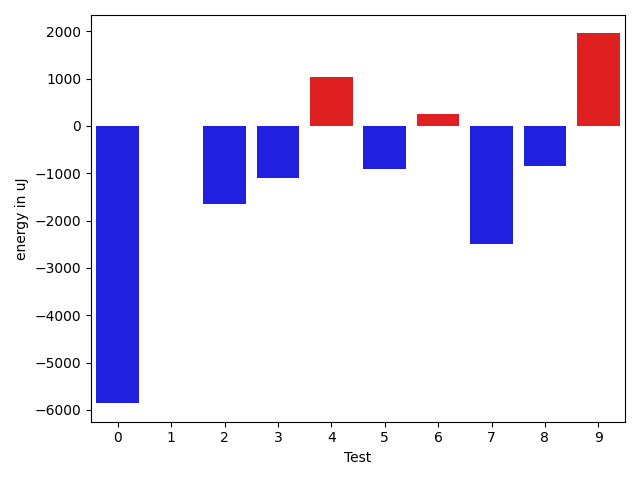

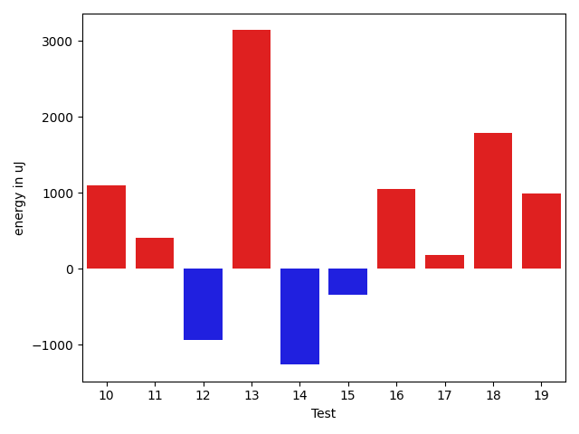

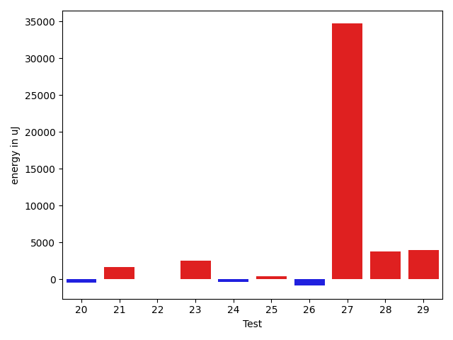

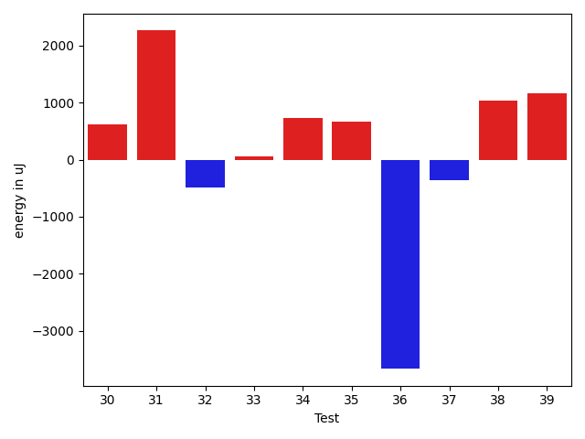

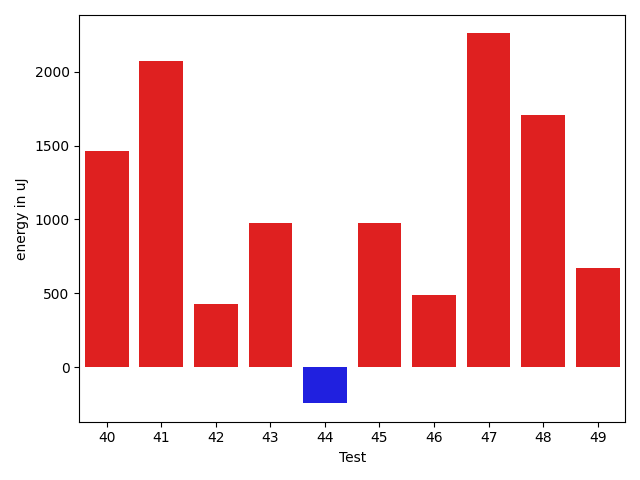

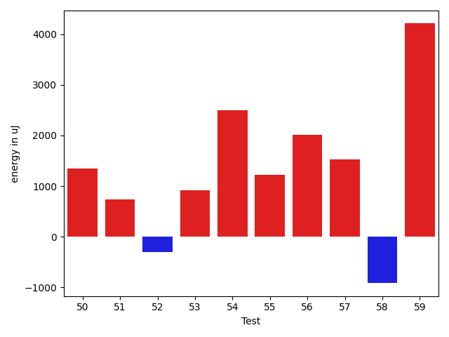

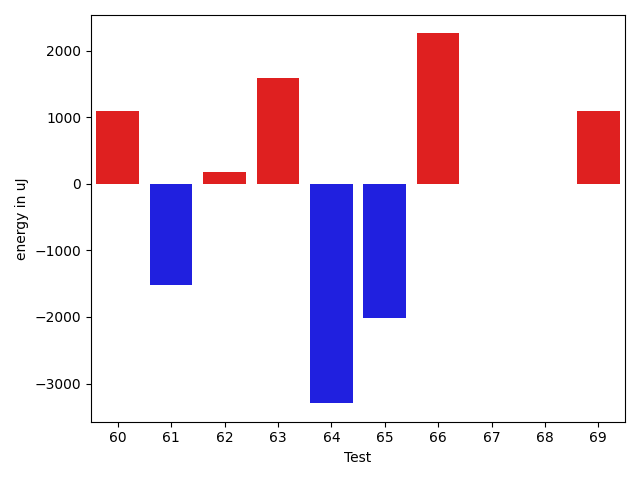

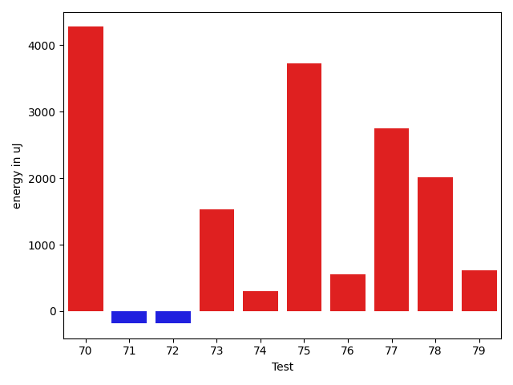

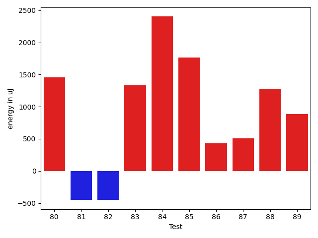

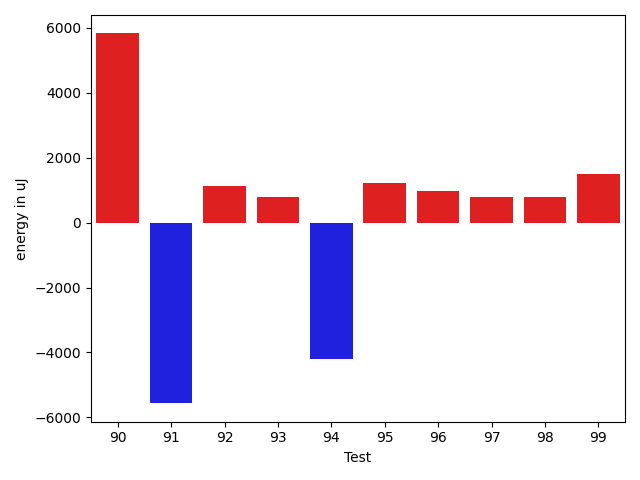

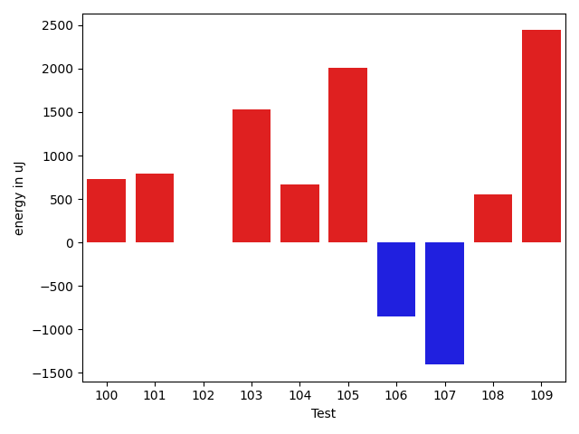

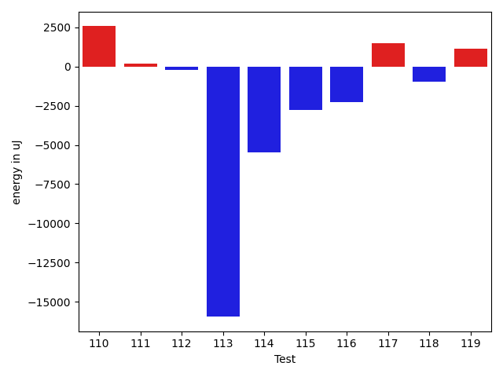

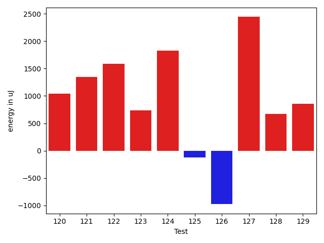

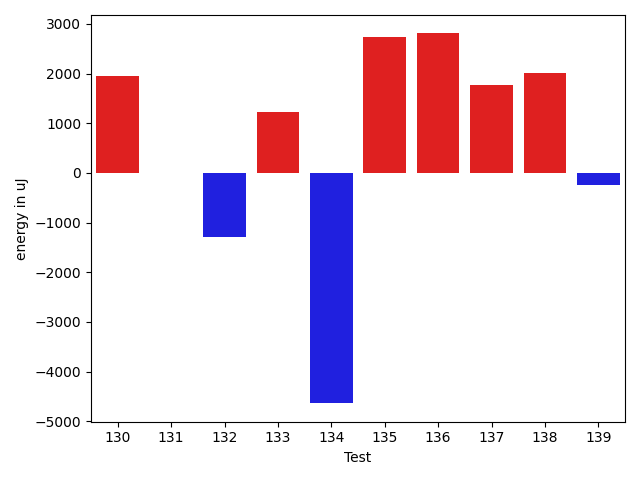

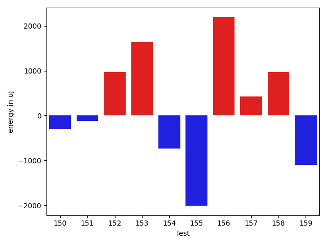

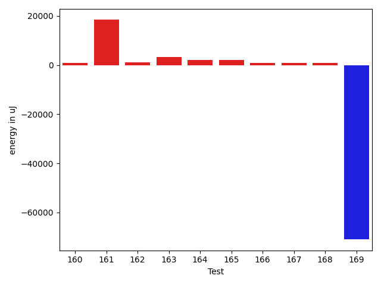

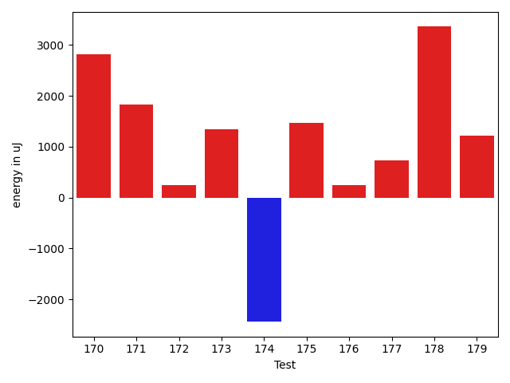

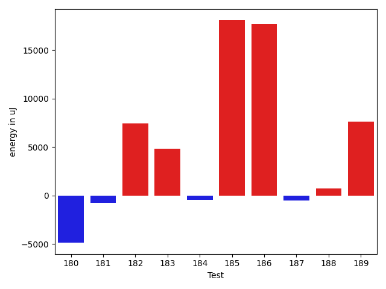

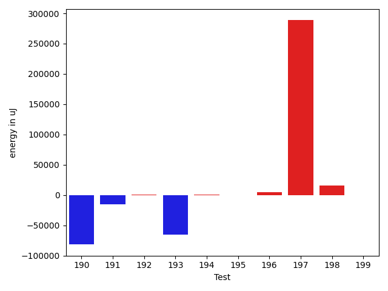

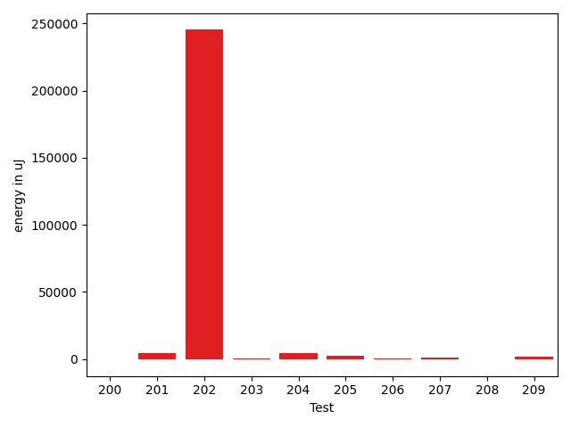

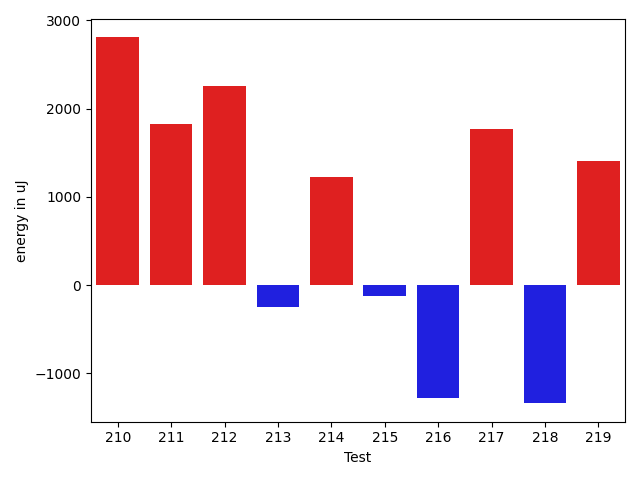

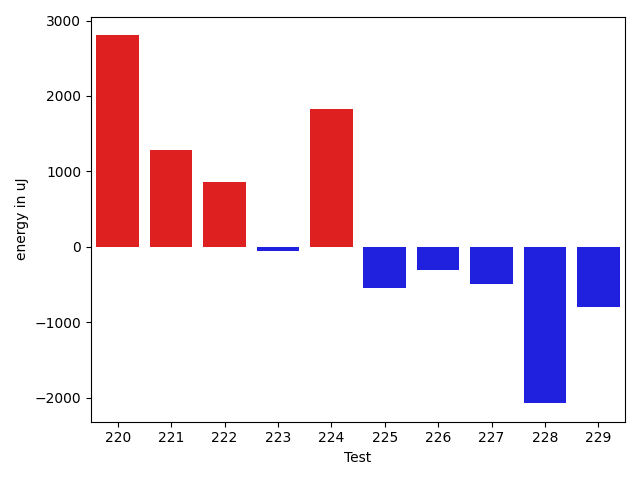

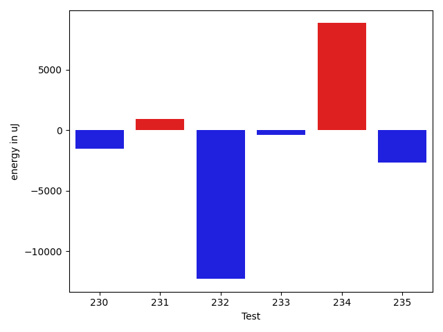

| ID | EnergyV1 | EnergyV2 | DeltaEnergy | σV1 | σV2 |
| --- | --- | --- | --- | --- | --- |
| 0 | 69885 | 64025 | -5860 | 97735.70818653035 | 87307.3168621324 |
| 1 | 35766 | 35767 | 1 | 139816.6669311575 | 4130.334686376832 |
| 2 | 37903 | 36254 | -1649 | 13828.415813636064 | 8794.878327060818 |
| 3 | 36377 | 35278 | -1099 | 14917.43277421083 | 12881.551833635918 |
| 4 | 35584 | 36621 | 1037 | 7080.475816434433 | 3802.607543711011 |
| 5 | 39795 | 38879 | -916 | 49455.55232900825 | 36576.0891638834 |
| 6 | 36744 | 36987 | 243 | 6738.0176357686 | 4177.915433953145 |
| 7 | 39001 | 36499 | -2502 | 26367.418252033738 | 14661.33988556298 |
| 8 | 36743 | 35889 | -854 | 7183.054802622621 | 5956.000738010798 |
| 9 | 35522 | 37475 | 1953 | 5383.413177315788 | 12023.596682490246 |
| 10 | 35828 | 36316 | 488 | 4915.552062258456 | 6280.974123617053 |
| 11 | 35644 | 35522 | -122 | 3749.796017679822 | 6750.431773912359 |
| 12 | 36804 | 36743 | -61 | 10266.099602977949 | 8597.16481629522 |
| 13 | 71350 | 70374 | -976 | 77711.60998576293 | 83881.80741125405 |
| 14 | 36926 | 35095 | -1831 | 3993.5163564068307 | 3677.15755414485 |
| 15 | 35950 | 36194 | 244 | 6200.790757652531 | 4824.274176541937 |
| 16 | 67871 | 66223 | -1648 | 23752.772176677292 | 26599.009913351558 |
| 17 | 36437 | 36926 | 489 | 10823.53726228425 | 10812.753447911342 |
| 18 | 36132 | 36804 | 672 | 50499.04464199602 | 51267.09458733907 |
| 19 | 61218 | 63293 | 2075 | 20407.18958145405 | 20030.186947818907 |
| 20 | 37414 | 36133 | -1281 | 12001.770381830574 | 12457.904442608977 |
| 21 | 71655 | 71044 | -611 | 21721.45784793198 | 27200.090261302037 |
| 22 | 36133 | 36865 | 732 | 8975.811102280408 | 8783.109827957851 |
| 23 | 36621 | 36743 | 122 | 15229.546435132137 | 17326.165077644848 |
| 24 | 34302 | 34790 | 488 | 6218.5985891402015 | 3612.6960129551544 |
| 25 | 35339 | 36255 | 916 | 4284.25513488943 | 4608.021119786671 |
| 26 | 36682 | 36071 | -611 | 8720.129556938698 | 6501.80850601499 |
| 27 | 38391 | 38818 | 427 | 303631.13838235155 | 365599.94025012467 |
| 28 | 79650 | 82885 | 3235 | 25345.924646674033 | 27829.95444027424 |
| 29 | 38147 | 37659 | -488 | 36376.64142627842 | 42900.63286209145 |
| 30 | 36255 | 36865 | 610 | 7645.820695974386 | 6143.191659379287 |
| 31 | 35644 | 37902 | 2258 | 3810.1130352411924 | 7616.912081385447 |
| 32 | 37109 | 36621 | -488 | 23980.96507340929 | 24222.56763305172 |
| 33 | 36743 | 36804 | 61 | 4392.883690192077 | 3971.025724528469 |
| 34 | 35278 | 36010 | 732 | 8241.930721129896 | 5079.461111952566 |
| 35 | 35156 | 35827 | 671 | 4405.062630403543 | 4743.162548853217 |
| 36 | 37415 | 33753 | -3662 | 4232.712919983302 | 4035.203747837724 |
| 37 | 35401 | 35034 | -367 | 4160.213707232328 | 3889.641095242069 |
| 38 | 34179 | 35217 | 1038 | 24166.76079096038 | 4212.971209874218 |
| 39 | 38391 | 39551 | 1160 | 19443.88427147021 | 21969.448147964904 |
| 40 | 35523 | 36987 | 1464 | 3145.21931864191 | 3839.3778572592796 |
| 41 | 35217 | 37292 | 2075 | 4381.155392654055 | 3803.936095306349 |
| 42 | 35950 | 36376 | 426 | 3973.094429288932 | 3856.2927928776367 |
| 43 | 36072 | 37048 | 976 | 4320.953015258203 | 3726.0872360606813 |
| 44 | 40588 | 40344 | -244 | 64824.091393837734 | 59295.85419338628 |
| 45 | 35827 | 36804 | 977 | 4516.517213517513 | 3952.330294784582 |
| 46 | 35462 | 35949 | 487 | 4673.910099483682 | 24167.48855705854 |
| 47 | 35645 | 37903 | 2258 | 3827.8797737298614 | 3950.3305088168113 |
| 48 | 34851 | 36560 | 1709 | 3374.6012994130137 | 3403.011209393198 |
| 49 | 35766 | 36437 | 671 | 3809.255387734931 | 3936.11839335277 |
| 50 | 35522 | 36865 | 1343 | 3800.937374000985 | 5268.066452930747 |
| 51 | 34973 | 35706 | 733 | 4251.553083303335 | 4295.132066194917 |
| 52 | 37903 | 37597 | -306 | 25767.576737051993 | 45249.86843773124 |
| 53 | 36132 | 37048 | 916 | 4021.9712032596735 | 4328.876701699958 |
| 54 | 35400 | 37903 | 2503 | 4841.5138572246415 | 23928.73854815947 |
| 55 | 36194 | 37414 | 1220 | 2556.2712082249805 | 3210.802114260882 |
| 56 | 33996 | 36010 | 2014 | 3824.067983130007 | 3627.887009313238 |
| 57 | 35339 | 36865 | 1526 | 4042.7468384750487 | 3849.954671312913 |
| 58 | 36804 | 35889 | -915 | 3698.88926752925 | 3825.8381105992544 |
| 59 | 33569 | 37780 | 4211 | 3283.368666631941 | 4592.496765071271 |
| 60 | 35889 | 36987 | 1098 | 4612.639375188588 | 3521.232323546529 |
| 61 | 38086 | 36560 | -1526 | 3831.7695810746472 | 3543.107405866519 |
| 62 | 38452 | 38636 | 184 | 8715.832095945663 | 10931.191473618024 |
| 63 | 36804 | 38391 | 1587 | 7045.521066685911 | 9358.119532096689 |
| 64 | 46875 | 43579 | -3296 | 66885.94425006959 | 70939.51283295164 |
| 65 | 39856 | 37842 | -2014 | 49462.870986403526 | 59609.5770925866 |
| 66 | 37842 | 40100 | 2258 | 5697.028065346331 | 7408.286454969792 |
| 67 | 37659 | 37659 | 0 | 26059.879794847002 | 61076.21139275705 |
| 68 | 37964 | 37964 | 0 | 65478.78277354662 | 113031.33228427061 |
| 69 | 36011 | 37110 | 1099 | 19872.703530778646 | 28140.577493085526 |
| 70 | 63842 | 68115 | 4273 | 21310.4320230798 | 25054.774224121273 |
| 71 | 35889 | 35705 | -184 | 4378.3206130052085 | 2968.8905985327565 |
| 72 | 35644 | 35462 | -182 | 3476.2708606981096 | 4308.189715723608 |
| 73 | 34363 | 35889 | 1526 | 3692.721732670636 | 8906.989943164448 |
| 74 | 35950 | 36254 | 304 | 3017.575291149353 | 19133.378598403466 |
| 75 | 60241 | 63965 | 3724 | 32372.96006899263 | 23128.09049595145 |
| 76 | 36559 | 37109 | 550 | 20866.3407342099 | 4161.398543553327 |
| 77 | 38635 | 41382 | 2747 | 155825.14706748992 | 184352.50816414578 |
| 78 | 34607 | 36621 | 2014 | 5833.134885893244 | 9562.181289871638 |
| 79 | 34119 | 34728 | 609 | 3405.8095994605715 | 4296.677045324685 |
| 80 | 35644 | 35217 | -427 | 9141.85221330925 | 12661.271040147232 |
| 81 | 35705 | 35584 | -121 | 6230.223577621307 | 3161.7208425987637 |
| 82 | 36438 | 36011 | -427 | 3459.2223516806994 | 4474.140304492665 |
| 83 | 34241 | 35462 | 1221 | 3903.9373543822417 | 4272.014274673038 |
| 84 | 35034 | 36804 | 1770 | 6727.426879308412 | 8315.656822163319 |
| 85 | 33448 | 37353 | 3905 | 3921.307570966055 | 4637.179607267673 |
| 86 | 35950 | 37293 | 1343 | 3345.156425699208 | 3686.309445472678 |
| 87 | 36865 | 36865 | 0 | 11708.7012471228 | 12644.24006760251 |
| 88 | 34546 | 35217 | 671 | 3190.276865664144 | 4188.251465599976 |
| 89 | 34606 | 35400 | 794 | 3517.405402293235 | 4064.6910673079524 |
| 90 | 36499 | 36316 | -183 | 4018.579275067247 | 14244.777033828372 |
| 91 | 36011 | 36987 | 976 | 41062.54800558 | 9320.369952629433 |
| 92 | 37293 | 38208 | 915 | 3640.9776499806594 | 4427.623150172689 |
| 93 | 35400 | 36255 | 855 | 2984.6660974887327 | 4242.553976948863 |
| 94 | 34912 | 36865 | 1953 | 26213.87607635974 | 4598.372321367329 |
| 95 | 35217 | 37293 | 2076 | 4152.0835042983745 | 3428.928790494716 |
| 96 | 35828 | 37658 | 1830 | 2989.9152577490736 | 4231.777223750161 |
| 97 | 34790 | 36011 | 1221 | 2711.780579811626 | 3788.958828419782 |
| 98 | 33935 | 34912 | 977 | 3305.903343429716 | 3195.423641227181 |
| 99 | 35461 | 37964 | 2503 | 2832.1793443974916 | 4867.110433189095 |
| 100 | 34179 | 34912 | 733 | 3091.0775612714606 | 3082.5025242695942 |
| 101 | 35767 | 36560 | 793 | 3492.6210132983338 | 4490.377332374822 |
| 102 | 36621 | 36621 | 0 | 4547.415528627223 | 3760.2760935318006 |
| 103 | 123779 | 125305 | 1526 | 105696.6699898457 | 127123.85103871972 |
| 104 | 38635 | 39306 | 671 | 11009.26875537575 | 14847.28806888167 |
| 105 | 35889 | 37903 | 2014 | 3545.0883326884277 | 77659.6872402278 |
| 106 | 37598 | 36743 | -855 | 15200.975622827715 | 4027.0278974370267 |
| 107 | 37841 | 36437 | -1404 | 4067.3325829265623 | 4491.855512907775 |
| 108 | 36438 | 36987 | 549 | 3676.1118195369636 | 3927.695738232555 |
| 109 | 37659 | 40100 | 2441 | 37923.19155479096 | 43527.74100422946 |
| 110 | 36438 | 40039 | 3601 | 4010.7349121464263 | 4066.155470459655 |
| 111 | 37048 | 36743 | -305 | 4228.736419625449 | 3351.6383355822236 |
| 112 | 35888 | 37292 | 1404 | 29665.50526684883 | 17842.671591391983 |
| 113 | 38574 | 38391 | -183 | 86043.89016253767 | 65444.70415229053 |
| 114 | 39429 | 37719 | -1710 | 30277.35878860882 | 24178.45431287948 |
| 115 | 39001 | 38574 | -427 | 21618.92740847718 | 19583.529045231382 |
| 116 | 43823 | 45471 | 1648 | 55042.66456127969 | 43671.115618029165 |
| 117 | 35583 | 37964 | 2381 | 3096.2092794809187 | 4250.45920927015 |
| 118 | 37537 | 37963 | 426 | 8078.724564110751 | 4613.261842743949 |
| 119 | 34851 | 38086 | 3235 | 3891.8249178419796 | 4953.500071533025 |
| 120 | 37780 | 38818 | 1038 | 28927.169945131718 | 44853.644605589594 |
| 121 | 35828 | 37170 | 1342 | 9594.535828415332 | 11344.817571724114 |
| 122 | 37292 | 38880 | 1588 | 26560.857197582092 | 37642.240260133294 |
| 123 | 38574 | 39307 | 733 | 15858.658786511762 | 19506.045386063688 |
| 124 | 34790 | 36621 | 1831 | 4026.4363969839274 | 4615.219517712663 |
| 125 | 40467 | 40344 | -123 | 59218.15492566448 | 69934.60005890865 |
| 126 | 37109 | 36133 | -976 | 3261.827944142683 | 3184.6472875376267 |
| 127 | 35461 | 37903 | 2442 | 4585.07802708556 | 4533.11305654067 |
| 128 | 38024 | 38696 | 672 | 12628.07623501603 | 9938.824837166432 |
| 129 | 36315 | 37170 | 855 | 3501.7353764739264 | 4578.889305672283 |
| 130 | 35401 | 37353 | 1952 | 4176.479686689896 | 4136.663891834366 |
| 131 | 35584 | 35584 | 0 | 3661.234101741529 | 3902.8893937057187 |
| 132 | 36865 | 35584 | -1281 | 3396.2969871155383 | 3790.231362244288 |
| 133 | 38330 | 39551 | 1221 | 31858.747871502535 | 26501.51111251529 |
| 134 | 44739 | 40100 | -4639 | 90400.23376554406 | 63097.95195584284 |
| 135 | 34668 | 37415 | 2747 | 4078.684812837238 | 4374.936038234464 |
| 136 | 34301 | 37109 | 2808 | 4054.0453538851816 | 4320.913427383647 |
| 137 | 36011 | 37781 | 1770 | 4227.732239626741 | 6504.203643342702 |
| 138 | 35705 | 37720 | 2015 | 4084.7045360324014 | 4436.21659754759 |
| 139 | 38696 | 38453 | -243 | 4569.2165388113 | 3735.150078561101 |
| 140 | 35461 | 37292 | 1831 | 4803.772081147528 | 5025.249881592853 |
| 141 | 37902 | 38025 | 123 | 20347.49807108467 | 15158.37842189409 |
| 142 | 38574 | 36987 | -1587 | 4435.25713668465 | 3832.936747374655 |
| 143 | 37536 | 38269 | 733 | 5552.248949106762 | 4787.816449284665 |
| 144 | 37231 | 40161 | 2930 | 4759.362033386801 | 4685.969584057107 |
| 145 | 37171 | 36988 | -183 | 432032.48906984134 | 4126.979359909511 |
| 146 | 37048 | 39184 | 2136 | 42954.00666570878 | 38360.953918456595 |
| 147 | 38635 | 36132 | -2503 | 4369.41347429778 | 4374.976572920756 |
| 148 | 81176 | 79651 | -1525 | 34711.12032270259 | 32465.811880460384 |
| 149 | 79895 | 79468 | -427 | 317478.55516571255 | 281997.35521115497 |
| 150 | 37415 | 37110 | -305 | 3830.8746950127315 | 4657.40927986955 |
| 151 | 36438 | 36316 | -122 | 3911.1200113639347 | 8075.445197924388 |
| 152 | 36804 | 37781 | 977 | 3816.3492284471804 | 4151.101243246235 |
| 153 | 36011 | 37659 | 1648 | 4033.8457756755506 | 4528.879013193349 |
| 154 | 35461 | 34729 | -732 | 3624.9492276296182 | 3534.897015001521 |
| 155 | 39550 | 37537 | -2013 | 52977.32516003637 | 34658.170741136186 |
| 156 | 35889 | 38086 | 2197 | 3387.2358873567127 | 3926.1690425497954 |
| 157 | 36011 | 36438 | 427 | 5106.252913095865 | 3656.878497228245 |
| 158 | 35706 | 36682 | 976 | 3632.390295557357 | 4862.510657648742 |
| 159 | 37415 | 36316 | -1099 | 2980.905079557773 | 5315.5902458920045 |
| 160 | 35888 | 37475 | 1587 | 4178.703913894833 | 4146.720613930966 |
| 161 | 161133 | 173950 | 12817 | 251946.89391351608 | 288360.8658207174 |
| 162 | 36377 | 38513 | 2136 | 4385.994787902303 | 4041.0304077268265 |
| 163 | 36011 | 37598 | 1587 | 30563.826661123843 | 38186.682372945186 |
| 164 | 35889 | 38208 | 2319 | 4415.865719284239 | 3832.9359608404598 |
| 165 | 36071 | 36865 | 794 | 6979.608445962918 | 9926.82002395173 |
| 166 | 38818 | 38330 | -488 | 35390.26529312863 | 40970.172274368575 |
| 167 | 35645 | 37232 | 1587 | 4742.277903895283 | 4837.5775158877 |
| 168 | 35401 | 36499 | 1098 | 5384.551498264787 | 6995.6613942252225 |
| 169 | 38330 | 38452 | 122 | 514640.5687385325 | 398793.5127937588 |
| 170 | 36682 | 39490 | 2808 | 4012.594461909145 | 3764.208811900827 |
| 171 | 37659 | 39490 | 1831 | 18655.94066989153 | 14998.121127038376 |
| 172 | 37170 | 37414 | 244 | 4331.145929471998 | 4932.36041903412 |
| 173 | 37354 | 38696 | 1342 | 8220.03751950442 | 6744.547963554486 |
| 174 | 39307 | 36865 | -2442 | 5213.815634822821 | 5311.146610760021 |
| 175 | 38208 | 39673 | 1465 | 330971.91736161924 | 375137.9576926097 |
| 176 | 38574 | 38819 | 245 | 4736.580731360055 | 2956.0086205631656 |
| 177 | 38635 | 39368 | 733 | 58963.474576382105 | 42629.2067099963 |
| 178 | 228637 | 231994 | 3357 | 85639.6668038989 | 80945.57803836542 |
| 179 | 368285 | 369505 | 1220 | 132188.37285841678 | 118257.5826265523 |
| 180 | 39490 | 38208 | -1282 | 37869.815930367535 | 24340.461576564267 |
| 181 | 35584 | 36193 | 609 | 4394.032585129937 | 4422.078888813369 |
| 182 | 40283 | 41504 | 1221 | 23106.909139744326 | 28793.364109125232 |
| 183 | 36987 | 36865 | -122 | 10029.773571422074 | 23391.809148805314 |
| 184 | 37354 | 35706 | -1648 | 3982.4459347571665 | 4075.702044211364 |
| 185 | 38391 | 39856 | 1465 | 63265.710008094466 | 108058.9137336754 |
| 186 | 41504 | 39367 | -2137 | 435619.1494386885 | 510084.17821115407 |
| 187 | 37963 | 38147 | 184 | 7757.526058193544 | 5690.091629613463 |
| 188 | 38330 | 38330 | 0 | 5064.74432464997 | 4487.71825061899 |
| 189 | 78003 | 76477 | -1526 | 221190.64830096767 | 277876.86666355375 |
| 190 | 37720 | 38574 | 854 | 496972.0914496688 | 246248.62228784323 |
| 191 | 40039 | 41260 | 1221 | 77603.44384258724 | 33571.93114143267 |
| 192 | 36559 | 38758 | 2199 | 8704.306477947615 | 3896.0306707794693 |
| 193 | 36438 | 38452 | 2014 | 354756.4685656786 | 4525.464054141348 |
| 194 | 35889 | 34545 | -1344 | 4824.694920959501 | 4658.772526709295 |
| 195 | 36438 | 35583 | -855 | 4083.440895479571 | 4640.490787516277 |
| 196 | 37719 | 37842 | 123 | 3798.0639905219973 | 28045.002087308683 |
| 197 | 37109 | 39428 | 2319 | 3205.768641698822 | 750360.6771581016 |
| 198 | 37963 | 37842 | -121 | 9790.830369080843 | 49535.22128202079 |
| 199 | 37353 | 36316 | -1037 | 4363.401790796795 | 4377.738598026733 |
| 200 | 38514 | 38635 | 121 | 12331.88352680132 | 12046.681657963098 |
| 201 | 38757 | 40161 | 1404 | 36931.865741310874 | 45998.61849361512 |
| 202 | 40710 | 41931 | 1221 | 251631.79368461668 | 726340.5965813318 |
| 203 | 36743 | 37719 | 976 | 4913.877897206834 | 4017.86039854824 |
| 204 | 38025 | 38330 | 305 | 13098.119760054282 | 14803.1602409855 |
| 205 | 34118 | 36132 | 2014 | 5674.60200213663 | 4657.20454439864 |
| 206 | 36133 | 36499 | 366 | 3846.1955478957466 | 3680.0233162526656 |
| 207 | 33569 | 34668 | 1099 | 3226.3617088825013 | 3961.512777440919 |
| 208 | 35828 | 35522 | -306 | 3503.4395969463776 | 4359.632913721063 |
| 209 | 38391 | 39611 | 1220 | 9654.698557627671 | 12468.382155178768 |
| 210 | 33874 | 36682 | 2808 | 3551.8518474027655 | 4843.249561560792 |
| 211 | 35400 | 37231 | 1831 | 4473.975280080611 | 8194.401133756162 |
| 212 | 34485 | 36743 | 2258 | 4039.873300768903 | 4545.205058809771 |
| 213 | 35095 | 34851 | -244 | 3671.180678670526 | 4206.600397028104 |
| 214 | 35523 | 36743 | 1220 | 4035.4696268681046 | 4163.544460219228 |
| 215 | 38391 | 38269 | -122 | 19486.521098458317 | 35400.842893066714 |
| 216 | 35889 | 34607 | -1282 | 42193.208835215766 | 4634.280907218095 |
| 217 | 38635 | 40405 | 1770 | 21916.30226565762 | 25627.530786738047 |
| 218 | 37964 | 36621 | -1343 | 4583.805045418053 | 3976.712878259594 |
| 219 | 38330 | 39734 | 1404 | 70472.80188326092 | 55911.99606496967 |
| 220 | 67383 | 70191 | 2808 | 22121.82062023655 | 21866.356322552085 |
| 221 | 38696 | 39978 | 1282 | 11357.459521978868 | 23980.337094377963 |
| 222 | 37780 | 38636 | 856 | 4462.508791936688 | 37305.78711221681 |
| 223 | 37719 | 37659 | -60 | 4079.635521150369 | 3436.813292447359 |
| 224 | 38086 | 39917 | 1831 | 80312.94111561349 | 82722.8993980378 |
| 225 | 36560 | 36011 | -549 | 39409.175094482736 | 4390.2587835506065 |
| 226 | 37964 | 37658 | -306 | 19551.658369247227 | 5772.287839633367 |
| 227 | 37780 | 37293 | -487 | 26105.90859694633 | 16724.011039978006 |
| 228 | 82031 | 79956 | -2075 | 92977.81567976276 | 117353.19810200005 |
| 229 | 38757 | 37964 | -793 | 16769.995427958216 | 28747.68338105378 |
| 230 | 37659 | 39063 | 1404 | 19284.327481045664 | 17890.48260061912 |
| 231 | 35583 | 37902 | 2319 | 4010.5466664777555 | 4399.411375872033 |
| 232 | 39185 | 38452 | -733 | 64956.632278715806 | 5336.324234856813 |
| 233 | 39978 | 39001 | -977 | 3982.125154432257 | 4937.232535653056 |
| 234 | 39550 | 39795 | 245 | 36131.91248967749 | 74683.43906480583 |
| 235 | 39734 | 37231 | -2503 | 3698.2410382314865 | 4256.075287551406 |

## Delta Duration per test method

| ID | DurationV1 | DurationsV2 | DeltaDuration |
| --- | --- | --- | --- |
| 0 | 2448297.0 | 2047869.9175257732 | -400427.08247422683 |
| 1 | 1611178.2 | 825392.2 | -785786.0 |
| 2 | 1146660.1578947369 | 1066909.2948717948 | -79750.8630229421 |
| 3 | 966002.2105263158 | 846698.3265306122 | -119303.88399570365 |
| 4 | 848677.9245283019 | 782807.431372549 | -65870.49315575289 |
| 5 | 1716472.0545454544 | 1389437.3333333333 | -327034.7212121212 |
| 6 | 863096.1724137932 | 800268.2916666666 | -62827.88074712653 |
| 7 | 1035344.9117647059 | 731839.5333333333 | -303505.3784313726 |
| 8 | 921424.6621621621 | 978143.4098360656 | 56718.747673903476 |
| 9 | 1186709.5168539325 | 1234340.0989010988 | 47630.5820471663 |
| 10 | 959432.8235294118 | 993238.8888888889 | 33806.06535947707 |
| 11 | 817512.6140350878 | 919016.1346153846 | 101503.52058029687 |
| 12 | 1145218.4597701149 | 1175164.1847826086 | 29945.725012493785 |
| 13 | 2548761.505050505 | 2637144.696969697 | 88383.19191919174 |
| 14 | 528669.6666666666 | 493598.7619047619 | -35070.904761904734 |
| 15 | 1122801.4810126582 | 1161128.0 | 38326.518987341784 |
| 16 | 2040961.313131313 | 2148324.3535353537 | 107363.0404040406 |
| 17 | 1243189.6666666667 | 1290229.4315789475 | 47039.76491228072 |
| 18 | 1472828.4320987654 | 1511290.125 | 38461.69290123461 |
| 19 | 1727360.2323232323 | 1834192.898989899 | 106832.66666666674 |
| 20 | 1170682.2926829269 | 1289044.5294117648 | 118362.23672883795 |
| 21 | 2252988.888888889 | 2271005.711340206 | 18016.822451317217 |
| 22 | 1189681.2359550563 | 1182810.010989011 | -6871.224966045236 |
| 23 | 1407131.948979592 | 1441195.3711340206 | 34063.42215442867 |
| 24 | 821444.5744680851 | 796401.9245283019 | -25042.64993978315 |
| 25 | 784530.2909090909 | 826443.08 | 41912.789090909064 |
| 26 | 901171.375 | 878202.8166666667 | -22968.55833333335 |
| 27 | 2994999.4393939395 | 4185264.5555555555 | 1190265.116161616 |
| 28 | 2691260.515151515 | 2775953.3232323234 | 84692.80808080826 |
| 29 | 1084598.564516129 | 1282790.6037735848 | 198192.03925745585 |
| 30 | 982982.0625 | 990021.5373134328 | 7039.474813432782 |
| 31 | 921107.5797101449 | 956615.25 | 35507.6702898551 |
| 32 | 1129665.0294117648 | 1105834.7702702703 | -23830.25914149452 |
| 33 | 879699.05 | 888792.0909090909 | 9093.040909090894 |
| 34 | 802457.3333333334 | 853510.2040816327 | 51052.87074829929 |
| 35 | 487333.5 | 495991.375 | 8657.875 |
| 36 | 577057.9696969697 | 610208.2413793104 | 33150.27168234065 |
| 37 | 638724.1875 | 691403.6285714286 | 52679.44107142859 |
| 38 | 830274.075 | 750363.0975609756 | -79910.97743902437 |
| 39 | 1379313.49122807 | 1314558.4032258065 | -64755.08800226357 |
| 40 | 712598.0714285715 | 690676.0 | -21922.07142857148 |
| 41 | 746515.5660377359 | 746488.3859649122 | -27.18007282365579 |
| 42 | 658987.8378378379 | 662573.52 | 3585.6821621621493 |
| 43 | 857762.7966101695 | 861029.2352941176 | 3266.4386839481303 |
| 44 | 1908235.383838384 | 1999260.2604166667 | 91024.8765782828 |
| 45 | 717958.075 | 690490.5609756098 | -27467.51402439014 |
| 46 | 692526.3958333334 | 792581.0444444445 | 100054.6486111111 |
| 47 | 411958.0 | 449296.4 | 37338.40000000002 |
| 48 | 729024.84 | 705696.3076923077 | -23328.53230769222 |
| 49 | 655748.25 | 645846.0697674418 | -9902.180232558167 |
| 50 | 714367.1521739131 | 714542.9523809524 | 175.80020703934133 |
| 51 | 711182.9411764706 | 726521.8979591837 | 15338.956782713067 |
| 52 | 1241367.9012345679 | 1526469.7564102565 | 285101.85517568863 |
| 53 | 745228.8979591837 | 782021.3269230769 | 36792.42896389321 |
| 54 | 807721.4814814815 | 920259.7962962963 | 112538.31481481483 |
| 55 | 362617.6 | 402531.9090909091 | 39914.30909090914 |
| 56 | 707804.22 | 723699.7291666666 | 15895.509166666656 |
| 57 | 729991.1627906977 | 709531.4150943396 | -20459.747696358012 |
| 58 | 585452.6666666666 | 592183.3103448276 | 6730.643678160966 |
| 59 | 433588.21428571426 | 395950.2272727273 | -37637.98701298697 |
| 60 | 381385.7894736842 | 346044.3333333333 | -35341.4561403509 |
| 61 | 382115.9285714286 | 426720.0 | 44604.07142857142 |
| 62 | 932903.2698412698 | 994533.0 | 61629.73015873018 |
| 63 | 898970.0588235294 | 835845.5306122449 | -63124.528211284545 |
| 64 | 2101990.1413043477 | 2122988.402061856 | 20998.260757508222 |
| 65 | 1056233.24 | 1205467.8181818181 | 149234.57818181813 |
| 66 | 975064.875 | 947328.2666666667 | -27736.60833333328 |
| 67 | 788317.3125 | 1381479.2068965517 | 593161.8943965517 |
| 68 | 1183397.5142857144 | 1553770.0689655172 | 370372.55467980285 |
| 69 | 1431156.288888889 | 1490174.7956989247 | 59018.50681003579 |
| 70 | 1956168.2828282828 | 2023786.9191919193 | 67618.63636363647 |
| 71 | 504504.8787878788 | 480729.77419354836 | -23775.10459433042 |
| 72 | 492512.5 | 466279.3 | -26233.20000000001 |
| 73 | 740179.3409090909 | 773664.4150943396 | 33485.0741852487 |
| 74 | 960842.1428571428 | 988252.9375 | 27410.79464285716 |
| 75 | 1936642.224489796 | 1800122.6105263159 | -136519.6139634801 |
| 76 | 738357.448275862 | 555531.8965517242 | -182825.55172413785 |
| 77 | 2215410.0 | 3167909.714285714 | 952499.7142857141 |
| 78 | 907412.2363636363 | 897049.659574468 | -10362.576789168292 |
| 79 | 733746.4814814815 | 791420.7959183673 | 57674.31443688588 |
| 80 | 894313.8571428572 | 987791.2307692308 | 93477.37362637359 |
| 81 | 965196.140625 | 954569.6875 | -10626.453125 |
| 82 | 534787.6571428571 | 537043.25 | 2255.5928571429104 |
| 83 | 505797.9259259259 | 528833.75 | 23035.824074074102 |
| 84 | 780497.0 | 814478.6279069767 | 33981.62790697673 |
| 85 | 495966.54545454547 | 750695.7307692308 | 254729.18531468528 |
| 86 | 816162.9090909091 | 766314.8048780488 | -49848.10421286023 |
| 87 | 1236937.675 | 1178416.7142857143 | -58520.96071428573 |
| 88 | 620633.5 | 627623.0 | 6989.5 |
| 89 | 681556.8 | 671607.3714285714 | -9949.428571428638 |
| 90 | 469832.05 | 925378.7777777778 | 455546.72777777776 |
| 91 | 1014771.6296296297 | 777170.4285714285 | -237601.20105820114 |
| 92 | 622533.7096774194 | 623627.4074074074 | 1093.6977299880236 |
| 93 | 592585.9393939395 | 581882.448275862 | -10703.491118077422 |
| 94 | 716454.0769230769 | 502089.8846153846 | -214364.19230769225 |
| 95 | 443382.1666666667 | 440257.26086956525 | -3124.905797101441 |
| 96 | 590921.9230769231 | 541690.5277777778 | -49231.39529914537 |
| 97 | 682623.9565217391 | 639364.7647058824 | -43259.19181585673 |
| 98 | 679466.619047619 | 669024.074074074 | -10442.54497354501 |
| 99 | 691253.5348837209 | 698543.8823529412 | 7290.347469220287 |
| 100 | 442337.6666666667 | 447259.3103448276 | 4921.643678160908 |
| 101 | 738412.695652174 | 666814.4444444445 | -71598.25120772945 |
| 102 | 464219.85 | 433654.13636363635 | -30565.713636363624 |
| 103 | 4767313.323232323 | 5352300.353535353 | 584987.0303030303 |
| 104 | 965734.8253968254 | 1143349.075471698 | 177614.25007487263 |
| 105 | 587504.1724137932 | 1016761.0333333333 | 429256.86091954017 |
| 106 | 752452.9166666666 | 625092.0638297872 | -127360.85283687944 |
| 107 | 677856.0238095238 | 661743.5365853659 | -16112.4872241579 |
| 108 | 593495.4814814815 | 804347.8076923077 | 210852.3262108263 |
| 109 | 1460634.3658536586 | 1627161.081632653 | 166526.71577899437 |
| 110 | 736718.4571428571 | 707793.7142857143 | -28924.742857142817 |
| 111 | 744901.4444444445 | 803315.8846153846 | 58414.44017094013 |
| 112 | 979600.9016393443 | 911834.8253968254 | -67766.07624251884 |
| 113 | 1864774.5873015872 | 1215759.9666666666 | -649014.6206349207 |
| 114 | 1206254.568627451 | 1059567.175 | -146687.39362745103 |
| 115 | 1504663.0760869565 | 1428415.8764044943 | -76247.19968246226 |
| 116 | 2172082.0222222223 | 2113153.395604396 | -58928.62661782652 |
| 117 | 501968.8125 | 472035.54545454547 | -29933.26704545453 |
| 118 | 745022.8571428572 | 887705.1025641026 | 142682.24542124546 |
| 119 | 683649.052631579 | 454236.9090909091 | -229412.14354066987 |
| 120 | 1194132.2264150945 | 1268396.8043478262 | 74264.57793273171 |
| 121 | 1140346.718309859 | 1166142.3461538462 | 25795.627843987197 |
| 122 | 734103.717948718 | 778864.56 | 44760.84205128206 |
| 123 | 1429336.404494382 | 1374958.6136363635 | -54377.790858018445 |
| 124 | 489871.1904761905 | 441419.6842105263 | -48451.50626566418 |
| 125 | 1555348.875 | 1882175.088888889 | 326826.21388888895 |
| 126 | 485857.6818181818 | 448305.1176470588 | -37552.56417112303 |
| 127 | 480068.5 | 489566.36842105264 | 9497.86842105264 |
| 128 | 1032983.1666666666 | 796662.1379310344 | -236321.0287356322 |
| 129 | 603516.6896551724 | 556358.48 | -47158.209655172424 |
| 130 | 622801.8333333334 | 627261.9677419355 | 4460.134408602142 |
| 131 | 560714.2571428572 | 561109.2413793104 | 394.98423645319417 |
| 132 | 749690.1363636364 | 822695.4883720931 | 73005.35200845671 |
| 133 | 1561688.7790697673 | 1479842.0568181819 | -81846.72225158545 |
| 134 | 3153777.484848485 | 1986863.0322580645 | -1166914.4525904204 |
| 135 | 834388.8518518518 | 785221.9736842106 | -49166.87816764123 |
| 136 | 726144.7111111111 | 713396.976744186 | -12747.734366925084 |
| 137 | 834429.4545454546 | 764710.1627906977 | -69719.29175475694 |
| 138 | 531022.3571428572 | 579658.9310344828 | 48636.57389162562 |
| 139 | 432171.0 | 402830.5 | -29340.5 |
| 140 | 477556.70588235295 | 472247.78571428574 | -5308.920168067212 |
| 141 | 935855.3846153846 | 980481.1851851852 | 44625.80056980054 |
| 142 | 445950.0588235294 | 367671.8125 | -78278.2463235294 |
| 143 | 427152.9285714286 | 356335.85714285716 | -70817.07142857142 |
| 144 | 414771.1875 | 402466.9166666667 | -12304.270833333314 |
| 145 | 4458368.428571428 | 502659.7894736842 | -3955708.639097744 |
| 146 | 1047004.6428571428 | 910156.7222222222 | -136847.9206349206 |
| 147 | 477138.8125 | 425042.3333333333 | -52096.479166666686 |
| 148 | 2570701.262626263 | 2542158.0606060605 | -28543.202020202298 |
| 149 | 4260471.95959596 | 3737214.4343434344 | -523257.5252525252 |
| 150 | 920462.6833333333 | 913657.262295082 | -6805.42103825137 |
| 151 | 974971.5616438356 | 959570.8082191781 | -15400.753424657509 |
| 152 | 590603.4285714285 | 592218.1212121212 | 1614.692640692694 |
| 153 | 654105.6451612903 | 606629.5945945946 | -47476.05056669575 |
| 154 | 508235.4090909091 | 495882.73333333334 | -12352.67575757578 |
| 155 | 1274635.5 | 807240.5806451613 | -467394.91935483867 |
| 156 | 488400.4583333333 | 522060.3548387097 | 33659.89650537638 |
| 157 | 519847.5 | 447273.36842105264 | -72574.13157894736 |
| 158 | 499442.3333333333 | 499149.2962962963 | -293.03703703702195 |
| 159 | 625629.0 | 576660.8333333334 | -48968.16666666663 |
| 160 | 858884.8363636363 | 918886.02 | 60001.18363636371 |
| 161 | 6360179.05050505 | 6481770.4949494945 | 121591.44444444403 |
| 162 | 791416.4666666667 | 786828.1851851852 | -4588.2814814815065 |
| 163 | 1106994.3793103448 | 1073113.3846153845 | -33880.9946949603 |
| 164 | 811977.5294117647 | 866002.9074074074 | 54025.37799564272 |
| 165 | 1008900.0 | 1029551.8461538461 | 20651.846153846127 |
| 166 | 1122557.6444444444 | 1131177.8620689656 | 8620.217624521116 |
| 167 | 572834.3125 | 582444.9166666666 | 9610.604166666628 |
| 168 | 657275.696969697 | 687143.9512195121 | 29868.25424981513 |
| 169 | 5263579.445945946 | 2845335.9166666665 | -2418243.529279279 |
| 170 | 645434.7941176471 | 579857.6071428572 | -65577.18697478995 |
| 171 | 1149099.0579710144 | 1161950.652173913 | 12851.594202898676 |
| 172 | 592414.6086956522 | 636593.6923076923 | 44179.083612040034 |
| 173 | 859281.8387096775 | 625451.9210526316 | -233829.91765704588 |
| 174 | 393819.7619047619 | 412197.3333333333 | 18377.57142857142 |
| 175 | 3093749.9855072466 | 3218933.0694444445 | 125183.08393719792 |
| 176 | 420406.05555555556 | 432635.0625 | 12229.006944444438 |
| 177 | 1635304.5 | 1500796.525 | -134507.9750000001 |
| 178 | 7125984.707070707 | 7005527.94949495 | -120456.7575757578 |
| 179 | 11150149.313131314 | 10403347.363636363 | -746801.9494949505 |
| 180 | 1453784.3488372094 | 1354768.1818181819 | -99016.16701902752 |
| 181 | 588485.1714285715 | 661414.9333333333 | 72929.7619047619 |
| 182 | 1202046.94 | 1469588.9090909092 | 267541.96909090923 |
| 183 | 972911.0930232558 | 1160676.7954545454 | 187765.7024312896 |
| 184 | 724985.375 | 784802.1794871795 | 59816.8044871795 |
| 185 | 1506435.935483871 | 2047714.8235294118 | 541278.8880455408 |
| 186 | 3986266.92 | 4300338.544117647 | 314071.6241176473 |
| 187 | 996995.0877192982 | 891376.567164179 | -105618.52055511915 |
| 188 | 848810.4814814815 | 810177.8214285715 | -38632.66005290998 |
| 189 | 3124353.2525252528 | 3275844.727272727 | 151491.4747474743 |
| 190 | 3771712.1944444445 | 2102746.205882353 | -1668965.9885620917 |
| 191 | 1374052.607142857 | 969243.1052631579 | -404809.5018796992 |
| 192 | 645939.6285714286 | 592092.3703703703 | -53847.258201058256 |
| 193 | 2298423.9444444445 | 626086.2307692308 | -1672337.7136752137 |
| 194 | 468896.3157894737 | 503576.3076923077 | 34679.99190283398 |
| 195 | 540938.875 | 576460.3125 | 35521.4375 |
| 196 | 567426.8275862068 | 799451.9375 | 232025.10991379316 |
| 197 | 808156.3488372093 | 8472583.229166666 | 7664426.880329457 |
| 198 | 840626.9318181818 | 1456407.6 | 615780.6681818183 |
| 199 | 672291.2592592592 | 713763.2285714286 | 41471.969312169356 |
| 200 | 1212610.8375 | 1143061.6941176471 | -69549.14338235278 |
| 201 | 1240740.283018868 | 1285870.8260869565 | 45130.54306808859 |
| 202 | 2364412.9285714286 | 9331777.388888888 | 6967364.460317459 |
| 203 | 528503.0434782609 | 637507.1333333333 | 109004.08985507244 |
| 204 | 864768.1071428572 | 921396.4545454546 | 56628.34740259743 |
| 205 | 601090.9285714285 | 508514.75 | -92576.17857142852 |
| 206 | 619791.7714285714 | 599013.0 | -20778.771428571432 |
| 207 | 626902.4814814815 | 618237.2619047619 | -8665.219576719566 |
| 208 | 510938.4347826087 | 489881.32 | -21057.114782608696 |
| 209 | 906992.2826086957 | 935742.0217391305 | 28749.739130434813 |
| 210 | 691388.96875 | 621283.7567567568 | -70105.2119932432 |
| 211 | 910146.2131147541 | 929400.0566037736 | 19253.84348901955 |
| 212 | 677467.8888888889 | 640689.2727272727 | -36778.61616161617 |
| 213 | 523115.6923076923 | 533625.3947368421 | 10509.702429149824 |
| 214 | 745427.0 | 408734.8333333333 | -336692.1666666667 |
| 215 | 1110843.9090909092 | 1184772.7142857143 | 73928.80519480514 |
| 216 | 975633.0384615385 | 617683.8333333334 | -357949.2051282051 |
| 217 | 1148994.8363636364 | 1178337.393939394 | 29342.557575757615 |
| 218 | 537335.84 | 514823.6818181818 | -22512.158181818144 |
| 219 | 1517381.421875 | 1306612.342857143 | -210769.0790178571 |
| 220 | 1889821.5555555555 | 1896609.9494949495 | 6788.393939394038 |
| 221 | 788819.8636363636 | 959478.6333333333 | 170658.76969696966 |
| 222 | 610522.0357142857 | 755460.0857142857 | 144938.05000000005 |
| 223 | 592051.6129032258 | 550016.3571428572 | -42035.25576036866 |
| 224 | 1428234.3777777778 | 1526063.6923076923 | 97829.31452991441 |
| 225 | 1100320.152173913 | 719582.2641509434 | -380737.8880229697 |
| 226 | 1187306.2571428572 | 985979.7837837838 | -201326.4733590734 |
| 227 | 1153156.1896551724 | 906716.0634920635 | -246440.12616310886 |
| 228 | 3358792.717171717 | 3632978.0404040404 | 274185.3232323234 |
| 229 | 761063.8947368421 | 1004323.2903225806 | 243259.39558573847 |
| 230 | 1265125.5846153847 | 1132434.3666666667 | -132691.217948718 |
| 231 | 759943.2258064516 | 610563.7352941176 | -149379.49051233404 |
| 232 | 1676799.4736842106 | 940773.8723404255 | -736025.6013437851 |
| 233 | 405509.6923076923 | 449985.0 | 44475.30769230769 |
| 234 | 1237494.2413793104 | 1611748.322580645 | 374254.0812013347 |
| 235 | 474770.2727272727 | 492980.4090909091 | 18210.13636363641 |

## Misc.

| ID | Test Class | Test Method |
| --- | --- | --- |
| 0 | com.google.gson.functional.CustomDeserializerTest | testDefaultConstructorNotCalledOnField |
| 1 | com.google.gson.functional.CustomDeserializerTest | testCustomDeserializerReturnsNullForArrayElementsForArrayField |
| 2 | com.google.gson.functional.CustomDeserializerTest | testJsonTypeFieldBasedDeserialization |
| 3 | com.google.gson.functional.CustomDeserializerTest | testCustomDeserializerReturnsNullForArrayElements |
| 4 | com.google.gson.functional.CustomDeserializerTest | testCustomDeserializerReturnsNullForPrimitiveFields |
| 5 | com.google.gson.functional.CustomDeserializerTest | testCustomDeserializerReturnsNullForTopLevelObject |
| 6 | com.google.gson.functional.CustomDeserializerTest | testCustomDeserializerReturnsNull |
| 7 | com.google.gson.functional.CustomDeserializerTest | testDefaultConstructorNotCalledOnObject |
| 8 | com.google.gson.functional.ParameterizedTypesTest | testParameterizedTypeGenericArraysSerialization |
| 9 | com.google.gson.functional.ParameterizedTypesTest | testVariableTypeArrayDeserialization |
| 10 | com.google.gson.functional.ParameterizedTypesTest | testParameterizedTypeWithReaderDeserialization |
| 11 | com.google.gson.functional.ParameterizedTypesTest | testDeepParameterizedTypeDeserialization |
| 12 | com.google.gson.functional.ParameterizedTypesTest | testParameterizedTypeWithCustomSerializer |
| 13 | com.google.gson.functional.ParameterizedTypesTest | testParameterizedTypesSerialization |
| 14 | com.google.gson.functional.ParameterizedTypesTest | testDeepParameterizedTypeSerialization |
| 15 | com.google.gson.functional.ParameterizedTypesTest | testVariableTypeDeserialization |
| 16 | com.google.gson.functional.ParameterizedTypesTest | testVariableTypeFieldsAndGenericArraysSerialization |
| 17 | com.google.gson.functional.ParameterizedTypesTest | testParameterizedTypeGenericArraysDeserialization |
| 18 | com.google.gson.functional.ParameterizedTypesTest | testParameterizedTypeDeserialization |
| 19 | com.google.gson.functional.ParameterizedTypesTest | testVariableTypeFieldsAndGenericArraysDeserialization |
| 20 | com.google.gson.functional.ParameterizedTypesTest | testTypesWithMultipleParametersDeserialization |
| 21 | com.google.gson.functional.ParameterizedTypesTest | testTypesWithMultipleParametersSerialization |
| 22 | com.google.gson.functional.ParameterizedTypesTest | testParameterizedTypeWithVariableTypeDeserialization |
| 23 | com.google.gson.functional.ParameterizedTypesTest | testParameterizedTypesWithCustomDeserializer |
| 24 | com.google.gson.functional.ParameterizedTypesTest | testParameterizedTypesWithWriterSerialization |
| 25 | com.google.gson.functional.CustomTypeAdaptersTest | testCustomAdapterInvokedForMapElementDeserialization |
| 26 | com.google.gson.functional.CustomTypeAdaptersTest | testCustomAdapterInvokedForMapElementSerializationWithType |
| 27 | com.google.gson.functional.CustomTypeAdaptersTest | testCustomSerializers |
| 28 | com.google.gson.functional.CustomTypeAdaptersTest | testCustomTypeAdapterDoesNotAppliesToSubClasses |
| 29 | com.google.gson.functional.CustomTypeAdaptersTest | testCustomDeserializers |
| 30 | com.google.gson.functional.CustomTypeAdaptersTest | testCustomSerializerForLong |
| 31 | com.google.gson.functional.CustomTypeAdaptersTest | testCustomDeserializerForLong |
| 32 | com.google.gson.functional.CustomTypeAdaptersTest | testCustomNestedSerializers |
| 33 | com.google.gson.functional.CustomTypeAdaptersTest | testCustomNestedDeserializers |
| 34 | com.google.gson.functional.CustomTypeAdaptersTest | testCustomTypeAdapterAppliesToSubClassesSerializedAsBaseClass |
| 35 | com.google.gson.functional.CustomTypeAdaptersTest | testCustomAdapterInvokedForMapElementSerialization |
| 36 | com.google.gson.functional.CustomTypeAdaptersTest | testEnsureCustomDeserializerNotInvokedForNullValues |
| 37 | com.google.gson.functional.CustomTypeAdaptersTest | testEnsureCustomSerializerNotInvokedForNullValues |
| 38 | com.google.gson.functional.MapTest | testSerializeMaps |
| 39 | com.google.gson.functional.MapTest | testMapSerializationWithNullValues |
| 40 | com.google.gson.functional.MapTest | testMapDeserializationWithIntegerKeys |
| 41 | com.google.gson.functional.MapTest | testMapOfMapDeserialization |
| 42 | com.google.gson.functional.MapTest | testMapSerializationWithIntegerKeys |
| 43 | com.google.gson.functional.MapTest | testMapSerializationWithWildcardValues |
| 44 | com.google.gson.functional.MapTest | testParameterizedMapSubclassSerialization |
| 45 | com.google.gson.functional.MapTest | testMapSerialization |
| 46 | com.google.gson.functional.MapTest | testMapDeserializationWithNullValue |
| 47 | com.google.gson.functional.MapTest | testMapSubclassSerialization |
| 48 | com.google.gson.functional.MapTest | testMapSerializationWithNullKey |
| 49 | com.google.gson.functional.MapTest | testMapSerializationWithNullValue |
| 50 | com.google.gson.functional.MapTest | testMapDeserializationWithNullKey |
| 51 | com.google.gson.functional.MapTest | testReadMapsWithEmptyStringKey |
| 52 | com.google.gson.functional.MapTest | testParameterizedMapSubclassDeserialization |
| 53 | com.google.gson.functional.MapTest | testMapDeserializationWithWildcardValues |
| 54 | com.google.gson.functional.MapTest | testMapStandardSubclassDeserialization |
| 55 | com.google.gson.functional.MapTest | testMapWithQuotes |
| 56 | com.google.gson.functional.MapTest | testMapSerializationWithNullValueButSerializeNulls |
| 57 | com.google.gson.functional.MapTest | testMapDeserialization |
| 58 | com.google.gson.functional.MapTest | testMapSerializationWithNullValuesSerialized |
| 59 | com.google.gson.functional.MapTest | testMapOfMapSerialization |
| 60 | com.google.gson.functional.MapTest | testRawMapSerialization |
| 61 | com.google.gson.functional.MapTest | testWriteMapsWithEmptyStringKey |
| 62 | com.google.gson.functional.PrettyPrintingTest | testEmptyMapField |
| 63 | com.google.gson.functional.PrettyPrintingTest | testPrettyPrintArrayOfObjects |
| 64 | com.google.gson.functional.PrettyPrintingTest | testPrettyPrintList |
| 65 | com.google.gson.functional.PrettyPrintingTest | testMap |
| 66 | com.google.gson.functional.ReadersWritersTest | testReadWriteTwoObjects |
| 67 | com.google.gson.functional.ReadersWritersTest | testReaderForDeserialization |
| 68 | com.google.gson.functional.ReadersWritersTest | testWriterForSerialization |
| 69 | com.google.gson.functional.ObjectTest | testEmptyCollectionInAnObjectDeserialization |
| 70 | com.google.gson.functional.ObjectTest | testSingletonLists |
| 71 | com.google.gson.functional.ObjectTest | testPrivateNoArgConstructorDeserialization |
| 72 | com.google.gson.functional.ObjectTest | testNullArraysDeserialization |
| 73 | com.google.gson.functional.ObjectTest | testInnerClassSerialization |
| 74 | com.google.gson.functional.ObjectTest | testArrayOfObjectsDeserialization |
| 75 | com.google.gson.functional.ObjectTest | testArrayOfArraysSerialization |
| 76 | com.google.gson.functional.ObjectTest | testJsonInMixedQuotesDeserialization |
| 77 | com.google.gson.functional.ObjectTest | testJsonInSingleQuotesDeserialization |
| 78 | com.google.gson.functional.ObjectTest | testArrayOfObjectsSerialization |
| 79 | com.google.gson.functional.ObjectTest | testInnerClassDeserialization |
| 80 | com.google.gson.functional.ObjectTest | testStringFieldWithNumberValueDeserialization |
| 81 | com.google.gson.functional.ObjectTest | testArrayOfObjectsAsFields |
| 82 | com.google.gson.functional.ObjectTest | testStringFieldWithEmptyValueSerialization |
| 83 | com.google.gson.functional.ObjectTest | testObjectFieldNamesWithoutQuotesDeserialization |
| 84 | com.google.gson.functional.ObjectTest | testNestedDeserialization |
| 85 | com.google.gson.functional.ObjectTest | testStringFieldWithEmptyValueDeserialization |
| 86 | com.google.gson.functional.ObjectTest | testNestedSerialization |
| 87 | com.google.gson.functional.ObjectTest | testArrayOfArraysDeserialization |
| 88 | com.google.gson.functional.ObjectTest | testClassWithTransientFieldsDeserialization |
| 89 | com.google.gson.functional.ObjectTest | testPrimitiveArrayInAnObjectDeserialization |
| 90 | com.google.gson.functional.ObjectTest | testClassWithObjectFieldSerialization |
| 91 | com.google.gson.functional.ObjectTest | testClassWithTransientFieldsSerialization |
| 92 | com.google.gson.functional.ObjectTest | testBagOfPrimitivesDeserialization |
| 93 | com.google.gson.functional.ObjectTest | testNullFieldsSerialization |
| 94 | com.google.gson.functional.ObjectTest | testClassWithTransientFieldsDeserializationTransientFieldsPassedInJsonAreIgnored |
| 95 | com.google.gson.functional.ObjectTest | testPrimitiveArrayFieldSerialization |
| 96 | com.google.gson.functional.ObjectTest | testBagOfPrimitiveWrappersDeserialization |
| 97 | com.google.gson.functional.ObjectTest | testNullFieldsDeserialization |
| 98 | com.google.gson.functional.ObjectTest | testNullPrimitiveFieldsDeserialization |
| 99 | com.google.gson.functional.ObjectTest | testBagOfPrimitiveWrappersSerialization |
| 100 | com.google.gson.functional.ObjectTest | testNullObjectFieldsDeserialization |
| 101 | com.google.gson.functional.ObjectTest | testBagOfPrimitivesSerialization |
| 102 | com.google.gson.functional.ObjectTest | testEmptyCollectionInAnObjectSerialization |
| 103 | com.google.gson.functional.ExposeFieldsTest | testNullExposeFieldSerialization |
| 104 | com.google.gson.functional.ExposeFieldsTest | testArrayWithOneNullExposeFieldObjectSerialization |
| 105 | com.google.gson.functional.ExposeFieldsTest | testExposedInterfaceFieldDeserialization |
| 106 | com.google.gson.functional.ExposeFieldsTest | testExposedInterfaceFieldSerialization |
| 107 | com.google.gson.functional.ExposeFieldsTest | testNoExposedFieldDeserialization |
| 108 | com.google.gson.functional.ExposeFieldsTest | testExposeAnnotationSerialization |
| 109 | com.google.gson.functional.ExposeFieldsTest | testExposeAnnotationDeserialization |
| 110 | com.google.gson.functional.CollectionTest | testRawCollectionSerialization |
| 111 | com.google.gson.functional.CollectionTest | testRawCollectionOfBagOfPrimitivesNotAllowed |
| 112 | com.google.gson.functional.CollectionTest | testSetDeserialization |
| 113 | com.google.gson.functional.CollectionTest | testSetSerialization |
| 114 | com.google.gson.functional.CollectionTest | testCollectionOfBagOfPrimitivesSerialization |
| 115 | com.google.gson.functional.CollectionTest | testWildcardCollectionField |
| 116 | com.google.gson.functional.InheritanceTest | testSubInterfacesOfCollectionSerialization |
| 117 | com.google.gson.functional.InheritanceTest | testBaseSerializedAsSubForToJsonMethod |
| 118 | com.google.gson.functional.InheritanceTest | testClassWithBaseArrayFieldSerialization |
| 119 | com.google.gson.functional.InheritanceTest | testBaseSerializedAsSub |
| 120 | com.google.gson.functional.InheritanceTest | testSubClassDeserialization |
| 121 | com.google.gson.functional.InheritanceTest | testSubInterfacesOfCollectionDeserialization |
| 122 | com.google.gson.functional.InheritanceTest | testClassWithBaseFieldSerialization |
| 123 | com.google.gson.functional.InheritanceTest | testSubClassSerialization |
| 124 | com.google.gson.functional.InheritanceTest | testBaseSerializedAsSubWhenSpecifiedWithExplicitType |
| 125 | com.google.gson.functional.InheritanceTest | testBaseSerializedAsBaseWhenSpecifiedWithExplicitTypeForToJsonMethod |
| 126 | com.google.gson.functional.InheritanceTest | testBaseSerializedAsBaseWhenSpecifiedWithExplicitType |
| 127 | com.google.gson.functional.InheritanceTest | testBaseSerializedAsSubWhenSpecifiedWithExplicitTypeForToJsonMethod |
| 128 | com.google.gson.functional.NullObjectAndFieldTest | testExplicitDeserializationOfNulls |
| 129 | com.google.gson.functional.NullObjectAndFieldTest | testExplicitSerializationOfNullStringMembers |
| 130 | com.google.gson.functional.NullObjectAndFieldTest | testExplicitSerializationOfNullCollectionMembers |
| 131 | com.google.gson.functional.NullObjectAndFieldTest | testCustomSerializationOfNulls |
| 132 | com.google.gson.functional.NullObjectAndFieldTest | testPrintPrintingObjectWithNulls |
| 133 | com.google.gson.functional.NullObjectAndFieldTest | testExplicitSerializationOfNullArrayMembers |
| 134 | com.google.gson.functional.NullObjectAndFieldTest | testExplicitSerializationOfNulls |
| 135 | com.google.gson.functional.NullObjectAndFieldTest | testNullWrappedPrimitiveMemberDeserialization |
| 136 | com.google.gson.functional.NullObjectAndFieldTest | testCustomTypeAdapterPassesNullDesrialization |
| 137 | com.google.gson.functional.NullObjectAndFieldTest | testNullWrappedPrimitiveMemberSerialization |
| 138 | com.google.gson.functional.NullObjectAndFieldTest | testExplicitNullSetsFieldToNullDuringDeserialization |
| 139 | com.google.gson.JsonObjectTest | testAddingBooleanProperties |
| 140 | com.google.gson.JsonObjectTest | testWritePropertyWithEmptyStringName |
| 141 | com.google.gson.JsonObjectTest | testReadPropertyWithEmptyStringName |
| 142 | com.google.gson.JsonObjectTest | testAddingNullPropertyValue |
| 143 | com.google.gson.JsonObjectTest | testAddingStringProperties |
| 144 | com.google.gson.JsonObjectTest | testAddingCharacterProperties |
| 145 | com.google.gson.JsonObjectTest | testPropertyWithQuotes |
| 146 | com.google.gson.JsonObjectTest | testAddingAndRemovingObjectProperties |
| 147 | com.google.gson.JsonObjectTest | testAddingNullOrEmptyPropertyName |
| 148 | com.google.gson.functional.NamingPolicyTest | testGsonWithNonDefaultFieldNamingPolicySerialization |
| 149 | com.google.gson.functional.NamingPolicyTest | testGsonDuplicateNameUsingSerializedNameFieldNamingPolicySerialization |
| 150 | com.google.gson.functional.NamingPolicyTest | testGsonWithSerializedNameFieldNamingPolicySerialization |
| 151 | com.google.gson.functional.NamingPolicyTest | testDeprecatedNamingStrategy |
| 152 | com.google.gson.functional.NamingPolicyTest | testGsonWithLowerCaseDashPolicySerialization |
| 153 | com.google.gson.functional.NamingPolicyTest | testGsonWithSerializedNameFieldNamingPolicyDeserialization |
| 154 | com.google.gson.functional.NamingPolicyTest | testGsonWithUpperCamelCaseSpacesPolicyDeserialiation |
| 155 | com.google.gson.functional.NamingPolicyTest | testGsonWithNonDefaultFieldNamingPolicyDeserialiation |
| 156 | com.google.gson.functional.NamingPolicyTest | testGsonWithLowerCaseUnderscorePolicySerialization |
| 157 | com.google.gson.functional.NamingPolicyTest | testGsonWithUpperCamelCaseSpacesPolicySerialiation |
| 158 | com.google.gson.functional.NamingPolicyTest | testGsonWithLowerCaseUnderscorePolicyDeserialiation |
| 159 | com.google.gson.functional.NamingPolicyTest | testGsonWithLowerCaseDashPolicyDeserialiation |
| 160 | com.google.gson.functional.VersioningTest | testVersionedGsonMixingSinceAndUntilDeserialization |
| 161 | com.google.gson.functional.VersioningTest | testVersionedUntilSerialization |
| 162 | com.google.gson.functional.VersioningTest | testVersionedClassesDeserialization |
| 163 | com.google.gson.functional.VersioningTest | testVersionedGsonWithUnversionedClassesSerialization |
| 164 | com.google.gson.functional.VersioningTest | testVersionedClassesSerialization |
| 165 | com.google.gson.functional.VersioningTest | testVersionedGsonMixingSinceAndUntilSerialization |
| 166 | com.google.gson.functional.VersioningTest | testVersionedUntilDeserialization |
| 167 | com.google.gson.functional.VersioningTest | testIgnoreLaterVersionClassDeserialization |
| 168 | com.google.gson.functional.VersioningTest | testVersionedGsonWithUnversionedClassesDeserialization |
| 169 | com.google.gson.functional.FieldExclusionTest | testDefaultInnerClassExclusion |
| 170 | com.google.gson.functional.FieldExclusionTest | testDefaultNestedStaticClassIncluded |
| 171 | com.google.gson.functional.EnumTest | testClassWithEnumFieldSerialization |
| 172 | com.google.gson.functional.EnumTest | testClassWithEnumFieldDeserialization |
| 173 | com.google.gson.GsonTypeAdapterTest | testDefaultTypeAdapterThrowsParseException |
| 174 | com.google.gson.JsonParserTest | testParseString |
| 175 | com.google.gson.JsonParserTest | testReadWriteTwoObjects |
| 176 | com.google.gson.JsonParserTest | testParseReader |
| 177 | com.google.gson.functional.ConcurrencyTest | testSingleThreadSerialization |
| 178 | com.google.gson.functional.ConcurrencyTest | testMultiThreadSerialization |
| 179 | com.google.gson.functional.ConcurrencyTest | testMultiThreadDeserialization |
| 180 | com.google.gson.functional.ConcurrencyTest | testSingleThreadDeserialization |
| 181 | com.google.gson.functional.JsonParserTest | testBadFieldTypeForCustomDeserializerCustomTree |
| 182 | com.google.gson.functional.JsonParserTest | testBadTypeForDeserializingCustomTree |
| 183 | com.google.gson.functional.JsonParserTest | testChangingCustomTreeAndDeserializing |
| 184 | com.google.gson.functional.JsonParserTest | testBadFieldTypeForDeserializingCustomTree |
| 185 | com.google.gson.functional.JsonParserTest | testDeserializingCustomTree |
| 186 | com.google.gson.functional.InstanceCreatorTest | testInstanceCreatorReturnsBaseType |
| 187 | com.google.gson.functional.InstanceCreatorTest | testInstanceCreatorReturnsSubTypeForField |
| 188 | com.google.gson.functional.InstanceCreatorTest | testInstanceCreatorReturnsSubTypeForTopLevelObject |
| 189 | com.google.gson.functional.TypeVariableTest | testSingle |
| 190 | com.google.gson.functional.SecurityTest | testNonExecutableJsonSerialization |
| 191 | com.google.gson.functional.SecurityTest | testNonExecutableJsonDeserialization |
| 192 | com.google.gson.functional.SecurityTest | testJsonWithNonExectuableTokenWithConfiguredGsonDeserialization |
| 193 | com.google.gson.functional.SecurityTest | testJsonWithNonExectuableTokenWithRegularGsonDeserialization |
| 194 | com.google.gson.MixedStreamTest | testWriteClosed |
| 195 | com.google.gson.MixedStreamTest | testWriteInvalidState |
| 196 | com.google.gson.MixedStreamTest | testWriteDoesNotMutateState |
| 197 | com.google.gson.MixedStreamTest | testWriteMixedStreamed |
| 198 | com.google.gson.MixedStreamTest | testReadMixedStreamed |
| 199 | com.google.gson.MixedStreamTest | testReaderDoesNotMutateState |
| 200 | com.google.gson.functional.EscapingTest | testGsonAcceptsEscapedAndNonEscapedJsonDeserialization |
| 201 | com.google.gson.functional.EscapingTest | testEscapingObjectFields |
| 202 | com.google.gson.functional.CustomSerializerTest | testSubClassSerializerInvokedForBaseClassFieldsHoldingSubClassInstances |
| 203 | com.google.gson.functional.CustomSerializerTest | testBaseClassSerializerInvokedForBaseClassFields |
| 204 | com.google.gson.functional.CustomSerializerTest | testSubClassSerializerInvokedForBaseClassFieldsHoldingArrayOfSubClassInstances |
| 205 | com.google.gson.functional.CustomSerializerTest | testBaseClassSerializerInvokedForBaseClassFieldsHoldingSubClassInstances |
| 206 | com.google.gson.functional.DefaultTypeAdaptersTest | testDefaultCalendarSerialization |
| 207 | com.google.gson.functional.DefaultTypeAdaptersTest | testDefaultCalendarDeserialization |
| 208 | com.google.gson.functional.DefaultTypeAdaptersTest | testDefaultGregorianCalendarSerialization |
| 209 | com.google.gson.functional.DefaultTypeAdaptersTest | testBigDecimalFieldSerialization |
| 210 | com.google.gson.functional.DefaultTypeAdaptersTest | testBigIntegerFieldDeserialization |
| 211 | com.google.gson.functional.DefaultTypeAdaptersTest | testBigIntegerFieldSerialization |
| 212 | com.google.gson.functional.DefaultTypeAdaptersTest | testBadValueForBigDecimalDeserialization |
| 213 | com.google.gson.functional.DefaultTypeAdaptersTest | testDefaultGregorianCalendarDeserialization |
| 214 | com.google.gson.functional.DefaultTypeAdaptersTest | testPropertiesSerialization |
| 215 | com.google.gson.functional.DefaultTypeAdaptersTest | testBigDecimalFieldDeserialization |
| 216 | com.google.gson.functional.DefaultTypeAdaptersTest | testPropertiesDeserialization |
| 217 | com.google.gson.functional.JsonTreeTest | testJsonTreeToString |
| 218 | com.google.gson.functional.JsonTreeTest | testToJsonTree |
| 219 | com.google.gson.functional.JsonTreeTest | testToJsonTreeObjectType |
| 220 | com.google.gson.functional.UncategorizedTest | testReturningDerivedClassesDuringDeserialization |
| 221 | com.google.gson.functional.UncategorizedTest | testObjectEqualButNotSameSerialization |
| 222 | com.google.gson.functional.UncategorizedTest | testStaticFieldsAreNotSerialized |
| 223 | com.google.gson.functional.InterfaceTest | testSerializingInterfaceObjectField |
| 224 | com.google.gson.functional.InterfaceTest | testSerializingObjectImplementingInterface |
| 225 | com.google.gson.functional.CircularReferenceTest | testDirectedAcyclicGraphSerialization |
| 226 | com.google.gson.functional.CircularReferenceTest | testSelfReferenceCustomHandlerSerialization |
| 227 | com.google.gson.functional.CircularReferenceTest | testDirectedAcyclicGraphDeserialization |
| 228 | com.google.gson.functional.ExclusionStrategyFunctionalTest | testExclusionStrategySerialization |
| 229 | com.google.gson.functional.ExclusionStrategyFunctionalTest | testExclusionStrategyDeserialization |
| 230 | com.google.gson.functional.ArrayTest | testObjectArrayWithNonPrimitivesSerialization |
| 231 | com.google.gson.functional.ArrayTest | testArrayOfObjectsWithoutTypeInfoDeserialization |
| 232 | com.google.gson.functional.PrimitiveTest | testDeserializePrimitiveWrapperAsObjectField |
| 233 | com.google.gson.functional.PrintFormattingTest | testJsonObjectWithNullValues |
| 234 | com.google.gson.functional.PrintFormattingTest | testCompactFormattingLeavesNoWhiteSpace |
| 235 | com.google.gson.functional.PrintFormattingTest | testJsonObjectWithNullValuesSerialized |

| Test | IterationV1 | IterationV2 | DeltaIteration |
| --- | --- | --- | --- |
| 0 | 94 | 97 | 3 |
| 1 | 65 | 55 | -10 |
| 2 | 76 | 78 | 2 |
| 3 | 57 | 49 | -8 |
| 4 | 53 | 51 | -2 |
| 5 | 55 | 54 | -1 |
| 6 | 58 | 48 | -10 |
| 7 | 34 | 30 | -4 |
| 8 | 74 | 61 | -13 |
| 9 | 89 | 91 | 2 |
| 10 | 68 | 63 | -5 |
| 11 | 57 | 52 | -5 |
| 12 | 87 | 92 | 5 |
| 13 | 99 | 99 | 0 |
| 14 | 36 | 21 | -15 |
| 15 | 79 | 88 | 9 |
| 16 | 99 | 99 | 0 |
| 17 | 96 | 95 | -1 |
| 18 | 81 | 88 | 7 |
| 19 | 99 | 99 | 0 |
| 20 | 82 | 85 | 3 |
| 21 | 99 | 97 | -2 |
| 22 | 89 | 91 | 2 |
| 23 | 98 | 97 | -1 |
| 24 | 47 | 53 | 6 |
| 25 | 55 | 50 | -5 |
| 26 | 56 | 60 | 4 |
| 27 | 66 | 54 | -12 |
| 28 | 99 | 99 | 0 |
| 29 | 62 | 53 | -9 |
| 30 | 64 | 67 | 3 |
| 31 | 69 | 60 | -9 |
| 32 | 68 | 74 | 6 |
| 33 | 60 | 66 | 6 |
| 34 | 42 | 49 | 7 |
| 35 | 18 | 16 | -2 |
| 36 | 33 | 29 | -4 |
| 37 | 32 | 35 | 3 |
| 38 | 40 | 41 | 1 |
| 39 | 57 | 62 | 5 |
| 40 | 42 | 46 | 4 |
| 41 | 53 | 57 | 4 |
| 42 | 37 | 50 | 13 |
| 43 | 59 | 51 | -8 |
| 44 | 99 | 96 | -3 |
| 45 | 40 | 41 | 1 |
| 46 | 48 | 45 | -3 |
| 47 | 13 | 15 | 2 |
| 48 | 50 | 39 | -11 |
| 49 | 44 | 43 | -1 |
| 50 | 46 | 42 | -4 |
| 51 | 51 | 49 | -2 |
| 52 | 81 | 78 | -3 |
| 53 | 49 | 52 | 3 |
| 54 | 54 | 54 | 0 |
| 55 | 10 | 22 | 12 |
| 56 | 50 | 48 | -2 |
| 57 | 43 | 53 | 10 |
| 58 | 27 | 29 | 2 |
| 59 | 14 | 22 | 8 |
| 60 | 19 | 12 | -7 |
| 61 | 14 | 18 | 4 |
| 62 | 63 | 65 | 2 |
| 63 | 51 | 49 | -2 |
| 64 | 92 | 97 | 5 |
| 65 | 25 | 22 | -3 |
| 66 | 64 | 60 | -4 |
| 67 | 32 | 29 | -3 |
| 68 | 35 | 29 | -6 |
| 69 | 90 | 93 | 3 |
| 70 | 99 | 99 | 0 |
| 71 | 33 | 31 | -2 |
| 72 | 28 | 30 | 2 |
| 73 | 44 | 53 | 9 |
| 74 | 56 | 64 | 8 |
| 75 | 98 | 95 | -3 |
| 76 | 29 | 29 | 0 |
| 77 | 39 | 35 | -4 |
| 78 | 55 | 47 | -8 |
| 79 | 54 | 49 | -5 |
| 80 | 56 | 52 | -4 |
| 81 | 64 | 64 | 0 |
| 82 | 35 | 28 | -7 |
| 83 | 27 | 28 | 1 |
| 84 | 43 | 43 | 0 |
| 85 | 22 | 26 | 4 |
| 86 | 44 | 41 | -3 |
| 87 | 80 | 77 | -3 |
| 88 | 28 | 34 | 6 |
| 89 | 35 | 35 | 0 |
| 90 | 20 | 27 | 7 |
| 91 | 27 | 35 | 8 |
| 92 | 31 | 27 | -4 |
| 93 | 33 | 29 | -4 |
| 94 | 26 | 26 | 0 |
| 95 | 30 | 23 | -7 |
| 96 | 26 | 36 | 10 |
| 97 | 23 | 34 | 11 |
| 98 | 21 | 27 | 6 |
| 99 | 43 | 34 | -9 |
| 100 | 21 | 29 | 8 |
| 101 | 23 | 27 | 4 |
| 102 | 20 | 22 | 2 |
| 103 | 99 | 99 | 0 |
| 104 | 63 | 53 | -10 |
| 105 | 29 | 30 | 1 |
| 106 | 36 | 47 | 11 |
| 107 | 42 | 41 | -1 |
| 108 | 27 | 26 | -1 |
| 109 | 41 | 49 | 8 |
| 110 | 35 | 28 | -7 |
| 111 | 45 | 52 | 7 |
| 112 | 61 | 63 | 2 |
| 113 | 63 | 60 | -3 |
| 114 | 51 | 40 | -11 |
| 115 | 92 | 89 | -3 |
| 116 | 90 | 91 | 1 |
| 117 | 16 | 22 | 6 |
| 118 | 42 | 39 | -3 |
| 119 | 19 | 22 | 3 |
| 120 | 53 | 46 | -7 |
| 121 | 71 | 78 | 7 |
| 122 | 39 | 25 | -14 |
| 123 | 89 | 88 | -1 |
| 124 | 21 | 19 | -2 |
| 125 | 40 | 45 | 5 |
| 126 | 22 | 17 | -5 |
| 127 | 22 | 19 | -3 |
| 128 | 36 | 29 | -7 |
| 129 | 29 | 25 | -4 |
| 130 | 30 | 31 | 1 |
| 131 | 35 | 29 | -6 |
| 132 | 44 | 43 | -1 |
| 133 | 86 | 88 | 2 |
| 134 | 33 | 31 | -2 |
| 135 | 54 | 38 | -16 |
| 136 | 45 | 43 | -2 |
| 137 | 44 | 43 | -1 |
| 138 | 28 | 29 | 1 |
| 139 | 17 | 16 | -1 |
| 140 | 17 | 14 | -3 |
| 141 | 39 | 27 | -12 |
| 142 | 17 | 16 | -1 |
| 143 | 14 | 14 | 0 |
| 144 | 16 | 24 | 8 |
| 145 | 14 | 19 | 5 |
| 146 | 14 | 18 | 4 |
| 147 | 16 | 21 | 5 |
| 148 | 99 | 99 | 0 |
| 149 | 99 | 99 | 0 |
| 150 | 60 | 61 | 1 |
| 151 | 73 | 73 | 0 |
| 152 | 35 | 33 | -2 |
| 153 | 31 | 37 | 6 |
| 154 | 22 | 30 | 8 |
| 155 | 30 | 31 | 1 |
| 156 | 24 | 31 | 7 |
| 157 | 16 | 19 | 3 |
| 158 | 27 | 27 | 0 |
| 159 | 15 | 30 | 15 |
| 160 | 55 | 50 | -5 |
| 161 | 99 | 99 | 0 |
| 162 | 45 | 54 | 9 |
| 163 | 29 | 39 | 10 |
| 164 | 51 | 54 | 3 |
| 165 | 63 | 65 | 2 |
| 166 | 45 | 58 | 13 |
| 167 | 32 | 24 | -8 |
| 168 | 33 | 41 | 8 |
| 169 | 74 | 72 | -2 |
| 170 | 34 | 28 | -6 |
| 171 | 69 | 69 | 0 |
| 172 | 23 | 26 | 3 |
| 173 | 31 | 38 | 7 |
| 174 | 21 | 9 | -12 |
| 175 | 69 | 72 | 3 |
| 176 | 18 | 16 | -2 |
| 177 | 78 | 80 | 2 |
| 178 | 99 | 99 | 0 |
| 179 | 99 | 99 | 0 |
| 180 | 86 | 88 | 2 |
| 181 | 35 | 30 | -5 |
| 182 | 50 | 55 | 5 |
| 183 | 43 | 44 | 1 |
| 184 | 48 | 39 | -9 |
| 185 | 31 | 34 | 3 |
| 186 | 75 | 68 | -7 |
| 187 | 57 | 67 | 10 |
| 188 | 54 | 56 | 2 |
| 189 | 99 | 99 | 0 |
| 190 | 36 | 34 | -2 |
| 191 | 28 | 19 | -9 |
| 192 | 35 | 27 | -8 |
| 193 | 36 | 26 | -10 |
| 194 | 19 | 13 | -6 |
| 195 | 32 | 32 | 0 |
| 196 | 29 | 32 | 3 |
| 197 | 43 | 48 | 5 |
| 198 | 44 | 45 | 1 |
| 199 | 27 | 35 | 8 |
| 200 | 80 | 85 | 5 |
| 201 | 53 | 69 | 16 |
| 202 | 56 | 54 | -2 |
| 203 | 23 | 30 | 7 |
| 204 | 28 | 33 | 5 |
| 205 | 14 | 28 | 14 |
| 206 | 35 | 35 | 0 |
| 207 | 27 | 42 | 15 |
| 208 | 23 | 25 | 2 |
| 209 | 46 | 46 | 0 |
| 210 | 32 | 37 | 5 |
| 211 | 61 | 53 | -8 |
| 212 | 36 | 33 | -3 |
| 213 | 26 | 38 | 12 |
| 214 | 16 | 18 | 2 |
| 215 | 44 | 35 | -9 |
| 216 | 26 | 36 | 10 |
| 217 | 55 | 66 | 11 |
| 218 | 25 | 22 | -3 |
| 219 | 64 | 70 | 6 |
| 220 | 99 | 99 | 0 |
| 221 | 44 | 30 | -14 |
| 222 | 28 | 35 | 7 |
| 223 | 31 | 28 | -3 |
| 224 | 45 | 39 | -6 |
| 225 | 46 | 53 | 7 |
| 226 | 70 | 74 | 4 |
| 227 | 58 | 63 | 5 |
| 228 | 99 | 99 | 0 |
| 229 | 38 | 31 | -7 |
| 230 | 65 | 60 | -5 |
| 231 | 31 | 34 | 3 |
| 232 | 57 | 47 | -10 |
| 233 | 13 | 18 | 5 |
| 234 | 58 | 62 | 4 |
| 235 | 22 | 22 | 0 |

| Time Label | Time (s) |
| --- | --- |
| Selection | 25.53574013710022 |
| Injection | 13.877896070480347 |
| Total | 1093.814929485321 |

