# gson 08bbb2

https://github.com/google/gson/commit/08bbb2

## Delta Energy per test method

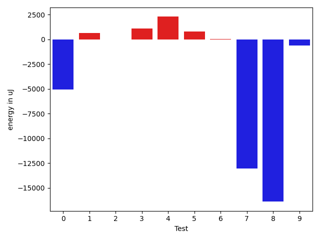

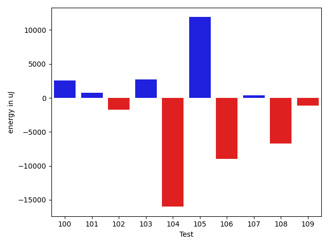

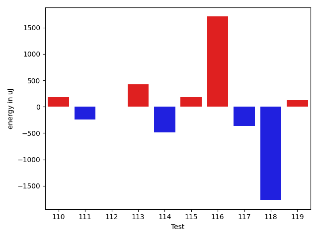

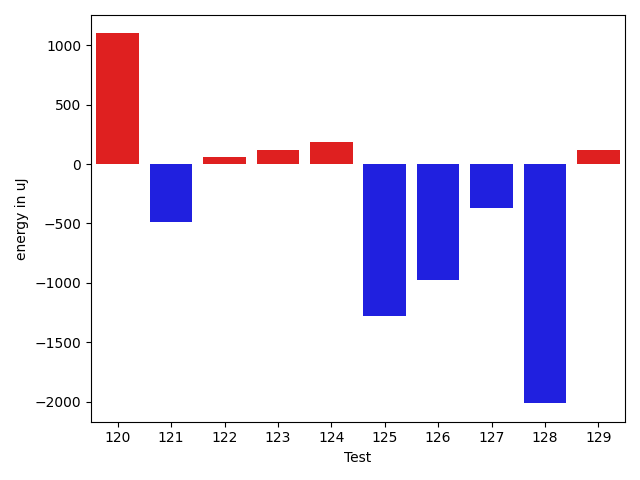

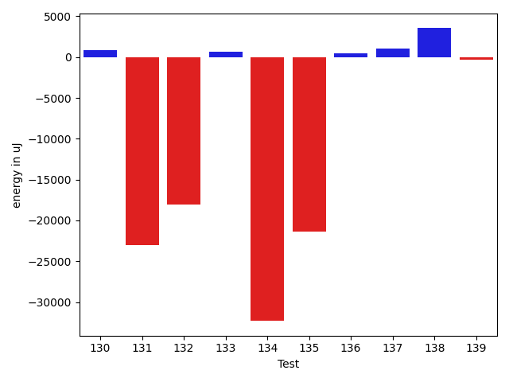

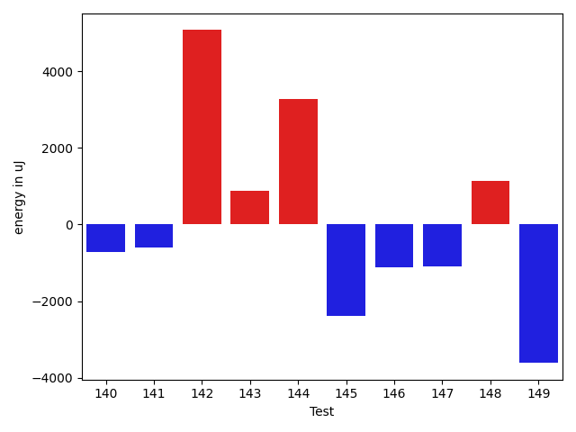

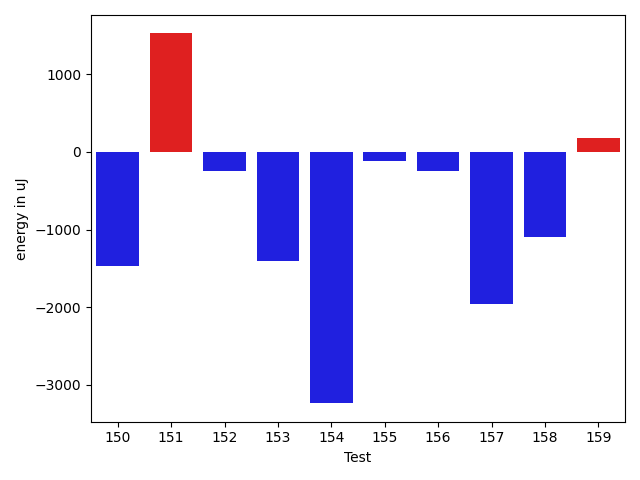

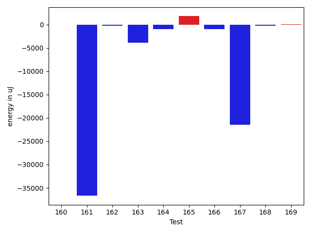

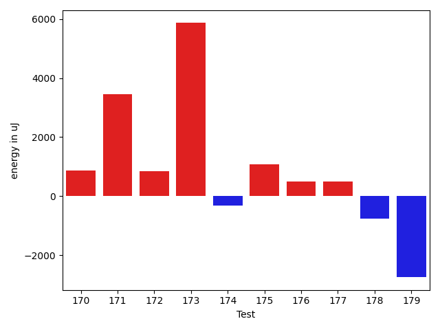

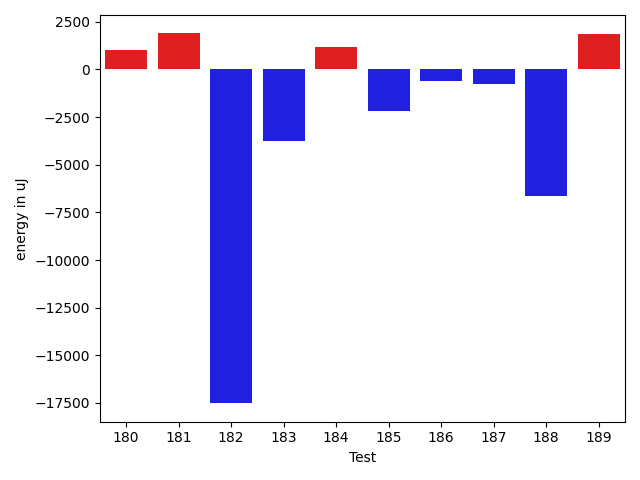

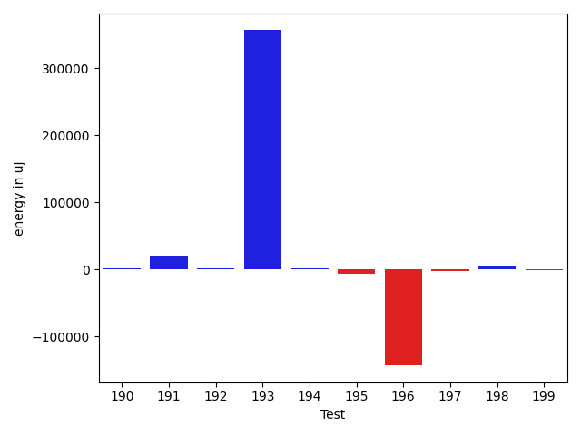

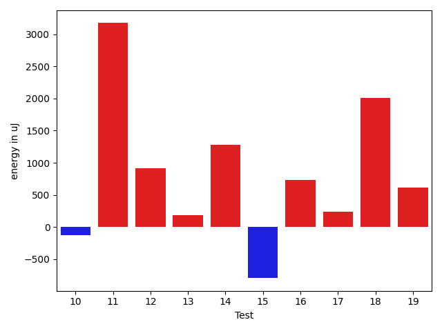

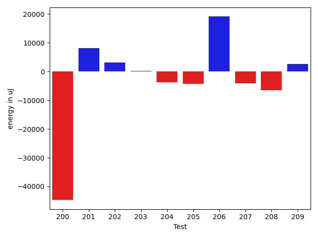

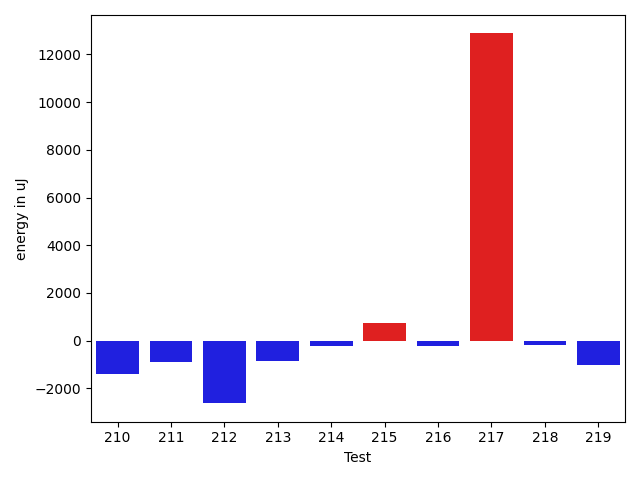

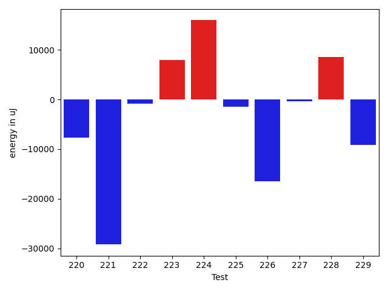

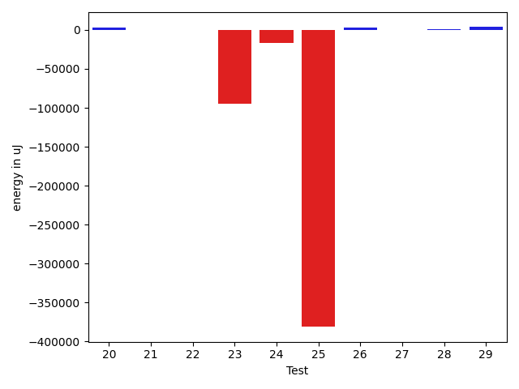

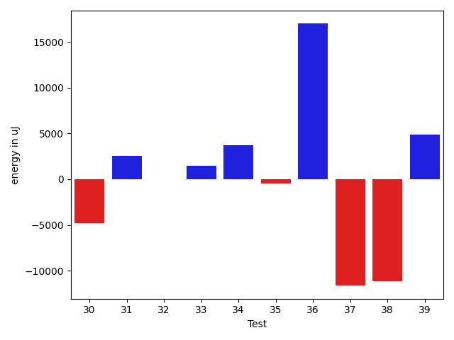

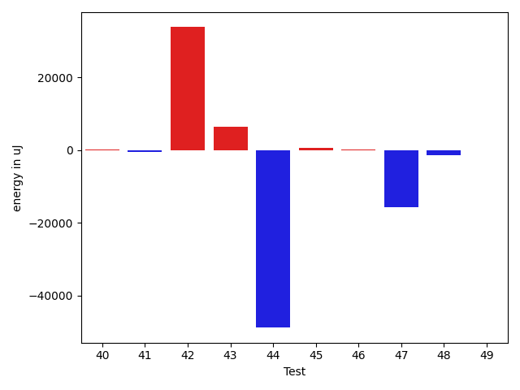

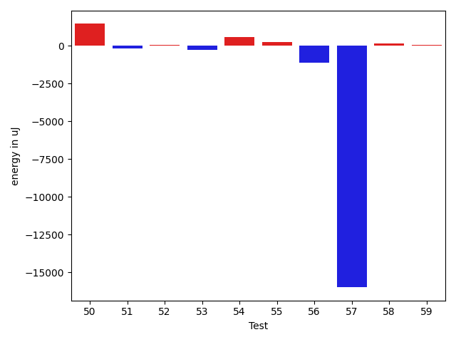

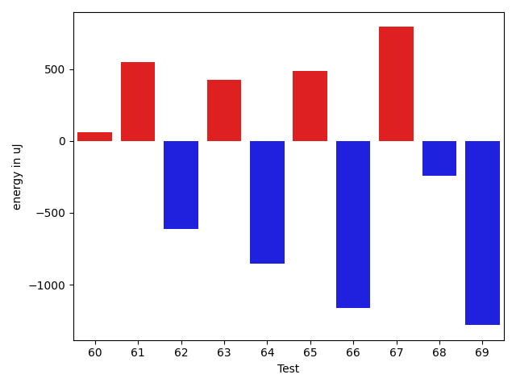

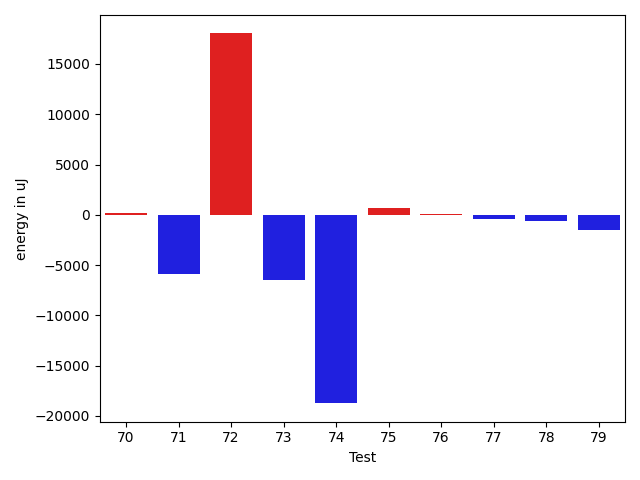

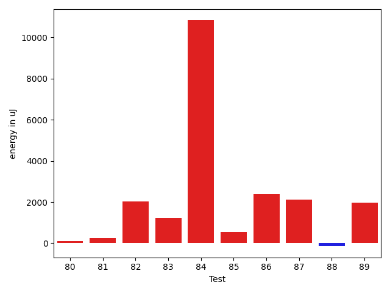

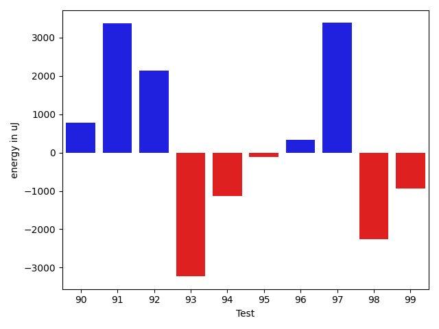

| ID | EnergyV1 | EnergyV2 | DeltaEnergy | σ |
| --- | --- | --- | --- | --- |
| 0 | 48050.18571428571 | 43000.49275362319 | -5049.69296066252 | 14030.926348903959 | 3802.697427906717 |
| 1 | 42630.74074074074 | 43289.140625 | 658.3998842592628 | 2975.7717093416236 | 3306.1918088791535 |
| 2 | 44400.74074074074 | 44377.94642857143 | -22.794312169309705 | 7474.981306021924 | 6560.739231594809 |
| 3 | 43808.54761904762 | 44881.74444444444 | 1073.1968253968225 | 8233.359242399123 | 8370.60969445557 |
| 4 | 50048.10526315789 | 52328.76666666667 | 2280.661403508777 | 13901.531311692692 | 22350.77439327078 |
| 5 | 43219.11688311688 | 44019.106060606064 | 799.9891774891803 | 6135.431019213984 | 6740.697102536585 |
| 6 | 43199.9375 | 43228.382978723406 | 28.445478723406268 | 3801.010673745482 | 3658.8638368667876 |
| 7 | 61201.275862068964 | 48171.36708860759 | -13029.908773461371 | 39863.182094866665 | 18489.02835736435 |
| 8 | 85319.04285714286 | 68940.54385964913 | -16378.498997493734 | 73157.07259577763 | 53278.15310404351 |
| 9 | 43609.37037037037 | 42971.64102564102 | -637.7293447293487 | 4356.208890751548 | 3118.2687133365052 |
| 10 | 45139.44776119403 | 44608.318181818184 | -531.1295793758472 | 8088.703900167476 | 6181.1624266164445 |
| 11 | 47498.565217391304 | 44246.26666666667 | -3252.298550724634 | 27105.80136977914 | 2104.501159155986 |
| 12 | 41615.205882352944 | 42783.833333333336 | 1168.6274509803916 | 3666.4603765630104 | 3514.826655279983 |
| 13 | 48795.72857142857 | 49738.54666666667 | 942.8180952381008 | 15310.16698884524 | 16319.399970418306 |
| 14 | 42237.76315789474 | 47587.475 | 5349.711842105258 | 4534.949523506069 | 24006.058027076724 |
| 15 | 43254.80952380953 | 42940.53846153846 | -314.2710622710656 | 4523.298381649513 | 4240.6129249543565 |
| 16 | 113925.61403508772 | 96149.11475409837 | -17776.49928098936 | 238328.1700690932 | 206436.6418050365 |
| 17 | 43134.21428571428 | 43741.03636363636 | 606.8220779220792 | 4681.361766601243 | 3296.191504606691 |
| 18 | 49857.137931034486 | 47235.098039215685 | -2622.0398918188002 | 26596.49301645009 | 8047.489413048855 |
| 19 | 62488.10227272727 | 69888.94680851063 | 7400.8445357833625 | 28618.78364579006 | 34614.05100391206 |
| 20 | 53330.191011235955 | 55285.593406593405 | 1955.4023953574506 | 18402.639653645932 | 20179.13825906939 |
| 21 | 44793.31578947369 | 48541.54838709677 | 3748.232597623086 | 8489.012409565124 | 19735.568030169925 |
| 22 | 79751.77777777778 | 74841.1313131313 | -4910.646464646474 | 32171.363125372172 | 36348.910450553434 |
| 23 | 95447.97647058824 | 101259.28048780488 | 5811.304017216637 | 172085.78937488102 | 180567.59331789424 |
| 24 | 43837.627118644064 | 44199.555555555555 | 361.9284369114903 | 4743.313541448099 | 6295.078482335657 |
| 25 | 43786.409638554214 | 44481.184782608696 | 694.7751440544816 | 5843.3761594330035 | 7576.243739091046 |
| 26 | 70862.48648648648 | 66113.33783783784 | -4749.148648648639 | 54111.537200201 | 45597.66982882238 |
| 27 | 42613.63636363636 | 44824.25 | 2210.6136363636397 | 4107.244758245147 | 8375.09336291244 |
| 28 | 43979.28813559322 | 43071.8275862069 | -907.46054938632 | 6763.363164126204 | 3722.650451501804 |
| 29 | 58123.6 | 49994.8 | -8128.799999999996 | 29968.754772929755 | 19375.92152802029 |
| 30 | 45994.123076923075 | 44131.63888888889 | -1862.4841880341846 | 13156.74071810012 | 6222.10373343283 |
| 31 | 43969.6 | 44636.21428571428 | 666.614285714284 | 4028.15151651474 | 2884.730444910914 |
| 32 | 43029.71428571428 | 42987.84210526316 | -41.872180451122404 | 2901.7469146124 | 3778.8495779752852 |
| 33 | 45912.446153846155 | 45693.21875 | -219.22740384615463 | 9974.433112144221 | 9366.53080199112 |
| 34 | 46314.545454545456 | 51120.48 | 4805.934545454547 | 15957.198537244085 | 31358.178519958714 |
| 35 | 44670.81481481482 | 43407.07407407407 | -1263.7407407407445 | 3800.084209954233 | 3581.4511534967787 |
| 36 | 43431.5 | 43890.63157894737 | 459.1315789473665 | 3154.5246736500044 | 3471.876441084945 |
| 37 | 66830.94871794872 | 63501.33802816901 | -3329.610689779707 | 34383.55661370164 | 30801.509482374062 |
| 38 | 43833.09302325582 | 44250.4 | 417.3069767441848 | 3392.370892225147 | 6165.843377835671 |
| 39 | 44220.529411764706 | 43351.686274509804 | -868.8431372549021 | 3205.119748476822 | 3852.39575314261 |
| 40 | 43617.42105263158 | 43865.230769230766 | 247.80971659918578 | 3782.817264195249 | 4422.0808824987525 |
| 41 | 44223.86666666667 | 43814.818181818184 | -409.0484848484848 | 3103.45848727226 | 2827.72898978481 |
| 42 | 45395.60526315789 | 79250.89655172414 | 33855.29128856625 | 5707.182342588262 | 173805.37678884802 |
| 43 | 78300.54545454546 | 84673.41414141415 | 6372.868686868693 | 29930.3978614873 | 34465.316577218335 |
| 44 | 157269.43055555556 | 108466.49333333333 | -48802.93722222223 | 257165.44054772655 | 136995.8752340983 |
| 45 | 42978.67346938775 | 43649.055555555555 | 670.3820861678032 | 4348.6442662745185 | 3550.4600506114202 |
| 46 | 51934.030303030304 | 52199.06060606061 | 265.0303030303039 | 15871.62355245994 | 17800.81447337505 |
| 47 | 94862.57971014493 | 79220.4 | -15642.179710144934 | 85100.83179218583 | 72359.7039820737 |
| 48 | 46645.907216494845 | 45338.70526315789 | -1307.201953336953 | 12338.146334469075 | 11000.794469753617 |
| 49 | 43202.79347826087 | 43193.31764705882 | -9.475831202049449 | 4915.152774258932 | 4977.0116741858965 |
| 50 | 66412.20202020202 | 68781.48484848485 | 2369.282828282827 | 23145.36473654003 | 21324.419315391897 |
| 51 | 43472.25 | 45386.98780487805 | 1914.737804878052 | 2680.3686957944306 | 17627.047319592933 |
| 52 | 41837.416666666664 | 42105.706896551725 | 268.2902298850604 | 4201.135105705229 | 3369.058427803299 |
| 53 | 44317.936170212764 | 43922.74736842105 | -395.1888017917154 | 7748.050644075567 | 6563.56776050218 |
| 54 | 389893.3939393939 | 388659.70707070705 | -1233.6868686868693 | 55766.43497856528 | 63023.66616048396 |
| 55 | 42695.333333333336 | 43051.5 | 356.16666666666424 | 2640.564159297229 | 2422.977588187134 |
| 56 | 50777.37755102041 | 43969.80808080808 | -6807.569470212329 | 21630.656655243896 | 10035.620133714585 |
| 57 | 1485252.888888889 | 1431676.9292929294 | -53575.95959595963 | 234366.41444510847 | 205178.43301425932 |
| 58 | 43580.46341463415 | 42696.60493827161 | -883.8584763625404 | 6780.91635327593 | 2817.921340888067 |
| 59 | 51723.20202020202 | 51706.454545454544 | -16.7474747474771 | 17584.71892169868 | 17728.94585178743 |
| 60 | 41617.07142857143 | 41661.3870967742 | 44.3156682027693 | 3072.0705162484014 | 2819.6571477399953 |
| 61 | 42946.454545454544 | 43256.28571428572 | 309.8311688311733 | 2442.081744728027 | 2668.6358320463346 |
| 62 | 41967.7 | 41442.8064516129 | -524.8935483870955 | 2156.6948192392297 | 2615.254942477296 |
| 63 | 42338.1 | 43169.333333333336 | 831.2333333333372 | 2564.6607488450913 | 2757.8061580821004 |
| 64 | 41585.11111111111 | 41051.59259259259 | -533.5185185185182 | 3212.938695606935 | 2921.317552308651 |
| 65 | 42791.09090909091 | 42928.0 | 136.90909090908826 | 2158.471848092596 | 2969.071249285428 |
| 66 | 43426.5 | 42214.913043478264 | -1211.5869565217363 | 2010.0096081859908 | 2411.037480332688 |
| 67 | 164415.9696969697 | 162508.37373737374 | -1907.5959595959575 | 252936.818171328 | 206340.12650434722 |
| 68 | 61422.79797979798 | 59069.555555555555 | -2353.242424242424 | 21561.73821818387 | 22201.88994240334 |
| 69 | 49439.63829787234 | 46055.01052631579 | -3384.627771556552 | 15550.879305953104 | 11246.144676938227 |
| 70 | 52481.47826086957 | 52629.07777777778 | 147.5995169082089 | 24726.347415027914 | 25727.136170989135 |
| 71 | 100466.22340425532 | 94548.10204081633 | -5918.121363438986 | 146933.67864956163 | 135646.82127085596 |
| 72 | 230963.78787878787 | 248990.77777777778 | 18026.98989898991 | 79792.94361947088 | 97619.71848619703 |
| 73 | 52146.8125 | 45715.29268292683 | -6431.519817073167 | 49654.123002549786 | 12121.181050569214 |
| 74 | 68702.94736842105 | 49970.07692307692 | -18732.87044534413 | 132438.95284579974 | 15841.881070132951 |
| 75 | 42425.20754716981 | 43149.41176470588 | 724.2042175360693 | 3631.9404676698327 | 3388.797780788532 |
| 76 | 42633.828571428574 | 42679.42857142857 | 45.599999999998545 | 4524.914846780241 | 4432.385030028616 |
| 77 | 43623.275 | 43210.93548387097 | -412.33951612903184 | 3711.798977500667 | 3219.6099937673666 |
| 78 | 42655.36666666667 | 42017.96153846154 | -637.4051282051296 | 4170.457884400172 | 4563.968393681173 |
| 79 | 46484.28333333333 | 44995.58208955224 | -1488.7012437810918 | 15870.970810562356 | 10105.030235687414 |
| 80 | 43754.25352112676 | 43855.375 | 101.12147887323954 | 7078.457331173803 | 6267.423820477287 |
| 81 | 42988.39705882353 | 43227.606060606064 | 239.20900178253214 | 3885.2816694762064 | 3651.1261395952884 |
| 82 | 117019.03658536586 | 119036.68421052632 | 2017.6476251604618 | 215268.82862175282 | 206122.01843001496 |
| 83 | 42199.142857142855 | 43437.25 | 1238.107142857145 | 4686.8654596366105 | 7293.7254914510495 |
| 84 | 70451.69565217392 | 81279.76190476191 | 10828.066252587989 | 52735.72131613883 | 55675.54818247865 |
| 85 | 41776.694444444445 | 42318.434782608696 | 541.7403381642507 | 4414.045567022039 | 3747.4920869027683 |
| 86 | 42015.206896551725 | 44401.92592592593 | 2386.7190293742024 | 4308.925030992191 | 3299.160734197197 |
| 87 | 41911.63636363636 | 44018.07692307692 | 2106.4405594405616 | 4160.9277652668525 | 2488.5891882608903 |
| 88 | 42758.37037037037 | 42615.82608695652 | -142.5442834138521 | 4872.506656956463 | 4423.990866530531 |
| 89 | 118788.72413793103 | 120746.0 | 1957.275862068971 | 274181.3594274967 | 267240.1660691976 |
| 90 | 43075.65 | 44092.94736842105 | 1017.2973684210519 | 3889.944681804613 | 3982.1922350923637 |
| 91 | 51601.86842105263 | 47621.57142857143 | -3980.296992481206 | 15740.66250473436 | 12158.420029819721 |
| 92 | 70091.56565656565 | 59984.40404040404 | -10107.161616161611 | 37514.12998092169 | 28037.081581622027 |
| 93 | 45147.07692307692 | 43381.72093023256 | -1765.3559928443647 | 9231.946905217203 | 3351.447554836229 |
| 94 | 113637.20408163265 | 98024.69696969698 | -15612.507111935673 | 69452.35467026343 | 68345.12681325781 |
| 95 | 56307.16470588235 | 51148.77011494253 | -5158.394590939824 | 21412.69004989499 | 16197.82494814045 |
| 96 | 45170.011494252874 | 44518.9625 | -651.048994252873 | 7975.492479290805 | 5811.0827572057315 |
| 97 | 52703.7 | 50897.333333333336 | -1806.3666666666613 | 27541.800018128295 | 20330.710716892514 |
| 98 | 43652.46296296296 | 43573.15873015873 | -79.30423280423565 | 5604.174987066812 | 4866.816841147912 |
| 99 | 52044.47368421053 | 55583.94594594595 | 3539.47226173542 | 23008.803589827796 | 28723.703736608022 |
| 100 | 47778.07246376811 | 47515.22535211268 | -262.8471116554356 | 12943.475510816128 | 12656.411171893607 |
| 101 | 44545.84 | 45083.55 | 537.7100000000064 | 5580.91785053319 | 5929.957423751033 |
| 102 | 46184.3125 | 47576.875 | 1392.5625 | 7448.620121528802 | 14292.877417069489 |
| 103 | 46368.80487804878 | 44860.666666666664 | -1508.1382113821164 | 7276.46747656699 | 6157.832543516178 |
| 104 | 197136.16666666666 | 104011.3125 | -93124.85416666666 | 340528.9597127207 | 232588.28521733385 |
| 105 | 44267.94915254237 | 66955.35416666667 | 22687.4050141243 | 3249.8438732967406 | 154125.08733945747 |
| 106 | 93723.0625 | 79141.21333333333 | -14581.849166666667 | 207812.75543721707 | 148807.65461909035 |
| 107 | 43868.97727272727 | 44397.717391304344 | 528.7401185770723 | 2919.4549031114784 | 6900.164247141051 |
| 108 | 44399.51851851852 | 43010.818181818184 | -1388.7003367003344 | 5162.344800790592 | 5514.855274095131 |
| 109 | 78551.98387096774 | 144876.08955223882 | 66324.10568127107 | 64007.79557625773 | 261992.42547150055 |
| 110 | 44178.10526315789 | 43644.24137931035 | -533.8638838475454 | 2968.5349194286123 | 2920.890424642889 |
| 111 | 48668.97368421053 | 98615.96153846153 | 49946.987854251005 | 23949.281261039123 | 272658.02060322335 |
| 112 | 57271.54639175258 | 57331.555555555555 | 60.00916380297713 | 23103.762801501696 | 22559.51478775718 |
| 113 | 49263.011494252874 | 46926.10666666667 | -2336.904827586208 | 19209.999705908827 | 14508.663316858501 |
| 114 | 50811.97590361446 | 48881.50617283951 | -1930.469730774952 | 18820.19969740018 | 17092.178454604193 |
| 115 | 60274.954545454544 | 59428.68421052631 | -846.270334928231 | 32311.95474163095 | 20923.382971042436 |
| 116 | 42078.933333333334 | 43106.73809523809 | 1027.8047619047575 | 3734.422652982802 | 3609.5643059827794 |
| 117 | 172946.66666666666 | 161225.52525252526 | -11721.141414141399 | 148030.39680573926 | 94659.80479424045 |
| 118 | 44802.81578947369 | 43004.91891891892 | -1797.8968705547668 | 3784.73202733008 | 3742.5647253127886 |
| 119 | 46595.246913580246 | 46123.3023255814 | -471.9445879988489 | 23739.538184703262 | 15983.486920605195 |
| 120 | 42553.0625 | 43532.07692307692 | 979.014423076922 | 5644.871051104157 | 4104.706894090068 |
| 121 | 47720.5 | 43827.395348837206 | -3893.1046511627937 | 22421.924641408463 | 6160.21284040155 |
| 122 | 43239.46575342466 | 43175.18461538461 | -64.28113804004533 | 4122.464803615229 | 2977.1956081174917 |
| 123 | 42390.9 | 42425.92857142857 | 35.02857142857101 | 4854.329005125219 | 3743.88666388832 |
| 124 | 44232.583333333336 | 43574.269230769234 | -658.3141025641016 | 3727.195504181246 | 4216.0913000778 |
| 125 | 46241.44827586207 | 43015.26470588235 | -3226.183569979723 | 6521.923455367247 | 3105.9511218155485 |
| 126 | 51742.833333333336 | 68990.08108108108 | 17247.247747747744 | 26869.293510993448 | 175265.45554361914 |
| 127 | 44131.48648648649 | 43309.560975609755 | -821.925510876732 | 3547.457358345107 | 3481.8267426444654 |
| 128 | 43151.769230769234 | 42785.555555555555 | -366.2136752136794 | 3790.892165214413 | 2535.607843457357 |
| 129 | 88944.18867924529 | 85418.91549295775 | -3525.273186287537 | 87912.84557329825 | 76810.27027898606 |
| 130 | 66232.29292929293 | 75994.73737373737 | 9762.444444444438 | 35487.62477977573 | 51955.95019084971 |
| 131 | 43610.102040816324 | 43144.19512195122 | -465.90691886510467 | 3604.61387580824 | 8888.530296960023 |
| 132 | 42955.044444444444 | 42894.76315789474 | -60.28128654970351 | 3677.041056523305 | 4491.957763511248 |
| 133 | 42810.617647058825 | 42709.42465753425 | -101.19298952457757 | 3833.6315030092624 | 3972.338784948448 |
| 134 | 51589.0618556701 | 52892.74747474748 | 1303.685619077376 | 17764.992303476116 | 18400.27465064202 |
| 135 | 52734.89898989899 | 56383.28571428572 | 3648.386724386728 | 18159.408998690356 | 34835.91785376532 |
| 136 | 44136.311475409835 | 44307.86956521739 | 171.55808980755683 | 7242.810412641965 | 6768.714897216336 |
| 137 | 161782.78125 | 108781.01052631579 | -53001.77072368421 | 339232.6334732735 | 173398.99398715608 |
| 138 | 47332.298969072166 | 54129.114583333336 | 6796.81561426117 | 13206.892373618763 | 31794.164729576605 |
| 139 | 45565.031746031746 | 43430.98148148148 | -2134.050264550264 | 9891.431332649283 | 6621.36636198731 |
| 140 | 45114.870588235295 | 44405.166666666664 | -709.7039215686309 | 10326.785810284237 | 7501.94516495132 |
| 141 | 44138.89333333333 | 43526.66233766234 | -612.2309956709942 | 5843.508458847494 | 6407.719414407622 |
| 142 | 51865.52127659575 | 56934.063157894736 | 5068.541881298988 | 17821.55672256228 | 30026.168000178757 |
| 143 | 42403.31578947369 | 43273.71428571428 | 870.3984962405957 | 4622.146414732485 | 1720.5376275720205 |
| 144 | 45741.19047619047 | 49019.78571428572 | 3278.595238095244 | 8808.167046873235 | 13374.572322553888 |
| 145 | 53719.92452830189 | 51337.0 | -2382.92452830189 | 26047.079660918393 | 23239.673672041496 |
| 146 | 43867.89333333333 | 42757.833333333336 | -1110.0599999999977 | 3793.9376047349833 | 3552.5565808444217 |
| 147 | 43689.61016949153 | 42601.30909090909 | -1088.3010785824372 | 3591.290292732717 | 3414.3431838627585 |
| 148 | 43281.51282051282 | 44424.560975609755 | 1143.0481550969344 | 3854.663854257958 | 7387.487744362847 |
| 149 | 52729.97701149425 | 49118.22093023256 | -3611.756081261694 | 17450.1599057173 | 11962.783772631044 |
| 150 | 46913.4081632653 | 43234.71698113208 | -3678.691182133225 | 10173.449861197563 | 6069.495793231204 |
| 151 | 42609.148148148146 | 42773.36666666667 | 164.21851851852261 | 4034.048363650881 | 4232.414744038627 |
| 152 | 44553.52631578947 | 43743.218181818185 | -810.308133971288 | 3108.7629914528347 | 6681.100597114246 |
| 153 | 43728.448979591834 | 42659.434782608696 | -1069.0141969831384 | 3361.279579365903 | 3349.494846093596 |
| 154 | 45107.18518518518 | 42401.03333333333 | -2706.1518518518496 | 3538.8718231268654 | 3614.177734822804 |
| 155 | 43342.782608695656 | 43063.76470588235 | -279.01790281330614 | 3849.2279401653673 | 3869.7992656469128 |
| 156 | 43816.846153846156 | 42876.230769230766 | -940.6153846153902 | 3377.734535412156 | 3567.2425784367724 |
| 157 | 43542.86363636364 | 42843.22222222222 | -699.6414141414207 | 3775.0131883629297 | 3382.7048440158646 |
| 158 | 44123.125 | 42091.25 | -2031.875 | 3044.487481669397 | 3869.2894723493273 |
| 159 | 169149.4 | 204039.88888888888 | 34890.48888888888 | 295864.5154562135 | 357791.7804452889 |
| 160 | 42748.96 | 44127.23728813559 | 1378.2772881355922 | 3951.491778860231 | 5589.216531430838 |
| 161 | 105253.33333333333 | 99130.71717171717 | -6122.616161616155 | 165434.22818141288 | 191409.06138979428 |
| 162 | 55194.14606741573 | 52364.63636363636 | -2829.5097037793676 | 19152.359325165067 | 18304.84872127267 |
| 163 | 118993.58585858585 | 124437.40404040404 | 5443.818181818191 | 27572.394831930735 | 41046.552612024556 |
| 164 | 51969.931506849316 | 43113.782608695656 | -8856.14889815366 | 59760.427031338324 | 4862.479408307997 |
| 165 | 42668.39189189189 | 46071.58108108108 | 3403.1891891891864 | 6703.620876804881 | 18843.503102909817 |
| 166 | 143797.84848484848 | 169277.8383838384 | 25479.98989898991 | 218536.09249937691 | 292432.27927631646 |
| 167 | 77194.05263157895 | 70289.09210526316 | -6904.960526315786 | 37316.65125788343 | 31818.601755302974 |
| 168 | 46746.71111111111 | 44284.441860465115 | -2462.2692506459935 | 11402.495600373772 | 9050.73172630277 |
| 169 | 54890.57142857143 | 56429.04761904762 | 1538.4761904761908 | 26717.829487228828 | 31303.0062845426 |
| 170 | 88587.39795918367 | 89465.0 | 877.6020408163313 | 43746.46922539655 | 41155.0230771998 |
| 171 | 43815.661538461536 | 47277.920634920636 | 3462.2590964591 | 8930.727454695903 | 31636.847547938127 |
| 172 | 42976.89189189189 | 43827.394366197186 | 850.5024743052927 | 5962.349134739499 | 6476.994417902928 |
| 173 | 97518.8817204301 | 103382.48888888888 | 5863.6071684587805 | 139721.54658707773 | 181171.897189949 |
| 174 | 42523.95238095238 | 42208.18918918919 | -315.7631917631952 | 4355.096024048702 | 4312.5802763407355 |
| 175 | 42163.67567567567 | 43237.020833333336 | 1073.3451576576626 | 3388.8728817008237 | 3888.4238103288894 |
| 176 | 43270.205882352944 | 43769.45238095238 | 499.2464985994375 | 3244.458060242308 | 3411.087825385669 |
| 177 | 45725.95 | 46221.8 | 495.8500000000058 | 21785.909564383583 | 19479.011651261986 |
| 178 | 48850.4081632653 | 48085.63265306123 | -764.7755102040755 | 14066.254942190862 | 13948.240143098557 |
| 179 | 51330.44262295082 | 48582.71186440678 | -2747.730758544036 | 37738.676865494126 | 24610.113679618746 |
| 180 | 43841.041666666664 | 44869.380952380954 | 1028.3392857142899 | 3608.550545569586 | 2573.584686889003 |
| 181 | 42971.89473684211 | 44860.75 | 1888.8552631578932 | 5343.231265567748 | 2904.8996217597605 |
| 182 | 129891.16326530612 | 112375.9797979798 | -17515.183467326322 | 181192.0284430865 | 126060.70288234754 |
| 183 | 55344.0 | 51611.52631578947 | -3732.4736842105267 | 26141.7039948833 | 19026.34873943423 |
| 184 | 43302.4375 | 44465.583333333336 | 1163.1458333333358 | 8964.926470478928 | 3698.9265738334293 |
| 185 | 47107.40476190476 | 44931.21153846154 | -2176.1932234432243 | 12125.810156654086 | 6920.544307563083 |
| 186 | 44586.1 | 43965.61111111111 | -620.488888888889 | 8921.258163697168 | 3426.0025886817893 |
| 187 | 43047.72549019608 | 42308.6976744186 | -739.0278157774737 | 4056.400510442103 | 3723.161731739875 |
| 188 | 49007.78947368421 | 42384.42857142857 | -6623.360902255641 | 23427.78733532817 | 3722.560960151064 |
| 189 | 118182.97142857143 | 120049.16923076923 | 1866.1978021977993 | 259228.81890203114 | 266693.73477695166 |
| 190 | 45227.117647058825 | 44136.72727272727 | -1090.3903743315532 | 2074.640461618036 | 7720.871954889658 |
| 191 | 47877.58441558442 | 95821.87341772152 | 47944.289002137106 | 13514.751112007109 | 227338.35052004276 |
| 192 | 44226.36363636364 | 42487.64 | -1738.7236363636403 | 3133.5834731055293 | 4196.825980476198 |
| 193 | 43602.82608695652 | 40883.84210526316 | -2718.98398169336 | 3477.2400306311633 | 4672.528271584182 |
| 194 | 43764.818181818184 | 86619.20689655172 | 42854.38871473354 | 3073.7535631442784 | 186414.06059081806 |
| 195 | 44076.61538461538 | 40946.52173913043 | -3130.0936454849507 | 3879.9205491163884 | 4224.451617301198 |
| 196 | 51704.65217391304 | 42713.318181818184 | -8991.333992094857 | 32548.61105780185 | 3380.8747306303553 |
| 197 | 43593.35294117647 | 44480.63636363636 | 887.2834224598919 | 2911.8239471097727 | 2434.488886911556 |
| 198 | 47997.666666666664 | 50206.188405797104 | 2208.5217391304395 | 14641.781949548345 | 23022.753458688985 |
| 199 | 71203.21212121213 | 73036.70707070707 | 1833.4949494949396 | 38906.52618888402 | 39380.9714992828 |
| 200 | 44607.192307692305 | 44372.380952380954 | -234.81135531135078 | 2552.9584500404885 | 4583.0390465819 |
| 201 | 42468.13333333333 | 42850.294117647056 | 382.16078431372443 | 2594.5982056744137 | 2546.816762033963 |
| 202 | 49941.029411764706 | 68111.83783783784 | 18170.808426073134 | 19084.223266237626 | 37420.36669942786 |
| 203 | 44193.58620689655 | 42794.28571428572 | -1399.3004926108333 | 2783.7200304782114 | 2436.6239943405135 |
| 204 | 44844.97142857143 | 42635.044444444444 | -2209.926984126985 | 7000.799295124254 | 4347.1761406716305 |
| 205 | 44094.0 | 42895.45 | -1198.550000000003 | 3661.7990114150175 | 3124.8395234795657 |
| 206 | 43868.875 | 43452.2962962963 | -416.57870370370074 | 2839.262511529182 | 2567.221885327562 |
| 207 | 43425.0 | 42907.63157894737 | -517.3684210526335 | 2391.280927910913 | 3678.6234297560463 |
| 208 | 43522.357142857145 | 42686.375 | -835.9821428571449 | 3809.0688514788126 | 3890.6971398934406 |
| 209 | 45870.75 | 48172.333333333336 | 2301.5833333333358 | 6575.389371550555 | 14490.83714321264 |
| 210 | 139786.80808080808 | 166919.0303030303 | 27132.22222222222 | 123011.40435975493 | 222397.25704073216 |
| 211 | 43432.75 | 42781.666666666664 | -651.0833333333358 | 3841.6618392955934 | 4259.411184528783 |
| 212 | 43973.46153846154 | 44253.28571428572 | 279.8241758241784 | 3637.4731850004932 | 8159.159376301651 |
| 213 | 193155.0909090909 | 110868.125 | -82286.96590909091 | 360891.2786117686 | 256898.2724940397 |
| 214 | 43355.22222222222 | 44979.65 | 1624.4277777777825 | 4161.5673359154025 | 9923.21460654258 |
| 215 | 42717.23529411765 | 43654.03846153846 | 936.8031674208105 | 3688.183779544547 | 3195.6329393621063 |
| 216 | 69071.92929292929 | 64822.21212121212 | -4249.717171717166 | 41049.65522764024 | 25684.87961493673 |
| 217 | 321252.43434343435 | 308915.4747474748 | -12336.959595959575 | 68849.74927430437 | 49009.407069664376 |
| 218 | 43889.95238095238 | 44023.166666666664 | 133.2142857142826 | 3388.742068564121 | 3093.5310146964566 |
| 219 | 83370.1 | 127344.91489361702 | 43974.81489361702 | 182071.12793853396 | 264674.46947828156 |
| 220 | 50133.346153846156 | 42408.8275862069 | -7724.5185676392575 | 33638.69071464527 | 3456.1519270262525 |
| 221 | 74882.76923076923 | 45656.90909090909 | -29225.860139860146 | 155748.88627168353 | 10383.26459833362 |
| 222 | 43506.5625 | 42650.260869565216 | -856.3016304347839 | 4538.4815256420015 | 4261.43809383631 |
| 223 | 49573.808219178085 | 57512.333333333336 | 7938.525114155251 | 31377.577223695484 | 43968.579847179244 |
| 224 | 56338.06153846154 | 72308.1 | 15970.038461538468 | 31211.283114568545 | 53489.107335263434 |
| 225 | 44540.375 | 43113.10526315789 | -1427.2697368421068 | 2624.3345793505446 | 3688.0061064959273 |
| 226 | 159307.73684210525 | 142873.65384615384 | -16434.08299595141 | 319227.6282051055 | 298217.7654133794 |
| 227 | 42899.65217391304 | 42605.17391304348 | -294.4782608695605 | 3470.241748359974 | 4068.8450091991326 |
| 228 | 47916.92592592593 | 56538.0 | 8621.074074074073 | 13714.092240994774 | 32879.55157256411 |
| 229 | 56312.555555555555 | 47188.13043478261 | -9124.425120772947 | 32952.332531763976 | 13816.931196131758 |

## Delta Duration per test method

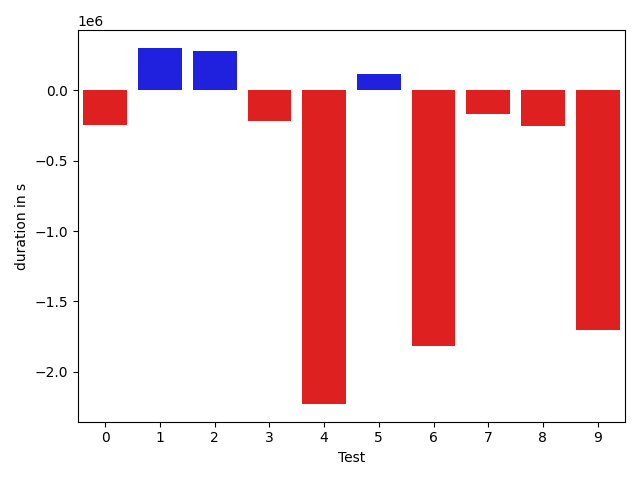

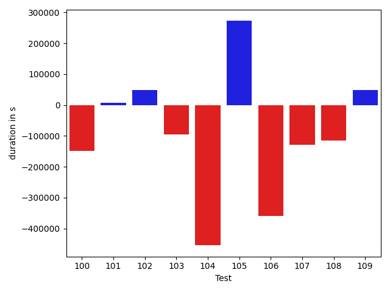

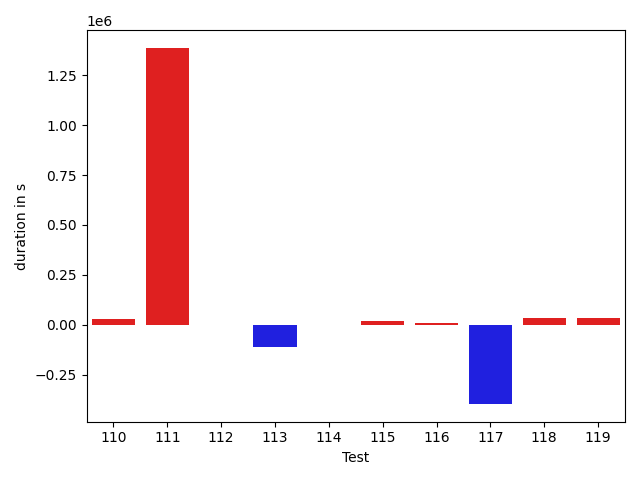

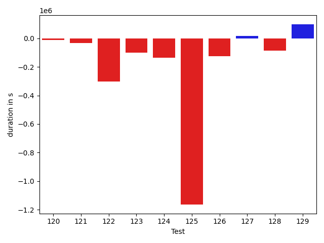

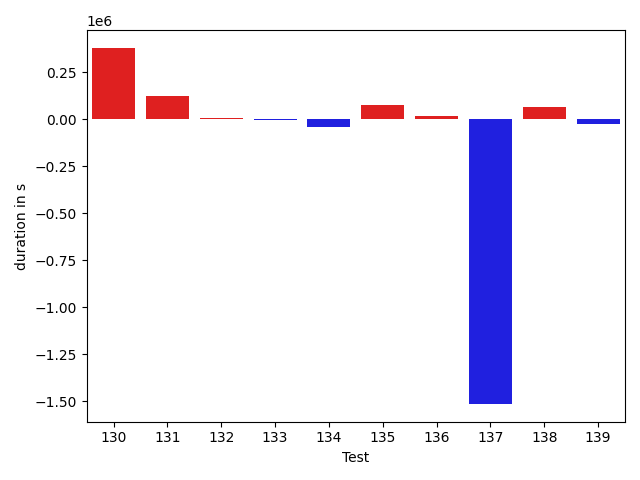

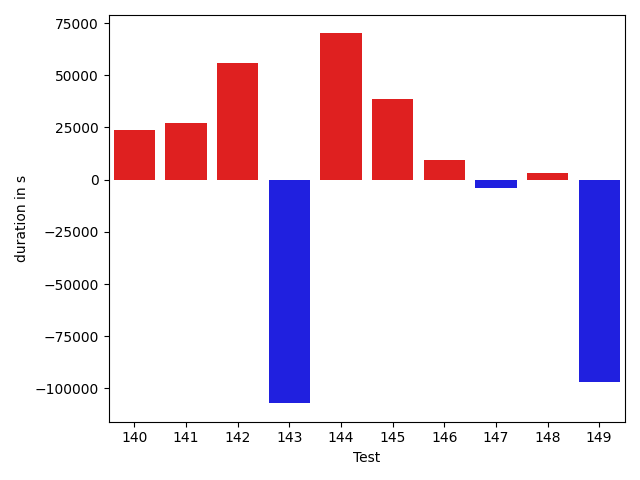

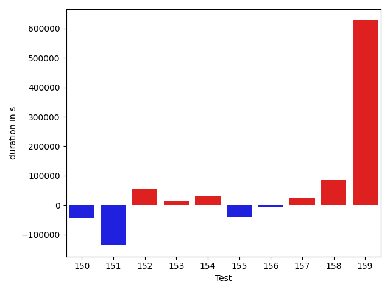

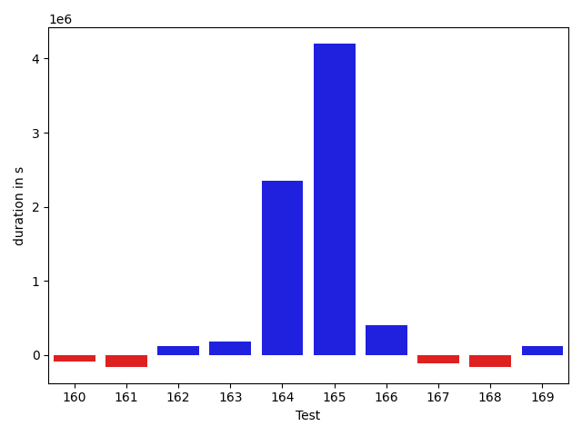

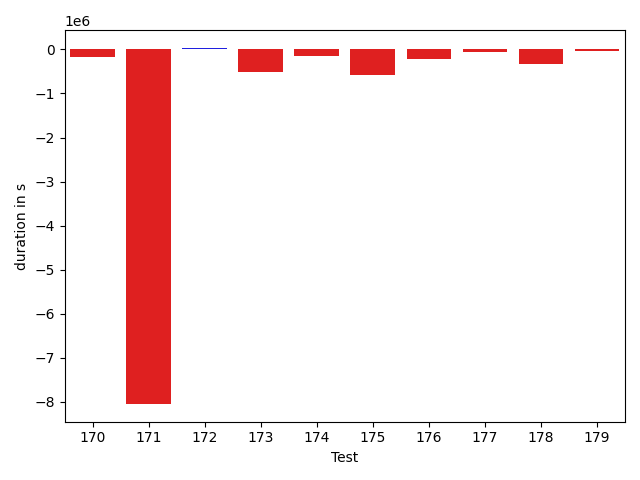

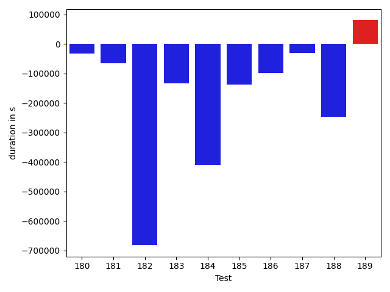

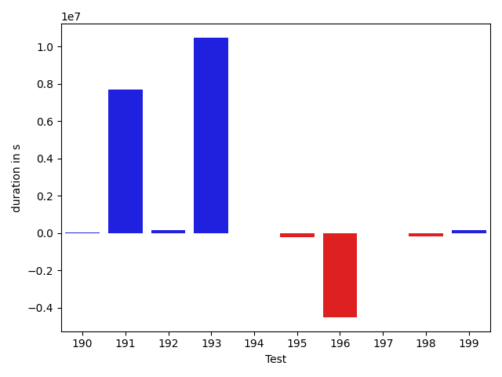

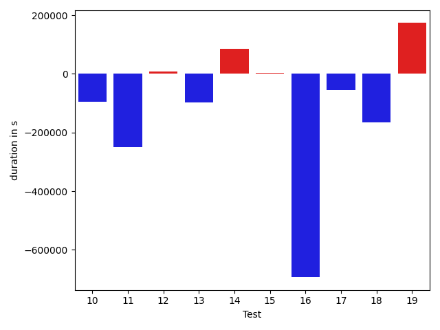

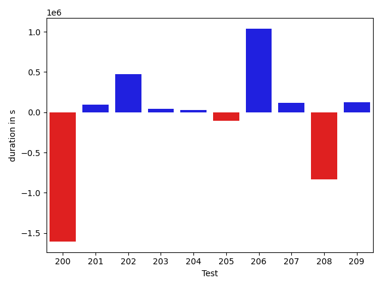

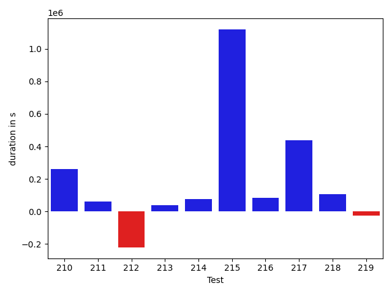

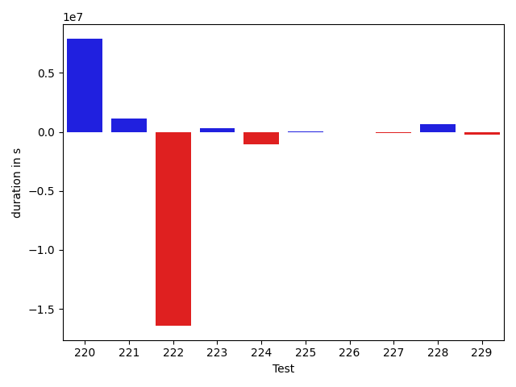

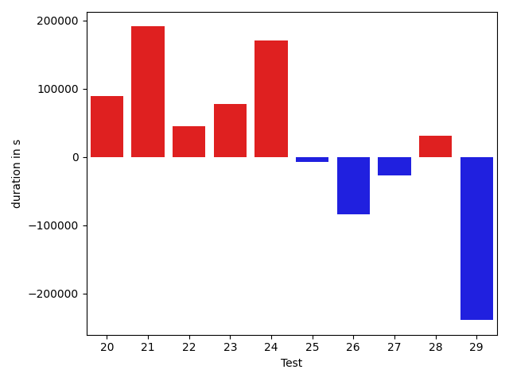

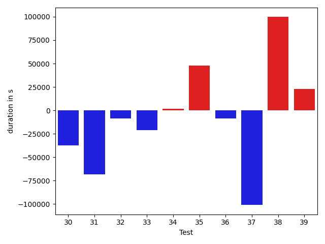

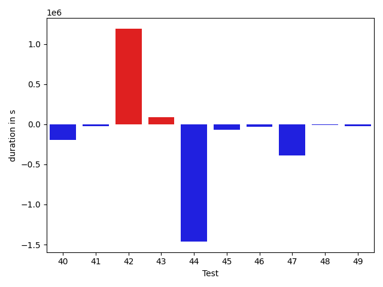

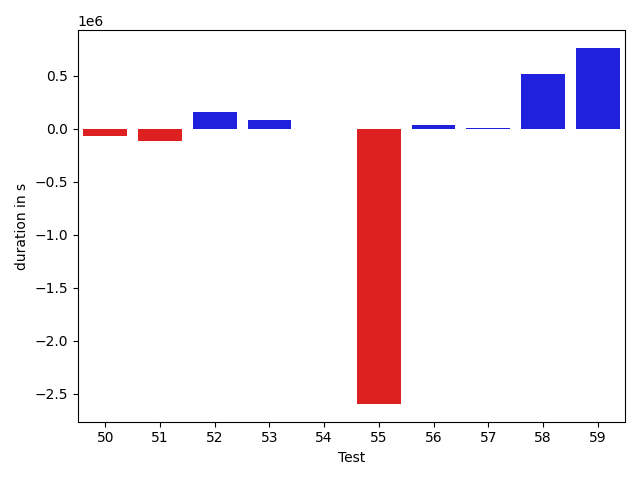

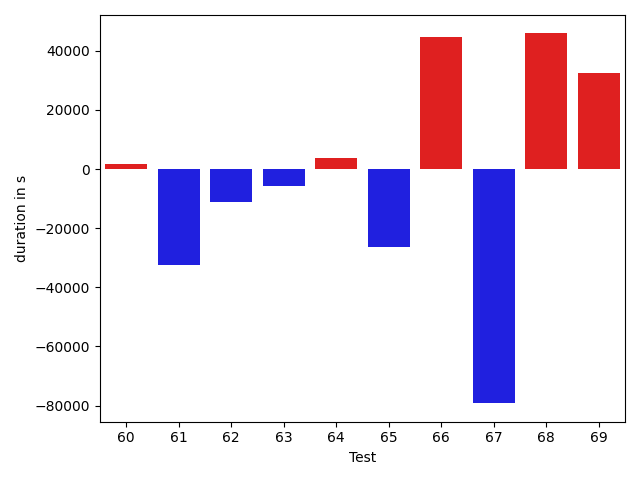

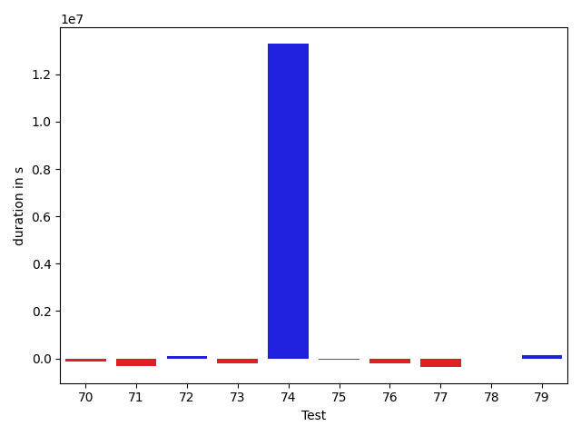

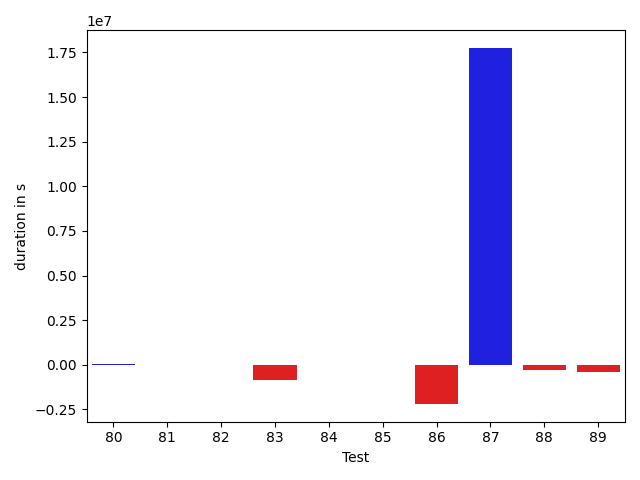

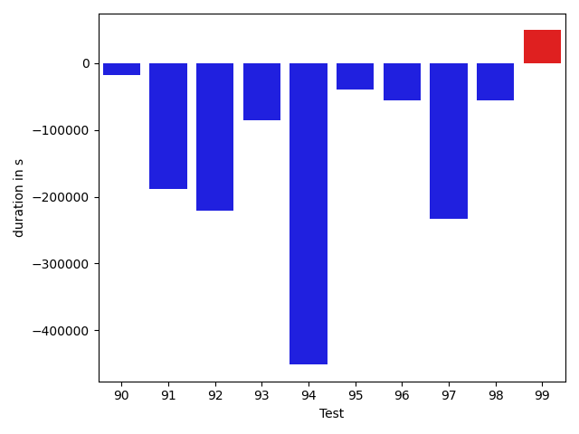

| ID | DurationV1 | DurationsV2 | DeltaDuration |
| --- | --- | --- | --- |
| 0 | 1225176.5857142857 | 1069700.420289855 | -155476.16542443074 |
| 1 | 833655.6111111111 | 793422.828125 | -40232.782986111124 |
| 2 | 974060.8333333334 | 843703.2857142857 | -130357.54761904769 |
| 3 | 1160523.7142857143 | 1117241.677777778 | -43282.03650793643 |
| 4 | 1335866.8631578947 | 1342810.8 | 6943.936842105351 |
| 5 | 987072.0 | 1006178.6818181818 | 19106.681818181765 |
| 6 | 770527.375 | 727039.0 | -43488.375 |
| 7 | 1584988.712643678 | 1227257.6582278481 | -357731.05441582995 |
| 8 | 1976501.9857142856 | 1506500.245614035 | -470001.7401002506 |
| 9 | 709933.9629629629 | 652017.1025641026 | -57916.8603988603 |
| 10 | 995214.5970149253 | 901193.7727272727 | -94020.82428765262 |
| 11 | 656812.7391304348 | 406460.06666666665 | -250352.67246376816 |
| 12 | 563341.5882352941 | 570423.1111111111 | 7081.522875817027 |
| 13 | 1253609.642857143 | 1155805.3466666667 | -97804.29619047628 |
| 14 | 687844.1842105263 | 774265.55 | 86421.36578947376 |
| 15 | 675894.9047619047 | 679921.4423076923 | 4026.53754578752 |
| 16 | 3200073.192982456 | 2506654.6721311477 | -693418.5208513085 |
| 17 | 807121.5178571428 | 751326.9818181818 | -55794.53603896103 |
| 18 | 1025163.1896551724 | 859120.4117647059 | -166042.7778904665 |
| 19 | 1660037.4318181819 | 1833438.6595744682 | 173401.22775628627 |
| 20 | 1406457.0337078653 | 1495699.7142857143 | 89242.68057784904 |
| 21 | 963524.701754386 | 1154636.2903225806 | 191111.58856819465 |
| 22 | 1996427.9595959596 | 2041159.6363636365 | 44731.676767676836 |
| 23 | 2627468.8588235294 | 2704550.6219512196 | 77081.76312769018 |
| 24 | 796558.0508474576 | 967393.1666666666 | 170835.11581920902 |
| 25 | 1153449.0 | 1146640.7826086956 | -6808.217391304439 |
| 26 | 1714687.4054054054 | 1630541.0 | -84146.40540540544 |
| 27 | 762125.6818181818 | 735578.175 | -26547.50681818172 |
| 28 | 759447.186440678 | 790553.0344827586 | 31105.848042080645 |
| 29 | 1338664.8 | 1099550.7333333334 | -239114.06666666665 |
| 30 | 1010141.2153846154 | 972464.5694444445 | -37676.645940170856 |
| 31 | 566581.44 | 498202.1785714286 | -68379.26142857136 |
| 32 | 478432.4285714286 | 469628.2105263158 | -8804.218045112793 |
| 33 | 1023525.8769230769 | 1002144.3125 | -21381.564423076925 |
| 34 | 635316.4545454546 | 637222.96 | 1906.505454545375 |
| 35 | 490061.2962962963 | 537804.4444444445 | 47743.148148148204 |
| 36 | 428210.5 | 419596.84210526315 | -8613.657894736854 |
| 37 | 1559967.0 | 1458811.5915492957 | -101155.4084507043 |
| 38 | 615461.8139534884 | 715185.48 | 99723.66604651161 |
| 39 | 757820.6666666666 | 780806.9607843137 | 22986.294117647107 |
| 40 | 652653.7368421053 | 456882.6923076923 | -195771.04453441297 |
| 41 | 472946.56666666665 | 449054.54545454547 | -23892.02121212118 |
| 42 | 742495.9736842106 | 1933658.0344827587 | 1191162.0607985482 |
| 43 | 2131198.9191919193 | 2215920.131313131 | 84721.21212121192 |
| 44 | 4237179.236111111 | 2775150.04 | -1462029.196111111 |
| 45 | 820839.9387755102 | 755674.1666666666 | -65165.77210884355 |
| 46 | 1552165.7373737374 | 1517271.1313131314 | -34894.60606060596 |
| 47 | 2328838.3913043477 | 1936394.7 | -392443.6913043477 |
| 48 | 1294471.6804123712 | 1282467.6 | -12004.080412371084 |
| 49 | 1168326.75 | 1147195.8470588236 | -21130.902941176435 |
| 50 | 1828422.5555555555 | 1833464.8282828282 | 5042.272727272706 |
| 51 | 1040650.0 | 1051923.3780487804 | 11273.378048780374 |
| 52 | 936324.8166666667 | 910968.2931034482 | -25356.52356321842 |
| 53 | 1203676.5531914893 | 1182114.4210526317 | -21562.132138857618 |
| 54 | 9516372.171717172 | 9501971.111111112 | -14401.06060606055 |
| 55 | 498470.1904761905 | 533753.4642857143 | 35283.273809523846 |
| 56 | 1430820.530612245 | 1336579.5353535353 | -94240.99525870965 |
| 57 | 35278604.484848484 | 34082781.62626263 | -1195822.8585858569 |
| 58 | 1092689.8414634147 | 1056169.9259259258 | -36519.91553748888 |
| 59 | 1507978.3232323232 | 1457858.9393939395 | -50119.383838383714 |
| 60 | 723840.1428571428 | 725577.9032258064 | 1737.7603686635848 |
| 61 | 458329.8181818182 | 425915.53571428574 | -32414.282467532437 |
| 62 | 567859.4333333333 | 556788.8709677419 | -11070.56236559141 |
| 63 | 521590.73333333334 | 515931.5833333333 | -5659.150000000023 |
| 64 | 516957.9259259259 | 520848.44444444444 | 3890.51851851854 |
| 65 | 455969.6818181818 | 429464.7916666667 | -26504.890151515137 |
| 66 | 387391.625 | 432071.04347826086 | 44679.418478260865 |
| 67 | 4465328.94949495 | 4386144.323232323 | -79184.62626262661 |
| 68 | 1636009.9393939395 | 1681836.121212121 | 45826.18181818165 |
| 69 | 1293589.3404255318 | 1325905.2 | 32315.859574468108 |
| 70 | 1367874.3804347827 | 1443292.2444444445 | 75417.86400966183 |
| 71 | 2722896.7021276597 | 2529276.7959183673 | -193619.90620929236 |
| 72 | 5589455.424242424 | 6193231.686868687 | 603776.2626262633 |
| 73 | 950660.2083333334 | 816341.9756097561 | -134318.2327235773 |
| 74 | 1598337.245614035 | 969090.3846153846 | -629246.8609986504 |
| 75 | 750405.283018868 | 753249.6274509804 | 2844.3444321124116 |
| 76 | 819633.6857142857 | 762916.7857142857 | -56716.90000000002 |
| 77 | 578501.95 | 585934.7096774194 | 7432.759677419439 |
| 78 | 592200.8333333334 | 558541.5384615385 | -33659.294871794875 |
| 79 | 1009229.6833333333 | 1001032.0447761194 | -8197.63855721394 |
| 80 | 1011509.0 | 1043709.7916666666 | 32200.791666666628 |
| 81 | 902767.6029411765 | 872726.6666666666 | -30040.936274509877 |
| 82 | 3224211.9024390243 | 3252448.0789473685 | 28236.176508344244 |
| 83 | 559805.6071428572 | 909097.1428571428 | 349291.5357142857 |
| 84 | 1582506.4782608696 | 1948855.357142857 | 366348.8788819874 |
| 85 | 613527.8333333334 | 594086.6521739131 | -19441.181159420288 |
| 86 | 544695.7931034482 | 517745.0 | -26950.79310344823 |
| 87 | 558336.1818181818 | 559801.4230769231 | 1465.2412587413564 |
| 88 | 774472.4814814815 | 556681.304347826 | -217791.1771336554 |
| 89 | 2897836.379310345 | 2920553.923076923 | 22717.543766578194 |
| 90 | 520237.7 | 502047.7368421053 | -18189.96315789473 |
| 91 | 1359407.4868421052 | 1170571.844155844 | -188835.6426862611 |
| 92 | 1928403.505050505 | 1707979.505050505 | -220424.0 |
| 93 | 1170808.9615384615 | 1084727.7906976745 | -86081.170840787 |
| 94 | 3034041.1836734693 | 2582497.5353535353 | -451543.64831993403 |
| 95 | 1402759.811764706 | 1363035.4597701149 | -39724.35199459107 |
| 96 | 1170538.3563218392 | 1115419.55 | -55118.8063218391 |
| 97 | 1410240.2142857143 | 1177563.0952380951 | -232677.11904761917 |
| 98 | 891485.2222222222 | 835623.3968253968 | -55861.82539682544 |
| 99 | 1270235.4561403508 | 1319451.5945945946 | 49216.13845424377 |
| 100 | 1089087.2463768115 | 1189591.9295774647 | 100504.68320065318 |
| 101 | 485713.08 | 545243.5 | 59530.419999999984 |
| 102 | 669478.125 | 695055.125 | 25577.0 |
| 103 | 879406.487804878 | 787438.8235294118 | -91967.66427546623 |
| 104 | 5064750.333333333 | 2083881.6875 | -2980868.645833333 |
| 105 | 688623.2372881356 | 1600589.0 | 911965.7627118644 |
| 106 | 2528615.05 | 2019996.7333333334 | -508618.3166666664 |
| 107 | 674953.9772727273 | 1021119.5869565217 | 346165.60968379444 |
| 108 | 761239.5 | 831629.0181818182 | 70389.51818181819 |
| 109 | 1831775.5806451612 | 3813598.6268656715 | 1981823.0462205103 |
| 110 | 587362.6842105263 | 614730.5862068966 | 27367.90199637029 |
| 111 | 741357.2631578947 | 2128251.6153846155 | 1386894.3522267207 |
| 112 | 1612348.793814433 | 1613047.9797979798 | 699.1859835467767 |
| 113 | 1281058.2183908045 | 1169073.2666666666 | -111984.95172413788 |
| 114 | 1276414.9518072288 | 1275019.8148148148 | -1395.1369924140163 |
| 115 | 1302143.0909090908 | 1321799.5263157894 | 19656.435406698612 |
| 116 | 712799.9777777778 | 719683.1428571428 | 6883.165079365019 |
| 117 | 4413744.474747474 | 4017037.6565656564 | -396706.8181818179 |
| 118 | 592110.1578947369 | 626014.1081081082 | 33903.95021337131 |
| 119 | 1138424.4691358025 | 1170602.7093023255 | 32178.240166523028 |
| 120 | 453970.125 | 418540.6538461539 | -35429.47115384613 |
| 121 | 906855.1041666666 | 829435.4418604651 | -77419.66230620153 |
| 122 | 936382.1506849315 | 951020.2615384615 | 14638.11085353 |
| 123 | 562987.4333333333 | 576920.6071428572 | 13933.17380952381 |
| 124 | 744829.5625 | 785301.6923076923 | 40472.129807692254 |
| 125 | 692739.6896551724 | 617204.5588235294 | -75535.13083164301 |
| 126 | 1268353.5128205128 | 1639235.189189189 | 370881.67636867636 |
| 127 | 655129.2972972973 | 627374.1707317074 | -27755.12656558992 |
| 128 | 444397.6153846154 | 410572.6666666667 | -33824.94871794869 |
| 129 | 2190838.754716981 | 2219101.267605634 | 28262.51288865274 |
| 130 | 1840586.5757575757 | 2219582.525252525 | 378995.94949494954 |
| 131 | 787095.8775510204 | 909568.4634146341 | 122472.58586361376 |
| 132 | 767565.8 | 773716.3157894737 | 6150.515789473662 |
| 133 | 980206.0735294118 | 977192.205479452 | -3013.8680499597685 |
| 134 | 1432535.381443299 | 1389848.7878787878 | -42686.593564511044 |
| 135 | 1431459.9191919193 | 1507803.530612245 | 76343.6114203257 |
| 136 | 925704.2459016393 | 941273.0289855072 | 15568.783083867864 |
| 137 | 4363927.84375 | 2849129.4105263157 | -1514798.4332236843 |
| 138 | 1368310.9587628867 | 1435175.3020833333 | 66864.34332044655 |
| 139 | 986489.9523809524 | 962118.5185185185 | -24371.433862433885 |
| 140 | 1140109.7764705883 | 1163782.5357142857 | 23672.759243697394 |
| 141 | 1049682.24 | 1076921.5064935065 | 27239.266493506497 |
| 142 | 1441379.585106383 | 1497283.7894736843 | 55904.204367301194 |
| 143 | 664276.3684210526 | 557151.3333333334 | -107125.03508771921 |
| 144 | 656998.5714285715 | 727019.25 | 70020.67857142852 |
| 145 | 1053869.358490566 | 1092557.2127659575 | 38687.85427539144 |
| 146 | 933840.5866666667 | 943378.9090909091 | 9538.32242424239 |
| 147 | 786523.779661017 | 782737.5818181818 | -3786.197842835216 |
| 148 | 686654.2051282051 | 689978.8536585366 | 3324.6485303314403 |
| 149 | 1340697.8735632184 | 1243543.1162790698 | -97154.7572841486 |
| 150 | 894933.3673469388 | 852724.7358490566 | -42208.63149788219 |
| 151 | 743306.6296296297 | 607592.4 | -135714.22962962964 |
| 152 | 731770.7368421053 | 787138.3090909091 | 55367.5722488038 |
| 153 | 715915.4489795918 | 730655.8478260869 | 14740.398846495082 |
| 154 | 461242.74074074073 | 492323.9666666667 | 31081.225925925944 |
| 155 | 594880.7826086957 | 554510.0588235294 | -40370.72378516628 |
| 156 | 643765.358974359 | 636764.1282051282 | -7001.230769230751 |
| 157 | 454406.7727272727 | 480745.27777777775 | 26338.505050505046 |
| 158 | 449584.0416666667 | 536073.5 | 86489.45833333331 |
| 159 | 4590291.25 | 5217339.388888889 | 627048.138888889 |
| 160 | 882183.76 | 829461.3559322034 | -52722.404067796655 |
| 161 | 2883048.3232323234 | 2694572.282828283 | -188476.04040404037 |
| 162 | 1444427.0786516855 | 1363426.6363636365 | -81000.44228804903 |
| 163 | 2932555.1616161615 | 3144345.97979798 | 211790.81818181835 |
| 164 | 1273572.493150685 | 1031772.231884058 | -241800.261266627 |
| 165 | 1048429.2972972973 | 1094925.7027027027 | 46496.40540540544 |
| 166 | 3921951.3434343436 | 4887967.191919192 | 966015.8484848482 |
| 167 | 1929005.8026315789 | 1779786.9210526317 | -149218.88157894718 |
| 168 | 1273764.1444444444 | 1291423.1395348837 | 17658.995090439217 |
| 169 | 1482319.7912087913 | 1498186.5714285714 | 15866.780219780048 |
| 170 | 2441064.4285714286 | 2401376.1616161615 | -39688.26695526717 |
| 171 | 951931.1230769231 | 1032047.6984126985 | 80116.57533577539 |
| 172 | 1268058.7972972973 | 1076024.1830985916 | -192034.61419870565 |
| 173 | 2482169.7741935486 | 2727204.6333333333 | 245034.8591397847 |
| 174 | 636380.1428571428 | 705077.0810810811 | 68696.93822393822 |
| 175 | 694962.2972972973 | 703788.2708333334 | 8825.973536036094 |
| 176 | 698959.2647058824 | 672781.380952381 | -26177.88375350146 |
| 177 | 787908.8 | 854540.725 | 66631.92499999993 |
| 178 | 1399976.7653061224 | 1363412.0408163266 | -36564.72448979574 |
| 179 | 1334842.0327868853 | 1047849.0847457628 | -286992.9480411225 |
| 180 | 407369.875 | 374389.71428571426 | -32980.16071428574 |
| 181 | 558855.9210526316 | 493807.6875 | -65048.23355263157 |
| 182 | 3537869.2959183673 | 2855078.98989899 | -682790.3060193774 |
| 183 | 1166340.487804878 | 1033508.1052631579 | -132832.38254172017 |
| 184 | 961959.25 | 551202.5277777778 | -410756.72222222225 |
| 185 | 928580.1666666666 | 791208.2307692308 | -137371.93589743588 |
| 186 | 621738.8 | 522199.72222222225 | -99539.0777777778 |
| 187 | 764218.6666666666 | 733140.5116279069 | -31078.155038759694 |
| 188 | 655571.1052631579 | 408705.28571428574 | -246865.81954887212 |
| 189 | 3245395.9142857143 | 3325279.5846153847 | 79883.67032967042 |
| 190 | 423824.4705882353 | 635454.4545454546 | 211629.9839572193 |
| 191 | 1204857.0649350649 | 2608140.8481012657 | 1403283.7831662009 |
| 192 | 571630.7272727273 | 649289.68 | 77658.95272727276 |
| 193 | 457828.6956521739 | 500511.3157894737 | 42682.62013729982 |
| 194 | 771640.1363636364 | 2054998.0344827587 | 1283357.8981191223 |
| 195 | 422262.3076923077 | 737470.0434782609 | 315207.7357859532 |
| 196 | 612975.695652174 | 464528.95454545453 | -148446.74110671942 |
| 197 | 425642.76470588235 | 434115.04545454547 | 8472.28074866312 |
| 198 | 1158960.076923077 | 1220607.8695652173 | 61647.792642140295 |
| 199 | 2029757.121212121 | 1999075.191919192 | -30681.929292929126 |
| 200 | 409330.1923076923 | 427578.90476190473 | 18248.712454212422 |
| 201 | 396306.2 | 388073.17647058825 | -8233.02352941176 |
| 202 | 788360.6176470588 | 1597989.7027027027 | 809629.0850556439 |
| 203 | 438489.4827586207 | 486300.38095238095 | 47810.89819376025 |
| 204 | 961704.9142857143 | 953720.4444444445 | -7984.469841269776 |
| 205 | 358973.9375 | 441205.3 | 82231.36249999999 |
| 206 | 476878.9375 | 489692.5925925926 | 12813.655092592584 |
| 207 | 385281.7619047619 | 441637.2105263158 | 56355.44862155389 |
| 208 | 403556.0714285714 | 416176.0625 | 12619.99107142858 |
| 209 | 527559.65 | 781241.3703703703 | 253681.7203703703 |
| 210 | 3784665.505050505 | 4430507.94949495 | 645842.4444444445 |
| 211 | 749491.2916666666 | 744737.125 | -4754.166666666628 |
| 212 | 493795.0 | 606723.0952380953 | 112928.09523809527 |
| 213 | 5163232.386363637 | 2714105.03125 | -2449127.3551136367 |
| 214 | 488810.25925925927 | 1163875.5 | 675065.2407407407 |
| 215 | 480962.0588235294 | 429435.3461538461 | -51526.71266968327 |
| 216 | 2042319.8181818181 | 1804218.686868687 | -238101.1313131312 |
| 217 | 7803360.393939394 | 7377589.646464647 | -425770.7474747468 |
| 218 | 436703.95238095237 | 414069.1666666667 | -22634.78571428568 |
| 219 | 2299714.22 | 3491542.4468085105 | 1191828.2268085103 |
| 220 | 794354.6153846154 | 534620.724137931 | -259733.89124668436 |
| 221 | 1773160.9615384615 | 900155.4090909091 | -873005.5524475524 |
| 222 | 547841.8125 | 583441.8260869565 | 35600.01358695654 |
| 223 | 1205519.7534246575 | 1419570.9206349207 | 214051.1672102632 |
| 224 | 1324189.446153846 | 1860252.3166666667 | 536062.8705128205 |
| 225 | 404125.1875 | 484546.63157894736 | 80421.44407894736 |
| 226 | 4383376.47368421 | 3644605.4615384615 | -738771.0121457488 |
| 227 | 476289.95652173914 | 464130.95652173914 | -12159.0 |
| 228 | 708363.2592592592 | 1315876.5806451612 | 607513.321385902 |
| 229 | 1194024.5925925926 | 689871.2608695652 | -504153.3317230274 |

## Misc.

| ID | Test Class | Test Method |
| --- | --- | --- |
| 0 | com.google.gson.functional.CustomTypeAdaptersTest | testCustomAdapterInvokedForCollectionElementDeserialization |
| 1 | com.google.gson.functional.CustomTypeAdaptersTest | testCustomAdapterInvokedForMapElementDeserialization |
| 2 | com.google.gson.functional.CustomTypeAdaptersTest | testCustomAdapterInvokedForMapElementSerializationWithType |
| 3 | com.google.gson.functional.CustomTypeAdaptersTest | testCustomTypeAdapterDoesNotAppliesToSubClasses |
| 4 | com.google.gson.functional.CustomTypeAdaptersTest | testCustomAdapterInvokedForCollectionElementSerializationWithType |
| 5 | com.google.gson.functional.CustomTypeAdaptersTest | testCustomByteArrayDeserializerAndInstanceCreator |
| 6 | com.google.gson.functional.CustomTypeAdaptersTest | testCustomByteArraySerializer |
| 7 | com.google.gson.functional.CustomTypeAdaptersTest | testEnsureCustomSerializerNotInvokedForNullValues |
| 8 | com.google.gson.functional.CustomTypeAdaptersTest | testEnsureCustomDeserializerNotInvokedForNullValues |
| 9 | com.google.gson.functional.CustomTypeAdaptersTest | testCustomDeserializerInvokedForPrimitives |
| 10 | com.google.gson.functional.CustomTypeAdaptersTest | testCustomNestedSerializers |
| 11 | com.google.gson.functional.CustomTypeAdaptersTest | testCustomAdapterInvokedForMapElementSerialization |
| 12 | com.google.gson.functional.CustomTypeAdaptersTest | testCustomAdapterInvokedForCollectionElementSerialization |
| 13 | com.google.gson.functional.CustomTypeAdaptersTest | testRegisterHierarchyAdapterForDate |
| 14 | com.google.gson.functional.CustomTypeAdaptersTest | testCustomSerializerInvokedForPrimitives |
| 15 | com.google.gson.functional.CustomTypeAdaptersTest | testCustomTypeAdapterAppliesToSubClassesSerializedAsBaseClass |
| 16 | com.google.gson.functional.CustomTypeAdaptersTest | testCustomSerializers |
| 17 | com.google.gson.functional.CustomTypeAdaptersTest | testCustomNestedDeserializers |
| 18 | com.google.gson.functional.CustomTypeAdaptersTest | testCustomDeserializers |
| 19 | com.google.gson.functional.StreamingTypeAdaptersTest | testNullSafe |
| 20 | com.google.gson.functional.StreamingTypeAdaptersTest | testSerializeWithCustomTypeAdapter |
| 21 | com.google.gson.functional.StreamingTypeAdaptersTest | testDeserializeWithCustomTypeAdapter |
| 22 | com.google.gson.functional.JsonAdapterAnnotationOnClassesTest | testJsonAdapterInvoked |
| 23 | com.google.gson.functional.JsonAdapterAnnotationOnClassesTest | testRegisteredDeserializerOverridesJsonAdapter |
| 24 | com.google.gson.functional.JsonAdapterAnnotationOnClassesTest | testIncorrectTypeAdapterFails |
| 25 | com.google.gson.functional.JsonAdapterAnnotationOnClassesTest | testJsonAdapterFactoryInvoked |
| 26 | com.google.gson.functional.JsonAdapterAnnotationOnClassesTest | testIncorrectJsonAdapterType |
| 27 | com.google.gson.functional.JsonAdapterAnnotationOnClassesTest | testRegisteredAdapterOverridesJsonAdapter |
| 28 | com.google.gson.functional.JsonAdapterAnnotationOnClassesTest | testRegisteredSerializerOverridesJsonAdapter |
| 29 | com.google.gson.functional.JsonAdapterAnnotationOnClassesTest | testSuperclassTypeAdapterNotInvoked |
| 30 | com.google.gson.functional.JsonAdapterAnnotationOnClassesTest | testNullSafeObjectFromJson |
| 31 | com.google.gson.MixedStreamTest | testReaderDoesNotMutateState |
| 32 | com.google.gson.MixedStreamTest | testWriteClosed |
| 33 | com.google.gson.MixedStreamTest | testWriteHtmlSafe |
| 34 | com.google.gson.MixedStreamTest | testWriteInvalidState |
| 35 | com.google.gson.MixedStreamTest | testWriteDoesNotMutateState |
| 36 | com.google.gson.MixedStreamTest | testReadNulls |
| 37 | com.google.gson.MixedStreamTest | testWriteLenient |
| 38 | com.google.gson.MixedStreamTest | testReadMixedStreamed |
| 39 | com.google.gson.MixedStreamTest | testReadClosed |
| 40 | com.google.gson.MixedStreamTest | testWriteNulls |
| 41 | com.google.gson.MixedStreamTest | testReadInvalidState |
| 42 | com.google.gson.MixedStreamTest | testWriteMixedStreamed |
| 43 | com.google.gson.functional.InstanceCreatorTest | testInstanceCreatorForParametrizedType |
| 44 | com.google.gson.functional.InstanceCreatorTest | testInstanceCreatorReturnsBaseType |
| 45 | com.google.gson.functional.InstanceCreatorTest | testInstanceCreatorReturnsSubTypeForTopLevelObject |
| 46 | com.google.gson.functional.InstanceCreatorTest | testInstanceCreatorForCollectionType |
| 47 | com.google.gson.functional.InstanceCreatorTest | testInstanceCreatorReturnsSubTypeForField |
| 48 | com.google.gson.functional.DefaultTypeAdaptersTest | testDateSerializationWithPatternNotOverridenByTypeAdapter |
| 49 | com.google.gson.functional.DefaultTypeAdaptersTest | testDateSerializationWithPattern |
| 50 | com.google.gson.functional.DefaultTypeAdaptersTest | testOverrideBigIntegerTypeAdapter |
| 51 | com.google.gson.functional.DefaultTypeAdaptersTest | testSqlDateSerialization |
| 52 | com.google.gson.functional.DefaultTypeAdaptersTest | testClassSerialization |
| 53 | com.google.gson.functional.DefaultTypeAdaptersTest | testTimestampSerialization |
| 54 | com.google.gson.functional.DefaultTypeAdaptersTest | testDefaultDateDeserializationUsingBuilder |
| 55 | com.google.gson.functional.DefaultTypeAdaptersTest | testDefaultCalendarSerialization |
| 56 | com.google.gson.functional.DefaultTypeAdaptersTest | testOverrideBigDecimalTypeAdapter |
| 57 | com.google.gson.functional.DefaultTypeAdaptersTest | testNullSerialization |
| 58 | com.google.gson.functional.DefaultTypeAdaptersTest | testDateDeserializationWithPattern |
| 59 | com.google.gson.functional.DefaultTypeAdaptersTest | testDateSerializationInCollection |
| 60 | com.google.gson.functional.DefaultTypeAdaptersTest | testSetSerialization |
| 61 | com.google.gson.functional.DefaultTypeAdaptersTest | testDefaultGregorianCalendarSerialization |
| 62 | com.google.gson.functional.DefaultTypeAdaptersTest | testBitSetDeserialization |
| 63 | com.google.gson.functional.DefaultTypeAdaptersTest | testDefaultCalendarDeserialization |
| 64 | com.google.gson.functional.DefaultTypeAdaptersTest | testClassDeserialization |
| 65 | com.google.gson.functional.DefaultTypeAdaptersTest | testDefaultGregorianCalendarDeserialization |
| 66 | com.google.gson.functional.DefaultTypeAdaptersTest | testBitSetSerialization |
| 67 | com.google.gson.functional.JsonAdapterSerializerDeserializerTest | testJsonSerializerDeserializerBasedJsonAdapterOnFields |
| 68 | com.google.gson.functional.JsonAdapterSerializerDeserializerTest | testDifferentJsonAdaptersForGenericFieldsOfSameRawType |
| 69 | com.google.gson.functional.JsonAdapterSerializerDeserializerTest | testJsonSerializerDeserializerBasedJsonAdapterOnClass |
| 70 | com.google.gson.internal.bind.RecursiveTypesResolveTest | testIssue440WeakReference |
| 71 | com.google.gson.internal.bind.RecursiveTypesResolveTest | testRecursiveResolveSimple |
| 72 | com.google.gson.internal.bind.RecursiveTypesResolveTest | testIssue603PrintStream |
| 73 | com.google.gson.internal.bind.RecursiveTypesResolveTest | testRecursiveTypeVariablesResolve12 |
| 74 | com.google.gson.internal.bind.RecursiveTypesResolveTest | testRecursiveTypeVariablesResolve1 |
| 75 | com.google.gson.functional.NamingPolicyTest | testAtSignInSerializedName |
| 76 | com.google.gson.functional.NamingPolicyTest | testGsonWithNonDefaultFieldNamingPolicySerialization |
| 77 | com.google.gson.functional.NamingPolicyTest | testGsonWithLowerCaseDashPolicyDeserialiation |
| 78 | com.google.gson.functional.NamingPolicyTest | testGsonWithUpperCamelCaseSpacesPolicyDeserialiation |
| 79 | com.google.gson.functional.NamingPolicyTest | testGsonWithSerializedNameFieldNamingPolicySerialization |
| 80 | com.google.gson.functional.NamingPolicyTest | testComplexFieldNameStrategy |
| 81 | com.google.gson.functional.NamingPolicyTest | testDeprecatedNamingStrategy |
| 82 | com.google.gson.functional.NamingPolicyTest | testGsonDuplicateNameUsingSerializedNameFieldNamingPolicySerialization |
| 83 | com.google.gson.functional.NamingPolicyTest | testGsonWithSerializedNameFieldNamingPolicyDeserialization |
| 84 | com.google.gson.functional.NamingPolicyTest | testGsonWithNonDefaultFieldNamingPolicyDeserialiation |
| 85 | com.google.gson.functional.NamingPolicyTest | testGsonWithLowerCaseUnderscorePolicyDeserialiation |
| 86 | com.google.gson.functional.NamingPolicyTest | testGsonWithUpperCamelCaseSpacesPolicySerialiation |
| 87 | com.google.gson.functional.NamingPolicyTest | testGsonWithLowerCaseUnderscorePolicySerialization |
| 88 | com.google.gson.functional.NamingPolicyTest | testGsonWithLowerCaseDashPolicySerialization |
| 89 | com.google.gson.LongSerializationPolicyTest | testDefaultLongSerializationIntegration |
| 90 | com.google.gson.LongSerializationPolicyTest | testStringLongSerializationIntegration |
| 91 | com.google.gson.functional.MapTest | testSerializeMaps |
| 92 | com.google.gson.functional.MapTest | testInterfaceTypeMapWithSerializer |
| 93 | com.google.gson.functional.MapTest | testGeneralMapField |
| 94 | com.google.gson.functional.MapTest | testInterfaceTypeMap |
| 95 | com.google.gson.functional.MapTest | testMapSerializationWithNullValuesSerialized |
| 96 | com.google.gson.functional.MapTest | testMapSubclassDeserialization |
| 97 | com.google.gson.functional.MapTest | testMapSerializationWithNullValueButSerializeNulls |
| 98 | com.google.gson.functional.MapTest | testCustomSerializerForSpecificMapType |
| 99 | com.google.gson.functional.ReadersWritersTest | testReadWriteTwoObjects |
| 100 | com.google.gson.functional.ReadersWritersTest | testReadWriteTwoStrings |
| 101 | com.google.gson.functional.ReadersWritersTest | testTopLevelNullObjectDeserializationWithReaderAndSerializeNulls |
| 102 | com.google.gson.functional.ReadersWritersTest | testTopLevelNullObjectSerializationWithWriterAndSerializeNulls |
| 103 | com.google.gson.GsonBuilderTest | testExcludeFieldsWithModifiers |
| 104 | com.google.gson.GsonBuilderTest | testCreatingMoreThanOnce |
| 105 | com.google.gson.GsonBuilderTest | testTransientFieldExclusion |
| 106 | com.google.gson.JsonParserTest | testReadWriteTwoObjects |
| 107 | com.google.gson.functional.CustomSerializerTest | testSerializerReturnsNull |
| 108 | com.google.gson.functional.CustomSerializerTest | testSubClassSerializerInvokedForBaseClassFieldsHoldingArrayOfSubClassInstances |
| 109 | com.google.gson.functional.CustomSerializerTest | testSubClassSerializerInvokedForBaseClassFieldsHoldingSubClassInstances |
| 110 | com.google.gson.functional.CustomSerializerTest | testBaseClassSerializerInvokedForBaseClassFieldsHoldingSubClassInstances |
| 111 | com.google.gson.functional.CustomSerializerTest | testBaseClassSerializerInvokedForBaseClassFields |
| 112 | com.google.gson.functional.ObjectTest | testSingletonLists |
| 113 | com.google.gson.functional.ObjectTest | testAnonymousLocalClassesCustomSerialization |
| 114 | com.google.gson.functional.ObjectTest | testInnerClassDeserialization |
| 115 | com.google.gson.functional.ObjectTest | testJsonObjectSerialization |
| 116 | com.google.gson.functional.VersioningTest | testVersionedGsonMixingSinceAndUntilDeserialization |
| 117 | com.google.gson.functional.VersioningTest | testVersionedUntilSerialization |
| 118 | com.google.gson.functional.VersioningTest | testVersionedClassesDeserialization |
| 119 | com.google.gson.functional.VersioningTest | testVersionedGsonMixingSinceAndUntilSerialization |
| 120 | com.google.gson.functional.VersioningTest | testIgnoreLaterVersionClassDeserialization |
| 121 | com.google.gson.functional.VersioningTest | testVersionedGsonWithUnversionedClassesSerialization |
| 122 | com.google.gson.functional.VersioningTest | testVersionedClassesSerialization |
| 123 | com.google.gson.functional.VersioningTest | testVersionedGsonWithUnversionedClassesDeserialization |
| 124 | com.google.gson.functional.VersioningTest | testIgnoreLaterVersionClassSerialization |
| 125 | com.google.gson.functional.VersioningTest | testVersionedUntilDeserialization |
| 126 | com.google.gson.functional.FieldExclusionTest | testDefaultInnerClassExclusion |
| 127 | com.google.gson.functional.FieldExclusionTest | testDefaultNestedStaticClassIncluded |
| 128 | com.google.gson.functional.FieldExclusionTest | testInnerClassExclusion |
| 129 | com.google.gson.functional.CustomDeserializerTest | testCustomDeserializerReturnsNull |
| 130 | com.google.gson.functional.CustomDeserializerTest | testJsonTypeFieldBasedDeserialization |
| 131 | com.google.gson.functional.CustomDeserializerTest | testCustomDeserializerReturnsNullForArrayElements |
| 132 | com.google.gson.functional.CustomDeserializerTest | testCustomDeserializerReturnsNullForTopLevelObject |
| 133 | com.google.gson.functional.CustomDeserializerTest | testCustomDeserializerReturnsNullForArrayElementsForArrayField |
| 134 | com.google.gson.functional.JsonAdapterAnnotationOnFieldsTest | testPrimitiveFieldAnnotationTakesPrecedenceOverDefault |
| 135 | com.google.gson.functional.JsonAdapterAnnotationOnFieldsTest | testClassAnnotationAdapterFactoryTakesPrecedenceOverDefault |
| 136 | com.google.gson.functional.JsonAdapterAnnotationOnFieldsTest | testJsonAdapterWrappedInNullSafeAsRequested |
| 137 | com.google.gson.functional.JsonAdapterAnnotationOnFieldsTest | testClassAnnotationAdapterTakesPrecedenceOverDefault |
| 138 | com.google.gson.functional.JsonAdapterAnnotationOnFieldsTest | testFieldAnnotationWorksForParameterizedType |
| 139 | com.google.gson.functional.JsonAdapterAnnotationOnFieldsTest | testRegisteredTypeAdapterTakesPrecedenceOverClassAnnotationAdapter |
| 140 | com.google.gson.functional.JsonAdapterAnnotationOnFieldsTest | testFieldAnnotationTakesPrecedenceOverClassAnnotation |
| 141 | com.google.gson.functional.JsonAdapterAnnotationOnFieldsTest | testJsonAdapterInvokedOnlyForAnnotatedFields |
| 142 | com.google.gson.functional.JsonAdapterAnnotationOnFieldsTest | testFieldAnnotationTakesPrecedenceOverRegisteredTypeAdapter |
| 143 | com.google.gson.functional.JsonAdapterAnnotationOnFieldsTest | testNonPrimitiveFieldAnnotationTakesPrecedenceOverDefault |
| 144 | com.google.gson.functional.NullObjectAndFieldTest | testTopLevelNullObjectDeserialization |
| 145 | com.google.gson.functional.NullObjectAndFieldTest | testCustomSerializationOfNulls |
| 146 | com.google.gson.functional.NullObjectAndFieldTest | testAbsentJsonElementsAreSetToNull |
| 147 | com.google.gson.functional.NullObjectAndFieldTest | testPrintPrintingObjectWithNulls |
| 148 | com.google.gson.functional.NullObjectAndFieldTest | testNullWrappedPrimitiveMemberSerialization |
| 149 | com.google.gson.functional.NullObjectAndFieldTest | testExplicitSerializationOfNullArrayMembers |
| 150 | com.google.gson.functional.NullObjectAndFieldTest | testExplicitSerializationOfNulls |
| 151 | com.google.gson.functional.NullObjectAndFieldTest | testExplicitDeserializationOfNulls |
| 152 | com.google.gson.functional.NullObjectAndFieldTest | testCustomTypeAdapterPassesNullDesrialization |
| 153 | com.google.gson.functional.NullObjectAndFieldTest | testExplicitNullSetsFieldToNullDuringDeserialization |
| 154 | com.google.gson.functional.NullObjectAndFieldTest | testNullWrappedPrimitiveMemberDeserialization |
| 155 | com.google.gson.functional.NullObjectAndFieldTest | testExplicitSerializationOfNullStringMembers |
| 156 | com.google.gson.functional.NullObjectAndFieldTest | testExplicitSerializationOfNullCollectionMembers |
| 157 | com.google.gson.functional.NullObjectAndFieldTest | testCustomTypeAdapterPassesNullSerialization |
| 158 | com.google.gson.functional.NullObjectAndFieldTest | testPrintPrintingArraysWithNulls |
| 159 | com.google.gson.functional.NullObjectAndFieldTest | testTopLevelNullObjectSerialization |
| 160 | com.google.gson.functional.TypeVariableTest | testBasicTypeVariables |
| 161 | com.google.gson.functional.TypeVariableTest | testAdvancedTypeVariables |
| 162 | com.google.gson.functional.TypeVariableTest | testTypeVariablesViaTypeParameter |
| 163 | com.google.gson.functional.EnumTest | testEnumSubclassWithRegisteredTypeAdapter |
| 164 | com.google.gson.functional.MapAsArrayTypeAdapterTest | testMultipleEnableComplexKeyRegistrationHasNoEffect |
| 165 | com.google.gson.functional.MapAsArrayTypeAdapterTest | testMapWithTypeVariableDeserialization |
| 166 | com.google.gson.functional.MapAsArrayTypeAdapterTest | testSerializeComplexMapWithTypeAdapter |
| 167 | com.google.gson.functional.MapAsArrayTypeAdapterTest | testTwoTypesCollapseToOneDeserialize |
| 168 | com.google.gson.functional.MapAsArrayTypeAdapterTest | testMapWithTypeVariableSerialization |
| 169 | com.google.gson.functional.ParameterizedTypesTest | testParameterizedTypeWithCustomSerializer |
| 170 | com.google.gson.functional.ParameterizedTypesTest | testParameterizedTypeDeserialization |
| 171 | com.google.gson.functional.ParameterizedTypesTest | testParameterizedTypeWithReaderDeserialization |
| 172 | com.google.gson.functional.ParameterizedTypesTest | testParameterizedTypesWithCustomDeserializer |
| 173 | com.google.gson.functional.FieldNamingTest | testIdentity |
| 174 | com.google.gson.functional.FieldNamingTest | testLowerCaseWithDashes |
| 175 | com.google.gson.functional.FieldNamingTest | testLowerCaseWithUnderscores |
| 176 | com.google.gson.functional.FieldNamingTest | testUpperCamelCase |
| 177 | com.google.gson.functional.FieldNamingTest | testUpperCamelCaseWithSpaces |
| 178 | com.google.gson.functional.JavaUtilConcurrentAtomicTest | testAtomicLongArrayWithStringSerializationPolicy |
| 179 | com.google.gson.functional.JavaUtilConcurrentAtomicTest | testAtomicLongWithStringSerializationPolicy |
| 180 | com.google.gson.functional.ExclusionStrategyFunctionalTest | testExcludeTopLevelClassSerialization |
| 181 | com.google.gson.functional.ExclusionStrategyFunctionalTest | testExcludeTopLevelClassDeserializationDoesNotImpactSerialization |
| 182 | com.google.gson.functional.ExclusionStrategyFunctionalTest | testExclusionStrategySerialization |
| 183 | com.google.gson.functional.ExclusionStrategyFunctionalTest | testExclusionStrategyDeserialization |
| 184 | com.google.gson.functional.ExclusionStrategyFunctionalTest | testExclusionStrategySerializationDoesNotImpactSerialization |
| 185 | com.google.gson.functional.ExclusionStrategyFunctionalTest | testExclusionStrategySerializationDoesNotImpactDeserialization |
| 186 | com.google.gson.functional.ExclusionStrategyFunctionalTest | testExcludeTopLevelClassSerializationDoesNotImpactDeserialization |
| 187 | com.google.gson.functional.ExclusionStrategyFunctionalTest | testExclusionStrategyWithMode |
| 188 | com.google.gson.functional.ExclusionStrategyFunctionalTest | testExcludeTopLevelClassDeserialization |
| 189 | com.google.gson.CommentsTest | testParseComments |
| 190 | com.google.gson.functional.TypeAdapterPrecedenceTest | testNonstreamingHierarchicalFollowedByNonstreaming |
| 191 | com.google.gson.functional.TypeAdapterPrecedenceTest | testNonstreamingFollowedByNonstreaming |
| 192 | com.google.gson.functional.TypeAdapterPrecedenceTest | testStreamingFollowedByStreaming |
| 193 | com.google.gson.functional.TypeAdapterPrecedenceTest | testStreamingHierarchicalFollowedByNonstreaming |
| 194 | com.google.gson.functional.TypeAdapterPrecedenceTest | testStreamingHierarchicalFollowedByNonstreamingHierarchical |
| 195 | com.google.gson.functional.TypeAdapterPrecedenceTest | testStreamingFollowedByNonstreamingHierarchical |
| 196 | com.google.gson.functional.TypeAdapterPrecedenceTest | testStreamingFollowedByNonstreaming |
| 197 | com.google.gson.functional.TypeAdapterPrecedenceTest | testSerializeNonstreamingTypeAdapterFollowedByStreamingTypeAdapter |
| 198 | com.google.gson.functional.CollectionTest | testUserCollectionTypeAdapter |
| 199 | com.google.gson.functional.UncategorizedTest | testReturningDerivedClassesDuringDeserialization |
| 200 | com.google.gson.functional.PrimitiveTest | testFloatNaNSerialization |
| 201 | com.google.gson.functional.PrimitiveTest | testNegativeInfinityFloatSerialization |
| 202 | com.google.gson.functional.PrimitiveTest | testMoreSpecificSerialization |
| 203 | com.google.gson.functional.PrimitiveTest | testHtmlCharacterSerialization |
| 204 | com.google.gson.functional.PrimitiveTest | testDoubleNaNSerialization |
| 205 | com.google.gson.functional.PrimitiveTest | testNegativeInfinitySerialization |
| 206 | com.google.gson.functional.PrimitiveTest | testLongAsStringSerialization |
| 207 | com.google.gson.functional.PrimitiveTest | testFloatInfinitySerialization |
| 208 | com.google.gson.functional.PrimitiveTest | testDoubleInfinitySerialization |
| 209 | com.google.gson.functional.PrimitiveTest | testLongAsStringDeserialization |
| 210 | com.google.gson.functional.TypeHierarchyAdapterTest | testTypeHierarchy |
| 211 | com.google.gson.functional.TypeHierarchyAdapterTest | testRegisterSuperTypeFirst |
| 212 | com.google.gson.functional.TypeHierarchyAdapterTest | testRegisterSubTypeFirstAllowed |
| 213 | com.google.gson.OverrideCoreTypeAdaptersTest | testOverrideWrapperBooleanAdapter |
| 214 | com.google.gson.OverrideCoreTypeAdaptersTest | testOverrideStringAdapter |
| 215 | com.google.gson.OverrideCoreTypeAdaptersTest | testOverridePrimitiveBooleanAdapter |
| 216 | com.google.gson.GsonTypeAdapterTest | testDeserializerForAbstractClass |
| 217 | com.google.gson.functional.CircularReferenceTest | testSelfReferenceCustomHandlerSerialization |
| 218 | com.google.gson.functional.SecurityTest | testJsonWithNonExectuableTokenSerialization |
| 219 | com.google.gson.functional.SecurityTest | testNonExecutableJsonSerialization |
| 220 | com.google.gson.functional.SecurityTest | testJsonWithNonExectuableTokenWithConfiguredGsonDeserialization |
| 221 | com.google.gson.functional.SecurityTest | testNonExecutableJsonDeserialization |
| 222 | com.google.gson.functional.SecurityTest | testJsonWithNonExectuableTokenWithRegularGsonDeserialization |
| 223 | com.google.gson.functional.EscapingTest | testGsonAcceptsEscapedAndNonEscapedJsonDeserialization |
| 224 | com.google.gson.DefaultMapJsonSerializerTest | testNonEmptyMapSerialization |
| 225 | com.google.gson.JsonObjectTest | testWritePropertyWithEmptyStringName |
| 226 | com.google.gson.JsonObjectTest | testPropertyWithQuotes |
| 227 | com.google.gson.functional.ArrayTest | testArrayElementsAreArrays |
| 228 | com.google.gson.functional.ArrayTest | testNullsInArrayWithSerializeNullPropertySetSerialization |
| 229 | com.google.gson.functional.PrintFormattingTest | testJsonObjectWithNullValuesSerialized |

| Test | IterationV1 | IterationV2 | DeltaIteration |
| --- | --- | --- | --- |
| 0 | 70 | 69 | -1 |
| 1 | 54 | 64 | 10 |
| 2 | 54 | 56 | 2 |
| 3 | 84 | 90 | 6 |
| 4 | 95 | 90 | -5 |
| 5 | 77 | 66 | -11 |
| 6 | 48 | 47 | -1 |
| 7 | 87 | 79 | -8 |
| 8 | 70 | 57 | -13 |
| 9 | 54 | 39 | -15 |
| 10 | 67 | 66 | -1 |
| 11 | 23 | 15 | -8 |
| 12 | 34 | 36 | 2 |
| 13 | 70 | 75 | 5 |
| 14 | 38 | 40 | 2 |
| 15 | 42 | 52 | 10 |
| 16 | 57 | 61 | 4 |
| 17 | 56 | 55 | -1 |
| 18 | 58 | 51 | -7 |
| 19 | 88 | 94 | 6 |
| 20 | 89 | 91 | 2 |
| 21 | 57 | 62 | 5 |
| 22 | 99 | 99 | 0 |
| 23 | 85 | 82 | -3 |
| 24 | 59 | 54 | -5 |
| 25 | 83 | 92 | 9 |
| 26 | 74 | 74 | 0 |
| 27 | 44 | 40 | -4 |
| 28 | 59 | 58 | -1 |
| 29 | 50 | 60 | 10 |
| 30 | 65 | 72 | 7 |
| 31 | 25 | 28 | 3 |
| 32 | 21 | 19 | -2 |
| 33 | 65 | 64 | -1 |
| 34 | 22 | 25 | 3 |
| 35 | 27 | 27 | 0 |
| 36 | 24 | 19 | -5 |
| 37 | 78 | 71 | -7 |
| 38 | 43 | 25 | -18 |
| 39 | 51 | 51 | 0 |
| 40 | 19 | 26 | 7 |
| 41 | 30 | 22 | -8 |
| 42 | 38 | 29 | -9 |
| 43 | 99 | 99 | 0 |
| 44 | 72 | 75 | 3 |
| 45 | 49 | 54 | 5 |
| 46 | 99 | 99 | 0 |
| 47 | 69 | 60 | -9 |
| 48 | 97 | 95 | -2 |
| 49 | 92 | 85 | -7 |
| 50 | 99 | 99 | 0 |
| 51 | 76 | 82 | 6 |
| 52 | 60 | 58 | -2 |
| 53 | 94 | 95 | 1 |
| 54 | 99 | 99 | 0 |
| 55 | 21 | 28 | 7 |
| 56 | 98 | 99 | 1 |
| 57 | 99 | 99 | 0 |
| 58 | 82 | 81 | -1 |
| 59 | 99 | 99 | 0 |
| 60 | 42 | 31 | -11 |
| 61 | 22 | 28 | 6 |
| 62 | 30 | 31 | 1 |
| 63 | 30 | 24 | -6 |
| 64 | 27 | 27 | 0 |
| 65 | 22 | 24 | 2 |
| 66 | 16 | 23 | 7 |
| 67 | 99 | 99 | 0 |
| 68 | 99 | 99 | 0 |
| 69 | 94 | 95 | 1 |
| 70 | 92 | 90 | -2 |
| 71 | 94 | 98 | 4 |
| 72 | 99 | 99 | 0 |
| 73 | 48 | 41 | -7 |
| 74 | 57 | 52 | -5 |
| 75 | 53 | 51 | -2 |
| 76 | 35 | 42 | 7 |
| 77 | 40 | 31 | -9 |
| 78 | 30 | 26 | -4 |
| 79 | 60 | 67 | 7 |
| 80 | 71 | 72 | 1 |
| 81 | 68 | 66 | -2 |
| 82 | 82 | 76 | -6 |
| 83 | 28 | 28 | 0 |
| 84 | 46 | 42 | -4 |
| 85 | 36 | 23 | -13 |
| 86 | 29 | 27 | -2 |
| 87 | 22 | 26 | 4 |
| 88 | 27 | 23 | -4 |
| 89 | 29 | 26 | -3 |
| 90 | 20 | 19 | -1 |
| 91 | 76 | 77 | 1 |
| 92 | 99 | 99 | 0 |
| 93 | 78 | 86 | 8 |
| 94 | 98 | 99 | 1 |
| 95 | 85 | 87 | 2 |
| 96 | 87 | 80 | -7 |
| 97 | 70 | 63 | -7 |
| 98 | 54 | 63 | 9 |
| 99 | 57 | 74 | 17 |
| 100 | 69 | 71 | 2 |
| 101 | 25 | 20 | -5 |
| 102 | 16 | 16 | 0 |
| 103 | 41 | 51 | 10 |
| 104 | 18 | 16 | -2 |
| 105 | 59 | 48 | -11 |
| 106 | 80 | 75 | -5 |
| 107 | 44 | 46 | 2 |
| 108 | 54 | 55 | 1 |
| 109 | 62 | 67 | 5 |
| 110 | 38 | 29 | -9 |
| 111 | 38 | 26 | -12 |
| 112 | 97 | 99 | 2 |
| 113 | 87 | 75 | -12 |
| 114 | 83 | 81 | -2 |
| 115 | 22 | 19 | -3 |
| 116 | 45 | 42 | -3 |
| 117 | 99 | 99 | 0 |
| 118 | 38 | 37 | -1 |
| 119 | 81 | 86 | 5 |
| 120 | 16 | 26 | 10 |
| 121 | 48 | 43 | -5 |
| 122 | 73 | 65 | -8 |
| 123 | 30 | 28 | -2 |
| 124 | 48 | 52 | 4 |
| 125 | 29 | 34 | 5 |
| 126 | 78 | 74 | -4 |
| 127 | 37 | 41 | 4 |
| 128 | 13 | 9 | -4 |
| 129 | 53 | 71 | 18 |
| 130 | 99 | 99 | 0 |
| 131 | 49 | 41 | -8 |
| 132 | 45 | 38 | -7 |
| 133 | 68 | 73 | 5 |
| 134 | 97 | 99 | 2 |
| 135 | 99 | 98 | -1 |
| 136 | 61 | 69 | 8 |
| 137 | 96 | 95 | -1 |
| 138 | 97 | 96 | -1 |
| 139 | 63 | 54 | -9 |
| 140 | 85 | 84 | -1 |
| 141 | 75 | 77 | 2 |
| 142 | 94 | 95 | 1 |
| 143 | 38 | 21 | -17 |
| 144 | 21 | 28 | 7 |
| 145 | 53 | 47 | -6 |
| 146 | 75 | 66 | -9 |
| 147 | 59 | 55 | -4 |
| 148 | 39 | 41 | 2 |
| 149 | 87 | 86 | -1 |
| 150 | 49 | 53 | 4 |
| 151 | 27 | 30 | 3 |
| 152 | 57 | 55 | -2 |
| 153 | 49 | 46 | -3 |
| 154 | 27 | 30 | 3 |
| 155 | 23 | 34 | 11 |
| 156 | 39 | 39 | 0 |
| 157 | 22 | 18 | -4 |
| 158 | 24 | 24 | 0 |
| 159 | 20 | 18 | -2 |
| 160 | 50 | 59 | 9 |
| 161 | 99 | 99 | 0 |
| 162 | 89 | 88 | -1 |
| 163 | 99 | 99 | 0 |
| 164 | 73 | 69 | -4 |
| 165 | 74 | 74 | 0 |
| 166 | 99 | 99 | 0 |
| 167 | 76 | 76 | 0 |
| 168 | 90 | 86 | -4 |
| 169 | 91 | 84 | -7 |
| 170 | 98 | 99 | 1 |
| 171 | 65 | 63 | -2 |
| 172 | 74 | 71 | -3 |
| 173 | 93 | 90 | -3 |
| 174 | 42 | 37 | -5 |
| 175 | 37 | 48 | 11 |
| 176 | 34 | 42 | 8 |
| 177 | 40 | 40 | 0 |
| 178 | 98 | 98 | 0 |
| 179 | 61 | 59 | -2 |
| 180 | 24 | 21 | -3 |
| 181 | 38 | 32 | -6 |
| 182 | 98 | 99 | 1 |
| 183 | 41 | 38 | -3 |
| 184 | 32 | 36 | 4 |
| 185 | 42 | 52 | 10 |
| 186 | 30 | 36 | 6 |
| 187 | 51 | 43 | -8 |
| 188 | 19 | 14 | -5 |
| 189 | 70 | 65 | -5 |
| 190 | 17 | 22 | 5 |
| 191 | 77 | 79 | 2 |
| 192 | 33 | 25 | -8 |
| 193 | 23 | 19 | -4 |
| 194 | 22 | 29 | 7 |
| 195 | 13 | 23 | 10 |
| 196 | 23 | 22 | -1 |
| 197 | 17 | 22 | 5 |
| 198 | 78 | 69 | -9 |
| 199 | 99 | 99 | 0 |
| 200 | 26 | 21 | -5 |
| 201 | 15 | 17 | 2 |
| 202 | 34 | 37 | 3 |
| 203 | 29 | 21 | -8 |
| 204 | 35 | 45 | 10 |
| 205 | 16 | 20 | 4 |
| 206 | 16 | 27 | 11 |
| 207 | 21 | 19 | -2 |
| 208 | 14 | 16 | 2 |
| 209 | 20 | 27 | 7 |
| 210 | 99 | 99 | 0 |
| 211 | 48 | 48 | 0 |
| 212 | 13 | 21 | 8 |
| 213 | 44 | 32 | -12 |
| 214 | 27 | 20 | -7 |
| 215 | 17 | 26 | 9 |
| 216 | 99 | 99 | 0 |
| 217 | 99 | 99 | 0 |
| 218 | 21 | 18 | -3 |
| 219 | 50 | 47 | -3 |
| 220 | 26 | 29 | 3 |
| 221 | 26 | 22 | -4 |
| 222 | 32 | 23 | -9 |
| 223 | 73 | 63 | -10 |
| 224 | 65 | 60 | -5 |
| 225 | 16 | 19 | 3 |
| 226 | 19 | 26 | 7 |
| 227 | 23 | 23 | 0 |
| 228 | 27 | 31 | 4 |
| 229 | 27 | 23 | -4 |

| Time Label | Time (s) |
| --- | --- |
| Selection | 35.16212701797485 |
| Injection | 20.12424898147583 |
| Total | 1556.5771543979645 |

