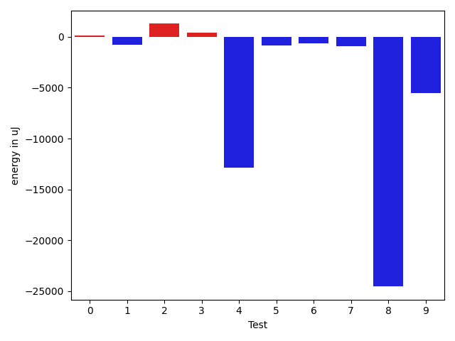
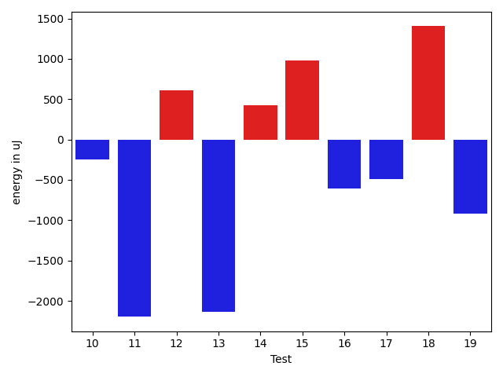
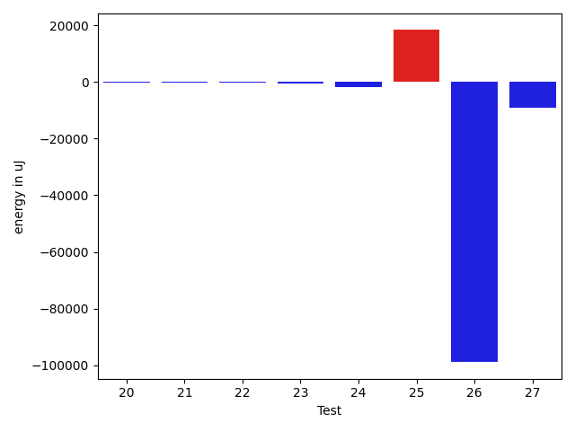

# gson c6a4f5

https://github.com/google/gson/commit/c6a4f5

## Delta Energy per test method

| ID | EnergyV1 | EnergyV2 | DeltaEnergy | σV1 | σV2 |
| --- | --- | --- | --- | --- | --- |
| 0 | 33874 | 33996 | 122 | 4854.054741272212 | 5574.179393246766 |
| 1 | 35217 | 34423 | -794 | 16993.611203920136 | 15202.020550341396 |
| 2 | 35034 | 36316 | 1282 | 14854.288388832983 | 17803.76236571528 |
| 3 | 33753 | 34180 | 427 | 19635.74373448277 | 11057.156794278715 |
| 4 | 140136 | 127258 | -12878 | 180799.83065504653 | 204241.7040439739 |
| 5 | 34912 | 34058 | -854 | 16810.080440797396 | 14574.475177379503 |
| 6 | 95520 | 94909 | -611 | 58482.257692929044 | 28744.634365992704 |
| 7 | 36315 | 35400 | -915 | 16736.905343256734 | 16622.95110423337 |
| 8 | 146362 | 121826 | -24536 | 128801.25604462663 | 125770.69289967365 |
| 9 | 93200 | 87647 | -5553 | 108817.61281029579 | 166490.07927043267 |
| 10 | 67199 | 66955 | -244 | 19664.292679603906 | 28911.6157408022 |
| 11 | 132141 | 129944 | -2197 | 35498.796277216396 | 85883.24697868068 |
| 12 | 34302 | 34912 | 610 | 14570.380666771021 | 14423.033395599503 |
| 13 | 36316 | 34180 | -2136 | 7059.839681363399 | 3778.7138874137363 |
| 14 | 36194 | 36621 | 427 | 3717.8043682268003 | 3375.2682075968846 |
| 15 | 37598 | 38574 | 976 | 50637.85815598702 | 54747.04422381086 |
| 16 | 36011 | 35401 | -610 | 3339.8949775144797 | 3575.252212275038 |
| 17 | 36194 | 35706 | -488 | 3064.3697055524635 | 3410.95786365062 |
| 18 | 35339 | 36743 | 1404 | 3750.245756921989 | 4739.026980298804 |
| 19 | 36376 | 35461 | -915 | 5273.966713015587 | 3142.229573620192 |
| 20 | 36926 | 35339 | -1587 | 2970.074032715304 | 4058.7788699996404 |
| 21 | 35766 | 35035 | -731 | 3767.247048101381 | 3270.788309398079 |
| 22 | 36316 | 35644 | -672 | 3289.2429334294698 | 3972.6647656005093 |
| 23 | 35767 | 34973 | -794 | 4775.425060013156 | 5947.4770267569465 |
| 24 | 36743 | 35949 | -794 | 3555.550307673904 | 3272.723604208094 |
| 25 | 71350 | 74218 | 2868 | 27644.347365033762 | 59865.652570589074 |
| 26 | 209289 | 191467 | -17822 | 193133.5788055927 | 103826.23284077841 |
| 27 | 76416 | 37293 | -39123 | 40112.58687205454 | 70175.07510178344 |

## Delta Duration per test method

| ID | DurationV1 | DurationsV2 | DeltaDuration |
| --- | --- | --- | --- |
| 0 | 1233604.78313253 | 1227936.4470588234 | -5668.336073706625 |
| 1 | 1192085.71875 | 1273628.5675675676 | 81542.84881756757 |
| 2 | 1646496.1616161617 | 1676030.7676767677 | 29534.606060605962 |
| 3 | 1411066.912087912 | 1348169.1145833333 | -62897.79750457872 |
| 4 | 6817751.126315789 | 6978045.602150538 | 160294.4758347487 |
| 5 | 1594504.8282828282 | 1583019.9393939395 | -11484.88888888876 |
| 6 | 3356054.4343434344 | 3124802.8282828284 | -231251.60606060596 |
| 7 | 1675571.202020202 | 1700825.5353535353 | 25254.333333333256 |
| 8 | 5245514.714285715 | 4793321.855670103 | -452192.8586156117 |
| 9 | 3341275.717171717 | 4040602.5353535353 | 699326.8181818184 |
| 10 | 2331665.9191919193 | 2359078.4646464647 | 27412.545454545412 |
| 11 | 4166554.767676768 | 4617036.636363637 | 450481.8686868688 |
| 12 | 1537342.3737373736 | 1582495.0404040404 | 45152.666666666744 |
| 13 | 956217.5 | 906689.7358490566 | -49527.764150943374 |
| 14 | 879661.4035087719 | 888239.9821428572 | 8578.57863408525 |
| 15 | 2398794.1139240507 | 2342712.1219512196 | -56081.99197283108 |
| 16 | 868881.1454545455 | 892694.2142857143 | 23813.068831168814 |
| 17 | 911870.4230769231 | 975722.08 | 63851.65692307684 |
| 18 | 586950.4074074074 | 555237.32 | -31713.087407407467 |
| 19 | 902778.4716981133 | 873593.05 | -29185.421698113205 |
| 20 | 658114.724137931 | 683809.8666666667 | 25695.142528735683 |
| 21 | 972204.0714285715 | 991342.5593220339 | 19138.487893462414 |
| 22 | 853432.0 | 896470.734375 | 43038.734375 |
| 23 | 926453.9272727272 | 996918.4727272728 | 70464.54545454553 |
| 24 | 649431.64 | 682507.3928571428 | 33075.75285714283 |
| 25 | 2413322.282828283 | 2840418.6666666665 | 427096.3838383835 |
| 26 | 9834414.131313132 | 6473546.989690722 | -3360867.14162241 |
| 27 | 2380965.3235294116 | 1970861.0 | -410104.3235294116 |

## Misc.

| ID | Test Class | Test Method |
| --- | --- | --- |
| 0 | com.google.gson.functional.ParameterizedTypesTest | testParameterizedTypeGenericArraysSerialization |
| 1 | com.google.gson.functional.ParameterizedTypesTest | testParameterizedTypesWithWriterSerialization |
| 2 | com.google.gson.functional.ParameterizedTypesTest | testVariableTypeArrayDeserialization |
| 3 | com.google.gson.functional.ParameterizedTypesTest | testParameterizedTypeWithReaderDeserialization |
| 4 | com.google.gson.functional.ParameterizedTypesTest | testParameterizedTypesSerialization |
| 5 | com.google.gson.functional.ParameterizedTypesTest | testVariableTypeDeserialization |
| 6 | com.google.gson.functional.ParameterizedTypesTest | testVariableTypeFieldsAndGenericArraysSerialization |
| 7 | com.google.gson.functional.ParameterizedTypesTest | testParameterizedTypeGenericArraysDeserialization |
| 8 | com.google.gson.functional.ParameterizedTypesTest | testParameterizedTypeDeserialization |
| 9 | com.google.gson.functional.ParameterizedTypesTest | testVariableTypeFieldsAndGenericArraysDeserialization |
| 10 | com.google.gson.functional.ParameterizedTypesTest | testTypesWithMultipleParametersDeserialization |
| 11 | com.google.gson.functional.ParameterizedTypesTest | testTypesWithMultipleParametersSerialization |
| 12 | com.google.gson.functional.ParameterizedTypesTest | testParameterizedTypeWithVariableTypeDeserialization |
| 13 | com.google.gson.TypeInfoFactoryTest | testParameterizedTypeVariableArrayField |
| 14 | com.google.gson.TypeInfoFactoryTest | testListTypeVariableWildcardField |
| 15 | com.google.gson.TypeInfoFactoryTest | testNestedParameterizedTypeVariableField |
| 16 | com.google.gson.TypeInfoFactoryTest | testListStringWildcardField |
| 17 | com.google.gson.TypeInfoFactoryTest | testArrayOfListStringWildcardField |
| 18 | com.google.gson.TypeInfoFactoryTest | testTypeVariableField |
| 19 | com.google.gson.TypeInfoFactoryTest | testArrayOfListTypeVariableWildcardField |
| 20 | com.google.gson.TypeInfoFactoryTest | testMutliDimensionalTypeVariableArrayField |
| 21 | com.google.gson.TypeInfoFactoryTest | testWildcardField |
| 22 | com.google.gson.TypeInfoFactoryTest | testParameterizedTypeVariableField |
| 23 | com.google.gson.TypeInfoFactoryTest | testArrayOfWildcardField |
| 24 | com.google.gson.TypeInfoFactoryTest | testTypeVariableArrayField |
| 25 | com.google.gson.functional.CollectionTest | testWildcardCollectionField |
| 26 | com.google.gson.functional.ExclusionStrategyFunctionalTest | testExclusionStrategySerialization |
| 27 | com.google.gson.functional.ExclusionStrategyFunctionalTest | testExclusionStrategyDeserialization |

| Test | IterationV1 | IterationV2 | DeltaIteration |
| --- | --- | --- | --- |
| 0 | 83 | 85 | 2 |
| 1 | 64 | 74 | 10 |
| 2 | 99 | 99 | 0 |
| 3 | 91 | 96 | 5 |
| 4 | 95 | 93 | -2 |
| 5 | 99 | 99 | 0 |
| 6 | 99 | 99 | 0 |
| 7 | 99 | 99 | 0 |
| 8 | 98 | 97 | -1 |
| 9 | 99 | 99 | 0 |
| 10 | 99 | 99 | 0 |
| 11 | 99 | 99 | 0 |
| 12 | 99 | 99 | 0 |
| 13 | 52 | 53 | 1 |
| 14 | 57 | 56 | -1 |
| 15 | 79 | 82 | 3 |
| 16 | 55 | 56 | 1 |
| 17 | 52 | 50 | -2 |
| 18 | 27 | 25 | -2 |
| 19 | 53 | 60 | 7 |
| 20 | 29 | 30 | 1 |
| 21 | 56 | 59 | 3 |
| 22 | 53 | 64 | 11 |
| 23 | 55 | 55 | 0 |
| 24 | 25 | 28 | 3 |
| 25 | 99 | 99 | 0 |
| 26 | 99 | 97 | -2 |
| 27 | 68 | 51 | -17 |

| Time Label | Time (s) |
| --- | --- |
| Selection | 25.117350339889526 |
| Injection | 10.4468674659729 |
| Total | 996.4335880279541 |

