# gson dea7ab

https://github.com/google/gson/commit/dea7ab

## Delta Energy per test method

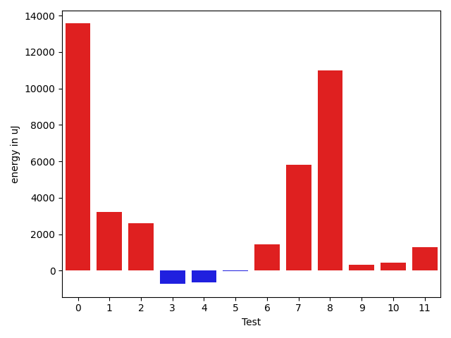

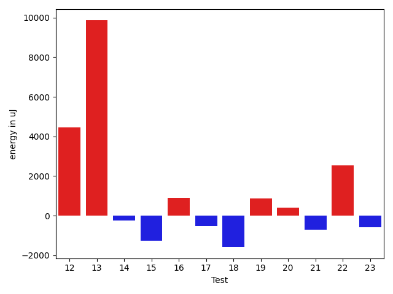

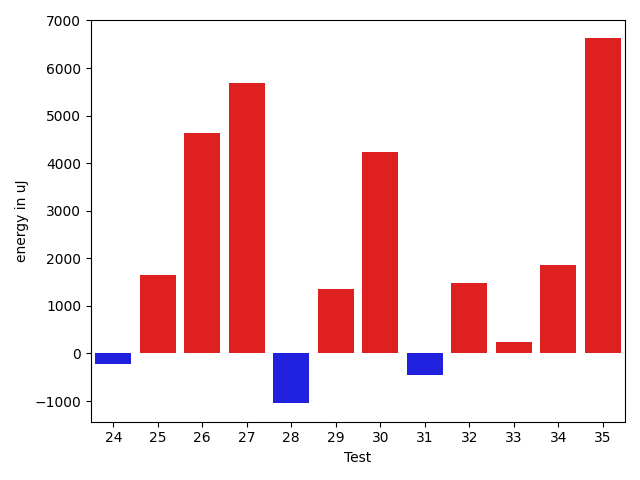

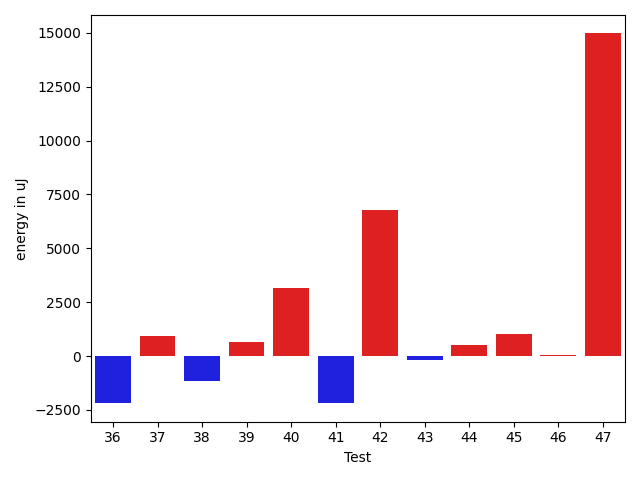

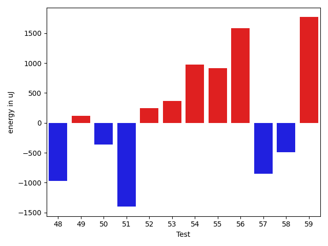

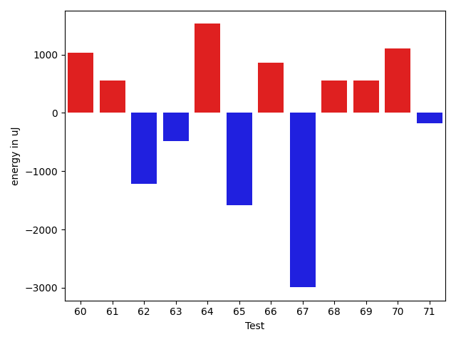

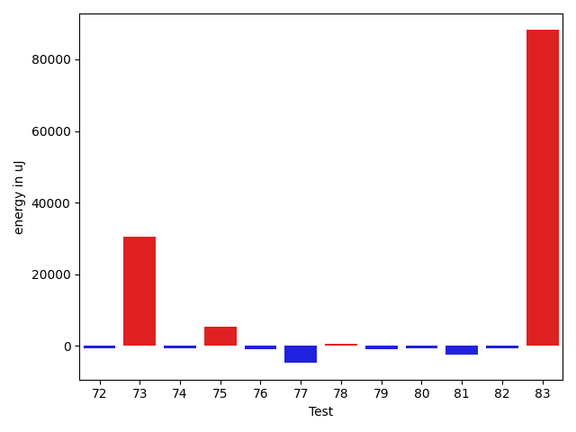

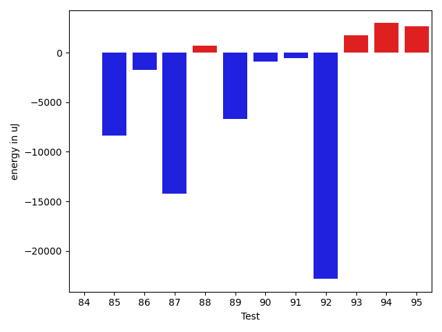

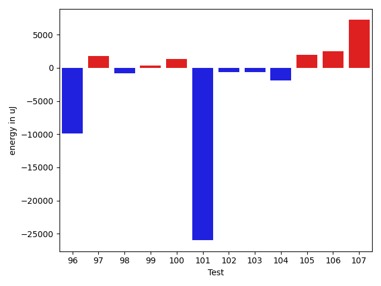

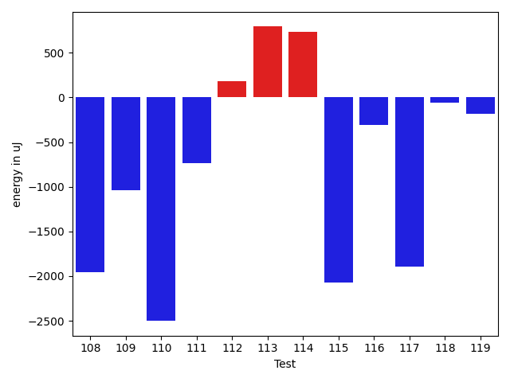

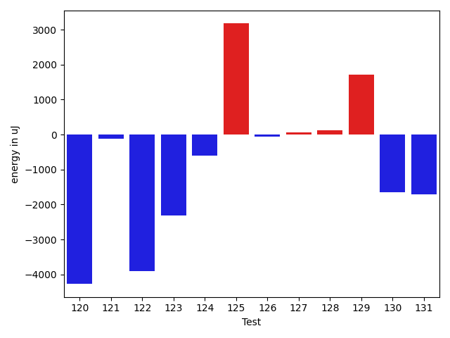

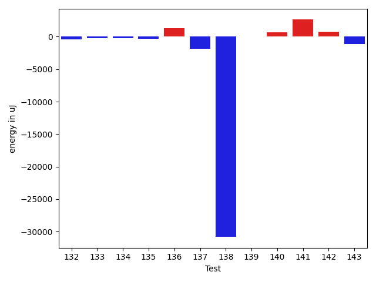

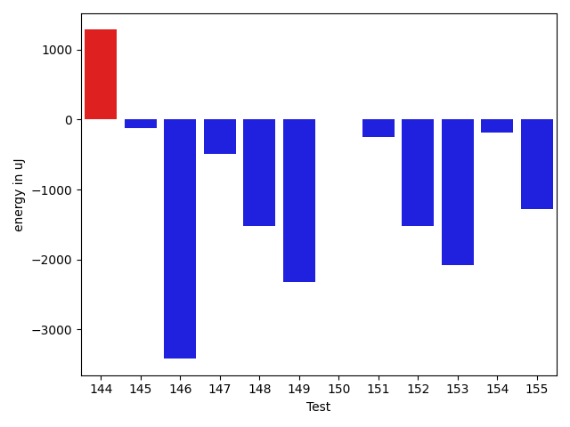

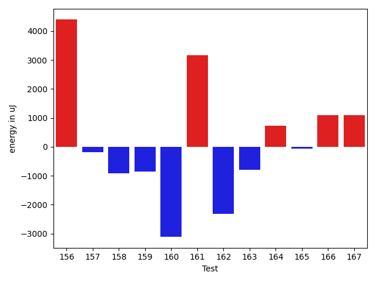

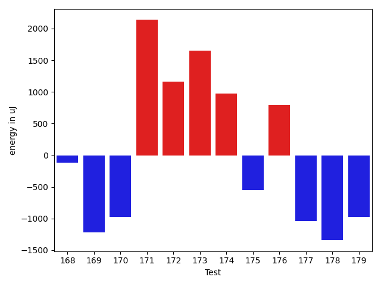

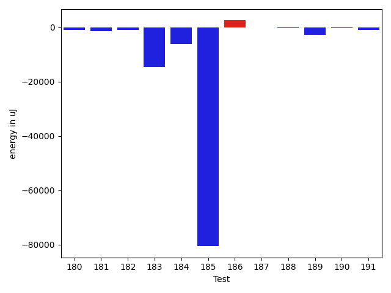

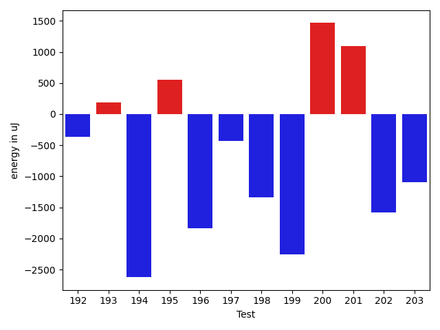

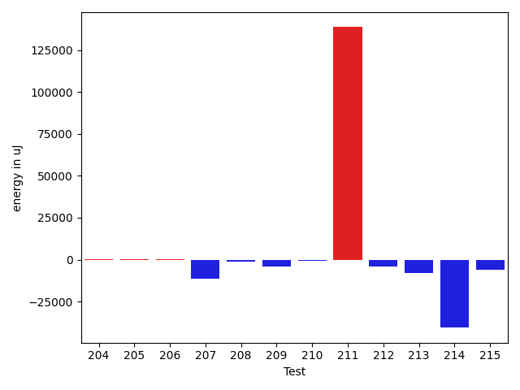

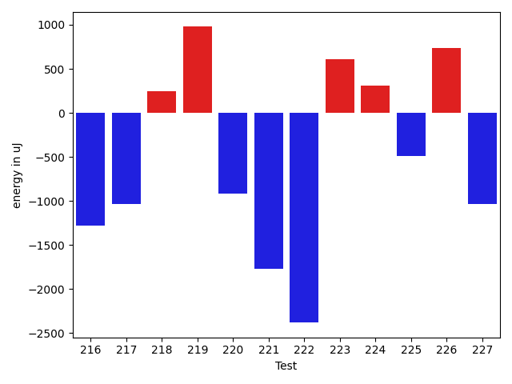

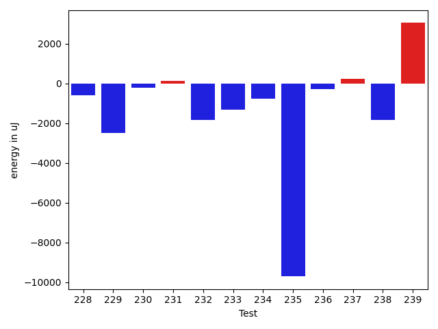

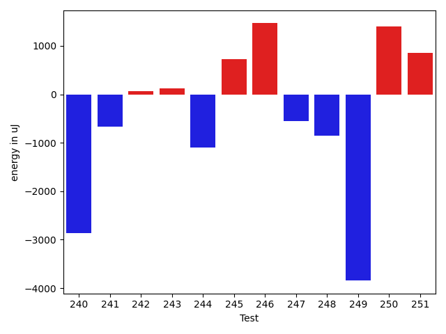

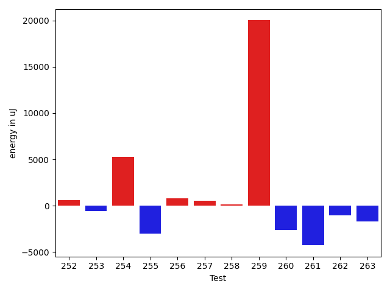

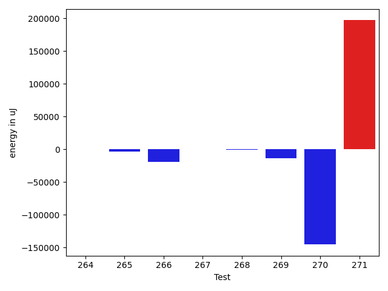

| ID | EnergyV1 | EnergyV2 | DeltaEnergy | σV1 | σV2 |
| --- | --- | --- | --- | --- | --- |
| 0 | 41137 | 42785 | 1648 | 27297.648591085413 | 74286.81312765543 |
| 1 | 37048 | 38025 | 977 | 4013.5537751415836 | 10780.463841481962 |
| 2 | 37415 | 38330 | 915 | 7424.129910501603 | 8733.639739944787 |
| 3 | 37292 | 36743 | -549 | 4532.617846550504 | 4079.1302381366936 |
| 4 | 37293 | 36011 | -1282 | 4599.192139783101 | 4742.732464830221 |
| 5 | 36438 | 37231 | 793 | 4323.02194442864 | 4234.660472549889 |
| 6 | 36926 | 37110 | 184 | 4371.106496341967 | 4480.253713853698 |
| 7 | 36987 | 38269 | 1282 | 4295.946749058108 | 14592.647157679292 |
| 8 | 38818 | 38758 | -60 | 23391.778844565903 | 40872.34345041882 |
| 9 | 36438 | 36377 | -61 | 4132.885501236341 | 3600.2271423541056 |
| 10 | 37536 | 38269 | 733 | 4251.282799344217 | 4210.5780483785375 |
| 11 | 34668 | 37292 | 2624 | 4945.028082170956 | 2812.4057947904025 |
| 12 | 38574 | 37903 | -671 | 21015.09681826275 | 29210.747929951973 |
| 13 | 39184 | 39673 | 489 | 60933.06207155849 | 85852.36891052328 |
| 14 | 36865 | 36072 | -793 | 4284.023653840705 | 3829.3777637464877 |
| 15 | 37232 | 37170 | -62 | 4147.1134239949715 | 4731.202304038111 |
| 16 | 36010 | 36865 | 855 | 4413.328101285922 | 3766.450601942157 |
| 17 | 36560 | 36072 | -488 | 4087.0000413016883 | 3970.7478547138053 |
| 18 | 37231 | 36621 | -610 | 37531.699164415186 | 31546.47079365848 |
| 19 | 36927 | 37720 | 793 | 4025.5704029832846 | 4018.8128548696286 |
| 20 | 36011 | 37476 | 1465 | 7126.6529697684055 | 5864.551197988345 |
| 21 | 35766 | 37719 | 1953 | 15744.858640212062 | 4060.1359967840804 |
| 22 | 36499 | 36010 | -489 | 3891.1628660948872 | 23465.802136296046 |
| 23 | 35889 | 35461 | -428 | 4199.8877624902225 | 3893.4006456917823 |
| 24 | 36621 | 36743 | 122 | 9191.953261607689 | 8973.465261347847 |
| 25 | 37231 | 37048 | -183 | 4699.609494723212 | 9297.698872188652 |
| 26 | 74462 | 73426 | -1036 | 62585.22888277519 | 71714.15297989307 |
| 27 | 65673 | 69702 | 4029 | 22387.656740644037 | 24933.010732597395 |
| 28 | 37659 | 36011 | -1648 | 11849.386314374424 | 10939.588352514233 |
| 29 | 43212 | 61401 | 18189 | 28917.347942657725 | 26866.252687128286 |
| 30 | 72571 | 73974 | 1403 | 27250.26859231728 | 30599.769789794995 |
| 31 | 36560 | 36316 | -244 | 8298.251603180413 | 6329.455710428318 |
| 32 | 37231 | 38147 | 916 | 13507.731406116865 | 15022.716026891065 |
| 33 | 36255 | 35644 | -611 | 3819.9664457639424 | 5802.882998623553 |
| 34 | 36743 | 36804 | 61 | 8732.526313797409 | 12172.91388407051 |
| 35 | 36926 | 36377 | -549 | 51944.42983408971 | 66008.78598928967 |
| 36 | 38513 | 35888 | -2625 | 3328.3410895164075 | 3549.4502114841666 |
| 37 | 35095 | 36437 | 1342 | 3866.6536185516616 | 3969.295270179765 |
| 38 | 36560 | 35034 | -1526 | 6976.228803492448 | 6123.703368882219 |
| 39 | 36866 | 37475 | 609 | 21816.522792165622 | 21082.87908096234 |
| 40 | 77270 | 79101 | 1831 | 23805.90922059054 | 34621.58979917626 |
| 41 | 37293 | 37842 | 549 | 24755.36102743987 | 21157.276944424008 |
| 42 | 38452 | 38147 | -305 | 29392.93069304167 | 40953.39638752162 |
| 43 | 36560 | 36804 | 244 | 5531.10080188608 | 7154.675972868003 |
| 44 | 35889 | 37170 | 1281 | 3573.1334286666124 | 3857.1472175901276 |
| 45 | 35400 | 36255 | 855 | 3915.7576432530946 | 4231.658390157019 |
| 46 | 36743 | 36376 | -367 | 5224.906242513406 | 3753.6182731020067 |
| 47 | 39612 | 38513 | -1099 | 237914.92449124245 | 285501.57248922175 |
| 48 | 36865 | 35889 | -976 | 4220.877158885082 | 4115.32581973016 |
| 49 | 36133 | 36255 | 122 | 3769.016110392737 | 4380.299756577852 |
| 50 | 36011 | 35645 | -366 | 4045.1696005853705 | 4681.8218675177095 |
| 51 | 35461 | 34058 | -1403 | 3997.140818838334 | 4833.696555483791 |
| 52 | 35645 | 35889 | 244 | 4135.15705766802 | 4578.558899559413 |
| 53 | 37597 | 37964 | 367 | 4077.8938147720037 | 4408.659559118227 |
| 54 | 36132 | 37109 | 977 | 5070.872330827859 | 3702.5226198991754 |
| 55 | 38269 | 39185 | 916 | 21796.156283582204 | 32038.34432360281 |
| 56 | 43518 | 45104 | 1586 | 49651.849337404296 | 68607.36331823174 |
| 57 | 36743 | 35888 | -855 | 4036.718495645709 | 3835.9506081748136 |
| 58 | 36315 | 35827 | -488 | 5266.666330354916 | 4095.5014693435783 |
| 59 | 35217 | 36987 | 1770 | 4004.7117249559924 | 3370.172133567741 |
| 60 | 35767 | 36804 | 1037 | 3165.541211236177 | 4140.796541729623 |
| 61 | 35644 | 36194 | 550 | 2960.7104932769093 | 4412.455153808932 |
| 62 | 36438 | 35218 | -1220 | 4073.228508799618 | 3056.8868711436676 |
| 63 | 35767 | 35278 | -489 | 5125.953272586575 | 3814.366639545798 |
| 64 | 35217 | 36743 | 1526 | 4756.6785238669445 | 4109.724676028848 |
| 65 | 38024 | 36438 | -1586 | 49354.79064951649 | 3951.713766682373 |
| 66 | 34851 | 35706 | 855 | 6511.660666834536 | 4003.711281655997 |
| 67 | 38086 | 35095 | -2991 | 3989.8122476660856 | 4299.632001904413 |
| 68 | 35034 | 35583 | 549 | 4392.5269993478705 | 4356.664878691067 |
| 69 | 37475 | 38024 | 549 | 3050.303955710352 | 4757.575508567697 |
| 70 | 34912 | 36011 | 1099 | 4616.57474036036 | 4499.701769006475 |
| 71 | 36072 | 35888 | -184 | 8985.135415631235 | 11404.157005061521 |
| 72 | 36682 | 36866 | 184 | 9798.815905129679 | 10078.723260126999 |
| 73 | 37720 | 39307 | 1587 | 62985.12619621344 | 102344.51385443477 |
| 74 | 38391 | 38452 | 61 | 3793.89077099252 | 3879.5304496807344 |
| 75 | 38208 | 37354 | -854 | 4070.441362910033 | 29834.62694981077 |
| 76 | 37414 | 35644 | -1770 | 4209.981815002657 | 3725.0965589274774 |
| 77 | 125061 | 123535 | -1526 | 91137.74356214456 | 85291.07290132012 |
| 78 | 36194 | 37048 | 854 | 4175.656900861341 | 4324.698596434207 |
| 79 | 37598 | 36072 | -1526 | 3935.581359610964 | 3970.5246991976733 |
| 80 | 36316 | 38330 | 2014 | 4045.522290343323 | 4433.398826982624 |
| 81 | 40405 | 36621 | -3784 | 9776.460502016189 | 8800.72724269989 |
| 82 | 37292 | 37354 | 62 | 4458.503750442331 | 4657.113995102217 |
| 83 | 38269 | 39733 | 1464 | 212538.3879901744 | 469912.149139848 |
| 84 | 36926 | 37231 | 305 | 4918.127093128712 | 4826.970235456113 |
| 85 | 55969 | 44312 | -11657 | 50023.9016881145 | 40522.79820332932 |
| 86 | 38696 | 38330 | -366 | 19111.79588347679 | 15525.850724135122 |
| 87 | 40344 | 40466 | 122 | 93738.85607001802 | 65418.97050979168 |
| 88 | 36438 | 37110 | 672 | 4346.451435366556 | 3347.301568417545 |
| 89 | 37598 | 36743 | -855 | 28963.693096631192 | 3660.270346136023 |
| 90 | 38208 | 37781 | -427 | 7089.110728199036 | 3411.5072097500943 |
| 91 | 38697 | 39917 | 1220 | 17024.4509545744 | 16497.133028119188 |
| 92 | 40466 | 40893 | 427 | 62386.896010072705 | 3648.591313231403 |
| 93 | 36437 | 39001 | 2564 | 3534.989426419542 | 5643.3199959234 |
| 94 | 37048 | 40344 | 3296 | 5249.449600400299 | 2409.884454353223 |
| 95 | 37110 | 40527 | 3417 | 5318.412826594306 | 3914.6298397450328 |
| 96 | 38819 | 38391 | -428 | 39228.723771135075 | 4615.185509158935 |
| 97 | 35461 | 38025 | 2564 | 4432.54365260496 | 3763.6323624923834 |
| 98 | 38636 | 38697 | 61 | 4256.665759459522 | 3505.1164854236854 |
| 99 | 39551 | 38757 | -794 | 358972.65061990474 | 386009.89936794067 |
| 100 | 35522 | 37353 | 1831 | 4187.775106233925 | 3826.7463403758875 |
| 101 | 40100 | 38513 | -1587 | 429887.1728766766 | 393206.47499059286 |
| 102 | 37293 | 37170 | -123 | 3872.128026754353 | 4411.086267416877 |
| 103 | 38452 | 38452 | 0 | 10584.592408169849 | 9974.92209691415 |
| 104 | 38147 | 36682 | -1465 | 4439.23681178132 | 3097.566897723285 |
| 105 | 67322 | 66467 | -855 | 23338.863864167768 | 24567.21273270815 |
| 106 | 34058 | 38330 | 4272 | 2921.5930076722425 | 5956.689275297896 |
| 107 | 63172 | 68237 | 5065 | 21838.254973207986 | 26749.500814812385 |
| 108 | 37842 | 35889 | -1953 | 4466.1020936494115 | 3030.393548079429 |
| 109 | 37353 | 36316 | -1037 | 3715.4371607324315 | 8818.967975798714 |
| 110 | 36560 | 34058 | -2502 | 3736.971838262302 | 4750.407429855905 |
| 111 | 37171 | 36437 | -734 | 3685.042568676045 | 4529.111877591126 |
| 112 | 37536 | 37720 | 184 | 4250.321259616616 | 26960.985749702537 |
| 113 | 36316 | 37109 | 793 | 9108.670457058866 | 12196.550264273255 |
| 114 | 36865 | 37598 | 733 | 3455.1031859425284 | 4239.2567713976305 |
| 115 | 36804 | 34729 | -2075 | 4123.392563359712 | 4393.198288428218 |
| 116 | 38024 | 37720 | -304 | 3649.3723143232114 | 3697.6819944342465 |
| 117 | 38879 | 36988 | -1891 | 28666.995928610795 | 3596.108173882411 |
| 118 | 36926 | 36865 | -61 | 3492.316967614664 | 3911.637160658436 |
| 119 | 35461 | 35278 | -183 | 4644.39843427828 | 4867.968107521338 |
| 120 | 38818 | 34545 | -4273 | 3445.101026947189 | 3573.7095869306763 |
| 121 | 38574 | 38452 | -122 | 3820.9876007254934 | 4029.7817387821665 |
| 122 | 39306 | 35400 | -3906 | 5662.68110414115 | 38121.828451557776 |
| 123 | 38940 | 36621 | -2319 | 4535.253148662043 | 4907.371410136469 |
| 124 | 36316 | 35705 | -611 | 3839.368001734446 | 4670.009102074252 |
| 125 | 154114 | 157287 | 3173 | 261477.41193657403 | 236456.09045203 |
| 126 | 36194 | 36133 | -61 | 4480.60274924477 | 3334.908528001691 |
| 127 | 35828 | 35888 | 60 | 4124.9069973787555 | 4663.867334645094 |
| 128 | 36804 | 36926 | 122 | 23177.700230657527 | 30776.404519913198 |
| 129 | 35888 | 37598 | 1710 | 6970.1447239215995 | 4582.422705120039 |
| 130 | 36072 | 34423 | -1649 | 4595.042945784076 | 4351.717694089686 |
| 131 | 39612 | 37903 | -1709 | 36828.011491422236 | 31014.787632114923 |
| 132 | 36987 | 36560 | -427 | 6706.865101273947 | 3698.3645532854966 |
| 133 | 36377 | 36194 | -183 | 32507.543761926918 | 3619.6507320765386 |
| 134 | 34973 | 34790 | -183 | 4440.1461182060675 | 3513.5611320384664 |
| 135 | 80688 | 80383 | -305 | 188587.50473710624 | 270055.7605606929 |
| 136 | 37903 | 39246 | 1343 | 21027.188997495337 | 34022.61709931888 |
| 137 | 37170 | 35340 | -1830 | 25013.198864873048 | 5427.215487057853 |
| 138 | 70129 | 39307 | -30822 | 48627.54486694003 | 46783.71231251321 |
| 139 | 35095 | 35156 | 61 | 3885.62909379491 | 4593.928716605694 |
| 140 | 35157 | 35827 | 670 | 4063.512573438021 | 4382.256215943025 |
| 141 | 72266 | 74890 | 2624 | 22521.751741150154 | 25746.912386375487 |
| 142 | 35034 | 35828 | 794 | 4178.2280666495 | 4489.496886015271 |
| 143 | 36682 | 35523 | -1159 | 3337.1786984254995 | 3902.7214327437237 |
| 144 | 35034 | 36316 | 1282 | 3449.0566472625956 | 4363.0469259454885 |
| 145 | 35828 | 35705 | -123 | 11876.498194377775 | 3084.294952524266 |
| 146 | 67932 | 64514 | -3418 | 21112.838552518697 | 30909.36987299676 |
| 147 | 37781 | 37293 | -488 | 13837.950168655623 | 15169.524776320724 |
| 148 | 38940 | 37415 | -1525 | 48454.500257464395 | 51906.411735336 |
| 149 | 40405 | 38086 | -2319 | 24117.373566257167 | 21263.062889310717 |
| 150 | 36682 | 36682 | 0 | 4239.450066476913 | 4344.199619208184 |
| 151 | 35828 | 35583 | -245 | 3639.73421951269 | 23037.4479104424 |
| 152 | 39062 | 37537 | -1525 | 33996.41713119728 | 32899.98371928 |
| 153 | 41016 | 38940 | -2076 | 46820.02347112541 | 43869.7710555027 |
| 154 | 36560 | 36377 | -183 | 4272.870411732019 | 4065.194648012613 |
| 155 | 37292 | 36011 | -1281 | 5209.180665115586 | 3932.0358884302645 |
| 156 | 37171 | 41565 | 4394 | 28196.788534606116 | 20342.60404247757 |
| 157 | 35034 | 34851 | -183 | 30917.422100092634 | 4137.310487594523 |
| 158 | 37170 | 36255 | -915 | 4486.383672757344 | 4204.252910755965 |
| 159 | 36560 | 35705 | -855 | 5526.406174594591 | 4151.135164432595 |
| 160 | 40528 | 37414 | -3114 | 6029.293207241533 | 7044.753330271757 |
| 161 | 34851 | 38025 | 3174 | 4271.889760348162 | 3871.3223867591064 |
| 162 | 40832 | 38513 | -2319 | 332137.9810567402 | 373362.83715981594 |
| 163 | 41260 | 40466 | -794 | 18210.186835486707 | 13924.555078669078 |
| 164 | 39550 | 40283 | 733 | 455117.3569087425 | 490816.18933984835 |
| 165 | 37963 | 37903 | -60 | 5450.160945635765 | 4593.593264803598 |
| 166 | 38758 | 39856 | 1098 | 63873.624565863654 | 62286.5298338532 |
| 167 | 36316 | 37415 | 1099 | 4872.735439839379 | 3772.7857859353244 |
| 168 | 38635 | 38513 | -122 | 4516.6813548497785 | 4319.220516306238 |
| 169 | 38513 | 37293 | -1220 | 22694.604235559713 | 26888.3686625818 |
| 170 | 37414 | 36438 | -976 | 23059.422278837348 | 17280.461659057215 |
| 171 | 38879 | 41015 | 2136 | 354199.1816838994 | 489100.1798858485 |
| 172 | 35706 | 36865 | 1159 | 4536.810554444654 | 4449.456745210588 |
| 173 | 38513 | 40161 | 1648 | 26352.527016316508 | 32917.50399352267 |
| 174 | 37537 | 38513 | 976 | 19986.511591775055 | 28983.206652567493 |
| 175 | 37719 | 37170 | -549 | 5495.315454707361 | 4542.048033529466 |
| 176 | 37292 | 38086 | 794 | 4363.421177615553 | 3923.785544157554 |
| 177 | 37964 | 36926 | -1038 | 4402.31117185934 | 4376.41350413597 |
| 178 | 37720 | 36377 | -1343 | 4838.705151783733 | 3834.7423678129926 |
| 179 | 35706 | 34729 | -977 | 3970.267265886629 | 4112.790181819037 |
| 180 | 36987 | 35706 | -1281 | 3368.8759596984137 | 3735.6123376482847 |
| 181 | 38758 | 38696 | -62 | 87817.05422016521 | 101617.13875160628 |
| 182 | 39673 | 39307 | -366 | 3331.5043142033533 | 4801.926837431077 |
| 183 | 40466 | 38513 | -1953 | 68944.07400848324 | 38970.5747230273 |
| 184 | 250182 | 241210 | -8972 | 124317.24879164172 | 126555.07724054561 |
| 185 | 43396 | 40710 | -2686 | 431969.2656353993 | 237094.68403798097 |
| 186 | 39611 | 36560 | -3051 | 8583.550553286701 | 29899.163685111114 |
| 187 | 38574 | 38208 | -366 | 4483.04340574322 | 4184.084729434147 |
| 188 | 37110 | 36621 | -489 | 3756.1950585277564 | 3556.2929312141932 |
| 189 | 115051 | 112914 | -2137 | 22923.63514539426 | 23997.77184518849 |
| 190 | 37109 | 36682 | -427 | 12703.104795518091 | 10180.281063855535 |
| 191 | 35156 | 33814 | -1342 | 3923.7889386991055 | 4105.056642550594 |
| 192 | 36560 | 36194 | -366 | 7084.207689648246 | 3944.53664976985 |
| 193 | 35767 | 35950 | 183 | 8344.21649906294 | 10355.94432970557 |
| 194 | 36499 | 33875 | -2624 | 3350.2055093772574 | 4114.0880064633575 |
| 195 | 37292 | 37842 | 550 | 55662.46202236763 | 44468.73230937448 |
| 196 | 35400 | 33569 | -1831 | 4340.04046371306 | 4076.3146781309397 |
| 197 | 36560 | 36133 | -427 | 3105.8973205983125 | 3336.209884817734 |
| 198 | 36072 | 34729 | -1343 | 4156.910579208201 | 4339.74040325879 |
| 199 | 36743 | 34484 | -2259 | 3539.036168764955 | 2592.3187594121214 |
| 200 | 35034 | 36499 | 1465 | 4659.790008690217 | 4612.58341635717 |
| 201 | 34302 | 35400 | 1098 | 3640.8043307154276 | 4265.193171632082 |
| 202 | 36682 | 35095 | -1587 | 4013.5371942575266 | 4248.969623834222 |
| 203 | 37476 | 36377 | -1099 | 4117.290558801989 | 3961.354485508914 |
| 204 | 36987 | 36255 | -732 | 4110.064263403612 | 3355.789316613902 |
| 205 | 36133 | 35828 | -305 | 3137.7865788482177 | 2997.0235631751625 |
| 206 | 35950 | 36194 | 244 | 3498.1353898263505 | 4342.64211780421 |
| 207 | 36499 | 35583 | -916 | 42414.36029344355 | 3754.261246393601 |
| 208 | 37292 | 34668 | -2624 | 3772.9358100379422 | 3154.026521298157 |
| 209 | 32898 | 30213 | -2685 | 1176.4595987538203 | 1190.5 |
| 210 | 31372 | 30213 | -1159 | 885.0 | 550.0 |
| 211 | 37903 | 39734 | 1831 | 49755.21350138917 | 510395.07461233216 |
| 212 | 38452 | 36804 | -1648 | 12525.19913556801 | 7621.671040478388 |
| 213 | 39063 | 38330 | -733 | 53938.10012833384 | 43193.736336269394 |
| 214 | 41259 | 39063 | -2196 | 152870.00914709416 | 99800.43650111303 |
| 215 | 41442 | 40589 | -853 | 28046.136419204748 | 20067.517600697924 |
| 216 | 36743 | 35461 | -1282 | 2422.6807002802093 | 4459.284725488582 |
| 217 | 37293 | 36255 | -1038 | 4148.032052639205 | 5426.8123565258065 |
| 218 | 36255 | 36499 | 244 | 3590.4062465768116 | 4743.68918981096 |
| 219 | 35095 | 36072 | 977 | 3491.5436026045686 | 2087.1442182212327 |
| 220 | 34851 | 33936 | -915 | 4212.890981484686 | 4000.215869375051 |
| 221 | 38330 | 36560 | -1770 | 4678.938172990393 | 2653.0602660908785 |
| 222 | 36988 | 34607 | -2381 | 3796.9718945112477 | 4326.620144573883 |
| 223 | 37231 | 37842 | 611 | 3304.1954367705007 | 3122.7294273421912 |
| 224 | 35583 | 35889 | 306 | 4418.8127548665025 | 3562.1655432251764 |
| 225 | 38025 | 37536 | -489 | 7931.422188762274 | 8650.763077505317 |
| 226 | 36987 | 37720 | 733 | 3574.854863774494 | 3725.0750908401783 |
| 227 | 36805 | 35766 | -1039 | 3694.3800526224 | 25395.997765680775 |
| 228 | 36072 | 33692 | -2380 | 3903.5936137373565 | 4622.851678550078 |
| 229 | 38452 | 35461 | -2991 | 3435.3547698981147 | 3647.4725532161347 |
| 230 | 34607 | 35034 | 427 | 3990.654212655201 | 3704.111465374543 |
| 231 | 38086 | 38086 | 0 | 17246.571347045556 | 17218.18375308504 |
| 232 | 37048 | 35705 | -1343 | 2739.6158641921556 | 3012.6221416512467 |
| 233 | 35645 | 35950 | 305 | 3982.9303937605982 | 3702.1906676717663 |
| 234 | 37415 | 37354 | -61 | 3732.8379094494667 | 3242.005148335816 |
| 235 | 40772 | 39185 | -1587 | 25176.401529534185 | 16857.40604752231 |
| 236 | 35889 | 35462 | -427 | 4548.176521764541 | 4948.124120226937 |
| 237 | 36438 | 37415 | 977 | 4308.765541880639 | 4563.633254481013 |
| 238 | 38391 | 35583 | -2808 | 3485.1509007531376 | 3658.4576969293503 |
| 239 | 35522 | 40710 | 5188 | 5752.036543265501 | 4492.324057767873 |
| 240 | 40589 | 37720 | -2869 | 2907.1851403032456 | 3109.3065993704913 |
| 241 | 37476 | 36804 | -672 | 55934.49769858838 | 4266.048181847428 |
| 242 | 36133 | 36193 | 60 | 3956.0046233854323 | 3562.5339727882224 |
| 243 | 39245 | 39368 | 123 | 39518.79115326699 | 25508.272247062785 |
| 244 | 65064 | 63965 | -1099 | 23690.806141254187 | 20876.40989725837 |
| 245 | 38513 | 39245 | 732 | 11384.589206545212 | 17431.13617377077 |
| 246 | 37475 | 38941 | 1466 | 4447.572794952322 | 4669.088078544579 |
| 247 | 38086 | 37536 | -550 | 26846.82904704016 | 29031.936386434092 |
| 248 | 35889 | 35035 | -854 | 2707.1553990435496 | 4572.494168029814 |
| 249 | 39001 | 35156 | -3845 | 4356.85833942805 | 3311.3837336383954 |
| 250 | 37293 | 38696 | 1403 | 22450.522216369292 | 27723.22026689907 |
| 251 | 34302 | 35157 | 855 | 4479.461273010281 | 3295.0833446111624 |
| 252 | 36255 | 36865 | 610 | 3448.9543121792726 | 3415.455434157307 |
| 253 | 38513 | 37903 | -610 | 21277.4338801626 | 14237.640620084028 |
| 254 | 35461 | 40710 | 5249 | 4030.93917923189 | 4842.24432542833 |
| 255 | 38330 | 35339 | -2991 | 2146.2031217943936 | 3817.2466074675112 |
| 256 | 39368 | 40161 | 793 | 46768.1989142579 | 31697.890755204655 |
| 257 | 40161 | 40710 | 549 | 85470.85670413845 | 95132.10537473523 |
| 258 | 39490 | 39611 | 121 | 10396.720916228778 | 10913.090136693512 |
| 259 | 45471 | 65491 | 20020 | 101204.06105808522 | 87496.19858921754 |
| 260 | 38696 | 36071 | -2625 | 712477.8284759945 | 642536.7787710029 |
| 261 | 85022 | 80749 | -4273 | 117805.15438132956 | 100782.61299284585 |
| 262 | 38941 | 37903 | -1038 | 3718.8212129761814 | 24293.85295448261 |
| 263 | 39062 | 37353 | -1709 | 4524.973331427994 | 8917.064533942452 |
| 264 | 40222 | 38574 | -1648 | 25031.40388218218 | 24838.18674314814 |
| 265 | 38452 | 38452 | 0 | 35112.62691079212 | 33597.15741393856 |
| 266 | 41016 | 39184 | -1832 | 86001.08407558783 | 53018.75205520779 |
| 267 | 37109 | 35950 | -1159 | 4642.470081262601 | 3172.9203996989568 |
| 268 | 37170 | 37048 | -122 | 7905.9910779456495 | 4638.0592353590555 |
| 269 | 43213 | 38025 | -5188 | 93256.8331084094 | 109854.27619519584 |
| 270 | 39794 | 37048 | -2746 | 515104.3834423421 | 4573.284021334769 |
| 271 | 38147 | 42480 | 4333 | 3401.4880836761727 | 562811.9708064388 |

## Delta Duration per test method

| ID | DurationV1 | DurationsV2 | DeltaDuration |
| --- | --- | --- | --- |
| 0 | 1728070.1515151516 | 2212993.404040404 | 484923.2525252525 |
| 1 | 1006760.8108108108 | 1117702.2 | 110941.38918918918 |
| 2 | 807133.5 | 974853.7857142857 | 167720.28571428568 |
| 3 | 741915.9607843137 | 816620.7321428572 | 74704.77135854342 |
| 4 | 667617.9736842106 | 759642.2045454546 | 92024.23086124402 |
| 5 | 808292.7462686567 | 888482.5862068966 | 80189.8399382399 |
| 6 | 771147.7173913043 | 818404.4426229508 | 47256.725231646444 |
| 7 | 717988.8974358974 | 872087.3913043478 | 154098.4938684504 |
| 8 | 1160820.0175438595 | 1583719.8769230768 | 422899.85937921726 |
| 9 | 793594.1463414634 | 750755.2 | -42838.94634146348 |
| 10 | 723608.2 | 693757.7804878049 | -29850.419512195047 |
| 11 | 494679.0 | 558094.2105263158 | 63415.210526315845 |
| 12 | 1471480.7634408602 | 1494170.3820224719 | 22689.618581611663 |
| 13 | 1323587.98 | 1689746.84375 | 366158.86375 |
| 14 | 794533.3958333334 | 758018.918367347 | -36514.47746598639 |
| 15 | 342264.53846153844 | 413687.4090909091 | 71422.87062937068 |
| 16 | 737545.56 | 709945.4117647059 | -27600.148235294153 |
| 17 | 661962.76 | 625317.0 | -36645.76000000001 |
| 18 | 1229212.8 | 1186495.7857142857 | -42717.014285714366 |
| 19 | 688059.6 | 726843.5 | 38783.90000000002 |
| 20 | 961591.0645161291 | 948274.625 | -13316.439516129089 |
| 21 | 773402.2083333334 | 692887.5869565217 | -80514.62137681164 |
| 22 | 883450.8529411765 | 993818.7142857143 | 110367.86134453781 |
| 23 | 760288.7735849057 | 785425.8070175438 | 25137.033432638156 |
| 24 | 1196594.4444444445 | 1202550.4831460675 | 5956.03870162298 |
| 25 | 1123535.3522727273 | 1192690.469879518 | 69155.11760679074 |
| 26 | 2462709.292929293 | 2655323.9696969697 | 192614.6767676766 |
| 27 | 2098262.202020202 | 2080591.292929293 | -17670.909090908943 |
| 28 | 1223859.088888889 | 1246778.7311827957 | 22919.64229390677 |
| 29 | 1839897.01010101 | 1809557.303030303 | -30339.70707070711 |
| 30 | 2278093.494949495 | 2339810.02020202 | 61716.52525252523 |
| 31 | 1146556.7790697673 | 1177675.719512195 | 31118.94044242776 |
| 32 | 1400928.693877551 | 1481253.0 | 80324.306122449 |
| 33 | 928718.3174603175 | 960809.9285714285 | 32091.611111111008 |
| 34 | 1116093.253012048 | 1135584.0714285714 | 19490.81841652328 |
| 35 | 1422137.6046511629 | 1669441.3924050634 | 247303.7877539005 |
| 36 | 475492.8214285714 | 504785.8965517241 | 29293.075123152696 |
| 37 | 752119.5081967213 | 807690.0869565217 | 55570.57875980041 |
| 38 | 875191.2545454545 | 864237.051724138 | -10954.202821316547 |
| 39 | 1067516.4137931035 | 1145711.9454545456 | 78195.53166144202 |
| 40 | 2601906.797979798 | 2667241.01010101 | 65334.212121211924 |
| 41 | 1222189.1 | 1118135.8333333333 | -104053.26666666684 |
| 42 | 982541.4 | 1211425.9795918367 | 228884.57959183666 |
| 43 | 909383.3015873015 | 893481.6714285715 | -15901.630158730084 |
| 44 | 628350.6304347826 | 646408.2142857143 | 18057.583850931725 |
| 45 | 890650.1940298508 | 839760.9344262296 | -50889.259603621205 |
| 46 | 821967.8958333334 | 819138.4363636364 | -2829.4594696969725 |
| 47 | 2497052.38 | 2919198.8360655736 | 422146.45606557373 |
| 48 | 838247.425925926 | 800343.5185185185 | -37903.907407407416 |
| 49 | 772262.32 | 742022.4444444445 | -30239.875555555453 |
| 50 | 864705.45 | 667444.224489796 | -197261.22551020398 |
| 51 | 491976.90476190473 | 428837.0 | -63139.904761904734 |
| 52 | 564376.4285714285 | 534307.1428571428 | -30069.28571428568 |
| 53 | 733973.304347826 | 738139.8275862068 | 4166.523238380789 |
| 54 | 440311.4666666667 | 435094.76470588235 | -5216.701960784325 |
| 55 | 1232670.3333333333 | 1396375.365079365 | 163705.03174603172 |
| 56 | 1852956.4536082475 | 2141405.232323232 | 288448.77871498466 |
| 57 | 644381.1395348837 | 712617.0212765958 | 68235.8817417121 |
| 58 | 806388.5882352941 | 919392.6785714285 | 113004.09033613442 |
| 59 | 693760.6666666666 | 624226.5277777778 | -69534.13888888888 |
| 60 | 666916.8823529412 | 689388.304347826 | 22471.421994884848 |
| 61 | 411444.25 | 366181.9375 | -45262.3125 |
| 62 | 575780.6285714286 | 676740.5952380953 | 100959.96666666667 |
| 63 | 481061.3043478261 | 591981.1724137932 | 110919.86806596705 |
| 64 | 657090.5609756098 | 657129.25 | 38.689024390187114 |
| 65 | 815344.04 | 524105.96153846156 | -291238.0784615385 |
| 66 | 643528.2 | 774183.9090909091 | 130655.7090909091 |
| 67 | 386447.4705882353 | 406066.0 | 19618.5294117647 |
| 68 | 639041.9555555555 | 699308.7435897436 | 60266.788034188095 |
| 69 | 327061.27777777775 | 673490.4117647059 | 346429.13398692815 |
| 70 | 363685.44444444444 | 463467.8 | 99782.35555555555 |
| 71 | 994994.8305084746 | 1006348.4375 | 11353.60699152539 |
| 72 | 1111157.8648648649 | 1065983.5584415584 | -45174.306423306465 |
| 73 | 1192666.1666666667 | 2219314.153846154 | 1026647.9871794872 |
| 74 | 416179.06666666665 | 467632.45 | 51453.38333333336 |
| 75 | 398875.3333333333 | 757779.5 | 358904.1666666667 |
| 76 | 389412.4285714286 | 416586.73333333334 | 27174.304761904757 |
| 77 | 4477150.898989899 | 4394978.94949495 | -82171.94949494954 |
| 78 | 535625.21875 | 482961.0 | -52664.21875 |
| 79 | 621943.2222222222 | 609413.1428571428 | -12530.079365079408 |
| 80 | 457887.8275862069 | 503267.36363636365 | 45379.53605015675 |
| 81 | 939177.0416666666 | 816574.48 | -122602.56166666665 |
| 82 | 535853.625 | 666278.7586206896 | 130425.13362068962 |
| 83 | 1857727.1842105263 | 4543770.861111111 | 2686043.6769005847 |
| 84 | 442643.125 | 613383.1764705882 | 170740.0514705882 |
| 85 | 2192262.5681818184 | 1994549.4835164836 | -197713.08466533478 |
| 86 | 1391773.606741573 | 1292855.054945055 | -98918.55179651803 |
| 87 | 2067350.2444444445 | 1566891.1351351351 | -500459.1093093094 |
| 88 | 508986.24 | 502464.0833333333 | -6522.156666666677 |
| 89 | 774026.9565217391 | 522115.61904761905 | -251911.33747412008 |
| 90 | 836720.625 | 513006.5714285714 | -323714.0535714286 |
| 91 | 1230101.0789473683 | 1068852.75 | -161248.3289473683 |
| 92 | 1622927.294117647 | 412648.3888888889 | -1210278.9052287582 |
| 93 | 381075.35714285716 | 303603.4166666667 | -77471.94047619047 |
| 94 | 398282.85714285716 | 347251.75 | -51031.10714285716 |
| 95 | 305359.3846153846 | 285719.6666666667 | -19639.71794871794 |
| 96 | 733214.8095238095 | 320951.1111111111 | -412263.69841269834 |
| 97 | 406532.1153846154 | 384568.8 | -21963.315384615387 |
| 98 | 396986.9285714286 | 365934.1666666667 | -31052.761904761894 |
| 99 | 3315456.0833333335 | 2904539.095890411 | -410916.9874429223 |
| 100 | 822617.3863636364 | 718527.7333333333 | -104089.65303030307 |
| 101 | 3747263.3725490198 | 2572999.673076923 | -1174263.6994720967 |
| 102 | 402925.5652173913 | 445600.4375 | 42674.8722826087 |
| 103 | 664153.275862069 | 643202.1111111111 | -20951.16475095786 |
| 104 | 533318.4090909091 | 794216.2222222222 | 260897.8131313132 |
| 105 | 1939063.0606060605 | 2039064.3434343433 | 100001.2828282828 |
| 106 | 330083.36363636365 | 539218.7857142857 | 209135.42207792203 |
| 107 | 1840055.4432989692 | 1969060.01010101 | 129004.5668020409 |
| 108 | 590871.6470588235 | 698098.8888888889 | 107227.24183006538 |
| 109 | 874695.0238095238 | 935355.6607142857 | 60660.636904761894 |
| 110 | 733193.6440677966 | 734888.0 | 1694.3559322033543 |
| 111 | 772104.3636363636 | 801941.1025641026 | 29836.738927738974 |
| 112 | 574452.75 | 950478.0 | 376025.25 |
| 113 | 1057343.0983606558 | 1085494.378787879 | 28151.28042722307 |
| 114 | 548473.9285714285 | 556743.3793103448 | 8269.45073891629 |
| 115 | 834910.8367346938 | 721055.0212765958 | -113855.81545809808 |
| 116 | 643738.2380952381 | 748751.2790697674 | 105013.04097452934 |
| 117 | 1082765.7222222222 | 812445.7916666666 | -270319.9305555556 |
| 118 | 662343.8709677419 | 681288.6904761905 | 18944.819508448592 |
| 119 | 444601.95238095237 | 497774.1052631579 | 53172.152882205555 |
| 120 | 432942.4736842105 | 496664.17391304346 | 63721.70022883295 |
| 121 | 397467.71428571426 | 473743.4666666667 | 76275.75238095241 |
| 122 | 432495.9411764706 | 799473.65 | 366977.7088235294 |
| 123 | 389299.21428571426 | 389802.95454545453 | 503.7402597402688 |
| 124 | 849901.375 | 824632.6862745098 | -25268.68872549024 |
| 125 | 6298099.878787879 | 6251602.414141414 | -46497.464646465145 |
| 126 | 540871.8823529412 | 525425.2647058824 | -15446.617647058796 |
| 127 | 720180.9803921569 | 737394.4146341464 | 17213.43424198951 |
| 128 | 1017827.9 | 1107686.6666666667 | 89858.76666666672 |
| 129 | 946767.421875 | 891919.6617647059 | -54847.7601102941 |
| 130 | 548226.56 | 534563.1538461539 | -13663.406153846183 |
| 131 | 1348374.8775510204 | 1056806.2631578948 | -291568.6143931255 |
| 132 | 832822.0192307692 | 754986.8333333334 | -77835.18589743588 |
| 133 | 805505.65625 | 607562.7 | -197942.95625000005 |
| 134 | 526792.6428571428 | 483451.14285714284 | -43341.5 |
| 135 | 3615398.0 | 4513795.575757576 | 898397.5757575762 |
| 136 | 1037078.9 | 1196138.296875 | 159059.39687499998 |
| 137 | 757963.7391304348 | 618978.8936170213 | -138984.84551341354 |
| 138 | 1869071.75 | 1492026.425 | -377045.32499999995 |
| 139 | 490972.2272727273 | 485458.46153846156 | -5513.765734265733 |
| 140 | 894804.1866666666 | 961689.0441176471 | 66884.85745098046 |
| 141 | 2306540.725 | 2488676.564705882 | 182135.83970588213 |
| 142 | 549952.8695652174 | 510727.75 | -39225.11956521741 |
| 143 | 618206.7647058824 | 504462.5416666667 | -113744.22303921572 |
| 144 | 514501.7837837838 | 571504.0 | 57002.21621621621 |
| 145 | 525036.695652174 | 487529.6666666667 | -37507.02898550726 |
| 146 | 1915071.8686868686 | 1976954.6363636365 | 61882.76767676789 |
| 147 | 1049181.6393442622 | 1078526.2461538462 | 29344.60680958396 |
| 148 | 1122752.1296296297 | 1325753.0789473683 | 203000.94931773865 |
| 149 | 1055939.1 | 1116912.5 | 60973.39999999991 |
| 150 | 718145.5853658536 | 693549.9387755102 | -24595.646590343444 |
| 151 | 773178.9487179487 | 866856.8723404255 | 93677.92362247675 |
| 152 | 1483107.1573033708 | 1423888.3 | -59218.85730337072 |
| 153 | 1647866.3333333333 | 1330545.5333333334 | -317320.7999999998 |
| 154 | 738897.2978723404 | 757572.8139534884 | 18675.516081147944 |
| 155 | 483243.1904761905 | 479271.4864864865 | -3971.703989703965 |
| 156 | 933534.074074074 | 850356.2380952381 | -83177.83597883594 |
| 157 | 737079.1935483871 | 533052.0967741936 | -204027.09677419357 |
| 158 | 517569.4285714286 | 464676.32 | -52893.10857142857 |
| 159 | 552541.3333333334 | 553611.3793103448 | 1070.0459770114394 |
| 160 | 704449.1666666666 | 697766.34375 | -6682.822916666628 |
| 161 | 553930.0294117647 | 576175.3 | 22245.270588235348 |
| 162 | 4444748.8 | 4881355.904761905 | 436607.10476190504 |
| 163 | 1153358.0555555555 | 954900.8055555555 | -198457.25 |
| 164 | 5766490.6486486485 | 6382764.1875 | 616273.5388513515 |
| 165 | 636691.9 | 532143.8857142857 | -104548.01428571437 |
| 166 | 1714181.6363636365 | 1594066.3333333333 | -120115.30303030321 |
| 167 | 579593.1666666666 | 733926.756097561 | 154333.58943089435 |
| 168 | 457219.47826086957 | 439748.5238095238 | -17470.95445134578 |
| 169 | 1404191.2926829269 | 1548193.6511627906 | 144002.35847986373 |
| 170 | 1012569.890625 | 1216145.6875 | 203575.796875 |
| 171 | 3035968.725490196 | 4916906.681818182 | 1880937.9563279855 |
| 172 | 428199.8823529412 | 438437.95 | 10238.067647058808 |
| 173 | 1048925.7857142857 | 1168888.6666666667 | 119962.88095238106 |
| 174 | 943761.813559322 | 1404130.924528302 | 460369.1109689799 |
| 175 | 591830.2692307692 | 680282.7666666667 | 88452.49743589747 |
| 176 | 477018.625 | 466602.9411764706 | -10415.683823529398 |
| 177 | 512387.8857142857 | 592562.9142857143 | 80175.02857142856 |
| 178 | 501091.28125 | 529960.0 | 28868.71875 |
| 179 | 503588.3043478261 | 483743.4137931034 | -19844.89055472269 |
| 180 | 434890.5882352941 | 427994.7272727273 | -6895.860962566803 |
| 181 | 1859570.8 | 1793402.3898305085 | -66168.41016949154 |
| 182 | 530785.2666666667 | 526613.5 | -4171.766666666721 |
| 183 | 1873569.5783132531 | 1474819.4404761905 | -398750.1378370626 |
| 184 | 8152537.02020202 | 7891827.545454546 | -260709.4747474743 |
| 185 | 5084100.73015873 | 2554702.1408450706 | -2529398.58931366 |
| 186 | 967640.723076923 | 1098015.1803278688 | 130374.45725094574 |
| 187 | 908641.4888888889 | 828036.9298245613 | -80604.5590643275 |
| 188 | 498469.5833333333 | 503154.7931034483 | 4685.209770114976 |
| 189 | 3316826.0 | 3295730.02020202 | -21095.979797979817 |
| 190 | 1138384.2753623188 | 1074255.656716418 | -64128.61864590086 |
| 191 | 878053.8679245283 | 915221.8333333334 | 37167.96540880506 |
| 192 | 895116.0 | 968671.3035714285 | 73555.30357142852 |
| 193 | 882395.0930232558 | 913929.5625 | 31534.469476744183 |
| 194 | 701883.4222222222 | 680759.1219512195 | -21124.300271002692 |
| 195 | 1420320.2258064516 | 1152706.25 | -267613.97580645164 |
| 196 | 525820.1666666666 | 510025.9756097561 | -15794.191056910553 |
| 197 | 588246.8095238095 | 539122.2333333333 | -49124.57619047619 |
| 198 | 646532.0681818182 | 613699.1515151515 | -32832.916666666744 |
| 199 | 521048.14285714284 | 499247.84 | -21800.302857142815 |
| 200 | 513264.3103448276 | 534292.7368421053 | 21028.426497277687 |
| 201 | 857419.9615384615 | 690741.3265306122 | -166678.6350078493 |
| 202 | 410589.0 | 394044.5263157895 | -16544.473684210505 |
| 203 | 476910.04 | 454206.8823529412 | -22703.157647058775 |
| 204 | 426184.3157894737 | 474679.375 | 48495.05921052629 |
| 205 | 422681.52 | 500171.4210526316 | 77489.90105263155 |
| 206 | 539333.3666666667 | 554300.4782608695 | 14967.111594202812 |
| 207 | 739826.5 | 468675.94444444444 | -271150.55555555556 |
| 208 | 669425.5666666667 | 505136.90476190473 | -164288.66190476192 |
| 209 | 1071187.0 | 1100340.0 | 29153.0 |
| 210 | 765287.5 | 751115.0 | -14172.5 |
| 211 | 1576199.3417721519 | 5712713.850574712 | 4136514.50880256 |
| 212 | 1255824.6097560977 | 1121078.9277108433 | -134745.6820452544 |
| 213 | 1607900.0333333334 | 1334240.9491525423 | -273659.08418079116 |
| 214 | 3188410.6428571427 | 1932304.1612903227 | -1256106.48156682 |
| 215 | 1453407.1785714286 | 1127127.7592592593 | -326279.4193121693 |
| 216 | 364832.5 | 368913.17647058825 | 4080.6764705882524 |
| 217 | 482047.9166666667 | 369146.82352941175 | -112901.09313725494 |
| 218 | 839593.0172413794 | 884047.1632653062 | 44454.14602392679 |
| 219 | 385805.86666666664 | 470758.0 | 84952.13333333336 |
| 220 | 586852.125 | 535545.72 | -51306.40500000003 |
| 221 | 428682.86666666664 | 404899.0714285714 | -23783.79523809522 |
| 222 | 382619.5416666667 | 412897.76470588235 | 30278.223039215663 |
| 223 | 409725.3125 | 394629.0 | -15096.3125 |
| 224 | 462710.47826086957 | 403159.94736842107 | -59550.5308924485 |
| 225 | 869877.7307692308 | 733461.2857142857 | -136416.44505494507 |
| 226 | 522815.5238095238 | 486037.03571428574 | -36778.48809523805 |
| 227 | 564604.9642857143 | 736642.5 | 172037.53571428568 |
| 228 | 564255.4411764706 | 600807.4242424242 | 36551.983065953595 |
| 229 | 378448.77777777775 | 418308.0869565217 | 39859.30917874398 |
| 230 | 515269.4117647059 | 518240.0689655172 | 2970.6572008113144 |
| 231 | 1204038.9166666667 | 1180529.5438596492 | -23509.372807017528 |
| 232 | 402559.0 | 428199.14285714284 | 25640.14285714284 |
| 233 | 451519.4761904762 | 390752.14285714284 | -60767.33333333337 |
| 234 | 479049.2173913043 | 468747.3125 | -10301.904891304323 |
| 235 | 1063762.5384615385 | 677792.9166666666 | -385969.62179487187 |
| 236 | 443934.4736842105 | 483824.42307692306 | 39889.94939271256 |
| 237 | 387372.5 | 480957.6818181818 | 93585.18181818182 |
| 238 | 532082.9285714285 | 453219.2631578947 | -78863.6654135338 |
| 239 | 378494.1111111111 | 319900.6 | -58593.51111111115 |
| 240 | 389397.8 | 402234.6 | 12836.799999999988 |
| 241 | 883774.0 | 380248.75 | -503525.25 |
| 242 | 407761.94444444444 | 413336.77777777775 | 5574.833333333314 |
| 243 | 1586908.9836065574 | 1179735.015625 | -407173.96798155736 |
| 244 | 1845644.6666666667 | 1901878.0505050505 | 56233.383838383714 |
| 245 | 775374.8571428572 | 915295.2121212122 | 139920.354978355 |
| 246 | 552876.32 | 750559.9230769231 | 197683.60307692317 |
| 247 | 1384980.3333333333 | 1393145.6533333333 | 8165.320000000065 |
| 248 | 468379.0 | 566894.2222222222 | 98515.22222222225 |
| 249 | 401132.0 | 379263.8181818182 | -21868.181818181823 |
| 250 | 1212202.5081967213 | 1240834.8103448276 | 28632.302148106275 |
| 251 | 417903.84210526315 | 479352.1818181818 | 61448.33971291868 |
| 252 | 656393.425 | 633905.5263157894 | -22487.89868421061 |
| 253 | 1126265.7222222222 | 905472.5333333333 | -220793.18888888892 |
| 254 | 451412.3333333333 | 443801.14285714284 | -7611.190476190473 |
| 255 | 560497.4 | 516166.4666666667 | -44330.93333333335 |
| 256 | 1652540.5 | 1537782.9333333333 | -114757.56666666665 |
| 257 | 2060768.5185185184 | 2034131.6551724137 | -26636.863346104743 |
| 258 | 1063814.892857143 | 1038952.3541666666 | -24862.53869047633 |
| 259 | 2677846.1789473686 | 2607557.967391304 | -70288.21155606443 |
| 260 | 10386365.523809524 | 7833829.666666667 | -2552535.8571428573 |
| 261 | 4009349.9595959596 | 3394736.3333333335 | -614613.6262626261 |
| 262 | 958338.8142857143 | 1284466.640625 | 326127.8263392857 |
| 263 | 826081.2941176471 | 1024108.6428571428 | 198027.34873949573 |
| 264 | 1125461.0476190476 | 1062054.875 | -63406.172619047575 |
| 265 | 1315533.0967741935 | 1116864.5106382978 | -198668.5861358957 |
| 266 | 1828198.5428571429 | 1244539.945945946 | -583658.5969111968 |
| 267 | 642588.5925925926 | 590518.2962962963 | -52070.29629629629 |
| 268 | 791600.0384615385 | 478644.7826086957 | -312955.2558528428 |
| 269 | 2859106.0 | 2144704.4444444445 | -714401.5555555555 |
| 270 | 4553702.5 | 367938.21428571426 | -4185764.285714286 |
| 271 | 453700.9411764706 | 5988365.611111111 | 5534664.669934641 |

## Misc.

| ID | Test Class | Test Method |
| --- | --- | --- |
| 0 | com.google.gson.functional.CustomDeserializerTest | testDefaultConstructorNotCalledOnObject |
| 1 | com.google.gson.functional.CustomDeserializerTest | testJsonTypeFieldBasedDeserialization |
| 2 | com.google.gson.functional.CustomDeserializerTest | testCustomDeserializerReturnsNullForArrayElements |
| 3 | com.google.gson.functional.CustomDeserializerTest | testCustomDeserializerReturnsNullForPrimitiveFields |
| 4 | com.google.gson.functional.CustomDeserializerTest | testDefaultConstructorNotCalledOnField |
| 5 | com.google.gson.functional.CustomDeserializerTest | testCustomDeserializerReturnsNullForArrayElementsForArrayField |
| 6 | com.google.gson.functional.CustomDeserializerTest | testCustomDeserializerReturnsNull |
| 7 | com.google.gson.functional.CustomDeserializerTest | testCustomDeserializerReturnsNullForTopLevelPrimitives |
| 8 | com.google.gson.functional.CustomDeserializerTest | testCustomDeserializerReturnsNullForTopLevelObject |
| 9 | com.google.gson.functional.CollectionTest | testCollectionOfObjectSerialization |
| 10 | com.google.gson.functional.CollectionTest | testNullsInListSerialization |
| 11 | com.google.gson.functional.CollectionTest | testRawCollectionOfIntegersSerialization |
| 12 | com.google.gson.functional.CollectionTest | testWildcardCollectionField |
| 13 | com.google.gson.functional.CollectionTest | testSetSerialization |
| 14 | com.google.gson.functional.CollectionTest | testCollectionOfObjectWithNullSerialization |
| 15 | com.google.gson.functional.CollectionTest | testCollectionOfStringsSerialization |
| 16 | com.google.gson.functional.CollectionTest | testLinkedListSerialization |
| 17 | com.google.gson.functional.CollectionTest | testRawCollectionSerialization |
| 18 | com.google.gson.functional.CollectionTest | testCollectionOfBagOfPrimitivesSerialization |
| 19 | com.google.gson.functional.CollectionTest | testQueueSerialization |
| 20 | com.google.gson.functional.CollectionTest | testWildcardPrimitiveCollectionSerilaization |
| 21 | com.google.gson.functional.CollectionTest | testTopLevelCollectionOfIntegersSerialization |
| 22 | com.google.gson.functional.ParameterizedTypesTest | testParameterizedTypeGenericArraysSerialization |
| 23 | com.google.gson.functional.ParameterizedTypesTest | testParameterizedTypesWithWriterSerialization |
| 24 | com.google.gson.functional.ParameterizedTypesTest | testVariableTypeArrayDeserialization |
| 25 | com.google.gson.functional.ParameterizedTypesTest | testParameterizedTypeWithCustomSerializer |
| 26 | com.google.gson.functional.ParameterizedTypesTest | testParameterizedTypesSerialization |
| 27 | com.google.gson.functional.ParameterizedTypesTest | testVariableTypeFieldsAndGenericArraysSerialization |
| 28 | com.google.gson.functional.ParameterizedTypesTest | testParameterizedTypeGenericArraysDeserialization |
| 29 | com.google.gson.functional.ParameterizedTypesTest | testVariableTypeFieldsAndGenericArraysDeserialization |
| 30 | com.google.gson.functional.ParameterizedTypesTest | testTypesWithMultipleParametersSerialization |
| 31 | com.google.gson.functional.ParameterizedTypesTest | testParameterizedTypeWithVariableTypeDeserialization |
| 32 | com.google.gson.functional.ParameterizedTypesTest | testParameterizedTypesWithCustomDeserializer |
| 33 | com.google.gson.functional.ParameterizedTypesTest | testParameterizedTypeWithReaderDeserialization |
| 34 | com.google.gson.functional.ParameterizedTypesTest | testVariableTypeDeserialization |
| 35 | com.google.gson.functional.ParameterizedTypesTest | testParameterizedTypeDeserialization |
| 36 | com.google.gson.functional.ParameterizedTypesTest | testDeepParameterizedTypeSerialization |
| 37 | com.google.gson.functional.CustomTypeAdaptersTest | testCustomAdapterInvokedForMapElementDeserialization |
| 38 | com.google.gson.functional.CustomTypeAdaptersTest | testCustomAdapterInvokedForMapElementSerializationWithType |
| 39 | com.google.gson.functional.CustomTypeAdaptersTest | testCustomNestedSerializers |
| 40 | com.google.gson.functional.CustomTypeAdaptersTest | testCustomTypeAdapterDoesNotAppliesToSubClasses |
| 41 | com.google.gson.functional.CustomTypeAdaptersTest | testCustomAdapterInvokedForCollectionElementSerializationWithType |
| 42 | com.google.gson.functional.CustomTypeAdaptersTest | testCustomDeserializers |
| 43 | com.google.gson.functional.CustomTypeAdaptersTest | testCustomSerializerForLong |
| 44 | com.google.gson.functional.CustomTypeAdaptersTest | testEnsureCustomSerializerNotInvokedForNullValues |
| 45 | com.google.gson.functional.CustomTypeAdaptersTest | testCustomDeserializerForLong |
| 46 | com.google.gson.functional.CustomTypeAdaptersTest | testCustomAdapterInvokedForCollectionElementDeserialization |
| 47 | com.google.gson.functional.CustomTypeAdaptersTest | testCustomSerializers |
| 48 | com.google.gson.functional.CustomTypeAdaptersTest | testCustomNestedDeserializers |
| 49 | com.google.gson.functional.CustomTypeAdaptersTest | testCustomByteArrayDeserializerAndInstanceCreator |
| 50 | com.google.gson.functional.CustomTypeAdaptersTest | testCustomByteArraySerializer |
| 51 | com.google.gson.functional.CustomTypeAdaptersTest | testCustomAdapterInvokedForCollectionElementSerialization |
| 52 | com.google.gson.functional.CustomTypeAdaptersTest | testEnsureCustomDeserializerNotInvokedForNullValues |
| 53 | com.google.gson.functional.CustomTypeAdaptersTest | testCustomTypeAdapterAppliesToSubClassesSerializedAsBaseClass |
| 54 | com.google.gson.functional.CustomTypeAdaptersTest | testCustomAdapterInvokedForMapElementSerialization |
| 55 | com.google.gson.functional.MapTest | testMapSerializationWithNullValues |
| 56 | com.google.gson.functional.MapTest | testParameterizedMapSubclassDeserialization |
| 57 | com.google.gson.functional.MapTest | testMapSerializationWithNullValueButSerializeNulls |
| 58 | com.google.gson.functional.MapTest | testMapSerializationWithWildcardValues |
| 59 | com.google.gson.functional.MapTest | testParameterizedMapSubclassSerialization |
| 60 | com.google.gson.functional.MapTest | testMapSerialization |
| 61 | com.google.gson.functional.MapTest | testRawMapSerialization |
| 62 | com.google.gson.functional.MapTest | testMapSerializationWithNullValue |
| 63 | com.google.gson.functional.MapTest | testMapSerializationWithNullValuesSerialized |
| 64 | com.google.gson.functional.MapTest | testMapSerializationWithIntegerKeys |
| 65 | com.google.gson.functional.MapTest | testMapSubclassSerialization |
| 66 | com.google.gson.functional.MapTest | testMapSerializationEmpty |
| 67 | com.google.gson.functional.MapTest | testMapWithQuotes |
| 68 | com.google.gson.functional.MapTest | testMapSerializationWithNullKey |
| 69 | com.google.gson.functional.MapTest | testMapOfMapSerialization |
| 70 | com.google.gson.functional.MapTest | testWriteMapsWithEmptyStringKey |
| 71 | com.google.gson.functional.ReadersWritersTest | testReadWriteTwoObjects |
| 72 | com.google.gson.functional.ReadersWritersTest | testReadWriteTwoStrings |
| 73 | com.google.gson.functional.ReadersWritersTest | testWriterForSerialization |
| 74 | com.google.gson.functional.ReadersWritersTest | testTopLevelNullObjectDeserializationWithReaderAndSerializeNulls |
| 75 | com.google.gson.functional.ReadersWritersTest | testTopLevelNullObjectSerializationWithWriterAndSerializeNulls |
| 76 | com.google.gson.functional.ReadersWritersTest | testTopLevelNullObjectSerializationWithWriter |
| 77 | com.google.gson.functional.ExposeFieldsTest | testNullExposeFieldSerialization |
| 78 | com.google.gson.functional.ExposeFieldsTest | testExposeAnnotationSerialization |
| 79 | com.google.gson.functional.ExposeFieldsTest | testExposedInterfaceFieldSerialization |
| 80 | com.google.gson.functional.ExposeFieldsTest | testNoExposedFieldSerialization |
| 81 | com.google.gson.functional.ExposeFieldsTest | testArrayWithOneNullExposeFieldObjectSerialization |
| 82 | com.google.gson.functional.FieldExclusionTest | testDefaultNestedStaticClassIncluded |
| 83 | com.google.gson.functional.FieldExclusionTest | testDefaultInnerClassExclusion |
| 84 | com.google.gson.functional.FieldExclusionTest | testInnerClassExclusion |
| 85 | com.google.gson.functional.InheritanceTest | testSubInterfacesOfCollectionSerialization |
| 86 | com.google.gson.functional.InheritanceTest | testSubClassSerialization |
| 87 | com.google.gson.functional.InheritanceTest | testBaseSerializedAsBaseWhenSpecifiedWithExplicitTypeForToJsonMethod |
| 88 | com.google.gson.functional.InheritanceTest | testBaseSerializedAsSubForToJsonMethod |
| 89 | com.google.gson.functional.InheritanceTest | testBaseSerializedAsSubWhenSpecifiedWithExplicitTypeForToJsonMethod |
| 90 | com.google.gson.functional.StringTest | testStringValueAsSingleElementArraySerialization |
| 91 | com.google.gson.functional.StringTest | testSingleQuoteInStringSerialization |
| 92 | com.google.gson.functional.StringTest | testEscapedCtrlRInStringSerialization |
| 93 | com.google.gson.functional.StringTest | testEscapedCtrlNInStringSerialization |
| 94 | com.google.gson.functional.StringTest | testEscapedBackslashInStringSerialization |
| 95 | com.google.gson.functional.StringTest | testJavascriptKeywordsInStringSerialization |
| 96 | com.google.gson.functional.StringTest | testStringValueSerialization |
| 97 | com.google.gson.functional.StringTest | testAssignmentCharSerialization |
| 98 | com.google.gson.functional.StringTest | testEscapingQuotesInStringSerialization |
| 99 | com.google.gson.JsonParserTest | testReadWriteTwoObjects |
| 100 | com.google.gson.functional.CustomSerializerTest | testSerializerReturnsNull |
| 101 | com.google.gson.functional.CustomSerializerTest | testSubClassSerializerInvokedForBaseClassFieldsHoldingSubClassInstances |
| 102 | com.google.gson.functional.CustomSerializerTest | testBaseClassSerializerInvokedForBaseClassFieldsHoldingSubClassInstances |
| 103 | com.google.gson.functional.CustomSerializerTest | testSubClassSerializerInvokedForBaseClassFieldsHoldingArrayOfSubClassInstances |
| 104 | com.google.gson.functional.CustomSerializerTest | testBaseClassSerializerInvokedForBaseClassFields |
| 105 | com.google.gson.functional.ObjectTest | testSingletonLists |
| 106 | com.google.gson.functional.ObjectTest | testNullSerialization |
| 107 | com.google.gson.functional.ObjectTest | testArrayOfArraysSerialization |
| 108 | com.google.gson.functional.ObjectTest | testBagOfPrimitivesSerialization |
| 109 | com.google.gson.functional.ObjectTest | testArrayOfObjectsSerialization |
| 110 | com.google.gson.functional.ObjectTest | testInnerClassDeserialization |
| 111 | com.google.gson.functional.ObjectTest | testNestedSerialization |
| 112 | com.google.gson.functional.ObjectTest | testNullFieldsSerialization |
| 113 | com.google.gson.functional.ObjectTest | testArrayOfObjectsAsFields |
| 114 | com.google.gson.functional.ObjectTest | testStringFieldWithEmptyValueSerialization |
| 115 | com.google.gson.functional.ObjectTest | testInnerClassSerialization |
| 116 | com.google.gson.functional.ObjectTest | testBagOfPrimitiveWrappersSerialization |
| 117 | com.google.gson.functional.ObjectTest | testAnonymousLocalClassesSerialization |
| 118 | com.google.gson.functional.ObjectTest | testClassWithTransientFieldsSerialization |
| 119 | com.google.gson.functional.ObjectTest | testClassWithObjectFieldSerialization |
| 120 | com.google.gson.functional.ObjectTest | testEmptyCollectionInAnObjectSerialization |
| 121 | com.google.gson.functional.ObjectTest | testClassWithNoFieldsSerialization |
| 122 | com.google.gson.functional.ObjectTest | testPrimitiveArrayFieldSerialization |
| 123 | com.google.gson.functional.ObjectTest | testJsonObjectSerialization |
| 124 | com.google.gson.functional.VersioningTest | testVersionedGsonMixingSinceAndUntilDeserialization |
| 125 | com.google.gson.functional.VersioningTest | testVersionedUntilSerialization |
| 126 | com.google.gson.functional.VersioningTest | testIgnoreLaterVersionClassSerialization |
| 127 | com.google.gson.functional.VersioningTest | testVersionedClassesDeserialization |
| 128 | com.google.gson.functional.VersioningTest | testVersionedGsonWithUnversionedClassesSerialization |
| 129 | com.google.gson.functional.VersioningTest | testVersionedGsonMixingSinceAndUntilSerialization |
| 130 | com.google.gson.functional.VersioningTest | testIgnoreLaterVersionClassDeserialization |
| 131 | com.google.gson.functional.VersioningTest | testVersionedUntilDeserialization |
| 132 | com.google.gson.functional.VersioningTest | testVersionedClassesSerialization |
| 133 | com.google.gson.functional.VersioningTest | testVersionedGsonWithUnversionedClassesDeserialization |
| 134 | com.google.gson.functional.NamingPolicyTest | testGsonWithLowerCaseDashPolicyDeserialiation |
| 135 | com.google.gson.functional.NamingPolicyTest | testGsonDuplicateNameUsingSerializedNameFieldNamingPolicySerialization |
| 136 | com.google.gson.functional.NamingPolicyTest | testGsonWithSerializedNameFieldNamingPolicyDeserialization |
| 137 | com.google.gson.functional.NamingPolicyTest | testGsonWithSerializedNameFieldNamingPolicySerialization |
| 138 | com.google.gson.functional.NamingPolicyTest | testGsonWithNonDefaultFieldNamingPolicyDeserialiation |
| 139 | com.google.gson.functional.NamingPolicyTest | testGsonWithLowerCaseUnderscorePolicySerialization |
| 140 | com.google.gson.functional.NamingPolicyTest | testDeprecatedNamingStrategy |
| 141 | com.google.gson.functional.NamingPolicyTest | testGsonWithUpperCamelCaseSpacesPolicySerialiation |
| 142 | com.google.gson.functional.NamingPolicyTest | testGsonWithLowerCaseDashPolicySerialization |
| 143 | com.google.gson.functional.NamingPolicyTest | testGsonWithLowerCaseUnderscorePolicyDeserialiation |
| 144 | com.google.gson.functional.NamingPolicyTest | testGsonWithUpperCamelCaseSpacesPolicyDeserialiation |
| 145 | com.google.gson.functional.NamingPolicyTest | testGsonWithNonDefaultFieldNamingPolicySerialization |
| 146 | com.google.gson.functional.EnumTest | testEnumSubclass |
| 147 | com.google.gson.functional.EnumTest | testClassWithEnumFieldSerialization |
| 148 | com.google.gson.functional.EnumTest | testTopLevelEnumSerialization |
| 149 | com.google.gson.functional.EnumTest | testCollectionOfEnumsSerialization |
| 150 | com.google.gson.functional.NullObjectAndFieldTest | testCustomTypeAdapterPassesNullDesrialization |
| 151 | com.google.gson.functional.NullObjectAndFieldTest | testNullWrappedPrimitiveMemberSerialization |
| 152 | com.google.gson.functional.NullObjectAndFieldTest | testExplicitSerializationOfNullArrayMembers |
| 153 | com.google.gson.functional.NullObjectAndFieldTest | testExplicitSerializationOfNulls |
| 154 | com.google.gson.functional.NullObjectAndFieldTest | testNullWrappedPrimitiveMemberDeserialization |
| 155 | com.google.gson.functional.NullObjectAndFieldTest | testCustomTypeAdapterPassesNullSerialization |
| 156 | com.google.gson.functional.NullObjectAndFieldTest | testTopLevelNullObjectDeserialization |
| 157 | com.google.gson.functional.NullObjectAndFieldTest | testExplicitSerializationOfNullCollectionMembers |
| 158 | com.google.gson.functional.NullObjectAndFieldTest | testCustomSerializationOfNulls |
| 159 | com.google.gson.functional.NullObjectAndFieldTest | testExplicitNullSetsFieldToNullDuringDeserialization |
| 160 | com.google.gson.functional.NullObjectAndFieldTest | testExplicitDeserializationOfNulls |
| 161 | com.google.gson.functional.NullObjectAndFieldTest | testExplicitSerializationOfNullStringMembers |
| 162 | com.google.gson.functional.NullObjectAndFieldTest | testTopLevelNullObjectSerialization |
| 163 | com.google.gson.functional.SecurityTest | testJsonWithNonExectuableTokenSerialization |
| 164 | com.google.gson.functional.SecurityTest | testNonExecutableJsonSerialization |
| 165 | com.google.gson.functional.SecurityTest | testJsonWithNonExectuableTokenWithRegularGsonDeserialization |
| 166 | com.google.gson.functional.SecurityTest | testNonExecutableJsonDeserialization |
| 167 | com.google.gson.functional.SecurityTest | testJsonWithNonExectuableTokenWithConfiguredGsonDeserialization |
| 168 | com.google.gson.MixedStreamTest | testReadInvalidState |
| 169 | com.google.gson.MixedStreamTest | testWriteHtmlSafe |
| 170 | com.google.gson.MixedStreamTest | testWriteLenient |
| 171 | com.google.gson.MixedStreamTest | testWriteMixedStreamed |
| 172 | com.google.gson.MixedStreamTest | testWriteNulls |
| 173 | com.google.gson.MixedStreamTest | testReadMixedStreamed |
| 174 | com.google.gson.MixedStreamTest | testReadClosed |
| 175 | com.google.gson.MixedStreamTest | testReaderDoesNotMutateState |
| 176 | com.google.gson.MixedStreamTest | testReadNulls |
| 177 | com.google.gson.MixedStreamTest | testWriteDoesNotMutateState |
| 178 | com.google.gson.MixedStreamTest | testWriteInvalidState |
| 179 | com.google.gson.MixedStreamTest | testWriteClosed |
| 180 | com.google.gson.functional.PrintFormattingTest | testJsonObjectWithNullValues |
| 181 | com.google.gson.functional.PrintFormattingTest | testCompactFormattingLeavesNoWhiteSpace |
| 182 | com.google.gson.functional.PrintFormattingTest | testJsonObjectWithNullValuesSerialized |
| 183 | com.google.gson.functional.ConcurrencyTest | testSingleThreadSerialization |
| 184 | com.google.gson.functional.ConcurrencyTest | testMultiThreadSerialization |
| 185 | com.google.gson.functional.InstanceCreatorTest | testInstanceCreatorReturnsBaseType |
| 186 | com.google.gson.functional.InstanceCreatorTest | testInstanceCreatorReturnsSubTypeForField |
| 187 | com.google.gson.functional.InstanceCreatorTest | testInstanceCreatorReturnsSubTypeForTopLevelObject |
| 188 | com.google.gson.functional.DefaultTypeAdaptersTest | testUriSerialization |
| 189 | com.google.gson.functional.DefaultTypeAdaptersTest | testDefaultDateDeserializationUsingBuilder |
| 190 | com.google.gson.functional.DefaultTypeAdaptersTest | testUrlNullSerialization |
| 191 | com.google.gson.functional.DefaultTypeAdaptersTest | testTreeSetSerialization |
| 192 | com.google.gson.functional.DefaultTypeAdaptersTest | testBigIntegerFieldSerialization |
| 193 | com.google.gson.functional.DefaultTypeAdaptersTest | testBigDecimalFieldSerialization |
| 194 | com.google.gson.functional.DefaultTypeAdaptersTest | testDateSerializationWithPattern |
| 195 | com.google.gson.functional.DefaultTypeAdaptersTest | testUrlSerialization |
| 196 | com.google.gson.functional.DefaultTypeAdaptersTest | testDefaultCalendarSerialization |
| 197 | com.google.gson.functional.DefaultTypeAdaptersTest | testDefaultCalendarDeserialization |
| 198 | com.google.gson.functional.DefaultTypeAdaptersTest | testDateDeserializationWithPattern |
| 199 | com.google.gson.functional.DefaultTypeAdaptersTest | testDefaultGregorianCalendarDeserialization |
| 200 | com.google.gson.functional.DefaultTypeAdaptersTest | testSetSerialization |
| 201 | com.google.gson.functional.DefaultTypeAdaptersTest | testDateSerializationWithPatternNotOverridenByTypeAdapter |
| 202 | com.google.gson.functional.DefaultTypeAdaptersTest | testPropertiesSerialization |
| 203 | com.google.gson.functional.DefaultTypeAdaptersTest | testDefaultGregorianCalendarSerialization |
| 204 | com.google.gson.functional.DefaultTypeAdaptersTest | testLocaleSerializationWithLanguage |
| 205 | com.google.gson.functional.DefaultTypeAdaptersTest | testLocaleSerializationWithLanguageCountryVariant |
| 206 | com.google.gson.functional.DefaultTypeAdaptersTest | testUuidSerialization |
| 207 | com.google.gson.functional.DefaultTypeAdaptersTest | testLocaleSerializationWithLanguageCountry |
| 208 | com.google.gson.functional.DefaultTypeAdaptersTest | testDefaultJavaSqlDateSerialization |
| 209 | com.google.gson.functional.DefaultTypeAdaptersTest | testDefaultDateSerialization |
| 210 | com.google.gson.functional.DefaultTypeAdaptersTest | testDefaultDateSerializationUsingBuilder |
| 211 | com.google.gson.CommentsTest | testParseComments |
| 212 | com.google.gson.functional.EscapingTest | testGsonAcceptsEscapedAndNonEscapedJsonDeserialization |
| 213 | com.google.gson.functional.EscapingTest | testEscapingObjectFields |
| 214 | com.google.gson.functional.EscapingTest | testEscapingQuotesInStringArray |
| 215 | com.google.gson.functional.EscapingTest | testEscapeAllHtmlCharacters |
| 216 | com.google.gson.functional.PrimitiveTest | testSmallValueForBigDecimalSerialization |
| 217 | com.google.gson.functional.PrimitiveTest | testFloatNaNSerialization |
| 218 | com.google.gson.functional.PrimitiveTest | testBigIntegerSerialization |
| 219 | com.google.gson.functional.PrimitiveTest | testSmallValueForBigIntegerSerialization |
| 220 | com.google.gson.functional.PrimitiveTest | testOverridingDefaultPrimitiveSerialization |
| 221 | com.google.gson.functional.PrimitiveTest | testNegativeInfinityFloatSerialization |
| 222 | com.google.gson.functional.PrimitiveTest | testDoubleNaNSerialization |
| 223 | com.google.gson.functional.PrimitiveTest | testDoubleInfinitySerialization |
| 224 | com.google.gson.functional.PrimitiveTest | testLongAsStringDeserialization |
| 225 | com.google.gson.functional.PrimitiveTest | testPrimitiveIntegerAutoboxedInASingleElementArraySerialization |
| 226 | com.google.gson.functional.PrimitiveTest | testPrimitiveLongAutoboxedInASingleElementArraySerialization |
| 227 | com.google.gson.functional.PrimitiveTest | testBigDecimalSerialization |
| 228 | com.google.gson.functional.PrimitiveTest | testBigIntegerInASingleElementArraySerialization |
| 229 | com.google.gson.functional.PrimitiveTest | testReallyLongValuesSerialization |
| 230 | com.google.gson.functional.PrimitiveTest | testPrimitiveDoubleAutoboxedInASingleElementArraySerialization |
| 231 | com.google.gson.functional.PrimitiveTest | testHtmlCharacterSerialization |
| 232 | com.google.gson.functional.PrimitiveTest | testFloatInfinitySerialization |
| 233 | com.google.gson.functional.PrimitiveTest | testPrimitiveBooleanAutoboxedSerialization |
| 234 | com.google.gson.functional.PrimitiveTest | testPrimitiveBooleanAutoboxedInASingleElementArraySerialization |
| 235 | com.google.gson.functional.PrimitiveTest | testPrimitiveIntegerAutoboxedSerialization |
| 236 | com.google.gson.functional.PrimitiveTest | testBigDecimalInASingleElementArraySerialization |
| 237 | com.google.gson.functional.PrimitiveTest | testPrimitiveDoubleAutoboxedSerialization |
| 238 | com.google.gson.functional.PrimitiveTest | testLongAsStringSerialization |
| 239 | com.google.gson.functional.PrimitiveTest | testBigDecimalPreservePrecisionSerialization |
| 240 | com.google.gson.functional.PrimitiveTest | testNumberSerialization |
| 241 | com.google.gson.functional.PrimitiveTest | testPrimitiveLongAutoboxedSerialization |
| 242 | com.google.gson.functional.PrimitiveTest | testNegativeInfinitySerialization |
| 243 | com.google.gson.functional.JsonTreeTest | testJsonTreeToString |
| 244 | com.google.gson.functional.UncategorizedTest | testReturningDerivedClassesDuringDeserialization |
| 245 | com.google.gson.functional.UncategorizedTest | testObjectEqualButNotSameSerialization |
| 246 | com.google.gson.functional.UncategorizedTest | testStaticFieldsAreNotSerialized |
| 247 | com.google.gson.functional.ArrayTest | testArrayOfCollectionSerialization |
| 248 | com.google.gson.functional.ArrayTest | testNullsInArrayWithSerializeNullPropertySetSerialization |
| 249 | com.google.gson.functional.ArrayTest | testSingleStringArraySerialization |
| 250 | com.google.gson.functional.ArrayTest | testObjectArrayWithNonPrimitivesSerialization |
| 251 | com.google.gson.functional.ArrayTest | testArrayOfStringsSerialization |
| 252 | com.google.gson.functional.ArrayTest | testArrayOfPrimitivesWithCustomTypeAdapter |
| 253 | com.google.gson.functional.ArrayTest | testArrayOfPrimitivesAsObjectsSerialization |
| 254 | com.google.gson.functional.ArrayTest | testEmptyArraySerialization |
| 255 | com.google.gson.functional.ArrayTest | testNullsInArraySerialization |
| 256 | com.google.gson.functional.ArrayTest | testSingleNullInArraySerialization |
| 257 | com.google.gson.functional.ArrayTest | testTopLevelArrayOfIntsSerialization |
| 258 | com.google.gson.functional.PrettyPrintingTest | testPrettyPrintArrayOfObjects |
| 259 | com.google.gson.functional.PrettyPrintingTest | testPrettyPrintList |
| 260 | com.google.gson.GsonBuilderTest | testCreatingMoreThanOnce |
| 261 | com.google.gson.functional.ExclusionStrategyFunctionalTest | testExclusionStrategySerialization |
| 262 | com.google.gson.functional.CircularReferenceTest | testSelfReferenceCustomHandlerSerialization |
| 263 | com.google.gson.functional.CircularReferenceTest | testDirectedAcyclicGraphSerialization |
| 264 | com.google.gson.functional.InternationalizationTest | testStringsWithUnicodeChineseCharactersSerialization |
| 265 | com.google.gson.FunctionWithInternalDependenciesTest | testUserDefinedExclusionPolicies |
| 266 | com.google.gson.functional.InterfaceTest | testSerializingObjectImplementingInterface |
| 267 | com.google.gson.functional.InterfaceTest | testSerializingInterfaceObjectField |
| 268 | com.google.gson.GsonTypeAdapterTest | testTypeAdapterProperlyConvertsTypes |
| 269 | com.google.gson.GsonTypeAdapterTest | testTypeAdapterDoesNotAffectNonAdaptedTypes |
| 270 | com.google.gson.JsonObjectTest | testWritePropertyWithEmptyStringName |
| 271 | com.google.gson.JsonObjectTest | testPropertyWithQuotes |

| Test | IterationV1 | IterationV2 | DeltaIteration |
| --- | --- | --- | --- |
| 0 | 99 | 99 | 0 |
| 1 | 74 | 80 | 6 |
| 2 | 42 | 56 | 14 |
| 3 | 51 | 56 | 5 |
| 4 | 38 | 44 | 6 |
| 5 | 67 | 58 | -9 |
| 6 | 46 | 61 | 15 |
| 7 | 39 | 46 | 7 |
| 8 | 57 | 65 | 8 |
| 9 | 41 | 45 | 4 |
| 10 | 40 | 41 | 1 |
| 11 | 23 | 19 | -4 |
| 12 | 93 | 89 | -4 |
| 13 | 50 | 64 | 14 |
| 14 | 48 | 49 | 1 |
| 15 | 13 | 22 | 9 |
| 16 | 50 | 51 | 1 |
| 17 | 25 | 35 | 10 |
| 18 | 35 | 42 | 7 |
| 19 | 40 | 38 | -2 |
| 20 | 62 | 56 | -6 |
| 21 | 48 | 46 | -2 |
| 22 | 68 | 70 | 2 |
| 23 | 53 | 57 | 4 |
| 24 | 90 | 89 | -1 |
| 25 | 88 | 83 | -5 |
| 26 | 99 | 99 | 0 |
| 27 | 99 | 99 | 0 |
| 28 | 90 | 93 | 3 |
| 29 | 99 | 99 | 0 |
| 30 | 99 | 99 | 0 |
| 31 | 86 | 82 | -4 |
| 32 | 98 | 99 | 1 |
| 33 | 63 | 70 | 7 |
| 34 | 83 | 84 | 1 |
| 35 | 86 | 79 | -7 |
| 36 | 28 | 29 | 1 |
| 37 | 61 | 46 | -15 |
| 38 | 55 | 58 | 3 |
| 39 | 58 | 55 | -3 |
| 40 | 99 | 99 | 0 |
| 41 | 60 | 60 | 0 |
| 42 | 55 | 49 | -6 |
| 43 | 63 | 70 | 7 |
| 44 | 46 | 28 | -18 |
| 45 | 67 | 61 | -6 |
| 46 | 48 | 55 | 7 |
| 47 | 50 | 61 | 11 |
| 48 | 54 | 54 | 0 |
| 49 | 50 | 54 | 4 |
| 50 | 40 | 49 | 9 |
| 51 | 21 | 22 | 1 |
| 52 | 28 | 35 | 7 |
| 53 | 46 | 58 | 12 |
| 54 | 15 | 17 | 2 |
| 55 | 54 | 63 | 9 |
| 56 | 97 | 99 | 2 |
| 57 | 43 | 47 | 4 |
| 58 | 51 | 56 | 5 |
| 59 | 36 | 36 | 0 |
| 60 | 34 | 46 | 12 |
| 61 | 16 | 16 | 0 |
| 62 | 35 | 42 | 7 |
| 63 | 23 | 29 | 6 |
| 64 | 41 | 48 | 7 |
| 65 | 25 | 26 | 1 |
| 66 | 35 | 44 | 9 |
| 67 | 17 | 19 | 2 |
| 68 | 45 | 39 | -6 |
| 69 | 18 | 17 | -1 |
| 70 | 18 | 10 | -8 |
| 71 | 59 | 64 | 5 |
| 72 | 74 | 77 | 3 |
| 73 | 36 | 26 | -10 |
| 74 | 15 | 20 | 5 |
| 75 | 18 | 16 | -2 |
| 76 | 14 | 15 | 1 |
| 77 | 99 | 99 | 0 |
| 78 | 32 | 20 | -12 |
| 79 | 36 | 35 | -1 |
| 80 | 29 | 22 | -7 |
| 81 | 48 | 50 | 2 |
| 82 | 24 | 29 | 5 |
| 83 | 76 | 72 | -4 |
| 84 | 24 | 17 | -7 |
| 85 | 88 | 91 | 3 |
| 86 | 89 | 91 | 2 |
| 87 | 45 | 37 | -8 |
| 88 | 25 | 24 | -1 |
| 89 | 23 | 21 | -2 |
| 90 | 24 | 21 | -3 |
| 91 | 38 | 32 | -6 |
| 92 | 17 | 18 | 1 |
| 93 | 14 | 12 | -2 |
| 94 | 14 | 12 | -2 |
| 95 | 13 | 15 | 2 |
| 96 | 21 | 9 | -12 |
| 97 | 26 | 10 | -16 |
| 98 | 14 | 12 | -2 |
| 99 | 72 | 73 | 1 |
| 100 | 44 | 45 | 1 |
| 101 | 51 | 52 | 1 |
| 102 | 23 | 16 | -7 |
| 103 | 29 | 45 | 16 |
| 104 | 22 | 27 | 5 |
| 105 | 99 | 99 | 0 |
| 106 | 11 | 14 | 3 |
| 107 | 97 | 99 | 2 |
| 108 | 34 | 27 | -7 |
| 109 | 42 | 56 | 14 |
| 110 | 59 | 52 | -7 |
| 111 | 44 | 39 | -5 |
| 112 | 28 | 28 | 0 |
| 113 | 61 | 66 | 5 |
| 114 | 28 | 29 | 1 |
| 115 | 49 | 47 | -2 |
| 116 | 42 | 43 | 1 |
| 117 | 54 | 48 | -6 |
| 118 | 31 | 42 | 11 |
| 119 | 21 | 19 | -2 |
| 120 | 19 | 23 | 4 |
| 121 | 14 | 15 | 1 |
| 122 | 17 | 20 | 3 |
| 123 | 14 | 22 | 8 |
| 124 | 56 | 51 | -5 |
| 125 | 99 | 99 | 0 |
| 126 | 34 | 34 | 0 |
| 127 | 51 | 41 | -10 |
| 128 | 30 | 30 | 0 |
| 129 | 64 | 68 | 4 |
| 130 | 25 | 26 | 1 |
| 131 | 49 | 57 | 8 |
| 132 | 52 | 54 | 2 |
| 133 | 32 | 30 | -2 |
| 134 | 28 | 35 | 7 |
| 135 | 99 | 99 | 0 |
| 136 | 60 | 64 | 4 |
| 137 | 46 | 47 | 1 |
| 138 | 36 | 40 | 4 |
| 139 | 22 | 26 | 4 |
| 140 | 75 | 68 | -7 |
| 141 | 80 | 85 | 5 |
| 142 | 23 | 28 | 5 |
| 143 | 34 | 24 | -10 |
| 144 | 37 | 29 | -8 |
| 145 | 23 | 12 | -11 |
| 146 | 99 | 99 | 0 |
| 147 | 61 | 65 | 4 |
| 148 | 54 | 38 | -16 |
| 149 | 50 | 46 | -4 |
| 150 | 41 | 49 | 8 |
| 151 | 39 | 47 | 8 |
| 152 | 89 | 90 | 1 |
| 153 | 21 | 30 | 9 |
| 154 | 47 | 43 | -4 |
| 155 | 21 | 37 | 16 |
| 156 | 27 | 21 | -6 |
| 157 | 31 | 31 | 0 |
| 158 | 28 | 25 | -3 |
| 159 | 24 | 29 | 5 |
| 160 | 30 | 32 | 2 |
| 161 | 34 | 30 | -4 |
| 162 | 20 | 21 | 1 |
| 163 | 36 | 36 | 0 |
| 164 | 37 | 32 | -5 |
| 165 | 30 | 35 | 5 |
| 166 | 33 | 27 | -6 |
| 167 | 24 | 41 | 17 |
| 168 | 23 | 21 | -2 |
| 169 | 82 | 86 | 4 |
| 170 | 64 | 64 | 0 |
| 171 | 51 | 44 | -7 |
| 172 | 17 | 20 | 3 |
| 173 | 42 | 54 | 12 |
| 174 | 59 | 53 | -6 |
| 175 | 26 | 30 | 4 |
| 176 | 24 | 17 | -7 |
| 177 | 35 | 35 | 0 |
| 178 | 32 | 20 | -12 |
| 179 | 23 | 29 | 6 |
| 180 | 17 | 11 | -6 |
| 181 | 55 | 59 | 4 |
| 182 | 15 | 14 | -1 |
| 183 | 83 | 84 | 1 |
| 184 | 99 | 99 | 0 |
| 185 | 63 | 71 | 8 |
| 186 | 65 | 61 | -4 |
| 187 | 45 | 57 | 12 |
| 188 | 24 | 29 | 5 |
| 189 | 99 | 99 | 0 |
| 190 | 69 | 67 | -2 |
| 191 | 53 | 42 | -11 |
| 192 | 58 | 56 | -2 |
| 193 | 43 | 32 | -11 |
| 194 | 45 | 41 | -4 |
| 195 | 62 | 56 | -6 |
| 196 | 30 | 41 | 11 |
| 197 | 42 | 30 | -12 |
| 198 | 44 | 33 | -11 |
| 199 | 28 | 25 | -3 |
| 200 | 29 | 19 | -10 |
| 201 | 52 | 49 | -3 |
| 202 | 17 | 19 | 2 |
| 203 | 25 | 34 | 9 |
| 204 | 19 | 16 | -3 |
| 205 | 25 | 19 | -6 |
| 206 | 30 | 23 | -7 |
| 207 | 14 | 18 | 4 |
| 208 | 30 | 21 | -9 |
| 209 | 4 | 2 | -2 |
| 210 | 2 | 2 | 0 |
| 211 | 79 | 87 | 8 |
| 212 | 82 | 83 | 1 |
| 213 | 60 | 59 | -1 |
| 214 | 28 | 31 | 3 |
| 215 | 56 | 54 | -2 |
| 216 | 14 | 17 | 3 |
| 217 | 12 | 17 | 5 |
| 218 | 58 | 49 | -9 |
| 219 | 15 | 9 | -6 |
| 220 | 32 | 25 | -7 |
| 221 | 15 | 14 | -1 |
| 222 | 24 | 17 | -7 |
| 223 | 16 | 12 | -4 |
| 224 | 23 | 19 | -4 |
| 225 | 26 | 21 | -5 |
| 226 | 21 | 28 | 7 |
| 227 | 28 | 22 | -6 |
| 228 | 34 | 33 | -1 |
| 229 | 9 | 23 | 14 |
| 230 | 17 | 29 | 12 |
| 231 | 48 | 57 | 9 |
| 232 | 12 | 14 | 2 |
| 233 | 21 | 14 | -7 |
| 234 | 23 | 32 | 9 |
| 235 | 13 | 24 | 11 |
| 236 | 19 | 26 | 7 |
| 237 | 14 | 22 | 8 |
| 238 | 14 | 19 | 5 |
| 239 | 9 | 10 | 1 |
| 240 | 10 | 15 | 5 |
| 241 | 11 | 16 | 5 |
| 242 | 18 | 27 | 9 |
| 243 | 61 | 64 | 3 |
| 244 | 99 | 99 | 0 |
| 245 | 28 | 33 | 5 |
| 246 | 25 | 26 | 1 |
| 247 | 78 | 75 | -3 |
| 248 | 19 | 18 | -1 |
| 249 | 16 | 11 | -5 |
| 250 | 61 | 58 | -3 |
| 251 | 19 | 11 | -8 |
| 252 | 40 | 38 | -2 |
| 253 | 36 | 30 | -6 |
| 254 | 12 | 14 | 2 |
| 255 | 15 | 15 | 0 |
| 256 | 16 | 15 | -1 |
| 257 | 27 | 29 | 2 |
| 258 | 56 | 48 | -8 |
| 259 | 95 | 92 | -3 |
| 260 | 21 | 24 | 3 |
| 261 | 99 | 99 | 0 |
| 262 | 70 | 64 | -6 |
| 263 | 51 | 42 | -9 |
| 264 | 21 | 8 | -13 |
| 265 | 62 | 47 | -15 |
| 266 | 35 | 37 | 2 |
| 267 | 27 | 27 | 0 |
| 268 | 26 | 23 | -3 |
| 269 | 12 | 27 | 15 |
| 270 | 14 | 14 | 0 |
| 271 | 17 | 18 | 1 |

| Time Label | Time (s) |
| --- | --- |
| Selection | 26.723096132278442 |
| Injection | 14.080890655517578 |
| Total | 1101.900788784027 |

