# gson c8c3a6

https://github.com/google/gson/commit/c8c3a6

## Delta Energy per test method

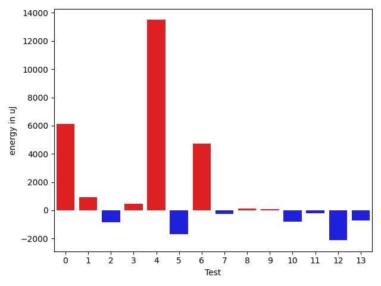

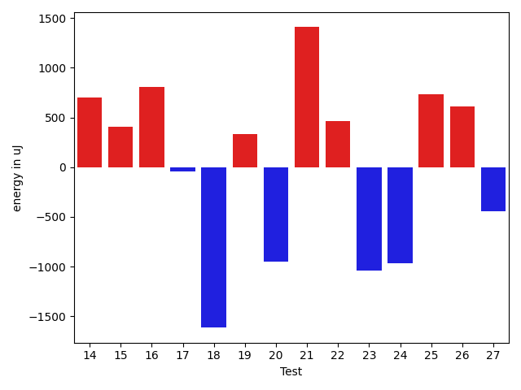

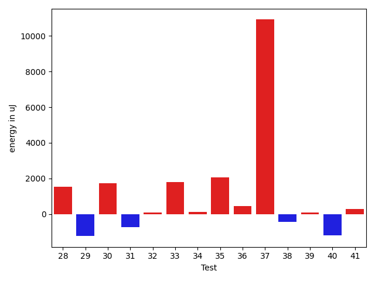

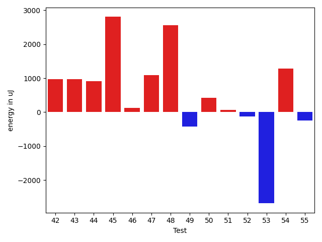

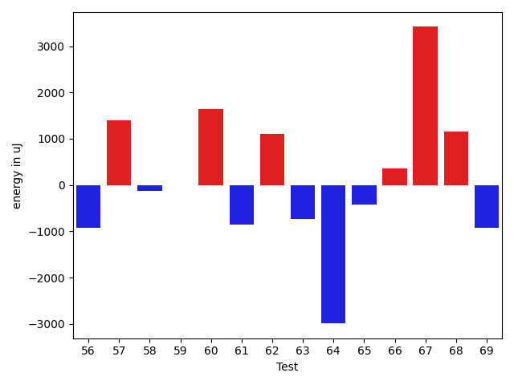

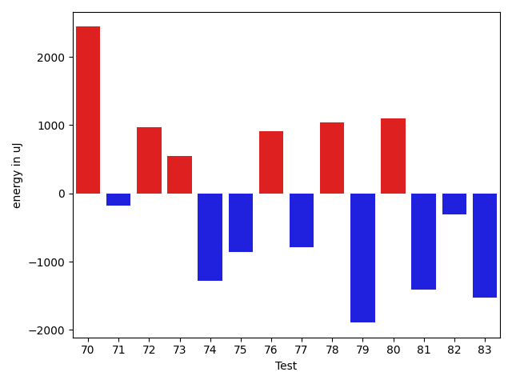

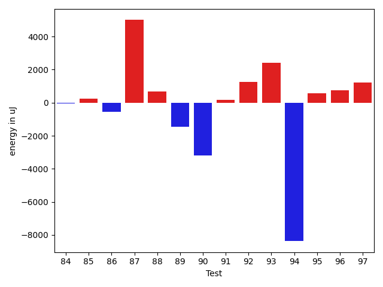

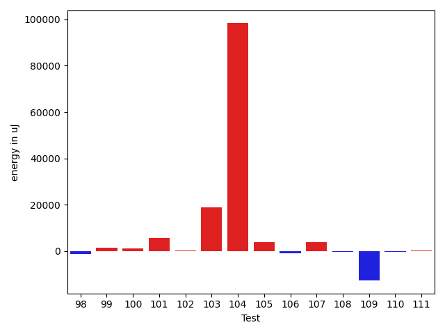

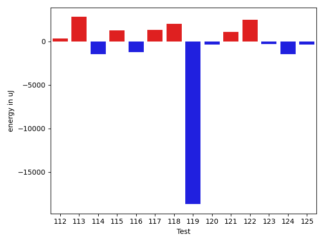

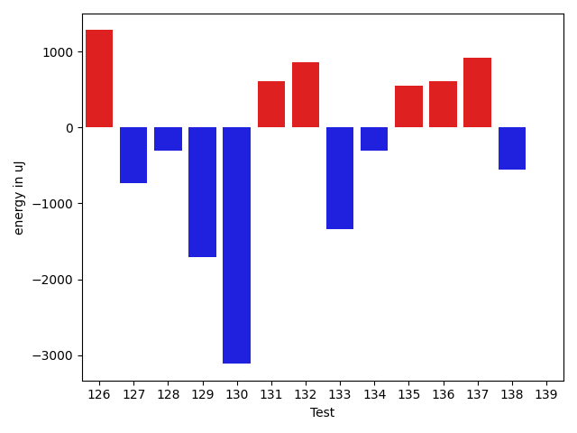

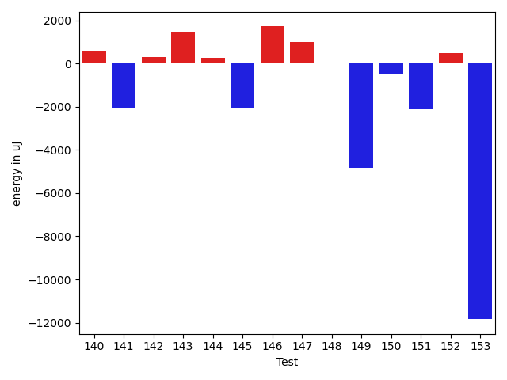

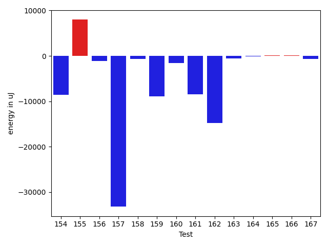

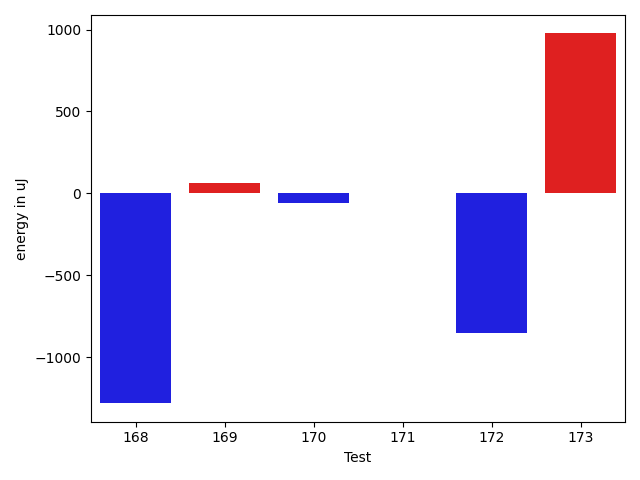

| ID | EnergyV1 | EnergyV2 | DeltaEnergy | σV1 | σV2 |
| --- | --- | --- | --- | --- | --- |
| 0 | 35034 | 35156 | 122 | 9236.592532357914 | 21279.24333959326 |
| 1 | 34546 | 35706 | 1160 | 3583.1929977565533 | 4242.738908803588 |
| 2 | 36316 | 35217 | -1099 | 3939.602794779974 | 4520.963332824919 |
| 3 | 36133 | 36316 | 183 | 2437.75904606396 | 2817.9871681311943 |
| 4 | 37903 | 38635 | 732 | 40138.61954696617 | 52151.16732662463 |
| 5 | 35706 | 33570 | -2136 | 3959.9015543318746 | 3140.692054525713 |
| 6 | 38147 | 36682 | -1465 | 17750.820619604463 | 35940.34582919782 |
| 7 | 34180 | 33325 | -855 | 3781.953559947557 | 3561.18572452575 |
| 8 | 33997 | 33936 | -61 | 3066.0194538391074 | 3720.582585679225 |
| 9 | 34607 | 34180 | -427 | 2550.9114227535797 | 4200.252067721407 |
| 10 | 34912 | 33448 | -1464 | 4439.26164215402 | 4117.552136011569 |
| 11 | 34363 | 34180 | -183 | 3272.977772680276 | 3315.3873153857016 |
| 12 | 37048 | 33813 | -3235 | 3042.785030198486 | 3563.0523469154227 |
| 13 | 36560 | 36682 | 122 | 3885.107205728048 | 3704.3750491058363 |
| 14 | 35888 | 36377 | 489 | 3409.3876643898607 | 3742.2362534852155 |
| 15 | 33692 | 35339 | 1647 | 3438.92705814248 | 4063.033880147259 |
| 16 | 33752 | 35645 | 1893 | 4206.5734446611905 | 2949.7810088208244 |
| 17 | 34424 | 33874 | -550 | 3025.986518922121 | 2985.028159594714 |
| 18 | 35767 | 33630 | -2137 | 2987.301994970901 | 3070.3662788835454 |
| 19 | 35400 | 35950 | 550 | 2643.8569518030326 | 2748.2203107726295 |
| 20 | 34546 | 33325 | -1221 | 3150.1210695518457 | 3586.9190492842135 |
| 21 | 34851 | 36376 | 1525 | 2607.760554455681 | 3237.775939748006 |
| 22 | 35217 | 35400 | 183 | 3019.6810175936002 | 3527.344052187141 |
| 23 | 35217 | 34668 | -549 | 4041.0345097836966 | 2971.937077541453 |
| 24 | 35950 | 34606 | -1344 | 3175.231668776312 | 3836.748466383027 |
| 25 | 35340 | 36316 | 976 | 2665.4861971302416 | 2860.9837870200936 |
| 26 | 34119 | 34119 | 0 | 3381.1699035833003 | 3366.52916097811 |
| 27 | 35583 | 35766 | 183 | 3372.0152490026157 | 1969.5209468294568 |
| 28 | 34729 | 36194 | 1465 | 3499.1371396706104 | 3108.322994274355 |
| 29 | 36377 | 34606 | -1771 | 3130.713359273096 | 4096.670899248243 |
| 30 | 33997 | 36071 | 2074 | 3939.8276913464124 | 3194.2643126428093 |
| 31 | 35034 | 33142 | -1892 | 3507.520553183101 | 2933.7744265369943 |
| 32 | 34729 | 35584 | 855 | 2687.0290156133265 | 2539.588040739416 |
| 33 | 34058 | 37231 | 3173 | 3492.6861630555936 | 4266.767767552181 |
| 34 | 36010 | 36255 | 245 | 3464.8383993754815 | 3731.4819875397134 |
| 35 | 32898 | 36682 | 3784 | 3881.4481762092787 | 4586.339242522297 |
| 36 | 36743 | 37232 | 489 | 3183.091477171339 | 3851.655390051532 |
| 37 | 43884 | 64697 | 20813 | 73289.0710028151 | 95821.49878585385 |
| 38 | 37598 | 36560 | -1038 | 4267.411656367119 | 4959.228826933243 |
| 39 | 36011 | 36316 | 305 | 4014.9558053617807 | 4225.1613602086345 |
| 40 | 37354 | 36011 | -1343 | 6324.051424502578 | 3930.919630719848 |
| 41 | 36865 | 37414 | 549 | 3952.2014696006795 | 3506.4454933454667 |
| 42 | 37415 | 38391 | 976 | 10030.963459493885 | 8017.23922397997 |
| 43 | 39550 | 40527 | 977 | 31220.543596285646 | 32150.54666537372 |
| 44 | 40100 | 41015 | 915 | 44258.091165106096 | 100215.13180305515 |
| 45 | 36194 | 39001 | 2807 | 20160.129097127323 | 45399.45227745317 |
| 46 | 36926 | 37048 | 122 | 3928.242312558231 | 7256.0793990654365 |
| 47 | 35828 | 36926 | 1098 | 3479.576903770183 | 82907.68199153295 |
| 48 | 35522 | 38086 | 2564 | 11892.521278979597 | 30683.53945771636 |
| 49 | 37110 | 36682 | -428 | 8748.893363772704 | 11744.927839708549 |
| 50 | 37719 | 38147 | 428 | 4288.764268483089 | 4691.7412943739055 |
| 51 | 38208 | 38269 | 61 | 27147.766314269145 | 56215.37107017937 |
| 52 | 36987 | 36865 | -122 | 7848.842361404068 | 8744.787142423836 |
| 53 | 38452 | 35766 | -2686 | 2236.980245170697 | 4924.031364913617 |
| 54 | 35583 | 36865 | 1282 | 19454.0197043962 | 27158.338343955205 |
| 55 | 36438 | 36194 | -244 | 14506.8924339722 | 12336.30754839832 |
| 56 | 70129 | 69213 | -916 | 30898.999126616225 | 22320.72771236707 |
| 57 | 34485 | 35889 | 1404 | 11282.153513064299 | 10612.638447881083 |
| 58 | 34484 | 34363 | -121 | 6421.3635771822555 | 5245.342156500892 |
| 59 | 35583 | 35583 | 0 | 6440.272378214185 | 7138.051632705871 |
| 60 | 34423 | 36071 | 1648 | 3675.3899063863746 | 4031.8397719637246 |
| 61 | 36560 | 35706 | -854 | 3470.5933871866455 | 4193.556967311394 |
| 62 | 34851 | 35950 | 1099 | 2937.965397201662 | 3756.5494704625075 |
| 63 | 35583 | 34851 | -732 | 2954.1471280501023 | 2783.081557393525 |
| 64 | 37353 | 34362 | -2991 | 10907.759641140288 | 3331.30167258873 |
| 65 | 35462 | 35034 | -428 | 2893.1519191607877 | 3542.1400646011807 |
| 66 | 35522 | 35889 | 367 | 3835.2731336372894 | 3331.9234463055745 |
| 67 | 34363 | 37781 | 3418 | 3403.4473605141484 | 4090.454424481506 |
| 68 | 38452 | 39612 | 1160 | 107921.4281038705 | 118437.23154536402 |
| 69 | 35401 | 34485 | -916 | 3074.0359509120904 | 3764.132973415159 |
| 70 | 34607 | 37048 | 2441 | 3450.8868236762687 | 4558.090406124038 |
| 71 | 35767 | 35584 | -183 | 3253.8305800682033 | 3578.7254164923297 |
| 72 | 34485 | 35461 | 976 | 2878.869101844604 | 3412.853504544 |
| 73 | 35218 | 35766 | 548 | 2968.2666719340236 | 3016.736692628818 |
| 74 | 35889 | 34607 | -1282 | 4087.087391713077 | 3584.0211629231476 |
| 75 | 37170 | 36316 | -854 | 3804.7963242958226 | 4367.005902537886 |
| 76 | 35523 | 36438 | 915 | 4177.005873919694 | 3764.633037893601 |
| 77 | 35583 | 34790 | -793 | 3112.430233625113 | 1353.4904818191371 |
| 78 | 35950 | 36988 | 1038 | 3733.3534422189796 | 4147.244810800305 |
| 79 | 40527 | 38635 | -1892 | 19339.05306450763 | 22797.154346944673 |
| 80 | 36621 | 37720 | 1099 | 3954.43899814996 | 4200.163141246532 |
| 81 | 37963 | 36560 | -1403 | 32311.20112434147 | 32700.41797015767 |
| 82 | 35401 | 35095 | -306 | 4786.579795229019 | 3685.6077369269606 |
| 83 | 106994 | 105468 | -1526 | 22948.52764066132 | 23180.400404614957 |
| 84 | 33996 | 34058 | 62 | 3886.9260333290927 | 2750.574285465278 |
| 85 | 33997 | 33569 | -428 | 2789.941175850466 | 3501.1236019179896 |
| 86 | 34485 | 33996 | -489 | 3730.8736897879394 | 3918.9339967791134 |
| 87 | 34607 | 37781 | 3174 | 12272.921653425115 | 16558.33128939385 |
| 88 | 34668 | 34790 | 122 | 3411.338733102125 | 4081.312484973431 |
| 89 | 34973 | 33997 | -976 | 7477.712336122708 | 5746.670314218215 |
| 90 | 35278 | 33447 | -1831 | 4092.3028183943106 | 2438.685987768572 |
| 91 | 34790 | 34729 | -61 | 3366.0949469554766 | 3462.9898519695016 |
| 92 | 34240 | 37598 | 3358 | 2886.270130196204 | 4437.028062078111 |
| 93 | 33874 | 35828 | 1954 | 2374.220279902436 | 4298.537919835521 |
| 94 | 33203 | 34057 | 854 | 35307.49226527172 | 3785.886591011411 |
| 95 | 34790 | 35888 | 1098 | 3833.253647032942 | 3032.128642357746 |
| 96 | 33386 | 32532 | -854 | 2507.87324684128 | 0.0 |
| 97 | 32165 | 33630 | 1465 | 574.8543776953912 | 0.0 |
| 98 | 62134 | 63171 | 1037 | 17167.509609360935 | 12122.015129507141 |
| 99 | 37902 | 39917 | 2015 | 6446.306363212585 | 7522.949716995618 |
| 100 | 37964 | 39367 | 1403 | 3039.5853730930808 | 3961.6692595986583 |
| 101 | 37414 | 38208 | 794 | 3896.068814789074 | 24251.026966303103 |
| 102 | 36987 | 37842 | 855 | 3534.6141124032197 | 4295.549590077615 |
| 103 | 38696 | 38879 | 183 | 19076.0304601814 | 43930.818788157405 |
| 104 | 40832 | 38941 | -1891 | 388598.82551148697 | 611406.7522864775 |
| 105 | 43762 | 46509 | 2747 | 16907.11514140811 | 16808.587360240363 |
| 106 | 36071 | 36194 | 123 | 3207.1327264617184 | 3883.8055633591184 |
| 107 | 35095 | 38208 | 3113 | 2887.0862074470115 | 5164.641038697051 |
| 108 | 38269 | 38147 | -122 | 3269.455437741123 | 3818.466388813708 |
| 109 | 38635 | 37170 | -1465 | 41745.57143476336 | 33018.73662940598 |
| 110 | 35095 | 34607 | -488 | 3276.0142699496264 | 3500.0813634857705 |
| 111 | 35462 | 35400 | -62 | 2801.164345822589 | 3913.054008666438 |
| 112 | 35034 | 35400 | 366 | 3336.696748014212 | 4779.463409670065 |
| 113 | 34851 | 37659 | 2808 | 4011.8846951596497 | 3636.9159840447237 |
| 114 | 38208 | 36743 | -1465 | 4600.899468959236 | 3523.1302247074145 |
| 115 | 35461 | 36743 | 1282 | 3768.2765947974094 | 4257.959357485696 |
| 116 | 36804 | 35584 | -1220 | 4622.353849224225 | 2803.4720627550755 |
| 117 | 36011 | 37353 | 1342 | 3831.1497661423055 | 3504.7713685203494 |
| 118 | 35217 | 37231 | 2014 | 3393.1367126515256 | 2821.9272533720905 |
| 119 | 65430 | 46753 | -18677 | 45241.58069647987 | 30651.622049503592 |
| 120 | 36072 | 35706 | -366 | 3726.145603611488 | 3993.1253569192427 |
| 121 | 37110 | 38208 | 1098 | 3935.110705613261 | 4371.285787671632 |
| 122 | 69336 | 71838 | 2502 | 28336.216729567943 | 21005.15443828069 |
| 123 | 38330 | 38025 | -305 | 33034.82911714797 | 32893.971787987524 |
| 124 | 38574 | 37109 | -1465 | 4457.640780083455 | 3886.1339641731342 |
| 125 | 36804 | 36438 | -366 | 7472.152559774407 | 12598.400643154357 |
| 126 | 33753 | 35034 | 1281 | 3657.8238424014926 | 4692.505294971263 |
| 127 | 35827 | 35095 | -732 | 3742.5388029585256 | 3980.7701630349234 |
| 128 | 34973 | 34668 | -305 | 3202.784401179536 | 4098.218169753473 |
| 129 | 34362 | 32653 | -1709 | 3667.7576593199283 | 4175.281948501319 |
| 130 | 38574 | 35462 | -3112 | 4357.286208038833 | 2739.4428008949194 |
| 131 | 34424 | 35034 | 610 | 5680.930936228769 | 4555.230612364009 |
| 132 | 38025 | 38880 | 855 | 44312.56055507851 | 42435.398475565074 |
| 133 | 37415 | 36072 | -1343 | 3743.671551339676 | 3766.35569312042 |
| 134 | 36438 | 36133 | -305 | 3118.565264134562 | 3361.712069754124 |
| 135 | 37476 | 38025 | 549 | 5060.077648860736 | 3797.9801909188836 |
| 136 | 35889 | 36499 | 610 | 2774.3279736208947 | 2679.717054715541 |
| 137 | 36316 | 37232 | 916 | 4500.968473506586 | 4262.353501079335 |
| 138 | 39795 | 39245 | -550 | 37751.66791700802 | 28329.231040141243 |
| 139 | 38696 | 38697 | 1 | 34059.313306930286 | 23744.3787869301 |
| 140 | 39428 | 39978 | 550 | 145956.29861821517 | 124827.95801179194 |
| 141 | 36804 | 34729 | -2075 | 14404.681571459827 | 9012.275865675429 |
| 142 | 36560 | 36865 | 305 | 4501.88203401236 | 5922.937326360301 |
| 143 | 35889 | 37353 | 1464 | 16753.49173352112 | 4240.291430700687 |
| 144 | 38635 | 38880 | 245 | 56534.369509595665 | 87354.8503369797 |
| 145 | 38697 | 36621 | -2076 | 3607.3772994530827 | 3904.7097317862404 |
| 146 | 39795 | 41504 | 1709 | 4157.884378703509 | 4584.953695268372 |
| 147 | 36377 | 37354 | 977 | 8683.3374386505 | 7307.035510974121 |
| 148 | 37171 | 37170 | -1 | 7737.7546534702215 | 4038.223491005145 |
| 149 | 44128 | 39306 | -4822 | 624993.8177683525 | 394282.1775444976 |
| 150 | 38269 | 37780 | -489 | 16551.06033064308 | 14348.321902421025 |
| 151 | 39124 | 36987 | -2137 | 48754.882236193436 | 36714.944943413306 |
| 152 | 38330 | 38819 | 489 | 122681.3084833525 | 103517.95088615111 |
| 153 | 340331 | 328491 | -11840 | 84104.4173290497 | 98855.14410714313 |
| 154 | 41809 | 40100 | -1709 | 41725.23230991443 | 25248.119620801717 |
| 155 | 38391 | 40344 | 1953 | 26854.47361514807 | 42335.50870997833 |
| 156 | 38208 | 36255 | -1953 | 6383.819017399662 | 5632.109553375581 |
| 157 | 37903 | 37903 | 0 | 232709.1116470931 | 40891.19898215381 |
| 158 | 70923 | 70069 | -854 | 22877.892564420446 | 23298.841572839232 |
| 159 | 39245 | 39978 | 733 | 170808.53253211983 | 155862.17159000965 |
| 160 | 39001 | 37170 | -1831 | 15559.736824639587 | 17999.638339604935 |
| 161 | 39368 | 36987 | -2381 | 43740.98091968592 | 29593.455716421424 |
| 162 | 38513 | 36438 | -2075 | 49369.39955432184 | 33972.80412311669 |
| 163 | 37598 | 35278 | -2320 | 5732.9139039699885 | 15135.103453992522 |
| 164 | 36132 | 35278 | -854 | 4191.10117234338 | 4348.927599379925 |
| 165 | 36377 | 36377 | 0 | 4162.076001228233 | 3768.5911551971467 |
| 166 | 36865 | 36804 | -61 | 3662.5760928335726 | 3512.2711158429347 |
| 167 | 39123 | 37780 | -1343 | 15816.126796036502 | 18280.6696773869 |
| 168 | 37292 | 36010 | -1282 | 3285.351688260414 | 3493.761074101458 |
| 169 | 36072 | 36133 | 61 | 4027.167124033712 | 6061.081725936408 |
| 170 | 35889 | 35828 | -61 | 3541.5066652994055 | 24556.193146122627 |
| 171 | 38086 | 38086 | 0 | 44061.21487898018 | 37904.836163855674 |
| 172 | 37841 | 36988 | -853 | 4056.403784261941 | 3962.243103743281 |
| 173 | 37476 | 38452 | 976 | 32404.51290801261 | 35731.33439565007 |

## Delta Duration per test method

| ID | DurationV1 | DurationsV2 | DeltaDuration |
| --- | --- | --- | --- |
| 0 | 898500.8846153846 | 1107871.5 | 209370.61538461538 |
| 1 | 461448.73076923075 | 531084.6896551724 | 69635.95888594165 |
| 2 | 771231.2093023256 | 981080.6470588235 | 209849.43775649788 |
| 3 | 439571.375 | 418047.9090909091 | -21523.465909090883 |
| 4 | 1057336.4615384615 | 1576361.84 | 519025.3784615386 |
| 5 | 426549.52 | 430323.1153846154 | 3773.595384615357 |
| 6 | 1138763.425 | 1340866.1395348837 | 202102.71453488362 |
| 7 | 463673.96 | 458024.5172413793 | -5649.442758620717 |
| 8 | 588781.448275862 | 635292.2424242424 | 46510.7941483804 |
| 9 | 550628.5 | 549522.9642857143 | -1105.535714285681 |
| 10 | 475549.8 | 508660.625 | 33110.82500000001 |
| 11 | 529076.4242424242 | 519724.0714285714 | -9352.352813852776 |
| 12 | 493515.9 | 468492.86363636365 | -25023.036363636376 |
| 13 | 458873.5714285714 | 497309.6153846154 | 38436.043956043955 |
| 14 | 584796.59375 | 558932.6451612903 | -25863.948588709696 |
| 15 | 448453.64285714284 | 412909.28571428574 | -35544.3571428571 |
| 16 | 453029.5294117647 | 444114.04545454547 | -8915.483957219229 |
| 17 | 456668.71428571426 | 424782.7368421053 | -31885.97744360898 |
| 18 | 449997.1612903226 | 477310.0 | 27312.838709677395 |
| 19 | 458023.25 | 474199.72222222225 | 16176.472222222248 |
| 20 | 489112.2380952381 | 527172.4074074074 | 38060.16931216931 |
| 21 | 427536.75 | 399565.15789473685 | -27971.592105263146 |
| 22 | 475944.52173913043 | 442001.09375 | -33943.42798913043 |
| 23 | 462949.0869565217 | 480679.7586206897 | 17730.671664167952 |
| 24 | 531295.08 | 532762.4137931034 | 1467.333793103462 |
| 25 | 435549.21428571426 | 469184.28571428574 | 33635.07142857148 |
| 26 | 392266.3157894737 | 383676.1538461539 | -8590.161943319836 |
| 27 | 421302.77777777775 | 428191.2 | 6888.42222222226 |
| 28 | 449255.5416666667 | 384525.78571428574 | -64729.75595238095 |
| 29 | 532712.8965517242 | 566686.2941176471 | 33973.39756592293 |
| 30 | 601573.2 | 591999.46875 | -9573.731249999953 |
| 31 | 421545.73913043475 | 443155.77777777775 | 21610.038647342997 |
| 32 | 397388.63157894736 | 396933.3333333333 | -455.2982456140453 |
| 33 | 393207.8 | 413260.93333333335 | 20053.13333333336 |
| 34 | 503907.1904761905 | 563222.8333333334 | 59315.6428571429 |
| 35 | 417496.36842105264 | 447321.85 | 29825.481578947336 |
| 36 | 753191.1666666666 | 747978.8461538461 | -5212.320512820501 |
| 37 | 2221407.717171717 | 2492251.6363636362 | 270843.91919191927 |
| 38 | 889859.253968254 | 907252.8305084746 | 17393.576540220645 |
| 39 | 823474.2181818181 | 886460.2156862745 | 62985.99750445632 |
| 40 | 1095215.8395061728 | 1108765.75 | 13549.910493827192 |
| 41 | 835050.2678571428 | 861887.84375 | 26837.57589285716 |
| 42 | 908216.3571428572 | 951352.6393442623 | 43136.28220140515 |
| 43 | 1445672.0 | 1697936.9814814816 | 252264.98148148158 |
| 44 | 1586232.7454545454 | 2316399.0579710146 | 730166.3125164693 |
| 45 | 1124292.6222222222 | 1549226.7586206896 | 424934.13639846747 |
| 46 | 852937.6888888889 | 970822.3333333334 | 117884.64444444445 |
| 47 | 584442.3103448276 | 1600890.5161290322 | 1016448.2057842046 |
| 48 | 777327.9393939395 | 1106601.255319149 | 329273.31592520955 |
| 49 | 1070697.4029850746 | 1161937.0625 | 91239.65951492544 |
| 50 | 533339.2222222222 | 509076.4 | -24262.822222222225 |
| 51 | 975344.8055555555 | 1723968.9411764706 | 748624.1356209151 |
| 52 | 1125524.2567567567 | 1125190.3506493506 | -333.9061074061319 |
| 53 | 474060.77777777775 | 528115.6428571428 | 54054.86507936509 |
| 54 | 1446105.3548387096 | 1464171.7142857143 | 18066.35944700474 |
| 55 | 1291458.851851852 | 1234177.8395061728 | -57281.012345679104 |
| 56 | 2196184.303030303 | 2179288.5757575757 | -16895.727272727527 |
| 57 | 960626.3529411765 | 979634.75 | 19008.397058823495 |
| 58 | 720948.2195121951 | 750025.8444444444 | 29077.62493224931 |
| 59 | 951140.551724138 | 922305.4406779661 | -28835.111046171864 |
| 60 | 828166.6607142857 | 806051.0819672131 | -22115.578747072606 |
| 61 | 663457.3928571428 | 618690.34375 | -44767.04910714284 |
| 62 | 655525.3055555555 | 613975.0810810811 | -41550.22447447444 |
| 63 | 762327.2333333333 | 789186.4347826086 | 26859.201449275366 |
| 64 | 644052.7916666666 | 502986.8484848485 | -141065.94318181812 |
| 65 | 536431.3125 | 505318.2580645161 | -31113.05443548388 |
| 66 | 551553.4 | 500614.35714285716 | -50939.042857142864 |
| 67 | 488607.5172413793 | 534177.5454545454 | 45570.02821316611 |
| 68 | 1957303.7 | 1813515.9090909092 | -143787.79090909078 |
| 69 | 446241.05 | 502658.3157894737 | 56417.26578947372 |
| 70 | 450918.23076923075 | 428181.0 | -22737.23076923075 |
| 71 | 492963.6923076923 | 511756.2631578947 | 18792.570850202406 |
| 72 | 564210.5833333334 | 646254.304347826 | 82043.72101449268 |
| 73 | 660935.6428571428 | 656704.0857142857 | -4231.557142857113 |
| 74 | 491405.1 | 405431.5909090909 | -85973.5090909091 |
| 75 | 639726.725 | 645252.3939393939 | 5525.668939393945 |
| 76 | 587349.5806451613 | 599603.825 | 12254.244354838622 |
| 77 | 323442.28571428574 | 402528.375 | 79086.08928571426 |
| 78 | 777498.9245283019 | 795815.2692307692 | 18316.344702467322 |
| 79 | 1579216.3010752688 | 1564649.9278350514 | -14566.373240217334 |
| 80 | 760223.0 | 778848.5625 | 18625.5625 |
| 81 | 1127527.9473684211 | 1237830.6176470588 | 110302.67027863767 |
| 82 | 565597.0384615385 | 563645.0909090909 | -1951.9475524475565 |
| 83 | 3235422.3333333335 | 3216880.4343434344 | -18541.898989899084 |
| 84 | 626074.5714285715 | 585584.2592592592 | -40490.31216931227 |
| 85 | 712032.7058823529 | 658840.5365853659 | -53192.169296987006 |
| 86 | 695161.4102564103 | 723849.1333333333 | 28687.723076923052 |
| 87 | 1071553.3111111112 | 1014491.1304347826 | -57062.1806763286 |
| 88 | 711236.3636363636 | 646630.088888889 | -64606.2747474747 |
| 89 | 802916.1063829787 | 777743.5531914893 | -25172.553191489424 |
| 90 | 475254.2272727273 | 474388.35714285716 | -865.8701298701344 |
| 91 | 659292.2424242424 | 666164.5208333334 | 6872.278409090941 |
| 92 | 507965.95454545453 | 512593.1538461539 | 4627.199300699343 |
| 93 | 537507.875 | 480139.8333333333 | -57368.041666666686 |
| 94 | 830306.4 | 422889.12 | -407417.28 |
| 95 | 471997.17647058825 | 446389.0 | -25608.176470588252 |
| 96 | 922897.3333333334 | 958982.0 | 36084.66666666663 |
| 97 | 1082939.0 | 918877.0 | -164062.0 |
| 98 | 2679419.75 | 2539252.6 | -140167.1499999999 |
| 99 | 719356.3333333334 | 813356.6666666666 | 94000.33333333326 |
| 100 | 635341.5135135135 | 600139.9714285714 | -35201.542084942106 |
| 101 | 793000.0689655172 | 881885.052631579 | 88884.98366606177 |
| 102 | 802084.48 | 757054.625 | -45029.85499999998 |
| 103 | 748246.6818181818 | 1421217.2352941176 | 672970.5534759358 |
| 104 | 3350792.479452055 | 6275400.25 | 2924607.770547945 |
| 105 | 1219672.7346938776 | 1383269.8181818181 | 163597.0834879405 |
| 106 | 444818.0 | 371152.29411764705 | -73665.70588235295 |
| 107 | 384845.53846153844 | 399961.0 | 15115.46153846156 |
| 108 | 448350.0625 | 419646.1875 | -28703.875 |
| 109 | 1623422.0416666667 | 989016.5882352941 | -634405.4534313726 |
| 110 | 436223.55555555556 | 409975.1904761905 | -26248.36507936509 |
| 111 | 403575.1538461539 | 411541.1176470588 | 7965.963800904923 |
| 112 | 541387.9523809524 | 439133.8125 | -102254.13988095243 |
| 113 | 459789.5714285714 | 467052.1875 | 7262.61607142858 |
| 114 | 430977.5 | 394739.1111111111 | -36238.388888888876 |
| 115 | 440040.64285714284 | 398742.2 | -41298.44285714283 |
| 116 | 416463.63636363635 | 413411.0 | -3052.636363636353 |
| 117 | 586088.6071428572 | 561025.08 | -25063.5271428572 |
| 118 | 684736.6341463415 | 710745.8484848485 | 26009.214338507038 |
| 119 | 2087489.857142857 | 1577703.282051282 | -509786.57509157504 |
| 120 | 549446.0645161291 | 564102.3214285715 | 14656.25691244239 |
| 121 | 586594.2222222222 | 598754.5625 | 12160.340277777752 |
| 122 | 2143182.8585858587 | 2119226.8080808083 | -23956.050505050458 |
| 123 | 963388.2903225806 | 964890.6842105263 | 1502.3938879456837 |
| 124 | 529528.0952380953 | 551744.5416666666 | 22216.446428571362 |
| 125 | 671592.8888888889 | 679413.0 | 7820.111111111124 |
| 126 | 547118.4857142858 | 579234.1333333333 | 32115.64761904755 |
| 127 | 653802.5128205129 | 666690.3636363636 | 12887.850815850776 |
| 128 | 557338.7407407408 | 555954.4736842106 | -1384.267056530225 |
| 129 | 489528.0 | 478445.29411764705 | -11082.705882352951 |
| 130 | 442450.1666666667 | 426296.125 | -16154.041666666686 |
| 131 | 849978.3414634146 | 889783.8181818182 | 39805.47671840363 |
| 132 | 1350482.075 | 1429389.574468085 | 78907.49946808512 |
| 133 | 537037.695652174 | 561344.2307692308 | 24306.535117056803 |
| 134 | 484463.13333333336 | 535161.7916666666 | 50698.65833333327 |
| 135 | 571185.25 | 495460.21428571426 | -75725.03571428574 |
| 136 | 446945.14285714284 | 439099.86666666664 | -7845.276190476201 |
| 137 | 705475.0204081633 | 740952.5428571429 | 35477.52244897955 |
| 138 | 1200671.0689655172 | 1210244.1290322582 | 9573.06006674096 |
| 139 | 1289727.2156862745 | 1232577.641509434 | -57149.574176840484 |
| 140 | 2425524.2 | 2566034.6666666665 | 140510.46666666633 |
| 141 | 749581.7222222222 | 741674.0810810811 | -7907.641141141183 |
| 142 | 598278.8285714285 | 590260.3333333334 | -8018.495238095173 |
| 143 | 643849.0689655172 | 560058.3870967742 | -83790.68186874304 |
| 144 | 964651.1 | 2104084.1052631577 | 1139433.0052631577 |
| 145 | 447816.4736842105 | 427462.72222222225 | -20353.751461988257 |
| 146 | 406813.73333333334 | 458928.0 | 52114.26666666666 |
| 147 | 1047963.7285714286 | 1102127.3870967743 | 54163.65852534573 |
| 148 | 933096.776119403 | 892434.8 | -40661.97611940291 |
| 149 | 6848304.493333333 | 3258445.097222222 | -3589859.396111111 |
| 150 | 1351859.3703703703 | 1348980.9767441861 | -2878.3936261842027 |
| 151 | 1539929.5901639345 | 1313300.446153846 | -226629.1440100884 |
| 152 | 2571574.1875 | 1790587.1315789474 | -780987.0559210526 |
| 153 | 9746196.646464646 | 9542703.454545455 | -203493.1919191908 |
| 154 | 1832533.6547619049 | 1569689.0229885057 | -262844.6317733992 |
| 155 | 895787.7857142857 | 1202452.7027027027 | 306664.91698841704 |
| 156 | 725046.7777777778 | 667854.6 | -57192.177777777775 |
| 157 | 1922497.0256410257 | 1015520.6764705882 | -906976.3491704375 |
| 158 | 2013447.1717171718 | 1990203.4545454546 | -23243.717171717202 |
| 159 | 3073937.68627451 | 2886226.8181818184 | -187710.86809269153 |
| 160 | 1332730.4594594594 | 1379562.880952381 | 46832.421492921654 |
| 161 | 1502281.0357142857 | 1270979.0892857143 | -231301.94642857136 |
| 162 | 1883634.7857142857 | 1196672.1851851852 | -686962.6005291005 |
| 163 | 1031120.9736842106 | 1045668.4406779661 | 14547.466993755545 |
| 164 | 933207.3606557377 | 951253.578125 | 18046.21746926231 |
| 165 | 893406.5555555555 | 813384.1355932204 | -80022.41996233515 |
| 166 | 716371.0645161291 | 618532.6060606061 | -97838.45845552301 |
| 167 | 1089120.7096774194 | 976024.25 | -113096.45967741939 |
| 168 | 624944.8666666667 | 621534.6470588235 | -3410.2196078432025 |
| 169 | 742033.0571428571 | 783240.5116279069 | 41207.45448504982 |
| 170 | 921420.1475409836 | 1010372.4444444445 | 88952.29690346087 |
| 171 | 1419231.3442622952 | 1314779.822580645 | -104451.52168165008 |
| 172 | 809672.0204081633 | 876201.306122449 | 66529.28571428568 |
| 173 | 1326068.986111111 | 1402332.406779661 | 76263.42066855007 |

## Misc.

| ID | Test Class | Test Method |
| --- | --- | --- |
| 0 | com.google.gson.functional.PrimitiveTest | testDeserializePrimitiveWrapperAsObjectField |
| 1 | com.google.gson.functional.PrimitiveTest | testDoubleNoFractAsStringRepresentationDeserialization |
| 2 | com.google.gson.functional.PrimitiveTest | testPrimitiveDoubleAutoboxedDeserialization |
| 3 | com.google.gson.functional.PrimitiveTest | testPrimitiveIntegerAutoboxedInASingleElementArrayDeserialization |
| 4 | com.google.gson.functional.PrimitiveTest | testPrimitiveLongAutoboxedInASingleElementArrayDeserialization |
| 5 | com.google.gson.functional.PrimitiveTest | testBigDecimalAsStringRepresentationDeserialization |
| 6 | com.google.gson.functional.PrimitiveTest | testNumberDeserialization |
| 7 | com.google.gson.functional.PrimitiveTest | testBigDecimalNaNDeserializationNotSupported |
| 8 | com.google.gson.functional.PrimitiveTest | testOverridingDefaultPrimitiveSerialization |
| 9 | com.google.gson.functional.PrimitiveTest | testDoubleNaNDeserialization |
| 10 | com.google.gson.functional.PrimitiveTest | testLargeDoubleDeserialization |
| 11 | com.google.gson.functional.PrimitiveTest | testBigIntegerInASingleElementArrayDeserialization |
| 12 | com.google.gson.functional.PrimitiveTest | testSmallValueForBigDecimalDeserialization |
| 13 | com.google.gson.functional.PrimitiveTest | testBigDecimalInASingleElementArrayDeserialization |
| 14 | com.google.gson.functional.PrimitiveTest | testPrimitiveBooleanAutoboxedDeserialization |
| 15 | com.google.gson.functional.PrimitiveTest | testBigDecimalPreservePrecisionDeserialization |
| 16 | com.google.gson.functional.PrimitiveTest | testDoubleInfinityDeserialization |
| 17 | com.google.gson.functional.PrimitiveTest | testBigDecimalInfinityDeserializationNotSupported |
| 18 | com.google.gson.functional.PrimitiveTest | testNegativeInfinityFloatDeserialization |
| 19 | com.google.gson.functional.PrimitiveTest | testFloatInfinityDeserialization |
| 20 | com.google.gson.functional.PrimitiveTest | testBadValueForBigIntegerDeserialization |
| 21 | com.google.gson.functional.PrimitiveTest | testPrimitiveIntegerAutoboxedDeserialization |
| 22 | com.google.gson.functional.PrimitiveTest | testLongAsStringDeserialization |
| 23 | com.google.gson.functional.PrimitiveTest | testFloatNaNDeserialization |
| 24 | com.google.gson.functional.PrimitiveTest | testPrimitiveDoubleAutoboxedInASingleElementArrayDeserialization |
| 25 | com.google.gson.functional.PrimitiveTest | testNegativeInfinityDeserialization |
| 26 | com.google.gson.functional.PrimitiveTest | testReallyLongValuesDeserialization |
| 27 | com.google.gson.functional.PrimitiveTest | testBigDecimalDeserialization |
| 28 | com.google.gson.functional.PrimitiveTest | testPrimitiveLongAutoboxedDeserialization |
| 29 | com.google.gson.functional.PrimitiveTest | testPrimitiveBooleanAutoboxedInASingleElementArrayDeserialization |
| 30 | com.google.gson.functional.PrimitiveTest | testBigIntegerDeserialization |
| 31 | com.google.gson.functional.PrimitiveTest | testPrimitiveClassLiteral |
| 32 | com.google.gson.functional.PrimitiveTest | testSmallValueForBigIntegerDeserialization |
| 33 | com.google.gson.functional.PrimitiveTest | testBigDecimalNoFractAsStringRepresentationDeserialization |
| 34 | com.google.gson.functional.PrimitiveTest | testDoubleAsStringRepresentationDeserialization |
| 35 | com.google.gson.functional.PrimitiveTest | testBigDecimalNegativeInfinityDeserializationNotSupported |
| 36 | com.google.gson.functional.CustomDeserializerTest | testDefaultConstructorNotCalledOnField |
| 37 | com.google.gson.functional.CustomDeserializerTest | testDefaultConstructorNotCalledOnObject |
| 38 | com.google.gson.functional.CustomDeserializerTest | testCustomDeserializerReturnsNullForArrayElementsForArrayField |
| 39 | com.google.gson.functional.CustomDeserializerTest | testCustomDeserializerReturnsNull |
| 40 | com.google.gson.functional.CustomDeserializerTest | testJsonTypeFieldBasedDeserialization |
| 41 | com.google.gson.functional.CustomDeserializerTest | testCustomDeserializerReturnsNullForPrimitiveFields |
| 42 | com.google.gson.functional.CustomDeserializerTest | testCustomDeserializerReturnsNullForArrayElements |
| 43 | com.google.gson.functional.CustomDeserializerTest | testCustomDeserializerReturnsNullForTopLevelObject |
| 44 | com.google.gson.functional.JsonParserTest | testBadTypeForDeserializingCustomTree |
| 45 | com.google.gson.functional.JsonParserTest | testChangingCustomTreeAndDeserializing |
| 46 | com.google.gson.functional.JsonParserTest | testBadFieldTypeForDeserializingCustomTree |
| 47 | com.google.gson.functional.JsonParserTest | testDeserializingCustomTree |
| 48 | com.google.gson.functional.JsonParserTest | testBadFieldTypeForCustomDeserializerCustomTree |
| 49 | com.google.gson.functional.ReadersWritersTest | testReadWriteTwoObjects |
| 50 | com.google.gson.functional.ReadersWritersTest | testTopLevelNullObjectDeserializationWithReaderAndSerializeNulls |
| 51 | com.google.gson.functional.ReadersWritersTest | testReaderForDeserialization |
| 52 | com.google.gson.functional.ReadersWritersTest | testReadWriteTwoStrings |
| 53 | com.google.gson.functional.ReadersWritersTest | testTopLevelNullObjectDeserializationWithReader |
| 54 | com.google.gson.functional.ObjectTest | testEmptyCollectionInAnObjectDeserialization |
| 55 | com.google.gson.functional.ObjectTest | testArrayOfArraysDeserialization |
| 56 | com.google.gson.functional.ObjectTest | testSingletonLists |
| 57 | com.google.gson.functional.ObjectTest | testStringFieldWithNumberValueDeserialization |
| 58 | com.google.gson.functional.ObjectTest | testPrimitiveArrayInAnObjectDeserialization |
| 59 | com.google.gson.functional.ObjectTest | testArrayOfObjectsDeserialization |
| 60 | com.google.gson.functional.ObjectTest | testNestedDeserialization |
| 61 | com.google.gson.functional.ObjectTest | testBagOfPrimitiveWrappersDeserialization |
| 62 | com.google.gson.functional.ObjectTest | testNullFieldsDeserialization |
| 63 | com.google.gson.functional.ObjectTest | testInnerClassDeserialization |
| 64 | com.google.gson.functional.ObjectTest | testStringFieldWithEmptyValueDeserialization |
| 65 | com.google.gson.functional.ObjectTest | testPrivateNoArgConstructorDeserialization |
| 66 | com.google.gson.functional.ObjectTest | testClassWithTransientFieldsDeserializationTransientFieldsPassedInJsonAreIgnored |
| 67 | com.google.gson.functional.ObjectTest | testNullArraysDeserialization |
| 68 | com.google.gson.functional.ObjectTest | testJsonInSingleQuotesDeserialization |
| 69 | com.google.gson.functional.ObjectTest | testNullObjectFieldsDeserialization |
| 70 | com.google.gson.functional.ObjectTest | testEmptyStringDeserialization |
| 71 | com.google.gson.functional.ObjectTest | testObjectFieldNamesWithoutQuotesDeserialization |
| 72 | com.google.gson.functional.ObjectTest | testNullPrimitiveFieldsDeserialization |
| 73 | com.google.gson.functional.ObjectTest | testBagOfPrimitivesDeserialization |
| 74 | com.google.gson.functional.ObjectTest | testClassWithNoFieldsDeserialization |
| 75 | com.google.gson.functional.ObjectTest | testClassWithTransientFieldsDeserialization |
| 76 | com.google.gson.functional.ObjectTest | testJsonInMixedQuotesDeserialization |
| 77 | com.google.gson.functional.ObjectTest | testNullDeserialization |
| 78 | com.google.gson.functional.CollectionTest | testRawCollectionOfBagOfPrimitivesNotAllowed |
| 79 | com.google.gson.functional.CollectionTest | testWildcardCollectionField |
| 80 | com.google.gson.functional.CollectionTest | testRawCollectionDeserializationNotAlllowed |
| 81 | com.google.gson.functional.DefaultTypeAdaptersTest | testUrlDeserialization |
| 82 | com.google.gson.functional.DefaultTypeAdaptersTest | testDefaultGregorianCalendarDeserialization |
| 83 | com.google.gson.functional.DefaultTypeAdaptersTest | testDefaultDateDeserializationUsingBuilder |
| 84 | com.google.gson.functional.DefaultTypeAdaptersTest | testDefaultCalendarDeserialization |
| 85 | com.google.gson.functional.DefaultTypeAdaptersTest | testBadValueForBigDecimalDeserialization |
| 86 | com.google.gson.functional.DefaultTypeAdaptersTest | testPropertiesDeserialization |
| 87 | com.google.gson.functional.DefaultTypeAdaptersTest | testBigDecimalFieldDeserialization |
| 88 | com.google.gson.functional.DefaultTypeAdaptersTest | testBigIntegerFieldDeserialization |
| 89 | com.google.gson.functional.DefaultTypeAdaptersTest | testUrlNullDeserialization |
| 90 | com.google.gson.functional.DefaultTypeAdaptersTest | testUriDeserialization |
| 91 | com.google.gson.functional.DefaultTypeAdaptersTest | testDateDeserializationWithPattern |
| 92 | com.google.gson.functional.DefaultTypeAdaptersTest | testUuidDeserialization |
| 93 | com.google.gson.functional.DefaultTypeAdaptersTest | testLocaleDeserializationWithLanguage |
| 94 | com.google.gson.functional.DefaultTypeAdaptersTest | testLocaleDeserializationWithLanguageCountryVariant |
| 95 | com.google.gson.functional.DefaultTypeAdaptersTest | testLocaleDeserializationWithLanguageCountry |
| 96 | com.google.gson.functional.DefaultTypeAdaptersTest | testDefaultJavaSqlTimestampDeserialization |
| 97 | com.google.gson.functional.DefaultTypeAdaptersTest | testDefaultJavaSqlDateDeserialization |
| 98 | com.google.gson.functional.DefaultTypeAdaptersTest | testDefaultDateDeserialization |
| 99 | com.google.gson.functional.NullObjectAndFieldTest | testExplicitDeserializationOfNulls |
| 100 | com.google.gson.functional.NullObjectAndFieldTest | testExplicitNullSetsFieldToNullDuringDeserialization |
| 101 | com.google.gson.functional.NullObjectAndFieldTest | testCustomTypeAdapterPassesNullDesrialization |
| 102 | com.google.gson.functional.NullObjectAndFieldTest | testNullWrappedPrimitiveMemberDeserialization |
| 103 | com.google.gson.functional.NullObjectAndFieldTest | testTopLevelNullObjectDeserialization |
| 104 | com.google.gson.JsonParserTest | testReadWriteTwoObjects |
| 105 | com.google.gson.functional.StringTest | testSingleQuoteInStringSerialization |
| 106 | com.google.gson.functional.StringTest | testAssignmentCharDeserialization |
| 107 | com.google.gson.functional.StringTest | testEscapedBackslashInStringDeserialization |
| 108 | com.google.gson.functional.StringTest | testEscapedCtrlNInStringDeserialization |
| 109 | com.google.gson.functional.StringTest | testStringValueDeserialization |
| 110 | com.google.gson.functional.StringTest | testStringWithEscapedSlashDeserialization |
| 111 | com.google.gson.functional.StringTest | testJavascriptKeywordsInStringDeserialization |
| 112 | com.google.gson.functional.StringTest | testStringValueAsSingleElementArrayDeserialization |
| 113 | com.google.gson.functional.StringTest | testEscapedCtrlRInStringDeserialization |
| 114 | com.google.gson.functional.StringTest | testEscapingQuotesInStringSerialization |
| 115 | com.google.gson.functional.StringTest | testEscapingQuotesInStringDeserialization |
| 116 | com.google.gson.functional.StringTest | testSingleQuoteInStringDeserialization |
| 117 | com.google.gson.functional.NamingPolicyTest | testGsonWithLowerCaseDashPolicyDeserialiation |
| 118 | com.google.gson.functional.NamingPolicyTest | testGsonWithSerializedNameFieldNamingPolicyDeserialization |
| 119 | com.google.gson.functional.NamingPolicyTest | testGsonWithNonDefaultFieldNamingPolicyDeserialiation |
| 120 | com.google.gson.functional.NamingPolicyTest | testGsonWithUpperCamelCaseSpacesPolicyDeserialiation |
| 121 | com.google.gson.functional.NamingPolicyTest | testGsonWithLowerCaseUnderscorePolicyDeserialiation |
| 122 | com.google.gson.functional.EnumTest | testEnumSubclass |
| 123 | com.google.gson.functional.EnumTest | testTopLevelEnumDeserialization |
| 124 | com.google.gson.functional.EnumTest | testTopLevelEnumInASingleElementArrayDeserialization |
| 125 | com.google.gson.functional.EnumTest | testClassWithEnumFieldDeserialization |
| 126 | com.google.gson.functional.ArrayTest | testArrayOfObjectsWithoutTypeInfoDeserialization |
| 127 | com.google.gson.functional.ArrayTest | testArrayOfPrimitivesWithCustomTypeAdapter |
| 128 | com.google.gson.functional.ArrayTest | testArrayWithoutTypeInfoDeserialization |
| 129 | com.google.gson.functional.ArrayTest | testSingleStringArrayDeserialization |
| 130 | com.google.gson.functional.ArrayTest | testSingleNullInArrayDeserialization |
| 131 | com.google.gson.functional.ArrayTest | testArrayOfPrimitivesAsObjectsDeserialization |
| 132 | com.google.gson.functional.ArrayTest | testTopLevelArrayOfIntsDeserialization |
| 133 | com.google.gson.functional.ArrayTest | testInvalidArrayDeserialization |
| 134 | com.google.gson.functional.ArrayTest | testNullsInArrayDeserialization |
| 135 | com.google.gson.functional.ArrayTest | testEmptyArrayDeserialization |
| 136 | com.google.gson.functional.ArrayTest | testArrayOfStringsDeserialization |
| 137 | com.google.gson.functional.ExposeFieldsTest | testNoExposedFieldDeserialization |
| 138 | com.google.gson.functional.ExposeFieldsTest | testExposedInterfaceFieldDeserialization |
| 139 | com.google.gson.functional.ExposeFieldsTest | testExposeAnnotationDeserialization |
| 140 | com.google.gson.GsonTypeAdapterTest | testTypeAdapterDoesNotAffectNonAdaptedTypes |
| 141 | com.google.gson.GsonTypeAdapterTest | testTypeAdapterThrowsException |
| 142 | com.google.gson.GsonTypeAdapterTest | testDefaultTypeAdapterThrowsParseException |
| 143 | com.google.gson.GsonTypeAdapterTest | testTypeAdapterProperlyConvertsTypes |
| 144 | com.google.gson.functional.InternationalizationTest | testStringsWithRawChineseCharactersDeserialization |
| 145 | com.google.gson.functional.InternationalizationTest | testStringsWithUnicodeChineseCharactersEscapedDeserialization |
| 146 | com.google.gson.functional.InternationalizationTest | testStringsWithUnicodeChineseCharactersDeserialization |
| 147 | com.google.gson.functional.InstanceCreatorTest | testInstanceCreatorReturnsSubTypeForField |
| 148 | com.google.gson.functional.InstanceCreatorTest | testInstanceCreatorReturnsSubTypeForTopLevelObject |
| 149 | com.google.gson.functional.InstanceCreatorTest | testInstanceCreatorReturnsBaseType |
| 150 | com.google.gson.functional.EscapingTest | testGsonAcceptsEscapedAndNonEscapedJsonDeserialization |
| 151 | com.google.gson.functional.EscapingTest | testEscapingObjectFields |
| 152 | com.google.gson.functional.EscapingTest | testEscapingQuotesInStringArray |
| 153 | com.google.gson.functional.ConcurrencyTest | testMultiThreadDeserialization |
| 154 | com.google.gson.functional.ConcurrencyTest | testSingleThreadDeserialization |
| 155 | com.google.gson.functional.SecurityTest | testNonExecutableJsonDeserialization |
| 156 | com.google.gson.functional.SecurityTest | testJsonWithNonExectuableTokenWithConfiguredGsonDeserialization |
| 157 | com.google.gson.functional.SecurityTest | testJsonWithNonExectuableTokenWithRegularGsonDeserialization |
| 158 | com.google.gson.functional.UncategorizedTest | testReturningDerivedClassesDuringDeserialization |
| 159 | com.google.gson.functional.UncategorizedTest | testInvalidJsonDeserializationFails |
| 160 | com.google.gson.functional.InheritanceTest | testSubInterfacesOfCollectionDeserialization |
| 161 | com.google.gson.functional.InheritanceTest | testSubClassDeserialization |
| 162 | com.google.gson.functional.CustomTypeAdaptersTest | testCustomDeserializers |
| 163 | com.google.gson.functional.CustomTypeAdaptersTest | testCustomDeserializerForLong |
| 164 | com.google.gson.functional.CustomTypeAdaptersTest | testCustomNestedDeserializers |
| 165 | com.google.gson.functional.CustomTypeAdaptersTest | testCustomByteArrayDeserializerAndInstanceCreator |
| 166 | com.google.gson.functional.CustomTypeAdaptersTest | testEnsureCustomDeserializerNotInvokedForNullValues |
| 167 | com.google.gson.functional.ExclusionStrategyFunctionalTest | testExclusionStrategyDeserialization |
| 168 | com.google.gson.functional.VersioningTest | testIgnoreLaterVersionClassDeserialization |
| 169 | com.google.gson.functional.VersioningTest | testVersionedGsonWithUnversionedClassesDeserialization |
| 170 | com.google.gson.functional.VersioningTest | testVersionedGsonMixingSinceAndUntilDeserialization |
| 171 | com.google.gson.functional.VersioningTest | testVersionedUntilDeserialization |
| 172 | com.google.gson.functional.VersioningTest | testVersionedClassesDeserialization |
| 173 | com.google.gson.functional.CircularReferenceTest | testDirectedAcyclicGraphDeserialization |

| Test | IterationV1 | IterationV2 | DeltaIteration |
| --- | --- | --- | --- |
| 0 | 78 | 54 | -24 |
| 1 | 26 | 29 | 3 |
| 2 | 43 | 34 | -9 |
| 3 | 24 | 22 | -2 |
| 4 | 26 | 25 | -1 |
| 5 | 25 | 26 | 1 |
| 6 | 40 | 43 | 3 |
| 7 | 25 | 29 | 4 |
| 8 | 29 | 33 | 4 |
| 9 | 28 | 28 | 0 |
| 10 | 20 | 32 | 12 |
| 11 | 33 | 28 | -5 |
| 12 | 20 | 22 | 2 |
| 13 | 14 | 26 | 12 |
| 14 | 32 | 31 | -1 |
| 15 | 14 | 14 | 0 |
| 16 | 17 | 22 | 5 |
| 17 | 21 | 19 | -2 |
| 18 | 31 | 17 | -14 |
| 19 | 24 | 18 | -6 |
| 20 | 21 | 27 | 6 |
| 21 | 16 | 19 | 3 |
| 22 | 23 | 32 | 9 |
| 23 | 23 | 29 | 6 |
| 24 | 25 | 29 | 4 |
| 25 | 28 | 14 | -14 |
| 26 | 19 | 13 | -6 |
| 27 | 9 | 10 | 1 |
| 28 | 24 | 14 | -10 |
| 29 | 29 | 17 | -12 |
| 30 | 40 | 32 | -8 |
| 31 | 23 | 18 | -5 |
| 32 | 19 | 12 | -7 |
| 33 | 25 | 15 | -10 |
| 34 | 21 | 30 | 9 |
| 35 | 19 | 20 | 1 |
| 36 | 42 | 52 | 10 |
| 37 | 99 | 99 | 0 |
| 38 | 63 | 59 | -4 |
| 39 | 55 | 51 | -4 |
| 40 | 81 | 76 | -5 |
| 41 | 56 | 64 | 8 |
| 42 | 56 | 61 | 5 |
| 43 | 59 | 54 | -5 |
| 44 | 55 | 69 | 14 |
| 45 | 45 | 58 | 13 |
| 46 | 45 | 54 | 9 |
| 47 | 29 | 31 | 2 |
| 48 | 33 | 47 | 14 |
| 49 | 67 | 64 | -3 |
| 50 | 18 | 15 | -3 |
| 51 | 36 | 34 | -2 |
| 52 | 74 | 77 | 3 |
| 53 | 9 | 14 | 5 |
| 54 | 93 | 98 | 5 |
| 55 | 81 | 81 | 0 |
| 56 | 99 | 99 | 0 |
| 57 | 51 | 52 | 1 |
| 58 | 41 | 45 | 4 |
| 59 | 58 | 59 | 1 |
| 60 | 56 | 61 | 5 |
| 61 | 28 | 32 | 4 |
| 62 | 36 | 37 | 1 |
| 63 | 60 | 46 | -14 |
| 64 | 24 | 33 | 9 |
| 65 | 32 | 31 | -1 |
| 66 | 25 | 28 | 3 |
| 67 | 29 | 22 | -7 |
| 68 | 30 | 44 | 14 |
| 69 | 20 | 19 | -1 |
| 70 | 26 | 25 | -1 |
| 71 | 26 | 19 | -7 |
| 72 | 24 | 23 | -1 |
| 73 | 28 | 35 | 7 |
| 74 | 20 | 22 | 2 |
| 75 | 40 | 33 | -7 |
| 76 | 31 | 40 | 9 |
| 77 | 7 | 8 | 1 |
| 78 | 53 | 52 | -1 |
| 79 | 93 | 97 | 4 |
| 80 | 57 | 32 | -25 |
| 81 | 38 | 34 | -4 |
| 82 | 26 | 22 | -4 |
| 83 | 99 | 99 | 0 |
| 84 | 35 | 27 | -8 |
| 85 | 34 | 41 | 7 |
| 86 | 39 | 45 | 6 |
| 87 | 45 | 46 | 1 |
| 88 | 44 | 45 | 1 |
| 89 | 47 | 47 | 0 |
| 90 | 22 | 14 | -8 |
| 91 | 33 | 48 | 15 |
| 92 | 22 | 13 | -9 |
| 93 | 16 | 24 | 8 |
| 94 | 15 | 25 | 10 |
| 95 | 17 | 17 | 0 |
| 96 | 3 | 1 | -2 |
| 97 | 3 | 1 | -2 |
| 98 | 4 | 5 | 1 |
| 99 | 27 | 27 | 0 |
| 100 | 37 | 35 | -2 |
| 101 | 58 | 38 | -20 |
| 102 | 50 | 48 | -2 |
| 103 | 22 | 17 | -5 |
| 104 | 73 | 72 | -1 |
| 105 | 49 | 33 | -16 |
| 106 | 23 | 17 | -6 |
| 107 | 13 | 16 | 3 |
| 108 | 16 | 16 | 0 |
| 109 | 24 | 17 | -7 |
| 110 | 18 | 21 | 3 |
| 111 | 13 | 17 | 4 |
| 112 | 21 | 16 | -5 |
| 113 | 21 | 16 | -5 |
| 114 | 14 | 18 | 4 |
| 115 | 14 | 10 | -4 |
| 116 | 11 | 19 | 8 |
| 117 | 28 | 25 | -3 |
| 118 | 41 | 33 | -8 |
| 119 | 42 | 39 | -3 |
| 120 | 31 | 28 | -3 |
| 121 | 36 | 32 | -4 |
| 122 | 99 | 99 | 0 |
| 123 | 31 | 19 | -12 |
| 124 | 21 | 24 | 3 |
| 125 | 27 | 27 | 0 |
| 126 | 35 | 30 | -5 |
| 127 | 39 | 33 | -6 |
| 128 | 27 | 38 | 11 |
| 129 | 20 | 17 | -3 |
| 130 | 18 | 16 | -2 |
| 131 | 41 | 44 | 3 |
| 132 | 40 | 47 | 7 |
| 133 | 23 | 26 | 3 |
| 134 | 15 | 24 | 9 |
| 135 | 16 | 28 | 12 |
| 136 | 21 | 15 | -6 |
| 137 | 49 | 35 | -14 |
| 138 | 29 | 31 | 2 |
| 139 | 51 | 53 | 2 |
| 140 | 25 | 27 | 2 |
| 141 | 36 | 37 | 1 |
| 142 | 35 | 39 | 4 |
| 143 | 29 | 31 | 2 |
| 144 | 20 | 19 | -1 |
| 145 | 19 | 18 | -1 |
| 146 | 15 | 14 | -1 |
| 147 | 70 | 62 | -8 |
| 148 | 67 | 55 | -12 |
| 149 | 75 | 72 | -3 |
| 150 | 81 | 86 | 5 |
| 151 | 61 | 65 | 4 |
| 152 | 32 | 38 | 6 |
| 153 | 99 | 99 | 0 |
| 154 | 84 | 87 | 3 |
| 155 | 28 | 37 | 9 |
| 156 | 36 | 35 | -1 |
| 157 | 39 | 34 | -5 |
| 158 | 99 | 99 | 0 |
| 159 | 51 | 44 | -7 |
| 160 | 74 | 84 | 10 |
| 161 | 56 | 56 | 0 |
| 162 | 56 | 54 | -2 |
| 163 | 76 | 59 | -17 |
| 164 | 61 | 64 | 3 |
| 165 | 45 | 59 | 14 |
| 166 | 31 | 33 | 2 |
| 167 | 31 | 48 | 17 |
| 168 | 30 | 34 | 4 |
| 169 | 35 | 43 | 8 |
| 170 | 61 | 63 | 2 |
| 171 | 61 | 62 | 1 |
| 172 | 49 | 49 | 0 |
| 173 | 72 | 59 | -13 |

| Time Label | Time (s) |
| --- | --- |
| Selection | 26.86849546432495 |
| Injection | 12.720412731170654 |
| Total | 1091.1155042648315 |

