# gson 20d895

https://github.com/google/gson/commit/20d895

## Delta Energy per test method

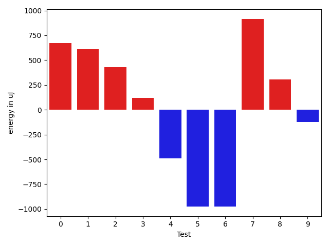

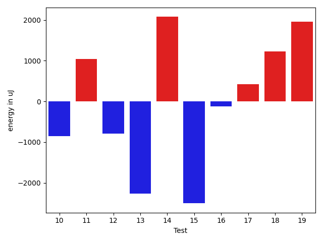

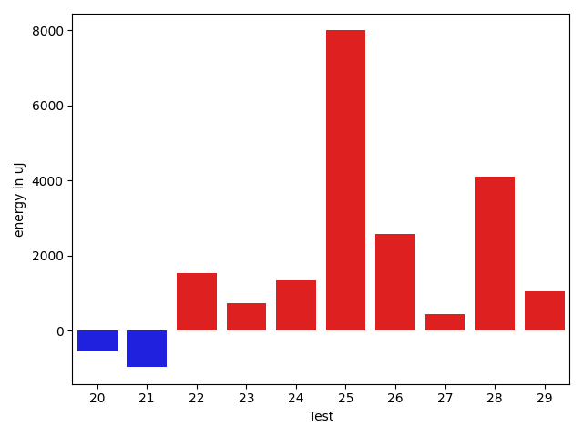

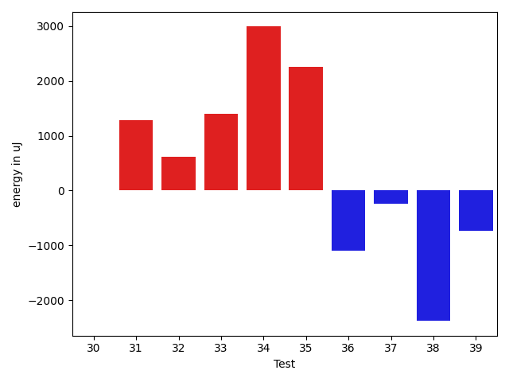

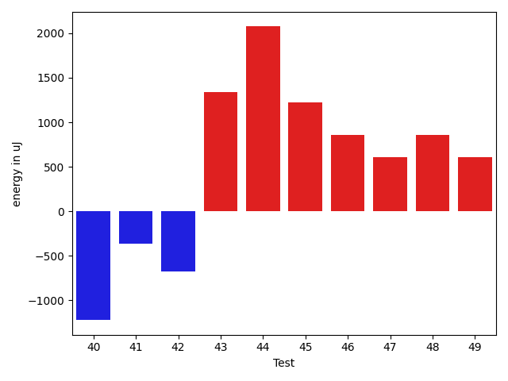

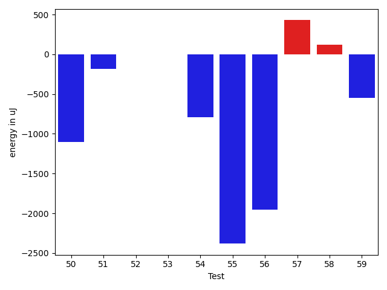

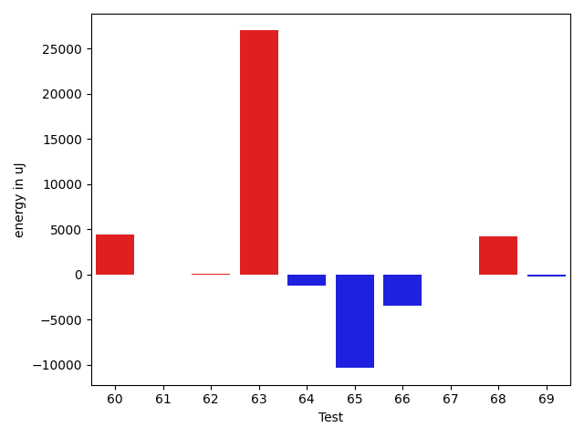

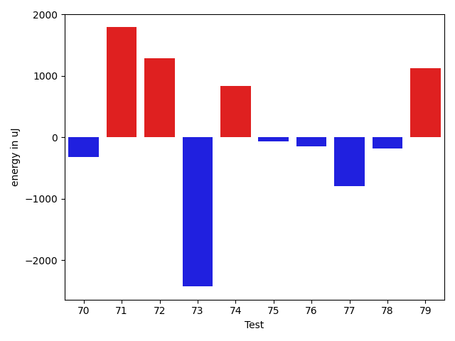

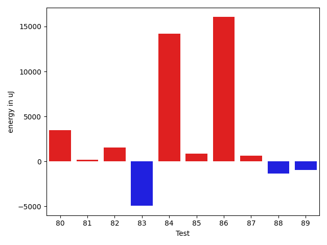

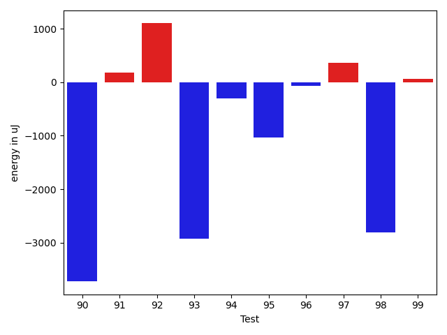

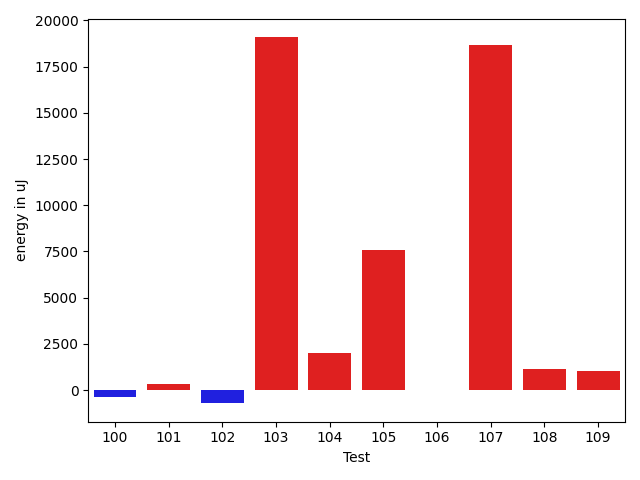

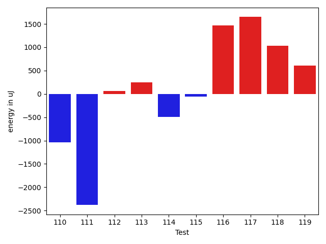

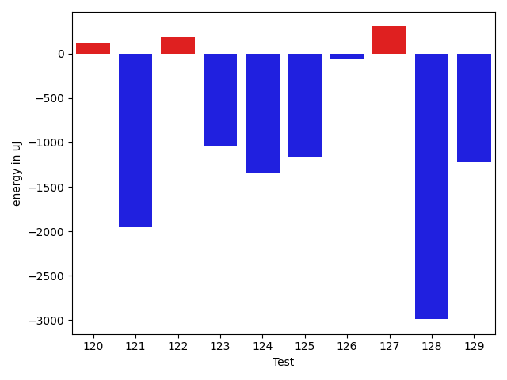

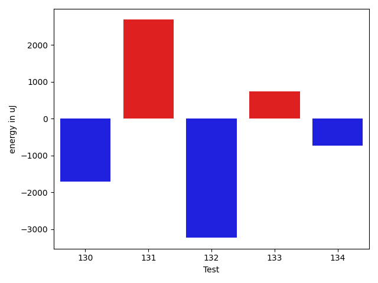

| ID | EnergyV1 | EnergyV2 | DeltaEnergy | σV1 | σV2 |
| --- | --- | --- | --- | --- | --- |
| 0 | 35278 | 35950 | 672 | 9301.613499457855 | 7395.107573571285 |
| 1 | 35034 | 35645 | 611 | 24257.318799908786 | 22562.553898463106 |
| 2 | 36132 | 36560 | 428 | 16744.15389839817 | 14256.56561154631 |
| 3 | 71472 | 71594 | 122 | 23960.724429260943 | 22995.274261544182 |
| 4 | 35401 | 34912 | -489 | 14108.301898709744 | 7602.763304366526 |
| 5 | 35461 | 34485 | -976 | 2955.0921315879204 | 3550.528338765232 |
| 6 | 33631 | 32654 | -977 | 4774.786554275373 | 2557.6624306923304 |
| 7 | 35461 | 36377 | 916 | 8054.318252134483 | 8970.726871113837 |
| 8 | 37415 | 37720 | 305 | 87256.54297868827 | 99622.61474168941 |
| 9 | 35766 | 35644 | -122 | 4301.049056643544 | 3995.987498709643 |
| 10 | 35217 | 34362 | -855 | 3431.7910183299778 | 4303.727821625081 |
| 11 | 33081 | 34119 | 1038 | 3348.359711492214 | 2815.5898910854557 |
| 12 | 34485 | 33692 | -793 | 3449.138966376246 | 3042.4615800652014 |
| 13 | 36682 | 34424 | -2258 | 2953.9178124498208 | 2912.1471910297087 |
| 14 | 35217 | 37292 | 2075 | 3694.025043760993 | 3408.311116260503 |
| 15 | 37109 | 34607 | -2502 | 6476.038223642143 | 3444.7712681027197 |
| 16 | 36865 | 36743 | -122 | 4505.605945219106 | 79804.91368245608 |
| 17 | 34302 | 34729 | 427 | 6903.637568506613 | 3298.574437693641 |
| 18 | 33996 | 35217 | 1221 | 3312.327304197507 | 2639.9118283644366 |
| 19 | 33692 | 35645 | 1953 | 3793.747772861339 | 4494.929572997884 |
| 20 | 34851 | 34301 | -550 | 7395.033193461538 | 4206.301227805289 |
| 21 | 34851 | 33875 | -976 | 55324.761898671015 | 4754.468789852785 |
| 22 | 33875 | 35401 | 1526 | 3453.4022426567653 | 2999.5312478114347 |
| 23 | 34912 | 35644 | 732 | 67957.10667650364 | 3537.062878801245 |
| 24 | 36743 | 38086 | 1343 | 4249.362339051443 | 6089.460214287379 |
| 25 | 41503 | 49499 | 7996 | 92742.88628051011 | 106776.622978634 |
| 26 | 34912 | 37475 | 2563 | 4383.659375627752 | 4372.071790586338 |
| 27 | 36682 | 37109 | 427 | 9209.715915566268 | 11580.698683436045 |
| 28 | 38208 | 42298 | 4090 | 30192.137858756018 | 32661.917259032813 |
| 29 | 36621 | 37659 | 1038 | 11540.14013230065 | 5362.09083104576 |
| 30 | 36804 | 36805 | 1 | 13455.945979142454 | 11388.753374305057 |
| 31 | 35706 | 36987 | 1281 | 4694.559526845488 | 4003.918248948434 |
| 32 | 40650 | 41260 | 610 | 85709.90854553721 | 101783.36279941721 |
| 33 | 36133 | 37537 | 1404 | 26278.409690912704 | 22072.342879981345 |
| 34 | 36437 | 39428 | 2991 | 30273.98023359936 | 32585.394284281276 |
| 35 | 36132 | 38391 | 2259 | 7662.352178130508 | 4989.6903919991455 |
| 36 | 37170 | 36072 | -1098 | 56474.864504682264 | 69757.57908051123 |
| 37 | 34973 | 34729 | -244 | 3121.825498296565 | 4167.656784859915 |
| 38 | 38208 | 35828 | -2380 | 18325.037419626926 | 3690.7578737950666 |
| 39 | 36071 | 35339 | -732 | 3725.324884033567 | 3413.3286663442673 |
| 40 | 111999 | 110778 | -1221 | 24529.34696383491 | 19592.23391725877 |
| 41 | 35156 | 34790 | -366 | 2890.4787596233596 | 3427.515192535509 |
| 42 | 36011 | 35339 | -672 | 3694.529746126542 | 3999.9383263228146 |
| 43 | 37903 | 39246 | 1343 | 19199.789461023607 | 16852.305445843307 |
| 44 | 34973 | 37048 | 2075 | 2843.971943114619 | 3684.097151583579 |
| 45 | 35339 | 36560 | 1221 | 3976.5993733828523 | 3537.714509974149 |
| 46 | 33875 | 34729 | 854 | 3622.634222138555 | 3714.735723348431 |
| 47 | 35950 | 36560 | 610 | 3229.0755085627834 | 2811.2966285264197 |
| 48 | 36255 | 37109 | 854 | 5963.008725237305 | 3465.8202839666164 |
| 49 | 36865 | 37476 | 611 | 3951.4465401925913 | 4720.797708015034 |
| 50 | 37110 | 36010 | -1100 | 4399.889846908733 | 3817.2538465491243 |
| 51 | 36255 | 36072 | -183 | 3057.9158709688045 | 3703.0606700929015 |
| 52 | 35950 | 35949 | -1 | 9336.00562374371 | 10009.373266641634 |
| 53 | 39123 | 39123 | 0 | 40531.43993339114 | 38734.325777091 |
| 54 | 37415 | 36621 | -794 | 8185.0178644495345 | 9217.557561702599 |
| 55 | 39978 | 37597 | -2381 | 4573.449104561911 | 3930.0019655070005 |
| 56 | 39429 | 37475 | -1954 | 4007.479442788821 | 3899.899677306528 |
| 57 | 37170 | 37598 | 428 | 4596.107161879308 | 3857.7944489047104 |
| 58 | 40283 | 40405 | 122 | 21265.167974701108 | 18767.032566404214 |
| 59 | 37720 | 37170 | -550 | 4517.722232674076 | 4917.753712962956 |
| 60 | 39001 | 38758 | -243 | 7687.4172840628 | 12495.801397136027 |
| 61 | 36743 | 36744 | 1 | 3344.9205145456385 | 4140.598574252626 |
| 62 | 38818 | 37415 | -1403 | 4767.187449406388 | 3676.8257169109493 |
| 63 | 37720 | 42053 | 4333 | 21232.056682840062 | 49226.21428754033 |
| 64 | 37842 | 36927 | -915 | 3875.6691339895315 | 3489.6792727508164 |
| 65 | 40466 | 40405 | -61 | 402249.009621367 | 330791.6710339409 |
| 66 | 39184 | 39428 | 244 | 19936.989223880875 | 16836.783201835202 |
| 67 | 36804 | 35583 | -1221 | 3386.296224852306 | 3926.1076765071466 |
| 68 | 38086 | 39307 | 1221 | 29326.60967317046 | 36412.103101161294 |
| 69 | 35705 | 35218 | -487 | 3104.0474704749504 | 3290.5834318247134 |
| 70 | 38086 | 37414 | -672 | 3238.2536548978615 | 4514.67991791729 |
| 71 | 34240 | 35462 | 1222 | 2858.9321834544867 | 3038.2232038950647 |
| 72 | 35645 | 37109 | 1464 | 3644.2109976584156 | 3975.6102322798524 |
| 73 | 39124 | 34851 | -4273 | 3221.032076835001 | 3364.508122195723 |
| 74 | 34851 | 36071 | 1220 | 3345.70651651853 | 4594.7491345420585 |
| 75 | 37170 | 36682 | -488 | 3500.3387481843547 | 3545.6762214398473 |
| 76 | 36194 | 36255 | 61 | 3759.2814112392393 | 3546.4472177817775 |
| 77 | 37170 | 37598 | 428 | 4114.053992110458 | 3561.2262020576877 |
| 78 | 37048 | 36865 | -183 | 3294.0462606264014 | 3943.6557444011 |
| 79 | 36194 | 37780 | 1586 | 3484.3401110683785 | 4733.918963722784 |
| 80 | 37659 | 40039 | 2380 | 31532.482690231074 | 38397.57100356962 |
| 81 | 38025 | 37475 | -550 | 3938.26822292023 | 3881.4984943940754 |
| 82 | 35278 | 37781 | 2503 | 3944.5912291741674 | 6529.759391109469 |
| 83 | 70495 | 71716 | 1221 | 35156.360880624976 | 29238.906132468146 |
| 84 | 37659 | 39002 | 1343 | 11539.080406506579 | 41636.69381282394 |
| 85 | 36804 | 38513 | 1709 | 3555.3347674436723 | 4565.548384352257 |
| 86 | 36804 | 37598 | 794 | 20054.827760417193 | 86483.70824050269 |
| 87 | 34607 | 34912 | 305 | 3893.4246066486958 | 3844.577418565498 |
| 88 | 35461 | 34545 | -916 | 6529.480367807246 | 3045.9065488619312 |
| 89 | 36194 | 36010 | -184 | 3464.6074821129764 | 4046.4660990172492 |
| 90 | 37842 | 34119 | -3723 | 3975.132196968989 | 4388.0787598068955 |
| 91 | 35706 | 35888 | 182 | 3516.499994196456 | 3597.354418168629 |
| 92 | 35339 | 36438 | 1099 | 3950.4930139483145 | 4754.2785193970285 |
| 93 | 37659 | 34729 | -2930 | 4042.28770333622 | 3821.9764843485873 |
| 94 | 39733 | 39429 | -304 | 47037.34487687627 | 31628.198174690784 |
| 95 | 36621 | 35583 | -1038 | 3853.6981531747288 | 4304.158701417053 |
| 96 | 36438 | 36376 | -62 | 3424.2136362761457 | 3614.659097188681 |
| 97 | 34545 | 34912 | 367 | 3255.9588062779576 | 3579.602970991448 |
| 98 | 70801 | 67993 | -2808 | 38287.24605261377 | 42076.99398548113 |
| 99 | 37231 | 37293 | 62 | 3693.5361333337414 | 4765.854315024833 |
| 100 | 37354 | 36743 | -611 | 3676.4977673741028 | 2582.144189789545 |
| 101 | 37293 | 37964 | 671 | 3972.3812567231557 | 4106.212917885065 |
| 102 | 36193 | 34302 | -1891 | 4261.682294358899 | 3899.510848063724 |
| 103 | 317198 | 318969 | 1771 | 84798.12890182712 | 118577.9316030501 |
| 104 | 40039 | 40771 | 732 | 44741.14982564832 | 36987.74457758618 |
| 105 | 38818 | 39673 | 855 | 48144.7976116626 | 59913.02540177796 |
| 106 | 37598 | 38086 | 488 | 14234.105097109932 | 12791.024435169786 |
| 107 | 38086 | 39673 | 1587 | 114352.01847172777 | 144617.30080745945 |
| 108 | 36865 | 37719 | 854 | 10188.08072659578 | 9597.397925625506 |
| 109 | 35095 | 37781 | 2686 | 3759.917365128201 | 4319.937015667698 |
| 110 | 36682 | 35645 | -1037 | 21249.58611032224 | 4480.740998734561 |
| 111 | 39001 | 36621 | -2380 | 120094.00693784747 | 111627.5314251326 |
| 112 | 38879 | 38940 | 61 | 155300.23841331416 | 118969.4078670191 |
| 113 | 67627 | 67871 | 244 | 21443.946653523828 | 24016.606920488743 |
| 114 | 38147 | 37659 | -488 | 402648.2035567316 | 4064.024286860871 |
| 115 | 37964 | 37902 | -62 | 33882.63376482362 | 44034.30160149789 |
| 116 | 36744 | 38207 | 1463 | 3123.1511192352264 | 4338.545690824761 |
| 117 | 37292 | 38940 | 1648 | 39760.63723042094 | 61849.12408870428 |
| 118 | 37781 | 38818 | 1037 | 4671.490700428167 | 3717.845243168453 |
| 119 | 37720 | 38330 | 610 | 19180.915607481307 | 46863.57414983032 |
| 120 | 37659 | 37781 | 122 | 13615.019338241995 | 11681.371539058744 |
| 121 | 39246 | 37292 | -1954 | 38832.816083604754 | 31840.172404401772 |
| 122 | 38635 | 38818 | 183 | 36163.23120101678 | 35182.96977259343 |
| 123 | 37292 | 36255 | -1037 | 13848.772964395617 | 16569.801647852746 |
| 124 | 37720 | 36377 | -1343 | 4095.226110753298 | 4300.482545188704 |
| 125 | 37231 | 36072 | -1159 | 4362.011965716423 | 4231.245695416734 |
| 126 | 37231 | 37170 | -61 | 3934.330094176241 | 3921.639148286721 |
| 127 | 37841 | 38147 | 306 | 3580.6123676454617 | 5015.1339989575545 |
| 128 | 40344 | 37354 | -2990 | 91432.38434951882 | 101034.14538594203 |
| 129 | 37110 | 35889 | -1221 | 3342.5057767016574 | 4989.863155611423 |
| 130 | 38208 | 36499 | -1709 | 9060.309359750087 | 14240.153418786946 |
| 131 | 37170 | 39856 | 2686 | 15457.63258268422 | 29453.411795337473 |
| 132 | 42968 | 39734 | -3234 | 552262.8535957361 | 454693.0782096719 |
| 133 | 36987 | 37720 | 733 | 5814.696851760185 | 3462.5291452343363 |
| 134 | 37598 | 36865 | -733 | 3316.623705213401 | 5169.896555212534 |

## Delta Duration per test method

| ID | DurationV1 | DurationsV2 | DeltaDuration |
| --- | --- | --- | --- |
| 0 | 600278.3333333334 | 623542.7407407408 | 23264.407407407416 |
| 1 | 1557810.5454545454 | 1486479.9894736842 | -71330.55598086119 |
| 2 | 1391091.011904762 | 1313244.6923076923 | -77846.31959706964 |
| 3 | 2405463.5353535353 | 2140029.6666666665 | -265433.8686868688 |
| 4 | 1172136.447761194 | 1089309.8666666667 | -82826.58109452738 |
| 5 | 579687.3703703703 | 513235.5833333333 | -66451.78703703702 |
| 6 | 378127.1666666667 | 374252.0625 | -3875.104166666686 |
| 7 | 1041944.0666666667 | 973915.5970149253 | -68028.46965174132 |
| 8 | 1551997.027027027 | 1727443.0909090908 | 175446.06388206384 |
| 9 | 644951.1388888889 | 572030.25 | -72920.88888888888 |
| 10 | 739552.5 | 728015.6764705882 | -11536.823529411806 |
| 11 | 588261.5483870967 | 562212.5652173914 | -26048.983169705374 |
| 12 | 838336.46875 | 808966.8888888889 | -29369.579861111124 |
| 13 | 466246.25 | 465715.6 | -530.6500000000233 |
| 14 | 607591.3548387097 | 687728.5294117647 | 80137.174573055 |
| 15 | 914933.3888888889 | 861943.3673469388 | -52990.02154195006 |
| 16 | 638147.7291666666 | 1153663.6315789474 | 515515.9024122808 |
| 17 | 540352.1785714285 | 492433.46153846156 | -47918.71703296696 |
| 18 | 446638.5652173913 | 448569.1538461539 | 1930.5886287625763 |
| 19 | 639764.3448275862 | 636584.96875 | -3179.376077586203 |
| 20 | 816006.0178571428 | 699137.4146341464 | -116868.60322299646 |
| 21 | 909242.3870967742 | 497431.4736842105 | -411810.9134125637 |
| 22 | 536832.7727272727 | 528087.4583333334 | -8745.314393939334 |
| 23 | 996621.8529411765 | 624793.84375 | -371828.0091911765 |
| 24 | 787321.6666666666 | 807795.8125 | 20474.145833333372 |
| 25 | 2342664.878787879 | 2722658.707070707 | 379993.828282828 |
| 26 | 886602.3478260869 | 962896.3714285714 | 76294.02360248449 |
| 27 | 1163084.527027027 | 1178834.9210526317 | 15750.394025604706 |
| 28 | 1525362.5409836066 | 1726016.0563380283 | 200653.5153544217 |
| 29 | 977116.0153846154 | 882750.5 | -94365.5153846154 |
| 30 | 1015619.9 | 1059182.8596491227 | 43562.95964912267 |
| 31 | 862519.2549019608 | 936511.8852459016 | 73992.63034394081 |
| 32 | 1960224.1746031747 | 2424052.7352941176 | 463828.5606909429 |
| 33 | 1078239.064516129 | 1019729.8301886793 | -58509.234327449696 |
| 34 | 1306357.9473684211 | 1394818.322580645 | 88460.37521222397 |
| 35 | 895767.2608695652 | 896753.3114754099 | 986.0506058447063 |
| 36 | 952509.2333333333 | 1025848.4516129033 | 73339.21827956999 |
| 37 | 676944.2564102564 | 689171.1388888889 | 12226.882478632499 |
| 38 | 903398.4444444445 | 629476.2972972973 | -273922.1471471472 |
| 39 | 701371.8918918918 | 848297.4736842106 | 146925.58179231873 |
| 40 | 3353478.01010101 | 3314820.484848485 | -38657.52525252523 |
| 41 | 594807.6578947369 | 626306.3611111111 | 31498.70321637427 |
| 42 | 684367.9210526316 | 711971.3488372093 | 27603.42778457771 |
| 43 | 1240519.9038461538 | 1260552.86 | 20032.956153846346 |
| 44 | 494807.4090909091 | 486267.347826087 | -8540.061264822143 |
| 45 | 551116.6944444445 | 571435.8928571428 | 20319.198412698344 |
| 46 | 683687.9069767442 | 671774.7555555556 | -11913.15142118861 |
| 47 | 461562.36 | 391007.0 | -70555.35999999999 |
| 48 | 752053.1428571428 | 757476.5 | 5423.3571428571595 |
| 49 | 466270.75 | 420881.0625 | -45389.6875 |
| 50 | 496107.2916666667 | 523108.6923076923 | 27001.400641025626 |
| 51 | 453228.90476190473 | 452040.1666666667 | -1188.7380952380481 |
| 52 | 1064482.5810810812 | 1132988.0 | 68505.41891891882 |
| 53 | 1236780.6046511629 | 1061882.4583333333 | -174898.1463178296 |
| 54 | 1119722.5555555555 | 1132789.240506329 | 13066.684950773604 |
| 55 | 487549.4761904762 | 513345.2 | 25795.7238095238 |
| 56 | 521879.25 | 466672.75 | -55206.5 |
| 57 | 787704.4130434783 | 774435.3 | -13269.113043478224 |
| 58 | 1627671.6989247312 | 1571894.7157894736 | -55776.983135257615 |
| 59 | 782809.8461538461 | 876306.0961538461 | 93496.25 |
| 60 | 971625.3947368421 | 1053108.2333333334 | 81482.83859649126 |
| 61 | 755503.9074074074 | 813624.6326530612 | 58120.72524565377 |
| 62 | 815424.2222222222 | 774663.7407407408 | -40760.48148148146 |
| 63 | 819718.5666666667 | 1837995.1538461538 | 1018276.5871794871 |
| 64 | 620256.7352941176 | 715586.5666666667 | 95329.83137254906 |
| 65 | 3293259.675324675 | 3031024.3670886075 | -262235.30823606765 |
| 66 | 1420547.953488372 | 1239683.68 | -180864.2734883721 |
| 67 | 456062.4285714286 | 451522.1904761905 | -4540.238095238106 |
| 68 | 1284655.4347826086 | 1337433.64 | 52778.20521739125 |
| 69 | 400974.82352941175 | 413784.17647058825 | 12809.352941176505 |
| 70 | 565426.5652173914 | 470021.0 | -95405.56521739135 |
| 71 | 484435.35714285716 | 413257.8461538461 | -71177.51098901103 |
| 72 | 390949.3181818182 | 492147.7727272727 | 101198.45454545453 |
| 73 | 469654.1 | 421143.0 | -48511.09999999998 |
| 74 | 418052.23076923075 | 421276.1875 | 3223.9567307692487 |
| 75 | 483416.14285714284 | 434233.6111111111 | -49182.53174603172 |
| 76 | 449229.2 | 420288.29411764705 | -28940.905882352963 |
| 77 | 431743.5 | 383450.4 | -48293.09999999998 |
| 78 | 913405.3518518518 | 913165.9298245613 | -239.42202729044948 |
| 79 | 766344.7 | 815724.2941176471 | 49379.59411764715 |
| 80 | 1118355.8333333333 | 1216752.125 | 98396.29166666674 |
| 81 | 547649.8928571428 | 569196.0606060605 | 21546.16774891771 |
| 82 | 718533.8888888889 | 715276.8095238095 | -3257.0793650794076 |
| 83 | 2352014.9494949495 | 2203564.242424242 | -148450.70707070734 |
| 84 | 682821.0689655172 | 1151087.1612903227 | 468266.09232480545 |
| 85 | 655685.0 | 651731.4210526316 | -3953.578947368427 |
| 86 | 862404.71875 | 1265277.9736842106 | 402873.25493421056 |
| 87 | 621137.5172413794 | 580964.15625 | -40173.36099137936 |
| 88 | 938978.9777777778 | 872272.58 | -66706.39777777786 |
| 89 | 721801.4594594594 | 732979.1363636364 | 11177.676904176944 |
| 90 | 510610.2105263158 | 532926.1739130435 | 22315.96338672767 |
| 91 | 484863.71428571426 | 493725.1212121212 | 8861.406926406955 |
| 92 | 452340.6153846154 | 465950.86666666664 | 13610.251282051264 |
| 93 | 622898.8888888889 | 591863.4074074074 | -31035.48148148146 |
| 94 | 1666118.576923077 | 1204169.6341463414 | -461948.94277673564 |
| 95 | 466063.38095238095 | 518298.95238095237 | 52235.57142857142 |
| 96 | 536657.3181818182 | 486319.0 | -50338.318181818235 |
| 97 | 665187.0 | 590801.8235294118 | -74385.1764705882 |
| 98 | 2174188.6818181816 | 1909510.309090909 | -264678.37272727257 |
| 99 | 607273.304347826 | 563741.5357142857 | -43531.76863354037 |
| 100 | 604658.3225806452 | 611460.4615384615 | 6802.1389578162925 |
| 101 | 725194.4444444445 | 679490.7777777778 | -45703.666666666744 |
| 102 | 595235.6296296297 | 540835.125 | -54400.504629629664 |
| 103 | 9190532.343434343 | 9510927.737373738 | 320395.3939393945 |
| 104 | 1719906.5333333334 | 1755352.569892473 | 35446.03655913961 |
| 105 | 1504545.4242424243 | 1674212.754385965 | 169667.33014354063 |
| 106 | 1332481.6352941177 | 1311143.3295454546 | -21338.305748663144 |
| 107 | 2227903.2285714285 | 2664338.4146341463 | 436435.1860627178 |
| 108 | 786632.8888888889 | 953333.9743589744 | 166701.0854700855 |
| 109 | 630166.8518518518 | 635693.90625 | 5527.054398148204 |
| 110 | 753557.5 | 561313.0 | -192244.5 |
| 111 | 2172776.214285714 | 2224638.4137931033 | 51862.19950738922 |
| 112 | 2911494.8333333335 | 1594079.7647058824 | -1317415.068627451 |
| 113 | 2050986.8585858585 | 2028083.505050505 | -22903.35353535344 |
| 114 | 2957801.3913043477 | 687232.2619047619 | -2270569.1293995855 |
| 115 | 1180700.731707317 | 1317468.303030303 | 136767.57132298592 |
| 116 | 685367.0370370371 | 714449.6923076923 | 29082.655270655174 |
| 117 | 1020647.4166666666 | 1671692.3461538462 | 651044.9294871796 |
| 118 | 760868.2647058824 | 720877.4680851063 | -39990.79662077606 |
| 119 | 1011293.8620689656 | 1463781.2631578948 | 452487.40108892927 |
| 120 | 1310712.8076923077 | 1204962.0 | -105750.80769230775 |
| 121 | 1388206.403508772 | 1308900.9107142857 | -79305.49279448623 |
| 122 | 1406631.796875 | 1286410.1176470588 | -120221.6792279412 |
| 123 | 1245621.275 | 1051849.5857142857 | -193771.68928571418 |
| 124 | 994846.3880597015 | 946119.8852459016 | -48726.50281379989 |
| 125 | 894037.6153846154 | 843082.875 | -50954.740384615376 |
| 126 | 652714.6923076923 | 643560.4375 | -9154.254807692254 |
| 127 | 422132.76470588235 | 470069.3 | 47936.53529411764 |
| 128 | 2206688.6666666665 | 2100407.0 | -106281.66666666651 |
| 129 | 441158.77777777775 | 454911.0 | 13752.222222222248 |
| 130 | 952386.025 | 905848.0476190476 | -46537.97738095245 |
| 131 | 1102229.5223880596 | 1464802.9423076923 | 362573.4199196326 |
| 132 | 5228877.04109589 | 4256270.430555556 | -972606.6105403341 |
| 133 | 1070329.8 | 930043.9583333334 | -140285.84166666667 |
| 134 | 958196.2363636363 | 885084.6037735849 | -73111.63259005139 |

## Misc.

| ID | Test Class | Test Method |
| --- | --- | --- |
| 0 | com.google.gson.functional.ObjectTest | testStringFieldWithEmptyValueDeserialization |
| 1 | com.google.gson.functional.ObjectTest | testEmptyCollectionInAnObjectDeserialization |
| 2 | com.google.gson.functional.ObjectTest | testArrayOfArraysDeserialization |
| 3 | com.google.gson.functional.ObjectTest | testSingletonLists |
| 4 | com.google.gson.functional.ObjectTest | testStringFieldWithNumberValueDeserialization |
| 5 | com.google.gson.functional.ObjectTest | testPrivateNoArgConstructorDeserialization |
| 6 | com.google.gson.functional.ObjectTest | testNullDeserialization |
| 7 | com.google.gson.functional.ObjectTest | testArrayOfObjectsDeserialization |
| 8 | com.google.gson.functional.ObjectTest | testJsonInSingleQuotesDeserialization |
| 9 | com.google.gson.functional.ObjectTest | testJsonInMixedQuotesDeserialization |
| 10 | com.google.gson.functional.ObjectTest | testNullFieldsDeserialization |
| 11 | com.google.gson.functional.ObjectTest | testNullPrimitiveFieldsDeserialization |
| 12 | com.google.gson.functional.ObjectTest | testInnerClassDeserialization |
| 13 | com.google.gson.functional.ObjectTest | testClassWithNoFieldsDeserialization |
| 14 | com.google.gson.functional.ObjectTest | testClassWithTransientFieldsDeserialization |
| 15 | com.google.gson.functional.ObjectTest | testNestedDeserialization |
| 16 | com.google.gson.functional.ObjectTest | testBagOfPrimitivesDeserialization |
| 17 | com.google.gson.functional.ObjectTest | testNullObjectFieldsDeserialization |
| 18 | com.google.gson.functional.ObjectTest | testEmptyStringDeserialization |
| 19 | com.google.gson.functional.ObjectTest | testBagOfPrimitiveWrappersDeserialization |
| 20 | com.google.gson.functional.ObjectTest | testPrimitiveArrayInAnObjectDeserialization |
| 21 | com.google.gson.functional.ObjectTest | testNullArraysDeserialization |
| 22 | com.google.gson.functional.ObjectTest | testObjectFieldNamesWithoutQuotesDeserialization |
| 23 | com.google.gson.functional.ObjectTest | testClassWithTransientFieldsDeserializationTransientFieldsPassedInJsonAreIgnored |
| 24 | com.google.gson.functional.CustomDeserializerTest | testDefaultConstructorNotCalledOnField |
| 25 | com.google.gson.functional.CustomDeserializerTest | testDefaultConstructorNotCalledOnObject |
| 26 | com.google.gson.functional.CustomDeserializerTest | testCustomDeserializerReturnsNullForArrayElementsForArrayField |
| 27 | com.google.gson.functional.CustomDeserializerTest | testJsonTypeFieldBasedDeserialization |
| 28 | com.google.gson.functional.CustomDeserializerTest | testCustomDeserializerReturnsNullForTopLevelObject |
| 29 | com.google.gson.functional.CustomDeserializerTest | testCustomDeserializerReturnsNull |
| 30 | com.google.gson.functional.CustomDeserializerTest | testCustomDeserializerReturnsNullForArrayElements |
| 31 | com.google.gson.functional.CustomDeserializerTest | testCustomDeserializerReturnsNullForPrimitiveFields |
| 32 | com.google.gson.functional.JsonParserTest | testBadTypeForDeserializingCustomTree |
| 33 | com.google.gson.functional.JsonParserTest | testBadFieldTypeForCustomDeserializerCustomTree |
| 34 | com.google.gson.functional.JsonParserTest | testChangingCustomTreeAndDeserializing |
| 35 | com.google.gson.functional.JsonParserTest | testBadFieldTypeForDeserializingCustomTree |
| 36 | com.google.gson.functional.JsonParserTest | testDeserializingCustomTree |
| 37 | com.google.gson.functional.DefaultTypeAdaptersTest | testBadValueForBigDecimalDeserialization |
| 38 | com.google.gson.functional.DefaultTypeAdaptersTest | testUrlDeserialization |
| 39 | com.google.gson.functional.DefaultTypeAdaptersTest | testPropertiesDeserialization |
| 40 | com.google.gson.functional.DefaultTypeAdaptersTest | testDefaultDateDeserializationUsingBuilder |
| 41 | com.google.gson.functional.DefaultTypeAdaptersTest | testDefaultCalendarDeserialization |
| 42 | com.google.gson.functional.DefaultTypeAdaptersTest | testDateDeserializationWithPattern |
| 43 | com.google.gson.functional.DefaultTypeAdaptersTest | testBigDecimalFieldDeserialization |
| 44 | com.google.gson.functional.DefaultTypeAdaptersTest | testUuidDeserialization |
| 45 | com.google.gson.functional.DefaultTypeAdaptersTest | testDefaultGregorianCalendarDeserialization |
| 46 | com.google.gson.functional.DefaultTypeAdaptersTest | testBigIntegerFieldDeserialization |
| 47 | com.google.gson.functional.DefaultTypeAdaptersTest | testLocaleDeserializationWithLanguageCountryVariant |
| 48 | com.google.gson.functional.DefaultTypeAdaptersTest | testUrlNullDeserialization |
| 49 | com.google.gson.functional.DefaultTypeAdaptersTest | testLocaleDeserializationWithLanguageCountry |
| 50 | com.google.gson.functional.DefaultTypeAdaptersTest | testUriDeserialization |
| 51 | com.google.gson.functional.DefaultTypeAdaptersTest | testLocaleDeserializationWithLanguage |
| 52 | com.google.gson.functional.ReadersWritersTest | testReadWriteTwoObjects |
| 53 | com.google.gson.functional.ReadersWritersTest | testReaderForDeserialization |
| 54 | com.google.gson.functional.ReadersWritersTest | testReadWriteTwoStrings |
| 55 | com.google.gson.functional.ReadersWritersTest | testTopLevelNullObjectDeserializationWithReader |
| 56 | com.google.gson.functional.ReadersWritersTest | testTopLevelNullObjectDeserializationWithReaderAndSerializeNulls |
| 57 | com.google.gson.functional.CollectionTest | testRawCollectionOfBagOfPrimitivesNotAllowed |
| 58 | com.google.gson.functional.CollectionTest | testWildcardCollectionField |
| 59 | com.google.gson.functional.CollectionTest | testRawCollectionDeserializationNotAlllowed |
| 60 | com.google.gson.functional.NullObjectAndFieldTest | testExplicitDeserializationOfNulls |
| 61 | com.google.gson.functional.NullObjectAndFieldTest | testCustomTypeAdapterPassesNullDesrialization |
| 62 | com.google.gson.functional.NullObjectAndFieldTest | testNullWrappedPrimitiveMemberDeserialization |
| 63 | com.google.gson.functional.NullObjectAndFieldTest | testTopLevelNullObjectDeserialization |
| 64 | com.google.gson.functional.NullObjectAndFieldTest | testExplicitNullSetsFieldToNullDuringDeserialization |
| 65 | com.google.gson.JsonParserTest | testReadWriteTwoObjects |
| 66 | com.google.gson.functional.StringTest | testSingleQuoteInStringSerialization |
| 67 | com.google.gson.functional.StringTest | testEscapedCtrlNInStringDeserialization |
| 68 | com.google.gson.functional.StringTest | testStringValueDeserialization |
| 69 | com.google.gson.functional.StringTest | testEscapedBackslashInStringDeserialization |
| 70 | com.google.gson.functional.StringTest | testStringValueAsSingleElementArrayDeserialization |
| 71 | com.google.gson.functional.StringTest | testEscapingQuotesInStringDeserialization |
| 72 | com.google.gson.functional.StringTest | testEscapingQuotesInStringSerialization |
| 73 | com.google.gson.functional.StringTest | testStringWithEscapedSlashDeserialization |
| 74 | com.google.gson.functional.StringTest | testSingleQuoteInStringDeserialization |
| 75 | com.google.gson.functional.StringTest | testAssignmentCharDeserialization |
| 76 | com.google.gson.functional.StringTest | testJavascriptKeywordsInStringDeserialization |
| 77 | com.google.gson.functional.StringTest | testEscapedCtrlRInStringDeserialization |
| 78 | com.google.gson.functional.VersioningTest | testVersionedGsonMixingSinceAndUntilDeserialization |
| 79 | com.google.gson.functional.VersioningTest | testVersionedClassesDeserialization |
| 80 | com.google.gson.functional.VersioningTest | testVersionedUntilDeserialization |
| 81 | com.google.gson.functional.VersioningTest | testIgnoreLaterVersionClassDeserialization |
| 82 | com.google.gson.functional.VersioningTest | testVersionedGsonWithUnversionedClassesDeserialization |
| 83 | com.google.gson.functional.EnumTest | testEnumSubclass |
| 84 | com.google.gson.functional.EnumTest | testTopLevelEnumDeserialization |
| 85 | com.google.gson.functional.EnumTest | testTopLevelEnumInASingleElementArrayDeserialization |
| 86 | com.google.gson.functional.EnumTest | testClassWithEnumFieldDeserialization |
| 87 | com.google.gson.functional.ArrayTest | testArrayWithoutTypeInfoDeserialization |
| 88 | com.google.gson.functional.ArrayTest | testArrayOfPrimitivesAsObjectsDeserialization |
| 89 | com.google.gson.functional.ArrayTest | testArrayOfPrimitivesWithCustomTypeAdapter |
| 90 | com.google.gson.functional.ArrayTest | testEmptyArrayDeserialization |
| 91 | com.google.gson.functional.ArrayTest | testSingleStringArrayDeserialization |
| 92 | com.google.gson.functional.ArrayTest | testSingleNullInArrayDeserialization |
| 93 | com.google.gson.functional.ArrayTest | testInvalidArrayDeserialization |
| 94 | com.google.gson.functional.ArrayTest | testTopLevelArrayOfIntsDeserialization |
| 95 | com.google.gson.functional.ArrayTest | testArrayOfStringsDeserialization |
| 96 | com.google.gson.functional.ArrayTest | testNullsInArrayDeserialization |
| 97 | com.google.gson.functional.ArrayTest | testArrayOfObjectsWithoutTypeInfoDeserialization |
| 98 | com.google.gson.functional.NamingPolicyTest | testGsonWithNonDefaultFieldNamingPolicyDeserialiation |
| 99 | com.google.gson.functional.NamingPolicyTest | testGsonWithLowerCaseUnderscorePolicyDeserialiation |
| 100 | com.google.gson.functional.NamingPolicyTest | testGsonWithLowerCaseDashPolicyDeserialiation |
| 101 | com.google.gson.functional.NamingPolicyTest | testGsonWithSerializedNameFieldNamingPolicyDeserialization |
| 102 | com.google.gson.functional.NamingPolicyTest | testGsonWithUpperCamelCaseSpacesPolicyDeserialiation |
| 103 | com.google.gson.functional.ConcurrencyTest | testMultiThreadDeserialization |
| 104 | com.google.gson.functional.ConcurrencyTest | testSingleThreadDeserialization |
| 105 | com.google.gson.functional.EscapingTest | testEscapingObjectFields |
| 106 | com.google.gson.functional.EscapingTest | testGsonAcceptsEscapedAndNonEscapedJsonDeserialization |
| 107 | com.google.gson.functional.EscapingTest | testEscapingQuotesInStringArray |
| 108 | com.google.gson.GsonTypeAdapterTest | testTypeAdapterThrowsException |
| 109 | com.google.gson.GsonTypeAdapterTest | testDefaultTypeAdapterThrowsParseException |
| 110 | com.google.gson.GsonTypeAdapterTest | testTypeAdapterProperlyConvertsTypes |
| 111 | com.google.gson.GsonTypeAdapterTest | testTypeAdapterDoesNotAffectNonAdaptedTypes |
| 112 | com.google.gson.functional.UncategorizedTest | testInvalidJsonDeserializationFails |
| 113 | com.google.gson.functional.UncategorizedTest | testReturningDerivedClassesDuringDeserialization |
| 114 | com.google.gson.functional.SecurityTest | testJsonWithNonExectuableTokenWithConfiguredGsonDeserialization |
| 115 | com.google.gson.functional.SecurityTest | testNonExecutableJsonDeserialization |
| 116 | com.google.gson.functional.SecurityTest | testJsonWithNonExectuableTokenWithRegularGsonDeserialization |
| 117 | com.google.gson.functional.ExposeFieldsTest | testExposedInterfaceFieldDeserialization |
| 118 | com.google.gson.functional.ExposeFieldsTest | testNoExposedFieldDeserialization |
| 119 | com.google.gson.functional.ExposeFieldsTest | testExposeAnnotationDeserialization |
| 120 | com.google.gson.functional.InheritanceTest | testSubInterfacesOfCollectionDeserialization |
| 121 | com.google.gson.functional.InheritanceTest | testSubClassDeserialization |
| 122 | com.google.gson.functional.CustomTypeAdaptersTest | testCustomDeserializers |
| 123 | com.google.gson.functional.CustomTypeAdaptersTest | testCustomDeserializerForLong |
| 124 | com.google.gson.functional.CustomTypeAdaptersTest | testCustomNestedDeserializers |
| 125 | com.google.gson.functional.CustomTypeAdaptersTest | testCustomByteArrayDeserializerAndInstanceCreator |
| 126 | com.google.gson.functional.CustomTypeAdaptersTest | testEnsureCustomDeserializerNotInvokedForNullValues |
| 127 | com.google.gson.functional.InternationalizationTest | testStringsWithUnicodeChineseCharactersEscapedDeserialization |
| 128 | com.google.gson.functional.InternationalizationTest | testStringsWithRawChineseCharactersDeserialization |
| 129 | com.google.gson.functional.InternationalizationTest | testStringsWithUnicodeChineseCharactersDeserialization |
| 130 | com.google.gson.functional.ExclusionStrategyFunctionalTest | testExclusionStrategyDeserialization |
| 131 | com.google.gson.functional.CircularReferenceTest | testDirectedAcyclicGraphDeserialization |
| 132 | com.google.gson.functional.InstanceCreatorTest | testInstanceCreatorReturnsBaseType |
| 133 | com.google.gson.functional.InstanceCreatorTest | testInstanceCreatorReturnsSubTypeForField |
| 134 | com.google.gson.functional.InstanceCreatorTest | testInstanceCreatorReturnsSubTypeForTopLevelObject |

| Test | IterationV1 | IterationV2 | DeltaIteration |
| --- | --- | --- | --- |
| 0 | 33 | 27 | -6 |
| 1 | 88 | 95 | 7 |
| 2 | 84 | 78 | -6 |
| 3 | 99 | 99 | 0 |
| 4 | 67 | 60 | -7 |
| 5 | 27 | 24 | -3 |
| 6 | 12 | 16 | 4 |
| 7 | 60 | 67 | 7 |
| 8 | 37 | 44 | 7 |
| 9 | 36 | 32 | -4 |
| 10 | 38 | 34 | -4 |
| 11 | 31 | 23 | -8 |
| 12 | 64 | 45 | -19 |
| 13 | 24 | 15 | -9 |
| 14 | 31 | 34 | 3 |
| 15 | 54 | 49 | -5 |
| 16 | 48 | 38 | -10 |
| 17 | 28 | 26 | -2 |
| 18 | 23 | 13 | -10 |
| 19 | 29 | 32 | 3 |
| 20 | 56 | 41 | -15 |
| 21 | 31 | 19 | -12 |
| 22 | 22 | 24 | 2 |
| 23 | 34 | 32 | -2 |
| 24 | 42 | 48 | 6 |
| 25 | 99 | 99 | 0 |
| 26 | 69 | 70 | 1 |
| 27 | 74 | 76 | 2 |
| 28 | 61 | 71 | 10 |
| 29 | 65 | 62 | -3 |
| 30 | 50 | 57 | 7 |
| 31 | 51 | 61 | 10 |
| 32 | 63 | 68 | 5 |
| 33 | 31 | 53 | 22 |
| 34 | 57 | 62 | 5 |
| 35 | 46 | 61 | 15 |
| 36 | 30 | 31 | 1 |
| 37 | 39 | 36 | -3 |
| 38 | 27 | 37 | 10 |
| 39 | 37 | 38 | 1 |
| 40 | 99 | 99 | 0 |
| 41 | 38 | 36 | -2 |
| 42 | 38 | 43 | 5 |
| 43 | 52 | 50 | -2 |
| 44 | 22 | 23 | 1 |
| 45 | 36 | 28 | -8 |
| 46 | 43 | 45 | 2 |
| 47 | 25 | 17 | -8 |
| 48 | 42 | 52 | 10 |
| 49 | 20 | 16 | -4 |
| 50 | 24 | 26 | 2 |
| 51 | 21 | 24 | 3 |
| 52 | 74 | 68 | -6 |
| 53 | 43 | 48 | 5 |
| 54 | 72 | 79 | 7 |
| 55 | 21 | 15 | -6 |
| 56 | 24 | 24 | 0 |
| 57 | 46 | 50 | 4 |
| 58 | 93 | 95 | 2 |
| 59 | 52 | 52 | 0 |
| 60 | 38 | 30 | -8 |
| 61 | 54 | 49 | -5 |
| 62 | 45 | 54 | 9 |
| 63 | 30 | 26 | -4 |
| 64 | 34 | 30 | -4 |
| 65 | 77 | 79 | 2 |
| 66 | 43 | 50 | 7 |
| 67 | 14 | 21 | 7 |
| 68 | 23 | 25 | 2 |
| 69 | 17 | 17 | 0 |
| 70 | 23 | 17 | -6 |
| 71 | 14 | 13 | -1 |
| 72 | 22 | 22 | 0 |
| 73 | 10 | 18 | 8 |
| 74 | 13 | 16 | 3 |
| 75 | 14 | 18 | 4 |
| 76 | 15 | 17 | 2 |
| 77 | 16 | 15 | -1 |
| 78 | 54 | 57 | 3 |
| 79 | 50 | 51 | 1 |
| 80 | 60 | 56 | -4 |
| 81 | 28 | 33 | 5 |
| 82 | 36 | 42 | 6 |
| 83 | 99 | 99 | 0 |
| 84 | 29 | 31 | 2 |
| 85 | 16 | 19 | 3 |
| 86 | 32 | 38 | 6 |
| 87 | 29 | 32 | 3 |
| 88 | 45 | 50 | 5 |
| 89 | 37 | 44 | 7 |
| 90 | 19 | 23 | 4 |
| 91 | 14 | 33 | 19 |
| 92 | 13 | 15 | 2 |
| 93 | 27 | 27 | 0 |
| 94 | 52 | 41 | -11 |
| 95 | 21 | 21 | 0 |
| 96 | 22 | 12 | -10 |
| 97 | 31 | 34 | 3 |
| 98 | 44 | 55 | 11 |
| 99 | 23 | 28 | 5 |
| 100 | 31 | 26 | -5 |
| 101 | 36 | 36 | 0 |
| 102 | 27 | 24 | -3 |
| 103 | 99 | 99 | 0 |
| 104 | 90 | 93 | 3 |
| 105 | 66 | 57 | -9 |
| 106 | 85 | 88 | 3 |
| 107 | 35 | 41 | 6 |
| 108 | 27 | 39 | 12 |
| 109 | 27 | 32 | 5 |
| 110 | 20 | 29 | 9 |
| 111 | 14 | 29 | 15 |
| 112 | 60 | 51 | -9 |
| 113 | 99 | 99 | 0 |
| 114 | 23 | 42 | 19 |
| 115 | 41 | 33 | -8 |
| 116 | 27 | 39 | 12 |
| 117 | 36 | 26 | -10 |
| 118 | 34 | 47 | 13 |
| 119 | 58 | 57 | -1 |
| 120 | 78 | 86 | 8 |
| 121 | 57 | 56 | -1 |
| 122 | 64 | 51 | -13 |
| 123 | 80 | 70 | -10 |
| 124 | 67 | 61 | -6 |
| 125 | 52 | 48 | -4 |
| 126 | 39 | 32 | -7 |
| 127 | 17 | 20 | 3 |
| 128 | 27 | 23 | -4 |
| 129 | 18 | 18 | 0 |
| 130 | 40 | 42 | 2 |
| 131 | 67 | 52 | -15 |
| 132 | 73 | 72 | -1 |
| 133 | 65 | 72 | 7 |
| 134 | 55 | 53 | -2 |

| Time Label | Time (s) |
| --- | --- |
| Selection | 27.597249507904053 |
| Injection | 12.288263320922852 |
| Total | 1080.5983324050903 |

