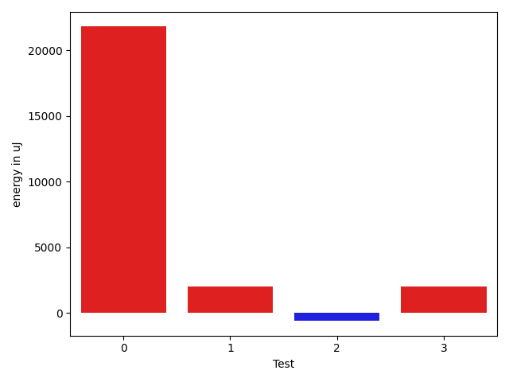

# gson d9feb9

https://github.com/google/gson/commit/d9feb9

## Delta Energy per test method

| ID | EnergyV1 | EnergyV2 | DeltaEnergy | σV1 | σV2 |
| --- | --- | --- | --- | --- | --- |
| 0 | 39489 | 61279 | 21790 | 230838.80670255137 | 255285.1971693756 |
| 1 | 34363 | 36377 | 2014 | 4908.549794144623 | 4514.8828840399865 |
| 2 | 36194 | 35583 | -611 | 29494.866929034142 | 43660.19014559281 |
| 3 | 37170 | 39184 | 2014 | 4721.664786746136 | 4411.3063150903 |

## Delta Duration per test method

| ID | DurationV1 | DurationsV2 | DeltaDuration |
| --- | --- | --- | --- |
| 0 | 5729415.393939394 | 8585826.901960785 | 2856411.508021391 |
| 1 | 751635.375 | 729541.2083333334 | -22094.166666666628 |
| 2 | 1044716.6756756756 | 1031346.0476190476 | -13370.628056628047 |
| 3 | 919689.96875 | 862983.5 | -56706.46875 |

## Misc.

| ID | Test Class | Test Method |
| --- | --- | --- |
| 0 | com.google.gson.functional.UncategorizedTest | testInvalidJsonDeserializationFails |
| 1 | com.google.gson.functional.ObjectTest | testEmptyStringDeserialization |
| 2 | com.google.gson.functional.ArrayTest | testInvalidArrayDeserialization |
| 3 | com.google.gson.JsonParserTest | testParseEmptyWhitespaceInput |

| Test | IterationV1 | IterationV2 | DeltaIteration |
| --- | --- | --- | --- |
| 0 | 66 | 51 | -15 |
| 1 | 24 | 24 | 0 |
| 2 | 37 | 42 | 5 |
| 3 | 32 | 30 | -2 |

| Time Label | Time (s) |
| --- | --- |
| Selection | 26.28922152519226 |
| Injection | 10.001611471176147 |
| Total | 1007.7607917785645 |

