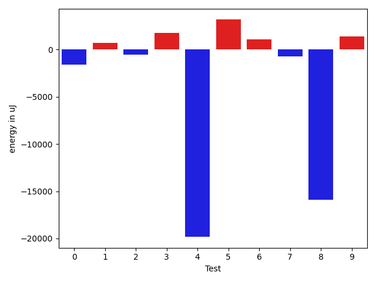
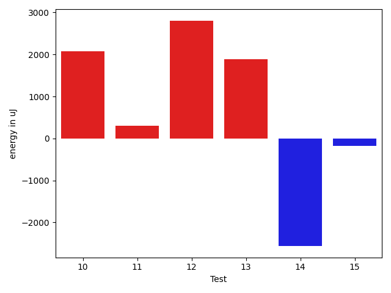

# gson 202bbf

https://github.com/google/gson/commit/202bbf

## Delta Energy per test method

| ID | EnergyV1 | EnergyV2 | DeltaEnergy | σV1 | σV2 |
| --- | --- | --- | --- | --- | --- |
| 0 | 41199 | 39612 | -1587 | 21335.472856947374 | 15439.076871789435 |
| 1 | 43335 | 44067 | 732 | 628893.186476532 | 554641.2850130388 |
| 2 | 35767 | 35217 | -550 | 18895.557737780968 | 15719.468391305556 |
| 3 | 35828 | 37598 | 1770 | 13963.37451981484 | 22070.46365346664 |
| 4 | 57128 | 37293 | -19835 | 18797.951356835605 | 17714.737472990266 |
| 5 | 76172 | 79345 | 3173 | 51770.525061976485 | 45637.15414454789 |
| 6 | 35462 | 36560 | 1098 | 16007.083233427424 | 20558.477121061034 |
| 7 | 39184 | 38452 | -732 | 4131.664272953345 | 8770.441564943172 |
| 8 | 60363 | 44434 | -15929 | 21570.543990202517 | 22195.176555848142 |
| 9 | 41138 | 42542 | 1404 | 97118.18084990913 | 83128.30493419254 |
| 10 | 73120 | 75196 | 2076 | 23900.33508309829 | 24222.550386080395 |
| 11 | 40161 | 40466 | 305 | 836087.8275986844 | 742793.7867463809 |
| 12 | 38086 | 40893 | 2807 | 4064.5652110121987 | 4137.763059644076 |
| 13 | 39673 | 41565 | 1892 | 18397.045187989166 | 10317.011262522707 |
| 14 | 41382 | 38818 | -2564 | 10227.988099448217 | 7007.993956186095 |
| 15 | 39673 | 39490 | -183 | 20550.13366607179 | 21110.55549163375 |

## Delta Duration per test method

| ID | DurationV1 | DurationsV2 | DeltaDuration |
| --- | --- | --- | --- |
| 0 | 1581217.2872340425 | 1530046.182795699 | -51171.10443834355 |
| 1 | 7411949.893617021 | 6093202.62886598 | -1318747.2647510413 |
| 2 | 1684057.6464646466 | 1686264.1818181819 | 2206.5353535353206 |
| 3 | 1566716.3434343433 | 1650200.505050505 | 83484.1616161617 |
| 4 | 1766730.6262626264 | 1744640.8484848484 | -22089.777777777985 |
| 5 | 2952724.0505050505 | 2963362.8585858587 | 10638.80808080826 |
| 6 | 1610435.9191919193 | 1643635.8484848484 | 33199.929292929126 |
| 7 | 967809.0238095238 | 1079831.5961538462 | 112022.57234432246 |
| 8 | 1861856.616161616 | 1928733.9090909092 | 66877.29292929312 |
| 9 | 2742652.119047619 | 2559719.811111111 | -182932.30793650774 |
| 10 | 2377350.8282828284 | 2323203.383838384 | -54147.444444444496 |
| 11 | 12529283.069444444 | 9595617.219178082 | -2933665.8502663616 |
| 12 | 765050.1052631579 | 591342.7857142857 | -173707.31954887218 |
| 13 | 1089553.0256410257 | 1022768.3142857143 | -66784.71135531145 |
| 14 | 846108.9459459459 | 780898.282051282 | -65210.663894663914 |
| 15 | 1241555.8076923077 | 1336889.7959183673 | 95333.98822605959 |

## Misc.

| ID | Test Class | Test Method |
| --- | --- | --- |
| 0 | com.google.gson.functional.ReadersWritersTest | testReadWriteTwoObjects |
| 1 | com.google.gson.JsonParserTest | testReadWriteTwoObjects |
| 2 | com.google.gson.functional.ParameterizedTypesTest | testVariableTypeArrayDeserialization |
| 3 | com.google.gson.functional.ParameterizedTypesTest | testVariableTypeDeserialization |
| 4 | com.google.gson.functional.ParameterizedTypesTest | testParameterizedTypeGenericArraysDeserialization |
| 5 | com.google.gson.functional.ParameterizedTypesTest | testVariableTypeFieldsAndGenericArraysDeserialization |
| 6 | com.google.gson.functional.ParameterizedTypesTest | testParameterizedTypeWithVariableTypeDeserialization |
| 7 | com.google.gson.functional.ArrayTest | testArrayOfPrimitivesWithCustomTypeAdapter |
| 8 | com.google.gson.functional.EscapingTest | testGsonAcceptsEscapedAndNonEscapedJsonDeserialization |
| 9 | com.google.gson.functional.EscapingTest | testEscapingObjectFields |
| 10 | com.google.gson.functional.CollectionTest | testWildcardCollectionField |
| 11 | com.google.gson.MixedStreamTest | testWriteMixedStreamed |
| 12 | com.google.gson.stream.JsonWriterTest | testPrettyPrintArray |
| 13 | com.google.gson.stream.JsonWriterTest | testPrettyPrintObject |
| 14 | com.google.gson.GsonTypeAdapterTest | testTypeAdapterProperlyConvertsTypes |
| 15 | com.google.gson.functional.PrimitiveTest | testOverridingDefaultPrimitiveSerialization |

| Test | IterationV1 | IterationV2 | DeltaIteration |
| --- | --- | --- | --- |
| 0 | 94 | 93 | -1 |
| 1 | 94 | 97 | 3 |
| 2 | 99 | 99 | 0 |
| 3 | 99 | 99 | 0 |
| 4 | 99 | 99 | 0 |
| 5 | 99 | 99 | 0 |
| 6 | 99 | 99 | 0 |
| 7 | 42 | 52 | 10 |
| 8 | 99 | 99 | 0 |
| 9 | 84 | 90 | 6 |
| 10 | 99 | 99 | 0 |
| 11 | 72 | 73 | 1 |
| 12 | 19 | 28 | 9 |
| 13 | 39 | 35 | -4 |
| 14 | 37 | 39 | 2 |
| 15 | 52 | 49 | -3 |

| Time Label | Time (s) |
| --- | --- |
| Selection | 26.901654958724976 |
| Injection | 10.407997131347656 |
| Total | 1024.511312007904 |

