# gson 747e3c

https://github.com/google/gson/commit/747e3c

## Delta Energy per test method

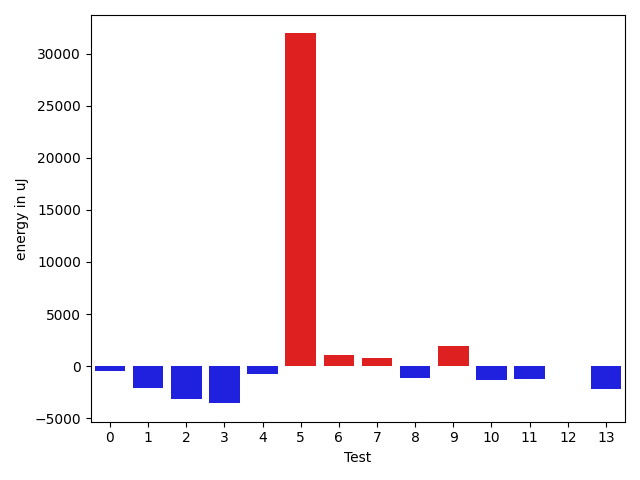

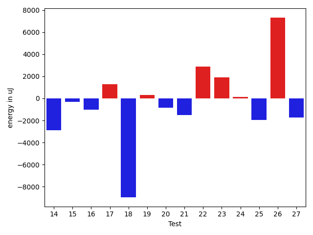

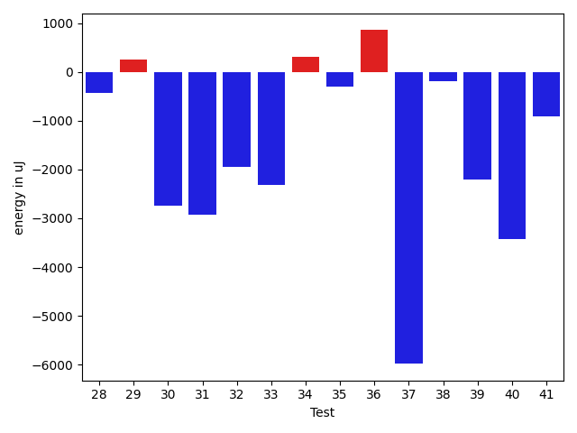

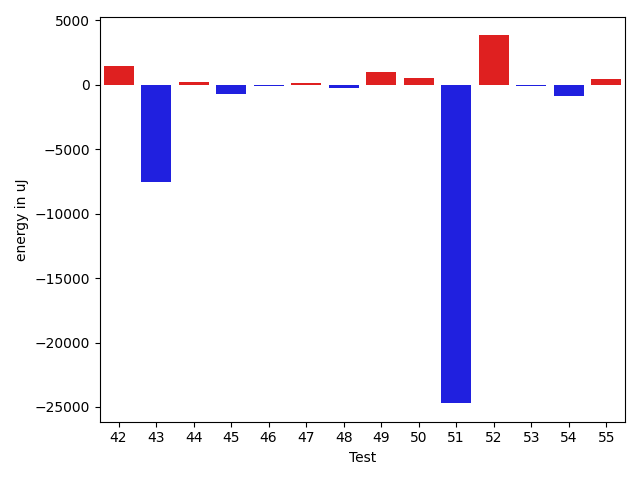

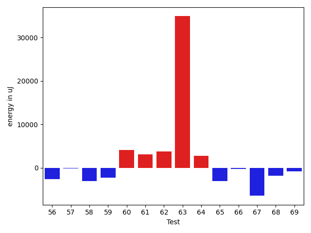

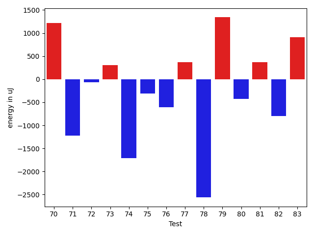

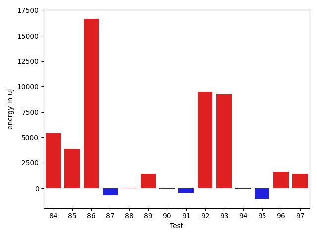

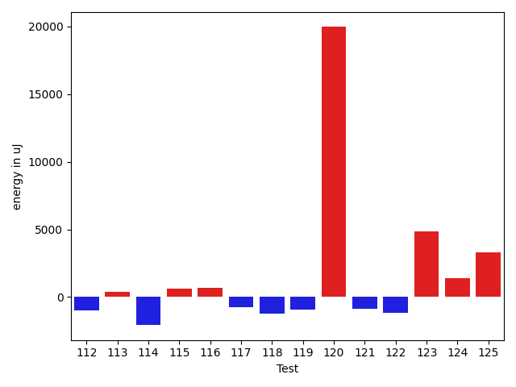

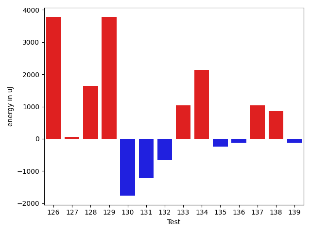

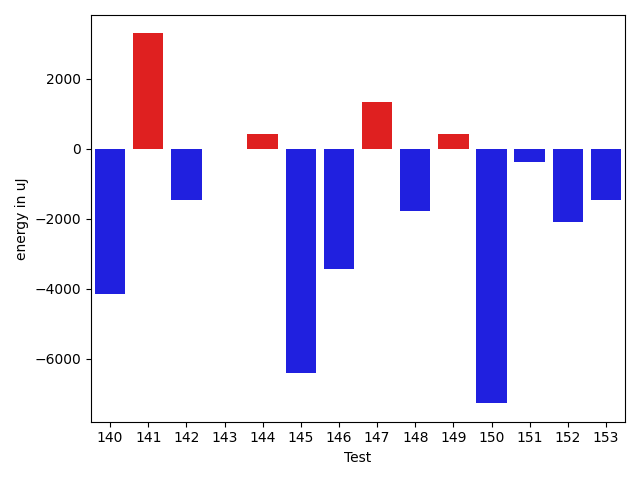

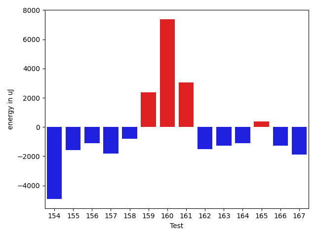

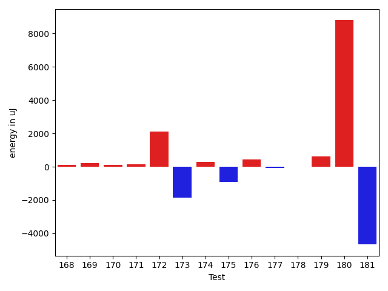

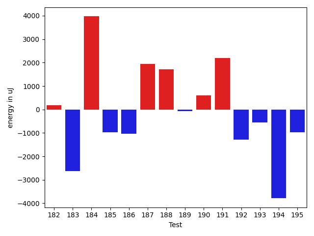

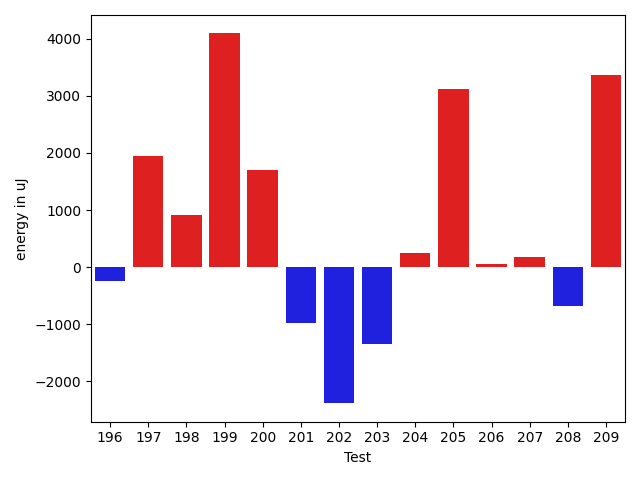

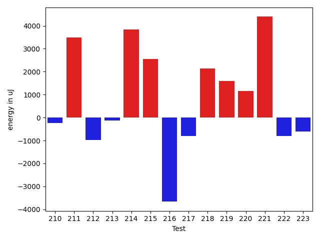

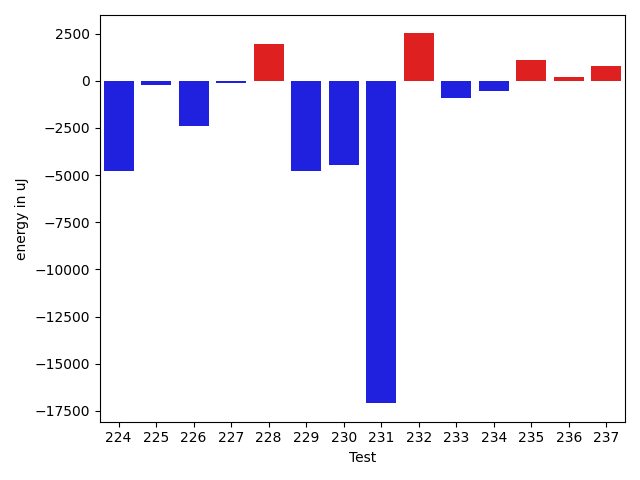

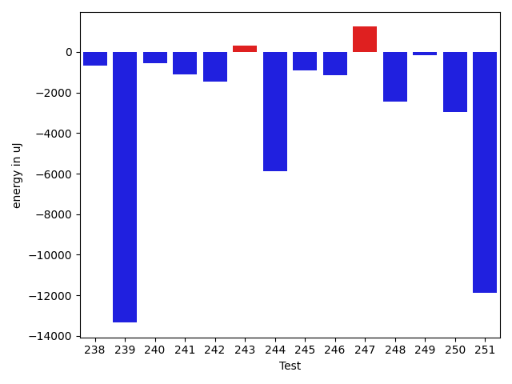

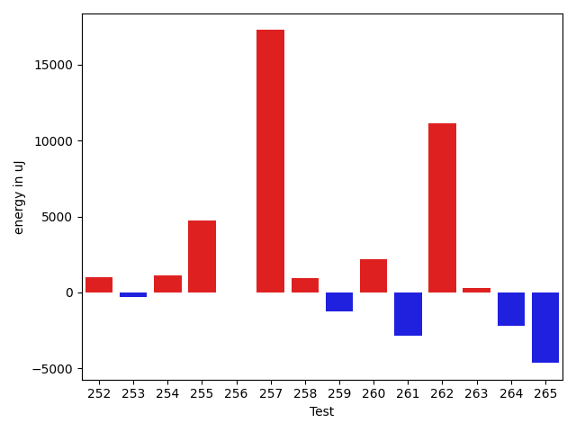

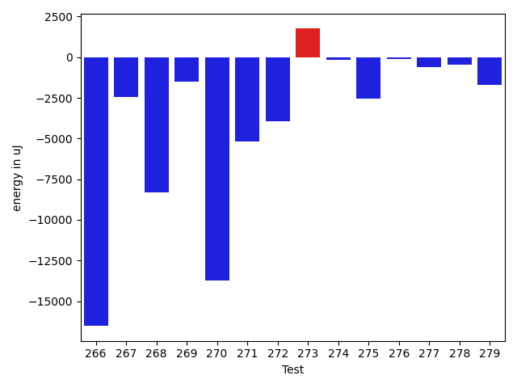

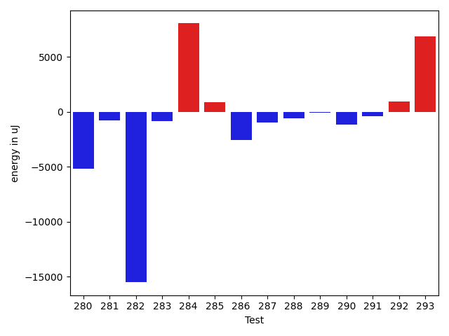

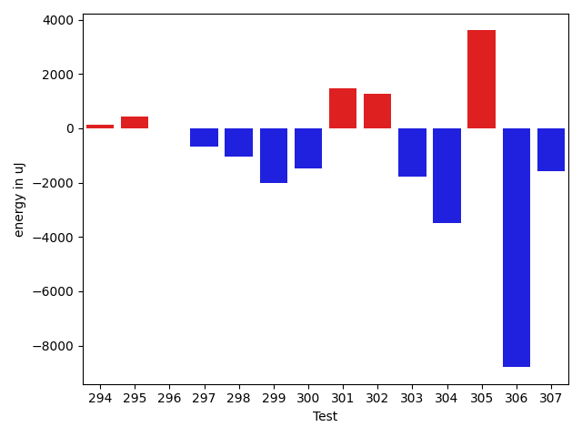

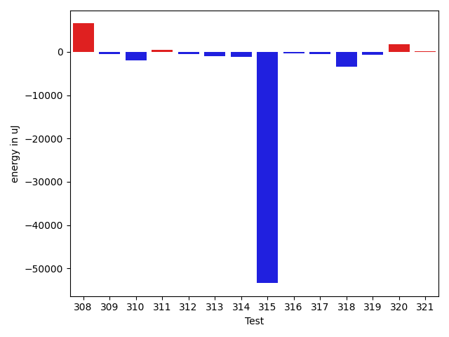

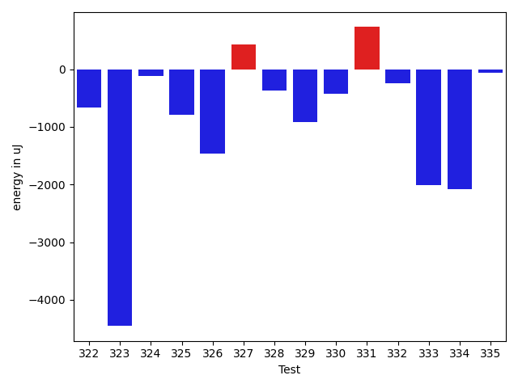

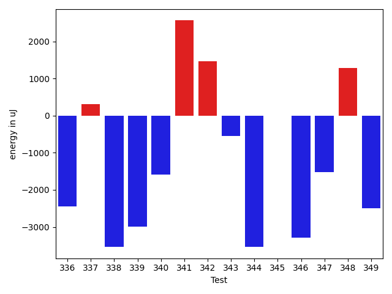

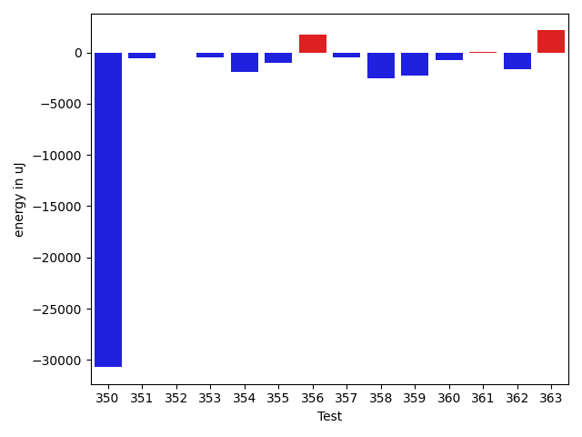

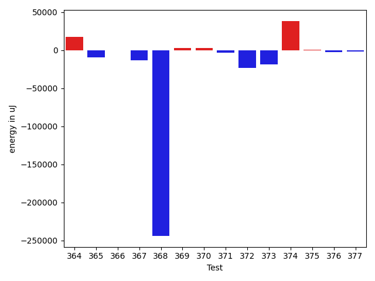

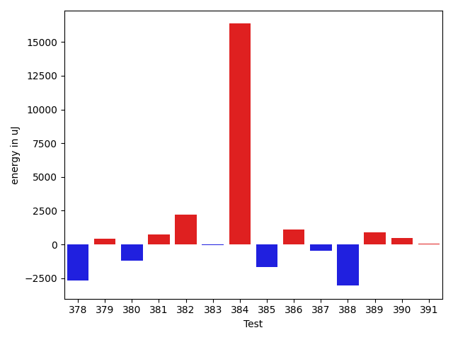

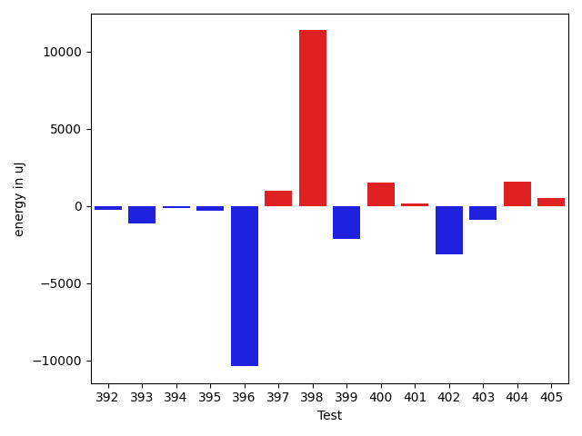

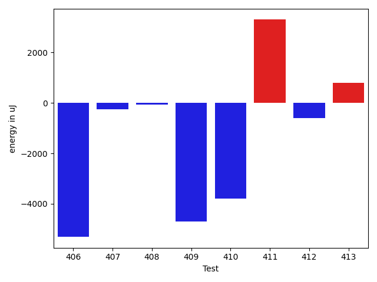

| ID | EnergyV1 | EnergyV2 | DeltaEnergy | σV1 | σV2 |
| --- | --- | --- | --- | --- | --- |
| 0 | 36866 | 36438 | -428 | 4084.4785121277177 | 5702.568578206027 |
| 1 | 37842 | 35339 | -2503 | 4640.049966249947 | 4134.4772706523645 |
| 2 | 35950 | 35461 | -489 | 20633.75429071461 | 4249.548026476967 |
| 3 | 37475 | 34912 | -2563 | 8993.120398773559 | 5465.553588169083 |
| 4 | 36804 | 35583 | -1221 | 4447.701790469113 | 4422.127063383173 |
| 5 | 42114 | 39001 | -3113 | 259761.2465302815 | 324600.59601325897 |
| 6 | 81543 | 81482 | -61 | 28237.74675363234 | 38246.2326879996 |
| 7 | 37841 | 37719 | -122 | 28199.11806958837 | 28068.42324132008 |
| 8 | 37292 | 35889 | -1403 | 8624.037417705567 | 8735.564928721287 |
| 9 | 37659 | 36194 | -1465 | 3935.036549879669 | 24970.413609829342 |
| 10 | 37415 | 36559 | -856 | 3990.987694186481 | 4701.725994633574 |
| 11 | 36255 | 35156 | -1099 | 3941.0393903872646 | 4106.883276610312 |
| 12 | 38147 | 37781 | -366 | 11222.820427300541 | 12122.712290860245 |
| 13 | 38940 | 35461 | -3479 | 4210.411498364754 | 5888.257552641825 |
| 14 | 38391 | 35523 | -2868 | 23030.380983494346 | 23859.25154618124 |
| 15 | 38024 | 37720 | -304 | 44102.73649145185 | 50257.14317779712 |
| 16 | 36071 | 35034 | -1037 | 4349.682733989186 | 3461.4844746388926 |
| 17 | 35096 | 36377 | 1281 | 4107.451124480972 | 3524.4031606626518 |
| 18 | 46082 | 37109 | -8973 | 85513.18877888007 | 4267.453641584084 |
| 19 | 37476 | 37781 | 305 | 30142.322830204543 | 6438.865502112435 |
| 20 | 39673 | 38819 | -854 | 28846.24656169352 | 32514.71229815972 |
| 21 | 38330 | 36804 | -1526 | 4548.193505926561 | 3783.1070550213167 |
| 22 | 35278 | 38147 | 2869 | 8403.755737523734 | 6634.623397403189 |
| 23 | 36560 | 38452 | 1892 | 9625.769443239331 | 5672.580188419654 |
| 24 | 36377 | 36499 | 122 | 8787.042365260842 | 8005.023231400694 |
| 25 | 38391 | 36438 | -1953 | 4253.960908344389 | 3606.2746895090027 |
| 26 | 37963 | 45288 | 7325 | 14286.530229749824 | 67616.90247412164 |
| 27 | 38574 | 36865 | -1709 | 34060.412967657096 | 24733.673336734104 |
| 28 | 35583 | 35156 | -427 | 3818.426021499371 | 4433.224027126461 |
| 29 | 35950 | 36194 | 244 | 3594.369540112207 | 4667.619682814931 |
| 30 | 37902 | 35156 | -2746 | 4181.84942359239 | 3331.6809446430348 |
| 31 | 39795 | 36865 | -2930 | 49010.972957593105 | 35727.90681318117 |
| 32 | 36926 | 34973 | -1953 | 4213.06036846938 | 3196.0643853895613 |
| 33 | 37842 | 35522 | -2320 | 4965.067038958563 | 3317.5130485032937 |
| 34 | 36255 | 36560 | 305 | 7389.156679539459 | 4572.333122376671 |
| 35 | 35889 | 35584 | -305 | 3435.8834867323426 | 4224.6556245679685 |
| 36 | 34546 | 35400 | 854 | 4460.287313432549 | 4576.218357488899 |
| 37 | 114623 | 108642 | -5981 | 20799.449472776305 | 34495.830892716294 |
| 38 | 34973 | 34790 | -183 | 3891.162379652119 | 3964.5502831176727 |
| 39 | 37903 | 35705 | -2198 | 19141.0452010814 | 14942.08508457404 |
| 40 | 37109 | 33691 | -3418 | 4083.8418405172233 | 4230.240684510622 |
| 41 | 36865 | 35950 | -915 | 4964.175051305101 | 4297.179154442381 |
| 42 | 36133 | 37231 | 1098 | 4848.704410687686 | 3870.2297411310024 |
| 43 | 37475 | 35706 | -1769 | 19661.35586103667 | 11147.740140015514 |
| 44 | 35705 | 35339 | -366 | 3917.303966448807 | 4778.929985098039 |
| 45 | 35279 | 36499 | 1220 | 4333.739419874596 | 5142.670793469089 |
| 46 | 34973 | 34363 | -610 | 3684.2833638749125 | 4153.951902652467 |
| 47 | 35828 | 36987 | 1159 | 7498.454582803202 | 8198.978937602758 |
| 48 | 34851 | 34729 | -122 | 3962.915009593808 | 4533.621155283807 |
| 49 | 34362 | 36499 | 2137 | 11596.241376500662 | 11483.677316409989 |
| 50 | 35583 | 37354 | 1771 | 4705.991285016278 | 3946.1658073942754 |
| 51 | 40710 | 38391 | -2319 | 52827.13530148701 | 29216.72119606078 |
| 52 | 34057 | 40833 | 6776 | 4172.341967636157 | 2804.8470794125105 |
| 53 | 35462 | 35034 | -428 | 3812.837583463243 | 3719.7404458342253 |
| 54 | 37537 | 36437 | -1100 | 3640.5948462745164 | 4521.549048834969 |
| 55 | 34363 | 33753 | -610 | 4109.999771422591 | 3841.469947217068 |
| 56 | 38269 | 35157 | -3112 | 4538.1907699923495 | 4102.13023287901 |
| 57 | 38452 | 37536 | -916 | 4099.582543057738 | 3724.668682364705 |
| 58 | 36865 | 34179 | -2686 | 3911.4959328111236 | 4533.311443911613 |
| 59 | 36743 | 35034 | -1709 | 4549.619192855596 | 5303.484289280793 |
| 60 | 34058 | 37598 | 3540 | 1638.5217592560546 | 0.0 |
| 61 | 32653 | 35889 | 3236 | 965.5835886481639 | 0.0 |
| 62 | 33264 | 37658 | 4394 | 1455.4923015942063 | 0.0 |
| 63 | 76599 | 107666 | 31067 | 11645.494293216298 | 0.0 |
| 64 | 35461 | 38268 | 2807 | 0.0 | 0.0 |
| 65 | 37598 | 37841 | 243 | 47266.11801985294 | 41824.312964653436 |
| 66 | 37171 | 38146 | 975 | 4245.354110256075 | 3876.9297397420746 |
| 67 | 41504 | 40710 | -794 | 50645.63182928765 | 40714.9342928911 |
| 68 | 37353 | 37781 | 428 | 8579.698381683424 | 4696.245846299881 |
| 69 | 38453 | 37964 | -489 | 7626.507700089977 | 3957.3033677115923 |
| 70 | 37109 | 38330 | 1221 | 41178.803988745945 | 22717.31944927482 |
| 71 | 39612 | 38391 | -1221 | 4045.5778167146595 | 4143.2658578443525 |
| 72 | 37964 | 37903 | -61 | 7276.09334147107 | 13579.615047398758 |
| 73 | 35888 | 36193 | 305 | 3439.24139514748 | 4915.821373053391 |
| 74 | 37903 | 36194 | -1709 | 3696.3670826907874 | 3745.8108117943043 |
| 75 | 36987 | 36682 | -305 | 5180.648055717633 | 3840.532693600294 |
| 76 | 36804 | 36194 | -610 | 4527.081517050363 | 4679.578634223124 |
| 77 | 37476 | 37842 | 366 | 4191.505786197033 | 7462.807781481293 |
| 78 | 38452 | 35889 | -2563 | 4357.21643787696 | 3477.229186626405 |
| 79 | 37048 | 38391 | 1343 | 4948.11669042317 | 4869.142345817939 |
| 80 | 37842 | 37415 | -427 | 52494.884485568575 | 32003.359738314975 |
| 81 | 37110 | 37475 | 365 | 4241.634929299127 | 4743.883179424577 |
| 82 | 38208 | 37414 | -794 | 4701.066017246099 | 4759.2424738029185 |
| 83 | 39062 | 39978 | 916 | 13256.589416304612 | 14827.027167880544 |
| 84 | 38574 | 37292 | -1282 | 4396.576469821058 | 32691.943894864984 |
| 85 | 39124 | 38025 | -1099 | 4787.830964058001 | 30930.82361434773 |
| 86 | 37841 | 38635 | 794 | 20336.121019231847 | 57081.355451849384 |
| 87 | 36987 | 34179 | -2808 | 5057.100638686766 | 4228.575215013973 |
| 88 | 37231 | 37964 | 733 | 4324.471737882572 | 4715.628285546571 |
| 89 | 35095 | 37658 | 2563 | 3662.6124669203314 | 4695.980256711965 |
| 90 | 37109 | 36866 | -243 | 4172.625346523335 | 4073.689684433724 |
| 91 | 36377 | 35462 | -915 | 4417.565846130418 | 4756.857280547736 |
| 92 | 38513 | 38696 | 183 | 33750.879535841814 | 63002.19066320086 |
| 93 | 38818 | 40528 | 1710 | 30586.13026256493 | 36216.843559034794 |
| 94 | 36011 | 36744 | 733 | 3905.7362762963553 | 4047.3629628118383 |
| 95 | 37475 | 35705 | -1770 | 3989.1094797218934 | 4524.690364533372 |
| 96 | 40161 | 41076 | 915 | 11062.615231014755 | 12455.987493303504 |
| 97 | 42176 | 41259 | -917 | 32042.190836097543 | 29358.701492952987 |
| 98 | 36133 | 34851 | -1282 | 3949.3399435436577 | 4364.493900389362 |
| 99 | 36804 | 35766 | -1038 | 4927.661391786043 | 4003.5166571766767 |
| 100 | 36133 | 35583 | -550 | 4202.568454053556 | 3924.2686152656347 |
| 101 | 35339 | 36866 | 1527 | 4105.2811816991125 | 3626.4315135742777 |
| 102 | 36376 | 35705 | -671 | 4048.18507395859 | 3565.9835418313755 |
| 103 | 36560 | 35157 | -1403 | 5003.7655141056575 | 3838.6977742327144 |
| 104 | 34485 | 36438 | 1953 | 3848.398795603179 | 5511.276427006296 |
| 105 | 36744 | 36255 | -489 | 4040.2624019319624 | 5179.235984069929 |
| 106 | 39978 | 41443 | 1465 | 64470.35464735693 | 92228.61596730321 |
| 107 | 37232 | 35095 | -2137 | 4045.206137930069 | 4483.781827110024 |
| 108 | 36926 | 36743 | -183 | 4753.839500866641 | 5168.2593237829915 |
| 109 | 35889 | 34546 | -1343 | 4059.911888601756 | 3496.2211118201053 |
| 110 | 38086 | 37903 | -183 | 10699.98147780499 | 28553.176649429988 |
| 111 | 35949 | 35705 | -244 | 3846.8420329123833 | 4341.179099213786 |
| 112 | 36804 | 36743 | -61 | 5585.367241717601 | 3272.0343374758922 |
| 113 | 35217 | 34545 | -672 | 4031.8536088135734 | 3726.786876349169 |
| 114 | 37293 | 35705 | -1588 | 8043.200905214871 | 4551.2894000975075 |
| 115 | 35827 | 36315 | 488 | 3716.7661414955705 | 3942.1500240330115 |
| 116 | 37598 | 36865 | -733 | 3766.586599034289 | 4617.313073263381 |
| 117 | 36194 | 34973 | -1221 | 4328.619921858501 | 4450.653328863933 |
| 118 | 36438 | 35706 | -732 | 3888.2778611923127 | 4126.177257863722 |
| 119 | 36498 | 35766 | -732 | 5637.851116338565 | 4020.2278440863706 |
| 120 | 39245 | 37049 | -2196 | 4070.1827636225307 | 66725.9961555643 |
| 121 | 36682 | 35035 | -1647 | 4584.287822411425 | 3945.999094317258 |
| 122 | 36682 | 36988 | 306 | 11519.57769083666 | 8950.645201830577 |
| 123 | 35034 | 38696 | 3662 | 2969.9024563106445 | 4117.780297246187 |
| 124 | 37048 | 38024 | 976 | 6047.250024499566 | 8026.885476967589 |
| 125 | 36499 | 38391 | 1892 | 46710.56591638479 | 47690.42284931379 |
| 126 | 36133 | 39917 | 3784 | 3972.2281212077414 | 5552.141629909258 |
| 127 | 39063 | 39123 | 60 | 82418.5867564867 | 104811.28447539365 |
| 128 | 34058 | 35706 | 1648 | 5408.878450243283 | 3634.259564383766 |
| 129 | 35035 | 38818 | 3783 | 1492.9714241971908 | 4553.9704122398025 |
| 130 | 124877 | 123107 | -1770 | 115401.54593191008 | 92029.75964492811 |
| 131 | 38696 | 37476 | -1220 | 4141.152101722419 | 3801.7547810097585 |
| 132 | 39184 | 38513 | -671 | 3997.1120802608666 | 4039.8397691948358 |
| 133 | 36438 | 37476 | 1038 | 4735.747374818138 | 4428.6761436893285 |
| 134 | 36438 | 38574 | 2136 | 4398.2557975413465 | 3940.781530400848 |
| 135 | 39002 | 38757 | -245 | 44007.97150452359 | 37308.91251331612 |
| 136 | 39002 | 38879 | -123 | 10251.415048737384 | 4176.131937154493 |
| 137 | 36316 | 37354 | 1038 | 3645.07361924978 | 4238.359494473018 |
| 138 | 37658 | 38513 | 855 | 8070.957125083157 | 6255.890695876993 |
| 139 | 38452 | 38330 | -122 | 4160.543396500831 | 4856.71768018278 |
| 140 | 41260 | 37109 | -4151 | 4117.263900619409 | 5676.344175466028 |
| 141 | 38025 | 41321 | 3296 | 3155.1936934292253 | 17664.63346759667 |
| 142 | 38147 | 36682 | -1465 | 4873.38830862555 | 4430.800226264069 |
| 143 | 39123 | 39123 | 0 | 4970.713568957216 | 4570.3200163558695 |
| 144 | 36438 | 36865 | 427 | 4411.681360075714 | 4274.681365643266 |
| 145 | 40222 | 33814 | -6408 | 5734.345125341596 | 4830.601658044081 |
| 146 | 43701 | 40284 | -3417 | 87884.00078425823 | 73488.68385436971 |
| 147 | 35034 | 36377 | 1343 | 4748.076579962002 | 4784.939594772314 |
| 148 | 37719 | 35949 | -1770 | 4172.262607559116 | 4254.447009581941 |
| 149 | 35400 | 35828 | 428 | 5412.797679548275 | 5454.314838718205 |
| 150 | 41077 | 33813 | -7264 | 5090.232568685421 | 2823.0530565329445 |
| 151 | 35156 | 34790 | -366 | 3692.907043045009 | 4216.96452874988 |
| 152 | 38818 | 36743 | -2075 | 4959.804196602831 | 4673.866801161539 |
| 153 | 39184 | 37719 | -1465 | 4266.749827285713 | 3597.3218244401974 |
| 154 | 39673 | 34729 | -4944 | 6188.842474449783 | 2665.5622556768185 |
| 155 | 38025 | 36438 | -1587 | 5690.75546301156 | 2677.003700019362 |
| 156 | 36926 | 35827 | -1099 | 6088.304040522595 | 4796.212733901925 |
| 157 | 36926 | 35095 | -1831 | 59458.261458422785 | 4179.0593666517825 |
| 158 | 37231 | 36438 | -793 | 4525.827367454485 | 4700.639387094058 |
| 159 | 34545 | 36927 | 2382 | 4027.4766480795947 | 4954.719347887076 |
| 160 | 32715 | 40100 | 7385 | 5331.692663618166 | 12641.096107035939 |
| 161 | 35705 | 38757 | 3052 | 4154.187003602468 | 5836.826432707723 |
| 162 | 34668 | 33142 | -1526 | 3907.5364791781817 | 3425.6776062157974 |
| 163 | 37842 | 36560 | -1282 | 4855.012049418621 | 3897.807758511706 |
| 164 | 34545 | 33447 | -1098 | 5127.14052810121 | 3953.0555725744093 |
| 165 | 36011 | 36377 | 366 | 4381.687339899629 | 5465.3022032491035 |
| 166 | 36072 | 34790 | -1282 | 4146.309042154588 | 4400.427207609217 |
| 167 | 38879 | 36988 | -1891 | 13414.21722349775 | 15848.637313236852 |
| 168 | 37476 | 36438 | -1038 | 3989.7456116542426 | 4254.0931999193435 |
| 169 | 35523 | 34423 | -1100 | 5197.1063544229755 | 4945.851119283479 |
| 170 | 33814 | 35644 | 1830 | 5145.788945977401 | 3698.9442313539507 |
| 171 | 35583 | 35645 | 62 | 3442.1179224255893 | 4501.151643726579 |
| 172 | 33203 | 36193 | 2990 | 4043.378916417357 | 4935.789414952823 |
| 173 | 35888 | 32898 | -2990 | 5130.262076112682 | 4297.124799590139 |
| 174 | 36255 | 36011 | -244 | 4318.151045947941 | 3537.562557536594 |
| 175 | 35522 | 33630 | -1892 | 3489.3430286038865 | 5007.95917817982 |
| 176 | 36621 | 36255 | -366 | 4521.8780458150895 | 3383.2616131267687 |
| 177 | 33569 | 34607 | 1038 | 4380.966638923198 | 3622.9772975095907 |
| 178 | 35889 | 36194 | 305 | 5117.451196142271 | 4277.253034812124 |
| 179 | 35583 | 34790 | -793 | 4500.669116920283 | 5287.785751507539 |
| 180 | 35218 | 35888 | 670 | 4192.210286948879 | 34909.6417819911 |
| 181 | 36988 | 35950 | -1038 | 27638.38754573661 | 9409.368884142 |
| 182 | 34668 | 34851 | 183 | 5127.310986920651 | 4200.4728852685785 |
| 183 | 38452 | 35828 | -2624 | 5579.9934295184785 | 4910.62810801479 |
| 184 | 32593 | 36560 | 3967 | 4910.56377127669 | 5088.329294518172 |
| 185 | 39673 | 38696 | -977 | 9253.140958897788 | 6877.381919475355 |
| 186 | 35522 | 34485 | -1037 | 4480.321587664092 | 3799.5359893511995 |
| 187 | 32470 | 34424 | 1954 | 4597.730606029847 | 3769.494778997431 |
| 188 | 34668 | 36376 | 1708 | 4821.138898366625 | 3391.142252325933 |
| 189 | 36071 | 36011 | -60 | 4396.697786596967 | 3781.940254684095 |
| 190 | 36438 | 37048 | 610 | 5459.7004537779085 | 5266.6426121901295 |
| 191 | 35278 | 37476 | 2198 | 4557.423544767373 | 4537.276646498855 |
| 192 | 37902 | 36621 | -1281 | 49834.788936444784 | 4848.704043485018 |
| 193 | 35095 | 34546 | -549 | 3121.86837646945 | 5267.029414392045 |
| 194 | 38330 | 34545 | -3785 | 4136.288291015133 | 4571.8758790297925 |
| 195 | 35461 | 34485 | -976 | 3608.3680781622043 | 3509.4050925771207 |
| 196 | 35705 | 35461 | -244 | 5430.858111037539 | 5079.038826010477 |
| 197 | 35766 | 37719 | 1953 | 4583.28229634884 | 4453.235729469328 |
| 198 | 33997 | 34912 | 915 | 5550.341131988235 | 3711.9293010636225 |
| 199 | 34302 | 38391 | 4089 | 4213.349413940246 | 6660.688198477973 |
| 200 | 35645 | 37353 | 1708 | 4244.692284470542 | 3226.6330822546283 |
| 201 | 36743 | 35766 | -977 | 4506.4968198701745 | 5824.53853519135 |
| 202 | 35950 | 33569 | -2381 | 3387.0519691246614 | 5455.455099273758 |
| 203 | 37353 | 36011 | -1342 | 4433.657743398784 | 4679.4349755071935 |
| 204 | 34912 | 35157 | 245 | 55819.359223385705 | 4616.593250037835 |
| 205 | 35217 | 38330 | 3113 | 3593.2710144565126 | 3095.6071125960984 |
| 206 | 35828 | 35888 | 60 | 4872.708496169523 | 4389.361263218121 |
| 207 | 37475 | 37659 | 184 | 3756.3183371487567 | 2775.3092528381203 |
| 208 | 33997 | 33325 | -672 | 4386.652207531815 | 3912.69150239313 |
| 209 | 34302 | 37659 | 3357 | 4137.666125346963 | 3788.5029034478916 |
| 210 | 35889 | 35644 | -245 | 4236.7084543715955 | 3413.698539117995 |
| 211 | 33691 | 37170 | 3479 | 3091.2909277517056 | 4455.84535189452 |
| 212 | 40894 | 39917 | -977 | 100126.7836951447 | 70649.65088935089 |
| 213 | 37903 | 37781 | -122 | 4835.207970961433 | 3770.4036217723933 |
| 214 | 34546 | 38391 | 3845 | 4984.540128570873 | 5197.587246742473 |
| 215 | 34974 | 37536 | 2562 | 5584.835207356913 | 5177.206098626393 |
| 216 | 38757 | 35095 | -3662 | 4784.267467866072 | 4442.003084459054 |
| 217 | 37414 | 36621 | -793 | 4437.777513460899 | 5090.905185063437 |
| 218 | 33631 | 35767 | 2136 | 4543.405367272542 | 4589.486888116554 |
| 219 | 35156 | 36743 | 1587 | 4154.0381524755185 | 5747.842061253172 |
| 220 | 34790 | 35949 | 1159 | 4642.650192014366 | 3583.8302608861063 |
| 221 | 33508 | 37902 | 4394 | 3103.8601982334053 | 4498.608478431362 |
| 222 | 37353 | 36560 | -793 | 6030.373669327298 | 3532.3530165221787 |
| 223 | 39123 | 38513 | -610 | 11559.155749129906 | 11517.300387352705 |
| 224 | 65979 | 61218 | -4761 | 24625.481199549304 | 21859.40118168927 |
| 225 | 34789 | 34546 | -243 | 5292.0472811643485 | 32544.504457708448 |
| 226 | 39917 | 37537 | -2380 | 14281.167194758162 | 13764.90809846668 |
| 227 | 35766 | 35644 | -122 | 4706.390694837072 | 4430.677642799124 |
| 228 | 35035 | 36987 | 1952 | 3990.9280730548776 | 4650.537874907757 |
| 229 | 38269 | 33508 | -4761 | 4008.131904017132 | 4879.001302030511 |
| 230 | 37659 | 33203 | -4456 | 5305.016945626888 | 4485.725232136166 |
| 231 | 63293 | 46204 | -17089 | 20980.699013317935 | 20995.8007620143 |
| 232 | 35401 | 37902 | 2501 | 4928.07922566186 | 4768.6586788806 |
| 233 | 35645 | 34729 | -916 | 4578.414539194581 | 3937.685976714124 |
| 234 | 36621 | 36072 | -549 | 3950.7271556757432 | 4296.447210124578 |
| 235 | 35949 | 37049 | 1100 | 4418.094611313007 | 3914.4412603783417 |
| 236 | 36316 | 36499 | 183 | 9192.912734452222 | 9784.698041663265 |
| 237 | 36133 | 36927 | 794 | 5141.817328643784 | 3887.012583002 |
| 238 | 37841 | 37537 | -304 | 4233.847916200438 | 3579.4313081544 |
| 239 | 40161 | 37964 | -2197 | 104441.92804697521 | 70963.54863153775 |
| 240 | 35156 | 35644 | 488 | 6715.3681357186115 | 5945.5828284824765 |
| 241 | 37964 | 37659 | -305 | 3983.7385700994437 | 4650.289294825087 |
| 242 | 35157 | 33936 | -1221 | 4725.662864500209 | 3494.0901290961165 |
| 243 | 34057 | 35340 | 1283 | 4151.882201182977 | 3880.9310099681275 |
| 244 | 40344 | 38086 | -2258 | 25084.315234811078 | 17317.265488364872 |
| 245 | 37658 | 35644 | -2014 | 4869.946253296847 | 4369.8497990810765 |
| 246 | 37719 | 36926 | -793 | 4908.486135805958 | 3856.256711175053 |
| 247 | 36316 | 37354 | 1038 | 4590.854451576041 | 4490.225043938832 |
| 248 | 37414 | 34179 | -3235 | 5350.755255427914 | 4263.218510004292 |
| 249 | 35522 | 35340 | -182 | 6525.247071758067 | 4291.536607452393 |
| 250 | 40528 | 36865 | -3663 | 30210.18829970556 | 26993.025095246114 |
| 251 | 36315 | 34729 | -1586 | 51775.7106341485 | 4207.62724369118 |
| 252 | 34790 | 37781 | 2991 | 4228.769188603241 | 4971.037908153339 |
| 253 | 36926 | 36865 | -61 | 4380.6655782076405 | 4154.210399101134 |
| 254 | 38085 | 38269 | 184 | 4465.51956570303 | 4820.411743687961 |
| 255 | 36072 | 37597 | 1525 | 4961.124656018229 | 14563.057456136845 |
| 256 | 37292 | 37293 | 1 | 5344.199744411063 | 4728.514592315419 |
| 257 | 35217 | 35095 | -122 | 4101.996668290537 | 54587.154988169874 |
| 258 | 37109 | 38819 | 1710 | 4124.021779327025 | 4094.7092293751703 |
| 259 | 35767 | 34057 | -1710 | 3673.648947758649 | 4316.974288665937 |
| 260 | 35156 | 38086 | 2930 | 3955.403869228461 | 4371.843725743965 |
| 261 | 37353 | 32654 | -4699 | 4198.416595541969 | 3663.8600839611427 |
| 262 | 38025 | 37903 | -122 | 4554.98675960373 | 45704.21689789685 |
| 263 | 37780 | 36926 | -854 | 8677.766468729911 | 10069.927233147637 |
| 264 | 38024 | 34607 | -3417 | 3803.46650016824 | 4163.900543517324 |
| 265 | 38085 | 36010 | -2075 | 11254.51502873587 | 6864.0840621136795 |
| 266 | 80689 | 73670 | -7019 | 86867.51987389845 | 68785.4023884475 |
| 267 | 37720 | 35950 | -1770 | 8733.427080205085 | 6730.197903954766 |
| 268 | 78185 | 71166 | -7019 | 25329.39714591591 | 24126.70553426533 |
| 269 | 37903 | 37048 | -855 | 11439.439267517564 | 9323.503318453395 |
| 270 | 38208 | 35705 | -2503 | 79578.52146837395 | 47823.84565209048 |
| 271 | 63355 | 44617 | -18738 | 21799.33530048345 | 20846.75893777185 |
| 272 | 39795 | 36865 | -2930 | 14041.025953367127 | 11805.371985985872 |
| 273 | 72875 | 69214 | -3661 | 28492.017626194647 | 41119.17535696618 |
| 274 | 37781 | 36682 | -1099 | 10085.565394021962 | 9958.393185695626 |
| 275 | 39429 | 36987 | -2442 | 15714.624985338372 | 15502.35597563238 |
| 276 | 36621 | 36071 | -550 | 4956.626566058201 | 4381.779390159144 |
| 277 | 36926 | 36011 | -915 | 4517.60393293691 | 4162.872441979533 |
| 278 | 37354 | 36865 | -489 | 4629.052875993752 | 4947.8010282210425 |
| 279 | 39612 | 36072 | -3540 | 5033.749021615999 | 4325.462652860422 |
| 280 | 78491 | 77453 | -1038 | 31258.67084278645 | 33977.83842118486 |
| 281 | 36804 | 35644 | -1160 | 3523.261147559931 | 3690.1363319189372 |
| 282 | 83130 | 79102 | -4028 | 251912.6076563684 | 229532.0136818176 |
| 283 | 38208 | 35279 | -2929 | 4199.844261222734 | 3467.0983373545128 |
| 284 | 37781 | 37353 | -428 | 29053.573671656985 | 58438.39505567548 |
| 285 | 37719 | 36805 | -914 | 4527.931434745352 | 9427.286637779593 |
| 286 | 37719 | 35522 | -2197 | 3656.9420776620186 | 5150.733040973391 |
| 287 | 38208 | 37597 | -611 | 4136.625678013422 | 4270.6450862611055 |
| 288 | 38147 | 37353 | -794 | 3969.001192069169 | 4254.361458028168 |
| 289 | 38452 | 37353 | -1099 | 4053.7581922913905 | 3568.6685174801987 |
| 290 | 38330 | 36987 | -1343 | 3364.7876176530604 | 4803.341480673865 |
| 291 | 37475 | 36682 | -793 | 3746.8410574405502 | 4856.743638497209 |
| 292 | 37720 | 37842 | 122 | 4449.663352206644 | 4387.854815439721 |
| 293 | 35889 | 41565 | 5676 | 4861.7670437300885 | 16666.280103017056 |
| 294 | 37719 | 37842 | 123 | 4529.627978245208 | 3213.7174173982517 |
| 295 | 37048 | 37475 | 427 | 4402.333395691149 | 3654.5889024413887 |
| 296 | 38391 | 38391 | 0 | 15288.859336790074 | 19704.261737379064 |
| 297 | 38269 | 37598 | -671 | 3848.904200221062 | 3491.5067666739674 |
| 298 | 38208 | 37170 | -1038 | 4510.112228088008 | 4269.536547839043 |
| 299 | 38269 | 36255 | -2014 | 4379.200071236792 | 4352.546521888838 |
| 300 | 38574 | 37109 | -1465 | 4090.4008034007315 | 3782.3299892961472 |
| 301 | 37902 | 39368 | 1466 | 3977.111229070047 | 300183.99558193295 |
| 302 | 38025 | 39307 | 1282 | 9088.58572184547 | 12160.79303512133 |
| 303 | 39368 | 37598 | -1770 | 3366.849399344973 | 4253.4196559981265 |
| 304 | 40832 | 37353 | -3479 | 30893.64065061934 | 29206.21378945849 |
| 305 | 34180 | 37780 | 3600 | 4219.450071051961 | 4213.751596093468 |
| 306 | 172729 | 163940 | -8789 | 234265.44595580926 | 260024.11770877664 |
| 307 | 39063 | 37476 | -1587 | 4406.106023748976 | 4687.885016860124 |
| 308 | 36743 | 39306 | 2563 | 25316.648817524452 | 31641.25244679265 |
| 309 | 36804 | 35950 | -854 | 6125.276251091475 | 5782.53430968158 |
| 310 | 38818 | 39062 | 244 | 55422.69333232625 | 34820.852367680905 |
| 311 | 36072 | 36194 | 122 | 4988.036633782969 | 3085.0208691860753 |
| 312 | 36804 | 36560 | -244 | 3947.515705288119 | 4652.044037250497 |
| 313 | 38025 | 37109 | -916 | 4493.467467513257 | 4282.233198048553 |
| 314 | 36254 | 35950 | -304 | 4641.0814684377065 | 4802.994946551289 |
| 315 | 39306 | 38879 | -427 | 489564.1719249593 | 340920.80219343584 |
| 316 | 39368 | 37781 | -1587 | 3650.3952409198864 | 4445.914110911275 |
| 317 | 37109 | 39124 | 2015 | 3755.339212059696 | 5946.611856463189 |
| 318 | 69579 | 65491 | -4088 | 21741.10815138078 | 17727.04297038368 |
| 319 | 36987 | 37720 | 733 | 11955.977885635875 | 9066.630541404591 |
| 320 | 39978 | 41260 | 1282 | 47604.349625655675 | 47645.04001531473 |
| 321 | 36804 | 36865 | 61 | 5483.1902014708585 | 4220.310901311968 |
| 322 | 39490 | 38819 | -671 | 30505.790213788358 | 26926.222338097003 |
| 323 | 40466 | 36011 | -4455 | 54376.026665198704 | 4361.84594331815 |
| 324 | 38086 | 37964 | -122 | 38966.149666955804 | 22878.85063374753 |
| 325 | 36316 | 35523 | -793 | 12147.198762551701 | 3504.803082440392 |
| 326 | 39611 | 38147 | -1464 | 28627.801041698192 | 27582.529732161984 |
| 327 | 35827 | 36255 | 428 | 4975.016827468401 | 3886.7863769443256 |
| 328 | 38208 | 37842 | -366 | 25516.80202354171 | 31151.90518612729 |
| 329 | 35217 | 34301 | -916 | 6298.984875163983 | 6152.555876700677 |
| 330 | 35767 | 35340 | -427 | 4888.987819102887 | 4263.379164950289 |
| 331 | 37170 | 37902 | 732 | 23521.87347102934 | 47359.48182964963 |
| 332 | 34546 | 34301 | -245 | 4666.8223621022125 | 4346.715284364838 |
| 333 | 38513 | 36499 | -2014 | 13435.884490173832 | 14694.480834842045 |
| 334 | 37720 | 35645 | -2075 | 4634.833946923617 | 4728.113677071508 |
| 335 | 37780 | 37720 | -60 | 4845.931368790208 | 34326.98284675061 |
| 336 | 37170 | 34729 | -2441 | 4029.1460860975667 | 4656.148813777505 |
| 337 | 36438 | 36743 | 305 | 3617.095270224099 | 4737.299626955799 |
| 338 | 40161 | 36621 | -3540 | 4780.9433230894665 | 3673.4872314885342 |
| 339 | 37598 | 34607 | -2991 | 4446.657745148942 | 3779.192167934421 |
| 340 | 37963 | 36376 | -1587 | 2710.2466677407797 | 4615.612827205197 |
| 341 | 34973 | 37537 | 2564 | 54509.89901188328 | 3178.02774616143 |
| 342 | 36804 | 38269 | 1465 | 4994.359037982186 | 5130.950098331169 |
| 343 | 37658 | 37109 | -549 | 4991.883568353734 | 4112.762549369949 |
| 344 | 38574 | 35035 | -3539 | 4164.712283822832 | 3921.241132906774 |
| 345 | 40589 | 40588 | -1 | 35443.55654306714 | 76459.4682303981 |
| 346 | 41198 | 37902 | -3296 | 32041.054761050193 | 33330.235544455565 |
| 347 | 34606 | 33081 | -1525 | 5646.723817881703 | 4479.57421401732 |
| 348 | 40283 | 41565 | 1282 | 64374.16500161867 | 49702.27045705518 |
| 349 | 256958 | 254455 | -2503 | 121880.98544183427 | 122551.38018416594 |
| 350 | 362975 | 332275 | -30700 | 130416.0632577804 | 123437.3763899661 |
| 351 | 40283 | 39673 | -610 | 53881.25400415907 | 34334.989896719344 |
| 352 | 41565 | 41565 | 0 | 67726.14266006774 | 466522.7607566755 |
| 353 | 39062 | 38574 | -488 | 4411.4983251232625 | 7758.785194584305 |
| 354 | 40650 | 38757 | -1893 | 4597.518707776871 | 36638.99550443121 |
| 355 | 38879 | 37903 | -976 | 4146.23740543426 | 3718.6315487764523 |
| 356 | 36926 | 38697 | 1771 | 4022.396678418074 | 4117.424056373112 |
| 357 | 40832 | 40344 | -488 | 54058.34354806494 | 423569.18576777936 |
| 358 | 39551 | 37049 | -2502 | 4503.044118026038 | 4562.478833051263 |
| 359 | 38269 | 36010 | -2259 | 3848.1436559643635 | 3306.6689719414007 |
| 360 | 36987 | 36255 | -732 | 2714.0317876507447 | 4011.198380090973 |
| 361 | 39123 | 39185 | 62 | 43110.023181771074 | 38464.41509440524 |
| 362 | 39978 | 38330 | -1648 | 253760.84850820078 | 350317.7608873799 |
| 363 | 36744 | 38879 | 2135 | 3634.8134500035258 | 4256.457390083918 |
| 364 | 35279 | 43579 | 8300 | 5169.878875645248 | 18521.910625119053 |
| 365 | 37476 | 38818 | 1342 | 61436.218410577254 | 40580.888052781 |
| 366 | 37597 | 37598 | 1 | 4086.848785932962 | 4851.380722390302 |
| 367 | 40894 | 39429 | -1465 | 37389.31671236816 | 20418.692894835545 |
| 368 | 40649 | 36804 | -3845 | 777742.690138494 | 694573.3825380148 |
| 369 | 38330 | 39551 | 1221 | 3844.201969488885 | 4241.380219735946 |
| 370 | 39001 | 39185 | 184 | 197788.06087650853 | 204961.93731991726 |
| 371 | 39063 | 37598 | -1465 | 12190.079128041945 | 7659.9526115490335 |
| 372 | 39367 | 36804 | -2563 | 143201.6358843464 | 109948.82010558799 |
| 373 | 39978 | 38757 | -1221 | 74039.86183516227 | 55478.07522178417 |
| 374 | 39429 | 40954 | 1525 | 302944.4325516081 | 429327.98393320956 |
| 375 | 37354 | 38086 | 732 | 4026.407421712758 | 3880.4757781054122 |
| 376 | 39307 | 37232 | -2075 | 3957.579465573794 | 3550.0939508578304 |
| 377 | 37659 | 37842 | 183 | 7077.927694395216 | 3790.5836951583065 |
| 378 | 39063 | 36376 | -2687 | 4609.536730428728 | 4315.540583956431 |
| 379 | 42237 | 42663 | 426 | 22697.719581882044 | 36894.80724337112 |
| 380 | 38818 | 37597 | -1221 | 6836.132106213488 | 59185.762731221 |
| 381 | 37781 | 38513 | 732 | 4392.419180397806 | 7304.009831815939 |
| 382 | 39001 | 41199 | 2198 | 68725.63549146979 | 107819.32093263381 |
| 383 | 38085 | 38025 | -60 | 4281.813532708879 | 4012.5087788065957 |
| 384 | 43823 | 60181 | 16358 | 21728.69860779163 | 22416.125484680084 |
| 385 | 39368 | 37719 | -1649 | 4449.685230557513 | 4158.706129390511 |
| 386 | 39184 | 40284 | 1100 | 145116.12603897217 | 129085.47777031311 |
| 387 | 38940 | 38452 | -488 | 39755.66327422252 | 4623.2985814408485 |
| 388 | 47058 | 44006 | -3052 | 74903.8855965556 | 82919.43893708508 |
| 389 | 38574 | 39489 | 915 | 19236.2921404813 | 23059.813738052104 |
| 390 | 40832 | 41321 | 489 | 96201.80479609649 | 111801.21278081617 |
| 391 | 36560 | 36621 | 61 | 4346.743026215193 | 7985.458014390902 |
| 392 | 38269 | 38513 | 244 | 11521.686143841096 | 11777.084136507105 |
| 393 | 37536 | 35767 | -1769 | 3392.6691065688483 | 4544.682746632448 |
| 394 | 34729 | 35705 | 976 | 5072.13717217243 | 4865.3651114371705 |
| 395 | 38330 | 37842 | -488 | 5009.407921879419 | 3438.1997378715505 |
| 396 | 39795 | 41137 | 1342 | 97226.77251154135 | 76598.91019251732 |
| 397 | 36988 | 36438 | -550 | 5124.898457097033 | 4804.224832766188 |
| 398 | 86548 | 84412 | -2136 | 86936.97212628633 | 109061.35700607681 |
| 399 | 40039 | 38880 | -1159 | 4175.859755121625 | 5273.090862567983 |
| 400 | 38391 | 39367 | 976 | 9225.188581808488 | 14866.33594692002 |
| 401 | 37536 | 39551 | 2015 | 4410.3640061412925 | 4347.004143979825 |
| 402 | 37415 | 38574 | 1159 | 23013.99123566013 | 7168.697154715788 |
| 403 | 39306 | 36926 | -2380 | 3433.349587175052 | 3602.175086222289 |
| 404 | 35706 | 37964 | 2258 | 3194.4008114791573 | 3852.3923489177478 |
| 405 | 37170 | 37353 | 183 | 4258.060998757041 | 3766.4448430257885 |
| 406 | 41015 | 35706 | -5309 | 4879.836575132409 | 4581.432578259316 |
| 407 | 38330 | 38086 | -244 | 3182.282817254633 | 2473.116837110613 |
| 408 | 40039 | 39978 | -61 | 4471.35602454388 | 4806.756561341545 |
| 409 | 41259 | 36560 | -4699 | 105832.92752188165 | 31963.49119062768 |
| 410 | 42297 | 38514 | -3783 | 4439.84887990446 | 3640.506332915794 |
| 411 | 35949 | 39246 | 3297 | 4459.037260126588 | 4947.480350867725 |
| 412 | 39063 | 38452 | -611 | 23281.189242848453 | 393059.33376130834 |
| 413 | 37781 | 38574 | 793 | 434868.56684879673 | 536432.7047324777 |

## Delta Duration per test method

| ID | DurationV1 | DurationsV2 | DeltaDuration |
| --- | --- | --- | --- |
| 0 | 801942.8 | 828638.3114754099 | 26695.511475409847 |
| 1 | 786175.2448979592 | 763768.0612244898 | -22407.18367346935 |
| 2 | 856455.8113207547 | 768880.716981132 | -87575.09433962265 |
| 3 | 900331.224137931 | 894755.7115384615 | -5575.512599469512 |
| 4 | 450414.04545454547 | 410787.0 | -39627.04545454547 |
| 5 | 2202244.7671232875 | 3468477.125 | 1266232.3578767125 |
| 6 | 2682093.3232323234 | 2721568.6868686867 | 39475.3636363633 |
| 7 | 1306207.3194444445 | 1295932.2857142857 | -10275.033730158815 |
| 8 | 975505.051724138 | 951716.276923077 | -23788.774801061023 |
| 9 | 747727.7 | 882812.0181818182 | 135084.31818181823 |
| 10 | 731144.1538461539 | 709984.7142857143 | -21159.439560439554 |
| 11 | 632169.0303030303 | 631946.2558139535 | -222.7744890768081 |
| 12 | 1020204.4848484849 | 1057423.6666666667 | 37219.18181818188 |
| 13 | 858115.1230769231 | 848285.5645161291 | -9829.558560793987 |
| 14 | 1153217.4444444445 | 1162695.776119403 | 9478.33167495858 |
| 15 | 1045855.9285714285 | 1305944.36 | 260088.43142857158 |
| 16 | 442819.2272727273 | 449213.5882352941 | 6394.360962566803 |
| 17 | 621349.65 | 563985.1666666666 | -57364.483333333395 |
| 18 | 2197967.2795698927 | 672751.9361702128 | -1525215.3433996798 |
| 19 | 1092087.5844155843 | 1038241.4342105263 | -53846.150205058046 |
| 20 | 1441250.8695652173 | 1318050.5777777778 | -123200.29178743949 |
| 21 | 802519.3888888889 | 768925.4727272728 | -33593.9161616161 |
| 22 | 866717.7058823529 | 874061.2692307692 | 7343.563348416355 |
| 23 | 797713.56 | 726936.4634146341 | -70777.09658536594 |
| 24 | 878014.6444444444 | 844179.7872340425 | -33834.85721040191 |
| 25 | 756368.6666666666 | 749041.918367347 | -7326.748299319646 |
| 26 | 795271.5333333333 | 2049634.9494949495 | 1254363.4161616163 |
| 27 | 1482496.671875 | 1076953.34375 | -405543.328125 |
| 28 | 426278.95652173914 | 393743.3333333333 | -32535.62318840582 |
| 29 | 695870.8301886793 | 676338.1904761905 | -19532.639712488744 |
| 30 | 463584.0 | 448995.1052631579 | -14588.894736842078 |
| 31 | 1551927.649122807 | 1040970.0444444445 | -510957.6046783625 |
| 32 | 435075.5 | 377636.05555555556 | -57439.44444444444 |
| 33 | 488227.5483870968 | 481725.5294117647 | -6502.018975332088 |
| 34 | 849928.7173913043 | 703113.085106383 | -146815.63228492136 |
| 35 | 566111.96 | 447002.73529411765 | -119109.22470588231 |
| 36 | 722540.6071428572 | 681034.8888888889 | -41505.71825396828 |
| 37 | 3289538.5353535353 | 3263268.9696969697 | -26269.565656565595 |
| 38 | 459648.3157894737 | 408408.4736842105 | -51239.842105263204 |
| 39 | 1206701.4810126582 | 1039009.8051948051 | -167691.67581785307 |
| 40 | 554088.0689655172 | 493328.86666666664 | -60759.20229885058 |
| 41 | 630137.9 | 571455.6428571428 | -58682.25714285718 |
| 42 | 409546.8 | 395850.0588235294 | -13696.74117647059 |
| 43 | 1166820.6888888888 | 843664.6046511628 | -323156.08423772606 |
| 44 | 634468.8666666667 | 582751.3888888889 | -51717.47777777782 |
| 45 | 479146.7916666667 | 355029.4 | -124117.39166666666 |
| 46 | 621158.5897435897 | 592444.303030303 | -28714.28671328677 |
| 47 | 916920.918367347 | 854396.023255814 | -62524.895111533 |
| 48 | 934733.6666666666 | 814619.9056603773 | -120113.76100628928 |
| 49 | 959717.7708333334 | 772726.3846153846 | -186991.38621794875 |
| 50 | 685460.1276595745 | 763646.5106382979 | 78186.38297872338 |
| 51 | 1723152.9393939395 | 663786.7272727273 | -1059366.2121212122 |
| 52 | 440435.64285714284 | 365903.6666666667 | -74531.97619047615 |
| 53 | 488215.57692307694 | 524237.4166666667 | 36021.83974358975 |
| 54 | 513764.3793103448 | 463585.03571428574 | -50179.34359605907 |
| 55 | 378322.0 | 381346.1818181818 | 3024.1818181818235 |
| 56 | 439147.875 | 373141.45 | -66006.42499999999 |
| 57 | 391604.8125 | 356934.4090909091 | -34670.40340909088 |
| 58 | 461965.14285714284 | 441971.25 | -19993.89285714284 |
| 59 | 457140.96 | 466385.36842105264 | 9244.40842105262 |
| 60 | 895581.0 | 1013268.0 | 117687.0 |
| 61 | 1140423.6666666667 | 1297288.0 | 156864.33333333326 |
| 62 | 888176.6 | 822201.0 | -65975.59999999998 |
| 63 | 2932750.5 | 3965672.0 | 1032921.5 |
| 64 | 631712.0 | 948851.0 | 317139.0 |
| 65 | 1110194.3111111112 | 979111.3611111111 | -131082.95000000007 |
| 66 | 557215.052631579 | 490821.7931034483 | -66393.2595281307 |
| 67 | 1781712.1224489796 | 1602487.298969072 | -179224.8234799076 |
| 68 | 856680.1272727273 | 789584.1555555556 | -67095.97171717172 |
| 69 | 829790.1290322581 | 830245.425925926 | 455.29689366789535 |
| 70 | 1227976.7142857143 | 950901.4117647059 | -277075.3025210084 |
| 71 | 672116.28125 | 649902.1818181818 | -22214.099431818235 |
| 72 | 748606.695652174 | 694311.9565217391 | -54294.73913043481 |
| 73 | 630038.9230769231 | 654253.7209302326 | 24214.79785330943 |
| 74 | 514132.26666666666 | 707661.6666666666 | 193529.39999999997 |
| 75 | 674921.0714285715 | 676253.5609756098 | 1332.4895470383344 |
| 76 | 667921.5531914893 | 683604.75 | 15683.196808510693 |
| 77 | 887738.0806451613 | 939723.3114754099 | 51985.23083024856 |
| 78 | 704454.1176470588 | 744971.775510204 | 40517.65786314523 |
| 79 | 648027.6279069767 | 681959.8478260869 | 33932.21991911018 |
| 80 | 1142189.9487179487 | 1128959.3 | -13230.648717948701 |
| 81 | 657453.25 | 702092.1481481482 | 44638.898148148204 |
| 82 | 616270.2978723404 | 695478.5365853659 | 79208.23871302546 |
| 83 | 1295610.6704545454 | 1346028.0430107526 | 50417.372556207236 |
| 84 | 805962.7627118644 | 1020371.25 | 214408.48728813557 |
| 85 | 696122.9545454546 | 872767.5306122449 | 176644.57606679027 |
| 86 | 1212821.7142857143 | 1454738.6140350876 | 241916.89974937332 |
| 87 | 399047.2631578947 | 417397.4736842105 | 18350.210526315786 |
| 88 | 753295.081632653 | 806305.5102040817 | 53010.42857142864 |
| 89 | 321677.0 | 333733.85714285716 | 12056.85714285716 |
| 90 | 637967.2285714286 | 734466.4166666666 | 96499.18809523806 |
| 91 | 545643.0857142857 | 656188.625 | 110545.53928571427 |
| 92 | 953626.8070175438 | 1362129.5454545454 | 408502.7384370016 |
| 93 | 1019257.9433962264 | 1405052.6 | 385794.6566037737 |
| 94 | 650966.380952381 | 692683.3260869565 | 41716.945134575595 |
| 95 | 569021.0322580645 | 689482.8709677419 | 120461.83870967745 |
| 96 | 1074660.0806451612 | 1019148.9166666666 | -55511.16397849459 |
| 97 | 1540034.5555555555 | 1616715.9024390243 | 76681.3468834688 |
| 98 | 649639.5681818182 | 676232.9215686275 | 26593.353386809235 |
| 99 | 619160.1111111111 | 619757.1521739131 | 597.0410628019599 |
| 100 | 944617.7101449275 | 958940.6849315069 | 14322.974786579376 |
| 101 | 674101.6304347826 | 695277.4 | 21175.76956521743 |
| 102 | 907909.8636363636 | 926178.9571428571 | 18269.09350649349 |
| 103 | 637388.5714285715 | 655576.5135135135 | 18187.942084942013 |
| 104 | 411357.3 | 354237.5238095238 | -57119.7761904762 |
| 105 | 790635.2391304348 | 752658.0714285715 | -37977.167701863335 |
| 106 | 1742587.9846153846 | 2226825.5454545454 | 484237.5608391608 |
| 107 | 704915.8636363636 | 688498.4150943396 | -16417.44854202401 |
| 108 | 356566.65 | 389418.46153846156 | 32851.81153846154 |
| 109 | 655076.0370370371 | 648856.3720930233 | -6219.6649440138135 |
| 110 | 911344.5192307692 | 963540.6909090909 | 52196.17167832167 |
| 111 | 647241.1086956522 | 611687.6666666666 | -35553.44202898559 |
| 112 | 600106.0769230769 | 578871.5 | -21234.57692307688 |
| 113 | 663900.3902439025 | 691987.2444444444 | 28086.854200541973 |
| 114 | 901653.0 | 843421.3114754099 | -58231.68852459011 |
| 115 | 646523.9534883721 | 689846.8181818182 | 43322.864693446085 |
| 116 | 438511.6111111111 | 432706.9090909091 | -5804.702020202007 |
| 117 | 657244.6037735849 | 802642.6326530612 | 145398.02887947625 |
| 118 | 652149.1538461539 | 670487.4736842106 | 18338.31983805669 |
| 119 | 363710.6 | 381860.0 | 18149.400000000023 |
| 120 | 507404.92307692306 | 1145702.142857143 | 638297.21978022 |
| 121 | 659073.6774193548 | 640704.3720930233 | -18369.305326331523 |
| 122 | 942744.4426229508 | 920112.8125 | -22631.630122950766 |
| 123 | 336491.0 | 419706.9166666667 | 83215.91666666669 |
| 124 | 1023687.0897435897 | 1087285.355263158 | 63598.26551956823 |
| 125 | 1164655.8387096773 | 1181682.8461538462 | 17027.007444168907 |
| 126 | 388863.22222222225 | 409397.5 | 20534.277777777752 |
| 127 | 1806178.25 | 2119151.9032258065 | 312973.65322580654 |
| 128 | 405429.27777777775 | 406552.82352941175 | 1123.5457516339957 |
| 129 | 395809.71428571426 | 318743.4 | -77066.31428571424 |
| 130 | 4805415.838383839 | 4378070.545454546 | -427345.29292929266 |
| 131 | 448627.44 | 457967.4166666667 | 9339.976666666684 |
| 132 | 449714.8888888889 | 519183.037037037 | 69468.14814814815 |
| 133 | 610787.4117647059 | 596313.4864864865 | -14473.925278219394 |
| 134 | 641044.0909090909 | 658317.1282051282 | 17273.037296037306 |
| 135 | 1285745.4680851065 | 978729.0869565217 | -307016.38112858473 |
| 136 | 872733.7692307692 | 899119.5434782609 | 26385.774247491616 |
| 137 | 498013.5789473684 | 447421.55555555556 | -50592.023391812865 |
| 138 | 734382.2083333334 | 719664.9090909091 | -14717.299242424313 |
| 139 | 316107.5 | 304445.0625 | -11662.4375 |
| 140 | 341097.5625 | 369324.54545454547 | 28226.98295454547 |
| 141 | 395950.25 | 1117508.5151515151 | 721558.2651515151 |
| 142 | 355766.1052631579 | 383615.22222222225 | 27849.116959064326 |
| 143 | 471145.76923076925 | 513137.35294117645 | 41991.5837104072 |
| 144 | 328078.6111111111 | 667951.5555555555 | 339872.9444444444 |
| 145 | 377170.0909090909 | 326587.3076923077 | -50582.783216783195 |
| 146 | 2364557.35 | 1536560.85 | -827996.5 |
| 147 | 335701.64285714284 | 312303.9090909091 | -23397.733766233723 |
| 148 | 348919.64705882355 | 358885.36842105264 | 9965.721362229087 |
| 149 | 351407.17647058825 | 369149.4117647059 | 17742.23529411765 |
| 150 | 305738.2727272727 | 317270.0 | 11531.727272727294 |
| 151 | 335592.0 | 353458.78571428574 | 17866.78571428574 |
| 152 | 318941.8461538461 | 389941.3125 | 70999.46634615387 |
| 153 | 491179.94736842107 | 314798.8125 | -176381.13486842107 |
| 154 | 341736.9090909091 | 342150.25 | 413.34090909088263 |
| 155 | 294119.78571428574 | 329286.0909090909 | 35166.30519480514 |
| 156 | 379230.125 | 418885.9090909091 | 39655.78409090912 |
| 157 | 954189.2857142857 | 361869.95 | -592319.3357142857 |
| 158 | 490133.86666666664 | 514525.75 | 24391.88333333336 |
| 159 | 433769.54545454547 | 396103.9285714286 | -37665.61688311689 |
| 160 | 456135.7894736842 | 1134235.649122807 | 678099.8596491227 |
| 161 | 364101.5882352941 | 409744.0833333333 | 45642.49509803922 |
| 162 | 766642.3870967742 | 788980.2592592592 | 22337.87216248503 |
| 163 | 346836.5 | 376266.36363636365 | 29429.863636363647 |
| 164 | 454421.4285714286 | 470030.0588235294 | 15608.630252100818 |
| 165 | 331133.4117647059 | 383260.1111111111 | 52126.69934640522 |
| 166 | 769962.9795918367 | 822070.4871794871 | 52107.50758765044 |
| 167 | 923274.4285714285 | 918952.34375 | -4322.0848214285215 |
| 168 | 428788.45714285714 | 464661.0 | 35872.542857142864 |
| 169 | 518703.60714285716 | 484624.1176470588 | -34079.48949579836 |
| 170 | 376731.1111111111 | 336268.4666666667 | -40462.64444444445 |
| 171 | 533983.9032258064 | 524843.2307692308 | -9140.672456575674 |
| 172 | 399896.1666666667 | 408602.5 | 8706.333333333314 |
| 173 | 408361.08 | 408864.70588235295 | 503.62588235293515 |
| 174 | 498680.53846153844 | 536496.4848484849 | 37815.94638694642 |
| 175 | 438507.347826087 | 447616.6666666667 | 9109.318840579712 |
| 176 | 341366.9285714286 | 407683.64285714284 | 66316.71428571426 |
| 177 | 409639.55555555556 | 431799.29411764705 | 22159.738562091487 |
| 178 | 466148.78571428574 | 416945.5238095238 | -49203.26190476195 |
| 179 | 414306.75 | 464880.46153846156 | 50573.71153846156 |
| 180 | 397087.05 | 604791.0952380953 | 207704.04523809528 |
| 181 | 999169.4423076923 | 839690.948275862 | -159478.49403183023 |
| 182 | 475022.0833333333 | 437909.72222222225 | -37112.361111111066 |
| 183 | 355585.78571428574 | 431651.29411764705 | 76065.50840336131 |
| 184 | 420493.3076923077 | 417435.39130434784 | -3057.916387959849 |
| 185 | 639066.7931034482 | 702700.5 | 63633.70689655177 |
| 186 | 344428.2 | 320778.8125 | -23649.38750000001 |
| 187 | 400042.90476190473 | 383540.3333333333 | -16502.57142857142 |
| 188 | 325536.5 | 285091.0714285714 | -40445.42857142858 |
| 189 | 438380.7 | 401122.65 | -37258.04999999999 |
| 190 | 388683.64705882355 | 393889.47826086957 | 5205.831202046014 |
| 191 | 396039.24 | 391204.5 | -4834.739999999991 |
| 192 | 759096.8 | 445351.1724137931 | -313745.62758620695 |
| 193 | 325396.1 | 331495.23076923075 | 6099.130769230775 |
| 194 | 393559.25 | 379613.07692307694 | -13946.173076923063 |
| 195 | 436881.25 | 423853.0 | -13028.25 |
| 196 | 313896.2 | 357614.84210526315 | 43718.642105263134 |
| 197 | 313104.44444444444 | 365497.2 | 52392.755555555574 |
| 198 | 429811.5789473684 | 386186.1538461539 | -43625.425101214554 |
| 199 | 366634.05555555556 | 365752.0625 | -881.993055555562 |
| 200 | 430627.25 | 419214.4 | -11412.849999999977 |
| 201 | 330562.8 | 303783.92307692306 | -26778.876923076925 |
| 202 | 413910.05263157893 | 416838.7037037037 | 2928.651072124776 |
| 203 | 461475.48 | 535524.65 | 74049.17000000004 |
| 204 | 923295.3125 | 399271.82608695654 | -524023.48641304346 |
| 205 | 478552.8888888889 | 404965.73333333334 | -73587.15555555554 |
| 206 | 484941.1052631579 | 439112.48148148146 | -45828.62378167646 |
| 207 | 346639.6 | 317702.4 | -28937.199999999953 |
| 208 | 351789.9375 | 336380.3076923077 | -15409.629807692312 |
| 209 | 364414.0625 | 356022.95238095237 | -8391.110119047633 |
| 210 | 316805.25 | 358859.6923076923 | 42054.44230769231 |
| 211 | 425805.25 | 416961.85 | -8843.400000000023 |
| 212 | 2292061.1363636362 | 1462876.2413793104 | -829184.8949843259 |
| 213 | 334577.71428571426 | 336033.1818181818 | 1455.4675324675627 |
| 214 | 391788.5333333333 | 373898.0833333333 | -17890.45000000001 |
| 215 | 424097.73333333334 | 394349.85185185185 | -29747.881481481483 |
| 216 | 376012.9285714286 | 390914.3125 | 14901.38392857142 |
| 217 | 356994.47826086957 | 381859.54545454547 | 24865.067193675903 |
| 218 | 428346.6923076923 | 356641.23529411765 | -71705.45701357466 |
| 219 | 418497.1666666667 | 372213.05555555556 | -46284.111111111124 |
| 220 | 439301.67741935485 | 414961.8181818182 | -24339.85923753667 |
| 221 | 396761.8461538461 | 365207.5294117647 | -31554.316742081428 |
| 222 | 344899.23076923075 | 366004.3333333333 | 21105.102564102563 |
| 223 | 1133866.9743589743 | 1150989.5324675324 | 17122.55810855818 |
| 224 | 1874664.5151515151 | 1832775.0606060605 | -41889.45454545459 |
| 225 | 515578.3333333333 | 746473.5925925926 | 230895.25925925927 |
| 226 | 1063721.455882353 | 1045604.328358209 | -18117.127524144016 |
| 227 | 484029.28571428574 | 482165.16 | -1864.1257142857648 |
| 228 | 438571.7272727273 | 443166.17647058825 | 4594.4491978609585 |
| 229 | 417931.0 | 426097.95238095237 | 8166.952380952367 |
| 230 | 444970.36363636365 | 458238.652173913 | 13268.288537549379 |
| 231 | 1808269.202020202 | 1787926.121212121 | -20343.080808080966 |
| 232 | 676897.96 | 537395.8928571428 | -139502.06714285712 |
| 233 | 751419.3958333334 | 714861.0196078431 | -36558.37622549024 |
| 234 | 820933.65625 | 641333.487804878 | -179600.16844512196 |
| 235 | 401679.037037037 | 378985.09523809527 | -22693.941798941756 |
| 236 | 829766.6226415094 | 867850.2727272727 | 38083.65008576331 |
| 237 | 490070.9310344828 | 489264.82608695654 | -806.1049475262407 |
| 238 | 406292.8461538461 | 381824.5 | -24468.346153846127 |
| 239 | 2059222.1764705882 | 1576061.5 | -483160.6764705882 |
| 240 | 831364.1730769231 | 737921.8367346938 | -93442.33634222928 |
| 241 | 573781.1785714285 | 532496.1379310344 | -41285.04064039409 |
| 242 | 425635.81481481483 | 448239.55555555556 | 22603.74074074073 |
| 243 | 393828.875 | 404344.5909090909 | 10515.715909090883 |
| 244 | 1358166.825 | 1249676.938271605 | -108489.88672839501 |
| 245 | 375766.65 | 392284.2727272727 | 16517.622727272683 |
| 246 | 678730.1041666666 | 688095.1041666666 | 9365.0 |
| 247 | 679562.4888888889 | 646970.3243243244 | -32592.164564564475 |
| 248 | 579643.7575757576 | 601393.9722222222 | 21750.21464646468 |
| 249 | 843770.9344262296 | 881105.4918032787 | 37334.55737704912 |
| 250 | 1041780.6382978724 | 995543.2653061225 | -46237.3729917499 |
| 251 | 932014.0869565217 | 502215.3870967742 | -429798.69985974755 |
| 252 | 612674.2592592592 | 558799.1515151515 | -53875.10774410772 |
| 253 | 524088.3333333333 | 520430.06666666665 | -3658.266666666663 |
| 254 | 486309.9310344828 | 561993.3333333334 | 75683.40229885059 |
| 255 | 735928.8260869565 | 786258.8717948718 | 50330.04570791521 |
| 256 | 462775.75 | 451207.32258064515 | -11568.427419354848 |
| 257 | 316825.6666666667 | 928887.4545454546 | 612061.7878787878 |
| 258 | 644385.9696969697 | 657492.3947368421 | 13106.42503987241 |
| 259 | 560734.9696969697 | 597180.2631578947 | 36445.29346092499 |
| 260 | 458897.4761904762 | 417123.4736842105 | -41774.00250626571 |
| 261 | 414460.8333333333 | 413787.5625 | -673.2708333333139 |
| 262 | 319687.1818181818 | 762148.8571428572 | 442461.67532467534 |
| 263 | 1216550.4470588234 | 1162802.1363636365 | -53748.310695186956 |
| 264 | 947556.301369863 | 921926.1891891892 | -25630.11218067375 |
| 265 | 1140348.7529411765 | 1140336.488095238 | -12.264845938421786 |
| 266 | 3268638.7474747472 | 2677490.9595959596 | -591147.7878787876 |
| 267 | 1149629.1529411764 | 1098583.3218390804 | -51045.83110209601 |
| 268 | 2366526.2525252528 | 2238439.616161616 | -128086.6363636367 |
| 269 | 1247427.956043956 | 1230256.3846153845 | -17171.571428571595 |
| 270 | 1822827.012658228 | 1415193.8481012657 | -407633.1645569622 |
| 271 | 1795990.6666666667 | 1715230.2525252525 | -80760.41414141422 |
| 272 | 1231002.4761904762 | 1186533.7375 | -44468.738690476166 |
| 273 | 2337705.0505050505 | 2283213.6464646463 | -54491.40404040413 |
| 274 | 1171503.4352941175 | 1137905.9545454546 | -33597.48074866296 |
| 275 | 1409434.2551020407 | 1376432.202020202 | -33002.05308183865 |
| 276 | 905857.0144927537 | 881358.4375 | -24498.57699275366 |
| 277 | 878931.3620689656 | 743768.8793103448 | -135162.48275862075 |
| 278 | 831852.4255319149 | 779481.0 | -52371.42553191492 |
| 279 | 518016.81481481483 | 497982.8064516129 | -20034.008363201923 |
| 280 | 2497823.4343434344 | 2455843.474747475 | -41979.95959595963 |
| 281 | 509719.6153846154 | 510325.4074074074 | 605.7920227920404 |
| 282 | 3974573.2525252528 | 3441043.01010101 | -533530.2424242427 |
| 283 | 428138.39130434784 | 454311.0 | 26172.60869565216 |
| 284 | 1002111.88 | 1008758.5757575758 | 6646.695757575799 |
| 285 | 934189.1571428571 | 946468.6865671641 | 12279.529424307053 |
| 286 | 443867.375 | 524546.9375 | 80679.5625 |
| 287 | 506820.04 | 496394.4285714286 | -10425.6114285714 |
| 288 | 866193.703125 | 878646.6166666667 | 12452.913541666698 |
| 289 | 512483.6896551724 | 493664.0740740741 | -18819.615581098304 |
| 290 | 696547.7631578947 | 619001.0 | -77546.76315789472 |
| 291 | 495909.875 | 477432.05263157893 | -18477.822368421068 |
| 292 | 493670.48387096776 | 479416.25 | -14254.233870967757 |
| 293 | 448654.45 | 579124.8333333334 | 130470.38333333336 |
| 294 | 514796.8076923077 | 516153.2083333333 | 1356.400641025626 |
| 295 | 660319.3703703703 | 670623.6470588235 | 10304.27668845316 |
| 296 | 1207413.892857143 | 1262518.6896551724 | 55104.79679802945 |
| 297 | 640541.8727272727 | 727896.3235294118 | 87354.45080213912 |
| 298 | 462656.5714285714 | 477391.5416666667 | 14734.970238095266 |
| 299 | 660099.2127659575 | 649916.5 | -10182.712765957462 |
| 300 | 489493.9655172414 | 472655.1923076923 | -16838.77320954908 |
| 301 | 422118.44444444444 | 2528398.611111111 | 2106280.1666666665 |
| 302 | 809796.9333333333 | 777019.5 | -32777.43333333335 |
| 303 | 523901.0 | 484764.2580645161 | -39136.74193548388 |
| 304 | 1056281.68 | 842884.6 | -213397.07999999996 |
| 305 | 831477.7547169811 | 777549.7777777778 | -53927.976939203334 |
| 306 | 6142455.757575758 | 6510282.535353536 | 367826.777777778 |
| 307 | 728641.9523809524 | 685108.8636363636 | -43533.08874458878 |
| 308 | 862064.8787878788 | 1040867.7631578947 | 178802.88437001593 |
| 309 | 904370.9354838709 | 924928.5818181818 | 20557.646334310877 |
| 310 | 1239573.2653061224 | 1116838.6326530613 | -122734.63265306107 |
| 311 | 571601.25 | 675951.1153846154 | 104349.86538461538 |
| 312 | 506283.7419354839 | 523719.63636363635 | 17435.894428152475 |
| 313 | 780947.56 | 764091.8444444444 | -16855.715555555653 |
| 314 | 474953.4210526316 | 496958.6666666667 | 22005.245614035113 |
| 315 | 3964998.65 | 2696650.890410959 | -1268347.7595890411 |
| 316 | 540553.5 | 535198.0 | -5355.5 |
| 317 | 451794.26923076925 | 370167.35714285716 | -81626.91208791209 |
| 318 | 1882579.1515151516 | 1831302.5454545454 | -51276.606060606195 |
| 319 | 1015594.3015873015 | 929850.6056338028 | -85743.69595349871 |
| 320 | 1025650.6086956522 | 1082893.105263158 | 57242.49656750576 |
| 321 | 945386.8163265307 | 748156.5208333334 | -197230.29549319728 |
| 322 | 937679.3863636364 | 851350.4680851063 | -86328.91827853 |
| 323 | 1110936.08 | 463199.1052631579 | -647736.9747368421 |
| 324 | 1287391.86 | 980384.3684210526 | -307007.4915789475 |
| 325 | 569652.0 | 457094.46428571426 | -112557.53571428574 |
| 326 | 1316996.4827586208 | 1461220.78 | 144224.29724137927 |
| 327 | 430077.0 | 403982.95 | -26094.04999999999 |
| 328 | 1317889.28 | 1449329.0547945206 | 131439.77479452058 |
| 329 | 797081.4651162791 | 875833.3783783783 | 78751.91326209926 |
| 330 | 810202.3773584906 | 815776.6545454545 | 5574.27718696394 |
| 331 | 1073400.1538461538 | 1560777.717948718 | 487377.56410256424 |
| 332 | 582262.5483870967 | 597481.7027027027 | 15219.154315605992 |
| 333 | 1081973.2068965517 | 948950.5789473684 | -133022.62794918322 |
| 334 | 436119.4 | 411831.14285714284 | -24288.257142857183 |
| 335 | 497868.1052631579 | 663540.2777777778 | 165672.17251461983 |
| 336 | 535923.7931034482 | 532432.1666666666 | -3491.626436781604 |
| 337 | 434149.03571428574 | 499678.3333333333 | 65529.297619047575 |
| 338 | 409164.625 | 552996.1904761905 | 143831.56547619053 |
| 339 | 402535.6842105263 | 441212.7619047619 | 38677.0776942356 |
| 340 | 422066.28571428574 | 366507.7272727273 | -55558.558441558445 |
| 341 | 953350.9285714285 | 380383.36363636365 | -572967.5649350649 |
| 342 | 445827.48148148146 | 450251.4285714286 | 4423.94708994712 |
| 343 | 409819.35 | 384355.15 | -25464.199999999953 |
| 344 | 541539.7272727273 | 577850.76 | 36311.032727272715 |
| 345 | 1065043.7692307692 | 1926591.4285714286 | 861547.6593406594 |
| 346 | 1255209.2222222222 | 1457158.4 | 201949.17777777766 |
| 347 | 338489.82352941175 | 351181.3333333333 | 12691.509803921566 |
| 348 | 1699691.3720930233 | 1558521.7386363635 | -141169.63345665974 |
| 349 | 8305790.94949495 | 8111923.03030303 | -193867.91919191927 |
| 350 | 9954349.828282828 | 10257278.525252525 | 302928.69696969725 |
| 351 | 1585818.9069767443 | 1493264.9493670885 | -92553.9576096558 |
| 352 | 1705878.115942029 | 4428891.363636363 | 2723013.247694334 |
| 353 | 927122.4576271187 | 896270.1940298508 | -30852.263597267913 |
| 354 | 764276.1764705882 | 949648.6851851852 | 185372.50871459697 |
| 355 | 352051.73333333334 | 448385.73333333334 | 96334.0 |
| 356 | 337551.38095238095 | 458125.75 | 120574.36904761905 |
| 357 | 1494005.8955223882 | 3098017.054054054 | 1604011.1585316658 |
| 358 | 387550.0 | 384034.7619047619 | -3515.2380952381063 |
| 359 | 391052.0 | 358023.85 | -33028.15000000002 |
| 360 | 391275.07692307694 | 334135.6666666667 | -57139.41025641025 |
| 361 | 1201724.4666666666 | 1281191.2368421052 | 79466.7701754386 |
| 362 | 2354391.5 | 2569666.3125 | 215274.8125 |
| 363 | 601618.6785714285 | 565703.48 | -35915.19857142854 |
| 364 | 542377.5 | 1274263.3714285714 | 731885.8714285714 |
| 365 | 1254123.0344827587 | 909607.8125 | -344515.2219827587 |
| 366 | 573148.9696969697 | 491667.51851851854 | -81481.45117845119 |
| 367 | 1406419.34375 | 1013551.3703703703 | -392867.97337962966 |
| 368 | 16055613.681818182 | 8339603.571428572 | -7716010.11038961 |
| 369 | 438284.86666666664 | 396780.64285714284 | -41504.2238095238 |
| 370 | 1871721.482352941 | 2026831.3218390804 | 155109.83948613936 |
| 371 | 1082964.3088235294 | 1110165.9615384615 | 27201.652714932105 |
| 372 | 3079212.6944444445 | 2230657.730769231 | -848554.9636752135 |
| 373 | 1914651.4363636363 | 1363187.8070175438 | -551463.6293460925 |
| 374 | 2687499.326530612 | 3419246.507936508 | 731747.1814058959 |
| 375 | 447051.7619047619 | 500545.36363636365 | 53493.60173160175 |
| 376 | 495116.0 | 507770.0 | 12654.0 |
| 377 | 791192.1379310344 | 772789.6666666666 | -18402.471264367807 |
| 378 | 659361.0638297872 | 664766.1081081082 | 5405.044278320973 |
| 379 | 1253955.4153846153 | 1412451.4107142857 | 158495.99532967038 |
| 380 | 603770.2068965518 | 998987.5 | 395217.29310344823 |
| 381 | 517030.2 | 561028.5416666666 | 43998.341666666616 |
| 382 | 1182829.7894736843 | 2540806.782608696 | 1357976.9931350115 |
| 383 | 479586.8 | 589520.25 | 109933.45000000001 |
| 384 | 1761189.313131313 | 1802521.4747474748 | 41332.1616161617 |
| 385 | 723512.25 | 599972.3793103448 | -123539.87068965519 |
| 386 | 2124116.620689655 | 2534672.825 | 410556.204310345 |
| 387 | 778869.3103448276 | 756180.9032258064 | -22688.40711902117 |
| 388 | 2330953.9393939395 | 2679933.4897959186 | 348979.5504019791 |
| 389 | 1181120.7260273972 | 1356715.394736842 | 175594.6687094448 |
| 390 | 2032593.4680851065 | 2465040.6428571427 | 432447.17477203626 |
| 391 | 789930.3636363636 | 833290.8421052631 | 43360.4784688995 |
| 392 | 1062090.1898734176 | 1188743.3 | 126653.11012658244 |
| 393 | 475027.8333333333 | 530862.7931034482 | 55834.95977011492 |
| 394 | 546009.8 | 448747.63157894736 | -97262.16842105269 |
| 395 | 819514.0434782609 | 505046.75 | -314467.29347826086 |
| 396 | 1867918.8688524591 | 1495957.0 | -371961.8688524591 |
| 397 | 414460.06666666665 | 422861.7894736842 | 8401.722807017562 |
| 398 | 3392486.0505050505 | 3884469.0303030303 | 491982.9797979798 |
| 399 | 635971.7777777778 | 440197.21428571426 | -195774.5634920635 |
| 400 | 1105938.7209302327 | 698744.4615384615 | -407194.25939177116 |
| 401 | 399480.8 | 473179.72222222225 | 73698.92222222226 |
| 402 | 704956.7272727273 | 744232.5652173914 | 39275.83794466406 |
| 403 | 366107.71428571426 | 397128.36842105264 | 31020.65413533838 |
| 404 | 313470.8461538461 | 285531.1 | -27939.74615384615 |
| 405 | 399249.6666666667 | 354070.26666666666 | -45179.40000000002 |
| 406 | 287078.1 | 381835.1111111111 | 94757.01111111115 |
| 407 | 384739.76923076925 | 339160.7 | -45579.06923076924 |
| 408 | 549705.8846153846 | 310712.6666666667 | -238993.21794871794 |
| 409 | 2337820.111111111 | 714423.7333333333 | -1623396.3777777776 |
| 410 | 391574.75 | 370910.5 | -20664.25 |
| 411 | 427740.70588235295 | 370780.4 | -56960.30588235293 |
| 412 | 1000172.9019607843 | 3136580.4905660376 | 2136407.588605253 |
| 413 | 4322577.52 | 5148049.8 | 825472.2800000003 |

## Misc.

| ID | Test Class | Test Method |
| --- | --- | --- |
| 0 | com.google.gson.functional.CustomTypeAdaptersTest | testCustomAdapterInvokedForCollectionElementDeserialization |
| 1 | com.google.gson.functional.CustomTypeAdaptersTest | testCustomTypeAdapterAppliesToSubClassesSerializedAsBaseClass |
| 2 | com.google.gson.functional.CustomTypeAdaptersTest | testCustomAdapterInvokedForMapElementDeserialization |
| 3 | com.google.gson.functional.CustomTypeAdaptersTest | testCustomAdapterInvokedForMapElementSerializationWithType |
| 4 | com.google.gson.functional.CustomTypeAdaptersTest | testCustomAdapterInvokedForMapElementSerialization |
| 5 | com.google.gson.functional.CustomTypeAdaptersTest | testCustomSerializers |
| 6 | com.google.gson.functional.CustomTypeAdaptersTest | testCustomTypeAdapterDoesNotAppliesToSubClasses |
| 7 | com.google.gson.functional.CustomTypeAdaptersTest | testCustomAdapterInvokedForCollectionElementSerializationWithType |
| 8 | com.google.gson.functional.CustomTypeAdaptersTest | testCustomSerializerForLong |
| 9 | com.google.gson.functional.CustomTypeAdaptersTest | testCustomByteArrayDeserializerAndInstanceCreator |
| 10 | com.google.gson.functional.CustomTypeAdaptersTest | testCustomByteArraySerializer |
| 11 | com.google.gson.functional.CustomTypeAdaptersTest | testEnsureCustomSerializerNotInvokedForNullValues |
| 12 | com.google.gson.functional.CustomTypeAdaptersTest | testCustomDeserializerForLong |
| 13 | com.google.gson.functional.CustomTypeAdaptersTest | testCustomNestedDeserializers |
| 14 | com.google.gson.functional.CustomTypeAdaptersTest | testCustomNestedSerializers |
| 15 | com.google.gson.functional.CustomTypeAdaptersTest | testCustomDeserializers |
| 16 | com.google.gson.functional.CustomTypeAdaptersTest | testCustomAdapterInvokedForCollectionElementSerialization |
| 17 | com.google.gson.functional.CustomTypeAdaptersTest | testEnsureCustomDeserializerNotInvokedForNullValues |
| 18 | com.google.gson.functional.CustomDeserializerTest | testDefaultConstructorNotCalledOnField |
| 19 | com.google.gson.functional.CustomDeserializerTest | testJsonTypeFieldBasedDeserialization |
| 20 | com.google.gson.functional.CustomDeserializerTest | testCustomDeserializerReturnsNullForTopLevelObject |
| 21 | com.google.gson.functional.CustomDeserializerTest | testCustomDeserializerReturnsNullForArrayElementsForArrayField |
| 22 | com.google.gson.functional.CustomDeserializerTest | testCustomDeserializerReturnsNull |
| 23 | com.google.gson.functional.CustomDeserializerTest | testCustomDeserializerReturnsNullForTopLevelPrimitives |
| 24 | com.google.gson.functional.CustomDeserializerTest | testCustomDeserializerReturnsNullForArrayElements |
| 25 | com.google.gson.functional.CustomDeserializerTest | testCustomDeserializerReturnsNullForPrimitiveFields |
| 26 | com.google.gson.functional.CustomDeserializerTest | testDefaultConstructorNotCalledOnObject |
| 27 | com.google.gson.functional.DefaultTypeAdaptersTest | testTreeSetDeserialization |
| 28 | com.google.gson.functional.DefaultTypeAdaptersTest | testLocaleSerializationWithLanguage |
| 29 | com.google.gson.functional.DefaultTypeAdaptersTest | testDateSerializationWithPattern |
| 30 | com.google.gson.functional.DefaultTypeAdaptersTest | testDefaultJavaSqlDateSerialization |
| 31 | com.google.gson.functional.DefaultTypeAdaptersTest | testUrlSerialization |
| 32 | com.google.gson.functional.DefaultTypeAdaptersTest | testUuidDeserialization |
| 33 | com.google.gson.functional.DefaultTypeAdaptersTest | testUuidSerialization |
| 34 | com.google.gson.functional.DefaultTypeAdaptersTest | testUrlNullDeserialization |
| 35 | com.google.gson.functional.DefaultTypeAdaptersTest | testUriSerialization |
| 36 | com.google.gson.functional.DefaultTypeAdaptersTest | testPropertiesDeserialization |
| 37 | com.google.gson.functional.DefaultTypeAdaptersTest | testDefaultDateDeserializationUsingBuilder |
| 38 | com.google.gson.functional.DefaultTypeAdaptersTest | testUriDeserialization |
| 39 | com.google.gson.functional.DefaultTypeAdaptersTest | testUrlNullSerialization |
| 40 | com.google.gson.functional.DefaultTypeAdaptersTest | testDefaultCalendarDeserialization |
| 41 | com.google.gson.functional.DefaultTypeAdaptersTest | testDateDeserializationWithPattern |
| 42 | com.google.gson.functional.DefaultTypeAdaptersTest | testLocaleDeserializationWithLanguageCountry |
| 43 | com.google.gson.functional.DefaultTypeAdaptersTest | testBigDecimalFieldDeserialization |
| 44 | com.google.gson.functional.DefaultTypeAdaptersTest | testBadValueForBigDecimalDeserialization |
| 45 | com.google.gson.functional.DefaultTypeAdaptersTest | testLocaleSerializationWithLanguageCountryVariant |
| 46 | com.google.gson.functional.DefaultTypeAdaptersTest | testBigIntegerFieldDeserialization |
| 47 | com.google.gson.functional.DefaultTypeAdaptersTest | testTreeSetSerialization |
| 48 | com.google.gson.functional.DefaultTypeAdaptersTest | testBigIntegerFieldSerialization |
| 49 | com.google.gson.functional.DefaultTypeAdaptersTest | testBigDecimalFieldSerialization |
| 50 | com.google.gson.functional.DefaultTypeAdaptersTest | testDateSerializationWithPatternNotOverridenByTypeAdapter |
| 51 | com.google.gson.functional.DefaultTypeAdaptersTest | testUrlDeserialization |
| 52 | com.google.gson.functional.DefaultTypeAdaptersTest | testLocaleSerializationWithLanguageCountry |
| 53 | com.google.gson.functional.DefaultTypeAdaptersTest | testSetSerialization |
| 54 | com.google.gson.functional.DefaultTypeAdaptersTest | testDefaultCalendarSerialization |
| 55 | com.google.gson.functional.DefaultTypeAdaptersTest | testLocaleDeserializationWithLanguageCountryVariant |
| 56 | com.google.gson.functional.DefaultTypeAdaptersTest | testLocaleDeserializationWithLanguage |
| 57 | com.google.gson.functional.DefaultTypeAdaptersTest | testPropertiesSerialization |
| 58 | com.google.gson.functional.DefaultTypeAdaptersTest | testDefaultGregorianCalendarSerialization |
| 59 | com.google.gson.functional.DefaultTypeAdaptersTest | testDefaultGregorianCalendarDeserialization |
| 60 | com.google.gson.functional.DefaultTypeAdaptersTest | testDefaultJavaSqlTimestampDeserialization |
| 61 | com.google.gson.functional.DefaultTypeAdaptersTest | testDefaultDateSerialization |
| 62 | com.google.gson.functional.DefaultTypeAdaptersTest | testDefaultJavaSqlDateDeserialization |
| 63 | com.google.gson.functional.DefaultTypeAdaptersTest | testDefaultDateDeserialization |
| 64 | com.google.gson.functional.DefaultTypeAdaptersTest | testDefaultJavaSqlTimeDeserialization |
| 65 | com.google.gson.functional.InterfaceTest | testSerializingObjectImplementingInterface |
| 66 | com.google.gson.functional.InterfaceTest | testSerializingInterfaceObjectField |
| 67 | com.google.gson.functional.CircularReferenceTest | testCircularSerialization |
| 68 | com.google.gson.functional.CircularReferenceTest | testDirectedAcyclicGraphSerialization |
| 69 | com.google.gson.functional.CircularReferenceTest | testSelfReferenceCustomHandlerSerialization |
| 70 | com.google.gson.functional.CircularReferenceTest | testDirectedAcyclicGraphDeserialization |
| 71 | com.google.gson.functional.CircularReferenceTest | testSelfReferenceArrayFieldSerialization |
| 72 | com.google.gson.functional.CircularReferenceTest | testSelfReferenceSerialization |
| 73 | com.google.gson.functional.CollectionTest | testNullsInListDeserialization |
| 74 | com.google.gson.functional.CollectionTest | testRawCollectionOfBagOfPrimitivesNotAllowed |
| 75 | com.google.gson.functional.CollectionTest | testCollectionOfStringsDeserialization |
| 76 | com.google.gson.functional.CollectionTest | testNullsInListSerialization |
| 77 | com.google.gson.functional.CollectionTest | testWildcardPrimitiveCollectionSerilaization |
| 78 | com.google.gson.functional.CollectionTest | testWildcardPrimitiveCollectionDeserilaization |
| 79 | com.google.gson.functional.CollectionTest | testQueueDeserialization |
| 80 | com.google.gson.functional.CollectionTest | testCollectionOfBagOfPrimitivesSerialization |
| 81 | com.google.gson.functional.CollectionTest | testQueueSerialization |
| 82 | com.google.gson.functional.CollectionTest | testLinkedListDeserialization |
| 83 | com.google.gson.functional.CollectionTest | testWildcardCollectionField |
| 84 | com.google.gson.functional.CollectionTest | testTopLevelListOfIntegerCollectionsDeserialization |
| 85 | com.google.gson.functional.CollectionTest | testLinkedListSerialization |
| 86 | com.google.gson.functional.CollectionTest | testTopLevelCollectionOfIntegersDeserialization |
| 87 | com.google.gson.functional.CollectionTest | testRawCollectionOfIntegersSerialization |
| 88 | com.google.gson.functional.CollectionTest | testSetDeserialization |
| 89 | com.google.gson.functional.CollectionTest | testCollectionOfStringsSerialization |
| 90 | com.google.gson.functional.CollectionTest | testCollectionOfObjectSerialization |
| 91 | com.google.gson.functional.CollectionTest | testRawCollectionSerialization |
| 92 | com.google.gson.functional.CollectionTest | testSetSerialization |
| 93 | com.google.gson.functional.CollectionTest | testTopLevelCollectionOfIntegersSerialization |
| 94 | com.google.gson.functional.CollectionTest | testCollectionOfObjectWithNullSerialization |
| 95 | com.google.gson.functional.CollectionTest | testRawCollectionDeserializationNotAlllowed |
| 96 | com.google.gson.functional.PrettyPrintingTest | testEmptyMapField |
| 97 | com.google.gson.functional.MapTest | testMapSerializationWithNullValues |
| 98 | com.google.gson.functional.MapTest | testMapDeserializationWithIntegerKeys |
| 99 | com.google.gson.functional.MapTest | testMapSerializationWithIntegerKeys |
| 100 | com.google.gson.functional.MapTest | testParameterizedMapSubclassDeserialization |
| 101 | com.google.gson.functional.MapTest | testMapDeserialization |
| 102 | com.google.gson.functional.MapTest | testParameterizedMapSubclassSerialization |
| 103 | com.google.gson.functional.MapTest | testMapSerializationWithNullValue |
| 104 | com.google.gson.functional.MapTest | testWriteMapsWithEmptyStringKey |
| 105 | com.google.gson.functional.MapTest | testMapOfMapDeserialization |
| 106 | com.google.gson.functional.MapTest | testMapStandardSubclassDeserialization |
| 107 | com.google.gson.functional.MapTest | testReadMapsWithEmptyStringKey |
| 108 | com.google.gson.functional.MapTest | testMapWithQuotes |
| 109 | com.google.gson.functional.MapTest | testMapDeserializationWithNullValue |
| 110 | com.google.gson.functional.MapTest | testMapDeserializationWithWildcardValues |
| 111 | com.google.gson.functional.MapTest | testMapSerializationEmpty |
| 112 | com.google.gson.functional.MapTest | testMapSerializationWithNullValuesSerialized |
| 113 | com.google.gson.functional.MapTest | testMapSerializationWithNullValueButSerializeNulls |
| 114 | com.google.gson.functional.MapTest | testMapSerializationWithWildcardValues |
| 115 | com.google.gson.functional.MapTest | testMapSerialization |
| 116 | com.google.gson.functional.MapTest | testMapOfMapSerialization |
| 117 | com.google.gson.functional.MapTest | testMapSerializationWithNullKey |
| 118 | com.google.gson.functional.MapTest | testMapDeserializationWithNullKey |
| 119 | com.google.gson.functional.MapTest | testRawMapSerialization |
| 120 | com.google.gson.functional.MapTest | testMapSubclassSerialization |
| 121 | com.google.gson.functional.MapTest | testMapDeserializationEmpty |
| 122 | com.google.gson.functional.ReadersWritersTest | testReadWriteTwoObjects |
| 123 | com.google.gson.functional.ReadersWritersTest | testTopLevelNullObjectDeserializationWithReaderAndSerializeNulls |
| 124 | com.google.gson.functional.ReadersWritersTest | testReadWriteTwoStrings |
| 125 | com.google.gson.functional.ReadersWritersTest | testReaderForDeserialization |
| 126 | com.google.gson.functional.ReadersWritersTest | testTopLevelNullObjectDeserializationWithReader |
| 127 | com.google.gson.functional.ReadersWritersTest | testWriterForSerialization |
| 128 | com.google.gson.functional.ReadersWritersTest | testTopLevelNullObjectSerializationWithWriterAndSerializeNulls |
| 129 | com.google.gson.functional.ReadersWritersTest | testTopLevelNullObjectSerializationWithWriter |
| 130 | com.google.gson.functional.ExposeFieldsTest | testNullExposeFieldSerialization |
| 131 | com.google.gson.functional.ExposeFieldsTest | testNoExposedFieldSerialization |
| 132 | com.google.gson.functional.ExposeFieldsTest | testExposeAnnotationSerialization |
| 133 | com.google.gson.functional.ExposeFieldsTest | testExposedInterfaceFieldSerialization |
| 134 | com.google.gson.functional.ExposeFieldsTest | testNoExposedFieldDeserialization |
| 135 | com.google.gson.functional.ExposeFieldsTest | testExposeAnnotationDeserialization |
| 136 | com.google.gson.functional.ExposeFieldsTest | testArrayWithOneNullExposeFieldObjectSerialization |
| 137 | com.google.gson.functional.ExposeFieldsTest | testExposedInterfaceFieldDeserialization |
| 138 | com.google.gson.functional.StringTest | testStringValueAsSingleElementArraySerialization |
| 139 | com.google.gson.functional.StringTest | testStringValueSerialization |
| 140 | com.google.gson.functional.StringTest | testEscapedBackslashInStringDeserialization |
| 141 | com.google.gson.functional.StringTest | testAssignmentCharSerialization |
| 142 | com.google.gson.functional.StringTest | testEscapingQuotesInStringSerialization |
| 143 | com.google.gson.functional.StringTest | testStringValueAsSingleElementArrayDeserialization |
| 144 | com.google.gson.functional.StringTest | testSingleQuoteInStringDeserialization |
| 145 | com.google.gson.functional.StringTest | testEscapedCtrlNInStringSerialization |
| 146 | com.google.gson.functional.StringTest | testEscapedCtrlRInStringDeserialization |
| 147 | com.google.gson.functional.StringTest | testEscapedCtrlRInStringSerialization |
| 148 | com.google.gson.functional.StringTest | testJavascriptKeywordsInStringDeserialization |
| 149 | com.google.gson.functional.StringTest | testEscapingQuotesInStringDeserialization |
| 150 | com.google.gson.functional.StringTest | testStringValueDeserialization |
| 151 | com.google.gson.functional.StringTest | testEscapedCtrlNInStringDeserialization |
| 152 | com.google.gson.functional.StringTest | testStringWithEscapedSlashDeserialization |
| 153 | com.google.gson.functional.StringTest | testEscapedBackslashInStringSerialization |
| 154 | com.google.gson.functional.StringTest | testJavascriptKeywordsInStringSerialization |
| 155 | com.google.gson.functional.StringTest | testAssignmentCharDeserialization |
| 156 | com.google.gson.functional.StringTest | testSingleQuoteInStringSerialization |
| 157 | com.google.gson.functional.PrimitiveTest | testDoubleInfinitySerialization |
| 158 | com.google.gson.functional.PrimitiveTest | testPrimitiveIntegerAutoboxedDeserialization |
| 159 | com.google.gson.functional.PrimitiveTest | testPrimitiveDoubleAutoboxedInASingleElementArraySerialization |
| 160 | com.google.gson.functional.PrimitiveTest | testHtmlCharacterSerialization |
| 161 | com.google.gson.functional.PrimitiveTest | testPrimitiveBooleanAutoboxedSerialization |
| 162 | com.google.gson.functional.PrimitiveTest | testPrimitiveDoubleAutoboxedDeserialization |
| 163 | com.google.gson.functional.PrimitiveTest | testNumberSerialization |
| 164 | com.google.gson.functional.PrimitiveTest | testBigDecimalSerialization |
| 165 | com.google.gson.functional.PrimitiveTest | testDoubleInfinitySerializationNotSupportedByDefault |
| 166 | com.google.gson.functional.PrimitiveTest | testBigIntegerSerialization |
| 167 | com.google.gson.functional.PrimitiveTest | testNumberDeserialization |
| 168 | com.google.gson.functional.PrimitiveTest | testBadValueForBigIntegerDeserialization |
| 169 | com.google.gson.functional.PrimitiveTest | testOverridingDefaultPrimitiveSerialization |
| 170 | com.google.gson.functional.PrimitiveTest | testBigDecimalPreservePrecisionDeserialization |
| 171 | com.google.gson.functional.PrimitiveTest | testBigIntegerDeserialization |
| 172 | com.google.gson.functional.PrimitiveTest | testNegativeInfinityDeserialization |
| 173 | com.google.gson.functional.PrimitiveTest | testFloatInfinityDeserialization |
| 174 | com.google.gson.functional.PrimitiveTest | testBigIntegerInASingleElementArraySerialization |
| 175 | com.google.gson.functional.PrimitiveTest | testLargeDoubleDeserialization |
| 176 | com.google.gson.functional.PrimitiveTest | testFloatNaNSerialization |
| 177 | com.google.gson.functional.PrimitiveTest | testPrimitiveLongAutoboxedInASingleElementArrayDeserialization |
| 178 | com.google.gson.functional.PrimitiveTest | testBigIntegerInASingleElementArrayDeserialization |
| 179 | com.google.gson.functional.PrimitiveTest | testReallyLongValuesSerialization |
| 180 | com.google.gson.functional.PrimitiveTest | testBigDecimalInASingleElementArrayDeserialization |
| 181 | com.google.gson.functional.PrimitiveTest | testDeserializePrimitiveWrapperAsObjectField |
| 182 | com.google.gson.functional.PrimitiveTest | testDoubleNoFractAsStringRepresentationDeserialization |
| 183 | com.google.gson.functional.PrimitiveTest | testFloatNaNSerializationNotSupportedByDefault |
| 184 | com.google.gson.functional.PrimitiveTest | testFloatNaNDeserialization |
| 185 | com.google.gson.functional.PrimitiveTest | testPrimitiveIntegerAutoboxedInASingleElementArraySerialization |
| 186 | com.google.gson.functional.PrimitiveTest | testSmallValueForBigDecimalSerialization |
| 187 | com.google.gson.functional.PrimitiveTest | testBigDecimalDeserialization |
| 188 | com.google.gson.functional.PrimitiveTest | testNegativeInfinityFloatSerialization |
| 189 | com.google.gson.functional.PrimitiveTest | testBigDecimalInASingleElementArraySerialization |
| 190 | com.google.gson.functional.PrimitiveTest | testBigDecimalNegativeInfinityDeserializationNotSupported |
| 191 | com.google.gson.functional.PrimitiveTest | testBigDecimalNaNDeserializationNotSupported |
| 192 | com.google.gson.functional.PrimitiveTest | testPrimitiveBooleanAutoboxedDeserialization |
| 193 | com.google.gson.functional.PrimitiveTest | testSmallValueForBigIntegerDeserialization |
| 194 | com.google.gson.functional.PrimitiveTest | testBigDecimalInfinityDeserializationNotSupported |
| 195 | com.google.gson.functional.PrimitiveTest | testPrimitiveDoubleAutoboxedSerialization |
| 196 | com.google.gson.functional.PrimitiveTest | testFloatInfinitySerializationNotSupportedByDefault |
| 197 | com.google.gson.functional.PrimitiveTest | testNegativeInfinitySerialization |
| 198 | com.google.gson.functional.PrimitiveTest | testNegativeInfinityFloatDeserialization |
| 199 | com.google.gson.functional.PrimitiveTest | testDoubleNaNSerialization |
| 200 | com.google.gson.functional.PrimitiveTest | testPrimitiveBooleanAutoboxedInASingleElementArrayDeserialization |
| 201 | com.google.gson.functional.PrimitiveTest | testNegativeInfinityFloatSerializationNotSupportedByDefault |
| 202 | com.google.gson.functional.PrimitiveTest | testDoubleInfinityDeserialization |
| 203 | com.google.gson.functional.PrimitiveTest | testDoubleNaNDeserialization |
| 204 | com.google.gson.functional.PrimitiveTest | testLongAsStringSerialization |
| 205 | com.google.gson.functional.PrimitiveTest | testPrimitiveIntegerAutoboxedSerialization |
| 206 | com.google.gson.functional.PrimitiveTest | testPrimitiveLongAutoboxedInASingleElementArraySerialization |
| 207 | com.google.gson.functional.PrimitiveTest | testBigDecimalPreservePrecisionSerialization |
| 208 | com.google.gson.functional.PrimitiveTest | testNegativeInfinitySerializationNotSupportedByDefault |
| 209 | com.google.gson.functional.PrimitiveTest | testBigDecimalNoFractAsStringRepresentationDeserialization |
| 210 | com.google.gson.functional.PrimitiveTest | testSmallValueForBigDecimalDeserialization |
| 211 | com.google.gson.functional.PrimitiveTest | testDoubleAsStringRepresentationDeserialization |
| 212 | com.google.gson.functional.PrimitiveTest | testPrimitiveIntegerAutoboxedInASingleElementArrayDeserialization |
| 213 | com.google.gson.functional.PrimitiveTest | testFloatInfinitySerialization |
| 214 | com.google.gson.functional.PrimitiveTest | testDoubleNaNSerializationNotSupportedByDefault |
| 215 | com.google.gson.functional.PrimitiveTest | testPrimitiveBooleanAutoboxedInASingleElementArraySerialization |
| 216 | com.google.gson.functional.PrimitiveTest | testLongAsStringDeserialization |
| 217 | com.google.gson.functional.PrimitiveTest | testBigDecimalAsStringRepresentationDeserialization |
| 218 | com.google.gson.functional.PrimitiveTest | testPrimitiveLongAutoboxedDeserialization |
| 219 | com.google.gson.functional.PrimitiveTest | testPrimitiveLongAutoboxedSerialization |
| 220 | com.google.gson.functional.PrimitiveTest | testPrimitiveDoubleAutoboxedInASingleElementArrayDeserialization |
| 221 | com.google.gson.functional.PrimitiveTest | testReallyLongValuesDeserialization |
| 222 | com.google.gson.functional.PrimitiveTest | testSmallValueForBigIntegerSerialization |
| 223 | com.google.gson.functional.ObjectTest | testArrayOfArraysDeserialization |
| 224 | com.google.gson.functional.ObjectTest | testSingletonLists |
| 225 | com.google.gson.functional.ObjectTest | testNullFieldsSerialization |
| 226 | com.google.gson.functional.ObjectTest | testArrayOfObjectsAsFields |
| 227 | com.google.gson.functional.ObjectTest | testStringFieldWithEmptyValueSerialization |
| 228 | com.google.gson.functional.ObjectTest | testNullArraysDeserialization |
| 229 | com.google.gson.functional.ObjectTest | testEmptyCollectionInAnObjectSerialization |
| 230 | com.google.gson.functional.ObjectTest | testClassWithObjectFieldSerialization |
| 231 | com.google.gson.functional.ObjectTest | testArrayOfArraysSerialization |
| 232 | com.google.gson.functional.ObjectTest | testBagOfPrimitivesSerialization |
| 233 | com.google.gson.functional.ObjectTest | testNestedDeserialization |
| 234 | com.google.gson.functional.ObjectTest | testNestedSerialization |
| 235 | com.google.gson.functional.ObjectTest | testClassWithNoFieldsDeserialization |
| 236 | com.google.gson.functional.ObjectTest | testStringFieldWithNumberValueDeserialization |
| 237 | com.google.gson.functional.ObjectTest | testClassWithTransientFieldsDeserializationTransientFieldsPassedInJsonAreIgnored |
| 238 | com.google.gson.functional.ObjectTest | testClassWithNoFieldsSerialization |
| 239 | com.google.gson.functional.ObjectTest | testJsonInSingleQuotesDeserialization |
| 240 | com.google.gson.functional.ObjectTest | testArrayOfObjectsSerialization |
| 241 | com.google.gson.functional.ObjectTest | testBagOfPrimitivesDeserialization |
| 242 | com.google.gson.functional.ObjectTest | testStringFieldWithEmptyValueDeserialization |
| 243 | com.google.gson.functional.ObjectTest | testNullObjectFieldsDeserialization |
| 244 | com.google.gson.functional.ObjectTest | testEmptyCollectionInAnObjectDeserialization |
| 245 | com.google.gson.functional.ObjectTest | testPrimitiveArrayFieldSerialization |
| 246 | com.google.gson.functional.ObjectTest | testInnerClassSerialization |
| 247 | com.google.gson.functional.ObjectTest | testInnerClassDeserialization |
| 248 | com.google.gson.functional.ObjectTest | testPrimitiveArrayInAnObjectDeserialization |
| 249 | com.google.gson.functional.ObjectTest | testArrayOfObjectsDeserialization |
| 250 | com.google.gson.functional.ObjectTest | testAnonymousLocalClassesSerialization |
| 251 | com.google.gson.functional.ObjectTest | testNullPrimitiveFieldsDeserialization |
| 252 | com.google.gson.functional.ObjectTest | testClassWithTransientFieldsDeserialization |
| 253 | com.google.gson.functional.ObjectTest | testBagOfPrimitiveWrappersDeserialization |
| 254 | com.google.gson.functional.ObjectTest | testJsonInMixedQuotesDeserialization |
| 255 | com.google.gson.functional.ObjectTest | testClassWithTransientFieldsSerialization |
| 256 | com.google.gson.functional.ObjectTest | testPrivateNoArgConstructorDeserialization |
| 257 | com.google.gson.functional.ObjectTest | testNullSerialization |
| 258 | com.google.gson.functional.ObjectTest | testBagOfPrimitiveWrappersSerialization |
| 259 | com.google.gson.functional.ObjectTest | testNullFieldsDeserialization |
| 260 | com.google.gson.functional.ObjectTest | testObjectFieldNamesWithoutQuotesDeserialization |
| 261 | com.google.gson.functional.ObjectTest | testNullDeserialization |
| 262 | com.google.gson.functional.ObjectTest | testJsonObjectSerialization |
| 263 | com.google.gson.functional.ParameterizedTypesTest | testVariableTypeArrayDeserialization |
| 264 | com.google.gson.functional.ParameterizedTypesTest | testParameterizedTypeWithReaderDeserialization |
| 265 | com.google.gson.functional.ParameterizedTypesTest | testParameterizedTypeWithCustomSerializer |
| 266 | com.google.gson.functional.ParameterizedTypesTest | testParameterizedTypesSerialization |
| 267 | com.google.gson.functional.ParameterizedTypesTest | testVariableTypeDeserialization |
| 268 | com.google.gson.functional.ParameterizedTypesTest | testVariableTypeFieldsAndGenericArraysSerialization |
| 269 | com.google.gson.functional.ParameterizedTypesTest | testParameterizedTypeGenericArraysDeserialization |
| 270 | com.google.gson.functional.ParameterizedTypesTest | testParameterizedTypeDeserialization |
| 271 | com.google.gson.functional.ParameterizedTypesTest | testVariableTypeFieldsAndGenericArraysDeserialization |
| 272 | com.google.gson.functional.ParameterizedTypesTest | testTypesWithMultipleParametersDeserialization |
| 273 | com.google.gson.functional.ParameterizedTypesTest | testTypesWithMultipleParametersSerialization |
| 274 | com.google.gson.functional.ParameterizedTypesTest | testParameterizedTypeWithVariableTypeDeserialization |
| 275 | com.google.gson.functional.ParameterizedTypesTest | testParameterizedTypesWithCustomDeserializer |
| 276 | com.google.gson.functional.ParameterizedTypesTest | testParameterizedTypeGenericArraysSerialization |
| 277 | com.google.gson.functional.ParameterizedTypesTest | testParameterizedTypesWithWriterSerialization |
| 278 | com.google.gson.functional.ParameterizedTypesTest | testDeepParameterizedTypeDeserialization |
| 279 | com.google.gson.functional.ParameterizedTypesTest | testDeepParameterizedTypeSerialization |
| 280 | com.google.gson.functional.NamingPolicyTest | testGsonWithNonDefaultFieldNamingPolicySerialization |
| 281 | com.google.gson.functional.NamingPolicyTest | testGsonWithLowerCaseDashPolicyDeserialiation |
| 282 | com.google.gson.functional.NamingPolicyTest | testGsonDuplicateNameUsingSerializedNameFieldNamingPolicySerialization |
| 283 | com.google.gson.functional.NamingPolicyTest | testGsonWithUpperCamelCaseSpacesPolicyDeserialiation |
| 284 | com.google.gson.functional.NamingPolicyTest | testGsonWithNonDefaultFieldNamingPolicyDeserialiation |
| 285 | com.google.gson.functional.NamingPolicyTest | testDeprecatedNamingStrategy |
| 286 | com.google.gson.functional.NamingPolicyTest | testGsonWithUpperCamelCaseSpacesPolicySerialiation |
| 287 | com.google.gson.functional.NamingPolicyTest | testGsonWithLowerCaseDashPolicySerialization |
| 288 | com.google.gson.functional.NamingPolicyTest | testGsonWithSerializedNameFieldNamingPolicySerialization |
| 289 | com.google.gson.functional.NamingPolicyTest | testGsonWithLowerCaseUnderscorePolicyDeserialiation |
| 290 | com.google.gson.functional.NamingPolicyTest | testGsonWithSerializedNameFieldNamingPolicyDeserialization |
| 291 | com.google.gson.functional.NamingPolicyTest | testGsonWithLowerCaseUnderscorePolicySerialization |
| 292 | com.google.gson.functional.NullObjectAndFieldTest | testExplicitSerializationOfNullStringMembers |
| 293 | com.google.gson.functional.NullObjectAndFieldTest | testTopLevelNullObjectDeserialization |
| 294 | com.google.gson.functional.NullObjectAndFieldTest | testExplicitSerializationOfNullCollectionMembers |
| 295 | com.google.gson.functional.NullObjectAndFieldTest | testNullWrappedPrimitiveMemberSerialization |
| 296 | com.google.gson.functional.NullObjectAndFieldTest | testExplicitSerializationOfNullArrayMembers |
| 297 | com.google.gson.functional.NullObjectAndFieldTest | testNullWrappedPrimitiveMemberDeserialization |
| 298 | com.google.gson.functional.NullObjectAndFieldTest | testCustomTypeAdapterPassesNullSerialization |
| 299 | com.google.gson.functional.NullObjectAndFieldTest | testCustomTypeAdapterPassesNullDesrialization |
| 300 | com.google.gson.functional.NullObjectAndFieldTest | testCustomSerializationOfNulls |
| 301 | com.google.gson.functional.NullObjectAndFieldTest | testTopLevelNullObjectSerialization |
| 302 | com.google.gson.functional.NullObjectAndFieldTest | testExplicitDeserializationOfNulls |
| 303 | com.google.gson.functional.NullObjectAndFieldTest | testExplicitNullSetsFieldToNullDuringDeserialization |
| 304 | com.google.gson.functional.NullObjectAndFieldTest | testExplicitSerializationOfNulls |
| 305 | com.google.gson.functional.VersioningTest | testVersionedGsonMixingSinceAndUntilDeserialization |
| 306 | com.google.gson.functional.VersioningTest | testVersionedUntilSerialization |
| 307 | com.google.gson.functional.VersioningTest | testVersionedClassesDeserialization |
| 308 | com.google.gson.functional.VersioningTest | testVersionedGsonWithUnversionedClassesSerialization |
| 309 | com.google.gson.functional.VersioningTest | testVersionedGsonMixingSinceAndUntilSerialization |
| 310 | com.google.gson.functional.VersioningTest | testVersionedUntilDeserialization |
| 311 | com.google.gson.functional.VersioningTest | testVersionedGsonWithUnversionedClassesDeserialization |
| 312 | com.google.gson.functional.VersioningTest | testIgnoreLaterVersionClassSerialization |
| 313 | com.google.gson.functional.VersioningTest | testVersionedClassesSerialization |
| 314 | com.google.gson.functional.VersioningTest | testIgnoreLaterVersionClassDeserialization |
| 315 | com.google.gson.functional.FieldExclusionTest | testDefaultInnerClassExclusion |
| 316 | com.google.gson.functional.FieldExclusionTest | testDefaultNestedStaticClassIncluded |
| 317 | com.google.gson.functional.FieldExclusionTest | testInnerClassExclusion |
| 318 | com.google.gson.functional.EnumTest | testEnumSubclass |
| 319 | com.google.gson.functional.EnumTest | testClassWithEnumFieldSerialization |
| 320 | com.google.gson.functional.EnumTest | testTopLevelEnumDeserialization |
| 321 | com.google.gson.functional.EnumTest | testCollectionOfEnumsDeserialization |
| 322 | com.google.gson.functional.EnumTest | testTopLevelEnumSerialization |
| 323 | com.google.gson.functional.EnumTest | testTopLevelEnumInASingleElementArrayDeserialization |
| 324 | com.google.gson.functional.EnumTest | testCollectionOfEnumsSerialization |
| 325 | com.google.gson.functional.EnumTest | testClassWithEnumFieldDeserialization |
| 326 | com.google.gson.functional.ArrayTest | testObjectArrayWithNonPrimitivesSerialization |
| 327 | com.google.gson.functional.ArrayTest | testArrayOfStringsDeserialization |
| 328 | com.google.gson.functional.ArrayTest | testArrayOfCollectionSerialization |
| 329 | com.google.gson.functional.ArrayTest | testArrayOfPrimitivesAsObjectsDeserialization |
| 330 | com.google.gson.functional.ArrayTest | testArrayOfCollectionDeserialization |
| 331 | com.google.gson.functional.ArrayTest | testTopLevelArrayOfIntsDeserialization |
| 332 | com.google.gson.functional.ArrayTest | testArrayOfPrimitivesWithCustomTypeAdapter |
| 333 | com.google.gson.functional.ArrayTest | testArrayOfPrimitivesAsObjectsSerialization |
| 334 | com.google.gson.functional.ArrayTest | testSingleStringArrayDeserialization |
| 335 | com.google.gson.functional.ArrayTest | testNullsInArrayDeserialization |
| 336 | com.google.gson.functional.ArrayTest | testArrayOfObjectsWithoutTypeInfoDeserialization |
| 337 | com.google.gson.functional.ArrayTest | testArrayWithoutTypeInfoDeserialization |
| 338 | com.google.gson.functional.ArrayTest | testNullsInArrayWithSerializeNullPropertySetSerialization |
| 339 | com.google.gson.functional.ArrayTest | testNullsInArraySerialization |
| 340 | com.google.gson.functional.ArrayTest | testEmptyArraySerialization |
| 341 | com.google.gson.functional.ArrayTest | testArrayOfStringsSerialization |
| 342 | com.google.gson.functional.ArrayTest | testEmptyArrayDeserialization |
| 343 | com.google.gson.functional.ArrayTest | testSingleNullInArrayDeserialization |
| 344 | com.google.gson.functional.ArrayTest | testInvalidArrayDeserialization |
| 345 | com.google.gson.functional.ArrayTest | testTopLevelArrayOfIntsSerialization |
| 346 | com.google.gson.functional.ArrayTest | testSingleNullInArraySerialization |
| 347 | com.google.gson.functional.ArrayTest | testSingleStringArraySerialization |
| 348 | com.google.gson.functional.ConcurrencyTest | testSingleThreadSerialization |
| 349 | com.google.gson.functional.ConcurrencyTest | testMultiThreadSerialization |
| 350 | com.google.gson.functional.ConcurrencyTest | testMultiThreadDeserialization |
| 351 | com.google.gson.functional.ConcurrencyTest | testSingleThreadDeserialization |
| 352 | com.google.gson.functional.InstanceCreatorTest | testInstanceCreatorReturnsBaseType |
| 353 | com.google.gson.functional.InstanceCreatorTest | testInstanceCreatorReturnsSubTypeForField |
| 354 | com.google.gson.functional.InstanceCreatorTest | testInstanceCreatorReturnsSubTypeForTopLevelObject |
| 355 | com.google.gson.JsonParserTest | testParseEmptyWhitespaceInput |
| 356 | com.google.gson.JsonParserTest | testParseMixedArray |
| 357 | com.google.gson.JsonParserTest | testReadWriteTwoObjects |
| 358 | com.google.gson.JsonParserTest | testParseEmptyString |
| 359 | com.google.gson.JsonParserTest | testParseString |
| 360 | com.google.gson.JsonParserTest | testParseReader |
| 361 | com.google.gson.functional.JsonParserTest | testChangingCustomTreeAndDeserializing |
| 362 | com.google.gson.functional.SecurityTest | testNonExecutableJsonSerialization |
| 363 | com.google.gson.functional.SecurityTest | testJsonWithNonExectuableTokenWithRegularGsonDeserialization |
| 364 | com.google.gson.functional.SecurityTest | testJsonWithNonExectuableTokenSerialization |
| 365 | com.google.gson.functional.SecurityTest | testNonExecutableJsonDeserialization |
| 366 | com.google.gson.functional.SecurityTest | testJsonWithNonExectuableTokenWithConfiguredGsonDeserialization |
| 367 | com.google.gson.JsonObjectTest | testReadPropertyWithEmptyStringName |
| 368 | com.google.gson.JsonObjectTest | testPropertyWithQuotes |
| 369 | com.google.gson.JsonObjectTest | testWritePropertyWithEmptyStringName |
| 370 | com.google.gson.CommentsTest | testParseComments |
| 371 | com.google.gson.functional.EscapingTest | testGsonAcceptsEscapedAndNonEscapedJsonDeserialization |
| 372 | com.google.gson.functional.EscapingTest | testEscapingQuotesInStringArray |
| 373 | com.google.gson.functional.EscapingTest | testEscapingObjectFields |
| 374 | com.google.gson.functional.CustomSerializerTest | testSubClassSerializerInvokedForBaseClassFieldsHoldingSubClassInstances |
| 375 | com.google.gson.functional.CustomSerializerTest | testBaseClassSerializerInvokedForBaseClassFieldsHoldingSubClassInstances |
| 376 | com.google.gson.functional.CustomSerializerTest | testBaseClassSerializerInvokedForBaseClassFields |
| 377 | com.google.gson.functional.CustomSerializerTest | testSubClassSerializerInvokedForBaseClassFieldsHoldingArrayOfSubClassInstances |
| 378 | com.google.gson.functional.CustomSerializerTest | testSerializerReturnsNull |
| 379 | com.google.gson.functional.JsonTreeTest | testJsonTreeToString |
| 380 | com.google.gson.GsonTypeAdapterTest | testTypeAdapterThrowsException |
| 381 | com.google.gson.GsonTypeAdapterTest | testDefaultTypeAdapterThrowsParseException |
| 382 | com.google.gson.GsonTypeAdapterTest | testTypeAdapterDoesNotAffectNonAdaptedTypes |
| 383 | com.google.gson.GsonTypeAdapterTest | testTypeAdapterProperlyConvertsTypes |
| 384 | com.google.gson.functional.UncategorizedTest | testReturningDerivedClassesDuringDeserialization |
| 385 | com.google.gson.functional.UncategorizedTest | testObjectEqualButNotSameSerialization |
| 386 | com.google.gson.functional.UncategorizedTest | testInvalidJsonDeserializationFails |
| 387 | com.google.gson.functional.UncategorizedTest | testStaticFieldsAreNotSerialized |
| 388 | com.google.gson.functional.InheritanceTest | testSubInterfacesOfCollectionDeserialization |
| 389 | com.google.gson.functional.InheritanceTest | testSubInterfacesOfCollectionSerialization |
| 390 | com.google.gson.functional.InheritanceTest | testBaseSerializedAsBaseWhenSpecifiedWithExplicitTypeForToJsonMethod |
| 391 | com.google.gson.functional.InheritanceTest | testSubClassDeserialization |
| 392 | com.google.gson.functional.InheritanceTest | testSubClassSerialization |
| 393 | com.google.gson.functional.InheritanceTest | testBaseSerializedAsSubForToJsonMethod |
| 394 | com.google.gson.functional.InheritanceTest | testBaseSerializedAsSubWhenSpecifiedWithExplicitTypeForToJsonMethod |
| 395 | com.google.gson.functional.PrintFormattingTest | testJsonObjectWithNullValuesSerialized |
| 396 | com.google.gson.functional.PrintFormattingTest | testCompactFormattingLeavesNoWhiteSpace |
| 397 | com.google.gson.functional.PrintFormattingTest | testJsonObjectWithNullValues |
| 398 | com.google.gson.functional.ExclusionStrategyFunctionalTest | testExclusionStrategySerialization |
| 399 | com.google.gson.stream.JsonWriterTest | testNameWithoutValue |
| 400 | com.google.gson.stream.JsonWriterTest | testTwoNames |
| 401 | com.google.gson.stream.JsonWriterTest | testObjectsInArrays |
| 402 | com.google.gson.stream.JsonWriterTest | testPrettyPrintObject |
| 403 | com.google.gson.stream.JsonWriterTest | testDeepNestingObjects |
| 404 | com.google.gson.stream.JsonWriterTest | testRepeatedName |
| 405 | com.google.gson.stream.JsonWriterTest | testPrettyPrintArray |
| 406 | com.google.gson.stream.JsonWriterTest | testArraysInObjects |
| 407 | com.google.gson.stream.JsonWriterTest | testNullStringValue |
| 408 | com.google.gson.functional.InternationalizationTest | testStringsWithUnicodeChineseCharactersSerialization |
| 409 | com.google.gson.functional.InternationalizationTest | testStringsWithRawChineseCharactersDeserialization |
| 410 | com.google.gson.functional.InternationalizationTest | testStringsWithUnicodeChineseCharactersEscapedDeserialization |
| 411 | com.google.gson.functional.InternationalizationTest | testStringsWithUnicodeChineseCharactersDeserialization |
| 412 | com.google.gson.FunctionWithInternalDependenciesTest | testUserDefinedExclusionPolicies |
| 413 | com.google.gson.GsonBuilderTest | testCreatingMoreThanOnce |

| Test | IterationV1 | IterationV2 | DeltaIteration |
| --- | --- | --- | --- |
| 0 | 55 | 61 | 6 |
| 1 | 49 | 49 | 0 |
| 2 | 53 | 53 | 0 |
| 3 | 58 | 52 | -6 |
| 4 | 22 | 17 | -5 |
| 5 | 73 | 56 | -17 |
| 6 | 99 | 99 | 0 |
| 7 | 72 | 70 | -2 |
| 8 | 58 | 65 | 7 |
| 9 | 60 | 55 | -5 |
| 10 | 52 | 49 | -3 |
| 11 | 33 | 43 | 10 |
| 12 | 66 | 63 | -3 |
| 13 | 65 | 62 | -3 |
| 14 | 63 | 67 | 4 |
| 15 | 56 | 50 | -6 |
| 16 | 22 | 17 | -5 |
| 17 | 20 | 24 | 4 |
| 18 | 93 | 47 | -46 |
| 19 | 77 | 76 | -1 |
| 20 | 46 | 45 | -1 |
| 21 | 54 | 55 | 1 |
| 22 | 51 | 52 | 1 |
| 23 | 50 | 41 | -9 |
| 24 | 45 | 47 | 2 |
| 25 | 48 | 49 | 1 |
| 26 | 30 | 99 | 69 |
| 27 | 64 | 64 | 0 |
| 28 | 23 | 18 | -5 |
| 29 | 53 | 42 | -11 |
| 30 | 25 | 19 | -6 |
| 31 | 57 | 45 | -12 |
| 32 | 28 | 18 | -10 |
| 33 | 31 | 34 | 3 |
| 34 | 46 | 47 | 1 |
| 35 | 25 | 34 | 9 |
| 36 | 28 | 27 | -1 |
| 37 | 99 | 99 | 0 |
| 38 | 19 | 19 | 0 |
| 39 | 79 | 77 | -2 |
| 40 | 29 | 30 | 1 |
| 41 | 40 | 42 | 2 |
| 42 | 15 | 17 | 2 |
| 43 | 45 | 43 | -2 |
| 44 | 30 | 36 | 6 |
| 45 | 24 | 20 | -4 |
| 46 | 39 | 33 | -6 |
| 47 | 49 | 43 | -6 |
| 48 | 48 | 53 | 5 |
| 49 | 48 | 39 | -9 |
| 50 | 47 | 47 | 0 |
| 51 | 33 | 22 | -11 |
| 52 | 14 | 6 | -8 |
| 53 | 26 | 24 | -2 |
| 54 | 29 | 28 | -1 |
| 55 | 16 | 11 | -5 |
| 56 | 16 | 20 | 4 |
| 57 | 16 | 22 | 6 |
| 58 | 28 | 20 | -8 |
| 59 | 25 | 19 | -6 |
| 60 | 6 | 1 | -5 |
| 61 | 6 | 1 | -5 |
| 62 | 5 | 1 | -4 |
| 63 | 6 | 1 | -5 |
| 64 | 1 | 1 | 0 |
| 65 | 45 | 36 | -9 |
| 66 | 38 | 29 | -9 |
| 67 | 98 | 97 | -1 |
| 68 | 55 | 45 | -10 |
| 69 | 62 | 54 | -8 |
| 70 | 56 | 51 | -5 |
| 71 | 32 | 33 | 1 |
| 72 | 23 | 23 | 0 |
| 73 | 39 | 43 | 4 |
| 74 | 30 | 42 | 12 |
| 75 | 42 | 41 | -1 |
| 76 | 47 | 56 | 9 |
| 77 | 62 | 61 | -1 |
| 78 | 51 | 49 | -2 |
| 79 | 43 | 46 | 3 |
| 80 | 39 | 40 | 1 |
| 81 | 44 | 54 | 10 |
| 82 | 47 | 41 | -6 |
| 83 | 88 | 93 | 5 |
| 84 | 59 | 64 | 5 |
| 85 | 44 | 49 | 5 |
| 86 | 63 | 57 | -6 |
| 87 | 19 | 19 | 0 |
| 88 | 49 | 49 | 0 |
| 89 | 13 | 14 | 1 |
| 90 | 35 | 36 | 1 |
| 91 | 35 | 24 | -11 |
| 92 | 57 | 55 | -2 |
| 93 | 53 | 50 | -3 |
| 94 | 42 | 46 | 4 |
| 95 | 31 | 31 | 0 |
| 96 | 62 | 60 | -2 |
| 97 | 81 | 82 | 1 |
| 98 | 44 | 51 | 7 |
| 99 | 45 | 46 | 1 |
| 100 | 69 | 73 | 4 |
| 101 | 46 | 55 | 9 |
| 102 | 66 | 70 | 4 |
| 103 | 28 | 37 | 9 |
| 104 | 10 | 21 | 11 |
| 105 | 46 | 42 | -4 |
| 106 | 65 | 55 | -10 |
| 107 | 44 | 53 | 9 |
| 108 | 20 | 13 | -7 |
| 109 | 27 | 43 | 16 |
| 110 | 52 | 55 | 3 |
| 111 | 46 | 36 | -10 |
| 112 | 26 | 26 | 0 |
| 113 | 41 | 45 | 4 |
| 114 | 48 | 61 | 13 |
| 115 | 43 | 44 | 1 |
| 116 | 18 | 11 | -7 |
| 117 | 53 | 49 | -4 |
| 118 | 39 | 57 | 18 |
| 119 | 10 | 14 | 4 |
| 120 | 26 | 21 | -5 |
| 121 | 31 | 43 | 12 |
| 122 | 61 | 64 | 3 |
| 123 | 10 | 12 | 2 |
| 124 | 78 | 76 | -2 |
| 125 | 31 | 39 | 8 |
| 126 | 9 | 14 | 5 |
| 127 | 32 | 31 | -1 |
| 128 | 18 | 17 | -1 |
| 129 | 7 | 15 | 8 |
| 130 | 99 | 99 | 0 |
| 131 | 25 | 24 | -1 |
| 132 | 27 | 27 | 0 |
| 133 | 34 | 37 | 3 |
| 134 | 33 | 39 | 6 |
| 135 | 47 | 46 | -1 |
| 136 | 52 | 46 | -6 |
| 137 | 19 | 27 | 8 |
| 138 | 24 | 22 | -2 |
| 139 | 12 | 16 | 4 |
| 140 | 16 | 22 | 6 |
| 141 | 12 | 33 | 21 |
| 142 | 19 | 18 | -1 |
| 143 | 13 | 17 | 4 |
| 144 | 18 | 18 | 0 |
| 145 | 11 | 13 | 2 |
| 146 | 20 | 20 | 0 |
| 147 | 14 | 11 | -3 |
| 148 | 17 | 19 | 2 |
| 149 | 17 | 17 | 0 |
| 150 | 11 | 5 | -6 |
| 151 | 14 | 14 | 0 |
| 152 | 13 | 16 | 3 |
| 153 | 19 | 16 | -3 |
| 154 | 11 | 12 | 1 |
| 155 | 14 | 11 | -3 |
| 156 | 16 | 22 | 6 |
| 157 | 14 | 20 | 6 |
| 158 | 15 | 20 | 5 |
| 159 | 22 | 28 | 6 |
| 160 | 19 | 57 | 38 |
| 161 | 17 | 12 | -5 |
| 162 | 31 | 27 | -4 |
| 163 | 14 | 11 | -3 |
| 164 | 28 | 17 | -11 |
| 165 | 17 | 9 | -8 |
| 166 | 49 | 39 | -10 |
| 167 | 35 | 32 | -3 |
| 168 | 35 | 25 | -10 |
| 169 | 28 | 17 | -11 |
| 170 | 9 | 15 | 6 |
| 171 | 31 | 26 | -5 |
| 172 | 18 | 22 | 4 |
| 173 | 25 | 17 | -8 |
| 174 | 26 | 33 | 7 |
| 175 | 23 | 27 | 4 |
| 176 | 14 | 14 | 0 |
| 177 | 18 | 17 | -1 |
| 178 | 28 | 21 | -7 |
| 179 | 8 | 13 | 5 |
| 180 | 20 | 21 | 1 |
| 181 | 52 | 58 | 6 |
| 182 | 24 | 18 | -6 |
| 183 | 14 | 17 | 3 |
| 184 | 26 | 23 | -3 |
| 185 | 29 | 28 | -1 |
| 186 | 15 | 16 | 1 |
| 187 | 21 | 18 | -3 |
| 188 | 16 | 14 | -2 |
| 189 | 30 | 20 | -10 |
| 190 | 17 | 23 | 6 |
| 191 | 25 | 26 | 1 |
| 192 | 20 | 29 | 9 |
| 193 | 10 | 13 | 3 |
| 194 | 24 | 13 | -11 |
| 195 | 24 | 17 | -7 |
| 196 | 15 | 19 | 4 |
| 197 | 18 | 15 | -3 |
| 198 | 19 | 13 | -6 |
| 199 | 18 | 16 | -2 |
| 200 | 16 | 20 | 4 |
| 201 | 20 | 13 | -7 |
| 202 | 19 | 27 | 8 |
| 203 | 25 | 20 | -5 |
| 204 | 16 | 23 | 7 |
| 205 | 18 | 15 | -3 |
| 206 | 19 | 27 | 8 |
| 207 | 10 | 15 | 5 |
| 208 | 16 | 13 | -3 |
| 209 | 16 | 21 | 5 |
| 210 | 16 | 13 | -3 |
| 211 | 20 | 20 | 0 |
| 212 | 22 | 29 | 7 |
| 213 | 14 | 11 | -3 |
| 214 | 15 | 24 | 9 |
| 215 | 15 | 27 | 12 |
| 216 | 14 | 16 | 2 |
| 217 | 23 | 11 | -12 |
| 218 | 13 | 17 | 4 |
| 219 | 12 | 18 | 6 |
| 220 | 31 | 22 | -9 |
| 221 | 13 | 17 | 4 |
| 222 | 13 | 12 | -1 |
| 223 | 78 | 77 | -1 |
| 224 | 99 | 99 | 0 |
| 225 | 33 | 27 | -6 |
| 226 | 68 | 67 | -1 |
| 227 | 28 | 25 | -3 |
| 228 | 22 | 17 | -5 |
| 229 | 25 | 21 | -4 |
| 230 | 22 | 23 | 1 |
| 231 | 99 | 99 | 0 |
| 232 | 25 | 28 | 3 |
| 233 | 48 | 51 | 3 |
| 234 | 32 | 41 | 9 |
| 235 | 27 | 21 | -6 |
| 236 | 53 | 44 | -9 |
| 237 | 29 | 23 | -6 |
| 238 | 13 | 14 | 1 |
| 239 | 34 | 34 | 0 |
| 240 | 52 | 49 | -3 |
| 241 | 28 | 29 | 1 |
| 242 | 27 | 18 | -9 |
| 243 | 16 | 22 | 6 |
| 244 | 80 | 81 | 1 |
| 245 | 20 | 22 | 2 |
| 246 | 48 | 48 | 0 |
| 247 | 45 | 37 | -8 |
| 248 | 33 | 36 | 3 |
| 249 | 61 | 61 | 0 |
| 250 | 47 | 49 | 2 |
| 251 | 23 | 31 | 8 |
| 252 | 27 | 33 | 6 |
| 253 | 27 | 30 | 3 |
| 254 | 29 | 21 | -8 |
| 255 | 23 | 39 | 16 |
| 256 | 28 | 31 | 3 |
| 257 | 15 | 11 | -4 |
| 258 | 33 | 38 | 5 |
| 259 | 33 | 38 | 5 |
| 260 | 21 | 19 | -2 |
| 261 | 12 | 16 | 4 |
| 262 | 11 | 14 | 3 |
| 263 | 85 | 88 | 3 |
| 264 | 73 | 74 | 1 |
| 265 | 85 | 84 | -1 |
| 266 | 99 | 99 | 0 |
| 267 | 85 | 87 | 2 |
| 268 | 99 | 99 | 0 |
| 269 | 91 | 91 | 0 |
| 270 | 79 | 79 | 0 |
| 271 | 99 | 99 | 0 |
| 272 | 84 | 80 | -4 |
| 273 | 99 | 99 | 0 |
| 274 | 85 | 88 | 3 |
| 275 | 98 | 99 | 1 |
| 276 | 69 | 64 | -5 |
| 277 | 58 | 58 | 0 |
| 278 | 47 | 63 | 16 |
| 279 | 27 | 31 | 4 |
| 280 | 99 | 99 | 0 |
| 281 | 26 | 27 | 1 |
| 282 | 99 | 99 | 0 |
| 283 | 23 | 19 | -4 |
| 284 | 25 | 33 | 8 |
| 285 | 70 | 67 | -3 |
| 286 | 16 | 16 | 0 |
| 287 | 25 | 28 | 3 |
| 288 | 64 | 60 | -4 |
| 289 | 29 | 27 | -2 |
| 290 | 38 | 23 | -15 |
| 291 | 24 | 19 | -5 |
| 292 | 31 | 28 | -3 |
| 293 | 20 | 18 | -2 |
| 294 | 26 | 24 | -2 |
| 295 | 54 | 34 | -20 |
| 296 | 84 | 87 | 3 |
| 297 | 55 | 34 | -21 |
| 298 | 28 | 24 | -4 |
| 299 | 47 | 44 | -3 |
| 300 | 29 | 26 | -3 |
| 301 | 18 | 18 | 0 |
| 302 | 30 | 36 | 6 |
| 303 | 33 | 31 | -2 |
| 304 | 25 | 30 | 5 |
| 305 | 53 | 45 | -8 |
| 306 | 99 | 99 | 0 |
| 307 | 42 | 44 | 2 |
| 308 | 33 | 38 | 5 |
| 309 | 62 | 55 | -7 |
| 310 | 49 | 49 | 0 |
| 311 | 32 | 26 | -6 |
| 312 | 31 | 33 | 2 |
| 313 | 50 | 45 | -5 |
| 314 | 19 | 24 | 5 |
| 315 | 80 | 73 | -7 |
| 316 | 24 | 25 | 1 |
| 317 | 26 | 14 | -12 |
| 318 | 99 | 99 | 0 |
| 319 | 63 | 71 | 8 |
| 320 | 23 | 19 | -4 |
| 321 | 49 | 48 | -1 |
| 322 | 44 | 47 | 3 |
| 323 | 25 | 19 | -6 |
| 324 | 50 | 57 | 7 |
| 325 | 23 | 28 | 5 |
| 326 | 58 | 50 | -8 |
| 327 | 16 | 20 | 4 |
| 328 | 75 | 73 | -2 |
| 329 | 43 | 37 | -6 |
| 330 | 53 | 55 | 2 |
| 331 | 39 | 39 | 0 |
| 332 | 31 | 37 | 6 |
| 333 | 29 | 38 | 9 |
| 334 | 15 | 21 | 6 |
| 335 | 19 | 18 | -1 |
| 336 | 29 | 24 | -5 |
| 337 | 28 | 30 | 2 |
| 338 | 16 | 21 | 5 |
| 339 | 19 | 21 | 2 |
| 340 | 14 | 22 | 8 |
| 341 | 14 | 22 | 8 |
| 342 | 27 | 21 | -6 |
| 343 | 20 | 20 | 0 |
| 344 | 22 | 25 | 3 |
| 345 | 26 | 28 | 2 |
| 346 | 18 | 15 | -3 |
| 347 | 17 | 12 | -5 |
| 348 | 86 | 88 | 2 |
| 349 | 99 | 99 | 0 |
| 350 | 99 | 99 | 0 |
| 351 | 86 | 79 | -7 |
| 352 | 69 | 66 | -3 |
| 353 | 59 | 67 | 8 |
| 354 | 51 | 54 | 3 |
| 355 | 15 | 15 | 0 |
| 356 | 21 | 20 | -1 |
| 357 | 67 | 74 | 7 |
| 358 | 15 | 21 | 6 |
| 359 | 14 | 20 | 6 |
| 360 | 13 | 9 | -4 |
| 361 | 45 | 38 | -7 |
| 362 | 28 | 32 | 4 |
| 363 | 28 | 25 | -3 |
| 364 | 22 | 35 | 13 |
| 365 | 29 | 32 | 3 |
| 366 | 33 | 27 | -6 |
| 367 | 32 | 27 | -5 |
| 368 | 22 | 21 | -1 |
| 369 | 15 | 14 | -1 |
| 370 | 85 | 87 | 2 |
| 371 | 68 | 78 | 10 |
| 372 | 36 | 26 | -10 |
| 373 | 55 | 57 | 2 |
| 374 | 49 | 63 | 14 |
| 375 | 21 | 22 | 1 |
| 376 | 26 | 22 | -4 |
| 377 | 29 | 36 | 7 |
| 378 | 47 | 37 | -10 |
| 379 | 65 | 56 | -9 |
| 380 | 29 | 24 | -5 |
| 381 | 35 | 24 | -11 |
| 382 | 19 | 23 | 4 |
| 383 | 15 | 20 | 5 |
| 384 | 99 | 99 | 0 |
| 385 | 24 | 29 | 5 |
| 386 | 29 | 40 | 11 |
| 387 | 29 | 31 | 2 |
| 388 | 99 | 98 | -1 |
| 389 | 73 | 76 | 3 |
| 390 | 47 | 42 | -5 |
| 391 | 44 | 57 | 13 |
| 392 | 79 | 70 | -9 |
| 393 | 18 | 29 | 11 |
| 394 | 15 | 19 | 4 |
| 395 | 23 | 16 | -7 |
| 396 | 61 | 58 | -3 |
| 397 | 15 | 19 | 4 |
| 398 | 99 | 99 | 0 |
| 399 | 18 | 14 | -4 |
| 400 | 43 | 26 | -17 |
| 401 | 15 | 18 | 3 |
| 402 | 22 | 23 | 1 |
| 403 | 14 | 19 | 5 |
| 404 | 13 | 10 | -3 |
| 405 | 18 | 15 | -3 |
| 406 | 10 | 9 | -1 |
| 407 | 13 | 10 | -3 |
| 408 | 26 | 15 | -11 |
| 409 | 27 | 15 | -12 |
| 410 | 12 | 10 | -2 |
| 411 | 17 | 15 | -2 |
| 412 | 51 | 53 | 2 |
| 413 | 25 | 25 | 0 |

| Time Label | Time (s) |
| --- | --- |
| Selection | 26.842187643051147 |
| Injection | 14.341269969940186 |
| Total | 1142.5896604061127 |

