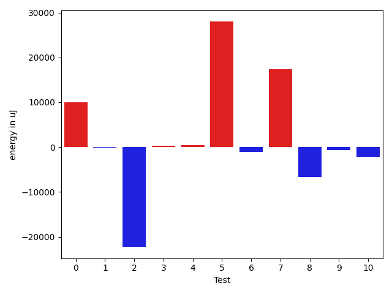
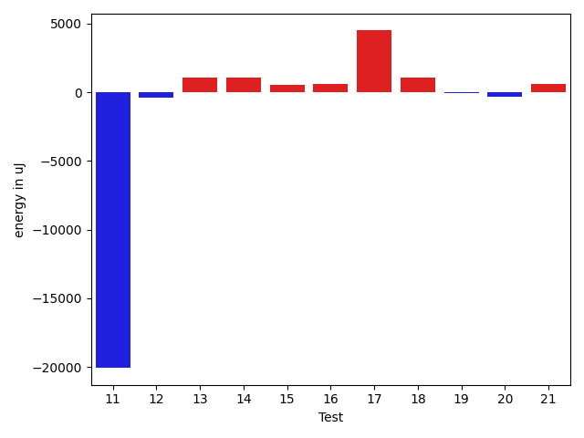
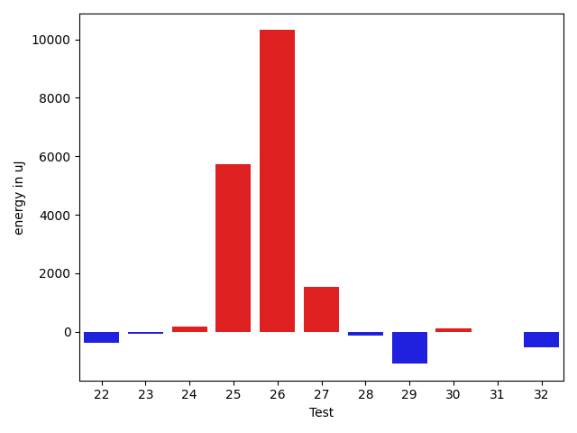
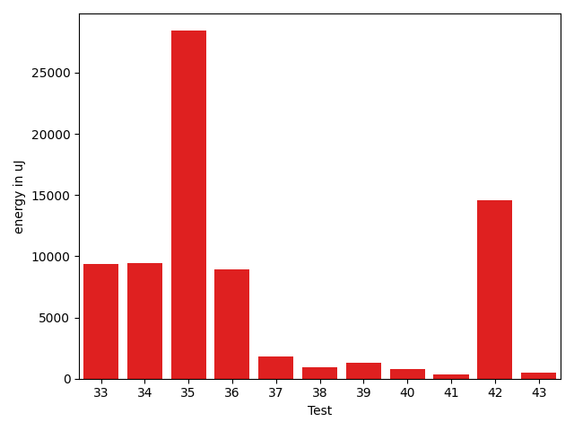
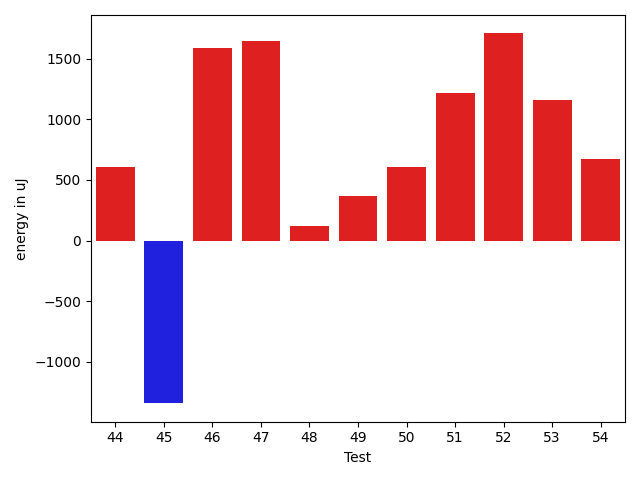
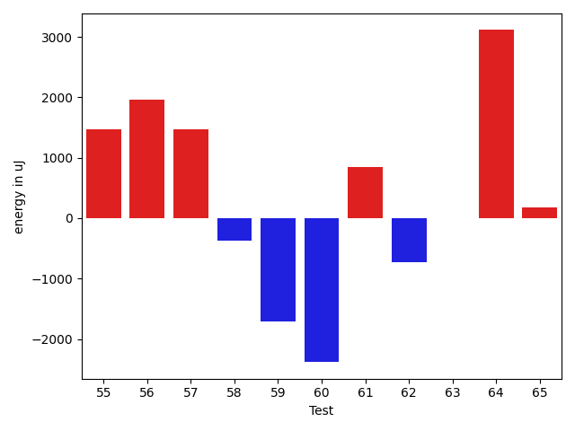
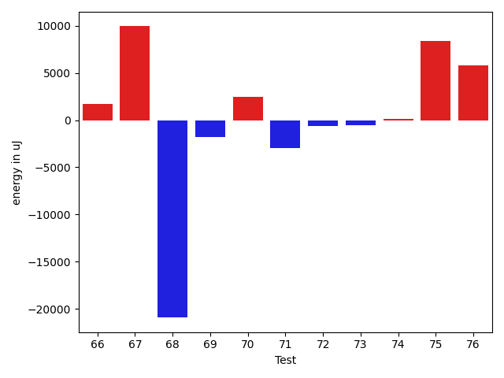
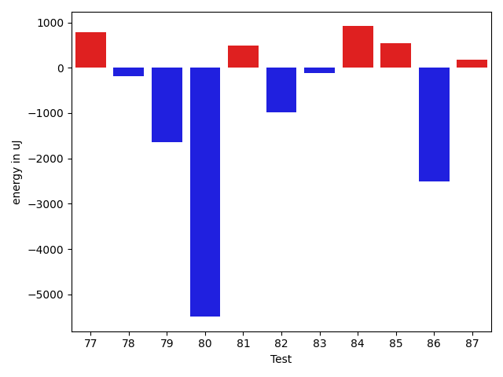
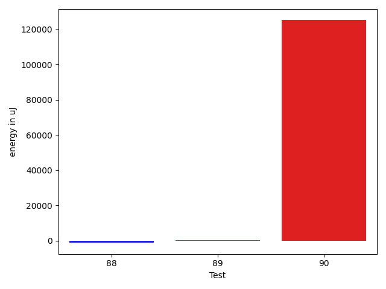

# gson 5bffa1

https://github.com/google/gson/commit/5bffa1

## Delta Energy per test method

| ID | EnergyV1 | EnergyV2 | DeltaEnergy | σV1 | σV2 |
| --- | --- | --- | --- | --- | --- |
| 0 | 70252 | 69824 | -428 | 72738.8791307393 | 87762.85633950036 |
| 1 | 39184 | 38757 | -427 | 11105.579324741113 | 11268.6211899924 |
| 2 | 36865 | 37659 | 794 | 72486.86640520029 | 3026.9227690637467 |
| 3 | 37231 | 37171 | -60 | 4250.186942931039 | 4027.498225394464 |
| 4 | 38696 | 38269 | -427 | 10762.37269877515 | 12305.466862037716 |
| 5 | 77637 | 79651 | 2014 | 70694.81875136492 | 106577.90383226566 |
| 6 | 38330 | 37720 | -610 | 15305.125589567788 | 10859.333237095441 |
| 7 | 38085 | 41870 | 3785 | 69645.9028641286 | 83131.40224416362 |
| 8 | 37903 | 37659 | -244 | 26645.21597245363 | 22277.64513411666 |
| 9 | 37597 | 36560 | -1037 | 3991.319721595853 | 4286.316962101614 |
| 10 | 38024 | 36926 | -1098 | 11918.000010406966 | 10188.963148631086 |
| 11 | 39307 | 39001 | -306 | 81263.80625316563 | 50493.28144442655 |
| 12 | 37353 | 37476 | 123 | 3524.2607877953064 | 4139.872882736196 |
| 13 | 34729 | 37536 | 2807 | 3553.4399171644873 | 3915.649048886844 |
| 14 | 36254 | 37048 | 794 | 3633.4205226480462 | 3708.494921423275 |
| 15 | 37109 | 36316 | -793 | 3160.7245847790105 | 4523.164510696953 |
| 16 | 36499 | 36133 | -366 | 4434.184118364454 | 4385.550261740856 |
| 17 | 117187 | 119018 | 1831 | 110963.73546151049 | 113507.66032228936 |
| 18 | 37414 | 38147 | 733 | 3271.0501175160516 | 3328.0410691613606 |
| 19 | 38208 | 39124 | 916 | 10492.958841981748 | 11312.973618328633 |
| 20 | 39245 | 39489 | 244 | 76608.7268042847 | 75280.39601629646 |
| 21 | 37292 | 38207 | 915 | 3140.8724430806965 | 4273.674610750265 |
| 22 | 39001 | 38635 | -366 | 20849.83689884626 | 22089.631608633874 |
| 23 | 37353 | 37293 | -60 | 3748.013847090189 | 4506.214256889488 |
| 24 | 40405 | 40588 | 183 | 442903.3717804479 | 390090.1451736033 |
| 25 | 77148 | 82885 | 5737 | 38300.84003551328 | 30981.481767523263 |
| 26 | 79895 | 90210 | 10315 | 314977.8875690069 | 223029.87831451703 |
| 27 | 36438 | 37964 | 1526 | 2981.712957830217 | 8487.31163265844 |
| 28 | 36255 | 36133 | -122 | 6112.916041728984 | 4319.896598221023 |
| 29 | 36987 | 35889 | -1098 | 2799.6264696160806 | 3682.1537085519262 |
| 30 | 36926 | 37049 | 123 | 3618.7809025762363 | 3823.9918710562106 |
| 31 | 36621 | 36621 | 0 | 3800.2570011346616 | 4564.1276365632275 |
| 32 | 39001 | 38453 | -548 | 361187.87341197714 | 300389.7737717655 |
| 33 | 37354 | 37109 | -245 | 4231.233483868959 | 37788.20517470048 |
| 34 | 38085 | 39124 | 1039 | 24791.77828867451 | 36461.07302695742 |
| 35 | 38635 | 39062 | 427 | 378198.693543188 | 424712.6048841912 |
| 36 | 77941 | 96924 | 18983 | 21465.354421632106 | 24606.76439095685 |
| 37 | 35888 | 36804 | 916 | 6394.330031033633 | 9237.914569315164 |
| 38 | 36072 | 36621 | 549 | 3611.930613744666 | 4390.104525719811 |
| 39 | 36193 | 36560 | 367 | 8540.51737687781 | 9612.936735042473 |
| 40 | 37109 | 36499 | -610 | 4120.737434003773 | 3726.5373706898376 |
| 41 | 36499 | 36377 | -122 | 3744.4435767380714 | 4097.7484356126615 |
| 42 | 162231 | 165221 | 2990 | 274170.22944968846 | 314313.0334621638 |
| 43 | 36926 | 37841 | 915 | 7683.50176648353 | 7849.220441161697 |
| 44 | 36926 | 37537 | 611 | 3277.8408197576373 | 4462.411977345744 |
| 45 | 38635 | 37292 | -1343 | 35614.50884597455 | 33822.0327031592 |
| 46 | 36377 | 37964 | 1587 | 3928.9696607175897 | 9414.535213788658 |
| 47 | 37842 | 39489 | 1647 | 18167.875160602023 | 36599.29101351996 |
| 48 | 39367 | 39489 | 122 | 15634.216123296066 | 14502.182766926982 |
| 49 | 37964 | 38330 | 366 | 16334.022051529246 | 14717.231169372966 |
| 50 | 36438 | 37048 | 610 | 3214.8552907801995 | 4005.8420138592587 |
| 51 | 36194 | 37415 | 1221 | 3691.7739777174856 | 3429.400416737009 |
| 52 | 40649 | 42358 | 1709 | 22546.399718522767 | 23572.46903825822 |
| 53 | 36743 | 37903 | 1160 | 8430.900710242595 | 10174.169612977512 |
| 54 | 36988 | 37659 | 671 | 3640.5311175348197 | 3363.415498736791 |
| 55 | 35400 | 36865 | 1465 | 9021.981936451377 | 8001.249155000736 |
| 56 | 34484 | 36438 | 1954 | 2675.0294984686648 | 4262.240802700844 |
| 57 | 38757 | 40222 | 1465 | 24319.264437040678 | 20899.078573041166 |
| 58 | 36438 | 36072 | -366 | 3339.601198579788 | 3363.114449986937 |
| 59 | 37842 | 36132 | -1710 | 7929.578171424061 | 9708.550069021558 |
| 60 | 120239 | 117858 | -2381 | 55482.27654237943 | 63184.56991323998 |
| 61 | 36011 | 36865 | 854 | 10640.81146950298 | 10441.75679550677 |
| 62 | 76172 | 75440 | -732 | 29157.85575885929 | 28434.4150186156 |
| 63 | 70922 | 70923 | 1 | 22908.797965476897 | 24432.64958900254 |
| 64 | 74402 | 77515 | 3113 | 36903.113631279055 | 43010.833087724684 |
| 65 | 35949 | 36133 | 184 | 3680.112548550655 | 3838.4948524418032 |
| 66 | 36743 | 37049 | 306 | 3360.3008668206407 | 3678.0947662308813 |
| 67 | 40527 | 41321 | 794 | 41313.449629538794 | 75212.3140228323 |
| 68 | 252746 | 246399 | -6347 | 89052.60630883802 | 74846.58098494823 |
| 69 | 38392 | 39307 | 915 | 29905.653364412006 | 24891.394183807184 |
| 70 | 40161 | 39551 | -610 | 24086.318833166195 | 23703.055686855718 |
| 71 | 40039 | 37475 | -2564 | 35870.98481451748 | 30711.752801323593 |
| 72 | 37903 | 36438 | -1465 | 3331.9715744589953 | 6493.766636466767 |
| 73 | 36804 | 36072 | -732 | 3540.264822431196 | 3520.408192741859 |
| 74 | 39063 | 38636 | -427 | 17884.044898606175 | 19319.256460083892 |
| 75 | 38452 | 40405 | 1953 | 42269.27072485459 | 57118.39886147778 |
| 76 | 39917 | 39795 | -122 | 34288.53328683083 | 39824.56830063171 |
| 77 | 39490 | 40283 | 793 | 83856.15777088537 | 100069.47584889588 |
| 78 | 37109 | 36926 | -183 | 3328.998926487058 | 4220.895832954548 |
| 79 | 37292 | 35644 | -1648 | 2837.684483095328 | 3166.628111672278 |
| 80 | 86669 | 81176 | -5493 | 73074.5121874888 | 102170.01158212904 |
| 81 | 37720 | 38208 | 488 | 13149.2624882342 | 17110.087688295334 |
| 82 | 39978 | 39001 | -977 | 104917.3053874566 | 91646.54743193895 |
| 83 | 38513 | 38391 | -122 | 6590.646485149012 | 4397.776831675806 |
| 84 | 38941 | 39856 | 915 | 19068.322006539154 | 9441.219724690724 |
| 85 | 36499 | 37048 | 549 | 8331.43656137263 | 4357.222012950159 |
| 86 | 38636 | 36133 | -2503 | 2480.39042784724 | 2485.3467061961396 |
| 87 | 38574 | 38757 | 183 | 8414.804957620952 | 10281.008829954384 |
| 88 | 37231 | 35522 | -1709 | 2602.6915336996503 | 3562.1849624031584 |
| 89 | 35462 | 35950 | 488 | 3096.44630988493 | 3417.9966336516954 |
| 90 | 39489 | 38635 | -854 | 322593.8166019887 | 561764.1528845842 |

## Delta Duration per test method

| ID | DurationV1 | DurationsV2 | DeltaDuration |
| --- | --- | --- | --- |
| 0 | 2317192.7422680412 | 2638812.0555555555 | 321619.31328751426 |
| 1 | 786553.3888888889 | 913389.7105263158 | 126836.32163742697 |
| 2 | 1603165.7272727273 | 806658.1333333333 | -796507.593939394 |
| 3 | 701759.1315789474 | 647220.1666666666 | -54538.96491228079 |
| 4 | 1126688.2894736843 | 1213003.4166666667 | 86315.12719298247 |
| 5 | 2857360.5454545454 | 3677831.97979798 | 820471.4343434344 |
| 6 | 1130573.6666666667 | 1216008.5 | 85434.83333333326 |
| 7 | 1564545.4761904762 | 2202228.6296296297 | 637683.1534391535 |
| 8 | 1522312.3384615385 | 1302512.9152542374 | -219799.42320730118 |
| 9 | 772650.18 | 749046.64 | -23603.540000000037 |
| 10 | 1353785.7731958763 | 1349636.3229166667 | -4149.45027920953 |
| 11 | 2085901.3857142858 | 1462834.5901639345 | -623066.7955503513 |
| 12 | 809946.9433962264 | 794367.3265306122 | -15579.616865614196 |
| 13 | 610378.8571428572 | 491969.17647058825 | -118409.6806722689 |
| 14 | 593179.68 | 490235.26666666666 | -102944.41333333339 |
| 15 | 580078.5909090909 | 514753.0 | -65325.59090909094 |
| 16 | 615710.5 | 598243.4848484849 | -17467.015151515137 |
| 17 | 4811588.98989899 | 4717708.878787879 | -93880.11111111101 |
| 18 | 591238.0384615385 | 602579.4444444445 | 11341.405982905999 |
| 19 | 1071187.6981132075 | 1062863.9433962265 | -8323.75471698097 |
| 20 | 1906145.7794117648 | 1872582.1369863013 | -33563.642425463535 |
| 21 | 586652.1481481482 | 611505.4642857143 | 24853.316137566115 |
| 22 | 1567585.3372093022 | 1587281.2580645161 | 19695.920855213888 |
| 23 | 640550.9696969697 | 586469.9615384615 | -54081.00815850822 |
| 24 | 4180820.101265823 | 3241824.6666666665 | -938995.4345991565 |
| 25 | 2902882.212121212 | 2817697.262626263 | -85184.94949494908 |
| 26 | 5295929.97979798 | 4477455.757575758 | -818474.222222222 |
| 27 | 1000927.5 | 1025396.8493150685 | 24469.34931506845 |
| 28 | 1087513.0985915493 | 1085427.5774647887 | -2085.5211267606355 |
| 29 | 677900.475 | 643832.8064516129 | -34067.668548387126 |
| 30 | 638821.925925926 | 622215.074074074 | -16606.851851851912 |
| 31 | 620933.8620689656 | 644916.8076923077 | 23982.94562334218 |
| 32 | 3389330.578313253 | 2601320.8625 | -788009.7158132531 |
| 33 | 693073.1578947369 | 1015970.1470588235 | 322896.98916408664 |
| 34 | 1259136.553846154 | 1581136.7164179105 | 322000.16257175663 |
| 35 | 4136897.7910447763 | 5297492.7875 | 1160594.9964552233 |
| 36 | 2814016.585858586 | 2976773.0505050505 | 162756.46464646468 |
| 37 | 1083582.0447761193 | 1137878.7647058824 | 54296.719929763116 |
| 38 | 870461.5769230769 | 873556.6 | 3095.0230769230984 |
| 39 | 1051609.619047619 | 1125398.9852941176 | 73789.36624649866 |
| 40 | 550140.4090909091 | 599055.0 | 48914.59090909094 |
| 41 | 726141.875 | 755203.0204081633 | 29061.145408163313 |
| 42 | 6875960.404040404 | 7086180.444444444 | 210220.04040404037 |
| 43 | 1111594.56 | 1099084.8055555555 | -12509.754444444552 |
| 44 | 935794.1636363637 | 946205.0677966102 | 10410.904160246486 |
| 45 | 1447366.1 | 1315157.1025641025 | -132208.9974358976 |
| 46 | 913995.2340425532 | 973387.1458333334 | 59391.91179078014 |
| 47 | 1376322.028169014 | 1564878.5633802817 | 188556.53521126765 |
| 48 | 999188.1458333334 | 958952.4634146341 | -40235.68241869926 |
| 49 | 1366361.1 | 1315793.0789473683 | -50568.02105263178 |
| 50 | 817630.5882352941 | 766574.2285714286 | -51056.35966386553 |
| 51 | 866719.7173913043 | 795165.4791666666 | -71554.2382246377 |
| 52 | 1782728.5670103093 | 1796636.2659574468 | 13907.698947137455 |
| 53 | 1092548.396551724 | 1060483.9473684211 | -32064.44918330293 |
| 54 | 666847.3023255814 | 685971.5142857142 | 19124.211960132816 |
| 55 | 1077256.6976744186 | 983898.08 | -93358.61767441861 |
| 56 | 790974.2884615385 | 802744.2173913043 | 11769.928929765825 |
| 57 | 1336931.0512820513 | 1128966.15625 | -207964.89503205125 |
| 58 | 644988.9333333333 | 660974.625 | 15985.691666666651 |
| 59 | 1302776.9782608696 | 1324712.5 | 21935.521739130374 |
| 60 | 3983197.878787879 | 4094639.0808080807 | 111441.20202020183 |
| 61 | 1321418.5222222223 | 1311840.4536082475 | -9578.068613974843 |
| 62 | 2546394.6868686867 | 2598416.595959596 | 52021.909090909176 |
| 63 | 2119726.202020202 | 2198021.212121212 | 78295.01010101009 |
| 64 | 2656412.5757575757 | 2851806.5454545454 | 195393.96969696973 |
| 65 | 865540.48 | 922919.8833333333 | 57379.40333333332 |
| 66 | 583471.9 | 556202.25 | -27269.650000000023 |
| 67 | 1839473.6914893617 | 2195459.4777777777 | 355985.786288416 |
| 68 | 7804368.96969697 | 7391510.424242424 | -412858.5454545459 |
| 69 | 1169850.9807692308 | 1071544.9622641508 | -98306.0185050799 |
| 70 | 1712197.8144329898 | 1700325.819148936 | -11871.99528405373 |
| 71 | 1212409.7966101696 | 1140019.396551724 | -72390.40005844552 |
| 72 | 761355.696969697 | 769389.0444444445 | 8033.347474747454 |
| 73 | 781624.75 | 813994.6666666666 | 32369.916666666628 |
| 74 | 1395338.02247191 | 1469219.4166666667 | 73881.39419475663 |
| 75 | 1485790.791044776 | 1770031.3333333333 | 284240.54228855716 |
| 76 | 1670148.1639344261 | 1799942.985915493 | 129794.82198106684 |
| 77 | 2095259.6307692307 | 2002763.4328358208 | -92496.19793340983 |
| 78 | 558902.304347826 | 601907.7142857143 | 43005.40993788827 |
| 79 | 594012.76 | 626341.0769230769 | 32328.31692307687 |
| 80 | 3394592.3434343436 | 3504666.1414141413 | 110073.7979797977 |
| 81 | 1232476.87012987 | 1372708.5333333334 | 140231.66320346342 |
| 82 | 2215868.8387096776 | 2019756.294117647 | -196112.54459203058 |
| 83 | 810452.3414634146 | 733264.4489795918 | -77187.89248382277 |
| 84 | 1113379.3448275863 | 871113.1315789474 | -242266.2132486389 |
| 85 | 917830.693877551 | 958857.3469387755 | 41026.6530612245 |
| 86 | 440206.6923076923 | 544992.2857142857 | 104785.59340659337 |
| 87 | 927315.7959183673 | 1118127.44 | 190811.6440816326 |
| 88 | 574516.3714285714 | 590168.947368421 | 15652.575939849601 |
| 89 | 726699.75 | 706642.5833333334 | -20057.166666666628 |
| 90 | 3147473.55 | 7000830.875 | 3853357.325 |

## Misc.

| ID | Test Class | Test Method |
| --- | --- | --- |
| 0 | com.google.gson.functional.CustomDeserializerTest | testDefaultConstructorNotCalledOnField |
| 1 | com.google.gson.functional.CustomDeserializerTest | testDefaultConstructorNotCalledOnObject |
| 2 | com.google.gson.functional.InterfaceTest | testSerializingObjectImplementingInterface |
| 3 | com.google.gson.functional.InterfaceTest | testSerializingInterfaceObjectField |
| 4 | com.google.gson.functional.PrettyPrintingTest | testEmptyMapField |
| 5 | com.google.gson.functional.PrettyPrintingTest | testPrettyPrintList |
| 6 | com.google.gson.functional.PrettyPrintingTest | testPrettyPrintArrayOfObjects |
| 7 | com.google.gson.functional.PrettyPrintingTest | testMap |
| 8 | com.google.gson.functional.MapTest | testMapSerializationWithNullValues |
| 9 | com.google.gson.functional.MapTest | testMapSerializationWithIntegerKeys |
| 10 | com.google.gson.functional.MapTest | testParameterizedMapSubclassSerialization |
| 11 | com.google.gson.functional.MapTest | testMapSerialization |
| 12 | com.google.gson.functional.MapTest | testMapSerializationWithNullKey |
| 13 | com.google.gson.functional.MapTest | testMapOfMapSerialization |
| 14 | com.google.gson.functional.MapTest | testMapSubclassSerialization |
| 15 | com.google.gson.functional.MapTest | testRawMapSerialization |
| 16 | com.google.gson.functional.MapTest | testMapSerializationWithNullValuesSerialized |
| 17 | com.google.gson.functional.ExposeFieldsTest | testNullExposeFieldSerialization |
| 18 | com.google.gson.functional.ExposeFieldsTest | testExposeAnnotationSerialization |
| 19 | com.google.gson.functional.ExposeFieldsTest | testArrayWithOneNullExposeFieldObjectSerialization |
| 20 | com.google.gson.functional.InheritanceTest | testBaseSerializedAsBaseWhenSpecifiedWithExplicitTypeForToJsonMethod |
| 21 | com.google.gson.functional.InheritanceTest | testBaseSerializedAsSubWhenSpecifiedWithExplicitTypeForToJsonMethod |
| 22 | com.google.gson.functional.InheritanceTest | testSubClassSerialization |
| 23 | com.google.gson.functional.InheritanceTest | testBaseSerializedAsSubForToJsonMethod |
| 24 | com.google.gson.JsonParserTest | testReadWriteTwoObjects |
| 25 | com.google.gson.functional.NamingPolicyTest | testGsonWithNonDefaultFieldNamingPolicySerialization |
| 26 | com.google.gson.functional.NamingPolicyTest | testGsonDuplicateNameUsingSerializedNameFieldNamingPolicySerialization |
| 27 | com.google.gson.functional.NamingPolicyTest | testGsonWithSerializedNameFieldNamingPolicySerialization |
| 28 | com.google.gson.functional.NamingPolicyTest | testDeprecatedNamingStrategy |
| 29 | com.google.gson.functional.NamingPolicyTest | testGsonWithLowerCaseDashPolicySerialization |
| 30 | com.google.gson.functional.NamingPolicyTest | testGsonWithLowerCaseUnderscorePolicySerialization |
| 31 | com.google.gson.functional.NamingPolicyTest | testGsonWithUpperCamelCaseSpacesPolicySerialiation |
| 32 | com.google.gson.functional.FieldExclusionTest | testDefaultInnerClassExclusion |
| 33 | com.google.gson.functional.FieldExclusionTest | testDefaultNestedStaticClassIncluded |
| 34 | com.google.gson.functional.CustomTypeAdaptersTest | testCustomNestedSerializers |
| 35 | com.google.gson.functional.CustomTypeAdaptersTest | testCustomSerializers |
| 36 | com.google.gson.functional.CustomTypeAdaptersTest | testCustomTypeAdapterDoesNotAppliesToSubClasses |
| 37 | com.google.gson.functional.CustomTypeAdaptersTest | testCustomSerializerForLong |
| 38 | com.google.gson.functional.CustomTypeAdaptersTest | testCustomTypeAdapterAppliesToSubClassesSerializedAsBaseClass |
| 39 | com.google.gson.functional.CustomTypeAdaptersTest | testCustomAdapterInvokedForMapElementSerializationWithType |
| 40 | com.google.gson.functional.CustomTypeAdaptersTest | testCustomAdapterInvokedForMapElementSerialization |
| 41 | com.google.gson.functional.CustomTypeAdaptersTest | testEnsureCustomSerializerNotInvokedForNullValues |
| 42 | com.google.gson.functional.VersioningTest | testVersionedUntilSerialization |
| 43 | com.google.gson.functional.VersioningTest | testVersionedGsonMixingSinceAndUntilSerialization |
| 44 | com.google.gson.functional.VersioningTest | testVersionedClassesSerialization |
| 45 | com.google.gson.functional.VersioningTest | testVersionedGsonWithUnversionedClassesSerialization |
| 46 | com.google.gson.functional.ArrayTest | testArrayOfObjectsWithoutTypeInfoDeserialization |
| 47 | com.google.gson.functional.ArrayTest | testObjectArrayWithNonPrimitivesSerialization |
| 48 | com.google.gson.functional.EnumTest | testClassWithEnumFieldSerialization |
| 49 | com.google.gson.functional.ObjectTest | testArrayOfObjectsAsFields |
| 50 | com.google.gson.functional.ObjectTest | testClassWithObjectFieldSerialization |
| 51 | com.google.gson.functional.ObjectTest | testBagOfPrimitiveWrappersSerialization |
| 52 | com.google.gson.functional.ObjectTest | testArrayOfArraysSerialization |
| 53 | com.google.gson.functional.ObjectTest | testArrayOfObjectsSerialization |
| 54 | com.google.gson.functional.ObjectTest | testNullFieldsSerialization |
| 55 | com.google.gson.functional.ObjectTest | testNestedSerialization |
| 56 | com.google.gson.functional.ObjectTest | testInnerClassSerialization |
| 57 | com.google.gson.functional.ObjectTest | testBagOfPrimitivesSerialization |
| 58 | com.google.gson.functional.ObjectTest | testStringFieldWithEmptyValueSerialization |
| 59 | com.google.gson.functional.ParameterizedTypesTest | testParameterizedTypeWithCustomSerializer |
| 60 | com.google.gson.functional.ParameterizedTypesTest | testParameterizedTypesSerialization |
| 61 | com.google.gson.functional.ParameterizedTypesTest | testVariableTypeDeserialization |
| 62 | com.google.gson.functional.ParameterizedTypesTest | testVariableTypeFieldsAndGenericArraysSerialization |
| 63 | com.google.gson.functional.ParameterizedTypesTest | testVariableTypeFieldsAndGenericArraysDeserialization |
| 64 | com.google.gson.functional.ParameterizedTypesTest | testTypesWithMultipleParametersSerialization |
| 65 | com.google.gson.functional.ParameterizedTypesTest | testParameterizedTypesWithWriterSerialization |
| 66 | com.google.gson.functional.ParameterizedTypesTest | testDeepParameterizedTypeSerialization |
| 67 | com.google.gson.functional.ConcurrencyTest | testSingleThreadSerialization |
| 68 | com.google.gson.functional.ConcurrencyTest | testMultiThreadSerialization |
| 69 | com.google.gson.functional.CollectionTest | testCollectionOfBagOfPrimitivesSerialization |
| 70 | com.google.gson.functional.CollectionTest | testWildcardCollectionField |
| 71 | com.google.gson.functional.CollectionTest | testSetSerialization |
| 72 | com.google.gson.functional.CollectionTest | testRawCollectionSerialization |
| 73 | com.google.gson.functional.CollectionTest | testRawCollectionOfBagOfPrimitivesNotAllowed |
| 74 | com.google.gson.functional.EscapingTest | testGsonAcceptsEscapedAndNonEscapedJsonDeserialization |
| 75 | com.google.gson.functional.EscapingTest | testEscapingObjectFields |
| 76 | com.google.gson.functional.JsonTreeTest | testJsonTreeToString |
| 77 | com.google.gson.functional.PrintFormattingTest | testCompactFormattingLeavesNoWhiteSpace |
| 78 | com.google.gson.functional.PrintFormattingTest | testJsonObjectWithNullValues |
| 79 | com.google.gson.functional.PrintFormattingTest | testJsonObjectWithNullValuesSerialized |
| 80 | com.google.gson.functional.ExclusionStrategyFunctionalTest | testExclusionStrategySerialization |
| 81 | com.google.gson.functional.ReadersWritersTest | testReadWriteTwoObjects |
| 82 | com.google.gson.functional.ReadersWritersTest | testWriterForSerialization |
| 83 | com.google.gson.GsonTypeAdapterTest | testDefaultTypeAdapterThrowsParseException |
| 84 | com.google.gson.functional.UncategorizedTest | testStaticFieldsAreNotSerialized |
| 85 | com.google.gson.functional.DefaultTypeAdaptersTest | testBigIntegerFieldSerialization |
| 86 | com.google.gson.functional.DefaultTypeAdaptersTest | testPropertiesSerialization |
| 87 | com.google.gson.functional.DefaultTypeAdaptersTest | testBigDecimalFieldSerialization |
| 88 | com.google.gson.functional.DefaultTypeAdaptersTest | testDefaultGregorianCalendarSerialization |
| 89 | com.google.gson.functional.DefaultTypeAdaptersTest | testDefaultCalendarSerialization |
| 90 | com.google.gson.functional.SecurityTest | testNonExecutableJsonSerialization |

| Test | IterationV1 | IterationV2 | DeltaIteration |
| --- | --- | --- | --- |
| 0 | 97 | 90 | -7 |
| 1 | 36 | 38 | 2 |
| 2 | 44 | 45 | 1 |
| 3 | 38 | 30 | -8 |
| 4 | 76 | 72 | -4 |
| 5 | 99 | 99 | 0 |
| 6 | 66 | 70 | 4 |
| 7 | 21 | 27 | 6 |
| 8 | 65 | 59 | -6 |
| 9 | 50 | 50 | 0 |
| 10 | 97 | 96 | -1 |
| 11 | 70 | 61 | -9 |
| 12 | 53 | 49 | -4 |
| 13 | 14 | 17 | 3 |
| 14 | 25 | 30 | 5 |
| 15 | 22 | 26 | 4 |
| 16 | 30 | 33 | 3 |
| 17 | 99 | 99 | 0 |
| 18 | 26 | 27 | 1 |
| 19 | 53 | 53 | 0 |
| 20 | 68 | 73 | 5 |
| 21 | 27 | 28 | 1 |
| 22 | 86 | 93 | 7 |
| 23 | 33 | 26 | -7 |
| 24 | 79 | 84 | 5 |
| 25 | 99 | 99 | 0 |
| 26 | 99 | 99 | 0 |
| 27 | 74 | 73 | -1 |
| 28 | 71 | 71 | 0 |
| 29 | 40 | 31 | -9 |
| 30 | 27 | 27 | 0 |
| 31 | 29 | 26 | -3 |
| 32 | 83 | 80 | -3 |
| 33 | 38 | 34 | -4 |
| 34 | 65 | 67 | 2 |
| 35 | 67 | 80 | 13 |
| 36 | 99 | 99 | 0 |
| 37 | 67 | 68 | 1 |
| 38 | 52 | 65 | 13 |
| 39 | 63 | 68 | 5 |
| 40 | 22 | 26 | 4 |
| 41 | 40 | 49 | 9 |
| 42 | 99 | 99 | 0 |
| 43 | 75 | 72 | -3 |
| 44 | 55 | 59 | 4 |
| 45 | 40 | 39 | -1 |
| 46 | 47 | 48 | 1 |
| 47 | 71 | 71 | 0 |
| 48 | 48 | 41 | -7 |
| 49 | 80 | 76 | -4 |
| 50 | 34 | 35 | 1 |
| 51 | 46 | 48 | 2 |
| 52 | 97 | 94 | -3 |
| 53 | 58 | 57 | -1 |
| 54 | 43 | 35 | -8 |
| 55 | 43 | 50 | 7 |
| 56 | 52 | 46 | -6 |
| 57 | 39 | 32 | -7 |
| 58 | 30 | 32 | 2 |
| 59 | 92 | 92 | 0 |
| 60 | 99 | 99 | 0 |
| 61 | 90 | 97 | 7 |
| 62 | 99 | 99 | 0 |
| 63 | 99 | 99 | 0 |
| 64 | 99 | 99 | 0 |
| 65 | 50 | 60 | 10 |
| 66 | 30 | 16 | -14 |
| 67 | 94 | 90 | -4 |
| 68 | 99 | 99 | 0 |
| 69 | 52 | 53 | 1 |
| 70 | 97 | 94 | -3 |
| 71 | 59 | 58 | -1 |
| 72 | 33 | 45 | 12 |
| 73 | 52 | 39 | -13 |
| 74 | 89 | 84 | -5 |
| 75 | 67 | 63 | -4 |
| 76 | 61 | 71 | 10 |
| 77 | 65 | 67 | 2 |
| 78 | 23 | 14 | -9 |
| 79 | 25 | 26 | 1 |
| 80 | 99 | 99 | 0 |
| 81 | 77 | 75 | -2 |
| 82 | 31 | 34 | 3 |
| 83 | 41 | 49 | 8 |
| 84 | 29 | 38 | 9 |
| 85 | 49 | 49 | 0 |
| 86 | 13 | 14 | 1 |
| 87 | 49 | 50 | 1 |
| 88 | 35 | 38 | 3 |
| 89 | 32 | 36 | 4 |
| 90 | 40 | 40 | 0 |

| Time Label | Time (s) |
| --- | --- |
| Selection | 26.047146558761597 |
| Injection | 12.705492973327637 |
| Total | 1052.995022058487 |

