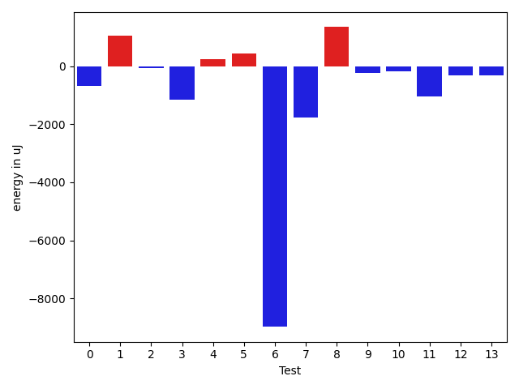
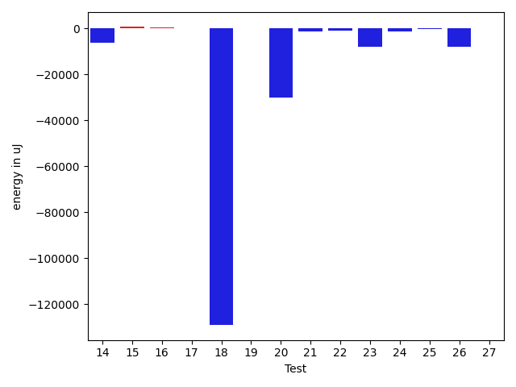
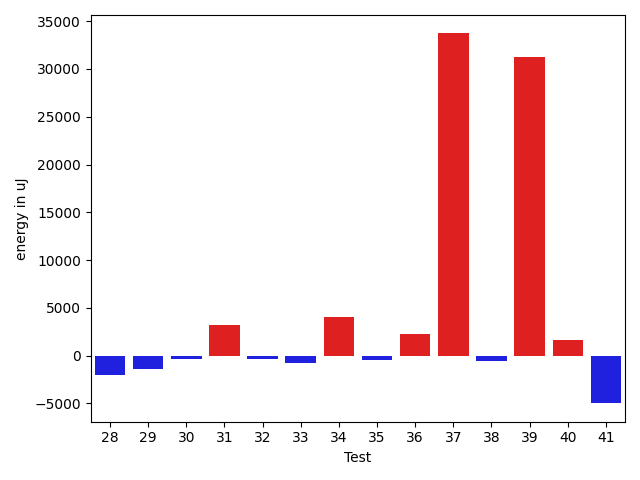
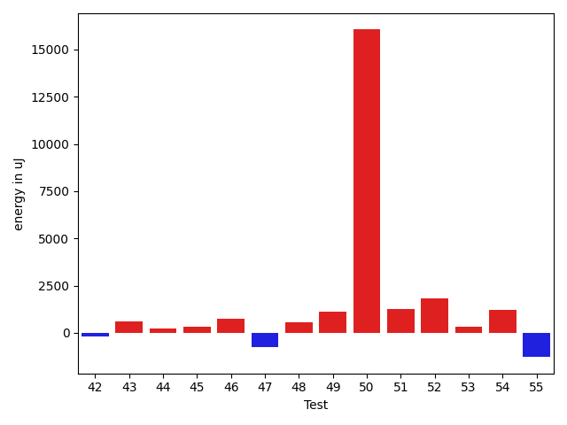
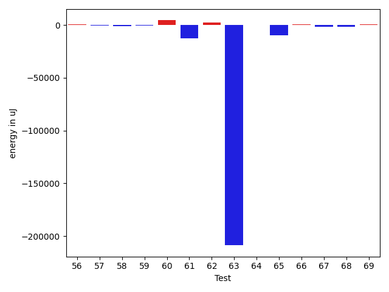
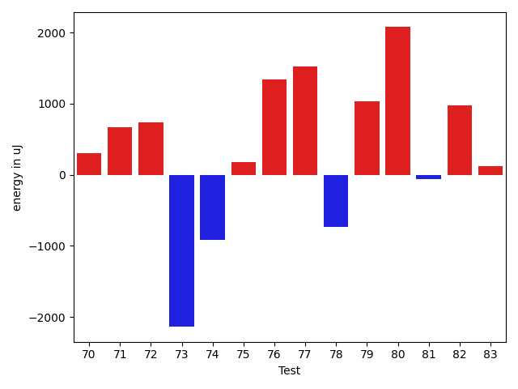
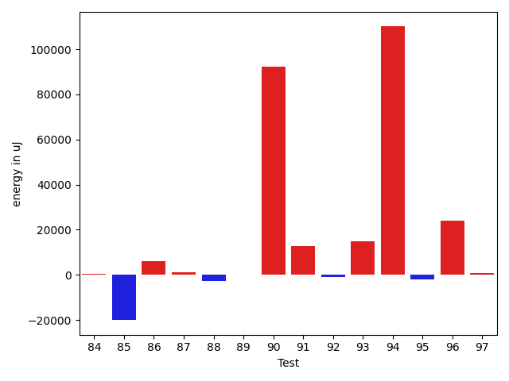
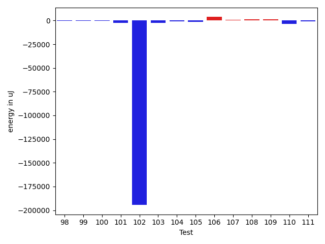
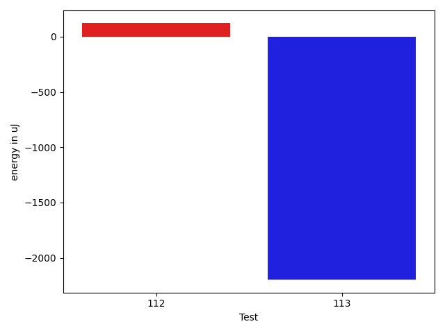

# gson 89c184

https://github.com/google/gson/commit/89c184

## Delta Energy per test method

| ID | EnergyV1 | EnergyV2 | DeltaEnergy | σV1 | σV2 |
| --- | --- | --- | --- | --- | --- |
| 0 | 35095 | 34424 | -671 | 3562.347844100414 | 3672.186515160984 |
| 1 | 34546 | 35583 | 1037 | 3704.2943423250945 | 3805.900023301845 |
| 2 | 34851 | 34790 | -61 | 4116.7521953152755 | 3629.4095594268742 |
| 3 | 34851 | 33691 | -1160 | 6140.879328804022 | 5230.855262674808 |
| 4 | 39246 | 39489 | 243 | 501019.55717018363 | 367173.05505441997 |
| 5 | 35828 | 36254 | 426 | 4431.398484818308 | 6179.025235948538 |
| 6 | 91308 | 82336 | -8972 | 25478.273169987755 | 50151.10675543687 |
| 7 | 37110 | 35339 | -1771 | 4001.811922950236 | 3901.580910883006 |
| 8 | 35950 | 37292 | 1342 | 33566.570376420896 | 31815.675336912496 |
| 9 | 36743 | 36499 | -244 | 9017.01217271859 | 6265.733290045113 |
| 10 | 35644 | 35461 | -183 | 3418.0950357361553 | 3169.8069143980942 |
| 11 | 35217 | 34179 | -1038 | 3847.9916856510367 | 4041.163104651928 |
| 12 | 33508 | 33203 | -305 | 3689.87960425236 | 4390.960576539286 |
| 13 | 38086 | 37781 | -305 | 35629.59918206204 | 20926.6753029111 |
| 14 | 39062 | 37842 | -1220 | 69625.13613116286 | 60814.73795008493 |
| 15 | 34790 | 35584 | 794 | 3368.8768693181046 | 3322.2938093364883 |
| 16 | 35644 | 35766 | 122 | 10981.799655389279 | 12024.55271930489 |
| 17 | 35461 | 36377 | 916 | 3532.975565652839 | 2872.6303923571077 |
| 18 | 37659 | 36682 | -977 | 491757.21675610053 | 33029.4198440299 |
| 19 | 37292 | 37537 | 245 | 4269.743572284701 | 3610.190130947732 |
| 20 | 39184 | 40161 | 977 | 464239.4079270255 | 443372.5469917533 |
| 21 | 38269 | 35461 | -2808 | 3404.037825981089 | 4208.48117562091 |
| 22 | 35034 | 34241 | -793 | 3722.5824705334676 | 3139.212925506434 |
| 23 | 113831 | 109802 | -4029 | 24702.957236442104 | 20323.45181812109 |
| 24 | 34912 | 33569 | -1343 | 3356.9460743553013 | 3393.027167734979 |
| 25 | 34302 | 34546 | 244 | 4476.542044484906 | 3796.615962485661 |
| 26 | 63355 | 61402 | -1953 | 20754.977817916893 | 17782.749668147502 |
| 27 | 35035 | 34668 | -367 | 2609.7043244828506 | 4544.100099763062 |
| 28 | 35217 | 34240 | -977 | 3404.2332778468635 | 3139.6865212178354 |
| 29 | 35217 | 33631 | -1586 | 4095.7495551712045 | 4084.1581335352607 |
| 30 | 35583 | 35644 | 61 | 4096.0267935880365 | 3484.3545727851642 |
| 31 | 36866 | 37048 | 182 | 9118.537969670133 | 13784.226351512783 |
| 32 | 36682 | 36377 | -305 | 4553.16003277105 | 3719.5696369928037 |
| 33 | 37842 | 37780 | -62 | 8558.616060990607 | 7132.934586268367 |
| 34 | 36743 | 36133 | -610 | 10560.87813591275 | 17369.209492226528 |
| 35 | 35767 | 35889 | 122 | 4427.578958608276 | 4136.650692871466 |
| 36 | 39490 | 39856 | 366 | 32293.313792106954 | 36005.93194887809 |
| 37 | 77759 | 78125 | 366 | 163581.42135520064 | 285497.6068075419 |
| 38 | 35217 | 36621 | 1404 | 4490.517093719902 | 4156.739368661479 |
| 39 | 88501 | 116332 | 27831 | 290887.5824114895 | 370932.8371488016 |
| 40 | 35950 | 36316 | 366 | 3710.7662815275617 | 7723.3557196396005 |
| 41 | 64392 | 40833 | -23559 | 63160.92675679926 | 61673.27247633288 |
| 42 | 38025 | 37842 | -183 | 78267.37992811392 | 78909.93026010014 |
| 43 | 34851 | 35462 | 611 | 8551.313487649639 | 11508.082232742765 |
| 44 | 35583 | 35828 | 245 | 2883.028500144358 | 4382.631594121953 |
| 45 | 36560 | 36866 | 306 | 4025.747997019959 | 3960.5101388479425 |
| 46 | 35828 | 36560 | 732 | 3340.9315745163053 | 4433.889140820498 |
| 47 | 36560 | 35828 | -732 | 5767.855178039642 | 4128.486356525931 |
| 48 | 35889 | 36438 | 549 | 4926.763958789191 | 3267.6144484308043 |
| 49 | 34912 | 36010 | 1098 | 6471.693760556646 | 8613.564605976406 |
| 50 | 191223 | 207275 | 16052 | 327559.7852553525 | 318552.0492838728 |
| 51 | 34667 | 35949 | 1282 | 6117.603719148776 | 6055.900630344659 |
| 52 | 34912 | 36743 | 1831 | 3901.4074302132863 | 4462.228806596481 |
| 53 | 35401 | 35706 | 305 | 3784.0157443972344 | 3581.3659296890564 |
| 54 | 35156 | 36377 | 1221 | 31326.366387491995 | 18213.537486278175 |
| 55 | 37354 | 36072 | -1282 | 3531.9583766192545 | 3782.644725254405 |
| 56 | 35156 | 36988 | 1832 | 3686.734230530269 | 3887.750269122456 |
| 57 | 36072 | 36865 | 793 | 8233.779647987742 | 3823.177532725192 |
| 58 | 38330 | 37354 | -976 | 68706.59429452098 | 61880.73105880758 |
| 59 | 35339 | 34974 | -365 | 3579.90346384613 | 3170.034714766613 |
| 60 | 37475 | 38635 | 1160 | 32145.63533582428 | 33789.13144264756 |
| 61 | 40894 | 37597 | -3297 | 77922.89225783826 | 77714.84430588312 |
| 62 | 35461 | 36682 | 1221 | 5394.733314250753 | 10335.971241708226 |
| 63 | 40528 | 38941 | -1587 | 611757.7116898294 | 404381.3667976142 |
| 64 | 36193 | 36316 | 123 | 3823.424171917105 | 3976.946722327543 |
| 65 | 39489 | 38940 | -549 | 53184.689570934395 | 44010.03892709043 |
| 66 | 35766 | 35767 | 1 | 3493.926975627912 | 3886.6692178188887 |
| 67 | 38635 | 36927 | -1708 | 22331.843783558106 | 24288.70677049108 |
| 68 | 37171 | 35705 | -1466 | 3349.3604651302057 | 3828.219416060161 |
| 69 | 34607 | 37048 | 2441 | 4669.519121205359 | 3952.125201478726 |
| 70 | 35583 | 35889 | 306 | 3995.502529843967 | 3880.6130635406985 |
| 71 | 34912 | 35584 | 672 | 3270.4137478903526 | 6068.993525111704 |
| 72 | 36376 | 37109 | 733 | 4189.861837452657 | 3370.3535042783947 |
| 73 | 39002 | 36865 | -2137 | 4590.2988816774505 | 3907.9415458823155 |
| 74 | 37842 | 36927 | -915 | 3930.911784121523 | 3500.402295561073 |
| 75 | 37476 | 37659 | 183 | 3463.901470885106 | 3605.7801167015164 |
| 76 | 35583 | 36926 | 1343 | 3456.457308288855 | 4140.744970845251 |
| 77 | 35827 | 37354 | 1527 | 4420.795493257958 | 4244.116626520589 |
| 78 | 36316 | 35583 | -733 | 4492.751861088987 | 3264.804061241507 |
| 79 | 36132 | 37170 | 1038 | 2746.822964808617 | 3496.3822709158962 |
| 80 | 35583 | 37659 | 2076 | 4029.3098423372153 | 3342.675721957987 |
| 81 | 37964 | 37903 | -61 | 13171.337407493622 | 9642.302895234507 |
| 82 | 35522 | 36499 | 977 | 3402.2604002964854 | 3975.9709223672908 |
| 83 | 36193 | 36316 | 123 | 15712.614032005205 | 13146.028364785529 |
| 84 | 37109 | 37293 | 184 | 17584.457377664377 | 21551.94013728202 |
| 85 | 36499 | 34729 | -1770 | 121995.5206584146 | 70788.52016003741 |
| 86 | 40528 | 61462 | 20934 | 36979.27625718566 | 55688.152067259856 |
| 87 | 36193 | 36499 | 306 | 7853.823783304815 | 10020.043838800702 |
| 88 | 38513 | 37720 | -793 | 13164.413291591507 | 10236.327282802904 |
| 89 | 36133 | 36316 | 183 | 4347.29303426379 | 4003.2601905256033 |
| 90 | 38085 | 39551 | 1466 | 421515.85718386486 | 557767.0623045254 |
| 91 | 38208 | 38696 | 488 | 62841.74912505546 | 80062.6241325419 |
| 92 | 37109 | 36499 | -610 | 4926.939942603796 | 3828.878567242486 |
| 93 | 36560 | 37231 | 671 | 6203.890028984681 | 64390.3604548735 |
| 94 | 36133 | 37048 | 915 | 3775.463132229712 | 391280.51013231144 |
| 95 | 40710 | 41565 | 855 | 23677.211567470007 | 21286.232952408234 |
| 96 | 39856 | 39428 | -428 | 462914.6335359346 | 501737.47322216776 |
| 97 | 37537 | 37415 | -122 | 4252.072351227513 | 4066.911332006145 |
| 98 | 38513 | 37842 | -671 | 8385.641576700767 | 10382.286627983258 |
| 99 | 35644 | 35645 | 1 | 4385.02085613744 | 4573.577416804668 |
| 100 | 36743 | 37170 | 427 | 3962.9814728553815 | 4320.49728659864 |
| 101 | 73242 | 72998 | -244 | 31174.373308845603 | 28427.38072094949 |
| 102 | 39917 | 38757 | -1160 | 785124.7298307428 | 719935.5702365183 |
| 103 | 37171 | 37109 | -62 | 19022.902527768725 | 6512.350595855028 |
| 104 | 38636 | 36804 | -1832 | 5348.404271003993 | 3683.2504524796586 |
| 105 | 38513 | 37353 | -1160 | 5279.088700801126 | 4631.924088583134 |
| 106 | 37048 | 40039 | 2991 | 10998.95648448522 | 12163.808163244857 |
| 107 | 36804 | 37475 | 671 | 6546.942273482155 | 8285.733285950595 |
| 108 | 41564 | 42541 | 977 | 491356.102877166 | 484208.34551085386 |
| 109 | 35767 | 36743 | 976 | 5663.387592923663 | 7617.154343933805 |
| 110 | 39429 | 37780 | -1649 | 10661.846010863925 | 5721.65345755385 |
| 111 | 36743 | 36865 | 122 | 6726.276744562659 | 4153.830136333734 |
| 112 | 37476 | 37598 | 122 | 15164.933459472259 | 26571.037824183117 |
| 113 | 41626 | 39428 | -2198 | 19013.174967833173 | 13864.362751824467 |

## Delta Duration per test method

| ID | DurationV1 | DurationsV2 | DeltaDuration |
| --- | --- | --- | --- |
| 0 | 926066.7076923077 | 948575.5230769231 | 22508.815384615446 |
| 1 | 876484.679245283 | 821464.4262295082 | -55020.25301577477 |
| 2 | 892300.0615384616 | 873038.5384615385 | -19261.5230769231 |
| 3 | 1007760.2459016393 | 1027750.296875 | 19990.05097336066 |
| 4 | 6130377.536231884 | 4523485.46875 | -1606892.0674818838 |
| 5 | 984538.03125 | 968718.9333333333 | -15819.097916666651 |
| 6 | 2832004.3434343436 | 3046821.4343434344 | 214817.09090909082 |
| 7 | 530307.5 | 502723.125 | -27584.375 |
| 8 | 1620012.4805194805 | 1591219.96 | -28792.520519480575 |
| 9 | 1050807.3472222222 | 1034882.5675675676 | -15924.779654654674 |
| 10 | 859260.0909090909 | 887631.625 | 28371.53409090906 |
| 11 | 700658.6888888889 | 683598.52 | -17060.168888888904 |
| 12 | 650602.7142857143 | 639683.9583333334 | -10918.755952380947 |
| 13 | 1381740.463768116 | 1213289.6285714286 | -168450.83519668737 |
| 14 | 1792859.328125 | 1578943.390625 | -213915.9375 |
| 15 | 846335.1509433963 | 836052.35 | -10282.800943396287 |
| 16 | 1149110.051948052 | 1160598.7027027027 | 11488.650754650822 |
| 17 | 520638.25 | 488597.0625 | -32041.1875 |
| 18 | 5203674.350877193 | 1312145.8333333333 | -3891528.51754386 |
| 19 | 715993.3488372093 | 728368.972972973 | 12375.624135763734 |
| 20 | 4807052.552941176 | 3582615.578313253 | -1224436.9746279232 |
| 21 | 547355.0769230769 | 603432.8333333334 | 56077.756410256494 |
| 22 | 769259.5438596491 | 788583.0 | 19323.4561403509 |
| 23 | 3480270.5555555555 | 3325661.585858586 | -154608.96969696973 |
| 24 | 795358.3191489362 | 750883.8 | -44474.519148936146 |
| 25 | 642769.7674418605 | 612350.3846153846 | -30419.382826475892 |
| 26 | 2613327.6666666665 | 2904399.4 | 291071.7333333334 |
| 27 | 607385.7142857143 | 536681.5333333333 | -70704.180952381 |
| 28 | 763300.075 | 674021.9024390244 | -89278.17256097554 |
| 29 | 681868.9411764706 | 634754.125 | -47114.8161764706 |
| 30 | 908911.5405405406 | 969933.6833333333 | 61022.14279279276 |
| 31 | 1011807.2727272727 | 1168560.9074074074 | 156753.6346801347 |
| 32 | 789337.1538461539 | 855101.8392857143 | 65764.68543956045 |
| 33 | 1180349.8352941177 | 1223247.5227272727 | 42897.68743315502 |
| 34 | 954365.06 | 1072166.6769230769 | 117801.6169230768 |
| 35 | 872251.2181818181 | 880460.140625 | 8208.922443181858 |
| 36 | 1478116.6666666667 | 1671024.671641791 | 192908.00497512426 |
| 37 | 3340120.272727273 | 4246861.97979798 | 906741.7070707069 |
| 38 | 718183.7741935484 | 710276.0645161291 | -7907.709677419276 |
| 39 | 4678307.9878048785 | 5471580.1 | 793272.1121951211 |
| 40 | 762933.2105263158 | 799103.3773584906 | 36170.16683217476 |
| 41 | 2432581.0506329113 | 2386830.125 | -45750.92563291127 |
| 42 | 2021501.611111111 | 1723597.5813953488 | -297904.02971576224 |
| 43 | 1172347.7710843373 | 1196939.6506024096 | 24591.879518072354 |
| 44 | 621970.6363636364 | 576524.8 | -45445.83636363631 |
| 45 | 676405.1428571428 | 703626.6363636364 | 27221.493506493513 |
| 46 | 693448.0 | 612411.03125 | -81036.96875 |
| 47 | 676626.3548387097 | 683559.9705882353 | 6933.615749525605 |
| 48 | 611203.9629629629 | 626020.9375 | 14816.97453703708 |
| 49 | 1052190.8607594937 | 1084274.472972973 | 32083.612213479355 |
| 50 | 7334898.05050505 | 8053624.04040404 | 718725.9898989899 |
| 51 | 1065262.2631578948 | 1063893.4487179487 | -1368.814439946087 |
| 52 | 660744.59375 | 656444.2307692308 | -4300.362980769249 |
| 53 | 797010.9807692308 | 794544.4705882353 | -2466.5101809954504 |
| 54 | 1188569.25 | 1015445.3703703703 | -173123.87962962966 |
| 55 | 907928.3571428572 | 959786.4576271187 | 51858.10048426152 |
| 56 | 618959.1724137932 | 618281.3555555556 | -677.8168582376093 |
| 57 | 958744.8620689656 | 924982.5285714286 | -33762.33349753695 |
| 58 | 1430735.4117647058 | 1595962.9655172413 | 165227.5537525355 |
| 59 | 831565.0196078431 | 844716.3846153846 | 13151.365007541492 |
| 60 | 1649925.7078651686 | 1787158.7849462365 | 137233.07708106795 |
| 61 | 2116077.566666667 | 1767908.3055555555 | -348169.2611111114 |
| 62 | 860727.8461538461 | 932680.9803921569 | 71953.13423831074 |
| 63 | 10582447.884615384 | 5603909.5 | -4978538.384615384 |
| 64 | 800918.04 | 841390.1276595745 | 40472.08765957446 |
| 65 | 1654243.121212121 | 1384509.6734693877 | -269733.4477427334 |
| 66 | 546503.2857142857 | 587432.6451612903 | 40929.35944700462 |
| 67 | 1205031.0476190476 | 1156074.8958333333 | -48956.15178571432 |
| 68 | 613402.5185185185 | 652779.8 | 39377.28148148151 |
| 69 | 617670.6944444445 | 694571.5714285715 | 76900.87698412698 |
| 70 | 800227.052631579 | 857058.2372881356 | 56831.18465655658 |
| 71 | 802702.4680851063 | 847093.6724137932 | 44391.204328686814 |
| 72 | 611619.5909090909 | 621784.1818181818 | 10164.590909090824 |
| 73 | 464100.95238095237 | 525419.0454545454 | 61318.093073593045 |
| 74 | 550934.9090909091 | 503546.5 | -47388.40909090906 |
| 75 | 491765.75 | 571296.95 | 79531.19999999995 |
| 76 | 586648.34375 | 611955.5555555555 | 25307.211805555504 |
| 77 | 588003.9444444445 | 568364.4782608695 | -19639.466183574987 |
| 78 | 661278.1052631579 | 703348.7777777778 | 42070.67251461989 |
| 79 | 533151.52 | 501776.4375 | -31375.08250000002 |
| 80 | 595358.0833333334 | 558139.4444444445 | -37218.638888888876 |
| 81 | 1053321.3095238095 | 931045.7837837838 | -122275.52574002568 |
| 82 | 646065.9032258064 | 636871.3928571428 | -9194.510368663585 |
| 83 | 1252392.8023255814 | 1207017.530120482 | -45375.27220509946 |
| 84 | 1413109.206521739 | 1438822.1222222222 | 25712.915700483136 |
| 85 | 2410419.540229885 | 1761298.8666666667 | -649120.6735632182 |
| 86 | 2001266.7272727273 | 2056687.2525252525 | 55420.52525252523 |
| 87 | 1165436.987654321 | 1182035.2117647058 | 16598.224110384937 |
| 88 | 1044518.8448275862 | 891265.7547169811 | -153253.09011060512 |
| 89 | 645349.0731707317 | 670827.6842105263 | 25478.611039794632 |
| 90 | 5133578.069767442 | 7617639.465116279 | 2484061.3953488376 |
| 91 | 1553828.608695652 | 1885793.3617021276 | 331964.7530064755 |
| 92 | 698855.9333333333 | 840660.487804878 | 141804.5544715447 |
| 93 | 830431.4545454546 | 1364657.8775510204 | 534226.4230055658 |
| 94 | 628873.8518518518 | 3946110.7407407407 | 3317236.888888889 |
| 95 | 1605670.1976744186 | 1532133.3626373627 | -73536.83503705589 |
| 96 | 4272679.338709678 | 5207483.2272727275 | 934803.88856305 |
| 97 | 577854.6060606061 | 541360.64 | -36493.966060606064 |
| 98 | 905198.0 | 917050.72 | 11852.719999999972 |
| 99 | 772865.7272727273 | 782738.7446808511 | 9873.017408123822 |
| 100 | 588649.4761904762 | 621354.7297297297 | 32705.253539253492 |
| 101 | 2235439.373737374 | 2218645.727272727 | -16793.646464646794 |
| 102 | 14962253.78125 | 8195343.214285715 | -6766910.566964285 |
| 103 | 1073770.6226415094 | 1053536.7 | -20233.922641509445 |
| 104 | 511713.3125 | 552643.619047619 | 40930.30654761905 |
| 105 | 531748.7741935484 | 525852.9545454546 | -5895.819648093777 |
| 106 | 786659.5185185185 | 983702.5666666667 | 197043.0481481481 |
| 107 | 972034.2461538462 | 1003695.2068965518 | 31660.960742705618 |
| 108 | 5068398.75 | 5122736.0 | 54337.25 |
| 109 | 1125112.3529411764 | 1096360.9487179487 | -28751.40422322764 |
| 110 | 1099065.4166666667 | 780525.8787878788 | -318539.53787878796 |
| 111 | 798517.3555555556 | 789080.8604651163 | -9436.495090439217 |
| 112 | 1139677.406779661 | 1259621.2063492064 | 119943.79956954531 |
| 113 | 982145.4545454546 | 697058.5217391305 | -285086.9328063241 |

## Misc.

| ID | Test Class | Test Method |
| --- | --- | --- |
| 0 | com.google.gson.functional.CustomTypeAdaptersTest | testCustomAdapterInvokedForCollectionElementDeserialization |
| 1 | com.google.gson.functional.CustomTypeAdaptersTest | testCustomTypeAdapterAppliesToSubClassesSerializedAsBaseClass |
| 2 | com.google.gson.functional.CustomTypeAdaptersTest | testCustomAdapterInvokedForMapElementDeserialization |
| 3 | com.google.gson.functional.CustomTypeAdaptersTest | testCustomAdapterInvokedForMapElementSerializationWithType |
| 4 | com.google.gson.functional.CustomTypeAdaptersTest | testCustomSerializers |
| 5 | com.google.gson.functional.CustomTypeAdaptersTest | testCustomNestedDeserializers |
| 6 | com.google.gson.functional.CustomTypeAdaptersTest | testCustomTypeAdapterDoesNotAppliesToSubClasses |
| 7 | com.google.gson.functional.CustomTypeAdaptersTest | testCustomAdapterInvokedForCollectionElementSerialization |
| 8 | com.google.gson.functional.CustomTypeAdaptersTest | testCustomAdapterInvokedForCollectionElementSerializationWithType |
| 9 | com.google.gson.functional.CustomTypeAdaptersTest | testCustomSerializerForLong |
| 10 | com.google.gson.functional.CustomTypeAdaptersTest | testCustomByteArrayDeserializerAndInstanceCreator |
| 11 | com.google.gson.functional.CustomTypeAdaptersTest | testEnsureCustomSerializerNotInvokedForNullValues |
| 12 | com.google.gson.functional.CustomTypeAdaptersTest | testEnsureCustomDeserializerNotInvokedForNullValues |
| 13 | com.google.gson.functional.CustomTypeAdaptersTest | testCustomNestedSerializers |
| 14 | com.google.gson.functional.CustomTypeAdaptersTest | testCustomDeserializers |
| 15 | com.google.gson.functional.CustomTypeAdaptersTest | testCustomByteArraySerializer |
| 16 | com.google.gson.functional.CustomTypeAdaptersTest | testCustomDeserializerForLong |
| 17 | com.google.gson.functional.CustomTypeAdaptersTest | testCustomAdapterInvokedForMapElementSerialization |
| 18 | com.google.gson.FunctionWithInternalDependenciesTest | testUserDefinedExclusionPolicies |
| 19 | com.google.gson.functional.FieldExclusionTest | testDefaultNestedStaticClassIncluded |
| 20 | com.google.gson.functional.FieldExclusionTest | testDefaultInnerClassExclusion |
| 21 | com.google.gson.functional.FieldExclusionTest | testInnerClassExclusion |
| 22 | com.google.gson.functional.DefaultTypeAdaptersTest | testDateSerializationWithPattern |
| 23 | com.google.gson.functional.DefaultTypeAdaptersTest | testDefaultDateDeserializationUsingBuilder |
| 24 | com.google.gson.functional.DefaultTypeAdaptersTest | testDateDeserializationWithPattern |
| 25 | com.google.gson.functional.DefaultTypeAdaptersTest | testDefaultGregorianCalendarDeserialization |
| 26 | com.google.gson.functional.DefaultTypeAdaptersTest | testDefaultDateSerializationUsingBuilder |
| 27 | com.google.gson.functional.DefaultTypeAdaptersTest | testDefaultGregorianCalendarSerialization |
| 28 | com.google.gson.functional.DefaultTypeAdaptersTest | testDefaultCalendarDeserialization |
| 29 | com.google.gson.functional.DefaultTypeAdaptersTest | testDefaultCalendarSerialization |
| 30 | com.google.gson.functional.CustomDeserializerTest | testCustomDeserializerReturnsNullForArrayElementsForArrayField |
| 31 | com.google.gson.functional.CustomDeserializerTest | testCustomDeserializerReturnsNull |
| 32 | com.google.gson.functional.CustomDeserializerTest | testCustomDeserializerReturnsNullForTopLevelPrimitives |
| 33 | com.google.gson.functional.CustomDeserializerTest | testJsonTypeFieldBasedDeserialization |
| 34 | com.google.gson.functional.CustomDeserializerTest | testCustomDeserializerReturnsNullForArrayElements |
| 35 | com.google.gson.functional.CustomDeserializerTest | testCustomDeserializerReturnsNullForPrimitiveFields |
| 36 | com.google.gson.functional.CustomDeserializerTest | testCustomDeserializerReturnsNullForTopLevelObject |
| 37 | com.google.gson.functional.NamingPolicyTest | testGsonWithNonDefaultFieldNamingPolicySerialization |
| 38 | com.google.gson.functional.NamingPolicyTest | testGsonWithLowerCaseDashPolicyDeserialiation |
| 39 | com.google.gson.functional.NamingPolicyTest | testGsonDuplicateNameUsingSerializedNameFieldNamingPolicySerialization |
| 40 | com.google.gson.functional.NamingPolicyTest | testGsonWithSerializedNameFieldNamingPolicyDeserialization |
| 41 | com.google.gson.functional.NamingPolicyTest | testGsonWithSerializedNameFieldNamingPolicySerialization |
| 42 | com.google.gson.functional.NamingPolicyTest | testGsonWithNonDefaultFieldNamingPolicyDeserialiation |
| 43 | com.google.gson.functional.NamingPolicyTest | testDeprecatedNamingStrategy |
| 44 | com.google.gson.functional.NamingPolicyTest | testGsonWithUpperCamelCaseSpacesPolicySerialiation |
| 45 | com.google.gson.functional.NamingPolicyTest | testGsonWithLowerCaseUnderscorePolicyDeserialiation |
| 46 | com.google.gson.functional.NamingPolicyTest | testGsonWithUpperCamelCaseSpacesPolicyDeserialiation |
| 47 | com.google.gson.functional.NamingPolicyTest | testGsonWithLowerCaseDashPolicySerialization |
| 48 | com.google.gson.functional.NamingPolicyTest | testGsonWithLowerCaseUnderscorePolicySerialization |
| 49 | com.google.gson.functional.VersioningTest | testVersionedGsonMixingSinceAndUntilDeserialization |
| 50 | com.google.gson.functional.VersioningTest | testVersionedUntilSerialization |
| 51 | com.google.gson.functional.VersioningTest | testVersionedGsonMixingSinceAndUntilSerialization |
| 52 | com.google.gson.functional.VersioningTest | testIgnoreLaterVersionClassDeserialization |
| 53 | com.google.gson.functional.VersioningTest | testVersionedGsonWithUnversionedClassesDeserialization |
| 54 | com.google.gson.functional.VersioningTest | testVersionedGsonWithUnversionedClassesSerialization |
| 55 | com.google.gson.functional.VersioningTest | testVersionedClassesSerialization |
| 56 | com.google.gson.functional.VersioningTest | testIgnoreLaterVersionClassSerialization |
| 57 | com.google.gson.functional.VersioningTest | testVersionedClassesDeserialization |
| 58 | com.google.gson.functional.VersioningTest | testVersionedUntilDeserialization |
| 59 | com.google.gson.functional.NullObjectAndFieldTest | testCustomTypeAdapterPassesNullDesrialization |
| 60 | com.google.gson.functional.NullObjectAndFieldTest | testExplicitSerializationOfNullArrayMembers |
| 61 | com.google.gson.functional.NullObjectAndFieldTest | testTopLevelNullObjectDeserialization |
| 62 | com.google.gson.functional.NullObjectAndFieldTest | testPrintPrintingArraysWithNulls |
| 63 | com.google.gson.functional.NullObjectAndFieldTest | testTopLevelNullObjectSerialization |
| 64 | com.google.gson.functional.NullObjectAndFieldTest | testNullWrappedPrimitiveMemberSerialization |
| 65 | com.google.gson.functional.NullObjectAndFieldTest | testExplicitSerializationOfNulls |
| 66 | com.google.gson.functional.NullObjectAndFieldTest | testCustomTypeAdapterPassesNullSerialization |
| 67 | com.google.gson.functional.NullObjectAndFieldTest | testExplicitDeserializationOfNulls |
| 68 | com.google.gson.functional.NullObjectAndFieldTest | testExplicitSerializationOfNullStringMembers |
| 69 | com.google.gson.functional.NullObjectAndFieldTest | testExplicitSerializationOfNullCollectionMembers |
| 70 | com.google.gson.functional.NullObjectAndFieldTest | testNullWrappedPrimitiveMemberDeserialization |
| 71 | com.google.gson.functional.NullObjectAndFieldTest | testPrintPrintingObjectWithNulls |
| 72 | com.google.gson.functional.NullObjectAndFieldTest | testCustomSerializationOfNulls |
| 73 | com.google.gson.functional.PrimitiveTest | testNegativeInfinitySerialization |
| 74 | com.google.gson.functional.PrimitiveTest | testFloatNaNSerialization |
| 75 | com.google.gson.functional.PrimitiveTest | testNegativeInfinityFloatSerialization |
| 76 | com.google.gson.functional.PrimitiveTest | testLongAsStringSerialization |
| 77 | com.google.gson.functional.PrimitiveTest | testDoubleInfinitySerialization |
| 78 | com.google.gson.functional.PrimitiveTest | testLongAsStringDeserialization |
| 79 | com.google.gson.functional.PrimitiveTest | testFloatInfinitySerialization |
| 80 | com.google.gson.functional.PrimitiveTest | testDoubleNaNSerialization |
| 81 | com.google.gson.functional.PrimitiveTest | testOverridingDefaultPrimitiveSerialization |
| 82 | com.google.gson.functional.PrimitiveTest | testHtmlCharacterSerialization |
| 83 | com.google.gson.functional.ParameterizedTypesTest | testParameterizedTypeWithReaderDeserialization |
| 84 | com.google.gson.functional.ParameterizedTypesTest | testParameterizedTypeWithCustomSerializer |
| 85 | com.google.gson.functional.ParameterizedTypesTest | testParameterizedTypeDeserialization |
| 86 | com.google.gson.functional.ParameterizedTypesTest | testParameterizedTypesWithCustomDeserializer |
| 87 | com.google.gson.functional.MapTest | testParameterizedMapSubclassDeserialization |
| 88 | com.google.gson.functional.MapTest | testMapSerializationWithNullValueButSerializeNulls |
| 89 | com.google.gson.functional.MapTest | testMapSerializationWithNullValuesSerialized |
| 90 | com.google.gson.functional.SecurityTest | testNonExecutableJsonSerialization |
| 91 | com.google.gson.functional.SecurityTest | testNonExecutableJsonDeserialization |
| 92 | com.google.gson.functional.SecurityTest | testJsonWithNonExectuableTokenWithConfiguredGsonDeserialization |
| 93 | com.google.gson.functional.SecurityTest | testJsonWithNonExectuableTokenWithRegularGsonDeserialization |
| 94 | com.google.gson.functional.SecurityTest | testJsonWithNonExectuableTokenSerialization |
| 95 | com.google.gson.functional.EscapingTest | testGsonAcceptsEscapedAndNonEscapedJsonDeserialization |
| 96 | com.google.gson.functional.CustomSerializerTest | testSubClassSerializerInvokedForBaseClassFieldsHoldingSubClassInstances |
| 97 | com.google.gson.functional.CustomSerializerTest | testBaseClassSerializerInvokedForBaseClassFieldsHoldingSubClassInstances |
| 98 | com.google.gson.functional.CustomSerializerTest | testSubClassSerializerInvokedForBaseClassFieldsHoldingArrayOfSubClassInstances |
| 99 | com.google.gson.functional.CustomSerializerTest | testSerializerReturnsNull |
| 100 | com.google.gson.functional.CustomSerializerTest | testBaseClassSerializerInvokedForBaseClassFields |
| 101 | com.google.gson.functional.UncategorizedTest | testReturningDerivedClassesDuringDeserialization |
| 102 | com.google.gson.GsonBuilderTest | testCreatingMoreThanOnce |
| 103 | com.google.gson.functional.ObjectTest | testInnerClassDeserialization |
| 104 | com.google.gson.functional.ObjectTest | testJsonObjectSerialization |
| 105 | com.google.gson.functional.ReadersWritersTest | testTopLevelNullObjectDeserializationWithReaderAndSerializeNulls |
| 106 | com.google.gson.functional.ReadersWritersTest | testTopLevelNullObjectSerializationWithWriterAndSerializeNulls |
| 107 | com.google.gson.functional.InstanceCreatorTest | testInstanceCreatorReturnsSubTypeForTopLevelObject |
| 108 | com.google.gson.functional.InstanceCreatorTest | testInstanceCreatorReturnsBaseType |
| 109 | com.google.gson.functional.InstanceCreatorTest | testInstanceCreatorReturnsSubTypeForField |
| 110 | com.google.gson.functional.ArrayTest | testNullsInArrayWithSerializeNullPropertySetSerialization |
| 111 | com.google.gson.functional.ArrayTest | testArrayOfPrimitivesWithCustomTypeAdapter |
| 112 | com.google.gson.functional.CircularReferenceTest | testSelfReferenceCustomHandlerSerialization |
| 113 | com.google.gson.functional.PrintFormattingTest | testJsonObjectWithNullValuesSerialized |

| Test | IterationV1 | IterationV2 | DeltaIteration |
| --- | --- | --- | --- |
| 0 | 65 | 65 | 0 |
| 1 | 53 | 61 | 8 |
| 2 | 65 | 65 | 0 |
| 3 | 61 | 64 | 3 |
| 4 | 69 | 64 | -5 |
| 5 | 64 | 75 | 11 |
| 6 | 99 | 99 | 0 |
| 7 | 24 | 24 | 0 |
| 8 | 77 | 75 | -2 |
| 9 | 72 | 74 | 2 |
| 10 | 66 | 48 | -18 |
| 11 | 45 | 50 | 5 |
| 12 | 35 | 48 | 13 |
| 13 | 69 | 70 | 1 |
| 14 | 64 | 64 | 0 |
| 15 | 53 | 60 | 7 |
| 16 | 77 | 74 | -3 |
| 17 | 20 | 16 | -4 |
| 18 | 57 | 54 | -3 |
| 19 | 43 | 37 | -6 |
| 20 | 85 | 83 | -2 |
| 21 | 26 | 24 | -2 |
| 22 | 57 | 48 | -9 |
| 23 | 99 | 99 | 0 |
| 24 | 47 | 45 | -2 |
| 25 | 43 | 39 | -4 |
| 26 | 3 | 5 | 2 |
| 27 | 35 | 30 | -5 |
| 28 | 40 | 41 | 1 |
| 29 | 34 | 24 | -10 |
| 30 | 74 | 60 | -14 |
| 31 | 66 | 54 | -12 |
| 32 | 52 | 56 | 4 |
| 33 | 85 | 88 | 3 |
| 34 | 50 | 65 | 15 |
| 35 | 55 | 64 | 9 |
| 36 | 63 | 67 | 4 |
| 37 | 99 | 99 | 0 |
| 38 | 31 | 31 | 0 |
| 39 | 82 | 80 | -2 |
| 40 | 38 | 53 | 15 |
| 41 | 79 | 80 | 1 |
| 42 | 36 | 43 | 7 |
| 43 | 83 | 83 | 0 |
| 44 | 22 | 35 | 13 |
| 45 | 35 | 44 | 9 |
| 46 | 25 | 32 | 7 |
| 47 | 31 | 34 | 3 |
| 48 | 27 | 32 | 5 |
| 49 | 79 | 74 | -5 |
| 50 | 99 | 99 | 0 |
| 51 | 76 | 78 | 2 |
| 52 | 32 | 39 | 7 |
| 53 | 52 | 51 | -1 |
| 54 | 44 | 54 | 10 |
| 55 | 56 | 59 | 3 |
| 56 | 29 | 45 | 16 |
| 57 | 58 | 70 | 12 |
| 58 | 68 | 58 | -10 |
| 59 | 51 | 52 | 1 |
| 60 | 89 | 93 | 4 |
| 61 | 30 | 36 | 6 |
| 62 | 39 | 51 | 12 |
| 63 | 26 | 30 | 4 |
| 64 | 50 | 47 | -3 |
| 65 | 33 | 49 | 16 |
| 66 | 35 | 31 | -4 |
| 67 | 42 | 48 | 6 |
| 68 | 27 | 40 | 13 |
| 69 | 36 | 35 | -1 |
| 70 | 57 | 59 | 2 |
| 71 | 47 | 58 | 11 |
| 72 | 22 | 22 | 0 |
| 73 | 21 | 22 | 1 |
| 74 | 22 | 26 | 4 |
| 75 | 20 | 20 | 0 |
| 76 | 32 | 27 | -5 |
| 77 | 18 | 23 | 5 |
| 78 | 38 | 27 | -11 |
| 79 | 25 | 16 | -9 |
| 80 | 24 | 27 | 3 |
| 81 | 42 | 37 | -5 |
| 82 | 31 | 28 | -3 |
| 83 | 86 | 83 | -3 |
| 84 | 92 | 90 | -2 |
| 85 | 87 | 90 | 3 |
| 86 | 99 | 99 | 0 |
| 87 | 81 | 85 | 4 |
| 88 | 58 | 53 | -5 |
| 89 | 41 | 38 | -3 |
| 90 | 43 | 43 | 0 |
| 91 | 46 | 47 | 1 |
| 92 | 45 | 41 | -4 |
| 93 | 44 | 49 | 5 |
| 94 | 27 | 27 | 0 |
| 95 | 86 | 91 | 5 |
| 96 | 62 | 66 | 4 |
| 97 | 33 | 25 | -8 |
| 98 | 44 | 50 | 6 |
| 99 | 55 | 47 | -8 |
| 100 | 21 | 37 | 16 |
| 101 | 99 | 99 | 0 |
| 102 | 32 | 28 | -4 |
| 103 | 53 | 60 | 7 |
| 104 | 16 | 21 | 5 |
| 105 | 31 | 22 | -9 |
| 106 | 27 | 30 | 3 |
| 107 | 65 | 58 | -7 |
| 108 | 80 | 73 | -7 |
| 109 | 68 | 78 | 10 |
| 110 | 24 | 33 | 9 |
| 111 | 45 | 43 | -2 |
| 112 | 59 | 63 | 4 |
| 113 | 22 | 23 | 1 |

| Time Label | Time (s) |
| --- | --- |
| Selection | 25.908337593078613 |
| Injection | 12.4679696559906 |
| Total | 1049.8477828502655 |

