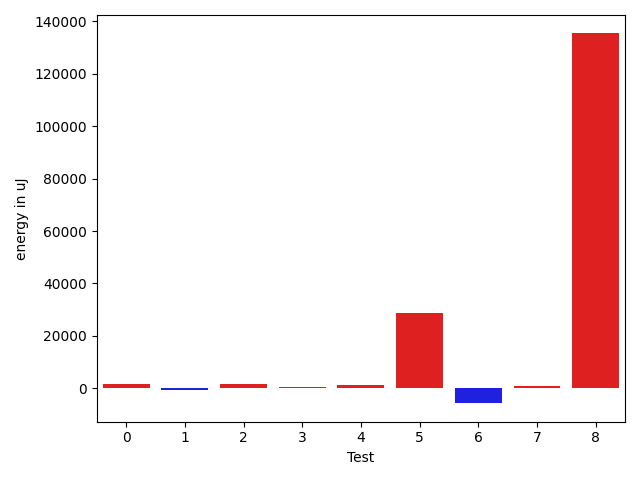

# gson 7a9fd5

https://github.com/google/gson/commit/7a9fd5

## Delta Energy per test method

| ID | EnergyV1 | EnergyV2 | DeltaEnergy | σV1 | σV2 |
| --- | --- | --- | --- | --- | --- |
| 0 | 74706 | 73852 | -854 | 15120.548077084146 | 15785.535726681857 |
| 1 | 37231 | 37170 | -61 | 6488.190535347723 | 2416.700446864804 |
| 2 | 36804 | 37292 | 488 | 6681.9888618238265 | 9825.752504564593 |
| 3 | 73914 | 74462 | 548 | 20067.817827896364 | 22100.463837426698 |
| 4 | 74401 | 76477 | 2076 | 17261.853345038646 | 16852.860260613903 |
| 5 | 961118 | 978635 | 17517 | 499866.48921608453 | 503860.7733982037 |
| 6 | 364928 | 364867 | -61 | 145163.27917373244 | 144183.34779317645 |
| 7 | 36132 | 36560 | 428 | 3980.0743292985026 | 5202.098670268241 |
| 8 | 35949 | 36804 | 855 | 322238.9363737657 | 502478.52482222655 |

## Delta Duration per test method

| ID | DurationV1 | DurationsV2 | DeltaDuration |
| --- | --- | --- | --- |
| 0 | 2619919.0303030303 | 2600121.0808080807 | -19797.949494949542 |
| 1 | 1278929.0705882353 | 1273365.4666666666 | -5563.60392156872 |
| 2 | 1389057.8041237113 | 1397095.6451612904 | 8037.841037579114 |
| 3 | 2507453.3131313133 | 2485156.6464646463 | -22296.666666666977 |
| 4 | 2714001.6464646463 | 2671684.4646464647 | -42317.18181818165 |
| 5 | 17948993.87912088 | 18812435.923076924 | 863442.0439560451 |
| 6 | 11330875.313131314 | 11070617.646464646 | -260257.6666666679 |
| 7 | 1060430.014925373 | 1028094.7272727273 | -32335.287652645726 |
| 8 | 3358394.9811320757 | 7390851.246153846 | 4032456.2650217707 |

## Misc.

| ID | Test Class | Test Method |
| --- | --- | --- |
| 0 | com.google.gson.functional.DefaultTypeAdaptersTest | testDateSerializationWithPatternNotOverridenByTypeAdapter |
| 1 | com.google.gson.functional.DefaultTypeAdaptersTest | testSqlDateSerialization |
| 2 | com.google.gson.functional.DefaultTypeAdaptersTest | testTimestampSerialization |
| 3 | com.google.gson.functional.DefaultTypeAdaptersTest | testDateDeserializationWithPattern |
| 4 | com.google.gson.functional.DefaultTypeAdaptersTest | testDateSerializationInCollection |
| 5 | com.google.gson.functional.DefaultTypeAdaptersTest | testDateSerializationWithPattern |
| 6 | com.google.gson.DefaultDateTypeAdapterTest | testDateDeserializationISO8601 |
| 7 | com.google.gson.DefaultDateTypeAdapterTest | testDateSerialization |
| 8 | com.google.gson.DefaultDateTypeAdapterTest | testDatePattern |

| Test | IterationV1 | IterationV2 | DeltaIteration |
| --- | --- | --- | --- |
| 0 | 99 | 99 | 0 |
| 1 | 85 | 90 | 5 |
| 2 | 97 | 93 | -4 |
| 3 | 99 | 99 | 0 |
| 4 | 99 | 99 | 0 |
| 5 | 91 | 91 | 0 |
| 6 | 99 | 99 | 0 |
| 7 | 67 | 55 | -12 |
| 8 | 53 | 65 | 12 |

| Time Label | Time (s) |
| --- | --- |
| Selection | 34.046000480651855 |
| Injection | 13.998331069946289 |
| Total | 1385.3567938804626 |

