# gson b2af57

https://github.com/google/gson/commit/b2af57

## Delta Energy per test method

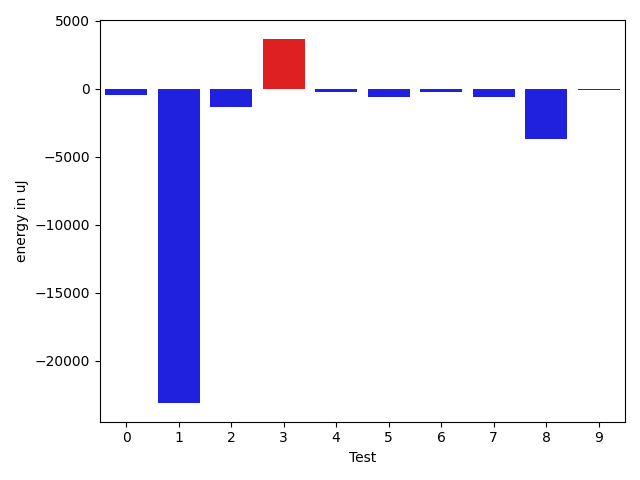

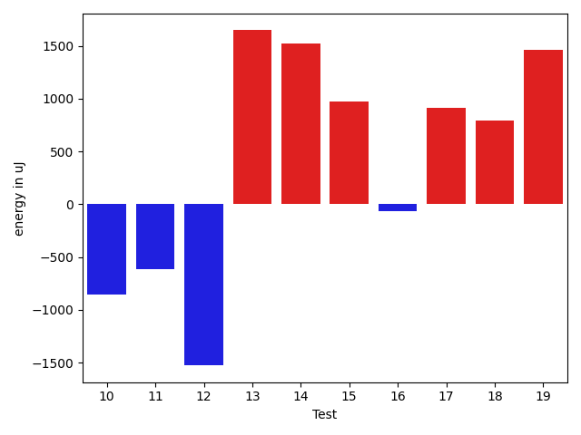

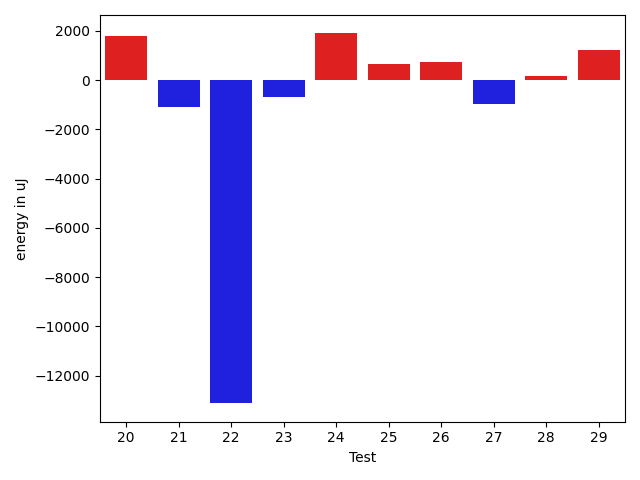

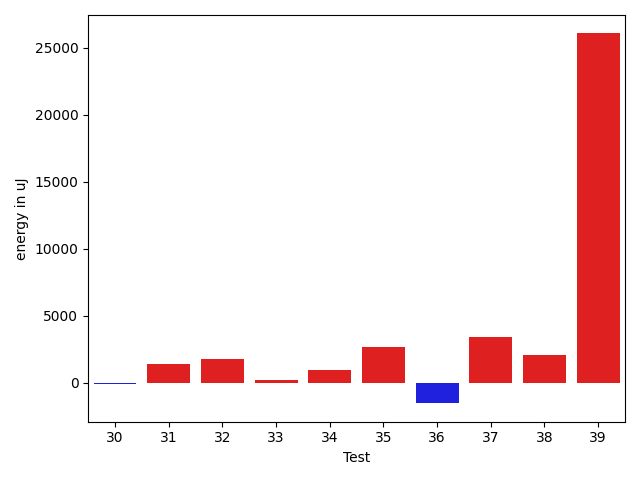

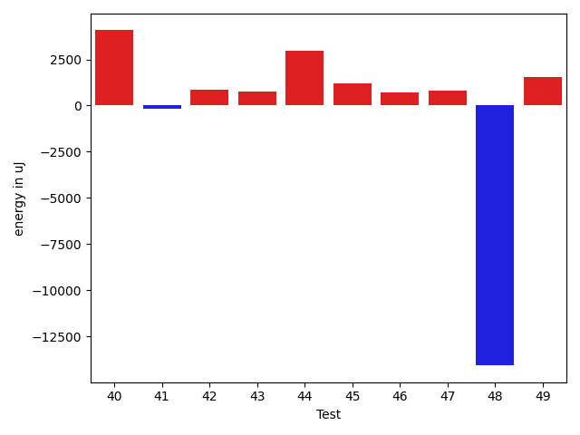

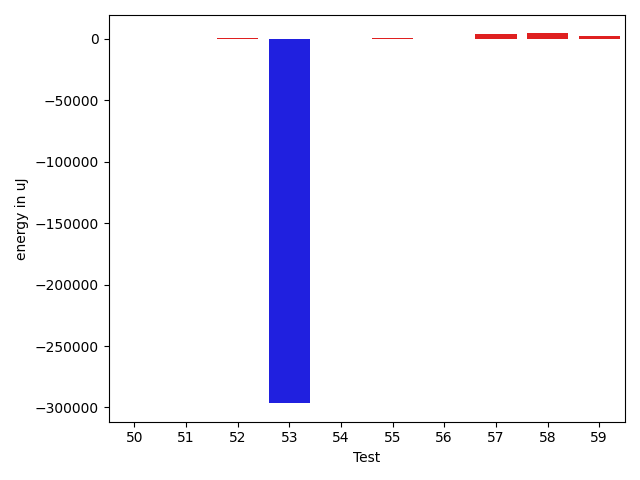

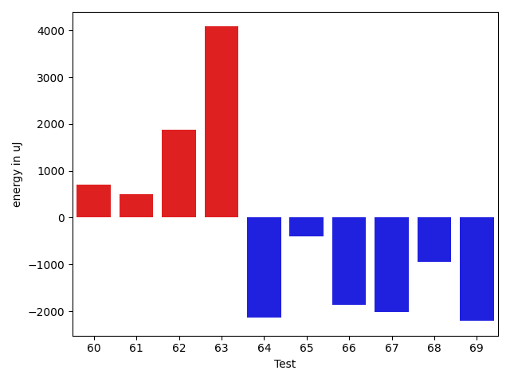

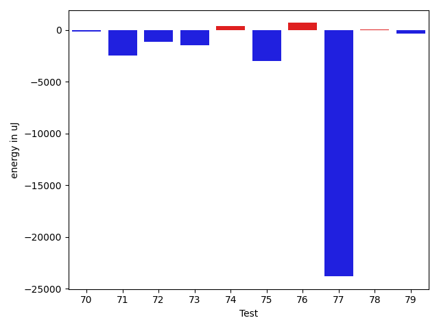

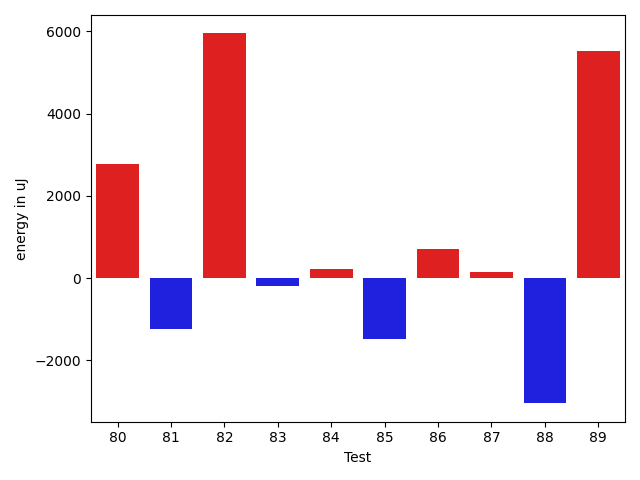

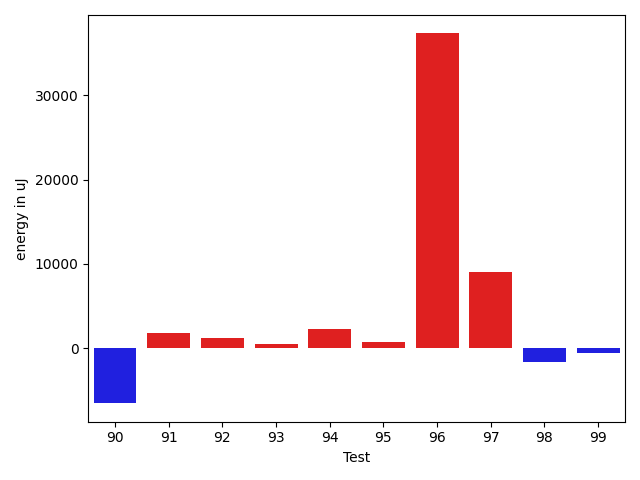

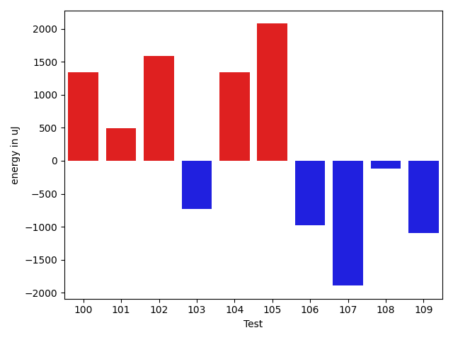

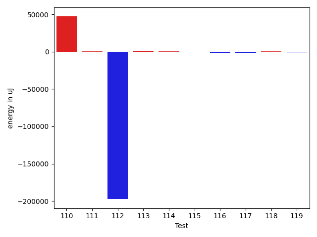

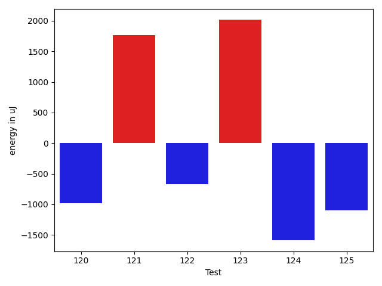

| ID | EnergyV1 | EnergyV2 | DeltaEnergy | σV1 | σV2 |
| --- | --- | --- | --- | --- | --- |
| 0 | 35583 | 36194 | 611 | 4142.315188713266 | 3708.9097324518875 |
| 1 | 38513 | 38391 | -122 | 341493.70507823245 | 294334.4939385241 |
| 2 | 35828 | 35278 | -550 | 6923.740031270111 | 4412.344207423836 |
| 3 | 90026 | 97900 | 7874 | 21374.015712165834 | 22122.280179644673 |
| 4 | 34790 | 35767 | 977 | 9737.218721065836 | 6251.059030561994 |
| 5 | 35217 | 35156 | -61 | 6040.834364322691 | 3189.4965380820063 |
| 6 | 34729 | 35950 | 1221 | 8263.093342472648 | 3502.6692446480083 |
| 7 | 33630 | 35217 | 1587 | 7449.132598872565 | 5428.488034851975 |
| 8 | 36865 | 37659 | 794 | 25334.858721360353 | 16607.54746648085 |
| 9 | 34851 | 34302 | -549 | 3242.4326101562942 | 3616.2425197433868 |
| 10 | 36438 | 35584 | -854 | 33898.124960616005 | 31775.671033078124 |
| 11 | 37109 | 36499 | -610 | 69266.96924828444 | 63510.24044132218 |
| 12 | 36927 | 35401 | -1526 | 14028.747492616638 | 11158.07600562632 |
| 13 | 33325 | 34973 | 1648 | 3191.5353579160615 | 3255.4561043704216 |
| 14 | 34424 | 35950 | 1526 | 3716.4208687994023 | 3967.7757587972087 |
| 15 | 34668 | 35644 | 976 | 3908.507771515877 | 3741.259087811238 |
| 16 | 34912 | 34851 | -61 | 5772.824867671469 | 3548.8702475693362 |
| 17 | 34607 | 35522 | 915 | 3311.1613064754188 | 3580.435220302415 |
| 18 | 36621 | 37414 | 793 | 14508.602153459311 | 12466.198927090538 |
| 19 | 35767 | 37232 | 1465 | 4066.9320041375463 | 3604.70814999095 |
| 20 | 39123 | 40894 | 1771 | 9995.907606135243 | 10256.97009050431 |
| 21 | 37048 | 35950 | -1098 | 8771.760858150396 | 7136.99188862664 |
| 22 | 144530 | 131408 | -13122 | 37252.844545943175 | 35403.627066631394 |
| 23 | 37415 | 36743 | -672 | 4446.911903940189 | 16386.09669895011 |
| 24 | 39550 | 41443 | 1893 | 38496.01912801471 | 40925.596253833486 |
| 25 | 36316 | 36987 | 671 | 11027.03024662204 | 17599.673420314608 |
| 26 | 34667 | 35400 | 733 | 3297.102039575815 | 3982.9386299788143 |
| 27 | 38636 | 37658 | -978 | 3449.067310520338 | 4101.194953862444 |
| 28 | 37109 | 37293 | 184 | 4436.555709105883 | 3990.7495710566564 |
| 29 | 33936 | 35156 | 1220 | 3809.92576525248 | 4001.2120906720957 |
| 30 | 33874 | 33752 | -122 | 2872.678038620654 | 3422.289769077658 |
| 31 | 111389 | 112792 | 1403 | 23237.80238770042 | 24052.837695973714 |
| 32 | 33142 | 34912 | 1770 | 2930.6759391508067 | 3601.5890263520114 |
| 33 | 34179 | 34363 | 184 | 4128.439347937669 | 3647.3266691643107 |
| 34 | 33264 | 34241 | 977 | 4223.183567911281 | 4542.425625852337 |
| 35 | 34180 | 36865 | 2685 | 4447.713727499299 | 3842.1229874927753 |
| 36 | 36865 | 35339 | -1526 | 3428.954916833047 | 4318.157252999749 |
| 37 | 37780 | 41198 | 3418 | 440389.39547641797 | 563435.828123111 |
| 38 | 74768 | 76843 | 2075 | 34293.71131011468 | 131613.28479343932 |
| 39 | 122375 | 148438 | 26063 | 393946.6932523329 | 319550.3506143003 |
| 40 | 35218 | 35644 | 426 | 3075.3607116141397 | 16488.06061604479 |
| 41 | 34363 | 34790 | 427 | 5845.3008357431445 | 4215.9965868403915 |
| 42 | 35034 | 34851 | -183 | 3735.272488899107 | 5106.480901380041 |
| 43 | 33936 | 35096 | 1160 | 3650.2636192192913 | 4211.915933812872 |
| 44 | 34729 | 37598 | 2869 | 4185.354646300134 | 4196.486915551859 |
| 45 | 33509 | 35523 | 2014 | 4935.499581860595 | 4166.884443146825 |
| 46 | 34546 | 36194 | 1648 | 3136.024603230334 | 4410.472450827255 |
| 47 | 35522 | 35827 | 305 | 3691.644214994317 | 4470.061223578241 |
| 48 | 38391 | 38268 | -123 | 79342.04113848126 | 66736.51991919286 |
| 49 | 35705 | 37231 | 1526 | 4379.753062546893 | 4821.504455314755 |
| 50 | 35583 | 35278 | -305 | 4231.052729227089 | 4071.303100603023 |
| 51 | 38086 | 36804 | -1282 | 4372.153863068379 | 4968.392332088474 |
| 52 | 35767 | 36254 | 487 | 4193.803541736746 | 3535.8163024597993 |
| 53 | 42236 | 40771 | -1465 | 831904.0900221972 | 326213.5820235006 |
| 54 | 37537 | 36560 | -977 | 8811.71290726156 | 10053.38848701579 |
| 55 | 36927 | 35767 | -1160 | 10266.977972090288 | 12943.526219779915 |
| 56 | 35706 | 35705 | -1 | 4186.128960054827 | 4145.0550613531 |
| 57 | 37597 | 38635 | 1038 | 8139.114588010774 | 13500.038927738453 |
| 58 | 35645 | 37232 | 1587 | 12219.52750068512 | 17505.964699378866 |
| 59 | 38025 | 40283 | 2258 | 31122.444767094265 | 34836.59622536326 |
| 60 | 34912 | 35035 | 123 | 4337.859908748667 | 7836.908662165334 |
| 61 | 35767 | 35828 | 61 | 4226.78783059706 | 3808.4450231251426 |
| 62 | 38880 | 38330 | -550 | 58985.59143987959 | 63563.433372202635 |
| 63 | 36988 | 36865 | -123 | 26270.44137606976 | 35538.45309051193 |
| 64 | 35644 | 33020 | -2624 | 3724.647247726957 | 3832.5201492490555 |
| 65 | 34179 | 34301 | 122 | 3537.3972929294628 | 4931.562539503291 |
| 66 | 36743 | 33997 | -2746 | 3665.4549435309605 | 4481.002008728867 |
| 67 | 37353 | 35645 | -1708 | 11939.464993411091 | 11206.640120677339 |
| 68 | 35522 | 33447 | -2075 | 3374.452831678514 | 4750.53985726993 |
| 69 | 36621 | 34790 | -1831 | 3342.8903172957066 | 4653.1995629284675 |
| 70 | 40344 | 40161 | -183 | 394462.3968391938 | 507750.0426824158 |
| 71 | 37170 | 34729 | -2441 | 3848.082084236681 | 4118.175912538362 |
| 72 | 35827 | 34667 | -1160 | 3174.6076228422726 | 4383.594400352913 |
| 73 | 37354 | 35889 | -1465 | 3894.55189554847 | 3657.27058761608 |
| 74 | 39124 | 39490 | 366 | 23883.7730921133 | 20450.567249089298 |
| 75 | 40771 | 37780 | -2991 | 37214.06391973634 | 41806.12554360647 |
| 76 | 35400 | 36071 | 671 | 3801.7838137469744 | 3886.554325992226 |
| 77 | 217163 | 193359 | -23804 | 314566.32587856136 | 335129.34222256404 |
| 78 | 35645 | 35706 | 61 | 3867.2639786470627 | 3652.4587767327357 |
| 79 | 36316 | 35950 | -366 | 31408.90825135346 | 28797.87562091169 |
| 80 | 34728 | 36011 | 1283 | 7425.661391940146 | 9935.637625185007 |
| 81 | 36315 | 35523 | -792 | 3797.282366025169 | 4205.750801283703 |
| 82 | 37109 | 37719 | 610 | 71612.67390120395 | 74548.28752647007 |
| 83 | 35644 | 35523 | -121 | 5099.423591842253 | 5755.465098344693 |
| 84 | 34545 | 34851 | 306 | 3427.0417889879004 | 3271.491245602093 |
| 85 | 36499 | 34607 | -1892 | 4393.760120599458 | 3311.138460139986 |
| 86 | 36010 | 36926 | 916 | 8388.689590143416 | 7775.413251517807 |
| 87 | 35095 | 35034 | -61 | 7309.743525476058 | 7640.829502424921 |
| 88 | 38147 | 38208 | 61 | 21789.43187880563 | 23182.409795407428 |
| 89 | 35766 | 37659 | 1893 | 69981.93133514127 | 64527.53505615916 |
| 90 | 54138 | 39123 | -15015 | 32117.465822122726 | 17435.274329683816 |
| 91 | 35278 | 36194 | 916 | 5522.640541152579 | 7350.498143822889 |
| 92 | 36926 | 35950 | -976 | 6566.177911343977 | 11925.22108516232 |
| 93 | 34484 | 35706 | 1222 | 3150.672650006662 | 4641.742167957859 |
| 94 | 36926 | 37292 | 366 | 10163.10474044609 | 12773.898137992232 |
| 95 | 36865 | 37659 | 794 | 5341.451803438584 | 5830.564458416878 |
| 96 | 41626 | 42541 | 915 | 671563.2120658669 | 741619.7877423946 |
| 97 | 38818 | 40954 | 2136 | 20475.67308281647 | 28289.56495685785 |
| 98 | 37780 | 35523 | -2257 | 3905.6587072068173 | 3749.5819023870295 |
| 99 | 37475 | 36927 | -548 | 3194.0282515781364 | 4338.973852187335 |
| 100 | 36926 | 38269 | 1343 | 45659.91712613824 | 83077.34392199748 |
| 101 | 36316 | 36804 | 488 | 49275.91293613858 | 4847.398957471168 |
| 102 | 37232 | 38818 | 1586 | 295757.7575365022 | 514342.9043719099 |
| 103 | 72875 | 72144 | -731 | 32741.066465726653 | 31976.5754479754 |
| 104 | 37048 | 38391 | 1343 | 81414.4450398572 | 68260.98682850567 |
| 105 | 34606 | 36682 | 2076 | 4378.594529776817 | 8168.767771087581 |
| 106 | 37658 | 36682 | -976 | 23101.788673846324 | 16009.162178605713 |
| 107 | 38208 | 36316 | -1892 | 5325.267791284199 | 8332.446285577893 |
| 108 | 35828 | 35705 | -123 | 3871.022791057796 | 2905.1336668816084 |
| 109 | 38880 | 37781 | -1099 | 25546.363424179857 | 21682.558386062497 |
| 110 | 36011 | 37903 | 1892 | 477994.398694406 | 572267.4063280023 |
| 111 | 35096 | 37353 | 2257 | 5593.312718307719 | 3832.1923793174537 |
| 112 | 39550 | 39307 | -243 | 697297.6246929583 | 343422.38057526475 |
| 113 | 35644 | 37536 | 1892 | 4402.281471111501 | 4715.740433908551 |
| 114 | 35217 | 36255 | 1038 | 3933.6489909603074 | 3659.530048355649 |
| 115 | 36316 | 36437 | 121 | 4998.08072471303 | 4251.457668681855 |
| 116 | 37170 | 37048 | -122 | 4990.824012124651 | 4069.270027904268 |
| 117 | 37537 | 38635 | 1098 | 11234.265137548959 | 5912.787212947884 |
| 118 | 35767 | 38757 | 2990 | 4688.615054309748 | 4499.5269557587935 |
| 119 | 37110 | 36499 | -611 | 3829.415785590352 | 3763.5835711529185 |
| 120 | 35889 | 34912 | -977 | 3648.4209252086034 | 3888.4199265739326 |
| 121 | 36194 | 37963 | 1769 | 3927.140252142772 | 3530.781458149941 |
| 122 | 37781 | 37109 | -672 | 2915.915113321526 | 3932.65188628622 |
| 123 | 36133 | 38147 | 2014 | 3442.99775646462 | 4399.243091462186 |
| 124 | 39551 | 37964 | -1587 | 14198.996906950162 | 6603.932908797162 |
| 125 | 38574 | 37476 | -1098 | 711639.8971339435 | 630165.0756333614 |

## Delta Duration per test method

| ID | DurationV1 | DurationsV2 | DeltaDuration |
| --- | --- | --- | --- |
| 0 | 806513.6909090909 | 815464.5192307692 | 8950.828321678331 |
| 1 | 3571582.2537313434 | 2912117.913043478 | -659464.3406878654 |
| 2 | 992015.1857142857 | 955232.6935483871 | -36782.492165898555 |
| 3 | 2736352.878787879 | 2793351.2525252528 | 56998.373737373855 |
| 4 | 1061318.875 | 1006909.9130434783 | -54408.96195652173 |
| 5 | 825239.5172413794 | 864164.803030303 | 38925.28578892362 |
| 6 | 908258.375 | 900268.6271186441 | -7989.747881355928 |
| 7 | 1072555.640625 | 1006977.262295082 | -65578.37832991802 |
| 8 | 1264112.0 | 1145696.0447761193 | -118415.95522388071 |
| 9 | 527457.9090909091 | 498452.24 | -29005.66909090907 |
| 10 | 1571695.7341772153 | 1423010.7307692308 | -148685.0034079845 |
| 11 | 1741631.3606557378 | 1454165.2615384615 | -287466.09911727626 |
| 12 | 1214125.2461538462 | 1153014.7631578948 | -61110.482995951315 |
| 13 | 646875.0512820513 | 653190.9791666666 | 6315.927884615376 |
| 14 | 787276.9433962264 | 809389.6222222223 | 22112.678825995885 |
| 15 | 490291.0 | 530768.8076923077 | 40477.807692307746 |
| 16 | 936367.0 | 935254.0769230769 | -1112.9230769231217 |
| 17 | 695028.125 | 694392.0784313725 | -636.0465686274692 |
| 18 | 1269518.5189873418 | 1304201.1012658228 | 34682.582278480986 |
| 19 | 549797.8965517242 | 545156.8275862068 | -4641.068965517334 |
| 20 | 794513.1034482758 | 869740.65625 | 75227.55280172417 |
| 21 | 1147614.1904761905 | 1151062.8170731708 | 3448.6265969802625 |
| 22 | 4419493.141414141 | 4377118.747474748 | -42374.39393939357 |
| 23 | 763284.9545454546 | 939367.6875 | 176082.7329545454 |
| 24 | 1491062.2258064516 | 1764183.4193548388 | 273121.19354838715 |
| 25 | 886010.3181818182 | 1121951.0666666667 | 235940.74848484842 |
| 26 | 392037.9375 | 547840.5384615385 | 155802.6009615385 |
| 27 | 434675.3125 | 513438.7272727273 | 78763.4147727273 |
| 28 | 566612.4 | 587013.2222222222 | 20400.822222222225 |
| 29 | 731298.4642857143 | 752916.2156862745 | 21617.75140056014 |
| 30 | 576580.3947368421 | 647510.1707317074 | 70929.77599486522 |
| 31 | 3371714.626262626 | 3420138.5555555555 | 48423.92929292936 |
| 32 | 647471.1904761905 | 730350.5952380953 | 82879.40476190473 |
| 33 | 764219.8 | 760335.75 | -3884.0500000000466 |
| 34 | 531896.2068965518 | 544376.2 | 12479.993103448185 |
| 35 | 593274.8571428572 | 622866.1071428572 | 29591.25 |
| 36 | 578750.4814814815 | 585916.7894736842 | 7166.3079922026955 |
| 37 | 4346175.747126437 | 5872523.577777778 | 1526347.830651341 |
| 38 | 2789117.585858586 | 3147141.6767676766 | 358024.0909090908 |
| 39 | 7208427.090909091 | 6160028.898989899 | -1048398.1919191917 |
| 40 | 1020950.1551724138 | 1075331.0285714285 | 54380.8733990147 |
| 41 | 1048608.138888889 | 1038888.0897435897 | -9720.049145299243 |
| 42 | 553808.1428571428 | 559999.1851851852 | 6191.042328042327 |
| 43 | 616703.3428571429 | 591745.8709677419 | -24957.47188940097 |
| 44 | 677466.75 | 697117.2857142857 | 19650.53571428568 |
| 45 | 692785.731707317 | 688955.1935483871 | -3830.538158929907 |
| 46 | 752162.2291666666 | 758177.5555555555 | 6015.326388888876 |
| 47 | 586804.5757575758 | 624428.641025641 | 37624.0652680652 |
| 48 | 2129399.5945945946 | 1673771.511627907 | -455628.0829666876 |
| 49 | 599806.1 | 622715.7407407408 | 22909.64074074081 |
| 50 | 811783.6 | 770548.7931034482 | -41234.806896551745 |
| 51 | 689922.3125 | 564515.3666666667 | -125406.9458333333 |
| 52 | 554694.75 | 528370.9411764706 | -26323.808823529398 |
| 53 | 11754575.01724138 | 3242616.9206349207 | -8511958.09660646 |
| 54 | 982154.9 | 839434.8095238095 | -142720.09047619055 |
| 55 | 1080396.524590164 | 1123981.6923076923 | 43585.1677175283 |
| 56 | 836838.3728813559 | 837356.3728813559 | 518.0 |
| 57 | 1211469.5853658537 | 1328826.392857143 | 117356.80749128922 |
| 58 | 1010671.1666666666 | 1068088.5737704919 | 57417.407103825244 |
| 59 | 1456276.5166666666 | 1543110.0153846154 | 86833.4987179488 |
| 60 | 949937.8 | 981617.231884058 | 31679.431884057936 |
| 61 | 867754.9074074074 | 895932.0 | 28177.092592592584 |
| 62 | 1586592.2727272727 | 1622174.121212121 | 35581.84848484839 |
| 63 | 1544354.9157894736 | 1718450.858695652 | 174095.94290617853 |
| 64 | 505949.76 | 554150.24 | 48200.47999999998 |
| 65 | 764483.5 | 812380.2978723404 | 47896.79787234042 |
| 66 | 786815.7333333333 | 843997.0535714285 | 57181.32023809524 |
| 67 | 918606.088888889 | 893200.675 | -25405.4138888889 |
| 68 | 622569.4772727273 | 652598.5714285715 | 30029.094155844185 |
| 69 | 544008.3142857143 | 604662.5 | 60654.185714285704 |
| 70 | 5107473.16 | 7645585.214285715 | 2538112.0542857144 |
| 71 | 819580.6481481482 | 806980.5689655172 | -12600.079182630987 |
| 72 | 839175.8181818182 | 821373.2741935484 | -17802.54398826987 |
| 73 | 655267.380952381 | 597391.2083333334 | -57876.172619047575 |
| 74 | 1307546.5 | 1260213.4523809524 | -47333.047619047575 |
| 75 | 1219884.6333333333 | 1237857.6666666667 | 17973.033333333442 |
| 76 | 650338.3103448276 | 641654.8666666667 | -8683.443678160897 |
| 77 | 8334374.98989899 | 8106876.717171717 | -227498.27272727247 |
| 78 | 922676.3064516129 | 925979.6376811594 | 3303.331229546573 |
| 79 | 1266657.4146341463 | 1250769.775 | -15887.639634146355 |
| 80 | 1086405.3333333333 | 1073998.3513513512 | -12406.981981982011 |
| 81 | 611099.0 | 622548.5365853659 | 11449.536585365888 |
| 82 | 1674479.7419354839 | 1901313.0909090908 | 226833.34897360695 |
| 83 | 1055840.1780821919 | 1064121.5972222222 | 8281.419140030397 |
| 84 | 614465.5714285715 | 660379.1351351351 | 45913.56370656367 |
| 85 | 768670.8717948718 | 844655.8723404255 | 75985.00054555375 |
| 86 | 924761.5555555555 | 943084.2307692308 | 18322.675213675248 |
| 87 | 1150015.4024390243 | 1148523.6744186047 | -1491.7280204195995 |
| 88 | 1618694.177777778 | 1538190.412371134 | -80503.76540664397 |
| 89 | 1842498.8837209302 | 1867653.1649484537 | 25154.28122752346 |
| 90 | 1742501.5151515151 | 1659544.8181818181 | -82956.69696969702 |
| 91 | 1143285.3255813953 | 1174957.7 | 31672.374418604653 |
| 92 | 914814.7826086957 | 996001.62 | 81186.83739130432 |
| 93 | 644924.425 | 635540.3548387097 | -9384.07016129035 |
| 94 | 1129938.125 | 1173487.4810126582 | 43549.356012658216 |
| 95 | 1036270.3636363636 | 1046232.8888888889 | 9962.525252525229 |
| 96 | 7620672.6 | 8932864.35 | 1312191.75 |
| 97 | 1425786.1375 | 1645173.0531914893 | 219386.91569148935 |
| 98 | 760128.7837837838 | 728826.875 | -31301.908783783787 |
| 99 | 627917.7037037037 | 558775.8823529412 | -69141.8213507625 |
| 100 | 1129176.6923076923 | 1609559.780487805 | 480383.08818011265 |
| 101 | 1079276.238095238 | 821732.0909090909 | -257544.14718614717 |
| 102 | 2693511.3541666665 | 5476742.488372093 | 2783231.1342054266 |
| 103 | 2339254.4545454546 | 2294601.727272727 | -44652.72727272753 |
| 104 | 1612216.282051282 | 1491888.103448276 | -120328.17860300606 |
| 105 | 787810.4193548387 | 788982.8979591837 | 1172.4786043450003 |
| 106 | 1177498.5084745763 | 1101529.705882353 | -75968.80259222328 |
| 107 | 924715.3166666667 | 1080168.9365079366 | 155453.61984126992 |
| 108 | 460053.26666666666 | 491136.1785714286 | 31082.911904761917 |
| 109 | 1221227.1666666667 | 1140372.5737704919 | -80854.59289617487 |
| 110 | 4670641.808510638 | 5474235.733333333 | 803593.9248226956 |
| 111 | 801179.8780487805 | 707003.3333333334 | -94176.54471544712 |
| 112 | 8450301.931034483 | 2750925.674698795 | -5699376.256335688 |
| 113 | 615796.5925925926 | 566727.95 | -49068.64259259263 |
| 114 | 667812.8823529412 | 590029.4516129033 | -77783.43074003793 |
| 115 | 536709.0 | 437184.25 | -99524.75 |
| 116 | 533243.84 | 528006.12 | -5237.719999999972 |
| 117 | 952340.5789473684 | 802575.22 | -149765.35894736846 |
| 118 | 480388.75 | 483106.36 | 2717.609999999986 |
| 119 | 497475.71428571426 | 481504.04761904763 | -15971.666666666628 |
| 120 | 639720.525 | 557940.925925926 | -81779.59907407407 |
| 121 | 558507.2 | 605525.2857142857 | 47018.08571428573 |
| 122 | 543851.4705882353 | 467358.0 | -76493.4705882353 |
| 123 | 487823.71428571426 | 459127.6666666667 | -28696.047619047575 |
| 124 | 771081.2777777778 | 641717.3478260869 | -129363.92995169084 |
| 125 | 10242218.5 | 7050768.6 | -3191449.9000000004 |

## Misc.

| ID | Test Class | Test Method |
| --- | --- | --- |
| 0 | com.google.gson.functional.CustomTypeAdaptersTest | testCustomTypeAdapterAppliesToSubClassesSerializedAsBaseClass |
| 1 | com.google.gson.functional.CustomTypeAdaptersTest | testCustomSerializers |
| 2 | com.google.gson.functional.CustomTypeAdaptersTest | testCustomNestedDeserializers |
| 3 | com.google.gson.functional.CustomTypeAdaptersTest | testCustomTypeAdapterDoesNotAppliesToSubClasses |
| 4 | com.google.gson.functional.CustomTypeAdaptersTest | testCustomSerializerForLong |
| 5 | com.google.gson.functional.CustomTypeAdaptersTest | testCustomByteArrayDeserializerAndInstanceCreator |
| 6 | com.google.gson.functional.CustomTypeAdaptersTest | testCustomAdapterInvokedForMapElementDeserialization |
| 7 | com.google.gson.functional.CustomTypeAdaptersTest | testCustomAdapterInvokedForMapElementSerializationWithType |
| 8 | com.google.gson.functional.CustomTypeAdaptersTest | testCustomNestedSerializers |
| 9 | com.google.gson.functional.CustomTypeAdaptersTest | testCustomAdapterInvokedForMapElementSerialization |
| 10 | com.google.gson.functional.CustomTypeAdaptersTest | testCustomAdapterInvokedForCollectionElementSerializationWithType |
| 11 | com.google.gson.functional.CustomTypeAdaptersTest | testCustomDeserializers |
| 12 | com.google.gson.functional.CustomTypeAdaptersTest | testCustomDeserializerForLong |
| 13 | com.google.gson.functional.CustomTypeAdaptersTest | testEnsureCustomDeserializerNotInvokedForNullValues |
| 14 | com.google.gson.functional.CustomTypeAdaptersTest | testCustomByteArraySerializer |
| 15 | com.google.gson.functional.CustomTypeAdaptersTest | testCustomAdapterInvokedForCollectionElementSerialization |
| 16 | com.google.gson.functional.CustomTypeAdaptersTest | testCustomAdapterInvokedForCollectionElementDeserialization |
| 17 | com.google.gson.functional.CustomTypeAdaptersTest | testEnsureCustomSerializerNotInvokedForNullValues |
| 18 | com.google.gson.functional.ReadersWritersTest | testReadWriteTwoObjects |
| 19 | com.google.gson.functional.ReadersWritersTest | testTopLevelNullObjectDeserializationWithReaderAndSerializeNulls |
| 20 | com.google.gson.functional.ReadersWritersTest | testTopLevelNullObjectSerializationWithWriterAndSerializeNulls |
| 21 | com.google.gson.functional.ReadersWritersTest | testReadWriteTwoStrings |
| 22 | com.google.gson.ParameterizedTypeHandlerMapTest | testTypeOverridding |
| 23 | com.google.gson.ParameterizedTypeHandlerMapTest | testHasSpecificType |
| 24 | com.google.gson.ParameterizedTypeHandlerMapTest | testHasGenericButNotSpecific |
| 25 | com.google.gson.ParameterizedTypeHandlerMapTest | testTypeHierarchyMultipleHandlers |
| 26 | com.google.gson.ParameterizedTypeHandlerMapTest | testTypeHierarchyRegisterIfAbsent |
| 27 | com.google.gson.ParameterizedTypeHandlerMapTest | testMakeUnmodifiable |
| 28 | com.google.gson.ParameterizedTypeHandlerMapTest | testTypeHierarchy |
| 29 | com.google.gson.functional.DefaultTypeAdaptersTest | testDateSerializationWithPattern |
| 30 | com.google.gson.functional.DefaultTypeAdaptersTest | testDefaultGregorianCalendarDeserialization |
| 31 | com.google.gson.functional.DefaultTypeAdaptersTest | testDefaultDateDeserializationUsingBuilder |
| 32 | com.google.gson.functional.DefaultTypeAdaptersTest | testDefaultCalendarDeserialization |
| 33 | com.google.gson.functional.DefaultTypeAdaptersTest | testDateDeserializationWithPattern |
| 34 | com.google.gson.functional.DefaultTypeAdaptersTest | testDefaultGregorianCalendarSerialization |
| 35 | com.google.gson.functional.DefaultTypeAdaptersTest | testDefaultCalendarSerialization |
| 36 | com.google.gson.functional.DefaultTypeAdaptersTest | testSetSerialization |
| 37 | com.google.gson.JsonParserTest | testReadWriteTwoObjects |
| 38 | com.google.gson.functional.NamingPolicyTest | testGsonWithNonDefaultFieldNamingPolicySerialization |
| 39 | com.google.gson.functional.NamingPolicyTest | testGsonDuplicateNameUsingSerializedNameFieldNamingPolicySerialization |
| 40 | com.google.gson.functional.NamingPolicyTest | testGsonWithSerializedNameFieldNamingPolicySerialization |
| 41 | com.google.gson.functional.NamingPolicyTest | testDeprecatedNamingStrategy |
| 42 | com.google.gson.functional.NamingPolicyTest | testGsonWithUpperCamelCaseSpacesPolicySerialiation |
| 43 | com.google.gson.functional.NamingPolicyTest | testGsonWithLowerCaseDashPolicySerialization |
| 44 | com.google.gson.functional.NamingPolicyTest | testGsonWithLowerCaseUnderscorePolicyDeserialiation |
| 45 | com.google.gson.functional.NamingPolicyTest | testGsonWithLowerCaseDashPolicyDeserialiation |
| 46 | com.google.gson.functional.NamingPolicyTest | testGsonWithSerializedNameFieldNamingPolicyDeserialization |
| 47 | com.google.gson.functional.NamingPolicyTest | testGsonWithUpperCamelCaseSpacesPolicyDeserialiation |
| 48 | com.google.gson.functional.NamingPolicyTest | testGsonWithNonDefaultFieldNamingPolicyDeserialiation |
| 49 | com.google.gson.functional.NamingPolicyTest | testGsonWithLowerCaseUnderscorePolicySerialization |
| 50 | com.google.gson.functional.CustomSerializerTest | testSerializerReturnsNull |
| 51 | com.google.gson.functional.CustomSerializerTest | testBaseClassSerializerInvokedForBaseClassFields |
| 52 | com.google.gson.functional.CustomSerializerTest | testBaseClassSerializerInvokedForBaseClassFieldsHoldingSubClassInstances |
| 53 | com.google.gson.functional.CustomSerializerTest | testSubClassSerializerInvokedForBaseClassFieldsHoldingSubClassInstances |
| 54 | com.google.gson.functional.CustomSerializerTest | testSubClassSerializerInvokedForBaseClassFieldsHoldingArrayOfSubClassInstances |
| 55 | com.google.gson.functional.CustomDeserializerTest | testCustomDeserializerReturnsNull |
| 56 | com.google.gson.functional.CustomDeserializerTest | testCustomDeserializerReturnsNullForTopLevelPrimitives |
| 57 | com.google.gson.functional.CustomDeserializerTest | testJsonTypeFieldBasedDeserialization |
| 58 | com.google.gson.functional.CustomDeserializerTest | testCustomDeserializerReturnsNullForArrayElements |
| 59 | com.google.gson.functional.CustomDeserializerTest | testCustomDeserializerReturnsNullForTopLevelObject |
| 60 | com.google.gson.functional.CustomDeserializerTest | testCustomDeserializerReturnsNullForArrayElementsForArrayField |
| 61 | com.google.gson.functional.CustomDeserializerTest | testCustomDeserializerReturnsNullForPrimitiveFields |
| 62 | com.google.gson.functional.NullObjectAndFieldTest | testTopLevelNullObjectDeserialization |
| 63 | com.google.gson.functional.NullObjectAndFieldTest | testExplicitSerializationOfNullArrayMembers |
| 64 | com.google.gson.functional.NullObjectAndFieldTest | testCustomTypeAdapterPassesNullSerialization |
| 65 | com.google.gson.functional.NullObjectAndFieldTest | testCustomTypeAdapterPassesNullDesrialization |
| 66 | com.google.gson.functional.NullObjectAndFieldTest | testPrintPrintingObjectWithNulls |
| 67 | com.google.gson.functional.NullObjectAndFieldTest | testPrintPrintingArraysWithNulls |
| 68 | com.google.gson.functional.NullObjectAndFieldTest | testExplicitNullSetsFieldToNullDuringDeserialization |
| 69 | com.google.gson.functional.NullObjectAndFieldTest | testCustomSerializationOfNulls |
| 70 | com.google.gson.functional.NullObjectAndFieldTest | testTopLevelNullObjectSerialization |
| 71 | com.google.gson.functional.NullObjectAndFieldTest | testNullWrappedPrimitiveMemberSerialization |
| 72 | com.google.gson.functional.NullObjectAndFieldTest | testNullWrappedPrimitiveMemberDeserialization |
| 73 | com.google.gson.functional.NullObjectAndFieldTest | testExplicitSerializationOfNullStringMembers |
| 74 | com.google.gson.functional.NullObjectAndFieldTest | testExplicitDeserializationOfNulls |
| 75 | com.google.gson.functional.NullObjectAndFieldTest | testExplicitSerializationOfNulls |
| 76 | com.google.gson.functional.NullObjectAndFieldTest | testExplicitSerializationOfNullCollectionMembers |
| 77 | com.google.gson.functional.VersioningTest | testVersionedUntilSerialization |
| 78 | com.google.gson.functional.VersioningTest | testVersionedClassesDeserialization |
| 79 | com.google.gson.functional.VersioningTest | testVersionedGsonWithUnversionedClassesSerialization |
| 80 | com.google.gson.functional.VersioningTest | testVersionedGsonMixingSinceAndUntilSerialization |
| 81 | com.google.gson.functional.VersioningTest | testIgnoreLaterVersionClassSerialization |
| 82 | com.google.gson.functional.VersioningTest | testVersionedUntilDeserialization |
| 83 | com.google.gson.functional.VersioningTest | testVersionedGsonMixingSinceAndUntilDeserialization |
| 84 | com.google.gson.functional.VersioningTest | testIgnoreLaterVersionClassDeserialization |
| 85 | com.google.gson.functional.VersioningTest | testVersionedGsonWithUnversionedClassesDeserialization |
| 86 | com.google.gson.functional.VersioningTest | testVersionedClassesSerialization |
| 87 | com.google.gson.functional.ParameterizedTypesTest | testParameterizedTypeWithReaderDeserialization |
| 88 | com.google.gson.functional.ParameterizedTypesTest | testParameterizedTypeWithCustomSerializer |
| 89 | com.google.gson.functional.ParameterizedTypesTest | testParameterizedTypeDeserialization |
| 90 | com.google.gson.functional.ParameterizedTypesTest | testParameterizedTypesWithCustomDeserializer |
| 91 | com.google.gson.functional.MapTest | testParameterizedMapSubclassDeserialization |
| 92 | com.google.gson.functional.MapTest | testMapSerializationWithNullValueButSerializeNulls |
| 93 | com.google.gson.functional.MapTest | testMapSerializationWithNullValuesSerialized |
| 94 | com.google.gson.functional.InstanceCreatorTest | testInstanceCreatorReturnsSubTypeForField |
| 95 | com.google.gson.functional.InstanceCreatorTest | testInstanceCreatorReturnsSubTypeForTopLevelObject |
| 96 | com.google.gson.functional.InstanceCreatorTest | testInstanceCreatorReturnsBaseType |
| 97 | com.google.gson.functional.EscapingTest | testGsonAcceptsEscapedAndNonEscapedJsonDeserialization |
| 98 | com.google.gson.functional.SecurityTest | testJsonWithNonExectuableTokenWithConfiguredGsonDeserialization |
| 99 | com.google.gson.functional.SecurityTest | testJsonWithNonExectuableTokenSerialization |
| 100 | com.google.gson.functional.SecurityTest | testNonExecutableJsonDeserialization |
| 101 | com.google.gson.functional.SecurityTest | testJsonWithNonExectuableTokenWithRegularGsonDeserialization |
| 102 | com.google.gson.functional.SecurityTest | testNonExecutableJsonSerialization |
| 103 | com.google.gson.functional.UncategorizedTest | testReturningDerivedClassesDuringDeserialization |
| 104 | com.google.gson.functional.ArrayTest | testNullsInArrayWithSerializeNullPropertySetSerialization |
| 105 | com.google.gson.functional.ArrayTest | testArrayOfPrimitivesWithCustomTypeAdapter |
| 106 | com.google.gson.functional.CircularReferenceTest | testSelfReferenceCustomHandlerSerialization |
| 107 | com.google.gson.functional.ObjectTest | testInnerClassDeserialization |
| 108 | com.google.gson.functional.ObjectTest | testJsonObjectSerialization |
| 109 | com.google.gson.FunctionWithInternalDependenciesTest | testUserDefinedExclusionPolicies |
| 110 | com.google.gson.FunctionWithInternalDependenciesTest | testAnonymousLocalClassesSerialization |
| 111 | com.google.gson.functional.FieldExclusionTest | testDefaultNestedStaticClassIncluded |
| 112 | com.google.gson.functional.FieldExclusionTest | testDefaultInnerClassExclusion |
| 113 | com.google.gson.functional.FieldExclusionTest | testInnerClassExclusion |
| 114 | com.google.gson.functional.PrimitiveTest | testLongAsStringDeserialization |
| 115 | com.google.gson.functional.PrimitiveTest | testFloatNaNSerialization |
| 116 | com.google.gson.functional.PrimitiveTest | testNegativeInfinityFloatSerialization |
| 117 | com.google.gson.functional.PrimitiveTest | testOverridingDefaultPrimitiveSerialization |
| 118 | com.google.gson.functional.PrimitiveTest | testDoubleInfinitySerialization |
| 119 | com.google.gson.functional.PrimitiveTest | testDoubleNaNSerialization |
| 120 | com.google.gson.functional.PrimitiveTest | testHtmlCharacterSerialization |
| 121 | com.google.gson.functional.PrimitiveTest | testLongAsStringSerialization |
| 122 | com.google.gson.functional.PrimitiveTest | testNegativeInfinitySerialization |
| 123 | com.google.gson.functional.PrimitiveTest | testFloatInfinitySerialization |
| 124 | com.google.gson.functional.PrintFormattingTest | testJsonObjectWithNullValuesSerialized |
| 125 | com.google.gson.GsonBuilderTest | testCreatingMoreThanOnce |

| Test | IterationV1 | IterationV2 | DeltaIteration |
| --- | --- | --- | --- |
| 0 | 55 | 52 | -3 |
| 1 | 67 | 69 | 2 |
| 2 | 70 | 62 | -8 |
| 3 | 99 | 99 | 0 |
| 4 | 64 | 69 | 5 |
| 5 | 58 | 66 | 8 |
| 6 | 56 | 59 | 3 |
| 7 | 64 | 61 | -3 |
| 8 | 75 | 67 | -8 |
| 9 | 22 | 25 | 3 |
| 10 | 79 | 78 | -1 |
| 11 | 61 | 65 | 4 |
| 12 | 65 | 76 | 11 |
| 13 | 39 | 48 | 9 |
| 14 | 53 | 45 | -8 |
| 15 | 18 | 26 | 8 |
| 16 | 56 | 65 | 9 |
| 17 | 40 | 51 | 11 |
| 18 | 79 | 79 | 0 |
| 19 | 29 | 29 | 0 |
| 20 | 29 | 32 | 3 |
| 21 | 84 | 82 | -2 |
| 22 | 99 | 99 | 0 |
| 23 | 44 | 32 | -12 |
| 24 | 62 | 62 | 0 |
| 25 | 44 | 45 | 1 |
| 26 | 16 | 13 | -3 |
| 27 | 16 | 22 | 6 |
| 28 | 10 | 18 | 8 |
| 29 | 56 | 51 | -5 |
| 30 | 38 | 41 | 3 |
| 31 | 99 | 99 | 0 |
| 32 | 42 | 42 | 0 |
| 33 | 50 | 48 | -2 |
| 34 | 29 | 25 | -4 |
| 35 | 28 | 28 | 0 |
| 36 | 27 | 38 | 11 |
| 37 | 87 | 90 | 3 |
| 38 | 99 | 99 | 0 |
| 39 | 99 | 99 | 0 |
| 40 | 58 | 70 | 12 |
| 41 | 72 | 78 | 6 |
| 42 | 28 | 27 | -1 |
| 43 | 35 | 31 | -4 |
| 44 | 28 | 28 | 0 |
| 45 | 41 | 31 | -10 |
| 46 | 48 | 45 | -3 |
| 47 | 33 | 39 | 6 |
| 48 | 37 | 43 | 6 |
| 49 | 30 | 27 | -3 |
| 50 | 40 | 58 | 18 |
| 51 | 32 | 30 | -2 |
| 52 | 28 | 34 | 6 |
| 53 | 58 | 63 | 5 |
| 54 | 50 | 42 | -8 |
| 55 | 61 | 65 | 4 |
| 56 | 59 | 59 | 0 |
| 57 | 82 | 84 | 2 |
| 58 | 60 | 61 | 1 |
| 59 | 60 | 65 | 5 |
| 60 | 65 | 69 | 4 |
| 61 | 54 | 60 | 6 |
| 62 | 22 | 33 | 11 |
| 63 | 95 | 92 | -3 |
| 64 | 25 | 25 | 0 |
| 65 | 54 | 47 | -7 |
| 66 | 60 | 56 | -4 |
| 67 | 45 | 40 | -5 |
| 68 | 44 | 35 | -9 |
| 69 | 35 | 38 | 3 |
| 70 | 25 | 28 | 3 |
| 71 | 54 | 58 | 4 |
| 72 | 55 | 62 | 7 |
| 73 | 42 | 24 | -18 |
| 74 | 30 | 42 | 12 |
| 75 | 30 | 39 | 9 |
| 76 | 29 | 30 | 1 |
| 77 | 99 | 99 | 0 |
| 78 | 62 | 69 | 7 |
| 79 | 41 | 40 | -1 |
| 80 | 69 | 74 | 5 |
| 81 | 31 | 41 | 10 |
| 82 | 62 | 55 | -7 |
| 83 | 73 | 72 | -1 |
| 84 | 28 | 37 | 9 |
| 85 | 39 | 47 | 8 |
| 86 | 54 | 52 | -2 |
| 87 | 82 | 86 | 4 |
| 88 | 90 | 97 | 7 |
| 89 | 86 | 97 | 11 |
| 90 | 99 | 99 | 0 |
| 91 | 86 | 80 | -6 |
| 92 | 46 | 50 | 4 |
| 93 | 40 | 31 | -9 |
| 94 | 72 | 79 | 7 |
| 95 | 66 | 63 | -3 |
| 96 | 80 | 80 | 0 |
| 97 | 80 | 94 | 14 |
| 98 | 37 | 48 | 11 |
| 99 | 27 | 34 | 7 |
| 100 | 39 | 41 | 2 |
| 101 | 42 | 44 | 2 |
| 102 | 48 | 43 | -5 |
| 103 | 99 | 99 | 0 |
| 104 | 39 | 29 | -10 |
| 105 | 31 | 49 | 18 |
| 106 | 59 | 51 | -8 |
| 107 | 60 | 63 | 3 |
| 108 | 15 | 28 | 13 |
| 109 | 54 | 61 | 7 |
| 110 | 47 | 60 | 13 |
| 111 | 41 | 36 | -5 |
| 112 | 87 | 83 | -4 |
| 113 | 27 | 20 | -7 |
| 114 | 34 | 31 | -3 |
| 115 | 19 | 16 | -3 |
| 116 | 25 | 25 | 0 |
| 117 | 38 | 50 | 12 |
| 118 | 20 | 25 | 5 |
| 119 | 28 | 21 | -7 |
| 120 | 40 | 27 | -13 |
| 121 | 25 | 21 | -4 |
| 122 | 17 | 27 | 10 |
| 123 | 14 | 18 | 4 |
| 124 | 18 | 23 | 5 |
| 125 | 28 | 25 | -3 |

| Time Label | Time (s) |
| --- | --- |
| Selection | 26.31502103805542 |
| Injection | 12.707695960998535 |
| Total | 1057.150192975998 |

