# gson 8aedbc

https://github.com/google/gson/commit/8aedbc

## Delta Energy per test method

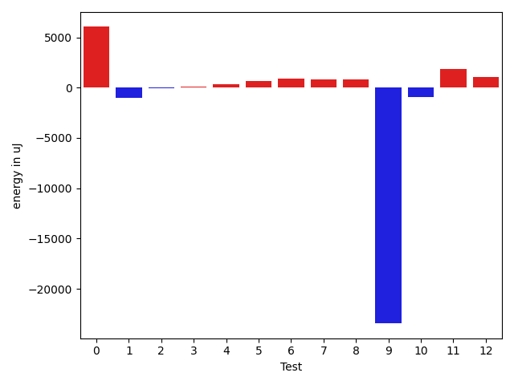

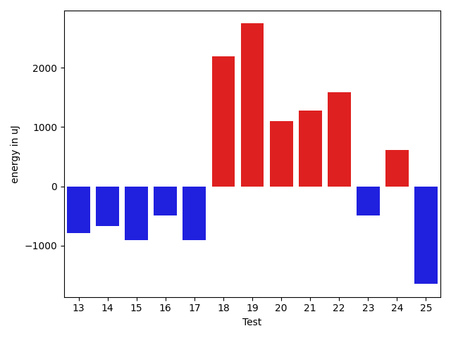

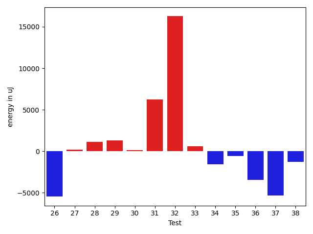

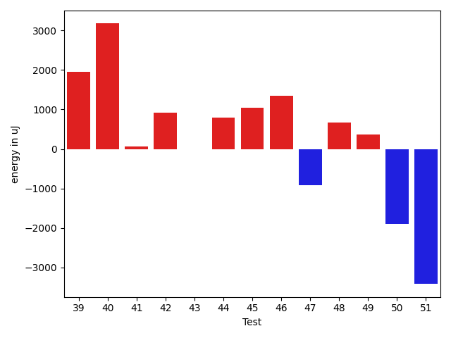

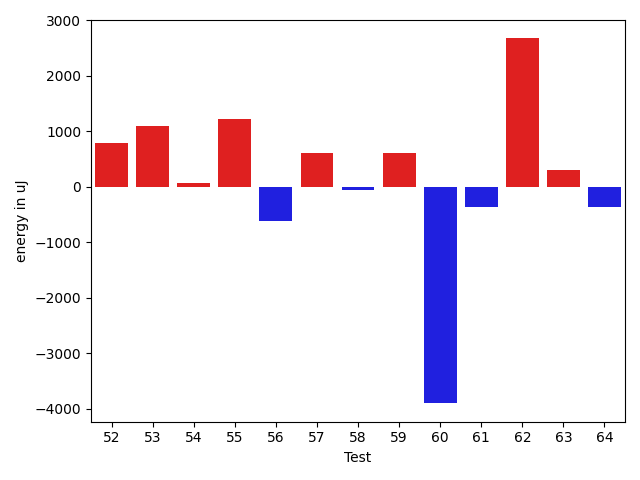

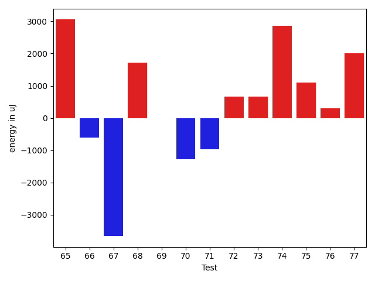

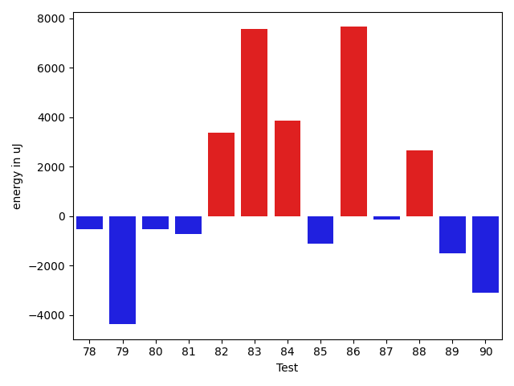

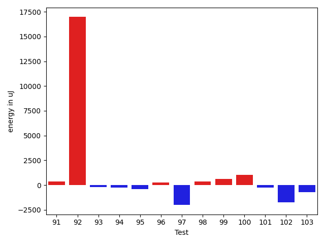

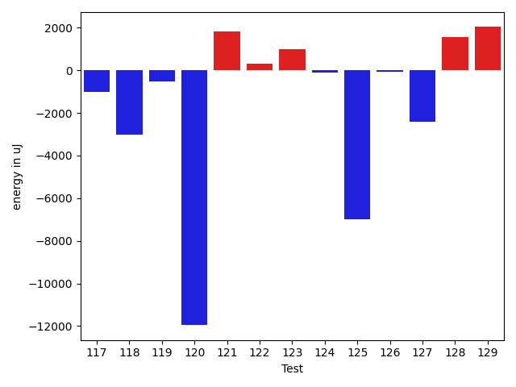

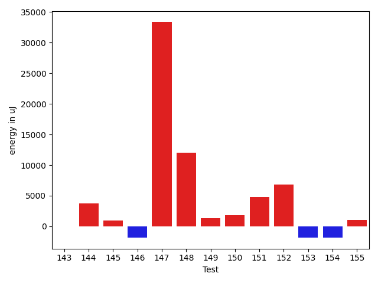

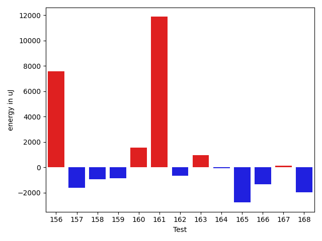

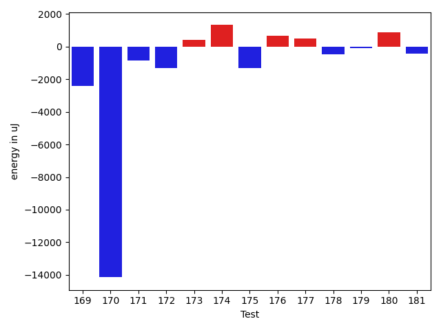

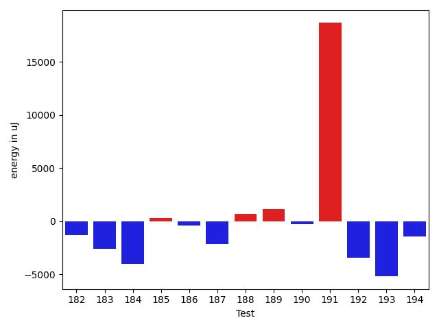

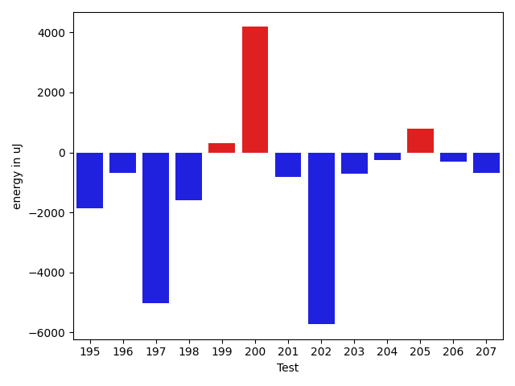

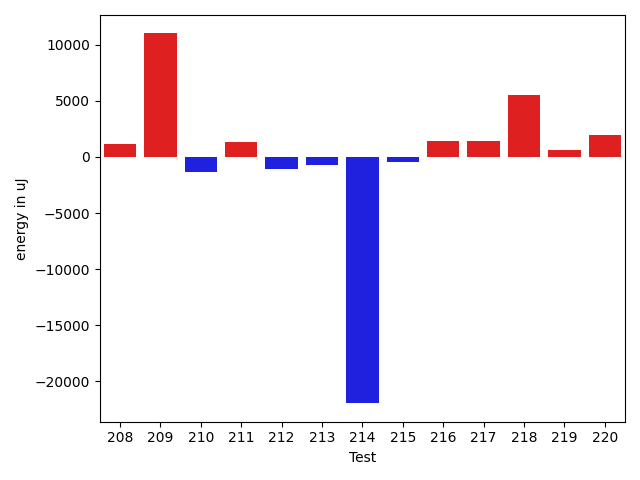

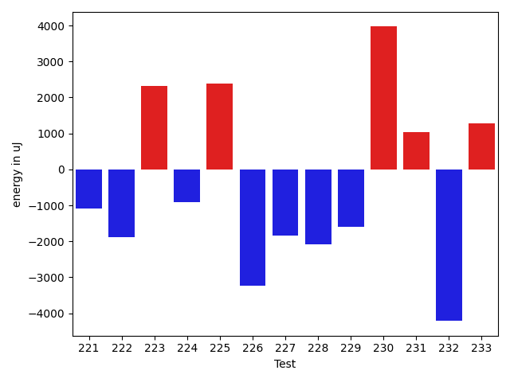

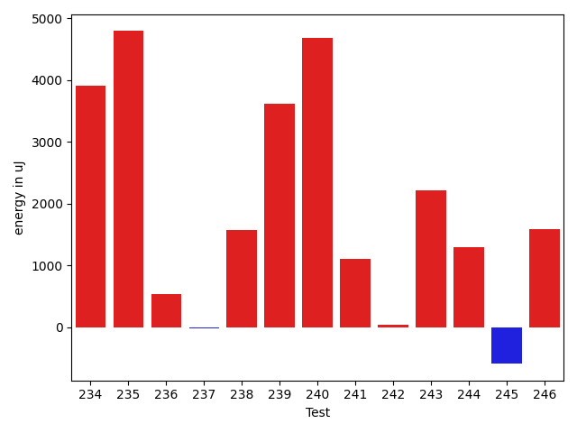

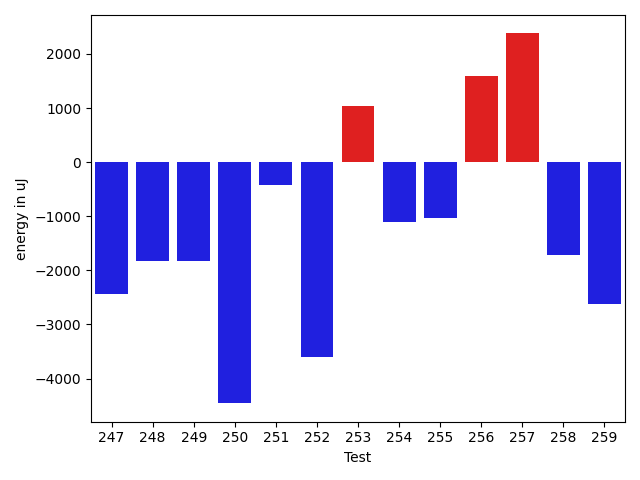

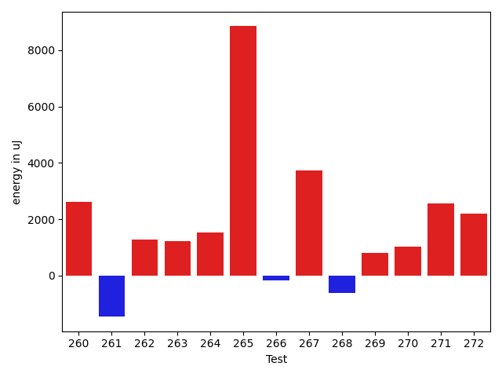

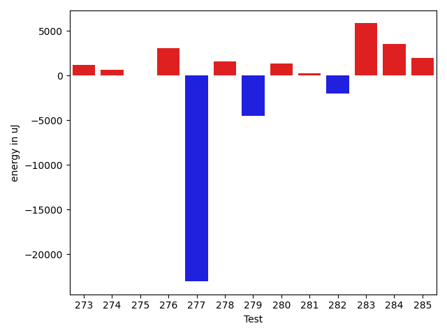

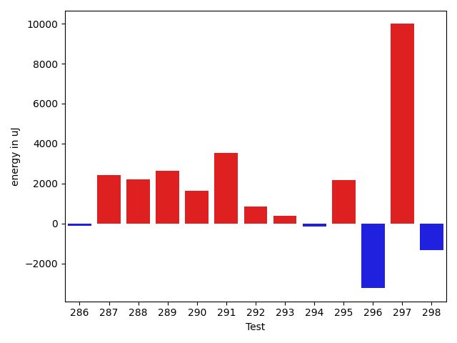

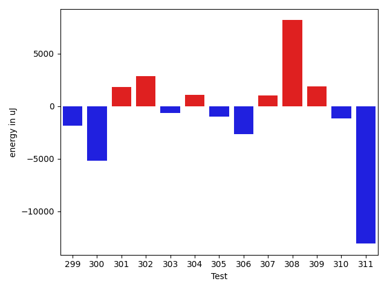

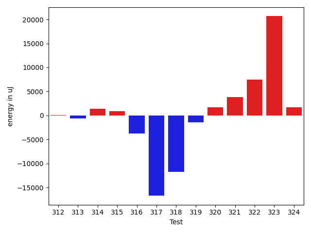

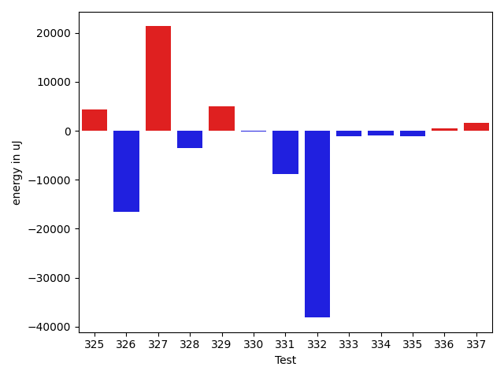

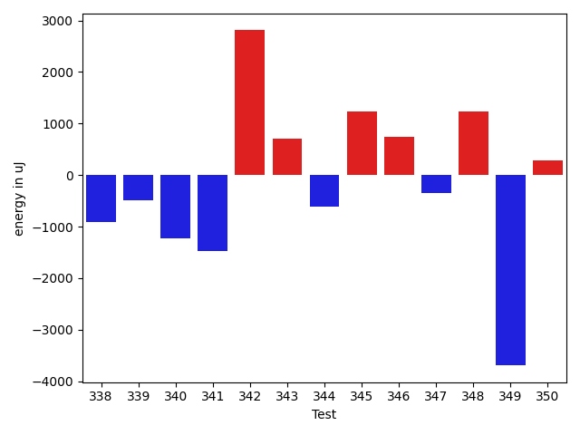

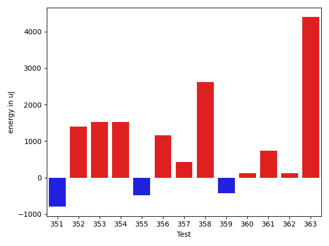

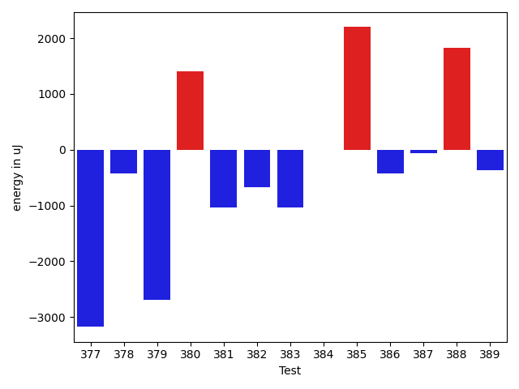

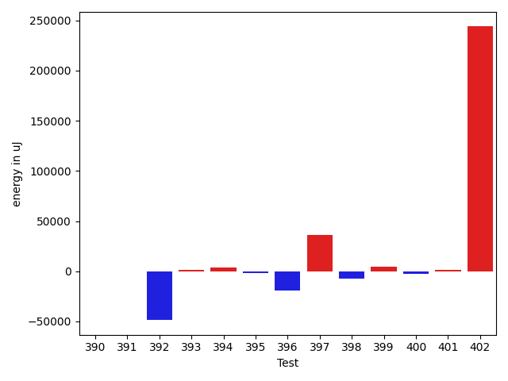

| ID | EnergyV1 | EnergyV2 | DeltaEnergy | σV1 | σV2 |
| --- | --- | --- | --- | --- | --- |
| 0 | 39856 | 45898 | 6042 | 76396.6818013646 | 90741.21502391697 |
| 1 | 38024 | 37048 | -976 | 12333.921395879384 | 9071.478575351184 |
| 2 | 37476 | 37415 | -61 | 4012.1840297274503 | 4127.8182687374 |
| 3 | 36987 | 37049 | 62 | 23455.104233429116 | 7700.838856373469 |
| 4 | 40588 | 40894 | 306 | 25247.206237449773 | 47282.61429551093 |
| 5 | 36621 | 37292 | 671 | 7445.2354157454565 | 4880.674064677935 |
| 6 | 36682 | 37598 | 916 | 5658.366247035995 | 10800.959672944622 |
| 7 | 37048 | 37841 | 793 | 9450.597760326516 | 27442.397360834355 |
| 8 | 37292 | 38086 | 794 | 4555.081321098559 | 4046.485521048273 |
| 9 | 68603 | 45166 | -23437 | 28905.87910027714 | 26320.293324219183 |
| 10 | 41809 | 40893 | -916 | 78467.79336346447 | 72357.97976164249 |
| 11 | 37048 | 38940 | 1892 | 42247.76124305287 | 34665.33776601042 |
| 12 | 37171 | 38207 | 1036 | 6711.112548482241 | 6478.788525089737 |
| 13 | 37170 | 36377 | -793 | 5119.769298229349 | 4311.420714200749 |
| 14 | 36743 | 36071 | -672 | 4761.175642632815 | 4296.094919780293 |
| 15 | 35400 | 34485 | -915 | 3903.2373163183406 | 4581.27403866926 |
| 16 | 36804 | 36316 | -488 | 4751.308484901421 | 4115.013115881595 |
| 17 | 36804 | 35889 | -915 | 4394.448348861246 | 4332.3203457989575 |
| 18 | 35095 | 37292 | 2197 | 4651.593842802701 | 3529.982460423626 |
| 19 | 35278 | 38025 | 2747 | 4303.362411624849 | 48474.369538120336 |
| 20 | 37109 | 38208 | 1099 | 49825.299076161 | 5667.802281375875 |
| 21 | 38513 | 39795 | 1282 | 16727.47498542657 | 16101.662337378013 |
| 22 | 34851 | 36438 | 1587 | 4489.6986254578405 | 6517.374875058271 |
| 23 | 35645 | 35156 | -489 | 4370.075547981118 | 4221.9453125570235 |
| 24 | 36133 | 36743 | 610 | 10897.537133572889 | 21883.453803252636 |
| 25 | 36133 | 34484 | -1649 | 4063.6670476278564 | 5485.539602844464 |
| 26 | 37354 | 35767 | -1587 | 28186.70924802955 | 4426.945976692686 |
| 27 | 36804 | 35950 | -854 | 3692.832373617655 | 4713.535651480508 |
| 28 | 36682 | 36072 | -610 | 4177.701816705306 | 6831.592333439015 |
| 29 | 37109 | 37598 | 489 | 4462.195804127717 | 4259.051025096435 |
| 30 | 36377 | 36011 | -366 | 4048.394582498163 | 4625.073197181593 |
| 31 | 37476 | 39001 | 1525 | 51239.3694717348 | 69835.2055311879 |
| 32 | 36316 | 38941 | 2625 | 4197.538311773803 | 39042.7110385318 |
| 33 | 37597 | 36377 | -1220 | 5422.5783337010425 | 4590.877013836554 |
| 34 | 36560 | 33875 | -2685 | 4144.152903376468 | 4148.794312117773 |
| 35 | 36011 | 33691 | -2320 | 4637.598155025939 | 4250.80088453929 |
| 36 | 37353 | 37537 | 184 | 37370.18612597435 | 31065.210923816547 |
| 37 | 39490 | 39185 | -305 | 59325.450525841814 | 50500.28126020685 |
| 38 | 37964 | 35949 | -2015 | 4762.70642766579 | 3684.673206812099 |
| 39 | 35889 | 37842 | 1953 | 3999.4859244310665 | 4867.326989443042 |
| 40 | 34118 | 37292 | 3174 | 4243.796112957179 | 4641.320528353281 |
| 41 | 36255 | 36316 | 61 | 10523.964576438664 | 13606.874000275559 |
| 42 | 35950 | 36865 | 915 | 4402.915884506974 | 4268.124708156469 |
| 43 | 36255 | 36255 | 0 | 4392.754848079442 | 4434.529266189943 |
| 44 | 37537 | 38330 | 793 | 18149.578919213945 | 26862.599577512785 |
| 45 | 38086 | 39124 | 1038 | 16192.50709946115 | 21584.726633776838 |
| 46 | 36987 | 38330 | 1343 | 4053.5964893244973 | 4200.450257842462 |
| 47 | 39856 | 38940 | -916 | 442388.0909790896 | 527786.3549737588 |
| 48 | 35096 | 35766 | 670 | 4791.943237733758 | 4886.110911219136 |
| 49 | 36865 | 37231 | 366 | 35599.432060288855 | 4876.89387424794 |
| 50 | 40710 | 38818 | -1892 | 56572.1926758191 | 81788.93888128387 |
| 51 | 41626 | 38208 | -3418 | 53622.774965866236 | 50612.86009043005 |
| 52 | 36133 | 36926 | 793 | 4317.880636690682 | 5255.396458641346 |
| 53 | 35705 | 36805 | 1100 | 3378.8915565354337 | 4965.349630925914 |
| 54 | 38085 | 38147 | 62 | 17918.133126294157 | 11927.990400384946 |
| 55 | 37719 | 38940 | 1221 | 401965.02136470407 | 4065.5026586635013 |
| 56 | 35828 | 35217 | -611 | 4454.240607998113 | 32422.484445708695 |
| 57 | 35217 | 35827 | 610 | 7099.034812846406 | 7446.430912428496 |
| 58 | 36682 | 36621 | -61 | 8358.892638403675 | 10530.9294382786 |
| 59 | 36926 | 37536 | 610 | 7547.212711863383 | 8477.0534065567 |
| 60 | 81543 | 77637 | -3906 | 85880.98696111949 | 75020.06209895856 |
| 61 | 37170 | 36804 | -366 | 8559.884522047216 | 21962.25174287199 |
| 62 | 71900 | 74584 | 2684 | 26715.49947375933 | 27229.986000559966 |
| 63 | 37292 | 37598 | 306 | 15227.338448648285 | 18456.18035676432 |
| 64 | 37292 | 36926 | -366 | 84627.77791184392 | 61458.17680167409 |
| 65 | 58227 | 61279 | 3052 | 22582.634477950032 | 21289.575372962823 |
| 66 | 38207 | 37598 | -609 | 16133.056002142752 | 11465.893218875084 |
| 67 | 73608 | 69947 | -3661 | 39326.12032254262 | 35308.25732456104 |
| 68 | 34851 | 36560 | 1709 | 7000.664694976397 | 16527.297574557713 |
| 69 | 38513 | 38514 | 1 | 15776.847691315552 | 17192.105869513136 |
| 70 | 36987 | 35706 | -1281 | 8384.050855272111 | 20754.57479553096 |
| 71 | 35645 | 34668 | -977 | 4045.374948881511 | 7990.921974837064 |
| 72 | 36926 | 37598 | 672 | 4103.999751655842 | 4154.777940541119 |
| 73 | 36988 | 37659 | 671 | 4142.105292421762 | 4222.397115707672 |
| 74 | 36499 | 39367 | 2868 | 13063.583005941555 | 20130.247503097842 |
| 75 | 37109 | 38208 | 1099 | 4491.596056190464 | 5764.27022498365 |
| 76 | 80200 | 80506 | 306 | 21233.400086042693 | 23930.66857591652 |
| 77 | 37354 | 39368 | 2014 | 55151.11139638556 | 63204.28445377899 |
| 78 | 37353 | 36804 | -549 | 5349.478850911596 | 4862.120012812378 |
| 79 | 38147 | 36804 | -1343 | 26279.609405768635 | 10486.234216349627 |
| 80 | 36682 | 35827 | -855 | 3639.9607442388715 | 4427.432868515639 |
| 81 | 37537 | 36377 | -1160 | 4644.720133514794 | 4228.342454109114 |
| 82 | 36926 | 35828 | -1098 | 7113.056232714194 | 29536.938270371815 |
| 83 | 38208 | 39856 | 1648 | 221209.17915524714 | 240374.04647846238 |
| 84 | 37170 | 37170 | 0 | 23010.894033587534 | 28019.036567778763 |
| 85 | 37109 | 35889 | -1220 | 4326.281559212655 | 4085.1297454349033 |
| 86 | 36377 | 38269 | 1892 | 4557.268351399407 | 40383.6135432256 |
| 87 | 36254 | 36255 | 1 | 3971.7615383418383 | 3355.8849179049957 |
| 88 | 36926 | 37720 | 794 | 4341.051482455989 | 21166.9296702718 |
| 89 | 37293 | 35828 | -1465 | 5407.0370897106095 | 4871.373494971274 |
| 90 | 37719 | 35095 | -2624 | 4639.822904490429 | 3658.700091292629 |
| 91 | 36560 | 36926 | 366 | 4375.816224734885 | 3966.0874233934883 |
| 92 | 45166 | 62133 | 16967 | 55040.055507888406 | 52722.665442496 |
| 93 | 39489 | 39306 | -183 | 112863.29050903607 | 59964.99479516963 |
| 94 | 37292 | 37049 | -243 | 7658.0895276840965 | 12350.48711174489 |
| 95 | 36926 | 36499 | -427 | 3207.0444379302735 | 3740.6132451778544 |
| 96 | 38575 | 38818 | 243 | 77328.2189423666 | 55403.58939482518 |
| 97 | 38818 | 36804 | -2014 | 13833.792467260713 | 14130.73027710478 |
| 98 | 38879 | 39245 | 366 | 16577.73973947787 | 18827.730351367773 |
| 99 | 36987 | 37597 | 610 | 3352.3757746001625 | 25922.64224021706 |
| 100 | 36376 | 37414 | 1038 | 4504.417408222733 | 3854.7733025802845 |
| 101 | 36132 | 35888 | -244 | 3821.1031593201806 | 3187.335516453272 |
| 102 | 37109 | 35339 | -1770 | 3551.713819055406 | 4639.791675673682 |
| 103 | 42480 | 41748 | -732 | 55080.276790495525 | 32465.97009590259 |
| 104 | 36987 | 37964 | 977 | 4413.193453357322 | 7219.658313271853 |
| 105 | 37963 | 36926 | -1037 | 14754.70530549081 | 6296.542448724836 |
| 106 | 39184 | 37415 | -1769 | 72428.17134058461 | 30703.0324932401 |
| 107 | 38147 | 37781 | -366 | 3790.7619892554153 | 3573.2514377482926 |
| 108 | 37781 | 40039 | 2258 | 9274.582000042385 | 2830.363013237631 |
| 109 | 36011 | 36194 | 183 | 4677.296589426368 | 4768.739437385264 |
| 110 | 37415 | 38452 | 1037 | 21240.40842547522 | 18154.540374375876 |
| 111 | 34851 | 35705 | 854 | 6000.616439059393 | 4224.1635724621865 |
| 112 | 39612 | 39612 | 0 | 16976.672178415927 | 19515.200477620954 |
| 113 | 33936 | 37353 | 3417 | 3188.6906740610243 | 4335.293766903401 |
| 114 | 38147 | 38818 | 671 | 17881.810676284993 | 19269.649167148167 |
| 115 | 34423 | 34729 | 306 | 4921.275102947293 | 3706.370411197456 |
| 116 | 36194 | 37170 | 976 | 4303.3906830653605 | 4788.818941159821 |
| 117 | 35705 | 35827 | 122 | 10533.802910878649 | 4265.313230342186 |
| 118 | 36560 | 38086 | 1526 | 21305.17739294601 | 5690.029365136759 |
| 119 | 38940 | 39490 | 550 | 18465.773577718388 | 17862.64374353311 |
| 120 | 37475 | 37964 | 489 | 102092.42159007165 | 61415.615926244696 |
| 121 | 35400 | 37232 | 1832 | 4139.334155213941 | 4129.201531069354 |
| 122 | 34546 | 35584 | 1038 | 4317.7936362087985 | 6272.998971496807 |
| 123 | 36560 | 36743 | 183 | 4425.192420058755 | 3444.6433345693927 |
| 124 | 37292 | 36987 | -305 | 4787.892027191425 | 4063.709834544927 |
| 125 | 39062 | 37842 | -1220 | 15244.173292842488 | 6699.898908204907 |
| 126 | 36499 | 38452 | 1953 | 6000.232316930975 | 4186.783427368447 |
| 127 | 38513 | 37659 | -854 | 8996.13572810015 | 3883.380724265907 |
| 128 | 33692 | 35705 | 2013 | 4346.813508972786 | 4665.076442901257 |
| 129 | 34790 | 37963 | 3173 | 5368.275048799752 | 4152.40160124569 |
| 130 | 38391 | 36438 | -1953 | 43769.396258303466 | 40404.77255156324 |
| 131 | 36438 | 35461 | -977 | 3982.5433456523733 | 3486.1332447283194 |
| 132 | 38574 | 36438 | -2136 | 6181.805473300032 | 3924.927004350604 |
| 133 | 34241 | 36499 | 2258 | 51435.73074343468 | 4433.424670784814 |
| 134 | 33508 | 42175 | 8667 | 4377.291615103625 | 26268.869493988783 |
| 135 | 35950 | 36560 | 610 | 4387.058221826501 | 4432.176343788651 |
| 136 | 35278 | 36133 | 855 | 4508.374421993905 | 3913.4589136086784 |
| 137 | 35889 | 38147 | 2258 | 77003.49030758282 | 3940.1792350146216 |
| 138 | 36072 | 34546 | -1526 | 9190.839030433148 | 5119.880397217045 |
| 139 | 38635 | 35156 | -3479 | 4321.640724951063 | 4520.959645794913 |
| 140 | 33325 | 34912 | 1587 | 4208.6718745191365 | 3786.4538238304185 |
| 141 | 37170 | 37537 | 367 | 4691.023265778316 | 83308.9812294569 |
| 142 | 36560 | 35584 | -976 | 6041.985362220266 | 8098.123686618235 |
| 143 | 34607 | 36499 | 1892 | 5020.211937333682 | 4251.121716249123 |
| 144 | 35278 | 36988 | 1710 | 4723.657510514919 | 11733.666940706664 |
| 145 | 36743 | 37170 | 427 | 10906.898784391948 | 10234.37519677028 |
| 146 | 37841 | 37659 | -182 | 20730.29193099117 | 8781.750025501056 |
| 147 | 36926 | 40955 | 4029 | 3724.1134657290104 | 82548.77479635214 |
| 148 | 37720 | 38696 | 976 | 3534.8715675969215 | 45439.875338358885 |
| 149 | 37231 | 38453 | 1222 | 4344.5767337630905 | 4614.2755214914605 |
| 150 | 36560 | 39612 | 3052 | 3606.324760381925 | 4136.040296386549 |
| 151 | 121094 | 125915 | 4821 | 33543.43672625427 | 35018.885842954354 |
| 152 | 40283 | 38818 | -1465 | 22715.579091482916 | 35141.52971286321 |
| 153 | 38208 | 36865 | -1343 | 4420.635583261755 | 4224.576940554292 |
| 154 | 38452 | 36743 | -1709 | 4310.94767269735 | 3715.276559501358 |
| 155 | 37048 | 39367 | 2319 | 3918.0177456917622 | 4439.302249214007 |
| 156 | 127747 | 130981 | 3234 | 112337.48621332558 | 112894.00396703184 |
| 157 | 37903 | 36011 | -1892 | 4135.340853036788 | 4634.5293956749265 |
| 158 | 37720 | 36804 | -916 | 3419.7464442638952 | 4377.064985682631 |
| 159 | 37292 | 35217 | -2075 | 4105.46877821387 | 4068.6927215066034 |
| 160 | 38330 | 38452 | 122 | 8944.048704272578 | 12291.126047249336 |
| 161 | 40466 | 40589 | 123 | 76595.89865384526 | 85375.71794003945 |
| 162 | 37231 | 35644 | -1587 | 3658.257838059289 | 3475.339475526974 |
| 163 | 37842 | 37476 | -366 | 3476.9596063467097 | 3652.886613566078 |
| 164 | 35339 | 35156 | -183 | 3855.958668087613 | 4423.577960454887 |
| 165 | 37170 | 33325 | -3845 | 4652.701497581808 | 3766.355136366261 |
| 166 | 36560 | 34362 | -2198 | 3106.590186603312 | 5005.758061757798 |
| 167 | 34179 | 34607 | 428 | 3564.890902608381 | 3504.9387454526222 |
| 168 | 37232 | 35827 | -1405 | 4447.893210273825 | 2865.29489689174 |
| 169 | 34729 | 32532 | -2197 | 5420.494383174351 | 3539.429389666099 |
| 170 | 36316 | 35218 | -1098 | 52326.13110292616 | 5860.881986042799 |
| 171 | 36133 | 33020 | -3113 | 4497.731221459979 | 3539.3792642762783 |
| 172 | 35827 | 33753 | -2074 | 3835.5778646190406 | 4655.069383584566 |
| 173 | 36193 | 34668 | -1525 | 3535.691449305405 | 4792.8788833987555 |
| 174 | 36255 | 37659 | 1404 | 3925.136872540078 | 4312.058829253003 |
| 175 | 34851 | 34607 | -244 | 5289.044013608081 | 3967.213491577571 |
| 176 | 33325 | 34485 | 1160 | 3556.915222608833 | 4122.219947402836 |
| 177 | 36621 | 38147 | 1526 | 50397.86044623282 | 47626.97834571253 |
| 178 | 36987 | 36255 | -732 | 4159.446148224862 | 4278.130438051329 |
| 179 | 35279 | 34424 | -855 | 4156.912217920893 | 4255.154040159068 |
| 180 | 35340 | 36072 | 732 | 4521.51333479563 | 2797.4281678296347 |
| 181 | 36133 | 35644 | -489 | 3425.060602870164 | 4330.528974426462 |
| 182 | 36072 | 34790 | -1282 | 4767.591124340351 | 4063.0088587338305 |
| 183 | 37964 | 35400 | -2564 | 4724.660884801206 | 3662.7438437384276 |
| 184 | 36438 | 32409 | -4029 | 4345.315094983488 | 4313.062984701244 |
| 185 | 35889 | 36194 | 305 | 3374.94209430126 | 4773.802361234384 |
| 186 | 35034 | 34667 | -367 | 4041.9794848014203 | 4573.053121015886 |
| 187 | 37536 | 35400 | -2136 | 4435.8636644964645 | 3798.3061006684284 |
| 188 | 35217 | 35889 | 672 | 4722.5772982504095 | 3858.1668579555408 |
| 189 | 33386 | 34546 | 1160 | 4427.552431693565 | 4428.418447306492 |
| 190 | 37048 | 36804 | -244 | 8780.848974961842 | 3451.9666312500603 |
| 191 | 41077 | 59753 | 18676 | 28923.415300852703 | 30610.406734534372 |
| 192 | 38025 | 34607 | -3418 | 3880.716532491848 | 6512.5489326376655 |
| 193 | 36743 | 31555 | -5188 | 2659.128642206403 | 4306.166427466321 |
| 194 | 34790 | 33386 | -1404 | 3436.1464324960825 | 5358.768336907527 |
| 195 | 35278 | 33203 | -2075 | 4083.566276821044 | 3847.983280968388 |
| 196 | 35095 | 34118 | -977 | 4290.772481077854 | 3730.7813323752976 |
| 197 | 36194 | 35828 | -366 | 30869.13223694964 | 4562.585351669581 |
| 198 | 37354 | 35828 | -1526 | 4392.13842627433 | 2915.663620176505 |
| 199 | 33691 | 33630 | -61 | 4114.09693964652 | 4087.532866014403 |
| 200 | 34301 | 34546 | 245 | 5438.385936804517 | 31827.754210925897 |
| 201 | 34729 | 35584 | 855 | 4613.818102599079 | 3551.34216436087 |
| 202 | 34179 | 34423 | 244 | 32802.30562291146 | 3808.1064794965587 |
| 203 | 35095 | 35095 | 0 | 5348.854530562188 | 3932.840812242767 |
| 204 | 36133 | 35340 | -793 | 4595.593553543981 | 4302.016977696496 |
| 205 | 33081 | 34851 | 1770 | 4479.414980105754 | 4789.381116134519 |
| 206 | 37720 | 35950 | -1770 | 4498.343132683179 | 4043.2966645003635 |
| 207 | 35278 | 35522 | 244 | 5090.656654062437 | 5278.607764126826 |
| 208 | 34363 | 34912 | 549 | 4870.807502149073 | 4709.164758810587 |
| 209 | 35828 | 34790 | -1038 | 4667.419756377416 | 37919.506342900306 |
| 210 | 36560 | 34851 | -1709 | 3788.7088385389475 | 4757.414670387769 |
| 211 | 35217 | 34485 | -732 | 3804.1669623379767 | 5193.7768753966475 |
| 212 | 35767 | 33814 | -1953 | 4514.50997694784 | 4516.3931169330845 |
| 213 | 35949 | 34790 | -1159 | 3353.5989136253884 | 3402.074457585908 |
| 214 | 38941 | 38513 | -428 | 80823.85588762996 | 56979.08719054542 |
| 215 | 37781 | 34668 | -3113 | 4131.553592778388 | 4654.441193476335 |
| 216 | 34851 | 37048 | 2197 | 3839.8676539693397 | 4295.930831536114 |
| 217 | 33813 | 36682 | 2869 | 3868.2086984995253 | 4375.151547287064 |
| 218 | 35401 | 34484 | -917 | 4002.308997047984 | 31989.185887734 |
| 219 | 34241 | 33752 | -489 | 4619.020312100675 | 4102.999883003966 |
| 220 | 32776 | 35400 | 2624 | 3714.6444296533045 | 4100.465115861858 |
| 221 | 34729 | 33631 | -1098 | 4400.80954518021 | 4549.962582036678 |
| 222 | 35095 | 33203 | -1892 | 3877.322863781142 | 4139.865825438257 |
| 223 | 34607 | 36927 | 2320 | 3350.5875153806755 | 5416.456594490534 |
| 224 | 34301 | 33386 | -915 | 3739.585951658786 | 2975.531621366519 |
| 225 | 33691 | 36072 | 2381 | 3287.7324917790984 | 20926.317928529577 |
| 226 | 36438 | 33203 | -3235 | 3532.3957383543184 | 4434.768363454849 |
| 227 | 35828 | 33996 | -1832 | 2826.82497258064 | 3248.6124214702118 |
| 228 | 36194 | 34119 | -2075 | 4873.601861810012 | 3643.181560710023 |
| 229 | 40649 | 39063 | -1586 | 372713.6616324975 | 444974.17540902836 |
| 230 | 36621 | 40589 | 3968 | 52559.146784594355 | 60752.16080788778 |
| 231 | 34546 | 35584 | 1038 | 4063.6661297591763 | 3847.2288948735777 |
| 232 | 39551 | 35339 | -4212 | 53592.46864380673 | 3556.1395753135916 |
| 233 | 35950 | 37232 | 1282 | 7690.993576554906 | 9321.11649071567 |
| 234 | 34118 | 35706 | 1588 | 4374.846841890064 | 23893.470595584073 |
| 235 | 38147 | 40222 | 2075 | 11660.504579747962 | 15592.421632891517 |
| 236 | 34240 | 35950 | 1710 | 4953.579310877064 | 4184.371585133081 |
| 237 | 35644 | 36132 | 488 | 5084.059249814197 | 4577.030057337107 |
| 238 | 34973 | 35889 | 916 | 4431.661880402288 | 4181.326009772498 |
| 239 | 36255 | 40405 | 4150 | 24329.42988646024 | 22673.972447572774 |
| 240 | 35888 | 36376 | 488 | 4189.3395959267855 | 25891.831741535258 |
| 241 | 35339 | 36377 | 1038 | 4409.30970940141 | 3750.4783976969156 |
| 242 | 34607 | 34973 | 366 | 4250.70185494111 | 4068.148542969552 |
| 243 | 34423 | 37537 | 3114 | 4107.58210460774 | 4249.09319002302 |
| 244 | 34302 | 36438 | 2136 | 4243.123910420679 | 4848.268225871997 |
| 245 | 36011 | 34301 | -1710 | 4803.919522871112 | 4493.438014204714 |
| 246 | 33813 | 36133 | 2320 | 4606.7811369892315 | 3812.0755179327803 |
| 247 | 37781 | 35339 | -2442 | 4144.014535715605 | 4617.36717477251 |
| 248 | 79284 | 77454 | -1830 | 37195.08776465003 | 29026.03452043759 |
| 249 | 37659 | 35827 | -1832 | 4581.067491301737 | 3772.7024752744746 |
| 250 | 86304 | 81848 | -4456 | 298979.56358633563 | 213618.2733076011 |
| 251 | 35950 | 35522 | -428 | 29170.784730278912 | 4560.438280047484 |
| 252 | 38635 | 35034 | -3601 | 4271.769976167951 | 4961.020088007049 |
| 253 | 35767 | 36805 | 1038 | 6329.157209929006 | 4359.165246380399 |
| 254 | 37537 | 36438 | -1099 | 91097.47539913312 | 71124.02101974079 |
| 255 | 37110 | 36072 | -1038 | 5560.93546747061 | 4436.588576865231 |
| 256 | 35157 | 36743 | 1586 | 3891.684664717838 | 3743.6369470026266 |
| 257 | 35340 | 37719 | 2379 | 3769.992947318332 | 3446.7015979445387 |
| 258 | 37963 | 36255 | -1708 | 4144.1395229448135 | 4314.146906353561 |
| 259 | 37292 | 34668 | -2624 | 3401.6874710639795 | 4460.920243999454 |
| 260 | 37231 | 39855 | 2624 | 3742.5933712944484 | 4606.333028227784 |
| 261 | 38818 | 37353 | -1465 | 4372.045798448782 | 4450.181493244286 |
| 262 | 36988 | 38269 | 1281 | 4038.302938790736 | 5432.758017604274 |
| 263 | 38208 | 39429 | 1221 | 45136.90980592264 | 60886.07423706069 |
| 264 | 39306 | 40832 | 1526 | 375338.463496865 | 301763.1982740379 |
| 265 | 149780 | 158630 | 8850 | 348213.2922163981 | 291651.2849257313 |
| 266 | 35583 | 35400 | -183 | 19528.077747108906 | 26821.013732968808 |
| 267 | 37476 | 41198 | 3722 | 30542.872588829956 | 34372.22308374016 |
| 268 | 36743 | 36133 | -610 | 5663.7003348566695 | 4611.803839763935 |
| 269 | 37597 | 38391 | 794 | 68848.35772072471 | 66360.78614588977 |
| 270 | 35949 | 36987 | 1038 | 4521.455039705577 | 4300.096376592041 |
| 271 | 34362 | 36927 | 2565 | 4326.711392686136 | 3904.8127971004465 |
| 272 | 35461 | 37658 | 2197 | 4905.3598313386565 | 4342.089256977056 |
| 273 | 33935 | 35461 | 1526 | 3998.4021024984327 | 4068.142391622805 |
| 274 | 35889 | 35156 | -733 | 3965.687886069984 | 4170.6558960871525 |
| 275 | 36255 | 37842 | 1587 | 27004.09628568946 | 22825.07390540914 |
| 276 | 37231 | 37842 | 611 | 52257.489254726905 | 65105.11151797135 |
| 277 | 37658 | 39977 | 2319 | 73675.21194159576 | 7028.122676217451 |
| 278 | 34973 | 35522 | 549 | 4155.708421759929 | 4993.657363318215 |
| 279 | 33386 | 34729 | 1343 | 32110.141215230444 | 4442.958208040651 |
| 280 | 35949 | 36621 | 672 | 4432.311726020978 | 4490.206126671692 |
| 281 | 34668 | 35095 | 427 | 4084.2650399352265 | 4959.711576564817 |
| 282 | 35523 | 38391 | 2868 | 26697.47674445057 | 21145.94133851272 |
| 283 | 42358 | 44250 | 1892 | 17538.96767800203 | 21216.370605338838 |
| 284 | 34119 | 36926 | 2807 | 3775.0138168897256 | 4197.960750533258 |
| 285 | 33264 | 37170 | 3906 | 9573.524117572599 | 7085.261328102161 |
| 286 | 35584 | 35949 | 365 | 5298.608525945702 | 3840.7820419645727 |
| 287 | 34546 | 37781 | 3235 | 23227.98203833758 | 23162.490497833394 |
| 288 | 35706 | 38269 | 2563 | 4367.049761495416 | 5343.682378227116 |
| 289 | 35034 | 38757 | 3723 | 3229.4400545208987 | 4796.019214145984 |
| 290 | 34668 | 36621 | 1953 | 4746.713786469662 | 4388.767211034673 |
| 291 | 36682 | 39124 | 2442 | 4210.977498158831 | 4250.105979882936 |
| 292 | 35156 | 37292 | 2136 | 4151.49525352011 | 4332.342912032474 |
| 293 | 37109 | 36804 | -305 | 4920.46479536935 | 4293.522483115628 |
| 294 | 35522 | 35828 | 306 | 2579.913079333019 | 5959.652772178138 |
| 295 | 36987 | 37780 | 793 | 5039.785122045273 | 4066.2953561527456 |
| 296 | 38879 | 36560 | -2319 | 14903.074498725913 | 8955.471075065037 |
| 297 | 39245 | 39063 | -182 | 68853.41053906459 | 90989.32755442476 |
| 298 | 37780 | 35949 | -1831 | 7126.402720615 | 6698.630796154106 |
| 299 | 36377 | 35889 | -488 | 6668.965404060335 | 3717.4957407133934 |
| 300 | 37842 | 38025 | 183 | 36742.578970461465 | 21629.40449049754 |
| 301 | 36377 | 37780 | 1403 | 3448.8815128966085 | 7983.802443837287 |
| 302 | 39612 | 38452 | -1160 | 30677.34317802774 | 33551.77361895391 |
| 303 | 37781 | 35095 | -2686 | 4566.470613864054 | 4906.94518823396 |
| 304 | 38208 | 38208 | 0 | 5695.768559140192 | 3992.9387169894226 |
| 305 | 39185 | 37659 | -1526 | 4405.340054978729 | 4405.91124804164 |
| 306 | 41626 | 36133 | -5493 | 4198.459542016757 | 4341.6904245991045 |
| 307 | 36621 | 35950 | -671 | 4414.264745809176 | 3261.8680246141166 |
| 308 | 38208 | 34973 | -3235 | 3952.0936418367105 | 38448.96833096508 |
| 309 | 34607 | 36438 | 1831 | 3769.71632326555 | 4320.143291442281 |
| 310 | 37293 | 35705 | -1588 | 10362.157824391597 | 6091.797855128687 |
| 311 | 40405 | 40833 | 428 | 88008.84052723885 | 61584.000989707354 |
| 312 | 37597 | 38208 | 611 | 3557.552406852217 | 4271.095801657787 |
| 313 | 36560 | 36194 | -366 | 4819.691743075473 | 3727.6125100589425 |
| 314 | 34119 | 35706 | 1587 | 4032.028785549528 | 3240.1867253959454 |
| 315 | 34729 | 35217 | 488 | 4525.694561059108 | 3143.7848297164924 |
| 316 | 37842 | 38452 | 610 | 40462.27239320874 | 21028.20728781626 |
| 317 | 37048 | 35583 | -1465 | 63964.9920740036 | 4021.653848676118 |
| 318 | 39490 | 41077 | 1587 | 74285.70801008765 | 52305.7193222929 |
| 319 | 38085 | 34424 | -3661 | 4082.9923276317822 | 4796.726430019169 |
| 320 | 33874 | 34484 | 610 | 4885.544883178903 | 5095.152205773641 |
| 321 | 33325 | 36376 | 3051 | 3082.028360727157 | 4684.025625564172 |
| 322 | 36499 | 38086 | 1587 | 4821.494182881025 | 33232.71352160402 |
| 323 | 37597 | 40100 | 2503 | 104087.2354746362 | 123461.84900185399 |
| 324 | 35522 | 36804 | 1282 | 4239.585907358638 | 4628.817172029023 |
| 325 | 34790 | 37414 | 2624 | 4354.689091466041 | 11020.643478336135 |
| 326 | 278259 | 271789 | -6470 | 124044.79220337172 | 120756.40438001508 |
| 327 | 365294 | 407775 | 42481 | 106282.8408876075 | 95642.87215807592 |
| 328 | 40039 | 39551 | -488 | 68616.8837686813 | 60547.79239089912 |
| 329 | 45837 | 43335 | -2502 | 56919.663783406504 | 76106.22162058616 |
| 330 | 38880 | 38757 | -123 | 15255.155431136693 | 17335.72023343737 |
| 331 | 39428 | 40039 | 611 | 65235.47477861657 | 59469.00352482202 |
| 332 | 38391 | 38330 | -61 | 166758.04177960765 | 113038.87026281658 |
| 333 | 113830 | 115051 | 1221 | 21223.860361782998 | 22286.869334237028 |
| 334 | 34241 | 32227 | -2014 | 4114.489029434072 | 4239.1008480572855 |
| 335 | 36072 | 36499 | 427 | 9390.023338092964 | 5522.226842735779 |
| 336 | 34545 | 38147 | 3602 | 6284.656876165333 | 6317.34952431767 |
| 337 | 35706 | 36193 | 487 | 3843.6533935519365 | 4667.7176628338175 |
| 338 | 36621 | 34912 | -1709 | 4343.190641468243 | 4753.919604849771 |
| 339 | 36499 | 35828 | -671 | 3860.9398003218434 | 5147.973765317289 |
| 340 | 36865 | 35950 | -915 | 4198.411536771826 | 4374.620634281052 |
| 341 | 34485 | 32837 | -1648 | 3571.4756838810526 | 4362.22650830277 |
| 342 | 34607 | 36682 | 2075 | 9245.481369873814 | 11431.010673273497 |
| 343 | 36011 | 36682 | 671 | 5294.423149350173 | 3511.12567375672 |
| 344 | 36377 | 35766 | -611 | 3806.2484393558398 | 4634.7843529996335 |
| 345 | 35888 | 37598 | 1710 | 4172.543894761437 | 4413.632474149146 |
| 346 | 34546 | 35156 | 610 | 4312.4658532221565 | 4100.211779896254 |
| 347 | 34057 | 33631 | -426 | 4785.631763119263 | 4364.4113497619355 |
| 348 | 33935 | 35462 | 1527 | 4449.948673772658 | 4441.110479289634 |
| 349 | 38208 | 37049 | -1159 | 32478.99000490195 | 20745.089894938774 |
| 350 | 37048 | 36621 | -427 | 4401.750298890996 | 4798.260865313309 |
| 351 | 35279 | 34485 | -794 | 4894.223985473907 | 4521.033927670521 |
| 352 | 35095 | 36499 | 1404 | 4443.192163656058 | 4768.513920071657 |
| 353 | 35156 | 36682 | 1526 | 5225.436034057994 | 39913.209724850996 |
| 354 | 35584 | 37110 | 1526 | 21119.7372170655 | 18750.89207431148 |
| 355 | 37658 | 37170 | -488 | 55191.731601563864 | 27491.23517797667 |
| 356 | 35584 | 36743 | 1159 | 4270.0843773681745 | 5239.6914303911335 |
| 357 | 36927 | 37353 | 426 | 4581.097741172708 | 4402.83997933794 |
| 358 | 34729 | 37353 | 2624 | 3819.105848785153 | 4294.102860639383 |
| 359 | 36132 | 35706 | -426 | 4295.56717529106 | 4041.390262492882 |
| 360 | 36621 | 36743 | 122 | 5616.912903186542 | 4271.88813631963 |
| 361 | 34973 | 35706 | 733 | 4654.183518322222 | 4461.739014603922 |
| 362 | 35400 | 35522 | 122 | 4337.923609485942 | 4918.575606367717 |
| 363 | 33814 | 38208 | 4394 | 4544.592256392151 | 3873.273996966463 |
| 364 | 38147 | 36011 | -2136 | 1831.0 | 0.0 |
| 365 | 34424 | 34423 | -1 | 641.0 | 0.0 |
| 366 | 33020 | 32470 | -550 | 335.5 | 0.0 |
| 367 | 62988 | 65674 | 2686 | 122.0 | 0.0 |
| 368 | 34057 | 36132 | 2075 | 0.0 | 0.0 |
| 369 | 64209 | 71777 | 7568 | 28033.732970494562 | 27806.590079427613 |
| 370 | 38574 | 38513 | -61 | 23003.70678073382 | 53804.34562543007 |
| 371 | 39246 | 39490 | 244 | 10501.131730856863 | 10861.404739588696 |
| 372 | 38025 | 39062 | 1037 | 4323.514706611109 | 4087.4826867943734 |
| 373 | 38025 | 38452 | 427 | 99448.64778668838 | 63853.70941729036 |
| 374 | 85937 | 38208 | -47729 | 109266.58020586298 | 41641.92510507634 |
| 375 | 38147 | 79529 | 41382 | 17637.351978996874 | 93973.37761894177 |
| 376 | 68298 | 69336 | 1038 | 138515.3899994632 | 104427.98122888745 |
| 377 | 38757 | 35584 | -3173 | 14485.075407385904 | 10468.329334605449 |
| 378 | 37476 | 37049 | -427 | 13959.251956713697 | 13938.671322080565 |
| 379 | 38208 | 35523 | -2685 | 3837.9950220839028 | 4268.329378105677 |
| 380 | 35583 | 36988 | 1405 | 2887.344616821499 | 4788.282132224225 |
| 381 | 38575 | 37536 | -1039 | 4753.5094356308355 | 32233.49762002901 |
| 382 | 35278 | 34607 | -671 | 3549.359237556818 | 4126.6086590190935 |
| 383 | 37720 | 36682 | -1038 | 4204.542516408987 | 2926.839566836556 |
| 384 | 36315 | 36316 | 1 | 4646.171468215585 | 4235.390571716226 |
| 385 | 38147 | 40344 | 2197 | 36043.29427927032 | 617741.5709355208 |
| 386 | 37170 | 36743 | -427 | 3988.8259098247054 | 4941.741570539682 |
| 387 | 36621 | 36560 | -61 | 4039.881140966414 | 3424.2247571530697 |
| 388 | 36743 | 38574 | 1831 | 3911.8965128372756 | 10497.10223870008 |
| 389 | 38757 | 38391 | -366 | 502448.73882694286 | 459384.2784734913 |
| 390 | 36987 | 36438 | -549 | 3830.9991435002958 | 4861.1530504839 |
| 391 | 36194 | 36743 | 549 | 3960.69579587981 | 5168.9578046936695 |
| 392 | 39306 | 40832 | 1526 | 638400.1224873154 | 491173.1892079782 |
| 393 | 37170 | 37841 | 671 | 5059.639644010842 | 5475.662165237162 |
| 394 | 37414 | 36987 | -427 | 8028.442439021805 | 32021.32878284193 |
| 395 | 41809 | 39245 | -2564 | 33867.1862240057 | 37043.26230777122 |
| 396 | 39245 | 38452 | -793 | 77932.09150285897 | 33598.79961789375 |
| 397 | 37781 | 37903 | 122 | 4082.7304622887896 | 100081.59970296505 |
| 398 | 37232 | 37964 | 732 | 33650.91318522346 | 3496.2019012601377 |
| 399 | 36377 | 38697 | 2320 | 80327.40548357698 | 85627.8828802337 |
| 400 | 40161 | 36682 | -3479 | 5122.692686823636 | 4236.820720442925 |
| 401 | 39551 | 39489 | -62 | 5122.737367707245 | 4671.152988525909 |
| 402 | 38940 | 39856 | 916 | 44312.66001773647 | 657596.3937708101 |

## Delta Duration per test method

| ID | DurationV1 | DurationsV2 | DeltaDuration |
| --- | --- | --- | --- |
| 0 | 1967965.2323232323 | 2462519.9595959596 | 494554.7272727273 |
| 1 | 952189.0655737704 | 1014302.5333333333 | 62113.46775956289 |
| 2 | 735452.0 | 767875.4166666666 | 32423.416666666628 |
| 3 | 952834.223880597 | 900957.7096774194 | -51876.51420317765 |
| 4 | 1284838.8813559322 | 1818662.2291666667 | 533823.3478107345 |
| 5 | 840596.1509433963 | 857016.1636363637 | 16420.01269296743 |
| 6 | 1018093.4285714285 | 1073641.738095238 | 55548.309523809585 |
| 7 | 870819.2857142857 | 1021067.7586206896 | 150248.47290640394 |
| 8 | 670393.4444444445 | 776705.4897959183 | 106312.04535147385 |
| 9 | 1715804.1587301588 | 1488780.7049180327 | -227023.45381212607 |
| 10 | 1638771.423076923 | 1519343.0322580645 | -119428.39081885852 |
| 11 | 1110024.725 | 981421.3939393939 | -128603.33106060617 |
| 12 | 760381.717948718 | 755591.9761904762 | -4789.741758241784 |
| 13 | 663009.4285714285 | 585906.1515151515 | -77103.27705627703 |
| 14 | 693979.225 | 691101.3720930233 | -2877.85290697671 |
| 15 | 648581.975 | 647590.9189189189 | -991.0560810810421 |
| 16 | 740917.0425531915 | 722558.0952380953 | -18358.947315096273 |
| 17 | 796047.1111111111 | 779677.9019607843 | -16369.209150326787 |
| 18 | 724042.32 | 690142.75 | -33899.56999999995 |
| 19 | 905241.9516129033 | 1356090.8026315789 | 450848.8510186756 |
| 20 | 1314770.6833333333 | 713939.659574468 | -600831.0237588653 |
| 21 | 1420309.7021276595 | 1419298.1195652173 | -1011.5825624421705 |
| 22 | 765464.1454545455 | 886704.4857142858 | 121240.34025974025 |
| 23 | 704206.9024390244 | 708467.3333333334 | 4260.430894308956 |
| 24 | 721851.76 | 855093.1355932204 | 133241.37559322035 |
| 25 | 872321.4150943396 | 872388.6964285715 | 67.28133423184045 |
| 26 | 825209.8181818182 | 713860.4375 | -111349.38068181823 |
| 27 | 706342.1176470588 | 749292.7777777778 | 42950.660130718956 |
| 28 | 954155.3548387097 | 943488.234375 | -10667.120463709696 |
| 29 | 687102.05 | 698966.925 | 11864.875 |
| 30 | 844295.3275862068 | 813817.5762711865 | -30477.751315020374 |
| 31 | 1187389.673076923 | 1280553.298245614 | 93163.62516869092 |
| 32 | 655130.0263157894 | 1260344.4838709678 | 605214.4575551783 |
| 33 | 352355.9090909091 | 370543.3888888889 | 18187.47979797976 |
| 34 | 598041.3448275862 | 638847.7575757576 | 40806.412748171366 |
| 35 | 454359.75 | 409104.45 | -45255.29999999999 |
| 36 | 1147417.5 | 1100981.9375 | -46435.5625 |
| 37 | 1258468.3255813953 | 1066470.675 | -191997.65058139525 |
| 38 | 540333.7096774194 | 519890.03225806454 | -20443.677419354848 |
| 39 | 448472.4583333333 | 481893.3157894737 | 33420.857456140395 |
| 40 | 650994.7209302326 | 715994.4444444445 | 64999.723514211946 |
| 41 | 717147.027027027 | 826060.6 | 108913.572972973 |
| 42 | 707530.9019607843 | 701036.8793103448 | -6494.022650439525 |
| 43 | 561311.8846153846 | 877741.6774193548 | 316429.79280397017 |
| 44 | 1296503.4588235293 | 1403615.534883721 | 107112.07606019173 |
| 45 | 968630.6428571428 | 1089051.1904761905 | 120420.54761904769 |
| 46 | 462028.0833333333 | 521741.1034482759 | 59713.02011494257 |
| 47 | 5392460.833333333 | 7758730.884615385 | 2366270.051282052 |
| 48 | 673464.2127659575 | 695950.693877551 | 22486.481111593544 |
| 49 | 828275.5641025641 | 749626.7708333334 | -78648.79326923075 |
| 50 | 1303149.4 | 1988627.875 | 685478.4750000001 |
| 51 | 1668705.5416666667 | 1244217.142857143 | -424488.3988095238 |
| 52 | 533530.0833333334 | 534528.46875 | 998.3854166666279 |
| 53 | 537172.9090909091 | 541140.9677419355 | 3968.0586510264548 |
| 54 | 891173.6 | 821033.3064516129 | -70140.29354838713 |
| 55 | 3562794.6666666665 | 765296.38 | -2797498.2866666666 |
| 56 | 891389.0454545454 | 1048445.6166666667 | 157056.5712121213 |
| 57 | 754494.1617647059 | 823654.6037735849 | 69160.44200887904 |
| 58 | 1162492.25 | 1200051.108695652 | 37558.8586956521 |
| 59 | 1131253.5476190476 | 1135703.1463414633 | 4449.598722415743 |
| 60 | 2925731.898989899 | 2827394.03125 | -98337.86773989908 |
| 61 | 1114712.7586206896 | 1198147.1333333333 | 83434.37471264368 |
| 62 | 2267995.1717171716 | 2286249.0714285714 | 18253.899711399805 |
| 63 | 1251773.2087912087 | 1346344.847826087 | 94571.63903487823 |
| 64 | 1662215.3837209302 | 1565369.4102564103 | -96845.97346451995 |
| 65 | 1811719.8484848484 | 1837270.2121212122 | 25550.363636363763 |
| 66 | 1269464.6202531646 | 1192896.735632184 | -76567.88462098059 |
| 67 | 2419653.404040404 | 2246072.101010101 | -173581.3030303032 |
| 68 | 1244062.3103448276 | 1219120.287356322 | -24942.02298850566 |
| 69 | 1460174.7448979593 | 1488498.3737373736 | 28323.628839414334 |
| 70 | 964479.3703703703 | 1048818.6266666667 | 84339.25629629637 |
| 71 | 787817.8867924528 | 827205.6909090909 | 39387.804116638144 |
| 72 | 482925.51851851854 | 456113.07692307694 | -26812.441595441604 |
| 73 | 690219.9574468085 | 689901.7804878049 | -318.17695900355466 |
| 74 | 950583.328125 | 1057529.208955224 | 106945.8808302239 |
| 75 | 834185.448275862 | 824189.1739130435 | -9996.27436281857 |
| 76 | 2638836.5353535353 | 2587025.121212121 | -51811.41414141422 |
| 77 | 1246212.0545454544 | 1377599.171875 | 131387.11732954555 |
| 78 | 850604.2295081967 | 926148.0322580645 | 75543.80274986778 |
| 79 | 1060388.2153846154 | 1049637.8051948051 | -10750.410189810209 |
| 80 | 787096.58 | 802122.2777777778 | 15025.697777777794 |
| 81 | 778994.1636363637 | 787863.5762711865 | 8869.412634822773 |
| 82 | 857301.195652174 | 971417.6785714285 | 114116.48291925457 |
| 83 | 2159104.3384615383 | 2408391.868852459 | 249287.53039092058 |
| 84 | 1083274.3582089553 | 1276061.09375 | 192786.73554104473 |
| 85 | 704485.9056603773 | 772697.5 | 68211.59433962265 |
| 86 | 601066.5333333333 | 848630.9375 | 247564.40416666667 |
| 87 | 421727.84210526315 | 472243.2 | 50515.357894736866 |
| 88 | 650786.4666666667 | 756192.8125 | 105406.34583333333 |
| 89 | 567404.8055555555 | 580130.1470588235 | 12725.341503267991 |
| 90 | 378882.09523809527 | 435504.3888888889 | 56622.29365079361 |
| 91 | 419557.14285714284 | 440145.05 | 20587.907142857148 |
| 92 | 2347549.565217391 | 2346607.340425532 | -942.2247918592766 |
| 93 | 2681557.512195122 | 1598659.8125 | -1082897.699695122 |
| 94 | 880775.6486486486 | 938345.5555555555 | 57569.906906906865 |
| 95 | 540424.2272727273 | 412900.2 | -127524.02727272728 |
| 96 | 1748036.75 | 1513440.5 | -234596.25 |
| 97 | 1208626.2278481012 | 1268582.1857142858 | 59955.957866184646 |
| 98 | 1380446.2758620689 | 1467556.4831460675 | 87110.2072839986 |
| 99 | 458259.4827586207 | 677200.5 | 218941.0172413793 |
| 100 | 557138.84375 | 598071.1785714285 | 40932.33482142852 |
| 101 | 394544.125 | 482353.6111111111 | 87809.48611111112 |
| 102 | 436980.05555555556 | 456820.5714285714 | 19840.51587301586 |
| 103 | 1855893.125 | 1541370.381443299 | -314522.7435567011 |
| 104 | 862033.7719298246 | 806912.9464285715 | -55120.82550125313 |
| 105 | 968862.5957446808 | 785236.5208333334 | -183626.07491134747 |
| 106 | 1631734.2931034483 | 1043640.1129032258 | -588094.1802002225 |
| 107 | 750697.8571428572 | 634596.8235294118 | -116101.03361344535 |
| 108 | 740784.0357142857 | 574985.7368421053 | -165798.2988721804 |
| 109 | 465581.037037037 | 434299.7037037037 | -31281.333333333314 |
| 110 | 1309229.6144578313 | 1214127.2875 | -95102.32695783116 |
| 111 | 798905.1276595745 | 704749.1025641026 | -94156.02509547188 |
| 112 | 1439159.7976190476 | 1375554.036585366 | -63605.76103368169 |
| 113 | 454635.75 | 389462.6666666667 | -65173.083333333314 |
| 114 | 1230039.375 | 1218743.1129032257 | -11296.262096774299 |
| 115 | 544781.7916666666 | 526283.71875 | -18498.072916666628 |
| 116 | 429018.625 | 340400.35294117645 | -88618.27205882355 |
| 117 | 714095.9736842106 | 600368.1111111111 | -113727.86257309944 |
| 118 | 1087846.232142857 | 883374.9677419355 | -204471.26440092153 |
| 119 | 1459811.5319148935 | 1377038.8924731184 | -82772.63944177516 |
| 120 | 1452278.8048780488 | 1003686.1333333333 | -448592.67154471553 |
| 121 | 678977.0 | 544117.9310344828 | -134859.06896551722 |
| 122 | 867513.8214285715 | 827616.32 | -39897.50142857153 |
| 123 | 605109.3636363636 | 552698.8387096775 | -52410.524926686194 |
| 124 | 599127.7777777778 | 598589.4705882353 | -538.3071895424509 |
| 125 | 1182929.2698412698 | 1047188.4393939395 | -135740.83044733037 |
| 126 | 766416.9047619047 | 684959.6428571428 | -81457.2619047619 |
| 127 | 537083.48 | 526650.4 | -10433.079999999958 |
| 128 | 644111.2564102564 | 668608.0714285715 | 24496.8150183151 |
| 129 | 812007.6041666666 | 760340.4339622641 | -51667.17020440253 |
| 130 | 1128768.0833333333 | 960670.3214285715 | -168097.76190476178 |
| 131 | 495162.15625 | 555859.9090909091 | 60697.75284090906 |
| 132 | 596384.3888888889 | 552578.1538461539 | -43806.235042735 |
| 133 | 965251.4074074074 | 562160.5 | -403090.9074074074 |
| 134 | 443223.4736842105 | 1189662.205882353 | 746438.7321981424 |
| 135 | 713729.2941176471 | 629223.2702702703 | -84506.02384737681 |
| 136 | 690063.0666666667 | 592753.4242424242 | -97309.64242424245 |
| 137 | 1099579.0 | 609638.9090909091 | -489940.09090909094 |
| 138 | 666284.7916666666 | 568977.5862068966 | -97307.20545977005 |
| 139 | 471808.6666666667 | 510043.275862069 | 38234.6091954023 |
| 140 | 363542.63157894736 | 359276.3333333333 | -4266.298245614045 |
| 141 | 506730.1212121212 | 1136916.3666666667 | 630186.2454545455 |
| 142 | 678282.9444444445 | 625283.6052631579 | -52999.33918128663 |
| 143 | 472188.9259259259 | 526249.7407407408 | 54060.81481481489 |
| 144 | 417320.90476190473 | 704027.0588235294 | 286706.15406162466 |
| 145 | 979161.7777777778 | 1107488.2533333334 | 128326.47555555566 |
| 146 | 1093851.9117647058 | 1172780.3815789474 | 78928.46981424163 |
| 147 | 594487.925925926 | 1830426.6944444445 | 1235938.7685185187 |
| 148 | 579825.731707317 | 1178831.5 | 599005.768292683 |
| 149 | 384948.8 | 507441.5882352941 | 122492.78823529411 |
| 150 | 359995.125 | 428619.7083333333 | 68624.58333333331 |
| 151 | 3751130.9696969697 | 4037216.494949495 | 286085.5252525252 |
| 152 | 1072333.767857143 | 1377015.2068965517 | 304681.4390394087 |
| 153 | 592531.911111111 | 662393.3255813953 | 69861.41447028425 |
| 154 | 413363.14285714284 | 400849.22222222225 | -12513.920634920592 |
| 155 | 320372.6666666667 | 344624.8333333333 | 24252.166666666628 |
| 156 | 4866590.414141414 | 5115811.828282828 | 249221.4141414147 |
| 157 | 695564.7906976744 | 693955.475 | -1609.3156976744067 |
| 158 | 446013.1666666667 | 506430.0416666667 | 60416.875 |
| 159 | 633548.625 | 626562.9428571429 | -6985.682142857113 |
| 160 | 917735.76 | 939510.387755102 | 21774.627755102003 |
| 161 | 1850060.9523809524 | 2145209.2558139535 | 295148.30343300104 |
| 162 | 658708.9166666666 | 656963.1212121212 | -1745.7954545454122 |
| 163 | 583547.25 | 491020.2727272727 | -92526.9772727273 |
| 164 | 482497.75 | 547777.2083333334 | 65279.45833333337 |
| 165 | 432761.52 | 475317.60869565216 | 42556.08869565214 |
| 166 | 382690.5 | 440251.4210526316 | 57560.92105263157 |
| 167 | 341443.25 | 381438.375 | 39995.125 |
| 168 | 427568.0 | 446352.6923076923 | 18784.692307692312 |
| 169 | 439000.48148148146 | 431911.7894736842 | -7088.692007797246 |
| 170 | 796618.5 | 334157.3333333333 | -462461.1666666667 |
| 171 | 399842.13636363635 | 405383.25 | 5541.113636363647 |
| 172 | 416149.3888888889 | 386694.85714285716 | -29454.531746031716 |
| 173 | 458309.77777777775 | 442951.28571428574 | -15358.492063492013 |
| 174 | 586564.268292683 | 592023.1714285715 | 5458.903135888511 |
| 175 | 520663.6551724138 | 558402.8928571428 | 37739.23768472904 |
| 176 | 596349.9696969697 | 583700.8484848485 | -12649.121212121216 |
| 177 | 1223299.205882353 | 1422615.880952381 | 199316.67507002805 |
| 178 | 684750.5833333334 | 681946.4489795918 | -2804.134353741538 |
| 179 | 382264.0625 | 428410.0869565217 | 46146.02445652173 |
| 180 | 341341.14285714284 | 351836.5833333333 | 10495.440476190473 |
| 181 | 359304.4666666667 | 316945.2272727273 | -42359.23939393938 |
| 182 | 358223.2 | 352747.63157894736 | -5475.568421052652 |
| 183 | 406536.9130434783 | 474757.0625 | 68220.14945652173 |
| 184 | 403223.8888888889 | 396201.45 | -7022.438888888864 |
| 185 | 386719.6956521739 | 378514.1904761905 | -8205.505175983417 |
| 186 | 457208.8333333333 | 463873.6538461539 | 6664.820512820559 |
| 187 | 316198.2 | 345895.4375 | 29697.23749999999 |
| 188 | 460223.4736842105 | 459112.5714285714 | -1110.9022556390846 |
| 189 | 649728.6341463415 | 753301.1388888889 | 103572.5047425474 |
| 190 | 715587.4761904762 | 731399.5 | 15812.023809523787 |
| 191 | 1277681.64 | 1573300.0606060605 | 295618.42060606065 |
| 192 | 441435.55555555556 | 462973.6666666667 | 21538.111111111124 |
| 193 | 351002.44444444444 | 389702.1176470588 | 38699.67320261436 |
| 194 | 381140.25 | 367498.8947368421 | -13641.355263157922 |
| 195 | 431870.95454545453 | 438000.3142857143 | 6129.359740259766 |
| 196 | 378537.3125 | 431805.1 | 53267.78749999998 |
| 197 | 1027622.5294117647 | 813171.5 | -214451.0294117647 |
| 198 | 360823.8 | 392547.5294117647 | 31723.72941176471 |
| 199 | 320413.4736842105 | 317459.2631578947 | -2954.2105263157864 |
| 200 | 518995.8846153846 | 718598.9444444445 | 199603.05982905987 |
| 201 | 476367.93548387097 | 514565.10714285716 | 38197.17165898619 |
| 202 | 701746.8666666667 | 500240.0714285714 | -201506.79523809528 |
| 203 | 453199.14285714284 | 498959.26086956525 | 45760.118012422405 |
| 204 | 391367.5625 | 378978.75 | -12388.8125 |
| 205 | 475052.7419354839 | 524570.09375 | 49517.35181451612 |
| 206 | 480451.4482758621 | 465688.73076923075 | -14762.717506631336 |
| 207 | 456708.1176470588 | 415756.8 | -40951.31764705881 |
| 208 | 420467.1052631579 | 412523.90476190473 | -7943.200501253188 |
| 209 | 345196.3333333333 | 812056.7272727273 | 466860.393939394 |
| 210 | 350521.45454545453 | 432937.5294117647 | 82416.07486631017 |
| 211 | 304881.375 | 349540.0909090909 | 44658.71590909088 |
| 212 | 428872.25925925927 | 439618.1612903226 | 10745.902031063335 |
| 213 | 387670.14285714284 | 405961.3157894737 | 18291.17293233087 |
| 214 | 2027394.1538461538 | 1335232.6551724137 | -692161.4986737401 |
| 215 | 361722.2 | 301656.8823529412 | -60065.31764705881 |
| 216 | 433505.25 | 434681.0 | 1175.75 |
| 217 | 329311.7619047619 | 340824.72222222225 | 11512.960317460354 |
| 218 | 397988.8181818182 | 683053.4 | 285064.58181818185 |
| 219 | 443756.0588235294 | 428802.75 | -14953.308823529398 |
| 220 | 432017.5294117647 | 422113.6 | -9903.929411764722 |
| 221 | 372339.4074074074 | 373037.7272727273 | 698.3198653198779 |
| 222 | 429696.45 | 439062.0 | 9365.549999999988 |
| 223 | 269659.76923076925 | 276283.6 | 6623.830769230728 |
| 224 | 399887.9375 | 355504.45454545453 | -44383.48295454547 |
| 225 | 422875.125 | 564137.25 | 141262.125 |
| 226 | 343680.375 | 381386.8125 | 37706.4375 |
| 227 | 382850.17647058825 | 393723.9583333333 | 10873.781862745062 |
| 228 | 291352.45454545453 | 329208.2727272727 | 37855.81818181818 |
| 229 | 3276265.8571428573 | 4301745.135135135 | 1025479.2779922774 |
| 230 | 1189105.8196721312 | 1564944.2307692308 | 375838.41109709954 |
| 231 | 522948.8387096774 | 586865.6470588235 | 63916.8083491461 |
| 232 | 1435184.0161290322 | 644147.6304347826 | -791036.3856942496 |
| 233 | 1031829.7051282051 | 1060460.9864864864 | 28631.281358281267 |
| 234 | 730533.6382978724 | 825608.0408163265 | 95074.40251845412 |
| 235 | 1284056.1170212766 | 1342199.2959183673 | 58143.17889709072 |
| 236 | 648665.7916666666 | 660359.6 | 11693.808333333349 |
| 237 | 683802.1346153846 | 644760.1489361703 | -39041.985679214355 |
| 238 | 799677.3409090909 | 644283.85 | -155393.49090909096 |
| 239 | 1372123.6842105263 | 1343821.2711864407 | -28302.413024085574 |
| 240 | 590901.5833333334 | 693439.0714285715 | 102537.4880952381 |
| 241 | 706151.1086956522 | 696988.8518518518 | -9162.256843800424 |
| 242 | 655393.7209302326 | 625181.9090909091 | -30211.81183932349 |
| 243 | 419300.25 | 437098.8125 | 17798.5625 |
| 244 | 617320.7428571428 | 652912.575 | 35591.832142857136 |
| 245 | 473129.5333333333 | 465590.25 | -7539.283333333326 |
| 246 | 638900.2972972973 | 613904.4838709678 | -24995.81342632952 |
| 247 | 399984.5 | 354687.13333333336 | -45297.36666666664 |
| 248 | 2587990.0606060605 | 2471525.9292929294 | -116464.13131313119 |
| 249 | 531496.6764705882 | 575949.5454545454 | 44452.86898395722 |
| 250 | 4771852.464646464 | 4061753.9191919193 | -710098.545454545 |
| 251 | 859938.5625 | 624155.5918367347 | -235782.97066326533 |
| 252 | 524371.0 | 513359.8461538461 | -11011.153846153873 |
| 253 | 929755.8596491228 | 868660.0952380953 | -61095.76441102754 |
| 254 | 1897658.7857142857 | 1411696.0909090908 | -485962.69480519486 |
| 255 | 956943.8815789474 | 900824.922077922 | -56118.95950102538 |
| 256 | 511355.68 | 535177.724137931 | 23822.04413793102 |
| 257 | 625379.1034482758 | 562225.125 | -63153.978448275826 |
| 258 | 460492.2173913043 | 452524.68 | -7967.5373913043295 |
| 259 | 427485.8095238095 | 510404.75757575757 | 82918.94805194804 |
| 260 | 518026.0714285714 | 430030.36363636365 | -87995.70779220777 |
| 261 | 566127.448275862 | 650814.8717948718 | 84687.42351900972 |
| 262 | 639132.8275862068 | 603938.4871794871 | -35194.34040671971 |
| 263 | 951230.0 | 1313783.4117647058 | 362553.4117647058 |
| 264 | 3199171.888888889 | 3380487.1142857145 | 181315.22539682547 |
| 265 | 7296320.757575758 | 6780757.393939394 | -515563.3636363642 |
| 266 | 886958.1785714285 | 895978.914893617 | 9020.736322188517 |
| 267 | 1051813.025 | 1409883.2 | 358070.17500000005 |
| 268 | 911330.7833333333 | 897506.9245283019 | -13823.8588050314 |
| 269 | 1537857.2280701755 | 1581295.5576923077 | 43438.32962213224 |
| 270 | 890233.5454545454 | 904161.2857142857 | 13927.740259740269 |
| 271 | 762100.88 | 775863.9615384615 | 13763.081538461498 |
| 272 | 740819.4827586206 | 680674.6333333333 | -60144.849425287335 |
| 273 | 562957.1666666666 | 517702.0740740741 | -45255.092592592526 |
| 274 | 559263.5555555555 | 553756.6666666666 | -5506.888888888876 |
| 275 | 1135974.125 | 1083251.6862745099 | -52722.43872549012 |
| 276 | 1171353.5833333333 | 1133233.5 | -38120.083333333256 |
| 277 | 1442241.8461538462 | 674450.0689655172 | -767791.777188329 |
| 278 | 830288.6153846154 | 791053.7333333333 | -39234.8820512821 |
| 279 | 837282.4 | 628790.0769230769 | -208492.32307692314 |
| 280 | 375787.275862069 | 405759.25 | 29971.974137931014 |
| 281 | 559925.7272727273 | 533683.2068965518 | -26242.520376175526 |
| 282 | 1335990.8985507246 | 1133820.75 | -202170.1485507246 |
| 283 | 1175488.8333333333 | 1219471.09375 | 43982.260416666744 |
| 284 | 458251.9583333333 | 405150.42307692306 | -53101.53525641025 |
| 285 | 835710.8292682926 | 744372.375 | -91338.45426829264 |
| 286 | 314245.28571428574 | 328873.4761904762 | 14628.190476190473 |
| 287 | 774023.5333333333 | 669216.8 | -104806.73333333328 |
| 288 | 486255.82352941175 | 416284.4375 | -69971.38602941175 |
| 289 | 511202.76470588235 | 492197.52173913043 | -19005.242966751917 |
| 290 | 376906.5 | 357262.78571428574 | -19643.71428571426 |
| 291 | 424213.1 | 375029.23076923075 | -49183.869230769225 |
| 292 | 534510.575 | 507326.1818181818 | -27184.39318181813 |
| 293 | 445006.85185185185 | 513717.94736842107 | 68711.09551656921 |
| 294 | 398469.22222222225 | 431611.0833333333 | 33141.861111111066 |
| 295 | 358055.75 | 377919.28571428574 | 19863.53571428574 |
| 296 | 849909.0 | 709914.2 | -139994.80000000005 |
| 297 | 1304913.7857142857 | 1731108.44 | 426194.65428571426 |
| 298 | 848683.7333333333 | 921424.4838709678 | 72740.75053763448 |
| 299 | 721311.2941176471 | 679558.1 | -41753.19411764713 |
| 300 | 1245850.393939394 | 1106704.7241379311 | -139145.6698014629 |
| 301 | 630708.15 | 658155.7666666667 | 27447.616666666698 |
| 302 | 1231067.9076923076 | 1445233.9473684211 | 214166.03967611352 |
| 303 | 369452.44444444444 | 371958.2105263158 | 2505.7660818713484 |
| 304 | 354246.53846153844 | 347699.07692307694 | -6547.461538461503 |
| 305 | 420503.8333333333 | 353964.8181818182 | -66539.01515151514 |
| 306 | 355545.5294117647 | 348520.1666666667 | -7025.362745098013 |
| 307 | 345977.25 | 285646.2 | -60331.04999999999 |
| 308 | 393279.8461538461 | 693069.8 | 299789.9538461539 |
| 309 | 441880.05263157893 | 378538.4375 | -63341.61513157893 |
| 310 | 779729.04 | 581101.6521739131 | -198627.38782608695 |
| 311 | 1815354.5217391304 | 1357794.2631578948 | -457560.25858123554 |
| 312 | 473081.9 | 405564.78571428574 | -67517.11428571428 |
| 313 | 410922.5294117647 | 380789.1153846154 | -30133.414027149323 |
| 314 | 447969.2 | 430031.3888888889 | -17937.811111111136 |
| 315 | 365294.35 | 381551.5833333333 | 16257.233333333337 |
| 316 | 771753.5 | 640286.0370370371 | -131467.46296296292 |
| 317 | 926469.6875 | 390558.71428571426 | -535910.9732142857 |
| 318 | 1613185.36 | 1165942.9615384615 | -447242.3984615386 |
| 319 | 368198.1 | 372721.3333333333 | 4523.233333333337 |
| 320 | 406735.8333333333 | 368293.1818181818 | -38442.65151515149 |
| 321 | 438561.71428571426 | 370414.7368421053 | -68146.97744360898 |
| 322 | 546835.8 | 861454.8947368421 | 314619.0947368421 |
| 323 | 1636640.8260869565 | 2398267.5833333335 | 761626.757246377 |
| 324 | 482289.8620689655 | 495033.12903225806 | 12743.266963292554 |
| 325 | 616088.7777777778 | 688771.0263157894 | 72682.24853801169 |
| 326 | 9126364.242424242 | 8520100.777777778 | -606263.4646464642 |
| 327 | 10367615.171717172 | 10840636.727272727 | 473021.5555555541 |
| 328 | 1906842.2988505748 | 1855780.3076923077 | -51061.99115826702 |
| 329 | 2098739.0416666665 | 2255494.430107527 | 156755.38844086044 |
| 330 | 1258967.9487179487 | 1202052.4383561644 | -56915.51036178437 |
| 331 | 1826733.25 | 1533830.1176470588 | -292903.1323529412 |
| 332 | 3608736.525 | 2144491.8571428573 | -1464244.6678571426 |
| 333 | 3306529.6666666665 | 3244128.515151515 | -62401.151515151374 |
| 334 | 340332.8 | 404454.2 | 64121.40000000002 |
| 335 | 1044943.9722222222 | 956181.4868421053 | -88762.48538011697 |
| 336 | 798340.972972973 | 694341.1136363636 | -103999.85933660937 |
| 337 | 412997.73076923075 | 450918.82352941175 | 37921.092760180996 |
| 338 | 651743.5135135135 | 568952.6875 | -82790.82601351349 |
| 339 | 647688.0 | 632042.7333333333 | -15645.266666666721 |
| 340 | 391750.2962962963 | 421521.71428571426 | 29771.41798941797 |
| 341 | 602054.3529411765 | 505884.14814814815 | -96170.20479302836 |
| 342 | 816882.8205128205 | 940336.1707317074 | 123453.35021888686 |
| 343 | 371857.5 | 376059.1666666667 | 4201.666666666686 |
| 344 | 666063.3333333334 | 652021.0243902439 | -14042.308943089447 |
| 345 | 482550.75 | 472833.0 | -9717.75 |
| 346 | 487361.92307692306 | 513358.56 | 25996.636923076934 |
| 347 | 538137.5862068966 | 529202.1176470588 | -8935.468559837784 |
| 348 | 712807.0512820513 | 760057.6818181818 | 47250.63053613051 |
| 349 | 1141158.857142857 | 1008804.4181818182 | -132354.43896103883 |
| 350 | 505950.03846153844 | 486901.3333333333 | -19048.705128205125 |
| 351 | 624005.4634146341 | 545835.2307692308 | -78170.23264540336 |
| 352 | 385300.0 | 363519.23076923075 | -21780.76923076925 |
| 353 | 454380.5714285714 | 626991.2692307692 | 172610.69780219783 |
| 354 | 1076955.3720930233 | 896907.2325581395 | -180048.13953488378 |
| 355 | 1186731.9393939395 | 727473.7096774194 | -459258.22971652006 |
| 356 | 418091.0625 | 387169.14285714284 | -30921.91964285716 |
| 357 | 665112.3478260869 | 436020.2105263158 | -229092.13729977113 |
| 358 | 525088.8518518518 | 499219.68292682926 | -25869.16892502253 |
| 359 | 428902.5 | 391566.22222222225 | -37336.27777777775 |
| 360 | 550924.2727272727 | 500240.6111111111 | -50683.66161616158 |
| 361 | 428532.1666666667 | 393506.75 | -35025.416666666686 |
| 362 | 490375.2727272727 | 485073.4666666667 | -5301.806060606032 |
| 363 | 492211.95454545453 | 443528.04347826086 | -48683.911067193665 |
| 364 | 878306.0 | 868348.0 | -9958.0 |
| 365 | 1010927.0 | 1040370.0 | 29443.0 |
| 366 | 816219.5 | 884699.0 | 68479.5 |
| 367 | 2617292.5 | 2591240.0 | -26052.5 |
| 368 | 641903.0 | 621827.0 | -20076.0 |
| 369 | 1903733.121212121 | 2017411.8585858585 | 113678.73737373739 |
| 370 | 718775.6470588235 | 1321663.0689655172 | 602887.4219066937 |
| 371 | 779399.7894736842 | 841649.3846153846 | 62249.59514170047 |
| 372 | 521767.4210526316 | 456453.1875 | -65314.23355263157 |
| 373 | 2088190.8771929825 | 1600988.950819672 | -487201.9263733104 |
| 374 | 3436428.494949495 | 1315710.328125 | -2120718.166824495 |
| 375 | 818351.6315789474 | 3328435.8 | 2510084.1684210524 |
| 376 | 3366518.0404040404 | 2713121.1616161615 | -653396.8787878789 |
| 377 | 1094787.2318840579 | 996173.2898550725 | -98613.94202898536 |
| 378 | 1101063.7962962964 | 949384.7924528302 | -151679.00384346617 |
| 379 | 548936.9285714285 | 489879.04 | -59057.88857142854 |
| 380 | 417079.05263157893 | 377681.8888888889 | -39397.163742690056 |
| 381 | 483146.82608695654 | 751949.0 | 268802.17391304346 |
| 382 | 503271.0 | 450277.72222222225 | -52993.27777777775 |
| 383 | 603366.8518518518 | 596220.85 | -7146.001851851819 |
| 384 | 676107.0465116279 | 742815.9117647059 | 66708.86525307805 |
| 385 | 1251565.3275862068 | 6298896.016949153 | 5047330.689362946 |
| 386 | 498064.9583333333 | 506885.2916666667 | 8820.333333333372 |
| 387 | 391825.6153846154 | 474372.5625 | 82546.94711538462 |
| 388 | 549171.625 | 765183.7777777778 | 216012.15277777775 |
| 389 | 4300989.905405405 | 4093408.727272727 | -207581.17813267792 |
| 390 | 596020.40625 | 633012.8709677419 | 36992.46471774194 |
| 391 | 507394.625 | 457811.1052631579 | -49583.51973684208 |
| 392 | 6278383.458333333 | 5121833.971014493 | -1156549.4873188399 |
| 393 | 909532.9324324324 | 913611.868852459 | 4078.9364200265845 |
| 394 | 849076.276923077 | 977080.0769230769 | 128003.79999999993 |
| 395 | 1524390.7592592593 | 1483085.90625 | -41304.85300925933 |
| 396 | 1690441.3125 | 864250.724137931 | -826190.588362069 |
| 397 | 465784.2105263158 | 1919764.435897436 | 1453980.2253711203 |
| 398 | 615557.5263157894 | 427595.25 | -187962.27631578944 |
| 399 | 1418212.0 | 1454022.1785714286 | 35810.17857142864 |
| 400 | 380221.1818181818 | 466405.1052631579 | 86183.9234449761 |
| 401 | 406193.4210526316 | 421681.0588235294 | 15487.637770897825 |
| 402 | 786421.6 | 7407041.130434782 | 6620619.530434783 |

## Misc.

| ID | Test Class | Test Method |
| --- | --- | --- |
| 0 | com.google.gson.functional.CustomDeserializerTest | testDefaultConstructorNotCalledOnObject |
| 1 | com.google.gson.functional.CustomDeserializerTest | testCustomDeserializerReturnsNull |
| 2 | com.google.gson.functional.CustomDeserializerTest | testCustomDeserializerReturnsNullForTopLevelPrimitives |
| 3 | com.google.gson.functional.CustomDeserializerTest | testCustomDeserializerReturnsNullForPrimitiveFields |
| 4 | com.google.gson.functional.CustomDeserializerTest | testCustomDeserializerReturnsNullForTopLevelObject |
| 5 | com.google.gson.functional.CustomDeserializerTest | testCustomDeserializerReturnsNullForArrayElementsForArrayField |
| 6 | com.google.gson.functional.CustomDeserializerTest | testJsonTypeFieldBasedDeserialization |
| 7 | com.google.gson.functional.CustomDeserializerTest | testCustomDeserializerReturnsNullForArrayElements |
| 8 | com.google.gson.functional.CustomDeserializerTest | testDefaultConstructorNotCalledOnField |
| 9 | com.google.gson.functional.JsonParserTest | testBadTypeForDeserializingCustomTree |
| 10 | com.google.gson.functional.JsonParserTest | testDeserializingCustomTree |
| 11 | com.google.gson.functional.JsonParserTest | testChangingCustomTreeAndDeserializing |
| 12 | com.google.gson.functional.JsonParserTest | testBadFieldTypeForDeserializingCustomTree |
| 13 | com.google.gson.functional.JsonParserTest | testBadFieldTypeForCustomDeserializerCustomTree |
| 14 | com.google.gson.functional.CollectionTest | testCollectionOfObjectSerialization |
| 15 | com.google.gson.functional.CollectionTest | testRawCollectionOfBagOfPrimitivesNotAllowed |
| 16 | com.google.gson.functional.CollectionTest | testNullsInListSerialization |
| 17 | com.google.gson.functional.CollectionTest | testWildcardPrimitiveCollectionDeserilaization |
| 18 | com.google.gson.functional.CollectionTest | testQueueDeserialization |
| 19 | com.google.gson.functional.CollectionTest | testTopLevelCollectionOfIntegersDeserialization |
| 20 | com.google.gson.functional.CollectionTest | testLinkedListDeserialization |
| 21 | com.google.gson.functional.CollectionTest | testWildcardCollectionField |
| 22 | com.google.gson.functional.CollectionTest | testTopLevelListOfIntegerCollectionsDeserialization |
| 23 | com.google.gson.functional.CollectionTest | testCollectionOfObjectWithNullSerialization |
| 24 | com.google.gson.functional.CollectionTest | testLinkedListSerialization |
| 25 | com.google.gson.functional.CollectionTest | testRawCollectionDeserializationNotAlllowed |
| 26 | com.google.gson.functional.CollectionTest | testNullsInListDeserialization |
| 27 | com.google.gson.functional.CollectionTest | testCollectionOfStringsDeserialization |
| 28 | com.google.gson.functional.CollectionTest | testWildcardPrimitiveCollectionSerilaization |
| 29 | com.google.gson.functional.CollectionTest | testQueueSerialization |
| 30 | com.google.gson.functional.CollectionTest | testSetDeserialization |
| 31 | com.google.gson.functional.CollectionTest | testSetSerialization |
| 32 | com.google.gson.functional.CollectionTest | testTopLevelCollectionOfIntegersSerialization |
| 33 | com.google.gson.functional.CollectionTest | testCollectionOfStringsSerialization |
| 34 | com.google.gson.functional.CollectionTest | testRawCollectionSerialization |
| 35 | com.google.gson.functional.CollectionTest | testRawCollectionOfIntegersSerialization |
| 36 | com.google.gson.functional.CollectionTest | testCollectionOfBagOfPrimitivesSerialization |
| 37 | com.google.gson.functional.InterfaceTest | testSerializingObjectImplementingInterface |
| 38 | com.google.gson.functional.InterfaceTest | testSerializingInterfaceObjectField |
| 39 | com.google.gson.functional.NullObjectAndFieldTest | testCustomTypeAdapterPassesNullSerialization |
| 40 | com.google.gson.functional.NullObjectAndFieldTest | testPrintPrintingObjectWithNulls |
| 41 | com.google.gson.functional.NullObjectAndFieldTest | testPrintPrintingArraysWithNulls |
| 42 | com.google.gson.functional.NullObjectAndFieldTest | testCustomTypeAdapterPassesNullDesrialization |
| 43 | com.google.gson.functional.NullObjectAndFieldTest | testExplicitNullSetsFieldToNullDuringDeserialization |
| 44 | com.google.gson.functional.NullObjectAndFieldTest | testExplicitSerializationOfNullArrayMembers |
| 45 | com.google.gson.functional.NullObjectAndFieldTest | testExplicitDeserializationOfNulls |
| 46 | com.google.gson.functional.NullObjectAndFieldTest | testCustomSerializationOfNulls |
| 47 | com.google.gson.functional.NullObjectAndFieldTest | testTopLevelNullObjectSerialization |
| 48 | com.google.gson.functional.NullObjectAndFieldTest | testNullWrappedPrimitiveMemberSerialization |
| 49 | com.google.gson.functional.NullObjectAndFieldTest | testNullWrappedPrimitiveMemberDeserialization |
| 50 | com.google.gson.functional.NullObjectAndFieldTest | testTopLevelNullObjectDeserialization |
| 51 | com.google.gson.functional.NullObjectAndFieldTest | testExplicitSerializationOfNulls |
| 52 | com.google.gson.functional.NullObjectAndFieldTest | testExplicitSerializationOfNullCollectionMembers |
| 53 | com.google.gson.functional.NullObjectAndFieldTest | testExplicitSerializationOfNullStringMembers |
| 54 | com.google.gson.FunctionWithInternalDependenciesTest | testUserDefinedExclusionPolicies |
| 55 | com.google.gson.FunctionWithInternalDependenciesTest | testAnonymousLocalClassesSerialization |
| 56 | com.google.gson.functional.ParameterizedTypesTest | testParameterizedTypeGenericArraysSerialization |
| 57 | com.google.gson.functional.ParameterizedTypesTest | testParameterizedTypesWithWriterSerialization |
| 58 | com.google.gson.functional.ParameterizedTypesTest | testVariableTypeArrayDeserialization |
| 59 | com.google.gson.functional.ParameterizedTypesTest | testParameterizedTypeWithCustomSerializer |
| 60 | com.google.gson.functional.ParameterizedTypesTest | testParameterizedTypesSerialization |
| 61 | com.google.gson.functional.ParameterizedTypesTest | testVariableTypeDeserialization |
| 62 | com.google.gson.functional.ParameterizedTypesTest | testVariableTypeFieldsAndGenericArraysSerialization |
| 63 | com.google.gson.functional.ParameterizedTypesTest | testParameterizedTypeGenericArraysDeserialization |
| 64 | com.google.gson.functional.ParameterizedTypesTest | testParameterizedTypeDeserialization |
| 65 | com.google.gson.functional.ParameterizedTypesTest | testVariableTypeFieldsAndGenericArraysDeserialization |
| 66 | com.google.gson.functional.ParameterizedTypesTest | testTypesWithMultipleParametersDeserialization |
| 67 | com.google.gson.functional.ParameterizedTypesTest | testTypesWithMultipleParametersSerialization |
| 68 | com.google.gson.functional.ParameterizedTypesTest | testParameterizedTypeWithVariableTypeDeserialization |
| 69 | com.google.gson.functional.ParameterizedTypesTest | testParameterizedTypesWithCustomDeserializer |
| 70 | com.google.gson.functional.ParameterizedTypesTest | testParameterizedTypeWithReaderDeserialization |
| 71 | com.google.gson.functional.ParameterizedTypesTest | testDeepParameterizedTypeDeserialization |
| 72 | com.google.gson.functional.ParameterizedTypesTest | testDeepParameterizedTypeSerialization |
| 73 | com.google.gson.functional.CustomTypeAdaptersTest | testCustomTypeAdapterAppliesToSubClassesSerializedAsBaseClass |
| 74 | com.google.gson.functional.CustomTypeAdaptersTest | testCustomNestedSerializers |
| 75 | com.google.gson.functional.CustomTypeAdaptersTest | testCustomNestedDeserializers |
| 76 | com.google.gson.functional.CustomTypeAdaptersTest | testCustomTypeAdapterDoesNotAppliesToSubClasses |
| 77 | com.google.gson.functional.CustomTypeAdaptersTest | testCustomDeserializers |
| 78 | com.google.gson.functional.CustomTypeAdaptersTest | testCustomSerializerForLong |
| 79 | com.google.gson.functional.CustomTypeAdaptersTest | testCustomDeserializerForLong |
| 80 | com.google.gson.functional.CustomTypeAdaptersTest | testCustomAdapterInvokedForCollectionElementDeserialization |
| 81 | com.google.gson.functional.CustomTypeAdaptersTest | testCustomAdapterInvokedForMapElementDeserialization |
| 82 | com.google.gson.functional.CustomTypeAdaptersTest | testCustomAdapterInvokedForMapElementSerializationWithType |
| 83 | com.google.gson.functional.CustomTypeAdaptersTest | testCustomSerializers |
| 84 | com.google.gson.functional.CustomTypeAdaptersTest | testCustomAdapterInvokedForCollectionElementSerializationWithType |
| 85 | com.google.gson.functional.CustomTypeAdaptersTest | testCustomByteArrayDeserializerAndInstanceCreator |
| 86 | com.google.gson.functional.CustomTypeAdaptersTest | testEnsureCustomSerializerNotInvokedForNullValues |
| 87 | com.google.gson.functional.CustomTypeAdaptersTest | testCustomAdapterInvokedForCollectionElementSerialization |
| 88 | com.google.gson.functional.CustomTypeAdaptersTest | testCustomByteArraySerializer |
| 89 | com.google.gson.functional.CustomTypeAdaptersTest | testEnsureCustomDeserializerNotInvokedForNullValues |
| 90 | com.google.gson.functional.CustomTypeAdaptersTest | testCustomAdapterInvokedForMapElementSerialization |
| 91 | com.google.gson.functional.InheritanceTest | testBaseSerializedAsBaseWhenSpecifiedWithExplicitType |
| 92 | com.google.gson.functional.InheritanceTest | testSubInterfacesOfCollectionSerialization |
| 93 | com.google.gson.functional.InheritanceTest | testBaseSerializedAsBaseWhenSpecifiedWithExplicitTypeForToJsonMethod |
| 94 | com.google.gson.functional.InheritanceTest | testClassWithBaseArrayFieldSerialization |
| 95 | com.google.gson.functional.InheritanceTest | testBaseSerializedAsSub |
| 96 | com.google.gson.functional.InheritanceTest | testSubClassDeserialization |
| 97 | com.google.gson.functional.InheritanceTest | testSubInterfacesOfCollectionDeserialization |
| 98 | com.google.gson.functional.InheritanceTest | testSubClassSerialization |
| 99 | com.google.gson.functional.InheritanceTest | testBaseSerializedAsSubForToJsonMethod |
| 100 | com.google.gson.functional.InheritanceTest | testClassWithBaseFieldSerialization |
| 101 | com.google.gson.functional.InheritanceTest | testBaseSerializedAsSubWhenSpecifiedWithExplicitType |
| 102 | com.google.gson.functional.InheritanceTest | testBaseSerializedAsSubWhenSpecifiedWithExplicitTypeForToJsonMethod |
| 103 | com.google.gson.functional.CircularReferenceTest | testCircularSerialization |
| 104 | com.google.gson.functional.CircularReferenceTest | testSelfReferenceCustomHandlerSerialization |
| 105 | com.google.gson.functional.CircularReferenceTest | testDirectedAcyclicGraphSerialization |
| 106 | com.google.gson.functional.CircularReferenceTest | testDirectedAcyclicGraphDeserialization |
| 107 | com.google.gson.functional.CircularReferenceTest | testSelfReferenceArrayFieldSerialization |
| 108 | com.google.gson.functional.CircularReferenceTest | testSelfReferenceSerialization |
| 109 | com.google.gson.functional.ObjectTest | testNullObjectFieldsDeserialization |
| 110 | com.google.gson.functional.ObjectTest | testEmptyCollectionInAnObjectDeserialization |
| 111 | com.google.gson.functional.ObjectTest | testNestedSerialization |
| 112 | com.google.gson.functional.ObjectTest | testArrayOfArraysDeserialization |
| 113 | com.google.gson.functional.ObjectTest | testClassWithNoFieldsDeserialization |
| 114 | com.google.gson.functional.ObjectTest | testStringFieldWithNumberValueDeserialization |
| 115 | com.google.gson.functional.ObjectTest | testClassWithTransientFieldsDeserializationTransientFieldsPassedInJsonAreIgnored |
| 116 | com.google.gson.functional.ObjectTest | testClassWithNoFieldsSerialization |
| 117 | com.google.gson.functional.ObjectTest | testBagOfPrimitiveWrappersSerialization |
| 118 | com.google.gson.functional.ObjectTest | testArrayOfObjectsDeserialization |
| 119 | com.google.gson.functional.ObjectTest | testArrayOfArraysSerialization |
| 120 | com.google.gson.functional.ObjectTest | testJsonInSingleQuotesDeserialization |
| 121 | com.google.gson.functional.ObjectTest | testBagOfPrimitivesSerialization |
| 122 | com.google.gson.functional.ObjectTest | testNestedDeserialization |
| 123 | com.google.gson.functional.ObjectTest | testJsonInMixedQuotesDeserialization |
| 124 | com.google.gson.functional.ObjectTest | testBagOfPrimitivesDeserialization |
| 125 | com.google.gson.functional.ObjectTest | testArrayOfObjectsAsFields |
| 126 | com.google.gson.functional.ObjectTest | testInnerClassSerialization |
| 127 | com.google.gson.functional.ObjectTest | testClassWithObjectFieldSerialization |
| 128 | com.google.gson.functional.ObjectTest | testNullFieldsDeserialization |
| 129 | com.google.gson.functional.ObjectTest | testArrayOfObjectsSerialization |
| 130 | com.google.gson.functional.ObjectTest | testInnerClassDeserialization |
| 131 | com.google.gson.functional.ObjectTest | testNullFieldsSerialization |
| 132 | com.google.gson.functional.ObjectTest | testStringFieldWithEmptyValueSerialization |
| 133 | com.google.gson.functional.ObjectTest | testBagOfPrimitiveWrappersDeserialization |
| 134 | com.google.gson.functional.ObjectTest | testEmptyCollectionInAnObjectSerialization |
| 135 | com.google.gson.functional.ObjectTest | testPrimitiveArrayInAnObjectDeserialization |
| 136 | com.google.gson.functional.ObjectTest | testClassWithTransientFieldsDeserialization |
| 137 | com.google.gson.functional.ObjectTest | testObjectFieldNamesWithoutQuotesDeserialization |
| 138 | com.google.gson.functional.ObjectTest | testNullPrimitiveFieldsDeserialization |
| 139 | com.google.gson.functional.ObjectTest | testNullArraysDeserialization |
| 140 | com.google.gson.functional.ObjectTest | testJsonObjectSerialization |
| 141 | com.google.gson.functional.ObjectTest | testPrivateNoArgConstructorDeserialization |
| 142 | com.google.gson.functional.ObjectTest | testClassWithTransientFieldsSerialization |
| 143 | com.google.gson.functional.ObjectTest | testStringFieldWithEmptyValueDeserialization |
| 144 | com.google.gson.functional.ObjectTest | testPrimitiveArrayFieldSerialization |
| 145 | com.google.gson.functional.ReadersWritersTest | testReadWriteTwoObjects |
| 146 | com.google.gson.functional.ReadersWritersTest | testReadWriteTwoStrings |
| 147 | com.google.gson.functional.ReadersWritersTest | testWriterForSerialization |
| 148 | com.google.gson.functional.ReadersWritersTest | testReaderForDeserialization |
| 149 | com.google.gson.functional.ReadersWritersTest | testTopLevelNullObjectDeserializationWithReaderAndSerializeNulls |
| 150 | com.google.gson.functional.ReadersWritersTest | testTopLevelNullObjectSerializationWithWriterAndSerializeNulls |
| 151 | com.google.gson.ParameterizedTypeHandlerMapTest | testTypeOverridding |
| 152 | com.google.gson.ParameterizedTypeHandlerMapTest | testHasGenericButNotSpecific |
| 153 | com.google.gson.ParameterizedTypeHandlerMapTest | testHasSpecificType |
| 154 | com.google.gson.ParameterizedTypeHandlerMapTest | testNullMap |
| 155 | com.google.gson.ParameterizedTypeHandlerMapTest | testMakeUnmodifiable |
| 156 | com.google.gson.functional.ExposeFieldsTest | testNullExposeFieldSerialization |
| 157 | com.google.gson.functional.ExposeFieldsTest | testNoExposedFieldDeserialization |
| 158 | com.google.gson.functional.ExposeFieldsTest | testNoExposedFieldSerialization |
| 159 | com.google.gson.functional.ExposeFieldsTest | testExposedInterfaceFieldDeserialization |
| 160 | com.google.gson.functional.ExposeFieldsTest | testArrayWithOneNullExposeFieldObjectSerialization |
| 161 | com.google.gson.functional.ExposeFieldsTest | testExposeAnnotationDeserialization |
| 162 | com.google.gson.functional.ExposeFieldsTest | testExposedInterfaceFieldSerialization |
| 163 | com.google.gson.functional.ExposeFieldsTest | testExposeAnnotationSerialization |
| 164 | com.google.gson.functional.PrimitiveTest | testLongAsStringDeserialization |
| 165 | com.google.gson.functional.PrimitiveTest | testHtmlCharacterSerialization |
| 166 | com.google.gson.functional.PrimitiveTest | testLongAsStringSerialization |
| 167 | com.google.gson.functional.PrimitiveTest | testFloatInfinitySerialization |
| 168 | com.google.gson.functional.PrimitiveTest | testBigDecimalSerialization |
| 169 | com.google.gson.functional.PrimitiveTest | testPrimitiveIntegerAutoboxedInASingleElementArrayDeserialization |
| 170 | com.google.gson.functional.PrimitiveTest | testNegativeInfinityFloatSerialization |
| 171 | com.google.gson.functional.PrimitiveTest | testBigDecimalAsStringRepresentationDeserialization |
| 172 | com.google.gson.functional.PrimitiveTest | testBigIntegerInASingleElementArrayDeserialization |
| 173 | com.google.gson.functional.PrimitiveTest | testPrimitiveLongAutoboxedDeserialization |
| 174 | com.google.gson.functional.PrimitiveTest | testNumberDeserialization |
| 175 | com.google.gson.functional.PrimitiveTest | testPrimitiveBooleanAutoboxedInASingleElementArrayDeserialization |
| 176 | com.google.gson.functional.PrimitiveTest | testOverridingDefaultPrimitiveSerialization |
| 177 | com.google.gson.functional.PrimitiveTest | testPrimitiveBooleanAutoboxedDeserialization |
| 178 | com.google.gson.functional.PrimitiveTest | testDoubleAsStringRepresentationDeserialization |
| 179 | com.google.gson.functional.PrimitiveTest | testFloatNaNDeserialization |
| 180 | com.google.gson.functional.PrimitiveTest | testPrimitiveIntegerAutoboxedSerialization |
| 181 | com.google.gson.functional.PrimitiveTest | testNegativeInfinityFloatSerializationNotSupportedByDefault |
| 182 | com.google.gson.functional.PrimitiveTest | testDoubleNaNSerialization |
| 183 | com.google.gson.functional.PrimitiveTest | testBigDecimalInASingleElementArraySerialization |
| 184 | com.google.gson.functional.PrimitiveTest | testSmallValueForBigIntegerDeserialization |
| 185 | com.google.gson.functional.PrimitiveTest | testFloatNaNSerializationNotSupportedByDefault |
| 186 | com.google.gson.functional.PrimitiveTest | testPrimitiveDoubleAutoboxedInASingleElementArrayDeserialization |
| 187 | com.google.gson.functional.PrimitiveTest | testNegativeInfinitySerialization |
| 188 | com.google.gson.functional.PrimitiveTest | testDoubleNaNDeserialization |
| 189 | com.google.gson.functional.PrimitiveTest | testBigIntegerSerialization |
| 190 | com.google.gson.functional.PrimitiveTest | testPrimitiveBooleanAutoboxedInASingleElementArraySerialization |
| 191 | com.google.gson.functional.PrimitiveTest | testPrimitiveDoubleAutoboxedSerialization |
| 192 | com.google.gson.functional.PrimitiveTest | testSmallValueForBigDecimalDeserialization |
| 193 | com.google.gson.functional.PrimitiveTest | testSmallValueForBigIntegerSerialization |
| 194 | com.google.gson.functional.PrimitiveTest | testDoubleInfinitySerialization |
| 195 | com.google.gson.functional.PrimitiveTest | testDoubleInfinityDeserialization |
| 196 | com.google.gson.functional.PrimitiveTest | testDoubleNaNSerializationNotSupportedByDefault |
| 197 | com.google.gson.functional.PrimitiveTest | testPrimitiveDoubleAutoboxedDeserialization |
| 198 | com.google.gson.functional.PrimitiveTest | testSmallValueForBigDecimalSerialization |
| 199 | com.google.gson.functional.PrimitiveTest | testDoubleInfinitySerializationNotSupportedByDefault |
| 200 | com.google.gson.functional.PrimitiveTest | testBigIntegerInASingleElementArraySerialization |
| 201 | com.google.gson.functional.PrimitiveTest | testLargeDoubleDeserialization |
| 202 | com.google.gson.functional.PrimitiveTest | testBigDecimalNaNDeserializationNotSupported |
| 203 | com.google.gson.functional.PrimitiveTest | testPrimitiveDoubleAutoboxedInASingleElementArraySerialization |
| 204 | com.google.gson.functional.PrimitiveTest | testReallyLongValuesDeserialization |
| 205 | com.google.gson.functional.PrimitiveTest | testBadValueForBigIntegerDeserialization |
| 206 | com.google.gson.functional.PrimitiveTest | testDoubleNoFractAsStringRepresentationDeserialization |
| 207 | com.google.gson.functional.PrimitiveTest | testFloatInfinityDeserialization |
| 208 | com.google.gson.functional.PrimitiveTest | testPrimitiveLongAutoboxedInASingleElementArrayDeserialization |
| 209 | com.google.gson.functional.PrimitiveTest | testBigDecimalPreservePrecisionSerialization |
| 210 | com.google.gson.functional.PrimitiveTest | testBigDecimalPreservePrecisionDeserialization |
| 211 | com.google.gson.functional.PrimitiveTest | testFloatInfinitySerializationNotSupportedByDefault |
| 212 | com.google.gson.functional.PrimitiveTest | testPrimitiveIntegerAutoboxedDeserialization |
| 213 | com.google.gson.functional.PrimitiveTest | testBigDecimalInfinityDeserializationNotSupported |
| 214 | com.google.gson.functional.PrimitiveTest | testPrimitiveBooleanAutoboxedSerialization |
| 215 | com.google.gson.functional.PrimitiveTest | testNumberSerialization |
| 216 | com.google.gson.functional.PrimitiveTest | testBigDecimalDeserialization |
| 217 | com.google.gson.functional.PrimitiveTest | testNegativeInfinitySerializationNotSupportedByDefault |
| 218 | com.google.gson.functional.PrimitiveTest | testNegativeInfinityDeserialization |
| 219 | com.google.gson.functional.PrimitiveTest | testBigIntegerDeserialization |
| 220 | com.google.gson.functional.PrimitiveTest | testNegativeInfinityFloatDeserialization |
| 221 | com.google.gson.functional.PrimitiveTest | testBigDecimalNegativeInfinityDeserializationNotSupported |
| 222 | com.google.gson.functional.PrimitiveTest | testPrimitiveIntegerAutoboxedInASingleElementArraySerialization |
| 223 | com.google.gson.functional.PrimitiveTest | testReallyLongValuesSerialization |
| 224 | com.google.gson.functional.PrimitiveTest | testFloatNaNSerialization |
| 225 | com.google.gson.functional.PrimitiveTest | testBigDecimalInASingleElementArrayDeserialization |
| 226 | com.google.gson.functional.PrimitiveTest | testPrimitiveLongAutoboxedInASingleElementArraySerialization |
| 227 | com.google.gson.functional.PrimitiveTest | testBigDecimalNoFractAsStringRepresentationDeserialization |
| 228 | com.google.gson.functional.PrimitiveTest | testPrimitiveLongAutoboxedSerialization |
| 229 | com.google.gson.JsonParserTest | testReadWriteTwoObjects |
| 230 | com.google.gson.functional.MapTest | testMapDeserializationWithIntegerKeys |
| 231 | com.google.gson.functional.MapTest | testMapSerializationWithNullValuesSerialized |
| 232 | com.google.gson.functional.MapTest | testMapSerializationWithIntegerKeys |
| 233 | com.google.gson.functional.MapTest | testParameterizedMapSubclassDeserialization |
| 234 | com.google.gson.functional.MapTest | testMapDeserialization |
| 235 | com.google.gson.functional.MapTest | testParameterizedMapSubclassSerialization |
| 236 | com.google.gson.functional.MapTest | testMapDeserializationWithNullValue |
| 237 | com.google.gson.functional.MapTest | testMapSerializationWithNullKey |
| 238 | com.google.gson.functional.MapTest | testMapDeserializationEmpty |
| 239 | com.google.gson.functional.MapTest | testMapSerializationWithNullValues |
| 240 | com.google.gson.functional.MapTest | testMapSerializationEmpty |
| 241 | com.google.gson.functional.MapTest | testMapDeserializationWithNullKey |
| 242 | com.google.gson.functional.MapTest | testMapSerializationWithNullValueButSerializeNulls |
| 243 | com.google.gson.functional.MapTest | testMapOfMapSerialization |
| 244 | com.google.gson.functional.MapTest | testMapSerialization |
| 245 | com.google.gson.functional.MapTest | testMapSubclassSerialization |
| 246 | com.google.gson.functional.MapTest | testMapSerializationWithNullValue |
| 247 | com.google.gson.functional.MapTest | testRawMapSerialization |
| 248 | com.google.gson.functional.NamingPolicyTest | testGsonWithNonDefaultFieldNamingPolicySerialization |
| 249 | com.google.gson.functional.NamingPolicyTest | testGsonWithLowerCaseDashPolicyDeserialiation |
| 250 | com.google.gson.functional.NamingPolicyTest | testGsonDuplicateNameUsingSerializedNameFieldNamingPolicySerialization |
| 251 | com.google.gson.functional.NamingPolicyTest | testGsonWithSerializedNameFieldNamingPolicyDeserialization |
| 252 | com.google.gson.functional.NamingPolicyTest | testGsonWithUpperCamelCaseSpacesPolicyDeserialiation |
| 253 | com.google.gson.functional.NamingPolicyTest | testGsonWithSerializedNameFieldNamingPolicySerialization |
| 254 | com.google.gson.functional.NamingPolicyTest | testGsonWithNonDefaultFieldNamingPolicyDeserialiation |
| 255 | com.google.gson.functional.NamingPolicyTest | testDeprecatedNamingStrategy |
| 256 | com.google.gson.functional.NamingPolicyTest | testGsonWithLowerCaseDashPolicySerialization |
| 257 | com.google.gson.functional.NamingPolicyTest | testGsonWithLowerCaseUnderscorePolicyDeserialiation |
| 258 | com.google.gson.functional.NamingPolicyTest | testGsonWithLowerCaseUnderscorePolicySerialization |
| 259 | com.google.gson.functional.NamingPolicyTest | testGsonWithUpperCamelCaseSpacesPolicySerialiation |
| 260 | com.google.gson.functional.SecurityTest | testJsonWithNonExectuableTokenSerialization |
| 261 | com.google.gson.functional.SecurityTest | testJsonWithNonExectuableTokenWithConfiguredGsonDeserialization |
| 262 | com.google.gson.functional.SecurityTest | testJsonWithNonExectuableTokenWithRegularGsonDeserialization |
| 263 | com.google.gson.functional.SecurityTest | testNonExecutableJsonDeserialization |
| 264 | com.google.gson.functional.SecurityTest | testNonExecutableJsonSerialization |
| 265 | com.google.gson.functional.VersioningTest | testVersionedUntilSerialization |
| 266 | com.google.gson.functional.VersioningTest | testVersionedClassesDeserialization |
| 267 | com.google.gson.functional.VersioningTest | testVersionedGsonWithUnversionedClassesSerialization |
| 268 | com.google.gson.functional.VersioningTest | testVersionedGsonMixingSinceAndUntilSerialization |
| 269 | com.google.gson.functional.VersioningTest | testVersionedUntilDeserialization |
| 270 | com.google.gson.functional.VersioningTest | testVersionedGsonMixingSinceAndUntilDeserialization |
| 271 | com.google.gson.functional.VersioningTest | testVersionedClassesSerialization |
| 272 | com.google.gson.functional.VersioningTest | testVersionedGsonWithUnversionedClassesDeserialization |
| 273 | com.google.gson.functional.VersioningTest | testIgnoreLaterVersionClassSerialization |
| 274 | com.google.gson.functional.VersioningTest | testIgnoreLaterVersionClassDeserialization |
| 275 | com.google.gson.functional.ArrayTest | testObjectArrayWithNonPrimitivesSerialization |
| 276 | com.google.gson.functional.ArrayTest | testTopLevelArrayOfIntsDeserialization |
| 277 | com.google.gson.functional.ArrayTest | testTopLevelArrayOfIntsSerialization |
| 278 | com.google.gson.functional.ArrayTest | testArrayOfCollectionDeserialization |
| 279 | com.google.gson.functional.ArrayTest | testArrayOfObjectsWithoutTypeInfoDeserialization |
| 280 | com.google.gson.functional.ArrayTest | testArrayOfStringsDeserialization |
| 281 | com.google.gson.functional.ArrayTest | testArrayOfPrimitivesWithCustomTypeAdapter |
| 282 | com.google.gson.functional.ArrayTest | testArrayOfCollectionSerialization |
| 283 | com.google.gson.functional.ArrayTest | testArrayOfPrimitivesAsObjectsSerialization |
| 284 | com.google.gson.functional.ArrayTest | testSingleStringArrayDeserialization |
| 285 | com.google.gson.functional.ArrayTest | testArrayOfPrimitivesAsObjectsDeserialization |
| 286 | com.google.gson.functional.ArrayTest | testArrayOfStringsSerialization |
| 287 | com.google.gson.functional.ArrayTest | testSingleNullInArraySerialization |
| 288 | com.google.gson.functional.ArrayTest | testNullsInArraySerialization |
| 289 | com.google.gson.functional.ArrayTest | testEmptyArrayDeserialization |
| 290 | com.google.gson.functional.ArrayTest | testSingleStringArraySerialization |
| 291 | com.google.gson.functional.ArrayTest | testEmptyArraySerialization |
| 292 | com.google.gson.functional.ArrayTest | testArrayWithoutTypeInfoDeserialization |
| 293 | com.google.gson.functional.ArrayTest | testNullsInArrayDeserialization |
| 294 | com.google.gson.functional.ArrayTest | testNullsInArrayWithSerializeNullPropertySetSerialization |
| 295 | com.google.gson.functional.ArrayTest | testSingleNullInArrayDeserialization |
| 296 | com.google.gson.functional.EnumTest | testClassWithEnumFieldSerialization |
| 297 | com.google.gson.functional.EnumTest | testTopLevelEnumDeserialization |
| 298 | com.google.gson.functional.EnumTest | testCollectionOfEnumsDeserialization |
| 299 | com.google.gson.functional.EnumTest | testClassWithEnumFieldDeserialization |
| 300 | com.google.gson.functional.EnumTest | testTopLevelEnumSerialization |
| 301 | com.google.gson.functional.EnumTest | testTopLevelEnumInASingleElementArrayDeserialization |
| 302 | com.google.gson.functional.EnumTest | testCollectionOfEnumsSerialization |
| 303 | com.google.gson.functional.StringTest | testStringWithEscapedSlashDeserialization |
| 304 | com.google.gson.functional.StringTest | testEscapedCtrlRInStringSerialization |
| 305 | com.google.gson.functional.StringTest | testSingleQuoteInStringDeserialization |
| 306 | com.google.gson.functional.StringTest | testEscapedCtrlNInStringSerialization |
| 307 | com.google.gson.functional.StringTest | testEscapedBackslashInStringSerialization |
| 308 | com.google.gson.functional.StringTest | testEscapingQuotesInStringDeserialization |
| 309 | com.google.gson.functional.StringTest | testStringValueAsSingleElementArrayDeserialization |
| 310 | com.google.gson.functional.StringTest | testStringValueAsSingleElementArraySerialization |
| 311 | com.google.gson.functional.StringTest | testStringValueDeserialization |
| 312 | com.google.gson.functional.StringTest | testEscapingQuotesInStringSerialization |
| 313 | com.google.gson.functional.StringTest | testEscapedCtrlNInStringDeserialization |
| 314 | com.google.gson.functional.StringTest | testAssignmentCharDeserialization |
| 315 | com.google.gson.functional.StringTest | testJavascriptKeywordsInStringSerialization |
| 316 | com.google.gson.functional.StringTest | testSingleQuoteInStringSerialization |
| 317 | com.google.gson.functional.StringTest | testJavascriptKeywordsInStringDeserialization |
| 318 | com.google.gson.functional.StringTest | testStringValueSerialization |
| 319 | com.google.gson.functional.StringTest | testEscapedBackslashInStringDeserialization |
| 320 | com.google.gson.functional.StringTest | testAssignmentCharSerialization |
| 321 | com.google.gson.functional.StringTest | testEscapedCtrlRInStringDeserialization |
| 322 | com.google.gson.GsonTypeAdapterTest | testDefaultTypeAdapterThrowsParseException |
| 323 | com.google.gson.GsonTypeAdapterTest | testTypeAdapterDoesNotAffectNonAdaptedTypes |
| 324 | com.google.gson.GsonTypeAdapterTest | testTypeAdapterProperlyConvertsTypes |
| 325 | com.google.gson.GsonTypeAdapterTest | testTypeAdapterThrowsException |
| 326 | com.google.gson.functional.ConcurrencyTest | testMultiThreadSerialization |
| 327 | com.google.gson.functional.ConcurrencyTest | testMultiThreadDeserialization |
| 328 | com.google.gson.functional.ConcurrencyTest | testSingleThreadSerialization |
| 329 | com.google.gson.functional.ConcurrencyTest | testSingleThreadDeserialization |
| 330 | com.google.gson.functional.EscapingTest | testGsonAcceptsEscapedAndNonEscapedJsonDeserialization |
| 331 | com.google.gson.functional.EscapingTest | testEscapingObjectFields |
| 332 | com.google.gson.functional.EscapingTest | testEscapingQuotesInStringArray |
| 333 | com.google.gson.functional.DefaultTypeAdaptersTest | testDefaultDateDeserializationUsingBuilder |
| 334 | com.google.gson.functional.DefaultTypeAdaptersTest | testLocaleSerializationWithLanguageCountry |
| 335 | com.google.gson.functional.DefaultTypeAdaptersTest | testUrlNullSerialization |
| 336 | com.google.gson.functional.DefaultTypeAdaptersTest | testUrlNullDeserialization |
| 337 | com.google.gson.functional.DefaultTypeAdaptersTest | testLocaleDeserializationWithLanguage |
| 338 | com.google.gson.functional.DefaultTypeAdaptersTest | testTreeSetSerialization |
| 339 | com.google.gson.functional.DefaultTypeAdaptersTest | testDateDeserializationWithPattern |
| 340 | com.google.gson.functional.DefaultTypeAdaptersTest | testLocaleDeserializationWithLanguageCountry |
| 341 | com.google.gson.functional.DefaultTypeAdaptersTest | testBigDecimalFieldDeserialization |
| 342 | com.google.gson.functional.DefaultTypeAdaptersTest | testBigDecimalFieldSerialization |
| 343 | com.google.gson.functional.DefaultTypeAdaptersTest | testLocaleSerializationWithLanguage |
| 344 | com.google.gson.functional.DefaultTypeAdaptersTest | testDateSerializationWithPattern |
| 345 | com.google.gson.functional.DefaultTypeAdaptersTest | testDefaultJavaSqlDateSerialization |
| 346 | com.google.gson.functional.DefaultTypeAdaptersTest | testDefaultGregorianCalendarDeserialization |
| 347 | com.google.gson.functional.DefaultTypeAdaptersTest | testBigIntegerFieldDeserialization |
| 348 | com.google.gson.functional.DefaultTypeAdaptersTest | testBigIntegerFieldSerialization |
| 349 | com.google.gson.functional.DefaultTypeAdaptersTest | testUrlSerialization |
| 350 | com.google.gson.functional.DefaultTypeAdaptersTest | testUriSerialization |
| 351 | com.google.gson.functional.DefaultTypeAdaptersTest | testPropertiesDeserialization |
| 352 | com.google.gson.functional.DefaultTypeAdaptersTest | testLocaleDeserializationWithLanguageCountryVariant |
| 353 | com.google.gson.functional.DefaultTypeAdaptersTest | testSetSerialization |
| 354 | com.google.gson.functional.DefaultTypeAdaptersTest | testTreeSetDeserialization |
| 355 | com.google.gson.functional.DefaultTypeAdaptersTest | testUrlDeserialization |
| 356 | com.google.gson.functional.DefaultTypeAdaptersTest | testPropertiesSerialization |
| 357 | com.google.gson.functional.DefaultTypeAdaptersTest | testUriDeserialization |
| 358 | com.google.gson.functional.DefaultTypeAdaptersTest | testDefaultCalendarDeserialization |
| 359 | com.google.gson.functional.DefaultTypeAdaptersTest | testDefaultGregorianCalendarSerialization |
| 360 | com.google.gson.functional.DefaultTypeAdaptersTest | testUuidSerialization |
| 361 | com.google.gson.functional.DefaultTypeAdaptersTest | testLocaleSerializationWithLanguageCountryVariant |
| 362 | com.google.gson.functional.DefaultTypeAdaptersTest | testDefaultCalendarSerialization |
| 363 | com.google.gson.functional.DefaultTypeAdaptersTest | testUuidDeserialization |
| 364 | com.google.gson.functional.DefaultTypeAdaptersTest | testDefaultJavaSqlTimestampDeserialization |
| 365 | com.google.gson.functional.DefaultTypeAdaptersTest | testDefaultDateSerialization |
| 366 | com.google.gson.functional.DefaultTypeAdaptersTest | testDefaultJavaSqlDateDeserialization |
| 367 | com.google.gson.functional.DefaultTypeAdaptersTest | testDefaultDateDeserialization |
| 368 | com.google.gson.functional.DefaultTypeAdaptersTest | testDefaultJavaSqlTimeDeserialization |
| 369 | com.google.gson.functional.UncategorizedTest | testReturningDerivedClassesDuringDeserialization |
| 370 | com.google.gson.functional.UncategorizedTest | testObjectEqualButNotSameSerialization |
| 371 | com.google.gson.functional.UncategorizedTest | testStaticFieldsAreNotSerialized |
| 372 | com.google.gson.functional.PrintFormattingTest | testJsonObjectWithNullValuesSerialized |
| 373 | com.google.gson.functional.PrintFormattingTest | testCompactFormattingLeavesNoWhiteSpace |
| 374 | com.google.gson.functional.ExclusionStrategyFunctionalTest | testExclusionStrategySerialization |
| 375 | com.google.gson.functional.ExclusionStrategyFunctionalTest | testExclusionStrategyDeserialization |
| 376 | com.google.gson.functional.PrettyPrintingTest | testPrettyPrintList |
| 377 | com.google.gson.functional.PrettyPrintingTest | testEmptyMapField |
| 378 | com.google.gson.functional.PrettyPrintingTest | testPrettyPrintArrayOfObjects |
| 379 | com.google.gson.functional.PrettyPrintingTest | testPrettyPrintArrayOfPrimitiveArrays |
| 380 | com.google.gson.functional.PrettyPrintingTest | testPrettyPrintArrayOfPrimitives |
| 381 | com.google.gson.functional.PrettyPrintingTest | testMap |
| 382 | com.google.gson.functional.PrettyPrintingTest | testMultipleArrays |
| 383 | com.google.gson.functional.PrettyPrintingTest | testPrettyPrintListOfPrimitiveArrays |
| 384 | com.google.gson.functional.CustomSerializerTest | testSerializerReturnsNull |
| 385 | com.google.gson.functional.CustomSerializerTest | testSubClassSerializerInvokedForBaseClassFieldsHoldingSubClassInstances |
| 386 | com.google.gson.functional.CustomSerializerTest | testBaseClassSerializerInvokedForBaseClassFields |
| 387 | com.google.gson.functional.CustomSerializerTest | testBaseClassSerializerInvokedForBaseClassFieldsHoldingSubClassInstances |
| 388 | com.google.gson.functional.CustomSerializerTest | testSubClassSerializerInvokedForBaseClassFieldsHoldingArrayOfSubClassInstances |
| 389 | com.google.gson.functional.FieldExclusionTest | testDefaultInnerClassExclusion |
| 390 | com.google.gson.functional.FieldExclusionTest | testDefaultNestedStaticClassIncluded |
| 391 | com.google.gson.functional.FieldExclusionTest | testInnerClassExclusion |
| 392 | com.google.gson.functional.InstanceCreatorTest | testInstanceCreatorReturnsBaseType |
| 393 | com.google.gson.functional.InstanceCreatorTest | testInstanceCreatorReturnsSubTypeForField |
| 394 | com.google.gson.functional.InstanceCreatorTest | testInstanceCreatorReturnsSubTypeForTopLevelObject |
| 395 | com.google.gson.functional.JsonTreeTest | testJsonTreeToString |
| 396 | com.google.gson.functional.JsonTreeTest | testToJsonTreeObjectType |
| 397 | com.google.gson.functional.JsonTreeTest | testToJsonTree |
| 398 | com.google.gson.functional.InternationalizationTest | testStringsWithUnicodeChineseCharactersDeserialization |
| 399 | com.google.gson.functional.InternationalizationTest | testStringsWithRawChineseCharactersDeserialization |
| 400 | com.google.gson.functional.InternationalizationTest | testStringsWithUnicodeChineseCharactersSerialization |
| 401 | com.google.gson.functional.InternationalizationTest | testStringsWithUnicodeChineseCharactersEscapedDeserialization |
| 402 | com.google.gson.GsonBuilderTest | testCreatingMoreThanOnce |

| Test | IterationV1 | IterationV2 | DeltaIteration |
| --- | --- | --- | --- |
| 0 | 99 | 99 | 0 |
| 1 | 61 | 60 | -1 |
| 2 | 50 | 48 | -2 |
| 3 | 67 | 62 | -5 |
| 4 | 59 | 48 | -11 |
| 5 | 53 | 55 | 2 |
| 6 | 77 | 84 | 7 |
| 7 | 49 | 58 | 9 |
| 8 | 36 | 49 | 13 |
| 9 | 63 | 61 | -2 |
| 10 | 26 | 31 | 5 |
| 11 | 40 | 33 | -7 |
| 12 | 39 | 42 | 3 |
| 13 | 28 | 33 | 5 |
| 14 | 40 | 43 | 3 |
| 15 | 40 | 37 | -3 |
| 16 | 47 | 42 | -5 |
| 17 | 54 | 51 | -3 |
| 18 | 50 | 32 | -18 |
| 19 | 62 | 76 | 14 |
| 20 | 60 | 47 | -13 |
| 21 | 94 | 92 | -2 |
| 22 | 55 | 70 | 15 |
| 23 | 41 | 45 | 4 |
| 24 | 50 | 59 | 9 |
| 25 | 53 | 56 | 3 |
| 26 | 44 | 48 | 4 |
| 27 | 51 | 45 | -6 |
| 28 | 62 | 64 | 2 |
| 29 | 40 | 40 | 0 |
| 30 | 58 | 59 | 1 |
| 31 | 52 | 57 | 5 |
| 32 | 38 | 62 | 24 |
| 33 | 11 | 18 | 7 |
| 34 | 29 | 33 | 4 |
| 35 | 20 | 20 | 0 |
| 36 | 34 | 32 | -2 |
| 37 | 43 | 40 | -3 |
| 38 | 31 | 31 | 0 |
| 39 | 24 | 19 | -5 |
| 40 | 43 | 36 | -7 |
| 41 | 37 | 40 | 3 |
| 42 | 51 | 58 | 7 |
| 43 | 26 | 31 | 5 |
| 44 | 85 | 86 | 1 |
| 45 | 42 | 42 | 0 |
| 46 | 24 | 29 | 5 |
| 47 | 24 | 26 | 2 |
| 48 | 47 | 49 | 2 |
| 49 | 39 | 48 | 9 |
| 50 | 20 | 24 | 4 |
| 51 | 24 | 42 | 18 |
| 52 | 24 | 32 | 8 |
| 53 | 22 | 31 | 9 |
| 54 | 50 | 62 | 12 |
| 55 | 54 | 50 | -4 |
| 56 | 66 | 60 | -6 |
| 57 | 68 | 53 | -15 |
| 58 | 92 | 92 | 0 |
| 59 | 84 | 82 | -2 |
| 60 | 99 | 96 | -3 |
| 61 | 87 | 90 | 3 |
| 62 | 99 | 98 | -1 |
| 63 | 91 | 92 | 1 |
| 64 | 86 | 78 | -8 |
| 65 | 99 | 99 | 0 |
| 66 | 79 | 87 | 8 |
| 67 | 99 | 99 | 0 |
| 68 | 87 | 87 | 0 |
| 69 | 98 | 99 | 1 |
| 70 | 81 | 75 | -6 |
| 71 | 53 | 55 | 2 |
| 72 | 27 | 26 | -1 |
| 73 | 47 | 41 | -6 |
| 74 | 64 | 67 | 3 |
| 75 | 58 | 69 | 11 |
| 76 | 99 | 99 | 0 |
| 77 | 55 | 64 | 9 |
| 78 | 61 | 62 | 1 |
| 79 | 65 | 77 | 12 |
| 80 | 50 | 54 | 4 |
| 81 | 55 | 59 | 4 |
| 82 | 46 | 56 | 10 |
| 83 | 65 | 61 | -4 |
| 84 | 67 | 64 | -3 |
| 85 | 53 | 54 | 1 |
| 86 | 45 | 32 | -13 |
| 87 | 19 | 15 | -4 |
| 88 | 45 | 48 | 3 |
| 89 | 36 | 34 | -2 |
| 90 | 21 | 18 | -3 |
| 91 | 14 | 20 | 6 |
| 92 | 92 | 94 | 2 |
| 93 | 41 | 48 | 7 |
| 94 | 37 | 36 | -1 |
| 95 | 22 | 20 | -2 |
| 96 | 64 | 62 | -2 |
| 97 | 79 | 70 | -9 |
| 98 | 87 | 89 | 2 |
| 99 | 29 | 28 | -1 |
| 100 | 32 | 28 | -4 |
| 101 | 24 | 18 | -6 |
| 102 | 18 | 21 | 3 |
| 103 | 96 | 97 | 1 |
| 104 | 57 | 56 | -1 |
| 105 | 47 | 48 | 1 |
| 106 | 58 | 62 | 4 |
| 107 | 28 | 34 | 6 |
| 108 | 28 | 19 | -9 |
| 109 | 27 | 27 | 0 |
| 110 | 83 | 80 | -3 |
| 111 | 47 | 39 | -8 |
| 112 | 84 | 82 | -2 |
| 113 | 16 | 21 | 5 |
| 114 | 64 | 62 | -2 |
| 115 | 24 | 32 | 8 |
| 116 | 16 | 17 | 1 |
| 117 | 38 | 36 | -2 |
| 118 | 56 | 62 | 6 |
| 119 | 94 | 93 | -1 |
| 120 | 41 | 45 | 4 |
| 121 | 26 | 29 | 3 |
| 122 | 56 | 50 | -6 |
| 123 | 44 | 31 | -13 |
| 124 | 36 | 34 | -2 |
| 125 | 63 | 66 | 3 |
| 126 | 42 | 42 | 0 |
| 127 | 25 | 25 | 0 |
| 128 | 39 | 28 | -11 |
| 129 | 48 | 53 | 5 |
| 130 | 60 | 56 | -4 |
| 131 | 32 | 22 | -10 |
| 132 | 36 | 39 | 3 |
| 133 | 27 | 32 | 5 |
| 134 | 19 | 34 | 15 |
| 135 | 34 | 37 | 3 |
| 136 | 30 | 33 | 3 |
| 137 | 20 | 33 | 13 |
| 138 | 24 | 29 | 5 |
| 139 | 24 | 29 | 5 |
| 140 | 19 | 15 | -4 |
| 141 | 33 | 30 | -3 |
| 142 | 36 | 38 | 2 |
| 143 | 27 | 27 | 0 |
| 144 | 21 | 17 | -4 |
| 145 | 63 | 75 | 12 |
| 146 | 68 | 76 | 8 |
| 147 | 27 | 36 | 9 |
| 148 | 41 | 46 | 5 |
| 149 | 15 | 17 | 2 |
| 150 | 16 | 24 | 8 |
| 151 | 99 | 99 | 0 |
| 152 | 56 | 58 | 2 |
| 153 | 45 | 43 | -2 |
| 154 | 14 | 18 | 4 |
| 155 | 12 | 18 | 6 |
| 156 | 99 | 99 | 0 |
| 157 | 43 | 40 | -3 |
| 158 | 24 | 24 | 0 |
| 159 | 24 | 35 | 11 |
| 160 | 50 | 49 | -1 |
| 161 | 42 | 43 | 1 |
| 162 | 36 | 33 | -3 |
| 163 | 24 | 22 | -2 |
| 164 | 20 | 24 | 4 |
| 165 | 25 | 23 | -2 |
| 166 | 20 | 19 | -1 |
| 167 | 20 | 8 | -12 |
| 168 | 20 | 26 | 6 |
| 169 | 27 | 19 | -8 |
| 170 | 18 | 9 | -9 |
| 171 | 22 | 12 | -10 |
| 172 | 18 | 21 | 3 |
| 173 | 18 | 21 | 3 |
| 174 | 41 | 35 | -6 |
| 175 | 29 | 28 | -1 |
| 176 | 33 | 33 | 0 |
| 177 | 34 | 42 | 8 |
| 178 | 48 | 49 | 1 |
| 179 | 16 | 23 | 7 |
| 180 | 14 | 12 | -2 |
| 181 | 15 | 22 | 7 |
| 182 | 15 | 19 | 4 |
| 183 | 23 | 16 | -7 |
| 184 | 18 | 20 | 2 |
| 185 | 23 | 21 | -2 |
| 186 | 30 | 26 | -4 |
| 187 | 10 | 16 | 6 |
| 188 | 19 | 28 | 9 |
| 189 | 41 | 36 | -5 |
| 190 | 21 | 24 | 3 |
| 191 | 25 | 33 | 8 |
| 192 | 18 | 15 | -3 |
| 193 | 9 | 17 | 8 |
| 194 | 12 | 19 | 7 |
| 195 | 22 | 35 | 13 |
| 196 | 16 | 20 | 4 |
| 197 | 34 | 42 | 8 |
| 198 | 15 | 17 | 2 |
| 199 | 19 | 19 | 0 |
| 200 | 26 | 36 | 10 |
| 201 | 31 | 28 | -3 |
| 202 | 30 | 28 | -2 |
| 203 | 21 | 23 | 2 |
| 204 | 16 | 24 | 8 |
| 205 | 31 | 32 | 1 |
| 206 | 29 | 26 | -3 |
| 207 | 17 | 20 | 3 |
| 208 | 19 | 21 | 2 |
| 209 | 15 | 11 | -4 |
| 210 | 22 | 17 | -5 |
| 211 | 16 | 11 | -5 |
| 212 | 27 | 31 | 4 |
| 213 | 14 | 19 | 5 |
| 214 | 13 | 29 | 16 |
| 215 | 10 | 17 | 7 |
| 216 | 20 | 17 | -3 |
| 217 | 21 | 18 | -3 |
| 218 | 22 | 20 | -2 |
| 219 | 17 | 24 | 7 |
| 220 | 17 | 25 | 8 |
| 221 | 27 | 22 | -5 |
| 222 | 20 | 19 | -1 |
| 223 | 13 | 10 | -3 |
| 224 | 16 | 11 | -5 |
| 225 | 8 | 32 | 24 |
| 226 | 16 | 16 | 0 |
| 227 | 17 | 24 | 7 |
| 228 | 11 | 11 | 0 |
| 229 | 77 | 74 | -3 |
| 230 | 61 | 65 | 4 |
| 231 | 31 | 34 | 3 |
| 232 | 62 | 46 | -16 |
| 233 | 78 | 74 | -4 |
| 234 | 47 | 49 | 2 |
| 235 | 94 | 98 | 4 |
| 236 | 48 | 45 | -3 |
| 237 | 52 | 47 | -5 |
| 238 | 44 | 40 | -4 |
| 239 | 57 | 59 | 2 |
| 240 | 36 | 42 | 6 |
| 241 | 46 | 54 | 8 |
| 242 | 43 | 44 | 1 |
| 243 | 16 | 16 | 0 |
| 244 | 35 | 40 | 5 |
| 245 | 15 | 20 | 5 |
| 246 | 37 | 31 | -6 |
| 247 | 12 | 15 | 3 |
| 248 | 99 | 99 | 0 |
| 249 | 34 | 33 | -1 |
| 250 | 99 | 99 | 0 |
| 251 | 32 | 49 | 17 |
| 252 | 26 | 26 | 0 |
| 253 | 57 | 63 | 6 |
| 254 | 28 | 33 | 5 |
| 255 | 76 | 77 | 1 |
| 256 | 25 | 29 | 4 |
| 257 | 29 | 32 | 3 |
| 258 | 23 | 25 | 2 |
| 259 | 21 | 33 | 12 |
| 260 | 14 | 22 | 8 |
| 261 | 29 | 39 | 10 |
| 262 | 29 | 39 | 10 |
| 263 | 44 | 34 | -10 |
| 264 | 36 | 35 | -1 |
| 265 | 99 | 99 | 0 |
| 266 | 56 | 47 | -9 |
| 267 | 40 | 25 | -15 |
| 268 | 60 | 53 | -7 |
| 269 | 57 | 52 | -5 |
| 270 | 66 | 49 | -17 |
| 271 | 50 | 52 | 2 |
| 272 | 29 | 30 | 1 |
| 273 | 24 | 27 | 3 |
| 274 | 36 | 27 | -9 |
| 275 | 64 | 51 | -13 |
| 276 | 48 | 46 | -2 |
| 277 | 26 | 29 | 3 |
| 278 | 52 | 60 | 8 |
| 279 | 35 | 39 | 4 |
| 280 | 29 | 20 | -9 |
| 281 | 33 | 29 | -4 |
| 282 | 69 | 72 | 3 |
| 283 | 30 | 32 | 2 |
| 284 | 24 | 26 | 2 |
| 285 | 41 | 40 | -1 |
| 286 | 14 | 21 | 7 |
| 287 | 15 | 15 | 0 |
| 288 | 17 | 16 | -1 |
| 289 | 17 | 23 | 6 |
| 290 | 22 | 14 | -8 |
| 291 | 10 | 13 | 3 |
| 292 | 40 | 33 | -7 |
| 293 | 27 | 19 | -8 |
| 294 | 18 | 24 | 6 |
| 295 | 12 | 14 | 2 |
| 296 | 41 | 35 | -6 |
| 297 | 28 | 25 | -3 |
| 298 | 60 | 62 | 2 |
| 299 | 34 | 30 | -4 |
| 300 | 66 | 58 | -8 |
| 301 | 20 | 30 | 10 |
| 302 | 65 | 57 | -8 |
| 303 | 18 | 19 | 1 |
| 304 | 13 | 13 | 0 |
| 305 | 18 | 22 | 4 |
| 306 | 17 | 12 | -5 |
| 307 | 16 | 10 | -6 |
| 308 | 13 | 15 | 2 |
| 309 | 19 | 16 | -3 |
| 310 | 25 | 23 | -2 |
| 311 | 23 | 19 | -4 |
| 312 | 20 | 14 | -6 |
| 313 | 17 | 26 | 9 |
| 314 | 20 | 18 | -2 |
| 315 | 20 | 12 | -8 |
| 316 | 24 | 27 | 3 |
| 317 | 16 | 14 | -2 |
| 318 | 25 | 26 | 1 |
| 319 | 20 | 9 | -11 |
| 320 | 6 | 11 | 5 |
| 321 | 7 | 19 | 12 |
| 322 | 30 | 38 | 8 |
| 323 | 23 | 24 | 1 |
| 324 | 29 | 31 | 2 |
| 325 | 36 | 38 | 2 |
| 326 | 99 | 99 | 0 |
| 327 | 99 | 99 | 0 |
| 328 | 87 | 91 | 4 |
| 329 | 96 | 93 | -3 |
| 330 | 78 | 73 | -5 |
| 331 | 56 | 51 | -5 |
| 332 | 40 | 35 | -5 |
| 333 | 99 | 99 | 0 |
| 334 | 15 | 15 | 0 |
| 335 | 72 | 76 | 4 |
| 336 | 37 | 44 | 7 |
| 337 | 26 | 17 | -9 |
| 338 | 37 | 32 | -5 |
| 339 | 37 | 45 | 8 |
| 340 | 27 | 14 | -13 |
| 341 | 34 | 27 | -7 |
| 342 | 39 | 41 | 2 |
| 343 | 16 | 18 | 2 |
| 344 | 36 | 41 | 5 |
| 345 | 32 | 26 | -6 |
| 346 | 26 | 25 | -1 |
| 347 | 29 | 34 | 5 |
| 348 | 39 | 44 | 5 |
| 349 | 56 | 55 | -1 |
| 350 | 26 | 24 | -2 |
| 351 | 41 | 26 | -15 |
| 352 | 21 | 13 | -8 |
| 353 | 21 | 26 | 5 |
| 354 | 43 | 43 | 0 |
| 355 | 33 | 31 | -2 |
| 356 | 16 | 21 | 5 |
| 357 | 23 | 19 | -4 |
| 358 | 27 | 41 | 14 |
| 359 | 22 | 27 | 5 |
| 360 | 22 | 36 | 14 |
| 361 | 24 | 28 | 4 |
| 362 | 22 | 30 | 8 |
| 363 | 22 | 23 | 1 |
| 364 | 2 | 1 | -1 |
| 365 | 2 | 1 | -1 |
| 366 | 2 | 1 | -1 |
| 367 | 2 | 1 | -1 |
| 368 | 1 | 1 | 0 |
| 369 | 99 | 99 | 0 |
| 370 | 34 | 29 | -5 |
| 371 | 19 | 26 | 7 |
| 372 | 19 | 16 | -3 |
| 373 | 57 | 61 | 4 |
| 374 | 99 | 64 | -35 |
| 375 | 38 | 90 | 52 |
| 376 | 99 | 99 | 0 |
| 377 | 69 | 69 | 0 |
| 378 | 54 | 53 | -1 |
| 379 | 28 | 25 | -3 |
| 380 | 19 | 18 | -1 |
| 381 | 23 | 23 | 0 |
| 382 | 19 | 18 | -1 |
| 383 | 27 | 20 | -7 |
| 384 | 43 | 34 | -9 |
| 385 | 58 | 59 | 1 |
| 386 | 24 | 24 | 0 |
| 387 | 13 | 16 | 3 |
| 388 | 32 | 36 | 4 |
| 389 | 74 | 77 | 3 |
| 390 | 32 | 31 | -1 |
| 391 | 24 | 19 | -5 |
| 392 | 72 | 69 | -3 |
| 393 | 74 | 61 | -13 |
| 394 | 65 | 52 | -13 |
| 395 | 54 | 64 | 10 |
| 396 | 48 | 58 | 10 |
| 397 | 19 | 39 | 20 |
| 398 | 19 | 16 | -3 |
| 399 | 19 | 28 | 9 |
| 400 | 11 | 19 | 8 |
| 401 | 19 | 17 | -2 |
| 402 | 20 | 23 | 3 |

| Time Label | Time (s) |
| --- | --- |
| Selection | 26.40997552871704 |
| Injection | 13.476702213287354 |
| Total | 1121.6600832939148 |

