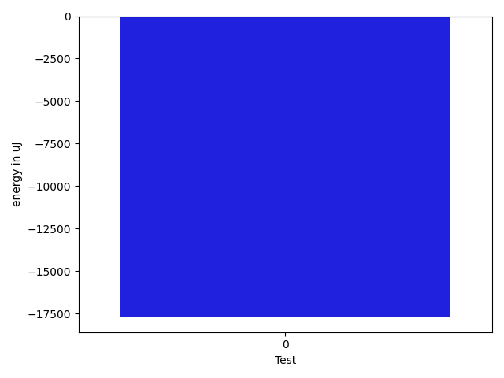

# gson 6728c7

https://github.com/google/gson/commit/6728c7

## Delta Energy per test method

| ID | EnergyV1 | EnergyV2 | DeltaEnergy | σV1 | σV2 |
| --- | --- | --- | --- | --- | --- |
| 0 | 768614 | 750913 | -17701 | 122458.8050140088 | 122652.4694846134 |

## Delta Duration per test method

| ID | DurationV1 | DurationsV2 | DeltaDuration |
| --- | --- | --- | --- |
| 0 | 22909107.92929293 | 23546934.141414143 | 637826.2121212147 |

## Misc.

| ID | Test Class | Test Method |
| --- | --- | --- |
| 0 | com.google.gson.ParameterizedTypeHandlerMapTest | testTypeOverridding |

| Test | IterationV1 | IterationV2 | DeltaIteration |
| --- | --- | --- | --- |
| 0 | 99 | 99 | 0 |

| Time Label | Time (s) |
| --- | --- |
| Selection | 25.098520278930664 |
| Injection | 8.973044395446777 |
| Total | 969.348917722702 |

