# gson 2610a2

https://github.com/google/gson/commit/2610a2

## Delta Energy per test method

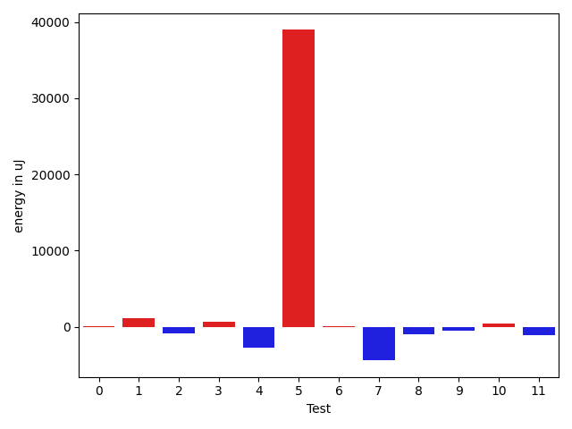

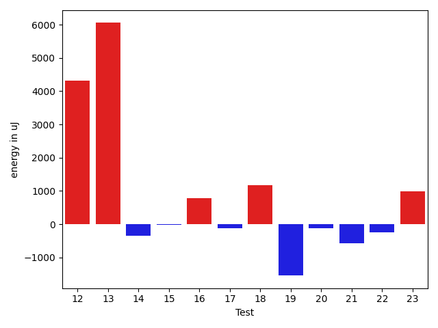

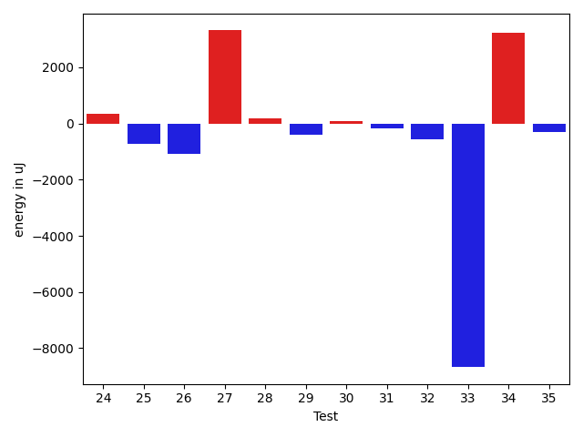

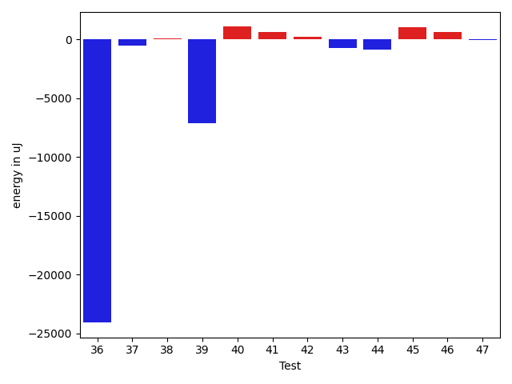

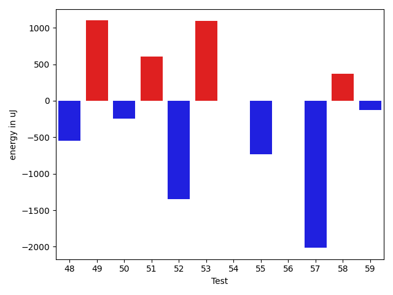

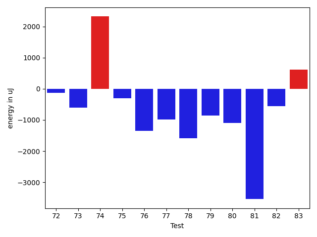

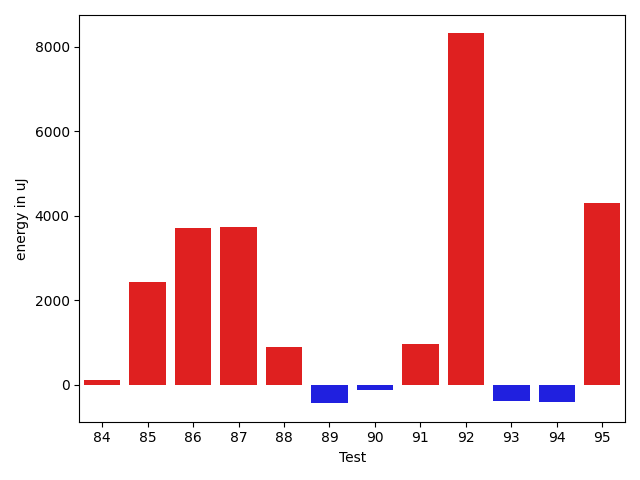

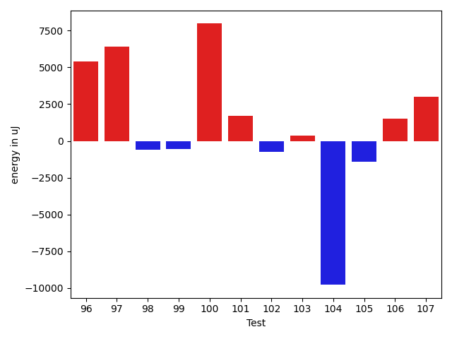

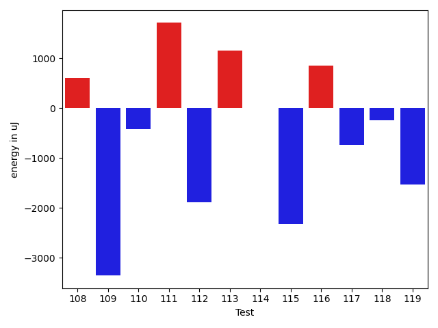

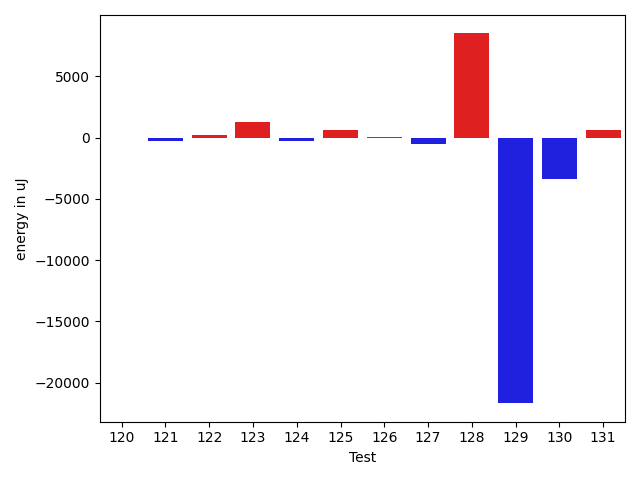

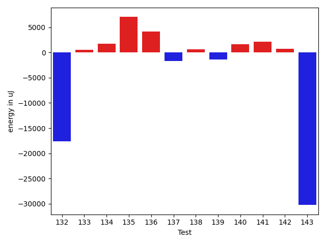

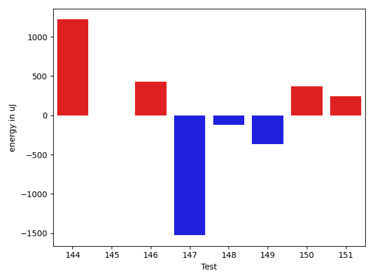

| ID | EnergyV1 | EnergyV2 | DeltaEnergy | σV1 | σV2 |
| --- | --- | --- | --- | --- | --- |
| 0 | 35461 | 34423 | -1038 | 3217.970310906395 | 3659.78254586204 |
| 1 | 35401 | 36071 | 670 | 19516.06720722366 | 19477.667523665084 |
| 2 | 37110 | 37475 | 365 | 28685.526271827945 | 17972.736167818875 |
| 3 | 33630 | 35706 | 2076 | 3339.4588977245758 | 3234.450489876533 |
| 4 | 36804 | 35340 | -1464 | 8665.653050657575 | 5049.155073166287 |
| 5 | 36804 | 39306 | 2502 | 89708.37642516359 | 146558.99880443368 |
| 6 | 35705 | 35583 | -122 | 3628.919061124176 | 3917.2757174893823 |
| 7 | 36865 | 36499 | -366 | 22582.132215077632 | 3417.773247214479 |
| 8 | 36743 | 33753 | -2990 | 3252.742042217593 | 3477.6234589867936 |
| 9 | 35705 | 34363 | -1342 | 13245.565108900048 | 12869.947601182725 |
| 10 | 32776 | 33081 | 305 | 3341.502252408633 | 3907.5705812831707 |
| 11 | 35522 | 33569 | -1953 | 3503.401729491023 | 3609.4189901258333 |
| 12 | 36132 | 34424 | -1708 | 8748.480021460302 | 31330.56918681178 |
| 13 | 35096 | 35827 | 731 | 3754.5433566779484 | 26707.30866446047 |
| 14 | 36072 | 35523 | -549 | 3970.0489842695897 | 3703.1625180524393 |
| 15 | 36132 | 35340 | -792 | 5522.870714602065 | 5082.304618759355 |
| 16 | 35156 | 36011 | 855 | 3796.887119137353 | 3806.350600701873 |
| 17 | 34484 | 33447 | -1037 | 3382.6954118180593 | 3434.462901457461 |
| 18 | 35217 | 35461 | 244 | 3963.3437581655276 | 4827.099022886955 |
| 19 | 35156 | 34912 | -244 | 4204.507825195025 | 3408.773601288849 |
| 20 | 37292 | 36438 | -854 | 4149.37697398323 | 3097.8223007233178 |
| 21 | 63964 | 67199 | 3235 | 87732.53137532681 | 80624.7704907104 |
| 22 | 35767 | 36071 | 304 | 3860.652589742454 | 4129.418663942455 |
| 23 | 36316 | 36377 | 61 | 11339.227293522546 | 10983.720693705924 |
| 24 | 35827 | 36743 | 916 | 3412.402681614174 | 3149.4502532097986 |
| 25 | 36926 | 37414 | 488 | 9275.033185018348 | 5184.921291499878 |
| 26 | 36988 | 35949 | -1039 | 9566.703611361532 | 9605.575799597687 |
| 27 | 38635 | 37964 | -671 | 34136.720839957896 | 38619.597483293655 |
| 28 | 35583 | 35400 | -183 | 4326.571897135232 | 3736.4119932317094 |
| 29 | 36621 | 35461 | -1160 | 6219.395055740952 | 3675.0385607407325 |
| 30 | 34790 | 34668 | -122 | 3002.270746984719 | 4310.803932360251 |
| 31 | 35889 | 35278 | -611 | 3871.984660690177 | 3684.9409851627515 |
| 32 | 34363 | 34363 | 0 | 3781.7876963059143 | 4363.636988289806 |
| 33 | 36315 | 33752 | -2563 | 31901.757838054862 | 2987.937876334525 |
| 34 | 34790 | 33814 | -976 | 3520.6346944353722 | 25627.52438418586 |
| 35 | 34485 | 34180 | -305 | 3226.485444346626 | 3022.2122482155164 |
| 36 | 37353 | 39673 | 2320 | 103074.82596150419 | 48194.36189480519 |
| 37 | 34302 | 34058 | -244 | 3783.113025947261 | 3064.4132403996214 |
| 38 | 33691 | 33569 | -122 | 2995.262727584383 | 3319.0819112307786 |
| 39 | 33997 | 33691 | -306 | 34429.85773457776 | 3156.7100162961005 |
| 40 | 35888 | 36621 | 733 | 3755.7109492902828 | 2803.6814123973186 |
| 41 | 33813 | 34851 | 1038 | 3027.3086710806347 | 3222.9217396534086 |
| 42 | 36437 | 36438 | 1 | 3117.7069888003057 | 2731.7634638452873 |
| 43 | 35096 | 34057 | -1039 | 3569.317791412492 | 3177.7357688738134 |
| 44 | 34546 | 34179 | -367 | 3226.7536233597934 | 2970.6300754831273 |
| 45 | 34973 | 36011 | 1038 | 3063.929874530693 | 2550.9753122047773 |
| 46 | 33997 | 35645 | 1648 | 3167.4234797386976 | 3499.2018059071197 |
| 47 | 34668 | 34241 | -427 | 3287.7118275822913 | 3912.2968905746407 |
| 48 | 35522 | 34973 | -549 | 4056.204026534572 | 8677.57414140564 |
| 49 | 34118 | 35217 | 1099 | 5054.406769581129 | 3441.99261766428 |
| 50 | 33997 | 33752 | -245 | 3206.9626149380956 | 2948.6759098452603 |
| 51 | 34058 | 34668 | 610 | 3393.6048296759595 | 3722.8999010525417 |
| 52 | 35279 | 33935 | -1344 | 3954.686377249149 | 2085.18297817461 |
| 53 | 35401 | 36499 | 1098 | 3854.2162826379763 | 3147.6978814374997 |
| 54 | 36743 | 36743 | 0 | 3600.3118680018542 | 4153.489352759851 |
| 55 | 34607 | 33874 | -733 | 34759.300087625415 | 3732.8187928007674 |
| 56 | 35705 | 35705 | 0 | 3296.939437963639 | 4683.145995835946 |
| 57 | 35950 | 33935 | -2015 | 2916.9785089931956 | 2804.753751289389 |
| 58 | 34729 | 35096 | 367 | 4364.88781856293 | 4177.259385961087 |
| 59 | 34790 | 34667 | -123 | 3009.9477284242603 | 3626.69971613655 |
| 60 | 33570 | 34119 | 549 | 4122.504112793582 | 2909.4659914444605 |
| 61 | 33631 | 35400 | 1769 | 3745.3004540834936 | 3916.241113603265 |
| 62 | 34790 | 34912 | 122 | 3307.3517179239952 | 3521.956714245126 |
| 63 | 36987 | 39185 | 2198 | 21835.015800672343 | 21237.490269784317 |
| 64 | 35400 | 35522 | 122 | 3800.547375263608 | 7470.40342814153 |
| 65 | 35706 | 36133 | 427 | 3717.8809038516706 | 3096.4143410180104 |
| 66 | 37170 | 37170 | 0 | 51485.00003488451 | 66100.75910735509 |
| 67 | 36499 | 36499 | 0 | 16265.225929272345 | 3971.898366997211 |
| 68 | 35523 | 34973 | -550 | 3769.8327649095067 | 27056.324130111803 |
| 69 | 36254 | 35400 | -854 | 3431.819030685476 | 3892.8460058933742 |
| 70 | 34851 | 34546 | -305 | 3480.271576313832 | 3773.269735918703 |
| 71 | 36011 | 37048 | 1037 | 3418.677570771965 | 5713.85088368329 |
| 72 | 38696 | 38574 | -122 | 365169.363041794 | 571214.5053393586 |
| 73 | 36498 | 35889 | -609 | 3843.5622579873657 | 3229.3492144750267 |
| 74 | 34912 | 37231 | 2319 | 2633.057091340502 | 3305.362100429913 |
| 75 | 36804 | 36499 | -305 | 2153.2435793494224 | 3859.928788169524 |
| 76 | 36377 | 35034 | -1343 | 10023.499138895444 | 12749.421515844657 |
| 77 | 36743 | 35766 | -977 | 34122.62348265935 | 36389.095933307966 |
| 78 | 36255 | 34668 | -1587 | 9989.483142676667 | 20460.986138064796 |
| 79 | 36377 | 35522 | -855 | 14691.86963856486 | 14540.728791080133 |
| 80 | 35950 | 34851 | -1099 | 47134.106642562656 | 50199.26624857015 |
| 81 | 69518 | 65979 | -3539 | 72430.46690281246 | 25241.659178227346 |
| 82 | 36438 | 35889 | -549 | 12320.202595295885 | 12225.34067174312 |
| 83 | 37842 | 38452 | 610 | 30862.245497888216 | 19961.7102087654 |
| 84 | 35339 | 35462 | 123 | 3056.0816092624978 | 3026.9284318965947 |
| 85 | 36499 | 36743 | 244 | 20938.356822177622 | 22900.236124925766 |
| 86 | 37110 | 38513 | 1403 | 3750.077732893477 | 26749.526799602925 |
| 87 | 36560 | 37293 | 733 | 3599.778518211574 | 17097.552021455573 |
| 88 | 37964 | 37475 | -489 | 16943.953098785787 | 19017.532340148493 |
| 89 | 37659 | 37475 | -184 | 3042.8865178477663 | 3428.1368081166706 |
| 90 | 35705 | 35461 | -244 | 3831.819063551361 | 3706.218798076548 |
| 91 | 35034 | 35583 | 549 | 6608.04030827553 | 8068.479922457936 |
| 92 | 38514 | 39917 | 1403 | 85862.67287072225 | 101931.5033089288 |
| 93 | 37292 | 36865 | -427 | 4063.6553218920744 | 3768.0769292040736 |
| 94 | 35644 | 36011 | 367 | 4061.96075076898 | 4175.634134378442 |
| 95 | 35950 | 37048 | 1098 | 3920.217331558202 | 23656.741449901514 |
| 96 | 36377 | 37476 | 1099 | 3517.304014794215 | 27971.237415443575 |
| 97 | 36255 | 35096 | -1159 | 3781.6841646062053 | 34956.93863874603 |
| 98 | 36987 | 36865 | -122 | 4121.338669352472 | 3713.2181743144542 |
| 99 | 37109 | 36926 | -183 | 4097.818339416371 | 3975.7806840406483 |
| 100 | 37964 | 38941 | 977 | 61544.62960890044 | 68602.71348327924 |
| 101 | 36743 | 34790 | -1953 | 4541.345458817963 | 20668.938311295075 |
| 102 | 36560 | 36560 | 0 | 6415.692566754668 | 5360.974919624506 |
| 103 | 36927 | 36743 | -184 | 5451.666112446726 | 4389.120727074608 |
| 104 | 37659 | 38147 | 488 | 66307.15745510467 | 44283.93276521383 |
| 105 | 38208 | 37353 | -855 | 15708.08108936399 | 14591.400484437967 |
| 106 | 35034 | 36377 | 1343 | 3771.1260887830304 | 3767.3192057127867 |
| 107 | 34851 | 35584 | 733 | 3522.8009698161186 | 21245.779287896523 |
| 108 | 35034 | 35645 | 611 | 18169.7840688958 | 3653.573398859603 |
| 109 | 37598 | 34241 | -3357 | 4548.743499345672 | 4226.798765076653 |
| 110 | 39184 | 38757 | -427 | 58318.492232467375 | 47601.16861545549 |
| 111 | 33752 | 35461 | 1709 | 26515.331398706097 | 29899.535160196854 |
| 112 | 36682 | 34790 | -1892 | 3550.7106785096753 | 3905.2135833356624 |
| 113 | 35766 | 36926 | 1160 | 9510.989352641844 | 5689.848068929433 |
| 114 | 37231 | 37232 | 1 | 4020.6655230526067 | 3805.6697598435485 |
| 115 | 44190 | 41870 | -2320 | 524898.9723926359 | 427912.3553689554 |
| 116 | 36621 | 37476 | 855 | 8171.790236094607 | 9503.711417642784 |
| 117 | 37475 | 36743 | -732 | 3762.407118443035 | 3521.3691809355714 |
| 118 | 37415 | 37170 | -245 | 5197.292143885384 | 54955.180003479596 |
| 119 | 37903 | 36377 | -1526 | 4036.6510283123307 | 10038.991807256984 |
| 120 | 39245 | 39245 | 0 | 40100.13973207155 | 53983.323298305404 |
| 121 | 36132 | 35827 | -305 | 3670.9137284981407 | 4113.889074356045 |
| 122 | 37476 | 37720 | 244 | 46137.247378545406 | 53425.52774131032 |
| 123 | 35583 | 36865 | 1282 | 7286.499367475063 | 11515.821389261602 |
| 124 | 36560 | 36255 | -305 | 4048.6138154916202 | 4140.38377120445 |
| 125 | 36133 | 36743 | 610 | 3307.566820984686 | 6302.09967532447 |
| 126 | 37720 | 37780 | 60 | 14332.734403456205 | 15561.600200127214 |
| 127 | 38818 | 38330 | -488 | 36155.992729546335 | 31892.08170629608 |
| 128 | 356749 | 365234 | 8485 | 104952.4274682332 | 104603.72321297524 |
| 129 | 67322 | 45654 | -21668 | 67651.18573969821 | 51770.43932106203 |
| 130 | 73913 | 70495 | -3418 | 31704.98493327866 | 32739.522291616853 |
| 131 | 36560 | 37171 | 611 | 6113.884969038439 | 22401.758452208862 |
| 132 | 38269 | 37231 | -1038 | 76091.71733396513 | 57556.02888449595 |
| 133 | 37292 | 37597 | 305 | 4712.685204263863 | 3427.1773823366657 |
| 134 | 36560 | 36865 | 305 | 36924.23170150049 | 40458.28619226995 |
| 135 | 37842 | 37842 | 0 | 65569.71105920595 | 71272.3793395894 |
| 136 | 36743 | 36927 | 184 | 3779.9430151729416 | 23845.590003272442 |
| 137 | 37048 | 35644 | -1404 | 8140.05984790724 | 7135.776709360349 |
| 138 | 36437 | 37109 | 672 | 3645.814508343903 | 5303.494364069997 |
| 139 | 37109 | 35949 | -1160 | 3652.3121973537227 | 3036.00264209473 |
| 140 | 36255 | 37048 | 793 | 4265.263965954697 | 4573.888997948635 |
| 141 | 35644 | 37780 | 2136 | 3655.347409659767 | 4343.946697416994 |
| 142 | 35157 | 36743 | 1586 | 3803.3578329432835 | 3888.8706312147733 |
| 143 | 37659 | 36621 | -1038 | 90140.4120110255 | 59066.35211331154 |
| 144 | 36498 | 37719 | 1221 | 8479.030209359596 | 25099.60543558847 |
| 145 | 35095 | 35095 | 0 | 3622.7837680590005 | 3497.7863001650767 |
| 146 | 34362 | 34790 | 428 | 3529.7756632662604 | 3821.3292615319815 |
| 147 | 35523 | 33996 | -1527 | 3789.0913334154393 | 4905.807788769735 |
| 148 | 35461 | 35339 | -122 | 3469.9923213591546 | 3863.1209674287447 |
| 149 | 37415 | 37048 | -367 | 3406.071576333029 | 3549.037159135589 |
| 150 | 38330 | 38697 | 367 | 54443.92613766893 | 50513.91197626399 |
| 151 | 37292 | 37537 | 245 | 10648.997016253888 | 14601.785201307252 |

## Delta Duration per test method

| ID | DurationV1 | DurationsV2 | DeltaDuration |
| --- | --- | --- | --- |
| 0 | 704768.71875 | 543415.9655172414 | -161352.7532327586 |
| 1 | 1446445.09375 | 1488833.652631579 | 42388.55888157897 |
| 2 | 1610053.2134831462 | 1582754.87654321 | -27298.33693993627 |
| 3 | 585135.3928571428 | 580716.1724137932 | -4419.220443349681 |
| 4 | 1078805.1304347827 | 1005358.53125 | -73446.59918478271 |
| 5 | 1333691.1818181819 | 2722149.5853658537 | 1388458.4035476719 |
| 6 | 690813.7209302326 | 741482.4242424242 | 50668.70331219165 |
| 7 | 964041.0 | 715498.325 | -248542.67500000005 |
| 8 | 470431.6666666667 | 466611.04347826086 | -3820.6231884058216 |
| 9 | 1139633.7096774194 | 1176977.8688524591 | 37344.159175039735 |
| 10 | 739623.8085106383 | 835315.5853658536 | 95691.77685521531 |
| 11 | 602056.8823529412 | 592220.7272727273 | -9836.15508021391 |
| 12 | 861319.8627450981 | 1033765.94 | 172446.07725490187 |
| 13 | 533685.5789473684 | 685097.2962962963 | 151411.71734892786 |
| 14 | 690654.375 | 637167.3076923077 | -53487.067307692254 |
| 15 | 970348.0793650794 | 929846.966101695 | -40501.11326338444 |
| 16 | 688329.5135135135 | 653507.1538461539 | -34822.35966735962 |
| 17 | 601279.3529411765 | 594023.8484848485 | -7255.504456327995 |
| 18 | 749604.9024390244 | 721416.75 | -28188.152439024416 |
| 19 | 636864.7407407408 | 599345.4375 | -37519.30324074079 |
| 20 | 576145.8333333334 | 575990.7037037037 | -155.12962962966412 |
| 21 | 2430045.0707070706 | 2394327.707070707 | -35717.36363636376 |
| 22 | 885856.8529411765 | 904936.3134328359 | 19079.460491659353 |
| 23 | 1043085.9166666666 | 1050506.984375 | 7421.067708333372 |
| 24 | 821782.4 | 795382.5084745763 | -26399.891525423736 |
| 25 | 1179825.2738095238 | 1137105.0114942528 | -42720.26231527096 |
| 26 | 975739.606557377 | 919127.9508196721 | -56611.65573770495 |
| 27 | 1517252.746031746 | 1706513.894736842 | 189261.14870509598 |
| 28 | 868678.0819672131 | 835499.7457627119 | -33178.33620450122 |
| 29 | 789803.6458333334 | 783389.8139534884 | -6413.8318798450055 |
| 30 | 548934.8484848485 | 559550.6764705882 | 10615.827985739685 |
| 31 | 763204.7222222222 | 758122.8181818182 | -5081.904040404013 |
| 32 | 607384.9411764706 | 592366.7352941176 | -15018.20588235301 |
| 33 | 729122.0 | 421246.71428571426 | -307875.28571428574 |
| 34 | 658248.3947368421 | 746325.9714285714 | 88077.57669172925 |
| 35 | 491022.51612903224 | 516078.9166666667 | 25056.400537634443 |
| 36 | 1791956.175 | 1005352.4516129033 | -786603.7233870968 |
| 37 | 440815.1785714286 | 472700.1904761905 | 31885.011904761894 |
| 38 | 564114.5238095238 | 581966.6086956522 | 17852.084886128432 |
| 39 | 720698.2916666666 | 517640.2380952381 | -203058.05357142852 |
| 40 | 549441.1212121212 | 511193.1 | -38248.02121212124 |
| 41 | 490355.75 | 501083.125 | 10727.375 |
| 42 | 601223.4827586206 | 565328.68 | -35894.802758620586 |
| 43 | 434601.5 | 462771.71428571426 | 28170.21428571426 |
| 44 | 580506.1463414634 | 572147.4871794871 | -8358.659161976306 |
| 45 | 453552.4583333333 | 499202.347826087 | 45649.88949275366 |
| 46 | 471338.9375 | 449054.25925925927 | -22284.67824074073 |
| 47 | 751337.5 | 492187.12 | -259150.38 |
| 48 | 980165.119047619 | 868943.0357142857 | -111222.08333333337 |
| 49 | 402186.0 | 438830.1052631579 | 36644.10526315792 |
| 50 | 494022.7826086957 | 468185.92307692306 | -25836.859531772614 |
| 51 | 571886.6 | 588982.4516129033 | 17095.851612903294 |
| 52 | 481439.48 | 461308.55555555556 | -20130.92444444442 |
| 53 | 620613.3333333334 | 633570.5357142857 | 12957.202380952309 |
| 54 | 676049.3125 | 571218.303030303 | -104831.00946969702 |
| 55 | 704494.4166666666 | 498216.1304347826 | -206278.28623188403 |
| 56 | 510224.64 | 530389.4838709678 | 20164.843870967743 |
| 57 | 489180.0869565217 | 461264.0909090909 | -27915.996047430846 |
| 58 | 431209.23076923075 | 447130.88 | 15921.649230769253 |
| 59 | 519743.4074074074 | 505426.4736842105 | -14316.933723196911 |
| 60 | 468672.36 | 505412.7272727273 | 36740.36727272731 |
| 61 | 740389.6222222223 | 793195.9629629629 | 52806.34074074065 |
| 62 | 913590.8059701492 | 932042.095890411 | 18451.28992026171 |
| 63 | 1660696.5151515151 | 1629456.551020408 | -31239.964131107088 |
| 64 | 1048933.593220339 | 1042197.380952381 | -6736.212267957977 |
| 65 | 826404.9607843137 | 815928.9074074074 | -10476.053376906319 |
| 66 | 1648267.6097560977 | 1928936.917808219 | 280669.3080521214 |
| 67 | 993821.5 | 907027.6964285715 | -86793.80357142852 |
| 68 | 788843.1632653062 | 1081469.1707317072 | 292626.0074664011 |
| 69 | 782562.0625 | 811775.82 | 29213.75749999995 |
| 70 | 860420.8928571428 | 1002270.53125 | 141849.63839285716 |
| 71 | 831637.4166666666 | 874340.2452830189 | 42702.828616352286 |
| 72 | 3164799.925 | 5227876.0617283955 | 2063076.1367283957 |
| 73 | 479360.1052631579 | 473210.5263157895 | -6149.578947368427 |
| 74 | 504956.09523809527 | 530561.6842105263 | 25605.588972431025 |
| 75 | 597001.3103448276 | 610495.7096774194 | 13494.399332591798 |
| 76 | 1413722.5212765958 | 1429866.180851064 | 16143.659574468154 |
| 77 | 1444808.8157894737 | 1383971.6973684211 | -60837.11842105258 |
| 78 | 1291908.2391304348 | 1340289.4375 | 48381.19836956519 |
| 79 | 1389875.0909090908 | 1435820.8969072164 | 45945.80599812558 |
| 80 | 1532102.9310344828 | 1783792.471264368 | 251689.54022988514 |
| 81 | 2551408.0505050505 | 2186118.404040404 | -365289.6464646463 |
| 82 | 1312401.8404255318 | 1332367.7659574468 | 19965.925531914923 |
| 83 | 1744418.4444444445 | 1656417.3434343433 | -88001.10101010115 |
| 84 | 883693.2786885246 | 877743.8392857143 | -5949.439402810298 |
| 85 | 1415360.78313253 | 1518520.9770114943 | 103160.19387896429 |
| 86 | 784180.2962962963 | 902984.1379310344 | 118803.84163473814 |
| 87 | 770417.0961538461 | 892533.6226415094 | 122116.52648766327 |
| 88 | 1033051.9361702128 | 1123786.3125 | 90734.37632978719 |
| 89 | 666919.268292683 | 618576.1891891892 | -48343.079103493714 |
| 90 | 819313.052631579 | 800501.9615384615 | -18811.091093117488 |
| 91 | 1109672.1707317072 | 1099962.2098765431 | -9709.9608551641 |
| 92 | 2017992.028169014 | 2220741.9 | 202749.87183098588 |
| 93 | 798762.8260869565 | 825682.78 | 26919.953913043486 |
| 94 | 852878.8510638297 | 862680.9615384615 | 9802.110474631772 |
| 95 | 774866.8125 | 909494.5510204082 | 134627.73852040817 |
| 96 | 787681.8823529412 | 1024978.0 | 237296.1176470588 |
| 97 | 790971.5833333334 | 1022614.5 | 231642.91666666663 |
| 98 | 769915.925 | 855645.7115384615 | 85729.78653846146 |
| 99 | 619548.2857142857 | 673828.1463414634 | 54279.86062717775 |
| 100 | 1612056.5192307692 | 2015138.9347826086 | 403082.4155518394 |
| 101 | 648668.9428571429 | 835452.0487804879 | 186783.10592334496 |
| 102 | 746381.3777777777 | 901428.2045454546 | 155046.82676767686 |
| 103 | 807212.0 | 617307.3125 | -189904.6875 |
| 104 | 1788110.5 | 1434773.75 | -353336.75 |
| 105 | 1338910.3529411764 | 1284520.1084337349 | -54390.24450744153 |
| 106 | 748227.25 | 722478.7380952381 | -25748.511904761894 |
| 107 | 946593.5409836066 | 1008869.6031746032 | 62276.0621909966 |
| 108 | 940003.2432432432 | 776729.4186046511 | -163273.82463859208 |
| 109 | 490773.72222222225 | 469891.28571428574 | -20882.43650793651 |
| 110 | 1457850.5098039217 | 1239534.3272727274 | -218316.1825311943 |
| 111 | 788874.8444444444 | 803426.3529411765 | 14551.508496732102 |
| 112 | 905609.25 | 966486.9024390244 | 60877.652439024416 |
| 113 | 931920.1315789474 | 891407.925 | -40512.20657894737 |
| 114 | 563132.875 | 593709.3333333334 | 30576.458333333372 |
| 115 | 5492257.029411765 | 4299046.597222222 | -1193210.4321895428 |
| 116 | 1031012.5522388059 | 1034175.1710526316 | 3162.618813825655 |
| 117 | 959803.7413793104 | 1060607.1044776118 | 100803.36309830146 |
| 118 | 1044554.9117647059 | 1261652.5 | 217097.5882352941 |
| 119 | 740115.775 | 690597.1666666666 | -49518.608333333395 |
| 120 | 1347027.3043478262 | 1505305.357142857 | 158278.05279503088 |
| 121 | 950749.9852941176 | 999544.8656716418 | 48794.88037752418 |
| 122 | 1354825.3709677418 | 1584488.2459016393 | 229662.87493389752 |
| 123 | 1105850.3333333333 | 1193888.15 | 88037.81666666665 |
| 124 | 636254.3235294118 | 737006.552631579 | 100752.22910216718 |
| 125 | 856608.8431372549 | 927401.0508474576 | 70792.20771020267 |
| 126 | 1354021.619047619 | 1353071.6049382717 | -950.0141093472484 |
| 127 | 1335861.380952381 | 1375740.6363636365 | 39879.255411255406 |
| 128 | 10587272.191919193 | 10455158.848484848 | -132113.34343434498 |
| 129 | 2287883.5656565656 | 2158557.1616161615 | -129326.40404040413 |
| 130 | 2327734.131313131 | 2241831.3232323234 | -85902.8080808078 |
| 131 | 811086.0487804879 | 853916.2666666667 | 42830.21788617887 |
| 132 | 1990867.9787234042 | 1478551.3055555555 | -512316.6731678487 |
| 133 | 746589.0 | 749536.5 | 2947.5 |
| 134 | 1287640.03125 | 1304039.3076923077 | 16399.276442307746 |
| 135 | 1523165.107142857 | 1753918.7692307692 | 230753.6620879122 |
| 136 | 981177.3783783783 | 920377.375 | -60800.003378378344 |
| 137 | 1015476.7594936709 | 1023931.015625 | 8454.256131329108 |
| 138 | 909980.551724138 | 869999.6666666666 | -39980.88505747134 |
| 139 | 593934.1428571428 | 650213.8620689656 | 56279.719211822725 |
| 140 | 773848.6451612903 | 625481.1666666666 | -148367.47849462368 |
| 141 | 714492.7073170731 | 652962.4 | -61530.30731707311 |
| 142 | 725969.3870967742 | 667593.7435897436 | -58375.64350703056 |
| 143 | 2507128.361702128 | 1436648.945945946 | -1070479.4157561818 |
| 144 | 934612.125 | 1159713.2222222222 | 225101.09722222225 |
| 145 | 717680.8717948718 | 721889.5813953489 | 4208.70960047713 |
| 146 | 616797.5 | 626466.0697674418 | 9668.569767441833 |
| 147 | 653206.8421052631 | 652935.1290322581 | -271.7130730050849 |
| 148 | 758289.8292682926 | 747435.9545454546 | -10853.874722838053 |
| 149 | 641211.7272727273 | 662942.6315789474 | 21730.904306220124 |
| 150 | 1319414.4666666666 | 1268632.3658536586 | -50782.10081300791 |
| 151 | 1184576.948051948 | 1192848.9589041097 | 8272.010852161562 |

## Misc.

| ID | Test Class | Test Method |
| --- | --- | --- |
| 0 | com.google.gson.functional.ObjectTest | testStringFieldWithEmptyValueDeserialization |
| 1 | com.google.gson.functional.ObjectTest | testEmptyCollectionInAnObjectDeserialization |
| 2 | com.google.gson.functional.ObjectTest | testArrayOfArraysDeserialization |
| 3 | com.google.gson.functional.ObjectTest | testPrivateNoArgConstructorDeserialization |
| 4 | com.google.gson.functional.ObjectTest | testArrayOfObjectsDeserialization |
| 5 | com.google.gson.functional.ObjectTest | testJsonInSingleQuotesDeserialization |
| 6 | com.google.gson.functional.ObjectTest | testBagOfPrimitiveWrappersDeserialization |
| 7 | com.google.gson.functional.ObjectTest | testNullFieldsDeserialization |
| 8 | com.google.gson.functional.ObjectTest | testClassWithNoFieldsDeserialization |
| 9 | com.google.gson.functional.ObjectTest | testStringFieldWithNumberValueDeserialization |
| 10 | com.google.gson.functional.ObjectTest | testPrimitiveArrayInAnObjectDeserialization |
| 11 | com.google.gson.functional.ObjectTest | testObjectFieldNamesWithoutQuotesDeserialization |
| 12 | com.google.gson.functional.ObjectTest | testInnerClassDeserialization |
| 13 | com.google.gson.functional.ObjectTest | testNullObjectFieldsDeserialization |
| 14 | com.google.gson.functional.ObjectTest | testClassWithTransientFieldsDeserialization |
| 15 | com.google.gson.functional.ObjectTest | testNestedDeserialization |
| 16 | com.google.gson.functional.ObjectTest | testJsonInMixedQuotesDeserialization |
| 17 | com.google.gson.functional.ObjectTest | testNullPrimitiveFieldsDeserialization |
| 18 | com.google.gson.functional.ObjectTest | testBagOfPrimitivesDeserialization |
| 19 | com.google.gson.functional.ObjectTest | testClassWithTransientFieldsDeserializationTransientFieldsPassedInJsonAreIgnored |
| 20 | com.google.gson.functional.ObjectTest | testNullArraysDeserialization |
| 21 | com.google.gson.functional.CustomDeserializerTest | testDefaultConstructorNotCalledOnObject |
| 22 | com.google.gson.functional.CustomDeserializerTest | testCustomDeserializerReturnsNullForArrayElementsForArrayField |
| 23 | com.google.gson.functional.CustomDeserializerTest | testCustomDeserializerReturnsNull |
| 24 | com.google.gson.functional.CustomDeserializerTest | testCustomDeserializerReturnsNullForTopLevelPrimitives |
| 25 | com.google.gson.functional.CustomDeserializerTest | testJsonTypeFieldBasedDeserialization |
| 26 | com.google.gson.functional.CustomDeserializerTest | testCustomDeserializerReturnsNullForArrayElements |
| 27 | com.google.gson.functional.CustomDeserializerTest | testCustomDeserializerReturnsNullForTopLevelObject |
| 28 | com.google.gson.functional.CustomDeserializerTest | testCustomDeserializerReturnsNullForPrimitiveFields |
| 29 | com.google.gson.functional.CustomDeserializerTest | testDefaultConstructorNotCalledOnField |
| 30 | com.google.gson.functional.PrimitiveTest | testDoubleNoFractAsStringRepresentationDeserialization |
| 31 | com.google.gson.functional.PrimitiveTest | testDoubleAsStringRepresentationDeserialization |
| 32 | com.google.gson.functional.PrimitiveTest | testBadValueForBigIntegerDeserialization |
| 33 | com.google.gson.functional.PrimitiveTest | testBigDecimalNegativeInfinityDeserializationNotSupported |
| 34 | com.google.gson.functional.PrimitiveTest | testOverridingDefaultPrimitiveSerialization |
| 35 | com.google.gson.functional.PrimitiveTest | testDoubleInfinityDeserialization |
| 36 | com.google.gson.functional.PrimitiveTest | testPrimitiveIntegerAutoboxedInASingleElementArrayDeserialization |
| 37 | com.google.gson.functional.PrimitiveTest | testBigDecimalPreservePrecisionDeserialization |
| 38 | com.google.gson.functional.PrimitiveTest | testPrimitiveDoubleAutoboxedInASingleElementArrayDeserialization |
| 39 | com.google.gson.functional.PrimitiveTest | testDoubleNaNDeserialization |
| 40 | com.google.gson.functional.PrimitiveTest | testReallyLongValuesDeserialization |
| 41 | com.google.gson.functional.PrimitiveTest | testBigDecimalDeserialization |
| 42 | com.google.gson.functional.PrimitiveTest | testPrimitiveLongAutoboxedDeserialization |
| 43 | com.google.gson.functional.PrimitiveTest | testSmallValueForBigDecimalDeserialization |
| 44 | com.google.gson.functional.PrimitiveTest | testBigDecimalNaNDeserializationNotSupported |
| 45 | com.google.gson.functional.PrimitiveTest | testBigDecimalInASingleElementArrayDeserialization |
| 46 | com.google.gson.functional.PrimitiveTest | testBigDecimalInfinityDeserializationNotSupported |
| 47 | com.google.gson.functional.PrimitiveTest | testFloatNaNDeserialization |
| 48 | com.google.gson.functional.PrimitiveTest | testPrimitiveDoubleAutoboxedDeserialization |
| 49 | com.google.gson.functional.PrimitiveTest | testBigDecimalNoFractAsStringRepresentationDeserialization |
| 50 | com.google.gson.functional.PrimitiveTest | testFloatInfinityDeserialization |
| 51 | com.google.gson.functional.PrimitiveTest | testLargeDoubleDeserialization |
| 52 | com.google.gson.functional.PrimitiveTest | testBigDecimalAsStringRepresentationDeserialization |
| 53 | com.google.gson.functional.PrimitiveTest | testNumberDeserialization |
| 54 | com.google.gson.functional.PrimitiveTest | testPrimitiveIntegerAutoboxedDeserialization |
| 55 | com.google.gson.functional.PrimitiveTest | testNegativeInfinityFloatDeserialization |
| 56 | com.google.gson.functional.PrimitiveTest | testPrimitiveLongAutoboxedInASingleElementArrayDeserialization |
| 57 | com.google.gson.functional.PrimitiveTest | testBigIntegerInASingleElementArrayDeserialization |
| 58 | com.google.gson.functional.PrimitiveTest | testSmallValueForBigIntegerDeserialization |
| 59 | com.google.gson.functional.PrimitiveTest | testNegativeInfinityDeserialization |
| 60 | com.google.gson.functional.PrimitiveTest | testBigIntegerDeserialization |
| 61 | com.google.gson.functional.CollectionTest | testRawCollectionOfBagOfPrimitivesNotAllowed |
| 62 | com.google.gson.functional.CollectionTest | testSetDeserialization |
| 63 | com.google.gson.functional.CollectionTest | testWildcardCollectionField |
| 64 | com.google.gson.functional.CollectionTest | testTopLevelListOfIntegerCollectionsDeserialization |
| 65 | com.google.gson.functional.CollectionTest | testQueueDeserialization |
| 66 | com.google.gson.functional.CollectionTest | testTopLevelCollectionOfIntegersDeserialization |
| 67 | com.google.gson.functional.CollectionTest | testRawCollectionDeserializationNotAlllowed |
| 68 | com.google.gson.functional.CollectionTest | testNullsInListDeserialization |
| 69 | com.google.gson.functional.CollectionTest | testCollectionOfStringsDeserialization |
| 70 | com.google.gson.functional.CollectionTest | testWildcardPrimitiveCollectionDeserilaization |
| 71 | com.google.gson.functional.CollectionTest | testLinkedListDeserialization |
| 72 | com.google.gson.JsonParserTest | testReadWriteTwoObjects |
| 73 | com.google.gson.JsonParserTest | testParseReader |
| 74 | com.google.gson.JsonParserTest | testParseString |
| 75 | com.google.gson.JsonParserTest | testParseMixedArray |
| 76 | com.google.gson.functional.ParameterizedTypesTest | testVariableTypeArrayDeserialization |
| 77 | com.google.gson.functional.ParameterizedTypesTest | testParameterizedTypeWithReaderDeserialization |
| 78 | com.google.gson.functional.ParameterizedTypesTest | testVariableTypeDeserialization |
| 79 | com.google.gson.functional.ParameterizedTypesTest | testParameterizedTypeGenericArraysDeserialization |
| 80 | com.google.gson.functional.ParameterizedTypesTest | testParameterizedTypeDeserialization |
| 81 | com.google.gson.functional.ParameterizedTypesTest | testVariableTypeFieldsAndGenericArraysDeserialization |
| 82 | com.google.gson.functional.ParameterizedTypesTest | testParameterizedTypeWithVariableTypeDeserialization |
| 83 | com.google.gson.functional.ParameterizedTypesTest | testParameterizedTypesWithCustomDeserializer |
| 84 | com.google.gson.functional.ParameterizedTypesTest | testDeepParameterizedTypeDeserialization |
| 85 | com.google.gson.functional.ParameterizedTypesTest | testTypesWithMultipleParametersDeserialization |
| 86 | com.google.gson.functional.NullObjectAndFieldTest | testCustomTypeAdapterPassesNullDesrialization |
| 87 | com.google.gson.functional.NullObjectAndFieldTest | testNullWrappedPrimitiveMemberDeserialization |
| 88 | com.google.gson.functional.NullObjectAndFieldTest | testExplicitDeserializationOfNulls |
| 89 | com.google.gson.functional.NullObjectAndFieldTest | testExplicitNullSetsFieldToNullDuringDeserialization |
| 90 | com.google.gson.functional.MapTest | testMapDeserializationWithNullKey |
| 91 | com.google.gson.functional.MapTest | testParameterizedMapSubclassDeserialization |
| 92 | com.google.gson.functional.MapTest | testMapDeserialization |
| 93 | com.google.gson.functional.MapTest | testMapDeserializationWithNullValue |
| 94 | com.google.gson.functional.MapTest | testMapDeserializationWithWildcardValues |
| 95 | com.google.gson.functional.MapTest | testMapDeserializationEmpty |
| 96 | com.google.gson.functional.MapTest | testMapDeserializationWithIntegerKeys |
| 97 | com.google.gson.functional.MapTest | testMapOfMapDeserialization |
| 98 | com.google.gson.functional.ExposeFieldsTest | testNoExposedFieldDeserialization |
| 99 | com.google.gson.functional.ExposeFieldsTest | testExposedInterfaceFieldDeserialization |
| 100 | com.google.gson.functional.ExposeFieldsTest | testExposeAnnotationDeserialization |
| 101 | com.google.gson.GsonTypeAdapterTest | testDefaultTypeAdapterThrowsParseException |
| 102 | com.google.gson.GsonTypeAdapterTest | testTypeAdapterThrowsException |
| 103 | com.google.gson.GsonTypeAdapterTest | testTypeAdapterProperlyConvertsTypes |
| 104 | com.google.gson.functional.InheritanceTest | testSubClassDeserialization |
| 105 | com.google.gson.functional.InheritanceTest | testSubInterfacesOfCollectionDeserialization |
| 106 | com.google.gson.functional.ArrayTest | testArrayOfPrimitivesWithCustomTypeAdapter |
| 107 | com.google.gson.functional.ArrayTest | testArrayOfCollectionDeserialization |
| 108 | com.google.gson.functional.ArrayTest | testArrayOfObjectsWithoutTypeInfoDeserialization |
| 109 | com.google.gson.functional.ArrayTest | testArrayOfStringsDeserialization |
| 110 | com.google.gson.functional.ArrayTest | testTopLevelArrayOfIntsDeserialization |
| 111 | com.google.gson.functional.ArrayTest | testArrayWithoutTypeInfoDeserialization |
| 112 | com.google.gson.functional.ArrayTest | testInvalidArrayDeserialization |
| 113 | com.google.gson.functional.ArrayTest | testArrayOfPrimitivesAsObjectsDeserialization |
| 114 | com.google.gson.functional.ArrayTest | testNullsInArrayDeserialization |
| 115 | com.google.gson.functional.InstanceCreatorTest | testInstanceCreatorReturnsBaseType |
| 116 | com.google.gson.functional.InstanceCreatorTest | testInstanceCreatorReturnsSubTypeForField |
| 117 | com.google.gson.functional.InstanceCreatorTest | testInstanceCreatorReturnsSubTypeForTopLevelObject |
| 118 | com.google.gson.functional.EnumTest | testCollectionOfEnumsDeserialization |
| 119 | com.google.gson.functional.EnumTest | testClassWithEnumFieldDeserialization |
| 120 | com.google.gson.functional.JsonParserTest | testChangingCustomTreeAndDeserializing |
| 121 | com.google.gson.functional.CustomTypeAdaptersTest | testCustomNestedDeserializers |
| 122 | com.google.gson.functional.CustomTypeAdaptersTest | testCustomDeserializers |
| 123 | com.google.gson.functional.CustomTypeAdaptersTest | testCustomDeserializerForLong |
| 124 | com.google.gson.functional.CustomTypeAdaptersTest | testEnsureCustomDeserializerNotInvokedForNullValues |
| 125 | com.google.gson.functional.CustomTypeAdaptersTest | testCustomAdapterInvokedForMapElementDeserialization |
| 126 | com.google.gson.functional.EscapingTest | testGsonAcceptsEscapedAndNonEscapedJsonDeserialization |
| 127 | com.google.gson.functional.EscapingTest | testEscapingObjectFields |
| 128 | com.google.gson.functional.ConcurrencyTest | testMultiThreadDeserialization |
| 129 | com.google.gson.functional.ConcurrencyTest | testSingleThreadDeserialization |
| 130 | com.google.gson.functional.UncategorizedTest | testReturningDerivedClassesDuringDeserialization |
| 131 | com.google.gson.functional.SecurityTest | testJsonWithNonExectuableTokenWithRegularGsonDeserialization |
| 132 | com.google.gson.functional.SecurityTest | testNonExecutableJsonDeserialization |
| 133 | com.google.gson.functional.SecurityTest | testJsonWithNonExectuableTokenWithConfiguredGsonDeserialization |
| 134 | com.google.gson.functional.CircularReferenceTest | testDirectedAcyclicGraphDeserialization |
| 135 | com.google.gson.functional.VersioningTest | testVersionedUntilDeserialization |
| 136 | com.google.gson.functional.VersioningTest | testVersionedGsonWithUnversionedClassesDeserialization |
| 137 | com.google.gson.functional.VersioningTest | testVersionedGsonMixingSinceAndUntilDeserialization |
| 138 | com.google.gson.functional.VersioningTest | testVersionedClassesDeserialization |
| 139 | com.google.gson.functional.VersioningTest | testIgnoreLaterVersionClassDeserialization |
| 140 | com.google.gson.functional.NamingPolicyTest | testGsonWithSerializedNameFieldNamingPolicyDeserialization |
| 141 | com.google.gson.functional.NamingPolicyTest | testGsonWithLowerCaseUnderscorePolicyDeserialiation |
| 142 | com.google.gson.functional.NamingPolicyTest | testGsonWithLowerCaseDashPolicyDeserialiation |
| 143 | com.google.gson.functional.NamingPolicyTest | testGsonWithNonDefaultFieldNamingPolicyDeserialiation |
| 144 | com.google.gson.functional.DefaultTypeAdaptersTest | testUrlNullDeserialization |
| 145 | com.google.gson.functional.DefaultTypeAdaptersTest | testDefaultCalendarDeserialization |
| 146 | com.google.gson.functional.DefaultTypeAdaptersTest | testDefaultGregorianCalendarDeserialization |
| 147 | com.google.gson.functional.DefaultTypeAdaptersTest | testBigIntegerFieldDeserialization |
| 148 | com.google.gson.functional.DefaultTypeAdaptersTest | testPropertiesDeserialization |
| 149 | com.google.gson.functional.DefaultTypeAdaptersTest | testBigDecimalFieldDeserialization |
| 150 | com.google.gson.functional.ReadersWritersTest | testReaderForDeserialization |
| 151 | com.google.gson.functional.ReadersWritersTest | testReadWriteTwoObjects |

| Test | IterationV1 | IterationV2 | DeltaIteration |
| --- | --- | --- | --- |
| 0 | 32 | 29 | -3 |
| 1 | 96 | 95 | -1 |
| 2 | 89 | 81 | -8 |
| 3 | 28 | 29 | 1 |
| 4 | 69 | 64 | -5 |
| 5 | 44 | 41 | -3 |
| 6 | 43 | 33 | -10 |
| 7 | 33 | 40 | 7 |
| 8 | 18 | 23 | 5 |
| 9 | 62 | 61 | -1 |
| 10 | 47 | 41 | -6 |
| 11 | 34 | 22 | -12 |
| 12 | 51 | 50 | -1 |
| 13 | 19 | 27 | 8 |
| 14 | 40 | 39 | -1 |
| 15 | 63 | 59 | -4 |
| 16 | 37 | 39 | 2 |
| 17 | 34 | 33 | -1 |
| 18 | 41 | 44 | 3 |
| 19 | 27 | 32 | 5 |
| 20 | 30 | 27 | -3 |
| 21 | 99 | 99 | 0 |
| 22 | 68 | 67 | -1 |
| 23 | 60 | 64 | 4 |
| 24 | 55 | 59 | 4 |
| 25 | 84 | 87 | 3 |
| 26 | 61 | 61 | 0 |
| 27 | 63 | 57 | -6 |
| 28 | 61 | 59 | -2 |
| 29 | 48 | 43 | -5 |
| 30 | 33 | 34 | 1 |
| 31 | 54 | 55 | 1 |
| 32 | 34 | 34 | 0 |
| 33 | 19 | 21 | 2 |
| 34 | 38 | 35 | -3 |
| 35 | 31 | 24 | -7 |
| 36 | 40 | 31 | -9 |
| 37 | 28 | 21 | -7 |
| 38 | 21 | 23 | 2 |
| 39 | 24 | 21 | -3 |
| 40 | 33 | 30 | -3 |
| 41 | 20 | 24 | 4 |
| 42 | 29 | 25 | -4 |
| 43 | 16 | 21 | 5 |
| 44 | 41 | 39 | -2 |
| 45 | 24 | 23 | -1 |
| 46 | 16 | 27 | 11 |
| 47 | 28 | 25 | -3 |
| 48 | 42 | 28 | -14 |
| 49 | 17 | 19 | 2 |
| 50 | 23 | 26 | 3 |
| 51 | 20 | 31 | 11 |
| 52 | 25 | 18 | -7 |
| 53 | 33 | 28 | -5 |
| 54 | 32 | 33 | 1 |
| 55 | 24 | 23 | -1 |
| 56 | 25 | 31 | 6 |
| 57 | 23 | 22 | -1 |
| 58 | 13 | 25 | 12 |
| 59 | 27 | 19 | -8 |
| 60 | 25 | 22 | -3 |
| 61 | 45 | 54 | 9 |
| 62 | 67 | 73 | 6 |
| 63 | 99 | 98 | -1 |
| 64 | 59 | 63 | 4 |
| 65 | 51 | 54 | 3 |
| 66 | 82 | 73 | -9 |
| 67 | 64 | 56 | -8 |
| 68 | 49 | 41 | -8 |
| 69 | 48 | 50 | 2 |
| 70 | 56 | 64 | 8 |
| 71 | 48 | 53 | 5 |
| 72 | 80 | 81 | 1 |
| 73 | 19 | 19 | 0 |
| 74 | 21 | 19 | -2 |
| 75 | 29 | 31 | 2 |
| 76 | 94 | 94 | 0 |
| 77 | 76 | 76 | 0 |
| 78 | 92 | 96 | 4 |
| 79 | 99 | 97 | -2 |
| 80 | 87 | 87 | 0 |
| 81 | 99 | 99 | 0 |
| 82 | 94 | 94 | 0 |
| 83 | 99 | 99 | 0 |
| 84 | 61 | 56 | -5 |
| 85 | 83 | 87 | 4 |
| 86 | 54 | 58 | 4 |
| 87 | 52 | 53 | 1 |
| 88 | 47 | 32 | -15 |
| 89 | 41 | 37 | -4 |
| 90 | 57 | 52 | -5 |
| 91 | 82 | 81 | -1 |
| 92 | 71 | 70 | -1 |
| 93 | 46 | 50 | 4 |
| 94 | 47 | 52 | 5 |
| 95 | 48 | 49 | 1 |
| 96 | 51 | 45 | -6 |
| 97 | 60 | 48 | -12 |
| 98 | 40 | 52 | 12 |
| 99 | 28 | 41 | 13 |
| 100 | 52 | 46 | -6 |
| 101 | 35 | 41 | 6 |
| 102 | 45 | 44 | -1 |
| 103 | 25 | 32 | 7 |
| 104 | 72 | 68 | -4 |
| 105 | 85 | 83 | -2 |
| 106 | 40 | 42 | 2 |
| 107 | 61 | 63 | 2 |
| 108 | 37 | 43 | 6 |
| 109 | 18 | 21 | 3 |
| 110 | 51 | 55 | 4 |
| 111 | 45 | 34 | -11 |
| 112 | 48 | 41 | -7 |
| 113 | 38 | 40 | 2 |
| 114 | 24 | 27 | 3 |
| 115 | 68 | 72 | 4 |
| 116 | 67 | 76 | 9 |
| 117 | 58 | 67 | 9 |
| 118 | 68 | 64 | -4 |
| 119 | 40 | 36 | -4 |
| 120 | 46 | 42 | -4 |
| 121 | 68 | 67 | -1 |
| 122 | 62 | 61 | -1 |
| 123 | 72 | 80 | 8 |
| 124 | 34 | 38 | 4 |
| 125 | 51 | 59 | 8 |
| 126 | 84 | 81 | -3 |
| 127 | 63 | 66 | 3 |
| 128 | 99 | 99 | 0 |
| 129 | 99 | 99 | 0 |
| 130 | 99 | 99 | 0 |
| 131 | 41 | 45 | 4 |
| 132 | 47 | 36 | -11 |
| 133 | 38 | 30 | -8 |
| 134 | 64 | 65 | 1 |
| 135 | 56 | 52 | -4 |
| 136 | 37 | 48 | 11 |
| 137 | 79 | 64 | -15 |
| 138 | 58 | 60 | 2 |
| 139 | 35 | 29 | -6 |
| 140 | 31 | 30 | -1 |
| 141 | 41 | 40 | -1 |
| 142 | 31 | 39 | 8 |
| 143 | 47 | 37 | -10 |
| 144 | 48 | 45 | -3 |
| 145 | 39 | 43 | 4 |
| 146 | 46 | 43 | -3 |
| 147 | 38 | 31 | -7 |
| 148 | 41 | 44 | 3 |
| 149 | 33 | 38 | 5 |
| 150 | 45 | 41 | -4 |
| 151 | 77 | 73 | -4 |

| Time Label | Time (s) |
| --- | --- |
| Selection | 26.214254140853882 |
| Injection | 13.073221445083618 |
| Total | 1069.9176981449127 |

