# gson 981642

https://github.com/google/gson/commit/981642

## Delta Energy per test method

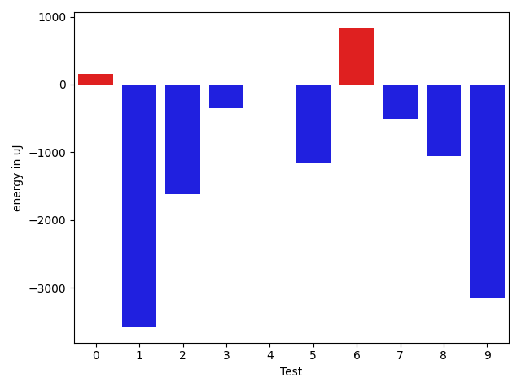

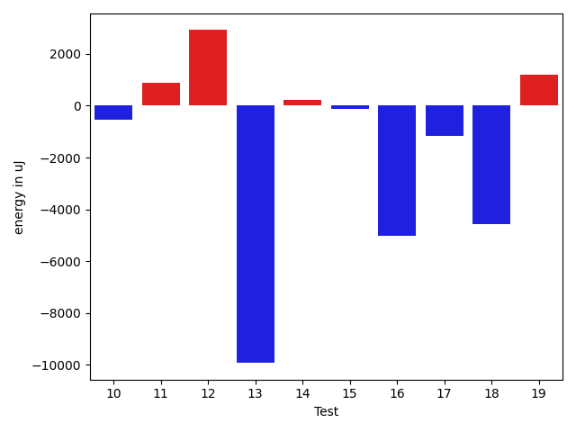

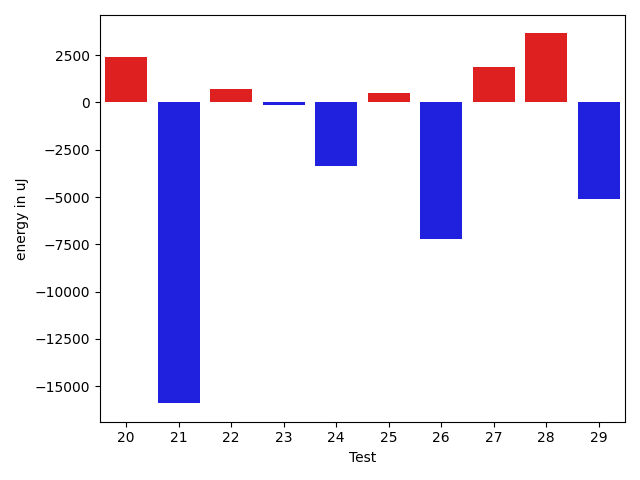

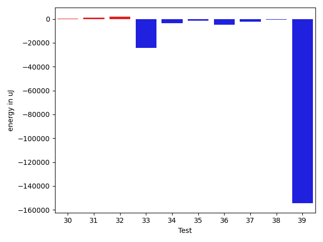

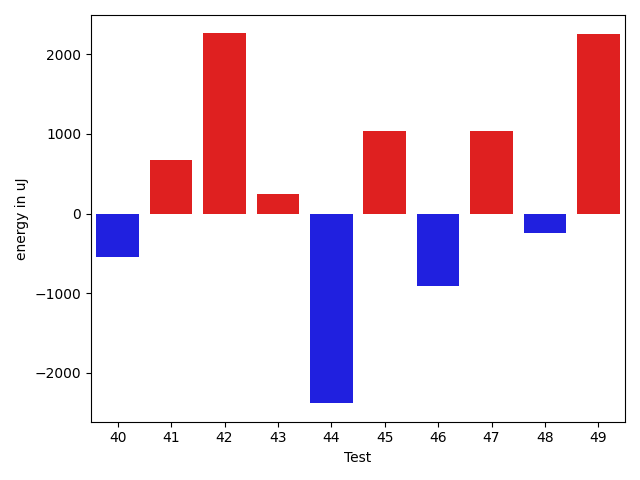

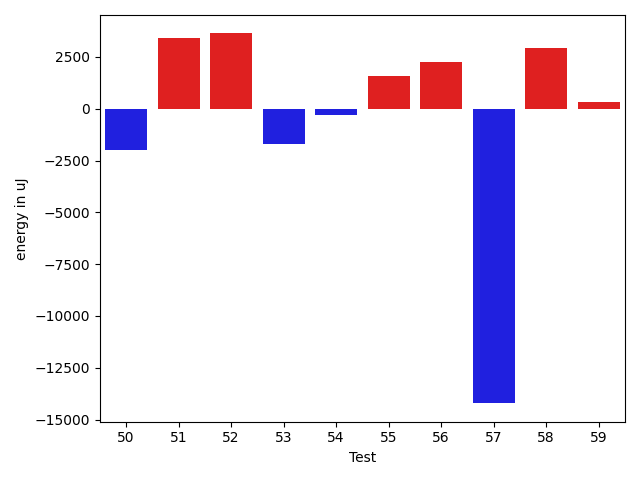

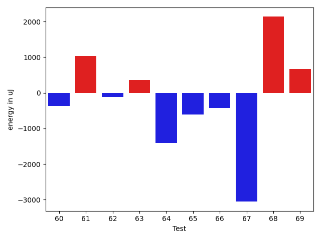

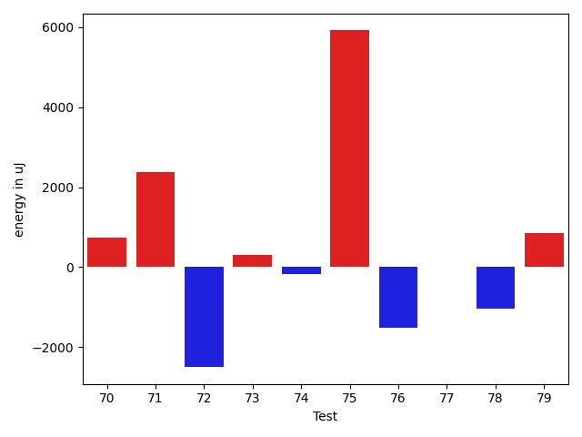

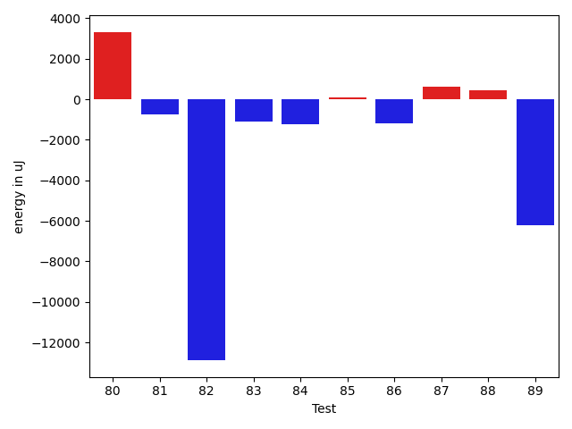

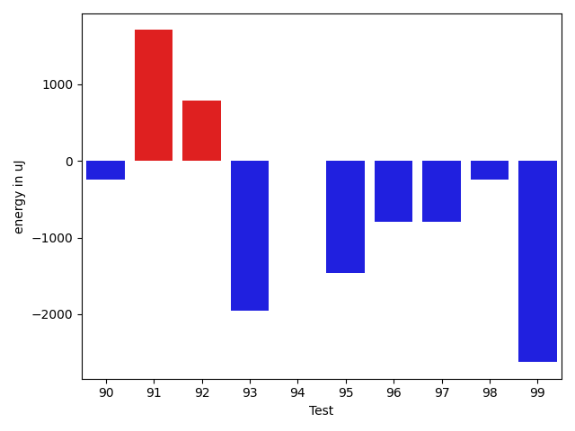

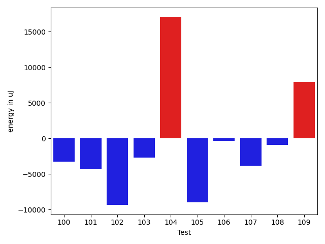

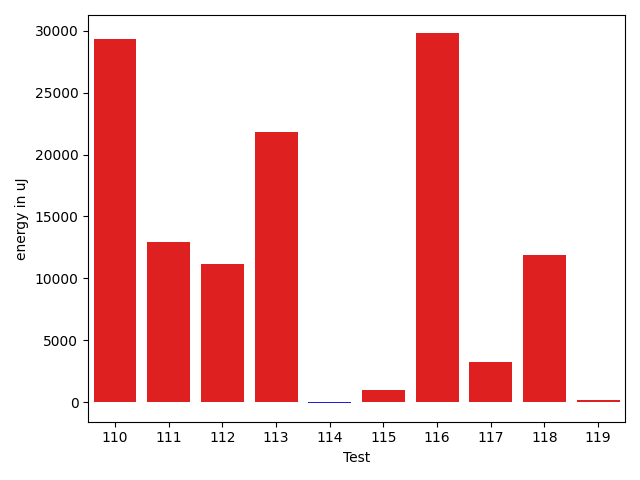

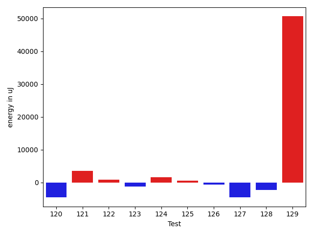

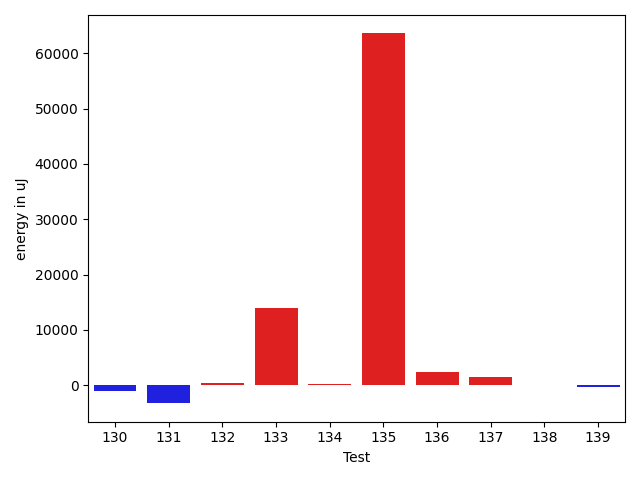

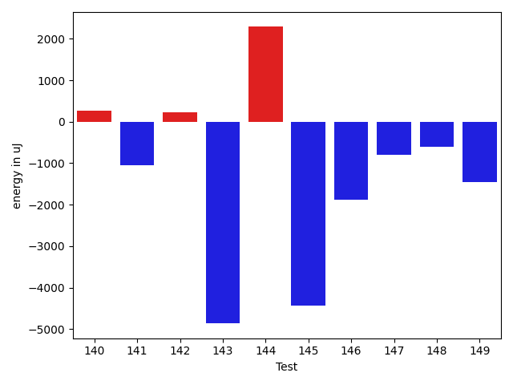

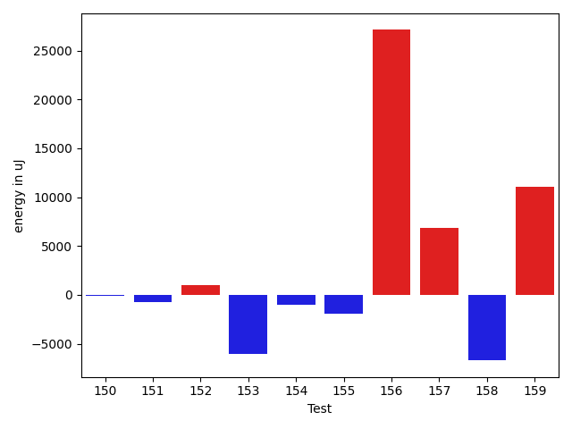

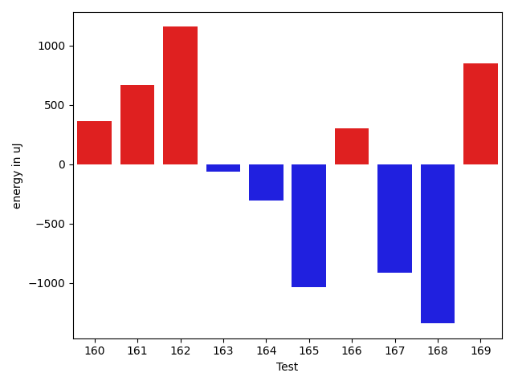

| ID | EnergyV1 | EnergyV2 | DeltaEnergy | σV1 | σV2 |
| --- | --- | --- | --- | --- | --- |
| 0 | 33386 | 33753 | 367 | 3041.4895563010627 | 3715.7009112981928 |
| 1 | 34668 | 35034 | 366 | 25735.288600851927 | 23288.17485333455 |
| 2 | 35279 | 34545 | -734 | 17278.199680943002 | 15919.073190933894 |
| 3 | 33753 | 31860 | -1893 | 3181.0873566535633 | 3456.7821228798502 |
| 4 | 34302 | 34179 | -123 | 4578.8031139129125 | 3315.2793998598295 |
| 5 | 35340 | 34118 | -1222 | 4460.924510003244 | 3278.6384994384484 |
| 6 | 33325 | 34058 | 733 | 3197.3973931161845 | 3695.872068394106 |
| 7 | 34973 | 35645 | 672 | 4125.714331167392 | 3913.7741269351077 |
| 8 | 33874 | 33203 | -671 | 3553.0886775993217 | 3593.383443795236 |
| 9 | 42176 | 38024 | -4152 | 18171.086467369325 | 17529.309629942138 |
| 10 | 33691 | 33325 | -366 | 3885.3222247835565 | 3946.620787001063 |
| 11 | 35522 | 35035 | -487 | 11217.631655022155 | 12762.107199133465 |
| 12 | 34485 | 34485 | 0 | 25516.376638623315 | 31676.759190383666 |
| 13 | 36255 | 35705 | -550 | 79933.6094590526 | 61826.56779619474 |
| 14 | 35583 | 35156 | -427 | 6844.5806797378345 | 8435.078349217134 |
| 15 | 34301 | 33997 | -304 | 3301.01982584356 | 3196.0518329981915 |
| 16 | 33813 | 34668 | 855 | 35700.42143854601 | 2534.4369117880597 |
| 17 | 36988 | 37292 | 304 | 17019.036448654115 | 16746.079606865987 |
| 18 | 34912 | 35217 | 305 | 31524.193116640963 | 3071.585418727959 |
| 19 | 32837 | 34790 | 1953 | 3105.630625670697 | 3019.4074560184044 |
| 20 | 34484 | 33996 | -488 | 6589.033213893141 | 16145.00893685066 |
| 21 | 35522 | 34668 | -854 | 79066.29556041044 | 4750.952910760427 |
| 22 | 34118 | 34790 | 672 | 3326.4234523546456 | 3635.053146735524 |
| 23 | 34790 | 35217 | 427 | 3736.571830283333 | 2629.555316496874 |
| 24 | 36560 | 34790 | -1770 | 8561.432047895307 | 3310.070077238945 |
| 25 | 35217 | 35766 | 549 | 7372.201539055276 | 7903.206329136084 |
| 26 | 36316 | 35828 | -488 | 37924.17544063472 | 5279.6280727801895 |
| 27 | 34546 | 34607 | 61 | 3530.7919552580383 | 9153.00680846477 |
| 28 | 35034 | 34546 | -488 | 4438.861043230698 | 27318.22695176789 |
| 29 | 35584 | 35035 | -549 | 31307.521182929813 | 4082.4614465545014 |
| 30 | 34546 | 34912 | 366 | 3991.3063024528697 | 4125.372815943235 |
| 31 | 33996 | 34301 | 305 | 2111.8043564686573 | 2794.606655226817 |
| 32 | 33447 | 36377 | 2930 | 4463.778735110059 | 3806.8972759724015 |
| 33 | 41320 | 42847 | 1527 | 122953.31153538899 | 58800.946314508255 |
| 34 | 37110 | 35339 | -1771 | 12504.44005317102 | 8881.258127786128 |
| 35 | 36621 | 35767 | -854 | 8135.091202383274 | 4176.209832718349 |
| 36 | 37658 | 36072 | -1586 | 23905.009720782084 | 3699.5483655424223 |
| 37 | 36315 | 36194 | -121 | 13957.229373199207 | 11503.577480420263 |
| 38 | 36133 | 35095 | -1038 | 5397.367398254035 | 6421.828062554202 |
| 39 | 38452 | 36437 | -2015 | 634100.1326716859 | 277209.10033658735 |
| 40 | 37049 | 36499 | -550 | 4204.430883176144 | 245619.59244073895 |
| 41 | 34546 | 35217 | 671 | 26833.06578128913 | 4209.547884388022 |
| 42 | 35522 | 37781 | 2259 | 21566.120421465694 | 13448.717224440286 |
| 43 | 34606 | 34851 | 245 | 5786.07580852539 | 4479.9678192494885 |
| 44 | 94421 | 92041 | -2380 | 97768.93594131953 | 72997.53233539358 |
| 45 | 35889 | 36927 | 1038 | 9654.463041139465 | 10820.100939542883 |
| 46 | 71411 | 70496 | -915 | 28766.630910721513 | 25895.887163467924 |
| 47 | 36194 | 37231 | 1037 | 14591.585762504115 | 13819.728078684277 |
| 48 | 36011 | 35766 | -245 | 91230.62003695071 | 52116.90992629689 |
| 49 | 62988 | 65246 | 2258 | 37558.12031925345 | 35387.45052419843 |
| 50 | 36560 | 35706 | -854 | 17147.004099994607 | 15565.645171294362 |
| 51 | 70557 | 70740 | 183 | 38866.28369770071 | 39788.51801833152 |
| 52 | 35461 | 36438 | 977 | 9535.768159254452 | 28254.29049317229 |
| 53 | 35156 | 33691 | -1465 | 3599.824065764392 | 3371.134803130825 |
| 54 | 35340 | 34546 | -794 | 3658.2119945971604 | 3928.53779417665 |
| 55 | 34119 | 35096 | 977 | 2897.9715505419435 | 4262.920847485334 |
| 56 | 35095 | 35339 | 244 | 3987.974803223043 | 3894.985355346968 |
| 57 | 41443 | 55115 | 13672 | 69985.74281766247 | 43018.458948463194 |
| 58 | 36865 | 36255 | -610 | 9599.601390447257 | 15177.253868697288 |
| 59 | 35950 | 36560 | 610 | 4051.0904508872472 | 4671.773363298426 |
| 60 | 37476 | 37109 | -367 | 59382.89391224822 | 54499.732684079725 |
| 61 | 35584 | 36621 | 1037 | 2107.2561408650104 | 3545.124017480874 |
| 62 | 36987 | 36865 | -122 | 15667.213643003486 | 13077.13575058395 |
| 63 | 38452 | 38818 | 366 | 22391.04746691778 | 18444.74339760736 |
| 64 | 39550 | 38147 | -1403 | 99361.97382989853 | 66184.2399954168 |
| 65 | 37110 | 36499 | -611 | 5245.2497153509175 | 3655.641407989332 |
| 66 | 36255 | 35828 | -427 | 3627.426517251173 | 5337.724496583434 |
| 67 | 37781 | 34728 | -3053 | 4204.4928007919525 | 3957.6760008242213 |
| 68 | 38757 | 40894 | 2137 | 41196.34902507029 | 59020.2949531848 |
| 69 | 36743 | 37414 | 671 | 39777.88232747 | 78654.31443830693 |
| 70 | 36560 | 37293 | 733 | 5485.07689970371 | 8897.840945637112 |
| 71 | 34241 | 36621 | 2380 | 4695.897456776096 | 7620.803297549801 |
| 72 | 40527 | 38025 | -2502 | 12947.224868379613 | 11539.454686224059 |
| 73 | 38818 | 39123 | 305 | 9917.539924131122 | 25397.15071792409 |
| 74 | 38696 | 38513 | -183 | 15964.955277189953 | 15790.882175998417 |
| 75 | 70190 | 76110 | 5920 | 72943.12908399271 | 119286.3922414216 |
| 76 | 39185 | 37659 | -1526 | 21028.67552021221 | 20609.39831009545 |
| 77 | 35156 | 35156 | 0 | 3948.5857056457485 | 3773.5200605616155 |
| 78 | 38086 | 37048 | -1038 | 19719.436451260626 | 7364.755676106053 |
| 79 | 38024 | 38879 | 855 | 60545.01919064723 | 70380.18473519856 |
| 80 | 37964 | 36987 | -977 | 105024.03846560558 | 111372.16750538551 |
| 81 | 72693 | 72509 | -184 | 32843.186843355325 | 31918.706874690153 |
| 82 | 88013 | 81542 | -6471 | 292966.86658049974 | 289976.881727534 |
| 83 | 35095 | 34363 | -732 | 3884.695218592834 | 3423.0814944418175 |
| 84 | 35584 | 34546 | -1038 | 3803.4036727993894 | 3379.0773258424815 |
| 85 | 35705 | 36927 | 1222 | 4030.179027547392 | 3453.106693956002 |
| 86 | 35766 | 35095 | -671 | 3396.635181818522 | 3144.0265454298165 |
| 87 | 36194 | 36743 | 549 | 2646.12049864199 | 3996.7129383449455 |
| 88 | 33935 | 33142 | -793 | 3648.3049362907245 | 3544.181400897693 |
| 89 | 38147 | 35705 | -2442 | 59086.9082228839 | 54244.35770305064 |
| 90 | 39490 | 39246 | -244 | 383459.162430153 | 291694.4676546353 |
| 91 | 36804 | 38513 | 1709 | 4029.1702928934324 | 4054.011621259382 |
| 92 | 162109 | 162902 | 793 | 210608.45771073576 | 319658.8873777503 |
| 93 | 36926 | 34973 | -1953 | 25305.188857600446 | 17765.797514145244 |
| 94 | 36132 | 36133 | 1 | 4236.204751161328 | 4141.805435497909 |
| 95 | 38696 | 37231 | -1465 | 28429.691915632317 | 28398.732001598437 |
| 96 | 37109 | 36316 | -793 | 4111.0486830128975 | 3495.6157551339616 |
| 97 | 35828 | 35034 | -794 | 8416.513837367771 | 6219.520175906327 |
| 98 | 37476 | 37231 | -245 | 55872.9072890066 | 78441.79239572378 |
| 99 | 37292 | 34668 | -2624 | 5293.0788316578055 | 15920.025706444583 |
| 100 | 38574 | 37597 | -977 | 25826.738216531245 | 27654.429741078 |
| 101 | 36498 | 37292 | 794 | 30282.340342946485 | 3925.835639423034 |
| 102 | 39306 | 37781 | -1525 | 70011.97297273116 | 61827.45290586267 |
| 103 | 37964 | 38025 | 61 | 17380.51762133264 | 10755.205918047315 |
| 104 | 38269 | 38879 | 610 | 88484.60857064644 | 121124.1213258258 |
| 105 | 117980 | 125549 | 7569 | 144543.15013177771 | 92888.57708980686 |
| 106 | 36560 | 36499 | -61 | 3335.2411391571877 | 3706.955890641856 |
| 107 | 36987 | 35767 | -1220 | 21068.605074316463 | 14126.987470118618 |
| 108 | 37109 | 36621 | -488 | 6140.3105330412145 | 3724.460834387583 |
| 109 | 39612 | 41931 | 2319 | 56940.79365406655 | 60802.654797128474 |
| 110 | 225464 | 247802 | 22338 | 78169.50674375518 | 83197.0689940646 |
| 111 | 352783 | 369872 | 17089 | 131997.96683589995 | 132455.16992605838 |
| 112 | 40100 | 64148 | 24048 | 50914.88594253926 | 60366.97901921492 |
| 113 | 38025 | 42175 | 4150 | 510234.4340391204 | 480747.85098873667 |
| 114 | 35705 | 36499 | 794 | 6343.252061050718 | 5096.270958488628 |
| 115 | 36682 | 37353 | 671 | 7085.921360861854 | 6630.4395540318 |
| 116 | 38208 | 39063 | 855 | 388036.59679301915 | 461497.71940232714 |
| 117 | 37903 | 39062 | 1159 | 60477.29661208583 | 72198.83207268662 |
| 118 | 38574 | 39612 | 1038 | 56994.26467039796 | 69150.2530550408 |
| 119 | 37110 | 37414 | 304 | 4460.462526068394 | 4159.618441066382 |
| 120 | 36804 | 36377 | -427 | 27753.205416555218 | 6788.273882454247 |
| 121 | 83740 | 83313 | -427 | 28468.530602295064 | 32753.921796012208 |
| 122 | 36621 | 36682 | 61 | 7904.421873142649 | 19968.34127299524 |
| 123 | 37171 | 36010 | -1161 | 12365.824450845623 | 12789.694927651704 |
| 124 | 38086 | 37598 | -488 | 16616.82193112689 | 25273.7613388115 |
| 125 | 37415 | 37170 | -245 | 3753.040122585382 | 2973.9978285134844 |
| 126 | 35828 | 35705 | -123 | 3787.5769494170154 | 2839.113457436072 |
| 127 | 37598 | 37964 | 366 | 24397.234409966302 | 14764.02492214925 |
| 128 | 38269 | 38818 | 549 | 43048.89535061016 | 36072.04331129653 |
| 129 | 39245 | 41687 | 2442 | 441305.43864131183 | 497765.2521299574 |
| 130 | 37902 | 37476 | -426 | 6265.767391426227 | 3915.7189664138823 |
| 131 | 40711 | 36560 | -4151 | 4524.208227037879 | 3796.1949818554704 |
| 132 | 36254 | 37902 | 1648 | 3850.399878908683 | 3906.7998952592434 |
| 133 | 36499 | 38513 | 2014 | 22938.330083048524 | 38027.934339351996 |
| 134 | 37109 | 37841 | 732 | 3849.6712370523837 | 4719.307383758549 |
| 135 | 38208 | 39001 | 793 | 3368.6016971503645 | 130026.50191548777 |
| 136 | 36255 | 37048 | 793 | 6594.681077832773 | 11362.557465867189 |
| 137 | 36010 | 38452 | 2442 | 4227.537991221562 | 4468.230440514434 |
| 138 | 38146 | 38330 | 184 | 12215.74516318558 | 12022.934417600574 |
| 139 | 36255 | 35949 | -306 | 4739.563059890404 | 3991.640420929721 |
| 140 | 35645 | 34729 | -916 | 3432.5499927797264 | 3935.5994229742714 |
| 141 | 36193 | 35278 | -915 | 7966.900958437829 | 8046.5067642448885 |
| 142 | 36560 | 36743 | 183 | 3904.7658554518293 | 3942.895345829148 |
| 143 | 37476 | 37415 | -61 | 27457.936935929836 | 2742.7814330150495 |
| 144 | 37781 | 37475 | -306 | 25962.36729310082 | 26245.850194939685 |
| 145 | 39307 | 38391 | -916 | 33643.19026343826 | 18146.66278202069 |
| 146 | 37232 | 35217 | -2015 | 3870.8459290699266 | 4390.607354574173 |
| 147 | 37353 | 36560 | -793 | 3402.008481264739 | 5942.669104164997 |
| 148 | 36743 | 35584 | -1159 | 3465.3753512630888 | 3598.8160487137066 |
| 149 | 37414 | 35523 | -1891 | 3332.1281409183534 | 3986.1506179911585 |
| 150 | 39978 | 39551 | -427 | 58992.35810717822 | 75107.00377749513 |
| 151 | 39489 | 39489 | 0 | 19919.177591659853 | 20602.653708126767 |
| 152 | 36987 | 36682 | -305 | 3689.827873632363 | 4323.896811005348 |
| 153 | 39185 | 37780 | -1405 | 35031.50324048066 | 23411.435402209678 |
| 154 | 36805 | 36133 | -672 | 6477.166773913717 | 4017.416142022359 |
| 155 | 38818 | 37537 | -1281 | 59099.71760027368 | 58952.74187930525 |
| 156 | 38696 | 40710 | 2014 | 5418.980601525329 | 83681.65294050015 |
| 157 | 82092 | 81421 | -671 | 80142.92367036174 | 89990.7942019632 |
| 158 | 39184 | 37170 | -2014 | 28925.174241655892 | 11536.953007707052 |
| 159 | 39062 | 38819 | -243 | 73282.43296575366 | 90743.21822881325 |
| 160 | 36682 | 37048 | 366 | 3941.8624692913736 | 4663.267028663792 |
| 161 | 37232 | 37902 | 670 | 30374.23253818973 | 48895.24102780397 |
| 162 | 35950 | 37109 | 1159 | 29720.58329976663 | 5331.643226060798 |
| 163 | 39185 | 39124 | -61 | 397367.217879192 | 308678.7356681108 |
| 164 | 37842 | 37536 | -306 | 9908.99257121105 | 9168.515518222617 |
| 165 | 37597 | 36560 | -1037 | 65063.69975320241 | 3490.3695870447114 |
| 166 | 37842 | 38147 | 305 | 3886.9245856613834 | 4844.919312830922 |
| 167 | 38391 | 37475 | -916 | 61369.655262413675 | 76844.16110702195 |
| 168 | 39368 | 38025 | -1343 | 63477.18303366879 | 67061.30750826583 |
| 169 | 36744 | 37598 | 854 | 26254.52349522711 | 11493.313844744122 |

## Delta Duration per test method

| ID | DurationV1 | DurationsV2 | DeltaDuration |
| --- | --- | --- | --- |
| 0 | 515177.4285714286 | 671155.1666666666 | 155977.73809523805 |
| 1 | 1507140.8072289156 | 1323140.7727272727 | -184000.03450164292 |
| 2 | 1297170.2337662338 | 1265171.0 | -31999.23376623378 |
| 3 | 448342.36363636365 | 554929.7777777778 | 106587.4141414141 |
| 4 | 695361.3414634146 | 773097.7647058824 | 77736.4232424678 |
| 5 | 536448.5862068966 | 540666.775 | 4218.1887931034435 |
| 6 | 729505.8888888889 | 731282.8478260869 | 1776.95893719804 |
| 7 | 478078.36 | 488731.0 | 10652.640000000014 |
| 8 | 572932.8387096775 | 539130.2972972973 | -33802.541412380175 |
| 9 | 1639519.1855670102 | 1594539.9157894736 | -44979.269777536625 |
| 10 | 807365.8596491228 | 803134.7833333333 | -4231.0763157894835 |
| 11 | 1149773.5857142857 | 1112532.1492537314 | -37241.43646055437 |
| 12 | 703189.2285714286 | 712093.1666666666 | 8903.93809523806 |
| 13 | 1398505.0208333333 | 1024563.1707317074 | -373941.8501016259 |
| 14 | 973669.1578947369 | 918495.6724137932 | -55173.485480943695 |
| 15 | 734717.1428571428 | 613125.4324324324 | -121591.71042471041 |
| 16 | 850598.9428571429 | 656522.5789473684 | -194076.36390977446 |
| 17 | 1447627.0666666667 | 1383752.2747252746 | -63874.791941392 |
| 18 | 794178.59375 | 602617.3793103448 | -191561.2144396552 |
| 19 | 553416.8181818182 | 611700.925925926 | 58284.10774410772 |
| 20 | 637686.8846153846 | 910852.7777777778 | 273165.8931623931 |
| 21 | 1100980.7045454546 | 672038.1621621621 | -428942.54238329246 |
| 22 | 740483.7083333334 | 738708.6571428571 | -1775.0511904762825 |
| 23 | 905031.8333333334 | 865455.5106382979 | -39576.32269503549 |
| 24 | 950104.7234042553 | 808307.0833333334 | -141797.64007092197 |
| 25 | 1028571.5142857142 | 1072690.1408450704 | 44118.62655935611 |
| 26 | 958002.75 | 579867.1290322581 | -378135.62096774194 |
| 27 | 837743.0 | 755128.4444444445 | -82614.5555555555 |
| 28 | 736148.0555555555 | 829997.717948718 | 93849.66239316249 |
| 29 | 861963.0833333334 | 685134.5 | -176828.58333333337 |
| 30 | 633436.75 | 576624.696969697 | -56812.05303030298 |
| 31 | 478415.3 | 481524.6818181818 | 3109.381818181835 |
| 32 | 683950.5588235294 | 634654.5789473684 | -49295.97987616097 |
| 33 | 2728333.414141414 | 1941453.3232323232 | -786880.090909091 |
| 34 | 1189518.589041096 | 1116502.8985507246 | -73015.69049037131 |
| 35 | 913808.828125 | 1008703.5873015873 | 94894.75917658734 |
| 36 | 955430.8148148148 | 748611.2727272727 | -206819.54208754213 |
| 37 | 1075668.4923076923 | 1001546.593220339 | -74121.89908735326 |
| 38 | 1071074.7272727273 | 906080.8970588235 | -164993.8302139038 |
| 39 | 6043832.104166667 | 2118350.0 | -3925482.104166667 |
| 40 | 867240.9230769231 | 1981872.6530612244 | 1114631.7299843011 |
| 41 | 1090339.119402985 | 997996.4477611941 | -92342.671641791 |
| 42 | 1364776.1595744682 | 1317098.712643678 | -47677.44693079009 |
| 43 | 1072652.7160493827 | 1065648.463414634 | -7004.252634748584 |
| 44 | 3735657.767676768 | 3354648.202020202 | -381009.56565656606 |
| 45 | 1230715.4505494505 | 1241883.4361702127 | 11167.985620762222 |
| 46 | 2458550.1818181816 | 2350881.303030303 | -107668.87878787844 |
| 47 | 1397642.268041237 | 1384591.8865979381 | -13050.381443298887 |
| 48 | 2161272.1235955055 | 1614930.3764705881 | -546341.7471249173 |
| 49 | 2174520.97979798 | 2098135.878787879 | -76385.10101010092 |
| 50 | 1382413.448275862 | 1358685.7261904762 | -23727.722085385816 |
| 51 | 2593746.303030303 | 2627583.0303030303 | 33836.72727272706 |
| 52 | 1291492.7826086956 | 1347294.1847826086 | 55801.402173913084 |
| 53 | 835259.3265306122 | 829681.551724138 | -5577.774806474219 |
| 54 | 847107.5423728813 | 819639.5 | -27468.04237288132 |
| 55 | 507592.47826086957 | 531784.7741935484 | 24192.295932678797 |
| 56 | 519845.76470588235 | 450097.21428571426 | -69748.55042016809 |
| 57 | 2587436.2093023257 | 2150977.688172043 | -436458.5211302829 |
| 58 | 885293.387755102 | 897941.9459459459 | 12648.558190843905 |
| 59 | 484674.95238095237 | 442246.1666666667 | -42428.78571428568 |
| 60 | 1637014.4305555555 | 1407135.8793103448 | -229878.5512452107 |
| 61 | 521029.8947368421 | 481839.3333333333 | -39190.561403508764 |
| 62 | 1258297.536585366 | 1219022.0952380951 | -39275.44134727074 |
| 63 | 1523499.6744186047 | 1392954.0333333334 | -130545.64108527126 |
| 64 | 2295199.9056603773 | 1537190.7142857143 | -758009.191374663 |
| 65 | 612081.5416666666 | 567939.4705882353 | -44142.07107843133 |
| 66 | 695082.8918918918 | 628025.9655172414 | -67056.92637465044 |
| 67 | 551494.7894736842 | 489589.3 | -61905.48947368417 |
| 68 | 1701701.191919192 | 2075033.8453608248 | 373332.65344163286 |
| 69 | 1063585.4603174604 | 2063855.641509434 | 1000270.1811919736 |
| 70 | 806353.5 | 1066002.5869565217 | 259649.08695652173 |
| 71 | 636254.1153846154 | 752284.5581395349 | 116030.44275491952 |
| 72 | 1068913.4117647058 | 849991.1111111111 | -218922.30065359466 |
| 73 | 1085954.6065573771 | 1315155.115942029 | 229200.5093846519 |
| 74 | 1058489.4827586208 | 1210280.262295082 | 151790.77953646122 |
| 75 | 2704456.9393939395 | 3418399.93877551 | 713942.9993815706 |
| 76 | 1528599.4590163934 | 1405759.3396226414 | -122840.11939375196 |
| 77 | 625530.4523809524 | 648682.8125 | 23152.360119047575 |
| 78 | 1341322.2142857143 | 1150394.1621621621 | -190928.0521235522 |
| 79 | 1425563.108695652 | 1513414.1875 | 87851.0788043479 |
| 80 | 2171400.65625 | 2199591.947368421 | 28191.291118421126 |
| 81 | 2436498.02020202 | 2484421.282828283 | 47923.26262626285 |
| 82 | 5051825.656565657 | 4840765.343434343 | -211060.31313131377 |
| 83 | 655193.6111111111 | 636309.6052631579 | -18884.00584795326 |
| 84 | 856883.4375 | 821033.5614035088 | -35849.876096491236 |
| 85 | 653468.1538461539 | 643905.84375 | -9562.310096153873 |
| 86 | 663213.5428571429 | 618113.0 | -45100.542857142864 |
| 87 | 655557.7 | 621545.3448275862 | -34012.35517241375 |
| 88 | 563948.0 | 708312.925925926 | 144364.92592592596 |
| 89 | 1399270.388888889 | 1227533.2162162163 | -171737.17267267266 |
| 90 | 2924539.3066666666 | 2640081.45 | -284457.85666666646 |
| 91 | 694931.7941176471 | 702083.9714285714 | 7152.177310924279 |
| 92 | 6088671.424242424 | 7563749.393939394 | 1475077.9696969697 |
| 93 | 1054500.4929577464 | 1062702.8307692308 | 8202.337811484467 |
| 94 | 921753.9347826086 | 883435.2459016393 | -38318.688880969305 |
| 95 | 929710.7608695652 | 1249570.388888889 | 319859.6280193238 |
| 96 | 868073.9347826086 | 848912.1929824562 | -19161.741800152464 |
| 97 | 972774.3174603175 | 1027763.625 | 54989.307539682486 |
| 98 | 1312628.4259259258 | 1844233.4464285714 | 531605.0205026455 |
| 99 | 725225.0243902439 | 877228.8695652174 | 152003.84517497348 |
| 100 | 1436025.98630137 | 1418219.6065573771 | -17806.379743992817 |
| 101 | 897313.4634146341 | 718086.9814814815 | -179226.48193315265 |
| 102 | 1889052.4642857143 | 1535257.0333333334 | -353795.4309523809 |
| 103 | 1006581.490909091 | 983371.64 | -23209.85090909095 |
| 104 | 1757256.5192307692 | 2433975.914893617 | 676719.3956628477 |
| 105 | 4739458.021978022 | 4658343.086021505 | -81114.9359565163 |
| 106 | 633213.6285714286 | 608762.7567567568 | -24450.871814671787 |
| 107 | 908525.7804878049 | 755964.8636363636 | -152560.91685144126 |
| 108 | 586097.8571428572 | 538803.0606060605 | -47294.79653679661 |
| 109 | 1726857.141304348 | 2090407.0 | 363549.8586956521 |
| 110 | 6793520.868686869 | 7468559.767676768 | 675038.8989898991 |
| 111 | 10660127.707070706 | 10920588.757575758 | 260461.0505050514 |
| 112 | 1920085.7171717172 | 2235752.1717171716 | 315666.45454545435 |
| 113 | 4340272.984848484 | 5486491.695652174 | 1146218.7108036894 |
| 114 | 946220.9836065574 | 1022475.9701492537 | 76254.98654269637 |
| 115 | 912688.7118644068 | 909570.2727272727 | -3118.439137134119 |
| 116 | 4792700.340909091 | 5357294.439024391 | 564594.0981152998 |
| 117 | 1442511.189189189 | 1461906.3 | 19395.110810810933 |
| 118 | 1093809.825 | 1405806.6578947369 | 311996.8328947369 |
| 119 | 755097.3414634146 | 687299.5294117647 | -67797.8120516499 |
| 120 | 1066507.347826087 | 956621.6206896552 | -109885.72713643173 |
| 121 | 2784319.404040404 | 2916296.303030303 | 131976.89898989908 |
| 122 | 988788.5573770492 | 1074859.2987012987 | 86070.74132424942 |
| 123 | 1050923.5844155843 | 1120883.2777777778 | 69959.69336219341 |
| 124 | 1170196.1509433961 | 1213106.7878787878 | 42910.636935391696 |
| 125 | 695513.5897435897 | 715340.6486486486 | 19827.05890505889 |
| 126 | 674447.5714285715 | 693824.5641025641 | 19376.992673992645 |
| 127 | 1373321.2 | 1368008.8292682928 | -5312.370731707197 |
| 128 | 1373970.8644067796 | 1365888.5714285714 | -8082.292978208279 |
| 129 | 3222911.8870967743 | 5119394.92 | 1896483.0329032256 |
| 130 | 700543.2647058824 | 797543.2903225806 | 97000.0256166982 |
| 131 | 469639.2083333333 | 580948.9130434783 | 111309.70471014496 |
| 132 | 465249.3 | 522746.73076923075 | 57497.43076923076 |
| 133 | 1147303.15 | 1629523.223880597 | 482220.073880597 |
| 134 | 765705.1454545455 | 803269.2142857143 | 37564.06883116881 |
| 135 | 627611.4210526316 | 2794107.6829268294 | 2166496.261874198 |
| 136 | 1053030.1666666667 | 1144364.2739726028 | 91334.10730593605 |
| 137 | 585511.7096774194 | 629545.7567567568 | 44034.04707933741 |
| 138 | 908713.1081081082 | 1082330.4130434783 | 173617.3049353701 |
| 139 | 781013.8545454545 | 882318.8333333334 | 101304.97878787888 |
| 140 | 576389.0 | 605197.2432432432 | 28808.243243243196 |
| 141 | 780649.3255813953 | 830846.1224489796 | 50196.796867584344 |
| 142 | 812972.358490566 | 769709.1590909091 | -43263.199399656965 |
| 143 | 753457.6 | 638227.5609756098 | -115230.03902439016 |
| 144 | 1330152.3720930233 | 1483861.7261904762 | 153709.35409745295 |
| 145 | 1089830.7948717948 | 1100202.925 | 10372.130128205288 |
| 146 | 646398.9583333334 | 589396.4285714285 | -57002.52976190485 |
| 147 | 702491.7708333334 | 748246.9791666666 | 45755.208333333256 |
| 148 | 769249.6304347826 | 782341.4318181818 | 13091.801383399172 |
| 149 | 657744.95 | 615504.0303030303 | -42240.91969696968 |
| 150 | 1384010.3333333333 | 1313124.1162790698 | -70886.21705426346 |
| 151 | 1575654.3548387096 | 1550406.6739130435 | -25247.68092566612 |
| 152 | 681206.6486486486 | 716871.4333333333 | 35664.78468468471 |
| 153 | 1143051.3043478262 | 1045120.7346938775 | -97930.56965394865 |
| 154 | 917961.5357142857 | 893994.7272727273 | -23966.808441558387 |
| 155 | 1496474.037037037 | 1301425.7586206896 | -195048.27841634746 |
| 156 | 984180.9803921569 | 1921152.5161290322 | 936971.5357368754 |
| 157 | 3292419.0808080807 | 3587726.787878788 | 295307.70707070734 |
| 158 | 989063.7567567568 | 870187.3428571429 | -118876.4138996139 |
| 159 | 1427175.576923077 | 1988611.641025641 | 561436.064102564 |
| 160 | 723361.4594594594 | 889305.6764705882 | 165944.21701112879 |
| 161 | 965940.1794871795 | 1340112.1914893617 | 374172.0120021822 |
| 162 | 938623.9428571429 | 806572.0 | -132051.9428571429 |
| 163 | 3674000.329113924 | 2295813.802631579 | -1378186.526482345 |
| 164 | 918401.6052631579 | 809858.027027027 | -108543.57823613088 |
| 165 | 953473.5945945946 | 667002.8055555555 | -286470.78903903905 |
| 166 | 622306.2424242424 | 655513.8787878788 | 33207.63636363635 |
| 167 | 1521574.825 | 1749914.3846153845 | 228339.55961538455 |
| 168 | 1657925.1315789474 | 1447627.1379310344 | -210297.99364791298 |
| 169 | 1202368.6666666667 | 855221.4761904762 | -347147.19047619053 |

## Misc.

| ID | Test Class | Test Method |
| --- | --- | --- |
| 0 | com.google.gson.functional.ObjectTest | testStringFieldWithEmptyValueDeserialization |
| 1 | com.google.gson.functional.ObjectTest | testEmptyCollectionInAnObjectDeserialization |
| 2 | com.google.gson.functional.ObjectTest | testStringFieldWithNumberValueDeserialization |
| 3 | com.google.gson.functional.ObjectTest | testPrimitiveArrayFieldSerialization |
| 4 | com.google.gson.functional.ObjectTest | testPrimitiveArrayInAnObjectDeserialization |
| 5 | com.google.gson.functional.ObjectTest | testStringFieldWithEmptyValueSerialization |
| 6 | com.google.gson.functional.ObjectTest | testInnerClassSerialization |
| 7 | com.google.gson.functional.ObjectTest | testClassWithObjectFieldSerialization |
| 8 | com.google.gson.functional.ObjectTest | testObjectFieldNamesWithoutQuotesDeserialization |
| 9 | com.google.gson.functional.ObjectTest | testArrayOfArraysSerialization |
| 10 | com.google.gson.functional.ObjectTest | testInnerClassDeserialization |
| 11 | com.google.gson.functional.ObjectTest | testArrayOfObjectsAsFields |
| 12 | com.google.gson.functional.ObjectTest | testNullArraysDeserialization |
| 13 | com.google.gson.functional.ObjectTest | testJsonInSingleQuotesDeserialization |
| 14 | com.google.gson.functional.ObjectTest | testNestedDeserialization |
| 15 | com.google.gson.functional.ObjectTest | testJsonInMixedQuotesDeserialization |
| 16 | com.google.gson.functional.ObjectTest | testNullPrimitiveFieldsDeserialization |
| 17 | com.google.gson.functional.ObjectTest | testArrayOfArraysDeserialization |
| 18 | com.google.gson.functional.ObjectTest | testNullFieldsSerialization |
| 19 | com.google.gson.functional.ObjectTest | testPrivateNoArgConstructorDeserialization |
| 20 | com.google.gson.functional.ObjectTest | testEmptyCollectionInAnObjectSerialization |
| 21 | com.google.gson.functional.ObjectTest | testBagOfPrimitiveWrappersDeserialization |
| 22 | com.google.gson.functional.ObjectTest | testNullFieldsDeserialization |
| 23 | com.google.gson.functional.ObjectTest | testArrayOfObjectsSerialization |
| 24 | com.google.gson.functional.ObjectTest | testNestedSerialization |
| 25 | com.google.gson.functional.ObjectTest | testArrayOfObjectsDeserialization |
| 26 | com.google.gson.functional.ObjectTest | testBagOfPrimitivesSerialization |
| 27 | com.google.gson.functional.ObjectTest | testClassWithTransientFieldsSerialization |
| 28 | com.google.gson.functional.ObjectTest | testBagOfPrimitivesDeserialization |
| 29 | com.google.gson.functional.ObjectTest | testBagOfPrimitiveWrappersSerialization |
| 30 | com.google.gson.functional.ObjectTest | testClassWithTransientFieldsDeserializationTransientFieldsPassedInJsonAreIgnored |
| 31 | com.google.gson.functional.ObjectTest | testNullObjectFieldsDeserialization |
| 32 | com.google.gson.functional.ObjectTest | testClassWithTransientFieldsDeserialization |
| 33 | com.google.gson.functional.CustomDeserializerTest | testDefaultConstructorNotCalledOnObject |
| 34 | com.google.gson.functional.CustomDeserializerTest | testJsonTypeFieldBasedDeserialization |
| 35 | com.google.gson.functional.CustomDeserializerTest | testCustomDeserializerReturnsNullForPrimitiveFields |
| 36 | com.google.gson.functional.CustomDeserializerTest | testDefaultConstructorNotCalledOnField |
| 37 | com.google.gson.functional.CustomDeserializerTest | testCustomDeserializerReturnsNull |
| 38 | com.google.gson.functional.CustomDeserializerTest | testCustomDeserializerReturnsNullForArrayElementsForArrayField |
| 39 | com.google.gson.FunctionWithInternalDependenciesTest | testUserDefinedExclusionPolicies |
| 40 | com.google.gson.FunctionWithInternalDependenciesTest | testAnonymousLocalClassesSerialization |
| 41 | com.google.gson.functional.ParameterizedTypesTest | testParameterizedTypeGenericArraysSerialization |
| 42 | com.google.gson.functional.ParameterizedTypesTest | testVariableTypeArrayDeserialization |
| 43 | com.google.gson.functional.ParameterizedTypesTest | testParameterizedTypeWithReaderDeserialization |
| 44 | com.google.gson.functional.ParameterizedTypesTest | testParameterizedTypesSerialization |
| 45 | com.google.gson.functional.ParameterizedTypesTest | testVariableTypeDeserialization |
| 46 | com.google.gson.functional.ParameterizedTypesTest | testVariableTypeFieldsAndGenericArraysSerialization |
| 47 | com.google.gson.functional.ParameterizedTypesTest | testParameterizedTypeGenericArraysDeserialization |
| 48 | com.google.gson.functional.ParameterizedTypesTest | testParameterizedTypeDeserialization |
| 49 | com.google.gson.functional.ParameterizedTypesTest | testVariableTypeFieldsAndGenericArraysDeserialization |
| 50 | com.google.gson.functional.ParameterizedTypesTest | testTypesWithMultipleParametersDeserialization |
| 51 | com.google.gson.functional.ParameterizedTypesTest | testTypesWithMultipleParametersSerialization |
| 52 | com.google.gson.functional.ParameterizedTypesTest | testParameterizedTypeWithVariableTypeDeserialization |
| 53 | com.google.gson.functional.ParameterizedTypesTest | testParameterizedTypesWithWriterSerialization |
| 54 | com.google.gson.functional.ParameterizedTypesTest | testDeepParameterizedTypeDeserialization |
| 55 | com.google.gson.functional.ParameterizedTypesTest | testDeepParameterizedTypeSerialization |
| 56 | com.google.gson.functional.InheritanceTest | testBaseSerializedAsBaseWhenSpecifiedWithExplicitType |
| 57 | com.google.gson.functional.InheritanceTest | testSubInterfacesOfCollectionSerialization |
| 58 | com.google.gson.functional.InheritanceTest | testClassWithBaseArrayFieldSerialization |
| 59 | com.google.gson.functional.InheritanceTest | testBaseSerializedAsSub |
| 60 | com.google.gson.functional.InheritanceTest | testSubClassDeserialization |
| 61 | com.google.gson.functional.InheritanceTest | testBaseSerializedAsSubWhenSpecifiedWithExplicitTypeForToJsonMethod |
| 62 | com.google.gson.functional.InheritanceTest | testSubInterfacesOfCollectionDeserialization |
| 63 | com.google.gson.functional.InheritanceTest | testSubClassSerialization |
| 64 | com.google.gson.functional.InheritanceTest | testBaseSerializedAsBaseWhenSpecifiedWithExplicitTypeForToJsonMethod |
| 65 | com.google.gson.functional.InheritanceTest | testBaseSerializedAsSubForToJsonMethod |
| 66 | com.google.gson.functional.InheritanceTest | testClassWithBaseFieldSerialization |
| 67 | com.google.gson.functional.InheritanceTest | testBaseSerializedAsSubWhenSpecifiedWithExplicitType |
| 68 | com.google.gson.functional.CircularReferenceTest | testCircularSerialization |
| 69 | com.google.gson.functional.CircularReferenceTest | testDirectedAcyclicGraphDeserialization |
| 70 | com.google.gson.functional.CircularReferenceTest | testDirectedAcyclicGraphSerialization |
| 71 | com.google.gson.functional.CircularReferenceTest | testSelfReferenceArrayFieldSerialization |
| 72 | com.google.gson.functional.CircularReferenceTest | testSelfReferenceSerialization |
| 73 | com.google.gson.functional.PrettyPrintingTest | testEmptyMapField |
| 74 | com.google.gson.functional.PrettyPrintingTest | testPrettyPrintArrayOfObjects |
| 75 | com.google.gson.functional.PrettyPrintingTest | testPrettyPrintList |
| 76 | com.google.gson.functional.MapTest | testMapSerializationWithNullValues |
| 77 | com.google.gson.functional.MapTest | testMapSerializationWithNullValuesSerialized |
| 78 | com.google.gson.functional.ReadersWritersTest | testReadWriteTwoObjects |
| 79 | com.google.gson.functional.ReadersWritersTest | testReaderForDeserialization |
| 80 | com.google.gson.functional.ReadersWritersTest | testWriterForSerialization |
| 81 | com.google.gson.functional.NamingPolicyTest | testGsonWithNonDefaultFieldNamingPolicySerialization |
| 82 | com.google.gson.functional.NamingPolicyTest | testGsonDuplicateNameUsingSerializedNameFieldNamingPolicySerialization |
| 83 | com.google.gson.functional.NamingPolicyTest | testGsonWithSerializedNameFieldNamingPolicyDeserialization |
| 84 | com.google.gson.functional.NamingPolicyTest | testGsonWithSerializedNameFieldNamingPolicySerialization |
| 85 | com.google.gson.functional.NamingPolicyTest | testGsonWithLowerCaseDashPolicyDeserialiation |
| 86 | com.google.gson.functional.NamingPolicyTest | testGsonWithLowerCaseUnderscorePolicyDeserialiation |
| 87 | com.google.gson.functional.NamingPolicyTest | testGsonWithLowerCaseDashPolicySerialization |
| 88 | com.google.gson.functional.NamingPolicyTest | testGsonWithLowerCaseUnderscorePolicySerialization |
| 89 | com.google.gson.functional.NamingPolicyTest | testGsonWithNonDefaultFieldNamingPolicyDeserialiation |
| 90 | com.google.gson.functional.FieldExclusionTest | testDefaultInnerClassExclusion |
| 91 | com.google.gson.functional.FieldExclusionTest | testDefaultNestedStaticClassIncluded |
| 92 | com.google.gson.functional.VersioningTest | testVersionedUntilSerialization |
| 93 | com.google.gson.functional.VersioningTest | testVersionedGsonMixingSinceAndUntilDeserialization |
| 94 | com.google.gson.functional.VersioningTest | testVersionedClassesDeserialization |
| 95 | com.google.gson.functional.VersioningTest | testVersionedGsonWithUnversionedClassesSerialization |
| 96 | com.google.gson.functional.VersioningTest | testVersionedClassesSerialization |
| 97 | com.google.gson.functional.VersioningTest | testVersionedGsonMixingSinceAndUntilSerialization |
| 98 | com.google.gson.functional.VersioningTest | testVersionedUntilDeserialization |
| 99 | com.google.gson.functional.VersioningTest | testVersionedGsonWithUnversionedClassesDeserialization |
| 100 | com.google.gson.functional.ArrayTest | testObjectArrayWithNonPrimitivesSerialization |
| 101 | com.google.gson.functional.ExposeFieldsTest | testNoExposedFieldDeserialization |
| 102 | com.google.gson.functional.ExposeFieldsTest | testExposeAnnotationSerialization |
| 103 | com.google.gson.functional.ExposeFieldsTest | testArrayWithOneNullExposeFieldObjectSerialization |
| 104 | com.google.gson.functional.ExposeFieldsTest | testExposeAnnotationDeserialization |
| 105 | com.google.gson.functional.ExposeFieldsTest | testNullExposeFieldSerialization |
| 106 | com.google.gson.functional.ExposeFieldsTest | testExposedInterfaceFieldDeserialization |
| 107 | com.google.gson.functional.ExposeFieldsTest | testExposedInterfaceFieldSerialization |
| 108 | com.google.gson.functional.ExposeFieldsTest | testNoExposedFieldSerialization |
| 109 | com.google.gson.functional.ConcurrencyTest | testSingleThreadSerialization |
| 110 | com.google.gson.functional.ConcurrencyTest | testMultiThreadSerialization |
| 111 | com.google.gson.functional.ConcurrencyTest | testMultiThreadDeserialization |
| 112 | com.google.gson.functional.ConcurrencyTest | testSingleThreadDeserialization |
| 113 | com.google.gson.functional.InstanceCreatorTest | testInstanceCreatorReturnsBaseType |
| 114 | com.google.gson.functional.InstanceCreatorTest | testInstanceCreatorReturnsSubTypeForField |
| 115 | com.google.gson.functional.InstanceCreatorTest | testInstanceCreatorReturnsSubTypeForTopLevelObject |
| 116 | com.google.gson.functional.SecurityTest | testNonExecutableJsonSerialization |
| 117 | com.google.gson.functional.SecurityTest | testNonExecutableJsonDeserialization |
| 118 | com.google.gson.functional.SecurityTest | testJsonWithNonExectuableTokenWithRegularGsonDeserialization |
| 119 | com.google.gson.functional.SecurityTest | testJsonWithNonExectuableTokenWithConfiguredGsonDeserialization |
| 120 | com.google.gson.functional.CustomTypeAdaptersTest | testCustomNestedDeserializers |
| 121 | com.google.gson.functional.CustomTypeAdaptersTest | testCustomTypeAdapterDoesNotAppliesToSubClasses |
| 122 | com.google.gson.functional.CustomTypeAdaptersTest | testCustomSerializerForLong |
| 123 | com.google.gson.functional.CustomTypeAdaptersTest | testCustomDeserializerForLong |
| 124 | com.google.gson.functional.CustomTypeAdaptersTest | testCustomNestedSerializers |
| 125 | com.google.gson.functional.CustomTypeAdaptersTest | testEnsureCustomSerializerNotInvokedForNullValues |
| 126 | com.google.gson.functional.CustomTypeAdaptersTest | testEnsureCustomDeserializerNotInvokedForNullValues |
| 127 | com.google.gson.functional.EscapingTest | testGsonAcceptsEscapedAndNonEscapedJsonDeserialization |
| 128 | com.google.gson.functional.EscapingTest | testEscapingObjectFields |
| 129 | com.google.gson.functional.CustomSerializerTest | testSubClassSerializerInvokedForBaseClassFieldsHoldingSubClassInstances |
| 130 | com.google.gson.functional.CustomSerializerTest | testSubClassSerializerInvokedForBaseClassFieldsHoldingArrayOfSubClassInstances |
| 131 | com.google.gson.functional.CustomSerializerTest | testBaseClassSerializerInvokedForBaseClassFields |
| 132 | com.google.gson.functional.CustomSerializerTest | testBaseClassSerializerInvokedForBaseClassFieldsHoldingSubClassInstances |
| 133 | com.google.gson.functional.JsonTreeTest | testJsonTreeToString |
| 134 | com.google.gson.functional.JsonTreeTest | testToJsonTreeObjectType |
| 135 | com.google.gson.functional.JsonTreeTest | testToJsonTree |
| 136 | com.google.gson.functional.DefaultTypeAdaptersTest | testUrlNullSerialization |
| 137 | com.google.gson.functional.DefaultTypeAdaptersTest | testBigDecimalFieldDeserialization |
| 138 | com.google.gson.functional.DefaultTypeAdaptersTest | testBigDecimalFieldSerialization |
| 139 | com.google.gson.functional.DefaultTypeAdaptersTest | testBigIntegerFieldSerialization |
| 140 | com.google.gson.functional.DefaultTypeAdaptersTest | testBigIntegerFieldDeserialization |
| 141 | com.google.gson.functional.DefaultTypeAdaptersTest | testUrlNullDeserialization |
| 142 | com.google.gson.functional.NullObjectAndFieldTest | testNullWrappedPrimitiveMemberSerialization |
| 143 | com.google.gson.functional.NullObjectAndFieldTest | testExplicitNullSetsFieldToNullDuringDeserialization |
| 144 | com.google.gson.functional.NullObjectAndFieldTest | testExplicitSerializationOfNullArrayMembers |
| 145 | com.google.gson.functional.NullObjectAndFieldTest | testExplicitDeserializationOfNulls |
| 146 | com.google.gson.functional.NullObjectAndFieldTest | testExplicitSerializationOfNullCollectionMembers |
| 147 | com.google.gson.functional.NullObjectAndFieldTest | testPrintPrintingObjectWithNulls |
| 148 | com.google.gson.functional.NullObjectAndFieldTest | testNullWrappedPrimitiveMemberDeserialization |
| 149 | com.google.gson.functional.NullObjectAndFieldTest | testExplicitSerializationOfNullStringMembers |
| 150 | com.google.gson.functional.NullObjectAndFieldTest | testExplicitSerializationOfNulls |
| 151 | com.google.gson.functional.CollectionTest | testWildcardCollectionField |
| 152 | com.google.gson.functional.CollectionTest | testRawCollectionSerialization |
| 153 | com.google.gson.functional.CollectionTest | testCollectionOfBagOfPrimitivesSerialization |
| 154 | com.google.gson.functional.CollectionTest | testSetDeserialization |
| 155 | com.google.gson.functional.CollectionTest | testSetSerialization |
| 156 | com.google.gson.functional.PrintFormattingTest | testCompactFormattingLeavesNoWhiteSpace |
| 157 | com.google.gson.functional.ExclusionStrategyFunctionalTest | testExclusionStrategySerialization |
| 158 | com.google.gson.functional.ExclusionStrategyFunctionalTest | testExclusionStrategyDeserialization |
| 159 | com.google.gson.functional.JsonParserTest | testDeserializingCustomTree |
| 160 | com.google.gson.functional.JsonParserTest | testBadFieldTypeForCustomDeserializerCustomTree |
| 161 | com.google.gson.functional.JsonParserTest | testChangingCustomTreeAndDeserializing |
| 162 | com.google.gson.functional.JsonParserTest | testBadFieldTypeForDeserializingCustomTree |
| 163 | com.google.gson.JsonParserTest | testReadWriteTwoObjects |
| 164 | com.google.gson.functional.EnumTest | testClassWithEnumFieldSerialization |
| 165 | com.google.gson.functional.EnumTest | testClassWithEnumFieldDeserialization |
| 166 | com.google.gson.functional.InterfaceTest | testSerializingInterfaceObjectField |
| 167 | com.google.gson.functional.InterfaceTest | testSerializingObjectImplementingInterface |
| 168 | com.google.gson.functional.UncategorizedTest | testObjectEqualButNotSameSerialization |
| 169 | com.google.gson.functional.UncategorizedTest | testStaticFieldsAreNotSerialized |

| Test | IterationV1 | IterationV2 | DeltaIteration |
| --- | --- | --- | --- |
| 0 | 21 | 30 | 9 |
| 1 | 83 | 88 | 5 |
| 2 | 77 | 76 | -1 |
| 3 | 22 | 18 | -4 |
| 4 | 41 | 34 | -7 |
| 5 | 29 | 40 | 11 |
| 6 | 54 | 46 | -8 |
| 7 | 25 | 18 | -7 |
| 8 | 31 | 37 | 6 |
| 9 | 97 | 95 | -2 |
| 10 | 57 | 60 | 3 |
| 11 | 70 | 67 | -3 |
| 12 | 35 | 36 | 1 |
| 13 | 48 | 41 | -7 |
| 14 | 57 | 58 | 1 |
| 15 | 35 | 37 | 2 |
| 16 | 35 | 19 | -16 |
| 17 | 90 | 91 | 1 |
| 18 | 32 | 29 | -3 |
| 19 | 33 | 27 | -6 |
| 20 | 26 | 18 | -8 |
| 21 | 44 | 37 | -7 |
| 22 | 48 | 35 | -13 |
| 23 | 54 | 47 | -7 |
| 24 | 47 | 48 | 1 |
| 25 | 70 | 71 | 1 |
| 26 | 28 | 31 | 3 |
| 27 | 34 | 36 | 2 |
| 28 | 36 | 39 | 3 |
| 29 | 36 | 38 | 2 |
| 30 | 36 | 33 | -3 |
| 31 | 20 | 22 | 2 |
| 32 | 34 | 38 | 4 |
| 33 | 99 | 99 | 0 |
| 34 | 73 | 69 | -4 |
| 35 | 64 | 63 | -1 |
| 36 | 54 | 44 | -10 |
| 37 | 65 | 59 | -6 |
| 38 | 55 | 68 | 13 |
| 39 | 48 | 55 | 7 |
| 40 | 52 | 49 | -3 |
| 41 | 67 | 67 | 0 |
| 42 | 94 | 87 | -7 |
| 43 | 81 | 82 | 1 |
| 44 | 99 | 99 | 0 |
| 45 | 91 | 94 | 3 |
| 46 | 99 | 99 | 0 |
| 47 | 97 | 97 | 0 |
| 48 | 89 | 85 | -4 |
| 49 | 99 | 99 | 0 |
| 50 | 87 | 84 | -3 |
| 51 | 99 | 99 | 0 |
| 52 | 92 | 92 | 0 |
| 53 | 49 | 58 | 9 |
| 54 | 59 | 54 | -5 |
| 55 | 23 | 31 | 8 |
| 56 | 17 | 14 | -3 |
| 57 | 86 | 93 | 7 |
| 58 | 49 | 37 | -12 |
| 59 | 21 | 18 | -3 |
| 60 | 72 | 58 | -14 |
| 61 | 19 | 21 | 2 |
| 62 | 82 | 84 | 2 |
| 63 | 86 | 90 | 4 |
| 64 | 53 | 49 | -4 |
| 65 | 24 | 17 | -7 |
| 66 | 37 | 29 | -8 |
| 67 | 19 | 20 | 1 |
| 68 | 99 | 97 | -2 |
| 69 | 63 | 53 | -10 |
| 70 | 56 | 46 | -10 |
| 71 | 26 | 43 | 17 |
| 72 | 17 | 27 | 10 |
| 73 | 61 | 69 | 8 |
| 74 | 58 | 61 | 3 |
| 75 | 99 | 98 | -1 |
| 76 | 61 | 53 | -8 |
| 77 | 42 | 32 | -10 |
| 78 | 70 | 74 | 4 |
| 79 | 46 | 48 | 2 |
| 80 | 32 | 38 | 6 |
| 81 | 99 | 99 | 0 |
| 82 | 99 | 99 | 0 |
| 83 | 36 | 38 | 2 |
| 84 | 48 | 57 | 9 |
| 85 | 39 | 32 | -7 |
| 86 | 35 | 28 | -7 |
| 87 | 30 | 29 | -1 |
| 88 | 28 | 27 | -1 |
| 89 | 36 | 37 | 1 |
| 90 | 75 | 80 | 5 |
| 91 | 34 | 35 | 1 |
| 92 | 99 | 99 | 0 |
| 93 | 71 | 65 | -6 |
| 94 | 46 | 61 | 15 |
| 95 | 46 | 36 | -10 |
| 96 | 46 | 57 | 11 |
| 97 | 63 | 64 | 1 |
| 98 | 54 | 56 | 2 |
| 99 | 41 | 46 | 5 |
| 100 | 73 | 61 | -12 |
| 101 | 41 | 54 | 13 |
| 102 | 28 | 30 | 2 |
| 103 | 55 | 50 | -5 |
| 104 | 52 | 47 | -5 |
| 105 | 91 | 93 | 2 |
| 106 | 35 | 37 | 2 |
| 107 | 41 | 44 | 3 |
| 108 | 21 | 33 | 12 |
| 109 | 92 | 93 | 1 |
| 110 | 99 | 99 | 0 |
| 111 | 99 | 99 | 0 |
| 112 | 99 | 99 | 0 |
| 113 | 66 | 69 | 3 |
| 114 | 61 | 67 | 6 |
| 115 | 59 | 55 | -4 |
| 116 | 44 | 41 | -3 |
| 117 | 37 | 40 | 3 |
| 118 | 40 | 38 | -2 |
| 119 | 41 | 34 | -7 |
| 120 | 69 | 58 | -11 |
| 121 | 99 | 99 | 0 |
| 122 | 61 | 77 | 16 |
| 123 | 77 | 72 | -5 |
| 124 | 53 | 66 | 13 |
| 125 | 39 | 37 | -2 |
| 126 | 35 | 39 | 4 |
| 127 | 80 | 82 | 2 |
| 128 | 59 | 63 | 4 |
| 129 | 62 | 50 | -12 |
| 130 | 34 | 31 | -3 |
| 131 | 24 | 23 | -1 |
| 132 | 20 | 26 | 6 |
| 133 | 60 | 67 | 7 |
| 134 | 55 | 56 | 1 |
| 135 | 38 | 41 | 3 |
| 136 | 72 | 73 | 1 |
| 137 | 31 | 37 | 6 |
| 138 | 37 | 46 | 9 |
| 139 | 55 | 54 | -1 |
| 140 | 36 | 37 | 1 |
| 141 | 43 | 49 | 6 |
| 142 | 53 | 44 | -9 |
| 143 | 40 | 41 | 1 |
| 144 | 86 | 84 | -2 |
| 145 | 39 | 40 | 1 |
| 146 | 24 | 35 | 11 |
| 147 | 48 | 48 | 0 |
| 148 | 46 | 44 | -2 |
| 149 | 20 | 33 | 13 |
| 150 | 30 | 43 | 13 |
| 151 | 93 | 92 | -1 |
| 152 | 37 | 30 | -7 |
| 153 | 46 | 49 | 3 |
| 154 | 56 | 55 | -1 |
| 155 | 54 | 58 | 4 |
| 156 | 51 | 62 | 11 |
| 157 | 99 | 99 | 0 |
| 158 | 37 | 35 | -2 |
| 159 | 26 | 39 | 13 |
| 160 | 37 | 34 | -3 |
| 161 | 39 | 47 | 8 |
| 162 | 35 | 50 | 15 |
| 163 | 79 | 76 | -3 |
| 164 | 38 | 37 | -1 |
| 165 | 37 | 36 | -1 |
| 166 | 33 | 33 | 0 |
| 167 | 40 | 39 | -1 |
| 168 | 38 | 29 | -9 |
| 169 | 33 | 21 | -12 |

| Time Label | Time (s) |
| --- | --- |
| Selection | 25.779399394989014 |
| Injection | 12.97316837310791 |
| Total | 1071.485681772232 |

