# gson e3af07

https://github.com/google/gson/commit/e3af07

## Delta Energy per test method

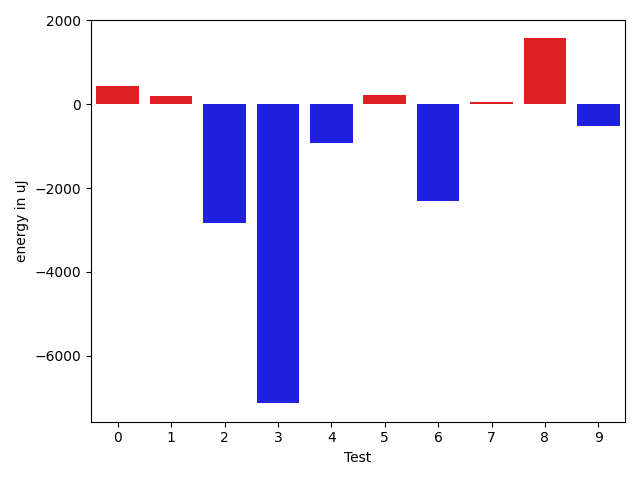

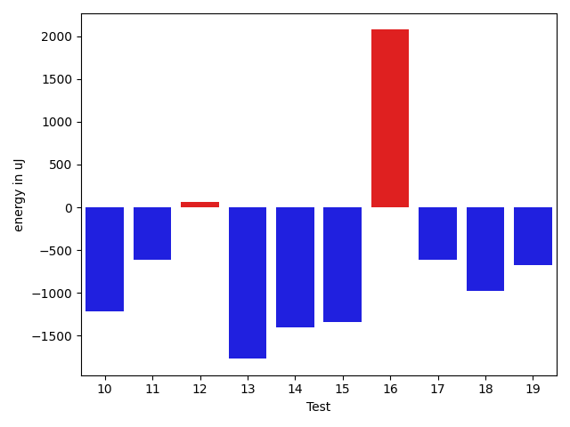

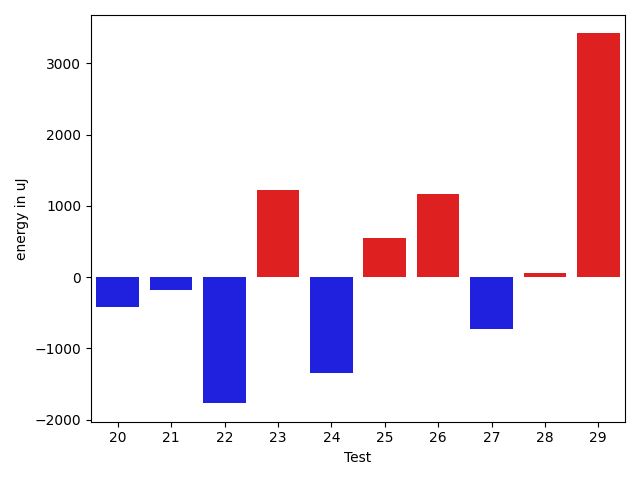

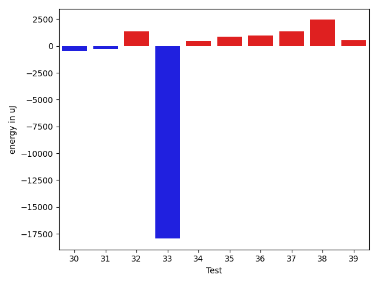

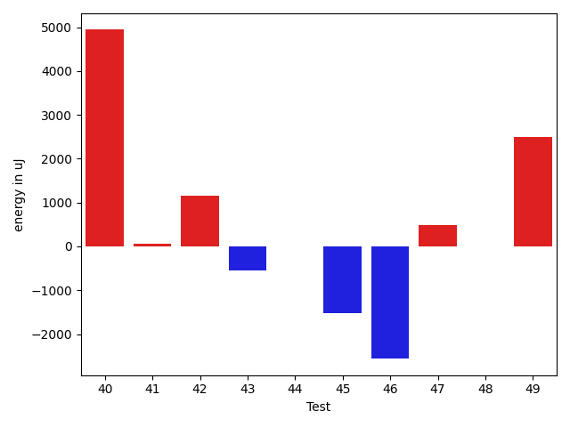

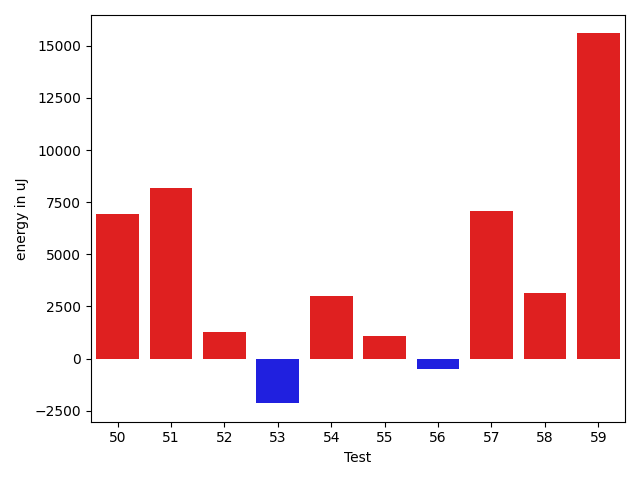

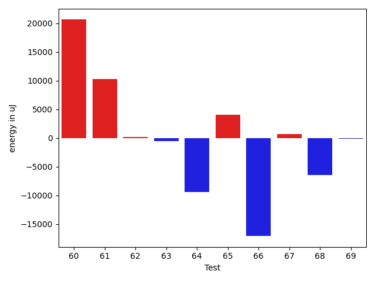

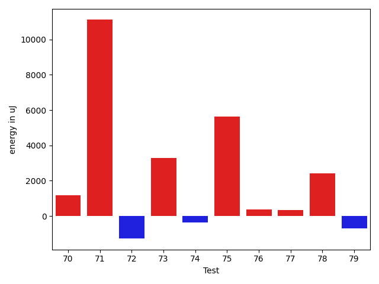

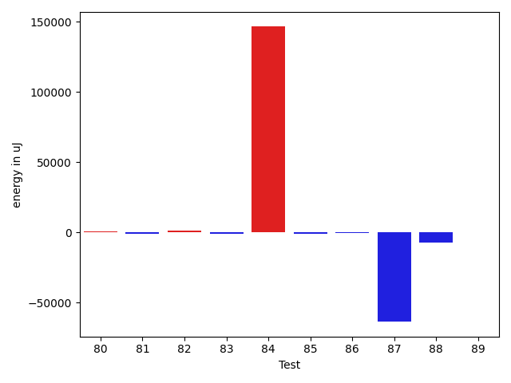

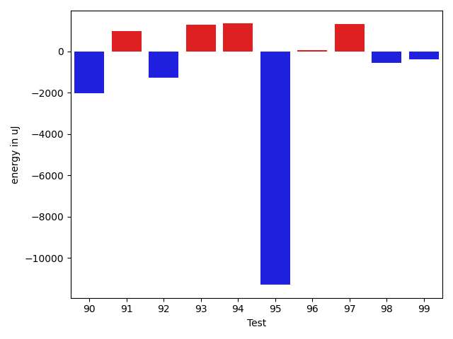

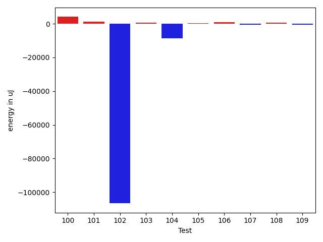

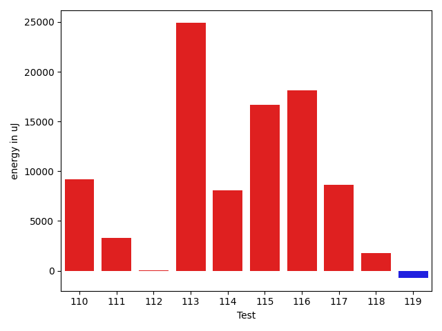

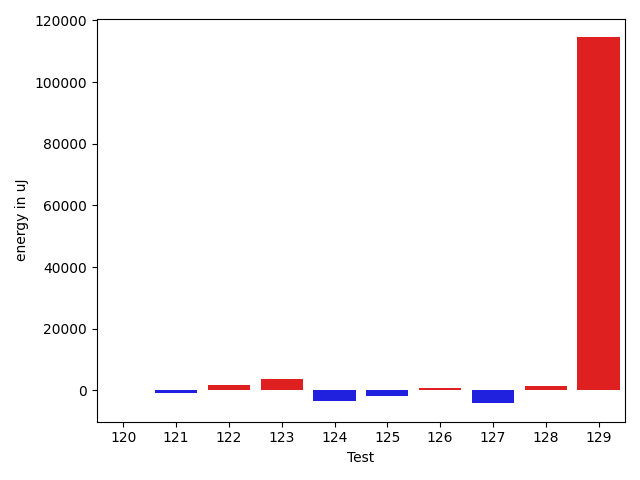

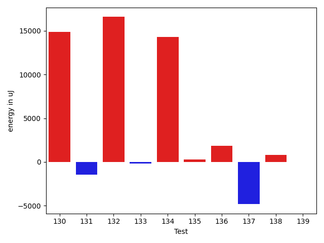

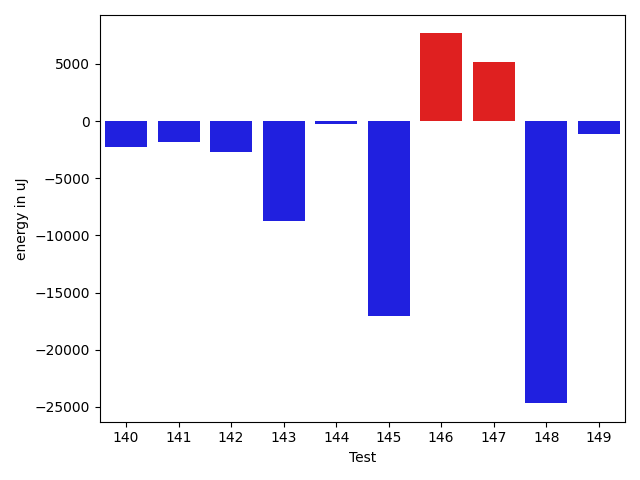

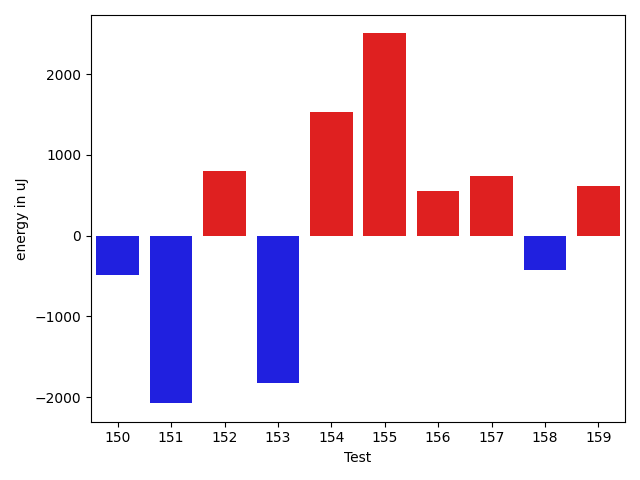

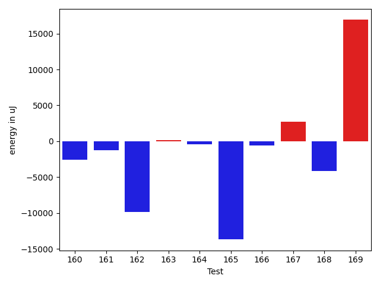

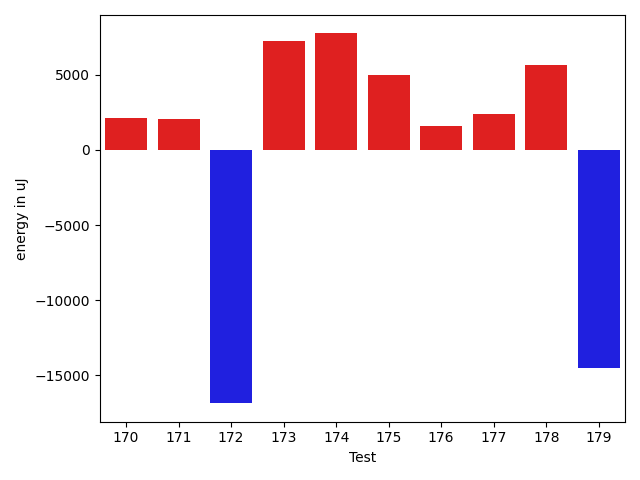

| ID | EnergyV1 | EnergyV2 | DeltaEnergy | σV1 | σV2 |
| --- | --- | --- | --- | --- | --- |
| 0 | 33569 | 33448 | -121 | 3680.08866508093 | 4850.758231818374 |
| 1 | 34790 | 35095 | 305 | 3986.179246804429 | 3689.8465357062905 |
| 2 | 36133 | 35828 | -305 | 28803.21097726594 | 22478.48308628506 |
| 3 | 36499 | 35767 | -732 | 31681.21221442405 | 9784.013226066923 |
| 4 | 36987 | 36743 | -244 | 16652.992658627685 | 14179.590026436477 |
| 5 | 35706 | 36255 | 549 | 19874.518531251684 | 18816.22006555928 |
| 6 | 37048 | 35096 | -1952 | 12601.536759936893 | 10766.140107348836 |
| 7 | 34546 | 34362 | -184 | 3462.2673625156126 | 3375.811127008657 |
| 8 | 33691 | 33935 | 244 | 3338.876259630292 | 7490.737927432961 |
| 9 | 35889 | 34851 | -1038 | 3499.2148215398192 | 2981.093278772399 |
| 10 | 35523 | 34302 | -1221 | 42432.91266563842 | 6832.250681586658 |
| 11 | 34790 | 34180 | -610 | 9078.103945513929 | 11477.889919898762 |
| 12 | 33996 | 34057 | 61 | 72063.3231601392 | 4434.174501694585 |
| 13 | 35583 | 33813 | -1770 | 12679.495795499883 | 7147.1492057742835 |
| 14 | 39428 | 38024 | -1404 | 17288.79360659158 | 27441.87561778996 |
| 15 | 35340 | 33997 | -1343 | 6264.333109100201 | 3515.2120804118604 |
| 16 | 33569 | 35644 | 2075 | 3150.642422610716 | 4276.185148176773 |
| 17 | 34607 | 33996 | -611 | 27211.26589334055 | 3662.5801034984797 |
| 18 | 34607 | 33630 | -977 | 10578.981362903656 | 3146.738164104744 |
| 19 | 35156 | 34485 | -671 | 104007.10336302733 | 35452.99085958757 |
| 20 | 35278 | 34851 | -427 | 27795.194120927525 | 6861.242554786784 |
| 21 | 35644 | 35461 | -183 | 3643.3586180325206 | 7644.271553479333 |
| 22 | 35645 | 33874 | -1771 | 4547.4122442531725 | 3949.4976971761866 |
| 23 | 33996 | 35217 | 1221 | 4139.181070095205 | 3899.900415661606 |
| 24 | 34912 | 33570 | -1342 | 9080.399907982517 | 7945.844278195574 |
| 25 | 35034 | 35583 | 549 | 3320.74128910755 | 3364.640583918759 |
| 26 | 34180 | 35340 | 1160 | 2960.871881726732 | 3631.9816568308206 |
| 27 | 35827 | 35095 | -732 | 95663.85775539461 | 89922.20033895195 |
| 28 | 34119 | 34180 | 61 | 3488.244697456865 | 3945.6034720849193 |
| 29 | 34546 | 37964 | 3418 | 3434.067033354876 | 81107.38719130335 |
| 30 | 36377 | 35949 | -428 | 79289.81852665554 | 3414.4185316482162 |
| 31 | 33752 | 33448 | -304 | 3217.7947198935794 | 3618.295028264642 |
| 32 | 33264 | 34606 | 1342 | 15431.771238951465 | 3568.5257568777615 |
| 33 | 61462 | 43518 | -17944 | 82544.52393825166 | 88804.41919563244 |
| 34 | 36071 | 36560 | 489 | 4641.281094174719 | 58740.91121662172 |
| 35 | 36621 | 37475 | 854 | 11448.431243466892 | 11514.669079337778 |
| 36 | 36560 | 37537 | 977 | 4809.9264834341975 | 26131.40174884185 |
| 37 | 36743 | 38086 | 1343 | 15956.215553736673 | 12862.292478185027 |
| 38 | 34973 | 37415 | 2442 | 3891.6944668985097 | 4401.559101297033 |
| 39 | 35400 | 35949 | 549 | 3711.43263783766 | 4510.988270084451 |
| 40 | 39245 | 44189 | 4944 | 52646.72718409679 | 44483.666551608476 |
| 41 | 37353 | 37415 | 62 | 76924.66945037815 | 76272.35929398953 |
| 42 | 35644 | 36804 | 1160 | 12040.017713023288 | 13239.774972030302 |
| 43 | 37110 | 36560 | -550 | 3301.4915862985326 | 4317.300154409453 |
| 44 | 37354 | 37353 | -1 | 17399.202690065056 | 17101.067708499253 |
| 45 | 36377 | 34851 | -1526 | 4063.5277176937498 | 3046.1188993152305 |
| 46 | 40771 | 38208 | -2563 | 84944.3541286416 | 61110.29595411028 |
| 47 | 34241 | 34729 | 488 | 3033.382298623106 | 3659.2381240955087 |
| 48 | 37475 | 37475 | 0 | 11298.385010678525 | 7448.4183540869935 |
| 49 | 34302 | 36804 | 2502 | 3000.463832455999 | 4774.860202832877 |
| 50 | 35645 | 37476 | 1831 | 3494.953271971442 | 28581.580464580784 |
| 51 | 38208 | 39978 | 1770 | 23464.474681126456 | 43571.07622196723 |
| 52 | 36255 | 36011 | -244 | 7513.726514277588 | 9116.679723247715 |
| 53 | 37170 | 35462 | -1708 | 4321.509503983662 | 4106.556232397622 |
| 54 | 35767 | 35949 | 182 | 42658.36200402821 | 48916.30505826334 |
| 55 | 35278 | 36682 | 1404 | 9625.261943719093 | 7738.017975913183 |
| 56 | 40283 | 41137 | 854 | 19328.799025743305 | 20982.779492558497 |
| 57 | 36560 | 36071 | -489 | 4347.518383947954 | 33059.04171728675 |
| 58 | 37231 | 37353 | 122 | 12241.626632019683 | 16975.229370962454 |
| 59 | 38696 | 39306 | 610 | 35797.22731598727 | 69029.37343318589 |
| 60 | 38086 | 38147 | 61 | 64585.8261535571 | 111136.81734619768 |
| 61 | 73120 | 74158 | 1038 | 102856.29486978108 | 117669.26240110607 |
| 62 | 34668 | 35034 | 366 | 7004.028987807005 | 3452.386287397543 |
| 63 | 37232 | 36377 | -855 | 4045.4171498952574 | 3828.0434177663788 |
| 64 | 37170 | 38391 | 1221 | 99060.83907901606 | 84563.66623255533 |
| 65 | 37659 | 36438 | -1221 | 19236.928185574332 | 44059.086990061485 |
| 66 | 38452 | 37414 | -1038 | 71363.68392067858 | 47246.62140230978 |
| 67 | 35156 | 35217 | 61 | 3687.111754979439 | 4664.298392725744 |
| 68 | 35034 | 35522 | 488 | 42381.64864603456 | 3621.1530318394443 |
| 69 | 34607 | 35706 | 1099 | 8477.237627841329 | 5039.613124397546 |
| 70 | 36010 | 36133 | 123 | 9820.853830414986 | 11449.912291636854 |
| 71 | 76660 | 87036 | 10376 | 67444.94272740024 | 77638.11172387806 |
| 72 | 36316 | 35461 | -855 | 22453.87317148449 | 11844.554986968022 |
| 73 | 68725 | 69946 | 1221 | 24096.70699982224 | 34506.882604594066 |
| 74 | 34912 | 35522 | 610 | 12642.293067715169 | 12458.267211602506 |
| 75 | 35339 | 35095 | -244 | 66950.08970303203 | 72975.0261630979 |
| 76 | 66223 | 66834 | 611 | 25173.976864994245 | 30235.406500714405 |
| 77 | 35156 | 36927 | 1771 | 58456.0280078224 | 18274.89690989385 |
| 78 | 69641 | 69275 | -366 | 34714.65462884515 | 36964.64789133846 |
| 79 | 35218 | 35157 | -61 | 7977.686590708915 | 7308.08307591131 |
| 80 | 35278 | 35034 | -244 | 3491.5671150031512 | 5453.791986407793 |
| 81 | 35156 | 34179 | -977 | 9086.010007924022 | 6626.018752319807 |
| 82 | 35706 | 34241 | -1465 | 27804.909859236614 | 58841.05569664395 |
| 83 | 35095 | 35156 | 61 | 3699.315983043352 | 3228.7403155329685 |
| 84 | 37719 | 39246 | 1527 | 336570.8393784959 | 652103.5163651411 |
| 85 | 75317 | 70922 | -4395 | 30535.22006783917 | 38701.96190700255 |
| 86 | 35584 | 35889 | 305 | 4065.8969308713135 | 3754.6063387528084 |
| 87 | 80139 | 75134 | -5005 | 353431.003442856 | 177601.44916642166 |
| 88 | 36865 | 34729 | -2136 | 64424.864279329304 | 61547.52972467601 |
| 89 | 36316 | 37231 | 915 | 4114.70001063261 | 4581.301145263619 |
| 90 | 35767 | 33752 | -2015 | 3749.1640799798433 | 33776.848700047005 |
| 91 | 36194 | 37170 | 976 | 25172.720747141215 | 4027.4882183776676 |
| 92 | 36865 | 35584 | -1281 | 3605.068670611211 | 42960.09970017207 |
| 93 | 35095 | 36377 | 1282 | 3274.2935029305686 | 18714.196849555767 |
| 94 | 34607 | 35950 | 1343 | 3948.1607311621583 | 4214.079319805154 |
| 95 | 125915 | 114624 | -11291 | 197673.9379948117 | 251108.8485839758 |
| 96 | 36011 | 36072 | 61 | 3565.4285539369466 | 4404.797657669063 |
| 97 | 34973 | 36315 | 1342 | 7044.235865049449 | 4141.323553832257 |
| 98 | 37354 | 36804 | -550 | 70227.10010491028 | 58826.4501543367 |
| 99 | 36865 | 36499 | -366 | 3466.4769873321966 | 20281.601997185087 |
| 100 | 36499 | 38696 | 2197 | 29210.882233261917 | 34046.22432435607 |
| 101 | 35217 | 35340 | 123 | 3641.8517109355844 | 8780.969649698129 |
| 102 | 39062 | 37781 | -1281 | 607376.188514654 | 436380.38915281964 |
| 103 | 35950 | 37658 | 1708 | 4264.822826497848 | 4909.700902514168 |
| 104 | 39001 | 37475 | -1526 | 28403.70434356035 | 23643.253700658643 |
| 105 | 36255 | 36560 | 305 | 4821.6342829131345 | 4487.334646783346 |
| 106 | 36743 | 36927 | 184 | 3539.494901347742 | 4216.266985291106 |
| 107 | 36194 | 35584 | -610 | 3886.7196990342577 | 4227.858235703294 |
| 108 | 36621 | 36499 | -122 | 3815.7813005775665 | 4008.401743277513 |
| 109 | 36438 | 37292 | 854 | 4346.440486504987 | 3956.2018568248573 |
| 110 | 37109 | 37597 | 488 | 14071.303650561444 | 33087.78714295922 |
| 111 | 39062 | 38147 | -915 | 14489.626500161654 | 23874.32804535075 |
| 112 | 37353 | 36743 | -610 | 4429.253295176792 | 4185.466230353807 |
| 113 | 40955 | 39246 | -1709 | 19359.033985569688 | 68320.77342728825 |
| 114 | 39490 | 37781 | -1709 | 21716.304443412868 | 57513.13272521355 |
| 115 | 217407 | 221496 | 4089 | 72978.89481711318 | 89660.67506606744 |
| 116 | 348327 | 348205 | -122 | 112600.55604569102 | 127854.86106470536 |
| 117 | 41565 | 44434 | 2869 | 42218.72325018881 | 58725.93785307817 |
| 118 | 33325 | 35523 | 2198 | 3283.007849829302 | 3433.3968917736856 |
| 119 | 37048 | 36621 | -427 | 9088.977619741318 | 7770.707400409755 |
| 120 | 36194 | 37293 | 1099 | 7018.950948098941 | 4083.5917582309394 |
| 121 | 35461 | 35889 | 428 | 6106.90054482632 | 3775.60928016289 |
| 122 | 34912 | 37109 | 2197 | 3598.489987109568 | 4505.563355203776 |
| 123 | 36438 | 37476 | 1038 | 8218.142255122631 | 11554.068155583884 |
| 124 | 38208 | 38330 | 122 | 24145.605533426733 | 21789.17323964175 |
| 125 | 39490 | 38025 | -1465 | 18532.568201665443 | 22149.573131399997 |
| 126 | 35278 | 36560 | 1282 | 3501.7629366009232 | 4096.280279581572 |
| 127 | 37170 | 37781 | 611 | 60157.099004107564 | 64436.388203889226 |
| 128 | 35339 | 37231 | 1892 | 3685.019987281842 | 3380.3423763869278 |
| 129 | 38940 | 37598 | -1342 | 253405.59041541512 | 441526.92117784545 |
| 130 | 36743 | 36072 | -671 | 27403.409612491654 | 69571.8719559559 |
| 131 | 37171 | 35889 | -1282 | 4170.533418539211 | 3595.7863269366635 |
| 132 | 38025 | 38147 | 122 | 34131.671519748255 | 64979.54842447653 |
| 133 | 35888 | 39184 | 3296 | 22505.81019139251 | 19113.355015485136 |
| 134 | 39429 | 40283 | 854 | 32682.813003677227 | 60486.45531225934 |
| 135 | 36010 | 36987 | 977 | 10177.138036150633 | 8445.529607920525 |
| 136 | 36377 | 38635 | 2258 | 4798.562889181185 | 6299.109052188842 |
| 137 | 39307 | 40832 | 1525 | 532128.0366910193 | 504584.6362807645 |
| 138 | 80078 | 79895 | -183 | 21364.411146879112 | 25690.50106844633 |
| 139 | 36682 | 37415 | 733 | 7818.829585491458 | 6390.199057323216 |
| 140 | 36987 | 36682 | -305 | 11761.009697604657 | 8639.569803943079 |
| 141 | 38452 | 36866 | -1586 | 13078.77646488993 | 11229.119262029615 |
| 142 | 36926 | 36133 | -793 | 22455.75564875333 | 4082.6431329250017 |
| 143 | 36926 | 37414 | 488 | 38008.85236024702 | 3802.224503086976 |
| 144 | 36316 | 36499 | 183 | 4766.239260310317 | 3638.4300444484943 |
| 145 | 36011 | 36316 | 305 | 49938.652226445854 | 3864.7555112322434 |
| 146 | 71044 | 72632 | 1588 | 72437.4864591121 | 77963.41938196652 |
| 147 | 37964 | 37781 | -183 | 3820.6179223515337 | 15157.976123109585 |
| 148 | 40345 | 38818 | -1527 | 332790.9396407499 | 228033.7790163632 |
| 149 | 38758 | 38452 | -306 | 4636.196526720475 | 3786.600148929092 |
| 150 | 37475 | 36988 | -487 | 5925.369004792075 | 7971.255850540434 |
| 151 | 37292 | 35217 | -2075 | 3949.6704910225512 | 4512.419185461989 |
| 152 | 39367 | 40161 | 794 | 47439.171828649014 | 75104.21569464808 |
| 153 | 38207 | 36377 | -1830 | 9437.52066523124 | 3626.997001473708 |
| 154 | 37232 | 38757 | 1525 | 43401.676461592295 | 69941.74131068295 |
| 155 | 36072 | 38574 | 2502 | 70705.43107778471 | 46155.85291991406 |
| 156 | 36133 | 36683 | 550 | 4373.093100722544 | 4845.027962931817 |
| 157 | 36865 | 37598 | 733 | 7392.561292865185 | 43810.4764804968 |
| 158 | 38025 | 37597 | -428 | 4377.032029641108 | 4221.08311218815 |
| 159 | 37903 | 38513 | 610 | 87235.12793684303 | 31722.52099829911 |
| 160 | 37658 | 36438 | -1220 | 13421.501855890245 | 8399.802488604513 |
| 161 | 75989 | 77636 | 1647 | 75687.94151807502 | 72285.88819837589 |
| 162 | 68725 | 68360 | -365 | 74121.44424971477 | 55706.22129228694 |
| 163 | 37841 | 39550 | 1709 | 10063.699117487875 | 8038.352525564866 |
| 164 | 38574 | 38025 | -549 | 10929.400991771307 | 11857.415516680127 |
| 165 | 38208 | 38269 | 61 | 93923.12131732843 | 72361.83905108985 |
| 166 | 37048 | 37171 | 123 | 4596.186121662009 | 5111.150367418996 |
| 167 | 36743 | 35461 | -1282 | 3735.4925360013804 | 21399.666697977194 |
| 168 | 37659 | 37048 | -611 | 39931.256562905975 | 36929.41331157577 |
| 169 | 37780 | 39612 | 1832 | 53542.27162657943 | 70376.32727096076 |
| 170 | 39734 | 38879 | -855 | 42292.61714178286 | 36290.103932436396 |
| 171 | 37658 | 36438 | -1220 | 4466.036740946899 | 25815.44382943525 |
| 172 | 40405 | 41625 | 1220 | 93061.73810387883 | 68891.02750315168 |
| 173 | 40832 | 37049 | -3783 | 33119.85905847509 | 48654.955245928955 |
| 174 | 36377 | 36621 | 244 | 4091.9211053859794 | 27517.760531097883 |
| 175 | 37171 | 36926 | -245 | 54439.360481532116 | 65333.973637832234 |
| 176 | 37354 | 39795 | 2441 | 3346.494454769419 | 3228.817158504884 |
| 177 | 39368 | 40649 | 1281 | 16506.9062204904 | 17619.70535909759 |
| 178 | 38452 | 38025 | -427 | 17246.70770059304 | 41169.663735800495 |
| 179 | 39124 | 39490 | 366 | 99772.50751176792 | 74117.19377490545 |

## Delta Duration per test method

| ID | DurationV1 | DurationsV2 | DeltaDuration |
| --- | --- | --- | --- |
| 0 | 542820.2857142857 | 495282.4090909091 | -47537.876623376564 |
| 1 | 501355.0 | 447213.0 | -54142.0 |
| 2 | 1530428.879120879 | 1396100.4285714286 | -134328.45054945047 |
| 3 | 1225275.975609756 | 861578.0487804879 | -363697.9268292682 |
| 4 | 1373300.7701149425 | 1436554.719512195 | 63253.94939725264 |
| 5 | 1230742.9066666667 | 1237211.6956521738 | 6468.788985507097 |
| 6 | 1148923.8857142858 | 1117203.2424242424 | -31720.643290043343 |
| 7 | 591173.2142857143 | 590439.0789473684 | -734.1353383458918 |
| 8 | 750504.2790697674 | 750478.25 | -26.029069767449982 |
| 9 | 541720.25 | 522293.3448275862 | -19426.905172413797 |
| 10 | 952869.7608695652 | 738751.9322033898 | -214117.82866617537 |
| 11 | 655606.0 | 684495.0769230769 | 28889.07692307688 |
| 12 | 915189.3214285715 | 643333.1818181818 | -271856.1396103897 |
| 13 | 1125125.696969697 | 1039211.0266666666 | -85914.6703030304 |
| 14 | 1660374.7021276595 | 1669979.6597938144 | 9604.95766615495 |
| 15 | 936896.0483870967 | 958189.948275862 | 21293.8998887653 |
| 16 | 646078.8611111111 | 634319.6666666666 | -11759.194444444496 |
| 17 | 1002770.6363636364 | 767546.052631579 | -235224.58373205736 |
| 18 | 1109562.5098039217 | 890365.7647058824 | -219196.74509803928 |
| 19 | 1255474.605263158 | 941948.325 | -313526.280263158 |
| 20 | 990153.0576923077 | 815306.0 | -174847.05769230775 |
| 21 | 650453.3142857143 | 664394.1333333333 | 13940.819047619007 |
| 22 | 688438.6857142857 | 656855.525 | -31583.16071428568 |
| 23 | 684047.1379310344 | 627076.552631579 | -56970.585299455444 |
| 24 | 761898.7333333333 | 882995.1666666666 | 121096.43333333335 |
| 25 | 566443.8571428572 | 597106.303030303 | 30662.44588744582 |
| 26 | 564204.9 | 561243.5333333333 | -2961.3666666666977 |
| 27 | 1433217.825 | 1525688.638888889 | 92470.81388888904 |
| 28 | 537302.21875 | 581452.7857142857 | 44150.56696428568 |
| 29 | 683702.3333333334 | 1323728.96875 | 640026.6354166666 |
| 30 | 1431676.0833333333 | 579527.0869565217 | -852148.9963768115 |
| 31 | 483299.7083333333 | 476105.5714285714 | -7194.136904761894 |
| 32 | 671027.2894736842 | 565233.15 | -105794.13947368413 |
| 33 | 2396970.8645833335 | 2297847.2268041237 | -99123.63777920976 |
| 34 | 921061.8656716418 | 1169126.2372881356 | 248064.3716164938 |
| 35 | 1043712.6166666667 | 1007415.5303030303 | -36297.08636363642 |
| 36 | 872877.8541666666 | 971723.7678571428 | 98845.91369047621 |
| 37 | 1261818.430379747 | 1168180.4125 | -93638.01787974685 |
| 38 | 851057.9302325582 | 775816.9318181818 | -75240.9984143764 |
| 39 | 438308.86363636365 | 468234.3333333333 | 29925.469696969667 |
| 40 | 2251653.6373626376 | 2124039.433333333 | -127614.20402930444 |
| 41 | 1830944.0862068965 | 1502504.5737704919 | -328439.5124364046 |
| 42 | 1275002.1025641025 | 1222763.675 | -52238.42756410246 |
| 43 | 577834.32 | 611301.0833333334 | 33466.76333333342 |
| 44 | 1391089.0574712644 | 1381871.7282608696 | -9217.32921039476 |
| 45 | 489279.4736842105 | 429176.8333333333 | -60102.64035087719 |
| 46 | 2132236.1627906975 | 1532678.1794871795 | -599557.983303518 |
| 47 | 518020.52 | 492534.9259259259 | -25485.59407407412 |
| 48 | 844685.7027027027 | 811789.875 | -32895.82770270272 |
| 49 | 499038.05555555556 | 435270.25 | -63767.80555555556 |
| 50 | 518483.0833333333 | 666288.2272727273 | 147805.14393939398 |
| 51 | 1536730.7551020407 | 1804810.1182795698 | 268079.36317752907 |
| 52 | 790903.3555555556 | 931797.0217391305 | 140893.66618357494 |
| 53 | 820789.7272727273 | 683333.21875 | -137456.5085227273 |
| 54 | 1088682.349206349 | 1348673.7049180327 | 259991.35571168363 |
| 55 | 636982.7692307692 | 777940.7666666667 | 140957.99743589747 |
| 56 | 1472493.0 | 1435177.8666666667 | -37315.1333333333 |
| 57 | 641259.3611111111 | 784105.1785714285 | 142845.8174603174 |
| 58 | 1154438.884057971 | 1212902.281690141 | 58463.39763217 |
| 59 | 933432.8684210526 | 1413621.857142857 | 480188.98872180446 |
| 60 | 1251964.78125 | 1904486.5789473683 | 652521.7976973683 |
| 61 | 3380698.7640449437 | 3737784.129032258 | 357085.3649873142 |
| 62 | 698904.4285714285 | 728093.8723404255 | 29189.443768996978 |
| 63 | 483321.375 | 522288.1176470588 | 38966.742647058796 |
| 64 | 1832102.7567567567 | 1491083.0 | -341019.7567567567 |
| 65 | 989163.3793103448 | 1236230.7037037036 | 247067.32439335878 |
| 66 | 1939582.9512195121 | 1384727.9242424243 | -554855.0269770878 |
| 67 | 711816.8510638297 | 707848.2307692308 | -3968.620294598979 |
| 68 | 831547.1212121212 | 658232.32 | -173314.80121212127 |
| 69 | 889156.55 | 862582.02 | -26574.530000000028 |
| 70 | 1261366.7849462365 | 1277313.141304348 | 15946.35635811137 |
| 71 | 2897012.131313131 | 3321136.7395833335 | 424124.6082702023 |
| 72 | 1295488.8 | 1237336.0722891567 | -58152.72771084332 |
| 73 | 2335718.606060606 | 2427478.1717171716 | 91759.5656565656 |
| 74 | 1348884.878787879 | 1335150.0833333333 | -13734.795454545645 |
| 75 | 1702684.426966292 | 1822067.08045977 | 119382.65349347796 |
| 76 | 2091562.1414141415 | 2066701.6767676768 | -24860.46464646468 |
| 77 | 1510740.5909090908 | 1423732.528735632 | -87008.06217345875 |
| 78 | 2457816.2448979593 | 2521108.775510204 | 63292.53061224474 |
| 79 | 1243003.7634408602 | 1229191.9032258065 | -13811.86021505366 |
| 80 | 958744.3285714285 | 962605.140625 | 3860.812053571455 |
| 81 | 1110831.5909090908 | 1060723.0 | -50108.590909090824 |
| 82 | 1025783.140625 | 1116272.6833333333 | 90489.54270833335 |
| 83 | 507715.12 | 502494.3076923077 | -5220.8123076923075 |
| 84 | 3161572.951219512 | 7430512.846153846 | 4268939.894934334 |
| 85 | 2507177.4242424243 | 2484794.1717171716 | -22383.252525252756 |
| 86 | 568132.7804878049 | 595678.5 | 27545.719512195094 |
| 87 | 5622388.464646464 | 3543858.585858586 | -2078529.8787878784 |
| 88 | 1527148.8 | 1200086.3333333333 | -327062.4666666668 |
| 89 | 580321.375 | 595395.1875 | 15073.8125 |
| 90 | 613966.5277777778 | 812669.8571428572 | 198703.3293650794 |
| 91 | 1016440.7272727273 | 752919.1964285715 | -263521.5308441558 |
| 92 | 539081.9230769231 | 917380.3928571428 | 378298.4697802197 |
| 93 | 833144.8 | 672789.1666666666 | -160355.63333333342 |
| 94 | 955925.1060606061 | 966458.8 | 10533.693939393968 |
| 95 | 4418333.080808081 | 5055842.080808081 | 637509.0 |
| 96 | 819394.679245283 | 805024.1851851852 | -14370.494060097844 |
| 97 | 921883.3714285714 | 927059.0634920635 | 5175.692063492141 |
| 98 | 1437457.857142857 | 1457553.7454545454 | 20095.888311688323 |
| 99 | 889263.2777777778 | 998666.2333333333 | 109402.95555555553 |
| 100 | 1075380.564102564 | 1104503.625 | 29123.060897435993 |
| 101 | 697699.1555555556 | 768443.7894736842 | 70744.63391812856 |
| 102 | 6899945.049382716 | 3943135.550561798 | -2956809.4988209186 |
| 103 | 670854.0540540541 | 743622.6875 | 72768.63344594592 |
| 104 | 1574129.0666666667 | 1190501.596491228 | -383627.47017543856 |
| 105 | 554171.9285714285 | 621590.6 | 67418.67142857146 |
| 106 | 602369.6333333333 | 598842.4102564103 | -3527.223076923052 |
| 107 | 764834.0 | 841879.0 | 77045.0 |
| 108 | 539409.5652173914 | 653345.3714285714 | 113935.80621118005 |
| 109 | 694185.5098039216 | 784689.5555555555 | 90504.04575163394 |
| 110 | 1246234.1785714286 | 1580308.0555555555 | 334073.87698412687 |
| 111 | 859234.6470588235 | 1167691.2978723405 | 308456.65081351704 |
| 112 | 697314.380952381 | 793148.3555555556 | 95833.9746031746 |
| 113 | 825475.5652173914 | 1899112.4285714286 | 1073636.8633540373 |
| 114 | 1539581.4673913044 | 1906127.1847826086 | 366545.7173913042 |
| 115 | 6748156.5050505055 | 7301936.686868687 | 553780.1818181816 |
| 116 | 9947697.565656565 | 10355336.95959596 | 407639.3939393945 |
| 117 | 1857905.2828282828 | 2147625.595959596 | 289720.3131313131 |
| 118 | 635649.8 | 579476.4516129033 | -56173.348387096776 |
| 119 | 1158778.4939759036 | 1076727.3766233767 | -82051.11735252687 |
| 120 | 820894.7192982456 | 876633.1403508772 | 55738.42105263157 |
| 121 | 884882.48 | 786246.7906976744 | -98635.6893023256 |
| 122 | 644229.5757575758 | 587367.5142857142 | -56862.061471861554 |
| 123 | 991812.1333333333 | 973931.2321428572 | -17880.901190476143 |
| 124 | 1069104.6829268292 | 888789.6666666666 | -180315.01626016258 |
| 125 | 1532878.4516129033 | 1469873.319148936 | -63005.132463967195 |
| 126 | 880678.7419354839 | 871507.5833333334 | -9171.158602150506 |
| 127 | 1455522.2 | 1192825.6181818182 | -262696.5818181818 |
| 128 | 646900.6666666666 | 687838.4166666666 | 40937.75 |
| 129 | 2297534.727272727 | 6352868.333333333 | 4055333.606060606 |
| 130 | 831200.675 | 1489636.1627906978 | 658435.4877906977 |
| 131 | 679143.9210526316 | 770559.2972972973 | 91415.3762446657 |
| 132 | 901416.7105263158 | 1563883.3333333333 | 662466.6228070174 |
| 133 | 1028240.2068965518 | 1147430.9032258065 | 119190.69632925477 |
| 134 | 1075403.4444444445 | 1473777.5128205128 | 398374.06837606826 |
| 135 | 960488.7538461538 | 1022919.676056338 | 62430.92221018416 |
| 136 | 1035535.0689655172 | 922746.7586206896 | -112788.3103448276 |
| 137 | 5241998.904109589 | 5424934.64935065 | 182935.74524106085 |
| 138 | 2645351.8282828284 | 2705268.373737374 | 59916.54545454541 |
| 139 | 927594.5072463768 | 917191.0294117647 | -10403.477834612131 |
| 140 | 1091962.462686567 | 1080588.5409836066 | -11373.921702960506 |
| 141 | 991602.0535714285 | 985743.7258064516 | -5858.327764976886 |
| 142 | 1003761.9344262296 | 895566.1803278689 | -108195.75409836066 |
| 143 | 982028.9444444445 | 639718.65625 | -342310.2881944445 |
| 144 | 616435.15625 | 597244.2903225806 | -19190.865927419392 |
| 145 | 973262.4736842106 | 442515.04 | -530747.4336842105 |
| 146 | 2428491.7294117645 | 2691041.814814815 | 262550.0854030503 |
| 147 | 477075.3125 | 598729.7272727273 | 121654.4147727273 |
| 148 | 3036029.910714286 | 2303609.1470588236 | -732420.7636554623 |
| 149 | 557989.875 | 577897.2692307692 | 19907.39423076925 |
| 150 | 823742.7073170731 | 922626.6176470588 | 98883.91032998567 |
| 151 | 524423.5925925926 | 470179.07692307694 | -54244.51566951565 |
| 152 | 1404008.40625 | 1924539.2391304348 | 520530.8328804348 |
| 153 | 747350.0333333333 | 632637.6129032258 | -114712.42043010751 |
| 154 | 1318869.4571428571 | 1604127.3170731708 | 285257.85993031366 |
| 155 | 1581275.4137931035 | 1138897.8333333333 | -442377.5804597703 |
| 156 | 585697.1025641026 | 585485.6296296297 | -211.4729344729567 |
| 157 | 785584.4146341464 | 1024125.8571428572 | 238541.44250871078 |
| 158 | 625848.4210526316 | 573696.8 | -52151.621052631526 |
| 159 | 2016680.4130434783 | 866684.3095238095 | -1149996.1035196688 |
| 160 | 855124.6136363636 | 745250.9696969697 | -109873.64393939392 |
| 161 | 3067659.373737374 | 2911330.4646464647 | -156328.90909090918 |
| 162 | 2613071.602040816 | 2268851.173469388 | -344220.4285714282 |
| 163 | 1046717.0579710145 | 995488.625 | -51228.432971014525 |
| 164 | 1091850.4893617022 | 1029795.9818181818 | -62054.50754352042 |
| 165 | 1986656.6451612904 | 1441940.0606060605 | -544716.5845552299 |
| 166 | 791419.2368421053 | 685210.8 | -106208.43684210523 |
| 167 | 707575.0 | 872743.6216216217 | 165168.62162162166 |
| 168 | 1152803.0638297873 | 964131.8636363636 | -188671.20019342366 |
| 169 | 1080754.638888889 | 1577671.0 | 496916.361111111 |
| 170 | 1512922.0819672132 | 1707582.68852459 | 194660.60655737692 |
| 171 | 849680.0909090909 | 929539.8235294118 | 79859.73262032086 |
| 172 | 2277115.3902439023 | 1854801.825 | -422313.5652439024 |
| 173 | 1280929.6538461538 | 1566229.8387096773 | 285300.1848635236 |
| 174 | 656080.0434782609 | 1118963.0344827587 | 462882.99100449786 |
| 175 | 1324894.5151515151 | 1513301.7142857143 | 188407.19913419918 |
| 176 | 667925.1111111111 | 471438.0 | -196487.11111111112 |
| 177 | 1228515.2898550725 | 1330398.2985074627 | 101883.00865239021 |
| 178 | 1026582.8947368421 | 1233520.0322580645 | 206937.13752122235 |
| 179 | 2316999.103448276 | 1937823.5344827587 | -379175.5689655172 |

## Misc.

| ID | Test Class | Test Method |
| --- | --- | --- |
| 0 | com.google.gson.functional.ObjectTest | testStringFieldWithEmptyValueDeserialization |
| 1 | com.google.gson.functional.ObjectTest | testNullObjectFieldsDeserialization |
| 2 | com.google.gson.functional.ObjectTest | testEmptyCollectionInAnObjectDeserialization |
| 3 | com.google.gson.functional.ObjectTest | testNestedSerialization |
| 4 | com.google.gson.functional.ObjectTest | testArrayOfArraysDeserialization |
| 5 | com.google.gson.functional.ObjectTest | testStringFieldWithNumberValueDeserialization |
| 6 | com.google.gson.functional.ObjectTest | testArrayOfObjectsAsFields |
| 7 | com.google.gson.functional.ObjectTest | testClassWithTransientFieldsDeserializationTransientFieldsPassedInJsonAreIgnored |
| 8 | com.google.gson.functional.ObjectTest | testPrimitiveArrayInAnObjectDeserialization |
| 9 | com.google.gson.functional.ObjectTest | testNullArraysDeserialization |
| 10 | com.google.gson.functional.ObjectTest | testInnerClassSerialization |
| 11 | com.google.gson.functional.ObjectTest | testEmptyCollectionInAnObjectSerialization |
| 12 | com.google.gson.functional.ObjectTest | testClassWithObjectFieldSerialization |
| 13 | com.google.gson.functional.ObjectTest | testArrayOfObjectsDeserialization |
| 14 | com.google.gson.functional.ObjectTest | testArrayOfArraysSerialization |
| 15 | com.google.gson.functional.ObjectTest | testNestedDeserialization |
| 16 | com.google.gson.functional.ObjectTest | testJsonInMixedQuotesDeserialization |
| 17 | com.google.gson.functional.ObjectTest | testNullFieldsDeserialization |
| 18 | com.google.gson.functional.ObjectTest | testArrayOfObjectsSerialization |
| 19 | com.google.gson.functional.ObjectTest | testBagOfPrimitivesDeserialization |
| 20 | com.google.gson.functional.ObjectTest | testInnerClassDeserialization |
| 21 | com.google.gson.functional.ObjectTest | testClassWithTransientFieldsDeserialization |
| 22 | com.google.gson.functional.ObjectTest | testBagOfPrimitiveWrappersSerialization |
| 23 | com.google.gson.functional.ObjectTest | testBagOfPrimitiveWrappersDeserialization |
| 24 | com.google.gson.functional.ObjectTest | testClassWithTransientFieldsSerialization |
| 25 | com.google.gson.functional.ObjectTest | testNullPrimitiveFieldsDeserialization |
| 26 | com.google.gson.functional.ObjectTest | testPrivateNoArgConstructorDeserialization |
| 27 | com.google.gson.functional.ObjectTest | testJsonInSingleQuotesDeserialization |
| 28 | com.google.gson.functional.ObjectTest | testStringFieldWithEmptyValueSerialization |
| 29 | com.google.gson.functional.ObjectTest | testBagOfPrimitivesSerialization |
| 30 | com.google.gson.functional.ObjectTest | testNullFieldsSerialization |
| 31 | com.google.gson.functional.ObjectTest | testPrimitiveArrayFieldSerialization |
| 32 | com.google.gson.functional.ObjectTest | testObjectFieldNamesWithoutQuotesDeserialization |
| 33 | com.google.gson.functional.CustomDeserializerTest | testDefaultConstructorNotCalledOnObject |
| 34 | com.google.gson.functional.CustomDeserializerTest | testCustomDeserializerReturnsNullForArrayElementsForArrayField |
| 35 | com.google.gson.functional.CustomDeserializerTest | testCustomDeserializerReturnsNull |
| 36 | com.google.gson.functional.CustomDeserializerTest | testCustomDeserializerReturnsNullForPrimitiveFields |
| 37 | com.google.gson.functional.CustomDeserializerTest | testJsonTypeFieldBasedDeserialization |
| 38 | com.google.gson.functional.CustomDeserializerTest | testDefaultConstructorNotCalledOnField |
| 39 | com.google.gson.functional.InheritanceTest | testBaseSerializedAsBaseWhenSpecifiedWithExplicitType |
| 40 | com.google.gson.functional.InheritanceTest | testSubInterfacesOfCollectionSerialization |
| 41 | com.google.gson.functional.InheritanceTest | testSubClassDeserialization |
| 42 | com.google.gson.functional.InheritanceTest | testSubInterfacesOfCollectionDeserialization |
| 43 | com.google.gson.functional.InheritanceTest | testClassWithBaseFieldSerialization |
| 44 | com.google.gson.functional.InheritanceTest | testSubClassSerialization |
| 45 | com.google.gson.functional.InheritanceTest | testBaseSerializedAsSubWhenSpecifiedWithExplicitType |
| 46 | com.google.gson.functional.InheritanceTest | testBaseSerializedAsBaseWhenSpecifiedWithExplicitTypeForToJsonMethod |
| 47 | com.google.gson.functional.InheritanceTest | testBaseSerializedAsSubForToJsonMethod |
| 48 | com.google.gson.functional.InheritanceTest | testClassWithBaseArrayFieldSerialization |
| 49 | com.google.gson.functional.InheritanceTest | testBaseSerializedAsSub |
| 50 | com.google.gson.functional.InheritanceTest | testBaseSerializedAsSubWhenSpecifiedWithExplicitTypeForToJsonMethod |
| 51 | com.google.gson.functional.CircularReferenceTest | testCircularSerialization |
| 52 | com.google.gson.functional.CircularReferenceTest | testDirectedAcyclicGraphSerialization |
| 53 | com.google.gson.functional.CircularReferenceTest | testSelfReferenceArrayFieldSerialization |
| 54 | com.google.gson.functional.CircularReferenceTest | testDirectedAcyclicGraphDeserialization |
| 55 | com.google.gson.functional.CircularReferenceTest | testSelfReferenceSerialization |
| 56 | com.google.gson.functional.MapTest | testMapSerializationWithNullValues |
| 57 | com.google.gson.functional.MapTest | testMapSerializationWithNullValuesSerialized |
| 58 | com.google.gson.functional.ReadersWritersTest | testReadWriteTwoObjects |
| 59 | com.google.gson.functional.ReadersWritersTest | testReaderForDeserialization |
| 60 | com.google.gson.functional.ReadersWritersTest | testWriterForSerialization |
| 61 | com.google.gson.functional.ExposeFieldsTest | testNullExposeFieldSerialization |
| 62 | com.google.gson.functional.ExposeFieldsTest | testNoExposedFieldDeserialization |
| 63 | com.google.gson.functional.ExposeFieldsTest | testNoExposedFieldSerialization |
| 64 | com.google.gson.functional.ExposeFieldsTest | testExposeAnnotationSerialization |
| 65 | com.google.gson.functional.ExposeFieldsTest | testArrayWithOneNullExposeFieldObjectSerialization |
| 66 | com.google.gson.functional.ExposeFieldsTest | testExposeAnnotationDeserialization |
| 67 | com.google.gson.functional.ExposeFieldsTest | testExposedInterfaceFieldSerialization |
| 68 | com.google.gson.functional.ExposeFieldsTest | testExposedInterfaceFieldDeserialization |
| 69 | com.google.gson.functional.ParameterizedTypesTest | testParameterizedTypesWithWriterSerialization |
| 70 | com.google.gson.functional.ParameterizedTypesTest | testVariableTypeArrayDeserialization |
| 71 | com.google.gson.functional.ParameterizedTypesTest | testParameterizedTypesSerialization |
| 72 | com.google.gson.functional.ParameterizedTypesTest | testVariableTypeDeserialization |
| 73 | com.google.gson.functional.ParameterizedTypesTest | testVariableTypeFieldsAndGenericArraysSerialization |
| 74 | com.google.gson.functional.ParameterizedTypesTest | testParameterizedTypeGenericArraysDeserialization |
| 75 | com.google.gson.functional.ParameterizedTypesTest | testParameterizedTypeDeserialization |
| 76 | com.google.gson.functional.ParameterizedTypesTest | testVariableTypeFieldsAndGenericArraysDeserialization |
| 77 | com.google.gson.functional.ParameterizedTypesTest | testTypesWithMultipleParametersDeserialization |
| 78 | com.google.gson.functional.ParameterizedTypesTest | testTypesWithMultipleParametersSerialization |
| 79 | com.google.gson.functional.ParameterizedTypesTest | testParameterizedTypeWithVariableTypeDeserialization |
| 80 | com.google.gson.functional.ParameterizedTypesTest | testParameterizedTypeGenericArraysSerialization |
| 81 | com.google.gson.functional.ParameterizedTypesTest | testParameterizedTypeWithReaderDeserialization |
| 82 | com.google.gson.functional.ParameterizedTypesTest | testDeepParameterizedTypeDeserialization |
| 83 | com.google.gson.functional.ParameterizedTypesTest | testDeepParameterizedTypeSerialization |
| 84 | com.google.gson.JsonParserTest | testReadWriteTwoObjects |
| 85 | com.google.gson.functional.NamingPolicyTest | testGsonWithNonDefaultFieldNamingPolicySerialization |
| 86 | com.google.gson.functional.NamingPolicyTest | testGsonWithLowerCaseDashPolicyDeserialiation |
| 87 | com.google.gson.functional.NamingPolicyTest | testGsonDuplicateNameUsingSerializedNameFieldNamingPolicySerialization |
| 88 | com.google.gson.functional.NamingPolicyTest | testGsonWithNonDefaultFieldNamingPolicyDeserialiation |
| 89 | com.google.gson.functional.NamingPolicyTest | testGsonWithLowerCaseDashPolicySerialization |
| 90 | com.google.gson.functional.NamingPolicyTest | testGsonWithSerializedNameFieldNamingPolicyDeserialization |
| 91 | com.google.gson.functional.NamingPolicyTest | testGsonWithSerializedNameFieldNamingPolicySerialization |
| 92 | com.google.gson.functional.NamingPolicyTest | testGsonWithLowerCaseUnderscorePolicySerialization |
| 93 | com.google.gson.functional.NamingPolicyTest | testGsonWithLowerCaseUnderscorePolicyDeserialiation |
| 94 | com.google.gson.functional.VersioningTest | testVersionedGsonMixingSinceAndUntilDeserialization |
| 95 | com.google.gson.functional.VersioningTest | testVersionedUntilSerialization |
| 96 | com.google.gson.functional.VersioningTest | testVersionedClassesSerialization |
| 97 | com.google.gson.functional.VersioningTest | testVersionedGsonMixingSinceAndUntilSerialization |
| 98 | com.google.gson.functional.VersioningTest | testVersionedUntilDeserialization |
| 99 | com.google.gson.functional.VersioningTest | testVersionedClassesDeserialization |
| 100 | com.google.gson.functional.VersioningTest | testVersionedGsonWithUnversionedClassesSerialization |
| 101 | com.google.gson.functional.VersioningTest | testVersionedGsonWithUnversionedClassesDeserialization |
| 102 | com.google.gson.functional.FieldExclusionTest | testDefaultInnerClassExclusion |
| 103 | com.google.gson.functional.FieldExclusionTest | testDefaultNestedStaticClassIncluded |
| 104 | com.google.gson.functional.ArrayTest | testObjectArrayWithNonPrimitivesSerialization |
| 105 | com.google.gson.functional.NullObjectAndFieldTest | testExplicitSerializationOfNullCollectionMembers |
| 106 | com.google.gson.functional.NullObjectAndFieldTest | testExplicitNullSetsFieldToNullDuringDeserialization |
| 107 | com.google.gson.functional.NullObjectAndFieldTest | testNullWrappedPrimitiveMemberDeserialization |
| 108 | com.google.gson.functional.NullObjectAndFieldTest | testExplicitSerializationOfNullStringMembers |
| 109 | com.google.gson.functional.NullObjectAndFieldTest | testNullWrappedPrimitiveMemberSerialization |
| 110 | com.google.gson.functional.NullObjectAndFieldTest | testExplicitSerializationOfNullArrayMembers |
| 111 | com.google.gson.functional.NullObjectAndFieldTest | testExplicitDeserializationOfNulls |
| 112 | com.google.gson.functional.NullObjectAndFieldTest | testPrintPrintingObjectWithNulls |
| 113 | com.google.gson.functional.NullObjectAndFieldTest | testExplicitSerializationOfNulls |
| 114 | com.google.gson.functional.ConcurrencyTest | testSingleThreadSerialization |
| 115 | com.google.gson.functional.ConcurrencyTest | testMultiThreadSerialization |
| 116 | com.google.gson.functional.ConcurrencyTest | testMultiThreadDeserialization |
| 117 | com.google.gson.functional.ConcurrencyTest | testSingleThreadDeserialization |
| 118 | com.google.gson.functional.DefaultTypeAdaptersTest | testBigIntegerFieldDeserialization |
| 119 | com.google.gson.functional.DefaultTypeAdaptersTest | testUrlNullSerialization |
| 120 | com.google.gson.functional.DefaultTypeAdaptersTest | testBigIntegerFieldSerialization |
| 121 | com.google.gson.functional.DefaultTypeAdaptersTest | testUrlNullDeserialization |
| 122 | com.google.gson.functional.DefaultTypeAdaptersTest | testBigDecimalFieldDeserialization |
| 123 | com.google.gson.functional.DefaultTypeAdaptersTest | testBigDecimalFieldSerialization |
| 124 | com.google.gson.functional.CollectionTest | testCollectionOfBagOfPrimitivesSerialization |
| 125 | com.google.gson.functional.CollectionTest | testWildcardCollectionField |
| 126 | com.google.gson.functional.CollectionTest | testSetDeserialization |
| 127 | com.google.gson.functional.CollectionTest | testSetSerialization |
| 128 | com.google.gson.functional.CollectionTest | testRawCollectionSerialization |
| 129 | com.google.gson.functional.SecurityTest | testNonExecutableJsonSerialization |
| 130 | com.google.gson.functional.SecurityTest | testJsonWithNonExectuableTokenWithRegularGsonDeserialization |
| 131 | com.google.gson.functional.SecurityTest | testJsonWithNonExectuableTokenWithConfiguredGsonDeserialization |
| 132 | com.google.gson.functional.SecurityTest | testNonExecutableJsonDeserialization |
| 133 | com.google.gson.functional.UncategorizedTest | testStaticFieldsAreNotSerialized |
| 134 | com.google.gson.functional.UncategorizedTest | testObjectEqualButNotSameSerialization |
| 135 | com.google.gson.functional.InstanceCreatorTest | testInstanceCreatorReturnsSubTypeForField |
| 136 | com.google.gson.functional.InstanceCreatorTest | testInstanceCreatorReturnsSubTypeForTopLevelObject |
| 137 | com.google.gson.functional.InstanceCreatorTest | testInstanceCreatorReturnsBaseType |
| 138 | com.google.gson.functional.CustomTypeAdaptersTest | testCustomTypeAdapterDoesNotAppliesToSubClasses |
| 139 | com.google.gson.functional.CustomTypeAdaptersTest | testCustomSerializerForLong |
| 140 | com.google.gson.functional.CustomTypeAdaptersTest | testCustomDeserializerForLong |
| 141 | com.google.gson.functional.CustomTypeAdaptersTest | testCustomNestedSerializers |
| 142 | com.google.gson.functional.CustomTypeAdaptersTest | testCustomNestedDeserializers |
| 143 | com.google.gson.functional.CustomTypeAdaptersTest | testEnsureCustomSerializerNotInvokedForNullValues |
| 144 | com.google.gson.functional.CustomTypeAdaptersTest | testEnsureCustomDeserializerNotInvokedForNullValues |
| 145 | com.google.gson.VersionExclusionStrategyTest | testClassAndFieldAreAheadInVersion |
| 146 | com.google.gson.VersionExclusionStrategyTest | testClassAndFieldAreAtSameVersion |
| 147 | com.google.gson.VersionExclusionStrategyTest | testClassAndFieldAreBehindInVersion |
| 148 | com.google.gson.functional.CustomSerializerTest | testSubClassSerializerInvokedForBaseClassFieldsHoldingSubClassInstances |
| 149 | com.google.gson.functional.CustomSerializerTest | testBaseClassSerializerInvokedForBaseClassFields |
| 150 | com.google.gson.functional.CustomSerializerTest | testSubClassSerializerInvokedForBaseClassFieldsHoldingArrayOfSubClassInstances |
| 151 | com.google.gson.functional.CustomSerializerTest | testBaseClassSerializerInvokedForBaseClassFieldsHoldingSubClassInstances |
| 152 | com.google.gson.ExposeAnnotationDeserializationExclusionStrategyTest | testSkipExplicitlySkippedFields |
| 153 | com.google.gson.ExposeAnnotationDeserializationExclusionStrategyTest | testSkipNonAnnotatedFields |
| 154 | com.google.gson.ExposeAnnotationDeserializationExclusionStrategyTest | testNeverSkipExposedAnnotatedFields |
| 155 | com.google.gson.ExposeAnnotationDeserializationExclusionStrategyTest | testNeverSkipExplicitlyExposedAnnotatedFields |
| 156 | com.google.gson.functional.EnumTest | testClassWithEnumFieldDeserialization |
| 157 | com.google.gson.functional.EnumTest | testClassWithEnumFieldSerialization |
| 158 | com.google.gson.functional.InterfaceTest | testSerializingInterfaceObjectField |
| 159 | com.google.gson.functional.InterfaceTest | testSerializingObjectImplementingInterface |
| 160 | com.google.gson.functional.ExclusionStrategyFunctionalTest | testExclusionStrategyDeserialization |
| 161 | com.google.gson.functional.ExclusionStrategyFunctionalTest | testExclusionStrategySerialization |
| 162 | com.google.gson.functional.PrettyPrintingTest | testPrettyPrintList |
| 163 | com.google.gson.functional.PrettyPrintingTest | testEmptyMapField |
| 164 | com.google.gson.functional.PrettyPrintingTest | testPrettyPrintArrayOfObjects |
| 165 | com.google.gson.functional.JsonParserTest | testDeserializingCustomTree |
| 166 | com.google.gson.functional.JsonParserTest | testBadFieldTypeForCustomDeserializerCustomTree |
| 167 | com.google.gson.functional.JsonParserTest | testBadFieldTypeForDeserializingCustomTree |
| 168 | com.google.gson.functional.JsonParserTest | testChangingCustomTreeAndDeserializing |
| 169 | com.google.gson.functional.JsonTreeTest | testToJsonTree |
| 170 | com.google.gson.functional.JsonTreeTest | testJsonTreeToString |
| 171 | com.google.gson.functional.JsonTreeTest | testToJsonTreeObjectType |
| 172 | com.google.gson.ExposeAnnotationSerializationExclusionStrategyTest | testSkipExplicitlySkippedFields |
| 173 | com.google.gson.ExposeAnnotationSerializationExclusionStrategyTest | testNeverSkipExposedAnnotatedFields |
| 174 | com.google.gson.ExposeAnnotationSerializationExclusionStrategyTest | testSkipNonAnnotatedFields |
| 175 | com.google.gson.ExposeAnnotationSerializationExclusionStrategyTest | testNeverSkipExplicitlyExposedAnnotatedFields |
| 176 | com.google.gson.FieldAttributesTest | testName |
| 177 | com.google.gson.functional.EscapingTest | testGsonAcceptsEscapedAndNonEscapedJsonDeserialization |
| 178 | com.google.gson.functional.EscapingTest | testEscapingObjectFields |
| 179 | com.google.gson.functional.PrintFormattingTest | testCompactFormattingLeavesNoWhiteSpace |

| Test | IterationV1 | IterationV2 | DeltaIteration |
| --- | --- | --- | --- |
| 0 | 35 | 22 | -13 |
| 1 | 27 | 19 | -8 |
| 2 | 91 | 91 | 0 |
| 3 | 41 | 41 | 0 |
| 4 | 87 | 82 | -5 |
| 5 | 75 | 69 | -6 |
| 6 | 70 | 66 | -4 |
| 7 | 28 | 38 | 10 |
| 8 | 43 | 48 | 5 |
| 9 | 36 | 29 | -7 |
| 10 | 46 | 59 | 13 |
| 11 | 30 | 26 | -4 |
| 12 | 28 | 33 | 5 |
| 13 | 66 | 75 | 9 |
| 14 | 94 | 97 | 3 |
| 15 | 62 | 58 | -4 |
| 16 | 36 | 33 | -3 |
| 17 | 44 | 38 | -6 |
| 18 | 51 | 51 | 0 |
| 19 | 38 | 40 | 2 |
| 20 | 52 | 51 | -1 |
| 21 | 35 | 30 | -5 |
| 22 | 35 | 40 | 5 |
| 23 | 29 | 38 | 9 |
| 24 | 30 | 30 | 0 |
| 25 | 28 | 33 | 5 |
| 26 | 40 | 30 | -10 |
| 27 | 40 | 36 | -4 |
| 28 | 32 | 28 | -4 |
| 29 | 27 | 32 | 5 |
| 30 | 36 | 23 | -13 |
| 31 | 24 | 21 | -3 |
| 32 | 38 | 40 | 2 |
| 33 | 96 | 97 | 1 |
| 34 | 67 | 59 | -8 |
| 35 | 60 | 66 | 6 |
| 36 | 48 | 56 | 8 |
| 37 | 79 | 80 | 1 |
| 38 | 43 | 44 | 1 |
| 39 | 22 | 18 | -4 |
| 40 | 91 | 90 | -1 |
| 41 | 58 | 61 | 3 |
| 42 | 78 | 80 | 2 |
| 43 | 25 | 24 | -1 |
| 44 | 87 | 92 | 5 |
| 45 | 19 | 18 | -1 |
| 46 | 43 | 39 | -4 |
| 47 | 25 | 27 | 2 |
| 48 | 37 | 40 | 3 |
| 49 | 18 | 24 | 6 |
| 50 | 24 | 22 | -2 |
| 51 | 98 | 93 | -5 |
| 52 | 45 | 46 | 1 |
| 53 | 33 | 32 | -1 |
| 54 | 63 | 61 | -2 |
| 55 | 26 | 30 | 4 |
| 56 | 62 | 60 | -2 |
| 57 | 36 | 28 | -8 |
| 58 | 69 | 71 | 2 |
| 59 | 38 | 42 | 4 |
| 60 | 32 | 38 | 6 |
| 61 | 89 | 93 | 4 |
| 62 | 35 | 47 | 12 |
| 63 | 24 | 34 | 10 |
| 64 | 37 | 37 | 0 |
| 65 | 58 | 54 | -4 |
| 66 | 41 | 66 | 25 |
| 67 | 47 | 39 | -8 |
| 68 | 33 | 25 | -8 |
| 69 | 60 | 50 | -10 |
| 70 | 93 | 92 | -1 |
| 71 | 99 | 96 | -3 |
| 72 | 90 | 83 | -7 |
| 73 | 99 | 99 | 0 |
| 74 | 99 | 96 | -3 |
| 75 | 89 | 87 | -2 |
| 76 | 99 | 99 | 0 |
| 77 | 88 | 87 | -1 |
| 78 | 98 | 98 | 0 |
| 79 | 93 | 93 | 0 |
| 80 | 70 | 64 | -6 |
| 81 | 66 | 80 | 14 |
| 82 | 64 | 60 | -4 |
| 83 | 25 | 26 | 1 |
| 84 | 82 | 78 | -4 |
| 85 | 99 | 99 | 0 |
| 86 | 41 | 38 | -3 |
| 87 | 99 | 99 | 0 |
| 88 | 40 | 36 | -4 |
| 89 | 40 | 32 | -8 |
| 90 | 36 | 28 | -8 |
| 91 | 55 | 56 | 1 |
| 92 | 26 | 28 | 2 |
| 93 | 30 | 42 | 12 |
| 94 | 66 | 65 | -1 |
| 95 | 99 | 99 | 0 |
| 96 | 53 | 54 | 1 |
| 97 | 70 | 63 | -7 |
| 98 | 56 | 55 | -1 |
| 99 | 54 | 60 | 6 |
| 100 | 39 | 40 | 1 |
| 101 | 45 | 38 | -7 |
| 102 | 81 | 89 | 8 |
| 103 | 37 | 32 | -5 |
| 104 | 60 | 57 | -3 |
| 105 | 28 | 30 | 2 |
| 106 | 30 | 39 | 9 |
| 107 | 52 | 47 | -5 |
| 108 | 23 | 35 | 12 |
| 109 | 51 | 36 | -15 |
| 110 | 84 | 90 | 6 |
| 111 | 34 | 47 | 13 |
| 112 | 42 | 45 | 3 |
| 113 | 23 | 35 | 12 |
| 114 | 92 | 92 | 0 |
| 115 | 99 | 99 | 0 |
| 116 | 99 | 99 | 0 |
| 117 | 99 | 99 | 0 |
| 118 | 35 | 31 | -4 |
| 119 | 83 | 77 | -6 |
| 120 | 57 | 57 | 0 |
| 121 | 50 | 43 | -7 |
| 122 | 33 | 35 | 2 |
| 123 | 45 | 56 | 11 |
| 124 | 41 | 42 | 1 |
| 125 | 93 | 94 | 1 |
| 126 | 62 | 60 | -2 |
| 127 | 40 | 55 | 15 |
| 128 | 30 | 24 | -6 |
| 129 | 33 | 42 | 9 |
| 130 | 40 | 43 | 3 |
| 131 | 38 | 37 | -1 |
| 132 | 38 | 45 | 7 |
| 133 | 29 | 31 | 2 |
| 134 | 36 | 39 | 3 |
| 135 | 65 | 71 | 6 |
| 136 | 58 | 58 | 0 |
| 137 | 73 | 77 | 4 |
| 138 | 99 | 99 | 0 |
| 139 | 69 | 68 | -1 |
| 140 | 67 | 61 | -6 |
| 141 | 56 | 62 | 6 |
| 142 | 61 | 61 | 0 |
| 143 | 36 | 32 | -4 |
| 144 | 32 | 31 | -1 |
| 145 | 19 | 25 | 6 |
| 146 | 85 | 81 | -4 |
| 147 | 16 | 11 | -5 |
| 148 | 56 | 68 | 12 |
| 149 | 24 | 26 | 2 |
| 150 | 41 | 34 | -7 |
| 151 | 27 | 26 | -1 |
| 152 | 32 | 46 | 14 |
| 153 | 30 | 31 | 1 |
| 154 | 35 | 41 | 6 |
| 155 | 29 | 42 | 13 |
| 156 | 39 | 27 | -12 |
| 157 | 41 | 35 | -6 |
| 158 | 38 | 35 | -3 |
| 159 | 46 | 42 | -4 |
| 160 | 44 | 33 | -11 |
| 161 | 99 | 99 | 0 |
| 162 | 98 | 98 | 0 |
| 163 | 69 | 56 | -13 |
| 164 | 47 | 55 | 8 |
| 165 | 31 | 33 | 2 |
| 166 | 38 | 35 | -3 |
| 167 | 39 | 37 | -2 |
| 168 | 47 | 44 | -3 |
| 169 | 36 | 40 | 4 |
| 170 | 61 | 61 | 0 |
| 171 | 44 | 51 | 7 |
| 172 | 41 | 40 | -1 |
| 173 | 26 | 31 | 5 |
| 174 | 23 | 29 | 6 |
| 175 | 33 | 42 | 9 |
| 176 | 9 | 12 | 3 |
| 177 | 69 | 67 | -2 |
| 178 | 57 | 62 | 5 |
| 179 | 58 | 58 | 0 |

| Time Label | Time (s) |
| --- | --- |
| Selection | 26.71080732345581 |
| Injection | 13.048056364059448 |
| Total | 1073.6212544441223 |

