# gson d9cc7b

https://github.com/google/gson/commit/d9cc7b

## Delta Energy per test method

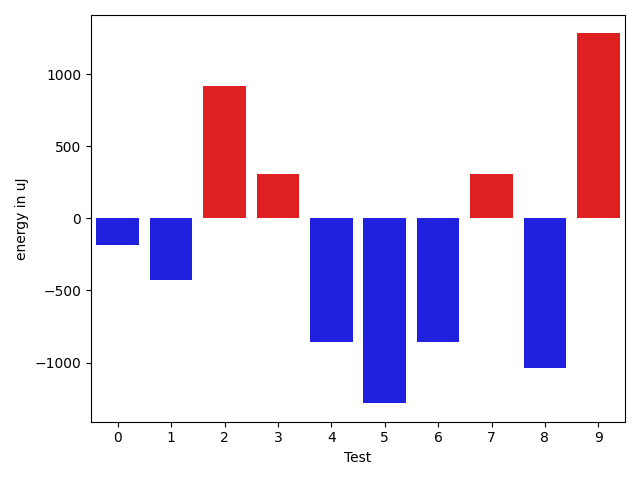

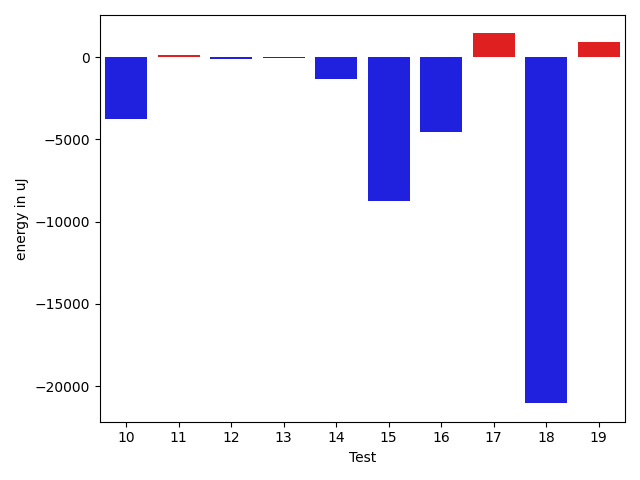

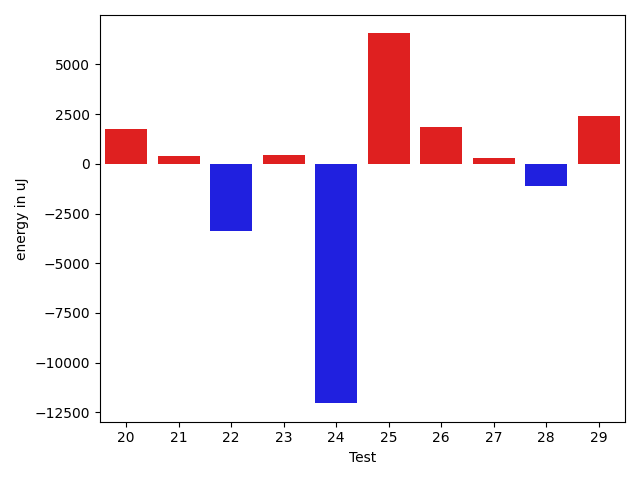

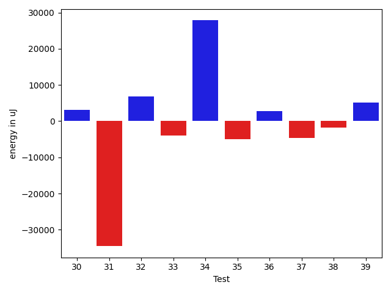

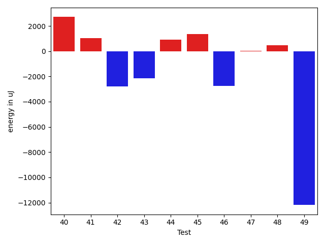

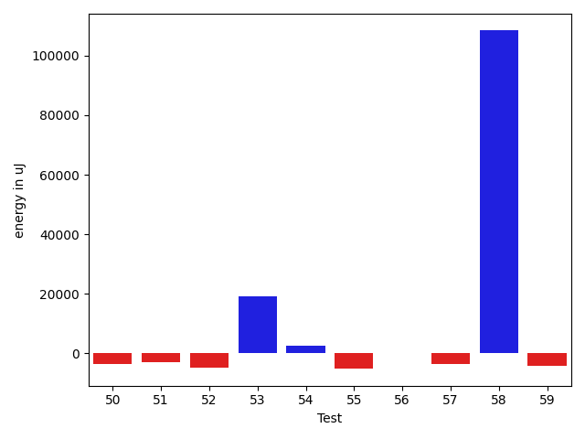

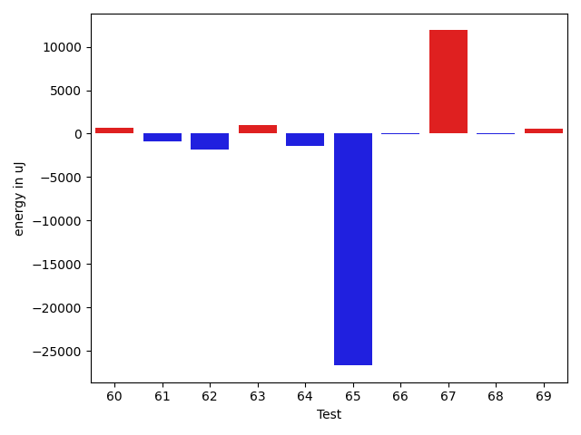

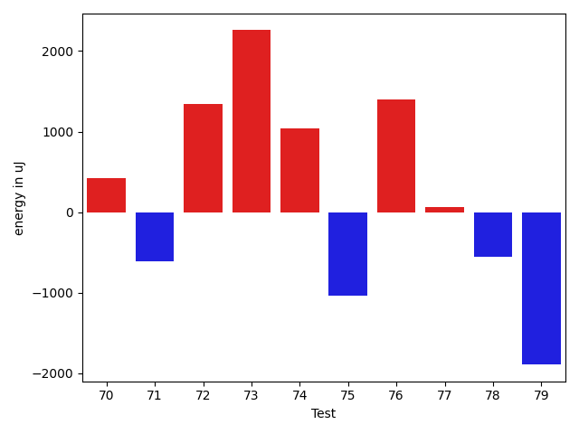

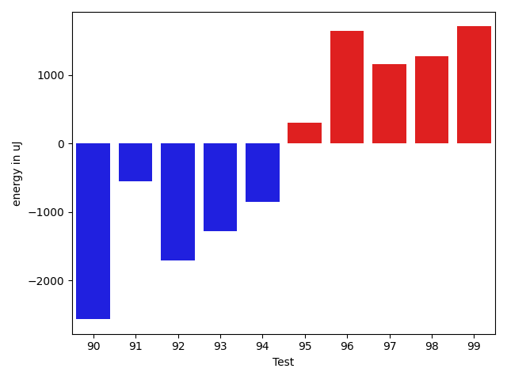

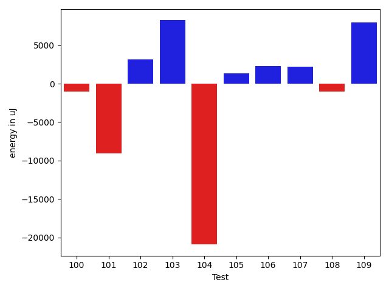

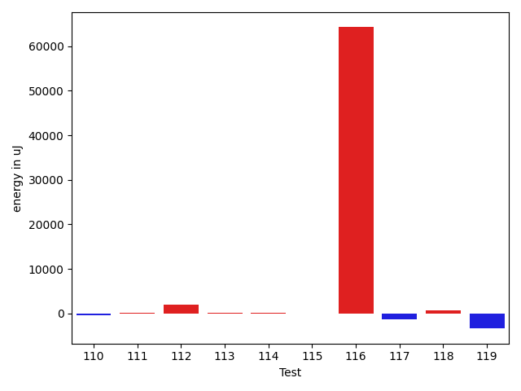

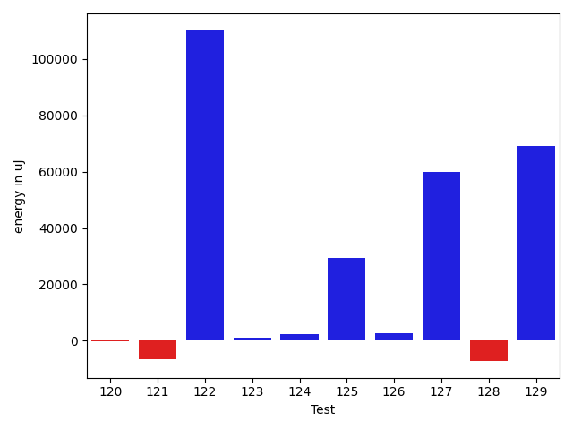

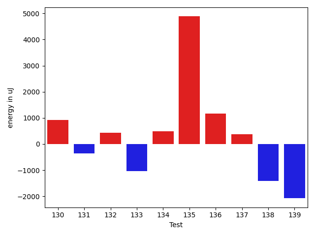

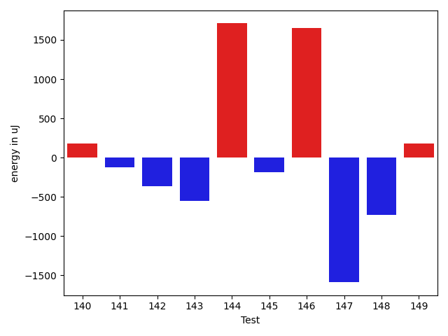

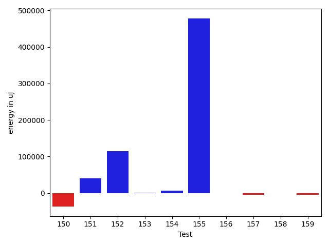

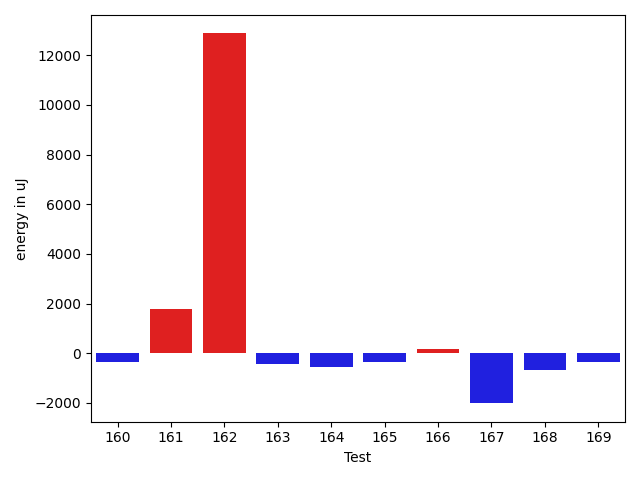

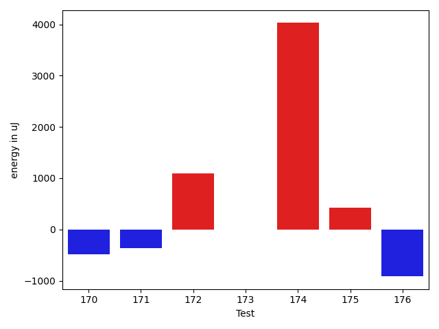

| ID | EnergyV1 | EnergyV2 | DeltaEnergy | σV1 | σV2 |
| --- | --- | --- | --- | --- | --- |
| 0 | 42907 | 42725 | -182 | 9830.0774492161 | 8358.533414789574 |
| 1 | 43029 | 42603 | -426 | 4273.246315150027 | 3588.9729302796472 |
| 2 | 42480 | 43396 | 916 | 3969.801551938296 | 3155.3022824281607 |
| 3 | 42847 | 43152 | 305 | 7922.477005665866 | 3603.944553445193 |
| 4 | 44312 | 43457 | -855 | 6496.070925093475 | 7669.509769325231 |
| 5 | 43457 | 42175 | -1282 | 7540.05623271064 | 3115.885557911266 |
| 6 | 43335 | 42480 | -855 | 4446.126908662626 | 7352.434411171478 |
| 7 | 43518 | 43824 | 306 | 8630.312226909906 | 9400.741206763603 |
| 8 | 43824 | 42786 | -1038 | 4443.439265037564 | 3293.638997661034 |
| 9 | 43335 | 44616 | 1281 | 10485.478171842933 | 13940.511789074313 |
| 10 | 45227 | 44068 | -1159 | 19389.173266335027 | 16357.986099667061 |
| 11 | 43640 | 44861 | 1221 | 8714.151509406345 | 9309.627205059713 |
| 12 | 43457 | 42724 | -733 | 6019.294537774564 | 7389.156727663701 |
| 13 | 43640 | 43396 | -244 | 4086.2479136163556 | 3476.441660268739 |
| 14 | 43945 | 43579 | -366 | 26071.379741768676 | 26193.17074618431 |
| 15 | 45288 | 44922 | -366 | 60753.83580050879 | 56832.44269277676 |
| 16 | 44250 | 43029 | -1221 | 23859.417881787555 | 3646.180968398401 |
| 17 | 43091 | 44129 | 1038 | 4446.253707022451 | 2943.1179238306795 |
| 18 | 44861 | 45349 | 488 | 235978.2141054534 | 190038.0986833208 |
| 19 | 46264 | 48890 | 2626 | 34515.94196263054 | 28774.95846367914 |
| 20 | 45776 | 45288 | -488 | 19623.98859237416 | 23620.82208863001 |
| 21 | 44617 | 44433 | -184 | 10917.131444588586 | 20763.91370404592 |
| 22 | 44068 | 43640 | -428 | 22203.11687550889 | 3782.1257795887427 |
| 23 | 43884 | 42968 | -916 | 11375.735703157803 | 10687.561331580982 |
| 24 | 92346 | 93079 | 733 | 184542.4821976093 | 140397.56356764474 |
| 25 | 43518 | 45593 | 2075 | 4755.862460467437 | 29599.666536334866 |
| 26 | 44067 | 45410 | 1343 | 22613.00139569605 | 24860.779239277006 |
| 27 | 44311 | 42724 | -1587 | 5291.804621376949 | 4926.357218066915 |
| 28 | 44434 | 42602 | -1832 | 3074.476029945682 | 3941.410904660284 |
| 29 | 42175 | 43884 | 1709 | 4343.1368313686 | 8191.761971960091 |
| 30 | 44006 | 44372 | 366 | 4402.7813455120495 | 4976.3922283093125 |
| 31 | 87891 | 89172 | 1281 | 24284.829112681433 | 24460.520010401808 |
| 32 | 42969 | 42907 | -62 | 3793.3972486268876 | 4316.698329485411 |
| 33 | 45410 | 44983 | -427 | 18150.495712209035 | 16842.198851632853 |
| 34 | 45837 | 45044 | -793 | 85576.8932651798 | 90865.16924564881 |
| 35 | 82641 | 46508 | -36133 | 277549.2830997634 | 150722.13244137587 |
| 36 | 42419 | 43274 | 855 | 16333.633262569654 | 12094.342154260805 |
| 37 | 41992 | 42420 | 428 | 4843.618732852404 | 7401.139947733976 |
| 38 | 79956 | 81604 | 1648 | 21527.19798513297 | 22764.55134403744 |
| 39 | 41626 | 42663 | 1037 | 5908.072087948733 | 2628.5102579380705 |
| 40 | 42236 | 43152 | 916 | 5401.322438870195 | 10917.809041187982 |
| 41 | 376159 | 376464 | 305 | 56430.04990832144 | 44729.24232208596 |
| 42 | 43396 | 43762 | 366 | 21246.73975525007 | 17943.742451569244 |
| 43 | 42298 | 43090 | 792 | 22175.580439412253 | 5759.386131121556 |
| 44 | 44921 | 45471 | 550 | 23254.942512464633 | 31702.565413369965 |
| 45 | 41077 | 43335 | 2258 | 2418.214242287064 | 3161.849483071577 |
| 46 | 43030 | 43518 | 488 | 24678.78060086347 | 18827.32991583345 |
| 47 | 42236 | 43091 | 855 | 2710.0396132937435 | 3423.373221669491 |
| 48 | 41565 | 42297 | 732 | 3142.9685197613635 | 2756.3058572823315 |
| 49 | 44190 | 44556 | 366 | 75676.60981861997 | 10275.495018172152 |
| 50 | 41870 | 43090 | 1220 | 2875.3413756396003 | 2291.996424430021 |
| 51 | 43518 | 41260 | -2258 | 3431.2958396047534 | 4049.659565770863 |
| 52 | 44738 | 43884 | -854 | 3836.44716401121 | 3629.42901926972 |
| 53 | 45105 | 44800 | -305 | 169557.42047202546 | 228119.97976753482 |
| 54 | 44251 | 43273 | -978 | 3864.6468894644067 | 3614.765514172251 |
| 55 | 43091 | 45104 | 2013 | 4548.419521734072 | 3276.568489950414 |
| 56 | 45837 | 45593 | -244 | 15503.323751933902 | 20812.08651077476 |
| 57 | 43457 | 41504 | -1953 | 3894.9865582928514 | 5123.4356481014465 |
| 58 | 44006 | 44861 | 855 | 10775.216736915318 | 13408.932258220846 |
| 59 | 41382 | 42480 | 1098 | 4214.280104415991 | 3825.681290088516 |
| 60 | 43640 | 43335 | -305 | 3907.3408275295537 | 4860.1482620274965 |
| 61 | 43030 | 41992 | -1038 | 3684.4779120378926 | 5058.986369817575 |
| 62 | 44312 | 42541 | -1771 | 6498.33300264976 | 4095.367210288428 |
| 63 | 44922 | 44922 | 0 | 29772.686482837344 | 39710.88024327282 |
| 64 | 44495 | 42419 | -2076 | 2895.5308232280813 | 3839.122897544305 |
| 65 | 44861 | 44433 | -428 | 325190.72028637794 | 299148.1008749113 |
| 66 | 44189 | 44373 | 184 | 8938.999609774019 | 10080.477236578918 |
| 67 | 42603 | 42480 | -123 | 4734.006275256818 | 71830.94541574248 |
| 68 | 45044 | 44128 | -916 | 15018.00284750189 | 16667.631585159117 |
| 69 | 46875 | 46936 | 61 | 31924.935873867573 | 27875.016905023786 |
| 70 | 43518 | 43945 | 427 | 15556.44634146048 | 15308.016309236922 |
| 71 | 43152 | 42541 | -611 | 13688.392519973337 | 6168.110650517351 |
| 72 | 44556 | 45898 | 1342 | 40366.67164446989 | 38386.83886670291 |
| 73 | 88317 | 90575 | 2258 | 60685.23824251295 | 64152.82049080632 |
| 74 | 45837 | 46875 | 1038 | 20033.010449332396 | 19183.71211447174 |
| 75 | 44189 | 43151 | -1038 | 12156.734482876776 | 11444.864998942117 |
| 76 | 40894 | 42297 | 1403 | 3728.371561932438 | 4487.469835814359 |
| 77 | 82031 | 82092 | 61 | 170122.64827673597 | 197009.67380187835 |
| 78 | 43213 | 42664 | -549 | 3224.4414102543815 | 4155.120113758845 |
| 79 | 43518 | 41626 | -1892 | 5041.90195864063 | 5629.002771215085 |
| 80 | 110961 | 126465 | 15504 | 61266.209014848915 | 66851.75032710964 |
| 81 | 43273 | 43396 | 123 | 3027.169729341144 | 4337.91951779691 |
| 82 | 43579 | 43396 | -183 | 4062.333760422174 | 4991.3708174259145 |
| 83 | 43762 | 43518 | -244 | 22681.449579633783 | 2700.056742323151 |
| 84 | 42847 | 42297 | -550 | 3490.3074384625843 | 3900.309424497495 |
| 85 | 44006 | 44556 | 550 | 3507.224429388129 | 3833.029427590328 |
| 86 | 44067 | 43518 | -549 | 4680.1466111404025 | 49198.082161826045 |
| 87 | 43152 | 43029 | -123 | 3310.6176061027386 | 3647.8756510202106 |
| 88 | 45532 | 45166 | -366 | 267206.14094395965 | 225556.43310931302 |
| 89 | 42663 | 43701 | 1038 | 4226.585967519497 | 3217.0777422025412 |
| 90 | 45044 | 42480 | -2564 | 2310.7086780988475 | 4853.393420070239 |
| 91 | 43274 | 42725 | -549 | 2447.7951409182742 | 21695.3605215493 |
| 92 | 43946 | 42236 | -1710 | 11174.949191806034 | 9741.524092973299 |
| 93 | 43823 | 42541 | -1282 | 3123.893857195684 | 3156.9880688191815 |
| 94 | 43396 | 42541 | -855 | 14272.29997573972 | 14372.91668303619 |
| 95 | 44068 | 44372 | 304 | 3106.4067706421442 | 3325.587031193262 |
| 96 | 43274 | 44922 | 1648 | 2992.9853928784 | 2834.5993642057347 |
| 97 | 42969 | 44128 | 1159 | 3181.9798098039532 | 10903.668169799254 |
| 98 | 41748 | 43030 | 1282 | 2822.7020054497866 | 2842.5138423963526 |
| 99 | 43090 | 44800 | 1710 | 2493.133107934181 | 3839.6106651586433 |
| 100 | 43457 | 43823 | 366 | 3670.8707678981027 | 8090.275147994396 |
| 101 | 131713 | 130737 | -976 | 299956.7724492464 | 186676.67309637924 |
| 102 | 44617 | 44067 | -550 | 4740.855287199417 | 3186.926142485 |
| 103 | 127868 | 130126 | 2258 | 54908.468699004006 | 51360.20775653273 |
| 104 | 139099 | 142883 | 3784 | 137147.0841649544 | 99480.97890317386 |
| 105 | 43030 | 44250 | 1220 | 3660.6997150548455 | 6322.315004406132 |
| 106 | 43274 | 44678 | 1404 | 7969.345560809245 | 3441.942527273475 |
| 107 | 43030 | 43213 | 183 | 8036.710158998649 | 5629.577213621781 |
| 108 | 44128 | 43151 | -977 | 4301.236905327164 | 3968.8375268529467 |
| 109 | 43274 | 43457 | 183 | 8425.178667683003 | 8150.161693033258 |
| 110 | 45227 | 43152 | -2075 | 3222.0221202235525 | 3119.098926150165 |
| 111 | 43335 | 44861 | 1526 | 9293.656361196061 | 8630.412936957304 |
| 112 | 43640 | 43640 | 0 | 4437.3861485786 | 7736.684907191444 |
| 113 | 43030 | 41626 | -1404 | 4684.350958569084 | 4394.956111695005 |
| 114 | 43579 | 43579 | 0 | 4167.885415840894 | 6386.340527896009 |
| 115 | 43457 | 43579 | 122 | 5865.45630654937 | 3645.695450192673 |
| 116 | 91370 | 92040 | 670 | 201094.88860921952 | 340312.47947748756 |
| 117 | 51819 | 47974 | -3845 | 30701.38743869115 | 33302.64792271465 |
| 118 | 44556 | 43945 | -611 | 11538.038741268694 | 12574.61648027104 |
| 119 | 43701 | 43701 | 0 | 10497.754058967988 | 3727.566064896247 |
| 120 | 42969 | 45227 | 2258 | 61321.49534643208 | 12952.166733536644 |
| 121 | 45166 | 44190 | -976 | 9200.963641028333 | 7161.145230682168 |
| 122 | 46020 | 46265 | 245 | 24686.130570500958 | 35986.36781093723 |
| 123 | 43640 | 44616 | 976 | 7600.112346553902 | 8177.796627370676 |
| 124 | 44800 | 44739 | -61 | 34079.864735705596 | 23443.72138290199 |
| 125 | 88622 | 88257 | -365 | 43387.50030026569 | 40038.45158897494 |
| 126 | 44128 | 44311 | 183 | 17781.872622795167 | 9653.646918850225 |
| 127 | 47851 | 48950 | 1099 | 44448.686442712824 | 54978.28486066648 |
| 128 | 43152 | 44250 | 1098 | 4148.814245712312 | 6127.1468733319725 |
| 129 | 45777 | 45410 | -367 | 79578.48975407609 | 93073.32050774546 |
| 130 | 42786 | 43701 | 915 | 3923.5651663145622 | 3990.961221424498 |
| 131 | 43884 | 43518 | -366 | 3944.7303943467473 | 3798.0040460174146 |
| 132 | 44006 | 44434 | 428 | 17647.3177580605 | 18475.871908124718 |
| 133 | 44067 | 43029 | -1038 | 14839.767616629162 | 16797.868662851084 |
| 134 | 44555 | 45044 | 489 | 29175.429216381017 | 14596.852082859814 |
| 135 | 80871 | 85754 | 4883 | 127328.59651999042 | 220086.02817291545 |
| 136 | 43457 | 44617 | 1160 | 3553.545559247524 | 4351.240896131562 |
| 137 | 43762 | 44128 | 366 | 4168.465801777624 | 3946.819687427045 |
| 138 | 44617 | 43212 | -1405 | 4525.4765039662 | 3553.251725884334 |
| 139 | 45044 | 42968 | -2076 | 2529.4299702452727 | 4525.90490776452 |
| 140 | 46142 | 46326 | 184 | 41608.45970247517 | 42187.153806131966 |
| 141 | 47973 | 47852 | -121 | 221169.58197245587 | 214840.35351394513 |
| 142 | 43884 | 43518 | -366 | 3601.6360180899346 | 3468.7455955143205 |
| 143 | 44861 | 44311 | -550 | 3094.991953329842 | 3387.5771415051845 |
| 144 | 42175 | 43884 | 1709 | 3807.374454944099 | 21881.502470656193 |
| 145 | 43884 | 43701 | -183 | 4361.013258281315 | 2881.860187121729 |
| 146 | 43213 | 44860 | 1647 | 9440.68807535112 | 8706.498192549028 |
| 147 | 43823 | 42236 | -1587 | 3467.1560560903445 | 3579.6937456296455 |
| 148 | 45776 | 45044 | -732 | 238403.1465345812 | 255256.71565242085 |
| 149 | 43029 | 43212 | 183 | 7277.2444767508 | 70570.91498922129 |
| 150 | 43152 | 42785 | -367 | 4628.5123409147345 | 3060.8024390652286 |
| 151 | 83129 | 81604 | -1525 | 37517.20866176807 | 32792.52591652911 |
| 152 | 44311 | 45288 | 977 | 221717.20929888557 | 247646.69268533 |
| 153 | 43396 | 44007 | 611 | 28696.17259521751 | 4750.157797842089 |
| 154 | 45472 | 44495 | -977 | 33841.81641910216 | 26606.14435565218 |
| 155 | 45654 | 46082 | 428 | 200127.11015011065 | 159150.3936415707 |
| 156 | 82092 | 78979 | -3113 | 31130.507131088485 | 38457.597500680335 |
| 157 | 72510 | 68115 | -4395 | 37386.650869698526 | 35915.604574045414 |
| 158 | 46875 | 47180 | 305 | 32429.72087906469 | 32409.639915640575 |
| 159 | 46020 | 43029 | -2991 | 29356.22288510563 | 17126.873845089805 |
| 160 | 45593 | 45227 | -366 | 168525.73733083336 | 174274.5588586668 |
| 161 | 45898 | 47668 | 1770 | 34538.66057322877 | 28827.5236291492 |
| 162 | 298461 | 311340 | 12879 | 56124.942305977485 | 224121.71202009692 |
| 163 | 44617 | 44189 | -428 | 6833.682397578146 | 6466.659029380123 |
| 164 | 45776 | 45227 | -549 | 371268.4173664086 | 4443.555114901985 |
| 165 | 44311 | 43945 | -366 | 4081.2035232947624 | 38013.38515186676 |
| 166 | 44311 | 44495 | 184 | 2442.8392168635182 | 4288.217459456999 |
| 167 | 45226 | 43213 | -2013 | 3100.6828814094742 | 4424.123298078074 |
| 168 | 44311 | 43640 | -671 | 3269.0984621854172 | 3023.081406684041 |
| 169 | 45532 | 45166 | -366 | 172226.8181720268 | 160921.07186636204 |
| 170 | 44128 | 43640 | -488 | 4020.276927823367 | 3890.058138326371 |
| 171 | 43151 | 42785 | -366 | 4941.115282588301 | 2373.217876606307 |
| 172 | 42908 | 44006 | 1098 | 3870.540740316394 | 4633.367340023492 |
| 173 | 44616 | 44616 | 0 | 4097.115858883065 | 3341.394435087443 |
| 174 | 43518 | 47546 | 4028 | 41142.95089003106 | 48358.518318285984 |
| 175 | 43396 | 43823 | 427 | 325519.79718317103 | 174969.18929592747 |
| 176 | 44922 | 44006 | -916 | 4366.076675281684 | 3603.8496417026054 |

## Delta Duration per test method

| ID | DurationV1 | DurationsV2 | DeltaDuration |
| --- | --- | --- | --- |
| 0 | 1115801.3544303798 | 1166199.7435897435 | 50398.389159363694 |
| 1 | 713655.4782608695 | 709446.1025641026 | -4209.375696766889 |
| 2 | 808008.7931034482 | 805900.7741935484 | -2108.018909899867 |
| 3 | 1002391.0754716981 | 1026370.074074074 | 23978.99860237597 |
| 4 | 937958.1746031746 | 1000152.5384615385 | 62194.36385836394 |
| 5 | 663750.304347826 | 495871.15 | -167879.15434782603 |
| 6 | 816087.5636363636 | 857059.8909090909 | 40972.32727272727 |
| 7 | 1175246.9777777777 | 1204990.4222222222 | 29743.444444444496 |
| 8 | 595678.1052631579 | 602155.6 | 6477.494736842113 |
| 9 | 1180229.0 | 1173695.6049382717 | -6533.395061728312 |
| 10 | 1422089.5360824743 | 1381996.7731958763 | -40092.76288659801 |
| 11 | 953936.05 | 946013.4074074074 | -7922.6425925926305 |
| 12 | 1040534.1029411765 | 1029076.5797101449 | -11457.523231031606 |
| 13 | 743864.6666666666 | 772285.2045454546 | 28420.53787878796 |
| 14 | 1367968.9777777777 | 1334876.5222222223 | -33092.45555555541 |
| 15 | 1928065.0317460317 | 1606973.4 | -321091.6317460318 |
| 16 | 777636.4468085107 | 794179.7959183673 | 16543.349109856645 |
| 17 | 719069.6428571428 | 711385.8947368421 | -7683.748120300705 |
| 18 | 3347017.9104477614 | 2672889.546875 | -674128.3635727614 |
| 19 | 1750802.2551020407 | 1940362.3195876288 | 189560.0644855881 |
| 20 | 1530870.5795454546 | 1612818.6382978724 | 81948.0587524178 |
| 21 | 1312113.7422680412 | 1345159.5051546392 | 33045.76288659801 |
| 22 | 719133.8048780488 | 579187.6470588235 | -139946.15781922534 |
| 23 | 924517.8181818182 | 986236.0512820513 | 61718.23310023302 |
| 24 | 3766704.0303030303 | 3344937.4444444445 | -421766.5858585858 |
| 25 | 690648.0606060605 | 716539.9 | 25891.839393939474 |
| 26 | 1330468.3962264152 | 1346991.9137931035 | 16523.51756668836 |
| 27 | 428282.7727272727 | 401151.0 | -27131.772727272706 |
| 28 | 608023.5185185185 | 601576.525 | -6446.993518518517 |
| 29 | 859547.3658536585 | 912904.4038461539 | 53357.037992495345 |
| 30 | 473792.0 | 439979.3333333333 | -33812.666666666686 |
| 31 | 2303633.101010101 | 2396248.3131313133 | 92615.21212121239 |
| 32 | 769315.0980392157 | 817709.320754717 | 48394.222715501324 |
| 33 | 1504061.0303030303 | 1632364.111111111 | 128303.08080808073 |
| 34 | 2513431.1014492754 | 2492848.257575758 | -20582.843873517588 |
| 35 | 4415905.231884058 | 2564751.029850746 | -1851154.2020333116 |
| 36 | 1392536.6842105263 | 1296643.0721649486 | -95893.61204557773 |
| 37 | 1141257.9438202246 | 1147807.426966292 | 6549.483146067476 |
| 38 | 1862517.4040404041 | 1866708.898989899 | 4191.494949494954 |
| 39 | 1077011.0394736843 | 1029373.5243902439 | -47637.51508344035 |
| 40 | 1192244.9789473685 | 1184971.5425531915 | -7273.436394176912 |
| 41 | 9358413.858585859 | 9305391.808080807 | -53022.05050505139 |
| 42 | 1485946.393939394 | 1453226.8686868686 | -32719.525252525462 |
| 43 | 1146262.1875 | 1072047.0697674418 | -74215.11773255817 |
| 44 | 1790732.111111111 | 1670597.7272727273 | -120134.38383838371 |
| 45 | 539217.84 | 460096.12 | -79121.71999999997 |
| 46 | 1254068.6666666667 | 1071731.2857142857 | -182337.38095238106 |
| 47 | 532782.2307692308 | 536253.59375 | 3471.3629807692487 |
| 48 | 582081.03125 | 565878.6333333333 | -16202.397916666698 |
| 49 | 1156344.21875 | 917677.7142857143 | -238666.50446428568 |
| 50 | 504402.82608695654 | 445041.64 | -59361.18608695653 |
| 51 | 484345.9166666667 | 533455.0476190476 | 49109.13095238089 |
| 52 | 474773.7037037037 | 482584.42307692306 | 7810.7193732193555 |
| 53 | 1801727.9310344828 | 2792472.9393939395 | 990745.0083594567 |
| 54 | 686825.6222222223 | 700975.8571428572 | 14150.234920634888 |
| 55 | 641937.2619047619 | 586822.09375 | -55115.168154761894 |
| 56 | 1349757.358695652 | 1520078.4404761905 | 170321.08178053843 |
| 57 | 514255.5806451613 | 568332.1153846154 | 54076.5347394541 |
| 58 | 870872.2 | 936448.2083333334 | 65576.00833333342 |
| 59 | 634940.0263157894 | 683841.0512820513 | 48901.024966261815 |
| 60 | 849678.3636363636 | 857201.75 | 7523.386363636353 |
| 61 | 689007.2432432432 | 753359.425 | 64352.18175675685 |
| 62 | 888337.5434782609 | 777177.425925926 | -111160.11755233491 |
| 63 | 1340246.173076923 | 1434835.35 | 94589.17692307709 |
| 64 | 504779.75 | 512765.3214285714 | 7985.57142857142 |
| 65 | 5460477.416666667 | 4332519.5 | -1127957.916666667 |
| 66 | 981075.2978723404 | 1044816.3921568628 | 63741.09428452235 |
| 67 | 664157.9189189189 | 916303.3 | 252145.3810810811 |
| 68 | 1213675.6621621621 | 1264709.7 | 51034.03783783782 |
| 69 | 1861492.4848484849 | 1828399.6767676768 | -33092.80808080803 |
| 70 | 1281707.712643678 | 1335878.5227272727 | 54170.81008359464 |
| 71 | 1230816.9189189188 | 1133111.3414634147 | -97705.5774555041 |
| 72 | 1484826.4366197183 | 1624719.880597015 | 139893.44397729659 |
| 73 | 2735066.242424242 | 2856062.515151515 | 120996.27272727294 |
| 74 | 1526708.2790697673 | 1583912.2023809524 | 57203.92331118509 |
| 75 | 1041735.3333333334 | 1059722.779661017 | 17987.446327683632 |
| 76 | 569393.0714285715 | 638131.09375 | 68738.02232142852 |
| 77 | 2885061.433333333 | 3497472.3033707864 | 612410.8700374532 |
| 78 | 711835.9047619047 | 936473.7692307692 | 224637.8644688645 |
| 79 | 905558.2222222222 | 1008219.7818181819 | 102661.55959595961 |
| 80 | 2558597.723404255 | 2676745.152173913 | 118147.42876965785 |
| 81 | 536163.1935483871 | 555498.0 | 19334.80645161285 |
| 82 | 761653.880952381 | 816894.195652174 | 55240.314699793 |
| 83 | 644824.6857142857 | 515322.26470588235 | -129502.42100840335 |
| 84 | 850069.375 | 817581.2142857143 | -32488.16071428568 |
| 85 | 527217.6176470588 | 562110.4375 | 34892.819852941204 |
| 86 | 516349.93548387097 | 892690.7142857143 | 376340.77880184335 |
| 87 | 568047.3913043478 | 546427.9642857143 | -21619.42701863346 |
| 88 | 3422227.2954545454 | 2702605.6835443038 | -719621.6119102417 |
| 89 | 647136.9189189189 | 605539.325 | -41597.59391891898 |
| 90 | 417196.0 | 445472.73913043475 | 28276.739130434755 |
| 91 | 481406.4117647059 | 663480.2 | 182073.78823529405 |
| 92 | 665418.9411764706 | 735156.9411764706 | 69738.0 |
| 93 | 521435.36842105264 | 534196.1111111111 | 12760.742690058483 |
| 94 | 1150818.125 | 1084948.925 | -65869.19999999995 |
| 95 | 449090.3888888889 | 487843.5 | 38753.111111111124 |
| 96 | 434395.0 | 403427.44444444444 | -30967.555555555562 |
| 97 | 503631.75 | 991328.9411764706 | 487697.1911764706 |
| 98 | 456213.36363636365 | 413764.63636363635 | -42448.727272727294 |
| 99 | 429164.28571428574 | 420634.1 | -8530.185714285763 |
| 100 | 774658.9487179487 | 831624.6829268293 | 56965.734208880574 |
| 101 | 5585356.666666667 | 4243274.828282828 | -1342081.8383838385 |
| 102 | 406047.0 | 355574.1111111111 | -50472.888888888876 |
| 103 | 3443336.1717171716 | 3564636.9292929294 | 121300.7575757578 |
| 104 | 4345760.484848484 | 4144756.393939394 | -201004.09090909036 |
| 105 | 765396.6382978724 | 880194.2978723404 | 114797.65957446804 |
| 106 | 751163.8421052631 | 610104.9318181818 | -141058.91028708138 |
| 107 | 981500.4545454546 | 867046.1698113207 | -114454.28473413386 |
| 108 | 965009.7878787878 | 1086317.5076923077 | 121307.71981351986 |
| 109 | 1112920.8395061728 | 1143635.2289156627 | 30714.38940948993 |
| 110 | 423062.77777777775 | 423459.1111111111 | 396.33333333337214 |
| 111 | 771183.6857142857 | 643907.12 | -127276.56571428571 |
| 112 | 735919.75 | 969190.4651162791 | 233270.71511627908 |
| 113 | 601624.1315789474 | 641211.6129032258 | 39587.4813242784 |
| 114 | 992313.782051282 | 1018182.3670886076 | 25868.585037325625 |
| 115 | 1154073.3382352942 | 1026465.12 | -127608.21823529422 |
| 116 | 3825063.0606060605 | 5808092.757575758 | 1983029.6969696973 |
| 117 | 1845968.84 | 1676803.462686567 | -169165.37731343298 |
| 118 | 1272643.9176470588 | 1270039.3409090908 | -2604.5767379680183 |
| 119 | 887730.5925925926 | 520489.70588235295 | -367240.88671023963 |
| 120 | 881775.3529411765 | 657985.2666666667 | -223790.08627450978 |
| 121 | 1090300.388888889 | 892881.8181818182 | -197418.57070707076 |
| 122 | 1559553.686868687 | 1704735.3232323232 | 145181.63636363624 |
| 123 | 1047392.4189189189 | 986217.7887323943 | -61174.63018652459 |
| 124 | 1512163.370786517 | 1392366.9777777777 | -119796.39300873922 |
| 125 | 2463559.7291666665 | 2497839.494949495 | 34279.76578282844 |
| 126 | 1229499.5632183908 | 1152306.0256410257 | -77193.53757736506 |
| 127 | 2058842.9696969697 | 2246112.1818181816 | 187269.21212121192 |
| 128 | 777459.2075471698 | 851907.1372549019 | 74447.92970773217 |
| 129 | 2338351.185714286 | 2422141.4307692307 | 83790.24505494488 |
| 130 | 727819.9189189189 | 742787.8947368421 | 14967.975817923201 |
| 131 | 1033926.4852941176 | 942670.1351351351 | -91256.35015898244 |
| 132 | 1215036.8591549296 | 1188907.6296296297 | -26129.229525299976 |
| 133 | 1220110.9 | 1249756.7529411765 | 29645.85294117662 |
| 134 | 1501000.2692307692 | 1151956.0666666667 | -349044.2025641026 |
| 135 | 2251788.340659341 | 3441937.3846153845 | 1190149.0439560437 |
| 136 | 663658.9361702128 | 730626.1428571428 | 66967.20668693003 |
| 137 | 675588.1666666666 | 685461.4444444445 | 9873.277777777868 |
| 138 | 648380.7894736842 | 710528.5 | 62147.710526315845 |
| 139 | 701602.425 | 775640.7619047619 | 74038.33690476185 |
| 140 | 1554857.46875 | 1443230.5945945946 | -111626.87415540544 |
| 141 | 3647340.470588235 | 3202331.4583333335 | -445009.0122549017 |
| 142 | 659600.5714285715 | 637102.24 | -22498.331428571488 |
| 143 | 608079.8529411765 | 546959.25 | -61120.602941176505 |
| 144 | 886298.7966101695 | 890202.8833333333 | 3904.0867231638404 |
| 145 | 969008.3414634146 | 657993.4166666666 | -311014.924796748 |
| 146 | 861606.3333333334 | 841573.3939393939 | -20032.93939393945 |
| 147 | 570511.3333333334 | 639154.21875 | 68642.88541666663 |
| 148 | 3070720.1785714286 | 3287793.963636364 | 217073.78506493522 |
| 149 | 824361.04 | 958357.6944444445 | 133996.65444444446 |
| 150 | 503454.1 | 433633.3333333333 | -69820.76666666666 |
| 151 | 2086248.1134020619 | 2024182.2637362638 | -62065.849665798014 |
| 152 | 2662862.1666666665 | 3220873.180327869 | 558011.0136612025 |
| 153 | 953511.1587301587 | 786348.56 | -167162.59873015864 |
| 154 | 1480666.534883721 | 1324431.0379746836 | -156235.49690903747 |
| 155 | 2898764.3829787234 | 3061979.3260869565 | 163214.94310823316 |
| 156 | 2012118.393939394 | 2065165.191919192 | 53046.797979797935 |
| 157 | 2000855.3333333333 | 1941979.505050505 | -58875.82828282821 |
| 158 | 1858943.4285714286 | 1873742.292929293 | 14798.864357864251 |
| 159 | 1334600.32 | 799744.1538461539 | -534856.1661538462 |
| 160 | 2108027.152777778 | 2152997.1612903224 | 44970.008512544446 |
| 161 | 1638308.6805555555 | 1582467.9333333333 | -55840.747222222155 |
| 162 | 7392263.929292929 | 8269801.080808081 | 877537.1515151514 |
| 163 | 834198.25 | 851728.1702127659 | 17529.920212765923 |
| 164 | 6967055.647058823 | 424955.3846153846 | -6542100.262443438 |
| 165 | 681290.6666666666 | 889722.5348837209 | 208431.8682170543 |
| 166 | 407074.0 | 448155.14285714284 | 41081.14285714284 |
| 167 | 474919.04761904763 | 500414.5416666667 | 25495.494047619053 |
| 168 | 566595.1290322581 | 572250.0689655172 | 5654.9399332591565 |
| 169 | 2003333.8876404495 | 2038541.7906976745 | 35207.90305722505 |
| 170 | 469015.875 | 490194.48484848486 | 21178.609848484863 |
| 171 | 468003.5238095238 | 472469.5 | 4465.976190476213 |
| 172 | 631113.3214285715 | 664734.880952381 | 33621.55952380947 |
| 173 | 415481.1666666667 | 404456.625 | -11024.541666666686 |
| 174 | 1575109.1739130435 | 2444173.8 | 869064.6260869564 |
| 175 | 4725663.583333333 | 1765673.7096774194 | -2959989.8736559134 |
| 176 | 586200.8571428572 | 511284.28 | -74916.57714285713 |

## Misc.

| ID | Test Class | Test Method |
| --- | --- | --- |
| 0 | com.google.gson.functional.CustomTypeAdaptersTest | testCustomAdapterInvokedForCollectionElementDeserialization |
| 1 | com.google.gson.functional.CustomTypeAdaptersTest | testCustomTypeAdapterAppliesToSubClassesSerializedAsBaseClass |
| 2 | com.google.gson.functional.CustomTypeAdaptersTest | testCustomAdapterInvokedForMapElementDeserialization |
| 3 | com.google.gson.functional.CustomTypeAdaptersTest | testCustomAdapterInvokedForMapElementSerializationWithType |
| 4 | com.google.gson.functional.CustomTypeAdaptersTest | testCustomNestedSerializers |
| 5 | com.google.gson.functional.CustomTypeAdaptersTest | testCustomAdapterInvokedForMapElementSerialization |
| 6 | com.google.gson.functional.CustomTypeAdaptersTest | testCustomNestedDeserializers |
| 7 | com.google.gson.functional.CustomTypeAdaptersTest | testCustomTypeAdapterDoesNotAppliesToSubClasses |
| 8 | com.google.gson.functional.CustomTypeAdaptersTest | testCustomAdapterInvokedForCollectionElementSerialization |
| 9 | com.google.gson.functional.CustomTypeAdaptersTest | testRegisterHierarchyAdapterForDate |
| 10 | com.google.gson.functional.CustomTypeAdaptersTest | testCustomAdapterInvokedForCollectionElementSerializationWithType |
| 11 | com.google.gson.functional.CustomTypeAdaptersTest | testCustomDeserializers |
| 12 | com.google.gson.functional.CustomTypeAdaptersTest | testCustomByteArrayDeserializerAndInstanceCreator |
| 13 | com.google.gson.functional.CustomTypeAdaptersTest | testCustomByteArraySerializer |
| 14 | com.google.gson.functional.CustomTypeAdaptersTest | testEnsureCustomSerializerNotInvokedForNullValues |
| 15 | com.google.gson.functional.CustomTypeAdaptersTest | testEnsureCustomDeserializerNotInvokedForNullValues |
| 16 | com.google.gson.functional.CustomTypeAdaptersTest | testCustomDeserializerInvokedForPrimitives |
| 17 | com.google.gson.functional.CustomTypeAdaptersTest | testCustomSerializerInvokedForPrimitives |
| 18 | com.google.gson.functional.CustomTypeAdaptersTest | testCustomSerializers |
| 19 | com.google.gson.functional.StreamingTypeAdaptersTest | testNullSafe |
| 20 | com.google.gson.functional.StreamingTypeAdaptersTest | testSerializeWithCustomTypeAdapter |
| 21 | com.google.gson.functional.StreamingTypeAdaptersTest | testDeserializeWithCustomTypeAdapter |
| 22 | com.google.gson.functional.ExclusionStrategyFunctionalTest | testExclusionStrategySerializationDoesNotImpactSerialization |
| 23 | com.google.gson.functional.ExclusionStrategyFunctionalTest | testExclusionStrategySerializationDoesNotImpactDeserialization |
| 24 | com.google.gson.functional.ExclusionStrategyFunctionalTest | testExclusionStrategySerialization |
| 25 | com.google.gson.functional.ExclusionStrategyFunctionalTest | testExcludeTopLevelClassDeserializationDoesNotImpactSerialization |
| 26 | com.google.gson.functional.ExclusionStrategyFunctionalTest | testExclusionStrategyDeserialization |
| 27 | com.google.gson.functional.ExclusionStrategyFunctionalTest | testExcludeTopLevelClassDeserialization |
| 28 | com.google.gson.functional.ExclusionStrategyFunctionalTest | testExcludeTopLevelClassSerializationDoesNotImpactDeserialization |
| 29 | com.google.gson.functional.ExclusionStrategyFunctionalTest | testExclusionStrategyWithMode |
| 30 | com.google.gson.functional.ExclusionStrategyFunctionalTest | testExcludeTopLevelClassSerialization |
| 31 | com.google.gson.functional.InstanceCreatorTest | testInstanceCreatorForParametrizedType |
| 32 | com.google.gson.functional.InstanceCreatorTest | testInstanceCreatorReturnsSubTypeForTopLevelObject |
| 33 | com.google.gson.functional.InstanceCreatorTest | testInstanceCreatorForCollectionType |
| 34 | com.google.gson.functional.InstanceCreatorTest | testInstanceCreatorReturnsSubTypeForField |
| 35 | com.google.gson.functional.InstanceCreatorTest | testInstanceCreatorReturnsBaseType |
| 36 | com.google.gson.functional.DefaultTypeAdaptersTest | testDateSerializationWithPatternNotOverridenByTypeAdapter |
| 37 | com.google.gson.functional.DefaultTypeAdaptersTest | testDateSerializationWithPattern |
| 38 | com.google.gson.functional.DefaultTypeAdaptersTest | testOverrideBigIntegerTypeAdapter |
| 39 | com.google.gson.functional.DefaultTypeAdaptersTest | testSqlDateSerialization |
| 40 | com.google.gson.functional.DefaultTypeAdaptersTest | testTimestampSerialization |
| 41 | com.google.gson.functional.DefaultTypeAdaptersTest | testDefaultDateDeserializationUsingBuilder |
| 42 | com.google.gson.functional.DefaultTypeAdaptersTest | testOverrideBigDecimalTypeAdapter |
| 43 | com.google.gson.functional.DefaultTypeAdaptersTest | testDateDeserializationWithPattern |
| 44 | com.google.gson.functional.DefaultTypeAdaptersTest | testDateSerializationInCollection |
| 45 | com.google.gson.functional.DefaultTypeAdaptersTest | testDefaultGregorianCalendarDeserialization |
| 46 | com.google.gson.functional.DefaultTypeAdaptersTest | testClassSerialization |
| 47 | com.google.gson.functional.DefaultTypeAdaptersTest | testDefaultCalendarSerialization |
| 48 | com.google.gson.functional.DefaultTypeAdaptersTest | testDefaultCalendarDeserialization |
| 49 | com.google.gson.functional.DefaultTypeAdaptersTest | testClassDeserialization |
| 50 | com.google.gson.functional.DefaultTypeAdaptersTest | testDefaultGregorianCalendarSerialization |
| 51 | com.google.gson.OverrideCoreTypeAdaptersTest | testOverrideStringAdapter |
| 52 | com.google.gson.OverrideCoreTypeAdaptersTest | testOverridePrimitiveBooleanAdapter |
| 53 | com.google.gson.OverrideCoreTypeAdaptersTest | testOverrideWrapperBooleanAdapter |
| 54 | com.google.gson.functional.NullObjectAndFieldTest | testCustomTypeAdapterPassesNullSerialization |
| 55 | com.google.gson.functional.NullObjectAndFieldTest | testExplicitSerializationOfNullStringMembers |
| 56 | com.google.gson.functional.NullObjectAndFieldTest | testExplicitSerializationOfNullArrayMembers |
| 57 | com.google.gson.functional.NullObjectAndFieldTest | testNullWrappedPrimitiveMemberDeserialization |
| 58 | com.google.gson.functional.NullObjectAndFieldTest | testTopLevelNullObjectDeserialization |
| 59 | com.google.gson.functional.NullObjectAndFieldTest | testExplicitSerializationOfNullCollectionMembers |
| 60 | com.google.gson.functional.NullObjectAndFieldTest | testPrintPrintingObjectWithNulls |
| 61 | com.google.gson.functional.NullObjectAndFieldTest | testNullWrappedPrimitiveMemberSerialization |
| 62 | com.google.gson.functional.NullObjectAndFieldTest | testCustomTypeAdapterPassesNullDesrialization |
| 63 | com.google.gson.functional.NullObjectAndFieldTest | testCustomSerializationOfNulls |
| 64 | com.google.gson.functional.NullObjectAndFieldTest | testPrintPrintingArraysWithNulls |
| 65 | com.google.gson.functional.NullObjectAndFieldTest | testTopLevelNullObjectSerialization |
| 66 | com.google.gson.functional.NullObjectAndFieldTest | testExplicitSerializationOfNulls |
| 67 | com.google.gson.functional.NullObjectAndFieldTest | testExplicitDeserializationOfNulls |
| 68 | com.google.gson.functional.MapTest | testSerializeMaps |
| 69 | com.google.gson.functional.MapTest | testInterfaceTypeMapWithSerializer |
| 70 | com.google.gson.functional.MapTest | testMapSubclassDeserialization |
| 71 | com.google.gson.functional.MapTest | testGeneralMapField |
| 72 | com.google.gson.functional.MapTest | testMapSerializationWithNullValueButSerializeNulls |
| 73 | com.google.gson.functional.MapTest | testInterfaceTypeMap |
| 74 | com.google.gson.functional.MapTest | testMapSerializationWithNullValuesSerialized |
| 75 | com.google.gson.functional.MapTest | testCustomSerializerForSpecificMapType |
| 76 | com.google.gson.functional.NamingPolicyTest | testGsonWithLowerCaseDashPolicyDeserialiation |
| 77 | com.google.gson.functional.NamingPolicyTest | testGsonDuplicateNameUsingSerializedNameFieldNamingPolicySerialization |
| 78 | com.google.gson.functional.NamingPolicyTest | testGsonWithSerializedNameFieldNamingPolicyDeserialization |
| 79 | com.google.gson.functional.NamingPolicyTest | testGsonWithSerializedNameFieldNamingPolicySerialization |
| 80 | com.google.gson.functional.NamingPolicyTest | testGsonWithNonDefaultFieldNamingPolicyDeserialiation |
| 81 | com.google.gson.functional.NamingPolicyTest | testGsonWithUpperCamelCaseSpacesPolicySerialiation |
| 82 | com.google.gson.functional.NamingPolicyTest | testGsonWithNonDefaultFieldNamingPolicySerialization |
| 83 | com.google.gson.functional.NamingPolicyTest | testGsonWithUpperCamelCaseSpacesPolicyDeserialiation |
| 84 | com.google.gson.functional.NamingPolicyTest | testDeprecatedNamingStrategy |
| 85 | com.google.gson.functional.NamingPolicyTest | testGsonWithLowerCaseDashPolicySerialization |
| 86 | com.google.gson.functional.NamingPolicyTest | testGsonWithLowerCaseUnderscorePolicySerialization |
| 87 | com.google.gson.functional.NamingPolicyTest | testGsonWithLowerCaseUnderscorePolicyDeserialiation |
| 88 | com.google.gson.functional.FieldExclusionTest | testDefaultInnerClassExclusion |
| 89 | com.google.gson.functional.FieldExclusionTest | testDefaultNestedStaticClassIncluded |
| 90 | com.google.gson.functional.FieldExclusionTest | testInnerClassExclusion |
| 91 | com.google.gson.functional.PrimitiveTest | testHtmlCharacterSerialization |
| 92 | com.google.gson.functional.PrimitiveTest | testLongAsStringDeserialization |
| 93 | com.google.gson.functional.PrimitiveTest | testLongAsStringSerialization |
| 94 | com.google.gson.functional.PrimitiveTest | testDoubleNaNSerialization |
| 95 | com.google.gson.functional.PrimitiveTest | testDoubleInfinitySerialization |
| 96 | com.google.gson.functional.PrimitiveTest | testNegativeInfinitySerialization |
| 97 | com.google.gson.functional.PrimitiveTest | testFloatNaNSerialization |
| 98 | com.google.gson.functional.PrimitiveTest | testNegativeInfinityFloatSerialization |
| 99 | com.google.gson.functional.PrimitiveTest | testFloatInfinitySerialization |
| 100 | com.google.gson.functional.TypeHierarchyAdapterTest | testRegisterSuperTypeFirst |
| 101 | com.google.gson.functional.TypeHierarchyAdapterTest | testTypeHierarchy |
| 102 | com.google.gson.functional.TypeHierarchyAdapterTest | testRegisterSubTypeFirstAllowed |
| 103 | com.google.gson.functional.EnumTest | testEnumSubclassWithRegisteredTypeAdapter |
| 104 | com.google.gson.functional.VersioningTest | testVersionedUntilSerialization |
| 105 | com.google.gson.functional.VersioningTest | testIgnoreLaterVersionClassSerialization |
| 106 | com.google.gson.functional.VersioningTest | testVersionedClassesDeserialization |
| 107 | com.google.gson.functional.VersioningTest | testVersionedGsonWithUnversionedClassesSerialization |
| 108 | com.google.gson.functional.VersioningTest | testVersionedClassesSerialization |
| 109 | com.google.gson.functional.VersioningTest | testVersionedGsonMixingSinceAndUntilSerialization |
| 110 | com.google.gson.functional.VersioningTest | testIgnoreLaterVersionClassDeserialization |
| 111 | com.google.gson.functional.VersioningTest | testVersionedUntilDeserialization |
| 112 | com.google.gson.functional.VersioningTest | testVersionedGsonMixingSinceAndUntilDeserialization |
| 113 | com.google.gson.functional.VersioningTest | testVersionedGsonWithUnversionedClassesDeserialization |
| 114 | com.google.gson.functional.MapAsArrayTypeAdapterTest | testMultipleEnableComplexKeyRegistrationHasNoEffect |
| 115 | com.google.gson.functional.MapAsArrayTypeAdapterTest | testMapWithTypeVariableDeserialization |
| 116 | com.google.gson.functional.MapAsArrayTypeAdapterTest | testSerializeComplexMapWithTypeAdapter |
| 117 | com.google.gson.functional.MapAsArrayTypeAdapterTest | testTwoTypesCollapseToOneDeserialize |
| 118 | com.google.gson.functional.MapAsArrayTypeAdapterTest | testMapWithTypeVariableSerialization |
| 119 | com.google.gson.functional.ReadersWritersTest | testTopLevelNullObjectDeserializationWithReaderAndSerializeNulls |
| 120 | com.google.gson.functional.ReadersWritersTest | testTopLevelNullObjectSerializationWithWriterAndSerializeNulls |
| 121 | com.google.gson.functional.JavaUtilConcurrentAtomicTest | testAtomicLongWithStringSerializationPolicy |
| 122 | com.google.gson.functional.JavaUtilConcurrentAtomicTest | testAtomicLongArrayWithStringSerializationPolicy |
| 123 | com.google.gson.functional.ParameterizedTypesTest | testParameterizedTypeWithReaderDeserialization |
| 124 | com.google.gson.functional.ParameterizedTypesTest | testParameterizedTypeWithCustomSerializer |
| 125 | com.google.gson.functional.ParameterizedTypesTest | testParameterizedTypeDeserialization |
| 126 | com.google.gson.functional.ParameterizedTypesTest | testParameterizedTypesWithCustomDeserializer |
| 127 | com.google.gson.functional.CustomDeserializerTest | testJsonTypeFieldBasedDeserialization |
| 128 | com.google.gson.functional.CustomDeserializerTest | testCustomDeserializerReturnsNullForArrayElements |
| 129 | com.google.gson.functional.CustomDeserializerTest | testCustomDeserializerReturnsNull |
| 130 | com.google.gson.functional.CustomDeserializerTest | testCustomDeserializerReturnsNullForTopLevelObject |
| 131 | com.google.gson.functional.CustomDeserializerTest | testCustomDeserializerReturnsNullForArrayElementsForArrayField |
| 132 | com.google.gson.functional.ObjectTest | testAnonymousLocalClassesCustomSerialization |
| 133 | com.google.gson.functional.ObjectTest | testInnerClassDeserialization |
| 134 | com.google.gson.functional.ObjectTest | testJsonObjectSerialization |
| 135 | com.google.gson.functional.FieldNamingTest | testIdentity |
| 136 | com.google.gson.functional.FieldNamingTest | testLowerCaseWithDashes |
| 137 | com.google.gson.functional.FieldNamingTest | testUpperCamelCase |
| 138 | com.google.gson.functional.FieldNamingTest | testLowerCaseWithUnderscores |
| 139 | com.google.gson.functional.FieldNamingTest | testUpperCamelCaseWithSpaces |
| 140 | com.google.gson.functional.EscapingTest | testGsonAcceptsEscapedAndNonEscapedJsonDeserialization |
| 141 | com.google.gson.functional.CustomSerializerTest | testSubClassSerializerInvokedForBaseClassFieldsHoldingSubClassInstances |
| 142 | com.google.gson.functional.CustomSerializerTest | testBaseClassSerializerInvokedForBaseClassFieldsHoldingSubClassInstances |
| 143 | com.google.gson.functional.CustomSerializerTest | testBaseClassSerializerInvokedForBaseClassFields |
| 144 | com.google.gson.functional.CustomSerializerTest | testSubClassSerializerInvokedForBaseClassFieldsHoldingArrayOfSubClassInstances |
| 145 | com.google.gson.functional.CustomSerializerTest | testSerializerReturnsNull |
| 146 | com.google.gson.functional.SecurityTest | testNonExecutableJsonDeserialization |
| 147 | com.google.gson.functional.SecurityTest | testJsonWithNonExectuableTokenWithRegularGsonDeserialization |
| 148 | com.google.gson.functional.SecurityTest | testNonExecutableJsonSerialization |
| 149 | com.google.gson.functional.SecurityTest | testJsonWithNonExectuableTokenWithConfiguredGsonDeserialization |
| 150 | com.google.gson.functional.SecurityTest | testJsonWithNonExectuableTokenSerialization |
| 151 | com.google.gson.functional.JsonAdapterAnnotationOnClassesTest | testRegisteredSerializerOverridesJsonAdapter |
| 152 | com.google.gson.functional.JsonAdapterAnnotationOnClassesTest | testRegisteredAdapterOverridesJsonAdapter |
| 153 | com.google.gson.functional.JsonAdapterAnnotationOnClassesTest | testRegisteredDeserializerOverridesJsonAdapter |
| 154 | com.google.gson.functional.CollectionTest | testUserCollectionTypeAdapter |
| 155 | com.google.gson.functional.JsonAdapterAnnotationOnFieldsTest | testRegisteredTypeAdapterTakesPrecedenceOverClassAnnotationAdapter |
| 156 | com.google.gson.functional.JsonAdapterAnnotationOnFieldsTest | testFieldAnnotationTakesPrecedenceOverRegisteredTypeAdapter |
| 157 | com.google.gson.functional.UncategorizedTest | testReturningDerivedClassesDuringDeserialization |
| 158 | com.google.gson.GsonTypeAdapterTest | testDeserializerForAbstractClass |
| 159 | com.google.gson.functional.ArrayTest | testNullsInArrayWithSerializeNullPropertySetSerialization |
| 160 | com.google.gson.MixedStreamTest | testWriteHtmlSafe |
| 161 | com.google.gson.MixedStreamTest | testWriteLenient |
| 162 | com.google.gson.functional.CircularReferenceTest | testSelfReferenceCustomHandlerSerialization |
| 163 | com.google.gson.GsonBuilderTest | testExcludeFieldsWithModifiers |
| 164 | com.google.gson.GsonBuilderTest | testCreatingMoreThanOnce |
| 165 | com.google.gson.GsonBuilderTest | testTransientFieldExclusion |
| 166 | com.google.gson.functional.TypeAdapterPrecedenceTest | testStreamingHierarchicalFollowedByNonstreaming |
| 167 | com.google.gson.functional.TypeAdapterPrecedenceTest | testSerializeNonstreamingTypeAdapterFollowedByStreamingTypeAdapter |
| 168 | com.google.gson.functional.TypeAdapterPrecedenceTest | testStreamingHierarchicalFollowedByNonstreamingHierarchical |
| 169 | com.google.gson.functional.TypeAdapterPrecedenceTest | testNonstreamingFollowedByNonstreaming |
| 170 | com.google.gson.functional.TypeAdapterPrecedenceTest | testNonstreamingHierarchicalFollowedByNonstreaming |
| 171 | com.google.gson.functional.TypeAdapterPrecedenceTest | testStreamingFollowedByNonstreaming |
| 172 | com.google.gson.functional.TypeAdapterPrecedenceTest | testStreamingFollowedByStreaming |
| 173 | com.google.gson.functional.TypeAdapterPrecedenceTest | testStreamingFollowedByNonstreamingHierarchical |
| 174 | com.google.gson.functional.PrintFormattingTest | testJsonObjectWithNullValuesSerialized |
| 175 | com.google.gson.LongSerializationPolicyTest | testDefaultLongSerializationIntegration |
| 176 | com.google.gson.LongSerializationPolicyTest | testStringLongSerializationIntegration |

| Test | IterationV1 | IterationV2 | DeltaIteration |
| --- | --- | --- | --- |
| 0 | 79 | 78 | -1 |
| 1 | 46 | 39 | -7 |
| 2 | 58 | 62 | 4 |
| 3 | 53 | 54 | 1 |
| 4 | 63 | 65 | 2 |
| 5 | 23 | 20 | -3 |
| 6 | 55 | 55 | 0 |
| 7 | 90 | 90 | 0 |
| 8 | 38 | 45 | 7 |
| 9 | 66 | 81 | 15 |
| 10 | 97 | 97 | 0 |
| 11 | 60 | 54 | -6 |
| 12 | 68 | 69 | 1 |
| 13 | 51 | 44 | -7 |
| 14 | 90 | 90 | 0 |
| 15 | 63 | 70 | 7 |
| 16 | 47 | 49 | 2 |
| 17 | 42 | 38 | -4 |
| 18 | 67 | 64 | -3 |
| 19 | 98 | 97 | -1 |
| 20 | 88 | 94 | 6 |
| 21 | 97 | 97 | 0 |
| 22 | 41 | 34 | -7 |
| 23 | 55 | 39 | -16 |
| 24 | 99 | 99 | 0 |
| 25 | 33 | 30 | -3 |
| 26 | 53 | 58 | 5 |
| 27 | 22 | 15 | -7 |
| 28 | 27 | 40 | 13 |
| 29 | 41 | 52 | 11 |
| 30 | 12 | 21 | 9 |
| 31 | 99 | 99 | 0 |
| 32 | 51 | 53 | 2 |
| 33 | 99 | 99 | 0 |
| 34 | 69 | 66 | -3 |
| 35 | 69 | 67 | -2 |
| 36 | 95 | 97 | 2 |
| 37 | 89 | 89 | 0 |
| 38 | 99 | 99 | 0 |
| 39 | 76 | 82 | 6 |
| 40 | 95 | 94 | -1 |
| 41 | 99 | 99 | 0 |
| 42 | 99 | 99 | 0 |
| 43 | 80 | 86 | 6 |
| 44 | 99 | 99 | 0 |
| 45 | 25 | 25 | 0 |
| 46 | 60 | 63 | 3 |
| 47 | 26 | 32 | 6 |
| 48 | 32 | 30 | -2 |
| 49 | 32 | 21 | -11 |
| 50 | 23 | 25 | 2 |
| 51 | 24 | 21 | -3 |
| 52 | 27 | 26 | -1 |
| 53 | 29 | 33 | 4 |
| 54 | 45 | 35 | -10 |
| 55 | 42 | 32 | -10 |
| 56 | 92 | 84 | -8 |
| 57 | 31 | 26 | -5 |
| 58 | 20 | 24 | 4 |
| 59 | 38 | 39 | 1 |
| 60 | 55 | 60 | 5 |
| 61 | 37 | 40 | 3 |
| 62 | 46 | 54 | 8 |
| 63 | 52 | 60 | 8 |
| 64 | 24 | 28 | 4 |
| 65 | 24 | 22 | -2 |
| 66 | 47 | 51 | 4 |
| 67 | 37 | 40 | 3 |
| 68 | 74 | 80 | 6 |
| 69 | 99 | 99 | 0 |
| 70 | 87 | 88 | 1 |
| 71 | 74 | 82 | 8 |
| 72 | 71 | 67 | -4 |
| 73 | 99 | 99 | 0 |
| 74 | 86 | 84 | -2 |
| 75 | 57 | 59 | 2 |
| 76 | 28 | 32 | 4 |
| 77 | 90 | 89 | -1 |
| 78 | 21 | 26 | 5 |
| 79 | 63 | 55 | -8 |
| 80 | 47 | 46 | -1 |
| 81 | 31 | 33 | 2 |
| 82 | 42 | 46 | 4 |
| 83 | 35 | 34 | -1 |
| 84 | 56 | 56 | 0 |
| 85 | 34 | 32 | -2 |
| 86 | 31 | 28 | -3 |
| 87 | 23 | 28 | 5 |
| 88 | 88 | 79 | -9 |
| 89 | 37 | 40 | 3 |
| 90 | 11 | 23 | 12 |
| 91 | 17 | 25 | 8 |
| 92 | 34 | 17 | -17 |
| 93 | 19 | 18 | -1 |
| 94 | 40 | 40 | 0 |
| 95 | 18 | 14 | -4 |
| 96 | 22 | 9 | -13 |
| 97 | 20 | 17 | -3 |
| 98 | 22 | 22 | 0 |
| 99 | 14 | 20 | 6 |
| 100 | 39 | 41 | 2 |
| 101 | 99 | 99 | 0 |
| 102 | 12 | 18 | 6 |
| 103 | 99 | 99 | 0 |
| 104 | 99 | 99 | 0 |
| 105 | 47 | 47 | 0 |
| 106 | 38 | 44 | 6 |
| 107 | 44 | 53 | 9 |
| 108 | 66 | 65 | -1 |
| 109 | 81 | 83 | 2 |
| 110 | 18 | 18 | 0 |
| 111 | 35 | 25 | -10 |
| 112 | 48 | 43 | -5 |
| 113 | 38 | 31 | -7 |
| 114 | 78 | 79 | 1 |
| 115 | 68 | 75 | 7 |
| 116 | 99 | 99 | 0 |
| 117 | 75 | 67 | -8 |
| 118 | 85 | 88 | 3 |
| 119 | 27 | 17 | -10 |
| 120 | 17 | 15 | -2 |
| 121 | 54 | 66 | 12 |
| 122 | 99 | 99 | 0 |
| 123 | 74 | 71 | -3 |
| 124 | 89 | 90 | 1 |
| 125 | 96 | 99 | 3 |
| 126 | 87 | 78 | -9 |
| 127 | 99 | 99 | 0 |
| 128 | 53 | 51 | -2 |
| 129 | 70 | 65 | -5 |
| 130 | 37 | 38 | 1 |
| 131 | 68 | 74 | 6 |
| 132 | 71 | 81 | 10 |
| 133 | 90 | 85 | -5 |
| 134 | 26 | 15 | -11 |
| 135 | 91 | 91 | 0 |
| 136 | 47 | 42 | -5 |
| 137 | 42 | 54 | 12 |
| 138 | 38 | 40 | 2 |
| 139 | 40 | 42 | 2 |
| 140 | 64 | 74 | 10 |
| 141 | 68 | 72 | 4 |
| 142 | 42 | 50 | 8 |
| 143 | 34 | 32 | -2 |
| 144 | 59 | 60 | 1 |
| 145 | 41 | 36 | -5 |
| 146 | 27 | 33 | 6 |
| 147 | 36 | 32 | -4 |
| 148 | 56 | 55 | -1 |
| 149 | 25 | 36 | 11 |
| 150 | 10 | 18 | 8 |
| 151 | 97 | 91 | -6 |
| 152 | 66 | 61 | -5 |
| 153 | 63 | 50 | -13 |
| 154 | 86 | 79 | -7 |
| 155 | 94 | 92 | -2 |
| 156 | 99 | 99 | 0 |
| 157 | 99 | 99 | 0 |
| 158 | 98 | 99 | 1 |
| 159 | 25 | 26 | 1 |
| 160 | 72 | 62 | -10 |
| 161 | 72 | 75 | 3 |
| 162 | 99 | 99 | 0 |
| 163 | 56 | 47 | -9 |
| 164 | 17 | 13 | -4 |
| 165 | 39 | 43 | 4 |
| 166 | 17 | 21 | 4 |
| 167 | 21 | 24 | 3 |
| 168 | 31 | 29 | -2 |
| 169 | 89 | 86 | -3 |
| 170 | 24 | 33 | 9 |
| 171 | 21 | 16 | -5 |
| 172 | 28 | 42 | 14 |
| 173 | 18 | 24 | 6 |
| 174 | 23 | 20 | -3 |
| 175 | 36 | 31 | -5 |
| 176 | 28 | 25 | -3 |

| Time Label | Time (s) |
| --- | --- |
| Selection | 34.258931398391724 |
| Injection | 19.776496648788452 |
| Total | 1515.185783147812 |

