# gson d9cc7b

https://github.com/google/gson/commit/d9cc7b

## Delta Energy per test method

| ID | EnergyV1 | EnergyV2 | DeltaEnergy |
| --- | --- | --- | --- |
| 0 | 43472.39942026138 | 41219.66976928711 | -2252.7296509742737 |
| 1 | 45471.62654095888 | 39539.61010659847 | -5932.016434360412 |
| 2 | 44022.49787902832 | 38721.541266441345 | -5300.956612586975 |
| 3 | 44612.08079910278 | 38985.734946250916 | -5626.345852851868 |
| 4 | 42474.17972231936 | 43855.00673781894 | 1380.8270154995844 |
| 5 | 45105.71146022998 | 42083.84946169555 | -3021.8619985344267 |
| 6 | 42106.5933438018 | 39243.140541460336 | -2863.4528023414605 |
| 7 | 45982.62796020508 | 43251.47714948654 | -2731.1508107185364 |
| 8 | 42837.06555563578 | 42186.70799226008 | -650.3575633756991 |
| 9 | 43410.64756112886 | 39857.01831731009 | -3553.629243818774 |
| 10 | 44232.686987161636 | 41514.05725097656 | -2718.629736185074 |
| 11 | 43302.27192638566 | 45364.17355408822 | 2061.9016277025585 |
| 12 | 41245.1956756621 | 45239.84001163154 | 3994.6443359694385 |
| 13 | 44693.89931574527 | 42703.91282611847 | -1989.9864896268045 |
| 14 | 93401.34252248897 | 61170.67028955511 | -32230.67223293385 |
| 15 | 41582.066104106794 | 44370.89529217088 | 2788.8291880640827 |
| 16 | 42300.713326763165 | 42956.190963970876 | 655.4776372077104 |
| 17 | 42084.01414563028 | 41142.627916648154 | -941.3862289821263 |
| 18 | 39925.630265449 | 43477.2340690166 | 3551.603803567603 |
| 19 | 40781.99166845535 | 39528.42221101566 | -1253.569457439684 |
| 20 | 41979.101873061074 | 44077.79061426887 | 2098.6887412077995 |
| 21 | 42061.038195717025 | 46636.9446104333 | 4575.906414716272 |
| 22 | 58405.19999682407 | 70839.2042706991 | 12434.004273875034 |
| 23 | 42267.42263279871 | 41335.71145392271 | -931.7111788760012 |
| 24 | 53939.03110353872 | 73967.69272008215 | 20028.66161654343 |
| 25 | 41191.27738887491 | 39159.16476439213 | -2032.1126244827756 |
| 26 | 46199.631864007504 | 52376.30777992626 | 6176.675915918757 |
| 27 | 69019.3216010756 | 98594.92009052403 | 29575.598489448428 |
| 28 | 59480.93990774036 | 72375.88823950524 | 12894.948331764877 |
| 29 | 42910.00418530415 | 47032.759591727314 | 4122.755406423166 |
| 30 | 84576.69460144875 | 87655.48320717427 | 3078.7886057255237 |
| 31 | 75285.91510084798 | 40736.19318471736 | -34549.72191613062 |
| 32 | 48209.79603213567 | 55094.30073524002 | 6884.504703104343 |
| 33 | 42386.91506286704 | 38341.64597944415 | -4045.2690834228924 |
| 34 | 84233.96449197394 | 112069.24253707899 | 27835.27804510505 |
| 35 | 52239.58354641299 | 47253.60797152613 | -4985.975574886863 |
| 36 | 40409.45846450109 | 43223.48860761779 | 2814.0301431167027 |
| 37 | 78308.63811771545 | 73722.51991378944 | -4586.118203926017 |
| 38 | 42681.45064768195 | 40963.24565821886 | -1718.204989463091 |
| 39 | 39625.91570563927 | 44776.593690764275 | 5150.677985125003 |
| 40 | 41337.84568762591 | 49093.6204236419 | 7755.774736015992 |
| 41 | 42168.65157943407 | 43524.7162210322 | 1356.0646415981319 |
| 42 | 461740.1384782847 | 376273.9799796635 | -85466.1584986212 |
| 43 | 41164.48870846629 | 40935.926226681564 | -228.56248178472742 |
| 44 | 71269.94572673104 | 39814.16280402719 | -31455.782922703846 |
| 45 | 41575.746687388935 | 42036.47848775499 | 460.7318003660548 |
| 46 | 75855.74281642947 | 65074.996697567774 | -10780.746118861694 |
| 47 | 40733.56143951416 | 43564.230735361576 | 2830.669295847416 |
| 48 | 43999.582286586054 | 42015.705712983385 | -1983.876573602669 |
| 49 | 104568.0177446804 | 47637.07875537872 | -56930.93898930168 |
| 50 | 45477.550390581484 | 41933.06103092304 | -3544.4893596584443 |
| 51 | 45649.71632347106 | 42846.43325624062 | -2803.283067230441 |
| 52 | 44491.226111086384 | 39720.67284546151 | -4770.553265624876 |
| 53 | 44412.59256649017 | 63586.09769010544 | 19173.505123615265 |
| 54 | 39599.19455941341 | 42244.20649742323 | 2645.0119380098186 |
| 55 | 47718.081657095434 | 42558.82463530853 | -5159.257021786907 |
| 56 | 41665.36276539719 | 41653.34877657459 | -12.013988822604006 |
| 57 | 44341.424522697926 | 40894.483426235616 | -3446.9410964623094 |
| 58 | 42156.95810031891 | 150519.01184940338 | 108362.05374908447 |
| 59 | 43924.48593259304 | 39712.1979069282 | -4212.288025664835 |
| 60 | 45507.413862282745 | 97053.90271950982 | 51546.48885722707 |
| 61 | 42947.01989377982 | 42703.02275175066 | -243.9971420291622 |
| 62 | 44605.738376408946 | 42578.298033251194 | -2027.440343157752 |
| 63 | 47401.72525089886 | 40861.067610144615 | -6540.657640754245 |
| 64 | 46075.91354527482 | 41353.20176567351 | -4722.711779601312 |
| 65 | 57036.21022294006 | 63310.91776327185 | 6274.707540331787 |
| 66 | 47091.85214262597 | 73970.5895486554 | 26878.73740602944 |
| 67 | 45891.17406751287 | 41376.44059401169 | -4514.7334735011755 |
| 68 | 45057.327356980946 | 42316.64767544808 | -2740.6796815328635 |
| 69 | 46599.67848170711 | 42978.97292190051 | -3620.7055598066 |
| 70 | 54986.743985678426 | 53393.93705099466 | -1592.8069346837656 |
| 71 | 83873.21951808564 | 114857.97418189587 | 30984.754663810236 |
| 72 | 71248.45156234637 | 44876.57569885254 | -26371.875863493828 |
| 73 | 41025.39492583275 | 44659.0234375 | 3633.6285116672516 |
| 74 | 64870.65925953679 | 42156.00841682063 | -22714.65084271616 |
| 75 | 42928.962493896484 | 42988.149762660265 | 59.187268763780594 |
| 76 | 41610.86473464966 | 41684.36121368408 | 73.49647903442383 |
| 77 | 41379.56335449219 | 43417.508544921875 | 2037.9451904296875 |
| 78 | 40884.2658367157 | 46726.57783508301 | 5842.31199836731 |
| 79 | 39619.54421043396 | 45772.42418527603 | 6152.8799748420715 |
| 80 | 40312.51110839844 | 45195.11755180359 | 4882.606443405151 |
| 81 | 81080.50899176908 | 92037.88557842188 | 10957.376586652797 |
| 82 | 41960.936044583985 | 44565.21234117869 | 2604.276296594704 |
| 83 | 46103.9248046875 | 44413.070660829544 | -1690.854143857956 |
| 84 | 127954.13824124543 | 141963.64020266192 | 14009.501961416492 |
| 85 | 143910.23442693055 | 136514.4176386333 | -7395.816788297234 |
| 86 | 38857.97777585079 | 42939.08178765033 | 4081.1040117995362 |
| 87 | 37103.02263424142 | 44796.431513366064 | 7693.408879124647 |
| 88 | 40470.32643435503 | 43262.81866047403 | 2792.4922261190004 |
| 89 | 40132.520714399296 | 42664.34831116105 | 2531.827596761752 |
| 90 | 36882.64244443214 | 43231.335555918406 | 6348.693111486267 |
| 91 | 46615.877700805664 | 46365.57943725586 | -250.2982635498047 |
| 92 | 61785.782276425976 | 41648.3863760829 | -20137.39590034308 |
| 93 | 36149.0392525108 | 42985.24046177873 | 6836.201209267929 |
| 94 | 37110.96089442357 | 43825.41927049775 | 6714.458376074173 |
| 95 | 44493.2844398235 | 42798.96951988283 | -1694.3149199406762 |
| 96 | 86835.36284169459 | 90882.7633021742 | 4047.4004604796064 |
| 97 | 69207.85765687787 | 55931.258862942945 | -13276.598793934922 |
| 98 | 42285.10364393017 | 45486.42631341188 | 3201.322669481713 |
| 99 | 45330.48468148375 | 47069.80314324453 | 1739.3184617607767 |
| 100 | 41431.00301452132 | 40402.49985667485 | -1028.5031578464695 |
| 101 | 48011.82342876994 | 38904.7453123807 | -9107.078116389239 |
| 102 | 41577.22559248749 | 44703.574880000204 | 3126.349287512712 |
| 103 | 50426.58756633068 | 58681.025567955076 | 8254.438001624396 |
| 104 | 115225.73542275555 | 94300.36763853364 | -20925.367784221904 |
| 105 | 42160.69940580151 | 43513.79880674451 | 1353.0994009429996 |
| 106 | 40553.574959754944 | 42869.12777709961 | 2315.5528173446655 |
| 107 | 42120.717473343015 | 44373.25241200384 | 2252.5349386608286 |
| 108 | 46231.01806640625 | 45245.0600938797 | -985.9579725265503 |
| 109 | 72456.0229331253 | 80442.4119377589 | 7986.389004633587 |
| 110 | 58567.77918874254 | 111440.74599890836 | 52872.96681016582 |
| 111 | 45087.8677451321 | 42695.8364845392 | -2392.0312605928993 |
| 112 | 43764.41043364443 | 39655.89394683123 | -4108.516486813198 |
| 113 | 40625.16034258157 | 43485.531254570466 | 2860.3709119888954 |
| 114 | 45188.11481666565 | 43221.24146682024 | -1966.8733498454094 |
| 115 | 43692.90397554409 | 42544.49529771279 | -1148.4086778312994 |
| 116 | 42138.79529660568 | 41075.47726855618 | -1063.3180280494998 |
| 117 | 45949.5154530087 | 41314.38212806289 | -4635.133324945811 |
| 118 | 42639.64067638898 | 44564.2384936586 | 1924.5978172696196 |
| 119 | 42486.541431090795 | 42671.07984789461 | 184.53841680381447 |
| 120 | 43314.22978401184 | 43060.52095836401 | -253.70882564783096 |
| 121 | 48888.70934323594 | 42221.55106155678 | -6667.158281679163 |
| 122 | 80026.56819815986 | 190327.1707066937 | 110300.60250853383 |
| 123 | 41633.70026823703 | 42783.1281053203 | 1149.427837083269 |
| 124 | 44295.16363083861 | 46451.30448075858 | 2156.140849919975 |
| 125 | 45350.6551587888 | 74740.12855695498 | 29389.473398166178 |
| 126 | 42649.769883574685 | 45200.57826104887 | 2550.8083774741826 |
| 127 | 73100.57632818219 | 132860.40351293265 | 59759.827184750466 |
| 128 | 44462.93727761536 | 37155.30774694274 | -7307.629530672624 |
| 129 | 61901.22443403241 | 131023.71184813968 | 69122.48741410727 |
| 130 | 45343.23442315428 | 39391.28079145262 | -5951.953631701661 |
| 131 | 44779.50575862304 | 40136.72336467287 | -4642.782393950169 |
| 132 | 82136.88183234051 | 621053.1524556149 | 538916.2706232744 |
| 133 | 44932.66557222265 | 44956.69961591626 | 24.03404369360942 |
| 134 | 46970.088444670095 | 44077.41935656484 | -2892.6690881052564 |
| 135 | 45031.71083121859 | 37538.11501613204 | -7493.595815086548 |
| 136 | 46357.650704879925 | 43671.0139048811 | -2686.6367999988215 |
| 137 | 45880.29078057489 | 66037.62469533883 | 20157.33391476394 |
| 138 | 669448.5957489775 | 97302.93181254725 | -572145.6639364302 |
| 139 | 42526.65489947948 | 43705.178558506785 | 1178.5236590273053 |
| 140 | 45164.8276473654 | 45578.97929220367 | 414.1516448382754 |
| 141 | 43321.0191400348 | 42267.251672396815 | -1053.767467637983 |
| 142 | 38534.355777667086 | 44463.96068548852 | 5929.604907821435 |
| 143 | 44687.68867985948 | 42187.0312422681 | -2500.657437591377 |
| 144 | 38168.497793763876 | 43568.07242525747 | 5399.574631493597 |
| 145 | 42058.64052733779 | 45156.94324100902 | 3098.3027136712335 |
| 146 | 40167.999180392304 | 43549.34195383731 | 3381.342773445009 |
| 147 | 64076.09498507916 | 47091.192705535774 | -16984.902279543385 |
| 148 | 37398.794921875 | 43258.16124725342 | 5859.366325378418 |
| 149 | 269351.3526301181 | 46425.39455778851 | -222925.95807232958 |
| 150 | 107751.76113686286 | 70274.78136320208 | -37476.97977366077 |
| 151 | 81945.98803680381 | 121994.72421670676 | 40048.736179902946 |
| 152 | 100602.970706355 | 214628.24041901762 | 114025.26971266262 |
| 153 | 42263.017157397015 | 43812.81402131364 | 1549.7968639166284 |
| 154 | 38008.7568359375 | 43877.05980682373 | 5868.3029708862305 |
| 155 | 42840.03342207521 | 521729.7657106407 | 478889.7322885655 |
| 156 | 44506.87510406971 | 44083.555995464325 | -423.3191086053848 |
| 157 | 44199.807852327824 | 38876.580189704895 | -5323.227662622929 |
| 158 | 44750.43558502197 | 44657.44812011719 | -92.98746490478516 |
| 159 | 43859.16394019127 | 39561.409004211426 | -4297.754935979843 |
| 160 | 77566.65568153493 | 51759.97581883577 | -25806.679862699166 |
| 161 | 46122.83315618249 | 42266.99439150316 | -3855.838764679327 |
| 162 | 45072.5255524387 | 61089.76907807345 | 16017.243525634745 |
| 163 | 44291.85785633595 | 42849.64470545029 | -1442.2131508856546 |
| 164 | 53673.29874644964 | 44012.183223674554 | -9661.115522775086 |
| 165 | 584445.0711669922 | 44781.707763671875 | -539663.3634033203 |
| 166 | 370622.2845433276 | 297236.92292363703 | -73385.36161969055 |
| 167 | 49227.84716231097 | 36406.23442202797 | -12821.612740283002 |
| 168 | 45449.032152593136 | 49833.494567871094 | 4384.462415277958 |
| 169 | 67346.46908239115 | 43192.011482164155 | -24154.457600226997 |
| 170 | 49101.71377023939 | 92596.54407500828 | 43494.83030476889 |
| 171 | 44403.915982673745 | 63617.97596844141 | 19214.059985767664 |
| 172 | 45537.14380952004 | 37917.51502790813 | -7619.628781611915 |
| 173 | 86143.68160903454 | 49823.68924063444 | -36319.9923684001 |
| 174 | 50461.104424238205 | 62160.53013038635 | 11699.425706148148 |
| 175 | 538625.5655156949 | 39959.81371772103 | -498665.7517979739 |
| 176 | 39704.10078921914 | 44415.438962340355 | 4711.338173121214 |

## Delta Duration per test method

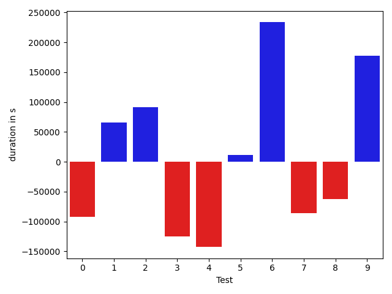

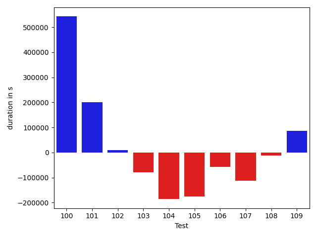

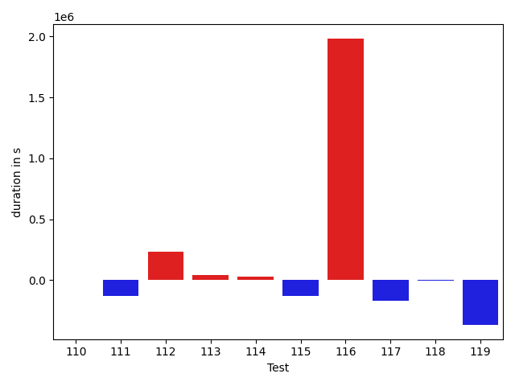

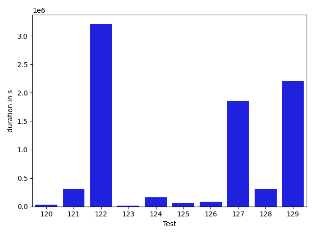

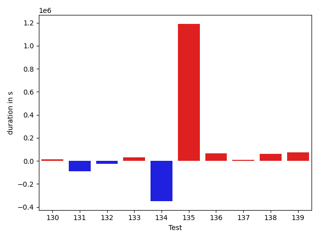

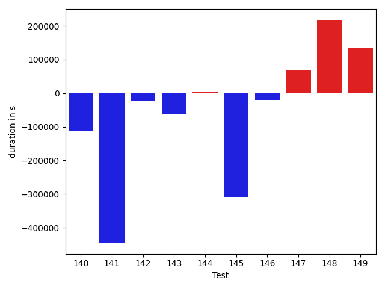

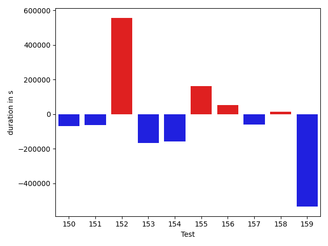

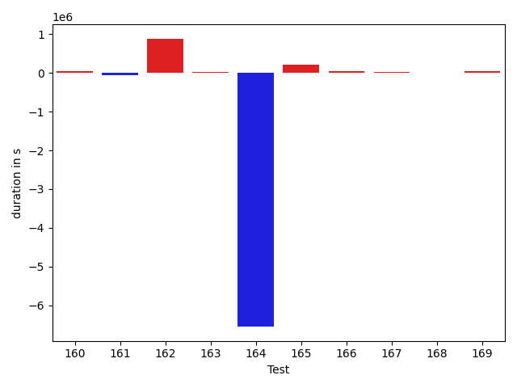

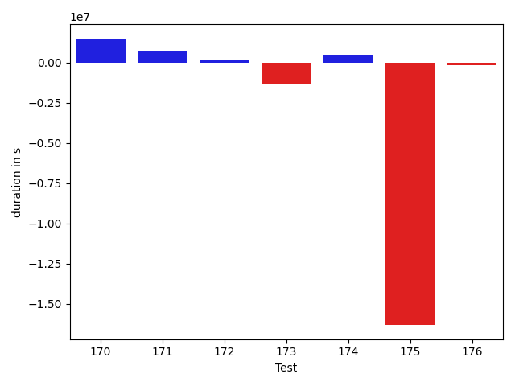

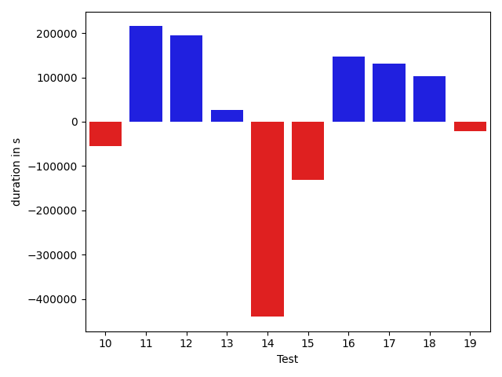

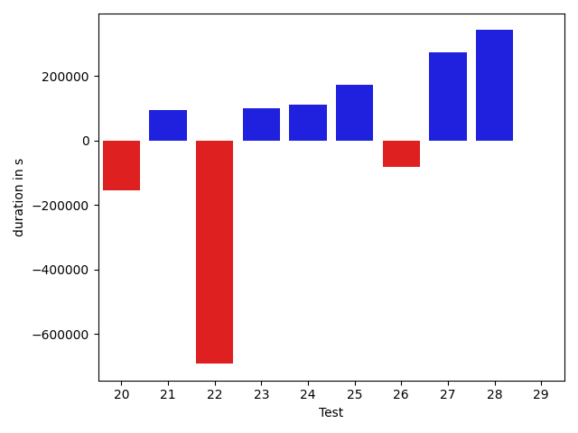

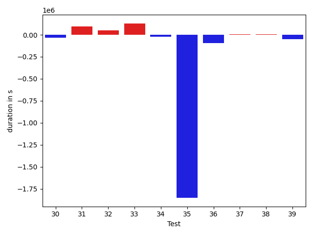

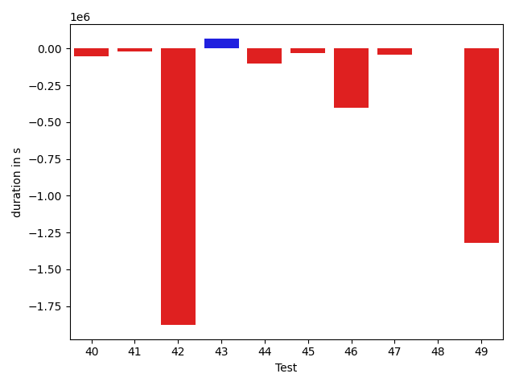

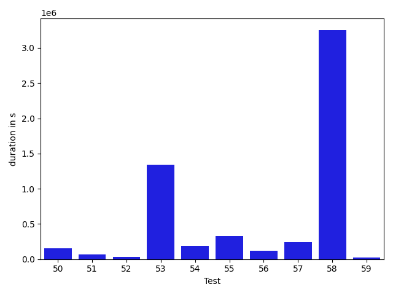

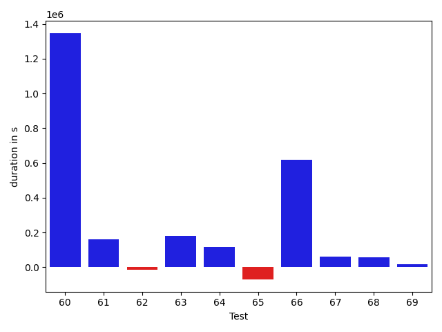

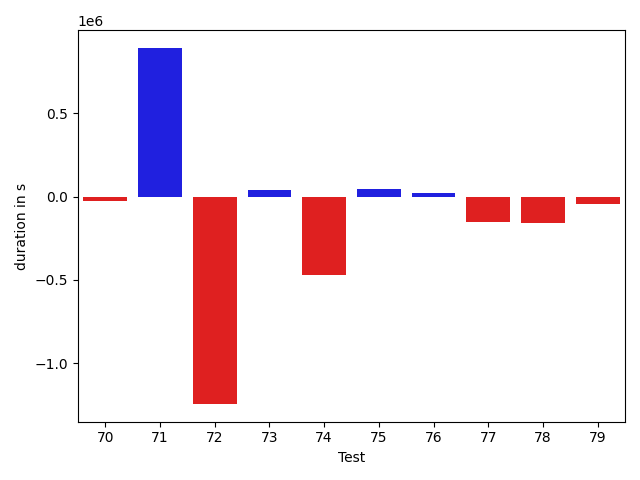

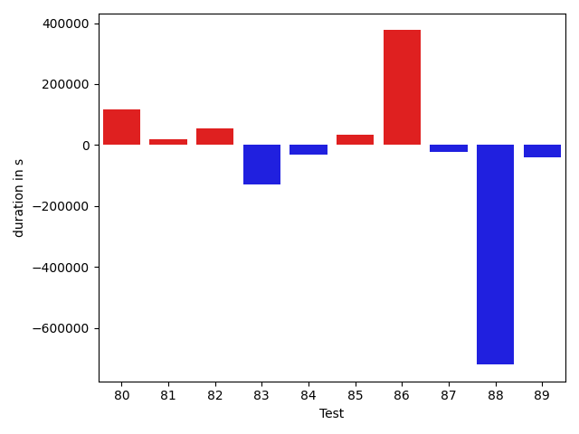

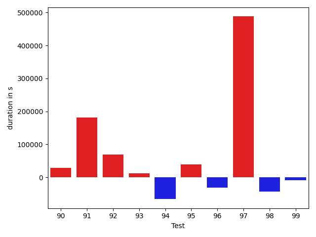

| ID | DurationV1 | DurationsV2 | DeltaDuration |
| --- | --- | --- | --- |
| 0 | 511731.966881752 | 419466.7268676758 | -92265.24001407623 |
| 1 | 470240.71200191975 | 535727.8150162433 | 65487.10301432351 |
| 2 | 398842.52418518066 | 490308.7198371887 | 91466.19565200806 |
| 3 | 670544.1500644684 | 545934.6314591169 | -124609.51860535145 |
| 4 | 637210.8921780717 | 494533.35967819206 | -142677.5324998796 |
| 5 | 1167878.3582946553 | 1179868.3787687013 | 11990.020474046003 |
| 6 | 495091.98709627986 | 729136.3574741401 | 234044.37037786026 |
| 7 | 448441.2347564697 | 362659.78964209557 | -85781.44511437416 |
| 8 | 1259468.8293929964 | 1197253.2821180809 | -62215.5472749155 |
| 9 | 609782.6826184184 | 786999.2272800019 | 177216.5446615835 |
| 10 | 532057.0227901936 | 477584.2388420105 | -54472.78394818306 |
| 11 | 786175.7507514509 | 1001406.7309253556 | 215230.98017390468 |
| 12 | 1128251.5238219032 | 1323011.3180563666 | 194759.79423446348 |
| 13 | 550258.1682130889 | 575926.3108769181 | 25668.14266382926 |
| 14 | 1943310.9562746226 | 1503508.1488283856 | -439802.80744623696 |
| 15 | 962325.9055867622 | 831084.9814477428 | -131240.92413901945 |
| 16 | 943780.5706255685 | 1091427.7403276104 | 147647.1697020419 |
| 17 | 707245.6341350203 | 838847.8977541721 | 131602.26361915178 |
| 18 | 730765.27028746 | 832906.0530791443 | 102140.78279168438 |
| 19 | 810689.4864761292 | 789483.4311635464 | -21206.055312582757 |
| 20 | 1176354.836013731 | 1022713.6108185818 | -153641.2251951493 |
| 21 | 905041.069038976 | 1000043.4550934084 | 95002.38605443237 |
| 22 | 2116034.6716922657 | 1424089.622182521 | -691945.0495097446 |
| 23 | 1086579.2450204038 | 1187278.9437119402 | 100699.69869153644 |
| 24 | 1369081.0392009187 | 1478724.951691052 | 109643.9124901332 |
| 25 | 674193.1164520638 | 846095.364550101 | 171902.2480980372 |
| 26 | 1426689.2788823573 | 1345209.3086821674 | -81479.97020018985 |
| 27 | 1907096.6669942546 | 2178863.045668638 | 271766.3786743833 |
| 28 | 1581351.03900239 | 1922582.388435484 | 341231.3494330938 |
| 29 | 1347276.5307187764 | 1345388.651746553 | -1887.8789722234942 |
| 30 | 2000034.5842193875 | 2260406.2454402577 | 260371.6612208702 |
| 31 | 1900964.9055629452 | 1165944.070152102 | -735020.8354108431 |
| 32 | 1415267.961989533 | 1622839.6896089306 | 207571.7276193977 |
| 33 | 626998.6287255425 | 825568.5146769407 | 198569.8859513983 |
| 34 | 2256295.8419296257 | 3513566.077258584 | 1257270.2353289584 |
| 35 | 1442486.2846277328 | 1305539.460757366 | -136946.8238703669 |
| 36 | 1096942.373790226 | 1082721.4626025935 | -14220.911187632475 |
| 37 | 2153338.849496006 | 1835364.5738998705 | -317974.2755961355 |
| 38 | 507347.5576761067 | 432724.78088724613 | -74622.77678886056 |
| 39 | 1167507.252054635 | 1002873.7036618218 | -164633.5483928132 |
| 40 | 1144714.2751143454 | 1093390.6227419619 | -51323.65237238351 |
| 41 | 1173843.6497812697 | 1153514.4468439016 | -20329.20293736807 |
| 42 | 11149760.382958718 | 9271822.509482985 | -1877937.8734757323 |
| 43 | 634866.9500160813 | 702341.8077328177 | 67474.85771673638 |
| 44 | 1509781.21345982 | 1407599.3403281895 | -102181.87313163048 |
| 45 | 1082448.8164946937 | 1052861.7149566757 | -29587.10153801809 |
| 46 | 1970340.7501339586 | 1568453.8375918164 | -401886.9125421422 |
| 47 | 492714.3520298004 | 449344.4131487608 | -43369.93888103962 |
| 48 | 509648.7090853965 | 513661.92250154726 | 4013.213416150771 |
| 49 | 2360784.201383642 | 1038448.4638590813 | -1322335.7375245607 |
| 50 | 749206.9977592537 | 905501.4227942076 | 156294.42503495386 |
| 51 | 503527.63398789556 | 570369.8013157435 | 66842.16732784791 |
| 52 | 718243.0979269318 | 751481.1411947699 | 33238.043267838075 |
| 53 | 399842.24812984467 | 1743908.189969778 | 1344065.9418399334 |
| 54 | 563011.2008775636 | 754000.6179097735 | 190989.41703220992 |
| 55 | 658950.9747037387 | 987507.3112942848 | 328556.33659054607 |
| 56 | 893678.3292849329 | 1009384.806664766 | 115706.47737983312 |
| 57 | 414554.8016241789 | 658659.2837157622 | 244104.4820915833 |
| 58 | 770634.6375362873 | 4024855.50547266 | 3254220.8679363728 |
| 59 | 674559.3574839539 | 694474.3777271857 | 19915.02024323179 |
| 60 | 1020852.699875144 | 2367450.473269795 | 1346597.773394651 |
| 61 | 849544.7738062714 | 1009885.9891873185 | 160341.2153810471 |
| 62 | 557210.2761529187 | 541652.3212887084 | -15557.954864210333 |
| 63 | 427036.16016504634 | 608443.730540216 | 181407.57037516963 |
| 64 | 1006526.8863646698 | 1121420.5850831321 | 114893.69871846237 |
| 65 | 1774678.9898268094 | 1704713.990135944 | -69964.9996908654 |
| 66 | 1155249.02164099 | 1773597.0838327254 | 618348.0621917355 |
| 67 | 1119676.6583663884 | 1181704.5515542007 | 62027.8931878123 |
| 68 | 846719.9111847599 | 904355.3378659105 | 57635.426681150566 |
| 69 | 1070014.8438916686 | 1087992.354028458 | 17977.51013678941 |
| 70 | 1566699.1565997107 | 1539033.9889734313 | -27665.167626279406 |
| 71 | 2344546.3387954393 | 3236532.966653578 | 891986.6278581386 |
| 72 | 1760257.4412532535 | 516456.4289855957 | -1243801.0122676578 |
| 73 | 373049.8804497719 | 415734.19921875 | 42684.31876897812 |
| 74 | 1408339.2009868643 | 937465.6736422624 | -470873.5273446019 |
| 75 | 388490.3986053467 | 433309.1520276964 | 44818.75342234969 |
| 76 | 465489.1630592346 | 486170.2397994995 | 20681.076740264893 |
| 77 | 562367.1849975586 | 410608.4587402344 | -151758.72625732422 |
| 78 | 582199.4783210754 | 421773.64421081543 | -160425.83411026 |
| 79 | 383628.7235879898 | 340134.7680835724 | -43493.95550441742 |
| 80 | 503884.28271484375 | 363555.27196121216 | -140329.0107536316 |
| 81 | 2030439.2986417534 | 2368006.0249981363 | 337566.72635638295 |
| 82 | 775609.681976676 | 552956.1351730844 | -222653.54680359154 |
| 83 | 408435.6357421875 | 397981.57857871056 | -10454.057163476944 |
| 84 | 2871014.36570468 | 3272781.1274086395 | 401766.76170395967 |
| 85 | 3696188.594927526 | 3715049.8252229327 | 18861.230295406654 |
| 86 | 1231483.5382488943 | 1019549.220286679 | -211934.31796221528 |
| 87 | 1252600.7843106014 | 970337.6444223671 | -282263.1398882343 |
| 88 | 735689.9610472883 | 743384.9341843895 | 7694.973137101275 |
| 89 | 818971.7546199518 | 592576.9707588729 | -226394.7838610789 |
| 90 | 1142754.0931557426 | 1107288.4499483039 | -35465.643207438756 |
| 91 | 405853.74616241455 | 383384.79864501953 | -22468.94751739502 |
| 92 | 2045673.7559434373 | 830656.9672207236 | -1215016.7887227137 |
| 93 | 992043.7309862428 | 759167.2997107499 | -232876.43127549288 |
| 94 | 692627.3046584307 | 574464.0822183369 | -118163.22244009387 |
| 95 | 970173.8155628976 | 855405.8497943603 | -114767.96576853725 |
| 96 | 2276678.720668988 | 2144814.3165617865 | -131864.40410720138 |
| 97 | 1810192.15024084 | 1217884.1134007191 | -592308.0368401208 |
| 98 | 1121041.2873222108 | 1081354.6299645184 | -39686.657357692486 |
| 99 | 857530.3250027632 | 851466.2046754325 | -6064.12032733066 |
| 100 | 578170.382473347 | 1121128.7131246873 | 542958.3306513403 |
| 101 | 757677.7872868459 | 957809.5568472176 | 200131.76956037176 |
| 102 | 563118.9768263286 | 573076.914700415 | 9957.937874086434 |
| 103 | 1203862.1633238767 | 1124362.6137647326 | -79499.54955914407 |
| 104 | 2720318.012309769 | 2534274.1862698523 | -186043.82603991684 |
| 105 | 681678.6439104192 | 505908.33865156 | -175770.30525885918 |
| 106 | 409579.11737060547 | 352972.9334411621 | -56606.18392944336 |
| 107 | 630505.7607811391 | 518129.07688971714 | -112376.683891422 |
| 108 | 464960.11767578125 | 452002.08255290985 | -12958.035122871399 |
| 109 | 1746147.528365288 | 1832947.35566052 | 86799.8272952321 |
| 110 | 1087344.8757400662 | 2668598.318686813 | 1581253.442946747 |
| 111 | 810243.4312120082 | 832836.1839455923 | 22592.752733584028 |
| 112 | 483652.9171514688 | 547480.6721654974 | 63827.75501402863 |
| 113 | 477483.01834592223 | 497791.19619807554 | 20308.177852153312 |
| 114 | 438028.44267845154 | 1122954.8432267904 | 684926.4005483389 |
| 115 | 736318.0776991893 | 948872.7349035959 | 212554.65720440657 |
| 116 | 819420.8501775649 | 841989.7747872632 | 22568.924609698355 |
| 117 | 462632.8801365941 | 475369.50153869425 | 12736.621402100136 |
| 118 | 495436.2347244227 | 503393.2209364176 | 7956.986211994896 |
| 119 | 511328.6142951725 | 509755.9836327657 | -1572.6306624067947 |
| 120 | 521381.8007750511 | 552015.3277318254 | 30633.526956774294 |
| 121 | 1014875.407698038 | 1320468.1231303958 | 305592.71543235774 |
| 122 | 1678965.8230853996 | 4888927.440964463 | 3209961.617879064 |
| 123 | 851342.8499949682 | 864157.7443775393 | 12814.894382571103 |
| 124 | 1070338.6041934872 | 1228199.3685250115 | 157860.76433152426 |
| 125 | 1929412.4959217976 | 1990997.9847078053 | 61585.48878600774 |
| 126 | 940866.9685357995 | 1024668.0088456551 | 83801.0403098556 |
| 127 | 1940090.4767765356 | 3800890.4061485403 | 1860799.9293720047 |
| 128 | 756191.8391548537 | 1063378.6959342605 | 307186.8567794068 |
| 129 | 1315624.5180086652 | 3522785.9442016333 | 2207161.426192968 |
| 130 | 590525.3762489429 | 1015297.9424084623 | 424772.56615951937 |
| 131 | 846831.149333567 | 1015224.148764168 | 168392.99943060102 |
| 132 | 1892734.1337333499 | 18477592.513266735 | 16584858.379533384 |
| 133 | 626292.8382339391 | 819834.079320407 | 193541.24108646787 |
| 134 | 605219.1817957881 | 900975.2696623933 | 295756.08786660514 |
| 135 | 597484.9753437096 | 903413.2527089706 | 305928.277365261 |
| 136 | 637907.0714531322 | 652706.2684582097 | 14799.197005077498 |
| 137 | 757668.1732825334 | 1697737.7692083763 | 940069.5959258429 |
| 138 | 21093312.80769376 | 2581934.3227474913 | -18511378.48494627 |
| 139 | 594798.2796982577 | 762620.0979095867 | 167821.81821132905 |
| 140 | 561649.6252625494 | 482402.11021460267 | -79247.51504794671 |
| 141 | 794264.4080447839 | 770655.6489191449 | -23608.759125638986 |
| 142 | 726543.2917658866 | 621512.2114448089 | -105031.08032107772 |
| 143 | 1086420.7995663434 | 1449291.3164476939 | 362870.5168813504 |
| 144 | 723291.2216884494 | 548479.5468290246 | -174811.67485942482 |
| 145 | 709317.3142822683 | 524050.6759340253 | -185266.63834824297 |
| 146 | 680639.227620588 | 462230.6881275838 | -218408.5394930042 |
| 147 | 1192240.571144117 | 504772.8069713366 | -687467.7641727804 |
| 148 | 510128.5625 | 370959.2415924072 | -139169.32090759277 |
| 149 | 8396082.56656433 | 1210151.5653874846 | -7185931.001176846 |
| 150 | 2882532.098807662 | 1506926.6746010317 | -1375605.42420663 |
| 151 | 2278651.4609527714 | 3599421.5380711146 | 1320770.0771183432 |
| 152 | 2783366.3773431815 | 5757619.5034897495 | 2974253.126146568 |
| 153 | 744860.2187056364 | 822889.7676514594 | 78029.54894582299 |
| 154 | 501630.9638671875 | 348179.2752609253 | -153451.6886062622 |
| 155 | 497293.49266965874 | 15869214.107546011 | 15371920.614876352 |
| 156 | 462918.62642610073 | 421954.4665055275 | -40964.159920573235 |
| 157 | 379777.647139892 | 519825.4047040194 | 140047.75756412745 |
| 158 | 404792.71868133545 | 383506.1841430664 | -21286.534538269043 |
| 159 | 1177813.951443404 | 558278.3561553955 | -619535.5952880085 |
| 160 | 2137705.078735822 | 1459147.784977711 | -678557.2937581108 |
| 161 | 1074181.7595223696 | 923442.9276391328 | -150738.83188323677 |
| 162 | 844532.7062774905 | 1523253.0262133772 | 678720.3199358868 |
| 163 | 716971.2008239755 | 724152.9116663518 | 7181.710842376342 |
| 164 | 1554592.281933334 | 836908.1811737393 | -717684.1007595947 |
| 165 | 16517632.509048462 | 390052.1135253906 | -16127580.395523071 |
| 166 | 9125195.671886383 | 6933063.328811177 | -2192132.3430752056 |
| 167 | 1479144.2830253053 | 1247621.2046100823 | -231523.07841522293 |
| 168 | 645725.6018215418 | 1100593.127746582 | 454867.52592504025 |
| 169 | 1317782.4577776717 | 1034575.0349547998 | -283207.42282287194 |
| 170 | 1303124.7955983342 | 2803967.076550774 | 1500842.2809524396 |
| 171 | 800873.7184572002 | 1526867.1364143859 | 725993.4179571857 |
| 172 | 752068.9585035549 | 890602.1869454375 | 138533.22844188253 |
| 173 | 2833376.7586994767 | 1507897.5666596293 | -1325479.1920398474 |
| 174 | 1174835.0926542282 | 1690350.4549331665 | 515515.3622789383 |
| 175 | 16869497.92347894 | 557702.1923185298 | -16311795.73116041 |
| 176 | 615776.7711316645 | 473674.558803916 | -142102.21232774854 |

## Misc.

| ID | Test Class | Test Method |
| --- | --- | --- |
| 0 | com.google.gson.functional.TypeAdapterPrecedenceTest | testStreamingFollowedByNonstreaming |
| 1 | com.google.gson.functional.TypeAdapterPrecedenceTest | testNonstreamingHierarchicalFollowedByNonstreaming |
| 2 | com.google.gson.functional.TypeAdapterPrecedenceTest | testStreamingHierarchicalFollowedByNonstreaming |
| 3 | com.google.gson.functional.TypeAdapterPrecedenceTest | testSerializeNonstreamingTypeAdapterFollowedByStreamingTypeAdapter |
| 4 | com.google.gson.functional.TypeAdapterPrecedenceTest | testStreamingHierarchicalFollowedByNonstreamingHierarchical |
| 5 | com.google.gson.functional.TypeAdapterPrecedenceTest | testNonstreamingFollowedByNonstreaming |
| 6 | com.google.gson.functional.TypeAdapterPrecedenceTest | testStreamingFollowedByStreaming |
| 7 | com.google.gson.functional.TypeAdapterPrecedenceTest | testStreamingFollowedByNonstreamingHierarchical |
| 8 | com.google.gson.functional.CustomTypeAdaptersTest | testCustomAdapterInvokedForCollectionElementDeserialization |
| 9 | com.google.gson.functional.CustomTypeAdaptersTest | testCustomTypeAdapterAppliesToSubClassesSerializedAsBaseClass |
| 10 | com.google.gson.functional.CustomTypeAdaptersTest | testCustomAdapterInvokedForMapElementSerialization |
| 11 | com.google.gson.functional.CustomTypeAdaptersTest | testCustomNestedDeserializers |
| 12 | com.google.gson.functional.CustomTypeAdaptersTest | testCustomTypeAdapterDoesNotAppliesToSubClasses |
| 13 | com.google.gson.functional.CustomTypeAdaptersTest | testCustomAdapterInvokedForCollectionElementSerialization |
| 14 | com.google.gson.functional.CustomTypeAdaptersTest | testCustomAdapterInvokedForCollectionElementSerializationWithType |
| 15 | com.google.gson.functional.CustomTypeAdaptersTest | testCustomDeserializers |
| 16 | com.google.gson.functional.CustomTypeAdaptersTest | testCustomByteArrayDeserializerAndInstanceCreator |
| 17 | com.google.gson.functional.CustomTypeAdaptersTest | testCustomByteArraySerializer |
| 18 | com.google.gson.functional.CustomTypeAdaptersTest | testCustomSerializerInvokedForPrimitives |
| 19 | com.google.gson.functional.CustomTypeAdaptersTest | testCustomAdapterInvokedForMapElementDeserialization |
| 20 | com.google.gson.functional.CustomTypeAdaptersTest | testCustomAdapterInvokedForMapElementSerializationWithType |
| 21 | com.google.gson.functional.CustomTypeAdaptersTest | testCustomNestedSerializers |
| 22 | com.google.gson.functional.CustomTypeAdaptersTest | testRegisterHierarchyAdapterForDate |
| 23 | com.google.gson.functional.CustomTypeAdaptersTest | testEnsureCustomSerializerNotInvokedForNullValues |
| 24 | com.google.gson.functional.CustomTypeAdaptersTest | testEnsureCustomDeserializerNotInvokedForNullValues |
| 25 | com.google.gson.functional.CustomTypeAdaptersTest | testCustomDeserializerInvokedForPrimitives |
| 26 | com.google.gson.functional.CustomTypeAdaptersTest | testCustomSerializers |
| 27 | com.google.gson.functional.StreamingTypeAdaptersTest | testNullSafe |
| 28 | com.google.gson.functional.StreamingTypeAdaptersTest | testSerializeWithCustomTypeAdapter |
| 29 | com.google.gson.functional.StreamingTypeAdaptersTest | testDeserializeWithCustomTypeAdapter |
| 30 | com.google.gson.functional.InstanceCreatorTest | testInstanceCreatorForParametrizedType |
| 31 | com.google.gson.functional.InstanceCreatorTest | testInstanceCreatorReturnsSubTypeForField |
| 32 | com.google.gson.functional.InstanceCreatorTest | testInstanceCreatorForCollectionType |
| 33 | com.google.gson.functional.InstanceCreatorTest | testInstanceCreatorReturnsSubTypeForTopLevelObject |
| 34 | com.google.gson.functional.InstanceCreatorTest | testInstanceCreatorReturnsBaseType |
| 35 | com.google.gson.functional.DefaultTypeAdaptersTest | testDateSerializationWithPatternNotOverridenByTypeAdapter |
| 36 | com.google.gson.functional.DefaultTypeAdaptersTest | testDateSerializationWithPattern |
| 37 | com.google.gson.functional.DefaultTypeAdaptersTest | testOverrideBigIntegerTypeAdapter |
| 38 | com.google.gson.functional.DefaultTypeAdaptersTest | testDefaultGregorianCalendarDeserialization |
| 39 | com.google.gson.functional.DefaultTypeAdaptersTest | testSqlDateSerialization |
| 40 | com.google.gson.functional.DefaultTypeAdaptersTest | testClassSerialization |
| 41 | com.google.gson.functional.DefaultTypeAdaptersTest | testTimestampSerialization |
| 42 | com.google.gson.functional.DefaultTypeAdaptersTest | testDefaultDateDeserializationUsingBuilder |
| 43 | com.google.gson.functional.DefaultTypeAdaptersTest | testDefaultCalendarSerialization |
| 44 | com.google.gson.functional.DefaultTypeAdaptersTest | testOverrideBigDecimalTypeAdapter |
| 45 | com.google.gson.functional.DefaultTypeAdaptersTest | testDateDeserializationWithPattern |
| 46 | com.google.gson.functional.DefaultTypeAdaptersTest | testDateSerializationInCollection |
| 47 | com.google.gson.functional.DefaultTypeAdaptersTest | testDefaultGregorianCalendarSerialization |
| 48 | com.google.gson.functional.DefaultTypeAdaptersTest | testDefaultCalendarDeserialization |
| 49 | com.google.gson.functional.DefaultTypeAdaptersTest | testClassDeserialization |
| 50 | com.google.gson.functional.NullObjectAndFieldTest | testCustomTypeAdapterPassesNullSerialization |
| 51 | com.google.gson.functional.NullObjectAndFieldTest | testExplicitDeserializationOfNulls |
| 52 | com.google.gson.functional.NullObjectAndFieldTest | testCustomTypeAdapterPassesNullDesrialization |
| 53 | com.google.gson.functional.NullObjectAndFieldTest | testTopLevelNullObjectDeserialization |
| 54 | com.google.gson.functional.NullObjectAndFieldTest | testExplicitSerializationOfNullCollectionMembers |
| 55 | com.google.gson.functional.NullObjectAndFieldTest | testCustomSerializationOfNulls |
| 56 | com.google.gson.functional.NullObjectAndFieldTest | testPrintPrintingObjectWithNulls |
| 57 | com.google.gson.functional.NullObjectAndFieldTest | testPrintPrintingArraysWithNulls |
| 58 | com.google.gson.functional.NullObjectAndFieldTest | testTopLevelNullObjectSerialization |
| 59 | com.google.gson.functional.NullObjectAndFieldTest | testNullWrappedPrimitiveMemberSerialization |
| 60 | com.google.gson.functional.NullObjectAndFieldTest | testExplicitSerializationOfNullArrayMembers |
| 61 | com.google.gson.functional.NullObjectAndFieldTest | testExplicitSerializationOfNulls |
| 62 | com.google.gson.functional.NullObjectAndFieldTest | testExplicitSerializationOfNullStringMembers |
| 63 | com.google.gson.functional.NullObjectAndFieldTest | testNullWrappedPrimitiveMemberDeserialization |
| 64 | com.google.gson.functional.MapTest | testSerializeMaps |
| 65 | com.google.gson.functional.MapTest | testInterfaceTypeMapWithSerializer |
| 66 | com.google.gson.functional.MapTest | testMapSerializationWithNullValuesSerialized |
| 67 | com.google.gson.functional.MapTest | testMapSubclassDeserialization |
| 68 | com.google.gson.functional.MapTest | testCustomSerializerForSpecificMapType |
| 69 | com.google.gson.functional.MapTest | testGeneralMapField |
| 70 | com.google.gson.functional.MapTest | testMapSerializationWithNullValueButSerializeNulls |
| 71 | com.google.gson.functional.MapTest | testInterfaceTypeMap |
| 72 | com.google.gson.functional.PrimitiveTest | testLongAsStringDeserialization |
| 73 | com.google.gson.functional.PrimitiveTest | testNegativeInfinitySerialization |
| 74 | com.google.gson.functional.PrimitiveTest | testDoubleNaNSerialization |
| 75 | com.google.gson.functional.PrimitiveTest | testHtmlCharacterSerialization |
| 76 | com.google.gson.functional.PrimitiveTest | testLongAsStringSerialization |
| 77 | com.google.gson.functional.PrimitiveTest | testDoubleInfinitySerialization |
| 78 | com.google.gson.functional.PrimitiveTest | testFloatNaNSerialization |
| 79 | com.google.gson.functional.PrimitiveTest | testNegativeInfinityFloatSerialization |
| 80 | com.google.gson.functional.PrimitiveTest | testFloatInfinitySerialization |
| 81 | com.google.gson.functional.FieldExclusionTest | testDefaultInnerClassExclusion |
| 82 | com.google.gson.functional.FieldExclusionTest | testDefaultNestedStaticClassIncluded |
| 83 | com.google.gson.functional.FieldExclusionTest | testInnerClassExclusion |
| 84 | com.google.gson.functional.EnumTest | testEnumSubclassWithRegisteredTypeAdapter |
| 85 | com.google.gson.functional.VersioningTest | testVersionedUntilSerialization |
| 86 | com.google.gson.functional.VersioningTest | testVersionedGsonWithUnversionedClassesSerialization |
| 87 | com.google.gson.functional.VersioningTest | testVersionedClassesSerialization |
| 88 | com.google.gson.functional.VersioningTest | testIgnoreLaterVersionClassSerialization |
| 89 | com.google.gson.functional.VersioningTest | testVersionedClassesDeserialization |
| 90 | com.google.gson.functional.VersioningTest | testVersionedGsonMixingSinceAndUntilSerialization |
| 91 | com.google.gson.functional.VersioningTest | testIgnoreLaterVersionClassDeserialization |
| 92 | com.google.gson.functional.VersioningTest | testVersionedUntilDeserialization |
| 93 | com.google.gson.functional.VersioningTest | testVersionedGsonMixingSinceAndUntilDeserialization |
| 94 | com.google.gson.functional.VersioningTest | testVersionedGsonWithUnversionedClassesDeserialization |
| 95 | com.google.gson.functional.MapAsArrayTypeAdapterTest | testMultipleEnableComplexKeyRegistrationHasNoEffect |
| 96 | com.google.gson.functional.MapAsArrayTypeAdapterTest | testSerializeComplexMapWithTypeAdapter |
| 97 | com.google.gson.functional.MapAsArrayTypeAdapterTest | testTwoTypesCollapseToOneDeserialize |
| 98 | com.google.gson.functional.MapAsArrayTypeAdapterTest | testMapWithTypeVariableSerialization |
| 99 | com.google.gson.functional.MapAsArrayTypeAdapterTest | testMapWithTypeVariableDeserialization |
| 100 | com.google.gson.functional.ExclusionStrategyFunctionalTest | testExclusionStrategyWithMode |
| 101 | com.google.gson.functional.ExclusionStrategyFunctionalTest | testExclusionStrategySerializationDoesNotImpactDeserialization |
| 102 | com.google.gson.functional.ExclusionStrategyFunctionalTest | testExcludeTopLevelClassDeserializationDoesNotImpactSerialization |
| 103 | com.google.gson.functional.ExclusionStrategyFunctionalTest | testExclusionStrategyDeserialization |
| 104 | com.google.gson.functional.ExclusionStrategyFunctionalTest | testExclusionStrategySerialization |
| 105 | com.google.gson.functional.ExclusionStrategyFunctionalTest | testExclusionStrategySerializationDoesNotImpactSerialization |
| 106 | com.google.gson.functional.ExclusionStrategyFunctionalTest | testExcludeTopLevelClassDeserialization |
| 107 | com.google.gson.functional.ExclusionStrategyFunctionalTest | testExcludeTopLevelClassSerializationDoesNotImpactDeserialization |
| 108 | com.google.gson.functional.ExclusionStrategyFunctionalTest | testExcludeTopLevelClassSerialization |
| 109 | com.google.gson.functional.NamingPolicyTest | testGsonDuplicateNameUsingSerializedNameFieldNamingPolicySerialization |
| 110 | com.google.gson.functional.NamingPolicyTest | testGsonWithNonDefaultFieldNamingPolicyDeserialiation |
| 111 | com.google.gson.functional.NamingPolicyTest | testDeprecatedNamingStrategy |
| 112 | com.google.gson.functional.NamingPolicyTest | testGsonWithUpperCamelCaseSpacesPolicySerialiation |
| 113 | com.google.gson.functional.NamingPolicyTest | testGsonWithLowerCaseDashPolicyDeserialiation |
| 114 | com.google.gson.functional.NamingPolicyTest | testGsonWithSerializedNameFieldNamingPolicyDeserialization |
| 115 | com.google.gson.functional.NamingPolicyTest | testGsonWithSerializedNameFieldNamingPolicySerialization |
| 116 | com.google.gson.functional.NamingPolicyTest | testGsonWithNonDefaultFieldNamingPolicySerialization |
| 117 | com.google.gson.functional.NamingPolicyTest | testGsonWithUpperCamelCaseSpacesPolicyDeserialiation |
| 118 | com.google.gson.functional.NamingPolicyTest | testGsonWithLowerCaseDashPolicySerialization |
| 119 | com.google.gson.functional.NamingPolicyTest | testGsonWithLowerCaseUnderscorePolicySerialization |
| 120 | com.google.gson.functional.NamingPolicyTest | testGsonWithLowerCaseUnderscorePolicyDeserialiation |
| 121 | com.google.gson.functional.JavaUtilConcurrentAtomicTest | testAtomicLongWithStringSerializationPolicy |
| 122 | com.google.gson.functional.JavaUtilConcurrentAtomicTest | testAtomicLongArrayWithStringSerializationPolicy |
| 123 | com.google.gson.functional.ParameterizedTypesTest | testParameterizedTypeWithReaderDeserialization |
| 124 | com.google.gson.functional.ParameterizedTypesTest | testParameterizedTypeWithCustomSerializer |
| 125 | com.google.gson.functional.ParameterizedTypesTest | testParameterizedTypeDeserialization |
| 126 | com.google.gson.functional.ParameterizedTypesTest | testParameterizedTypesWithCustomDeserializer |
| 127 | com.google.gson.functional.CustomDeserializerTest | testJsonTypeFieldBasedDeserialization |
| 128 | com.google.gson.functional.CustomDeserializerTest | testCustomDeserializerReturnsNullForArrayElements |
| 129 | com.google.gson.functional.CustomDeserializerTest | testCustomDeserializerReturnsNull |
| 130 | com.google.gson.functional.CustomDeserializerTest | testCustomDeserializerReturnsNullForTopLevelObject |
| 131 | com.google.gson.functional.CustomDeserializerTest | testCustomDeserializerReturnsNullForArrayElementsForArrayField |
| 132 | com.google.gson.functional.FieldNamingTest | testIdentity |
| 133 | com.google.gson.functional.FieldNamingTest | testLowerCaseWithUnderscores |
| 134 | com.google.gson.functional.FieldNamingTest | testUpperCamelCaseWithSpaces |
| 135 | com.google.gson.functional.FieldNamingTest | testLowerCaseWithDashes |
| 136 | com.google.gson.functional.FieldNamingTest | testUpperCamelCase |
| 137 | com.google.gson.functional.EscapingTest | testGsonAcceptsEscapedAndNonEscapedJsonDeserialization |
| 138 | com.google.gson.functional.CustomSerializerTest | testSubClassSerializerInvokedForBaseClassFieldsHoldingSubClassInstances |
| 139 | com.google.gson.functional.CustomSerializerTest | testBaseClassSerializerInvokedForBaseClassFieldsHoldingSubClassInstances |
| 140 | com.google.gson.functional.CustomSerializerTest | testBaseClassSerializerInvokedForBaseClassFields |
| 141 | com.google.gson.functional.CustomSerializerTest | testSubClassSerializerInvokedForBaseClassFieldsHoldingArrayOfSubClassInstances |
| 142 | com.google.gson.functional.CustomSerializerTest | testSerializerReturnsNull |
| 143 | com.google.gson.functional.CollectionTest | testUserCollectionTypeAdapter |
| 144 | com.google.gson.functional.SecurityTest | testJsonWithNonExectuableTokenWithConfiguredGsonDeserialization |
| 145 | com.google.gson.functional.SecurityTest | testNonExecutableJsonDeserialization |
| 146 | com.google.gson.functional.SecurityTest | testJsonWithNonExectuableTokenWithRegularGsonDeserialization |
| 147 | com.google.gson.functional.SecurityTest | testNonExecutableJsonSerialization |
| 148 | com.google.gson.functional.SecurityTest | testJsonWithNonExectuableTokenSerialization |
| 149 | com.google.gson.functional.JsonAdapterAnnotationOnFieldsTest | testRegisteredTypeAdapterTakesPrecedenceOverClassAnnotationAdapter |
| 150 | com.google.gson.functional.JsonAdapterAnnotationOnFieldsTest | testFieldAnnotationTakesPrecedenceOverRegisteredTypeAdapter |
| 151 | com.google.gson.functional.UncategorizedTest | testReturningDerivedClassesDuringDeserialization |
| 152 | com.google.gson.functional.TypeHierarchyAdapterTest | testTypeHierarchy |
| 153 | com.google.gson.functional.TypeHierarchyAdapterTest | testRegisterSuperTypeFirst |
| 154 | com.google.gson.functional.TypeHierarchyAdapterTest | testRegisterSubTypeFirstAllowed |
| 155 | com.google.gson.OverrideCoreTypeAdaptersTest | testOverrideWrapperBooleanAdapter |
| 156 | com.google.gson.OverrideCoreTypeAdaptersTest | testOverrideStringAdapter |
| 157 | com.google.gson.OverrideCoreTypeAdaptersTest | testOverridePrimitiveBooleanAdapter |
| 158 | com.google.gson.functional.ReadersWritersTest | testTopLevelNullObjectSerializationWithWriterAndSerializeNulls |
| 159 | com.google.gson.functional.ReadersWritersTest | testTopLevelNullObjectDeserializationWithReaderAndSerializeNulls |
| 160 | com.google.gson.GsonTypeAdapterTest | testDeserializerForAbstractClass |
| 161 | com.google.gson.MixedStreamTest | testWriteHtmlSafe |
| 162 | com.google.gson.MixedStreamTest | testWriteLenient |
| 163 | com.google.gson.GsonBuilderTest | testTransientFieldExclusion |
| 164 | com.google.gson.GsonBuilderTest | testExcludeFieldsWithModifiers |
| 165 | com.google.gson.GsonBuilderTest | testCreatingMoreThanOnce |
| 166 | com.google.gson.functional.CircularReferenceTest | testSelfReferenceCustomHandlerSerialization |
| 167 | com.google.gson.functional.ObjectTest | testInnerClassDeserialization |
| 168 | com.google.gson.functional.ObjectTest | testJsonObjectSerialization |
| 169 | com.google.gson.functional.ObjectTest | testAnonymousLocalClassesCustomSerialization |
| 170 | com.google.gson.functional.JsonAdapterAnnotationOnClassesTest | testRegisteredSerializerOverridesJsonAdapter |
| 171 | com.google.gson.functional.JsonAdapterAnnotationOnClassesTest | testRegisteredAdapterOverridesJsonAdapter |
| 172 | com.google.gson.functional.JsonAdapterAnnotationOnClassesTest | testRegisteredDeserializerOverridesJsonAdapter |
| 173 | com.google.gson.functional.ArrayTest | testNullsInArrayWithSerializeNullPropertySetSerialization |
| 174 | com.google.gson.functional.PrintFormattingTest | testJsonObjectWithNullValuesSerialized |
| 175 | com.google.gson.LongSerializationPolicyTest | testDefaultLongSerializationIntegration |
| 176 | com.google.gson.LongSerializationPolicyTest | testStringLongSerializationIntegration |

| Test | IterationV1 | IterationV2 | DeltaIteration |
| --- | --- | --- | --- |
| 0 | 21 | 16 | -5 |
| 1 | 24 | 33 | 9 |
| 2 | 17 | 21 | 4 |
| 3 | 21 | 24 | 3 |
| 4 | 31 | 29 | -2 |
| 5 | 89 | 86 | -3 |
| 6 | 28 | 42 | 14 |
| 7 | 18 | 24 | 6 |
| 8 | 79 | 78 | -1 |
| 9 | 46 | 39 | -7 |
| 10 | 23 | 20 | -3 |
| 11 | 55 | 55 | 0 |
| 12 | 90 | 90 | 0 |
| 13 | 38 | 45 | 7 |
| 14 | 97 | 97 | 0 |
| 15 | 60 | 54 | -6 |
| 16 | 68 | 69 | 1 |
| 17 | 51 | 44 | -7 |
| 18 | 42 | 38 | -4 |
| 19 | 58 | 62 | 4 |
| 20 | 53 | 54 | 1 |
| 21 | 63 | 65 | 2 |
| 22 | 66 | 81 | 15 |
| 23 | 90 | 90 | 0 |
| 24 | 63 | 70 | 7 |
| 25 | 47 | 49 | 2 |
| 26 | 67 | 64 | -3 |
| 27 | 98 | 97 | -1 |
| 28 | 88 | 94 | 6 |
| 29 | 97 | 97 | 0 |
| 30 | 99 | 99 | 0 |
| 31 | 69 | 66 | -3 |
| 32 | 99 | 99 | 0 |
| 33 | 51 | 53 | 2 |
| 34 | 69 | 67 | -2 |
| 35 | 95 | 97 | 2 |
| 36 | 89 | 89 | 0 |
| 37 | 99 | 99 | 0 |
| 38 | 25 | 25 | 0 |
| 39 | 76 | 82 | 6 |
| 40 | 60 | 63 | 3 |
| 41 | 95 | 94 | -1 |
| 42 | 99 | 99 | 0 |
| 43 | 26 | 32 | 6 |
| 44 | 99 | 99 | 0 |
| 45 | 80 | 86 | 6 |
| 46 | 99 | 99 | 0 |
| 47 | 23 | 25 | 2 |
| 48 | 32 | 30 | -2 |
| 49 | 32 | 21 | -11 |
| 50 | 45 | 35 | -10 |
| 51 | 37 | 40 | 3 |
| 52 | 46 | 54 | 8 |
| 53 | 20 | 24 | 4 |
| 54 | 38 | 39 | 1 |
| 55 | 52 | 60 | 8 |
| 56 | 55 | 60 | 5 |
| 57 | 24 | 28 | 4 |
| 58 | 24 | 22 | -2 |
| 59 | 37 | 40 | 3 |
| 60 | 92 | 84 | -8 |
| 61 | 47 | 51 | 4 |
| 62 | 42 | 32 | -10 |
| 63 | 31 | 26 | -5 |
| 64 | 74 | 80 | 6 |
| 65 | 99 | 99 | 0 |
| 66 | 86 | 84 | -2 |
| 67 | 87 | 88 | 1 |
| 68 | 57 | 59 | 2 |
| 69 | 74 | 82 | 8 |
| 70 | 71 | 67 | -4 |
| 71 | 99 | 99 | 0 |
| 72 | 34 | 17 | -17 |
| 73 | 22 | 9 | -13 |
| 74 | 40 | 40 | 0 |
| 75 | 17 | 25 | 8 |
| 76 | 19 | 18 | -1 |
| 77 | 18 | 14 | -4 |
| 78 | 20 | 17 | -3 |
| 79 | 22 | 22 | 0 |
| 80 | 14 | 20 | 6 |
| 81 | 88 | 79 | -9 |
| 82 | 37 | 40 | 3 |
| 83 | 11 | 23 | 12 |
| 84 | 99 | 99 | 0 |
| 85 | 99 | 99 | 0 |
| 86 | 44 | 53 | 9 |
| 87 | 66 | 65 | -1 |
| 88 | 47 | 47 | 0 |
| 89 | 38 | 44 | 6 |
| 90 | 81 | 83 | 2 |
| 91 | 18 | 18 | 0 |
| 92 | 35 | 25 | -10 |
| 93 | 48 | 43 | -5 |
| 94 | 38 | 31 | -7 |
| 95 | 78 | 79 | 1 |
| 96 | 99 | 99 | 0 |
| 97 | 75 | 67 | -8 |
| 98 | 85 | 88 | 3 |
| 99 | 68 | 75 | 7 |
| 100 | 41 | 52 | 11 |
| 101 | 55 | 39 | -16 |
| 102 | 33 | 30 | -3 |
| 103 | 53 | 58 | 5 |
| 104 | 99 | 99 | 0 |
| 105 | 41 | 34 | -7 |
| 106 | 22 | 15 | -7 |
| 107 | 27 | 40 | 13 |
| 108 | 12 | 21 | 9 |
| 109 | 90 | 89 | -1 |
| 110 | 47 | 46 | -1 |
| 111 | 56 | 56 | 0 |
| 112 | 31 | 33 | 2 |
| 113 | 28 | 32 | 4 |
| 114 | 21 | 26 | 5 |
| 115 | 63 | 55 | -8 |
| 116 | 42 | 46 | 4 |
| 117 | 35 | 34 | -1 |
| 118 | 34 | 32 | -2 |
| 119 | 31 | 28 | -3 |
| 120 | 23 | 28 | 5 |
| 121 | 54 | 66 | 12 |
| 122 | 99 | 99 | 0 |
| 123 | 74 | 71 | -3 |
| 124 | 89 | 90 | 1 |
| 125 | 96 | 99 | 3 |
| 126 | 87 | 78 | -9 |
| 127 | 99 | 99 | 0 |
| 128 | 53 | 51 | -2 |
| 129 | 70 | 65 | -5 |
| 130 | 37 | 38 | 1 |
| 131 | 68 | 74 | 6 |
| 132 | 91 | 91 | 0 |
| 133 | 38 | 40 | 2 |
| 134 | 40 | 42 | 2 |
| 135 | 47 | 42 | -5 |
| 136 | 42 | 54 | 12 |
| 137 | 64 | 74 | 10 |
| 138 | 68 | 72 | 4 |
| 139 | 42 | 50 | 8 |
| 140 | 34 | 32 | -2 |
| 141 | 59 | 60 | 1 |
| 142 | 41 | 36 | -5 |
| 143 | 86 | 79 | -7 |
| 144 | 25 | 36 | 11 |
| 145 | 27 | 33 | 6 |
| 146 | 36 | 32 | -4 |
| 147 | 56 | 55 | -1 |
| 148 | 10 | 18 | 8 |
| 149 | 94 | 92 | -2 |
| 150 | 99 | 99 | 0 |
| 151 | 99 | 99 | 0 |
| 152 | 99 | 99 | 0 |
| 153 | 39 | 41 | 2 |
| 154 | 12 | 18 | 6 |
| 155 | 29 | 33 | 4 |
| 156 | 24 | 21 | -3 |
| 157 | 27 | 26 | -1 |
| 158 | 17 | 15 | -2 |
| 159 | 27 | 17 | -10 |
| 160 | 98 | 99 | 1 |
| 161 | 72 | 62 | -10 |
| 162 | 72 | 75 | 3 |
| 163 | 39 | 43 | 4 |
| 164 | 56 | 47 | -9 |
| 165 | 17 | 13 | -4 |
| 166 | 99 | 99 | 0 |
| 167 | 90 | 85 | -5 |
| 168 | 26 | 15 | -11 |
| 169 | 71 | 81 | 10 |
| 170 | 97 | 91 | -6 |
| 171 | 66 | 61 | -5 |
| 172 | 63 | 50 | -13 |
| 173 | 25 | 26 | 1 |
| 174 | 23 | 20 | -3 |
| 175 | 36 | 31 | -5 |
| 176 | 28 | 25 | -3 |

| Time Label | Time (s) |
| --- | --- |
| Selection | 34.258931398391724 |
| Injection | 19.776496648788452 |
| Total | 1515.185783147812 |

